# Graph Problem Solving Playbook

> A structured competitive-programming guide for solving **Graph** problems.
>
> Goal: formulate the problem as nodes + edges + costs, then choose the correct traversal, shortest path, ordering, component, or MST framework.

---

# Clickable Index

- [0. Master Map](#0-master-map)
- [1. Graph Formulation Idea](#1-graph-formulation-idea)
  - [1.1 The Four Questions](#11-the-four-questions)
  - [1.2 How to Recognize Nodes](#12-how-to-recognize-nodes)
  - [1.3 How to Recognize Edges](#13-how-to-recognize-edges)
  - [1.4 How to Recognize Edge Cost](#14-how-to-recognize-edge-cost)
  - [1.5 State Graph Formulation](#15-state-graph-formulation)
  - [1.6 Super Node Formulation](#16-super-node-formulation)
- [2. Concepts](#2-concepts)
  - [2.1 Graph Basics](#21-graph-basics)
  - [2.2 Directed vs Undirected](#22-directed-vs-undirected)
  - [2.3 Weighted vs Unweighted](#23-weighted-vs-unweighted)
  - [2.4 Sparse vs Dense](#24-sparse-vs-dense)
  - [2.5 Paths Cycles Components](#25-paths-cycles-components)
  - [2.6 Trees and DAGs](#26-trees-and-dags)
  - [2.7 Graph Representations](#27-graph-representations)
- [3. Frameworks With Templates and Examples](#3-frameworks-with-templates-and-examples)
  - [3.1 DFS Framework](#31-dfs-framework)
  - [3.2 BFS Framework](#32-bfs-framework)
  - [3.3 Grid Graph Framework](#33-grid-graph-framework)
  - [3.4 Connected Components Framework](#34-connected-components-framework)
  - [3.5 Bipartite Framework](#35-bipartite-framework)
  - [3.6 Cycle Detection Framework](#36-cycle-detection-framework)
  - [3.7 Multi-Source BFS Framework](#37-multi-source-bfs-framework)
  - [3.8 Topological Sort Framework](#38-topological-sort-framework)
  - [3.9 DAG DP Framework](#39-dag-dp-framework)
  - [3.10 Shortest Path Selection Framework](#310-shortest-path-selection-framework)
  - [3.11 0-1 BFS Framework](#311-0-1-bfs-framework)
  - [3.12 Dijkstra Framework](#312-dijkstra-framework)
  - [3.13 Bellman-Ford Framework](#313-bellman-ford-framework)
  - [3.14 Floyd-Warshall Framework](#314-floyd-warshall-framework)
  - [3.15 DSU Framework](#315-dsu-framework)
  - [3.16 MST Kruskal Framework](#316-mst-kruskal-framework)
  - [3.17 SCC Framework](#317-scc-framework)
  - [3.18 LCA Tree Framework](#318-lca-tree-framework)
- [4. Problem Forms](#4-problem-forms)
  - [4.1 Reachability](#41-reachability)
  - [4.2 Number of Components](#42-number-of-components)
  - [4.3 Shortest Path in Unweighted Graph](#43-shortest-path-in-unweighted-graph)
  - [4.4 Shortest Path in Grid](#44-shortest-path-in-grid)
  - [4.5 Nearest Source](#45-nearest-source)
  - [4.6 Wall Breaking](#46-wall-breaking)
  - [4.7 Course Schedule Dependencies](#47-course-schedule-dependencies)
  - [4.8 Longest Path in DAG](#48-longest-path-in-dag)
  - [4.9 Weighted Shortest Path](#49-weighted-shortest-path)
  - [4.10 Negative Edge Shortest Path](#410-negative-edge-shortest-path)
  - [4.11 All-Pairs Shortest Path](#411-all-pairs-shortest-path)
  - [4.12 Minimum Spanning Tree](#412-minimum-spanning-tree)
  - [4.13 Graph With Node Cost](#413-graph-with-node-cost)
  - [4.14 Strongly Connected Components](#414-strongly-connected-components)
  - [4.15 Tree Diameter](#415-tree-diameter)
  - [4.16 Tree DP](#416-tree-dp)
- [5. Tactics](#5-tactics)
  - [5.1 Algorithm Recognition Table](#51-algorithm-recognition-table)
  - [5.2 Representation Tactics](#52-representation-tactics)
  - [5.3 Visited and Distance Tactics](#53-visited-and-distance-tactics)
  - [5.4 Grid Tactics](#54-grid-tactics)
  - [5.5 State Expansion Tactics](#55-state-expansion-tactics)
  - [5.6 Shortest Path Tactics](#56-shortest-path-tactics)
  - [5.7 Cycle Tactics](#57-cycle-tactics)
  - [5.8 Topological Tactics](#58-topological-tactics)
  - [5.9 MST Tactics](#59-mst-tactics)
  - [5.10 Common Mistakes](#510-common-mistakes)
- [6. C++ Template Library](#6-c-template-library)
- [7. Final Checklist](#7-final-checklist)
- [8. Memory Hooks](#8-memory-hooks)

---

# 0. Master Map

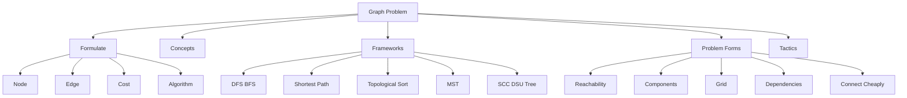

---

# 1. Graph Formulation Idea

## 1.1 The Four Questions

Before choosing any algorithm, formulate the graph.

```text
1. What is a node?
2. What is an edge?
3. What is the edge cost?
4. What algorithm matches the cost and question?
```

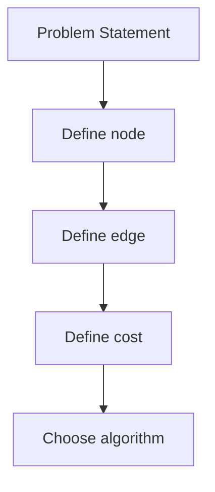

Example:

```text
Problem: shortest path in maze.
Node = cell (r,c)
Edge = move to neighbouring cell
Cost = 1 per move
Algorithm = BFS
```

---

## 1.2 How to Recognize Nodes

A node can be:

| Problem object | Node idea |
|---|---|
| cities | city id |
| people | person id |
| cells in grid | `(r,c)` |
| string transformation | current string |
| game/search | current state |
| fuel problem | `(city, fuel)` |
| wall break problem | `(r,c,walls_broken)` |
| bitmask problem | selected set mask |

Mental trick:

```text
Node = one complete situation that affects future moves.
```

---

## 1.3 How to Recognize Edges

An edge exists when you can move from one state to another.

Examples:

```text
Road between cities -> edge
Adjacent open grid cells -> edge
Can transform string by one operation -> edge
Can take one task after prerequisite -> directed edge
Can buy fuel or travel -> state edge
```


---

## 1.4 How to Recognize Edge Cost

| Cost type | Algorithm |
|---|---|
| all edges cost 1 | BFS |
| edge cost 0 or 1 | 0-1 BFS |
| non-negative weights | Dijkstra |
| negative edges | Bellman-Ford |
| all-pairs needed | Floyd-Warshall |
| connect all nodes cheaply | MST |

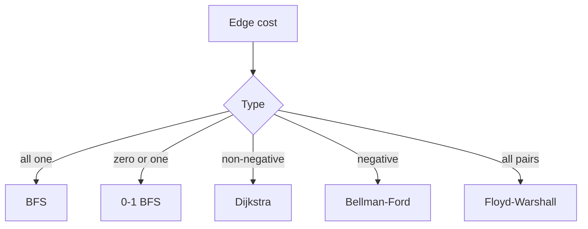

---

## 1.5 State Graph Formulation

Use state graph when one original node is not enough.

Example:

```text
You can break at most k walls.
```

If you only store `(r,c)`, you lose how many walls you already broke.

Correct state:

```text
(r, c, broken)
```

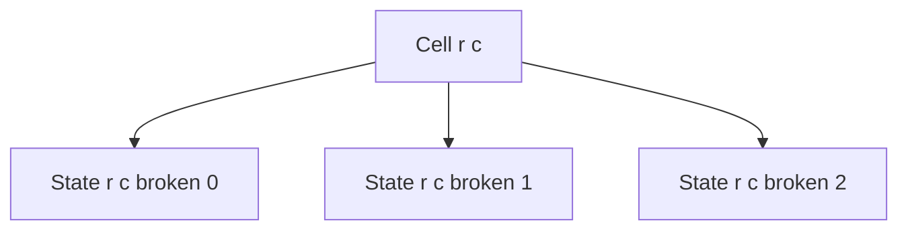

Mental trick:

```text
If reaching the same place with different resources changes future choices, add the resource to state.
```

---

## 1.6 Super Node Formulation

Use when nodes have activation/start costs.

Example:

```text
Build a well at house i with cost c[i]
Or connect houses with pipes.
```

Add super node `0`:

```text
edge 0 -> i with cost c[i]
```

Then run MST.

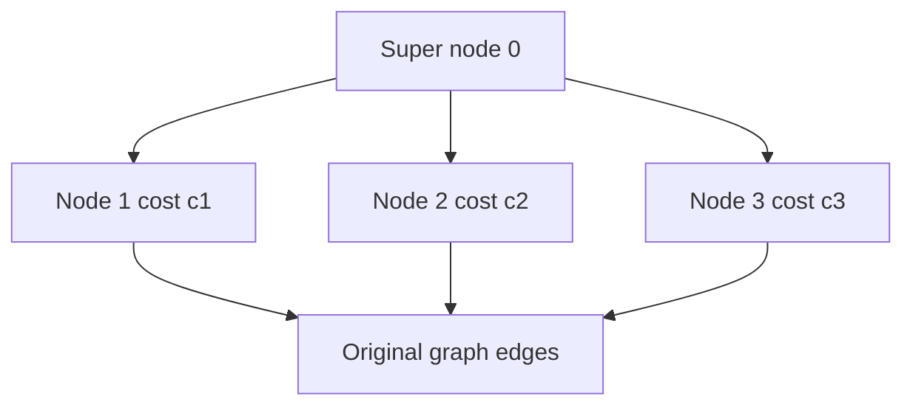

Mental trick:

```text
Node cost can often become edge cost from a fake source.
```

---

# 2. Concepts

## 2.1 Graph Basics

A graph is:

```text
G = (V, E)
V = vertices or nodes
E = edges or connections
```

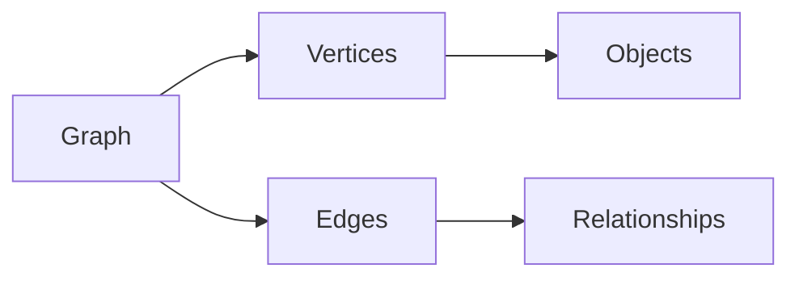

---

## 2.2 Directed vs Undirected

Undirected:

```cpp
g[u].push_back(v);
g[v].push_back(u);
```

Directed:

```cpp
g[u].push_back(v);
```

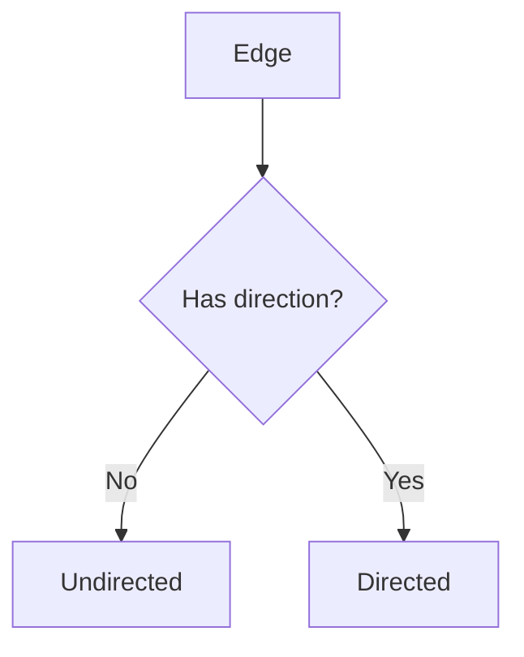

---

## 2.3 Weighted vs Unweighted

Unweighted graph:

```text
all edges have same cost
```

Weighted graph:

```text
edges have different costs
```

Mental trick:

```text
Unweighted shortest path = BFS.
Weighted shortest path = choose by weight type.
```

---

## 2.4 Sparse vs Dense

```text
n = nodes
m = edges
```

Sparse:

```text
m is much smaller than n^2
```

Dense:

```text
m is close to n^2
```

Use:

| Graph type | Representation |
|---|---|
| sparse | adjacency list |
| dense | adjacency matrix possible |
| edge-sorting algorithms | edge list |

---

## 2.5 Paths Cycles Components

| Concept | Meaning |
|---|---|
| path | sequence connected by edges |
| cycle | path that returns to start |
| component | group connected together |
| SCC | directed group where every node reaches every other |

---

## 2.6 Trees and DAGs

Tree:

```text
connected undirected acyclic graph
edges = n - 1
```

DAG:

```text
directed acyclic graph
```

Tree problems often use DFS/DP.  
DAG problems often use topological order.

---

## 2.7 Graph Representations

### Adjacency List

```cpp
vector<vector<int>> g(n + 1);
```

Weighted:

```cpp
vector<vector<pair<int,int>>> g(n + 1);
```

### Edge List

```cpp
struct Edge {
    int u, v;
    long long w;
};
vector<Edge> edges;
```

### Matrix

```cpp
vector<vector<long long>> mat(n + 1, vector<long long>(n + 1, INF));
```

---

# 3. Frameworks With Templates and Examples

## 3.1 DFS Framework

### Use when

- reachability
- components
- tree traversal
- cycle detection
- bipartite check
- flood fill

### How it works

```text
Level = current node
Choice = neighbours
Check = not visited
Move = dfs(neighbour)
```

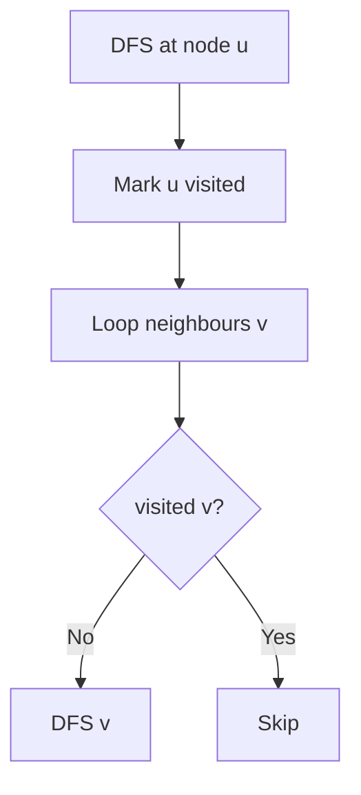

### Template

```cpp
void dfs(int u) {
    vis[u] = 1;

    for (int v : g[u]) {
        if (!vis[v]) {
            dfs(v);
        }
    }
}
```

### Example

Graph:

```text
1 -- 2 -- 3
4 -- 5
```

Starting DFS from `1` visits `1,2,3`.  
Then node `4` is still unvisited, so it starts another component.

---

## 3.2 BFS Framework

### Use when

- shortest path in unweighted graph
- level order traversal
- minimum moves
- grid shortest path

### How it works

BFS explores by distance level.

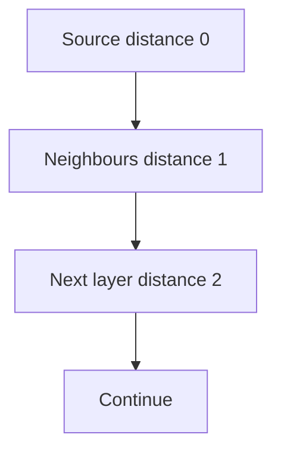

### Template

```cpp
vector<int> bfs(int n, vector<vector<int>>& g, int src) {
    const int INF = 1e9;
    vector<int> dist(n + 1, INF);
    queue<int> q;

    dist[src] = 0;
    q.push(src);

    while (!q.empty()) {
        int u = q.front();
        q.pop();

        for (int v : g[u]) {
            if (dist[v] == INF) {
                dist[v] = dist[u] + 1;
                q.push(v);
            }
        }
    }

    return dist;
}
```

### Example

If edges are roads with one move each:

```text
1 -> 2 -> 5
1 -> 3 -> 4 -> 5
```

BFS reaches `5` through `1,2,5` first, so distance is `2`.

---

## 3.3 Grid Graph Framework

### Formulation

```text
Node = cell (r,c)
Edge = move to adjacent valid cell
Cost = usually 1
Algorithm = BFS or DFS
```

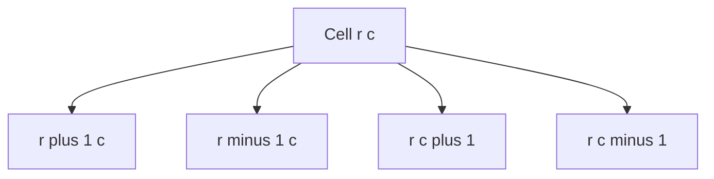

### Template

```cpp
int dr[4] = {1, -1, 0, 0};
int dc[4] = {0, 0, 1, -1};

bool valid(int r, int c, int n, int m, vector<string>& grid) {
    return r >= 0 && r < n && c >= 0 && c < m && grid[r][c] != '#';
}
```

### Example

Maze shortest path:

```text
'.' = open
'#' = blocked
```

Use BFS from start cell.

---

## 3.4 Connected Components Framework

### Use when

- count groups
- component size
- same component queries
- islands

### How it works

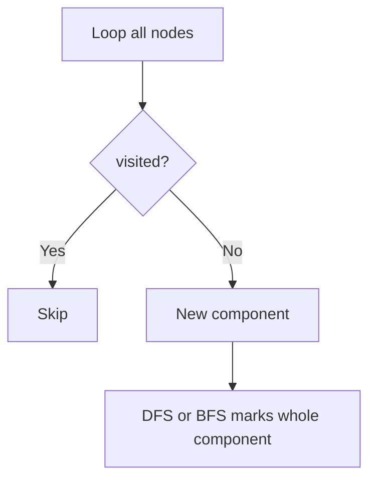

### Template

```cpp
vector<int> comp;
vector<int> compSize;

void dfsComp(int u, int id, vector<vector<int>>& g) {
    comp[u] = id;
    compSize[id]++;

    for (int v : g[u]) {
        if (comp[v] == 0) {
            dfsComp(v, id, g);
        }
    }
}
```

### Example

If graph has:

```text
1-2-3 and 4-5
```

Then components are:

```text
{1,2,3}, {4,5}
```

---

## 3.5 Bipartite Framework

### Use when

- divide graph into two groups
- check odd cycle
- possible coloring with 2 colors

### How it works

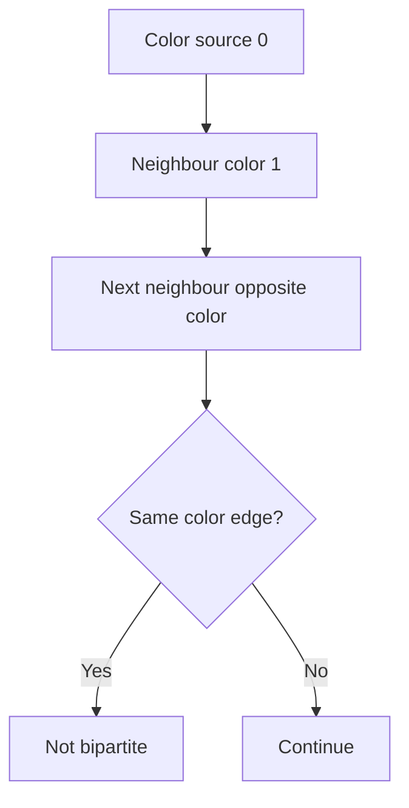

### Template

```cpp
bool isBipartite(int n, vector<vector<int>>& g) {
    vector<int> color(n + 1, -1);

    for (int s = 1; s <= n; s++) {
        if (color[s] != -1) continue;

        queue<int> q;
        color[s] = 0;
        q.push(s);

        while (!q.empty()) {
            int u = q.front();
            q.pop();

            for (int v : g[u]) {
                if (color[v] == -1) {
                    color[v] = color[u] ^ 1;
                    q.push(v);
                } else if (color[v] == color[u]) {
                    return false;
                }
            }
        }
    }

    return true;
}
```

### Example

Even cycle is bipartite. Odd cycle is not.

---

## 3.6 Cycle Detection Framework

### Undirected graph

Visited neighbour not equal to parent means cycle.

```cpp
bool dfsCycleUndirected(int u, int p, vector<vector<int>>& g, vector<int>& vis) {
    vis[u] = 1;

    for (int v : g[u]) {
        if (!vis[v]) {
            if (dfsCycleUndirected(v, u, g, vis)) return true;
        } else if (v != p) {
            return true;
        }
    }

    return false;
}
```

### Directed graph

Use colors:

```text
0 = unvisited
1 = currently in recursion stack
2 = finished
```

```cpp
bool dfsCycleDirected(int u, vector<vector<int>>& g, vector<int>& color) {
    color[u] = 1;

    for (int v : g[u]) {
        if (color[v] == 0) {
            if (dfsCycleDirected(v, g, color)) return true;
        } else if (color[v] == 1) {
            return true;
        }
    }

    color[u] = 2;
    return false;
}
```

---

## 3.7 Multi-Source BFS Framework

### Use when

Need distance to nearest source.

Examples:

```text
nearest monster
rotting oranges
nearest hospital
fire spread
nearest zero cell
```

### How it works

Push all sources into queue with distance `0`.

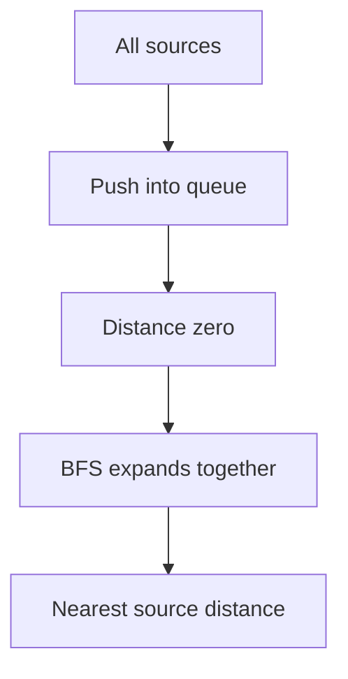

### Template

```cpp
vector<int> multiSourceBFS(int n, vector<vector<int>>& g, vector<int>& sources) {
    const int INF = 1e9;
    vector<int> dist(n + 1, INF);
    queue<int> q;

    for (int s : sources) {
        dist[s] = 0;
        q.push(s);
    }

    while (!q.empty()) {
        int u = q.front();
        q.pop();

        for (int v : g[u]) {
            if (dist[v] == INF) {
                dist[v] = dist[u] + 1;
                q.push(v);
            }
        }
    }

    return dist;
}
```

### Example

For fire spreading from many cells, multi-source BFS gives the earliest fire arrival time for every cell.

---

## 3.8 Topological Sort Framework

### Use when

- directed dependencies
- prerequisites
- task ordering
- DAG processing

### Kahn Template

```cpp
vector<int> topoKahn(int n, vector<vector<int>>& g) {
    vector<int> indeg(n + 1, 0);

    for (int u = 1; u <= n; u++) {
        for (int v : g[u]) indeg[v]++;
    }

    queue<int> q;
    for (int i = 1; i <= n; i++) {
        if (indeg[i] == 0) q.push(i);
    }

    vector<int> topo;

    while (!q.empty()) {
        int u = q.front();
        q.pop();
        topo.push_back(u);

        for (int v : g[u]) {
            indeg[v]--;
            if (indeg[v] == 0) q.push(v);
        }
    }

    return topo;
}
```

### Example

If:

```text
A before B
B before C
```

Topological order is:

```text
A, B, C
```

---

## 3.9 DAG DP Framework

### Use when

- longest path in DAG
- number of paths in DAG
- dependency DP

### How it works

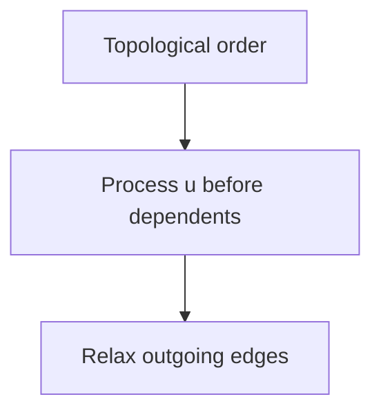

### Example: longest path

```cpp
int longestPathDAG(int n, vector<vector<int>>& g) {
    vector<int> topo = topoKahn(n, g);
    vector<int> dp(n + 1, 0);

    for (int u : topo) {
        for (int v : g[u]) {
            dp[v] = max(dp[v], dp[u] + 1);
        }
    }

    return *max_element(dp.begin(), dp.end());
}
```

---

## 3.10 Shortest Path Selection Framework

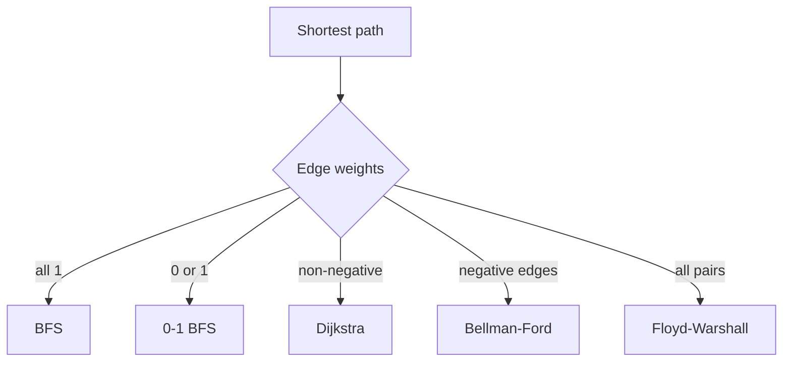

---

## 3.11 0-1 BFS Framework

### Use when

All edge weights are only `0` or `1`.

### Template

```cpp
vector<int> zeroOneBFS(int n, vector<vector<pair<int,int>>>& g, int src) {
    const int INF = 1e9;
    vector<int> dist(n + 1, INF);
    deque<int> dq;

    dist[src] = 0;
    dq.push_front(src);

    while (!dq.empty()) {
        int u = dq.front();
        dq.pop_front();

        for (auto [v, w] : g[u]) {
            if (dist[v] > dist[u] + w) {
                dist[v] = dist[u] + w;

                if (w == 0) dq.push_front(v);
                else dq.push_back(v);
            }
        }
    }

    return dist;
}
```

Example:

```text
Move into empty cell cost 0
Move into wall cost 1
Find minimum walls broken
```

---

## 3.12 Dijkstra Framework

### Use when

Weighted graph with non-negative edge costs.

### Template

```cpp
vector<long long> dijkstra(int n, vector<vector<pair<int,int>>>& g, int src) {
    const long long INF = 4e18;
    vector<long long> dist(n + 1, INF);

    priority_queue<pair<long long,int>, vector<pair<long long,int>>, greater<pair<long long,int>>> pq;

    dist[src] = 0;
    pq.push({0, src});

    while (!pq.empty()) {
        auto [du, u] = pq.top();
        pq.pop();

        if (du != dist[u]) continue;

        for (auto [v, w] : g[u]) {
            if (dist[v] > dist[u] + w) {
                dist[v] = dist[u] + w;
                pq.push({dist[v], v});
            }
        }
    }

    return dist;
}
```

Example:

```text
Roads have travel times.
Find shortest travel time from city 1.
```

---

## 3.13 Bellman-Ford Framework

### Use when

- negative edges exist
- need negative cycle detection

### Template

```cpp
struct Edge {
    int u, v;
    long long w;
};

vector<long long> bellmanFord(int n, vector<Edge>& edges, int src) {
    const long long INF = 4e18;
    vector<long long> dist(n + 1, INF);
    dist[src] = 0;

    for (int iter = 1; iter <= n - 1; iter++) {
        bool changed = false;

        for (auto e : edges) {
            if (dist[e.u] == INF) continue;

            if (dist[e.v] > dist[e.u] + e.w) {
                dist[e.v] = dist[e.u] + e.w;
                changed = true;
            }
        }

        if (!changed) break;
    }

    return dist;
}
```

Negative cycle check:

```cpp
bool hasNegativeCycle(int n, vector<Edge>& edges, vector<long long>& dist) {
    const long long INF = 4e18;

    for (auto e : edges) {
        if (dist[e.u] != INF && dist[e.v] > dist[e.u] + e.w) {
            return true;
        }
    }

    return false;
}
```

---

## 3.14 Floyd-Warshall Framework

### Use when

- all pairs shortest path
- small `n`
- dense graph
- transitive closure

### Template

```cpp
void floydWarshall(vector<vector<long long>>& dist, int n) {
    const long long INF = 4e18;

    for (int k = 1; k <= n; k++) {
        for (int i = 1; i <= n; i++) {
            for (int j = 1; j <= n; j++) {
                if (dist[i][k] == INF || dist[k][j] == INF) continue;
                dist[i][j] = min(dist[i][j], dist[i][k] + dist[k][j]);
            }
        }
    }
}
```

Example:

```text
Many queries asking shortest path between any pair.
If n <= 400, Floyd can be useful.
```

---

## 3.15 DSU Framework

### Use when

- dynamic connectivity with union operations
- Kruskal MST
- group merging

### Template

```cpp
struct DSU {
    vector<int> parent, sz;

    DSU(int n) {
        parent.resize(n + 1);
        sz.assign(n + 1, 1);
        for (int i = 1; i <= n; i++) parent[i] = i;
    }

    int find(int x) {
        if (parent[x] == x) return x;
        return parent[x] = find(parent[x]);
    }

    bool unite(int a, int b) {
        a = find(a);
        b = find(b);

        if (a == b) return false;

        if (sz[a] < sz[b]) swap(a, b);
        parent[b] = a;
        sz[a] += sz[b];

        return true;
    }
};
```

---

## 3.16 MST Kruskal Framework

### Use when

Need to connect all nodes with minimum total edge cost.

### How it works

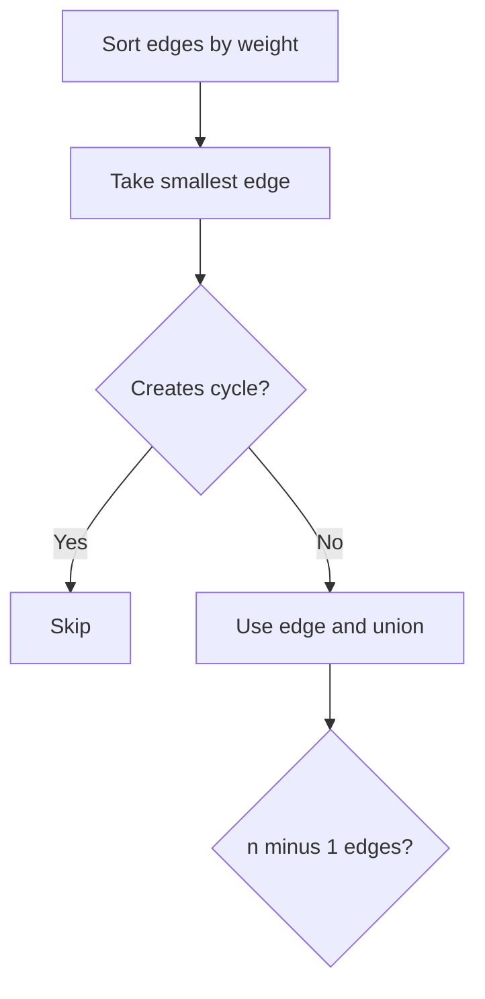

### Template

```cpp
struct MstEdge {
    int u, v;
    long long w;
};

long long kruskal(int n, vector<MstEdge>& edges) {
    sort(edges.begin(), edges.end(), [](auto& a, auto& b) {
        return a.w < b.w;
    });

    DSU dsu(n);
    long long cost = 0;
    int used = 0;

    for (auto e : edges) {
        if (dsu.unite(e.u, e.v)) {
            cost += e.w;
            used++;
        }
    }

    if (used != n - 1) return -1;
    return cost;
}
```

---

## 3.17 SCC Framework

### Use when

Directed graph has strongly connected groups.

Common uses:
- cycle membership
- condensation DAG
- 2-SAT base concept
- nodes mutually reachable

### Kosaraju idea

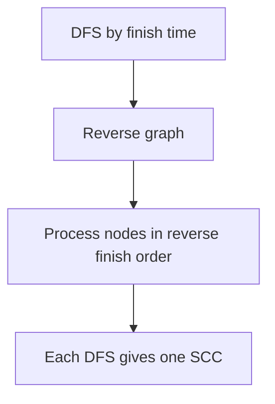

### Template

```cpp
vector<vector<int>> g, rg;
vector<int> vis, order, comp;

void dfs1(int u) {
    vis[u] = 1;
    for (int v : g[u]) if (!vis[v]) dfs1(v);
    order.push_back(u);
}

void dfs2(int u, int id) {
    comp[u] = id;
    for (int v : rg[u]) if (comp[v] == 0) dfs2(v, id);
}

int kosaraju(int n) {
    vis.assign(n + 1, 0);
    comp.assign(n + 1, 0);
    order.clear();

    for (int i = 1; i <= n; i++) {
        if (!vis[i]) dfs1(i);
    }

    reverse(order.begin(), order.end());

    int id = 0;
    for (int u : order) {
        if (comp[u] == 0) {
            id++;
            dfs2(u, id);
        }
    }

    return id;
}
```

---

## 3.18 LCA Tree Framework

### Use when

Need queries on trees:
- lowest common ancestor
- distance between nodes
- path queries

### Binary lifting idea

```text
up[u][j] = 2^j-th ancestor of u
```

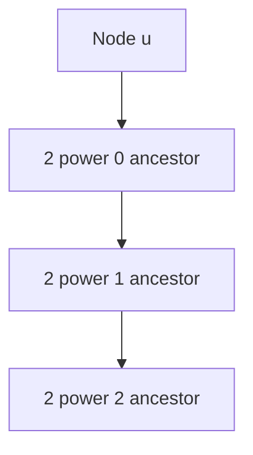

Minimal skeleton:

```cpp
const int LOG = 20;
vector<vector<int>> up;
vector<int> depth;

void dfsLCA(int u, int p, vector<vector<int>>& tree) {
    up[u][0] = p;

    for (int j = 1; j < LOG; j++) {
        up[u][j] = up[up[u][j - 1]][j - 1];
    }

    for (int v : tree[u]) {
        if (v == p) continue;
        depth[v] = depth[u] + 1;
        dfsLCA(v, u, tree);
    }
}
```

---

# 4. Problem Forms

## 4.1 Reachability

Question:

```text
Can we reach target from source?
```

Use DFS or BFS.

```cpp
bool reachable(int n, vector<vector<int>>& g, int src, int target) {
    vector<int> vis(n + 1, 0);

    function<void(int)> dfs = [&](int u) {
        vis[u] = 1;
        for (int v : g[u]) if (!vis[v]) dfs(v);
    };

    dfs(src);
    return vis[target];
}
```

---

## 4.2 Number of Components

Use DFS or DSU.

```cpp
int countComponents(int n, vector<vector<int>>& g) {
    vector<int> vis(n + 1, 0);
    int count = 0;

    function<void(int)> dfs = [&](int u) {
        vis[u] = 1;
        for (int v : g[u]) if (!vis[v]) dfs(v);
    };

    for (int i = 1; i <= n; i++) {
        if (!vis[i]) {
            count++;
            dfs(i);
        }
    }

    return count;
}
```

---

## 4.3 Shortest Path in Unweighted Graph

Use BFS.

```cpp
int shortestUnweighted(int n, vector<vector<int>>& g, int s, int t) {
    vector<int> dist = bfs(n, g, s);
    return dist[t] == 1e9 ? -1 : dist[t];
}
```

---

## 4.4 Shortest Path in Grid

Formulation:

```text
Node = cell
Edge = four-direction move
Cost = 1
Algorithm = BFS
```

---

## 4.5 Nearest Source

Use multi-source BFS.

Example:

```text
Find distance to nearest hospital for every city.
```

Sources are all hospitals.

---

## 4.6 Wall Breaking

Two versions:

| Problem | Model | Algorithm |
|---|---|---|
| minimum walls to break | edge cost 0 or 1 | 0-1 BFS |
| shortest path with at most k breaks | state `(r,c,broken)` | BFS |

---

## 4.7 Course Schedule Dependencies

Formulation:

```text
Node = course
Edge = prerequisite -> course
Need ordering = topological sort
Cycle means impossible
```

---

## 4.8 Longest Path in DAG

Use topological sort + DP.

---

## 4.9 Weighted Shortest Path

Use Dijkstra if weights are non-negative.

---

## 4.10 Negative Edge Shortest Path

Use Bellman-Ford.

---

## 4.11 All-Pairs Shortest Path

Use Floyd-Warshall for small `n` or many all-pair queries.

---

## 4.12 Minimum Spanning Tree

Use Kruskal or Prim.

Common phrase:

```text
connect all nodes with minimum cost
```

---

## 4.13 Graph With Node Cost

Use super node if each node can be activated independently.

---

## 4.14 Strongly Connected Components

Use SCC when directed graph asks:

```text
mutual reachability
cycle groups
compress graph into DAG
```

---

## 4.15 Tree Diameter

Diameter = longest path in a tree.

Two BFS/DFS trick:

```text
1. BFS from any node to find farthest A.
2. BFS from A to find farthest B.
3. distance A-B is diameter.
```

```cpp
pair<int,int> farthest(int src, vector<vector<int>>& tree) {
    int n = tree.size() - 1;
    vector<int> dist = bfs(n, tree, src);

    int node = src;
    for (int i = 1; i <= n; i++) {
        if (dist[i] > dist[node]) node = i;
    }

    return {node, dist[node]};
}
```

---

## 4.16 Tree DP

Use DFS where parent passes information to children or children return information to parent.

Example subtree size:

```cpp
void subtreeDFS(int u, int p, vector<vector<int>>& tree, vector<int>& sub) {
    sub[u] = 1;

    for (int v : tree[u]) {
        if (v == p) continue;
        subtreeDFS(v, u, tree, sub);
        sub[u] += sub[v];
    }
}
```

---

# 5. Tactics

## 5.1 Algorithm Recognition Table

| Problem clue | Think |
|---|---|
| reachability | DFS or BFS |
| shortest path with all edges equal | BFS |
| grid shortest path | BFS |
| nearest source | multi-source BFS |
| weights 0 or 1 | 0-1 BFS |
| non-negative weights | Dijkstra |
| negative edges | Bellman-Ford |
| all-pairs shortest path | Floyd-Warshall |
| dependencies | topological sort |
| cycle in directed graph | DFS colors or Kahn |
| connect all minimum cost | MST |
| dynamic connectivity | DSU |
| directed mutual reachability | SCC |
| tree path queries | LCA |

---

## 5.2 Representation Tactics

| Need | Representation |
|---|---|
| iterate neighbours | adjacency list |
| sort edges | edge list |
| check edge existence fast | matrix |
| dense all-pairs | matrix |
| grid | implicit graph |

---

## 5.3 Visited and Distance Tactics

Use `visited` for DFS reachability.

Use `dist == INF` as visited for BFS shortest path.

```cpp
if (dist[v] == INF) {
    dist[v] = dist[u] + 1;
}
```

---

## 5.4 Grid Tactics

Always define:

```text
valid cell
directions
blocked cells
state variables
```

Common directions:

```cpp
int dr[4] = {1, -1, 0, 0};
int dc[4] = {0, 0, 1, -1};
```

---

## 5.5 State Expansion Tactics

Add extra dimension if needed:

| Extra condition | State |
|---|---|
| walls broken | `(r,c,broken)` |
| keys collected | `(r,c,mask)` |
| fuel left | `(city,fuel)` |
| time parity | `(node, parity)` |
| remaining coupons | `(node,coupons)` |

---

## 5.6 Shortest Path Tactics

Do not use Dijkstra for negative edges.

Do not use BFS for weighted edges unless all weights are equal.

For 0/1 weights, prefer 0-1 BFS over Dijkstra.

---

## 5.7 Cycle Tactics

Undirected:

```text
visited neighbour not parent
```

Directed:

```text
edge to color 1 node
```

Topological:

```text
topo size < n means cycle
```

---

## 5.8 Topological Tactics

Use Kahn when you need:

```text
cycle check
lexicographically smallest order
process indegree zero first
```

Use DFS topo when simpler recursive ordering is enough.

---

## 5.9 MST Tactics

Kruskal is easier if edges are given as a list.

Prim is natural if graph is adjacency list and you start from a node.

Super node trick converts node activation cost to edge cost.

---

## 5.10 Common Mistakes

1. Adding reverse edge in directed graph.
2. Forgetting reverse edge in undirected graph.
3. Using BFS on weighted graph.
4. Using Dijkstra with negative edge.
5. Not initializing `dist[src] = 0`.
6. Not handling disconnected components.
7. Recursive DFS stack overflow on huge graph.
8. Not checking stale entries in Dijkstra.
9. Forgetting `INF` overflow guard in Floyd.
10. Using matrix when `n` is too large.
11. Not adding state dimension when future depends on resource.
12. Assuming topological order exists without checking cycle.

---

# 6. C++ Template Library

## 6.1 Graph Build

```cpp
vector<vector<int>> g(n + 1);

for (int i = 0; i < m; i++) {
    int u, v;
    cin >> u >> v;
    g[u].push_back(v);
    g[v].push_back(u); // remove for directed
}
```

---

## 6.2 Weighted Graph Build

```cpp
vector<vector<pair<int,int>>> g(n + 1);

for (int i = 0; i < m; i++) {
    int u, v, w;
    cin >> u >> v >> w;
    g[u].push_back({v, w});
    g[v].push_back({u, w}); // remove for directed
}
```

---

## 6.3 DFS

```cpp
void dfs(int u, vector<vector<int>>& g, vector<int>& vis) {
    vis[u] = 1;

    for (int v : g[u]) {
        if (!vis[v]) dfs(v, g, vis);
    }
}
```

---

## 6.4 BFS

```cpp
vector<int> bfs(int n, vector<vector<int>>& g, int src) {
    const int INF = 1e9;
    vector<int> dist(n + 1, INF);
    queue<int> q;

    dist[src] = 0;
    q.push(src);

    while (!q.empty()) {
        int u = q.front();
        q.pop();

        for (int v : g[u]) {
            if (dist[v] == INF) {
                dist[v] = dist[u] + 1;
                q.push(v);
            }
        }
    }

    return dist;
}
```

---

## 6.5 Topological Sort Kahn

```cpp
vector<int> topoKahn(int n, vector<vector<int>>& g) {
    vector<int> indeg(n + 1, 0);
    for (int u = 1; u <= n; u++) for (int v : g[u]) indeg[v]++;

    queue<int> q;
    for (int i = 1; i <= n; i++) if (indeg[i] == 0) q.push(i);

    vector<int> topo;
    while (!q.empty()) {
        int u = q.front();
        q.pop();
        topo.push_back(u);

        for (int v : g[u]) {
            indeg[v]--;
            if (indeg[v] == 0) q.push(v);
        }
    }

    return topo;
}
```

---

## 6.6 Dijkstra

```cpp
vector<long long> dijkstra(int n, vector<vector<pair<int,int>>>& g, int src) {
    const long long INF = 4e18;
    vector<long long> dist(n + 1, INF);
    priority_queue<pair<long long,int>, vector<pair<long long,int>>, greater<pair<long long,int>>> pq;

    dist[src] = 0;
    pq.push({0, src});

    while (!pq.empty()) {
        auto [du, u] = pq.top();
        pq.pop();
        if (du != dist[u]) continue;

        for (auto [v, w] : g[u]) {
            if (dist[v] > dist[u] + w) {
                dist[v] = dist[u] + w;
                pq.push({dist[v], v});
            }
        }
    }

    return dist;
}
```

---

## 6.7 DSU

```cpp
struct DSU {
    vector<int> parent, sz;

    DSU(int n) {
        parent.resize(n + 1);
        sz.assign(n + 1, 1);
        for (int i = 1; i <= n; i++) parent[i] = i;
    }

    int find(int x) {
        return parent[x] == x ? x : parent[x] = find(parent[x]);
    }

    bool unite(int a, int b) {
        a = find(a);
        b = find(b);
        if (a == b) return false;
        if (sz[a] < sz[b]) swap(a, b);
        parent[b] = a;
        sz[a] += sz[b];
        return true;
    }
};
```

---

# 7. Final Checklist

Before coding, ask:

```text
1. What is the node?
2. What is the edge?
3. Is graph directed or undirected?
4. Is graph weighted or unweighted?
5. Are weights 0/1, non-negative, or negative?
6. Is it reachability, shortest path, ordering, cycle, component, or MST?
7. Do I need an extra state dimension?
8. Is graph sparse or dense?
9. Could graph be disconnected?
10. What representation should I use?
```

---

# 8. Memory Hooks

```text
Graph formulation:
    node, edge, cost, algorithm

DFS:
    go deep, components, cycles, trees

BFS:
    levels, shortest path with equal weights

Multi-source BFS:
    nearest source

0-1 BFS:
    deque for weights 0 and 1

Dijkstra:
    non-negative weighted shortest path

Bellman-Ford:
    negative edges and negative cycles

Floyd-Warshall:
    all pairs, small n

Topological sort:
    dependency order in DAG

MST:
    connect all nodes cheaply

DSU:
    merge components quickly

State graph:
    add resource/condition to node if it affects future
```

---

END
