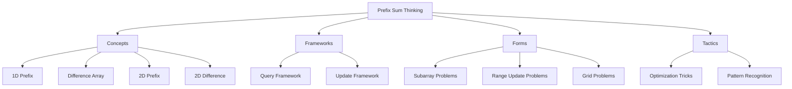
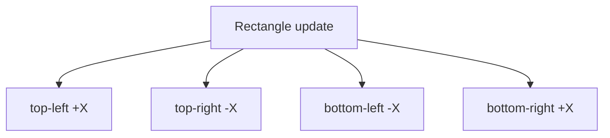
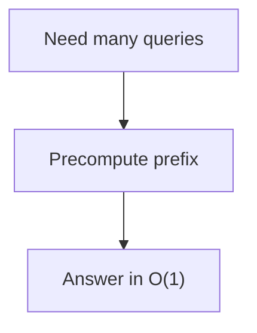
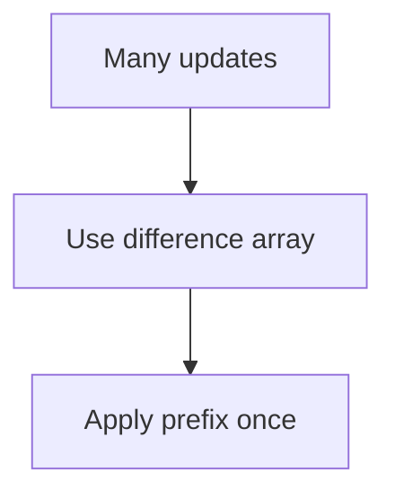
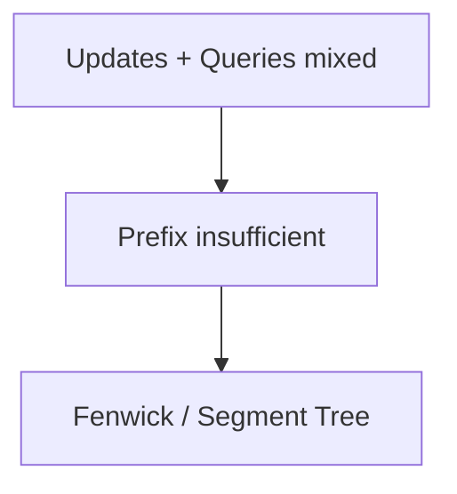
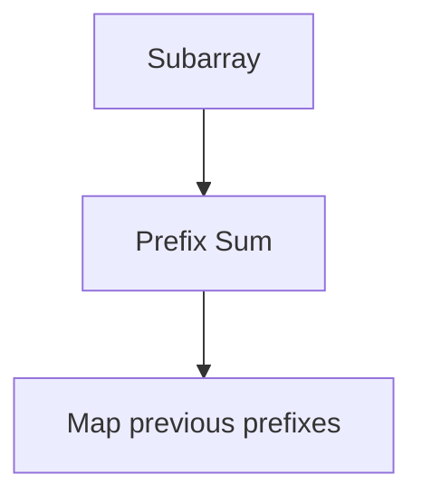
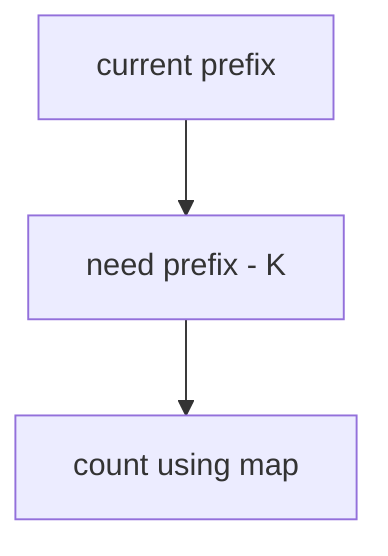
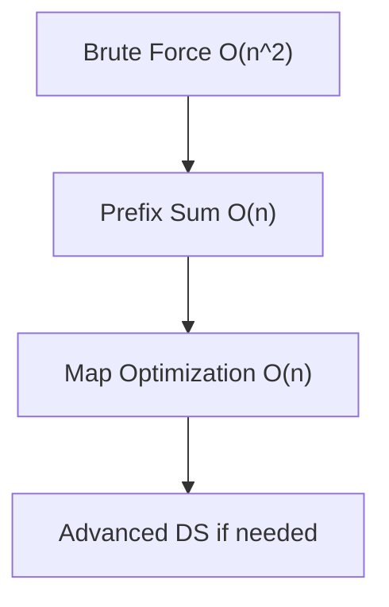
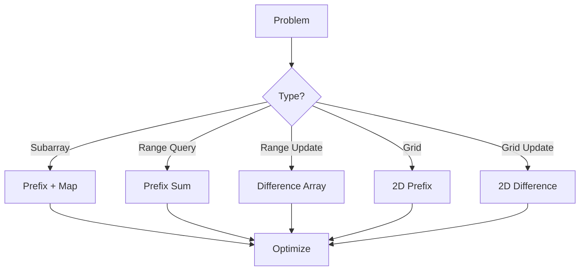

# Prefix Sum Problem Solving Playbook (Concepts • Frameworks • Forms • Tactics)

> A structured guide to solve any **Prefix Sum–related problem** in competitive programming.  
> Built from your notes and extended with additional patterns, frameworks, and tactics.

---

# 0. Big Picture



---

# 1. CONCEPTS (Core Building Blocks)

## 1.1 1D Prefix Sum

**Idea:** Precompute cumulative sums.

```mermaid
flowchart LR
    A[a[i]] --> B[pref[i] = pref["i-1"] + a[i]]
```

### Use When
- Static array
- Many range sum queries

### Formula

```text
sum(l, r) = pref[r] - pref[l-1]
```

---

## 1.2 Difference Array (Inverse Prefix)

**Idea:** Mark where updates start and stop.

```mermaid
flowchart LR
    A["+X on L..R"] --> B[diff[L]+=X]
    A --> C["diff[R+1"]-=X]
    B --> D[Prefix rebuild]
    C --> D
```

---

## 1.3 2D Prefix Sum

**Idea:** Extend prefix to matrix.

```mermaid
flowchart TD
    A[a[i][j]] --> B[pref[i][j]]
    B --> C["use inclusion-exclusion"]
```

Formula:

```text
pref[i][j] = a[i][j] + up + left - overlap
```

---

## 1.4 2D Difference Array

**Idea:** 4-corner marking.



---

# 2. FRAMEWORKS (How to Think)

## 2.1 Query Framework



Mental Model:

```text
Store cumulative info → subtract to isolate range
```

---

## 2.2 Update Framework



Mental Model:

```text
Mark changes → propagate later
```

---

## 2.3 Hybrid Framework



---

# 3. PROBLEM FORMS (Recognize Patterns)

## 3.1 Subarray Sum Problems

### Form

```text
Find sum(l, r)
Count subarrays with sum = X
```

### Pattern



---

## 3.2 Range Update Problems

### Form

```text
Add X to all elements in [L, R]
```

### Pattern

```text
Difference array
```

---

## 3.3 Subarray Sum = K (Important)

### Core Idea

```text
pref[r] - pref[l] = K
=> pref[l] = pref[r] - K
```

### Pattern



---

## 3.4 Grid / Matrix Problems

### Form

```text
Sum of rectangle
Update rectangle
```

### Pattern

```text
2D prefix or 2D difference
```

---

## 3.5 Contribution Technique (Advanced)

Instead of iterating subarrays:

```text
Count contribution per element
```

---

# 4. TACTICS (What to Do in Contest)

## 4.1 Constraint-Based Decision

```text
n <= 1e5, q large → prefix sum
many updates → difference array
2D grid → 2D prefix
```

---

## 4.2 Pattern Recognition Cheatsheet

| Clue | Technique |
|------|---------|
| many sum queries | prefix sum |
| range add | difference array |
| subarray sum = K | prefix + map |
| grid sum | 2D prefix |
| rectangle updates | 2D difference |

---

## 4.3 Edge Case Tactics

- Always initialize:

```cpp
freq[0] = 1;
```

- Use `long long`

- Prefer 1-indexing

---

## 4.4 Optimization Ladder



---

## 4.5 Mental Trick

```text
Prefix = accumulate
Difference = distribute
```

---

# 5. COMMON EXTENSIONS (IMPORTANT)

## 5.1 Prefix XOR

Used when XOR instead of sum.

```text
xor(l,r) = pref[r] ^ pref[l-1]
```

---

## 5.2 Prefix Min/Max

Not subtractable → need segment tree.

---

## 5.3 Weighted Prefix

```text
Store weighted sums (index * value)
```

---

## 5.4 Circular Prefix

Handle wrap-around using duplication.

---

# 6. MASTER FLOW (Solve Any Problem)



---

# 7. FINAL CHECKLIST

Before coding:

```text
1. Is array static?
2. Are queries many?
3. Are updates many?
4. Is it 1D or 2D?
5. Can I use prefix?
6. Do I need map?
7. Do I need difference array?
```

---

# 8. GOLDEN RULES

```text
Prefix solves queries
Difference solves updates
Map solves counting
2D = extend logic
```

---

# 9. MINIMAL TEMPLATE

```cpp
vector<long long> pref(n+1,0);
for(int i=1;i<=n;i++) pref[i]=pref[i-1]+a[i-1];
```

---

# END
