# Two Pointers & Sliding Window Problem Solving Playbook

> A structured competitive-programming guide for solving problems related to **two pointers**, **sliding window**, and **same-direction window techniques**.
>
> Main goal: reduce brute force by moving pointers with a safe rule.

---

# Index

```text
0. Master Map
1. Concepts
   1.1 What Two Pointers Means
   1.2 Opposite Ends
   1.3 Same Direction Window
   1.4 Fixed Sliding Window
   1.5 Variable Sliding Window
   1.6 Multi-List Traversal
   1.7 Fix One Then Two Pointers
   1.8 Counting Windows
   1.9 Exact K via At Most K
2. Frameworks
   2.1 Two Pointer Thinking Framework
   2.2 Opposite Ends Framework
   2.3 Expand and Shrink Framework
   2.4 Fixed Window Framework
   2.5 Count Subarrays Framework
   2.6 Multi-List Traversal Framework
   2.7 Sort plus Fix One Framework
3. Problem Forms
   3.1 Two Sum Sorted
   3.2 Palindrome
   3.3 Container With Most Water
   3.4 Longest Subarray With At Most K Zeros
   3.5 At Most K Distinct
   3.6 Exactly K Distinct
   3.7 Count Subarrays With Sum Less Than K
   3.8 Minimum Size Subarray Sum
   3.9 Fixed Window Sum
   3.10 Sliding Window Maximum
   3.11 Sliding Window Minimum
   3.12 Subsequence Check
   3.13 Intersection of Sorted Arrays
   3.14 3Sum
   3.15 4Sum
   3.16 Remove Duplicates
   3.17 Merge Two Sorted Arrays
4. Tactics
   4.1 Pattern Recognition
   4.2 Pointer Movement Rules
   4.3 Counting Tactics
   4.4 Frequency Tactics
   4.5 Duplicate Tactics
   4.6 When Sliding Window Fails
   4.7 Complexity Tactics
5. C++ Template Library
6. Final Checklist
```

---

# 0. Master Map

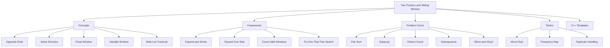

---

# 1. Concepts

## 1.1 What Two Pointers Means

Two pointers reduce brute force by moving indexes intelligently.

Instead of trying every pair or every subarray:

```text
try all pairs      -> O(n^2)
move pointers      -> O(n)
sort plus pointers -> O(n log n)
```

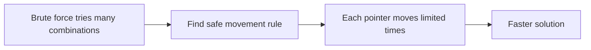

Core question:

```text
Which pointer can I move without losing the answer?
```

---

## 1.2 Opposite Ends

Pointers start from both ends.

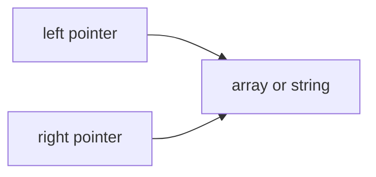

Used for:
- sorted pair sum
- palindrome
- container with most water
- reverse or partition
- 3Sum inner loop

---

## 1.3 Same Direction Window

Both pointers move forward.

```text
tail ... head
```

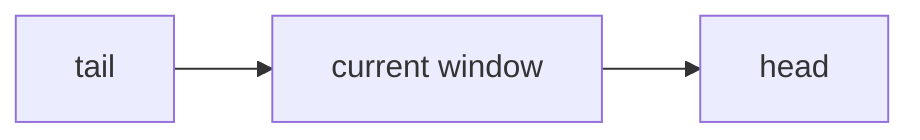

Used for:
- longest subarray
- shortest subarray
- count subarrays
- at most K distinct
- at most K zeros
- positive-sum constraints

---

## 1.4 Fixed Sliding Window

Window size is fixed.

```text
length = k
```

At each step:

```text
add new right element
remove old left element
answer current window
```

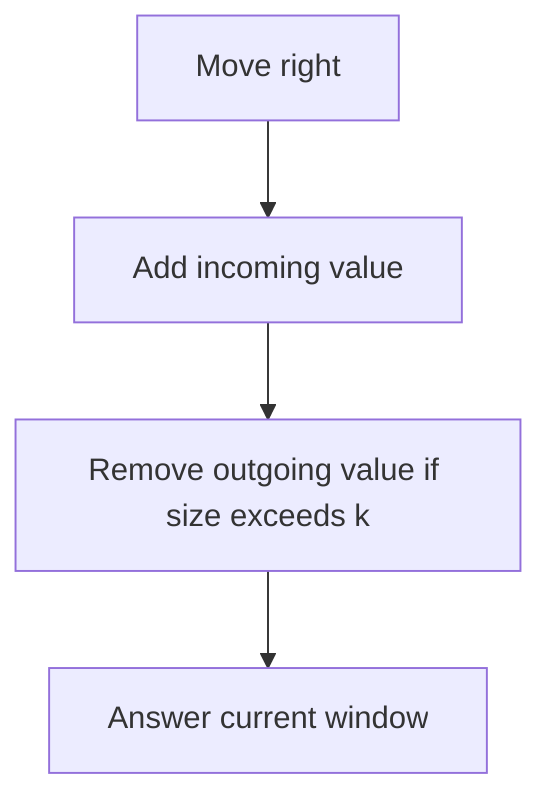

---

## 1.5 Variable Sliding Window

Window size changes based on validity.

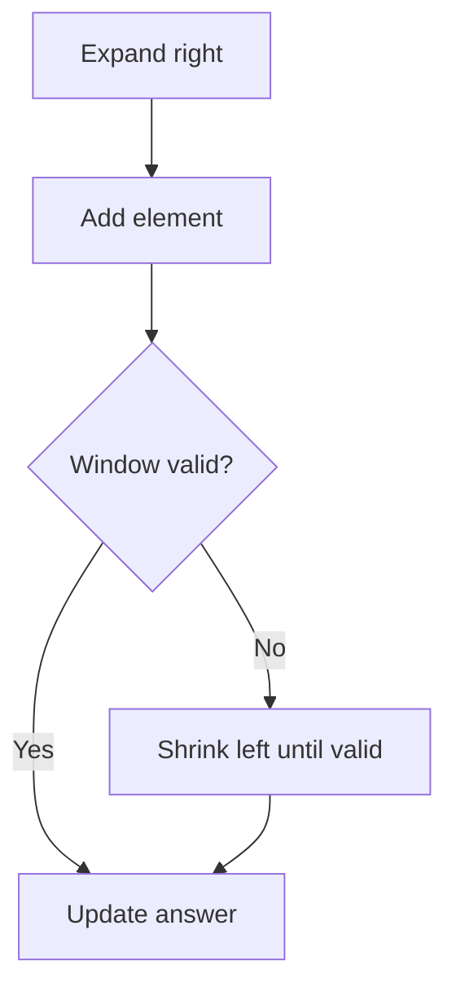

Common validity examples:

```text
zeros <= k
distinct <= k
sum <= target
frequency condition satisfied
```

---

## 1.6 Multi-List Traversal

Use one pointer per list/string.

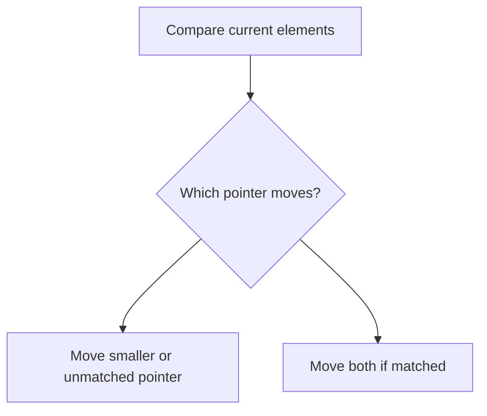

Used for:
- subsequence check
- merging sorted arrays
- intersection of sorted arrays
- interval merging

---

## 1.7 Fix One Then Two Pointers

For 3Sum, 4Sum, and triplet problems:

```text
sort array
fix one element
run two-sum with two pointers
```

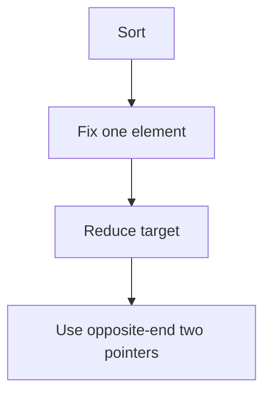

---

## 1.8 Counting Windows

If a window `[left, right]` is valid and all smaller endings are also valid:

```text
number of valid subarrays ending at right = right - left + 1
```

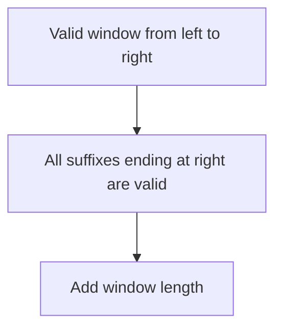

---

## 1.9 Exact K via At Most K

Exact conditions are often hard.

Convert:

```text
exactly K = atMost(K) - atMost(K - 1)
```

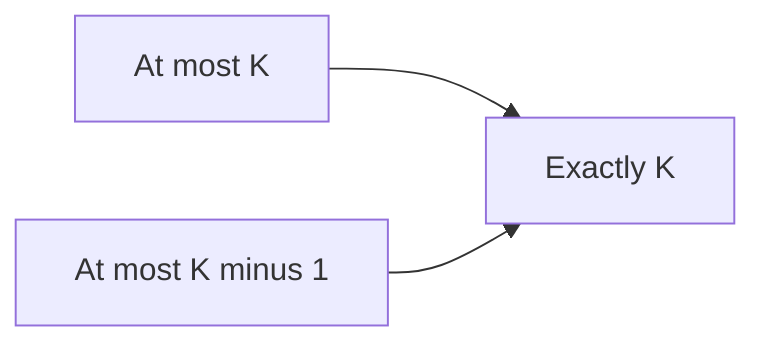

Used for:
- exactly K distinct
- exactly K odd numbers
- exactly K zeros
- exactly K consonants or vowels in some string problems

---

# 2. Frameworks

## 2.1 Two Pointer Thinking Framework

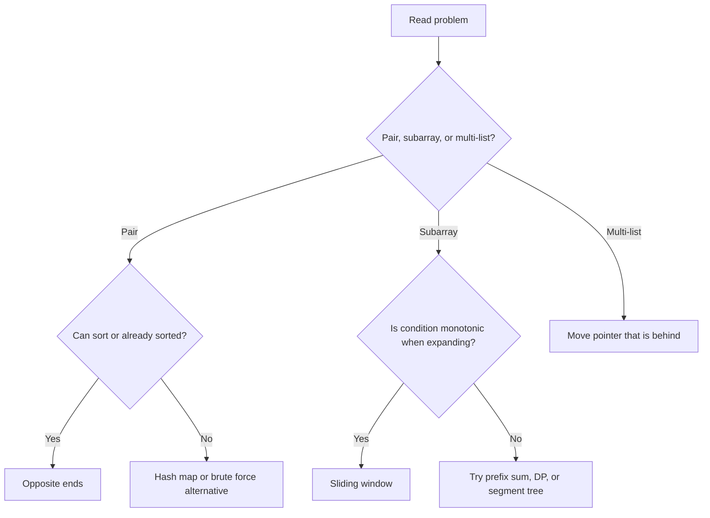

---

## 2.2 Opposite Ends Framework

Use when moving one side can safely discard bad candidates.

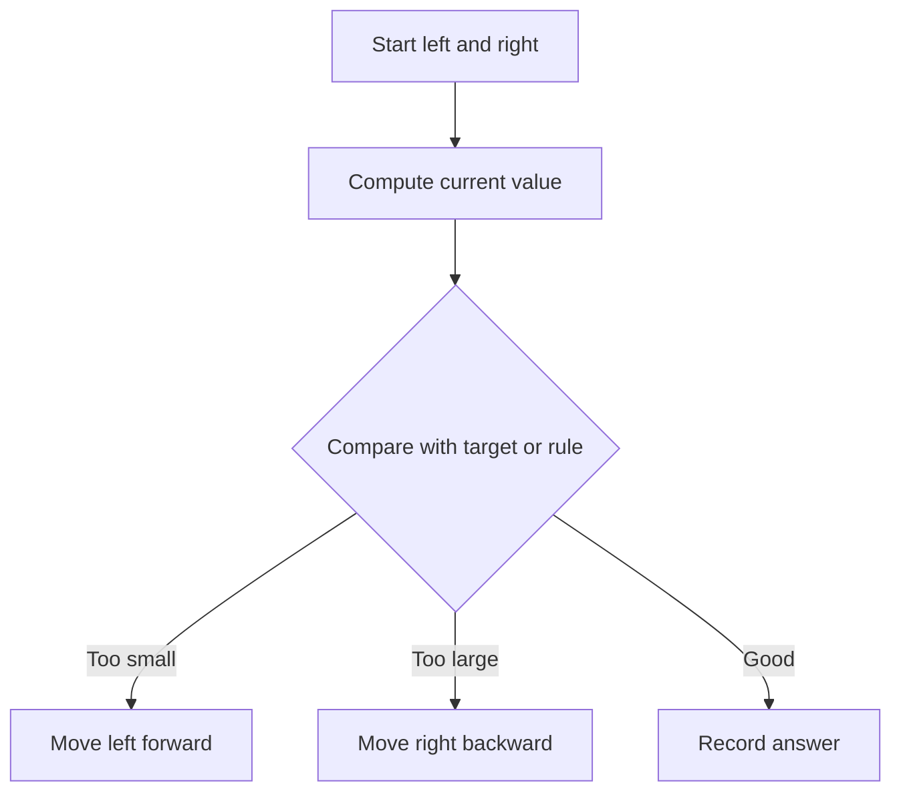

---

## 2.3 Expand and Shrink Framework

Use for variable windows.

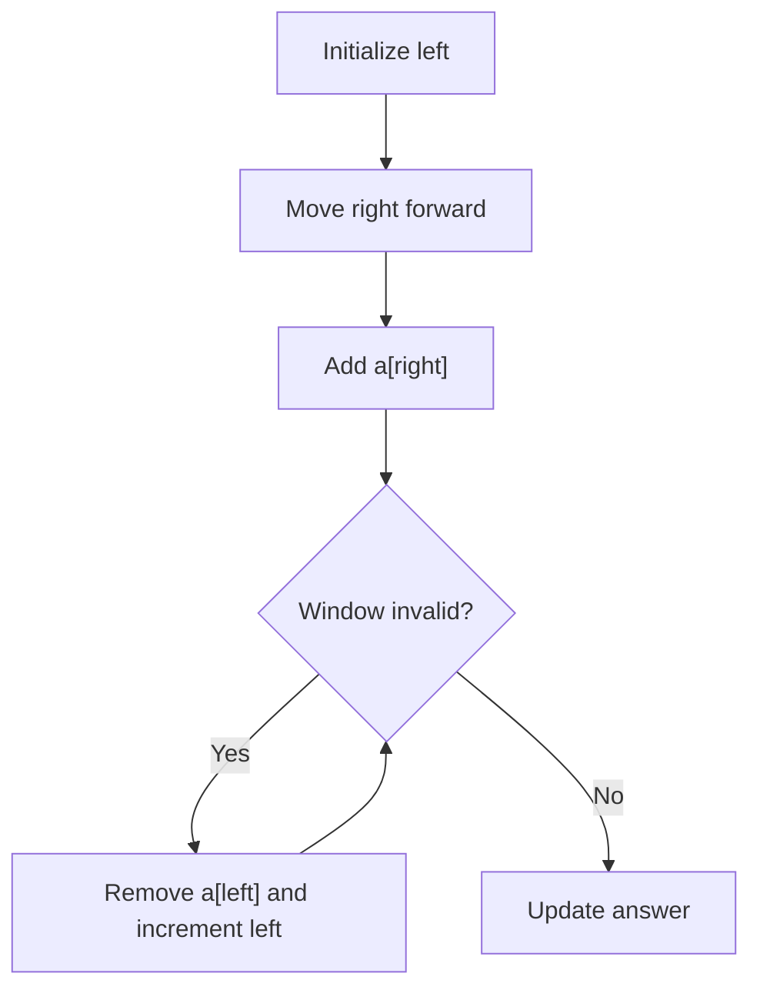

---

## 2.4 Fixed Window Framework

Use when problem gives exact size `k`.

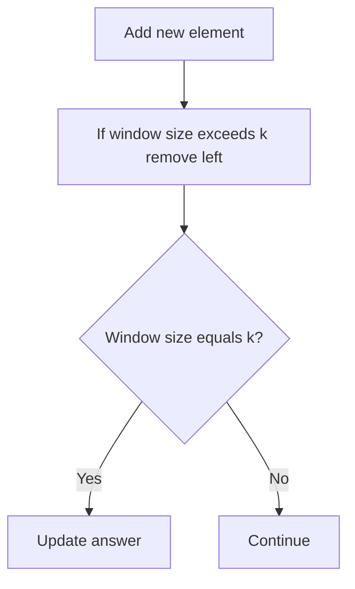

---

## 2.5 Count Subarrays Framework

For each `right`, maintain smallest valid `left`.

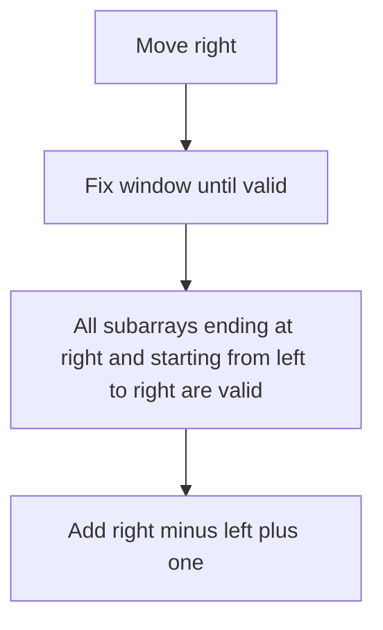

---

## 2.6 Multi-List Traversal Framework

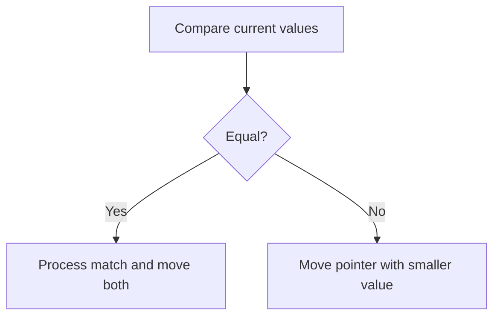

---

## 2.7 Sort plus Fix One Framework

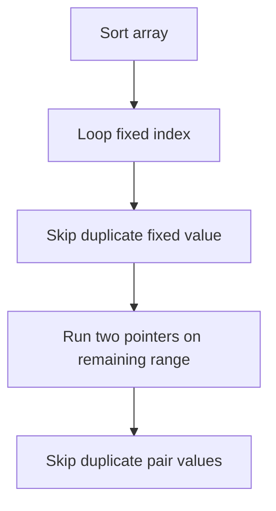

---

# 3. Problem Forms

## 3.1 Two Sum Sorted

Problem:

```text
Given sorted array, find if two numbers sum to target.
```

Move rule:

```text
sum too small -> left++
sum too large -> right--
```

```cpp
bool twoSumSorted(vector<int>& a, int target) {
    int left = 0;
    int right = (int)a.size() - 1;

    while (left < right) {
        int sum = a[left] + a[right];

        if (sum == target) return true;
        if (sum < target) left++;
        else right--;
    }

    return false;
}
```

---

## 3.2 Palindrome

Problem:

```text
Check whether string is palindrome.
```

```cpp
bool isPalindrome(const string& s) {
    int left = 0;
    int right = (int)s.size() - 1;

    while (left < right) {
        if (s[left] != s[right]) return false;
        left++;
        right--;
    }

    return true;
}
```

---

## 3.3 Container With Most Water

Move the shorter wall because it limits the area.

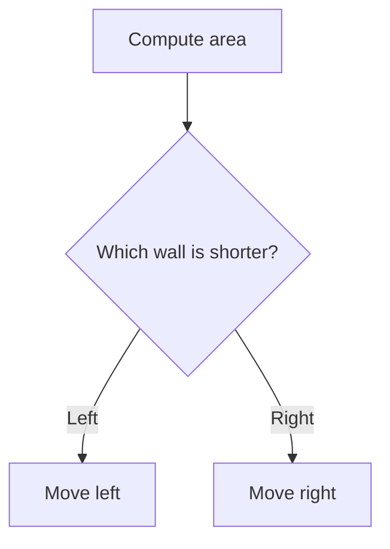

```cpp
int maxArea(vector<int>& height) {
    int left = 0;
    int right = (int)height.size() - 1;
    int ans = 0;

    while (left < right) {
        int width = right - left;
        int h = min(height[left], height[right]);
        ans = max(ans, width * h);

        if (height[left] < height[right]) left++;
        else right--;
    }

    return ans;
}
```

---

## 3.4 Longest Subarray With At Most K Zeros

```cpp
int longestOnes(vector<int>& a, int k) {
    int left = 0;
    int zeros = 0;
    int ans = 0;

    for (int right = 0; right < (int)a.size(); right++) {
        if (a[right] == 0) zeros++;

        while (zeros > k) {
            if (a[left] == 0) zeros--;
            left++;
        }

        ans = max(ans, right - left + 1);
    }

    return ans;
}
```

---

## 3.5 At Most K Distinct

Maintain frequency map and distinct count.

```cpp
long long countAtMostKDistinct(vector<int>& a, int k) {
    if (k < 0) return 0;

    unordered_map<int, int> freq;
    int left = 0;
    int distinct = 0;
    long long ans = 0;

    for (int right = 0; right < (int)a.size(); right++) {
        if (freq[a[right]] == 0) distinct++;
        freq[a[right]]++;

        while (distinct > k) {
            freq[a[left]]--;
            if (freq[a[left]] == 0) distinct--;
            left++;
        }

        ans += right - left + 1;
    }

    return ans;
}
```

---

## 3.6 Exactly K Distinct

```cpp
long long countExactlyKDistinct(vector<int>& a, int k) {
    return countAtMostKDistinct(a, k)
         - countAtMostKDistinct(a, k - 1);
}
```

---

## 3.7 Count Subarrays With Sum Less Than K

Works cleanly when all numbers are non-negative or positive.

```cpp
long long countSubarraysSumLessThanK(vector<int>& a, long long k) {
    int left = 0;
    long long sum = 0;
    long long ans = 0;

    for (int right = 0; right < (int)a.size(); right++) {
        sum += a[right];

        while (left <= right && sum >= k) {
            sum -= a[left];
            left++;
        }

        ans += right - left + 1;
    }

    return ans;
}
```

Important:

```text
If negative numbers exist, this monotonic window logic may fail.
Use prefix sum plus map or tree instead.
```

---

## 3.8 Minimum Size Subarray Sum

For positive numbers:

```cpp
int minSubarrayLen(long long target, vector<int>& a) {
    int n = a.size();
    int left = 0;
    long long sum = 0;
    int ans = n + 1;

    for (int right = 0; right < n; right++) {
        sum += a[right];

        while (sum >= target) {
            ans = min(ans, right - left + 1);
            sum -= a[left];
            left++;
        }
    }

    return ans == n + 1 ? 0 : ans;
}
```

---

## 3.9 Fixed Window Sum

```cpp
long long maxSumWindowK(vector<int>& a, int k) {
    long long sum = 0;
    long long ans = LLONG_MIN;

    for (int right = 0; right < (int)a.size(); right++) {
        sum += a[right];

        if (right >= k) {
            sum -= a[right - k];
        }

        if (right >= k - 1) {
            ans = max(ans, sum);
        }
    }

    return ans;
}
```

---

## 3.10 Sliding Window Maximum

Use monotonic deque.

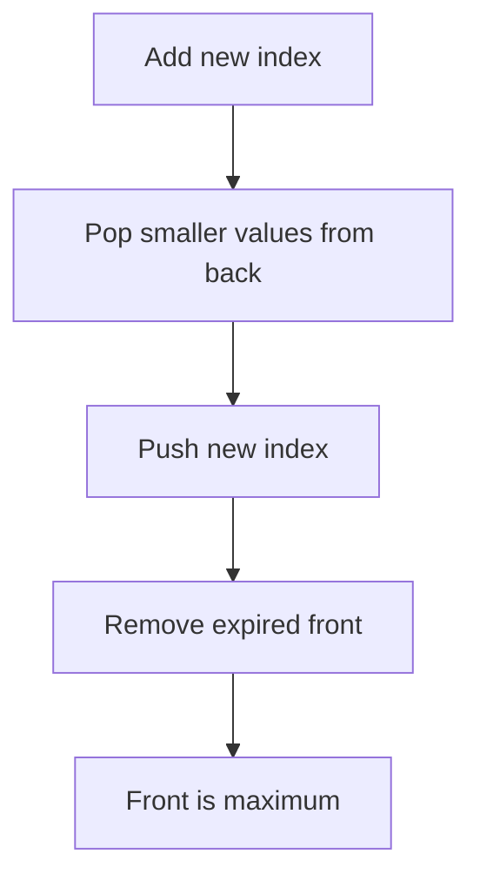

```cpp
vector<int> maxSlidingWindow(vector<int>& a, int k) {
    deque<int> dq;
    vector<int> ans;

    for (int i = 0; i < (int)a.size(); i++) {
        while (!dq.empty() && a[dq.back()] <= a[i]) {
            dq.pop_back();
        }

        dq.push_back(i);

        if (!dq.empty() && dq.front() <= i - k) {
            dq.pop_front();
        }

        if (i >= k - 1) {
            ans.push_back(a[dq.front()]);
        }
    }

    return ans;
}
```

---

## 3.11 Sliding Window Minimum

Same idea as maximum, but keep deque increasing.

```cpp
vector<int> minSlidingWindow(vector<int>& a, int k) {
    deque<int> dq;
    vector<int> ans;

    for (int i = 0; i < (int)a.size(); i++) {
        while (!dq.empty() && a[dq.back()] >= a[i]) {
            dq.pop_back();
        }

        dq.push_back(i);

        if (!dq.empty() && dq.front() <= i - k) {
            dq.pop_front();
        }

        if (i >= k - 1) {
            ans.push_back(a[dq.front()]);
        }
    }

    return ans;
}
```

---

## 3.12 Subsequence Check

```cpp
bool isSubsequence(string s, string t) {
    int i = 0;
    int j = 0;

    while (i < (int)s.size() && j < (int)t.size()) {
        if (s[i] == t[j]) i++;
        j++;
    }

    return i == (int)s.size();
}
```

---

## 3.13 Intersection of Sorted Arrays

```cpp
vector<int> intersectionSorted(vector<int>& a, vector<int>& b) {
    int i = 0;
    int j = 0;
    vector<int> ans;

    while (i < (int)a.size() && j < (int)b.size()) {
        if (a[i] == b[j]) {
            ans.push_back(a[i]);
            i++;
            j++;
        } else if (a[i] < b[j]) {
            i++;
        } else {
            j++;
        }
    }

    return ans;
}
```

---

## 3.14 3Sum

Sort, fix one, solve two-sum on the rest.

```cpp
vector<vector<int>> threeSum(vector<int>& a) {
    sort(a.begin(), a.end());

    vector<vector<int>> ans;
    int n = a.size();

    for (int i = 0; i < n; i++) {
        if (i > 0 && a[i] == a[i - 1]) continue;

        int left = i + 1;
        int right = n - 1;

        while (left < right) {
            long long sum = (long long)a[i] + a[left] + a[right];

            if (sum == 0) {
                ans.push_back({a[i], a[left], a[right]});

                int leftValue = a[left];
                int rightValue = a[right];

                while (left < right && a[left] == leftValue) left++;
                while (left < right && a[right] == rightValue) right--;
            } else if (sum < 0) {
                left++;
            } else {
                right--;
            }
        }
    }

    return ans;
}
```

---

## 3.15 4Sum

Fix two values, then two pointers.

```cpp
vector<vector<int>> fourSum(vector<int>& a, long long target) {
    sort(a.begin(), a.end());

    int n = a.size();
    vector<vector<int>> ans;

    for (int i = 0; i < n; i++) {
        if (i > 0 && a[i] == a[i - 1]) continue;

        for (int j = i + 1; j < n; j++) {
            if (j > i + 1 && a[j] == a[j - 1]) continue;

            int left = j + 1;
            int right = n - 1;

            while (left < right) {
                long long sum = (long long)a[i] + a[j] + a[left] + a[right];

                if (sum == target) {
                    ans.push_back({a[i], a[j], a[left], a[right]});

                    int leftValue = a[left];
                    int rightValue = a[right];

                    while (left < right && a[left] == leftValue) left++;
                    while (left < right && a[right] == rightValue) right--;
                } else if (sum < target) {
                    left++;
                } else {
                    right--;
                }
            }
        }
    }

    return ans;
}
```

---

## 3.16 Remove Duplicates from Sorted Array

Fast/slow pointer.

```cpp
int removeDuplicates(vector<int>& a) {
    if (a.empty()) return 0;

    int write = 1;

    for (int read = 1; read < (int)a.size(); read++) {
        if (a[read] != a[write - 1]) {
            a[write] = a[read];
            write++;
        }
    }

    return write;
}
```

---

## 3.17 Merge Two Sorted Arrays

```cpp
vector<int> mergeSorted(vector<int>& a, vector<int>& b) {
    int i = 0;
    int j = 0;
    vector<int> ans;

    while (i < (int)a.size() && j < (int)b.size()) {
        if (a[i] <= b[j]) {
            ans.push_back(a[i]);
            i++;
        } else {
            ans.push_back(b[j]);
            j++;
        }
    }

    while (i < (int)a.size()) ans.push_back(a[i++]);
    while (j < (int)b.size()) ans.push_back(b[j++]);

    return ans;
}
```

---

# 4. Tactics

## 4.1 Pattern Recognition

| Problem clue | Pattern |
|---|---|
| sorted pair sum | opposite ends |
| palindrome | opposite ends |
| max water container | opposite ends |
| longest subarray with condition | variable window |
| shortest subarray with positive sum | variable window |
| exact size k | fixed window |
| at most k distinct | frequency window |
| exactly k | atMost k minus atMost k minus one |
| subsequence | multi-list traversal |
| intersection of sorted arrays | multi-list traversal |
| 3Sum | sort plus fix one plus two pointers |
| sliding max or min | monotonic deque |

---

## 4.2 Pointer Movement Rules

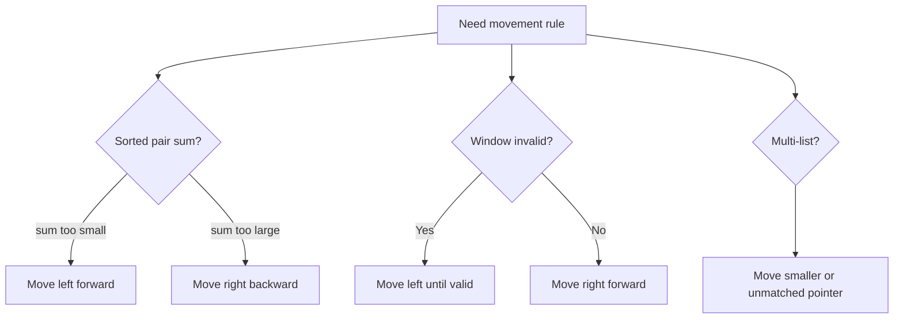

---

## 4.3 Counting Tactics

For valid window `[left, right]`:

```text
count += right - left + 1
```

This counts all valid subarrays ending at `right`.

For fixed `left` and farthest `right`:

```text
count += right - left + 1
```

---

## 4.4 Frequency Tactics

Use frequency map when the condition depends on counts.

```cpp
unordered_map<int, int> freq;
```

Use vector frequency when values are small:

```cpp
vector<int> freq(maxValue + 1, 0);
```

---

## 4.5 Duplicate Tactics

In sorted arrays:

```cpp
while (left < right && a[left] == oldLeft) left++;
while (left < right && a[right] == oldRight) right--;
```

Use this in:
- 3Sum
- 4Sum
- unique pair/triplet generation

---

## 4.6 When Sliding Window Fails

Sliding window usually needs monotonic behavior.

Fails often when:
- array has negative numbers and condition is sum-based
- removing left does not predictably improve validity
- condition is not monotonic

Use alternatives:
- prefix sum plus hash map
- balanced tree
- segment tree
- dynamic programming

---

## 4.7 Complexity Tactics

Nested loops are not always quadratic.

If both pointers only move forward:

```text
left moves at most n times
right moves at most n times
total O(n)
```

```mermaid
flowchart LR
    A["left moves forward only"] --> C["O n total moves"]
    B["right moves forward only"] --> C
```

---

# 5. C++ Template Library

## 5.1 Opposite Ends Template

```cpp
int left = 0;
int right = n - 1;

while (left < right) {
    auto value = combine(a[left], a[right]);

    if (good(value)) {
        recordAnswer();
        left++;
        right--;
    } else if (needBigger(value)) {
        left++;
    } else {
        right--;
    }
}
```

---

## 5.2 Variable Window Template

```cpp
int left = 0;

for (int right = 0; right < n; right++) {
    add(a[right]);

    while (!valid()) {
        remove(a[left]);
        left++;
    }

    updateAnswer(left, right);
}
```

---

## 5.3 Count At Most Template

```cpp
long long ans = 0;
int left = 0;

for (int right = 0; right < n; right++) {
    add(a[right]);

    while (!valid()) {
        remove(a[left]);
        left++;
    }

    ans += right - left + 1;
}
```

---

## 5.4 Fixed Window Template

```cpp
for (int right = 0; right < n; right++) {
    add(a[right]);

    if (right >= k) {
        remove(a[right - k]);
    }

    if (right >= k - 1) {
        updateAnswer();
    }
}
```

---

## 5.5 Head-Tail Maximal Window Template

```cpp
int head = -1;
int tail = 0;

while (tail < n) {
    while (head + 1 < n && canTake(head + 1)) {
        head++;
        add(a[head]);
    }

    updateAnswer(tail, head);

    if (tail > head) {
        tail++;
        head = tail - 1;
    } else {
        remove(a[tail]);
        tail++;
    }
}
```

---

## 5.6 Multi-List Traversal Template

```cpp
int i = 0;
int j = 0;

while (i < n && j < m) {
    if (a[i] == b[j]) {
        processMatch();
        i++;
        j++;
    } else if (a[i] < b[j]) {
        i++;
    } else {
        j++;
    }
}
```

---

## 5.7 Sort plus Fix One Template

```cpp
sort(a.begin(), a.end());

for (int i = 0; i < n; i++) {
    if (i > 0 && a[i] == a[i - 1]) continue;

    int left = i + 1;
    int right = n - 1;

    while (left < right) {
        long long sum = (long long)a[i] + a[left] + a[right];

        if (sum == target) {
            recordAnswer();

            int leftValue = a[left];
            int rightValue = a[right];

            while (left < right && a[left] == leftValue) left++;
            while (left < right && a[right] == rightValue) right--;
        } else if (sum < target) {
            left++;
        } else {
            right--;
        }
    }
}
```

---

# 6. Final Checklist

Before coding, ask:

```text
1. Is this about pair, subarray, or multiple lists?
2. Is the array sorted, or can I sort it?
3. Are pointers moving opposite directions or same direction?
4. What is the exact validity condition?
5. When invalid, how do I shrink?
6. When valid, do I update max length, min length, or count?
7. Do I need frequency map?
8. Do I need to handle duplicates?
9. Does sliding window fail because of negative numbers?
10. Is each pointer moving only forward?
```

---

# 7. Final Memory Hooks

```text
Two pointers = safely discard possibilities.

Opposite ends:
    sorted pair logic.

Sliding window:
    expand right, shrink left.

Count windows:
    add right - left + 1.

Exactly K:
    atMost(K) - atMost(K - 1).

3Sum:
    sort, fix one, two-sum.

If negative numbers break sum monotonicity:
    use prefix sum instead.
```

---

END
