# Prefix Sum Ultimate Problem Set — FAANG + CM Roadmap

> Goal: master prefix sum from **newbie → FAANG interview ready → Codeforces Candidate Master level**.
>
> This guide is organized by **forms**, **patterns**, **tactics**, **intuition**, **templates**, and **difficulty-wise problem sets**.
>
> Use it like a map: first identify the form, then use the matching template, then practice problems in increasing difficulty.

---

## Clickable Index

- [0. How to Use This Guide](#0-how-to-use-this-guide)
- [1. Master Prefix Sum Flowchart](#1-master-prefix-sum-flowchart)
- [2. Prefix Sum Pattern Map](#2-prefix-sum-pattern-map)
- [3. FAANG Pattern Recognition](#3-faang-pattern-recognition)
- [4. CM / Competitive Programming Escalation](#4-cm--competitive-programming-escalation)
- [5. Core Templates](#5-core-templates)
- [6. Forms, Intuition, Tactics, and Logic Flowcharts](#6-forms-intuition-tactics-and-logic-flowcharts)
  - [Form A — Static 1D Range Sum](#form-a--static-1d-range-sum)
  - [Form B — Prefix + Hash Map](#form-b--prefix--hash-map)
  - [Form C — Prefix Modulo / Remainder Counting](#form-c--prefix-modulo--remainder-counting)
  - [Form D — Prefix XOR](#form-d--prefix-xor)
  - [Form E — Difference Array / Imos](#form-e--difference-array--imos)
  - [Form F — 2D Prefix Sum](#form-f--2d-prefix-sum)
  - [Form G — 2D Difference Array](#form-g--2d-difference-array)
  - [Form H — Prefix + Binary Search](#form-h--prefix--binary-search)
  - [Form I — Prefix + Contribution / Counting](#form-i--prefix--contribution--counting)
  - [Form J — Prefix on Tree / Path Prefix](#form-j--prefix-on-tree--path-prefix)
  - [Form K — Dynamic Prefix Queries](#form-k--dynamic-prefix-queries)
- [7. Difficulty-Wise Problem Set](#7-difficulty-wise-problem-set)
  - [Newbie / Easy](#newbie--easy)
  - [FAANG Easy-Medium](#faang-easy-medium)
  - [Medium](#medium)
  - [Hard](#hard)
  - [CM-Level / Advanced](#cm-level--advanced)
- [8. FAANG Interview Drill Sheet](#8-faang-interview-drill-sheet)
- [9. Codeforces / CM Drill Sheet](#9-codeforces--cm-drill-sheet)
- [10. Common Mistakes](#10-common-mistakes)
- [11. Final Revision Checklist](#11-final-revision-checklist)

---

# 0. How to Use This Guide

For each problem:

```text
1. Read statement.
2. Identify whether it asks about range, subarray, matrix, updates, xor, modulo, or paths.
3. Match the clue to a prefix form.
4. Pick the template.
5. Dry run on small input.
6. Solve and compare with difficulty table.
```

Mental model:

```text
Problem clue → Form → Pattern → Tactic → Code template → Edge cases
```

---

# 1. Master Prefix Sum Flowchart

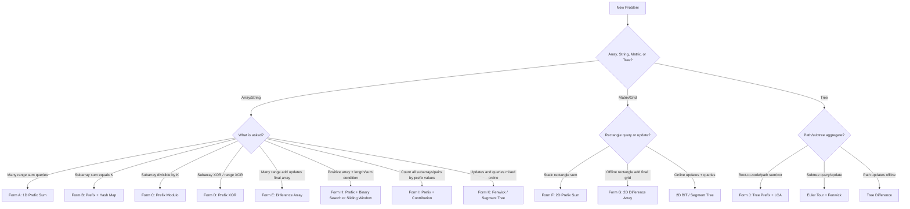

---

# 2. Prefix Sum Pattern Map

| Problem clue | Pattern/Form | Main tactic | Core intuition |
|---|---|---|---|
| `sum(l, r)` many times | 1D Prefix | Precompute cumulative sums | subtract before `l` from before `r` |
| static matrix rectangle sum | 2D Prefix | Inclusion-exclusion | add big rectangle, remove outside, add overlap |
| range add, final array only | Difference Array | Mark start/stop | update begins at `l`, stops after `r` |
| subarray sum equals `k` | Prefix + Map | Count previous prefix `pref-k` | current prefix asks for old prefix |
| longest subarray sum `k` | Prefix + earliest index | store first occurrence | longest length needs earliest valid prefix |
| subarray sum divisible by `k` | Prefix modulo count | same remainder pairs | equal remainders subtract to multiple of `k` |
| count odd/even/ones in range | Prefix frequency/count | prefix count | convert property to numeric count |
| range XOR | Prefix XOR | XOR cancellation | repeated parts cancel |
| subarray XOR equals `k` | Prefix XOR + Map | count `pref^k` | previous prefix needed to make xor `k` |
| dynamic point update + range sum | Fenwick Tree | maintain partial prefix online | prefix idea with updates |
| path sum in tree | Root prefix + LCA | cancel common path | root-to-u + root-to-v - twice root-to-lca |

---

# 3. FAANG Pattern Recognition

FAANG interviews usually test whether you can recognize **hidden prefix states**, not just basic range sum.

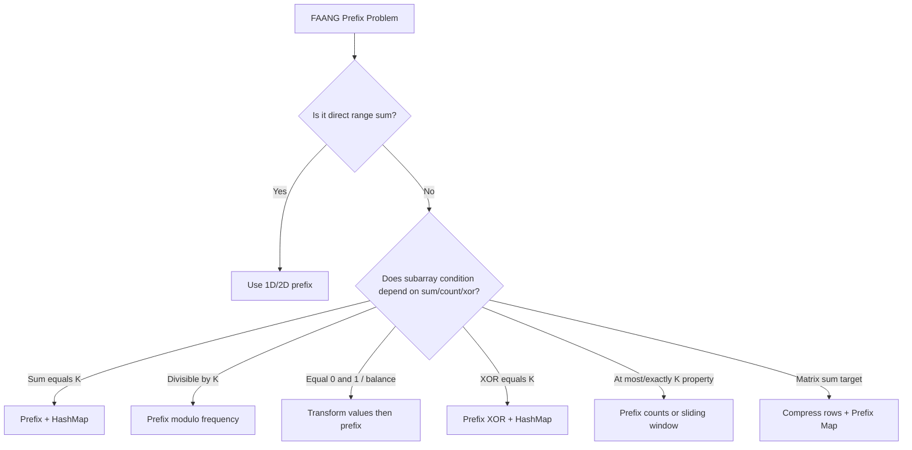

## FAANG signals

| Interview phrase | Think |
|---|---|
| “contiguous subarray” + target | Prefix + map |
| “number of subarrays” | Prefix frequency / contribution |
| “longest subarray” | Prefix + earliest index |
| “binary array” | Transform `0 → -1`, prefix balance, or count ones |
| “divisible by k” | prefix modulo |
| “matrix subrectangle sum target” | 2D compression + 1D prefix-map |
| “queries are many” | precompute prefix |
| “updates mixed with queries” | Fenwick / Segment Tree |

---

# 4. CM / Competitive Programming Escalation

CM-level prefix sum problems often combine prefix with another idea.

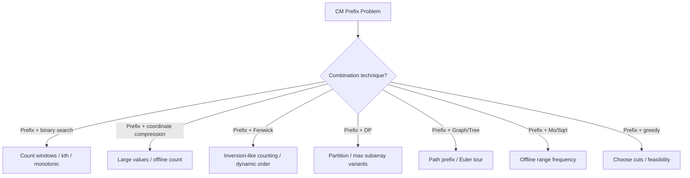

## CM escalation ladder

| Level | Prefix combination | Example idea |
|---|---|---|
| 800–1000 | direct prefix | range sums, count ones |
| 1100–1300 | prefix + map/mod | subarray count, divisible sums |
| 1400–1600 | prefix + sorting/binary search | count subarrays under condition |
| 1600–1900 | prefix + Fenwick/compression | count pairs of prefix values |
| 1900–2200 | prefix + DP/greedy | partition, maximum score |
| 2200+ | prefix + tree/2D/offline | path updates, matrix target, Mo-like counting |

---

# 5. Core Templates

## 5.1 C++ Base Template

```cpp
#include <bits/stdc++.h>
using namespace std;

using ll = long long;

int main() {
    ios::sync_with_stdio(false);
    cin.tie(nullptr);

    return 0;
}
```

---

## 5.2 1D Prefix Sum

```cpp
vector<long long> buildPrefix(const vector<long long>& a) {
    int n = (int)a.size();
    vector<long long> pref(n + 1, 0);

    for (int i = 0; i < n; i++) {
        pref[i + 1] = pref[i] + a[i];
    }

    return pref;
}

long long rangeSum(const vector<long long>& pref, int l, int r) {
    return pref[r + 1] - pref[l];
}
```

Use when:

```text
array static + many range sum queries
```

---

## 5.3 Prefix + HashMap Count Subarrays Sum K

```cpp
long long countSubarraySumK(vector<int>& a, long long k) {
    unordered_map<long long, long long> freq;
    freq[0] = 1;

    long long pref = 0;
    long long ans = 0;

    for (int x : a) {
        pref += x;
        ans += freq[pref - k];
        freq[pref]++;
    }

    return ans;
}
```

Intuition:

```text
sum(j+1..i) = pref[i] - pref[j]
Need sum = k
So pref[j] = pref[i] - k
```

---

## 5.4 Longest Subarray Sum K

```cpp
int longestSubarraySumK(vector<int>& a, long long k) {
    unordered_map<long long, int> first;
    first[0] = -1;

    long long pref = 0;
    int ans = 0;

    for (int i = 0; i < (int)a.size(); i++) {
        pref += a[i];

        if (first.count(pref - k)) {
            ans = max(ans, i - first[pref - k]);
        }

        if (!first.count(pref)) {
            first[pref] = i;
        }
    }

    return ans;
}
```

Tactic:

```text
For longest length, keep earliest index of each prefix sum.
```

---

## 5.5 Prefix Modulo Count

```cpp
long long countSubarraysDivisibleByK(vector<int>& a, int k) {
    vector<long long> freq(k, 0);
    freq[0] = 1;

    long long pref = 0;
    long long ans = 0;

    for (int x : a) {
        pref = (pref + x) % k;
        if (pref < 0) pref += k;

        ans += freq[pref];
        freq[pref]++;
    }

    return ans;
}
```

Intuition:

```text
If two prefixes have the same remainder, their difference is divisible by k.
```

---

## 5.6 Difference Array

```cpp
vector<long long> applyRangeAdds(
    int n,
    vector<tuple<int,int,long long>>& updates
) {
    vector<long long> diff(n + 1, 0);

    for (auto [l, r, x] : updates) {
        diff[l] += x;
        diff[r + 1] -= x;
    }

    vector<long long> ans(n);
    long long cur = 0;

    for (int i = 0; i < n; i++) {
        cur += diff[i];
        ans[i] = cur;
    }

    return ans;
}
```

---

## 5.7 2D Prefix Sum

```cpp
vector<vector<long long>> build2DPrefix(vector<vector<int>>& a) {
    int n = a.size();
    int m = a[0].size();

    vector<vector<long long>> pref(n + 1, vector<long long>(m + 1, 0));

    for (int i = 1; i <= n; i++) {
        for (int j = 1; j <= m; j++) {
            pref[i][j] = a[i - 1][j - 1]
                       + pref[i - 1][j]
                       + pref[i][j - 1]
                       - pref[i - 1][j - 1];
        }
    }

    return pref;
}

long long rectSum(
    vector<vector<long long>>& pref,
    int r1, int c1, int r2, int c2
) {
    return pref[r2 + 1][c2 + 1]
         - pref[r1][c2 + 1]
         - pref[r2 + 1][c1]
         + pref[r1][c1];
}
```

---

## 5.8 Prefix XOR

```cpp
vector<int> buildPrefixXor(vector<int>& a) {
    int n = a.size();
    vector<int> px(n + 1, 0);

    for (int i = 0; i < n; i++) {
        px[i + 1] = px[i] ^ a[i];
    }

    return px;
}

int rangeXor(vector<int>& px, int l, int r) {
    return px[r + 1] ^ px[l];
}
```

---

## 5.9 Fenwick Tree for Dynamic Prefix Sum

```cpp
struct Fenwick {
    int n;
    vector<long long> bit;

    Fenwick(int n) : n(n), bit(n + 1, 0) {}

    void add(int idx, long long val) {
        idx++;
        while (idx <= n) {
            bit[idx] += val;
            idx += idx & -idx;
        }
    }

    long long sumPrefix(int idx) {
        idx++;
        long long res = 0;
        while (idx > 0) {
            res += bit[idx];
            idx -= idx & -idx;
        }
        return res;
    }

    long long rangeSum(int l, int r) {
        return sumPrefix(r) - (l ? sumPrefix(l - 1) : 0);
    }
};
```

---

# 6. Forms, Intuition, Tactics, and Logic Flowcharts

---

## Form A — Static 1D Range Sum

### Use when

```text
Array is fixed.
Many queries ask sum(l, r).
```

### Logic flow

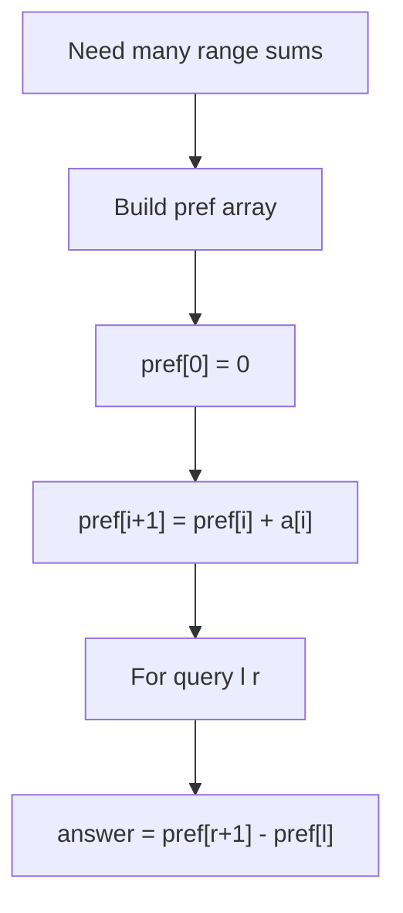

### Tactics

| Tactic | Why |
|---|---|
| Use `long long` | sum may overflow `int` |
| Use 1-indexed prefix | removes `l == 0` branch |
| Build once | each query becomes `O(1)` |

### Problems

| Difficulty | Problem | Link | Pattern | Tactic | Intuition |
|---|---|---|---|---|---|
| Easy | Running Sum of 1D Array | [LeetCode 1480](https://leetcode.com/problems/running-sum-of-1d-array/) | basic prefix | in-place cumulative | each element becomes total so far |
| Easy | Range Sum Query - Immutable | [LeetCode 303](https://leetcode.com/problems/range-sum-query-immutable/) | static range sum | class stores prefix | precompute once, answer many |
| Easy | Find Pivot Index | [LeetCode 724](https://leetcode.com/problems/find-pivot-index/) | left/right prefix | total sum trick | left sum equals total - left - current |
| Easy | Left and Right Sum Differences | [LeetCode 2574](https://leetcode.com/problems/left-and-right-sum-differences/) | prefix/suffix | running left | compare sides at each index |
| Easy | Static Range Sum Queries | [CSES 1646](https://cses.fi/problemset/task/1646) | range query | 1-indexed input | classic CP prefix |

---

## Form B — Prefix + Hash Map

### Use when

```text
Count/longest subarrays with exact sum K.
Array may contain negative numbers.
```

### Logic flow

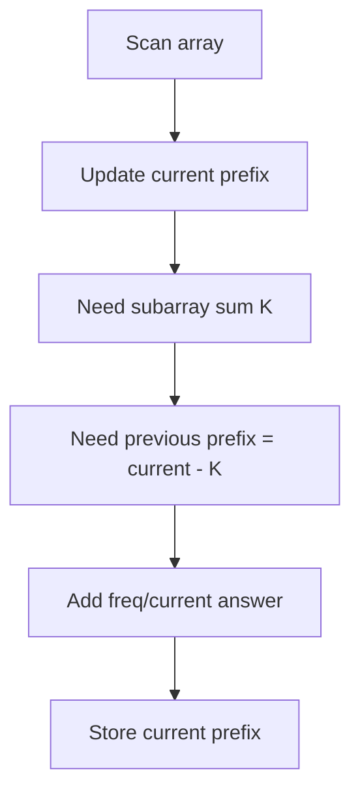

### Tactics

| Tactic | Why |
|---|---|
| `freq[0] = 1` | subarray can start at index 0 |
| Use hashmap | prefix sums can be negative/large |
| Use earliest index for longest | maximize distance |

### Problems

| Difficulty | Problem | Link | Pattern | Tactic | Intuition |
|---|---|---|---|---|---|
| Easy-Medium | Subarray Sum Equals K | [LeetCode 560](https://leetcode.com/problems/subarray-sum-equals-k/) | prefix + freq map | count `pref-k` | old prefix completes target |
| Easy-Medium | Contiguous Array | [LeetCode 525](https://leetcode.com/problems/contiguous-array/) | transform + prefix | `0 → -1`, earliest index | equal 0/1 means sum 0 |
| Medium | Binary Subarrays With Sum | [LeetCode 930](https://leetcode.com/problems/binary-subarrays-with-sum/) | prefix + map | count previous | binary array exact goal |
| Medium | Count Number of Nice Subarrays | [LeetCode 1248](https://leetcode.com/problems/count-number-of-nice-subarrays/) | odd count prefix | odd as 1, even as 0 | exactly k odds = subarray sum k |
| Medium | Maximum Size Subarray Sum Equals k | [LeetCode 325](https://leetcode.com/problems/maximum-size-subarray-sum-equals-k/) | longest prefix | earliest prefix index | maximize distance |
| Medium | Path Sum III | [LeetCode 437](https://leetcode.com/problems/path-sum-iii/) | tree prefix + map | DFS add/remove | current root path asks for old prefix |

---

## Form C — Prefix Modulo / Remainder Counting

### Use when

```text
Subarray sum divisible by K.
Need count or existence based on modulo.
```

### Logic flow

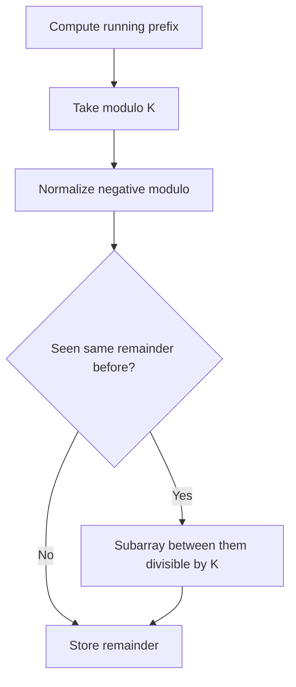

### Tactics

| Tactic | Why |
|---|---|
| normalize negative modulo | C++ `%` can be negative |
| equal remainder pair | difference divisible by `k` |
| frequency for count, first index for length | choose objective |

### Problems

| Difficulty | Problem | Link | Pattern | Tactic | Intuition |
|---|---|---|---|---|---|
| Easy-Medium | Continuous Subarray Sum | [LeetCode 523](https://leetcode.com/problems/continuous-subarray-sum/) | prefix modulo + earliest index | length at least 2 | same remainder means divisible |
| Medium | Subarray Sums Divisible by K | [LeetCode 974](https://leetcode.com/problems/subarray-sums-divisible-by-k/) | remainder frequency | normalize modulo | equal remainders form valid subarray |
| Medium | Make Sum Divisible by P | [LeetCode 1590](https://leetcode.com/problems/make-sum-divisible-by-p/) | prefix modulo + shortest removal | need target remainder | remove subarray to fix total |
| Hard | Count Array Pairs Divisible by K | [LeetCode 2183](https://leetcode.com/problems/count-array-pairs-divisible-by-k/) | gcd/remainder count | divisor grouping | modulo-like counting pattern |

---

## Form D — Prefix XOR

### Use when

```text
Range XOR queries or subarray XOR equals K.
```

### Logic flow

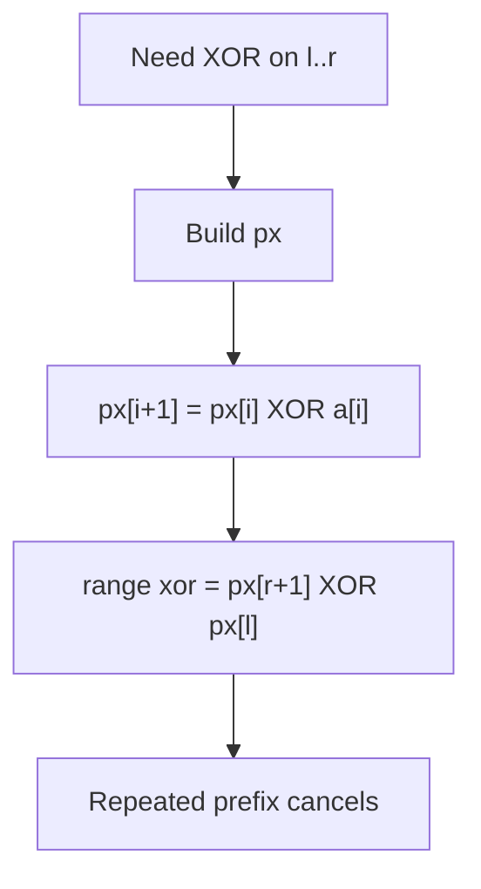

### Problems

| Difficulty | Problem | Link | Pattern | Tactic | Intuition |
|---|---|---|---|---|---|
| Easy-Medium | XOR Queries of a Subarray | [LeetCode 1310](https://leetcode.com/problems/xor-queries-of-a-subarray/) | prefix XOR | cancellation | same prefix part vanishes |
| Medium | Count Triplets That Can Form Two Arrays of Equal XOR | [LeetCode 1442](https://leetcode.com/problems/count-triplets-that-can-form-two-arrays-of-equal-xor/) | prefix XOR contribution | equal prefix XOR | zero xor segment creates many splits |
| Medium | Subarray XOR Equals K | [InterviewBit](https://www.interviewbit.com/problems/subarray-with-given-xor/) | prefix XOR + map | count `pref ^ k` | old prefix makes xor k |
| Medium | Range Xor Queries | [CSES 1650](https://cses.fi/problemset/task/1650) | prefix XOR / segment tree | static range xor | XOR version of range sum |

---

## Form E — Difference Array / Imos

### Use when

```text
Many range add updates are known first.
Need final array, not online query after every update.
```

### Logic flow

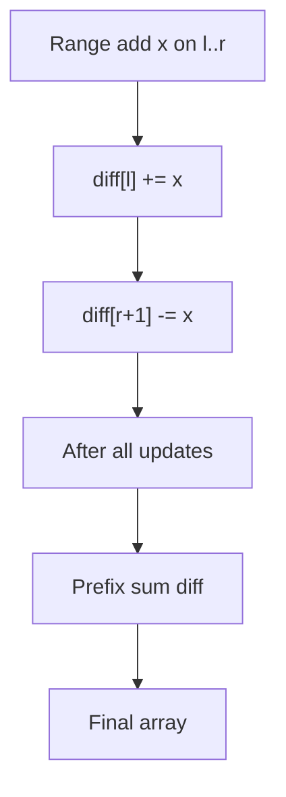

### Tactics

| Tactic | Why |
|---|---|
| allocate `n+1` or `n+2` | safe `r+1` |
| offline updates only | plain diff cannot answer mixed queries |
| sweep line relation | events start/end like intervals |

### Problems

| Difficulty | Problem | Link | Pattern | Tactic | Intuition |
|---|---|---|---|---|---|
| Easy | Shifting Letters | [LeetCode 848](https://leetcode.com/problems/shifting-letters/) | suffix/prefix diff | accumulate shifts | each shift affects prefix |
| Medium | Corporate Flight Bookings | [LeetCode 1109](https://leetcode.com/problems/corporate-flight-bookings/) | difference array | mark start/end | bookings add over ranges |
| Medium | Car Pooling | [LeetCode 1094](https://leetcode.com/problems/car-pooling/) | difference/sweep | capacity over time | passengers enter/leave |
| Medium | Shifting Letters II | [LeetCode 2381](https://leetcode.com/problems/shifting-letters-ii/) | difference array | +1/-1 shifts | range operations collapse into diff |
| Medium | Range Addition | [LeetCode 370](https://leetcode.com/problems/range-addition/) | classic diff | final reconstruction | update boundaries only |
| Medium | Range Update Queries | [CSES 1651](https://cses.fi/problemset/task/1651) | diff/Fenwick | range add point query | dynamic version of diff |

---

## Form F — 2D Prefix Sum

### Use when

```text
Static matrix/grid.
Many rectangle sum queries.
```

### Logic flow

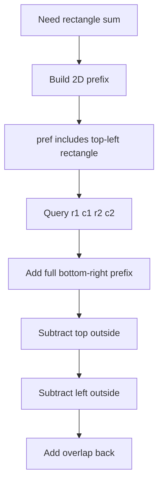

### Formula

```cpp
sum = pref[r2+1][c2+1]
    - pref[r1][c2+1]
    - pref[r2+1][c1]
    + pref[r1][c1];
```

### Problems

| Difficulty | Problem | Link | Pattern | Tactic | Intuition |
|---|---|---|---|---|---|
| Medium | Range Sum Query 2D - Immutable | [LeetCode 304](https://leetcode.com/problems/range-sum-query-2d-immutable/) | 2D prefix | inclusion-exclusion | rectangle from four prefix corners |
| Medium | Matrix Block Sum | [LeetCode 1314](https://leetcode.com/problems/matrix-block-sum/) | 2D prefix | clamp boundaries | query block around each cell |
| Medium | Forest Queries | [CSES 1652](https://cses.fi/problemset/task/1652) | 2D prefix | count stars | grid boolean sum |
| Medium | Image Overlap-style counting | [LeetCode 835](https://leetcode.com/problems/image-overlap/) | 2D/counting variant | coordinate shifts | prefix-like counting of aligned ones |

---

## Form G — 2D Difference Array

### Use when

```text
Many rectangle add updates.
Need final matrix after all updates.
```

### Logic flow

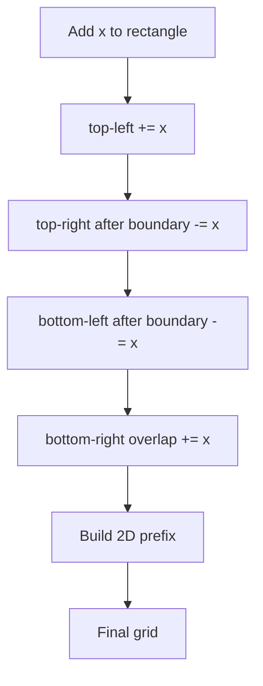

### Problems

| Difficulty | Problem | Link | Pattern | Tactic | Intuition |
|---|---|---|---|---|---|
| Medium | Range Addition II | [LeetCode 598](https://leetcode.com/problems/range-addition-ii/) | rectangle overlap shortcut | min row/min col | all ops overlap in top-left |
| Medium | Increment Submatrices by One | [LeetCode 2536](https://leetcode.com/problems/increment-submatrices-by-one/) | 2D difference | four corners | each query controls rectangle |
| Hard | Stamping the Grid | [LeetCode 2132](https://leetcode.com/problems/stamping-the-grid/) | 2D prefix + diff | validate empty stamp areas | prefix checks placement, diff marks coverage |
| Advanced | Forest Queries II | [CSES 1739](https://cses.fi/problemset/task/1739) | 2D BIT | online update/query | dynamic 2D prefix |

---

## Form H — Prefix + Binary Search

### Use when

```text
Positive numbers make prefix sums monotonic.
Need min/max length, count windows, kth value, or threshold.
```

### Logic flow

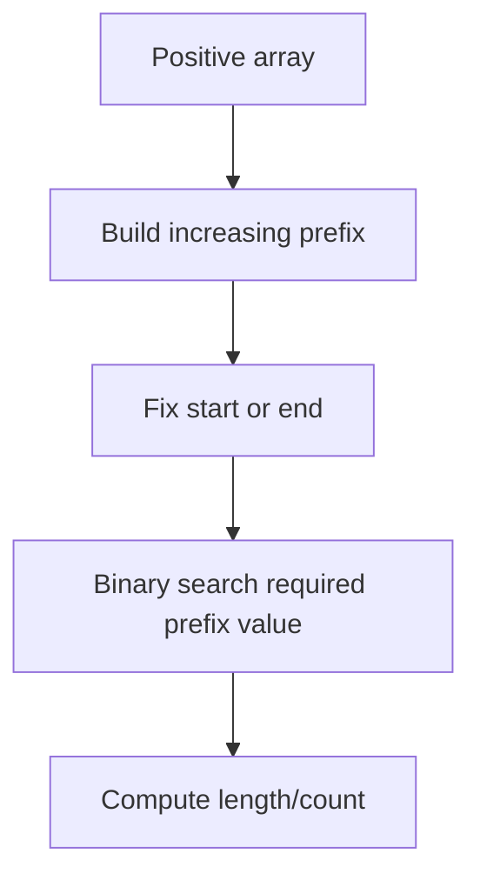

### Problems

| Difficulty | Problem | Link | Pattern | Tactic | Intuition |
|---|---|---|---|---|---|
| Medium | Minimum Size Subarray Sum | [LeetCode 209](https://leetcode.com/problems/minimum-size-subarray-sum/) | prefix + binary search / sliding window | positive array | find earliest end reaching target |
| Medium | K Radius Subarray Averages | [LeetCode 2090](https://leetcode.com/problems/k-radius-subarray-averages/) | fixed window prefix | range average | query window around center |
| Medium | Product of Array Except Self | [LeetCode 238](https://leetcode.com/problems/product-of-array-except-self/) | prefix/suffix product | two passes | prefix idea with multiplication |
| Hard | Count Subarrays With Score Less Than K | [LeetCode 2302](https://leetcode.com/problems/count-subarrays-with-score-less-than-k/) | prefix + two pointers | monotonic score | count valid windows by right endpoint |

---

## Form I — Prefix + Contribution / Counting

### Use when

```text
Need count/sum over all subarrays or all pairs of prefixes.
```

### Logic flow

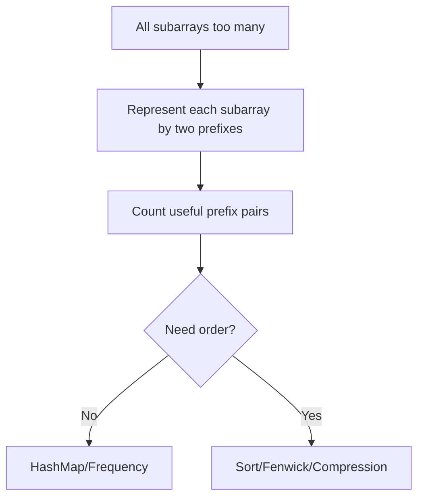

### Problems

| Difficulty | Problem | Link | Pattern | Tactic | Intuition |
|---|---|---|---|---|---|
| Medium | Sum of All Odd Length Subarrays | [LeetCode 1588](https://leetcode.com/problems/sum-of-all-odd-length-subarrays/) | contribution / prefix | count appearances | each element appears in many subarrays |
| Medium | Sum of Absolute Differences in a Sorted Array | [LeetCode 1685](https://leetcode.com/problems/sum-of-absolute-differences-in-a-sorted-array/) | prefix contribution | sorted prefix sums | left/right contribution formula |
| Medium | Sum of Subarray Minimums | [LeetCode 907](https://leetcode.com/problems/sum-of-subarray-minimums/) | contribution + stack | not pure prefix | count where element is min |
| Hard | Count of Range Sum | [LeetCode 327](https://leetcode.com/problems/count-of-range-sum/) | prefix + merge/Fenwick | count prefix pairs in range | subarray sum is prefix difference |
| Hard | Reverse Pairs | [LeetCode 493](https://leetcode.com/problems/reverse-pairs/) | pair counting | merge/Fenwick | similar ordered-pair counting |

---

## Form J — Prefix on Tree / Path Prefix

### Use when

```text
Need path sum/xor/count in tree.
```

### Logic flow

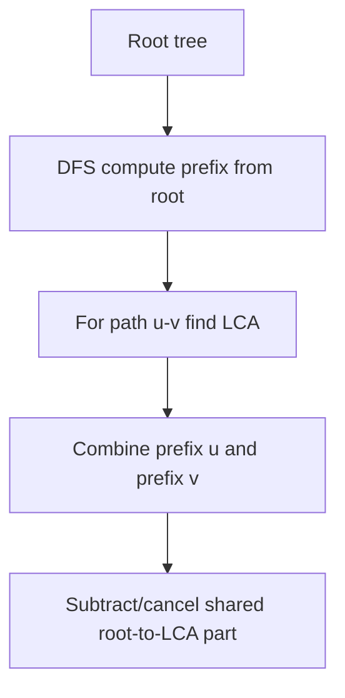

### Formulas

For node values:

```text
pathSum(u, v) = pref[u] + pref[v] - 2 * pref[lca] + value[lca]
```

For edge XOR:

```text
pathXor(u, v) = prefXor[u] ^ prefXor[v]
```

### Problems

| Difficulty | Problem | Link | Pattern | Tactic | Intuition |
|---|---|---|---|---|---|
| Medium | Path Sum III | [LeetCode 437](https://leetcode.com/problems/path-sum-iii/) | DFS prefix + map | backtrack freq | count ancestor prefixes |
| Medium | Count Good Nodes in Binary Tree | [LeetCode 1448](https://leetcode.com/problems/count-good-nodes-in-binary-tree/) | path aggregate | prefix max | track root path value |
| Hard | Count Paths That Can Form a Palindrome in a Tree | [LeetCode 2791](https://leetcode.com/problems/count-paths-that-can-form-a-palindrome-in-a-tree/) | tree prefix mask | parity mask count | path parity via XOR masks |
| Advanced | Distances in Tree Path Queries | [CSES Tree Algorithms](https://cses.fi/problemset/list/) | LCA + prefix/depth | preprocess ancestors | path query cancels common prefix |

---

## Form K — Dynamic Prefix Queries

### Use when

```text
Point updates and range sum queries are mixed online.
Plain prefix array is not enough.
```

### Logic flow

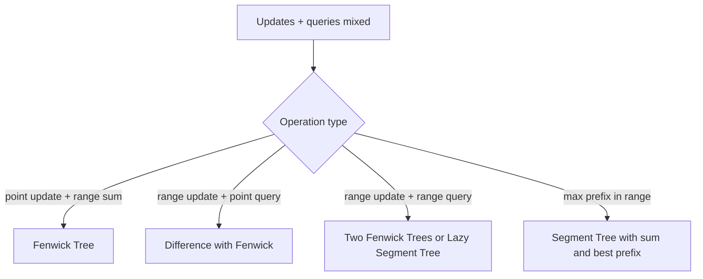

### Problems

| Difficulty | Problem | Link | Pattern | Tactic | Intuition |
|---|---|---|---|---|---|
| Medium | NumArray Mutable | [LeetCode 307](https://leetcode.com/problems/range-sum-query-mutable/) | Fenwick/Segment Tree | point update range sum | dynamic prefix maintenance |
| Medium | Dynamic Range Sum Queries | [CSES 1648](https://cses.fi/problemset/task/1648) | Fenwick | online updates | prefix tree handles changes |
| Medium | Range Update Queries | [CSES 1651](https://cses.fi/problemset/task/1651) | Fenwick difference | range add point query | diff array online |
| Hard | Range Updates and Sums | [CSES 1735](https://cses.fi/problemset/task/1735) | lazy segment tree | range update range query | prefix idea needs stronger DS |
| Hard | Prefix Sum Queries | [CSES 2166](https://cses.fi/problemset/task/2166) | segment tree | sum + max prefix | query best prefix after updates |

---

# 7. Difficulty-Wise Problem Set

## Newbie / Easy

| # | Problem | Link | Platform | Form | Pattern | Tactic | Intuition |
|---:|---|---|---|---|---|---|---|
| 1 | Running Sum of 1D Array | [LC 1480](https://leetcode.com/problems/running-sum-of-1d-array/) | LeetCode | A | basic prefix | cumulative update | answer at i is sum so far |
| 2 | Range Sum Query - Immutable | [LC 303](https://leetcode.com/problems/range-sum-query-immutable/) | LeetCode | A | static range sum | store pref | subtract before range |
| 3 | Find Pivot Index | [LC 724](https://leetcode.com/problems/find-pivot-index/) | LeetCode | A | left/right sum | total sum | compare left with right |
| 4 | Left and Right Sum Differences | [LC 2574](https://leetcode.com/problems/left-and-right-sum-differences/) | LeetCode | A | prefix/suffix | running left | compute both sides |
| 5 | Static Range Sum Queries | [CSES 1646](https://cses.fi/problemset/task/1646) | CSES | A | range query | 1-indexed pref | many queries after one build |
| 6 | Range XOR Queries | [CSES 1650](https://cses.fi/problemset/task/1650) | CSES | D | prefix XOR | cancellation | XOR range query |
| 7 | Matrix Block Sum | [LC 1314](https://leetcode.com/problems/matrix-block-sum/) | LeetCode | F | 2D prefix | clamp rectangle | each cell asks nearby block |

---

## FAANG Easy-Medium

| # | Problem | Link | Platform | Form | FAANG pattern | Tactic | Intuition |
|---:|---|---|---|---|---|---|---|
| 1 | Subarray Sum Equals K | [LC 560](https://leetcode.com/problems/subarray-sum-equals-k/) | LeetCode | B | exact target subarray | `freq[pref-k]` | current prefix needs old prefix |
| 2 | Contiguous Array | [LC 525](https://leetcode.com/problems/contiguous-array/) | LeetCode | B | balance binary array | transform 0 to -1 | equal count becomes sum zero |
| 3 | Continuous Subarray Sum | [LC 523](https://leetcode.com/problems/continuous-subarray-sum/) | LeetCode | C | divisible subarray | same remainder | difference divisible by k |
| 4 | Subarray Sums Divisible by K | [LC 974](https://leetcode.com/problems/subarray-sums-divisible-by-k/) | LeetCode | C | modulo frequency | normalize modulo | equal remainders pair |
| 5 | Binary Subarrays With Sum | [LC 930](https://leetcode.com/problems/binary-subarrays-with-sum/) | LeetCode | B | binary exact sum | prefix count | count old prefixes |
| 6 | Count Number of Nice Subarrays | [LC 1248](https://leetcode.com/problems/count-number-of-nice-subarrays/) | LeetCode | B | exactly k odds | odd as 1 | reduce to subarray sum k |
| 7 | Product of Array Except Self | [LC 238](https://leetcode.com/problems/product-of-array-except-self/) | LeetCode | H | prefix/suffix product | two passes | exclude self by left*right |
| 8 | Range Sum Query 2D - Immutable | [LC 304](https://leetcode.com/problems/range-sum-query-2d-immutable/) | LeetCode | F | 2D range query | inclusion-exclusion | four corners answer rectangle |
| 9 | Corporate Flight Bookings | [LC 1109](https://leetcode.com/problems/corporate-flight-bookings/) | LeetCode | E | range add offline | diff array | bookings start/stop |
| 10 | Car Pooling | [LC 1094](https://leetcode.com/problems/car-pooling/) | LeetCode | E | sweep/diff | passenger delta | capacity over time |
| 11 | Minimum Size Subarray Sum | [LC 209](https://leetcode.com/problems/minimum-size-subarray-sum/) | LeetCode | H | positive monotonic window | sliding/prefix BS | shrink while valid |
| 12 | K Radius Subarray Averages | [LC 2090](https://leetcode.com/problems/k-radius-subarray-averages/) | LeetCode | A | fixed range average | prefix window | average from range sum |

---

## Medium

| # | Problem | Link | Platform | Form | Pattern | Tactic | Intuition |
|---:|---|---|---|---|---|---|---|
| 1 | Shifting Letters II | [LC 2381](https://leetcode.com/problems/shifting-letters-ii/) | LeetCode | E | difference array | range +1/-1 | delayed shifts |
| 2 | Increment Submatrices by One | [LC 2536](https://leetcode.com/problems/increment-submatrices-by-one/) | LeetCode | G | 2D diff | four corners | rectangle updates offline |
| 3 | Count Triplets Equal XOR | [LC 1442](https://leetcode.com/problems/count-triplets-that-can-form-two-arrays-of-equal-xor/) | LeetCode | D/I | prefix XOR contribution | equal prefix xor | zero-xor interval gives splits |
| 4 | Sum of Absolute Differences in Sorted Array | [LC 1685](https://leetcode.com/problems/sum-of-absolute-differences-in-a-sorted-array/) | LeetCode | I | sorted prefix contribution | left/right sums | formula by position |
| 5 | Make Sum Divisible by P | [LC 1590](https://leetcode.com/problems/make-sum-divisible-by-p/) | LeetCode | C | remove shortest subarray | modulo index map | remove remainder to fix total |
| 6 | Number of Submatrices That Sum to Target | [LC 1074](https://leetcode.com/problems/number-of-submatrices-that-sum-to-target/) | LeetCode | F+B | compress rows + prefix map | reduce 2D to 1D | each row pair becomes array |
| 7 | Maximum Size Subarray Sum Equals k | [LC 325](https://leetcode.com/problems/maximum-size-subarray-sum-equals-k/) | LeetCode | B | longest exact sum | earliest prefix index | earlier prefix gives longer length |
| 8 | Dynamic Range Sum Queries | [CSES 1648](https://cses.fi/problemset/task/1648) | CSES | K | Fenwick | point update range query | dynamic prefix sum |
| 9 | Range Update Queries | [CSES 1651](https://cses.fi/problemset/task/1651) | CSES | K/E | Fenwick diff | range add point query | online difference array |
| 10 | Forest Queries | [CSES 1652](https://cses.fi/problemset/task/1652) | CSES | F | 2D prefix | star count | rectangle sum on grid |

---

## Hard

| # | Problem | Link | Platform | Form | Pattern | Tactic | Intuition |
|---:|---|---|---|---|---|---|---|
| 1 | Count of Range Sum | [LC 327](https://leetcode.com/problems/count-of-range-sum/) | LeetCode | I | prefix pair counting | merge sort/Fenwick | count prefix differences in range |
| 2 | Split Array Largest Sum | [LC 410](https://leetcode.com/problems/split-array-largest-sum/) | LeetCode | H | prefix + binary answer | minimize max block | check if limit works |
| 3 | Maximum Sum of 3 Non-Overlapping Subarrays | [LC 689](https://leetcode.com/problems/maximum-sum-of-3-non-overlapping-subarrays/) | LeetCode | A+DP | fixed window prefix | best left/right | combine three windows |
| 4 | Stamping the Grid | [LC 2132](https://leetcode.com/problems/stamping-the-grid/) | LeetCode | F+G | 2D prefix + 2D diff | validate and mark | prefix finds empty stamp areas |
| 5 | Count Subarrays With Score Less Than K | [LC 2302](https://leetcode.com/problems/count-subarrays-with-score-less-than-k/) | LeetCode | H | prefix + sliding window | positive monotonic score | valid windows by right endpoint |
| 6 | Subarrays With K Different Integers | [LC 992](https://leetcode.com/problems/subarrays-with-k-different-integers/) | LeetCode | related | atMost prefix/window | exact = atMost(k)-atMost(k-1) | count exact through two counts |
| 7 | Range Updates and Sums | [CSES 1735](https://cses.fi/problemset/task/1735) | CSES | K | lazy segtree | range set/add/sum | dynamic prefix not enough |
| 8 | Prefix Sum Queries | [CSES 2166](https://cses.fi/problemset/task/2166) | CSES | K | segment tree max prefix | store sum + best prefix | merge segment answers |

---

## CM-Level / Advanced

| # | Problem | Link | Platform | Form | CM pattern | Tactic | Intuition |
|---:|---|---|---|---|---|---|---|
| 1 | Forest Queries II | [CSES 1739](https://cses.fi/problemset/task/1739) | CSES | K/F | 2D BIT | toggle cell + rectangle sum | dynamic 2D prefix |
| 2 | Polynomial Queries | [CSES 1736](https://cses.fi/problemset/task/1736) | CSES | K/E | lazy segment tree | arithmetic progression update | diff idea with polynomial tags |
| 3 | Subarray Sum Queries | [CSES 1190](https://cses.fi/problemset/task/1190) | CSES | K/I | segment tree with prefix/suffix/best | max subarray dynamic | merge four values |
| 4 | Increasing Array Queries | [CSES 2416](https://cses.fi/problemset/task/2416) | CSES | I/K | prefix + monotonic structure | offline/segment idea | cost to make segment increasing |
| 5 | Count of Range Sum | [LC 327](https://leetcode.com/problems/count-of-range-sum/) | LeetCode | I | prefix + ordered counting | compression + BIT | count valid prefix differences |
| 6 | Count Paths That Can Form Palindrome in Tree | [LC 2791](https://leetcode.com/problems/count-paths-that-can-form-a-palindrome-in-a-tree/) | LeetCode | J/D | tree prefix bitmask | parity masks | path valid if mask has ≤1 bit |
| 7 | Number of Submatrices That Sum to Target | [LC 1074](https://leetcode.com/problems/number-of-submatrices-that-sum-to-target/) | LeetCode | F+B | 2D to 1D compression | row-pair enumeration | each compressed column array uses prefix map |
| 8 | Stamping the Grid | [LC 2132](https://leetcode.com/problems/stamping-the-grid/) | LeetCode | F+G | 2D prefix + 2D diff | validate coverage | combine query and update forms |
| 9 | Codeforces Prefix Sum Tag | [Codeforces Problemset](https://codeforces.com/problemset?tags=prefix%20sums) | Codeforces | Mixed | CP prefix | sort by rating | practice rating ladder |
| 10 | AtCoder Prefix/Sum Search | [AtCoder Tasks](https://atcoder.jp/contests/) | AtCoder | Mixed | prefix + binary/search | contest archive | common in ABC/ARC |

---

# 8. FAANG Interview Drill Sheet

## FAANG 7-day prefix plan

| Day | Focus | Problems |
|---:|---|---|
| 1 | Basic prefix | LC 1480, LC 303, LC 724 |
| 2 | Prefix + hashmap | LC 560, LC 525 |
| 3 | Modulo prefix | LC 523, LC 974 |
| 4 | Binary/count transformation | LC 930, LC 1248 |
| 5 | Difference array | LC 1109, LC 1094, LC 2381 |
| 6 | 2D prefix | LC 304, LC 1314, LC 1074 |
| 7 | Hard review | LC 327, LC 2132, LC 410 |

## FAANG explanation template

Use this in interviews:

```text
Brute force checks every subarray/range and is too slow.
The key observation is that any subarray sum can be represented as a difference of two prefix sums.
So while scanning, I keep information about previous prefixes.
For each current prefix, I ask which previous prefix would make the condition true.
This reduces the solution from O(n^2) to O(n).
```

## FAANG code checklist

```text
- Did I initialize prefix 0?
- Did I use long long for sums?
- Did I handle negative numbers?
- Did I store frequency or earliest index depending on count/longest?
- Did I explain why sliding window fails if negatives exist?
```

---

# 9. Codeforces / CM Drill Sheet

## Rating ladder

| Rating | Skill | Practice target |
|---:|---|---|
| 800–1000 | direct prefix | static sums, counts, simple transformations |
| 1000–1200 | difference array | range add, sweep line |
| 1200–1400 | prefix + map/mod | subarray counts, divisible sums |
| 1400–1600 | prefix + sorting/binary search | pair counting, threshold windows |
| 1600–1800 | prefix + Fenwick/compression | ordered prefix pair counting |
| 1800–2000 | 2D prefix/diff | grids, rectangles, coverage |
| 2000–2200 | segment tree prefix fields | max prefix, dynamic subarray |
| 2200+ | hybrid prefix | tree masks, offline queries, DP + prefix |

## CM thinking flow

```mermaid
flowchart TD
    A[Read constraints] --> B{Can O(n^2) pass?}
    B -->|Yes| C[Maybe enumerate starts + prefix O(1)]
    B -->|No| D{Need count pairs of prefixes?}
    D -->|Hashable equality| E[Map]
    D -->|Order/range condition| F[Sort/Fenwick/Merge]
    D -->|Dynamic updates| G[Segment Tree/Fenwick]
    D -->|2D| H[Compress dimension or 2D prefix]
```

---

# 10. Common Mistakes

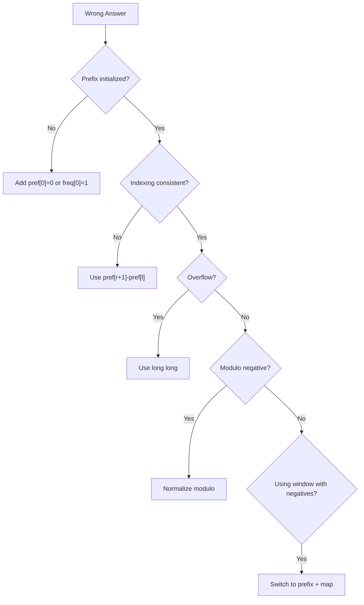

| Mistake | Fix |
|---|---|
| forgetting `freq[0] = 1` | initialize before loop |
| using `int` for sum | use `long long` |
| mixing 0-index and 1-index | always define `pref[i] = first i elements` |
| using sliding window with negatives | use prefix + map |
| wrong modulo for negative sums | `rem = ((rem % k) + k) % k` |
| forgetting `r+1` in diff | allocate `n+1` or `n+2` |
| wrong 2D signs | `+ full - top - left + overlap` |

---

# 11. Final Revision Checklist

```text
Prefix Sum:
    accumulate first, subtract later.

Difference Array:
    mark start and stop, rebuild later.

Prefix + HashMap:
    current prefix asks for old prefix.

Prefix Modulo:
    same remainder means divisible difference.

Prefix XOR:
    repeated parts cancel.

2D Prefix:
    add full rectangle, subtract outside, add overlap.

2D Difference:
    four corners control one rectangle.

Fenwick/Segment Tree:
    use when updates and queries are mixed online.

Tree Prefix:
    root paths cancel through LCA.
```

---

## Final Master Flow

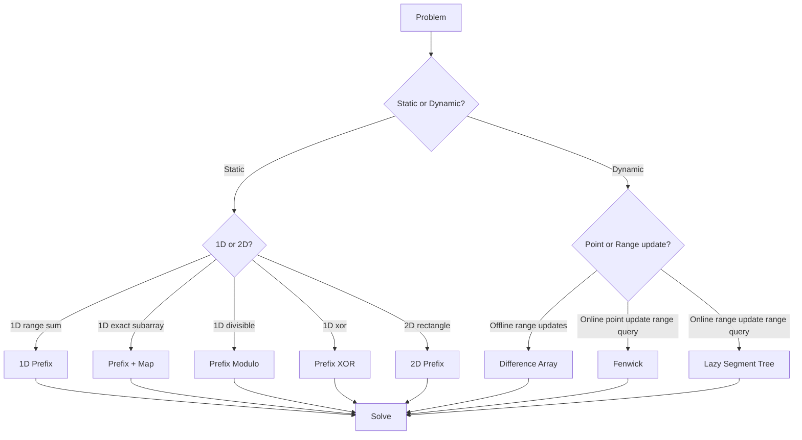

