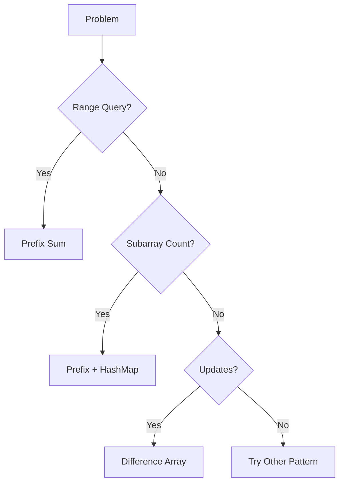

# Prefix Sum Ultimate Problem Set (Beginner → CM)

## Clickable Index
- [1. Master Flowchart](#1-master-flowchart)
- [2. Forms & Patterns](#2-forms--patterns)
- [3. Easy Problems](#3-easy-problems)
- [4. Medium Problems](#4-medium-problems)
- [5. Hard Problems](#5-hard-problems)
- [6. CM Level Problems](#6-cm-level-problems)

---

## 1. Master Flowchart

---

## 2. Forms & Patterns

| Form | Pattern | Tactic | Intuition |
|------|--------|--------|----------|
| Range Sum | Prefix Sum | Precompute | Avoid recomputation |
| Subarray Sum K | Prefix + Map | Store freq | reuse previous sums |
| Range Updates | Difference Array | Mark boundaries | lazy propagation idea |
| 2D Sum | 2D Prefix | Inclusion-Exclusion | rectangle splitting |

---

## 3. Easy Problems

| Problem | Platform | Form | Pattern | Tactic | Intuition |
|--------|---------|------|--------|--------|----------|
| Range Sum Query | LeetCode 303 | Range | Prefix | Precompute | direct formula |
| Running Sum | LC 1480 | Build | Prefix | accumulate | simple |
| Subarray Sum Equals K | LC 560 | Count | Prefix+Map | hashmap | reuse sum |

---

## 4. Medium Problems

| Problem | Platform | Form | Pattern | Tactic | Intuition |
|--------|---------|------|--------|--------|----------|
| Continuous Subarray Sum | LC 523 | Mod | Prefix mod | map | cycle |
| Count Nice Subarrays | LC 1248 | Count | Prefix freq | sliding + prefix | convert |
| Max Subarray Sum Divisible K | LC | Mod | Prefix mod | freq | same remainder |

---

## 5. Hard Problems

| Problem | Platform | Form | Pattern | Tactic | Intuition |
|--------|---------|------|--------|--------|----------|
| Subarrays with K Distinct | LC 992 | Count | Prefix + window | atMost trick | reduce |
| Count Range Sum | LC 327 | Range | Prefix + merge sort | divide conquer | ordered sums |
| Max Sum Rectangle | LC | 2D | Prefix 2D | compress rows | reduce dimension |

---

## 6. CM Level Problems

| Problem | Platform | Form | Pattern | Tactic | Intuition |
|--------|---------|------|--------|--------|----------|
| Kth Subarray Sum | CF | Order | Prefix + binary search | check function | monotonic |
| XOR Subarray Count | CF | Bit | Prefix XOR | hashmap | same xor |
| Dynamic Queries | CF | Update | Fenwick | online prefix | dynamic |

---

## How to Use

1. Identify form
2. Match pattern
3. Apply tactic
4. Code template

