# Greedy Algorithms Visual Reference

> C++-first reference for learning greedy from beginner to FAANG/interview to competitive programming level.  
> Focus: visual diagrams, pattern recognition, tactics, and proof using exchange argument.

---

## Clickable Index

| Level | Section |
|---|---|
| Core | [1. Greedy Core Idea](#1-greedy-core-idea) |
| Core | [2. Greedy vs DP Decision Flow](#2-greedy-vs-dp-decision-flow) |
| Beginner | [3. Beginner Patterns](#3-beginner-patterns) |
| Beginner | [4. Beginner Code Templates](#4-beginner-code-templates) |
| FAANG | [5. FAANG / Interview Patterns](#5-faang--interview-patterns) |
| FAANG | [6. FAANG Code Templates](#6-faang-code-templates) |
| Advanced | [7. Advanced / Competitive Patterns](#7-advanced--competitive-patterns) |
| Advanced | [8. Advanced Code Templates](#8-advanced-code-templates) |
| Proof | [9. How to Prove Greedy Works](#9-how-to-prove-greedy-works) |
| Proof | [10. Exchange Argument Step-by-Step](#10-exchange-argument-step-by-step) |
| Practice | [11. Pattern Cheat Sheet](#11-pattern-cheat-sheet) |
| Mistakes | [12. Common Mistakes](#12-common-mistakes) |
| Final | [13. Quick Interview Checklist](#13-quick-interview-checklist) |

---

# 1. Greedy Core Idea

## Simple Definition

Greedy means:

- Pick the **best choice right now**.
- Do **not** go back and change it.
- It works only when:
  - **Local best choice** leads to **global best answer**.

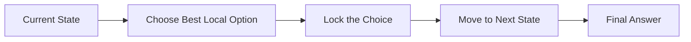

## Key Rule

| Question | Meaning |
|---|---|
| Can I make a best choice now? | Maybe greedy |
| Will this choice hurt the future? | Maybe not greedy |
| Can I prove local choice is safe? | Greedy likely works |
| Do I need to compare many future paths? | Usually DP/backtracking |

---

# 2. Greedy vs DP Decision Flow

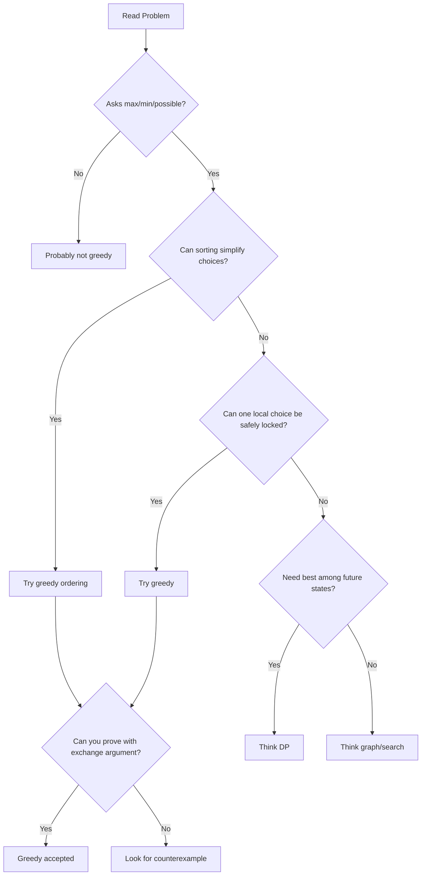

---

# 3. Beginner Patterns

## Beginner Pattern Map

| Pattern | Signal Words | Main Tactic | Example Problems |
|---|---|---|---|
| Sort + Pick | smallest, largest, max items | sort, then choose | Assign Cookies |
| Earliest Finish | non-overlap, meetings | sort by end time | Activity Selection |
| Running Min/Max | profit, best so far | one pass | Buy/Sell Stock |
| Count Greedy | minimum operations | take largest impact | Lemonade Change |

---

## Pattern 1: Sort + Pick

### Visual Idea

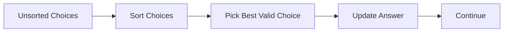

### Example: Assign Cookies

Goal: maximize children satisfied.

| Children Greed | Cookies Size | Action |
|---|---|---|
| small greed first | small cookie first | match if cookie >= greed |

### C++ Code

```cpp
#include <bits/stdc++.h>
using namespace std;

int findContentChildren(vector<int>& greed, vector<int>& cookies) {
    sort(greed.begin(), greed.end());
    sort(cookies.begin(), cookies.end());

    int child = 0, cookie = 0;

    while (child < greed.size() && cookie < cookies.size()) {
        if (cookies[cookie] >= greed[child]) {
            child++; // this child is satisfied
        }
        cookie++;
    }

    return child;
}
```

### Why Greedy Works

- Give the smallest possible cookie to the easiest child.
- Bigger cookies are saved for harder children.

---

## Pattern 2: Earliest Finish Time

Used for:

- Maximum non-overlapping meetings
- Activity selection
- Minimum removals to avoid overlap

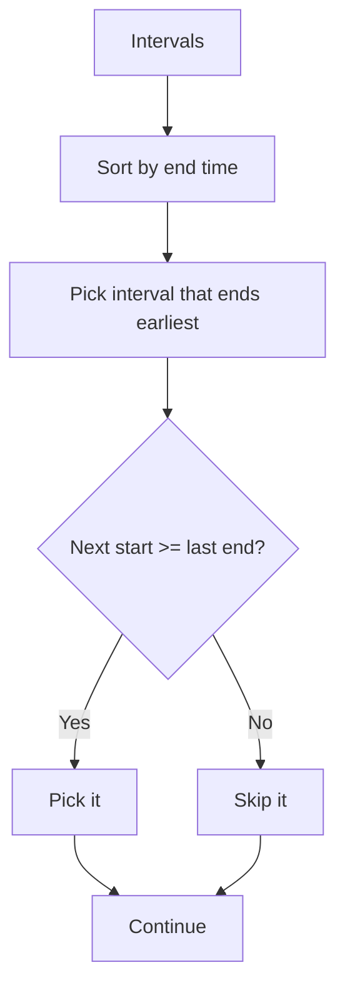

### C++ Code: Activity Selection

```cpp
#include <bits/stdc++.h>
using namespace std;

int maxActivities(vector<pair<int,int>>& intervals) {
    sort(intervals.begin(), intervals.end(), [](auto& a, auto& b) {
        return a.second < b.second; // sort by end time
    });

    int count = 0;
    int lastEnd = INT_MIN;

    for (auto [start, end] : intervals) {
        if (start >= lastEnd) {
            count++;
            lastEnd = end;
        }
    }

    return count;
}
```

---

## Pattern 3: Running Minimum / Maximum

Example: Best Time to Buy and Sell Stock.

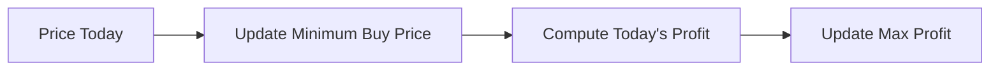

### C++ Code

```cpp
#include <bits/stdc++.h>
using namespace std;

int maxProfit(vector<int>& prices) {
    int minBuy = INT_MAX;
    int bestProfit = 0;

    for (int price : prices) {
        minBuy = min(minBuy, price);
        bestProfit = max(bestProfit, price - minBuy);
    }

    return bestProfit;
}
```

---

# 4. Beginner Code Templates

## Template: Sort and Greedily Pick

```cpp
sort(items.begin(), items.end());

int ans = 0;
for (auto item : items) {
    if (/* item is valid */) {
        ans++;
        // update state
    }
}
```

## Template: Track Best So Far

```cpp
int best = 0;
int state = INITIAL_VALUE;

for (int x : arr) {
    // update state
    // update best answer
}
```

---

# 5. FAANG / Interview Patterns

## FAANG Pattern Map

| Pattern | When You See | Data Structure | Example |
|---|---|---|---|
| Jump Reach | can reach end | max reachable index | Jump Game |
| Gas Balance | circular route | total + current balance | Gas Station |
| Interval Heap | rooms/resources | min-heap | Meeting Rooms II |
| Partition Boundary | split string/array | last occurrence map | Partition Labels |
| Rearrangement | most frequent first | max-heap | Reorganize String |

---

## Pattern 4: Forward Reachability

Used when problem asks:

- Can you reach the end?
- Minimum jumps?
- Maximum reachable position?

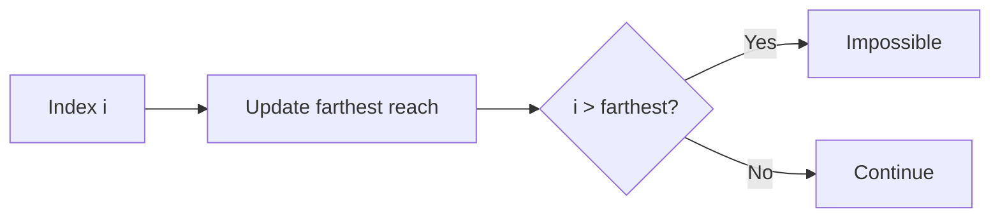

### C++ Code: Jump Game

```cpp
#include <bits/stdc++.h>
using namespace std;

bool canJump(vector<int>& nums) {
    int farthest = 0;

    for (int i = 0; i < nums.size(); i++) {
        if (i > farthest) return false;
        farthest = max(farthest, i + nums[i]);
    }

    return true;
}
```

---

## Pattern 5: Reset When Bad

Example: Gas Station.

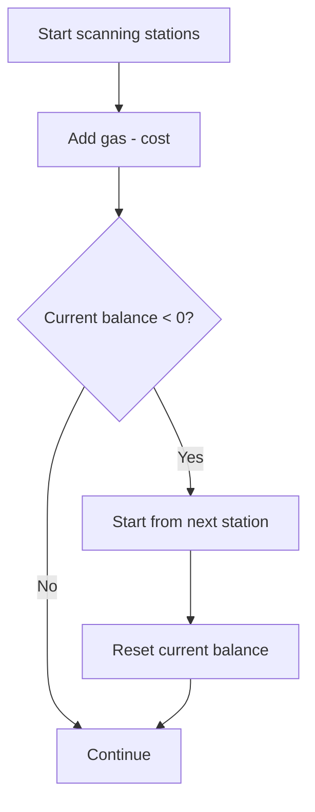

### C++ Code: Gas Station

```cpp
#include <bits/stdc++.h>
using namespace std;

int canCompleteCircuit(vector<int>& gas, vector<int>& cost) {
    int total = 0;
    int current = 0;
    int start = 0;

    for (int i = 0; i < gas.size(); i++) {
        int diff = gas[i] - cost[i];
        total += diff;
        current += diff;

        if (current < 0) {
            start = i + 1;
            current = 0;
        }
    }

    return total >= 0 ? start : -1;
}
```

---

## Pattern 6: Heap for Dynamic Best Choice

Used when the best option keeps changing.

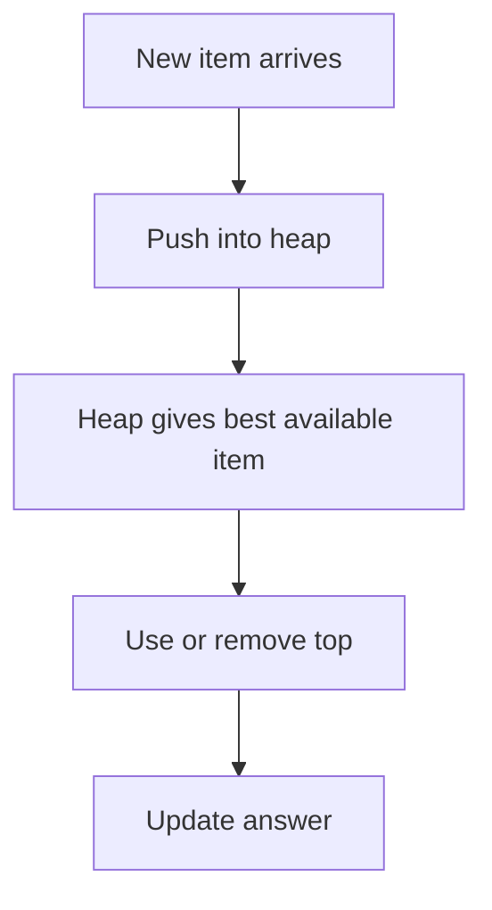

### C++ Code: Meeting Rooms II

```cpp
#include <bits/stdc++.h>
using namespace std;

int minMeetingRooms(vector<vector<int>>& intervals) {
    if (intervals.empty()) return 0;

    sort(intervals.begin(), intervals.end()); // sort by start time

    priority_queue<int, vector<int>, greater<int>> minHeap; // end times

    for (auto& meeting : intervals) {
        int start = meeting[0];
        int end = meeting[1];

        if (!minHeap.empty() && minHeap.top() <= start) {
            minHeap.pop(); // reuse room
        }

        minHeap.push(end);
    }

    return minHeap.size();
}
```

### Java Version: PriorityQueue Visual Comparison

```java
import java.util.*;

class Solution {
    public int minMeetingRooms(int[][] intervals) {
        Arrays.sort(intervals, (a, b) -> a[0] - b[0]);

        PriorityQueue<Integer> pq = new PriorityQueue<>(); // min-heap of end times

        for (int[] meeting : intervals) {
            int start = meeting[0];
            int end = meeting[1];

            if (!pq.isEmpty() && pq.peek() <= start) {
                pq.poll();
            }

            pq.offer(end);
        }

        return pq.size();
    }
}
```

---

## Pattern 7: Partition by Last Boundary

Example: Partition Labels.

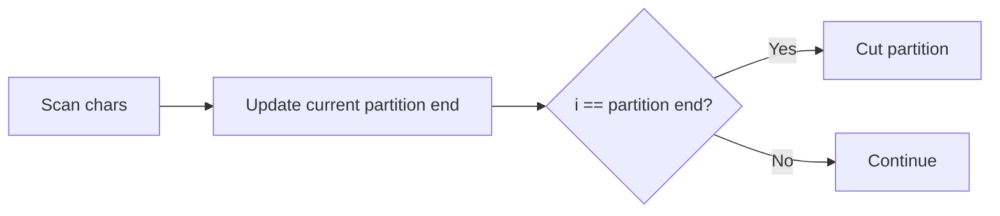

### C++ Code

```cpp
#include <bits/stdc++.h>
using namespace std;

vector<int> partitionLabels(string s) {
    vector<int> last(26);

    for (int i = 0; i < s.size(); i++) {
        last[s[i] - 'a'] = i;
    }

    vector<int> ans;
    int start = 0, end = 0;

    for (int i = 0; i < s.size(); i++) {
        end = max(end, last[s[i] - 'a']);

        if (i == end) {
            ans.push_back(end - start + 1);
            start = i + 1;
        }
    }

    return ans;
}
```

---

# 6. FAANG Code Templates

## Template: Reachability

```cpp
int farthest = 0;

for (int i = 0; i < n; i++) {
    if (i > farthest) return false;
    farthest = max(farthest, i + nums[i]);
}

return true;
```

## Template: Min-Heap for Resources

```cpp
sort(intervals.begin(), intervals.end());
priority_queue<int, vector<int>, greater<int>> pq;

for (auto item : intervals) {
    if (!pq.empty() && pq.top() <= item.start) {
        pq.pop();
    }
    pq.push(item.end);
}

return pq.size();
```

## Template: Max-Heap for Most Frequent Choice

```cpp
priority_queue<pair<int,char>> pq;

while (!pq.empty()) {
    auto [count, ch] = pq.top();
    pq.pop();

    // use best available character/item
    count--;

    if (count > 0) pq.push({count, ch});
}
```

---

# 7. Advanced / Competitive Patterns

## Advanced Pattern Map

| Pattern | Main Tool | Example |
|---|---|---|
| Exchange Argument | proof | Activity Selection |
| Greedy + DSU | union-find | Kruskal MST, Job Scheduling |
| Greedy + Binary Search | feasibility check | Aggressive Cows |
| Greedy on Graphs | cut property | MST |
| Greedy with Compression | sorting + structure | Huffman Coding |

---

## Pattern 8: Greedy + DSU

Used when:

- You choose items in sorted order.
- You need to know if adding something creates conflict.

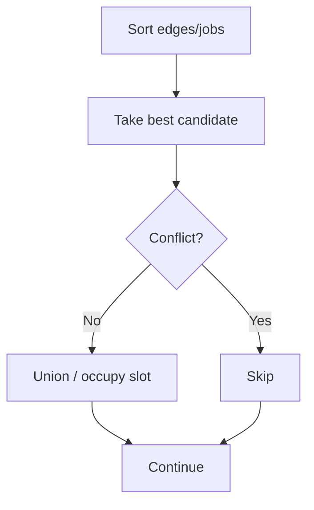

### C++ Code: Kruskal MST

```cpp
#include <bits/stdc++.h>
using namespace std;

class DSU {
public:
    vector<int> parent, rank;

    DSU(int n) {
        parent.resize(n);
        rank.assign(n, 0);
        iota(parent.begin(), parent.end(), 0);
    }

    int find(int x) {
        if (parent[x] == x) return x;
        return parent[x] = find(parent[x]);
    }

    bool unite(int a, int b) {
        a = find(a);
        b = find(b);

        if (a == b) return false;

        if (rank[a] < rank[b]) swap(a, b);
        parent[b] = a;

        if (rank[a] == rank[b]) rank[a]++;
        return true;
    }
};

struct Edge {
    int u, v, w;
};

int kruskal(int n, vector<Edge>& edges) {
    sort(edges.begin(), edges.end(), [](Edge& a, Edge& b) {
        return a.w < b.w;
    });

    DSU dsu(n);
    int mstCost = 0;

    for (auto& e : edges) {
        if (dsu.unite(e.u, e.v)) {
            mstCost += e.w;
        }
    }

    return mstCost;
}
```

---

## Pattern 9: Greedy + Binary Search

Used when:

- Need minimum possible maximum value.
- Need maximum possible minimum value.
- Direct answer is hard, but checking one answer is easy.

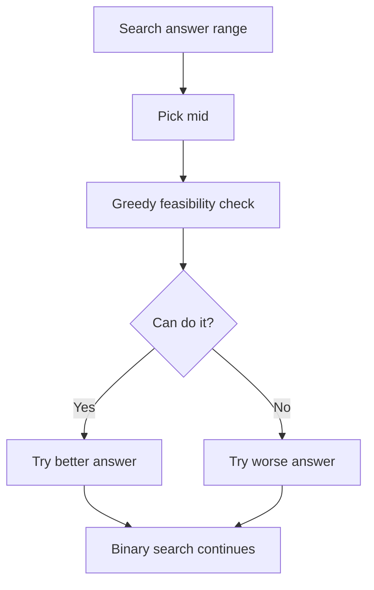

### C++ Code: Aggressive Cows Style

```cpp
#include <bits/stdc++.h>
using namespace std;

bool canPlace(vector<int>& stalls, int cows, int minDist) {
    int placed = 1;
    int lastPos = stalls[0];

    for (int i = 1; i < stalls.size(); i++) {
        if (stalls[i] - lastPos >= minDist) {
            placed++;
            lastPos = stalls[i];
        }
    }

    return placed >= cows;
}

int largestMinimumDistance(vector<int>& stalls, int cows) {
    sort(stalls.begin(), stalls.end());

    int low = 1;
    int high = stalls.back() - stalls.front();
    int ans = 0;

    while (low <= high) {
        int mid = low + (high - low) / 2;

        if (canPlace(stalls, cows, mid)) {
            ans = mid;
            low = mid + 1;
        } else {
            high = mid - 1;
        }
    }

    return ans;
}
```

---

## Pattern 10: Huffman Coding

Greedy idea:

- Always combine the two smallest frequencies.

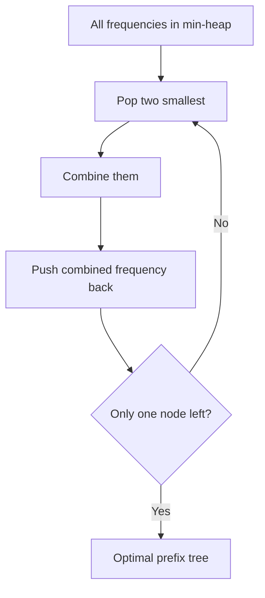

### C++ Code: Huffman Cost

```cpp
#include <bits/stdc++.h>
using namespace std;

int huffmanCost(vector<int>& freq) {
    priority_queue<int, vector<int>, greater<int>> pq(freq.begin(), freq.end());

    int cost = 0;

    while (pq.size() > 1) {
        int a = pq.top(); pq.pop();
        int b = pq.top(); pq.pop();

        int merged = a + b;
        cost += merged;
        pq.push(merged);
    }

    return cost;
}
```

---

# 8. Advanced Code Templates

## Template: DSU Greedy

```cpp
sort(items.begin(), items.end(), customComparator);
DSU dsu(n);

for (auto item : items) {
    if (dsu.unite(item.u, item.v)) {
        // accept item
    }
}
```

## Template: Binary Search + Greedy Check

```cpp
bool can(int x) {
    // greedy feasibility check
}

int low = 0, high = LIMIT, ans = -1;

while (low <= high) {
    int mid = low + (high - low) / 2;

    if (can(mid)) {
        ans = mid;
        low = mid + 1;   // or high = mid - 1 depending on goal
    } else {
        high = mid - 1;
    }
}
```

---

# 9. How to Prove Greedy Works

## The 3 Main Proof Styles

| Proof Style | Idea | Common Use |
|---|---|---|
| Exchange Argument | Replace part of optimal solution with greedy choice | intervals, scheduling |
| Stays Ahead | Greedy is always at least as good after each step | Jump Game, interval selection |
| Cut Property | Cheapest safe edge across a cut is always valid | MST |

---

## Proof Flow

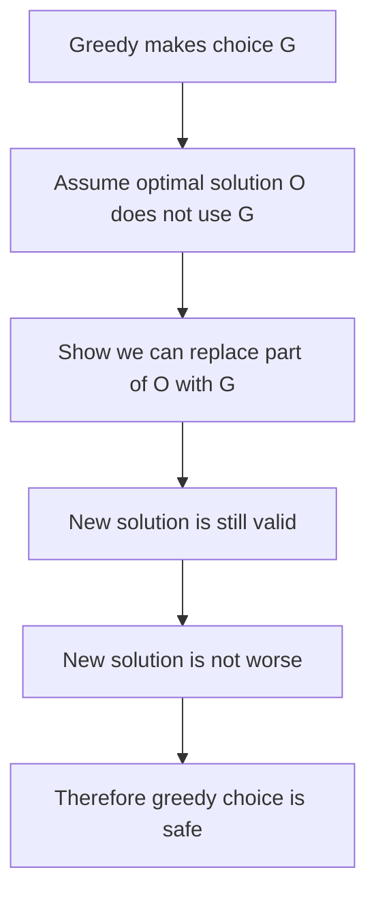

---

# 10. Exchange Argument Step-by-Step

## Example: Activity Selection

Goal: select maximum number of non-overlapping intervals.

Greedy choice:

- Pick the interval with the earliest end time.

---

## Step-by-Step Exchange Proof

| Step | Explanation |
|---|---|
| 1 | Let `G` be the interval chosen by greedy. It ends earliest. |
| 2 | Let `O` be an optimal solution. |
| 3 | If `O` already contains `G`, good. |
| 4 | If not, let `A` be the first interval in `O`. |
| 5 | Since `G` ends no later than `A`, replace `A` with `G`. |
| 6 | The rest of `O` still works because `G` ends earlier or equal. |
| 7 | Number of intervals stays the same. |
| 8 | So there exists an optimal solution containing greedy choice. |
| 9 | Repeat the argument for the remaining intervals. |

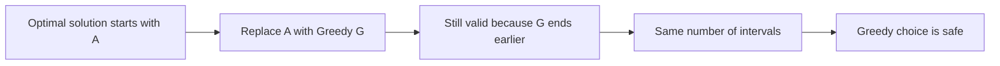

## Tiny Visual

```text
Optimal first interval A:
|-----------A-----------|

Greedy first interval G:
|------G------|

Because G ends earlier, it leaves more room for future intervals.
```

---

## Exchange Argument Template

Use this in interviews:

```text
1. Let greedy choose item G.
2. Consider any optimal solution O.
3. If O contains G, we are done.
4. Otherwise, find the item X in O that conflicts with or replaces G.
5. Replace X with G.
6. Show the solution remains valid.
7. Show the value is not worse.
8. Therefore, there exists an optimal solution with G.
9. Repeat recursively.
```

---

## C++ Example Connected to Proof

```cpp
int maxActivities(vector<pair<int,int>>& intervals) {
    // Greedy choice: earliest end time
    sort(intervals.begin(), intervals.end(), [](auto& a, auto& b) {
        return a.second < b.second;
    });

    int ans = 0;
    int lastEnd = INT_MIN;

    for (auto [start, end] : intervals) {
        if (start >= lastEnd) {
            ans++;
            lastEnd = end;
        }
    }

    return ans;
}
```

---

# 11. Pattern Cheat Sheet

## Recognition Table

| Problem Words | Think Pattern | Sort By | Data Structure |
|---|---|---|---|
| max non-overlapping | interval greedy | end time | none |
| minimum rooms/resources | interval heap | start time | min-heap |
| can reach end | reachability | none | farthest index |
| circular route | reset greedy | none | balance counters |
| minimum spanning tree | MST greedy | edge weight | DSU |
| max minimum distance | binary search + greedy | position | feasibility check |
| combine minimum cost | Huffman | none | min-heap |
| split into valid parts | boundary greedy | none | last index map |

---

## Greedy Forms

| Form | Shape |
|---|---|
| Sort + Pick | `sort -> loop -> choose valid` |
| Heap Greedy | `push candidates -> pop best` |
| Boundary Greedy | `expand end -> cut when safe` |
| Reach Greedy | `track farthest possible` |
| Reset Greedy | `if current bad -> reset start` |
| DSU Greedy | `sort -> union if safe` |
| Binary Search Greedy | `search answer -> greedy can()` |

---

# 12. Common Mistakes

| Mistake | Why It Fails | Fix |
|---|---|---|
| Choosing largest interval | Blocks future choices | Sort by end time |
| Greedy without proof | May fail hidden test | Try counterexample |
| Using greedy for all coin systems | Some coin systems need DP | Verify canonical system |
| Not sorting first | Wrong order | Identify correct sort key |
| Wrong heap type | Picks wrong candidate | min-heap vs max-heap |
| Ignoring equality | Off-by-one bugs | Check `<=`, `<`, `>=` carefully |

---

# 13. Quick Interview Checklist

Before saying “greedy”, ask:

- Can I sort the input?
- What should I sort by?
- What local choice seems safest?
- Can I lock this choice forever?
- Can I prove it with exchange argument?
- Can I find a counterexample?
- Does the problem need future-state comparison?
- Would DP be safer?

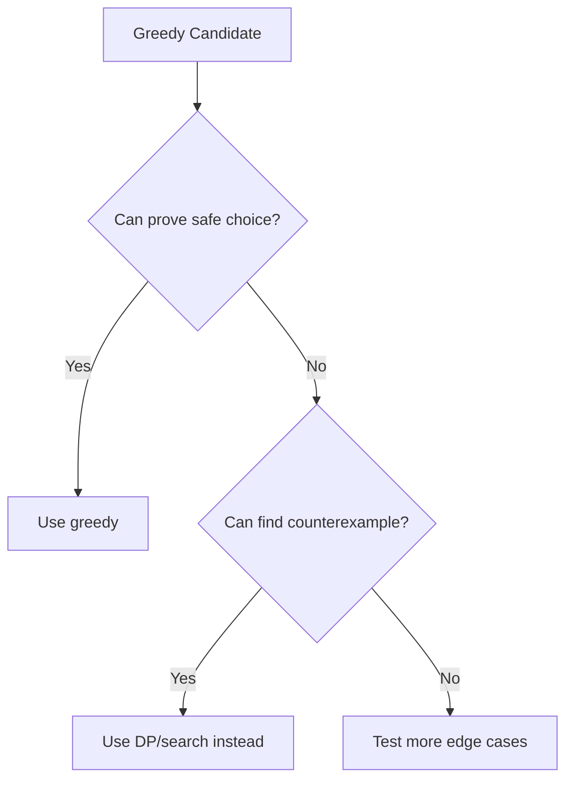

---

# Final Memory Hook

```text
Greedy = choose now, prove safe, never regret.
```

