# Ultimate Competitive Programming STL Guide — Combined Master File

> Render-safe edition: Mermaid diagrams were normalized for broad Markdown preview support.
>
> A single combined Markdown guide created from the three uploaded STL guides. It preserves the original material, adds a master clickable index, and includes extra decision diagrams, quick-reference tables, and study-flow enhancements.

## How to Use This Master Guide

1. Start with **Master Decision Map** when you do not know which STL/pattern to use.
2. Use **Core Notes** for intuition, dry runs, and code templates.
3. Use **Playbook** for frameworks and tactics.
4. Use **Ultimate Roadmap** for FAANG/CM practice problems and progression.

## Master Clickable Index

- [Part I — Core Notes, Dry Runs, and Templates](#part-i-core-notes-dry-runs-and-templates)
  - [Competitive Programming STL & Problem Solving Notes](#p1-competitive-programming-stl-problem-solving-notes)
    - [Clickable Index](#p1-clickable-index)
    - [0. Problem Solving Strategy](#p1-0-problem-solving-strategy)
      - [Time split in contest](#p1-time-split-in-contest)
      - [Intuition](#p1-intuition)
      - [Ideation checklist](#p1-ideation-checklist)
      - [Example](#p1-example)
      - [One-minute mental trick](#p1-one-minute-mental-trick)
    - [1. Balanced Brackets / Parentheses](#p1-1-balanced-brackets-parentheses)
      - [Core idea](#p1-core-idea)
      - [Intuition](#p1-intuition-2)
      - [C++: single bracket type](#p1-c-single-bracket-type)
      - [Dry Run And Mermaid Flow](#p1-dry-run-and-mermaid-flow)
      - [Multiple bracket types](#p1-multiple-bracket-types)
      - [Example](#p1-example-2)
      - [C++: stack + map](#p1-c-stack-map)
      - [Dry Run And Mermaid Flow](#p1-dry-run-and-mermaid-flow-2)
      - [Range query on balanced parentheses](#p1-range-query-on-balanced-parentheses)
      - [One-minute mental trick](#p1-one-minute-mental-trick-2)
    - [2. Sliding Window: Subarray Maintenance](#p1-2-sliding-window-subarray-maintenance)
      - [General template](#p1-general-template)
      - [Dry Run And Mermaid Flow](#p1-dry-run-and-mermaid-flow-3)
      - [Intuition](#p1-intuition-3)
      - [Example](#p1-example-3)
      - [One-minute mental trick](#p1-one-minute-mental-trick-3)
    - [3. Sliding Window Minimum](#p1-3-sliding-window-minimum)
      - [Using multiset](#p1-using-multiset)
      - [Dry Run And Mermaid Flow](#p1-dry-run-and-mermaid-flow-4)
      - [Using monotonic deque](#p1-using-monotonic-deque)
      - [Intuition](#p1-intuition-4)
      - [C++ monotonic deque](#p1-c-monotonic-deque)
      - [Dry Run And Mermaid Flow](#p1-dry-run-and-mermaid-flow-5)
      - [One-minute mental trick](#p1-one-minute-mental-trick-4)
    - [4. Sliding Window Cost / Make All Elements Equal](#p1-4-sliding-window-cost-make-all-elements-equal)
      - [Intuition](#p1-intuition-5)
      - [Data structure](#p1-data-structure)
      - [Example](#p1-example-4)
      - [C++](#p1-c)
      - [Dry Run And Mermaid Flow](#p1-dry-run-and-mermaid-flow-6)
      - [One-minute mental trick](#p1-one-minute-mental-trick-5)
    - [5. Mean, Variance, Median, Mode Dashboard](#p1-5-mean-variance-median-mode-dashboard)
      - [Intuition](#p1-intuition-6)
      - [Formulas](#p1-formulas)
      - [Example](#p1-example-5)
      - [C++ structure](#p1-c-structure)
      - [Dry Run And Mermaid Flow](#p1-dry-run-and-mermaid-flow-7)
      - [One-minute mental trick](#p1-one-minute-mental-trick-6)
    - [6. Prefix Sum and Subarray Sum Equals X](#p1-6-prefix-sum-and-subarray-sum-equals-x)
      - [Intuition](#p1-intuition-7)
      - [Example](#p1-example-6)
      - [C++ count only](#p1-c-count-only)
      - [Dry Run And Mermaid Flow](#p1-dry-run-and-mermaid-flow-8)
      - [C++ print all ranges](#p1-c-print-all-ranges)
      - [Dry Run And Mermaid Flow](#p1-dry-run-and-mermaid-flow-9)
      - [One-minute mental trick](#p1-one-minute-mental-trick-7)
    - [7. Stack Mastery: Next Greater Element](#p1-7-stack-mastery-next-greater-element)
      - [Intuition](#p1-intuition-8)
      - [Example](#p1-example-7)
      - [C++](#p1-c-2)
      - [Dry Run And Mermaid Flow](#p1-dry-run-and-mermaid-flow-10)
      - [One-minute mental trick](#p1-one-minute-mental-trick-8)
    - [8. Trapping Rain Water](#p1-8-trapping-rain-water)
      - [Stack approach](#p1-stack-approach)
      - [Intuition](#p1-intuition-9)
      - [Example](#p1-example-8)
      - [C++](#p1-c-3)
      - [Dry Run And Mermaid Flow](#p1-dry-run-and-mermaid-flow-11)
      - [One-minute mental trick](#p1-one-minute-mental-trick-9)
    - [9. Range Mapping / Interval Coverage](#p1-9-range-mapping-interval-coverage)
      - [Offline version](#p1-offline-version)
      - [Intuition](#p1-intuition-10)
      - [C++](#p1-c-4)
      - [Dry Run And Mermaid Flow](#p1-dry-run-and-mermaid-flow-12)
      - [Online version: maintain merged intervals](#p1-online-version-maintain-merged-intervals)
      - [Example](#p1-example-9)
      - [C++](#p1-c-5)
      - [Dry Run And Mermaid Flow](#p1-dry-run-and-mermaid-flow-13)
      - [One-minute mental trick](#p1-one-minute-mental-trick-10)
    - [10. Top K Sum](#p1-10-top-k-sum)
      - [Two multiset method](#p1-two-multiset-method)
      - [Intuition](#p1-intuition-11)
      - [Example](#p1-example-10)
      - [C++](#p1-c-6)
      - [Dry Run And Mermaid Flow](#p1-dry-run-and-mermaid-flow-14)
      - [One-minute mental trick](#p1-one-minute-mental-trick-11)
    - [11. Priority Queue Notes](#p1-11-priority-queue-notes)
      - [Intuition](#p1-intuition-12)
      - [Example use cases](#p1-example-use-cases)
      - [One-minute mental trick](#p1-one-minute-mental-trick-12)
    - [12. Stack and Queue Basics](#p1-12-stack-and-queue-basics)
      - [Stack](#p1-stack)
      - [Queue](#p1-queue)
      - [Visual](#p1-visual)
      - [Implement stack using two queues](#p1-implement-stack-using-two-queues)
      - [Dry Run And Mermaid Flow](#p1-dry-run-and-mermaid-flow-15)
      - [One-minute mental trick](#p1-one-minute-mental-trick-13)
    - [13. Contribution Technique](#p1-13-contribution-technique)
      - [Intuition](#p1-intuition-13)
      - [Sum of all subarrays](#p1-sum-of-all-subarrays)
      - [Example](#p1-example-11)
      - [C++](#p1-c-7)
      - [Dry Run And Mermaid Flow](#p1-dry-run-and-mermaid-flow-16)
      - [Sum of all subsequences](#p1-sum-of-all-subsequences)
      - [Dry Run And Mermaid Flow](#p1-dry-run-and-mermaid-flow-17)
      - [Product of all subarrays sum](#p1-product-of-all-subarrays-sum)
      - [Example](#p1-example-12)
      - [C++](#p1-c-8)
      - [Dry Run And Mermaid Flow](#p1-dry-run-and-mermaid-flow-18)
      - [One-minute mental trick](#p1-one-minute-mental-trick-14)
    - [14. Pattern Matching / Coordinate Geometry Printing](#p1-14-pattern-matching-coordinate-geometry-printing)
      - [Intuition](#p1-intuition-14)
      - [Template](#p1-template)
      - [Dry Run And Mermaid Flow](#p1-dry-run-and-mermaid-flow-19)
      - [Common conditions](#p1-common-conditions)
      - [Repeating columns](#p1-repeating-columns)
      - [One-minute mental trick](#p1-one-minute-mental-trick-15)
    - [15. Molecular Formula Parser](#p1-15-molecular-formula-parser)
      - [Key ideas](#p1-key-ideas)
      - [Intuition](#p1-intuition-15)
      - [C++ parser](#p1-c-parser)
      - [Dry Run And Mermaid Flow](#p1-dry-run-and-mermaid-flow-20)
      - [One-minute mental trick](#p1-one-minute-mental-trick-16)
    - [16. Choosing the Right STL](#p1-16-choosing-the-right-stl)
      - [STL decision diagram](#p1-stl-decision-diagram)
      - [One-minute mental trick](#p1-one-minute-mental-trick-17)
    - [17. Common Mistakes](#p1-17-common-mistakes)
      - [Mistake examples](#p1-mistake-examples)
      - [One-minute mental trick](#p1-one-minute-mental-trick-18)
    - [18. Final Revision Flow](#p1-18-final-revision-flow)
      - [Quick pattern recognition table](#p1-quick-pattern-recognition-table)
    - [19. Minimal C++ Setup](#p1-19-minimal-c-setup)
    - [20. One-Minute CP Mental Checklist](#p1-20-one-minute-cp-mental-checklist)
      - [Final memory hook](#p1-final-memory-hook)
    - [21. Final Golden Rules](#p1-21-final-golden-rules)
- [Part II — Problem Solving Playbook and Frameworks](#part-ii-problem-solving-playbook-and-frameworks)
  - [STL Problem Solving Playbook](#p2-stl-problem-solving-playbook)
    - [Table of Contents](#p2-table-of-contents)
    - [1. How to Use This Playbook](#p2-1-how-to-use-this-playbook)
    - [2. Big Picture Map](#p2-2-big-picture-map)
    - [3. Concepts](#p2-3-concepts)
      - [3.1 Complexity First](#p2-31-complexity-first)
      - [3.2 Invariants](#p2-32-invariants)
      - [3.3 Prefix Sums](#p2-33-prefix-sums)
      - [3.4 Difference Array](#p2-34-difference-array)
      - [3.5 Sliding Window](#p2-35-sliding-window)
      - [3.6 Two Pointers](#p2-36-two-pointers)
      - [3.7 Binary Search on Answer](#p2-37-binary-search-on-answer)
      - [3.8 Monotonic Stack](#p2-38-monotonic-stack)
      - [3.9 Monotonic Deque](#p2-39-monotonic-deque)
      - [3.10 Contribution Technique](#p2-310-contribution-technique)
      - [3.11 Coordinate Compression](#p2-311-coordinate-compression)
      - [3.12 Offline Processing](#p2-312-offline-processing)
    - [4. Frameworks](#p2-4-frameworks)
      - [4.1 Universal Problem Solving Framework](#p2-41-universal-problem-solving-framework)
      - [4.2 Range Query Framework](#p2-42-range-query-framework)
      - [4.3 Dynamic Set Framework](#p2-43-dynamic-set-framework)
      - [4.4 Window Maintenance Framework](#p2-44-window-maintenance-framework)
      - [4.5 Greedy With Ordering Framework](#p2-45-greedy-with-ordering-framework)
    - [5. Problem Forms](#p2-5-problem-forms)
      - [5.1 Balanced Brackets / Parentheses](#p2-51-balanced-brackets-parentheses)
      - [5.2 Subarray Sum Equals X](#p2-52-subarray-sum-equals-x)
      - [5.3 Sliding Window Minimum / Maximum](#p2-53-sliding-window-minimum-maximum)
      - [5.4 Sliding Window Cost / Make Equal](#p2-54-sliding-window-cost-make-equal)
      - [5.5 Mean / Variance / Median / Mode Dashboard](#p2-55-mean-variance-median-mode-dashboard)
      - [5.6 Next Greater / Smaller Element](#p2-56-next-greater-smaller-element)
      - [5.7 Trapping Rain Water](#p2-57-trapping-rain-water)
      - [5.8 Intervals / Range Coverage](#p2-58-intervals-range-coverage)
      - [5.9 Top K Sum](#p2-59-top-k-sum)
      - [5.10 Priority Queue Problems](#p2-510-priority-queue-problems)
      - [5.11 Molecular Formula / Nested Parser](#p2-511-molecular-formula-nested-parser)
      - [5.12 Pattern Printing / Coordinate Geometry](#p2-512-pattern-printing-coordinate-geometry)
    - [6. Tactics](#p2-6-tactics)
      - [6.1 Store Indices, Not Values](#p2-61-store-indices-not-values)
      - [6.2 Sort First](#p2-62-sort-first)
      - [6.3 Sentinel Values](#p2-63-sentinel-values)
      - [6.4 Lazy Deletion](#p2-64-lazy-deletion)
      - [6.5 Coordinate Compression](#p2-65-coordinate-compression)
      - [6.6 Reverse the Direction](#p2-66-reverse-the-direction)
      - [6.7 Convert Range to Events](#p2-67-convert-range-to-events)
      - [6.8 Split by Sign / Parity / Modulo](#p2-68-split-by-sign-parity-modulo)
    - [7. STL Decision System](#p2-7-stl-decision-system)
    - [8. Pattern Library](#p2-8-pattern-library)
      - [8.1 Quick Pattern Recognition Table](#p2-81-quick-pattern-recognition-table)
      - [8.2 Revision Flow](#p2-82-revision-flow)
    - [9. Templates](#p2-9-templates)
      - [9.1 Minimal C++ Setup](#p2-91-minimal-c-setup)
      - [9.2 Safe Multiset Erase One Copy](#p2-92-safe-multiset-erase-one-copy)
      - [9.3 Frequency Map Update](#p2-93-frequency-map-update)
      - [9.4 Fenwick Tree](#p2-94-fenwick-tree)
      - [9.5 DSU / Union Find](#p2-95-dsu-union-find)
      - [9.6 BFS Template](#p2-96-bfs-template)
      - [9.7 Dijkstra Template](#p2-97-dijkstra-template)
    - [10. Debugging and Edge Cases](#p2-10-debugging-and-edge-cases)
      - [10.1 Common Mistakes](#p2-101-common-mistakes)
      - [10.2 Edge Case Checklist](#p2-102-edge-case-checklist)
      - [10.3 Dry Run Method](#p2-103-dry-run-method)
    - [11. Final One-Minute Checklist](#p2-11-final-one-minute-checklist)
    - [Golden Rules](#p2-golden-rules)
- [Part III — Ultimate FAANG + CM STL Problem Roadmap](#part-iii-ultimate-faang-cm-stl-problem-roadmap)
  - [STL Ultimate Problem Set — FAANG + CM Roadmap in C++](#p3-stl-ultimate-problem-set-faang-cm-roadmap-in-c)
  - [Clickable Index](#p3-clickable-index)
  - [0. How to Use This Guide](#p3-0-how-to-use-this-guide)
  - [1. STL Design Philosophy](#p3-1-stl-design-philosophy)
    - [Design mental model](#p3-design-mental-model)
    - [STL operation design table](#p3-stl-operation-design-table)
  - [2. Master STL Thinking Flow](#p3-2-master-stl-thinking-flow)
    - [FAANG thinking flow](#p3-faang-thinking-flow)
    - [CM thinking flow](#p3-cm-thinking-flow)
  - [3. STL Decision System](#p3-3-stl-decision-system)
  - [4. Pattern to STL Mapping Table](#p3-4-pattern-to-stl-mapping-table)
  - [5. Core C++ Setup](#p3-5-core-c-setup)
  - [6. Vector and Array Patterns](#p3-6-vector-and-array-patterns)
    - [Form](#p3-form)
    - [Tactics](#p3-tactics)
    - [Template: vector input and sort](#p3-template-vector-input-and-sort)
    - [Template: coordinate compression](#p3-template-coordinate-compression)
    - [Problems](#p3-problems)
  - [7. String Patterns](#p3-7-string-patterns)
    - [Form](#p3-form-2)
    - [Template: character frequency](#p3-template-character-frequency)
    - [Template: valid palindrome](#p3-template-valid-palindrome)
    - [Problems](#p3-problems-2)
  - [8. Stack Patterns](#p3-8-stack-patterns)
    - [Form](#p3-form-3)
    - [Template: balanced brackets](#p3-template-balanced-brackets)
    - [Template: remove adjacent duplicates](#p3-template-remove-adjacent-duplicates)
    - [Problems](#p3-problems-3)
  - [9. Queue and Deque Patterns](#p3-9-queue-and-deque-patterns)
    - [Queue form](#p3-queue-form)
    - [C++ BFS template](#p3-c-bfs-template)
    - [Deque form](#p3-deque-form)
    - [Problems](#p3-problems-4)
  - [10. Priority Queue Patterns](#p3-10-priority-queue-patterns)
    - [Form](#p3-form-4)
    - [C++ max heap and min heap](#p3-c-max-heap-and-min-heap)
    - [Template: top K largest](#p3-template-top-k-largest)
    - [Template: custom heap](#p3-template-custom-heap)
    - [Problems](#p3-problems-5)
  - [11. Set and Multiset Patterns](#p3-11-set-and-multiset-patterns)
    - [Form](#p3-form-5)
    - [C++ set lower_bound template](#p3-c-set-lowerbound-template)
    - [C++ erase one copy from multiset](#p3-c-erase-one-copy-from-multiset)
    - [Problems](#p3-problems-6)
  - [12. Map and Unordered Map Patterns](#p3-12-map-and-unordered-map-patterns)
    - [Form](#p3-form-6)
    - [Template: frequency map](#p3-template-frequency-map)
    - [Template: group anagrams](#p3-template-group-anagrams)
    - [Template: prefix sum with map](#p3-template-prefix-sum-with-map)
    - [Problems](#p3-problems-7)
  - [13. Pair, Tuple, and Custom Sort Patterns](#p3-13-pair-tuple-and-custom-sort-patterns)
    - [Form](#p3-form-7)
    - [Template: custom sort lambda](#p3-template-custom-sort-lambda)
    - [Template: struct comparator](#p3-template-struct-comparator)
    - [Problems](#p3-problems-8)
  - [14. STL Algorithms Patterns](#p3-14-stl-algorithms-patterns)
    - [Key algorithms](#p3-key-algorithms)
    - [Template: sort unique](#p3-template-sort-unique)
    - [Template: kth element with nth_element](#p3-template-kth-element-with-nthelement)
    - [Problems](#p3-problems-9)
  - [15. Iterator and Binary Search STL Patterns](#p3-15-iterator-and-binary-search-stl-patterns)
    - [Form](#p3-form-8)
    - [Template: count in sorted vector range](#p3-template-count-in-sorted-vector-range)
    - [Template: map lower_bound](#p3-template-map-lowerbound)
    - [Problems](#p3-problems-10)
  - [16. Monotonic Stack Patterns](#p3-16-monotonic-stack-patterns)
    - [Form](#p3-form-9)
    - [Template: next greater element to right](#p3-template-next-greater-element-to-right)
    - [Template: previous smaller index](#p3-template-previous-smaller-index)
    - [Problems](#p3-problems-11)
  - [17. Monotonic Deque Patterns](#p3-17-monotonic-deque-patterns)
    - [Form](#p3-form-10)
    - [Template: sliding window maximum](#p3-template-sliding-window-maximum)
    - [Template: shortest subarray with sum at least K](#p3-template-shortest-subarray-with-sum-at-least-k)
    - [Problems](#p3-problems-12)
  - [18. Two Multisets Patterns](#p3-18-two-multisets-patterns)
    - [Form](#p3-form-11)
    - [Template: sliding median](#p3-template-sliding-median)
    - [Problems](#p3-problems-13)
  - [19. Interval and Sweep Line STL Patterns](#p3-19-interval-and-sweep-line-stl-patterns)
    - [Form](#p3-form-12)
    - [Template: merge intervals](#p3-template-merge-intervals)
    - [Template: sweep line overlap](#p3-template-sweep-line-overlap)
    - [Problems](#p3-problems-14)
  - [20. Lazy Deletion Heap Patterns](#p3-20-lazy-deletion-heap-patterns)
    - [Form](#p3-form-13)
    - [Template: lazy heap cleanup](#p3-template-lazy-heap-cleanup)
    - [Problems](#p3-problems-15)
  - [21. Coordinate Compression Patterns](#p3-21-coordinate-compression-patterns)
    - [Form](#p3-form-14)
    - [Template](#p3-template)
    - [Problems](#p3-problems-16)
  - [22. Bitset STL Patterns](#p3-22-bitset-stl-patterns)
    - [Form](#p3-form-15)
    - [Template: subset sum bitset](#p3-template-subset-sum-bitset)
    - [Problems](#p3-problems-17)
  - [23. PBDS and Order Statistics](#p3-23-pbds-and-order-statistics)
    - [Form](#p3-form-16)
    - [Operations](#p3-operations)
    - [Duplicate trick](#p3-duplicate-trick)
    - [Problems](#p3-problems-18)
  - [24. FAANG STL Pattern Roadmap](#p3-24-faang-stl-pattern-roadmap)
    - [FAANG explanation template](#p3-faang-explanation-template)
  - [25. CM STL Pattern Roadmap](#p3-25-cm-stl-pattern-roadmap)
    - [CM escalation flow](#p3-cm-escalation-flow)
  - [26. Master Problem Set Sorted by Difficulty](#p3-26-master-problem-set-sorted-by-difficulty)
    - [Easy](#p3-easy)
    - [Medium](#p3-medium)
    - [Hard](#p3-hard)
    - [CM](#p3-cm)
  - [27. Final Revision Flow](#p3-27-final-revision-flow)
  - [28. Debugging Checklist](#p3-28-debugging-checklist)
    - [Final memory hooks](#p3-final-memory-hooks)

---

<a id="master-decision-map"></a>

## Master Decision Map

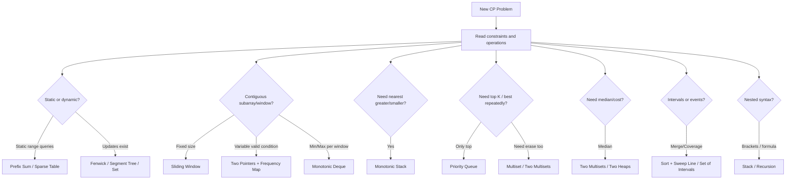

<a id="ultimate-solving-loop"></a>

## Ultimate Solving Loop

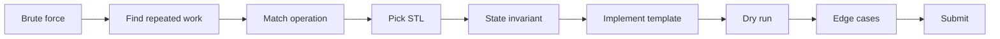

## Added Quick Enhancements

### Universal Pattern Recognition Table

| Clue in problem | First idea | Safer alternative / warning |
|---|---|---|
| `q` range sum queries | Prefix sum | Fenwick/segment tree if updates exist |
| Fixed window of size `k` | Sliding window | Monotonic deque for min/max |
| Subarray sum equals `x` | Prefix sum + map | Sliding window only if all values non-negative |
| Nearest greater/smaller | Monotonic stack | Store indices, not values |
| Dynamic median | Two multisets / heaps | Multiset easier when deletion is needed |
| Top K with deletion | Two multisets | Heap needs lazy deletion |
| Huge values but few distinct | Coordinate compression | Preserve original values if final answer needs them |
| Intervals overlap | Sort + merge / sweep | Use events for max active count |
| Nested parentheses/formula | Stack or recursion | Map for sorted output |

### Contest Debug Checklist

```text
Before submit:
1. Check constraints and complexity.
2. Check empty container before top/front/back.
3. For multiset duplicates, erase by iterator.
4. Initialize prefix frequency with freq[0] = 1.
5. Use long long for sums, counts, products, costs.
6. Test n = 0/1, k = 1, k = n, duplicates, negatives, sorted/reverse sorted.
7. For custom comparator, ensure strict weak ordering.
```


---

<a id="part-i-core-notes-dry-runs-and-templates"></a>

# Part I — Core Notes, Dry Runs, and Templates

> Source included in full: `001_STL.md`.

<a id="p1-competitive-programming-stl-problem-solving-notes"></a>

## Competitive Programming STL & Problem Solving Notes

<a id="p1-clickable-index"></a>

### Clickable Index

- [0. Problem Solving Strategy](#0-problem-solving-strategy)
- [1. Balanced Brackets / Parentheses](#1-balanced-brackets-/-parentheses)
- [2. Sliding Window: Subarray Maintenance](#2-sliding-window:-subarray-maintenance)
- [3. Sliding Window Minimum](#3-sliding-window-minimum)
- [4. Sliding Window Cost / Make All Elements Equal](#4-sliding-window-cost-/-make-all-elements-equal)
- [5. Mean, Variance, Median, Mode Dashboard](#5-mean,-variance,-median,-mode-dashboard)
- [6. Prefix Sum and Subarray Sum Equals X](#6-prefix-sum-and-subarray-sum-equals-x)
- [7. Stack Mastery: Next Greater Element](#7-stack-mastery:-next-greater-element)
- [8. Trapping Rain Water](#8-trapping-rain-water)
- [9. Range Mapping / Interval Coverage](#9-range-mapping-/-interval-coverage)
- [10. Top K Sum](#10-top-k-sum)
- [11. Priority Queue Notes](#11-priority-queue-notes)
- [12. Stack and Queue Basics](#12-stack-and-queue-basics)
- [13. Contribution Technique](#13-contribution-technique)
- [14. Pattern Matching / Coordinate Geometry Printing](#14-pattern-matching-/-coordinate-geometry-printing)
- [15. Molecular Formula Parser](#15-molecular-formula-parser)
- [16. Choosing the Right STL](#16-choosing-the-right-stl)
- [17. Common Mistakes](#17-common-mistakes)
- [18. Final Revision Flow](#18-final-revision-flow)
- [19. Minimal C++ Setup](#19-minimal-c++-setup)
- [20. One-Minute CP Mental Checklist](#20-one-minute-cp-mental-checklist)
- [21. Final Golden Rules](#21-final-golden-rules)


> Clean markdown notes with Mermaid diagrams, intuition, examples, C++ templates, one-minute mental tricks, and dry-run blocks placed directly after relevant code.

---

<a id="p1-0-problem-solving-strategy"></a>

### 0. Problem Solving Strategy

<a id="p1-time-split-in-contest"></a>

#### Time split in contest

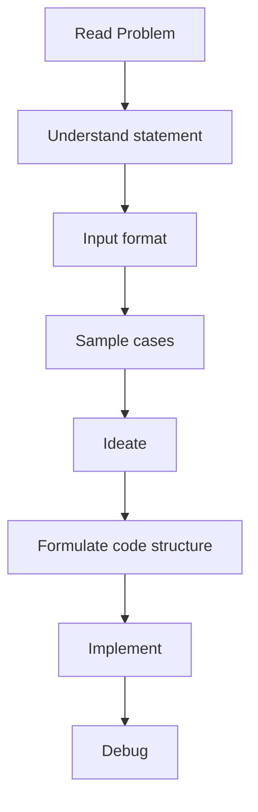

| Step | Goal | Time |
|---|---|---:|
| Read | statement + input + samples | 5 min |
| Ideate | brute force, pattern, constraints, eliminate | 25 min |
| Formulate | decide variables, functions, STL, parameters | 1-2 min |
| Code | implementation | 15-20 min |
| Debug | test and fix | 10 min |

<a id="p1-intuition"></a>

#### Intuition

Most CP problems are not about instantly writing code. They are about finding the hidden pattern.

```text
Understand problem
   ↓
Try brute force
   ↓
Check constraints
   ↓
Find bottleneck
   ↓
Replace bottleneck using known pattern
```

<a id="p1-ideation-checklist"></a>

#### Ideation checklist

```mermaid
flowchart TD
    M0(("Problem"))
    M1["Read"]
    M2["Statement"]
    M3["Input"]
    M4["Samples"]
    M5["Ideate"]
    M6["Past similar problem"]
    M7["Pattern"]
    M8["Constraints"]
    M9["Eliminate bad approaches"]
    M10["Paradigm"]
    M11["Brute force"]
    M12["Divide and conquer"]
    M13["Greedy"]
    M14["DP"]
    M15["Graph"]
    M16["Math"]
    M17["Code"]
    M18["Global variables"]
    M19["Function parameters"]
    M20["STL choice"]
    M21["Debug"]
    M22["Sample tests"]
    M23["Edge cases"]
    M0 --> M1
    M1 --> M2
    M1 --> M3
    M1 --> M4
    M0 --> M5
    M5 --> M6
    M5 --> M7
    M5 --> M8
    M5 --> M9
    M0 --> M10
    M10 --> M11
    M10 --> M12
    M10 --> M13
    M10 --> M14
    M10 --> M15
    M10 --> M16
    M0 --> M17
    M17 --> M18
    M17 --> M19
    M17 --> M20
    M0 --> M21
    M21 --> M22
    M21 --> M23
```

<a id="p1-example"></a>

#### Example

Problem:

```text
Given n numbers and q queries asking sum(l, r).
```

Brute force:

```text
For each query, loop from l to r.
O(nq)
```

If `n, q <= 2e5`, brute force fails.

Pattern:

```text
Repeated range sum on static array = prefix sum.
```

Optimized:

```text
Build prefix once in O(n)
Answer each query in O(1)
```

<a id="p1-one-minute-mental-trick"></a>

#### One-minute mental trick

```text
n <= 100        brute force may pass
n <= 2e5        need O(n log n) or O(n)
n <= 1e6        usually O(n)
q large         precompute or use data structure
range query     prefix / Fenwick / segment tree
dynamic update  Fenwick / segment tree / balanced set
```

---

<a id="p1-1-balanced-brackets-parentheses"></a>

### 1. Balanced Brackets / Parentheses

<a id="p1-core-idea"></a>

#### Core idea

For only `(` and `)`, maintain `depth`:

- `(` increases depth.
- `)` decreases depth.
- At the end, depth must be `0`.
- During scanning, depth must never become negative.

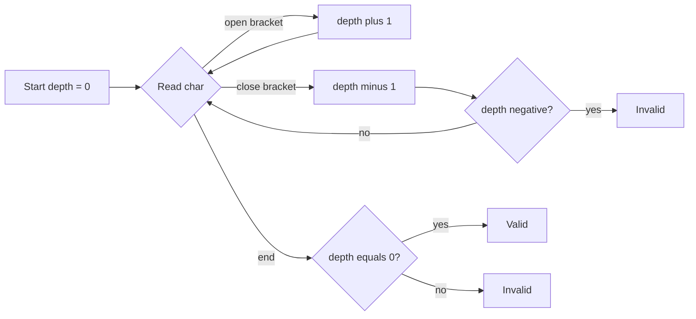

<a id="p1-intuition-2"></a>

#### Intuition

`depth` means how many open brackets are waiting to be closed.

Example:

```text
s = (()())
```

| char | depth |
|---|---:|
| `(` | 1 |
| `(` | 2 |
| `)` | 1 |
| `(` | 2 |
| `)` | 1 |
| `)` | 0 |

Valid.

Invalid example:

```text
s = ())( 
```

At the third character, `depth` becomes `-1`, meaning we closed more brackets than opened.

<a id="p1-c-single-bracket-type"></a>

#### C++: single bracket type

```cpp
#include <bits/stdc++.h>
using namespace std;

bool isBalancedParentheses(const string& s) {
    int depth = 0;

    for (char ch : s) {
        if (ch == '(') depth++;
        else if (ch == ')') depth--;

        if (depth < 0) return false;
    }

    return depth == 0;
}
```

<a id="p1-dry-run-and-mermaid-flow"></a>

#### Dry Run And Mermaid Flow

<a id="p1-dry-run-single-bracket-counter"></a>

##### Dry Run: Single bracket counter

Input:

```text
s = (()())
```

| Character | Action | Depth |
|---|---|---:|
| `(` | open, add one | 1 |
| `(` | open, add one | 2 |
| `)` | close, subtract one | 1 |
| `(` | open, add one | 2 |
| `)` | close, subtract one | 1 |
| `)` | close, subtract one | 0 |

Result: depth never becomes negative and final depth is zero, so valid.

<a id="p1-mermaid-dry-run-diagram"></a>

##### Mermaid Dry Run Diagram

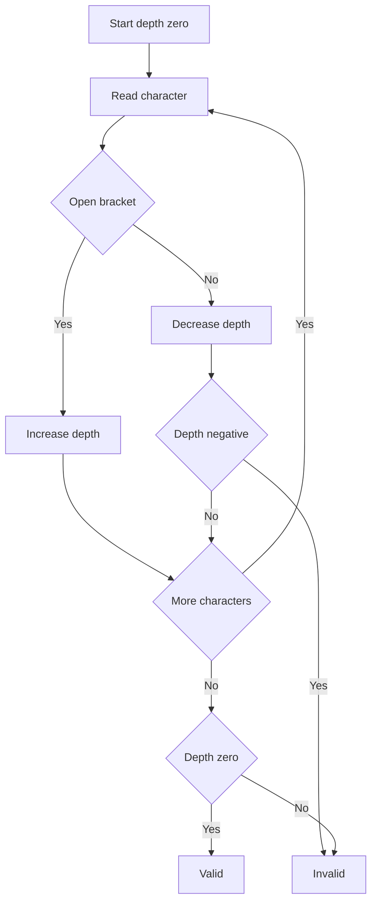


<a id="p1-multiple-bracket-types"></a>

#### Multiple bracket types

For `()`, `{}`, `[]`, use stack. The last opened bracket must match the first incoming closing bracket.

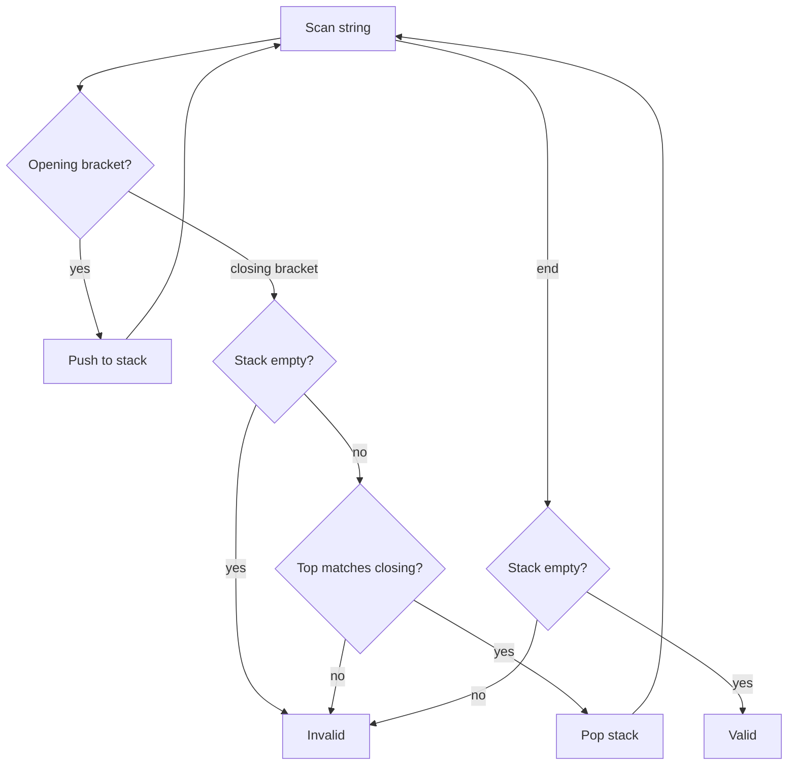

<a id="p1-example-2"></a>

#### Example

```text
[{()}]
```

Stack behavior:

```text
[      push [
{      push {
(      push (
)      top is (, pop
}      top is {, pop
]      top is [, pop
empty  valid
```

Bad example:

```text
[(])
```

At `]`, stack top is `(`, so mismatch.

<a id="p1-c-stack-map"></a>

#### C++: stack + map

```cpp
#include <bits/stdc++.h>
using namespace std;

bool isBalanced(const string& s) {
    map<char, char> closeToOpen = {
        {')', '('},
        {'}', '{'},
        {']', '['}
    };

    stack<char> st;

    for (char ch : s) {
        if (ch == '(' || ch == '{' || ch == '[') {
            st.push(ch);
        } else if (closeToOpen.count(ch)) {
            if (st.empty() || st.top() != closeToOpen[ch]) return false;
            st.pop();
        }
    }

    return st.empty();
}
```

<a id="p1-dry-run-and-mermaid-flow-2"></a>

#### Dry Run And Mermaid Flow

<a id="p1-dry-run-multiple-bracket-stack"></a>

##### Dry Run: Multiple bracket stack

Input:

```text
s = [{()}]
```

| Character | Stack before | Action | Stack after |
|---|---|---|---|
| `[` | empty | push | `[` |
| `{` | `[` | push | `[ {` |
| `(` | `[ {` | push | `[ { (` |
| `)` | `[ { (` | match and pop | `[ {` |
| `}` | `[ {` | match and pop | `[` |
| `]` | `[` | match and pop | empty |

Result: stack is empty, so valid.

<a id="p1-mermaid-dry-run-diagram-2"></a>

##### Mermaid Dry Run Diagram

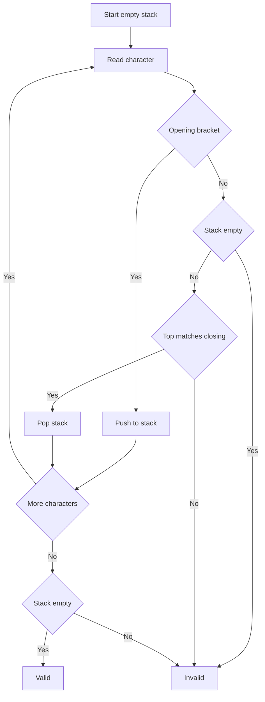


<a id="p1-range-query-on-balanced-parentheses"></a>

#### Range query on balanced parentheses

For a range `[l, r]` in a parentheses string, using prefix depth:

- `depth[i]` = balance after processing index `i`.
- Range is balanced if:
  - `depth[l-1] == depth[r]`
  - minimum depth inside range never goes below `depth[l-1]`.

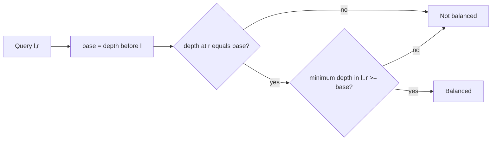

<a id="p1-one-minute-mental-trick-2"></a>

#### One-minute mental trick

```text
One bracket type:
    use counter

Multiple bracket types:
    use stack

Range balanced query:
    prefix depth + range minimum
```

---

<a id="p1-2-sliding-window-subarray-maintenance"></a>

### 2. Sliding Window: Subarray Maintenance

Sliding window is used when we need answers for every window/subarray of length `k`, such as:

- minimum / maximum in every window
- number of distinct elements
- median / mean of each window
- cost of each window

<a id="p1-general-template"></a>

#### General template

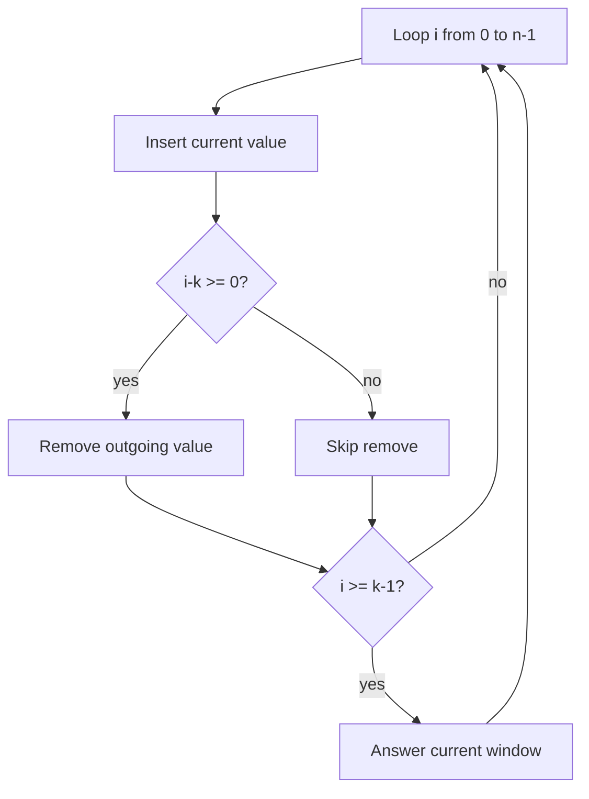

```cpp
for (int i = 0; i < n; i++) {
    ds.insert(arr[i]);

    if (i - k >= 0) {
        ds.erase(arr[i - k]);
    }

    if (i >= k - 1) {
        cout << ds.answer() << '\n';
    }
}
```

<a id="p1-dry-run-and-mermaid-flow-3"></a>

#### Dry Run And Mermaid Flow

<a id="p1-dry-run-fixed-size-window-movement"></a>

##### Dry Run: Fixed size window movement

Input:

```text
a = [4, 2, 1, 5, 3], k = 3
```

| i | Insert | Remove | Current window | Answer ready |
|---:|---:|---|---|---|
| 0 | 4 | none | `[4]` | no |
| 1 | 2 | none | `[4, 2]` | no |
| 2 | 1 | none | `[4, 2, 1]` | yes |
| 3 | 5 | 4 | `[2, 1, 5]` | yes |
| 4 | 3 | 2 | `[1, 5, 3]` | yes |

<a id="p1-mermaid-dry-run-diagram-3"></a>

##### Mermaid Dry Run Diagram

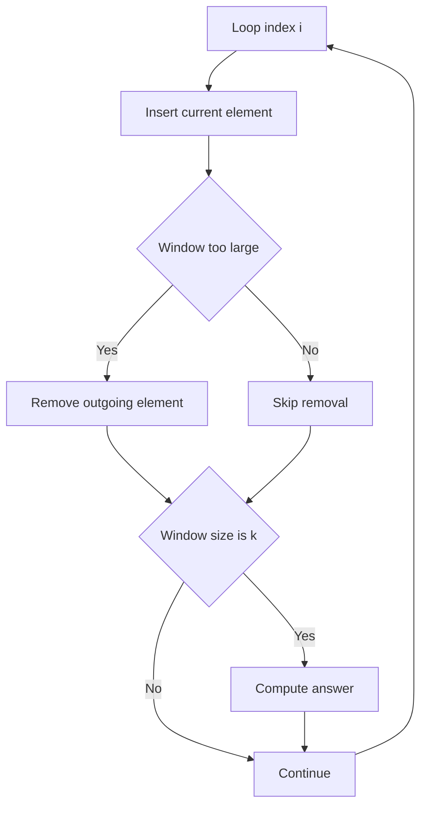


<a id="p1-intuition-3"></a>

#### Intuition

A fixed-size window moves like this:

```text
[0 ... k-1]
 [1 ... k]
  [2 ... k+1]
```

Every step:

```text
add new right element
remove old left element
calculate answer
```

<a id="p1-example-3"></a>

#### Example

```text
a = [4, 2, 1, 5, 3]
k = 3
```

Windows:

```text
[4, 2, 1]
[2, 1, 5]
[1, 5, 3]
```

If asking minimum:

```text
1, 1, 1
```

<a id="p1-one-minute-mental-trick-3"></a>

#### One-minute mental trick

```text
Fixed length subarray?
    sliding window

Need min/max?
    monotonic deque

Need median/cost?
    two multisets

Need frequency/distinct?
    map/unordered_map

Need sum?
    running sum
```

---

<a id="p1-3-sliding-window-minimum"></a>

### 3. Sliding Window Minimum

<a id="p1-using-multiset"></a>

#### Using multiset

Operations needed:

- insert incoming element
- remove outgoing element
- get minimum

```cpp
#include <bits/stdc++.h>
using namespace std;

vector<int> slidingWindowMinMultiset(vector<int>& a, int k) {
    multiset<int> ms;
    vector<int> ans;

    for (int i = 0; i < (int)a.size(); i++) {
        ms.insert(a[i]);

        if (i - k >= 0) {
            ms.erase(ms.find(a[i - k])); // erase only one occurrence
        }

        if (i >= k - 1) {
            ans.push_back(*ms.begin());
        }
    }

    return ans;
}
```

<a id="p1-dry-run-and-mermaid-flow-4"></a>

#### Dry Run And Mermaid Flow

<a id="p1-dry-run-multiset-window-minimum"></a>

##### Dry Run: Multiset window minimum

Input:

```text
a = [4, 2, 1, 5, 3], k = 3
```

| i | Insert | Remove | Multiset | Minimum |
|---:|---:|---|---|---|
| 0 | 4 | none | `{4}` | not ready |
| 1 | 2 | none | `{2,4}` | not ready |
| 2 | 1 | none | `{1,2,4}` | 1 |
| 3 | 5 | 4 | `{1,2,5}` | 1 |
| 4 | 3 | 2 | `{1,3,5}` | 1 |

<a id="p1-mermaid-dry-run-diagram-4"></a>

##### Mermaid Dry Run Diagram

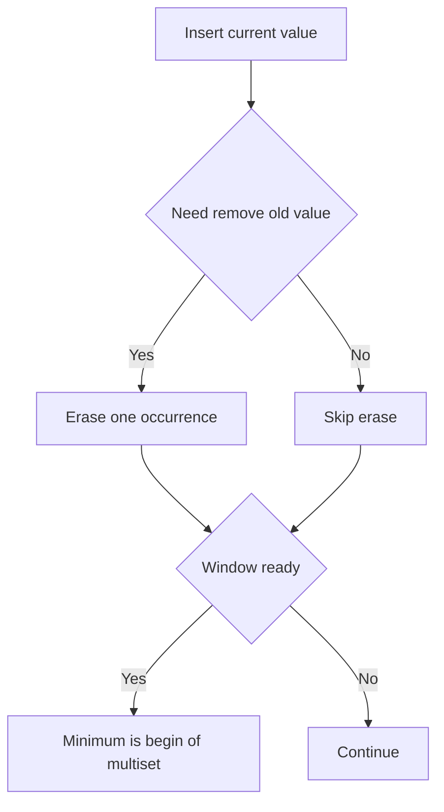


Complexity: `O(n log k)`.

<a id="p1-using-monotonic-deque"></a>

#### Using monotonic deque

Maintain elements in increasing order. The minimum is always at the front.

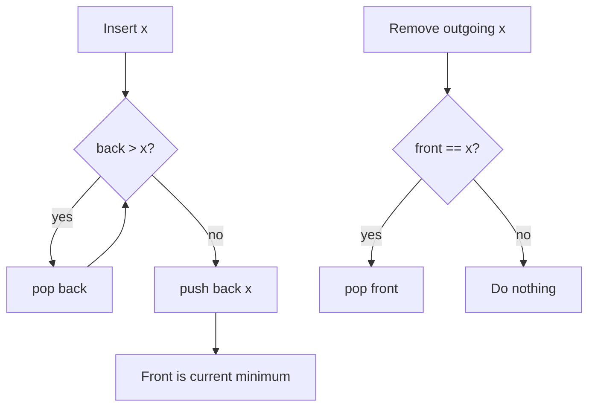

<a id="p1-intuition-4"></a>

#### Intuition

If a new element is smaller than previous elements, those previous elements can never become minimum while the new smaller element is still inside the window.

Example:

```text
arriving values: 4, 2, 1
```

Deque:

```text
insert 4 -> [4]
insert 2 -> remove 4 -> [2]
insert 1 -> remove 2 -> [1]
```

The old bigger values are useless for minimum.

<a id="p1-c-monotonic-deque"></a>

#### C++ monotonic deque

```cpp
#include <bits/stdc++.h>
using namespace std;

struct MonotoneMinDeque {
    deque<int> dq;

    void insert(int x) {
        while (!dq.empty() && dq.back() > x) dq.pop_back();
        dq.push_back(x);
    }

    void erase(int x) {
        if (!dq.empty() && dq.front() == x) dq.pop_front();
    }

    int getMin() const {
        return dq.front();
    }
};

vector<int> slidingWindowMin(vector<int>& a, int k) {
    MonotoneMinDeque ds;
    vector<int> ans;

    for (int i = 0; i < (int)a.size(); i++) {
        ds.insert(a[i]);

        if (i - k >= 0) ds.erase(a[i - k]);

        if (i >= k - 1) ans.push_back(ds.getMin());
    }

    return ans;
}
```

<a id="p1-dry-run-and-mermaid-flow-5"></a>

#### Dry Run And Mermaid Flow

<a id="p1-dry-run-monotonic-deque-minimum"></a>

##### Dry Run: Monotonic deque minimum

Input:

```text
a = [4, 2, 1, 5, 3], k = 3
```

| i | x | Deque action | Deque after insert | Window min |
|---:|---:|---|---|---|
| 0 | 4 | push 4 | `[4]` | not ready |
| 1 | 2 | pop 4, push 2 | `[2]` | not ready |
| 2 | 1 | pop 2, push 1 | `[1]` | 1 |
| 3 | 5 | push 5 | `[1,5]` | 1 |
| 4 | 3 | pop 5, push 3 | `[1,3]` | 1 |

<a id="p1-mermaid-dry-run-diagram-5"></a>

##### Mermaid Dry Run Diagram

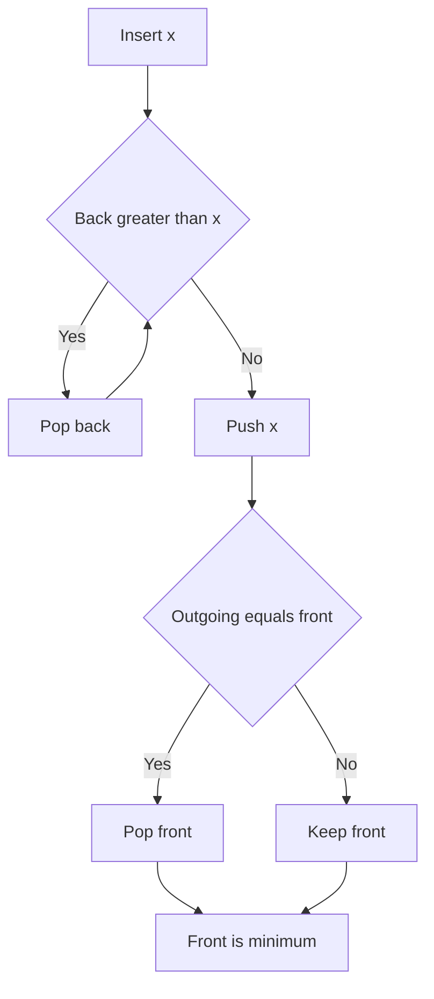


Complexity: `O(n)`.

<a id="p1-one-minute-mental-trick-4"></a>

#### One-minute mental trick

```text
Sliding window min/max:
    multiset = easy O(n log k)
    deque = optimal O(n)

For minimum:
    increasing deque

For maximum:
    decreasing deque
```

---

<a id="p1-4-sliding-window-cost-make-all-elements-equal"></a>

### 4. Sliding Window Cost / Make All Elements Equal

Problem: for every window of size `k`, find minimum cost to make all elements equal, where cost is sum of absolute differences.

For values:

```text
a1, a2, ..., ak
```

Minimize:

```text
|x-a1| + |x-a2| + ... + |x-ak|
```

The minimum occurs at the median.

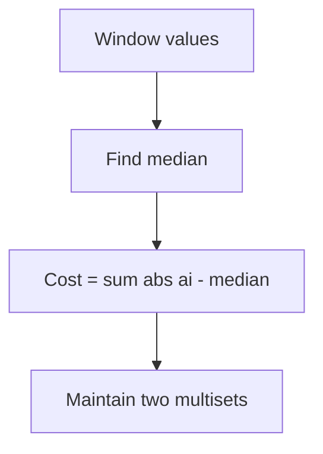

<a id="p1-intuition-5"></a>

#### Intuition

For absolute difference, the median is best because it balances how many values are on the left and right.

Example:

```text
[1, 2, 10]
```

Try making all equal to:

```text
1:  |1-1| + |2-1| + |10-1| = 10
2:  |1-2| + |2-2| + |10-2| = 9
10: |1-10| + |2-10| + |10-10| = 17
```

Median `2` gives the minimum cost.

<a id="p1-data-structure"></a>

#### Data structure

Maintain two multisets:

- `lo`: smaller half, contains the median at `*lo.rbegin()`
- `hi`: larger half
- `leftSum`: sum of `lo`
- `rightSum`: sum of `hi`

Balance rule:

```text
lo.size() == hi.size() OR lo.size() == hi.size() + 1
```

Cost:

```text
leftCost  = median * lo.size() - leftSum
rightCost = rightSum - median * hi.size()
totalCost = leftCost + rightCost
```

<a id="p1-example-4"></a>

#### Example

```text
window = [1, 2, 10, 20, 30]
median = 10
```

Cost:

```text
|1-10| + |2-10| + |10-10| + |20-10| + |30-10|
= 9 + 8 + 0 + 10 + 20
= 47
```

With sets:

```text
lo = [1, 2, 10]
hi = [20, 30]
median = 10

leftCost = 10*3 - 13 = 17
rightCost = 50 - 10*2 = 30
total = 47
```

<a id="p1-c"></a>

#### C++

```cpp
#include <bits/stdc++.h>
using namespace std;

struct SlidingCost {
    multiset<long long> lo, hi;
    long long leftSum = 0, rightSum = 0;

    long long median() const {
        return *lo.rbegin();
    }

    void rebalance() {
        while (lo.size() < hi.size()) {
            auto it = hi.begin();
            long long x = *it;
            hi.erase(it);
            rightSum -= x;
            lo.insert(x);
            leftSum += x;
        }

        while (lo.size() > hi.size() + 1) {
            auto it = prev(lo.end());
            long long x = *it;
            lo.erase(it);
            leftSum -= x;
            hi.insert(x);
            rightSum += x;
        }
    }

    void insert(long long x) {
        if (lo.empty() || x <= median()) {
            lo.insert(x);
            leftSum += x;
        } else {
            hi.insert(x);
            rightSum += x;
        }
        rebalance();
    }

    void erase(long long x) {
        auto itLo = lo.find(x);
        if (itLo != lo.end()) {
            lo.erase(itLo);
            leftSum -= x;
        } else {
            auto itHi = hi.find(x);
            hi.erase(itHi);
            rightSum -= x;
        }
        rebalance();
    }

    long long cost() const {
        long long m = median();
        long long leftCost = m * (long long)lo.size() - leftSum;
        long long rightCost = rightSum - m * (long long)hi.size();
        return leftCost + rightCost;
    }
};
```

<a id="p1-dry-run-and-mermaid-flow-6"></a>

#### Dry Run And Mermaid Flow

<a id="p1-dry-run-median-cost-using-two-multisets"></a>

##### Dry Run: Median cost using two multisets

Input:

```text
window = [1, 2, 10, 20, 30]
```

| Set | Values | Sum |
|---|---|---:|
| lo | `1, 2, 10` | 13 |
| hi | `20, 30` | 50 |

| Step | Formula | Value |
|---|---|---:|
| median | max of lo | 10 |
| left cost | `10 * 3 - 13` | 17 |
| right cost | `50 - 10 * 2` | 30 |
| total | `17 + 30` | 47 |

<a id="p1-mermaid-dry-run-diagram-6"></a>

##### Mermaid Dry Run Diagram

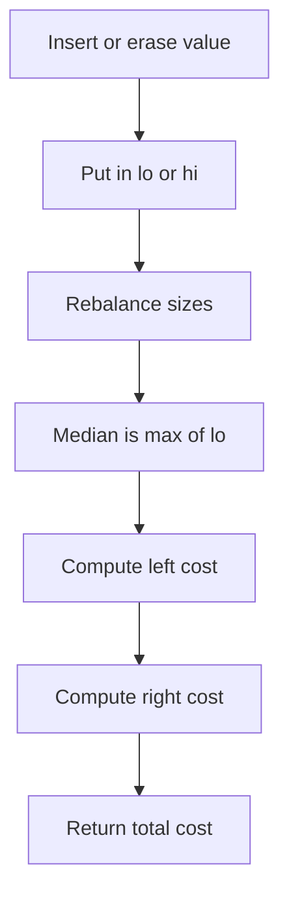


<a id="p1-one-minute-mental-trick-5"></a>

#### One-minute mental trick

```text
Minimize sum of absolute differences:
    choose median

Minimize sum of squared differences:
    choose mean

Dynamic median:
    two multisets / two heaps
```

---

<a id="p1-5-mean-variance-median-mode-dashboard"></a>

### 5. Mean, Variance, Median, Mode Dashboard

Design a dynamic structure supporting:

- `insert(x)`
- `remove(x)`
- `mean()`
- `variance()`
- `median()`
- `mode()`

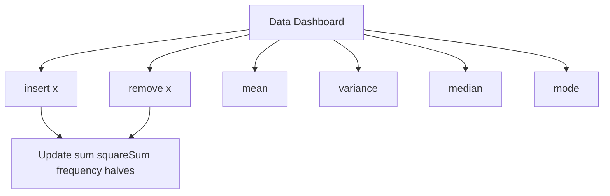

<a id="p1-intuition-6"></a>

#### Intuition

Different statistics need different maintained information.

| Query | What to maintain |
|---|---|
| mean | `sum`, `count` |
| variance | `sum`, `squareSum`, `count` |
| median | two balanced multisets |
| mode | frequency map + ordered frequency set |

<a id="p1-formulas"></a>

#### Formulas

```text
mean = sum / count
variance = (sum of squares / count) - mean^2
mode = element with highest frequency
median = middle value after sorting
```

<a id="p1-example-5"></a>

#### Example

Values:

```text
[1, 2, 2, 5]
```

Mean:

```text
(1+2+2+5)/4 = 2.5
```

Variance:

```text
squareSum = 1 + 4 + 4 + 25 = 34
variance = 34/4 - 2.5^2 = 8.5 - 6.25 = 2.25
```

Median:

```text
(2+2)/2 = 2
```

Mode:

```text
2
```

<a id="p1-c-structure"></a>

#### C++ structure

```cpp
#include <bits/stdc++.h>
using namespace std;

struct DataDashboard {
    long long sum = 0, squareSum = 0;
    int count = 0;

    map<int, int> freq;
    multiset<pair<int, int>> freqOrder; // {frequency, value}

    multiset<int> lo, hi; // median halves

    void rebalanceMedian() {
        while (lo.size() < hi.size()) {
            int x = *hi.begin();
            hi.erase(hi.begin());
            lo.insert(x);
        }
        while (lo.size() > hi.size() + 1) {
            int x = *lo.rbegin();
            lo.erase(prev(lo.end()));
            hi.insert(x);
        }
    }

    void addToMedian(int x) {
        if (lo.empty() || x <= *lo.rbegin()) lo.insert(x);
        else hi.insert(x);
        rebalanceMedian();
    }

    void removeFromMedian(int x) {
        auto itLo = lo.find(x);
        if (itLo != lo.end()) lo.erase(itLo);
        else hi.erase(hi.find(x));
        rebalanceMedian();
    }

    void insert(int x) {
        count++;
        sum += x;
        squareSum += 1LL * x * x;

        if (freq[x] > 0) freqOrder.erase(freqOrder.find({freq[x], x}));
        freq[x]++;
        freqOrder.insert({freq[x], x});

        addToMedian(x);
    }

    void remove(int x) {
        count--;
        sum -= x;
        squareSum -= 1LL * x * x;

        freqOrder.erase(freqOrder.find({freq[x], x}));
        freq[x]--;
        if (freq[x] > 0) freqOrder.insert({freq[x], x});
        else freq.erase(x);

        removeFromMedian(x);
    }

    double mean() const {
        return (double)sum / count;
    }

    double variance() const {
        double mu = mean();
        return (double)squareSum / count - mu * mu;
    }

    double median() const {
        if (count % 2 == 1) return *lo.rbegin();
        return (*lo.rbegin() + *hi.begin()) / 2.0;
    }

    int mode() const {
        return freqOrder.rbegin()->second;
    }
};
```

<a id="p1-dry-run-and-mermaid-flow-7"></a>

#### Dry Run And Mermaid Flow

<a id="p1-dry-run-statistics-dashboard-updates"></a>

##### Dry Run: Statistics dashboard updates

Input:

```text
insert 1, insert 2, insert 2, insert 5
```

| Operation | Count | Sum | Square sum | Mode |
|---|---:|---:|---:|---|
| insert 1 | 1 | 1 | 1 | 1 |
| insert 2 | 2 | 3 | 5 | 1 or 2 |
| insert 2 | 3 | 5 | 9 | 2 |
| insert 5 | 4 | 10 | 34 | 2 |

Final mean is `10 / 4 = 2.5`.
Final variance is `34 / 4 - 2.5 * 2.5 = 2.25`.

<a id="p1-mermaid-dry-run-diagram-7"></a>

##### Mermaid Dry Run Diagram

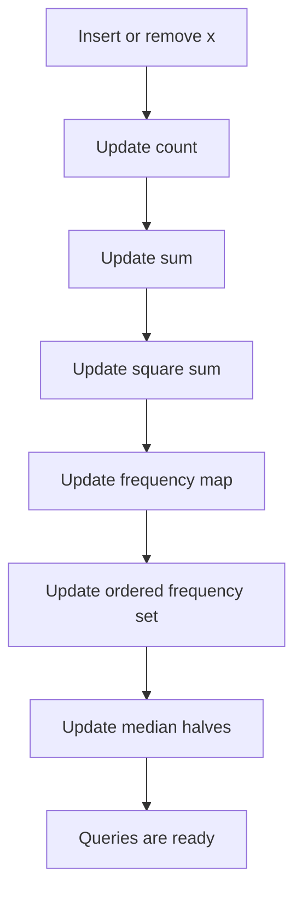


<a id="p1-one-minute-mental-trick-6"></a>

#### One-minute mental trick

```text
mean      -> sum
variance  -> sum + squareSum
median    -> two halves
mode      -> frequency + max frequency
```

---

<a id="p1-6-prefix-sum-and-subarray-sum-equals-x"></a>

### 6. Prefix Sum and Subarray Sum Equals X

A subarray is a continuous segment of an array.

Number of subarrays in an array of size `n`:

```text
n * (n + 1) / 2
```

Using prefix sums:

```text
sum(l, r) = pref[r] - pref[l-1]
```

To count subarrays with sum `x`, for every `r` find how many previous prefix sums equal:

```text
pref[l-1] = pref[r] - x
```

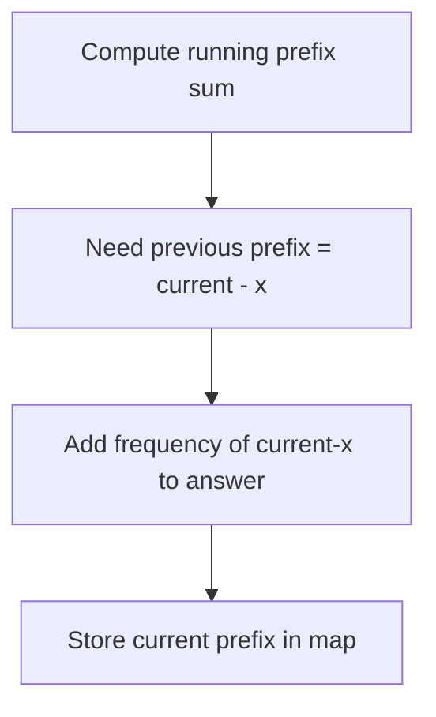

<a id="p1-intuition-7"></a>

#### Intuition

If:

```text
current prefix = sum from 0 to r
```

And we want a subarray ending at `r` with sum `x`, then the part before that subarray must be:

```text
current prefix - x
```

So we count how many times that previous prefix appeared.

<a id="p1-example-6"></a>

#### Example

```text
a = [1, 2, 3, -2, 5]
x = 3
```

Subarrays with sum 3:

```text
[1,2]
[3]
[2,3,-2]
[-2,5]
```

Answer:

```text
4
```

<a id="p1-c-count-only"></a>

#### C++ count only

```cpp
#include <bits/stdc++.h>
using namespace std;

long long countSubarraysWithSumX(vector<int>& a, long long x) {
    map<long long, long long> freq;
    freq[0] = 1;

    long long pref = 0, ans = 0;

    for (int v : a) {
        pref += v;
        ans += freq[pref - x];
        freq[pref]++;
    }

    return ans;
}
```

<a id="p1-dry-run-and-mermaid-flow-8"></a>

#### Dry Run And Mermaid Flow

<a id="p1-dry-run-count-subarrays-with-target-sum"></a>

##### Dry Run: Count subarrays with target sum

Input:

```text
a = [1, 2, 3, -2, 5], x = 3
```

| i | value | prefix | need | previous need count | answer |
|---:|---:|---:|---:|---:|---:|
| 0 | 1 | 1 | -2 | 0 | 0 |
| 1 | 2 | 3 | 0 | 1 | 1 |
| 2 | 3 | 6 | 3 | 1 | 2 |
| 3 | -2 | 4 | 1 | 1 | 3 |
| 4 | 5 | 9 | 6 | 1 | 4 |

<a id="p1-mermaid-dry-run-diagram-8"></a>

##### Mermaid Dry Run Diagram

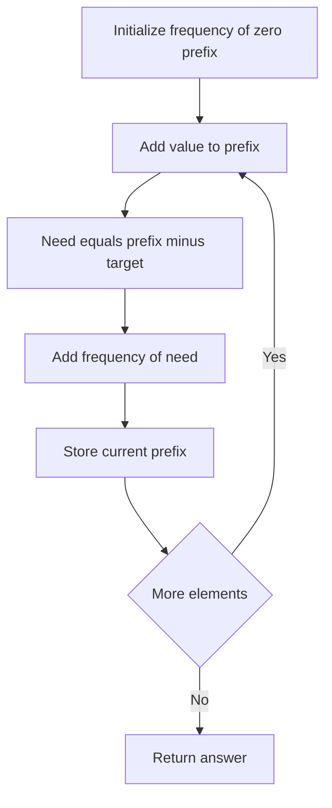


<a id="p1-c-print-all-ranges"></a>

#### C++ print all ranges

```cpp
#include <bits/stdc++.h>
using namespace std;

void printSubarraysWithSumX(vector<int>& a, long long x) {
    map<long long, vector<int>> pos;
    pos[0].push_back(-1);

    long long pref = 0;

    for (int i = 0; i < (int)a.size(); i++) {
        pref += a[i];

        long long need = pref - x;
        for (int leftMinusOne : pos[need]) {
            cout << "[" << leftMinusOne + 1 << ", " << i << "]\n";
        }

        pos[pref].push_back(i);
    }
}
```

<a id="p1-dry-run-and-mermaid-flow-9"></a>

#### Dry Run And Mermaid Flow

<a id="p1-dry-run-print-all-target-sum-ranges"></a>

##### Dry Run: Print all target-sum ranges

Input:

```text
a = [1, 2, 3], x = 3
```

| i | value | prefix | need | positions for need | printed range |
|---:|---:|---:|---:|---|---|
| 0 | 1 | 1 | -2 | none | none |
| 1 | 2 | 3 | 0 | `-1` | `[0,1]` |
| 2 | 3 | 6 | 3 | `1` | `[2,2]` |

<a id="p1-mermaid-dry-run-diagram-9"></a>

##### Mermaid Dry Run Diagram

```mermaid
flowchart TD
    A["Keep map from prefix to positions"] --> B["Update prefix"]
    B --> C["Find need prefix"]
    C --> D{"Need exists"}
    D -->|Yes| E["Print all ranges"]
    D -->|No| F["Print none"]
    E --> G["Store current index"]
    F --> G
```


<a id="p1-one-minute-mental-trick-7"></a>

#### One-minute mental trick

```text
Subarray sum:
    prefix sum

Count subarray sum = x:
    map previous prefixes

All positive numbers only:
    sliding window may work

Negative numbers allowed:
    prefix + map is safer
```

---

<a id="p1-7-stack-mastery-next-greater-element"></a>

### 7. Stack Mastery: Next Greater Element

For each index, find the next greater element to the right.

Use a monotonic stack of indices. Traverse from right to left.

```mermaid
flowchart TD
    A["Start from right"] --> B{"top value <= current?"}
    B -->|yes| C["pop"]
    C --> B
    B -->|no| D{"stack empty?"}
    D -->|yes| E["nge of i = n"]
    D -->|no| F["nge of i = top"]
    E --> G["push i"]
    F --> G
    G --> A
```

<a id="p1-intuition-8"></a>

#### Intuition

When scanning from right to left, the stack stores useful candidates for the next greater element.

If a candidate is less than or equal to the current value, it can never be the next greater for this or any earlier element blocked by current.

<a id="p1-example-7"></a>

#### Example

```text
a = [2, 1, 3, 2]
```

| i | value | next greater |
|---:|---:|---:|
| 0 | 2 | 3 |
| 1 | 1 | 3 |
| 2 | 3 | none |
| 3 | 2 | none |

<a id="p1-c-2"></a>

#### C++

```cpp
#include <bits/stdc++.h>
using namespace std;

vector<int> nextGreaterIndex(vector<int>& a) {
    int n = a.size();
    vector<int> nge(n, n);
    stack<int> st;

    for (int i = n - 1; i >= 0; i--) {
        while (!st.empty() && a[st.top()] <= a[i]) {
            st.pop();
        }

        if (!st.empty()) nge[i] = st.top();

        st.push(i);
    }

    return nge;
}
```

<a id="p1-dry-run-and-mermaid-flow-10"></a>

#### Dry Run And Mermaid Flow

<a id="p1-dry-run-next-greater-element"></a>

##### Dry Run: Next greater element

Input:

```text
a = [2, 1, 3, 2]
```

| i | value | Stack before | Action | Next greater |
|---:|---:|---|---|---|
| 3 | 2 | empty | push 2 | none |
| 2 | 3 | 2 | pop 2, push 3 | none |
| 1 | 1 | 3 | top is greater, push 1 | 3 |
| 0 | 2 | 3, 1 | pop 1, top is greater, push 2 | 3 |

<a id="p1-mermaid-dry-run-diagram-10"></a>

##### Mermaid Dry Run Diagram

```mermaid
flowchart TD
    A["Scan from right"] --> B["Current value"]
    B --> C{"Top less or equal current"}
    C -->|Yes| D["Pop stack"]
    D --> C
    C -->|No| E{"Stack empty"}
    E -->|Yes| F["No next greater"]
    E -->|No| G["Top is answer"]
    F --> H["Push current"]
    G --> H
```


<a id="p1-one-minute-mental-trick-8"></a>

#### One-minute mental trick

```text
Next greater/smaller:
    monotonic stack

To the right:
    scan right to left

To the left:
    scan left to right

Greater:
    pop smaller/equal

Smaller:
    pop greater/equal
```

---

<a id="p1-8-trapping-rain-water"></a>

### 8. Trapping Rain Water

For each bar, trapped water depends on boundary bars.

<a id="p1-stack-approach"></a>

#### Stack approach

When current bar is greater than the stack top, the popped bar can become the bottom of trapped water.

```mermaid
flowchart TD
    A["Loop i from 0 to n-1"] --> B{"top height < current height?"}
    B -->|yes| C["bottom = pop"]
    C --> D{"stack empty?"}
    D -->|yes| E["break"]
    D -->|no| F["left = stack.top"]
    F --> G["width = i-left-1"]
    G --> H["bounded height = min left current - bottom"]
    H --> I["ans += width*height"]
    I --> B
    B -->|no| J["push i"]
```

<a id="p1-intuition-9"></a>

#### Intuition

Water is trapped when we find:

```text
left wall + bottom + right wall
```

The current bar acts as the right wall. The stack top after popping acts as the left wall.

<a id="p1-example-8"></a>

#### Example

```text
height = [3, 0, 2, 0, 4]
```

Water trapped:

```text
index 1: min(3,4)-0 = 3
index 2: min(3,4)-2 = 1
index 3: min(3,4)-0 = 3
total = 7
```

<a id="p1-c-3"></a>

#### C++

```cpp
#include <bits/stdc++.h>
using namespace std;

int trapRainWater(vector<int>& h) {
    int n = h.size();
    int ans = 0;
    stack<int> st;

    for (int i = 0; i < n; i++) {
        while (!st.empty() && h[st.top()] < h[i]) {
            int bottom = st.top();
            st.pop();

            if (st.empty()) break;

            int left = st.top();
            int width = i - left - 1;
            int height = min(h[left], h[i]) - h[bottom];
            ans += width * height;
        }
        st.push(i);
    }

    return ans;
}
```

<a id="p1-dry-run-and-mermaid-flow-11"></a>

#### Dry Run And Mermaid Flow

<a id="p1-dry-run-water-trapped-by-stack"></a>

##### Dry Run: Water trapped by stack

Input:

```text
height = [3, 0, 2, 0, 4]
```

| i | height | Important action | Water added |
|---:|---:|---|---:|
| 0 | 3 | push index 0 | 0 |
| 1 | 0 | push index 1 | 0 |
| 2 | 2 | pop bottom index 1 | 2 |
| 3 | 0 | push index 3 | 0 |
| 4 | 4 | pop bottoms and use left wall | 5 |

Total water is `7`.

<a id="p1-mermaid-dry-run-diagram-11"></a>

##### Mermaid Dry Run Diagram

```mermaid
flowchart TD
    A["Read current bar"] --> B{"Current higher than stack top"}
    B -->|Yes| C["Pop bottom"]
    C --> D{"Stack empty"}
    D -->|Yes| E["Stop inner loop"]
    D -->|No| F["New top is left wall"]
    F --> G["Compute width"]
    G --> H["Compute bounded height"]
    H --> I["Add water"]
    I --> B
    B -->|No| J["Push current index"]
```


<a id="p1-one-minute-mental-trick-9"></a>

#### One-minute mental trick

```text
Water needs two walls.

When current height is bigger than stack top:
    current is right wall
    popped is bottom
    new stack top is left wall
```

---

<a id="p1-9-range-mapping-interval-coverage"></a>

### 9. Range Mapping / Interval Coverage

Queries:

1. Insert range `[l, r]`
2. Check whether point `x` is covered by any range

<a id="p1-offline-version"></a>

#### Offline version

Store all left endpoints and right endpoints separately, then sort.

For point `x`:

```text
covered intervals = total intervals - intervals ending before x - intervals starting after x
```

```text
ending before x = count(r < x)
starting after x = count(l > x)
```

Use `lower_bound` and `upper_bound`.

<a id="p1-intuition-10"></a>

#### Intuition

An interval covers `x` if:

```text
l <= x <= r
```

So an interval does not cover `x` if:

```text
r < x
```

or:

```text
l > x
```

<a id="p1-c-4"></a>

#### C++

```cpp
#include <bits/stdc++.h>
using namespace std;

bool isCoveredOffline(vector<pair<int,int>>& ranges, int x) {
    vector<int> L, R;

    for (auto [l, r] : ranges) {
        L.push_back(l);
        R.push_back(r);
    }

    sort(L.begin(), L.end());
    sort(R.begin(), R.end());

    int n = ranges.size();
    int startingAfter = n - (upper_bound(L.begin(), L.end(), x) - L.begin());
    int endingBefore = lower_bound(R.begin(), R.end(), x) - R.begin();

    return n - startingAfter - endingBefore > 0;
}
```

<a id="p1-dry-run-and-mermaid-flow-12"></a>

#### Dry Run And Mermaid Flow

<a id="p1-dry-run-offline-interval-coverage"></a>

##### Dry Run: Offline interval coverage

Input:

```text
ranges = [1,3], [6,8], x = 2
```

| Data | Values |
|---|---|
| sorted starts | `1, 6` |
| sorted ends | `3, 8` |
| intervals starting after 2 | 1 |
| intervals ending before 2 | 0 |
| covered count | `2 - 1 - 0 = 1` |

Result: covered.

<a id="p1-mermaid-dry-run-diagram-12"></a>

##### Mermaid Dry Run Diagram

```mermaid
flowchart TD
    A["Sort starts and ends"] --> B["Query point x"]
    B --> C["Count starts greater than x"]
    C --> D["Count ends less than x"]
    D --> E["Covered count equals total minus both"]
    E --> F{"Covered count positive"}
    F -->|Yes| G["Covered"]
    F -->|No| H["Not covered"]
```


<a id="p1-online-version-maintain-merged-intervals"></a>

#### Online version: maintain merged intervals

Use `set<pair<int,int>>` containing non-overlapping intervals.

```mermaid
flowchart TD
    A["Insert l,r"] --> B{"Already covered?"}
    B -->|yes| C["Do nothing"]
    B -->|no| D["Find intervals that overlap"]
    D --> E["Merge them into l,r"]
    E --> F["Erase old intervals"]
    F --> G["Insert merged interval"]
    H["Query x"] --> I["Find interval with start <= x"]
    I --> J{"end >= x?"}
    J -->|yes| K["Covered"]
    J -->|no| L["Not covered"]
```

<a id="p1-example-9"></a>

#### Example

Insert:

```text
[1, 3]
[6, 8]
[2, 7]
```

After merging:

```text
[1, 8]
```

Query:

```text
x = 5 -> covered
x = 9 -> not covered
```

<a id="p1-c-5"></a>

#### C++

```cpp
#include <bits/stdc++.h>
using namespace std;

struct RangeCover {
    set<pair<int,int>> ranges;

    bool covered(int x) {
        auto it = ranges.upper_bound({x, INT_MAX});
        if (it == ranges.begin()) return false;
        --it;
        return it->second >= x;
    }

    void insertRange(int l, int r) {
        auto it = ranges.lower_bound({l, INT_MIN});

        if (it != ranges.begin()) {
            auto prevIt = prev(it);
            if (prevIt->second >= l - 1) it = prevIt;
        }

        while (it != ranges.end() && it->first <= r + 1) {
            l = min(l, it->first);
            r = max(r, it->second);
            it = ranges.erase(it);
        }

        ranges.insert({l, r});
    }
};
```

<a id="p1-dry-run-and-mermaid-flow-13"></a>

#### Dry Run And Mermaid Flow

<a id="p1-dry-run-merged-interval-insert-and-query"></a>

##### Dry Run: Merged interval insert and query

Input:

```text
insert [1,3], insert [6,8], insert [2,7], query 5
```

| Operation | Intervals after operation |
|---|---|
| insert `[1,3]` | `[1,3]` |
| insert `[6,8]` | `[1,3] [6,8]` |
| insert `[2,7]` | `[1,8]` |
| query `5` | covered |

<a id="p1-mermaid-dry-run-diagram-13"></a>

##### Mermaid Dry Run Diagram

```mermaid
flowchart TD
    A["Insert range"] --> B["Find overlap candidate"]
    B --> C{"Overlaps"}
    C -->|Yes| D["Merge boundaries"]
    D --> E["Erase old interval"]
    E --> C
    C -->|No| F["Insert merged interval"]
    G["Query point"] --> H["Find previous interval"]
    H --> I{"End covers point"}
    I -->|Yes| J["Covered"]
    I -->|No| K["Not covered"]
```


<a id="p1-one-minute-mental-trick-10"></a>

#### One-minute mental trick

```text
Static intervals + many point queries:
    sort starts and ends

Dynamic insert + point query:
    set of merged intervals

Need range add/query:
    difference array / segment tree
```

---

<a id="p1-10-top-k-sum"></a>

### 10. Top K Sum

Maintain sum of top `k` elements dynamically.

Two common implementations:

1. Priority queue: good when only removing min/max from top side.
2. Two multisets: better when arbitrary `remove(x)` is needed.

<a id="p1-two-multiset-method"></a>

#### Two multiset method

- `top`: contains the largest `k` elements.
- `rest`: contains the overflow elements.
- `sumTop`: sum of elements in `top`.

```mermaid
flowchart TD
    A["Insert x"] --> B["Put into top"]
    B --> C["Balance"]
    C --> D{"top size > k?"}
    D -->|yes| E["Move smallest top to rest"]
    D -->|no| F{"top size < k and rest nonempty?"}
    F -->|yes| G["Move largest rest to top"]
    F -->|no| H["Done"]
    E --> C
    G --> C
```

<a id="p1-intuition-11"></a>

#### Intuition

Always keep the largest `k` values in one bucket.

If a new big value enters, a smaller value may be pushed out.

<a id="p1-example-10"></a>

#### Example

```text
k = 3
values = [5, 1, 10, 3, 8]
```

Top 3:

```text
10, 8, 5
```

Sum:

```text
23
```

<a id="p1-c-6"></a>

#### C++

```cpp
#include <bits/stdc++.h>
using namespace std;

struct TopKSum {
    int k;
    long long sumTop = 0;
    multiset<int> top, rest;

    TopKSum(int k) : k(k) {}

    void balance() {
        while ((int)top.size() > k) {
            auto it = top.begin();
            int x = *it;
            sumTop -= x;
            top.erase(it);
            rest.insert(x);
        }

        while ((int)top.size() < k && !rest.empty()) {
            auto it = prev(rest.end());
            int x = *it;
            rest.erase(it);
            top.insert(x);
            sumTop += x;
        }

        while (!top.empty() && !rest.empty() && *top.begin() < *rest.rbegin()) {
            int smallTop = *top.begin();
            int bigRest = *rest.rbegin();

            top.erase(top.begin());
            rest.erase(prev(rest.end()));

            top.insert(bigRest);
            rest.insert(smallTop);

            sumTop += bigRest - smallTop;
        }
    }

    void insert(int x) {
        top.insert(x);
        sumTop += x;
        balance();
    }

    void remove(int x) {
        auto itTop = top.find(x);
        if (itTop != top.end()) {
            top.erase(itTop);
            sumTop -= x;
        } else {
            auto itRest = rest.find(x);
            if (itRest != rest.end()) rest.erase(itRest);
        }
        balance();
    }

    long long getSum() const {
        return sumTop;
    }
};
```

<a id="p1-dry-run-and-mermaid-flow-14"></a>

#### Dry Run And Mermaid Flow

<a id="p1-dry-run-maintain-top-k-sum"></a>

##### Dry Run: Maintain top k sum

Input:

```text
k = 3, insert values [5, 1, 10, 3, 8]
```

| Insert | top | rest | sumTop |
|---:|---|---|---:|
| 5 | `5` | empty | 5 |
| 1 | `1,5` | empty | 6 |
| 10 | `1,5,10` | empty | 16 |
| 3 | `3,5,10` | `1` | 18 |
| 8 | `5,8,10` | `1,3` | 23 |

<a id="p1-mermaid-dry-run-diagram-14"></a>

##### Mermaid Dry Run Diagram

```mermaid
flowchart TD
    A["Insert value"] --> B["Put into top"]
    B --> C["Balance size"]
    C --> D{"Top larger than k"}
    D -->|Yes| E["Move smallest top to rest"]
    D -->|No| F{"Rest has larger value"}
    E --> F
    F -->|Yes| G["Swap smallest top and largest rest"]
    F -->|No| H["sumTop is answer"]
    G --> H
```


<a id="p1-one-minute-mental-trick-11"></a>

#### One-minute mental trick

```text
Need top k dynamically?
    top bucket + rest bucket

Need arbitrary erase?
    multiset

Only insert/extract max?
    priority_queue
```

---

<a id="p1-11-priority-queue-notes"></a>

### 11. Priority Queue Notes

Default C++ `priority_queue<int>` is a max heap.

```cpp
priority_queue<int> maxHeap;
```

For min heap:

```cpp
priority_queue<int, vector<int>, greater<int>> minHeap;
```

Trick: you can insert negative values in a max heap to simulate a min heap.

```cpp
priority_queue<int> pq;
pq.push(-x);      // insert x
int minimum = -pq.top();
```

Always check before popping:

```cpp
if (!pq.empty()) {
    pq.pop();
}
```

<a id="p1-intuition-12"></a>

#### Intuition

A priority queue is useful when you only care about the current best item:

```text
largest
smallest
highest priority
lowest cost
```

It is not good when you need to erase arbitrary values unless you use lazy deletion.

<a id="p1-example-use-cases"></a>

#### Example use cases

| Problem | Heap type |
|---|---|
| kth largest | min heap of size k |
| Dijkstra shortest path | min heap |
| task scheduler | max heap |
| merge k sorted lists | min heap |

<a id="p1-one-minute-mental-trick-12"></a>

#### One-minute mental trick

```text
Need repeatedly best element?
    priority_queue

Need sorted traversal or arbitrary erase?
    set / multiset

Need both min and max?
    multiset
```

---

<a id="p1-12-stack-and-queue-basics"></a>

### 12. Stack and Queue Basics

<a id="p1-stack"></a>

#### Stack

LIFO: last in, first out.

```cpp
stack<int> st;
st.push(x);
st.pop();
int top = st.top();
bool empty = st.empty();
```

<a id="p1-queue"></a>

#### Queue

FIFO: first in, first out.

```cpp
queue<int> q;
q.push(x);
q.pop();
int front = q.front();
bool empty = q.empty();
```

<a id="p1-visual"></a>

#### Visual

```mermaid
flowchart LR
    subgraph Stack["LIFO Stack"]
        S3["3 top"]
        S2["2"]
        S1["1 bottom"]
    end

    subgraph Queue["FIFO Queue"]
        Q1["1 front"] --> Q2["2"] --> Q3["3 back"]
    end
```

<a id="p1-implement-stack-using-two-queues"></a>

#### Implement stack using two queues

Costly pop version:

```cpp
#include <bits/stdc++.h>
using namespace std;

struct StackUsingQueues {
    queue<int> q1, q2;

    void push(int x) {
        q1.push(x);
    }

    int pop() {
        while (q1.size() > 1) {
            q2.push(q1.front());
            q1.pop();
        }
        int ans = q1.front();
        q1.pop();
        swap(q1, q2);
        return ans;
    }

    int top() {
        while (q1.size() > 1) {
            q2.push(q1.front());
            q1.pop();
        }
        int ans = q1.front();
        q2.push(ans);
        q1.pop();
        swap(q1, q2);
        return ans;
    }

    bool empty() const {
        return q1.empty();
    }
};
```

<a id="p1-dry-run-and-mermaid-flow-15"></a>

#### Dry Run And Mermaid Flow

<a id="p1-dry-run-stack-using-two-queues"></a>

##### Dry Run: Stack using two queues

Input:

```text
push 1, push 2, push 3, pop
```

| Step | q1 | q2 | Action |
|---|---|---|---|
| start | `1,2,3` | empty | need pop |
| move | `3` | `1,2` | move until one left |
| pop | empty | `1,2` | pop 3 |
| swap | `1,2` | empty | restore q1 |

Returned value is `3`.

<a id="p1-mermaid-dry-run-diagram-15"></a>

##### Mermaid Dry Run Diagram

```mermaid
flowchart TD
    A["Pop stack using queues"] --> B{"q1 size greater than one"}
    B -->|Yes| C["Move front from q1 to q2"]
    C --> B
    B -->|No| D["Remaining front is stack top"]
    D --> E["Pop it"]
    E --> F["Swap q1 and q2"]
    F --> G["Return value"]
```


<a id="p1-one-minute-mental-trick-13"></a>

#### One-minute mental trick

```text
Stack:
    reverse order
    nested structures
    monotonic problems

Queue:
    process in arrival order
    BFS
    level order
```

---

<a id="p1-13-contribution-technique"></a>

### 13. Contribution Technique

Instead of enumerating every subarray/subsequence, calculate how much each element contributes to the final answer.

```mermaid
flowchart TD
    M0(("Contribution Technique"))
    M1["Sum of all subarrays"]
    M2["Sum of all subsequences"]
    M3["Pair contribution"]
    M4["Inversions"]
    M5["Pairwise counts"]
    M6["Extended contribution"]
    M7["Product of subarrays"]
    M0 --> M1
    M0 --> M2
    M0 --> M3
    M3 --> M4
    M3 --> M5
    M0 --> M6
    M6 --> M7
```

<a id="p1-intuition-13"></a>

#### Intuition

When too many objects exist, count contribution from each element instead.

Instead of:

```text
For every subarray, add all elements
```

Think:

```text
For every element, count how many subarrays contain it
```

<a id="p1-sum-of-all-subarrays"></a>

#### Sum of all subarrays

Element `a[i]` appears in:

```text
(i + 1) * (n - i)
```

subarrays.

So:

```text
answer = Σ a[i] * (i + 1) * (n - i)
```

<a id="p1-example-11"></a>

#### Example

```text
a = [1, 2, 3]
```

All subarrays:

```text
[1]       sum 1
[1,2]     sum 3
[1,2,3]   sum 6
[2]       sum 2
[2,3]     sum 5
[3]       sum 3
total = 20
```

Contribution:

```text
1 appears 3 times -> 1*3 = 3
2 appears 4 times -> 2*4 = 8
3 appears 3 times -> 3*3 = 9
total = 20
```

<a id="p1-c-7"></a>

#### C++

```cpp
long long sumOfAllSubarrays(vector<int>& a) {
    long long ans = 0;
    int n = a.size();

    for (int i = 0; i < n; i++) {
        ans += 1LL * a[i] * (i + 1) * (n - i);
    }

    return ans;
}
```

<a id="p1-dry-run-and-mermaid-flow-16"></a>

#### Dry Run And Mermaid Flow

<a id="p1-dry-run-sum-of-all-subarrays-by-contribution"></a>

##### Dry Run: Sum of all subarrays by contribution

Input:

```text
a = [1, 2, 3]
```

| i | value | left choices | right choices | contribution |
|---:|---:|---:|---:|---:|
| 0 | 1 | 1 | 3 | 3 |
| 1 | 2 | 2 | 2 | 8 |
| 2 | 3 | 3 | 1 | 9 |

Total is `20`.

<a id="p1-mermaid-dry-run-diagram-16"></a>

##### Mermaid Dry Run Diagram

```mermaid
flowchart TD
    A["Pick index i"] --> B["Count left choices"]
    B --> C["Count right choices"]
    C --> D["Multiply by value"]
    D --> E["Add to answer"]
    E --> F{"More elements"}
    F -->|Yes| A
    F -->|No| G["Return total"]
```


<a id="p1-sum-of-all-subsequences"></a>

#### Sum of all subsequences

Each element appears in `2^(n-1)` subsequences.

```text
answer = Σ a[i] * 2^(n-1)
```

```cpp
long long sumOfAllSubsequences(vector<int>& a) {
    int n = a.size();
    long long ways = 1LL << (n - 1); // only safe for small n

    long long ans = 0;
    for (int x : a) ans += x * ways;

    return ans;
}
```

<a id="p1-dry-run-and-mermaid-flow-17"></a>

#### Dry Run And Mermaid Flow

<a id="p1-dry-run-sum-of-all-subsequences"></a>

##### Dry Run: Sum of all subsequences

Input:

```text
a = [1, 2, 3]
```

| Element | Appears in how many subsequences | Contribution |
|---:|---:|---:|
| 1 | 4 | 4 |
| 2 | 4 | 8 |
| 3 | 4 | 12 |

Total is `24`.

<a id="p1-mermaid-dry-run-diagram-17"></a>

##### Mermaid Dry Run Diagram

```mermaid
flowchart TD
    A["For each element"] --> B["Each appears in power of two choices"]
    B --> C["Multiply element by ways"]
    C --> D["Add contribution"]
    D --> E["Return total"]
```


<a id="p1-product-of-all-subarrays-sum"></a>

#### Product of all subarrays sum

For each ending position, maintain sum of products of all subarrays ending there.

```text
sop = sop * a[i] + a[i]
ans += sop
```

<a id="p1-example-12"></a>

#### Example

```text
a = [2, 3, 4]
```

At `2`:

```text
subarrays ending here: [2]
sop = 2
```

At `3`:

```text
previous products extended by 3: [2,3] product 6
new subarray: [3] product 3
sop = 6 + 3 = 9
```

At `4`:

```text
extend previous ending products by 4: 9*4 = 36
new [4] = 4
sop = 40
```

Total:

```text
2 + 9 + 40 = 51
```

<a id="p1-c-8"></a>

#### C++

```cpp
long long sumProductOfAllSubarrays(vector<int>& a) {
    long long ans = 0;
    long long sop = 0;

    for (long long x : a) {
        sop = sop * x + x;
        ans += sop;
    }

    return ans;
}
```

<a id="p1-dry-run-and-mermaid-flow-18"></a>

#### Dry Run And Mermaid Flow

<a id="p1-dry-run-sum-product-of-all-subarrays"></a>

##### Dry Run: Sum product of all subarrays

Input:

```text
a = [2, 3, 4]
```

| x | Previous sop | New sop | Answer |
|---:|---:|---:|---:|
| 2 | 0 | 2 | 2 |
| 3 | 2 | 9 | 11 |
| 4 | 9 | 40 | 51 |

Formula: `sop = sop * x + x`.

<a id="p1-mermaid-dry-run-diagram-18"></a>

##### Mermaid Dry Run Diagram

```mermaid
flowchart TD
    A["Read x"] --> B["Extend previous products"]
    B --> C["Add new single element subarray"]
    C --> D["Update sop"]
    D --> E["Add sop to answer"]
    E --> F{"More elements"}
    F -->|Yes| A
    F -->|No| G["Return answer"]
```


<a id="p1-one-minute-mental-trick-14"></a>

#### One-minute mental trick

```text
Too many subarrays/subsequences?
    don't generate them

Ask:
    how many times does this element/pair contribute?
```

---

<a id="p1-14-pattern-matching-coordinate-geometry-printing"></a>

### 14. Pattern Matching / Coordinate Geometry Printing

For star-pattern questions, first define the canvas:

- rows
- columns
- coordinates `(i, j)`

Then write a function deciding whether a coordinate prints `*` or space.

```mermaid
flowchart TD
    A["Pattern Question"] --> B["Define canvas rows x cols"]
    B --> C["Loop over i rows"]
    C --> D["Loop over j cols"]
    D --> E{"func i,j true?"}
    E -->|yes| F["print star"]
    E -->|no| G["print space"]
```

<a id="p1-intuition-14"></a>

#### Intuition

Pattern problems are coordinate geometry problems.

Instead of guessing spaces, ask:

```text
At coordinate (i, j), should I print star?
```

<a id="p1-template"></a>

#### Template

```cpp
#include <bits/stdc++.h>
using namespace std;

bool printStar(int i, int j, int rows, int cols) {
    // Example: main diagonal
    return i == j;
}

int main() {
    int rows = 5, cols = 5;

    for (int i = 0; i < rows; i++) {
        for (int j = 0; j < cols; j++) {
            cout << (printStar(i, j, rows, cols) ? '*' : ' ');
        }
        cout << '\n';
    }
}
```

<a id="p1-dry-run-and-mermaid-flow-19"></a>

#### Dry Run And Mermaid Flow

<a id="p1-dry-run-coordinate-based-star-printing"></a>

##### Dry Run: Coordinate based star printing

Input:

```text
rows = 5, cols = 5, condition i equals j
```

| Cell | Condition | Printed |
|---|---|---|
| `(0,0)` | true | star |
| `(0,1)` | false | space |
| `(1,1)` | true | star |
| `(2,2)` | true | star |

<a id="p1-mermaid-dry-run-diagram-19"></a>

##### Mermaid Dry Run Diagram

```mermaid
flowchart TD
    A["Loop row i"] --> B["Loop column j"]
    B --> C{"Condition true"}
    C -->|Yes| D["Print star"]
    C -->|No| E["Print space"]
    D --> F{"More columns"}
    E --> F
    F -->|Yes| B
    F -->|No| G["Next row"]
```


Output:

```text
*
 *
  *
   *
    *
```

<a id="p1-common-conditions"></a>

#### Common conditions

| Pattern | Condition |
|---|---|
| main diagonal | `i == j` |
| anti diagonal | `i + j == n - 1` |
| border | `i == 0 || j == 0 || i == n-1 || j == m-1` |
| upper triangle | `i <= j` |
| lower triangle | `i >= j` |

<a id="p1-repeating-columns"></a>

#### Repeating columns

To repeat after every `k` columns, use modulo:

```cpp
func(i, j % k, rows, k);
```

<a id="p1-one-minute-mental-trick-15"></a>

#### One-minute mental trick

```text
Pattern printing:
    stop thinking in spaces
    think in coordinates

Ask:
    when should this cell be star?
```

---

<a id="p1-15-molecular-formula-parser"></a>

### 15. Molecular Formula Parser

Problem type: parse chemical formula like:

```text
K4(ON(SO3)2)2
```

Expected output is sorted by element names with counts.

<a id="p1-key-ideas"></a>

#### Key ideas

- Use recursion for bracketed subproblems.
- Use `map<string,int>` because final output needs sorted keys.
- Parse element names: capital letter followed by lowercase letters.
- Parse number after element/bracket; default count is `1`.
- Merge maps by adding counts.

```mermaid
flowchart TD
    A["parse range l..r"] --> B{"Current char"}
    B -->|Capital letter| C["Parse element"]
    C --> D["Parse number if any"]
    D --> E["Add to map"]
    B -->|open parenthesis| F["Find matching bracket"]
    F --> G["Parse inside recursively"]
    G --> H["Parse multiplier"]
    H --> I["Multiply inside map"]
    I --> J["Merge"]
    E --> A
    J --> A
```

<a id="p1-intuition-15"></a>

#### Intuition

Parentheses create a smaller independent formula. Solve inside first, then multiply.

Example:

```text
Mg(OH)2
```

Inside parentheses:

```text
O:1, H:1
```

Multiplier:

```text
2
```

After multiplying:

```text
O:2, H:2
```

Add outside:

```text
Mg:1
```

Final:

```text
H2MgO2
```

<a id="p1-c-parser"></a>

#### C++ parser

```cpp
#include <bits/stdc++.h>
using namespace std;

class FormulaParser {
public:
    string s;
    int n;

    int readNumber(int& i) {
        int num = 0;
        while (i < n && isdigit(s[i])) {
            num = num * 10 + (s[i] - '0');
            i++;
        }
        return num == 0 ? 1 : num;
    }

    string readElement(int& i) {
        string name;
        name += s[i++]; // capital letter
        while (i < n && islower(s[i])) {
            name += s[i++];
        }
        return name;
    }

    map<string, int> parse(int& i) {
        map<string, int> result;

        while (i < n && s[i] != ')') {
            if (isupper(s[i])) {
                string element = readElement(i);
                int count = readNumber(i);
                result[element] += count;
            } else if (s[i] == '(') {
                i++; // skip '('
                auto inside = parse(i);
                i++; // skip ')'
                int multiplier = readNumber(i);

                for (auto [element, count] : inside) {
                    result[element] += count * multiplier;
                }
            }
        }

        return result;
    }

    string countOfAtoms(string formula) {
        s = formula;
        n = s.size();
        int i = 0;
        auto counts = parse(i);

        string ans;
        for (auto [element, count] : counts) {
            ans += element;
            if (count > 1) ans += to_string(count);
        }
        return ans;
    }
};
```

<a id="p1-dry-run-and-mermaid-flow-20"></a>

#### Dry Run And Mermaid Flow

<a id="p1-dry-run-parse-chemical-formula"></a>

##### Dry Run: Parse chemical formula

Input:

```text
formula = Mg(OH)2
```

| Step | Token | Action | Count map |
|---:|---|---|---|
| 1 | `Mg` | add element | `Mg:1` |
| 2 | `(` | parse inside | inside map starts |
| 3 | `O` | add inside | `O:1` |
| 4 | `H` | add inside | `O:1 H:1` |
| 5 | `)2` | multiply inside | `O:2 H:2` |
| 6 | merge | merge maps | `H:2 Mg:1 O:2` |

<a id="p1-mermaid-dry-run-diagram-20"></a>

##### Mermaid Dry Run Diagram

```mermaid
flowchart TD
    A["Start parse"] --> B{"Current character"}
    B -->|Capital| C["Read element"]
    C --> D["Read number"]
    D --> E["Add count"]
    B -->|Open parenthesis| F["Parse inside recursively"]
    F --> G["Read multiplier"]
    G --> H["Multiply inside map"]
    H --> I["Merge map"]
    E --> J{"More characters"}
    I --> J
    J -->|Yes| B
    J -->|No| K["Return map"]
```


<a id="p1-one-minute-mental-trick-16"></a>

#### One-minute mental trick

```text
Nested parentheses/brackets:
    recursion or stack

Need sorted output:
    map

Default count:
    if no number, count = 1
```

---

<a id="p1-16-choosing-the-right-stl"></a>

### 16. Choosing the Right STL

| Need | STL / Technique |
|---|---|
| LIFO | `stack` |
| FIFO | `queue` |
| min/max top only | `priority_queue` |
| sorted values + duplicates + arbitrary erase | `multiset` |
| key-value frequency | `map` / `unordered_map` |
| range coverage / merged intervals | `set<pair<int,int>>` |
| window min/max in O(n) | monotonic deque |
| next greater/smaller | monotonic stack |
| subarray sum equals x | prefix sum + map |
| median dynamically | two multisets |
| top k dynamically with remove | two multisets |

<a id="p1-stl-decision-diagram"></a>

#### STL decision diagram

```mermaid
flowchart TB
    A["What do you need?"] --> B{"Order matters?"}
    B -->|LIFO| ST["stack"]
    B -->|FIFO| QU["queue"]
    B -->|sorted order| SE["set / multiset"]
    B -->|top priority only| PQ["priority_queue"]
    B -->|key-value count| MP["map / unordered_map"]
    B -->|range query/update| FW["Fenwick / Segment Tree"]
    B -->|window min/max| DQ["monotonic deque"]
```

<a id="p1-one-minute-mental-trick-17"></a>

#### One-minute mental trick

```text
Can I delete arbitrary element?
    yes -> set/multiset
    no  -> heap may work

Need order statistics?
    PBDS / Fenwick / segment tree

Need frequency?
    map

Need nearest greater/smaller?
    stack
```

---

<a id="p1-17-common-mistakes"></a>

### 17. Common Mistakes

- Using `mset.erase(x)` when you only want to erase one copy. Use `mset.erase(mset.find(x))`.
- Calling `top()`, `front()`, `back()`, `pop()` on an empty STL container.
- Forgetting `i + k` is usually exclusive in window ranges.
- For sliding window, forgetting to remove `arr[i-k]`.
- For prefix sums, forgetting to initialize `freq[0] = 1`.
- For maps/multisets, forgetting logarithmic complexity.
- In custom comparators, never return true for equal items; it may cause runtime issues.

<a id="p1-mistake-examples"></a>

#### Mistake examples

Wrong:

```cpp
multiset<int> ms = {5, 5, 5};
ms.erase(5); // removes all 5s
```

Correct:

```cpp
auto it = ms.find(5);
if (it != ms.end()) {
    ms.erase(it); // removes one 5
}
```

Wrong:

```cpp
stack<int> st;
cout << st.top(); // crash / undefined behavior
```

Correct:

```cpp
if (!st.empty()) {
    cout << st.top();
}
```

<a id="p1-one-minute-mental-trick-18"></a>

#### One-minute mental trick

```text
Before using STL top/front/back:
    check empty

Before erase in multiset:
    erase iterator, not value

Before prefix-map subarray count:
    freq[0] = 1
```

---

<a id="p1-18-final-revision-flow"></a>

### 18. Final Revision Flow

```mermaid
flowchart TD
    A["New Problem"] --> B{"Is it about subarray/window?"}
    B -->|fixed size k| C["Sliding Window"]
    B -->|sum x| D["Prefix Sum + Map"]
    A --> E{"Nearest greater/smaller?"}
    E -->|yes| F["Monotonic Stack"]
    A --> G{"Dynamic median/top k?"}
    G -->|median| H["Two Multisets"]
    G -->|top k| I["Two Multisets / PQ"]
    A --> J{"Intervals?"}
    J -->|coverage| K["Sorted endpoints or set of merged ranges"]
    A --> L{"Nested formula/brackets?"}
    L -->|yes| M["Stack or Recursion"]
    A --> N{"Too many subarrays/subsequences?"}
    N -->|yes| O["Contribution Technique"]
```

<a id="p1-quick-pattern-recognition-table"></a>

#### Quick pattern recognition table

| Problem clue | Think |
|---|---|
| fixed size k | sliding window |
| range sum query | prefix sum |
| subarray sum equals x | prefix sum + map |
| next greater/smaller | monotonic stack |
| min/max in every window | monotonic deque |
| dynamic median | two multisets |
| top k sum | two multisets |
| intervals merging | set of intervals |
| nested brackets/formula | stack / recursion |
| all subarrays/subsequences | contribution technique |

---

<a id="p1-19-minimal-c-setup"></a>

### 19. Minimal C++ Setup

```cpp
#include <bits/stdc++.h>
using namespace std;

using ll = long long;

int main() {
    ios::sync_with_stdio(false);
    cin.tie(nullptr);

    // solve here

    return 0;
}
```

---

<a id="p1-20-one-minute-cp-mental-checklist"></a>

### 20. One-Minute CP Mental Checklist

Before coding, ask:

```text
1. What is n?
2. What is q?
3. Is data static or dynamic?
4. Are there range queries?
5. Are there updates?
6. Are values positive, negative, or mixed?
7. Is order important?
8. Do I need min/max/median/mode?
9. Can I process offline?
10. Which STL gives needed operations?
```

<a id="p1-final-memory-hook"></a>

#### Final memory hook

```mermaid
flowchart TD
    M0(("CP Mental Tricks"))
    M1["Range sum"]
    M2["Prefix sum"]
    M3["Range update"]
    M4["Difference array"]
    M5["Dynamic range query"]
    M6["Fenwick"]
    M7["Segment tree"]
    M8["Window"]
    M9["Sliding window"]
    M10["Deque"]
    M11["Multiset"]
    M12["Nearest greater"]
    M13["Monotonic stack"]
    M14["Median"]
    M15["Two multisets"]
    M16["Top K"]
    M17["Heap"]
    M18["Two multisets"]
    M19["Intervals"]
    M20["Sort endpoints"]
    M21["Set merged ranges"]
    M22["Nested parsing"]
    M23["Stack"]
    M24["Recursion"]
    M25["Too many objects"]
    M26["Contribution"]
    M0 --> M1
    M1 --> M2
    M0 --> M3
    M3 --> M4
    M0 --> M5
    M5 --> M6
    M5 --> M7
    M0 --> M8
    M8 --> M9
    M8 --> M10
    M8 --> M11
    M0 --> M12
    M12 --> M13
    M0 --> M14
    M14 --> M15
    M0 --> M16
    M16 --> M17
    M16 --> M18
    M0 --> M19
    M19 --> M20
    M19 --> M21
    M0 --> M22
    M22 --> M23
    M22 --> M24
    M0 --> M25
    M25 --> M26
```

---

<a id="p1-21-final-golden-rules"></a>

### 21. Final Golden Rules

```text
Start brute force.
Use constraints to reject brute force.
Name the pattern.
Choose STL by required operations.
Keep templates short.
Test edge cases.
Never trust first AC-looking code without dry run.
```

---

<a id="part-ii-problem-solving-playbook-and-frameworks"></a>

# Part II — Problem Solving Playbook and Frameworks

> Source included in full: `001_STL_CFFT.md`.

<a id="p2-stl-problem-solving-playbook"></a>

## STL Problem Solving Playbook

> A grouped Markdown guide for solving competitive-programming problems using C++ STL, patterns, frameworks, forms, and tactics. Built from the original STL notes and expanded with missing concepts.

---

<a id="p2-table-of-contents"></a>

### Table of Contents

1. [How to Use This Playbook](#1-how-to-use-this-playbook)
2. [Big Picture Map](#2-big-picture-map)
3. [Concepts](#3-concepts)
4. [Frameworks](#4-frameworks)
5. [Problem Forms](#5-problem-forms)
6. [Tactics](#6-tactics)
7. [STL Decision System](#7-stl-decision-system)
8. [Pattern Library](#8-pattern-library)
9. [Templates](#9-templates)
10. [Debugging and Edge Cases](#10-debugging-and-edge-cases)
11. [Final One-Minute Checklist](#11-final-one-minute-checklist)

---

<a id="p2-1-how-to-use-this-playbook"></a>

### 1. How to Use This Playbook

When you see a new problem, do not start coding immediately.

Use this flow:

```mermaid
flowchart TD
    A["Read problem"] --> B["Identify form"]
    B --> C["Check constraints"]
    C --> D["Start with brute force"]
    D --> E["Find bottleneck"]
    E --> F["Match concept or framework"]
    F --> G["Choose STL / data structure"]
    G --> H["Write small template"]
    H --> I["Dry run samples"]
    I --> J["Test edge cases"]
```

Mental model:

```text
Problem Form -> Hidden Pattern -> Required Operations -> STL Choice -> Template
```

Example:

```text
Problem: q queries asking sum(l, r)
Form: range query
Pattern: prefix sum if static
Operations: fast range sum
STL/DS: vector<long long> prefix
```

---

<a id="p2-2-big-picture-map"></a>

### 2. Big Picture Map

```mermaid
flowchart TD
    M0(("CP STL Problem Solving"))
    M1["Concepts"]
    M2["Prefix sums"]
    M3["Sliding window"]
    M4["Monotonic stack"]
    M5["Monotonic deque"]
    M6["Two pointers"]
    M7["Binary search"]
    M8["Contribution"]
    M9["Recursion parsing"]
    M10["Intervals"]
    M11["Dynamic statistics"]
    M12["Frameworks"]
    M13["Static range query"]
    M14["Dynamic update query"]
    M15["Window maintenance"]
    M16["Offline processing"]
    M17["Greedy with ordering"]
    M18["Graph traversal"]
    M19["State compression"]
    M20["Problem Forms"]
    M21["Subarray"]
    M22["Range query"]
    M23["Dynamic set"]
    M24["Brackets and nesting"]
    M25["Intervals"]
    M26["Top K"]
    M27["Median / mode"]
    M28["Nearest greater"]
    M29["Parsing"]
    M30["Geometry printing"]
    M31["Tactics"]
    M32["Sort first"]
    M33["Compress values"]
    M34["Store indices not values"]
    M35["Use sentinel"]
    M36["Lazy deletion"]
    M37["Reverse scan"]
    M38["Prefix frequency map"]
    M39["Maintain invariant"]
    M40["Split into cases"]
    M41["Precompute"]
    M0 --> M1
    M1 --> M2
    M1 --> M3
    M1 --> M4
    M1 --> M5
    M1 --> M6
    M1 --> M7
    M1 --> M8
    M1 --> M9
    M1 --> M10
    M1 --> M11
    M0 --> M12
    M12 --> M13
    M12 --> M14
    M12 --> M15
    M12 --> M16
    M12 --> M17
    M12 --> M18
    M12 --> M19
    M0 --> M20
    M20 --> M21
    M20 --> M22
    M20 --> M23
    M20 --> M24
    M20 --> M25
    M20 --> M26
    M20 --> M27
    M20 --> M28
    M20 --> M29
    M20 --> M30
    M0 --> M31
    M31 --> M32
    M31 --> M33
    M31 --> M34
    M31 --> M35
    M31 --> M36
    M31 --> M37
    M31 --> M38
    M31 --> M39
    M31 --> M40
    M31 --> M41
```

---

<a id="p2-3-concepts"></a>

### 3. Concepts

<a id="p2-31-complexity-first"></a>

#### 3.1 Complexity First

Before choosing STL, estimate what can pass.

| Constraint | Usually Accepted |
|---:|---|
| `n <= 20` | backtracking / bitmask |
| `n <= 100` | `O(n^3)` sometimes |
| `n <= 2e3` | `O(n^2)` |
| `n <= 2e5` | `O(n log n)` or `O(n)` |
| `n <= 1e6` | `O(n)` or light `O(n log n)` |

One-minute trick:

```text
If q is large, precompute or use a data structure.
If updates exist, prefix sums alone may fail.
If negatives exist, simple sliding window may fail.
```

---

<a id="p2-32-invariants"></a>

#### 3.2 Invariants

An invariant is something kept true after every operation.

Examples:

| Pattern | Invariant |
|---|---|
| Balanced parentheses | depth never negative and ends at zero |
| Monotonic deque minimum | deque values are increasing |
| Two multisets median | left half size >= right half size and differs by at most one |
| Merged intervals | intervals are non-overlapping and sorted |
| Top K sum | `top` contains largest `k` elements |

```mermaid
flowchart LR
    A["Operation"] --> B["Update structure"]
    B --> C["Restore invariant"]
    C --> D["Answer query"]
```

---

<a id="p2-33-prefix-sums"></a>

#### 3.3 Prefix Sums

Use when repeated range sums are asked on static data.

```text
sum(l, r) = pref[r + 1] - pref[l]
```

```cpp
vector<long long> pref(n + 1, 0);
for (int i = 0; i < n; i++) pref[i + 1] = pref[i] + a[i];

long long rangeSum(int l, int r) {
    return pref[r + 1] - pref[l];
}
```

Use cases:

- range sum query
- subarray sum
- count prefix properties
- 2D matrix sum
- balanced bracket range checking with prefix depth

---

<a id="p2-34-difference-array"></a>

#### 3.4 Difference Array

Use when many range updates happen and final array is needed.

```text
Add x to [l, r]:
diff[l] += x
diff[r + 1] -= x
```

```cpp
vector<long long> diff(n + 1, 0);
diff[l] += x;
if (r + 1 < n) diff[r + 1] -= x;

long long cur = 0;
for (int i = 0; i < n; i++) {
    cur += diff[i];
    a[i] += cur;
}
```

Trick:

```text
Range update, final values only -> difference array
Range update + online query -> Fenwick / segment tree
```

---

<a id="p2-35-sliding-window"></a>

#### 3.5 Sliding Window

Use when a contiguous segment moves through the array.

```mermaid
flowchart TD
    A["Add right element"] --> B{"Window too large?"}
    B -->|yes| C["Remove left element"]
    B -->|no| D["Keep"]
    C --> E["Answer if valid"]
    D --> E
```

Fixed size template:

```cpp
for (int r = 0; r < n; r++) {
    add(a[r]);

    if (r - k >= 0) remove(a[r - k]);

    if (r >= k - 1) answer();
}
```

Variable size template:

```cpp
int l = 0;
for (int r = 0; r < n; r++) {
    add(a[r]);

    while (!valid()) {
        remove(a[l]);
        l++;
    }

    answer(l, r);
}
```

Warning:

```text
If array has negative numbers, sum-based sliding window is usually unsafe.
Use prefix + map instead.
```

---

<a id="p2-36-two-pointers"></a>

#### 3.6 Two Pointers

Use after sorting or when two ends move monotonically.

Examples:

- pair sum in sorted array
- count pairs with sum <= x
- merge two sorted arrays
- remove duplicates

```cpp
int l = 0, r = n - 1;
while (l < r) {
    long long sum = a[l] + a[r];
    if (sum == target) break;
    else if (sum < target) l++;
    else r--;
}
```

---

<a id="p2-37-binary-search-on-answer"></a>

#### 3.7 Binary Search on Answer

Use when answer is numeric and feasibility is monotonic.

```mermaid
flowchart TD
    A["Guess mid"] --> B{"Can achieve mid?"}
    B -->|yes| C["Try better side"]
    B -->|no| D["Try worse side"]
    C --> A
    D --> A
```

Template for minimum feasible answer:

```cpp
long long lo = 0, hi = 1e18, ans = hi;
while (lo <= hi) {
    long long mid = lo + (hi - lo) / 2;
    if (can(mid)) {
        ans = mid;
        hi = mid - 1;
    } else {
        lo = mid + 1;
    }
}
```

Clues:

```text
minimum maximum
maximum minimum
can we do within x?
smallest time
largest distance
```

---

<a id="p2-38-monotonic-stack"></a>

#### 3.8 Monotonic Stack

Use for nearest greater/smaller element.

```mermaid
flowchart TD
    A["Scan index"] --> B{"Top is useless?"}
    B -->|yes| C["Pop"]
    C --> B
    B -->|no| D["Use top as answer"]
    D --> E["Push current"]
```

Next greater to the right:

```cpp
vector<int> nge(n, n);
stack<int> st;

for (int i = n - 1; i >= 0; i--) {
    while (!st.empty() && a[st.top()] <= a[i]) st.pop();
    if (!st.empty()) nge[i] = st.top();
    st.push(i);
}
```

Trick:

```text
To the right -> scan right to left
To the left  -> scan left to right
Greater      -> pop <= current
Smaller      -> pop >= current
```

---

<a id="p2-39-monotonic-deque"></a>

#### 3.9 Monotonic Deque

Use for min/max in every sliding window.

For minimum, keep increasing values.

```cpp
struct MinDeque {
    deque<int> dq;

    void add(int x) {
        while (!dq.empty() && dq.back() > x) dq.pop_back();
        dq.push_back(x);
    }

    void remove(int x) {
        if (!dq.empty() && dq.front() == x) dq.pop_front();
    }

    int get() {
        return dq.front();
    }
};
```

For maximum, reverse the comparison.

---

<a id="p2-310-contribution-technique"></a>

#### 3.10 Contribution Technique

Use when too many objects exist.

```text
Instead of enumerating every subarray,
ask how many times each element contributes.
```

Sum of all subarrays:

```text
a[i] appears in (i + 1) * (n - i) subarrays
```

```cpp
long long ans = 0;
for (int i = 0; i < n; i++) {
    ans += 1LL * a[i] * (i + 1) * (n - i);
}
```

---

<a id="p2-311-coordinate-compression"></a>

#### 3.11 Coordinate Compression

Use when values are huge but only relative order matters.

```cpp
vector<int> vals = a;
sort(vals.begin(), vals.end());
vals.erase(unique(vals.begin(), vals.end()), vals.end());

for (int &x : a) {
    x = lower_bound(vals.begin(), vals.end(), x) - vals.begin();
}
```

Use cases:

- Fenwick over large coordinates
- counting inversions
- offline queries
- frequency arrays when values are big

---

<a id="p2-312-offline-processing"></a>

#### 3.12 Offline Processing

Use when queries are known before answering.

Examples:

- sort queries by right endpoint
- sort events by coordinate
- Mo's algorithm
- process add/remove events

```mermaid
flowchart TD
    A["Read all queries"] --> B["Sort queries/events"]
    B --> C["Maintain data structure"]
    C --> D["Answer in sorted order"]
    D --> E["Return answers in original order"]
```

---

<a id="p2-4-frameworks"></a>

### 4. Frameworks

<a id="p2-41-universal-problem-solving-framework"></a>

#### 4.1 Universal Problem Solving Framework

```mermaid
flowchart TD
    A["Read statement"] --> B["Write brute force"]
    B --> C["Estimate complexity"]
    C --> D{"Too slow?"}
    D -->|no| E["Implement clean brute force"]
    D -->|yes| F["Identify repeated work"]
    F --> G["Choose optimization pattern"]
    G --> H["Choose STL"]
    H --> I["Dry run"]
```

Checklist:

```text
1. What is n?
2. What is q?
3. Static or dynamic?
4. Online or offline?
5. Are values negative?
6. Is order important?
7. Need min/max/median/mode?
8. Need exact answer or feasibility?
```

---

<a id="p2-42-range-query-framework"></a>

#### 4.2 Range Query Framework

```mermaid
flowchart TD
    A["Range Query"] --> B{"Updates?"}
    B -->|No| C{"Operation?"}
    C -->|sum| D["Prefix Sum"]
    C -->|min/max/idempotent| E["Sparse Table"]
    B -->|Yes| F{"Point or range update?"}
    F -->|point update + range query| G["Fenwick / Segment Tree"]
    F -->|range update + point query| H["Difference / Fenwick"]
    F -->|range update + range query| I["Lazy Segment Tree"]
```

---

<a id="p2-43-dynamic-set-framework"></a>

#### 4.3 Dynamic Set Framework

```mermaid
flowchart TD
    A["Need dynamic collection"] --> B{"Need sorted order?"}
    B -->|yes| C["set / multiset"]
    B -->|no| D{"Need frequency?"}
    D -->|yes| E["unordered_map / map"]
    D -->|no| F["vector / unordered_set"]
    C --> G{"Need duplicate values?"}
    G -->|yes| H["multiset"]
    G -->|no| I["set"]
```

Operations table:

| Need | Pick |
|---|---|
| sorted unique | `set` |
| sorted duplicates | `multiset` |
| key-value ordered | `map` |
| key-value faster average | `unordered_map` |
| min/max both | `multiset` |
| arbitrary erase duplicate | `multiset` with iterator erase |

---

<a id="p2-44-window-maintenance-framework"></a>

#### 4.4 Window Maintenance Framework

```mermaid
flowchart TD
    A["Window problem"] --> B{"Fixed size?"}
    B -->|yes| C["Add current, remove i-k"]
    B -->|no| D["Move left while invalid"]
    C --> E{"Query needed?"}
    D --> E
    E -->|sum| F["Running sum"]
    E -->|min/max| G["Deque or multiset"]
    E -->|distinct/frequency| H["Map"]
    E -->|median/cost| I["Two multisets"]
```

---

<a id="p2-45-greedy-with-ordering-framework"></a>

#### 4.5 Greedy With Ordering Framework

Greedy usually needs sorting or a priority queue.

```mermaid
flowchart TD
    A["Greedy Problem"] --> B["Define local choice"]
    B --> C["Sort or heap by choice key"]
    C --> D["Process one by one"]
    D --> E["Maintain feasibility"]
```

Clues:

```text
earliest deadline
minimum cost first
largest gain first
interval scheduling
choose smallest possible
choose largest possible
```

---

<a id="p2-5-problem-forms"></a>

### 5. Problem Forms

<a id="p2-51-balanced-brackets-parentheses"></a>

#### 5.1 Balanced Brackets / Parentheses

Single bracket type:

```cpp
bool validParentheses(const string& s) {
    int depth = 0;
    for (char c : s) {
        if (c == '(') depth++;
        else if (c == ')') depth--;
        if (depth < 0) return false;
    }
    return depth == 0;
}
```

Multiple bracket types:

```cpp
bool isBalanced(const string& s) {
    map<char, char> match = {{')','('}, {']','['}, {'}','{'}};
    stack<char> st;

    for (char c : s) {
        if (c == '(' || c == '[' || c == '{') st.push(c);
        else if (match.count(c)) {
            if (st.empty() || st.top() != match[c]) return false;
            st.pop();
        }
    }
    return st.empty();
}
```

Range bracket query:

```text
Use prefix depth + range minimum.
Balanced [l, r] if:
1. depth[r] == depth[l-1]
2. min depth in [l, r] >= depth[l-1]
```

---

<a id="p2-52-subarray-sum-equals-x"></a>

#### 5.2 Subarray Sum Equals X

```cpp
long long countSubarraysWithSumX(vector<int>& a, long long x) {
    map<long long, long long> freq;
    freq[0] = 1;

    long long pref = 0, ans = 0;
    for (int v : a) {
        pref += v;
        ans += freq[pref - x];
        freq[pref]++;
    }
    return ans;
}
```

Use prefix + map when negative values exist.

---

<a id="p2-53-sliding-window-minimum-maximum"></a>

#### 5.3 Sliding Window Minimum / Maximum

Options:

| Method | Complexity | When |
|---|---:|---|
| `multiset` | `O(n log k)` | easier, arbitrary values |
| monotonic deque | `O(n)` | optimal min/max |

Deque minimum:

```cpp
vector<int> slidingMin(vector<int>& a, int k) {
    deque<int> dq; // stores indices
    vector<int> ans;

    for (int i = 0; i < (int)a.size(); i++) {
        while (!dq.empty() && dq.front() <= i - k) dq.pop_front();
        while (!dq.empty() && a[dq.back()] >= a[i]) dq.pop_back();
        dq.push_back(i);

        if (i >= k - 1) ans.push_back(a[dq.front()]);
    }
    return ans;
}
```

Index-based deque is safer than value-based deque when duplicates exist.

---

<a id="p2-54-sliding-window-cost-make-equal"></a>

#### 5.4 Sliding Window Cost / Make Equal

Minimum sum of absolute differences occurs at median.

Maintain:

- `lo`: smaller half
- `hi`: larger half
- `leftSum`, `rightSum`

```cpp
long long cost() {
    long long m = *lo.rbegin();
    return m * (long long)lo.size() - leftSum
         + rightSum - m * (long long)hi.size();
}
```

---

<a id="p2-55-mean-variance-median-mode-dashboard"></a>

#### 5.5 Mean / Variance / Median / Mode Dashboard

| Statistic | Maintain |
|---|---|
| mean | `sum`, `count` |
| variance | `sum`, `squareSum`, `count` |
| median | two multisets |
| mode | frequency map + ordered frequency set |

Mode pattern:

```cpp
map<int,int> freq;
multiset<pair<int,int>> order; // {frequency, value}
```

Update frequency by removing old pair, changing count, inserting new pair.

---

<a id="p2-56-next-greater-smaller-element"></a>

#### 5.6 Next Greater / Smaller Element

```cpp
vector<int> nextGreater(vector<int>& a) {
    int n = a.size();
    vector<int> ans(n, n);
    stack<int> st;

    for (int i = n - 1; i >= 0; i--) {
        while (!st.empty() && a[st.top()] <= a[i]) st.pop();
        if (!st.empty()) ans[i] = st.top();
        st.push(i);
    }
    return ans;
}
```

---

<a id="p2-57-trapping-rain-water"></a>

#### 5.7 Trapping Rain Water

Stack idea:

```text
current bar = right wall
popped bar = bottom
new stack top = left wall
```

```cpp
int trap(vector<int>& h) {
    int ans = 0;
    stack<int> st;

    for (int i = 0; i < (int)h.size(); i++) {
        while (!st.empty() && h[st.top()] < h[i]) {
            int bottom = st.top();
            st.pop();
            if (st.empty()) break;

            int left = st.top();
            int width = i - left - 1;
            int height = min(h[left], h[i]) - h[bottom];
            ans += width * height;
        }
        st.push(i);
    }
    return ans;
}
```

---

<a id="p2-58-intervals-range-coverage"></a>

#### 5.8 Intervals / Range Coverage

Static point coverage:

```text
covered = total - endingBeforeX - startingAfterX
```

Dynamic merged intervals:

```cpp
struct RangeCover {
    set<pair<int,int>> ranges;

    bool covered(int x) {
        auto it = ranges.upper_bound({x, INT_MAX});
        if (it == ranges.begin()) return false;
        --it;
        return it->second >= x;
    }

    void insertRange(int l, int r) {
        auto it = ranges.lower_bound({l, INT_MIN});

        if (it != ranges.begin()) {
            auto p = prev(it);
            if (p->second >= l - 1) it = p;
        }

        while (it != ranges.end() && it->first <= r + 1) {
            l = min(l, it->first);
            r = max(r, it->second);
            it = ranges.erase(it);
        }

        ranges.insert({l, r});
    }
};
```

---

<a id="p2-59-top-k-sum"></a>

#### 5.9 Top K Sum

Maintain two multisets:

- `top`: largest `k`
- `rest`: all others
- `sumTop`: sum of `top`

```text
After every insert/remove:
1. top size must be k if enough elements exist
2. every top element >= every rest element
```

---

<a id="p2-510-priority-queue-problems"></a>

#### 5.10 Priority Queue Problems

Default max heap:

```cpp
priority_queue<int> pq;
```

Min heap:

```cpp
priority_queue<int, vector<int>, greater<int>> pq;
```

Use heap for:

- Dijkstra
- k largest / k smallest
- task scheduling
- merge k sorted lists
- repeatedly take best current option

Do not use plain heap when arbitrary erase is required unless using lazy deletion.

---

<a id="p2-511-molecular-formula-nested-parser"></a>

#### 5.11 Molecular Formula / Nested Parser

Parsing framework:

```mermaid
flowchart TD
    A["Read char"] --> B{"Type?"}
    B -->|Capital| C["Parse element"]
    C --> D["Parse optional number"]
    D --> E["Add count"]
    B -->|Open bracket| F["Recursive parse"]
    F --> G["Parse multiplier"]
    G --> H["Merge multiplied map"]
    B -->|Close bracket| I["Return map"]
```

Key tactics:

```text
Capital + lowercase letters = element name
No number means 1
Parentheses mean recursive subproblem
map gives sorted output
```

---

<a id="p2-512-pattern-printing-coordinate-geometry"></a>

#### 5.12 Pattern Printing / Coordinate Geometry

Think in cells, not spaces.

```cpp
bool star(int i, int j, int n, int m) {
    return i == j || i + j == n - 1;
}

for (int i = 0; i < n; i++) {
    for (int j = 0; j < m; j++) {
        cout << (star(i, j, n, m) ? '*' : ' ');
    }
    cout << '\n';
}
```

Common conditions:

| Pattern | Condition |
|---|---|
| main diagonal | `i == j` |
| anti diagonal | `i + j == n - 1` |
| border | `i == 0 || j == 0 || i == n-1 || j == m-1` |
| upper triangle | `i <= j` |
| lower triangle | `i >= j` |

---

<a id="p2-6-tactics"></a>

### 6. Tactics

<a id="p2-61-store-indices-not-values"></a>

#### 6.1 Store Indices, Not Values

Safer for duplicates and distances.

Use indices in:

- monotonic stack
- monotonic deque
- next greater/smaller
- histogram
- sliding window max/min

---

<a id="p2-62-sort-first"></a>

#### 6.2 Sort First

Sorting often reveals structure.

Use sorting for:

- intervals
- greedy
- two pointers
- coordinate compression
- sweep line
- grouping equal values

---

<a id="p2-63-sentinel-values"></a>

#### 6.3 Sentinel Values

Add artificial boundaries to simplify code.

Examples:

```text
prefix freq starts with freq[0] = 1
histogram add height 0 at end
parentheses base depth before l
DP initialize impossible with INF
```

---

<a id="p2-64-lazy-deletion"></a>

#### 6.4 Lazy Deletion

Use with priority queues when arbitrary delete is needed but not directly supported.

```cpp
priority_queue<int> pq;
map<int,int> deleted;

void clean() {
    while (!pq.empty() && deleted[pq.top()] > 0) {
        deleted[pq.top()]--;
        pq.pop();
    }
}
```

---

<a id="p2-65-coordinate-compression"></a>

#### 6.5 Coordinate Compression

When values are too large for arrays but count of values is small.

```text
Original values: 1000000000, -5, 1000000000
Compressed:      1,          0,  1
```

---

<a id="p2-66-reverse-the-direction"></a>

#### 6.6 Reverse the Direction

Some problems become easy if scanned from the other side.

Examples:

```text
next greater to right -> scan right to left
suffix information -> scan right to left
remove from end -> think reverse add
```

---

<a id="p2-67-convert-range-to-events"></a>

#### 6.7 Convert Range to Events

Sweep line tactic:

```text
interval [l, r]
create event +1 at l
create event -1 at r+1
sort events
scan active count
```

Use for:

- maximum overlapping intervals
- calendar rooms
- coverage length
- range updates offline

---

<a id="p2-68-split-by-sign-parity-modulo"></a>

#### 6.8 Split by Sign / Parity / Modulo

Many problems depend on a hidden class.

Examples:

- odd/even counts
- prefix sum modulo `k`
- positive vs negative
- same parity pairs
- same remainder pairs

Counting subarrays divisible by `k`:

```cpp
long long countDivisible(vector<int>& a, int k) {
    vector<long long> cnt(k, 0);
    cnt[0] = 1;
    long long pref = 0, ans = 0;

    for (int x : a) {
        pref = (pref + x) % k;
        if (pref < 0) pref += k;
        ans += cnt[pref];
        cnt[pref]++;
    }
    return ans;
}
```

---

<a id="p2-7-stl-decision-system"></a>

### 7. STL Decision System

```mermaid
flowchart TB
    A["What operations are needed?"] --> B{"LIFO?"}
    B -->|yes| ST["stack"]
    B -->|no| C{"FIFO?"}
    C -->|yes| QU["queue"]
    C -->|no| D{"Need best min/max only?"}
    D -->|yes| PQ["priority_queue"]
    D -->|no| E{"Need sorted order?"}
    E -->|yes| F{"Duplicates?"}
    F -->|yes| MS["multiset"]
    F -->|no| SET["set"]
    E -->|no| G{"Need key-value count?"}
    G -->|yes| MAP["map / unordered_map"]
    G -->|no| H{"Need indexed sequence?"}
    H -->|yes| VEC["vector"]
    H -->|no| OTHER["custom structure"]
```

| Need | Use |
|---|---|
| fast random access | `vector` |
| LIFO | `stack` |
| FIFO | `queue` |
| BFS double-ended | `deque` |
| current max/min | `priority_queue` |
| sorted unique | `set` |
| sorted duplicates | `multiset` |
| ordered key-value | `map` |
| average fast key-value | `unordered_map` |
| min/max window | monotonic `deque` |
| nearest greater/smaller | monotonic `stack` |
| dynamic median | two `multiset`s |
| dynamic top k | two `multiset`s or heap |

---

<a id="p2-8-pattern-library"></a>

### 8. Pattern Library

<a id="p2-81-quick-pattern-recognition-table"></a>

#### 8.1 Quick Pattern Recognition Table

| Problem clue | Think |
|---|---|
| fixed size `k` subarray | sliding window |
| variable valid segment | two pointers / sliding window |
| range sum query | prefix sum |
| many range updates, final array | difference array |
| subarray sum equals `x` | prefix sum + map |
| subarray sum divisible by `k` | prefix modulo frequency |
| min/max in each window | monotonic deque |
| next greater/smaller | monotonic stack |
| dynamic median | two multisets |
| top k sum | two multisets |
| intervals overlap | sort / sweep line |
| dynamic interval coverage | set of merged intervals |
| nested brackets/formula | stack / recursion |
| all subarrays/subsequences | contribution technique |
| minimum maximum | binary search answer |
| large values but few unique | coordinate compression |
| shortest path weighted | Dijkstra + min heap |
| unweighted shortest path | BFS + queue |
| components/connectivity | DFS/BFS/DSU |

---

<a id="p2-82-revision-flow"></a>

#### 8.2 Revision Flow

```mermaid
flowchart TD
    A["New Problem"] --> B{"Subarray/window?"}
    B -->|fixed k| C["Sliding Window"]
    B -->|sum x| D["Prefix Sum + Map"]
    B -->|valid segment| E["Two Pointers"]
    A --> F{"Range query?"}
    F -->|static sum| G["Prefix"]
    F -->|updates| H["Fenwick / Segment Tree"]
    A --> I{"Nearest greater/smaller?"}
    I -->|yes| J["Monotonic Stack"]
    A --> K{"Min/max window?"}
    K -->|yes| L["Monotonic Deque"]
    A --> M{"Dynamic statistic?"}
    M -->|median| N["Two Multisets"]
    M -->|mode| O["Frequency + Ordered Set"]
    M -->|top k| P["Two Multisets / Heap"]
    A --> Q{"Intervals?"}
    Q -->|static| R["Sort / Sweep"]
    Q -->|dynamic| S["Set Merged Intervals"]
    A --> T{"Nested?"}
    T -->|yes| U["Stack / Recursion"]
    A --> V{"Too many objects?"}
    V -->|yes| W["Contribution"]
```

---

<a id="p2-9-templates"></a>

### 9. Templates

<a id="p2-91-minimal-c-setup"></a>

#### 9.1 Minimal C++ Setup

```cpp
#include <bits/stdc++.h>
using namespace std;

using ll = long long;

int main() {
    ios::sync_with_stdio(false);
    cin.tie(nullptr);

    return 0;
}
```

---

<a id="p2-92-safe-multiset-erase-one-copy"></a>

#### 9.2 Safe Multiset Erase One Copy

```cpp
auto it = ms.find(x);
if (it != ms.end()) {
    ms.erase(it);
}
```

Never use this if you only want one copy:

```cpp
ms.erase(x); // removes all copies of x
```

---

<a id="p2-93-frequency-map-update"></a>

#### 9.3 Frequency Map Update

```cpp
map<int,int> freq;

void add(int x) {
    freq[x]++;
}

void remove(int x) {
    freq[x]--;
    if (freq[x] == 0) freq.erase(x);
}
```

---

<a id="p2-94-fenwick-tree"></a>

#### 9.4 Fenwick Tree

Use for prefix sums with point updates.

```cpp
struct Fenwick {
    int n;
    vector<long long> bit;

    Fenwick(int n) : n(n), bit(n + 1, 0) {}

    void add(int idx, long long val) {
        for (++idx; idx <= n; idx += idx & -idx) bit[idx] += val;
    }

    long long sumPrefix(int idx) {
        long long ans = 0;
        for (++idx; idx > 0; idx -= idx & -idx) ans += bit[idx];
        return ans;
    }

    long long rangeSum(int l, int r) {
        if (r < l) return 0;
        return sumPrefix(r) - (l ? sumPrefix(l - 1) : 0);
    }
};
```

---

<a id="p2-95-dsu-union-find"></a>

#### 9.5 DSU / Union Find

Use for connectivity and merging components.

```cpp
struct DSU {
    vector<int> parent, sz;

    DSU(int n) : parent(n), sz(n, 1) {
        iota(parent.begin(), parent.end(), 0);
    }

    int find(int x) {
        if (parent[x] == x) return x;
        return parent[x] = find(parent[x]);
    }

    bool unite(int a, int b) {
        a = find(a);
        b = find(b);
        if (a == b) return false;
        if (sz[a] < sz[b]) swap(a, b);
        parent[b] = a;
        sz[a] += sz[b];
        return true;
    }
};
```

---

<a id="p2-96-bfs-template"></a>

#### 9.6 BFS Template

```cpp
vector<int> dist(n, -1);
queue<int> q;

dist[start] = 0;
q.push(start);

while (!q.empty()) {
    int u = q.front();
    q.pop();

    for (int v : graph[u]) {
        if (dist[v] == -1) {
            dist[v] = dist[u] + 1;
            q.push(v);
        }
    }
}
```

---

<a id="p2-97-dijkstra-template"></a>

#### 9.7 Dijkstra Template

```cpp
const long long INF = 4e18;
vector<long long> dist(n, INF);
priority_queue<pair<long long,int>, vector<pair<long long,int>>, greater<pair<long long,int>>> pq;

dist[src] = 0;
pq.push({0, src});

while (!pq.empty()) {
    auto [d, u] = pq.top();
    pq.pop();

    if (d != dist[u]) continue;

    for (auto [v, w] : graph[u]) {
        if (dist[v] > d + w) {
            dist[v] = d + w;
            pq.push({dist[v], v});
        }
    }
}
```

---

<a id="p2-10-debugging-and-edge-cases"></a>

### 10. Debugging and Edge Cases

<a id="p2-101-common-mistakes"></a>

#### 10.1 Common Mistakes

- Calling `top()`, `front()`, `back()`, or `pop()` on empty containers.
- Using `multiset.erase(value)` when only one copy should be erased.
- Forgetting `freq[0] = 1` in prefix-sum counting.
- Forgetting negative modulo correction.
- Using `int` where `long long` is needed.
- Off-by-one in prefix sums.
- Forgetting to remove outgoing window element.
- Not handling duplicates in set/stack/deque logic.
- Custom comparator returns true for equal elements.
- Binary search infinite loop because bounds do not move.

---

<a id="p2-102-edge-case-checklist"></a>

#### 10.2 Edge Case Checklist

```text
n = 0 or n = 1
all equal values
strictly increasing
strictly decreasing
contains negative numbers
contains zero
large values causing overflow
duplicate values
k = 1
k = n
empty answer
no valid segment
all segments valid
```

---

<a id="p2-103-dry-run-method"></a>

#### 10.3 Dry Run Method

For every template, track:

```text
index
current value
data structure state
answer so far
invariant after operation
```

---

<a id="p2-11-final-one-minute-checklist"></a>

### 11. Final One-Minute Checklist

Before coding:

```text
1. What is the problem form?
2. What is the brute force?
3. Why is brute force too slow?
4. What repeated work can be removed?
5. Static or dynamic?
6. Online or offline?
7. Are values positive, negative, or mixed?
8. Do I need sorted order?
9. Do I need arbitrary erase?
10. Which invariant must be maintained?
```

Final memory hook:

```mermaid
flowchart TD
    M0(("Final CP Hooks"))
    M1["Range sum"]
    M2["Prefix"]
    M3["Range update"]
    M4["Difference"]
    M5["Fenwick"]
    M6["Segment tree"]
    M7["Window"]
    M8["Running sum"]
    M9["Map"]
    M10["Deque"]
    M11["Multiset"]
    M12["Nearest element"]
    M13["Monotonic stack"]
    M14["Dynamic statistics"]
    M15["Two multisets"]
    M16["Frequency set"]
    M17["Best current item"]
    M18["Priority queue"]
    M19["Connectivity"]
    M20["DSU"]
    M21["BFS"]
    M22["DFS"]
    M23["Intervals"]
    M24["Sort"]
    M25["Sweep line"]
    M26["Merged set"]
    M27["Huge values"]
    M28["Coordinate compression"]
    M29["Too many objects"]
    M30["Contribution"]
    M31["Numeric answer"]
    M32["Binary search answer"]
    M0 --> M1
    M1 --> M2
    M0 --> M3
    M3 --> M4
    M3 --> M5
    M3 --> M6
    M0 --> M7
    M7 --> M8
    M7 --> M9
    M7 --> M10
    M7 --> M11
    M0 --> M12
    M12 --> M13
    M0 --> M14
    M14 --> M15
    M14 --> M16
    M0 --> M17
    M17 --> M18
    M0 --> M19
    M19 --> M20
    M19 --> M21
    M19 --> M22
    M0 --> M23
    M23 --> M24
    M23 --> M25
    M23 --> M26
    M0 --> M27
    M27 --> M28
    M0 --> M29
    M29 --> M30
    M0 --> M31
    M31 --> M32
```

---

<a id="p2-golden-rules"></a>

### Golden Rules

```text
Start with brute force.
Use constraints to reject brute force.
Name the pattern.
Choose STL by required operations.
Maintain a clear invariant.
Prefer indices when duplicates matter.
Use long long for counts and sums.
Dry run before submitting.
```

---

<a id="part-iii-ultimate-faang-cm-stl-problem-roadmap"></a>

# Part III — Ultimate FAANG + CM STL Problem Roadmap

> Source included in full: `001_STL_ULTIMATE_PROBLEMS.md`.

<a id="p3-stl-ultimate-problem-set-faang-cm-roadmap-in-c"></a>

## STL Ultimate Problem Set — FAANG + CM Roadmap in C++

> Pattern-wise STL guide from beginner to Candidate Master level.  
> Goal: learn **which STL to choose**, **why it fits**, **how to code it in C++**, and **which problems build the pattern**.

---

<a id="p3-clickable-index"></a>

## Clickable Index

- [0. How to Use This Guide](#0-how-to-use-this-guide)
- [1. STL Design Philosophy](#1-stl-design-philosophy)
- [2. Master STL Thinking Flow](#2-master-stl-thinking-flow)
- [3. STL Decision System](#3-stl-decision-system)
- [4. Pattern to STL Mapping Table](#4-pattern-to-stl-mapping-table)
- [5. Core C++ Setup](#5-core-c-setup)
- [6. Vector and Array Patterns](#6-vector-and-array-patterns)
- [7. String Patterns](#7-string-patterns)
- [8. Stack Patterns](#8-stack-patterns)
- [9. Queue and Deque Patterns](#9-queue-and-deque-patterns)
- [10. Priority Queue Patterns](#10-priority-queue-patterns)
- [11. Set and Multiset Patterns](#11-set-and-multiset-patterns)
- [12. Map and Unordered Map Patterns](#12-map-and-unordered-map-patterns)
- [13. Pair, Tuple, and Custom Sort Patterns](#13-pair-tuple-and-custom-sort-patterns)
- [14. STL Algorithms Patterns](#14-stl-algorithms-patterns)
- [15. Iterator and Binary Search STL Patterns](#15-iterator-and-binary-search-stl-patterns)
- [16. Monotonic Stack Patterns](#16-monotonic-stack-patterns)
- [17. Monotonic Deque Patterns](#17-monotonic-deque-patterns)
- [18. Two Multisets Patterns](#18-two-multisets-patterns)
- [19. Interval and Sweep Line STL Patterns](#19-interval-and-sweep-line-stl-patterns)
- [20. Lazy Deletion Heap Patterns](#20-lazy-deletion-heap-patterns)
- [21. Coordinate Compression Patterns](#21-coordinate-compression-patterns)
- [22. Bitset STL Patterns](#22-bitset-stl-patterns)
- [23. PBDS and Order Statistics](#23-pbds-and-order-statistics)
- [24. FAANG STL Pattern Roadmap](#24-faang-stl-pattern-roadmap)
- [25. CM STL Pattern Roadmap](#25-cm-stl-pattern-roadmap)
- [26. Master Problem Set Sorted by Difficulty](#26-master-problem-set-sorted-by-difficulty)
- [27. Final Revision Flow](#27-final-revision-flow)
- [28. Debugging Checklist](#28-debugging-checklist)

---

<a id="p3-0-how-to-use-this-guide"></a>

## 0. How to Use This Guide

Use every problem like this:

```text
1. Read constraints.
2. Identify operations.
3. Choose STL by operation.
4. Match form and pattern.
5. Write the smallest C++ template.
6. Dry run edge cases.
7. Solve 3 to 5 similar problems.
```

```mermaid
flowchart TD
    A["Read problem"] --> B["Find required operations"]
    B --> C["Choose STL container"]
    C --> D["Match pattern form"]
    D --> E["Use C++ template"]
    E --> F["Dry run samples"]
    F --> G["Solve variations"]
```

---

<a id="p3-1-stl-design-philosophy"></a>

## 1. STL Design Philosophy

STL is built around four connected ideas:

```mermaid
flowchart LR
    A["Container"] --> B["Iterator"]
    B --> C["Algorithm"]
    C --> D["Result"]
    E["Comparator or Lambda"] --> C
```

| Component | Meaning | Examples |
|---|---|---|
| Container | Stores data | `vector`, `set`, `map`, `queue` |
| Iterator | Pointer-like access | `begin`, `end`, `lower_bound` |
| Algorithm | Operates on ranges | `sort`, `reverse`, `unique` |
| Comparator | Defines custom order | lambda, struct comparator |

<a id="p3-design-mental-model"></a>

### Design mental model

```text
Problem gives operations.
Operations choose data structure.
Data structure gives complexity.
Complexity decides if solution passes.
```

<a id="p3-stl-operation-design-table"></a>

### STL operation design table

| Need | Best STL | Time | Reason |
|---|---|---:|---|
| Fast indexed access | `vector` | `O(1)` | contiguous array |
| Add/remove back | `vector` | `O(1)` amortized | dynamic array |
| LIFO | `stack` | `O(1)` | last in first out |
| FIFO | `queue` | `O(1)` | first in first out |
| Front and back operations | `deque` | `O(1)` | double-ended queue |
| Current max/min | `priority_queue` | `O(log n)` push/pop | heap |
| Sorted unique values | `set` | `O(log n)` | balanced BST |
| Sorted duplicates | `multiset` | `O(log n)` | balanced BST with duplicates |
| Key to value | `map` | `O(log n)` | sorted keys |
| Fast average key lookup | `unordered_map` | average `O(1)` | hash table |
| Fixed bit vector | `bitset` | fast bit ops | compressed bits |
| Order statistics | PBDS | `O(log n)` | indexed ordered set |

---

<a id="p3-2-master-stl-thinking-flow"></a>

## 2. Master STL Thinking Flow

```mermaid
flowchart TD
    A["New problem"] --> B{"What operation repeats?"}

    B -->|"Access by index"| C["vector or string"]
    B -->|"Last opened item"| D["stack"]
    B -->|"Process by arrival order"| E["queue"]
    B -->|"Need min or max repeatedly"| F["priority_queue"]
    B -->|"Need sorted order and erase"| G["set or multiset"]
    B -->|"Need frequency or lookup"| H["map or unordered_map"]
    B -->|"Need window min or max"| I["monotonic deque"]
    B -->|"Need nearest greater or smaller"| J["monotonic stack"]
    B -->|"Need dynamic median"| K["two multisets"]
    B -->|"Need intervals merged"| L["set of intervals"]
    B -->|"Need kth order online"| M["PBDS or Fenwick"]
```

<a id="p3-faang-thinking-flow"></a>

### FAANG thinking flow

```mermaid
flowchart TD
    A["Interview problem"] --> B["Start brute force"]
    B --> C["State bottleneck clearly"]
    C --> D{"Can STL remove bottleneck?"}
    D -->|"Repeated lookup"| E["unordered_map"]
    D -->|"Need sorted nearest"| F["set"]
    D -->|"Need stack memory"| G["stack"]
    D -->|"Need top K"| H["heap"]
    D -->|"Need window state"| I["deque or map"]
    E --> J["Explain complexity"]
    F --> J
    G --> J
    H --> J
    I --> J
```

<a id="p3-cm-thinking-flow"></a>

### CM thinking flow

```mermaid
flowchart TD
    A["Contest problem"] --> B["Check constraints"]
    B --> C{"Can O n squared pass?"}
    C -->|"Yes"| D["Use simple vector loops if safe"]
    C -->|"No"| E{"Can sorting create structure?"}
    E -->|"Yes"| F["sort plus two pointers or sweep"]
    E -->|"No"| G{"Need online operations?"}
    G -->|"Frequency"| H["map or unordered_map"]
    G -->|"Order and erase"| I["set or multiset"]
    G -->|"Min max queue"| J["deque or heap"]
    G -->|"Advanced kth"| K["PBDS or Fenwick"]
```

---

<a id="p3-3-stl-decision-system"></a>

## 3. STL Decision System

```mermaid
flowchart TB
    A["Required operation"] --> B{"Order type?"}
    B -->|"Index order"| C["vector or string"]
    B -->|"Stack order"| D["stack"]
    B -->|"Queue order"| E["queue"]
    B -->|"Sorted order"| F{"Duplicates?"}
    F -->|"No"| G["set"]
    F -->|"Yes"| H["multiset"]
    B -->|"Priority order"| I["priority_queue"]
    B -->|"Key lookup"| J{"Need sorted keys?"}
    J -->|"Yes"| K["map"]
    J -->|"No"| L["unordered_map"]
    B -->|"Sliding extremes"| M["deque"]
    B -->|"Order statistic"| N["PBDS"]
```

---

<a id="p3-4-pattern-to-stl-mapping-table"></a>

## 4. Pattern to STL Mapping Table

| Problem clue | Form | STL | Pattern | Tactic | Intuition |
|---|---|---|---|---|---|
| Matching brackets | Nested parsing | `stack` | Push open, pop close | Detect invalid early | Last opened closes first |
| Next greater | Nearest element | `stack` | Monotonic stack | Pop useless elements | Keep candidates only |
| BFS level | Graph traversal | `queue` | FIFO expansion | Push unseen neighbours | Shortest by layers |
| Sliding max | Window extreme | `deque` | Monotonic deque | Pop smaller from back | Front is best answer |
| Top K | Repeated best | `priority_queue` | Heap | Keep k elements | Remove worst candidate |
| Median stream | Dynamic median | `multiset` / heaps | Two halves | Balance sizes | Median is boundary |
| Frequency count | Counting | `unordered_map` | Hash counting | Increment and query | Same key groups answers |
| Sorted nearest | Search by value | `set` | Lower bound | Check neighbours | BST gives nearest |
| Merge intervals | Coverage | `sort`, `vector` | Sweep merge | Sort by start | Active overlap extends range |
| Custom ranking | Sorting | `sort` + lambda | Comparator | Define strict order | Sort creates greedy order |
| Kth smallest online | Order stats | PBDS | indexed set | `find_by_order` | BST with subtree size |

---

<a id="p3-5-core-c-setup"></a>

## 5. Core C++ Setup

```cpp
#include <bits/stdc++.h>
using namespace std;

using ll = long long;
using pii = pair<int,int>;
using pll = pair<long long,long long>;

#define all(x) (x).begin(), (x).end()

int main() {
    ios::sync_with_stdio(false);
    cin.tie(nullptr);

    return 0;
}
```

---

<a id="p3-6-vector-and-array-patterns"></a>

## 6. Vector and Array Patterns

<a id="p3-form"></a>

### Form

Use `vector` when you need ordered storage, index access, sorting, prefix-like scans, or dynamic push back.

```mermaid
flowchart TD
    A["Need indexed data"] --> B["Use vector"]
    B --> C{"Need ordering?"}
    C -->|"Original order"| D["Scan left to right"]
    C -->|"Sorted order"| E["sort vector"]
    C -->|"Compressed values"| F["sort unique copy"]
```

<a id="p3-tactics"></a>

### Tactics

| Tactic | When | C++ idea |
|---|---|---|
| Sort first | pair/sum/interval/order problem | `sort(all(a))` |
| Store index | answer original positions | `vector<pair<int,int>>` |
| Reverse scan | need suffix info | `for (int i=n-1; i>=0; i--)` |
| Use sentinel | simplify boundaries | add fake `-INF` or `INF` |
| Compress values | values huge but count small | sort unique |

<a id="p3-template-vector-input-and-sort"></a>

### Template: vector input and sort

```cpp
vector<int> readVector(int n) {
    vector<int> a(n);
    for (int &x : a) cin >> x;
    return a;
}

void sortVector(vector<int>& a) {
    sort(a.begin(), a.end());
}
```

<a id="p3-template-coordinate-compression"></a>

### Template: coordinate compression

```cpp
vector<int> compressValues(vector<int> a) {
    vector<int> vals = a;
    sort(vals.begin(), vals.end());
    vals.erase(unique(vals.begin(), vals.end()), vals.end());

    vector<int> comp;
    for (int x : a) {
        int id = lower_bound(vals.begin(), vals.end(), x) - vals.begin();
        comp.push_back(id);
    }
    return comp;
}
```

<a id="p3-problems"></a>

### Problems

| Difficulty | Problem | Platform | Form | Pattern | Tactic | Intuition |
|---|---|---|---|---|---|---|
| Easy | [Contains Duplicate](https://leetcode.com/problems/contains-duplicate/) | LeetCode | duplicates | sort or set | sort and compare neighbours | duplicates become adjacent |
| Easy | [Merge Sorted Array](https://leetcode.com/problems/merge-sorted-array/) | LeetCode | merge arrays | two pointers | fill from back | largest final position is safe |
| Easy | [Move Zeroes](https://leetcode.com/problems/move-zeroes/) | LeetCode | stable partition | write pointer | overwrite nonzero | keep order with one pass |
| Easy | [Remove Duplicates from Sorted Array](https://leetcode.com/problems/remove-duplicates-from-sorted-array/) | LeetCode | compact sorted array | slow-fast pointer | write unique | sorted duplicates are grouped |
| Medium | [Sort Colors](https://leetcode.com/problems/sort-colors/) | LeetCode | 3-way partition | Dutch flag | low mid high | place each color region |
| Medium | [Next Permutation](https://leetcode.com/problems/next-permutation/) | LeetCode | permutation | STL algorithm logic | pivot suffix reverse | next lexicographic order changes suffix |
| Medium | [Merge Intervals](https://leetcode.com/problems/merge-intervals/) | LeetCode | intervals | sort and merge | compare start with current end | overlap extends interval |
| Medium | [Product of Array Except Self](https://leetcode.com/problems/product-of-array-except-self/) | LeetCode | array scan | prefix suffix | two passes | answer is left product times right product |
| Hard | [First Missing Positive](https://leetcode.com/problems/first-missing-positive/) | LeetCode | index placement | cyclic sort | put x at x minus one | array index acts as hash |
| Hard | [Trapping Rain Water](https://leetcode.com/problems/trapping-rain-water/) | LeetCode | boundary arrays | two pointers or prefix max | left max right max | water depends on smaller wall |
| CM | [CSES Collecting Numbers](https://cses.fi/problemset/task/2216) | CSES | permutation order | positions array | count breaks | new round starts when position decreases |
| CM | [CSES Josephus Problem I](https://cses.fi/problemset/task/2162) | CSES | simulation | queue/vector | rotate remove | circular process needs efficient order |

---

<a id="p3-7-string-patterns"></a>

## 7. String Patterns

<a id="p3-form-2"></a>

### Form

Strings are vectors of characters with extra operations.

```mermaid
flowchart TD
    A["String problem"] --> B{"What structure?"}
    B -->|"Prefix or suffix"| C["prefix function or rolling idea"]
    B -->|"Window substring"| D["map plus two pointers"]
    B -->|"Palindrome"| E["two pointers"]
    B -->|"Parsing"| F["stack or recursion"]
    B -->|"Frequency"| G["array count or map"]
```

<a id="p3-template-character-frequency"></a>

### Template: character frequency

```cpp
array<int, 256> freqString(const string& s) {
    array<int, 256> cnt{};
    for (char c : s) cnt[(unsigned char)c]++;
    return cnt;
}
```

<a id="p3-template-valid-palindrome"></a>

### Template: valid palindrome

```cpp
bool isPalindrome(string s) {
    int l = 0, r = (int)s.size() - 1;
    while (l < r) {
        if (s[l] != s[r]) return false;
        l++;
        r--;
    }
    return true;
}
```

<a id="p3-problems-2"></a>

### Problems

| Difficulty | Problem | Platform | Form | Pattern | Tactic | Intuition |
|---|---|---|---|---|---|---|
| Easy | [Valid Anagram](https://leetcode.com/problems/valid-anagram/) | LeetCode | frequency | count array | compare counts | same letters means same count vector |
| Easy | [Valid Palindrome](https://leetcode.com/problems/valid-palindrome/) | LeetCode | palindrome | two pointers | skip non-alnum | compare mirrored valid chars |
| Easy | [Ransom Note](https://leetcode.com/problems/ransom-note/) | LeetCode | frequency need | count chars | decrement available | magazine supplies letters |
| Medium | [Group Anagrams](https://leetcode.com/problems/group-anagrams/) | LeetCode | grouping | map by key | sorted string as key | anagrams share canonical form |
| Medium | [Longest Substring Without Repeating Characters](https://leetcode.com/problems/longest-substring-without-repeating-characters/) | LeetCode | window | sliding set/map | move left past duplicate | window invariant has unique chars |
| Medium | [Minimum Window Substring](https://leetcode.com/problems/minimum-window-substring/) | LeetCode | covering window | map counts | expand then shrink | smallest valid window after coverage |
| Medium | [Decode String](https://leetcode.com/problems/decode-string/) | LeetCode | nested parsing | stack | save previous state | brackets nest last-in-first-out |
| Hard | [Text Justification](https://leetcode.com/problems/text-justification/) | LeetCode | formatting | vector group | distribute spaces | each line is greedy group |
| Hard | [Substring with Concatenation of All Words](https://leetcode.com/problems/substring-with-concatenation-of-all-words/) | LeetCode | fixed word window | hash map | scan by offset | words align by length |
| CM | [CSES String Matching](https://cses.fi/problemset/task/1753) | CSES | pattern search | string algorithm | prefix/hash | repeated pattern matching needs linear scan |

---

<a id="p3-8-stack-patterns"></a>

## 8. Stack Patterns

<a id="p3-form-3"></a>

### Form

Use stack when the most recent unresolved object is solved first.

```mermaid
flowchart TD
    A["Read item"] --> B{"Does it close previous item?"}
    B -->|"Yes"| C["Use stack top"]
    B -->|"No"| D["Push as unresolved"]
    C --> E["Pop or update answer"]
    D --> A
    E --> A
```

<a id="p3-template-balanced-brackets"></a>

### Template: balanced brackets

```cpp
bool isValidBrackets(const string& s) {
    stack<char> st;

    auto match = [](char open, char close) {
        return (open == '(' && close == ')') ||
               (open == '[' && close == ']') ||
               (open == '{' && close == '}');
    };

    for (char c : s) {
        if (c == '(' || c == '[' || c == '{') {
            st.push(c);
        } else {
            if (st.empty() || !match(st.top(), c)) return false;
            st.pop();
        }
    }

    return st.empty();
}
```

<a id="p3-template-remove-adjacent-duplicates"></a>

### Template: remove adjacent duplicates

```cpp
string removeAdjacentDuplicates(const string& s) {
    string st;
    for (char c : s) {
        if (!st.empty() && st.back() == c) st.pop_back();
        else st.push_back(c);
    }
    return st;
}
```

<a id="p3-problems-3"></a>

### Problems

| Difficulty | Problem | Platform | Form | Pattern | Tactic | Intuition |
|---|---|---|---|---|---|---|
| Easy | [Valid Parentheses](https://leetcode.com/problems/valid-parentheses/) | LeetCode | bracket matching | stack | push open pop close | latest open must close first |
| Easy | [Baseball Game](https://leetcode.com/problems/baseball-game/) | LeetCode | operation history | stack/vector | store scores | operations reference previous scores |
| Easy | [Remove All Adjacent Duplicates In String](https://leetcode.com/problems/remove-all-adjacent-duplicates-in-string/) | LeetCode | cancellation | stack string | pop equal top | adjacent equal cancels latest |
| Medium | [Min Stack](https://leetcode.com/problems/min-stack/) | LeetCode | stack with min | auxiliary stack | store current min | min must rollback with pop |
| Medium | [Evaluate Reverse Polish Notation](https://leetcode.com/problems/evaluate-reverse-polish-notation/) | LeetCode | expression eval | stack | apply operator to top two | postfix puts operands before operator |
| Medium | [Decode String](https://leetcode.com/problems/decode-string/) | LeetCode | nested expression | stack | save count and string | inner expression resolves first |
| Medium | [Daily Temperatures](https://leetcode.com/problems/daily-temperatures/) | LeetCode | next greater | monotonic stack | store indices | warmer day resolves colder days |
| Hard | [Basic Calculator](https://leetcode.com/problems/basic-calculator/) | LeetCode | expression parsing | stack/sign | push context at parenthesis | parentheses change sign context |
| Hard | [Largest Rectangle in Histogram](https://leetcode.com/problems/largest-rectangle-in-histogram/) | LeetCode | nearest smaller | monotonic stack | pop when height drops | popped bar finds maximal width |
| CM | [CSES Nearest Smaller Values](https://cses.fi/problemset/task/1645) | CSES | nearest smaller | monotonic stack | remove bigger candidates | remaining top is nearest smaller |

---

<a id="p3-9-queue-and-deque-patterns"></a>

## 9. Queue and Deque Patterns

<a id="p3-queue-form"></a>

### Queue form

Use queue when processing happens in arrival order or BFS layers.

```mermaid
flowchart TD
    A["Push source"] --> B["Pop front"]
    B --> C["Process current"]
    C --> D["Push next states"]
    D --> E{"Queue empty?"}
    E -->|"No"| B
    E -->|"Yes"| F["Done"]
```

<a id="p3-c-bfs-template"></a>

### C++ BFS template

```cpp
vector<int> bfs(int n, vector<vector<int>>& g, int src) {
    vector<int> dist(n + 1, -1);
    queue<int> q;

    dist[src] = 0;
    q.push(src);

    while (!q.empty()) {
        int u = q.front();
        q.pop();

        for (int v : g[u]) {
            if (dist[v] == -1) {
                dist[v] = dist[u] + 1;
                q.push(v);
            }
        }
    }

    return dist;
}
```

<a id="p3-deque-form"></a>

### Deque form

Use deque when you need to push/pop both ends.

```cpp
deque<int> dq;
dq.push_back(5);
dq.push_front(3);
dq.pop_back();
dq.pop_front();
```

<a id="p3-problems-4"></a>

### Problems

| Difficulty | Problem | Platform | Form | Pattern | Tactic | Intuition |
|---|---|---|---|---|---|---|
| Easy | [Implement Queue using Stacks](https://leetcode.com/problems/implement-queue-using-stacks/) | LeetCode | data structure design | two stacks | move only when needed | reverse stack gives FIFO |
| Easy | [Number of Recent Calls](https://leetcode.com/problems/number-of-recent-calls/) | LeetCode | time window | queue | pop old calls | queue holds valid recent calls |
| Medium | [Rotting Oranges](https://leetcode.com/problems/rotting-oranges/) | LeetCode | grid BFS | multi-source queue | start all rotten | infection spreads by layers |
| Medium | [Number of Islands](https://leetcode.com/problems/number-of-islands/) | LeetCode | flood fill | BFS/DFS queue | mark visited | each BFS consumes one island |
| Medium | [Open the Lock](https://leetcode.com/problems/open-the-lock/) | LeetCode | state BFS | queue states | generate neighbours | shortest moves in unweighted state graph |
| Hard | [Sliding Puzzle](https://leetcode.com/problems/sliding-puzzle/) | LeetCode | state BFS | queue + set | encode board string | each move is one edge |
| CM | [CSES Labyrinth](https://cses.fi/problemset/task/1193) | CSES | grid shortest path | BFS queue | parent reconstruction | BFS gives shortest path |
| CM | [CSES Monsters](https://cses.fi/problemset/task/1194) | CSES | multi-source escape | BFS twice | compare monster time | escape only if player arrives earlier |

---

<a id="p3-10-priority-queue-patterns"></a>

## 10. Priority Queue Patterns

<a id="p3-form-4"></a>

### Form

Use heap when only the current best or worst matters.

```mermaid
flowchart TD
    A["Stream of candidates"] --> B["Push into heap"]
    B --> C{"Heap too large or invalid?"}
    C -->|"Yes"| D["Pop top"]
    C -->|"No"| E["Keep"]
    D --> F["Top is current best"]
    E --> F
```

<a id="p3-c-max-heap-and-min-heap"></a>

### C++ max heap and min heap

```cpp
priority_queue<int> maxHeap;

priority_queue<int, vector<int>, greater<int>> minHeap;
```

<a id="p3-template-top-k-largest"></a>

### Template: top K largest

```cpp
vector<int> topKLargest(vector<int>& a, int k) {
    priority_queue<int, vector<int>, greater<int>> pq;

    for (int x : a) {
        pq.push(x);
        if ((int)pq.size() > k) pq.pop();
    }

    vector<int> ans;
    while (!pq.empty()) {
        ans.push_back(pq.top());
        pq.pop();
    }
    sort(ans.rbegin(), ans.rend());
    return ans;
}
```

<a id="p3-template-custom-heap"></a>

### Template: custom heap

```cpp
struct Node {
    int value;
    int index;
};

struct Compare {
    bool operator()(const Node& a, const Node& b) const {
        return a.value > b.value; // min heap by value
    }
};

priority_queue<Node, vector<Node>, Compare> pq;
```

<a id="p3-problems-5"></a>

### Problems

| Difficulty | Problem | Platform | Form | Pattern | Tactic | Intuition |
|---|---|---|---|---|---|---|
| Easy | [Last Stone Weight](https://leetcode.com/problems/last-stone-weight/) | LeetCode | repeated max | max heap | smash two largest | only largest stones matter |
| Easy | [Kth Largest Element in a Stream](https://leetcode.com/problems/kth-largest-element-in-a-stream/) | LeetCode | stream kth | min heap size k | pop smaller extras | heap stores top k |
| Medium | [Kth Largest Element in an Array](https://leetcode.com/problems/kth-largest-element-in-an-array/) | LeetCode | kth largest | heap/quickselect | keep k largest | kth is min of top k |
| Medium | [Top K Frequent Elements](https://leetcode.com/problems/top-k-frequent-elements/) | LeetCode | frequency top k | map + heap | heap by count | frequency decides rank |
| Medium | [K Closest Points to Origin](https://leetcode.com/problems/k-closest-points-to-origin/) | LeetCode | top k by distance | heap | compare squared distance | no need sqrt |
| Medium | [Task Scheduler](https://leetcode.com/problems/task-scheduler/) | LeetCode | greedy scheduling | max heap + cooldown | always use most frequent | reduce future bottleneck |
| Hard | [Find Median from Data Stream](https://leetcode.com/problems/find-median-from-data-stream/) | LeetCode | dynamic median | two heaps | balance sizes | median lies between halves |
| Hard | [Merge k Sorted Lists](https://leetcode.com/problems/merge-k-sorted-lists/) | LeetCode | k-way merge | min heap | push next from same list | smallest head is next answer |
| Hard | [IPO](https://leetcode.com/problems/ipo/) | LeetCode | greedy selection | sort + max heap | add affordable profits | choose best available project |
| CM | [CSES Flight Discount](https://cses.fi/problemset/task/1195) | CSES | shortest path state | priority queue | Dijkstra with used coupon state | heap picks shortest state |

---

<a id="p3-11-set-and-multiset-patterns"></a>

## 11. Set and Multiset Patterns

<a id="p3-form-5"></a>

### Form

Use set or multiset when you need sorted order plus insertion, deletion, and neighbour queries.

```mermaid
flowchart TD
    A["Need ordered dynamic values"] --> B{"Duplicates possible?"}
    B -->|"No"| C["set"]
    B -->|"Yes"| D["multiset"]
    C --> E["lower_bound"]
    D --> E
    E --> F["Check current and previous iterator"]
```

<a id="p3-c-set-lowerbound-template"></a>

### C++ set lower_bound template

```cpp
int nearestValue(set<int>& s, int x) {
    auto it = s.lower_bound(x);
    int ans = INT_MAX;

    if (it != s.end()) ans = min(ans, abs(*it - x));
    if (it != s.begin()) {
        --it;
        ans = min(ans, abs(*it - x));
    }

    return ans;
}
```

<a id="p3-c-erase-one-copy-from-multiset"></a>

### C++ erase one copy from multiset

```cpp
void eraseOne(multiset<int>& ms, int x) {
    auto it = ms.find(x);
    if (it != ms.end()) ms.erase(it);
}
```

<a id="p3-problems-6"></a>

### Problems

| Difficulty | Problem | Platform | Form | Pattern | Tactic | Intuition |
|---|---|---|---|---|---|---|
| Easy | [Contains Duplicate III](https://leetcode.com/problems/contains-duplicate-iii/) | LeetCode | nearby value | set window | lower_bound x minus t | closest candidate is around lower bound |
| Medium | [My Calendar I](https://leetcode.com/problems/my-calendar-i/) | LeetCode | interval booking | set ordered intervals | check prev and next | only neighbours can overlap |
| Medium | [Exam Room](https://leetcode.com/problems/exam-room/) | LeetCode | dynamic gaps | set | maintain occupied seats | best seat depends on gaps |
| Medium | [Time Based Key-Value Store](https://leetcode.com/problems/time-based-key-value-store/) | LeetCode | ordered versions | map/vector | upper_bound timestamp | latest previous value is answer |
| Hard | [Contains Duplicate III](https://leetcode.com/problems/contains-duplicate-iii/) | LeetCode | balanced BST window | set | maintain size k | sorted window finds close values |
| Hard | [My Calendar III](https://leetcode.com/problems/my-calendar-iii/) | LeetCode | sweep events | map ordered events | active count scan | maximum overlap is prefix of events |
| CM | [CSES Traffic Lights](https://cses.fi/problemset/task/1163) | CSES | dynamic intervals | set + multiset | split segment | longest gap after each insertion |
| CM | [CSES Room Allocation](https://cses.fi/problemset/task/1164) | CSES | interval resources | set/heap | reuse earliest finishing room | sorted endings choose available room |
| CM | [CSES Sliding Median](https://cses.fi/problemset/task/1076) | CSES | window median | two multisets | balance halves | median is max of lower half |

---

<a id="p3-12-map-and-unordered-map-patterns"></a>

## 12. Map and Unordered Map Patterns

<a id="p3-form-6"></a>

### Form

Use maps for grouping, counting, indexing, and prefix relationships.

```mermaid
flowchart TD
    A["Need key lookup"] --> B{"Need sorted traversal?"}
    B -->|"Yes"| C["map"]
    B -->|"No"| D["unordered_map"]
    C --> E["frequency or ordered key"]
    D --> F["fast average count"]
```

<a id="p3-template-frequency-map"></a>

### Template: frequency map

```cpp
unordered_map<int,int> frequency(vector<int>& a) {
    unordered_map<int,int> freq;
    for (int x : a) freq[x]++;
    return freq;
}
```

<a id="p3-template-group-anagrams"></a>

### Template: group anagrams

```cpp
vector<vector<string>> groupAnagrams(vector<string>& strs) {
    unordered_map<string, vector<string>> mp;

    for (string s : strs) {
        string key = s;
        sort(key.begin(), key.end());
        mp[key].push_back(s);
    }

    vector<vector<string>> ans;
    for (auto &p : mp) ans.push_back(p.second);
    return ans;
}
```

<a id="p3-template-prefix-sum-with-map"></a>

### Template: prefix sum with map

```cpp
long long countSubarraySumK(vector<int>& a, long long k) {
    unordered_map<long long,long long> freq;
    freq[0] = 1;

    long long pref = 0, ans = 0;
    for (int x : a) {
        pref += x;
        ans += freq[pref - k];
        freq[pref]++;
    }
    return ans;
}
```

<a id="p3-problems-7"></a>

### Problems

| Difficulty | Problem | Platform | Form | Pattern | Tactic | Intuition |
|---|---|---|---|---|---|---|
| Easy | [Two Sum](https://leetcode.com/problems/two-sum/) | LeetCode | complement lookup | unordered_map | store seen value index | target needs previous complement |
| Easy | [Majority Element](https://leetcode.com/problems/majority-element/) | LeetCode | frequency | map/count | count occurrences | majority crosses n/2 |
| Easy | [First Unique Character in a String](https://leetcode.com/problems/first-unique-character-in-a-string/) | LeetCode | frequency | count array/map | two passes | unique means count one |
| Medium | [Subarray Sum Equals K](https://leetcode.com/problems/subarray-sum-equals-k/) | LeetCode | prefix equality | map frequency | count previous prefix | equal difference gives sum k |
| Medium | [Longest Consecutive Sequence](https://leetcode.com/problems/longest-consecutive-sequence/) | LeetCode | set lookup | unordered_set | start only at sequence beginning | each number processed once |
| Medium | [Group Anagrams](https://leetcode.com/problems/group-anagrams/) | LeetCode | grouping | map key | sorted key | anagrams share sorted form |
| Medium | [LRU Cache](https://leetcode.com/problems/lru-cache/) | LeetCode | design | list + unordered_map | map key to list iterator | O(1) move to front |
| Hard | [Minimum Window Substring](https://leetcode.com/problems/minimum-window-substring/) | LeetCode | cover counts | unordered_map | maintain need/have | shrink while valid |
| Hard | [All O one Data Structure](https://leetcode.com/problems/all-oone-data-structure/) | LeetCode | design counts | list + map | buckets by frequency | O(1) min and max buckets |
| CM | [CSES Sum of Four Values](https://cses.fi/problemset/task/1642) | CSES | pair sum lookup | map pairs | store earlier pairs | two pairs form target |
| CM | [CSES Subarray Sums II](https://cses.fi/problemset/task/1661) | CSES | prefix count | map frequency | count prefix minus x | every old prefix creates subarray |

---

<a id="p3-13-pair-tuple-and-custom-sort-patterns"></a>

## 13. Pair, Tuple, and Custom Sort Patterns

<a id="p3-form-7"></a>

### Form

Use pair/tuple when each item has multiple fields and sorting order matters.

```mermaid
flowchart TD
    A["Items with fields"] --> B["Store as pair or tuple"]
    B --> C["Sort by rule"]
    C --> D["Scan greedily"]
```

<a id="p3-template-custom-sort-lambda"></a>

### Template: custom sort lambda

```cpp
sort(v.begin(), v.end(), [](const auto& a, const auto& b) {
    if (a.first != b.first) return a.first < b.first;
    return a.second > b.second;
});
```

<a id="p3-template-struct-comparator"></a>

### Template: struct comparator

```cpp
struct Job {
    int start, end, profit;
};

sort(jobs.begin(), jobs.end(), [](const Job& a, const Job& b) {
    return a.end < b.end;
});
```

<a id="p3-problems-8"></a>

### Problems

| Difficulty | Problem | Platform | Form | Pattern | Tactic | Intuition |
|---|---|---|---|---|---|---|
| Easy | [Meeting Rooms](https://leetcode.com/problems/meeting-rooms/) | LeetCode | intervals | sort by start | compare previous end | overlap violates room |
| Medium | [Non-overlapping Intervals](https://leetcode.com/problems/non-overlapping-intervals/) | LeetCode | interval removal | greedy sort by end | keep earliest ending | more space for future intervals |
| Medium | [Minimum Number of Arrows to Burst Balloons](https://leetcode.com/problems/minimum-number-of-arrows-to-burst-balloons/) | LeetCode | interval stabbing | sort by end | shoot at end | one arrow covers all overlapping intervals |
| Medium | [Queue Reconstruction by Height](https://leetcode.com/problems/queue-reconstruction-by-height/) | LeetCode | custom sorting | sort + insert | tall first | shorter people do not affect taller count |
| Medium | [Largest Number](https://leetcode.com/problems/largest-number/) | LeetCode | comparator | custom string sort | compare ab vs ba | best concatenation order |
| Hard | [Russian Doll Envelopes](https://leetcode.com/problems/russian-doll-envelopes/) | LeetCode | 2D sorting | sort + LIS | width asc height desc | avoid equal width nesting |
| Hard | [Maximum Profit in Job Scheduling](https://leetcode.com/problems/maximum-profit-in-job-scheduling/) | LeetCode | weighted intervals | sort + DP + binary search | previous compatible job | choose job or skip |
| CM | [CSES Movie Festival](https://cses.fi/problemset/task/1629) | CSES | activity selection | sort by end | take earliest finishing | greedy maximizes remaining time |
| CM | [CSES Tasks and Deadlines](https://cses.fi/problemset/task/1630) | CSES | scheduling | sort by duration | process shortest duration first? | minimize accumulated finish effect |

---

<a id="p3-14-stl-algorithms-patterns"></a>

## 14. STL Algorithms Patterns

<a id="p3-key-algorithms"></a>

### Key algorithms

| Algorithm | Use | C++ |
|---|---|---|
| sort | ordering | `sort(all(v))` |
| reverse | reverse range | `reverse(all(v))` |
| unique | remove adjacent duplicates | `v.erase(unique(all(v)), v.end())` |
| lower_bound | first `>= x` | `lower_bound(all(v), x)` |
| upper_bound | first `> x` | `upper_bound(all(v), x)` |
| next_permutation | next lexicographic permutation | `next_permutation(all(v))` |
| accumulate | sum | `accumulate(all(v), 0LL)` |
| nth_element | kth unordered | `nth_element` |

<a id="p3-template-sort-unique"></a>

### Template: sort unique

```cpp
void sortUnique(vector<int>& v) {
    sort(v.begin(), v.end());
    v.erase(unique(v.begin(), v.end()), v.end());
}
```

<a id="p3-template-kth-element-with-nthelement"></a>

### Template: kth element with nth_element

```cpp
int kthSmallest(vector<int> a, int k) {
    nth_element(a.begin(), a.begin() + k, a.end());
    return a[k]; // zero-indexed
}
```

<a id="p3-problems-9"></a>

### Problems

| Difficulty | Problem | Platform | Form | Pattern | Tactic | Intuition |
|---|---|---|---|---|---|---|
| Easy | [Squares of a Sorted Array](https://leetcode.com/problems/squares-of-a-sorted-array/) | LeetCode | sorted transform | two pointers | fill from back | largest square at ends |
| Easy | [Intersection of Two Arrays](https://leetcode.com/problems/intersection-of-two-arrays/) | LeetCode | set operations | sort unique | two pointers | sorted arrays reveal equal values |
| Medium | [3Sum](https://leetcode.com/problems/3sum/) | LeetCode | sorted triples | sort + two pointers | skip duplicates | fixing one reduces to two sum |
| Medium | [4Sum](https://leetcode.com/problems/4sum/) | LeetCode | sorted quadruples | nested fix + two pointers | skip duplicates | reduce dimension stepwise |
| Medium | [Find K Closest Elements](https://leetcode.com/problems/find-k-closest-elements/) | LeetCode | sorted window | lower_bound or binary | choose window | answer is contiguous around x |
| Hard | [Median of Two Sorted Arrays](https://leetcode.com/problems/median-of-two-sorted-arrays/) | LeetCode | partition | binary search | partition smaller array | left half must be <= right half |
| CM | [CSES Sum of Two Values](https://cses.fi/problemset/task/1640) | CSES | pair sum | sort pairs | two pointers | sorted sum moves predictably |
| CM | [CSES Sum of Three Values](https://cses.fi/problemset/task/1641) | CSES | triple sum | sort + two pointers | fix one | remaining pair is two sum |

---

<a id="p3-15-iterator-and-binary-search-stl-patterns"></a>

## 15. Iterator and Binary Search STL Patterns

<a id="p3-form-8"></a>

### Form

Use `lower_bound` and `upper_bound` when the data is sorted or ordered.

```mermaid
flowchart TD
    A["Need first position by value"] --> B{"Container sorted?"}
    B -->|"vector sorted"| C["std lower_bound"]
    B -->|"set or map"| D["member lower_bound"]
    C --> E["Iterator to first not less"]
    D --> E
```

<a id="p3-template-count-in-sorted-vector-range"></a>

### Template: count in sorted vector range

```cpp
int countInRange(vector<int>& a, int L, int R) {
    auto lo = lower_bound(a.begin(), a.end(), L);
    auto hi = upper_bound(a.begin(), a.end(), R);
    return hi - lo;
}
```

<a id="p3-template-map-lowerbound"></a>

### Template: map lower_bound

```cpp
auto it = mp.lower_bound(key);
if (it != mp.end()) {
    // first key >= target
}
```

<a id="p3-problems-10"></a>

### Problems

| Difficulty | Problem | Platform | Form | Pattern | Tactic | Intuition |
|---|---|---|---|---|---|---|
| Easy | [Binary Search](https://leetcode.com/problems/binary-search/) | LeetCode | sorted search | lower_bound | compare mid | sorted halves eliminate |
| Easy | [Search Insert Position](https://leetcode.com/problems/search-insert-position/) | LeetCode | insertion index | lower_bound | first not less | insert before first bigger/equal |
| Medium | [Find First and Last Position of Element in Sorted Array](https://leetcode.com/problems/find-first-and-last-position-of-element-in-sorted-array/) | LeetCode | range equal | lower and upper bound | endpoints | equal block is contiguous |
| Medium | [Search a 2D Matrix](https://leetcode.com/problems/search-a-2d-matrix/) | LeetCode | flattened search | binary search | index mapping | matrix acts like sorted array |
| Medium | [Successful Pairs of Spells and Potions](https://leetcode.com/problems/successful-pairs-of-spells-and-potions/) | LeetCode | count threshold | sort + lower_bound | need ceil(success/spell) | all later potions work |
| Hard | [Count of Smaller Numbers After Self](https://leetcode.com/problems/count-of-smaller-numbers-after-self/) | LeetCode | order count | Fenwick/PBDS | insert from right | count previously inserted smaller |
| CM | [CSES Factory Machines](https://cses.fi/problemset/task/1620) | CSES | answer search | binary search | check products by time | time feasibility monotonic |
| CM | [CSES Subarray Sums I](https://cses.fi/problemset/task/1660) | CSES | positive window | two pointers | monotonic sum | positive values allow moving left |

---

<a id="p3-16-monotonic-stack-patterns"></a>

## 16. Monotonic Stack Patterns

<a id="p3-form-9"></a>

### Form

Use monotonic stack for nearest greater/smaller and rectangle spans.

```mermaid
flowchart TD
    A["Scan elements"] --> B{"Top is useless?"}
    B -->|"Yes"| C["Pop top"]
    C --> B
    B -->|"No"| D["Top is nearest useful"]
    D --> E["Push current"]
```

<a id="p3-template-next-greater-element-to-right"></a>

### Template: next greater element to right

```cpp
vector<int> nextGreaterRight(vector<int>& a) {
    int n = a.size();
    vector<int> ans(n, -1);
    stack<int> st; // indices

    for (int i = 0; i < n; i++) {
        while (!st.empty() && a[st.top()] < a[i]) {
            ans[st.top()] = a[i];
            st.pop();
        }
        st.push(i);
    }

    return ans;
}
```

<a id="p3-template-previous-smaller-index"></a>

### Template: previous smaller index

```cpp
vector<int> prevSmallerIndex(vector<int>& a) {
    int n = a.size();
    vector<int> ans(n, -1);
    stack<int> st;

    for (int i = 0; i < n; i++) {
        while (!st.empty() && a[st.top()] >= a[i]) st.pop();
        if (!st.empty()) ans[i] = st.top();
        st.push(i);
    }

    return ans;
}
```

<a id="p3-problems-11"></a>

### Problems

| Difficulty | Problem | Platform | Form | Pattern | Tactic | Intuition |
|---|---|---|---|---|---|---|
| Easy | [Next Greater Element I](https://leetcode.com/problems/next-greater-element-i/) | LeetCode | next greater | monotonic stack + map | precompute next greater | decreasing stack waits for greater |
| Medium | [Daily Temperatures](https://leetcode.com/problems/daily-temperatures/) | LeetCode | next warmer | monotonic stack | store indices | warmer day resolves stack |
| Medium | [Online Stock Span](https://leetcode.com/problems/online-stock-span/) | LeetCode | previous greater | compressed stack | store price and span | merge weaker previous days |
| Medium | [Sum of Subarray Minimums](https://leetcode.com/problems/sum-of-subarray-minimums/) | LeetCode | contribution | prev/next smaller | count span | each value contributes as minimum |
| Hard | [Largest Rectangle in Histogram](https://leetcode.com/problems/largest-rectangle-in-histogram/) | LeetCode | max rectangle | monotonic stack | sentinel zero | popped bar knows boundaries |
| Hard | [Maximal Rectangle](https://leetcode.com/problems/maximal-rectangle/) | LeetCode | matrix histogram | stack per row | heights build histogram | each row becomes histogram problem |
| CM | [CSES Nearest Smaller Values](https://cses.fi/problemset/task/1645) | CSES | previous smaller | monotonic stack | pop greater/equal | closest valid smaller remains top |

---

<a id="p3-17-monotonic-deque-patterns"></a>

## 17. Monotonic Deque Patterns

<a id="p3-form-10"></a>

### Form

Use deque for sliding window min/max in `O(n)`.

```mermaid
flowchart TD
    A["Add new index"] --> B["Remove worse values from back"]
    B --> C["Push new index"]
    C --> D["Remove expired front"]
    D --> E["Front is window best"]
```

<a id="p3-template-sliding-window-maximum"></a>

### Template: sliding window maximum

```cpp
vector<int> maxSlidingWindow(vector<int>& a, int k) {
    deque<int> dq;
    vector<int> ans;

    for (int i = 0; i < (int)a.size(); i++) {
        while (!dq.empty() && a[dq.back()] <= a[i]) dq.pop_back();
        dq.push_back(i);

        if (dq.front() <= i - k) dq.pop_front();

        if (i >= k - 1) ans.push_back(a[dq.front()]);
    }

    return ans;
}
```

<a id="p3-template-shortest-subarray-with-sum-at-least-k"></a>

### Template: shortest subarray with sum at least K

```cpp
int shortestSubarray(vector<int>& nums, int k) {
    int n = nums.size();
    vector<long long> pref(n + 1, 0);

    for (int i = 0; i < n; i++) pref[i + 1] = pref[i] + nums[i];

    deque<int> dq;
    int ans = n + 1;

    for (int i = 0; i <= n; i++) {
        while (!dq.empty() && pref[i] - pref[dq.front()] >= k) {
            ans = min(ans, i - dq.front());
            dq.pop_front();
        }

        while (!dq.empty() && pref[dq.back()] >= pref[i]) {
            dq.pop_back();
        }

        dq.push_back(i);
    }

    return ans == n + 1 ? -1 : ans;
}
```

<a id="p3-problems-12"></a>

### Problems

| Difficulty | Problem | Platform | Form | Pattern | Tactic | Intuition |
|---|---|---|---|---|---|---|
| Medium | [Sliding Window Maximum](https://leetcode.com/problems/sliding-window-maximum/) | LeetCode | window max | monotonic deque | remove weaker old values | front always best |
| Medium | [Longest Continuous Subarray With Absolute Diff Less Than or Equal to Limit](https://leetcode.com/problems/longest-continuous-subarray-with-absolute-diff-less-than-or-equal-to-limit/) | LeetCode | window min max | two deques | maintain max-min | valid window bounded by extremes |
| Medium | [Constrained Subsequence Sum](https://leetcode.com/problems/constrained-subsequence-sum/) | LeetCode | DP window max | monotonic deque | keep best dp in range | transition needs max previous |
| Hard | [Shortest Subarray with Sum at Least K](https://leetcode.com/problems/shortest-subarray-with-sum-at-least-k/) | LeetCode | prefix deque | increasing prefix deque | discard dominated prefixes | smaller earlier prefix is better |
| CM | [CSES Sliding Window Minimum](https://cses.fi/problemset/task/3221) | CSES | window min | monotonic deque | same as max reversed | front is minimum candidate |

---

<a id="p3-18-two-multisets-patterns"></a>

## 18. Two Multisets Patterns

<a id="p3-form-11"></a>

### Form

Use two multisets when you need median or top K with arbitrary deletions.

```mermaid
flowchart TD
    A["Insert value"] --> B["Put into one half"]
    B --> C["Rebalance sizes"]
    C --> D["Erase expired value"]
    D --> E["Rebalance again"]
    E --> F["Boundary gives answer"]
```

<a id="p3-template-sliding-median"></a>

### Template: sliding median

```cpp
struct SlidingMedian {
    multiset<int> low, high; // low has smaller half

    void rebalance() {
        while (low.size() > high.size() + 1) {
            auto it = prev(low.end());
            high.insert(*it);
            low.erase(it);
        }
        while (low.size() < high.size()) {
            auto it = high.begin();
            low.insert(*it);
            high.erase(it);
        }
    }

    void add(int x) {
        if (low.empty() || x <= *prev(low.end())) low.insert(x);
        else high.insert(x);
        rebalance();
    }

    void remove(int x) {
        auto it = low.find(x);
        if (it != low.end()) low.erase(it);
        else {
            it = high.find(x);
            if (it != high.end()) high.erase(it);
        }
        rebalance();
    }

    int median() {
        return *prev(low.end());
    }
};
```

<a id="p3-problems-13"></a>

### Problems

| Difficulty | Problem | Platform | Form | Pattern | Tactic | Intuition |
|---|---|---|---|---|---|---|
| Hard | [Sliding Window Median](https://leetcode.com/problems/sliding-window-median/) | LeetCode | dynamic median | two multisets/heaps | insert erase balance | median is boundary of halves |
| Hard | [Find Median from Data Stream](https://leetcode.com/problems/find-median-from-data-stream/) | LeetCode | streaming median | two heaps/multisets | balance halves | lower and upper halves split numbers |
| CM | [CSES Sliding Median](https://cses.fi/problemset/task/1076) | CSES | window median | two multisets | erase outgoing | arbitrary deletion needs multiset |
| CM | [CSES Sliding Cost](https://cses.fi/problemset/task/1077) | CSES | median cost | two multisets + sums | maintain sums | median minimizes absolute deviation |

---

<a id="p3-19-interval-and-sweep-line-stl-patterns"></a>

## 19. Interval and Sweep Line STL Patterns

<a id="p3-form-12"></a>

### Form

Use intervals when ranges overlap, cover, merge, allocate rooms, or count active objects.

```mermaid
flowchart TD
    A["Intervals"] --> B{"Static or dynamic?"}
    B -->|"Static"| C["sort intervals or events"]
    B -->|"Dynamic"| D["set of intervals"]
    C --> E["Sweep active count"]
    D --> F["Check neighbour intervals"]
```

<a id="p3-template-merge-intervals"></a>

### Template: merge intervals

```cpp
vector<vector<int>> mergeIntervals(vector<vector<int>>& intervals) {
    sort(intervals.begin(), intervals.end());

    vector<vector<int>> ans;
    for (auto cur : intervals) {
        if (ans.empty() || ans.back()[1] < cur[0]) {
            ans.push_back(cur);
        } else {
            ans.back()[1] = max(ans.back()[1], cur[1]);
        }
    }
    return ans;
}
```

<a id="p3-template-sweep-line-overlap"></a>

### Template: sweep line overlap

```cpp
int maxOverlap(vector<pair<int,int>>& intervals) {
    vector<pair<int,int>> events;

    for (auto [l, r] : intervals) {
        events.push_back({l, +1});
        events.push_back({r, -1});
    }

    sort(events.begin(), events.end());

    int active = 0, best = 0;
    for (auto [x, delta] : events) {
        active += delta;
        best = max(best, active);
    }

    return best;
}
```

<a id="p3-problems-14"></a>

### Problems

| Difficulty | Problem | Platform | Form | Pattern | Tactic | Intuition |
|---|---|---|---|---|---|---|
| Easy | [Meeting Rooms](https://leetcode.com/problems/meeting-rooms/) | LeetCode | interval conflict | sort | compare previous end | sorted starts reveal overlap |
| Medium | [Merge Intervals](https://leetcode.com/problems/merge-intervals/) | LeetCode | merging | sort scan | extend current | overlap chain becomes one interval |
| Medium | [Insert Interval](https://leetcode.com/problems/insert-interval/) | LeetCode | insert merge | three phases | before overlap after | only overlap group changes |
| Medium | [Meeting Rooms II](https://leetcode.com/problems/meeting-rooms-ii/) | LeetCode | room count | min heap or sweep | active meetings | max simultaneous rooms needed |
| Medium | [Car Pooling](https://leetcode.com/problems/car-pooling/) | LeetCode | range events | sweep/difference | passenger delta | active passengers must fit capacity |
| Hard | [Employee Free Time](https://leetcode.com/problems/employee-free-time/) | LeetCode | interval union | merge all | gaps after merge | free time is complement of busy union |
| Hard | [My Calendar III](https://leetcode.com/problems/my-calendar-iii/) | LeetCode | dynamic overlap | map sweep | ordered events | max active after each booking |
| CM | [CSES Restaurant Customers](https://cses.fi/problemset/task/1619) | CSES | active count | events sort | arrival +1 leave -1 | maximum active customers |
| CM | [CSES Room Allocation](https://cses.fi/problemset/task/1164) | CSES | resource allocation | heap by end | reuse earliest free | room available if end < start |
| CM | [CSES Traffic Lights](https://cses.fi/problemset/task/1163) | CSES | dynamic gaps | set + multiset | split interval | max segment tracked by multiset |

---

<a id="p3-20-lazy-deletion-heap-patterns"></a>

## 20. Lazy Deletion Heap Patterns

<a id="p3-form-13"></a>

### Form

Use lazy deletion when heap cannot delete arbitrary old elements directly.

```mermaid
flowchart TD
    A["Need heap with deletion"] --> B["Push new values normally"]
    B --> C["Mark removed values in map"]
    C --> D["Before reading top"]
    D --> E{"Top is marked deleted?"}
    E -->|"Yes"| F["Pop and decrement mark"]
    F --> E
    E -->|"No"| G["Top is valid answer"]
```

<a id="p3-template-lazy-heap-cleanup"></a>

### Template: lazy heap cleanup

```cpp
void clean(priority_queue<int>& pq, unordered_map<int,int>& delayed) {
    while (!pq.empty()) {
        int x = pq.top();
        if (!delayed.count(x) || delayed[x] == 0) break;

        delayed[x]--;
        if (delayed[x] == 0) delayed.erase(x);
        pq.pop();
    }
}
```

<a id="p3-problems-15"></a>

### Problems

| Difficulty | Problem | Platform | Form | Pattern | Tactic | Intuition |
|---|---|---|---|---|---|---|
| Medium | [Sliding Window Maximum](https://leetcode.com/problems/sliding-window-maximum/) | LeetCode | heap window | lazy deletion | remove expired top | heap top may be stale |
| Hard | [Sliding Window Median](https://leetcode.com/problems/sliding-window-median/) | LeetCode | two heaps | lazy deletion | delayed maps | heaps cannot erase arbitrary values |
| Hard | [Maximum Performance of a Team](https://leetcode.com/problems/maximum-performance-of-a-team/) | LeetCode | top k with sorted factor | min heap | remove smallest speed | efficiency fixed by sorted order |
| CM | [CSES Concert Tickets](https://cses.fi/problemset/task/1091) | CSES | sorted ticket allocation | multiset | upper_bound budget | assign most expensive affordable ticket |

---

<a id="p3-21-coordinate-compression-patterns"></a>

## 21. Coordinate Compression Patterns

<a id="p3-form-14"></a>

### Form

Use compression when values are huge but relative order or equality matters.

```mermaid
flowchart TD
    A["Huge values"] --> B["Copy values"]
    B --> C["Sort unique"]
    C --> D["Replace each value by lower_bound index"]
    D --> E["Use vector Fenwick or counts"]
```

<a id="p3-template"></a>

### Template

```cpp
struct Compressor {
    vector<int> vals;

    Compressor(vector<int> a) {
        vals = a;
        sort(vals.begin(), vals.end());
        vals.erase(unique(vals.begin(), vals.end()), vals.end());
    }

    int get(int x) {
        return lower_bound(vals.begin(), vals.end(), x) - vals.begin();
    }

    int size() const {
        return vals.size();
    }
};
```

<a id="p3-problems-16"></a>

### Problems

| Difficulty | Problem | Platform | Form | Pattern | Tactic | Intuition |
|---|---|---|---|---|---|---|
| Medium | [Count of Smaller Numbers After Self](https://leetcode.com/problems/count-of-smaller-numbers-after-self/) | LeetCode | order count | compression + Fenwick | map values to ranks | only ordering matters |
| Medium | [Reverse Pairs](https://leetcode.com/problems/reverse-pairs/) | LeetCode | pair count | merge/Fenwick | compress values and doubled values | count previous bigger than twice |
| Hard | [Create Sorted Array through Instructions](https://leetcode.com/problems/create-sorted-array-through-instructions/) | LeetCode | dynamic rank count | Fenwick + compression | count less and greater | insertion cost from ranks |
| CM | [CSES Nested Ranges Count](https://cses.fi/problemset/task/2169) | CSES | intervals contain count | sort + Fenwick | compress right endpoints | containment becomes rank query |
| CM | [CSES Salary Queries](https://cses.fi/problemset/task/1144) | CSES | dynamic range count | compression + Fenwick | update old new salary | query count in salary range |

---

<a id="p3-22-bitset-stl-patterns"></a>

## 22. Bitset STL Patterns

<a id="p3-form-15"></a>

### Form

Use `bitset` when states are boolean and many transitions can be done by shifting bits.

```mermaid
flowchart TD
    A["Boolean DP states"] --> B["Represent as bitset"]
    B --> C["Shift by value"]
    C --> D["OR into current states"]
    D --> E["Many states update in machine words"]
```

<a id="p3-template-subset-sum-bitset"></a>

### Template: subset sum bitset

```cpp
const int MAXS = 100000;
bitset<MAXS + 1> possible;

void subsetSum(vector<int>& a) {
    possible[0] = 1;
    for (int x : a) {
        possible |= (possible << x);
    }
}
```

<a id="p3-problems-17"></a>

### Problems

| Difficulty | Problem | Platform | Form | Pattern | Tactic | Intuition |
|---|---|---|---|---|---|---|
| Medium | [Partition Equal Subset Sum](https://leetcode.com/problems/partition-equal-subset-sum/) | LeetCode | subset sum | bitset DP | shift by number | possible sums move by x |
| Medium | [Last Stone Weight II](https://leetcode.com/problems/last-stone-weight-ii/) | LeetCode | subset balance | bitset DP | find closest half | split stones into two groups |
| CM | [CSES Money Sums](https://cses.fi/problemset/task/1745) | CSES | possible sums | bitset/vector DP | shift states | every coin creates new sums |
| CM | [CSES School Excursion](https://cses.fi/problemset/task/1706) | CSES | component sizes | DSU + bitset DP | shift by component size | choose connected group sizes |

---

<a id="p3-23-pbds-and-order-statistics"></a>

## 23. PBDS and Order Statistics

<a id="p3-form-16"></a>

### Form

PBDS gives ordered set with kth element and count less than x.

```cpp
#include <ext/pb_ds/assoc_container.hpp>
#include <ext/pb_ds/tree_policy.hpp>
using namespace __gnu_pbds;

template<class T>
using ordered_set = tree<
    T,
    null_type,
    less<T>,
    rb_tree_tag,
    tree_order_statistics_node_update
>;
```

<a id="p3-operations"></a>

### Operations

```cpp
ordered_set<int> os;
os.insert(10);
os.insert(20);

int countLessThan20 = os.order_of_key(20); // 1
int kth0 = *os.find_by_order(0);           // 10
```

<a id="p3-duplicate-trick"></a>

### Duplicate trick

```cpp
ordered_set<pair<int,int>> os;
int timerId = 0;

os.insert({value, timerId++});
```

<a id="p3-problems-18"></a>

### Problems

| Difficulty | Problem | Platform | Form | Pattern | Tactic | Intuition |
|---|---|---|---|---|---|---|
| Hard | [Count of Smaller Numbers After Self](https://leetcode.com/problems/count-of-smaller-numbers-after-self/) | LeetCode | dynamic order | PBDS | insert from right | count less than current among right side |
| Hard | [Reverse Pairs](https://leetcode.com/problems/reverse-pairs/) | LeetCode | pair count | PBDS/Fenwick | count greater than 2x | ordered structure counts ranks |
| CM | [CSES List Removals](https://cses.fi/problemset/task/1749) | CSES | kth alive removal | PBDS/Fenwick | find kth alive index | order structure simulates deletion |
| CM | [CSES Josephus Problem II](https://cses.fi/problemset/task/2163) | CSES | cyclic kth removal | PBDS | find by order and erase | dynamic circle needs kth alive |

---

<a id="p3-24-faang-stl-pattern-roadmap"></a>

## 24. FAANG STL Pattern Roadmap

FAANG interviews usually test clean data structure choice, explanation, and edge cases.

| Phase | Pattern | STL | Must solve |
|---|---|---|---|
| Beginner | hash lookup | `unordered_map` | Two Sum, Valid Anagram |
| Beginner | stack matching | `stack` | Valid Parentheses |
| Beginner | heap top K | `priority_queue` | Kth Largest, Top K Frequent |
| Medium | sliding window | `unordered_map`, `deque` | Longest Substring, Sliding Window Maximum |
| Medium | interval sorting | `vector`, `sort`, `heap` | Merge Intervals, Meeting Rooms II |
| Medium | custom data design | `list`, `unordered_map` | LRU Cache |
| Hard | streaming median | two heaps | Median from Data Stream |
| Hard | nested parser | stack/recursion + map | Basic Calculator, Decode String |
| Hard | monotonic stack | `stack` | Largest Rectangle, Sum of Subarray Minimums |

<a id="p3-faang-explanation-template"></a>

### FAANG explanation template

```text
Brute force:
    Describe simple approach and cost.

Bottleneck:
    What repeated operation is expensive?

STL choice:
    Which container improves it?

Invariant:
    What does the container always store?

Complexity:
    Time and space.
```

---

<a id="p3-25-cm-stl-pattern-roadmap"></a>

## 25. CM STL Pattern Roadmap

CM problems often mix STL with math, greedy, graph, or offline tricks.

| Phase | Pattern | STL | CM skill |
|---|---|---|---|
| Specialist | sorting + two pointers | `vector`, `sort` | pair/triple sums |
| Specialist | sweep line | `vector events`, `map` | overlaps, rooms |
| Expert | dynamic intervals | `set`, `multiset` | gaps, traffic lights |
| Expert | sliding median/cost | two multisets | arbitrary deletion |
| Expert | offline queries | sort events + Fenwick | process by threshold |
| CM | order statistics | PBDS/Fenwick | kth alive, ranks |
| CM | lazy deletion | heaps + maps | dynamic top K |
| CM | stateful greedy | heap + sort | scheduling, project selection |

<a id="p3-cm-escalation-flow"></a>

### CM escalation flow

```mermaid
flowchart TD
    A["Basic STL accepted?"] --> B{"Need faster than O n log n?"}
    B -->|"No"| C["Use clean STL"]
    B -->|"Yes"| D{"Can process offline?"}
    D -->|"Yes"| E["Sort queries plus Fenwick or DSU"]
    D -->|"No"| F{"Need kth or rank?"}
    F -->|"Yes"| G["PBDS or Fenwick"]
    F -->|"No"| H{"Need dynamic ranges?"}
    H -->|"Yes"| I["set plus multiset"]
    H -->|"No"| J["Consider segment tree or custom DS"]
```

---

<a id="p3-26-master-problem-set-sorted-by-difficulty"></a>

## 26. Master Problem Set Sorted by Difficulty

<a id="p3-easy"></a>

### Easy

| Difficulty | Problem | Platform | Form | Pattern | Tactic | Intuition |
|---|---|---|---|---|---|---|
| Easy | [Two Sum](https://leetcode.com/problems/two-sum/) | LeetCode | complement lookup | unordered_map | store seen | one pass finds previous complement |
| Easy | [Valid Parentheses](https://leetcode.com/problems/valid-parentheses/) | LeetCode | brackets | stack | push pop | last opened closes first |
| Easy | [Contains Duplicate](https://leetcode.com/problems/contains-duplicate/) | LeetCode | duplicates | set/sort | insert check | duplicate repeats key |
| Easy | [Valid Anagram](https://leetcode.com/problems/valid-anagram/) | LeetCode | frequency | array/map | count chars | same chars same counts |
| Easy | [Merge Sorted Array](https://leetcode.com/problems/merge-sorted-array/) | LeetCode | merge | two pointers | fill back | avoids overwrite |
| Easy | [Last Stone Weight](https://leetcode.com/problems/last-stone-weight/) | LeetCode | repeated max | priority_queue | pop top two | only largest matter |
| Easy | [Search Insert Position](https://leetcode.com/problems/search-insert-position/) | LeetCode | sorted index | lower_bound | first not less | answer is insertion point |
| Easy | [Baseball Game](https://leetcode.com/problems/baseball-game/) | LeetCode | history ops | vector stack | store valid scores | operations refer to previous |
| Easy | [Intersection of Two Arrays](https://leetcode.com/problems/intersection-of-two-arrays/) | LeetCode | set intersection | set/sort | unique common | sorted or set removes duplicates |
| Easy | [CSES Weird Algorithm](https://cses.fi/problemset/task/1068) | CSES | simulation | vector output | while loop | direct process |

<a id="p3-medium"></a>

### Medium

| Difficulty | Problem | Platform | Form | Pattern | Tactic | Intuition |
|---|---|---|---|---|---|---|
| Medium | [3Sum](https://leetcode.com/problems/3sum/) | LeetCode | triples | sort + two pointers | skip duplicates | fix one reduce to pair |
| Medium | [Top K Frequent Elements](https://leetcode.com/problems/top-k-frequent-elements/) | LeetCode | top k | map + heap | heap by frequency | best frequencies matter |
| Medium | [Group Anagrams](https://leetcode.com/problems/group-anagrams/) | LeetCode | grouping | map key | sort key | anagrams share key |
| Medium | [LRU Cache](https://leetcode.com/problems/lru-cache/) | LeetCode | design | list + unordered_map | move to front | list supports O(1) recency |
| Medium | [Merge Intervals](https://leetcode.com/problems/merge-intervals/) | LeetCode | intervals | sort merge | extend end | overlapping intervals combine |
| Medium | [Meeting Rooms II](https://leetcode.com/problems/meeting-rooms-ii/) | LeetCode | resources | heap/sweep | active endings | max active = rooms |
| Medium | [Subarray Sum Equals K](https://leetcode.com/problems/subarray-sum-equals-k/) | LeetCode | prefix map | unordered_map | count previous prefix | difference k forms subarray |
| Medium | [Daily Temperatures](https://leetcode.com/problems/daily-temperatures/) | LeetCode | next greater | monotonic stack | store unresolved | warmer resolves colder |
| Medium | [Sliding Window Maximum](https://leetcode.com/problems/sliding-window-maximum/) | LeetCode | window max | monotonic deque | remove weaker | front is maximum |
| Medium | [Time Based Key-Value Store](https://leetcode.com/problems/time-based-key-value-store/) | LeetCode | versioned map | map/vector + binary search | upper_bound time | latest not after timestamp |

<a id="p3-hard"></a>

### Hard

| Difficulty | Problem | Platform | Form | Pattern | Tactic | Intuition |
|---|---|---|---|---|---|---|
| Hard | [Median of Two Sorted Arrays](https://leetcode.com/problems/median-of-two-sorted-arrays/) | LeetCode | partition | binary search | split arrays | valid partition gives median |
| Hard | [Find Median from Data Stream](https://leetcode.com/problems/find-median-from-data-stream/) | LeetCode | dynamic median | two heaps | balance halves | median boundary |
| Hard | [Sliding Window Median](https://leetcode.com/problems/sliding-window-median/) | LeetCode | dynamic window | two multisets/heaps | arbitrary erase | window median needs delete |
| Hard | [Largest Rectangle in Histogram](https://leetcode.com/problems/largest-rectangle-in-histogram/) | LeetCode | histogram | monotonic stack | pop on smaller | popped height finds width |
| Hard | [Minimum Window Substring](https://leetcode.com/problems/minimum-window-substring/) | LeetCode | cover window | map + two pointers | shrink valid | shortest valid cover |
| Hard | [Merge k Sorted Lists](https://leetcode.com/problems/merge-k-sorted-lists/) | LeetCode | k-way merge | min heap | push next | smallest head chosen each step |
| Hard | [Basic Calculator](https://leetcode.com/problems/basic-calculator/) | LeetCode | parser | stack | sign context | parentheses need saved state |
| Hard | [My Calendar III](https://leetcode.com/problems/my-calendar-iii/) | LeetCode | dynamic sweep | map events | scan active | maximum overlap |
| Hard | [Count of Smaller Numbers After Self](https://leetcode.com/problems/count-of-smaller-numbers-after-self/) | LeetCode | rank counting | PBDS/Fenwick | scan right | count inserted smaller |
| Hard | [All O one Data Structure](https://leetcode.com/problems/all-oone-data-structure/) | LeetCode | design | list + maps | frequency buckets | O(1) min max count |

<a id="p3-cm"></a>

### CM

| Difficulty | Problem | Platform | Form | Pattern | Tactic | Intuition |
|---|---|---|---|---|---|---|
| CM | [CSES Sum of Two Values](https://cses.fi/problemset/task/1640) | CSES | pair sum | sort + two pointers | keep indices | sorted sums guide movement |
| CM | [CSES Sum of Three Values](https://cses.fi/problemset/task/1641) | CSES | triple sum | fix + two pointers | skip same index | reduce to pair |
| CM | [CSES Sum of Four Values](https://cses.fi/problemset/task/1642) | CSES | four sum | pair map | non-overlap pairs | two pair sums form target |
| CM | [CSES Sliding Median](https://cses.fi/problemset/task/1076) | CSES | window median | two multisets | erase outgoing | dynamic median with deletion |
| CM | [CSES Sliding Cost](https://cses.fi/problemset/task/1077) | CSES | absolute cost | two multisets + sums | median minimizes cost | sum difference around median |
| CM | [CSES Traffic Lights](https://cses.fi/problemset/task/1163) | CSES | dynamic gaps | set + multiset | split segment | track max gap after insertion |
| CM | [CSES Room Allocation](https://cses.fi/problemset/task/1164) | CSES | interval resources | heap/set | earliest free room | reuse room if possible |
| CM | [CSES Restaurant Customers](https://cses.fi/problemset/task/1619) | CSES | sweep line | events sort | active counter | max overlap |
| CM | [CSES Nested Ranges Check](https://cses.fi/problemset/task/2168) | CSES | interval containment | sort + scan | max right min right | containment becomes ordered check |
| CM | [CSES Nested Ranges Count](https://cses.fi/problemset/task/2169) | CSES | interval count | sort + Fenwick | compressed endpoints | count contained by right rank |
| CM | [CSES Concert Tickets](https://cses.fi/problemset/task/1091) | CSES | allocation | multiset | upper_bound budget | choose best affordable |
| CM | [CSES List Removals](https://cses.fi/problemset/task/1749) | CSES | kth alive | Fenwick/PBDS | remove by rank | dynamic array needs order statistics |
| CM | [CSES Josephus Problem II](https://cses.fi/problemset/task/2163) | CSES | cyclic deletion | PBDS | kth alive erase | order statistic simulates circle |
| CM | [CSES Movie Festival II](https://cses.fi/problemset/task/1632) | CSES | k resources | multiset endings | assign latest possible watcher | preserve earlier watchers |
| CM | [CSES Collecting Numbers II](https://cses.fi/problemset/task/2217) | CSES | permutation updates | set of breaks | update local neighbours | swap changes only local rounds |

---

<a id="p3-27-final-revision-flow"></a>

## 27. Final Revision Flow

```mermaid
flowchart TD
    A["New STL problem"] --> B{"Subarray or window?"}
    B -->|"Fixed window"| C["Sliding window or deque"]
    B -->|"Variable valid window"| D["Two pointers plus map"]
    A --> E{"Nearest greater or smaller?"}
    E -->|"Yes"| F["Monotonic stack"]
    A --> G{"Need dynamic min max median?"}
    G -->|"Top only"| H["priority_queue"]
    G -->|"Median"| I["two heaps or two multisets"]
    A --> J{"Intervals?"}
    J -->|"Static"| K["sort and sweep"]
    J -->|"Dynamic"| L["set plus multiset"]
    A --> M{"Frequency or grouping?"}
    M -->|"Yes"| N["unordered_map or map"]
    A --> O{"Need kth or rank?"}
    O -->|"Yes"| P["PBDS or Fenwick"]
```

---

<a id="p3-28-debugging-checklist"></a>

## 28. Debugging Checklist

| STL | Common bug | Fix |
|---|---|---|
| `vector` | out of bounds | check `0 <= i < n` |
| `stack` | calling `top` when empty | check `empty` first |
| `queue` | forgetting mark visited before push | mark immediately |
| `priority_queue` | stale top | lazy delete or validate |
| `set` | decrementing `begin` | check `it != begin` |
| `multiset` | `erase(value)` removes all copies | erase iterator |
| `unordered_map` | worst-case hash collision | use `map` or custom hash in CF |
| `sort` comparator | invalid strict ordering | never return true for equal |
| `lower_bound` | vector not sorted | sort first |
| PBDS duplicates | duplicate values ignored | store pair value and id |

<a id="p3-final-memory-hooks"></a>

### Final memory hooks

```text
Need fast lookup -> unordered_map
Need sorted lookup -> set or map
Need duplicates sorted -> multiset
Need latest unresolved -> stack
Need BFS order -> queue
Need best top -> priority_queue
Need window best -> deque
Need median -> two multisets or two heaps
Need interval gaps -> set plus multiset
Need kth alive -> PBDS or Fenwick
```
