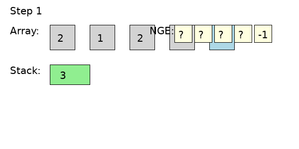

# 📘 Next Greater Element (NGE) — Stack + Animation

## 🧠 Problem
Given an array, find the **Next Greater Element (NGE)** for each element.

- NGE of `x` = first greater element to the **right**
- If none → `-1`

### Example
Input:  [2, 1, 2, 4, 3]  
Output: [4, 2, 4, -1, -1]

---

## 🎥 Dry Run Animation

> Place the GIF in the same folder as this `.md` file



---

## ⚡ Key Idea (Monotonic Stack)

- Traverse **right → left**
- Maintain a **decreasing stack**
- Remove smaller elements (they are useless)

---

## 🧩 Algorithm

```
for i from n-1 down to 0:
    while stack not empty and stack.top <= arr[i]:
        stack.pop()

    if stack empty:
        nge[i] = -1
    else:
        nge[i] = stack.top

    stack.push(arr[i])
```

---

## 🎬 Step-by-Step Understanding

For `arr = [2, 1, 2, 4, 3]`

| i | value | stack before | action | nge[i] | stack after |
|--|------|-------------|--------|--------|------------|
| 4 | 3 | [] | empty → -1 | -1 | [3] |
| 3 | 4 | [3] | pop 3 | -1 | [4] |
| 2 | 2 | [4] | valid top | 4 | [4,2] |
| 1 | 1 | [4,2] | valid top | 2 | [4,2,1] |
| 0 | 2 | [4,2,1] | pop 1,2 | 4 | [4,2] |

---

## 🧠 Why It Works

- Stack always keeps **greater elements**
- Smaller elements are removed because:
  - They can never be the answer for future elements

---

## ⏱ Complexity

- Time: **O(n)**
- Space: **O(n)**

---

## 📦 Folder Structure

```
/dsa-notes
  ├── nge.md
  ├── nge_animation.gif
```
