# Binary Search Pattern Notes

These notes collect the uploaded binary-search pattern PDFs into one easy-to-follow Markdown file with Mermaid diagrams and C++ templates.

---

## 1. Core Idea

Binary search is used when the answer space can be split into two monotonic regions:

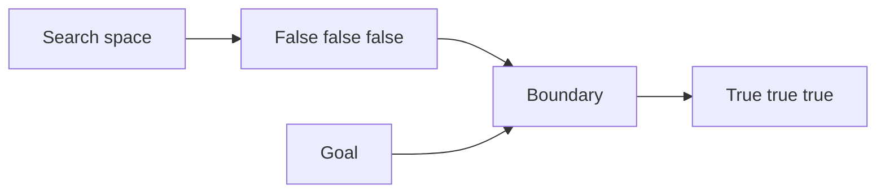

Typical goal: find the first `true` or the last `false`.

### Safe mid formula

Use this:

```cpp
int mid = lo + (hi - lo) / 2;
```

Avoid this:

```cpp
int mid = (lo + hi) / 2; // can overflow
```

---

## 2. Binary Search Templates

### 2.1 First true template

Use when the predicate looks like:

```text
false false false true true true
```

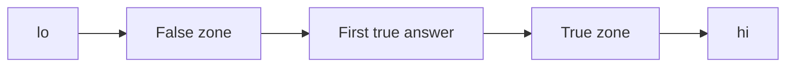

```cpp
int firstTrue(int lo, int hi) {
    int ans = hi + 1;
    while (lo <= hi) {
        int mid = lo + (hi - lo) / 2;
        if (check(mid)) {
            ans = mid;
            hi = mid - 1;
        } else {
            lo = mid + 1;
        }
    }
    return ans;
}
```

### 2.2 Last true template

Use when the predicate looks like:

```text
true true true false false false
```

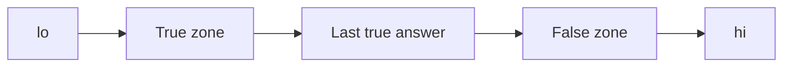

```cpp
int lastTrue(int lo, int hi) {
    int ans = lo - 1;
    while (lo <= hi) {
        int mid = lo + (hi - lo) / 2;
        if (check(mid)) {
            ans = mid;
            lo = mid + 1;
        } else {
            hi = mid - 1;
        }
    }
    return ans;
}
```

---

## 3. Lower Bound and Upper Bound

### Meaning

```cpp
lower_bound(v.begin(), v.end(), x)
```

Returns iterator to first element `>= x`.

```cpp
upper_bound(v.begin(), v.end(), x)
```

Returns iterator to first element `> x`.

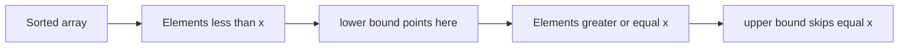

### Count of values

```cpp
int lessThanX = lower_bound(v.begin(), v.end(), x) - v.begin();
int lessOrEqualX = upper_bound(v.begin(), v.end(), x) - v.begin();
int equalX = upper_bound(v.begin(), v.end(), x) - lower_bound(v.begin(), v.end(), x);
```

---

## 4. Pattern A: Binary Search on Answer

Use this when the answer is not an index, but a value such as time, maximum workload, minimum distance, or length.

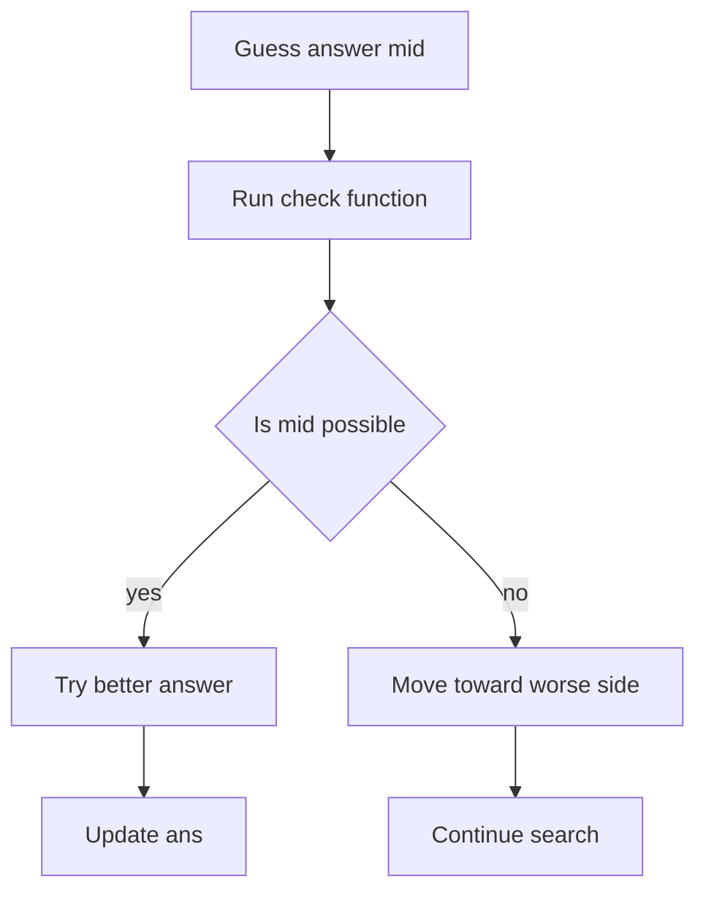

### Framework

```cpp
long long solve() {
    long long lo = L, hi = R;
    long long ans = R;

    while (lo <= hi) {
        long long mid = lo + (hi - lo) / 2;
        if (check(mid)) {
            ans = mid;
            hi = mid - 1; // minimize answer
        } else {
            lo = mid + 1;
        }
    }
    return ans;
}
```

### How to choose range

For a minimization problem:

```text
lo = smallest possible answer
hi = largest possible answer
```

Example for partitioning array into groups:

```text
lo = max element
hi = sum of all elements
```

---

## 5. Painter Partition or Split Array Largest Sum

Goal: split `n` walls/books/array elements among `k` painters or partitions. Each painter takes one continuous block. The time taken by one painter is the sum of its block, so the total finishing time is controlled by the painter with the largest block sum.

```text
answer = max(sum of painter 1, sum of painter 2, ..., sum of painter k)
```

Example from your added notes:

```text
a = [2, 7, 1, 8, 3, 4, 5], k = 3

Possible split:
[2, 7, 1] | [8, 3] | [4, 5]
block sums: 10, 11, 9
answer for this split = max(10, 11, 9) = 11
```

We want the minimum possible value of this maximum block sum.

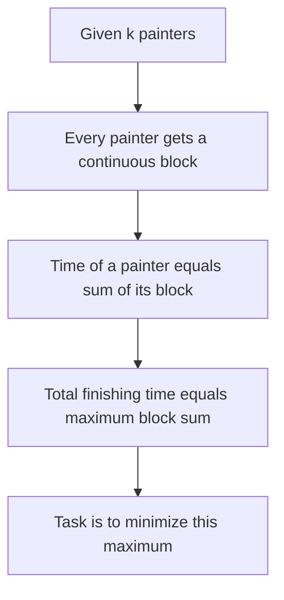

### Intuition

Think of choosing a candidate answer `mid`: can every wall be painted if no painter is allowed to take more than `mid` total time?

If the answer is **yes**, then `mid` is possible and we try a smaller maximum. If the answer is **no**, then `mid` is too small and we need a larger maximum.

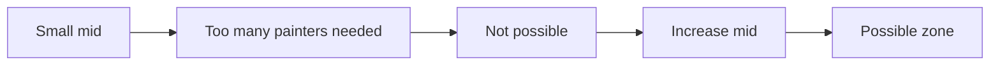

### Search range

```text
lo = max(a[i])      // one painter must paint the largest single wall
hi = sum(a[i])      // one painter paints everything
```

So the monotone space looks like:

```text
NO NO NO YES YES YES
```

We need the first `YES`.

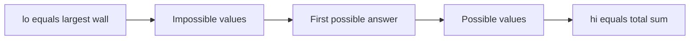

### Greedy check

For a fixed `limit`, scan left to right:

1. Keep adding elements to the current painter while the sum stays `<= limit`.
2. If adding the next element crosses `limit`, start a new painter.
3. Count how many painters are needed.
4. If painters needed `<= k`, the limit works.

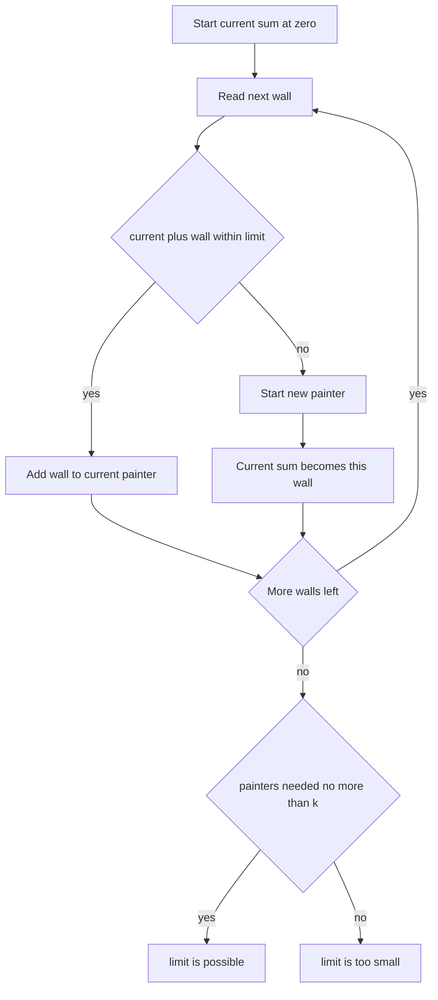

### Check function

```cpp
bool canSplit(const vector<int>& a, int k, long long limit) {
    int groups = 1;
    long long current = 0;

    for (int x : a) {
        if (x > limit) return false;

        if (current + x <= limit) {
            current += x;
        } else {
            groups++;
            current = x;
        }
    }
    return groups <= k;
}
```

### Full code

```cpp
#include <bits/stdc++.h>
using namespace std;

long long splitArrayLargestSum(vector<int>& nums, int k) {
    long long lo = 0, hi = 0;
    for (int x : nums) {
        lo = max(lo, (long long)x);
        hi += x;
    }

    long long ans = hi;
    while (lo <= hi) {
        long long mid = lo + (hi - lo) / 2;
        if (canSplit(nums, k, mid)) {
            ans = mid;
            hi = mid - 1;
        } else {
            lo = mid + 1;
        }
    }
    return ans;
}
```

---

## 6. Factory Machines Pattern

Goal: minimum time needed to produce `t` products using machines where machine `i` makes one product in `a[i]` time.

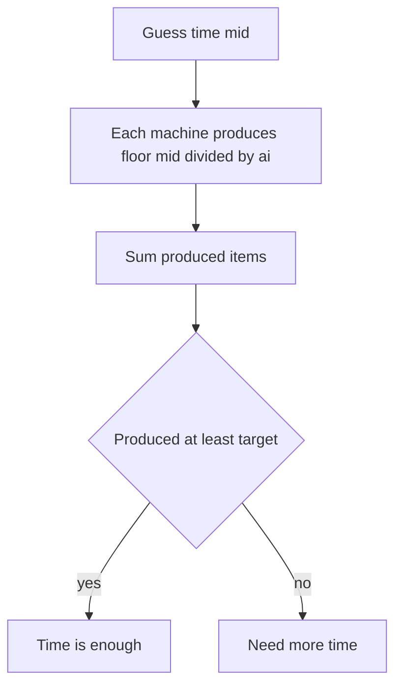

### Check

```cpp
bool canMake(const vector<long long>& machine, long long target, long long time) {
    long long made = 0;
    for (long long m : machine) {
        made += time / m;
        if (made >= target) return true; // avoid overflow
    }
    return false;
}
```

### Full code

```cpp
#include <bits/stdc++.h>
using namespace std;

long long minTime(vector<long long>& machine, long long target) {
    long long lo = 0;
    long long hi = *min_element(machine.begin(), machine.end()) * target;
    long long ans = hi;

    while (lo <= hi) {
        long long mid = lo + (hi - lo) / 2;
        if (canMake(machine, target, mid)) {
            ans = mid;
            hi = mid - 1;
        } else {
            lo = mid + 1;
        }
    }
    return ans;
}
```

---

## 7. Maximum Minimum Distance

Example: place `k` new points or cows so that the minimum distance is as large as possible.

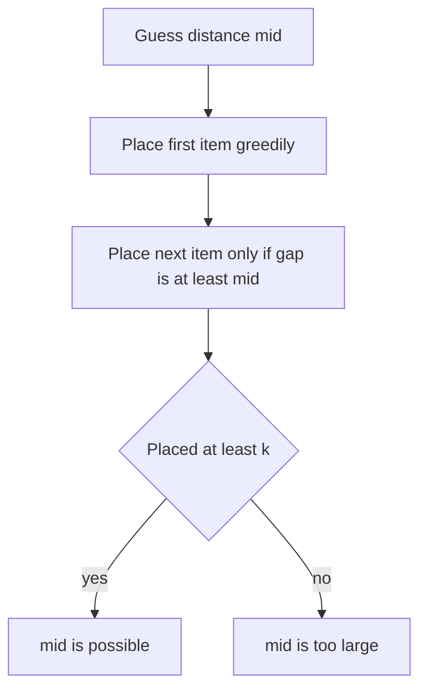

### Check

```cpp
bool canPlace(vector<long long>& pos, int k, long long dist) {
    int placed = 1;
    long long last = pos[0];

    for (int i = 1; i < (int)pos.size(); i++) {
        if (pos[i] - last >= dist) {
            placed++;
            last = pos[i];
        }
    }
    return placed >= k;
}
```

### Search

```cpp
long long maximizeMinDistance(vector<long long>& pos, int k) {
    sort(pos.begin(), pos.end());
    long long lo = 0;
    long long hi = pos.back() - pos.front();
    long long ans = 0;

    while (lo <= hi) {
        long long mid = lo + (hi - lo) / 2;
        if (canPlace(pos, k, mid)) {
            ans = mid;
            lo = mid + 1;
        } else {
            hi = mid - 1;
        }
    }
    return ans;
}
```

---

## 8. Kth Pair Sum from Two Arrays

Given sorted arrays `A` and `B`, find kth smallest value of `A[i] + B[j]`.

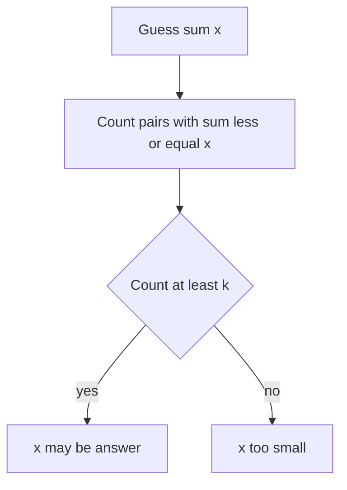

### Count pairs less or equal x

For each `A[i]`, count how many `B[j] <= x - A[i]`.

```cpp
long long countPairsLE(const vector<long long>& A, const vector<long long>& B, long long x) {
    long long count = 0;
    for (long long a : A) {
        count += upper_bound(B.begin(), B.end(), x - a) - B.begin();
    }
    return count;
}
```

### Full code

```cpp
long long kthPairSum(vector<long long> A, vector<long long> B, long long k) {
    sort(A.begin(), A.end());
    sort(B.begin(), B.end());

    long long lo = A.front() + B.front();
    long long hi = A.back() + B.back();
    long long ans = hi;

    while (lo <= hi) {
        long long mid = lo + (hi - lo) / 2;
        if (countPairsLE(A, B, mid) >= k) {
            ans = mid;
            hi = mid - 1;
        } else {
            lo = mid + 1;
        }
    }
    return ans;
}
```

---

## 9. Largest Subarray of Ones After at Most K Flips

Goal: maximum length subarray that can be made all `1` by flipping at most `k` zeros.

### Binary search way

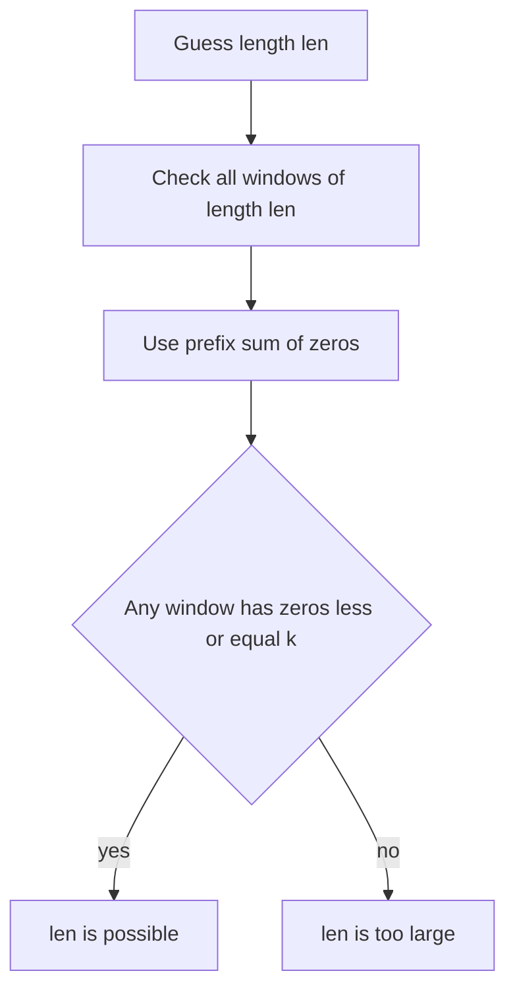

```cpp
bool canMakeOnes(const vector<int>& a, int k, int len) {
    int n = a.size();
    vector<int> pref(n + 1, 0);

    for (int i = 0; i < n; i++) {
        pref[i + 1] = pref[i] + (a[i] == 0);
    }

    for (int l = 0; l + len <= n; l++) {
        int r = l + len;
        int zeros = pref[r] - pref[l];
        if (zeros <= k) return true;
    }
    return false;
}

int maxOnesAfterFlips(vector<int>& a, int k) {
    int n = a.size();
    int lo = 0, hi = n, ans = 0;

    while (lo <= hi) {
        int mid = lo + (hi - lo) / 2;
        if (canMakeOnes(a, k, mid)) {
            ans = mid;
            lo = mid + 1;
        } else {
            hi = mid - 1;
        }
    }
    return ans;
}
```

### Better sliding window way

```cpp
int maxOnesAfterFlipsSliding(vector<int>& a, int k) {
    int n = a.size();
    int l = 0, zeros = 0, ans = 0;

    for (int r = 0; r < n; r++) {
        if (a[r] == 0) zeros++;
        while (zeros > k) {
            if (a[l] == 0) zeros--;
            l++;
        }
        ans = max(ans, r - l + 1);
    }
    return ans;
}
```

---

## 10. Count Subarrays With At Most K Zeros

Here we cannot only binary search the final answer. We need count using monotone property for every start index.

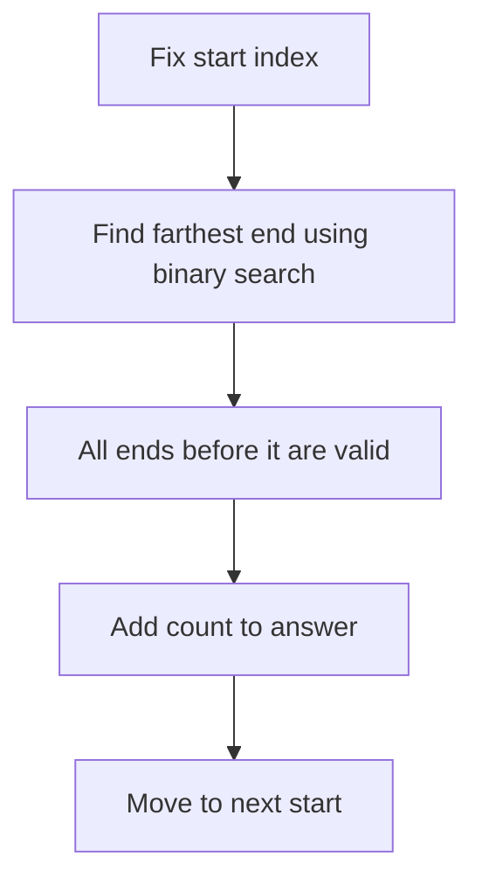

```cpp
long long countSubarraysAtMostKZeros(vector<int>& a, int k) {
    int n = a.size();
    vector<int> pref(n + 1, 0);

    for (int i = 0; i < n; i++) {
        pref[i + 1] = pref[i] + (a[i] == 0);
    }

    long long ans = 0;
    for (int st = 0; st < n; st++) {
        int lo = st, hi = n - 1;
        int best = st - 1;

        while (lo <= hi) {
            int mid = lo + (hi - lo) / 2;
            int zeros = pref[mid + 1] - pref[st];
            if (zeros <= k) {
                best = mid;
                lo = mid + 1;
            } else {
                hi = mid - 1;
            }
        }

        ans += best - st + 1;
    }
    return ans;
}
```

---

## 11. Peak Finding in Bitonic Array

A bitonic array increases then decreases. We can find the peak using binary search.

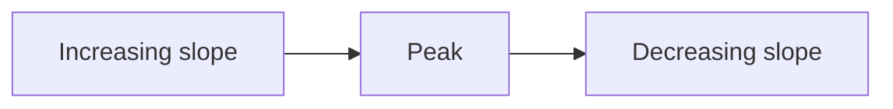

Check:

```text
if arr[mid] > arr[mid + 1], peak is at mid or left
else peak is on right
```

```cpp
int findPeak(vector<int>& a) {
    int lo = 0, hi = (int)a.size() - 1;

    while (lo < hi) {
        int mid = lo + (hi - lo) / 2;
        if (a[mid] > a[mid + 1]) {
            hi = mid;
        } else {
            lo = mid + 1;
        }
    }
    return lo;
}
```

---

## 12. Rotated Sorted Array: Find Rotation Count

The rotation count is the index of the minimum element.

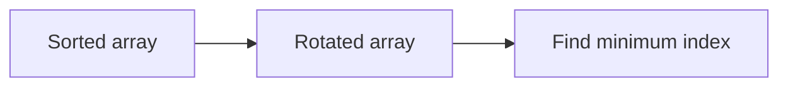

```cpp
int rotationCount(vector<int>& a) {
    int n = a.size();
    int lo = 0, hi = n - 1;

    while (lo < hi) {
        int mid = lo + (hi - lo) / 2;
        if (a[mid] > a[hi]) {
            lo = mid + 1;
        } else {
            hi = mid;
        }
    }
    return lo;
}
```

---

## 13. Binary Search on Real Domain

For real numbers, do not use `mid + 1` or `mid - 1`. Use precision or fixed iterations.

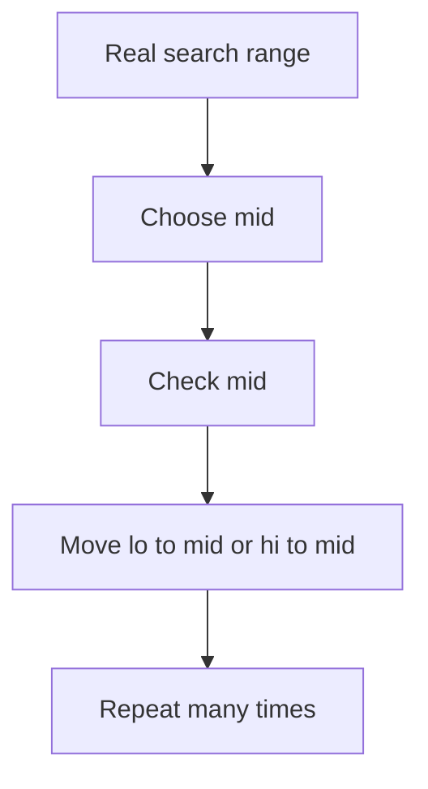

### Fixed iteration template

```cpp
long double binarySearchReal(long double lo, long double hi) {
    for (int it = 0; it < 100; it++) {
        long double mid = (lo + hi) / 2;
        if (check(mid)) {
            hi = mid;
        } else {
            lo = mid;
        }
    }
    return (lo + hi) / 2;
}
```

### EPS template

```cpp
long double binarySearchRealEPS(long double lo, long double hi) {
    const long double EPS = 1e-12;
    while (fabsl(hi - lo) > EPS) {
        long double mid = (lo + hi) / 2;
        if (check(mid)) {
            hi = mid;
        } else {
            lo = mid;
        }
    }
    return (lo + hi) / 2;
}
```

---

## 14. Ternary Search

Use ternary search for unimodal functions:

- first increasing then decreasing: maximum
- first decreasing then increasing: minimum

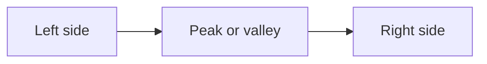

For a convex up curve, ternary search finds minimum.

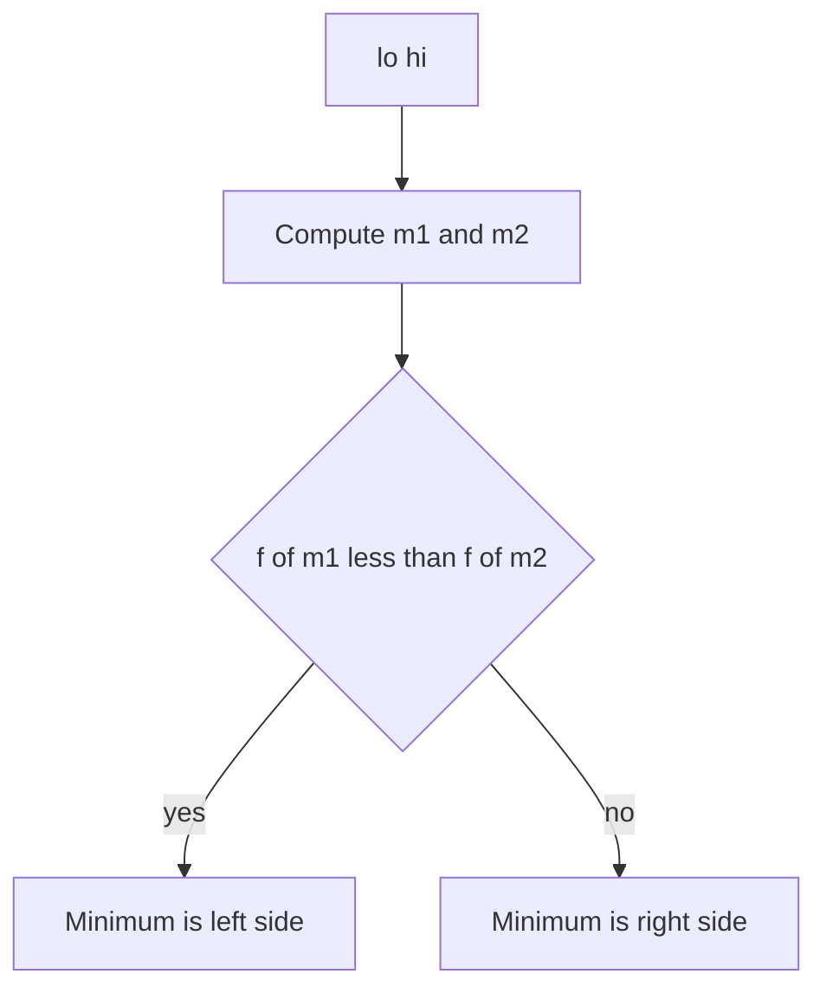

### Continuous ternary search

```cpp
long double ternarySearch(long double lo, long double hi) {
    for (int it = 0; it < 200; it++) {
        long double m1 = lo + (hi - lo) / 3;
        long double m2 = hi - (hi - lo) / 3;

        if (f(m1) < f(m2)) {
            hi = m2;
        } else {
            lo = m1;
        }
    }
    return f((lo + hi) / 2);
}
```

### Integer ternary search

For integer domain, after the range becomes small, brute force the remaining values.

```cpp
long long integerTernary(long long lo, long long hi) {
    while (hi - lo > 3) {
        long long m1 = lo + (hi - lo) / 3;
        long long m2 = hi - (hi - lo) / 3;

        if (f(m1) < f(m2)) {
            hi = m2;
        } else {
            lo = m1;
        }
    }

    long long ans = f(lo);
    for (long long x = lo; x <= hi; x++) {
        ans = min(ans, f(x));
    }
    return ans;
}
```

---

## 15. Freefall Example: Ternary Search or Calculus

Function:

```text
f(x) = B times x + A divided by sqrt(x + 1)
```

Here `x` is number of operations. The curve is convex up, so ternary search can minimize it.

```cpp
#include <bits/stdc++.h>
using namespace std;

using ld = long double;
using ll = long long;

ll A, B;

ld f(ll x) {
    return (ld)B * x + (ld)A / sqrt((ld)x + 1);
}

int main() {
    cin >> A >> B;

    ll lo = 0;
    ll hi = A / B + 5; // safe practical upper bound

    while (hi - lo > 3) {
        ll m1 = lo + (hi - lo) / 3;
        ll m2 = hi - (hi - lo) / 3;

        if (f(m1) < f(m2)) {
            hi = m2;
        } else {
            lo = m1;
        }
    }

    ld ans = f(lo);
    for (ll x = lo; x <= hi; x++) {
        ans = min(ans, f(x));
    }

    cout << fixed << setprecision(15) << ans << "\n";
    return 0;
}
```

---

## 16. Sum of Cubes Drill

Problem: check if `x = a^3 + b^3` for positive integers `a` and `b`.

Main idea:

- Since `x <= 1e12`, cube root is at most `1e4`.
- Precompute cubes or loop `a` from `1` to `10000`.
- For remaining value `x - a^3`, check whether it is a perfect cube.

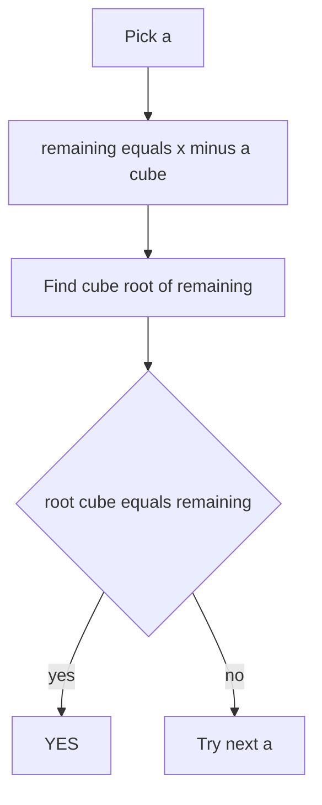

### Overflow safe cube root

Avoid `mid * mid * mid` overflow by using divide and check.

```cpp
long long cubeRootFloor(long long x) {
    long long lo = 1, hi = 1000000, ans = 0;

    while (lo <= hi) {
        long long mid = lo + (hi - lo) / 2;

        // Check mid^3 <= x without overflow.
        if (mid <= x / mid / mid) {
            ans = mid;
            lo = mid + 1;
        } else {
            hi = mid - 1;
        }
    }
    return ans;
}
```

### Full code

```cpp
#include <bits/stdc++.h>
using namespace std;
using ll = long long;

ll cubeRootFloor(ll x) {
    ll lo = 1, hi = 1000000, ans = 0;
    while (lo <= hi) {
        ll mid = lo + (hi - lo) / 2;
        if (mid <= x / mid / mid) {
            ans = mid;
            lo = mid + 1;
        } else {
            hi = mid - 1;
        }
    }
    return ans;
}

bool possible(ll x) {
    for (ll a = 1; a * a * a < x; a++) {
        ll rem = x - a * a * a;
        ll b = cubeRootFloor(rem);
        if (b > 0 && b * b * b == rem) {
            return true;
        }
    }
    return false;
}

int main() {
    ios::sync_with_stdio(false);
    cin.tie(nullptr);

    int t;
    cin >> t;
    while (t--) {
        ll x;
        cin >> x;
        cout << (possible(x) ? "YES" : "NO") << "\n";
    }
}
```

---

## 17. Quick Decision Checklist

```mermaid
flowchart TD
    A[Question] --> B{Is answer an index in sorted array}
    B -->|yes| C[Use lower bound or upper bound]
    B -->|no| D{Can answer value be checked}
    D -->|yes| E[Binary search on answer]
    D -->|no| F{Is function unimodal}
    F -->|yes| G[Ternary search]
    F -->|no| H[Use another pattern]
```

### Use binary search when

- You can define a monotone `check(x)`.
- The search space has one boundary between false and true.
- You are minimizing maximum or maximizing minimum.
- You need first valid value or last valid value.

### Use ternary search when

- Function is unimodal.
- You need minimum or maximum of a convex or concave curve.
- Binary search predicate is hard, but function values can be compared.

### Use lower or upper bound when

- Array is sorted.
- You need counts like `< x`, `<= x`, `>= x`, `> x`.
- You need kth value based on counting.

---

## 18. Common Mistakes

1. Repeating the same search space forever.
   - Always shrink using `lo = mid + 1` or `hi = mid - 1` for integer search.

2. Wrong monotone predicate.
   - Check must produce one clean block of false and one clean block of true.

3. Overflow in mid.
   - Use `lo + (hi - lo) / 2`.

4. Overflow in multiplication.
   - Use division based checks, `long long`, or `__int128`.

5. Wrong answer initialization.
   - For first true, initialize answer to `hi + 1`.
   - For last true, initialize answer to `lo - 1`.

6. Using integer style updates in real domain.
   - Real domain uses `lo = mid` and `hi = mid`, not plus or minus one.

---

## 19. Final Template Library

```cpp
// First true in false false true true pattern
long long firstTrue(long long lo, long long hi) {
    long long ans = hi + 1;
    while (lo <= hi) {
        long long mid = lo + (hi - lo) / 2;
        if (check(mid)) {
            ans = mid;
            hi = mid - 1;
        } else {
            lo = mid + 1;
        }
    }
    return ans;
}

// Last true in true true false false pattern
long long lastTrue(long long lo, long long hi) {
    long long ans = lo - 1;
    while (lo <= hi) {
        long long mid = lo + (hi - lo) / 2;
        if (check(mid)) {
            ans = mid;
            lo = mid + 1;
        } else {
            hi = mid - 1;
        }
    }
    return ans;
}

// Real domain binary search
long double realBinary(long double lo, long double hi) {
    for (int it = 0; it < 100; it++) {
        long double mid = (lo + hi) / 2;
        if (check(mid)) hi = mid;
        else lo = mid;
    }
    return (lo + hi) / 2;
}
```
