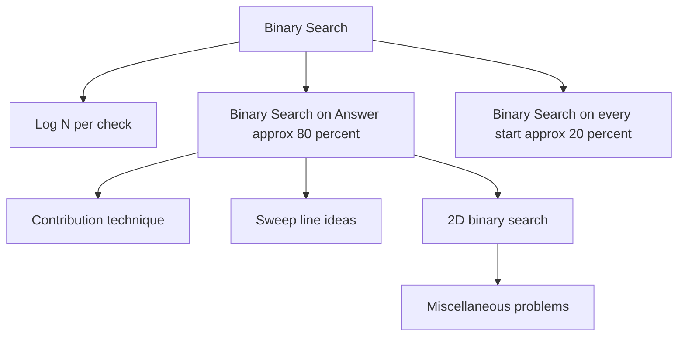
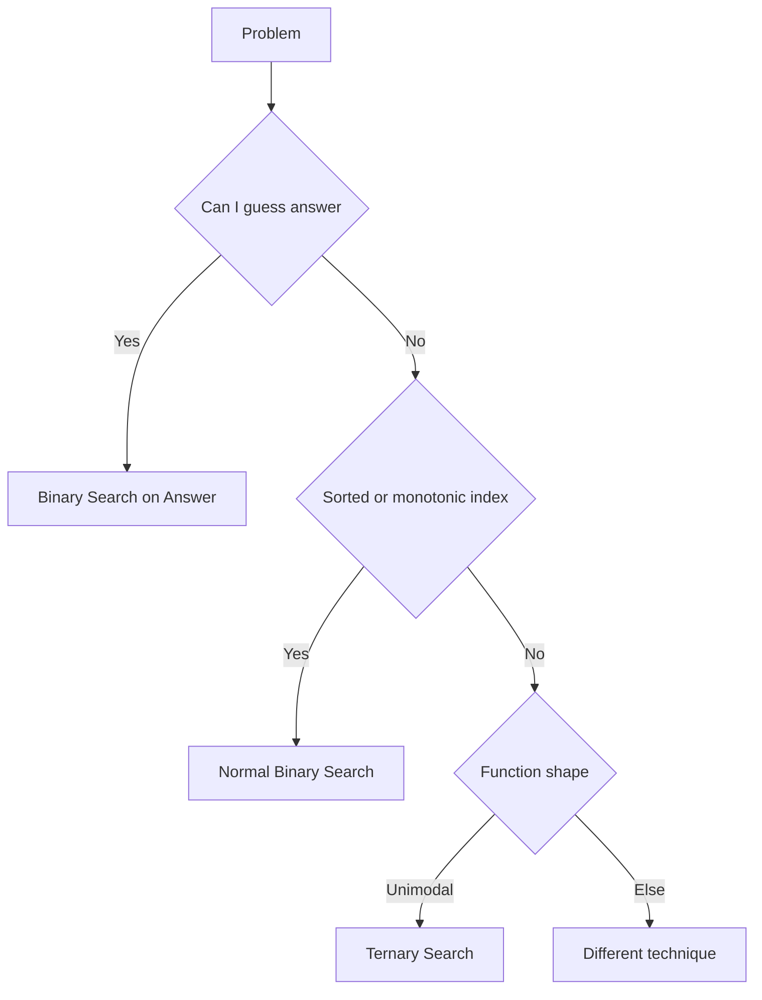

# Binary Search Pattern Notes (Final Updated)

---

## 🧠 Binary Search Framework (from your notes)

### 🧠 Intuition

Binary Search is not one thing — it appears in multiple forms:

1. **Binary Search on Answer (Most Important - 80%)**
   - Guess answer
   - Check feasibility

2. **Binary Search per Start (Advanced - 20%)**
   - Fix one parameter
   - Binary search another

3. **Hybrid Patterns**
   - Contribution technique
   - Sweep line + BS
   - 2D BS

---

## 🔥 Core Idea

👉 Always think:

> “Can I convert problem into YES / NO check?”

---

## 🚀 Quick Mental Model

---

## ⚡ Quick Notes (Last Minute Revision)

- Binary Search = Guess + Check
- 80 percent problems = BS on Answer
- Always find monotonic behavior
- Minimize max → BS
- Maximize min → BS
- Count ≤ x → use prefix or upper_bound
- Real values → precision loop
- Unimodal → ternary search

---

END
