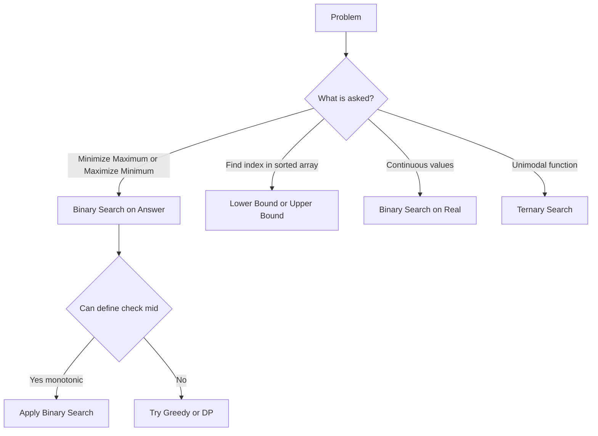

# Binary Search Pattern Notes (Enhanced)

---

## 🧠 Master Mental Map



---

## 🔥 Core Intuition

Binary Search is NOT about arrays.

👉 It is about:
> “Guess an answer and verify it”

---

## 🧩 Pattern: Binary Search on Answer

### 🧠 Intuition
We don’t build the answer directly.
We **guess the answer** and check if it's possible.

---

## 🎯 Painter Partition (Enhanced)

### 🧠 Intuition (Your notes improved)

- We divide work into **k painters**
- Each painter paints **continuous walls**
- Time = **sum of segment**
- Final answer = **max segment sum**

👉 So:
> We want to **minimize the maximum workload**

---

### 🔍 Pattern Trigger

- split into k parts  
- minimize maximum  
- continuous segments  

---

### 📌 Example (your notes)

```
a = [2,7,1,8,3,4,5], k = 3

Split:
[2,7,1] = 10
[8,3]   = 11
[4,5]   = 9

Answer = max = 11
Goal = minimize this
```

---

### 🧠 Thinking Trick

👉 Instead of splitting manually:

Ask:
> “Can I split so no painter exceeds mid?”

---

## ⚙️ Check Logic

```cpp
bool canSplit(vector<int>& a, int k, long long mid) {
    int painters = 1;
    long long sum = 0;

    for (int x : a) {
        if (sum + x <= mid) {
            sum += x;
        } else {
            painters++;
            sum = x;
        }
    }
    return painters <= k;
}
```

---

## 🧩 Pattern: Factory Machines

### 🧠 Intuition

Each machine produces items.

👉 Ask:
> “In time mid, how many items can we produce?”

---

### 📌 Example

Machines = [2,3,7], target = 10

Check mid = 8:
- 8/2 = 4
- 8/3 = 2
- 8/7 = 1
Total = 7 ❌

---

## 🧩 Pattern: Maximum Minimum Distance

### 🧠 Intuition

👉 Instead of placing optimally:
Ask:
> “Can we place items at least mid apart?”

---

### 📌 Example

Positions = [1,2,8,12], k = 3

Try mid = 3:
Place:
1 → 8 → 12 ✅

---

## 🧩 Pattern: Kth Pair Sum

### 🧠 Intuition

👉 We don’t build all pairs

Instead:
> Count how many pairs ≤ mid

---

### 📌 Example

A=[1,2], B=[3,4]

Pairs:
4,5,5,6

Find 3rd smallest

---

## 🧩 Pattern: Max Subarray after K flips

### 🧠 Intuition

👉 Ask:
> “Can we make subarray of length mid?”

---

## 🧩 Pattern: Count Subarrays ≤ K zeros

### 🧠 Intuition

👉 Fix start  
👉 Find farthest valid end

---

## ⚡ Binary Search on Real

### 🧠 Intuition

No discrete jumps.

👉 Shrink continuously

---

## 🔺 Ternary Search

### 🧠 Intuition

Used when:

- Curve is like ∪ or ∩

👉 Compare two mid points

---

## 📌 Freefall Example (from notes)

Minimize:

f(x) = B*x + A/sqrt(x+1)

👉 convex → use ternary search

---

## ⚡ Sum of Cubes (Drill)

### 🧠 Intuition

👉 Fix a  
👉 Check if remaining is cube

---

## 🧠 Quick Notes (FINAL REVISION)

- Binary Search = Guess + Check
- Always find monotonic condition
- Minimize max → BS
- Maximize min → BS
- Counting → prefix + BS
- Continuous → EPS / iterations
- Unimodal → ternary

---

## 🚀 Contest Cheat Sheet

- “minimize maximum” → BS
- “maximize minimum” → BS
- “kth smallest” → count + BS
- “continuous + precision” → real BS
- “curve min/max” → ternary

---

END
