# CP/DSA Pattern-Wise Visual Notes: Bit Manipulation + Graphs + Trees

Made from the attached notes in order:

1. **Bit Manipulation**
2. **Graph Short Notes**
3. **Tree Short Notes**

Includes Mermaid diagrams, step-by-step examples, intuition, small C++ code, Java helpers where useful, and 1-minute mental tricks.

---

# 0. Master Map

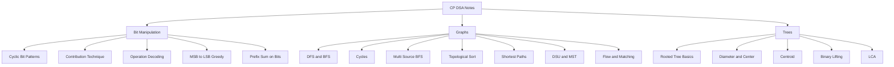

### 1-minute mental trick

> First identify the shape: bit columns, graph nodes/edges, or tree paths. Then pick the matching pattern.

---

# Part A. Bit Manipulation

## A1. Basic Bit Operations

| Operation | Meaning | C++ |
|---|---|---|
| check i-th bit | is bit `i` set? | `(x >> i) & 1` |
| set i-th bit | make bit `i` equal 1 | `x | (1LL << i)` |
| clear i-th bit | make bit `i` equal 0 | `x & ~(1LL << i)` |
| toggle i-th bit | flip bit `i` | `x ^ (1LL << i)` |
| lowbit | last set bit value | `x & -x` |

```cpp
bool isSet(long long x, int i) {
    return (x >> i) & 1LL;
}

long long setBit(long long x, int i) {
    return x | (1LL << i);
}

long long clearBit(long long x, int i) {
    return x & ~(1LL << i);
}

long long toggleBit(long long x, int i) {
    return x ^ (1LL << i);
}
```

### Java helpers

```java
static boolean isSet(long x, int i) {
    return ((x >> i) & 1L) == 1L;
}

static long setBit(long x, int i) {
    return x | (1L << i);
}
```

---

## A2. Application 1: Cyclic Properties of Bits

Your notes consider writing numbers in binary:

```text
S = 0 1 10 11 100 101 ...
index: 0 1 2  3  4   5
```

If queries ask for the `k-th 1`, direct generation works only for small constraints. For large `k`, count how many `1`s appear from `0` to `x` and binary search the smallest `x`.

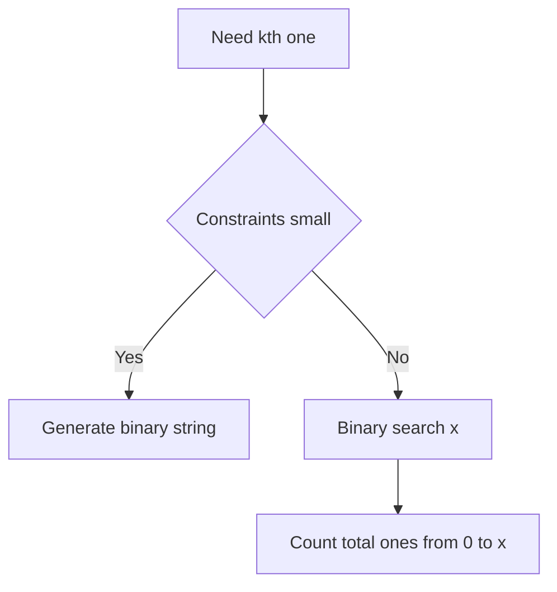

### Direct generation for small constraints

```cpp
string getBinary(int x) {
    if (x == 0) return "0";

    string cur;
    while (x > 0) {
        cur.push_back(char('0' + (x % 2)));
        x /= 2;
    }

    reverse(cur.begin(), cur.end());
    return cur;
}
```

### Count ones at one bit position

For the `i-th` bit, the period is:

```text
2^(i+1)
```

Inside each period:

```text
first 2^i values  -> bit is 0
next  2^i values  -> bit is 1
```

```mermaid
flowchart LR
    A[i-th bit] --> B[0 block length 2^i]
    B --> C[1 block length 2^i]
    C --> D[period 2^(i+1)]
```

```cpp
long long countOnesAtBit(long long x, int i) {
    long long period = 1LL << (i + 1);
    long long half = 1LL << i;
    long long total = x + 1;

    long long fullBlocks = total / period;
    long long rem = total % period;

    return fullBlocks * half + max(0LL, rem - half);
}

long long countTotalOnes(long long x) {
    long long ans = 0;
    for (int i = 0; i <= 60; i++) {
        ans += countOnesAtBit(x, i);
    }
    return ans;
}
```

### Binary search kth one-number

```cpp
long long kthOneNumber(long long k) {
    long long lo = 0, hi = (long long)4e18;
    long long ans = hi;

    while (lo <= hi) {
        long long mid = lo + (hi - lo) / 2;

        if (countTotalOnes(mid) >= k) {
            ans = mid;
            hi = mid - 1;
        } else {
            lo = mid + 1;
        }
    }

    return ans;
}
```

### 1-minute mental trick

> i-th bit repeats as zeros then ones with block size `2^i`.

---

## A3. Application 2: Contribution Technique

Question style:

```text
Find sum of XOR over all pairs.
```

Brute force checks every pair. Contribution technique checks every bit independently.

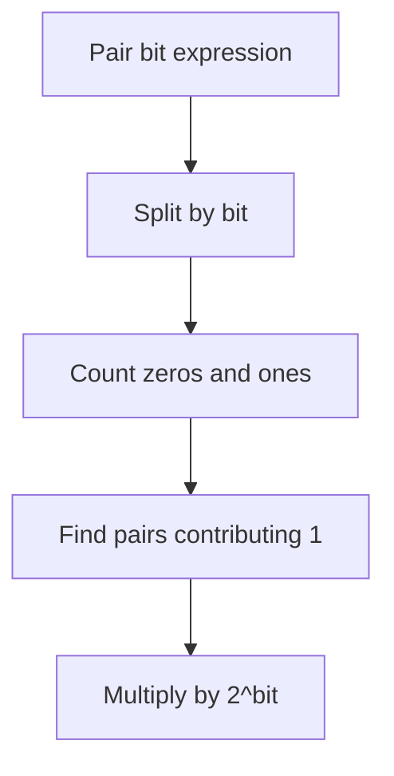

### XOR pair contribution

For a bit:

```text
XOR = 1 when bits are different
contribution = count0 * count1 * 2^bit
```

```cpp
long long pairXorSum(vector<int>& a) {
    long long ans = 0;

    for (int bit = 0; bit < 31; bit++) {
        long long c0 = 0, c1 = 0;

        for (int x : a) {
            if ((x >> bit) & 1) c1++;
            else c0++;
        }

        ans += c0 * c1 * (1LL << bit);
    }

    return ans;
}
```

### AND pair contribution

```text
AND = 1 only when both bits are 1
contribution = C(count1, 2) * 2^bit
```

```cpp
long long pairAndSum(vector<int>& a) {
    long long ans = 0;

    for (int bit = 0; bit < 31; bit++) {
        long long c1 = 0;

        for (int x : a) {
            if ((x >> bit) & 1) c1++;
        }

        ans += (c1 * (c1 - 1) / 2) * (1LL << bit);
    }

    return ans;
}
```

### OR pair contribution

```text
OR = 1 unless both are 0
contribution = (totalPairs - C(count0, 2)) * 2^bit
```

```cpp
long long pairOrSum(vector<int>& a) {
    long long n = a.size();
    long long totalPairs = n * (n - 1) / 2;
    long long ans = 0;

    for (int bit = 0; bit < 31; bit++) {
        long long c0 = 0;

        for (int x : a) {
            if (((x >> bit) & 1) == 0) c0++;
        }

        long long bad = c0 * (c0 - 1) / 2;
        ans += (totalPairs - bad) * (1LL << bit);
    }

    return ans;
}
```

### Step example for XOR

```text
bit column = 0 1 0 1 1 0 0 0 0 1 1 0 1 1
#0 = 8
#1 = 6
pairs with XOR bit 1 = 8 * 6 = 48
contribution = 48 * 2^bit
```

### 1-minute mental trick

> XOR wants different bits. AND wants both 1. OR wants at least one 1.

---

## A4. Application 3: Operation Decoding and Conservation of Bits

When an operation is repeated many times, first ask:

```text
What does this operation do to one bit column?
```

Example operation:

```text
replace a and b by:
a | b and a & b
```

For every bit:

| a | b | a OR b | a AND b | number of ones preserved? |
|---|---|---|---|---|
| 0 | 0 | 0 | 0 | yes |
| 0 | 1 | 1 | 0 | yes |
| 1 | 0 | 1 | 0 | yes |
| 1 | 1 | 1 | 1 | yes |

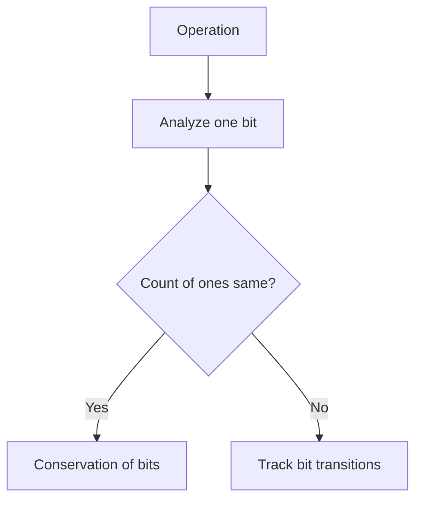

### Maximize sum of squares after conservation

If bit counts are conserved, to maximize sum of squares, pack larger numbers by greedily giving available set bits to each constructed number.

```cpp
long long maxSumSquaresAfterConservation(vector<int>& a) {
    vector<int> cnt(31, 0);

    for (int x : a) {
        for (int bit = 0; bit < 31; bit++) {
            if ((x >> bit) & 1) cnt[bit]++;
        }
    }

    long long ans = 0;
    int n = a.size();

    for (int i = 0; i < n; i++) {
        long long x = 0;

        for (int bit = 0; bit < 31; bit++) {
            if (cnt[bit] > 0) {
                x |= (1LL << bit);
                cnt[bit]--;
            }
        }

        ans += x * x;
    }

    return ans;
}
```

### 1-minute mental trick

> If operation preserves bit counts, draw bit columns and redistribute ones.

---

## A5. Application 4: Highest Bit to Lowest Bit

Problem style:

```text
Given an array, find x numbers such that bitwise AND of all x numbers is maximum.
```

Main idea:

```text
One 1 at a higher bit is more powerful than all lower bits combined.
```

So greedily build answer from highest bit to lowest bit.

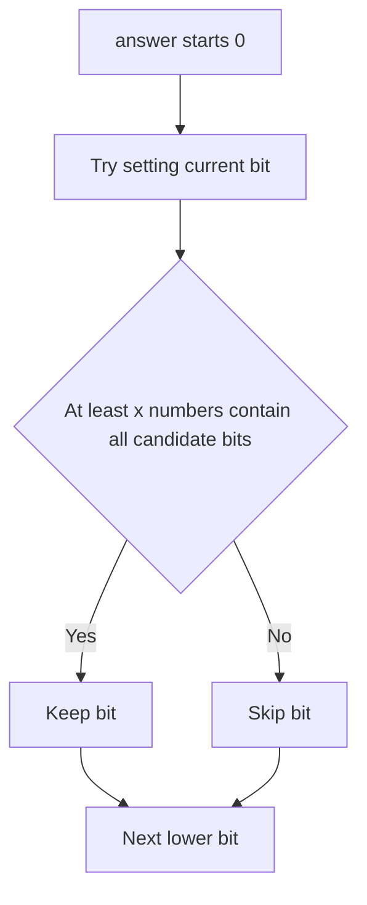

```cpp
int maxAndOfXNumbers(vector<int>& a, int x) {
    int ans = 0;

    for (int bit = 30; bit >= 0; bit--) {
        int candidate = ans | (1 << bit);
        int count = 0;

        for (int val : a) {
            if ((val & candidate) == candidate) {
                count++;
            }
        }

        if (count >= x) {
            ans = candidate;
        }
    }

    return ans;
}
```

### 1-minute mental trick

> To maximize a bitwise value, decide bits from MSB to LSB.

---

## A6. Application 5: Prefix Sum on Bits

Problem style:

```text
Find smallest x such that:
(a[l] op x) + ... + (a[r] op x) is maximum.
```

Use prefix count of set bits.

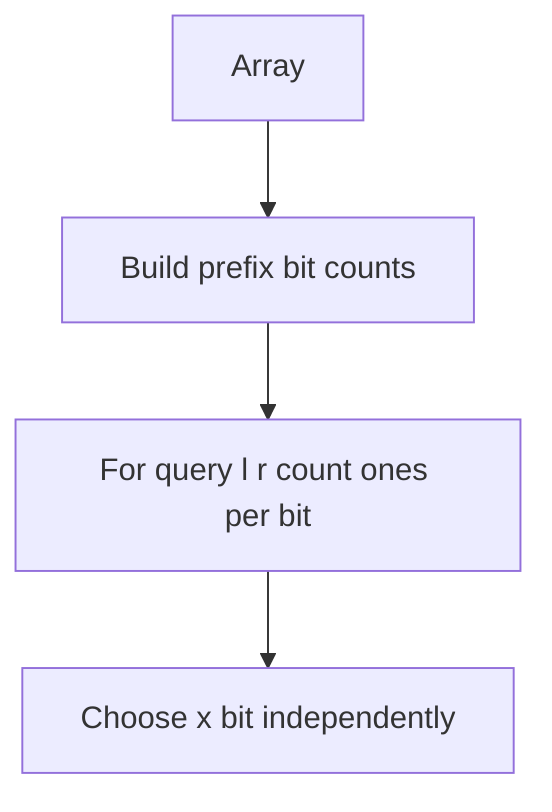

```cpp
struct BitPrefix {
    vector<vector<int>> pref;

    BitPrefix(vector<int>& a) {
        int n = a.size();
        pref.assign(n + 1, vector<int>(31, 0));

        for (int i = 0; i < n; i++) {
            pref[i + 1] = pref[i];
            for (int bit = 0; bit < 31; bit++) {
                if ((a[i] >> bit) & 1) pref[i + 1][bit]++;
            }
        }
    }

    int ones(int l, int r, int bit) {
        return pref[r + 1][bit] - pref[l][bit];
    }
};
```

### Smallest x maximizing XOR sum in range

```cpp
int smallestXForMaxXorSum(vector<int>& a, int l, int r) {
    BitPrefix bp(a);
    int len = r - l + 1;
    int x = 0;

    for (int bit = 0; bit < 31; bit++) {
        int one = bp.ones(l, r, bit);
        int zero = len - one;

        if (zero > one) {
            x |= (1 << bit);
        }
    }

    return x;
}
```

### 1-minute mental trick

> Prefix bit counts turn range bit questions into O(31).

---

# Part B. Graphs

## B1. Graph Basics

A graph is:

```text
G = (V, E)
V = vertices
E = edges
```

Types from notes:

```text
labelled / unlabelled
weighted / unweighted
directed / undirected
sparse / dense
simple graph / multigraph
DAG
tree
forest
bipartite graph
complete graph
```

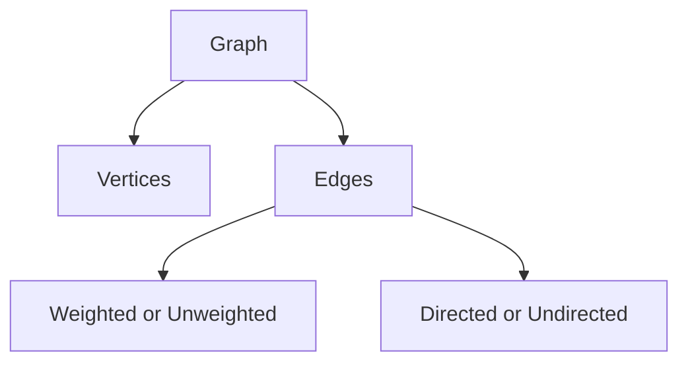

### 1-minute mental trick

> Nodes are things. Edges are relationships.

---

## B2. Graph Representation

### Adjacency matrix

```cpp
vector<vector<int>> mat(n + 1, vector<int>(n + 1, 0));
mat[u][v] = 1;
mat[v][u] = 1; // only for undirected
```

### Edge list

```cpp
struct Edge {
    int u, v, w;
};
vector<Edge> edges;
```

### Adjacency list

```cpp
vector<vector<int>> g(n + 1);
g[u].push_back(v);
g[v].push_back(u); // only if undirected
```

Weighted:

```cpp
vector<vector<pair<int,int>>> g(n + 1);
g[u].push_back({v, w});
```

### 1-minute mental trick

> Matrix checks edge fast. List explores neighbours fast. Edge list processes all edges fast.

---

## B3. DFS

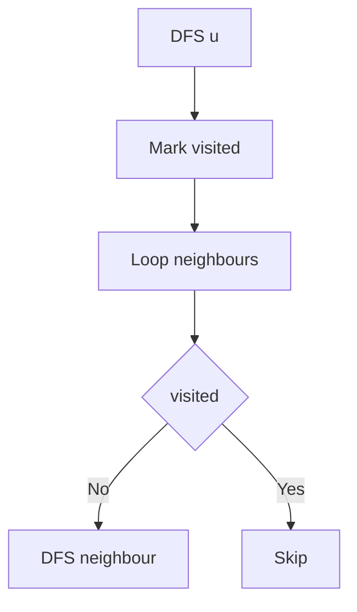

### LCCM

```text
Level  = current node
Choice = neighbours
Check  = not visited
Move   = dfs neighbour
```

```cpp
vector<vector<int>> g;
vector<int> vis;

void dfs(int u) {
    vis[u] = 1;

    for (int v : g[u]) {
        if (!vis[v]) dfs(v);
    }
}
```

### Java DFS

```java
static ArrayList<Integer>[] g;
static boolean[] vis;

static void dfs(int u) {
    vis[u] = true;
    for (int v : g[u]) {
        if (!vis[v]) dfs(v);
    }
}
```

---

## B4. Connected Components

Run DFS from every unvisited node.

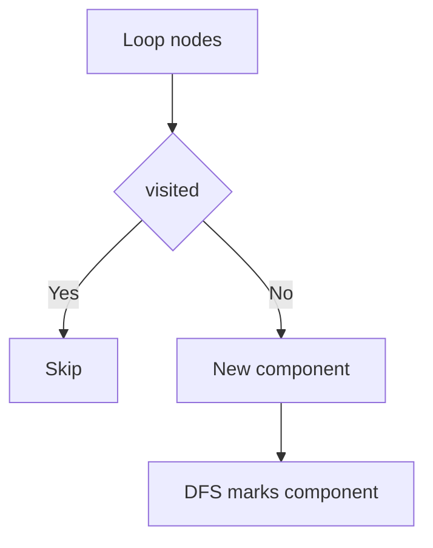

```cpp
vector<int> comp;

void dfsComp(int u, int id) {
    comp[u] = id;

    for (int v : g[u]) {
        if (comp[v] == 0) dfsComp(v, id);
    }
}

int countComponents(int n) {
    comp.assign(n + 1, 0);
    int id = 0;

    for (int i = 1; i <= n; i++) {
        if (comp[i] == 0) {
            id++;
            dfsComp(i, id);
        }
    }

    return id;
}
```

---

## B5. Bipartite Graph

A graph is bipartite if it can be colored with two colors so no edge joins same color.

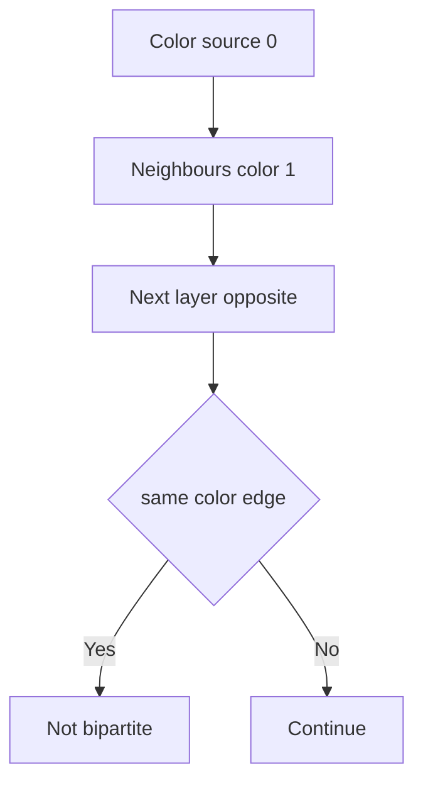

```cpp
bool isBipartite(int n, vector<vector<int>>& g) {
    vector<int> color(n + 1, -1);

    function<bool(int,int)> dfs = [&](int u, int c) {
        color[u] = c;

        for (int v : g[u]) {
            if (color[v] == -1) {
                if (!dfs(v, c ^ 1)) return false;
            } else if (color[v] == color[u]) {
                return false;
            }
        }

        return true;
    };

    for (int i = 1; i <= n; i++) {
        if (color[i] == -1 && !dfs(i, 0)) return false;
    }

    return true;
}
```

### 1-minute mental trick

> Bipartite fails when an odd cycle exists.

---

## B6. Cycle Detection

### Undirected graph

Visited neighbour not equal to parent means cycle.

```cpp
bool hasCycleUndirected(int n, vector<vector<int>>& g) {
    vector<int> vis(n + 1, 0);

    function<bool(int,int)> dfs = [&](int u, int p) {
        vis[u] = 1;

        for (int v : g[u]) {
            if (!vis[v]) {
                if (dfs(v, u)) return true;
            } else if (v != p) {
                return true;
            }
        }

        return false;
    };

    for (int i = 1; i <= n; i++) {
        if (!vis[i] && dfs(i, -1)) return true;
    }

    return false;
}
```

### Directed graph

Use colors:

```text
0 = unvisited
1 = currently exploring
2 = fully explored
```

```cpp
bool hasCycleDirected(int n, vector<vector<int>>& g) {
    vector<int> color(n + 1, 0);

    function<bool(int)> dfs = [&](int u) {
        color[u] = 1;

        for (int v : g[u]) {
            if (color[v] == 0) {
                if (dfs(v)) return true;
            } else if (color[v] == 1) {
                return true;
            }
        }

        color[u] = 2;
        return false;
    };

    for (int i = 1; i <= n; i++) {
        if (color[i] == 0 && dfs(i)) return true;
    }

    return false;
}
```

### 1-minute mental trick

> Directed cycle = edge to a node still in current recursion stack.

---

## B7. BFS

BFS explores level by level and gives shortest distance in unweighted graph.

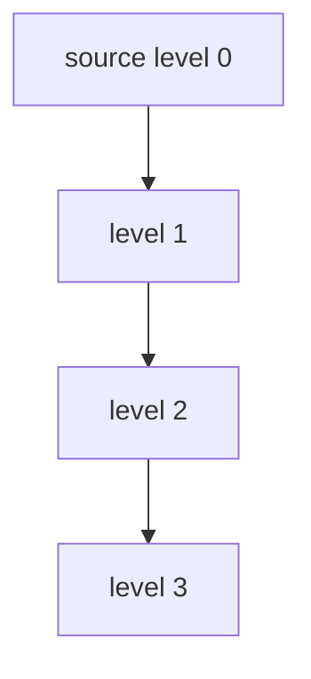

```cpp
vector<int> bfs(int n, vector<vector<int>>& g, int src) {
    vector<int> dist(n + 1, -1);
    queue<int> q;

    dist[src] = 0;
    q.push(src);

    while (!q.empty()) {
        int u = q.front();
        q.pop();

        for (int v : g[u]) {
            if (dist[v] == -1) {
                dist[v] = dist[u] + 1;
                q.push(v);
            }
        }
    }

    return dist;
}
```

---

## B8. Grid as Implicit Graph

```text
node = cell (r, c)
edge = move up/down/left/right
```

```cpp
int gridShortestPath(vector<string>& grid, pair<int,int> start, pair<int,int> target) {
    int n = grid.size(), m = grid[0].size();
    vector<vector<int>> dist(n, vector<int>(m, -1));
    queue<pair<int,int>> q;

    int dr[4] = {1, -1, 0, 0};
    int dc[4] = {0, 0, 1, -1};

    auto valid = [&](int r, int c) {
        return r >= 0 && r < n && c >= 0 && c < m && grid[r][c] != '#';
    };

    dist[start.first][start.second] = 0;
    q.push(start);

    while (!q.empty()) {
        auto [r, c] = q.front();
        q.pop();

        for (int k = 0; k < 4; k++) {
            int nr = r + dr[k], nc = c + dc[k];

            if (valid(nr, nc) && dist[nr][nc] == -1) {
                dist[nr][nc] = dist[r][c] + 1;
                q.push({nr, nc});
            }
        }
    }

    return dist[target.first][target.second];
}
```

---

## B9. Multi-Source BFS

Put all sources in queue with distance `0`.

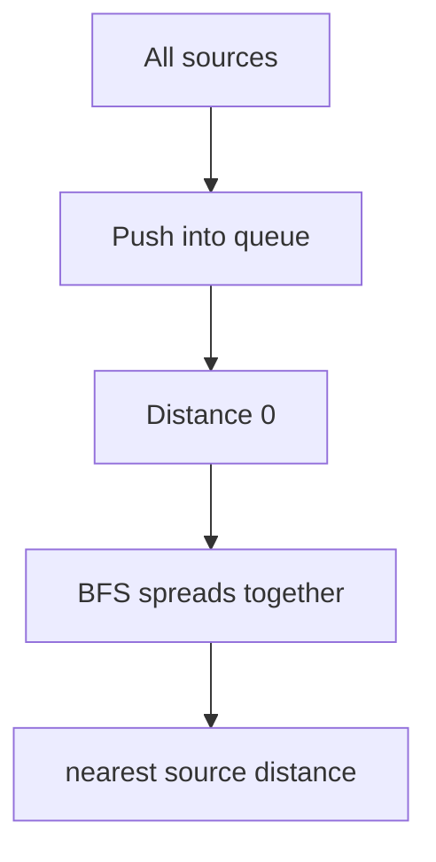

```cpp
vector<int> multiSourceBFS(int n, vector<vector<int>>& g, vector<int> sources) {
    vector<int> dist(n + 1, -1);
    queue<int> q;

    for (int s : sources) {
        dist[s] = 0;
        q.push(s);
    }

    while (!q.empty()) {
        int u = q.front();
        q.pop();

        for (int v : g[u]) {
            if (dist[v] == -1) {
                dist[v] = dist[u] + 1;
                q.push(v);
            }
        }
    }

    return dist;
}
```

### 1-minute mental trick

> Multi-source BFS is like adding a fake super source.

---

## B10. Topological Ordering

Works only for DAG.

```text
For every edge u -> v, u appears before v.
```

### DFS topological sort

```cpp
vector<int> topoDFS(int n, vector<vector<int>>& g) {
    vector<int> vis(n + 1, 0), topo;

    function<void(int)> dfs = [&](int u) {
        vis[u] = 1;

        for (int v : g[u]) {
            if (!vis[v]) dfs(v);
        }

        topo.push_back(u);
    };

    for (int i = 1; i <= n; i++) {
        if (!vis[i]) dfs(i);
    }

    reverse(topo.begin(), topo.end());
    return topo;
}
```

### Kahn algorithm

```cpp
vector<int> topoKahn(int n, vector<vector<int>>& g) {
    vector<int> indeg(n + 1, 0);

    for (int u = 1; u <= n; u++) {
        for (int v : g[u]) indeg[v]++;
    }

    queue<int> q;
    for (int i = 1; i <= n; i++) {
        if (indeg[i] == 0) q.push(i);
    }

    vector<int> topo;

    while (!q.empty()) {
        int u = q.front();
        q.pop();

        topo.push_back(u);

        for (int v : g[u]) {
            indeg[v]--;
            if (indeg[v] == 0) q.push(v);
        }
    }

    return topo;
}
```

### 1-minute mental trick

> Indegree zero means no dependency is blocking it.

---

## B11. Shortest Path Algorithms

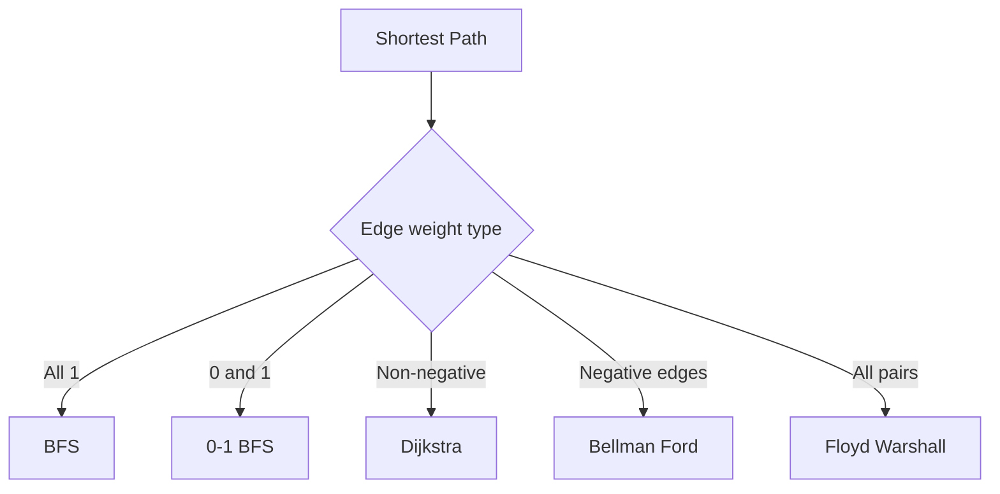

### 0-1 BFS

```cpp
vector<int> zeroOneBFS(int n, vector<vector<pair<int,int>>>& g, int src) {
    const int INF = 1e9;
    vector<int> dist(n + 1, INF);
    deque<int> dq;

    dist[src] = 0;
    dq.push_front(src);

    while (!dq.empty()) {
        int u = dq.front();
        dq.pop_front();

        for (auto [v, w] : g[u]) {
            if (dist[v] > dist[u] + w) {
                dist[v] = dist[u] + w;
                if (w == 0) dq.push_front(v);
                else dq.push_back(v);
            }
        }
    }

    return dist;
}
```

### Dijkstra

```cpp
vector<long long> dijkstra(int n, vector<vector<pair<int,int>>>& g, int src) {
    const long long INF = 4e18;
    vector<long long> dist(n + 1, INF);

    priority_queue<pair<long long,int>, vector<pair<long long,int>>, greater<pair<long long,int>>> pq;

    dist[src] = 0;
    pq.push({0, src});

    while (!pq.empty()) {
        auto [du, u] = pq.top();
        pq.pop();

        if (du != dist[u]) continue;

        for (auto [v, w] : g[u]) {
            if (dist[v] > dist[u] + w) {
                dist[v] = dist[u] + w;
                pq.push({dist[v], v});
            }
        }
    }

    return dist;
}
```

### Bellman-Ford

```cpp
struct Edge {
    int u, v;
    long long w;
};

vector<long long> bellmanFord(int n, vector<Edge>& edges, int src) {
    const long long INF = 4e18;
    vector<long long> dist(n + 1, INF);
    dist[src] = 0;

    for (int it = 1; it <= n - 1; it++) {
        for (auto e : edges) {
            if (dist[e.u] == INF) continue;
            dist[e.v] = min(dist[e.v], dist[e.u] + e.w);
        }
    }

    return dist;
}
```

### Floyd-Warshall

```cpp
void floydWarshall(vector<vector<long long>>& dist, int n) {
    const long long INF = 4e18;

    for (int k = 1; k <= n; k++) {
        for (int i = 1; i <= n; i++) {
            for (int j = 1; j <= n; j++) {
                if (dist[i][k] == INF || dist[k][j] == INF) continue;
                dist[i][j] = min(dist[i][j], dist[i][k] + dist[k][j]);
            }
        }
    }
}
```

### 1-minute mental trick

> Queue, deque, priority queue, edge list, matrix: choose data structure by weight type.

---

## B12. DSU / Union Find

```cpp
struct DSU {
    vector<int> parent, size;

    DSU(int n) {
        parent.resize(n + 1);
        size.assign(n + 1, 1);
        for (int i = 1; i <= n; i++) parent[i] = i;
    }

    int find(int x) {
        if (parent[x] == x) return x;
        return parent[x] = find(parent[x]);
    }

    bool unite(int a, int b) {
        a = find(a);
        b = find(b);

        if (a == b) return false;

        if (size[a] < size[b]) swap(a, b);
        parent[b] = a;
        size[a] += size[b];

        return true;
    }
};
```

---

## B13. MST with Kruskal

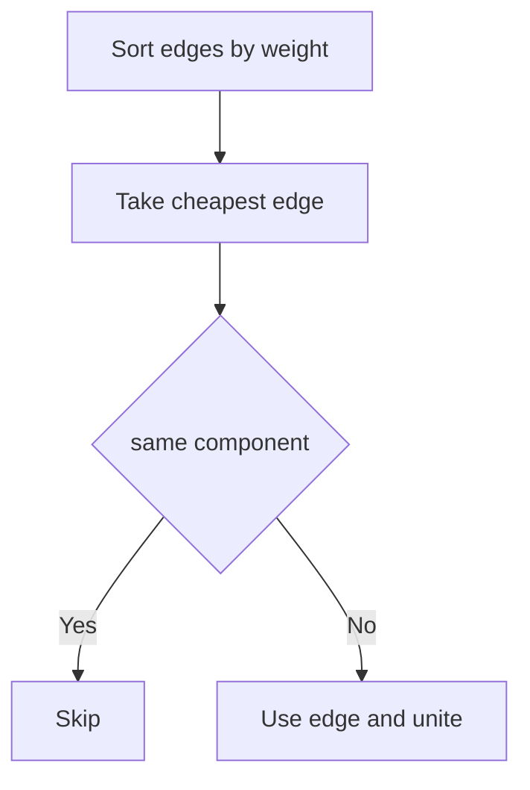

```cpp
struct MstEdge {
    int u, v;
    long long w;
};

long long kruskal(int n, vector<MstEdge>& edges) {
    sort(edges.begin(), edges.end(), [](MstEdge& a, MstEdge& b) {
        return a.w < b.w;
    });

    DSU dsu(n);
    long long cost = 0;
    int used = 0;

    for (auto e : edges) {
        if (dsu.unite(e.u, e.v)) {
            cost += e.w;
            used++;
        }
    }

    return used == n - 1 ? cost : -1;
}
```

### 1-minute mental trick

> MST connects all nodes with minimum wiring cost.

---

## B14. Flow and Matching

From notes:

```text
max flow models source to sink capacity problems
min cut = max flow
bipartite matching can be converted to max flow
```

For bipartite graph:

```text
maximum matching = minimum vertex cover
maximum independent set = total nodes - minimum vertex cover
```

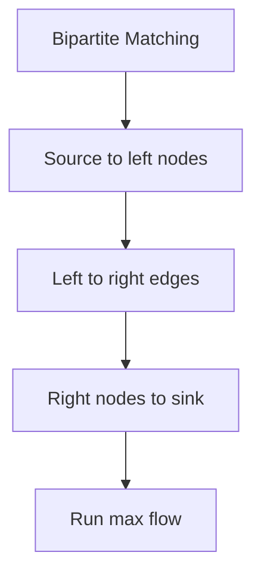

### 1-minute mental trick

> Assignment-like bipartite problem often becomes matching or max flow.

---

# Part C. Trees

## C1. Tree Basics

A tree has:

```text
n nodes
n - 1 edges
connected
no cycle
unique path between every pair
```

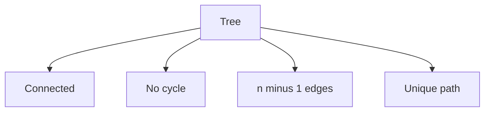

Rooted tree vocabulary:

```text
root
parent
child
depth
subtree
leaf
```

### 1-minute mental trick

> If the question says subtree, parent, depth, or ancestor, root the tree first.

---

## C2. DFS Values in Rooted Tree

Find for every node:

```text
leaf
subtree size
depth
parent
number of children
```

```cpp
int n;
vector<vector<int>> tree;
vector<int> parentNode, depthNode, subtreeSize, childCount, isLeaf;

void dfsTree(int u, int p) {
    parentNode[u] = p;
    subtreeSize[u] = 1;
    childCount[u] = 0;

    for (int v : tree[u]) {
        if (v == p) continue;

        depthNode[v] = depthNode[u] + 1;
        childCount[u]++;

        dfsTree(v, u);
        subtreeSize[u] += subtreeSize[v];
    }

    isLeaf[u] = (childCount[u] == 0);
}
```

### Java helper

```java
static ArrayList<Integer>[] tree;
static int[] parent, depth, sub, childCount;
static boolean[] leaf;

static void dfsTree(int u, int p) {
    parent[u] = p;
    sub[u] = 1;

    for (int v : tree[u]) {
        if (v == p) continue;

        depth[v] = depth[u] + 1;
        childCount[u]++;

        dfsTree(v, u);
        sub[u] += sub[v];
    }

    leaf[u] = childCount[u] == 0;
}
```

### 1-minute mental trick

> Tree DFS sends information from children back to parent.

---

## C3. Print Path Between Two Nodes

Since tree has unique path, DFS can find the path.

```cpp
bool findPath(int u, int p, int target, vector<int>& path) {
    path.push_back(u);

    if (u == target) return true;

    for (int v : tree[u]) {
        if (v == p) continue;
        if (findPath(v, u, target, path)) return true;
    }

    path.pop_back();
    return false;
}
```

---

## C4. Diameter of Tree

Diameter is the longest shortest path in a tree.

Algorithm:
1. Pick any node.
2. Find farthest node `a`.
3. From `a`, find farthest node `b`.
4. Distance `a-b` is diameter.

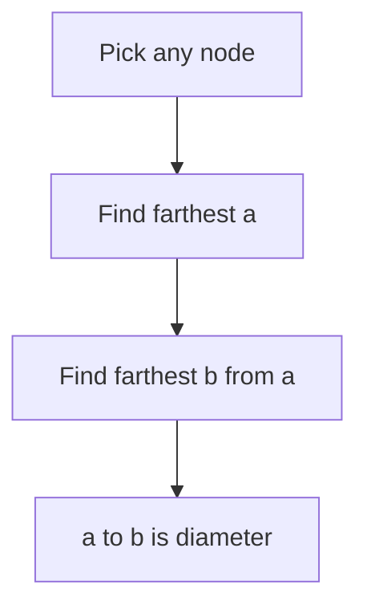

```cpp
pair<int,int> farthest(int src, int n) {
    vector<int> dist(n + 1, -1);
    queue<int> q;

    dist[src] = 0;
    q.push(src);

    while (!q.empty()) {
        int u = q.front();
        q.pop();

        for (int v : tree[u]) {
            if (dist[v] == -1) {
                dist[v] = dist[u] + 1;
                q.push(v);
            }
        }
    }

    int best = src;
    for (int i = 1; i <= n; i++) {
        if (dist[i] > dist[best]) best = i;
    }

    return {best, dist[best]};
}

int diameterLength(int n) {
    auto [a, d1] = farthest(1, n);
    auto [b, d2] = farthest(a, n);
    return d2;
}
```

### 1-minute mental trick

> Diameter = farthest from farthest.

---

## C5. Minimum Traversal Cost Trick

If you need to traverse all edges in a tree and do not need to return to start:

```text
normal DFS traversal cost = 2 * E
best saved path = diameter
answer = 2 * E - diameter
```

For a tree:

```text
E = n - 1
answer = 2 * (n - 1) - diameter
```

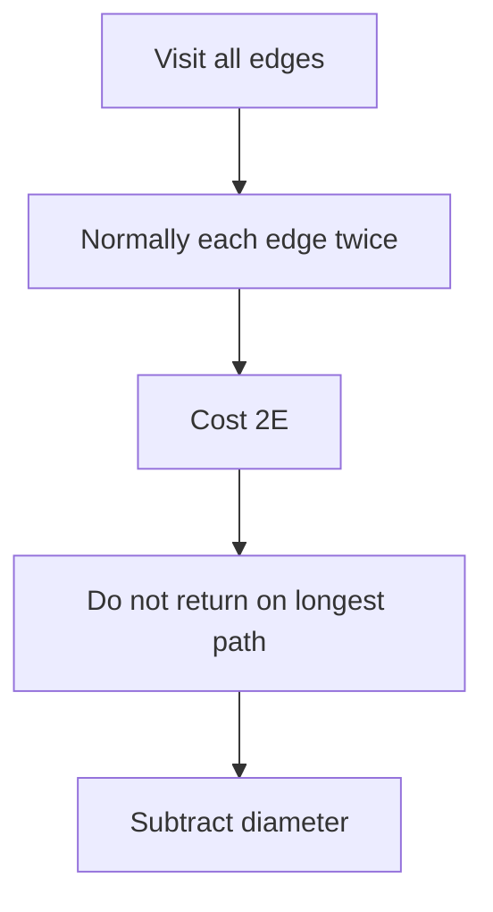

---

## C6. Center of Tree

Center is the middle of the diameter.

Properties:
- center can be one node or two nodes
- every diameter passes through center
- center does not depend on which diameter you choose

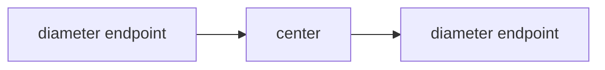

```cpp
vector<int> centerFromDiameterPath(vector<int>& path) {
    int len = path.size();

    if (len % 2 == 1) {
        return {path[len / 2]};
    }

    return {path[len / 2 - 1], path[len / 2]};
}
```

### Counting number of diameters

If one center:

```text
count nodes at distance diameter/2 in each branch
answer = pair products across different branches
```

If two centers:

```text
answer = count from left center side * count from right center side
```

### 1-minute mental trick

> Center is the middle of every longest path.

---

## C7. Centroid of Tree

Centroid is a node such that after removing it, every remaining component has size at most `n/2`.

```mermaid
flowchart TD
    A[Candidate node] --> B[Check child subtree sizes]
    B --> C[Check parent side]
    C --> D{all parts <= n/2}
    D -->|Yes| E[Centroid]
    D -->|No| F[Move to heavy child]
```

```cpp
int findCentroid(int u, int p, int n) {
    for (int v : tree[u]) {
        if (v == p) continue;

        if (subtreeSize[v] > n / 2) {
            return findCentroid(v, u, n);
        }
    }

    return u;
}
```

### Full check

```cpp
bool isCentroid(int u, int n) {
    int biggest = n - subtreeSize[u];

    for (int v : tree[u]) {
        if (parentNode[v] == u) {
            biggest = max(biggest, subtreeSize[v]);
        }
    }

    return biggest <= n / 2;
}
```

### 1-minute mental trick

> Centroid is the balance point: no piece bigger than half.

---

## C8. Sum of All Pair Distances

For each edge, count how many pairs use it.

If removing an edge gives component sizes `s` and `n-s`:

```text
contribution = s * (n - s)
```

Weighted edge:

```text
contribution = weight * s * (n - s)
```

```mermaid
flowchart LR
    A[size s] --- B[edge]
    B --- C[size n minus s]
    D[contribution] --> E[s times n minus s]
```

```cpp
long long sumPairDistances(int n) {
    long long ans = 0;

    function<void(int,int)> dfs = [&](int u, int p) {
        subtreeSize[u] = 1;

        for (int v : tree[u]) {
            if (v == p) continue;

            dfs(v, u);
            long long s = subtreeSize[v];
            ans += s * (n - s);
            subtreeSize[u] += subtreeSize[v];
        }
    };

    dfs(1, 0);
    return ans;
}
```

### 1-minute mental trick

> Count edge contribution, not pair by pair.

---

## C9. Ancestor Value Query

Problem style:

```text
For each node x, compare val[x] with ancestor values.
```

During DFS, maintain data structure of current root-to-node path.

```mermaid
flowchart TD
    A[DFS node] --> B[Current path has ancestors]
    B --> C[Query data structure]
    C --> D[Insert node value]
    D --> E[DFS children]
    E --> F[Remove node value]
```

```cpp
multiset<int> pathValues;
vector<int> val, closestAns;

void dfsAncestorValue(int u, int p) {
    int best = INT_MAX;

    auto it = pathValues.lower_bound(val[u]);

    if (it != pathValues.end()) best = min(best, abs(val[u] - *it));
    if (it != pathValues.begin()) {
        --it;
        best = min(best, abs(val[u] - *it));
    }

    closestAns[u] = best;

    pathValues.insert(val[u]);

    for (int v : tree[u]) {
        if (v != p) dfsAncestorValue(v, u);
    }

    pathValues.erase(pathValues.find(val[u]));
}
```

---

## C10. Binary Lifting

Binary lifting preprocesses jumps of powers of two.

```text
up[node][i] = 2^i-th ancestor of node
up[node][i] = up[ up[node][i-1] ][i-1]
```

```mermaid
flowchart LR
    A[node] --> B[1 step]
    B --> C[2 steps]
    C --> D[4 steps]
    D --> E[8 steps]
```

### K-th ancestor

```cpp
int kthAncestor(int node, int k, vector<vector<int>>& up) {
    int LOG = up[0].size();

    for (int i = LOG - 1; i >= 0; i--) {
        if ((k >> i) & 1) {
            node = up[node][i];
            if (node == -1) break;
        }
    }

    return node;
}
```

### 1-minute mental trick

> Any k jump is a sum of powers of two.

---

## C11. LCA with Binary Lifting

LCA = Lowest Common Ancestor.

Steps:
1. Bring deeper node up to same depth.
2. Jump both upward while ancestors differ.
3. Parent is LCA.

```mermaid
flowchart TD
    A[u and v] --> B[Make depths equal]
    B --> C{u equals v}
    C -->|Yes| D[LCA found]
    C -->|No| E[Jump both from high powers]
    E --> F[parent is LCA]
```

```cpp
const int LOG = 20;
vector<vector<int>> up;
vector<int> depth;

void dfsLCA(int u, int p) {
    up[u][0] = p;

    for (int i = 1; i < LOG; i++) {
        if (up[u][i - 1] == -1) up[u][i] = -1;
        else up[u][i] = up[up[u][i - 1]][i - 1];
    }

    for (int v : tree[u]) {
        if (v == p) continue;
        depth[v] = depth[u] + 1;
        dfsLCA(v, u);
    }
}

int lca(int u, int v) {
    if (depth[u] < depth[v]) swap(u, v);

    int diff = depth[u] - depth[v];

    for (int i = LOG - 1; i >= 0; i--) {
        if ((diff >> i) & 1) u = up[u][i];
    }

    if (u == v) return u;

    for (int i = LOG - 1; i >= 0; i--) {
        if (up[u][i] != up[v][i]) {
            u = up[u][i];
            v = up[v][i];
        }
    }

    return up[u][0];
}
```

### Distance between nodes

```text
dist(u, v) = depth[u] + depth[v] - 2 * depth[lca(u, v)]
```

```cpp
int distanceTree(int u, int v) {
    int w = lca(u, v);
    return depth[u] + depth[v] - 2 * depth[w];
}
```

### Java LCA helper

```java
static final int LOG = 20;
static int[][] up;
static int[] depth;

static int lca(int u, int v) {
    if (depth[u] < depth[v]) {
        int t = u; u = v; v = t;
    }

    int diff = depth[u] - depth[v];

    for (int i = LOG - 1; i >= 0; i--) {
        if (((diff >> i) & 1) == 1) {
            u = up[u][i];
        }
    }

    if (u == v) return u;

    for (int i = LOG - 1; i >= 0; i--) {
        if (up[u][i] != up[v][i]) {
            u = up[u][i];
            v = up[v][i];
        }
    }

    return up[u][0];
}
```

### 1-minute mental trick

> LCA = same level first, then jump together.

---

## C12. Binary Lifting for Next Pointer

Problem:

```text
Given next[x], answer kth node after x.
```

```text
jump[x][0] = next[x]
jump[x][i] = jump[jump[x][i-1]][i-1]
```

```cpp
const int LOG2 = 20;
vector<vector<int>> jump;

void buildJump(int n, vector<int>& nxt) {
    jump.assign(n + 1, vector<int>(LOG2));

    for (int x = 1; x <= n; x++) jump[x][0] = nxt[x];

    for (int j = 1; j < LOG2; j++) {
        for (int x = 1; x <= n; x++) {
            jump[x][j] = jump[jump[x][j - 1]][j - 1];
        }
    }
}

int kthNext(int x, int k) {
    for (int j = LOG2 - 1; j >= 0; j--) {
        if ((k >> j) & 1) x = jump[x][j];
    }
    return x;
}
```

---

# Final Quick Notes

```text
Bits:
- Work bit by bit.
- Contribution = count useful pairs at bit * 2^bit.
- MSB to LSB for max bitwise value.
- Prefix bit counts for range queries.

Graphs:
- DFS: reachability, components, cycles.
- BFS: unweighted shortest path.
- Multi-source BFS: nearest source.
- 0-1 BFS: weights 0/1.
- Dijkstra: non-negative weights.
- Bellman-Ford: negative edges.
- Floyd: all pairs.
- Topological sort: DAG dependencies.
- DSU: components and MST.

Trees:
- Root first.
- DFS gives parent, depth, subtree.
- Diameter = farthest from farthest.
- Center = middle of diameter.
- Centroid = balanced node.
- LCA = same depth, jump together.
```

---

END
