# Master C++ CP + FAANG Pattern Guide

> Goal: recognize patterns in seconds, choose the right framework, write a C++ template fast, and train from newbie → LeetCode Guardian / strong FAANG interviewer → Codeforces Candidate Master.

This guide merges the uploaded topic notes into one ordered roadmap: **Concepts → Frameworks → Forms → Tactics → Templates → Practice Problems**.

---

## Clickable Index

1. [How to Use This Guide](#1-how-to-use-this-guide)
2. [Global Pattern Recognition Map](#2-global-pattern-recognition-map)
3. [Level Roadmap: Newbie to Candidate Master / LC Guardian](#3-level-roadmap-newbie-to-candidate-master--lc-guardian)
4. [Core C++ Template](#4-core-c-template)
5. [Topic 01: STL + Complexity + Implementation](#topic-01-stl--complexity--implementation)
6. [Topic 02: Prefix Sum + Difference Array](#topic-02-prefix-sum--difference-array)
7. [Topic 03: Binary Search](#topic-03-binary-search)
8. [Topic 04: Two Pointers + Sliding Window](#topic-04-two-pointers--sliding-window)
9. [Topic 05: Stack, Monotonic Stack, Queue, Deque, Heap](#topic-05-stack-monotonic-stack-queue-deque-heap)
10. [Topic 06: Bit Manipulation + XOR + Bitmask](#topic-06-bit-manipulation--xor--bitmask)
11. [Topic 07: Recursion + Backtracking](#topic-07-recursion--backtracking)
12. [Topic 08: Graphs](#topic-08-graphs)
13. [Topic 09: Trees + LCA + Binary Lifting + DSU](#topic-09-trees--lca--binary-lifting--dsu)
14. [Topic 10: Dynamic Programming](#topic-10-dynamic-programming)
15. [Topic 11: Greedy + Sorting + Intervals](#topic-11-greedy--sorting--intervals)
16. [Topic 12: Range Queries: Fenwick + Segment Tree + Sparse Table](#topic-12-range-queries-fenwick--segment-tree--sparse-table)
17. [Topic 13: Math, Modular Arithmetic, Number Theory, Combinatorics](#topic-13-math-modular-arithmetic-number-theory-combinatorics)
18. [Master Practice Matrix by Topic and Difficulty](#18-master-practice-matrix-by-topic-and-difficulty)
19. [FAANG Pattern Practice List](#19-faang-pattern-practice-list)
20. [Candidate Master CP Practice List](#20-candidate-master-cp-practice-list)
21. [Final Recognition Cheat Sheet](#21-final-recognition-cheat-sheet)

---

## 1. How to Use This Guide

For each topic:

1. Read **concept**.
2. Memorize **framework**.
3. Learn **forms**.
4. Apply **tactics**.
5. Code the **template** from memory.
6. Solve Easy → Medium → Hard.
7. For every solved problem, write:
   - pattern clue
   - invariant
   - why brute force fails
   - final complexity

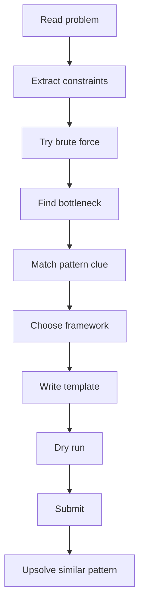

---

## 2. Global Pattern Recognition Map

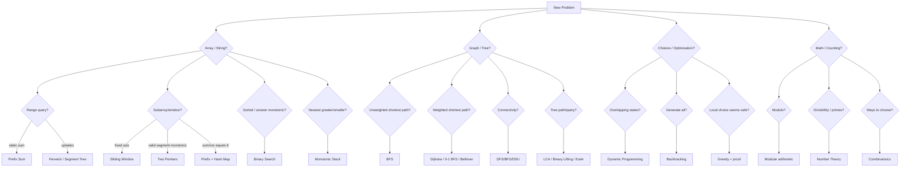

---

## 3. Level Roadmap: Newbie to Candidate Master / LC Guardian

| Level | Target | What to master | Typical difficulty |
|---|---|---|---|
| Newbie | write correct C++ fast | STL, loops, sorting, maps, prefix | CF 800-1000 / LC Easy |
| Beginner | pattern recognition | two pointers, binary search, stack, BFS/DFS | CF 1000-1300 / LC Easy-Medium |
| Intermediate | reusable frameworks | DP basics, Dijkstra, DSU, segment tree, math mod | CF 1300-1600 / LC Medium |
| Advanced | contest speed | tree DP, digit DP, bitmask DP, combinatorics, greedy proof | CF 1600-1900 / LC Medium-Hard |
| Candidate Master push | solve under pressure | advanced graph, DP optimization, constructive, number theory | CF 1900-2200+ / LC Hard |

---

## 4. Core C++ Template

```cpp
#include <bits/stdc++.h>
using namespace std;

using ll = long long;
using pii = pair<int,int>;
using pll = pair<long long,long long>;

const ll INF = 4e18;
const int MOD = 1e9 + 7;

#define all(x) (x).begin(), (x).end()

void solve() {
    // read input
}

int main() {
    ios::sync_with_stdio(false);
    cin.tie(nullptr);

    int T = 1;
    // cin >> T;
    while (T--) solve();
    return 0;
}
```

---

# Topic 01: STL + Complexity + Implementation

## Concepts

| Concept | Meaning | Recognition clue |
|---|---|---|
| Complexity first | choose algorithm by constraints | `n <= 2e5` means O(n log n) or O(n) |
| STL containers | store data according to operations | need sorted? use set/map; need frequency? map/unordered_map |
| Iterators | access STL elements | erase carefully from set/multiset |
| Custom sort | encode greedy/order rule | intervals, pairs, sorting by end/time/value |

## Framework

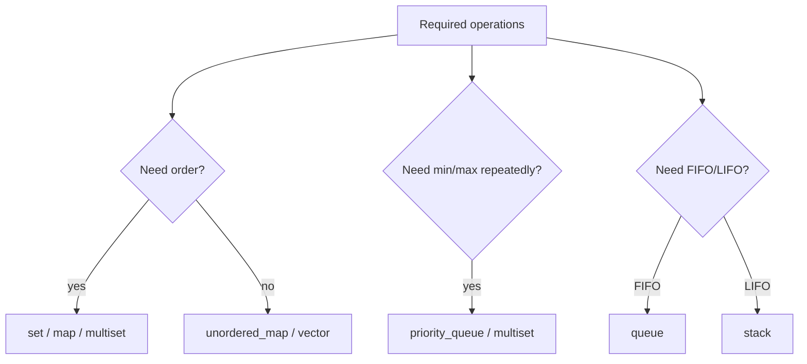

## Forms + Tactics

| Form | Use | Tactic | Template idea |
|---|---|---|---|
| Frequency counting | duplicates, anagrams, modes | `unordered_map<T,int>` | increment/decrement |
| Sorted unique | dynamic order | `set` | lower_bound |
| Sorted duplicates | erase one copy | `multiset` | `ms.erase(ms.find(x))` |
| Top K | repeated best | heap or two multisets | lazy deletion if needed |
| Intervals | overlap/merge/sweep | sort by start or end | scan once |

## C++ Template: Safe Multiset Erase

```cpp
void eraseOne(multiset<int>& ms, int x) {
    auto it = ms.find(x);
    if (it != ms.end()) ms.erase(it);
}
```

---

# Topic 02: Prefix Sum + Difference Array

## Concepts

| Concept | Meaning | Pattern clue |
|---|---|---|
| Prefix sum | precompute cumulative sums | repeated static range sum |
| Difference array | delayed range updates | many range add operations, final array needed |
| Prefix + hash map | count subarrays | subarray sum equals K / modulo K |
| 2D prefix | rectangle query | grid sum queries |

## Framework

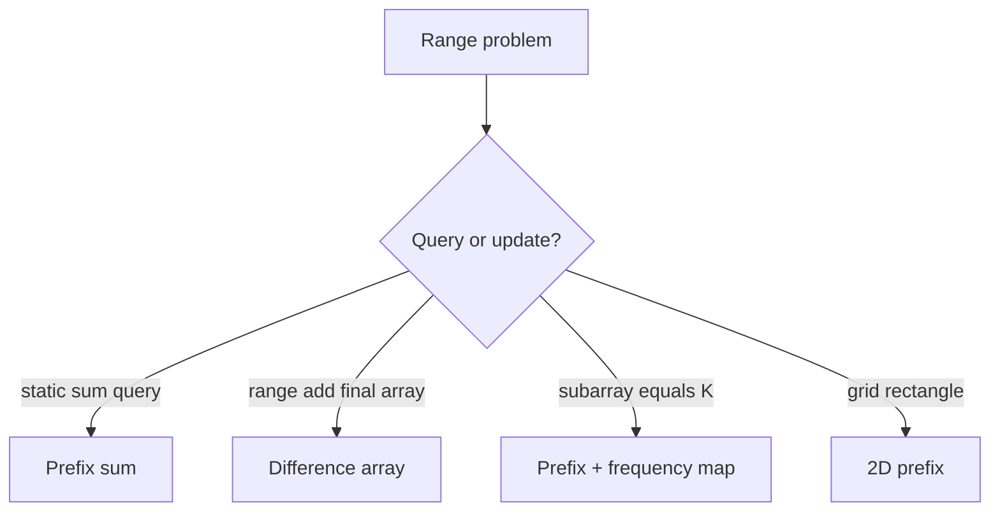

## Forms + Intuition

| Form | Formula / invariant | Intuition |
|---|---|---|
| Range sum `[l,r]` | `pref[r+1]-pref[l]` | subtract part before `l` |
| Subarray sum K | need previous `pref = cur-K` | every previous prefix creates one subarray |
| Divisible by K | same remainder | difference of same remainder divisible by K |
| Range add `[l,r]+=x` | `diff[l]+=x, diff[r+1]-=x` | start effect at `l`, cancel after `r` |
| 2D rectangle | inclusion-exclusion | big rectangle - extra strips + double removed corner |

## C++ Template: Prefix + Hash Count

```cpp
long long countSubarraySumK(vector<int>& a, long long K) {
    unordered_map<long long,long long> freq;
    freq[0] = 1;
    long long pref = 0, ans = 0;

    for (int x : a) {
        pref += x;
        ans += freq[pref - K];
        freq[pref]++;
    }
    return ans;
}
```

## Practice

| Difficulty | Problem | Link | Pattern | Intuition |
|---|---|---|---|---|
| Easy | Range Sum Query Immutable | https://leetcode.com/problems/range-sum-query-immutable/ | 1D prefix | Build once, answer many queries |
| Easy | Running Sum of 1d Array | https://leetcode.com/problems/running-sum-of-1d-array/ | prefix build | each element accumulates previous |
| Medium | Subarray Sum Equals K | https://leetcode.com/problems/subarray-sum-equals-k/ | prefix + hash | current prefix needs old `cur-k` |
| Medium | Continuous Subarray Sum | https://leetcode.com/problems/continuous-subarray-sum/ | prefix modulo | same modulo means divisible segment |
| Medium | Product of Array Except Self | https://leetcode.com/problems/product-of-array-except-self/ | prefix/suffix contribution | left product × right product |
| Hard | Count of Range Sum | https://leetcode.com/problems/count-of-range-sum/ | prefix + merge sort/tree | count previous prefixes in range |
| CP | CSES Static Range Sum Queries | https://cses.fi/problemset/task/1646 | prefix | static sum queries |
| CP | CSES Forest Queries | https://cses.fi/problemset/task/1652 | 2D prefix | rectangle tree count |

---

# Topic 03: Binary Search

## Concepts

| Concept | Meaning | Pattern clue |
|---|---|---|
| Classic binary search | find value in sorted domain | sorted array |
| First true | `false false true true` | minimum feasible answer |
| Last true | `true true false false` | maximum feasible answer |
| Binary search on answer | guess answer + check feasibility | minimize max / maximize min |
| Real binary search | continuous answer | precision / geometry / average |

## Framework

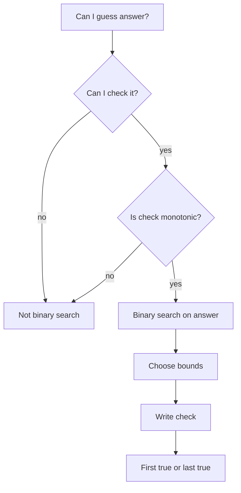

## Forms + Intuition

| Form | Template | Intuition |
|---|---|---|
| First true | minimize feasible | once possible, bigger may also be possible |
| Last true | maximize feasible | once impossible, bigger may remain impossible |
| Lower bound | first `>= x` | boundary between `<x` and `>=x` |
| Minimize maximum | `check(maxAllowed)` | lower max gives harder condition |
| Maximize minimum | `check(minGap)` | larger gap gives harder condition |

## C++ Template: First True

```cpp
long long firstTrue(long long lo, long long hi, function<bool(long long)> check) {
    long long ans = hi + 1;
    while (lo <= hi) {
        long long mid = lo + (hi - lo) / 2;
        if (check(mid)) ans = mid, hi = mid - 1;
        else lo = mid + 1;
    }
    return ans;
}
```

## Practice

| Difficulty | Problem | Link | Pattern | Intuition |
|---|---|---|---|---|
| Easy | Binary Search | https://leetcode.com/problems/binary-search/ | classic | discard half |
| Easy | Search Insert Position | https://leetcode.com/problems/search-insert-position/ | lower bound | first position `>= target` |
| Medium | Koko Eating Bananas | https://leetcode.com/problems/koko-eating-bananas/ | minimize speed | speed feasible is monotonic |
| Medium | Capacity To Ship Packages | https://leetcode.com/problems/capacity-to-ship-packages-within-d-days/ | minimize capacity | bigger capacity never worse |
| Medium | Find Minimum in Rotated Sorted Array | https://leetcode.com/problems/find-minimum-in-rotated-sorted-array/ | rotated boundary | compare mid with right |
| Hard | Median of Two Sorted Arrays | https://leetcode.com/problems/median-of-two-sorted-arrays/ | binary partition | partition left/right halves |
| CP | CSES Factory Machines | https://cses.fi/problemset/task/1620 | first true answer | minimum time to make T products |
| CP | CSES Subarray Sum II | https://cses.fi/problemset/task/1661 | prefix / sorted count | count target sums |

---

# Topic 04: Two Pointers + Sliding Window

## Concepts

| Concept | Meaning | Pattern clue |
|---|---|---|
| Opposite ends | left/right shrink from ends | sorted pair, palindrome, container |
| Same direction | `r` expands, `l` shrinks | longest/shortest valid subarray |
| Fixed window | exact length K | maximum sum of K elements |
| Variable window | maintain invariant | at most K, sum ≤ S, unique chars |
| Exact K via at most | `exact(K)=atMost(K)-atMost(K-1)` | exactly K distinct/odds |

## Framework

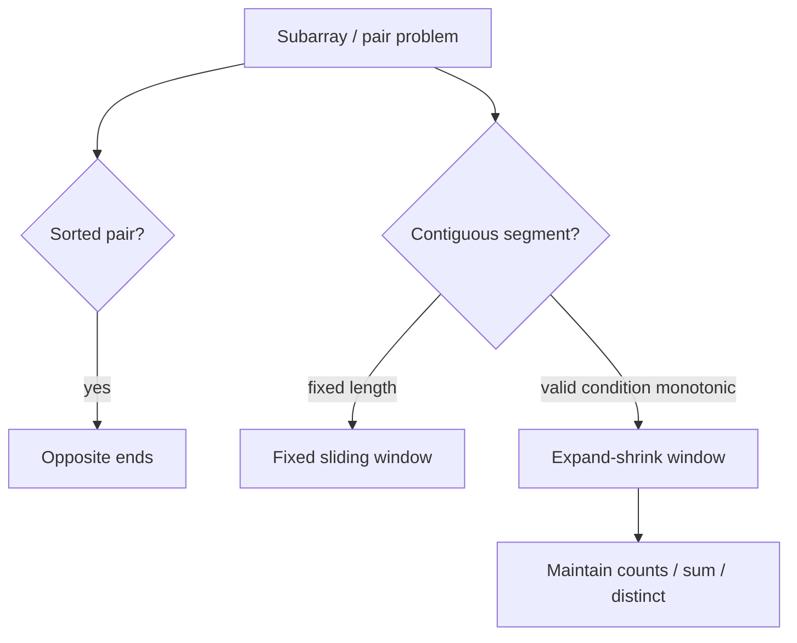

## Forms + Intuition

| Form | Movement rule | Intuition |
|---|---|---|
| Two sum sorted | sum too big → `r--`, small → `l++` | discard impossible side |
| Longest at most K | expand right; while invalid shrink left | every pointer moves at most n |
| Minimum window | shrink while still valid | keep smallest valid segment |
| Count subarrays at most K | add `r-l+1` | every suffix ending at `r` is valid |
| 3Sum | sort, fix i, two pointers | reduce 3D search to 2D |

## C++ Template: Variable Window

```cpp
int longestAtMostKDistinct(string s, int K) {
    unordered_map<char,int> cnt;
    int l = 0, ans = 0;
    for (int r = 0; r < (int)s.size(); r++) {
        cnt[s[r]]++;
        while ((int)cnt.size() > K) {
            if (--cnt[s[l]] == 0) cnt.erase(s[l]);
            l++;
        }
        ans = max(ans, r - l + 1);
    }
    return ans;
}
```

## Practice

| Difficulty | Problem | Link | Pattern | Intuition |
|---|---|---|---|---|
| Easy | Valid Palindrome | https://leetcode.com/problems/valid-palindrome/ | opposite ends | skip non-alnum and compare |
| Easy | Merge Sorted Array | https://leetcode.com/problems/merge-sorted-array/ | two pointers from end | avoid overwriting |
| Medium | 3Sum | https://leetcode.com/problems/3sum/ | fix + two pointers | sorted duplicate control |
| Medium | Longest Substring Without Repeating Characters | https://leetcode.com/problems/longest-substring-without-repeating-characters/ | window + set/map | shrink until unique |
| Medium | Minimum Size Subarray Sum | https://leetcode.com/problems/minimum-size-subarray-sum/ | variable window | positive sum monotonic |
| Hard | Minimum Window Substring | https://leetcode.com/problems/minimum-window-substring/ | need-count window | shrink valid window |
| Hard | Sliding Window Median | https://leetcode.com/problems/sliding-window-median/ | two multisets | maintain lower/upper halves |
| CP | CSES Sum of Two Values | https://cses.fi/problemset/task/1640 | sort + two pointers/hash | find pair sum |
| CP | CSES Sum of Three Values | https://cses.fi/problemset/task/1641 | fix + two pointers | reduce dimension |

---

# Topic 05: Stack, Monotonic Stack, Queue, Deque, Heap

## Concepts

| Structure | Use | Pattern clue |
|---|---|---|
| Stack | nested / undo / previous unresolved | brackets, path simplification |
| Monotonic stack | nearest greater/smaller | next greater, stock span, histogram |
| Queue | BFS / FIFO | levels, shortest unweighted path |
| Deque | min/max sliding window, 0-1 BFS | window extrema, edge cost 0/1 |
| Heap | repeated min/max | k closest, scheduling, Dijkstra |

## Framework

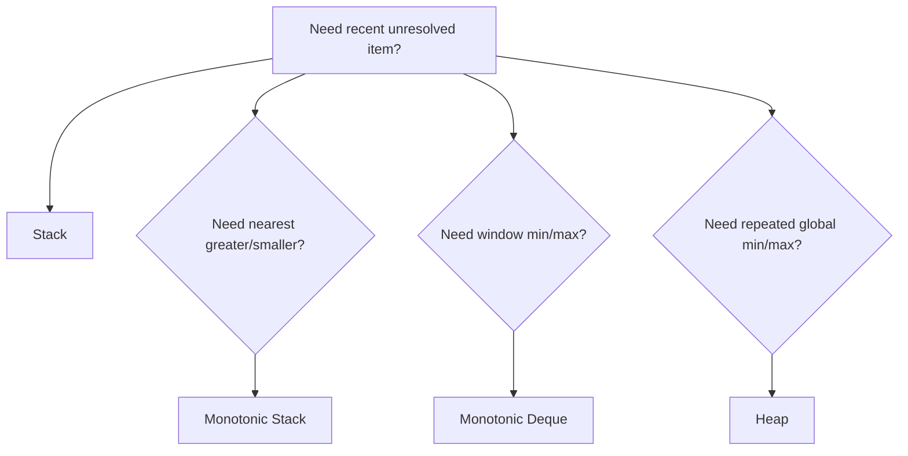

## C++ Template: Monotonic Stack Next Greater

```cpp
vector<int> nextGreater(vector<int>& a) {
    int n = a.size();
    vector<int> ans(n, -1), st;
    for (int i = 0; i < n; i++) {
        while (!st.empty() && a[st.back()] < a[i]) {
            ans[st.back()] = a[i];
            st.pop_back();
        }
        st.push_back(i);
    }
    return ans;
}
```

## Practice

| Difficulty | Problem | Link | Pattern | Intuition |
|---|---|---|---|---|
| Easy | Valid Parentheses | https://leetcode.com/problems/valid-parentheses/ | stack | close must match latest open |
| Easy | Min Stack | https://leetcode.com/problems/min-stack/ | auxiliary stack | store current minimum |
| Medium | Daily Temperatures | https://leetcode.com/problems/daily-temperatures/ | monotonic stack | resolve colder days when warmer appears |
| Medium | Online Stock Span | https://leetcode.com/problems/online-stock-span/ | monotonic stack | compress previous smaller prices |
| Medium | Top K Frequent Elements | https://leetcode.com/problems/top-k-frequent-elements/ | heap/bucket | frequency ranking |
| Hard | Largest Rectangle in Histogram | https://leetcode.com/problems/largest-rectangle-in-histogram/ | monotonic stack | bar extends until smaller sides |
| Hard | Sliding Window Maximum | https://leetcode.com/problems/sliding-window-maximum/ | monotonic deque | keep candidates decreasing |

---

# Topic 06: Bit Manipulation + XOR + Bitmask

## Concepts

| Concept | Meaning | Pattern clue |
|---|---|---|
| Bit operations | check/set/clear/toggle | per-bit constraints |
| XOR cancellation | `x^x=0` | duplicates paired |
| Prefix XOR | subarray XOR | XOR range query / XOR equals K |
| Bit contribution | count each bit independently | sum of pair XOR/AND/OR |
| High-to-low greedy | maximize bitwise answer | maximum AND/XOR/OR feasibility |
| Bitmask DP | subset state | `n <= 20`, assignment/TSP |

## Framework

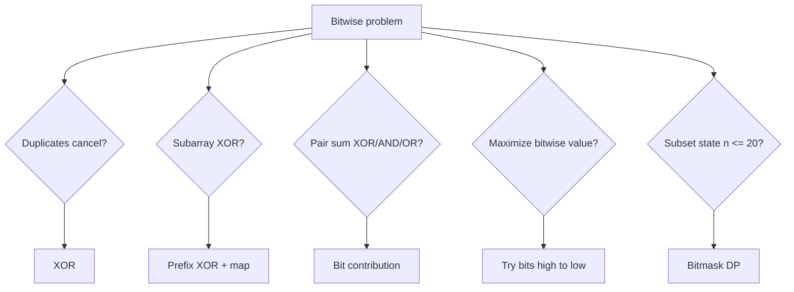

## Forms + Intuition

| Form | Formula / tactic | Intuition |
|---|---|---|
| Single number | XOR all | pairs cancel |
| Subarray XOR K | need old `px ^ K` | XOR inverse is XOR |
| Pair XOR sum | for each bit: `cnt1*cnt0*2^b` | pairs differ at that bit |
| Max XOR pair | binary trie | prefer opposite bit high to low |
| Subset enumeration | loop masks | bit i tells chosen/not chosen |

## C++ Template: Bit Helpers

```cpp
bool isSet(long long x, int i) { return (x >> i) & 1LL; }
long long setBit(long long x, int i) { return x | (1LL << i); }
long long clearBit(long long x, int i) { return x & ~(1LL << i); }
long long toggleBit(long long x, int i) { return x ^ (1LL << i); }
```

## Practice

| Difficulty | Problem | Link | Pattern | Intuition |
|---|---|---|---|---|
| Easy | Single Number | https://leetcode.com/problems/single-number/ | XOR cancel | duplicates vanish |
| Easy | Number of 1 Bits | https://leetcode.com/problems/number-of-1-bits/ | bit count | repeatedly remove lowbit |
| Medium | Subsets | https://leetcode.com/problems/subsets/ | bitmask generation | mask represents chosen elements |
| Medium | Single Number III | https://leetcode.com/problems/single-number-iii/ | split by differing bit | separate two uniques |
| Medium | Bitwise AND of Numbers Range | https://leetcode.com/problems/bitwise-and-of-numbers-range/ | common prefix | changing bits become zero |
| Hard | Maximum XOR of Two Numbers in an Array | https://leetcode.com/problems/maximum-xor-of-two-numbers-in-an-array/ | trie / greedy bits | prefer opposite high bits |
| Hard | Minimum XOR Sum of Two Arrays | https://leetcode.com/problems/minimum-xor-sum-of-two-arrays/ | bitmask DP | assign using mask |
| CP | CSES Gray Code | https://cses.fi/problemset/task/2205 | bit construction | consecutive masks differ by one bit |

---

# Topic 07: Recursion + Backtracking

## Concepts

| Concept | Meaning | Pattern clue |
|---|---|---|
| Base case | stop condition | smallest valid state |
| Recursion state | what one call means | index, remaining target, board cell |
| Choice | what you can try | include/exclude, pick char, place queen |
| Constraint/pruning | reject bad branches | used, conflict, target < 0 |
| Undo | restore state | pop, unmark, subtract |

## LCCM Framework

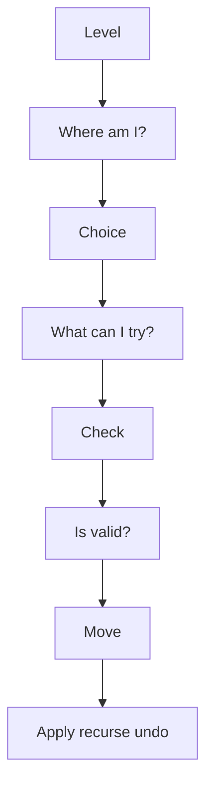

## C++ Template

```cpp
void dfs(int level) {
    if (base_case) {
        save_answer();
        return;
    }
    for (auto choice : choices) {
        if (!valid(choice)) continue;
        apply(choice);
        dfs(level + 1);
        undo(choice);
    }
}
```

## Practice

| Difficulty | Problem | Link | Pattern | Intuition |
|---|---|---|---|---|
| Easy | Generate Parentheses | https://leetcode.com/problems/generate-parentheses/ | constrained recursion | open ≤ n, close ≤ open |
| Medium | Subsets II | https://leetcode.com/problems/subsets-ii/ | sorted + skip duplicates | avoid same branch duplicate |
| Medium | Permutations | https://leetcode.com/problems/permutations/ | used array | choose unused element each level |
| Medium | Combination Sum | https://leetcode.com/problems/combination-sum/ | choose/reuse | stay at same index when reused |
| Medium | Palindrome Partitioning | https://leetcode.com/problems/palindrome-partitioning/ | cut recursion | choose next palindrome segment |
| Hard | N-Queens | https://leetcode.com/problems/n-queens/ | board constraints | columns and diagonals |
| Hard | Sudoku Solver | https://leetcode.com/problems/sudoku-solver/ | constraint search | try valid digit, backtrack |

---

# Topic 08: Graphs

## Concepts

| Concept | Meaning | Pattern clue |
|---|---|---|
| Node | state/object | city, cell, word, mask |
| Edge | transition/relation | road, move, transform |
| BFS | shortest path unweighted | minimum moves/levels |
| DFS | reachability/components | explore all connected |
| Toposort | dependency ordering | prerequisites, DAG |
| Dijkstra | weighted shortest path nonnegative | min cost path |
| 0-1 BFS | weights 0 or 1 | deque shortest path |
| Bellman-Ford | negative edges | detect negative cycles |
| Floyd-Warshall | all pairs small n | dense graph, n ≤ 500 |
| MST | connect all cheaply | minimum total connection cost |

## Graph Formulation Framework

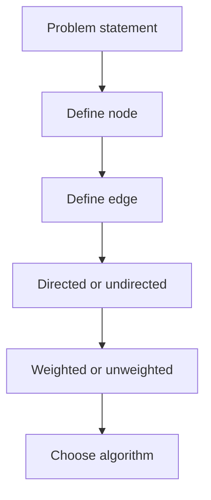

## Algorithm Selection Table

| Question | Algorithm |
|---|---|
| Can I reach X? | DFS/BFS |
| How many components? | DFS/BFS/DSU |
| Minimum moves, all edges cost 1? | BFS |
| Multiple starting sources? | Multi-source BFS |
| Edge weights 0/1? | 0-1 BFS |
| Nonnegative weighted shortest path? | Dijkstra |
| Negative edge? | Bellman-Ford |
| All-pairs shortest path, small n? | Floyd-Warshall |
| Dependency order? | Topological sort |
| Cheapest way to connect all? | MST |

## C++ Template: BFS

```cpp
vector<int> bfs(int n, vector<vector<int>>& g, int src) {
    vector<int> dist(n + 1, -1);
    queue<int> q;
    dist[src] = 0;
    q.push(src);
    while (!q.empty()) {
        int u = q.front(); q.pop();
        for (int v : g[u]) if (dist[v] == -1) {
            dist[v] = dist[u] + 1;
            q.push(v);
        }
    }
    return dist;
}
```

## Practice

| Difficulty | Problem | Link | Pattern | Intuition |
|---|---|---|---|---|
| Easy | Find if Path Exists in Graph | https://leetcode.com/problems/find-if-path-exists-in-graph/ | BFS/DFS connectivity | traverse component |
| Medium | Number of Islands | https://leetcode.com/problems/number-of-islands/ | grid DFS/BFS | each island = component |
| Medium | Course Schedule | https://leetcode.com/problems/course-schedule/ | topological sort | cycle means impossible |
| Medium | Rotting Oranges | https://leetcode.com/problems/rotting-oranges/ | multi-source BFS | all rotten sources expand together |
| Medium | Network Delay Time | https://leetcode.com/problems/network-delay-time/ | Dijkstra | shortest arrival to all nodes |
| Hard | Word Ladder | https://leetcode.com/problems/word-ladder/ | BFS state graph | each word differs by one char |
| Hard | Swim in Rising Water | https://leetcode.com/problems/swim-in-rising-water/ | Dijkstra / binary search | minimize maximum cell level |
| CP | CSES Counting Rooms | https://cses.fi/problemset/task/1192 | grid components | count connected empty regions |
| CP | CSES Message Route | https://cses.fi/problemset/task/1667 | BFS parent | shortest unweighted path |
| CP | CSES Flight Discount | https://cses.fi/problemset/task/1195 | Dijkstra state | used coupon or not |

---

# Topic 09: Trees + LCA + Binary Lifting + DSU

## Concepts

| Concept | Meaning | Pattern clue |
|---|---|---|
| Tree | connected acyclic graph | n nodes, n-1 edges |
| Rooted tree | parent/depth/subtree meaningful | subtree/path queries |
| LCA | lowest common ancestor | path between u and v |
| Binary lifting | jump upward powers of two | kth ancestor, LCA fast |
| Euler tour | flatten subtree | subtree query becomes range query |
| DSU | dynamic connectivity by adding edges | union/find components |
| Kruskal | MST using DSU | sort edges by weight |

## Framework

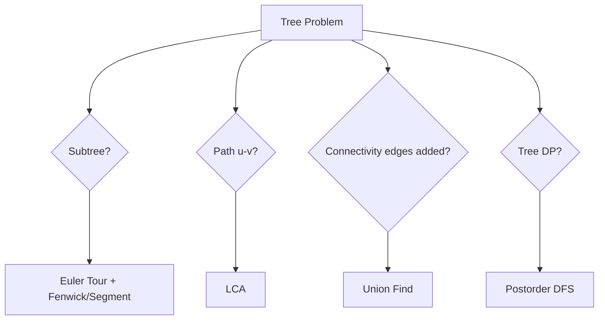

## Formulas

| Problem | Formula / tactic |
|---|---|
| distance(u,v) | `depth[u]+depth[v]-2*depth[lca]` |
| subtree size | `1 + sum(child subtree)` |
| kth ancestor | jump by binary bits of k |
| path sum with prefix | `pref[u]+pref[v]-2*pref[lca]+value[lca]` |
| offline deletion | process queries backward as additions |

## C++ Template: DSU

```cpp
struct DSU {
    vector<int> p, sz;
    DSU(int n=0) { init(n); }
    void init(int n) {
        p.resize(n+1); sz.assign(n+1, 1);
        iota(p.begin(), p.end(), 0);
    }
    int find(int x) { return p[x] == x ? x : p[x] = find(p[x]); }
    bool unite(int a, int b) {
        a = find(a); b = find(b);
        if (a == b) return false;
        if (sz[a] < sz[b]) swap(a,b);
        p[b] = a; sz[a] += sz[b];
        return true;
    }
};
```

## Practice

| Difficulty | Problem | Link | Pattern | Intuition |
|---|---|---|---|---|
| Easy | Maximum Depth of Binary Tree | https://leetcode.com/problems/maximum-depth-of-binary-tree/ | tree DFS | depth = 1 + max child |
| Easy | Same Tree | https://leetcode.com/problems/same-tree/ | recursive compare | compare roots and children |
| Medium | Number of Connected Components in an Undirected Graph | https://leetcode.com/problems/number-of-connected-components-in-an-undirected-graph/ | DSU/DFS | merge endpoints |
| Medium | Lowest Common Ancestor of a Binary Tree | https://leetcode.com/problems/lowest-common-ancestor-of-a-binary-tree/ | recursive LCA | if p/q split, current is LCA |
| Medium | Redundant Connection | https://leetcode.com/problems/redundant-connection/ | DSU cycle | edge inside same component forms cycle |
| Hard | Binary Tree Maximum Path Sum | https://leetcode.com/problems/binary-tree-maximum-path-sum/ | tree DP | path may pass through node |
| Hard | Tree of Coprimes | https://leetcode.com/problems/tree-of-coprimes/ | DFS + ancestors | keep latest ancestor by value |
| CP | CSES Tree Diameter | https://cses.fi/problemset/task/1131 | two BFS/DFS | farthest from farthest |
| CP | CSES Company Queries I | https://cses.fi/problemset/task/1687 | binary lifting | kth ancestor |
| CP | CSES Company Queries II | https://cses.fi/problemset/task/1688 | LCA | equalize then jump |
| CP | CSES Road Construction | https://cses.fi/problemset/task/1676 | DSU | components and largest size |

---

# Topic 10: Dynamic Programming

## Concepts

| Concept | Meaning | Pattern clue |
|---|---|---|
| State | meaning of `dp[...]` | repeated subproblems |
| Transition | how smaller states build current | choose previous/cut/item |
| Base case | known starting answer | empty prefix, zero target |
| Memoization | recursion + cache | easier state design |
| Tabulation | iterative fill | faster, avoids recursion depth |
| Optimization | reduce state/transition/space | constraints too large |

## DP Framework

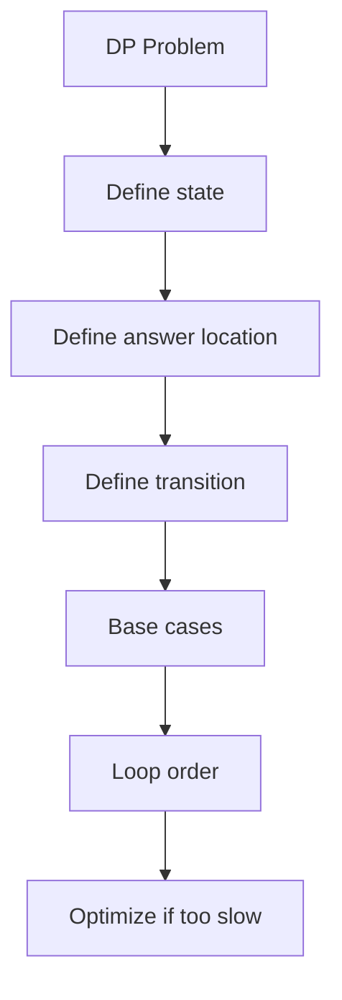

## Main DP Forms

| Form | State clue | Examples |
|---|---|---|
| Take / not take | choose subset/items | knapsack, subset sum |
| Ending at index | best ending here | LIS, max subarray variants |
| Matching DP | two strings/sequences | LCS, edit distance |
| Interval DP | segment `[l,r]` | matrix chain, burst balloons |
| Game DP | current player advantage | stone games |
| Grid DP | cell coordinates | paths/min cost |
| Digit DP | position, tight, started | count numbers with property |
| Tree DP | node + state | independent set, diameter variants |
| Bitmask DP | selected subset | assignment, TSP |
| Partition DP | prefix split into k parts | split array, palindrome cuts |

## C++ Template: Memoized DP

```cpp
int n;
vector<int> a;
vector<vector<int>> dp;

int rec(int i, int state) {
    if (i == n) return 0;
    int &ans = dp[i][state];
    if (ans != -1) return ans;

    ans = rec(i + 1, state);      // skip
    // ans = max(ans, value + rec(next_i, new_state));
    return ans;
}
```

## Practice

| Difficulty | Problem | Link | Pattern | Intuition |
|---|---|---|---|---|
| Easy | Climbing Stairs | https://leetcode.com/problems/climbing-stairs/ | Fibonacci DP | last move was 1 or 2 |
| Easy | House Robber | https://leetcode.com/problems/house-robber/ | take/not take | rob current means skip previous |
| Medium | Coin Change | https://leetcode.com/problems/coin-change/ | unbounded knapsack | try last coin |
| Medium | Longest Increasing Subsequence | https://leetcode.com/problems/longest-increasing-subsequence/ | ending/tails | best increasing tail per length |
| Medium | Longest Common Subsequence | https://leetcode.com/problems/longest-common-subsequence/ | matching DP | match chars or skip one side |
| Medium | Partition Equal Subset Sum | https://leetcode.com/problems/partition-equal-subset-sum/ | subset sum | target total/2 |
| Hard | Edit Distance | https://leetcode.com/problems/edit-distance/ | matching DP | insert/delete/replace |
| Hard | Burst Balloons | https://leetcode.com/problems/burst-balloons/ | interval DP | choose last balloon in interval |
| Hard | Frog Jump | https://leetcode.com/problems/frog-jump/ | state DP set | stone + last jump |
| CP | AtCoder Educational DP Contest | https://atcoder.jp/contests/dp | DP ladder | 26 foundational DP tasks |
| CP | CSES Dice Combinations | https://cses.fi/problemset/task/1633 | counting DP | last dice value |
| CP | CSES Book Shop | https://cses.fi/problemset/task/1158 | 0/1 knapsack | choose books under budget |

---

# Topic 11: Greedy + Sorting + Intervals

## Concepts

| Concept | Meaning | Pattern clue |
|---|---|---|
| Greedy choice | locally optimal step | pick earliest end, smallest cost, largest gain |
| Exchange argument | prove greedy safe | swap optimal solution into greedy form |
| Sorting | reveal order | intervals, events, deadlines |
| Sweep line | process events | overlaps, active intervals |
| Priority queue greedy | keep best candidates | scheduling, meeting rooms, refuel |

## Framework

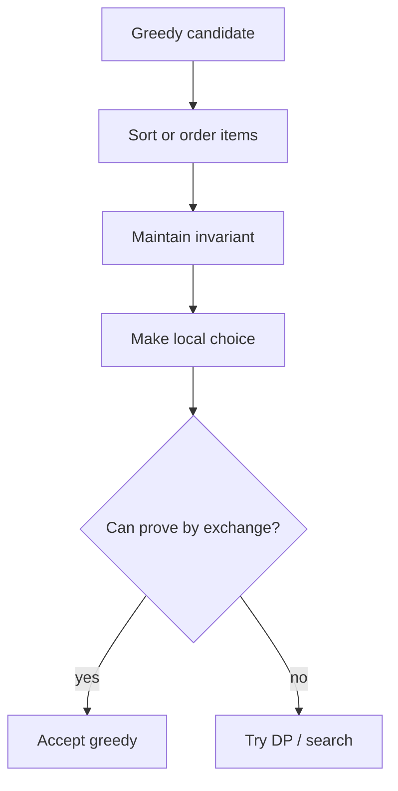

## Practice

| Difficulty | Problem | Link | Pattern | Intuition |
|---|---|---|---|---|
| Easy | Assign Cookies | https://leetcode.com/problems/assign-cookies/ | sort greedy | smallest cookie for smallest child |
| Medium | Merge Intervals | https://leetcode.com/problems/merge-intervals/ | sort intervals | extend current overlap |
| Medium | Non-overlapping Intervals | https://leetcode.com/problems/non-overlapping-intervals/ | earliest end greedy | keep interval that frees earliest |
| Medium | Task Scheduler | https://leetcode.com/problems/task-scheduler/ | frequency greedy | most frequent tasks create idle slots |
| Hard | Minimum Number of Refueling Stops | https://leetcode.com/problems/minimum-number-of-refueling-stops/ | heap greedy | use largest past fuel when stuck |
| Hard | Course Schedule III | https://leetcode.com/problems/course-schedule-iii/ | deadline + max heap | drop longest course when time exceeds |
| CP | CSES Movie Festival | https://cses.fi/problemset/task/1629 | interval scheduling | earliest finishing movie |
| CP | CSES Restaurant Customers | https://cses.fi/problemset/task/1619 | sweep line | arrivals +1 departures -1 |

---

# Topic 12: Range Queries: Fenwick + Segment Tree + Sparse Table

## Concepts

| Structure | Supports | Pattern clue |
|---|---|---|
| Fenwick Tree | point update + prefix/range sum | dynamic sums, invert count |
| Segment Tree | range query + updates | min/max/sum/gcd with updates |
| Lazy Segment Tree | range update + range query | add/set over intervals |
| Sparse Table | static idempotent range query | RMQ/GCD no updates |

## Framework

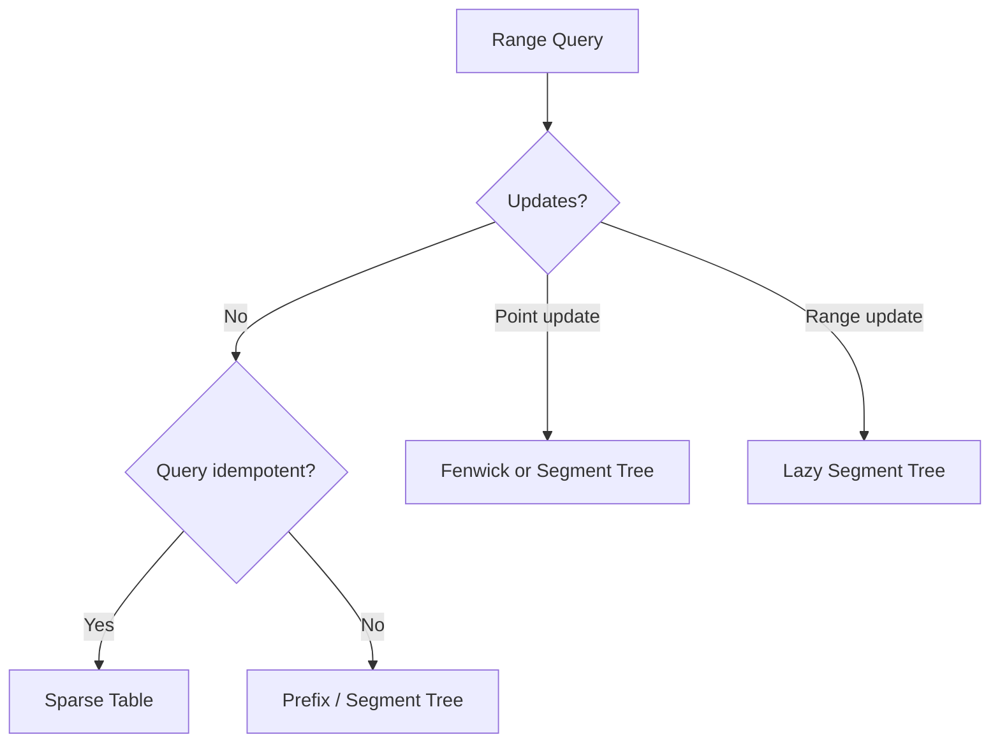

## C++ Template: Fenwick

```cpp
struct Fenwick {
    int n;
    vector<long long> bit;
    Fenwick(int n=0): n(n), bit(n+1,0) {}
    void add(int idx, long long val) {
        for (; idx <= n; idx += idx & -idx) bit[idx] += val;
    }
    long long sumPrefix(int idx) {
        long long res = 0;
        for (; idx > 0; idx -= idx & -idx) res += bit[idx];
        return res;
    }
    long long rangeSum(int l, int r) {
        return sumPrefix(r) - sumPrefix(l-1);
    }
};
```

## Practice

| Difficulty | Problem | Link | Pattern | Intuition |
|---|---|---|---|---|
| Medium | Range Sum Query Mutable | https://leetcode.com/problems/range-sum-query-mutable/ | Fenwick/segment tree | update delta, query range |
| Medium | Count of Smaller Numbers After Self | https://leetcode.com/problems/count-of-smaller-numbers-after-self/ | Fenwick + compression | count previous smaller ranks from right |
| Hard | Range Module | https://leetcode.com/problems/range-module/ | interval set / segment tree | maintain covered intervals |
| Hard | Falling Squares | https://leetcode.com/problems/falling-squares/ | lazy seg/compression | range max + update |
| CP | CSES Dynamic Range Sum Queries | https://cses.fi/problemset/task/1648 | Fenwick | point update range sum |
| CP | CSES Range Minimum Queries II | https://cses.fi/problemset/task/1649 | segment tree | point update range min |
| CP | CSES Range Update Queries | https://cses.fi/problemset/task/1651 | Fenwick diff | range add point query |

---

# Topic 13: Math, Modular Arithmetic, Number Theory, Combinatorics

## Concepts

| Concept | Meaning | Pattern clue |
|---|---|---|
| Modular arithmetic | keep values bounded | answer modulo 1e9+7/998244353 |
| Fast power | compute `a^b mod M` | huge exponent |
| Modular inverse | divide under modulo | combinations, fractions mod prime |
| GCD/LCM | divisibility structure | reduce ratios, coprime, Euclid |
| Sieve | primes up to n | many prime queries |
| Factorization | prime powers of n | divisors, gcd constraints |
| Combinations | choose k items | count ways, binomial coefficients |
| Inclusion-exclusion | count union / avoid overcount | at least/none/divisible by any |
| Stars and bars | distribute identical items | nonnegative solutions |

## Framework

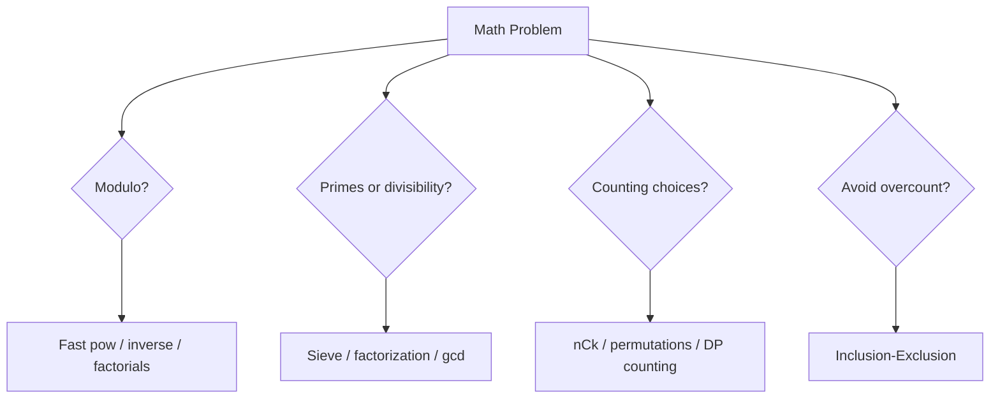

## C++ Template: Modular Arithmetic

```cpp
long long modpow(long long a, long long e, long long mod) {
    long long r = 1 % mod;
    while (e) {
        if (e & 1) r = r * a % mod;
        a = a * a % mod;
        e >>= 1;
    }
    return r;
}

long long modinv(long long a, long long mod) {
    return modpow(a, mod - 2, mod); // mod prime
}
```

## C++ Template: nCk Precompute

```cpp
const int MODN = 1e9 + 7;
vector<long long> fact, invfact;

void buildComb(int N) {
    fact.assign(N+1, 1);
    invfact.assign(N+1, 1);
    for (int i = 1; i <= N; i++) fact[i] = fact[i-1] * i % MODN;
    invfact[N] = modinv(fact[N], MODN);
    for (int i = N; i >= 1; i--) invfact[i-1] = invfact[i] * i % MODN;
}

long long C(int n, int k) {
    if (k < 0 || k > n) return 0;
    return fact[n] * invfact[k] % MODN * invfact[n-k] % MODN;
}
```

## Practice

| Difficulty | Problem | Link | Pattern | Intuition |
|---|---|---|---|---|
| Easy | Count Primes | https://leetcode.com/problems/count-primes/ | sieve | mark multiples |
| Easy | Power of Three | https://leetcode.com/problems/power-of-three/ | divisibility | divide repeatedly / log |
| Medium | Pow(x, n) | https://leetcode.com/problems/powx-n/ | fast exponentiation | square base, halve exponent |
| Medium | Unique Paths | https://leetcode.com/problems/unique-paths/ | combinatorics / grid DP | choose down moves among total |
| Medium | Permutation Sequence | https://leetcode.com/problems/permutation-sequence/ | factorial number system | choose block by k/fact |
| Hard | Count Good Numbers | https://leetcode.com/problems/count-good-numbers/ | modular exponentiation | multiply independent choices |
| Hard | Number of Ways to Reorder Array to Get Same BST | https://leetcode.com/problems/number-of-ways-to-reorder-array-to-get-same-bst/ | combinatorics + recursion | interleave left/right subtree orders |
| CP | CSES Exponentiation | https://cses.fi/problemset/task/1095 | modular power | binary exponentiation |
| CP | CSES Exponentiation II | https://cses.fi/problemset/task/1712 | Fermat + mod power | reduce exponent modulo phi |
| CP | CSES Counting Divisors | https://cses.fi/problemset/task/1713 | sieve factors | product of exponent+1 |
| CP | CSES Binomial Coefficients | https://cses.fi/problemset/task/1079 | factorial + inverse | precompute nCk mod prime |
| CP | CSES Distributing Apples | https://cses.fi/problemset/task/1716 | stars and bars | C(n+m-1,m) |
| CP | CSES Christmas Party | https://cses.fi/problemset/task/1717 | derangements | inclusion/exclusion DP |

---

## 18. Master Practice Matrix by Topic and Difficulty

> This is a **curated coverage list**, not literally every online problem. It is designed to cover the major reusable patterns needed for FAANG interviews and Candidate Master preparation.

| Topic | Easy / Foundation | Medium / Core | Hard / Advanced |
|---|---|---|---|
| STL + implementation | Valid Parentheses, Two Sum, Contains Duplicate | Group Anagrams, Top K Frequent, Merge Intervals | LFU Cache, All O(1) Data Structure |
| Prefix | Running Sum, Range Sum Query Immutable | Subarray Sum Equals K, Product Except Self, Continuous Subarray Sum | Count of Range Sum, Split Array With Same Average |
| Binary Search | Binary Search, Search Insert | Koko, Ship Capacity, Rotated Array | Median Two Sorted Arrays, Split Array Largest Sum |
| Two pointers | Valid Palindrome, Move Zeroes | 3Sum, Longest Unique Substring, Container Water | Minimum Window, Sliding Window Median |
| Stack/Deque/Heap | Valid Parentheses, Min Stack | Daily Temperatures, K Closest Points, Stock Span | Largest Rectangle, Sliding Window Max, IPO |
| Bitwise | Single Number, Hamming Weight | Subsets, Single Number III, Range AND | Maximum XOR Pair, Minimum XOR Sum |
| Backtracking | Generate Parentheses | Permutations, Combination Sum, Palindrome Partition | N-Queens, Sudoku Solver |
| Graph | Path Exists | Number of Islands, Course Schedule, Rotting Oranges | Word Ladder, Swim in Rising Water, Critical Connections |
| Tree/DSU | Max Depth, Same Tree | LCA, Redundant Connection, Components | Binary Tree Max Path, Tree of Coprimes |
| DP | Climbing Stairs, House Robber | Coin Change, LIS, LCS, Partition Equal Subset | Edit Distance, Burst Balloons, Frog Jump |
| Greedy | Assign Cookies | Non-overlap Intervals, Task Scheduler | Course Schedule III, Refuel Stops |
| Range Queries | Prefix range sum | Range Sum Mutable, Count Smaller | Falling Squares, Range Module |
| Math/NT/Comb | Count Primes, GCD | Pow, Unique Paths, nCk mod | Reorder BST, Exponentiation II, derangements |

---

## 19. FAANG Pattern Practice List

| Pattern | Must-solve problems | Recognition trigger |
|---|---|---|
| Hash map frequency | Two Sum, Group Anagrams, Longest Consecutive Sequence | duplicates, counts, fast lookup |
| Prefix + map | Subarray Sum Equals K, Continuous Subarray Sum | subarray sum/count |
| Sliding window | Longest Substring Without Repeating, Minimum Window | contiguous substring/subarray with condition |
| Binary search answer | Koko, Ship Capacity, Split Array Largest Sum | minimize max / max min |
| Monotonic stack | Daily Temperatures, Histogram, Trapping Rain Water | nearest greater/smaller |
| Heap | Top K Frequent, K Closest, Merge K Lists | repeated min/max |
| BFS | Rotting Oranges, Word Ladder, Shortest Path Binary Matrix | minimum moves |
| DFS/backtracking | N-Queens, Word Search, Combination Sum | generate/search choices |
| Tree DFS | Diameter, Max Path Sum, LCA | subtree/path recursion |
| DP | Coin Change, LIS, LCS, Edit Distance | optimal/count with repeated states |
| Union Find | Redundant Connection, Number of Provinces | dynamic connectivity |

---

## 20. Candidate Master CP Practice List

| Stage | Rating / level | Focus | Recommended sources |
|---|---|---|---|
| Stage 1 | CF 800-1100 | implementation, prefix, sorting, maps | Codeforces A/B, CSES Intro/Sorting |
| Stage 2 | CF 1100-1400 | binary search, greedy, BFS/DFS, two pointers | CF B/C, CSES Graph/Searching |
| Stage 3 | CF 1400-1600 | DP basics, DSU, Dijkstra, segment tree | CSES DP/Range/Graph |
| Stage 4 | CF 1600-1900 | tree, bitmask, combinatorics, constructive | CF C/D, AtCoder ABC E/F |
| Stage 5 | CF 1900-2200 | hard DP, graph states, number theory, proofs | CF D/E, AtCoder ARC |

### CP Topic Checklist

| Topic | Foundation | Candidate Master add-on |
|---|---|---|
| Arrays | prefix, two pointers | contribution, offline queries |
| Binary search | lower_bound, answer search | parallel binary search, floating binary search |
| Graph | BFS/DFS/Dijkstra | SCC, bridges, flows basics |
| Tree | DFS, LCA | rerooting, centroid, HLD basics |
| DP | 1D/2D | digit DP, bitmask DP, interval DP, optimization |
| Math | gcd, sieve, nCk | CRT, Mobius basics, combinatorics proofs |
| Data structures | Fenwick/segment | lazy segtree, ordered set, sparse table |

---

## 21. Final Recognition Cheat Sheet

| Problem phrase | Think instantly |
|---|---|
| “range sum” | prefix / Fenwick / segment tree |
| “many range updates, final values” | difference array |
| “subarray sum equals K” | prefix + hashmap |
| “sorted array” | binary search / two pointers |
| “minimum possible maximum” | binary search on answer |
| “longest substring/subarray satisfying condition” | sliding window |
| “nearest greater/smaller” | monotonic stack |
| “maximum/minimum in every window” | monotonic deque |
| “minimum moves” | BFS |
| “weighted shortest path” | Dijkstra / 0-1 BFS |
| “dependencies/prerequisites” | topological sort |
| “connectivity with edge additions” | DSU |
| “path in tree” | LCA / binary lifting |
| “subtree query” | Euler tour + Fenwick/segment |
| “n ≤ 20 and subsets” | bitmask DP |
| “count ways modulo” | DP / combinatorics with mod |
| “divide under modulo” | modular inverse |
| “choose k” | nCk factorial precompute |
| “primes/divisors” | sieve/factorization |
| “all arrangements/choices” | backtracking or combinatorics |

---

## Source Notes Used

This master guide was synthesized from the uploaded STL, prefix sum, binary search, two pointers, bitwise, recursion/backtracking, graph, tree/DSU, and DP playbooks, plus a curated external practice list from LeetCode, CSES, AtCoder, and Codeforces problem catalogs.

