# CP + FAANG Pattern Master Guide in C++

> Combined from your uploaded STL, Prefix Sum, Binary Search, Two Pointers, Bitwise, Recursion/Backtracking, Graph, Tree/DSU, and DP notes.  
> Goal: recognize patterns fast in contests, OAs, and FAANG-style interviews.

---

## Clickable Index

1. [How to Use This Guide](#1-how-to-use-this-guide)
2. [Master Pattern Roadmap](#2-master-pattern-roadmap)
3. [Universal Contest/OA Recognition Framework](#3-universal-contestoa-recognition-framework)
4. [Complexity Decision Table](#4-complexity-decision-table)
5. [Topic 1: C++ STL and Implementation Tools](#topic-1-c-stl-and-implementation-tools)
6. [Topic 2: Prefix Sum, Difference Array, and Range Thinking](#topic-2-prefix-sum-difference-array-and-range-thinking)
7. [Topic 3: Binary Search and Binary Search on Answer](#topic-3-binary-search-and-binary-search-on-answer)
8. [Topic 4: Two Pointers and Sliding Window](#topic-4-two-pointers-and-sliding-window)
9. [Topic 5: Bit Manipulation and Bitmasking](#topic-5-bit-manipulation-and-bitmasking)
10. [Topic 6: Recursion and Backtracking](#topic-6-recursion-and-backtracking)
11. [Topic 7: Graph Algorithms](#topic-7-graph-algorithms)
12. [Topic 8: Trees, LCA, Binary Lifting, and DSU](#topic-8-trees-lca-binary-lifting-and-dsu)
13. [Topic 9: Dynamic Programming](#topic-9-dynamic-programming)
14. [FAANG Pattern Checklist](#14-faang-pattern-checklist)
15. [Candidate Master Competitive Programming Checklist](#15-candidate-master-competitive-programming-checklist)
16. [One-Page Pattern Recognition Table](#16-one-page-pattern-recognition-table)

---

# 1. How to Use This Guide

For every new problem, do this before coding:

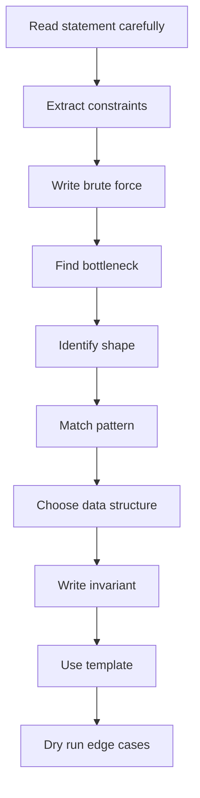

Mental model:

```text
Problem Form -> Pattern -> Invariant -> Data Structure -> Template -> Edge Cases
```

You should train yourself to say one sentence before coding:

```text
This is a <pattern> problem because <monotonic/window/state/graph/range property>.
```

---

# 2. Master Pattern Roadmap

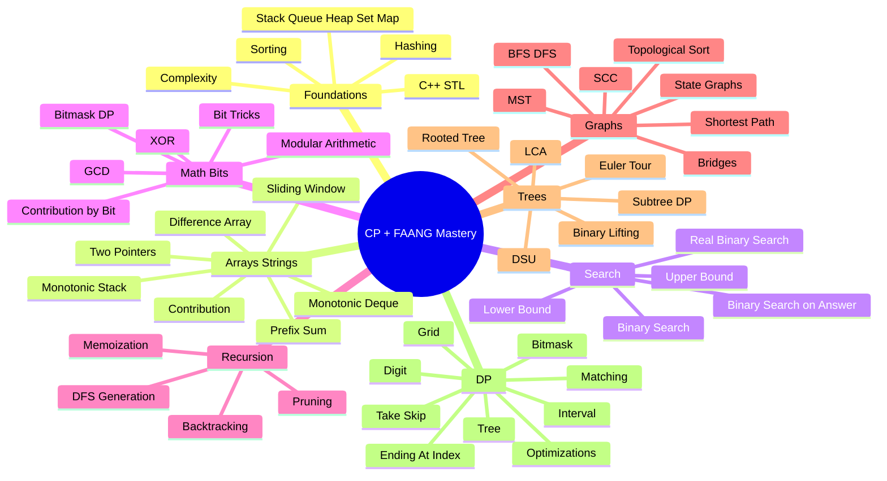

Recommended order:

```text
STL -> Prefix -> Binary Search -> Two Pointers -> Bitwise -> Recursion -> Graph -> Tree/DSU -> DP -> Advanced mixed problems
```

---

# 3. Universal Contest/OA Recognition Framework

| Step | Question | What it reveals |
|---|---|---|
| 1 | What are `n`, `q`, value bounds? | Required complexity |
| 2 | Is data static or changing? | Prefix vs Fenwick/Segment Tree |
| 3 | Is answer a contiguous subarray/substring? | Sliding window / prefix / two pointers |
| 4 | Is input sorted or can sorting help? | Two pointers / greedy / binary search |
| 5 | Is there a monotonic yes/no check? | Binary search on answer |
| 6 | Are objects connected by relationships? | Graph / tree / DSU |
| 7 | Are there repeated recursive states? | DP |
| 8 | Is `n <= 20`? | Bitmask / backtracking / subset DP |
| 9 | Is it asking min/max/count ways? | DP or greedy |
| 10 | Does every local choice remain safe? | Greedy |

---

# 4. Complexity Decision Table

| Constraint | Usual accepted complexity | Patterns |
|---:|---|---|
| `n <= 20` | `O(2^n * poly(n))` | subsets, bitmask DP, backtracking |
| `n <= 100` | `O(n^3)` | Floyd, interval DP |
| `n <= 500` | `O(n^3)` sometimes | dense DP/graphs |
| `n <= 2,000` | `O(n^2)` | LIS DP, pair loops |
| `n <= 2e5` | `O(n log n)` / `O(n)` | sorting, BS, graph, Fenwick |
| `n <= 1e6` | `O(n)` | prefix, two pointers |
| `q <= 2e5` | `O((n+q)logn)` or better | Fenwick, segment tree, offline |

---

# Topic 1: C++ STL and Implementation Tools

## Concepts

STL is your contest toolbox: containers store data, algorithms process data, iterators connect them.

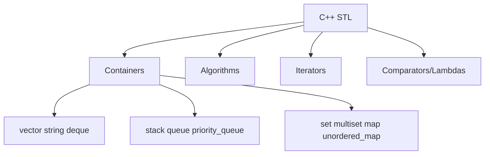

## Framework

```text
Need operation -> choose data structure -> keep invariant -> answer query.
```

| Need | Use |
|---|---|
| random access | `vector` |
| key frequency | `unordered_map`, `map` |
| sorted unique values | `set` |
| duplicates sorted | `multiset` |
| min/max repeatedly | `priority_queue` |
| FIFO BFS | `queue` |
| 0-1 BFS | `deque` |
| nearest greater/smaller | `stack` |
| dynamic median | two `multiset`s |
| min/max window | monotonic `deque` |

## Problem Forms

| Form | Pattern | Intuition |
|---|---|---|
| Frequency counting | hash map | Turn values into counts |
| Sorting with custom rule | sort lambda | Order reveals greedy structure |
| Dynamic min/max | heap/set | Keep best candidate available |
| Brackets/nesting | stack | Last opened closes first |
| Intervals | sort/sweep/set | Process endpoints in order |
| Top K | heap/two sets | Separate chosen and unchosen groups |

## Tactics

| Tactic | Use |
|---|---|
| Store indices, not values | when positions matter |
| Use sentinel | avoid boundary if/else |
| Coordinate compress | large values but few unique |
| Lazy deletion | heap cannot remove arbitrary item |
| Prefer `long long` | sums/products/counts |
| `erase(ms.find(x))` | remove one copy from multiset |

## C++ Template

```cpp
#include <bits/stdc++.h>
using namespace std;

using ll = long long;
const ll INF = (ll)4e18;

int main() {
    ios::sync_with_stdio(false);
    cin.tie(nullptr);

    int T = 1;
    // cin >> T;
    while (T--) {
        // solve();
    }
}
```

## Pattern Recognition Table

| Clue | Think |
|---|---|
| count occurrences | `unordered_map` |
| need sorted order | `set/map` |
| remove one duplicate | `multiset` |
| kth/top element | heap / ordered set |
| next greater | monotonic stack |
| sliding min/max | monotonic deque |
| interval overlaps | sort endpoints |

## Practice Ladder

| Level | Problem | Link | Pattern |
|---|---|---|---|
| Easy | Valid Parentheses | https://leetcode.com/problems/valid-parentheses/ | stack |
| Easy | Two Sum | https://leetcode.com/problems/two-sum/ | hash map |
| Medium | Top K Frequent Elements | https://leetcode.com/problems/top-k-frequent-elements/ | map + heap |
| Medium | Merge Intervals | https://leetcode.com/problems/merge-intervals/ | sort intervals |
| Medium | Kth Largest Element | https://leetcode.com/problems/kth-largest-element-in-an-array/ | heap/quickselect |
| Hard | Sliding Window Median | https://leetcode.com/problems/sliding-window-median/ | two multisets |
| Hard | The Skyline Problem | https://leetcode.com/problems/the-skyline-problem/ | sweep line + multiset |

---

# Topic 2: Prefix Sum, Difference Array, and Range Thinking

## Concepts

Prefix sum answers static range queries in `O(1)` after preprocessing.

```text
pref[i + 1] = pref[i] + a[i]
sum(l, r) = pref[r + 1] - pref[l]
```

Difference array handles many offline range updates.

```text
add x to [l,r]:
diff[l] += x
diff[r+1] -= x
```

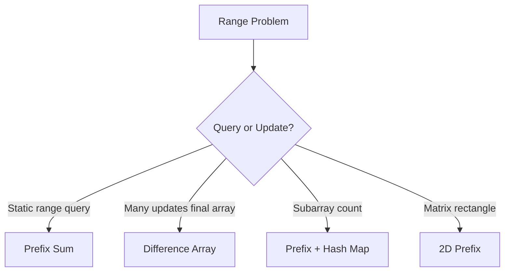

## Frameworks

| Framework | Use | Core formula |
|---|---|---|
| 1D prefix | static range sum | `pref[r+1]-pref[l]` |
| 1D diff | range add final array | mark endpoints then prefix |
| prefix + map | count subarrays with target | need previous prefix |
| prefix modulo | divisible subarray | same remainder |
| 2D prefix | rectangle sum | inclusion-exclusion |
| 2D diff | rectangle updates | four-corner marking |

## Forms + Intuition

| Form | Recognition | Intuition |
|---|---|---|
| Range sum query | many `sum(l,r)` | precompute cumulative sums |
| Subarray sum equals K | contiguous + target + negatives | `pref[j]-pref[i]=K` |
| Divisible by K | subarray sum `% k == 0` | equal prefix remainders |
| Range update final | many add on `[l,r]` | only changes happen at boundaries |
| Rectangle sum | matrix area query | subtract outside parts |
| Balanced depth | bracket prefix | depth must not go below min |

## C++ Templates

### 1D Prefix

```cpp
vector<long long> buildPrefix(const vector<long long>& a) {
    int n = a.size();
    vector<long long> pref(n + 1, 0);
    for (int i = 0; i < n; i++) pref[i + 1] = pref[i] + a[i];
    return pref;
}

long long rangeSum(const vector<long long>& pref, int l, int r) {
    return pref[r + 1] - pref[l];
}
```

### Subarray Sum Equals K

```cpp
long long countSubarraysSumK(vector<int>& a, long long k) {
    unordered_map<long long, long long> freq;
    freq[0] = 1;

    long long pref = 0, ans = 0;
    for (int x : a) {
        pref += x;
        ans += freq[pref - k];
        freq[pref]++;
    }
    return ans;
}
```

### Difference Array

```cpp
vector<long long> rangeAddFinal(int n, vector<tuple<int,int,long long>> ops) {
    vector<long long> diff(n + 1, 0);
    for (auto [l, r, x] : ops) {
        diff[l] += x;
        if (r + 1 < n) diff[r + 1] -= x;
    }

    vector<long long> a(n);
    long long cur = 0;
    for (int i = 0; i < n; i++) {
        cur += diff[i];
        a[i] = cur;
    }
    return a;
}
```

## Tactics

| Tactic | Why |
|---|---|
| Use 1-indexed prefix | fewer boundary bugs |
| Add `freq[0]=1` | counts subarrays starting at index 0 |
| Normalize modulo | handle negative sums |
| Use `long long` | sums overflow int |
| Difference array only offline | not for online queries |
| For 2D prefix, pad with row 0/col 0 | cleaner formula |

## Practice Ladder

| Level | Problem | Link | Pattern |
|---|---|---|---|
| Easy | Running Sum of 1d Array | https://leetcode.com/problems/running-sum-of-1d-array/ | basic prefix |
| Easy | Range Sum Query Immutable | https://leetcode.com/problems/range-sum-query-immutable/ | static range sum |
| Medium | Subarray Sum Equals K | https://leetcode.com/problems/subarray-sum-equals-k/ | prefix + map |
| Medium | Continuous Subarray Sum | https://leetcode.com/problems/continuous-subarray-sum/ | prefix modulo |
| Medium | Product of Array Except Self | https://leetcode.com/problems/product-of-array-except-self/ | prefix/suffix |
| Hard | Count of Range Sum | https://leetcode.com/problems/count-of-range-sum/ | prefix + merge/Fenwick |
| Hard | Maximum Sum Rectangle No Larger Than K | https://leetcode.com/problems/max-sum-of-rectangle-no-larger-than-k/ | 2D prefix + set |

---

# Topic 3: Binary Search and Binary Search on Answer

## Concepts

Binary search works when the search space splits into monotonic zones.

```text
false false false true true true
```

or

```text
true true true false false false
```

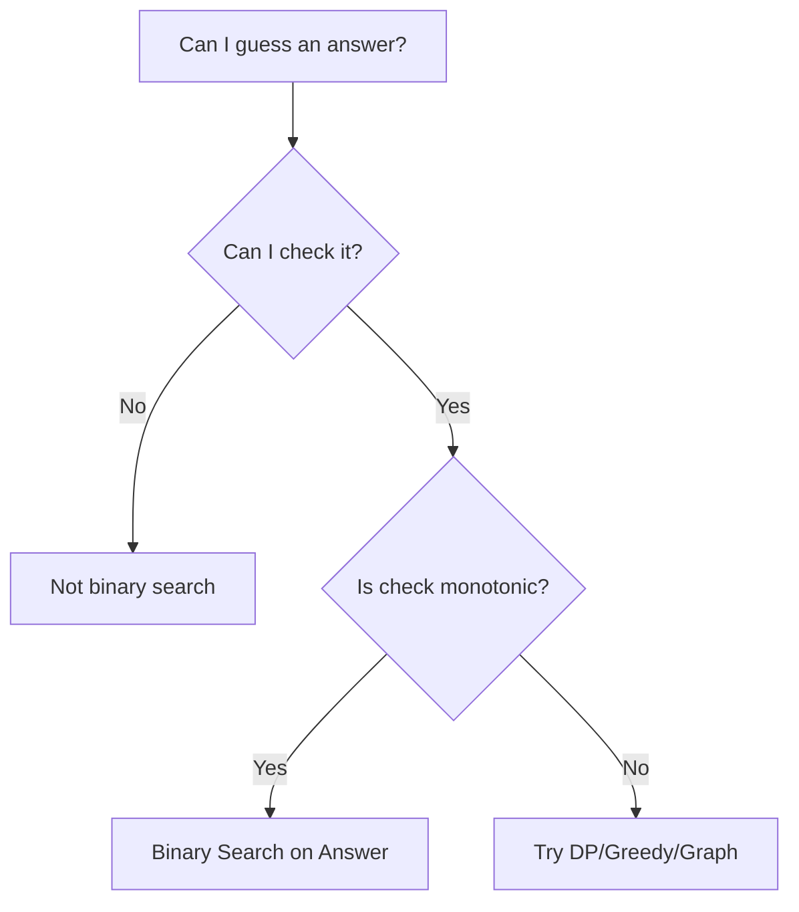

## Frameworks

| Framework | Goal | Predicate |
|---|---|---|
| first true | minimum feasible | `false...true` |
| last true | maximum feasible | `true...false` |
| lower_bound | first `>= x` | sorted array |
| upper_bound | first `> x` | sorted array |
| minimize maximum | smallest limit that works | `can(limit)` |
| maximize minimum | largest distance/value | `can(value)` |
| kth smallest | count `<= mid` | `count >= k` |
| real binary search | continuous answer | iterate fixed times |

## Forms + Intuition

| Form | Clue | Intuition |
|---|---|---|
| Sorted search | sorted array | discard half |
| First/last valid | boundary of condition | find transition point |
| Minimize maximum | capacity/time/max load | if X works, larger also works |
| Maximize minimum | distance/min gap | if X works, smaller also works |
| Kth smallest | sorted implicit values | count how many <= guess |
| Real-valued | precision answer | no exact equality; iterate |

## C++ Templates

### First True

```cpp
long long firstTrue(long long lo, long long hi) {
    long long ans = hi + 1;
    while (lo <= hi) {
        long long mid = lo + (hi - lo) / 2;
        if (check(mid)) {
            ans = mid;
            hi = mid - 1;
        } else {
            lo = mid + 1;
        }
    }
    return ans;
}
```

### Last True

```cpp
long long lastTrue(long long lo, long long hi) {
    long long ans = lo - 1;
    while (lo <= hi) {
        long long mid = lo + (hi - lo) / 2;
        if (check(mid)) {
            ans = mid;
            lo = mid + 1;
        } else {
            hi = mid - 1;
        }
    }
    return ans;
}
```

### Minimize Maximum Example

```cpp
bool can(long long limit, vector<int>& a, int k) {
    int groups = 1;
    long long cur = 0;

    for (int x : a) {
        if (x > limit) return false;
        if (cur + x > limit) {
            groups++;
            cur = x;
        } else {
            cur += x;
        }
    }
    return groups <= k;
}
```

## Tactics

| Tactic | Why |
|---|---|
| Define answer type first | determines `lo/hi` |
| Prove monotonicity | prevents wrong BS |
| Use safe mid | avoids overflow |
| For min answer, move `hi = mid - 1` on valid | keep smaller candidate |
| For max answer, move `lo = mid + 1` on valid | keep larger candidate |
| For real BS, loop 80 times | enough precision |

## Practice Ladder

| Level | Problem | Link | Pattern |
|---|---|---|---|
| Easy | Binary Search | https://leetcode.com/problems/binary-search/ | classic |
| Easy | Search Insert Position | https://leetcode.com/problems/search-insert-position/ | lower_bound |
| Medium | Find Minimum in Rotated Sorted Array | https://leetcode.com/problems/find-minimum-in-rotated-sorted-array/ | rotated search |
| Medium | Koko Eating Bananas | https://leetcode.com/problems/koko-eating-bananas/ | min feasible |
| Medium | Capacity To Ship Packages | https://leetcode.com/problems/capacity-to-ship-packages-within-d-days/ | minimize max |
| Hard | Split Array Largest Sum | https://leetcode.com/problems/split-array-largest-sum/ | minimize max |
| Hard | Median of Two Sorted Arrays | https://leetcode.com/problems/median-of-two-sorted-arrays/ | partition binary search |
| Hard | Kth Smallest Number in Multiplication Table | https://leetcode.com/problems/kth-smallest-number-in-multiplication-table/ | count <= mid |

---

# Topic 4: Two Pointers and Sliding Window

## Concepts

Two pointers avoid trying all pairs/subarrays by moving indices with a rule.

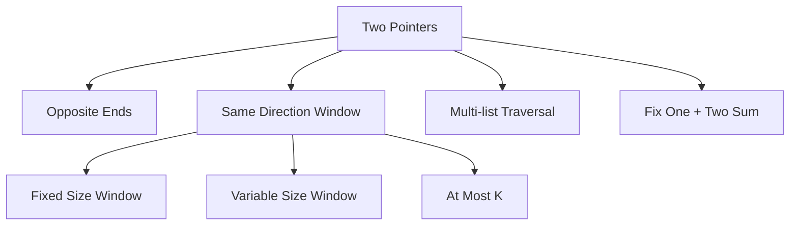

## Frameworks

| Framework | Use |
|---|---|
| Opposite ends | sorted pair decision |
| Same direction | contiguous window |
| Fixed window | exactly size K |
| Variable window | maintain valid condition |
| At most K | count all valid subarrays |
| Exact K | `atMost(K)-atMost(K-1)` |
| Fix one then two pointers | 3Sum/4Sum |
| Multi-list traversal | merge/intersection/subsequence |

## Forms + Intuition

| Form | Clue | Intuition |
|---|---|---|
| Pair sum sorted | sorted + target | move side that cannot help |
| Palindrome | compare ends | mirror characters |
| Longest valid window | at most/condition | expand then shrink |
| Count subarrays | all windows ending at r | add `r-l+1` |
| Minimum window | need all required chars | shrink to tight valid |
| 3Sum | triplets after sorting | fix one, solve 2Sum |
| Sliding max | window max each k | monotonic deque |

## C++ Templates

### Variable Window

```cpp
int l = 0;
for (int r = 0; r < n; r++) {
    add(a[r]);

    while (!valid()) {
        remove(a[l]);
        l++;
    }

    ans = max(ans, r - l + 1);
}
```

### Count At Most K Distinct

```cpp
long long atMostK(vector<int>& a, int k) {
    unordered_map<int,int> freq;
    int l = 0;
    long long ans = 0;

    for (int r = 0; r < (int)a.size(); r++) {
        if (freq[a[r]]++ == 0) k--;

        while (k < 0) {
            if (--freq[a[l]] == 0) k++;
            l++;
        }

        ans += r - l + 1;
    }
    return ans;
}
```

### 3Sum Skeleton

```cpp
vector<vector<int>> threeSum(vector<int>& a) {
    sort(a.begin(), a.end());
    vector<vector<int>> ans;
    int n = a.size();

    for (int i = 0; i < n; i++) {
        if (i > 0 && a[i] == a[i - 1]) continue;

        int l = i + 1, r = n - 1;
        while (l < r) {
            long long s = 1LL * a[i] + a[l] + a[r];
            if (s == 0) {
                ans.push_back({a[i], a[l], a[r]});
                l++; r--;
                while (l < r && a[l] == a[l - 1]) l++;
                while (l < r && a[r] == a[r + 1]) r--;
            } else if (s < 0) l++;
            else r--;
        }
    }
    return ans;
}
```

## Tactics

| Tactic | Warning |
|---|---|
| Sliding sum with negatives may fail | use prefix + map |
| Sort before pair/triplet search | enables pointer movement |
| Count valid windows ending at `r` | add `r-l+1` |
| For exact K, use at most trick | easier than direct |
| Handle duplicates in k-sum | skip repeated fixed values |
| Maintain frequency map | for distinct/covering strings |

## Practice Ladder

| Level | Problem | Link | Pattern |
|---|---|---|---|
| Easy | Valid Palindrome | https://leetcode.com/problems/valid-palindrome/ | opposite ends |
| Easy | Merge Sorted Array | https://leetcode.com/problems/merge-sorted-array/ | merge pointers |
| Medium | Two Sum II | https://leetcode.com/problems/two-sum-ii-input-array-is-sorted/ | sorted pair |
| Medium | Longest Substring Without Repeating Characters | https://leetcode.com/problems/longest-substring-without-repeating-characters/ | variable window |
| Medium | Fruit Into Baskets | https://leetcode.com/problems/fruit-into-baskets/ | at most 2 |
| Medium | 3Sum | https://leetcode.com/problems/3sum/ | fix + two pointers |
| Hard | Minimum Window Substring | https://leetcode.com/problems/minimum-window-substring/ | covering window |
| Hard | Sliding Window Maximum | https://leetcode.com/problems/sliding-window-maximum/ | monotonic deque |

---

# Topic 5: Bit Manipulation and Bitmasking

## Concepts

Bits represent numbers and sets. A mask can encode selected items.

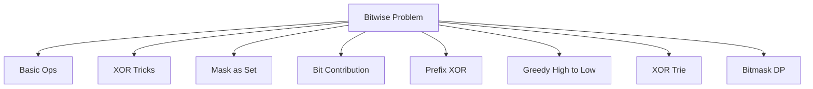

## Core Operations

| Operation | C++ |
|---|---|
| check bit `i` | `(x >> i) & 1LL` |
| set bit `i` | `x \| (1LL << i)` |
| clear bit `i` | `x & ~(1LL << i)` |
| toggle bit `i` | `x ^ (1LL << i)` |
| lowbit | `x & -x` |
| remove lowbit | `x & (x - 1)` |
| power of two | `x > 0 && (x & (x-1)) == 0` |

## Frameworks

| Framework | Use |
|---|---|
| XOR cancellation | pairs/single number |
| Prefix XOR | subarray XOR |
| Bitmask set | subsets, assignments |
| Submask enumeration | all submasks of mask |
| Bit contribution | sum pair XOR/AND/OR |
| High-to-low greedy | maximize AND/OR/XOR |
| XOR trie | max XOR pair/query |
| Bitmask DP | `n <= 20` subset state |

## Forms + Intuition

| Form | Clue | Intuition |
|---|---|---|
| Single number | pairs cancel | `x^x=0` |
| Subarray XOR K | contiguous XOR | `prefXor[j]^prefXor[i]=K` |
| Generate subsets | all choices | bits mean chosen/not chosen |
| Pair XOR sum | all pairs impossible | count set/unset per bit |
| Max XOR | choose opposite bit | high bit matters most |
| TSP/assignment | small n + subset | mask captures used items |
| SOS DP | subset/superset sums | transition over bits |

## C++ Templates

### Bit Helpers

```cpp
bool isSet(long long x, int i) { return (x >> i) & 1LL; }
long long setBit(long long x, int i) { return x | (1LL << i); }
long long clearBit(long long x, int i) { return x & ~(1LL << i); }
long long toggleBit(long long x, int i) { return x ^ (1LL << i); }
```

### Enumerate Subsets

```cpp
for (int mask = 0; mask < (1 << n); mask++) {
    for (int i = 0; i < n; i++) {
        if (mask & (1 << i)) {
            // item i is selected
        }
    }
}
```

### Enumerate Submasks

```cpp
for (int sub = mask; sub; sub = (sub - 1) & mask) {
    // sub is a non-empty submask of mask
}
// include zero separately if needed
```

### Count Subarrays XOR K

```cpp
long long countXorK(vector<int>& a, int k) {
    unordered_map<int,long long> freq;
    freq[0] = 1;

    int xr = 0;
    long long ans = 0;

    for (int x : a) {
        xr ^= x;
        ans += freq[xr ^ k];
        freq[xr]++;
    }
    return ans;
}
```

## Tactics

| Tactic | Why |
|---|---|
| Use `1LL << i` | avoid int overflow |
| Think per bit independently | contribution problems |
| XOR removes duplicates | cancellation |
| Highest bit dominates | greedy max/min bit answer |
| `n <= 20` screams mask | subsets are possible |
| Operations may preserve bit counts | invariant-based solution |

## Practice Ladder

| Level | Problem | Link | Pattern |
|---|---|---|---|
| Easy | Single Number | https://leetcode.com/problems/single-number/ | XOR cancellation |
| Easy | Number of 1 Bits | https://leetcode.com/problems/number-of-1-bits/ | lowbit |
| Medium | Subsets | https://leetcode.com/problems/subsets/ | bitmask/set |
| Medium | Counting Bits | https://leetcode.com/problems/counting-bits/ | DP bits |
| Medium | Maximum XOR of Two Numbers | https://leetcode.com/problems/maximum-xor-of-two-numbers-in-an-array/ | trie/greedy |
| Hard | Smallest Sufficient Team | https://leetcode.com/problems/smallest-sufficient-team/ | bitmask DP |
| Hard | Maximum Students Taking Exam | https://leetcode.com/problems/maximum-students-taking-exam/ | row mask DP |

---

# Topic 6: Recursion and Backtracking

## Concepts

Recursion solves smaller versions. Backtracking tries a choice, recurses, then undoes.

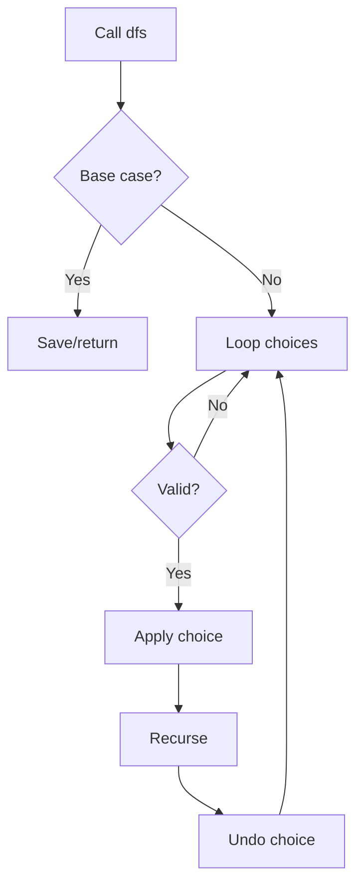

## LCCM Framework

| LCCM | Question |
|---|---|
| Level | What does one call represent? |
| Choice | What can I choose now? |
| Check | Is the choice valid? |
| Move | How does state change? |

## Problem Forms

| Form | Recognition | Intuition |
|---|---|---|
| Generate all subsets | choose or skip | binary recursion tree |
| Permutations | arrange all items | choose unused item |
| Combination sum | choose numbers to reach target | DFS over candidates |
| Palindrome partition | cut string | try every valid cut |
| N-Queens/Sudoku | board constraints | place, recurse, undo |
| Word Break | split string | recursion + memo |
| DFS grid | flood fill | visit neighbors |

## C++ Templates

### Universal Backtracking

```cpp
void dfs(int level) {
    if (base_case()) {
        save_answer();
        return;
    }

    for (auto choice : choices) {
        if (!valid(choice)) continue;

        apply(choice);
        dfs(level + 1);
        undo(choice);
    }
}
```

### Subsets

```cpp
void genSubsets(int i, vector<int>& a, vector<int>& cur, vector<vector<int>>& ans) {
    if (i == (int)a.size()) {
        ans.push_back(cur);
        return;
    }

    genSubsets(i + 1, a, cur, ans);

    cur.push_back(a[i]);
    genSubsets(i + 1, a, cur, ans);
    cur.pop_back();
}
```

### Permutations

```cpp
void permute(vector<int>& a, vector<int>& cur, vector<int>& used, vector<vector<int>>& ans) {
    if ((int)cur.size() == (int)a.size()) {
        ans.push_back(cur);
        return;
    }

    for (int i = 0; i < (int)a.size(); i++) {
        if (used[i]) continue;
        used[i] = 1;
        cur.push_back(a[i]);

        permute(a, cur, used, ans);

        cur.pop_back();
        used[i] = 0;
    }
}
```

## Tactics

| Tactic | Why |
|---|---|
| Sort candidates first | handle duplicates/pruning |
| Prune impossible branches | reduce exponential search |
| Add memo when states repeat | turns recursion into DP |
| Use reference path + undo | avoids copying |
| Define base case first | prevents infinite recursion |
| For duplicates, skip same value at same level | unique answers |

## Practice Ladder

| Level | Problem | Link | Pattern |
|---|---|---|---|
| Easy | Binary Tree Paths | https://leetcode.com/problems/binary-tree-paths/ | path DFS |
| Easy | Flood Fill | https://leetcode.com/problems/flood-fill/ | grid DFS |
| Medium | Subsets | https://leetcode.com/problems/subsets/ | include/exclude |
| Medium | Permutations | https://leetcode.com/problems/permutations/ | choose unused |
| Medium | Combination Sum | https://leetcode.com/problems/combination-sum/ | target DFS |
| Medium | Palindrome Partitioning | https://leetcode.com/problems/palindrome-partitioning/ | cut recursion |
| Hard | N-Queens | https://leetcode.com/problems/n-queens/ | constraint backtracking |
| Hard | Sudoku Solver | https://leetcode.com/problems/sudoku-solver/ | board backtracking |

---

# Topic 7: Graph Algorithms

## Concepts

Graph problems become easy after defining nodes and edges.

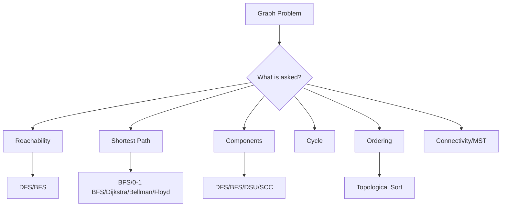

## Algorithm Selection

| Clue | Algorithm |
|---|---|
| unweighted shortest path | BFS |
| grid minimum moves | BFS |
| edge weights 0/1 | 0-1 BFS |
| nonnegative weights | Dijkstra |
| negative edges | Bellman-Ford |
| all-pairs shortest path, small n | Floyd-Warshall |
| dependencies | topological sort |
| components undirected | DFS/BFS/DSU |
| strongly connected directed | Kosaraju/Tarjan |
| connect all min cost | MST |
| edge deletion offline | reverse DSU |
| state includes extra variable | state graph |

## Framework

```text
1. What is a node?
2. What is an edge?
3. Directed or undirected?
4. Weighted or unweighted?
5. Source/target?
6. Need count, min distance, path, cycle, ordering?
7. Pick algorithm.
```

## C++ Templates

### BFS

```cpp
vector<int> bfs(int n, vector<vector<int>>& g, int src) {
    const int INF = 1e9;
    vector<int> dist(n + 1, INF);
    queue<int> q;

    dist[src] = 0;
    q.push(src);

    while (!q.empty()) {
        int u = q.front();
        q.pop();

        for (int v : g[u]) {
            if (dist[v] == INF) {
                dist[v] = dist[u] + 1;
                q.push(v);
            }
        }
    }

    return dist;
}
```

### DFS

```cpp
void dfs(int u, vector<vector<int>>& g, vector<int>& vis) {
    vis[u] = 1;
    for (int v : g[u]) {
        if (!vis[v]) dfs(v, g, vis);
    }
}
```

### Dijkstra

```cpp
vector<long long> dijkstra(int n, vector<vector<pair<int,int>>>& g, int src) {
    const long long INF = 4e18;
    vector<long long> dist(n + 1, INF);
    priority_queue<pair<long long,int>, vector<pair<long long,int>>, greater<pair<long long,int>>> pq;

    dist[src] = 0;
    pq.push({0, src});

    while (!pq.empty()) {
        auto [d, u] = pq.top();
        pq.pop();

        if (d != dist[u]) continue;

        for (auto [v, w] : g[u]) {
            if (dist[v] > d + w) {
                dist[v] = d + w;
                pq.push({dist[v], v});
            }
        }
    }

    return dist;
}
```

### Topological Sort

```cpp
vector<int> topoSort(int n, vector<vector<int>>& g) {
    vector<int> indeg(n + 1, 0);
    for (int u = 1; u <= n; u++) {
        for (int v : g[u]) indeg[v]++;
    }

    queue<int> q;
    for (int i = 1; i <= n; i++) {
        if (indeg[i] == 0) q.push(i);
    }

    vector<int> order;
    while (!q.empty()) {
        int u = q.front();
        q.pop();
        order.push_back(u);

        for (int v : g[u]) {
            if (--indeg[v] == 0) q.push(v);
        }
    }

    return order; // if size < n, cycle exists
}
```

## Tactics

| Tactic | Why |
|---|---|
| Grid = implicit graph | cells are nodes |
| Multi-source BFS | push all sources at distance 0 |
| Parent array | reconstruct path |
| Color array | bipartite / directed cycle |
| Reverse graph | SCC, reverse reachability |
| Edge list | Bellman-Ford/Kruskal |
| Avoid recursion depth | iterative DFS for large graphs |

## Practice Ladder

| Level | Problem | Link | Pattern |
|---|---|---|---|
| Easy | Find if Path Exists in Graph | https://leetcode.com/problems/find-if-path-exists-in-graph/ | DFS/DSU |
| Easy | Flood Fill | https://leetcode.com/problems/flood-fill/ | grid DFS |
| Medium | Number of Islands | https://leetcode.com/problems/number-of-islands/ | components |
| Medium | Rotting Oranges | https://leetcode.com/problems/rotting-oranges/ | multi-source BFS |
| Medium | Course Schedule | https://leetcode.com/problems/course-schedule/ | topo/cycle |
| Medium | Network Delay Time | https://leetcode.com/problems/network-delay-time/ | Dijkstra |
| Hard | Word Ladder | https://leetcode.com/problems/word-ladder/ | BFS state graph |
| Hard | Critical Connections | https://leetcode.com/problems/critical-connections-in-a-network/ | bridges |
| Hard | Minimum Cost to Make at Least One Valid Path | https://leetcode.com/problems/minimum-cost-to-make-at-least-one-valid-path-in-a-grid/ | 0-1 BFS |

---

# Topic 8: Trees, LCA, Binary Lifting, and DSU

## Concepts

A tree is a connected graph with no cycles and `n-1` edges.

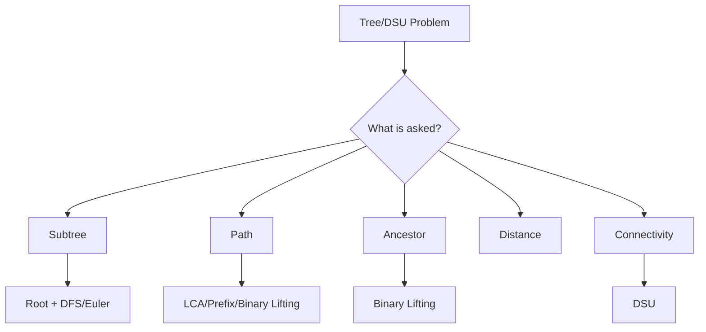

## Frameworks

| Framework | Use |
|---|---|
| Root + DFS | parent/depth/subtree |
| Euler tour | subtree becomes range |
| LCA | path/distance queries |
| Binary lifting | kth ancestor/jumps |
| Tree difference | many path updates |
| Rerooting DP | answer for every root |
| DSU | dynamic connectivity edge additions |
| Reverse DSU | offline deletions |
| Kruskal | MST |

## Forms + Intuition

| Form | Clue | Intuition |
|---|---|---|
| Subtree query | descendants of node | Euler interval |
| Distance u-v | tree path | depth formula with LCA |
| Kth ancestor | jump upward many steps | binary representation |
| Path aggregate | query along u-v | split at LCA |
| Tree diameter | farthest endpoints | BFS/DFS twice |
| Connectivity updates | add edges | DSU components |
| Remove edges offline | deletions | reverse time |

## C++ Templates

### Tree DFS

```cpp
vector<vector<int>> g;
vector<int> parentNode, depthNode, subtreeSize;

void dfsTree(int u, int p) {
    parentNode[u] = p;
    subtreeSize[u] = 1;

    for (int v : g[u]) {
        if (v == p) continue;
        depthNode[v] = depthNode[u] + 1;
        dfsTree(v, u);
        subtreeSize[u] += subtreeSize[v];
    }
}
```

### DSU

```cpp
struct DSU {
    vector<int> p, sz;

    DSU(int n) {
        p.resize(n + 1);
        sz.assign(n + 1, 1);
        iota(p.begin(), p.end(), 0);
    }

    int find(int x) {
        if (p[x] == x) return x;
        return p[x] = find(p[x]);
    }

    bool merge(int a, int b) {
        a = find(a);
        b = find(b);
        if (a == b) return false;

        if (sz[a] < sz[b]) swap(a, b);
        p[b] = a;
        sz[a] += sz[b];
        return true;
    }

    bool same(int a, int b) {
        return find(a) == find(b);
    }
};
```

### Binary Lifting Jump

```cpp
int LOG;
vector<vector<int>> up;

int jump(int u, long long k) {
    for (int b = 0; b < LOG; b++) {
        if ((k >> b) & 1LL) u = up[u][b];
    }
    return u;
}
```

### LCA

```cpp
int lca(int u, int v) {
    if (depthNode[u] < depthNode[v]) swap(u, v);

    u = jump(u, depthNode[u] - depthNode[v]);

    if (u == v) return u;

    for (int b = LOG - 1; b >= 0; b--) {
        if (up[u][b] != up[v][b]) {
            u = up[u][b];
            v = up[v][b];
        }
    }

    return up[u][0];
}
```

## Tactics

| Tactic | Why |
|---|---|
| Root the tree first | parent/subtree become meaningful |
| Distance formula | `depth[u]+depth[v]-2*depth[lca]` |
| Euler tour | subtree to array range |
| Binary lifting | `O(log n)` ancestors |
| DSU cannot delete | process deletions backward |
| Kruskal sorts edges | greedy MST |

## Practice Ladder

| Level | Problem | Link | Pattern |
|---|---|---|---|
| Easy | Same Tree | https://leetcode.com/problems/same-tree/ | tree DFS |
| Easy | Maximum Depth of Binary Tree | https://leetcode.com/problems/maximum-depth-of-binary-tree/ | depth DFS |
| Medium | Validate Binary Search Tree | https://leetcode.com/problems/validate-binary-search-tree/ | bounds recursion |
| Medium | Number of Connected Components | https://leetcode.com/problems/number-of-connected-components-in-an-undirected-graph/ | DSU/DFS |
| Medium | Redundant Connection | https://leetcode.com/problems/redundant-connection/ | DSU cycle |
| Medium | Kth Ancestor of a Tree Node | https://leetcode.com/problems/kth-ancestor-of-a-tree-node/ | binary lifting |
| Hard | Tree Queries | https://leetcode.com/problems/height-of-binary-tree-after-subtree-removal-queries/ | reroot/precompute |
| Hard | Minimum Cost to Connect Points | https://leetcode.com/problems/min-cost-to-connect-all-points/ | MST |
| Hard | Critical Connections | https://leetcode.com/problems/critical-connections-in-a-network/ | bridges/tree lowlink |

---

# Topic 9: Dynamic Programming

## Concepts

DP is recursion plus memory. Use DP when states repeat and current answer can be built from smaller states.

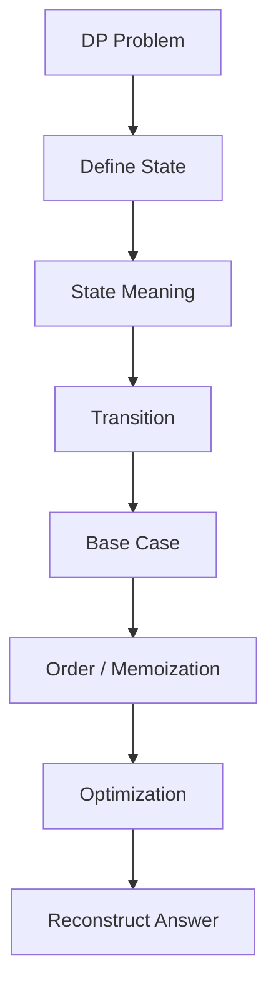

## Frameworks

| Framework | Use |
|---|---|
| Take / not take | subset, knapsack |
| Ending at index | LIS, max subarray variants |
| Matching DP | LCS, edit distance |
| Interval DP | remove/merge/palindrome intervals |
| Game DP | win/lose, optimal play |
| Grid DP | paths in matrix |
| Tree DP | combine child states |
| Digit DP | count numbers with constraints |
| Bitmask DP | assignment/TSP |
| Partition DP | split into K parts |
| Optimization DP | CHT, divide & conquer, monotonic queue |

## Forms + Intuition

| Form | Clue | State idea |
|---|---|---|
| Knapsack | capacity/choose items | `dp[i][w]` |
| Subset sum | possible sum | `dp[i][sum]` |
| LIS | sequence order | `dp[i]=best ending at i` |
| LCS | two strings | `dp[i][j]` |
| Edit distance | transform strings | `dp[i][j]` |
| Interval | choose left/right/cut | `dp[l][r]` |
| Game | players alternate | `dp[l][r]` advantage/win |
| Grid path | move right/down | `dp[r][c]` |
| Tree | children combine | `dp[u][state]` |
| Bitmask | chosen set | `dp[mask]` |
| Digit | number prefix | `dp[pos][tight][state]` |

## C++ Templates

### Memoization Skeleton

```cpp
int rec(State s) {
    if (invalid(s)) return INVALID;
    if (base(s)) return BASE;

    if (seen[s]) return dp[s];
    seen[s] = true;

    int ans = INIT;
    for (auto choice : choices) {
        ans = combine(ans, rec(next(s, choice)));
    }

    return dp[s] = ans;
}
```

### 0/1 Knapsack 1D

```cpp
int knapsack(vector<int>& wt, vector<int>& val, int W) {
    vector<int> dp(W + 1, 0);

    for (int i = 0; i < (int)wt.size(); i++) {
        for (int w = W; w >= wt[i]; w--) {
            dp[w] = max(dp[w], val[i] + dp[w - wt[i]]);
        }
    }

    return dp[W];
}
```

### LIS O(n log n)

```cpp
int lengthOfLIS(vector<int>& a) {
    vector<int> tail;

    for (int x : a) {
        auto it = lower_bound(tail.begin(), tail.end(), x);
        if (it == tail.end()) tail.push_back(x);
        else *it = x;
    }

    return tail.size();
}
```

### LCS

```cpp
int lcs(string a, string b) {
    int n = a.size(), m = b.size();
    vector<vector<int>> dp(n + 1, vector<int>(m + 1, 0));

    for (int i = n - 1; i >= 0; i--) {
        for (int j = m - 1; j >= 0; j--) {
            if (a[i] == b[j]) dp[i][j] = 1 + dp[i + 1][j + 1];
            else dp[i][j] = max(dp[i + 1][j], dp[i][j + 1]);
        }
    }

    return dp[0][0];
}
```

### Interval DP Skeleton

```cpp
for (int len = 1; len <= n; len++) {
    for (int l = 0; l + len - 1 < n; l++) {
        int r = l + len - 1;

        dp[l][r] = initial;
        for (int cut = l; cut < r; cut++) {
            dp[l][r] = best(dp[l][r], dp[l][cut] + dp[cut + 1][r] + cost(l, cut, r));
        }
    }
}
```

## Tactics

| Tactic | Why |
|---|---|
| Always write state meaning | prevents wrong transitions |
| Count states * transitions | complexity proof |
| Base value depends on type | count/min/max/possible |
| Reverse loop for 0/1 knapsack | item used once |
| Forward loop for unbounded | item can repeat |
| If DP too slow, reduce state/transition | optimize |
| Save parent choices | reconstruct answer |

## Practice Ladder

| Level | Problem | Link | Pattern |
|---|---|---|---|
| Easy | Climbing Stairs | https://leetcode.com/problems/climbing-stairs/ | basic DP |
| Easy | Min Cost Climbing Stairs | https://leetcode.com/problems/min-cost-climbing-stairs/ | 1D DP |
| Medium | Coin Change | https://leetcode.com/problems/coin-change/ | unbounded knapsack |
| Medium | House Robber | https://leetcode.com/problems/house-robber/ | take/skip |
| Medium | Longest Increasing Subsequence | https://leetcode.com/problems/longest-increasing-subsequence/ | ending index / binary |
| Medium | Longest Common Subsequence | https://leetcode.com/problems/longest-common-subsequence/ | matching DP |
| Medium | Partition Equal Subset Sum | https://leetcode.com/problems/partition-equal-subset-sum/ | subset sum |
| Hard | Edit Distance | https://leetcode.com/problems/edit-distance/ | matching DP |
| Hard | Burst Balloons | https://leetcode.com/problems/burst-balloons/ | interval DP |
| Hard | Regular Expression Matching | https://leetcode.com/problems/regular-expression-matching/ | string DP |
| Hard | Frog 3 / Convex Hull DP | https://atcoder.jp/contests/dp/tasks/dp_z | DP optimization |

---

# 14. FAANG Pattern Checklist

FAANG interviews heavily repeat these patterns:

| Pattern | Must know problems |
|---|---|
| Hashing | Two Sum, Group Anagrams, Longest Consecutive Sequence |
| Two Pointers | 3Sum, Container With Most Water, Valid Palindrome |
| Sliding Window | Longest Substring Without Repeat, Minimum Window |
| Prefix Sum | Subarray Sum Equals K, Range Sum |
| Binary Search | Koko, Rotated Search, Median Two Sorted Arrays |
| Stack | Valid Parentheses, Daily Temperatures, Largest Rectangle |
| Heap | Top K Frequent, Merge K Lists, Median Finder |
| Backtracking | Subsets, Permutations, Combination Sum, N-Queens |
| BFS/DFS | Islands, Rotten Oranges, Word Ladder |
| Graph Topo | Course Schedule |
| Tree DFS | LCA, Diameter, Path Sum |
| DP | Coin Change, LIS, LCS, Edit Distance, House Robber |

## FAANG Speed Rule

```text
First 5 minutes:
1. State brute force.
2. State bottleneck.
3. Name optimized pattern.
4. Explain invariant.
5. Code cleanly.
```

---

# 15. Candidate Master Competitive Programming Checklist

To approach Candidate Master level, add these beyond interview patterns:

| Category | Must master |
|---|---|
| Implementation | STL, sorting, maps, sets, heaps |
| Math | gcd, modular arithmetic, combinatorics, primes |
| Binary Search | answer search, kth value, real search |
| Greedy | exchange arguments, sorting by key |
| Prefix/Contribution | subarray, pairs, combinatorics |
| Graph | BFS/DFS, topo, shortest paths, MST, SCC, bridges |
| Tree | LCA, Euler, tree DP, rerooting |
| DSU | rollback/offline, MST |
| DP | knapsack, LIS, digit, bitmask, interval, tree |
| Advanced | Fenwick, segment tree, lazy, sparse table |
| String | KMP/Z, trie, rolling hash |
| Geometry | orientation, convex hull basics |

## Contest Training Path

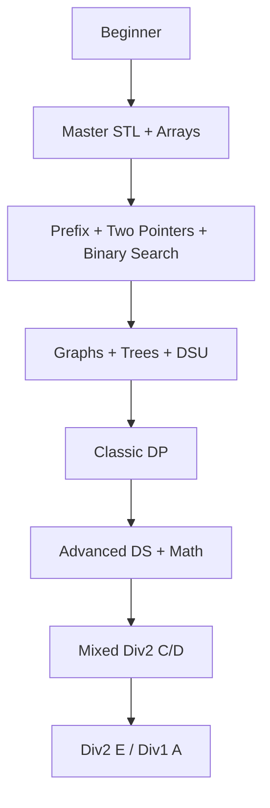

Recommended grind:

| Stage | Focus | Target |
|---|---|---|
| Stage 1 | LeetCode Easy/Medium + CSES Intro | fast implementation |
| Stage 2 | CSES Sorting/Search, DP, Graph | pattern coverage |
| Stage 3 | Codeforces Div2 A-C | speed |
| Stage 4 | Codeforces Div2 C-D | proof + implementation |
| Stage 5 | AtCoder ABC/ARC + CSES Advanced | depth |
| Stage 6 | Virtual contests + upsolve | rating growth |

---

# 16. One-Page Pattern Recognition Table

| Problem clue | Pattern |
|---|---|
| repeated static range sum | prefix sum |
| many range add, final answer | difference array |
| subarray sum K with negatives | prefix + hash map |
| positive array, longest/shortest valid subarray | sliding window |
| sorted pair/triplet target | two pointers |
| minimum possible maximum | binary search answer |
| largest minimum distance | binary search answer |
| nearest greater/smaller | monotonic stack |
| min/max every window | monotonic deque |
| kth/top frequent | heap/hash map |
| dynamic median | two multisets/heaps |
| all subsets and `n <= 20` | bitmask/backtracking |
| pairs cancel | XOR |
| maximum XOR | trie/high-bit greedy |
| grid shortest path | BFS |
| weighted shortest path | Dijkstra |
| dependencies/order | topological sort |
| connectivity edge additions | DSU |
| tree path query | LCA/binary lifting |
| subtree query | Euler tour |
| repeated choices with optimal/count answer | DP |
| split array/string into parts | partition DP |
| two strings matching | LCS/edit distance DP |
| choose from interval ends/cuts | interval DP |
| number with digit constraints | digit DP |

---

# Final Mental Hook

```text
Do not memorize solutions.
Memorize shapes.

Range -> prefix/Fenwick/segment tree
Window -> two pointers/deque/map
Monotonic answer -> binary search
Relationship -> graph/tree/DSU
Repeated state -> DP
Small subset -> bitmask/backtracking
All pairs impossible -> contribution
```
