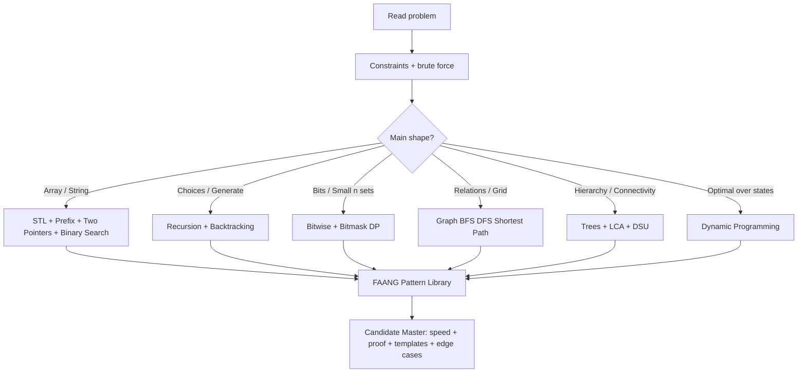

# C++ DSA / CP / FAANG Interview Master Roadmap

Source base: uploaded STL, Prefix Sum, Binary Search, Two Pointers, Bitwise, Recursion/Backtracking, Graph, Tree/DSU, and DP notes.

## Master Mermaid Diagram



## Ordered Topic Roadmap

| Order | Topic | Concepts | Framework | Problem Forms | Tactics | C++ Templates | Level |
|---:|---|---|---|---|---|---|---|
|0|Problem Solving Core|Constraints, complexity, brute force, bottleneck|Brute → reject → pattern|Any CP/FAANG problem|Estimate complexity first, write invariant|C++17 setup, fast IO, dry run table|Candidate|
|1|STL + Hashing + Stack/Queue/Heap|vector, string, pair, map, unordered_map, set, multiset, stack, queue, deque, priority_queue|Operation-to-container decision|Frequency, top-k, dynamic median, brackets, intervals|Store indices; erase one multiset copy; lazy heap deletion|fast IO, map freq, heap pair, stack parser|Candidate|
|2|Prefix Sum + Difference|1D/2D prefix, diff array, prefix frequency|Static query / offline update / prefix+map|range sum, subarray sum K, rectangle sum, range add|Use 1-index prefix; long long; inclusion-exclusion|buildPrefix, rangeSum, 2D prefix, diff apply|Candidate|
|3|Two Pointers + Sliding Window|opposite ends, same direction, fixed/variable window|Maintain valid window invariant|pair sum, 3Sum, longest/shortest subarray, at-most/exact-K|Sort first; exact K = atMost(K)-atMost(K-1)|twoSumSorted, expandShrink, atMostK|FAANG frequent|
|4|Binary Search|search space, monotonic predicate, first true, last true|Answer = boundary; write check(mid)|sorted search, rotated, minimize max, maximize min, kth value|Safe mid; prove monotonic; choose bounds|firstTrue, lastTrue, lowerBound, real BS|FAANG frequent|
|5|Bitwise + Bitmask|operators, masks as sets, XOR, bit contribution, trie|Column-wise bits / high-to-low greedy / mask DP|single number, subsets, max XOR, range XOR, TSP mask|Use 1LL<<i; count bits by column; prefix XOR|bit helpers, submask loop, XOR trie skeleton|Candidate Master|
|6|Recursion + Backtracking|base case, recursion tree, choices, pruning, LCCM|Level-Choice-Check-Move|subsets, permutations, combinations, N-Queens, sudoku|Apply → recurse → undo; sort to skip duplicates|universal dfs, include/exclude, board template|FAANG frequent|
|7|Graphs|nodes/edges, directed, weighted, components, state graph|Formulate graph then choose algorithm|BFS/DFS, topo, cycle, bipartite, shortest path, MST, SCC|Grid as graph; multi-source BFS; Dijkstra for positive weights|adj list, BFS, DFS, Kahn, Dijkstra, DSU|Candidate Master|
|8|Trees + LCA + DSU|rooted tree, depth, subtree, diameter, binary lifting, DSU|Root/DFS preprocess; path vs subtree; component manager|subtree query, LCA, kth ancestor, distance, MST, reverse deletion|Euler tour converts subtree to range; DSU cannot delete → reverse time|tree dfs, Euler, LCA, DSU|Candidate Master|
|9|Dynamic Programming|state, transition, base, memo/tabulation, optimization|State meaning → transition → order → answer|knapsack, LIS, matching, interval, game, grid, digit, tree, bitmask|Start with recursion; cache; compress space when safe|memo template, tabulation, interval DP, bitmask DP|FAANG + CM|

## Pattern Recognition Cheat Table

| Problem clue | Pattern | Intuition | Tactic |
|---|---|---|---|
|Range sum/static query|Prefix sum|Build prefix once; answer by subtraction|Use long long, 1-index prefix|
|Many range updates, final array|Difference array|Mark boundaries, prefix reconstruct|diff[r+1] -= x boundary check|
|Subarray sum equals K|Prefix + hash map|current - old = K|Initialize freq[0]=1|
|Positive subarray/window|Sliding window|Expand right, shrink left|Works best with monotonic validity|
|Pair/triplet sorted|Two pointers|Move side that can be safely discarded|Sort first; skip duplicates|
|Minimum possible maximum|Binary search answer|Guess limit; check feasible|Find first true|
|Maximum possible minimum|Binary search answer|Guess gap; greedily check|Find last true|
|All subsets/small n|Bitmask/backtracking|Each item take or skip|n<=20 is common|
|XOR uniqueness|Bitwise XOR|Equal pairs cancel|XOR is associative|
|Generate all valid objects|Backtracking|Try, validate, undo|Prune early|
|Unweighted shortest path|BFS|Layer expansion gives shortest steps|queue + dist|
|Weighted positive shortest path|Dijkstra|Relax with min heap|Use long long INF|
|Dependencies/order|Topological sort|Indegree zero first|Cycle if processed < n|
|Subtree query|Euler tour + Fenwick/segment tree|Subtree becomes contiguous range|tin/tout|
|Path query tree|LCA / binary lifting|Split path at LCA|dist = du+dv-2dlca|
|Dynamic connectivity additions|DSU|Merge components|Path compression + union by size|
|Optimization with overlapping states|DP|State + transition + base|Write recursion first|

## 10 Easy Problems

| # | Topic | Problem | Link | Pattern/Form | Intuition |
|---:|---|---|---|---|---|
| 1 | Arrays/STL | Two Sum | [Open](https://leetcode.com/problems/two-sum/) | Hash map lookup | Store seen values; ask what complement is needed. |
| 2 | Stack | Valid Parentheses | [Open](https://leetcode.com/problems/valid-parentheses/) | Stack / depth | Open waits to be closed; mismatch breaks validity. |
| 3 | Prefix Sum | Range Sum Query - Immutable | [Open](https://leetcode.com/problems/range-sum-query-immutable/) | 1D prefix | Precompute once; answer range by subtraction. |
| 4 | Two Pointers | Valid Palindrome | [Open](https://leetcode.com/problems/valid-palindrome/) | Opposite ends | Compare and discard symmetric safe pairs. |
| 5 | Sliding Window | Best Time to Buy and Sell Stock | [Open](https://leetcode.com/problems/best-time-to-buy-and-sell-stock/) | Running minimum | Best sell today uses smallest price before today. |
| 6 | Binary Search | Binary Search | [Open](https://leetcode.com/problems/binary-search/) | Classic search | Sorted input lets you discard half. |
| 7 | Bitwise | Single Number | [Open](https://leetcode.com/problems/single-number/) | XOR cancellation | x ^ x = 0 and x ^ 0 = x. |
| 8 | Recursion | Fibonacci Number | [Open](https://leetcode.com/problems/fibonacci-number/) | Base + recurrence | Current answer depends on smaller answers. |
| 9 | Graph/Grid | Flood Fill | [Open](https://leetcode.com/problems/flood-fill/) | DFS/BFS grid | Cells are nodes; 4-neighbour moves are edges. |
| 10 | Tree | Maximum Depth of Binary Tree | [Open](https://leetcode.com/problems/maximum-depth-of-binary-tree/) | Tree DFS | Depth = 1 + max child depth. |

## 20 Medium Problems

| # | Topic | Problem | Link | Pattern/Form | Intuition |
|---:|---|---|---|---|---|
| 1 | Arrays/STL | Group Anagrams | [Open](https://leetcode.com/problems/group-anagrams/) | Hashing canonical form | Same sorted/signature key means same group. |
| 2 | Prefix Sum | Subarray Sum Equals K | [Open](https://leetcode.com/problems/subarray-sum-equals-k/) | Prefix + frequency map | Need previous prefix = current - k. |
| 3 | Prefix/2D | Range Sum Query 2D - Immutable | [Open](https://leetcode.com/problems/range-sum-query-2d-immutable/) | 2D prefix | Rectangle = big area - left - top + overlap. |
| 4 | Two Pointers | 3Sum | [Open](https://leetcode.com/problems/3sum/) | Sort + fix + two pointers | Fix one number, solve two-sum on remaining sorted range. |
| 5 | Sliding Window | Longest Substring Without Repeating Characters | [Open](https://leetcode.com/problems/longest-substring-without-repeating-characters/) | Variable window | Maintain window with unique characters. |
| 6 | Sliding Window | Minimum Size Subarray Sum | [Open](https://leetcode.com/problems/minimum-size-subarray-sum/) | Expand-shrink positive window | Expand until valid, shrink to improve. |
| 7 | Binary Search | Search in Rotated Sorted Array | [Open](https://leetcode.com/problems/search-in-rotated-sorted-array/) | Binary search with sorted half | One side is always sorted. |
| 8 | Binary Search Answer | Koko Eating Bananas | [Open](https://leetcode.com/problems/koko-eating-bananas/) | Minimize feasible speed | If speed works, higher speed also works. |
| 9 | Binary Search Answer | Capacity To Ship Packages Within D Days | [Open](https://leetcode.com/problems/capacity-to-ship-packages-within-d-days/) | Minimize maximum | Guess capacity; greedily count days. |
| 10 | Bitwise | Subsets | [Open](https://leetcode.com/problems/subsets/) | Bitmask / backtracking | Every element is take or skip. |
| 11 | Bitwise/Trie | Maximum XOR of Two Numbers in an Array | [Open](https://leetcode.com/problems/maximum-xor-of-two-numbers-in-an-array/) | High-bit greedy / trie | Prefer opposite bit to maximize XOR. |
| 12 | Backtracking | Combination Sum | [Open](https://leetcode.com/problems/combination-sum/) | Choice recursion | Try candidate, recurse, undo. |
| 13 | Backtracking | Generate Parentheses | [Open](https://leetcode.com/problems/generate-parentheses/) | Constraint backtracking | Open count cannot exceed n; close cannot exceed open. |
| 14 | Backtracking | Permutations | [Open](https://leetcode.com/problems/permutations/) | Used array DFS | Each level selects one unused element. |
| 15 | Graph | Number of Islands | [Open](https://leetcode.com/problems/number-of-islands/) | Grid DFS/BFS | Start flood fill whenever new land appears. |
| 16 | Graph | Course Schedule | [Open](https://leetcode.com/problems/course-schedule/) | Topological sort / cycle | Dependency graph must be DAG. |
| 17 | Graph | Rotting Oranges | [Open](https://leetcode.com/problems/rotting-oranges/) | Multi-source BFS | All rotten cells start BFS at time 0. |
| 18 | Tree/DSU | Number of Connected Components in an Undirected Graph | [Open](https://leetcode.com/problems/number-of-connected-components-in-an-undirected-graph/) | DSU / DFS components | Merge edges; count remaining representatives. |
| 19 | DP | House Robber | [Open](https://leetcode.com/problems/house-robber/) | Take / skip DP | At each house choose rob or skip. |
| 20 | DP | Longest Increasing Subsequence | [Open](https://leetcode.com/problems/longest-increasing-subsequence/) | Ending-at-index / patience | Track best tail for each length. |

## 10 Hard Problems

| # | Topic | Problem | Link | Pattern/Form | Intuition |
|---:|---|---|---|---|---|
| 1 | Sliding Window | Minimum Window Substring | [Open](https://leetcode.com/problems/minimum-window-substring/) | Need-cover window | Expand until all required chars covered; shrink to minimum. |
| 2 | Monotonic Stack | Largest Rectangle in Histogram | [Open](https://leetcode.com/problems/largest-rectangle-in-histogram/) | Nearest smaller | Each bar is limiting height over maximal span. |
| 3 | Heap/Graph | Merge k Sorted Lists | [Open](https://leetcode.com/problems/merge-k-sorted-lists/) | Min-heap | Always take smallest head among k lists. |
| 4 | Binary Search Answer | Median of Two Sorted Arrays | [Open](https://leetcode.com/problems/median-of-two-sorted-arrays/) | Partition binary search | Find partition where left side <= right side. |
| 5 | Graph | Word Ladder | [Open](https://leetcode.com/problems/word-ladder/) | BFS state graph | Words are nodes; one-letter change is edge. |
| 6 | Graph | Network Delay Time | [Open](https://leetcode.com/problems/network-delay-time/) | Dijkstra | Weighted shortest paths from source. |
| 7 | Tree | Binary Tree Maximum Path Sum | [Open](https://leetcode.com/problems/binary-tree-maximum-path-sum/) | Tree DP | Return best downward path; update global split path. |
| 8 | DP | Edit Distance | [Open](https://leetcode.com/problems/edit-distance/) | Matching DP | Insert/delete/replace consume string indices. |
| 9 | DP | Burst Balloons | [Open](https://leetcode.com/problems/burst-balloons/) | Interval DP | Choose last balloon in interval. |
| 10 | DP/Bitmask | Shortest Path Visiting All Nodes | [Open](https://leetcode.com/problems/shortest-path-visiting-all-nodes/) | BFS over mask state | State = node + visited mask. |

## Universal C++ Template

```cpp
#include <bits/stdc++.h>
using namespace std;

using ll = long long;
const ll INF = (1LL << 60);

int main() {
    ios::sync_with_stdio(false);
    cin.tie(nullptr);

    // read input
    // identify form
    // apply template
    // dry run edge cases

    return 0;
}
```

## Core Templates

### Prefix Sum

```cpp
vector<long long> buildPrefix(const vector<long long>& a) {
    int n = a.size();
    vector<long long> pref(n + 1, 0);
    for (int i = 1; i <= n; i++) pref[i] = pref[i - 1] + a[i - 1];
    return pref;
}
long long rangeSum(const vector<long long>& pref, int l, int r) {
    return pref[r + 1] - pref[l];
}
```

### Binary Search: First True

```cpp
long long firstTrue(long long lo, long long hi) {
    long long ans = hi + 1;
    while (lo <= hi) {
        long long mid = lo + (hi - lo) / 2;
        if (check(mid)) ans = mid, hi = mid - 1;
        else lo = mid + 1;
    }
    return ans;
}
```

### Sliding Window

```cpp
int left = 0;
for (int right = 0; right < n; right++) {
    add(a[right]);
    while (!valid()) {
        remove(a[left]);
        left++;
    }
    update_answer(left, right);
}
```

### Backtracking LCCM

```cpp
void dfs(int level) {
    if (base_case()) {
        save_answer();
        return;
    }
    for (auto choice : choices(level)) {
        if (!valid(choice)) continue;
        apply(choice);
        dfs(level + 1);
        undo(choice);
    }
}
```

### BFS

```cpp
queue<int> q;
vector<int> dist(n + 1, -1);
dist[src] = 0;
q.push(src);

while (!q.empty()) {
    int u = q.front(); q.pop();
    for (int v : g[u]) {
        if (dist[v] == -1) {
            dist[v] = dist[u] + 1;
            q.push(v);
        }
    }
}
```

### Dijkstra

```cpp
vector<long long> dist(n + 1, INF);
priority_queue<pair<ll,int>, vector<pair<ll,int>>, greater<pair<ll,int>>> pq;
dist[src] = 0;
pq.push({0, src});

while (!pq.empty()) {
    auto [du, u] = pq.top(); pq.pop();
    if (du != dist[u]) continue;
    for (auto [v, w] : g[u]) {
        if (dist[v] > du + w) {
            dist[v] = du + w;
            pq.push({dist[v], v});
        }
    }
}
```

### DSU

```cpp
struct DSU {
    vector<int> parent, sz;
    DSU(int n) : parent(n + 1), sz(n + 1, 1) {
        iota(parent.begin(), parent.end(), 0);
    }
    int find(int x) {
        if (parent[x] == x) return x;
        return parent[x] = find(parent[x]);
    }
    bool merge(int a, int b) {
        a = find(a), b = find(b);
        if (a == b) return false;
        if (sz[a] < sz[b]) swap(a, b);
        parent[b] = a;
        sz[a] += sz[b];
        return true;
    }
};
```

### DP Skeleton

```cpp
int rec(int state) {
    if (base_case) return base_value;
    if (dp[state] != UNKNOWN) return dp[state];

    int ans = initial;
    for (auto choice : choices) {
        ans = combine(ans, rec(next_state));
    }
    return dp[state] = ans;
}
```

## 12-Week Master Plan

| Week | Focus | Deliverable |
|---:|---|---|
| 1 | C++ STL + complexity + hashing + stack/queue/heap | Solve 10 easy + rewrite templates |
| 2 | Prefix sum + difference + prefix map | Solve range/subarray problems |
| 3 | Two pointers + sliding window | Solve all medium window forms |
| 4 | Binary search + answer search | Master first true/last true/check(mid) |
| 5 | Bitwise + bitmask | Subsets, XOR, trie, contribution |
| 6 | Recursion + backtracking | Subsets/permutations/combinations/boards |
| 7 | Graph basics | BFS, DFS, grid, components, cycle |
| 8 | Graph advanced | Topo, Dijkstra, 0-1 BFS, MST, SCC |
| 9 | Trees + DSU | DFS values, Euler, LCA, DSU |
| 10 | DP basics | Take/skip, ending index, grid, matching |
| 11 | DP advanced | Interval, game, bitmask, tree DP |
| 12 | FAANG mocks | Timed mixed sets + explain intuition aloud |

## Interview Answer Script

1. Restate the problem and constraints.
2. Give brute force and why it fails.
3. Name the pattern.
4. Explain invariant/check/state.
5. Give complexity.
6. Code clean template.
7. Test edge cases aloud.
