# Ultimate C++ CP Contest + FAANG Interview Pattern Guide

> Goal: become fast at recognizing patterns in contests, online assessments, and FAANG interviews; choose the right framework; write correct C++ templates; and train from newbie → LeetCode Guardian / strong FAANG interviewer → Codeforces Candidate Master.

This guide merges the uploaded topic notes into one ordered roadmap: **Concepts → Frameworks → Forms → Tactics → Templates → Practice Problems**.

---

## Clickable Index

1. [How to Use This Guide](#1-how-to-use-this-guide)
2. [Global Pattern Recognition Map](#2-global-pattern-recognition-map)
3. [Level Roadmap: Newbie to Candidate Master / LC Guardian](#3-level-roadmap-newbie-to-candidate-master--lc-guardian)
4. [Core C++ Template](#4-core-c-template)
5. [Topic 01: STL + Complexity + Implementation](#topic-01-stl--complexity--implementation)
6. [Topic 02: Prefix Sum + Difference Array](#topic-02-prefix-sum--difference-array)
7. [Topic 03: Binary Search](#topic-03-binary-search)
8. [Topic 04: Two Pointers + Sliding Window](#topic-04-two-pointers--sliding-window)
9. [Topic 05: Stack, Monotonic Stack, Queue, Deque, Heap](#topic-05-stack-monotonic-stack-queue-deque-heap)
10. [Topic 06: Bit Manipulation + XOR + Bitmask](#topic-06-bit-manipulation--xor--bitmask)
11. [Topic 07: Recursion + Backtracking](#topic-07-recursion--backtracking)
12. [Topic 08: Graphs](#topic-08-graphs)
13. [Topic 09: Trees + LCA + Binary Lifting + DSU](#topic-09-trees--lca--binary-lifting--dsu)
14. [Topic 10: Dynamic Programming](#topic-10-dynamic-programming)
15. [Topic 11: Greedy + Sorting + Intervals](#topic-11-greedy--sorting--intervals)
16. [Topic 12: Range Queries: Fenwick + Segment Tree + Sparse Table](#topic-12-range-queries-fenwick--segment-tree--sparse-table)
17. [Topic 13: Math, Modular Arithmetic, Number Theory, Combinatorics](#topic-13-math-modular-arithmetic-number-theory-combinatorics)
18. [Master Practice Matrix by Topic and Difficulty](#18-master-practice-matrix-by-topic-and-difficulty)
19. [FAANG Pattern Practice List](#19-faang-pattern-practice-list)
20. [Candidate Master CP Practice List](#20-candidate-master-cp-practice-list)
21. [Final Recognition Cheat Sheet](#21-final-recognition-cheat-sheet)
22. [Technique + Tactic Deep Dive](#22-technique--tactic-deep-dive-how-to-do-it-in-contestoa)
23. [Ultimate Problem Bank by Topic, Difficulty, Pattern, and Intuition](#23-ultimate-problem-bank-by-topic-difficulty-pattern-and-intuition)
24. [Contest/OA Pattern Recognition Drill Sheet](#24-contestoa-pattern-recognition-drill-sheet)

---

## 1. How to Use This Guide

For each topic:

1. Read **concept**.
2. Memorize **framework**.
3. Learn **forms**.
4. Apply **tactics**.
5. Code the **template** from memory.
6. Solve Easy → Medium → Hard.
7. For every solved problem, write:
   - pattern clue
   - invariant
   - why brute force fails
   - final complexity

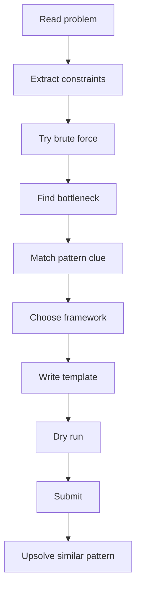

---

## 2. Global Pattern Recognition Map

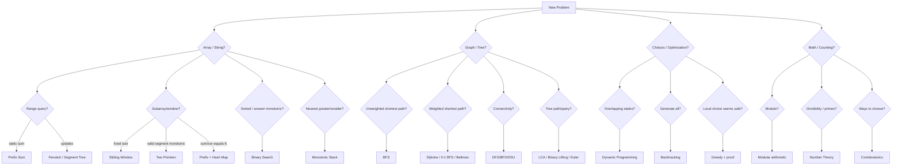

---

## 3. Level Roadmap: Newbie to Candidate Master / LC Guardian

| Level | Target | What to master | Typical difficulty |
|---|---|---|---|
| Newbie | write correct C++ fast | STL, loops, sorting, maps, prefix | CF 800-1000 / LC Easy |
| Beginner | pattern recognition | two pointers, binary search, stack, BFS/DFS | CF 1000-1300 / LC Easy-Medium |
| Intermediate | reusable frameworks | DP basics, Dijkstra, DSU, segment tree, math mod | CF 1300-1600 / LC Medium |
| Advanced | contest speed | tree DP, digit DP, bitmask DP, combinatorics, greedy proof | CF 1600-1900 / LC Medium-Hard |
| Candidate Master push | solve under pressure | advanced graph, DP optimization, constructive, number theory | CF 1900-2200+ / LC Hard |

---

## 4. Core C++ Template

```cpp
#include <bits/stdc++.h>
using namespace std;

using ll = long long;
using pii = pair<int,int>;
using pll = pair<long long,long long>;

const ll INF = 4e18;
const int MOD = 1e9 + 7;

#define all(x) (x).begin(), (x).end()

void solve() {
    // read input
}

int main() {
    ios::sync_with_stdio(false);
    cin.tie(nullptr);

    int T = 1;
    // cin >> T;
    while (T--) solve();
    return 0;
}
```

---

# Topic 01: STL + Complexity + Implementation

## Concepts

| Concept | Meaning | Recognition clue |
|---|---|---|
| Complexity first | choose algorithm by constraints | `n <= 2e5` means O(n log n) or O(n) |
| STL containers | store data according to operations | need sorted? use set/map; need frequency? map/unordered_map |
| Iterators | access STL elements | erase carefully from set/multiset |
| Custom sort | encode greedy/order rule | intervals, pairs, sorting by end/time/value |

## Framework

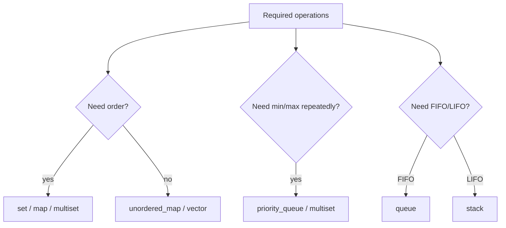

## Forms + Tactics

| Form | Use | Tactic | Template idea |
|---|---|---|---|
| Frequency counting | duplicates, anagrams, modes | `unordered_map<T,int>` | increment/decrement |
| Sorted unique | dynamic order | `set` | lower_bound |
| Sorted duplicates | erase one copy | `multiset` | `ms.erase(ms.find(x))` |
| Top K | repeated best | heap or two multisets | lazy deletion if needed |
| Intervals | overlap/merge/sweep | sort by start or end | scan once |

## C++ Template: Safe Multiset Erase

```cpp
void eraseOne(multiset<int>& ms, int x) {
    auto it = ms.find(x);
    if (it != ms.end()) ms.erase(it);
}
```

---

# Topic 02: Prefix Sum + Difference Array

## Concepts

| Concept | Meaning | Pattern clue |
|---|---|---|
| Prefix sum | precompute cumulative sums | repeated static range sum |
| Difference array | delayed range updates | many range add operations, final array needed |
| Prefix + hash map | count subarrays | subarray sum equals K / modulo K |
| 2D prefix | rectangle query | grid sum queries |

## Framework

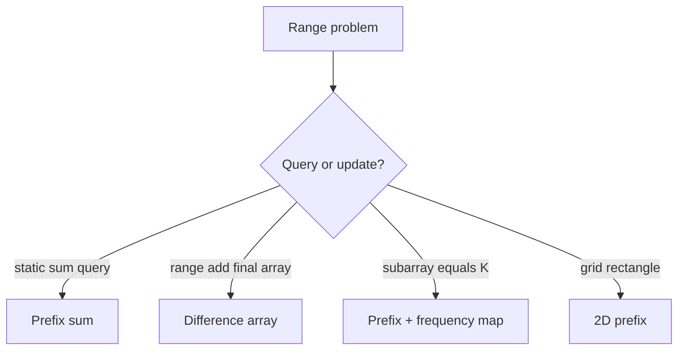

## Forms + Intuition

| Form | Formula / invariant | Intuition |
|---|---|---|
| Range sum `[l,r]` | `pref[r+1]-pref[l]` | subtract part before `l` |
| Subarray sum K | need previous `pref = cur-K` | every previous prefix creates one subarray |
| Divisible by K | same remainder | difference of same remainder divisible by K |
| Range add `[l,r]+=x` | `diff[l]+=x, diff[r+1]-=x` | start effect at `l`, cancel after `r` |
| 2D rectangle | inclusion-exclusion | big rectangle - extra strips + double removed corner |

## C++ Template: Prefix + Hash Count

```cpp
long long countSubarraySumK(vector<int>& a, long long K) {
    unordered_map<long long,long long> freq;
    freq[0] = 1;
    long long pref = 0, ans = 0;

    for (int x : a) {
        pref += x;
        ans += freq[pref - K];
        freq[pref]++;
    }
    return ans;
}
```

## Practice

| Difficulty | Problem | Link | Pattern | Intuition |
|---|---|---|---|---|
| Easy | Range Sum Query Immutable | https://leetcode.com/problems/range-sum-query-immutable/ | 1D prefix | Build once, answer many queries |
| Easy | Running Sum of 1d Array | https://leetcode.com/problems/running-sum-of-1d-array/ | prefix build | each element accumulates previous |
| Medium | Subarray Sum Equals K | https://leetcode.com/problems/subarray-sum-equals-k/ | prefix + hash | current prefix needs old `cur-k` |
| Medium | Continuous Subarray Sum | https://leetcode.com/problems/continuous-subarray-sum/ | prefix modulo | same modulo means divisible segment |
| Medium | Product of Array Except Self | https://leetcode.com/problems/product-of-array-except-self/ | prefix/suffix contribution | left product × right product |
| Hard | Count of Range Sum | https://leetcode.com/problems/count-of-range-sum/ | prefix + merge sort/tree | count previous prefixes in range |
| CP | CSES Static Range Sum Queries | https://cses.fi/problemset/task/1646 | prefix | static sum queries |
| CP | CSES Forest Queries | https://cses.fi/problemset/task/1652 | 2D prefix | rectangle tree count |

---

# Topic 03: Binary Search

## Concepts

| Concept | Meaning | Pattern clue |
|---|---|---|
| Classic binary search | find value in sorted domain | sorted array |
| First true | `false false true true` | minimum feasible answer |
| Last true | `true true false false` | maximum feasible answer |
| Binary search on answer | guess answer + check feasibility | minimize max / maximize min |
| Real binary search | continuous answer | precision / geometry / average |

## Framework

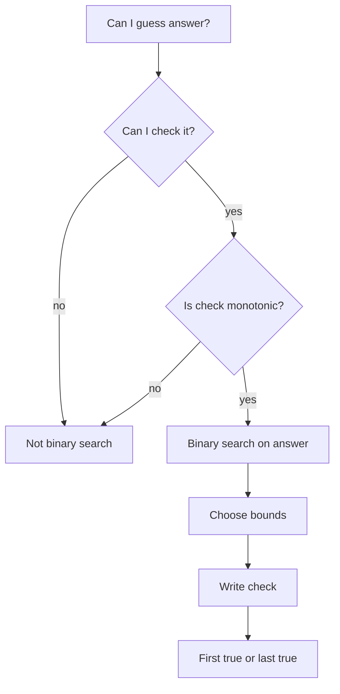

## Forms + Intuition

| Form | Template | Intuition |
|---|---|---|
| First true | minimize feasible | once possible, bigger may also be possible |
| Last true | maximize feasible | once impossible, bigger may remain impossible |
| Lower bound | first `>= x` | boundary between `<x` and `>=x` |
| Minimize maximum | `check(maxAllowed)` | lower max gives harder condition |
| Maximize minimum | `check(minGap)` | larger gap gives harder condition |

## C++ Template: First True

```cpp
long long firstTrue(long long lo, long long hi, function<bool(long long)> check) {
    long long ans = hi + 1;
    while (lo <= hi) {
        long long mid = lo + (hi - lo) / 2;
        if (check(mid)) ans = mid, hi = mid - 1;
        else lo = mid + 1;
    }
    return ans;
}
```

## Practice

| Difficulty | Problem | Link | Pattern | Intuition |
|---|---|---|---|---|
| Easy | Binary Search | https://leetcode.com/problems/binary-search/ | classic | discard half |
| Easy | Search Insert Position | https://leetcode.com/problems/search-insert-position/ | lower bound | first position `>= target` |
| Medium | Koko Eating Bananas | https://leetcode.com/problems/koko-eating-bananas/ | minimize speed | speed feasible is monotonic |
| Medium | Capacity To Ship Packages | https://leetcode.com/problems/capacity-to-ship-packages-within-d-days/ | minimize capacity | bigger capacity never worse |
| Medium | Find Minimum in Rotated Sorted Array | https://leetcode.com/problems/find-minimum-in-rotated-sorted-array/ | rotated boundary | compare mid with right |
| Hard | Median of Two Sorted Arrays | https://leetcode.com/problems/median-of-two-sorted-arrays/ | binary partition | partition left/right halves |
| CP | CSES Factory Machines | https://cses.fi/problemset/task/1620 | first true answer | minimum time to make T products |
| CP | CSES Subarray Sum II | https://cses.fi/problemset/task/1661 | prefix / sorted count | count target sums |

---

# Topic 04: Two Pointers + Sliding Window

## Concepts

| Concept | Meaning | Pattern clue |
|---|---|---|
| Opposite ends | left/right shrink from ends | sorted pair, palindrome, container |
| Same direction | `r` expands, `l` shrinks | longest/shortest valid subarray |
| Fixed window | exact length K | maximum sum of K elements |
| Variable window | maintain invariant | at most K, sum ≤ S, unique chars |
| Exact K via at most | `exact(K)=atMost(K)-atMost(K-1)` | exactly K distinct/odds |

## Framework

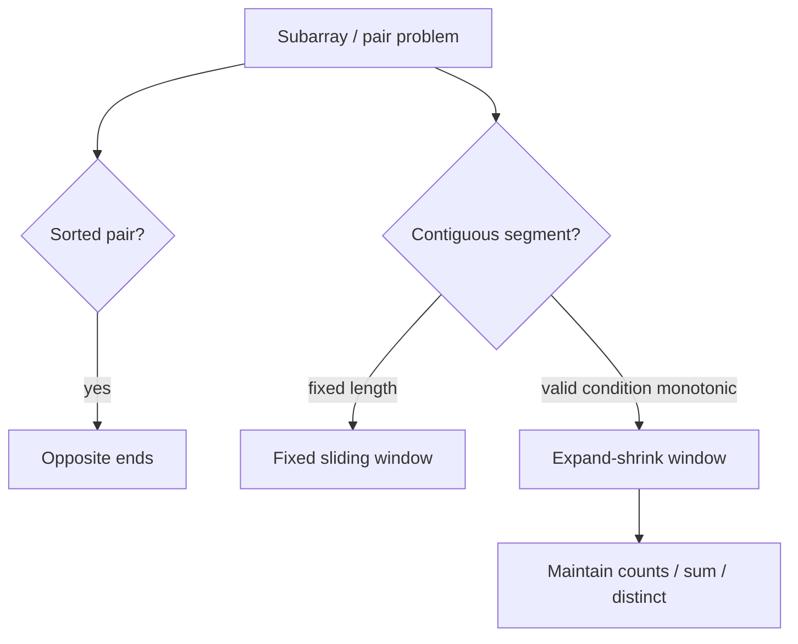

## Forms + Intuition

| Form | Movement rule | Intuition |
|---|---|---|
| Two sum sorted | sum too big → `r--`, small → `l++` | discard impossible side |
| Longest at most K | expand right; while invalid shrink left | every pointer moves at most n |
| Minimum window | shrink while still valid | keep smallest valid segment |
| Count subarrays at most K | add `r-l+1` | every suffix ending at `r` is valid |
| 3Sum | sort, fix i, two pointers | reduce 3D search to 2D |

## C++ Template: Variable Window

```cpp
int longestAtMostKDistinct(string s, int K) {
    unordered_map<char,int> cnt;
    int l = 0, ans = 0;
    for (int r = 0; r < (int)s.size(); r++) {
        cnt[s[r]]++;
        while ((int)cnt.size() > K) {
            if (--cnt[s[l]] == 0) cnt.erase(s[l]);
            l++;
        }
        ans = max(ans, r - l + 1);
    }
    return ans;
}
```

## Practice

| Difficulty | Problem | Link | Pattern | Intuition |
|---|---|---|---|---|
| Easy | Valid Palindrome | https://leetcode.com/problems/valid-palindrome/ | opposite ends | skip non-alnum and compare |
| Easy | Merge Sorted Array | https://leetcode.com/problems/merge-sorted-array/ | two pointers from end | avoid overwriting |
| Medium | 3Sum | https://leetcode.com/problems/3sum/ | fix + two pointers | sorted duplicate control |
| Medium | Longest Substring Without Repeating Characters | https://leetcode.com/problems/longest-substring-without-repeating-characters/ | window + set/map | shrink until unique |
| Medium | Minimum Size Subarray Sum | https://leetcode.com/problems/minimum-size-subarray-sum/ | variable window | positive sum monotonic |
| Hard | Minimum Window Substring | https://leetcode.com/problems/minimum-window-substring/ | need-count window | shrink valid window |
| Hard | Sliding Window Median | https://leetcode.com/problems/sliding-window-median/ | two multisets | maintain lower/upper halves |
| CP | CSES Sum of Two Values | https://cses.fi/problemset/task/1640 | sort + two pointers/hash | find pair sum |
| CP | CSES Sum of Three Values | https://cses.fi/problemset/task/1641 | fix + two pointers | reduce dimension |

---

# Topic 05: Stack, Monotonic Stack, Queue, Deque, Heap

## Concepts

| Structure | Use | Pattern clue |
|---|---|---|
| Stack | nested / undo / previous unresolved | brackets, path simplification |
| Monotonic stack | nearest greater/smaller | next greater, stock span, histogram |
| Queue | BFS / FIFO | levels, shortest unweighted path |
| Deque | min/max sliding window, 0-1 BFS | window extrema, edge cost 0/1 |
| Heap | repeated min/max | k closest, scheduling, Dijkstra |

## Framework

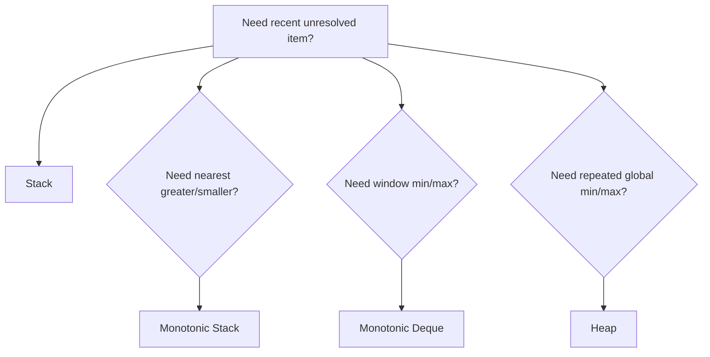

## C++ Template: Monotonic Stack Next Greater

```cpp
vector<int> nextGreater(vector<int>& a) {
    int n = a.size();
    vector<int> ans(n, -1), st;
    for (int i = 0; i < n; i++) {
        while (!st.empty() && a[st.back()] < a[i]) {
            ans[st.back()] = a[i];
            st.pop_back();
        }
        st.push_back(i);
    }
    return ans;
}
```

## Practice

| Difficulty | Problem | Link | Pattern | Intuition |
|---|---|---|---|---|
| Easy | Valid Parentheses | https://leetcode.com/problems/valid-parentheses/ | stack | close must match latest open |
| Easy | Min Stack | https://leetcode.com/problems/min-stack/ | auxiliary stack | store current minimum |
| Medium | Daily Temperatures | https://leetcode.com/problems/daily-temperatures/ | monotonic stack | resolve colder days when warmer appears |
| Medium | Online Stock Span | https://leetcode.com/problems/online-stock-span/ | monotonic stack | compress previous smaller prices |
| Medium | Top K Frequent Elements | https://leetcode.com/problems/top-k-frequent-elements/ | heap/bucket | frequency ranking |
| Hard | Largest Rectangle in Histogram | https://leetcode.com/problems/largest-rectangle-in-histogram/ | monotonic stack | bar extends until smaller sides |
| Hard | Sliding Window Maximum | https://leetcode.com/problems/sliding-window-maximum/ | monotonic deque | keep candidates decreasing |

---

# Topic 06: Bit Manipulation + XOR + Bitmask

## Concepts

| Concept | Meaning | Pattern clue |
|---|---|---|
| Bit operations | check/set/clear/toggle | per-bit constraints |
| XOR cancellation | `x^x=0` | duplicates paired |
| Prefix XOR | subarray XOR | XOR range query / XOR equals K |
| Bit contribution | count each bit independently | sum of pair XOR/AND/OR |
| High-to-low greedy | maximize bitwise answer | maximum AND/XOR/OR feasibility |
| Bitmask DP | subset state | `n <= 20`, assignment/TSP |

## Framework

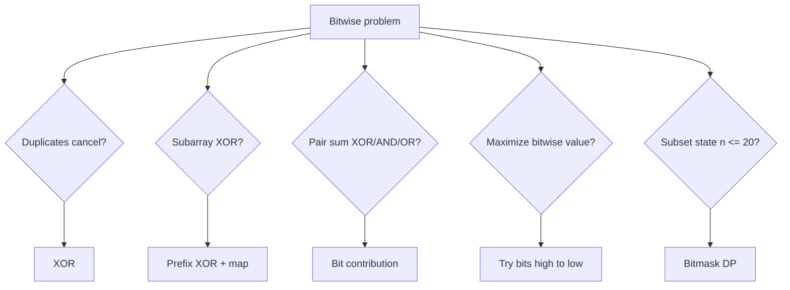

## Forms + Intuition

| Form | Formula / tactic | Intuition |
|---|---|---|
| Single number | XOR all | pairs cancel |
| Subarray XOR K | need old `px ^ K` | XOR inverse is XOR |
| Pair XOR sum | for each bit: `cnt1*cnt0*2^b` | pairs differ at that bit |
| Max XOR pair | binary trie | prefer opposite bit high to low |
| Subset enumeration | loop masks | bit i tells chosen/not chosen |

## C++ Template: Bit Helpers

```cpp
bool isSet(long long x, int i) { return (x >> i) & 1LL; }
long long setBit(long long x, int i) { return x | (1LL << i); }
long long clearBit(long long x, int i) { return x & ~(1LL << i); }
long long toggleBit(long long x, int i) { return x ^ (1LL << i); }
```

## Practice

| Difficulty | Problem | Link | Pattern | Intuition |
|---|---|---|---|---|
| Easy | Single Number | https://leetcode.com/problems/single-number/ | XOR cancel | duplicates vanish |
| Easy | Number of 1 Bits | https://leetcode.com/problems/number-of-1-bits/ | bit count | repeatedly remove lowbit |
| Medium | Subsets | https://leetcode.com/problems/subsets/ | bitmask generation | mask represents chosen elements |
| Medium | Single Number III | https://leetcode.com/problems/single-number-iii/ | split by differing bit | separate two uniques |
| Medium | Bitwise AND of Numbers Range | https://leetcode.com/problems/bitwise-and-of-numbers-range/ | common prefix | changing bits become zero |
| Hard | Maximum XOR of Two Numbers in an Array | https://leetcode.com/problems/maximum-xor-of-two-numbers-in-an-array/ | trie / greedy bits | prefer opposite high bits |
| Hard | Minimum XOR Sum of Two Arrays | https://leetcode.com/problems/minimum-xor-sum-of-two-arrays/ | bitmask DP | assign using mask |
| CP | CSES Gray Code | https://cses.fi/problemset/task/2205 | bit construction | consecutive masks differ by one bit |

---

# Topic 07: Recursion + Backtracking

## Concepts

| Concept | Meaning | Pattern clue |
|---|---|---|
| Base case | stop condition | smallest valid state |
| Recursion state | what one call means | index, remaining target, board cell |
| Choice | what you can try | include/exclude, pick char, place queen |
| Constraint/pruning | reject bad branches | used, conflict, target < 0 |
| Undo | restore state | pop, unmark, subtract |

## LCCM Framework

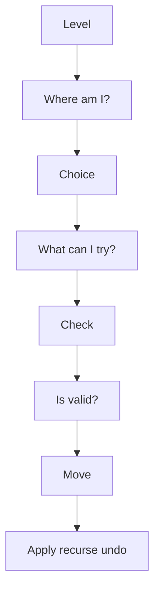

## C++ Template

```cpp
void dfs(int level) {
    if (base_case) {
        save_answer();
        return;
    }
    for (auto choice : choices) {
        if (!valid(choice)) continue;
        apply(choice);
        dfs(level + 1);
        undo(choice);
    }
}
```

## Practice

| Difficulty | Problem | Link | Pattern | Intuition |
|---|---|---|---|---|
| Easy | Generate Parentheses | https://leetcode.com/problems/generate-parentheses/ | constrained recursion | open ≤ n, close ≤ open |
| Medium | Subsets II | https://leetcode.com/problems/subsets-ii/ | sorted + skip duplicates | avoid same branch duplicate |
| Medium | Permutations | https://leetcode.com/problems/permutations/ | used array | choose unused element each level |
| Medium | Combination Sum | https://leetcode.com/problems/combination-sum/ | choose/reuse | stay at same index when reused |
| Medium | Palindrome Partitioning | https://leetcode.com/problems/palindrome-partitioning/ | cut recursion | choose next palindrome segment |
| Hard | N-Queens | https://leetcode.com/problems/n-queens/ | board constraints | columns and diagonals |
| Hard | Sudoku Solver | https://leetcode.com/problems/sudoku-solver/ | constraint search | try valid digit, backtrack |

---

# Topic 08: Graphs

## Concepts

| Concept | Meaning | Pattern clue |
|---|---|---|
| Node | state/object | city, cell, word, mask |
| Edge | transition/relation | road, move, transform |
| BFS | shortest path unweighted | minimum moves/levels |
| DFS | reachability/components | explore all connected |
| Toposort | dependency ordering | prerequisites, DAG |
| Dijkstra | weighted shortest path nonnegative | min cost path |
| 0-1 BFS | weights 0 or 1 | deque shortest path |
| Bellman-Ford | negative edges | detect negative cycles |
| Floyd-Warshall | all pairs small n | dense graph, n ≤ 500 |
| MST | connect all cheaply | minimum total connection cost |

## Graph Formulation Framework

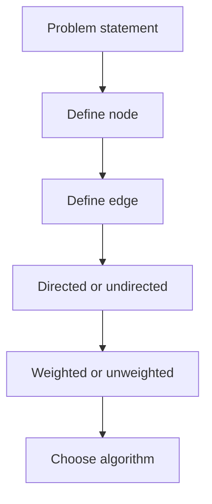

## Algorithm Selection Table

| Question | Algorithm |
|---|---|
| Can I reach X? | DFS/BFS |
| How many components? | DFS/BFS/DSU |
| Minimum moves, all edges cost 1? | BFS |
| Multiple starting sources? | Multi-source BFS |
| Edge weights 0/1? | 0-1 BFS |
| Nonnegative weighted shortest path? | Dijkstra |
| Negative edge? | Bellman-Ford |
| All-pairs shortest path, small n? | Floyd-Warshall |
| Dependency order? | Topological sort |
| Cheapest way to connect all? | MST |

## C++ Template: BFS

```cpp
vector<int> bfs(int n, vector<vector<int>>& g, int src) {
    vector<int> dist(n + 1, -1);
    queue<int> q;
    dist[src] = 0;
    q.push(src);
    while (!q.empty()) {
        int u = q.front(); q.pop();
        for (int v : g[u]) if (dist[v] == -1) {
            dist[v] = dist[u] + 1;
            q.push(v);
        }
    }
    return dist;
}
```

## Practice

| Difficulty | Problem | Link | Pattern | Intuition |
|---|---|---|---|---|
| Easy | Find if Path Exists in Graph | https://leetcode.com/problems/find-if-path-exists-in-graph/ | BFS/DFS connectivity | traverse component |
| Medium | Number of Islands | https://leetcode.com/problems/number-of-islands/ | grid DFS/BFS | each island = component |
| Medium | Course Schedule | https://leetcode.com/problems/course-schedule/ | topological sort | cycle means impossible |
| Medium | Rotting Oranges | https://leetcode.com/problems/rotting-oranges/ | multi-source BFS | all rotten sources expand together |
| Medium | Network Delay Time | https://leetcode.com/problems/network-delay-time/ | Dijkstra | shortest arrival to all nodes |
| Hard | Word Ladder | https://leetcode.com/problems/word-ladder/ | BFS state graph | each word differs by one char |
| Hard | Swim in Rising Water | https://leetcode.com/problems/swim-in-rising-water/ | Dijkstra / binary search | minimize maximum cell level |
| CP | CSES Counting Rooms | https://cses.fi/problemset/task/1192 | grid components | count connected empty regions |
| CP | CSES Message Route | https://cses.fi/problemset/task/1667 | BFS parent | shortest unweighted path |
| CP | CSES Flight Discount | https://cses.fi/problemset/task/1195 | Dijkstra state | used coupon or not |

---

# Topic 09: Trees + LCA + Binary Lifting + DSU

## Concepts

| Concept | Meaning | Pattern clue |
|---|---|---|
| Tree | connected acyclic graph | n nodes, n-1 edges |
| Rooted tree | parent/depth/subtree meaningful | subtree/path queries |
| LCA | lowest common ancestor | path between u and v |
| Binary lifting | jump upward powers of two | kth ancestor, LCA fast |
| Euler tour | flatten subtree | subtree query becomes range query |
| DSU | dynamic connectivity by adding edges | union/find components |
| Kruskal | MST using DSU | sort edges by weight |

## Framework

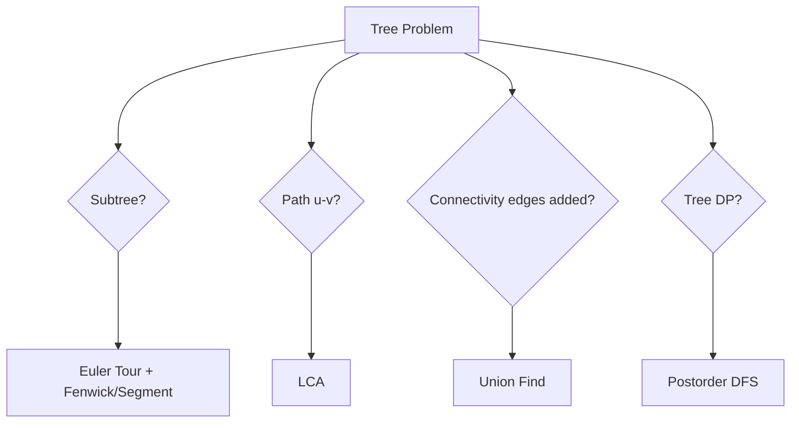

## Formulas

| Problem | Formula / tactic |
|---|---|
| distance(u,v) | `depth[u]+depth[v]-2*depth[lca]` |
| subtree size | `1 + sum(child subtree)` |
| kth ancestor | jump by binary bits of k |
| path sum with prefix | `pref[u]+pref[v]-2*pref[lca]+value[lca]` |
| offline deletion | process queries backward as additions |

## C++ Template: DSU

```cpp
struct DSU {
    vector<int> p, sz;
    DSU(int n=0) { init(n); }
    void init(int n) {
        p.resize(n+1); sz.assign(n+1, 1);
        iota(p.begin(), p.end(), 0);
    }
    int find(int x) { return p[x] == x ? x : p[x] = find(p[x]); }
    bool unite(int a, int b) {
        a = find(a); b = find(b);
        if (a == b) return false;
        if (sz[a] < sz[b]) swap(a,b);
        p[b] = a; sz[a] += sz[b];
        return true;
    }
};
```

## Practice

| Difficulty | Problem | Link | Pattern | Intuition |
|---|---|---|---|---|
| Easy | Maximum Depth of Binary Tree | https://leetcode.com/problems/maximum-depth-of-binary-tree/ | tree DFS | depth = 1 + max child |
| Easy | Same Tree | https://leetcode.com/problems/same-tree/ | recursive compare | compare roots and children |
| Medium | Number of Connected Components in an Undirected Graph | https://leetcode.com/problems/number-of-connected-components-in-an-undirected-graph/ | DSU/DFS | merge endpoints |
| Medium | Lowest Common Ancestor of a Binary Tree | https://leetcode.com/problems/lowest-common-ancestor-of-a-binary-tree/ | recursive LCA | if p/q split, current is LCA |
| Medium | Redundant Connection | https://leetcode.com/problems/redundant-connection/ | DSU cycle | edge inside same component forms cycle |
| Hard | Binary Tree Maximum Path Sum | https://leetcode.com/problems/binary-tree-maximum-path-sum/ | tree DP | path may pass through node |
| Hard | Tree of Coprimes | https://leetcode.com/problems/tree-of-coprimes/ | DFS + ancestors | keep latest ancestor by value |
| CP | CSES Tree Diameter | https://cses.fi/problemset/task/1131 | two BFS/DFS | farthest from farthest |
| CP | CSES Company Queries I | https://cses.fi/problemset/task/1687 | binary lifting | kth ancestor |
| CP | CSES Company Queries II | https://cses.fi/problemset/task/1688 | LCA | equalize then jump |
| CP | CSES Road Construction | https://cses.fi/problemset/task/1676 | DSU | components and largest size |

---

# Topic 10: Dynamic Programming

## Concepts

| Concept | Meaning | Pattern clue |
|---|---|---|
| State | meaning of `dp[...]` | repeated subproblems |
| Transition | how smaller states build current | choose previous/cut/item |
| Base case | known starting answer | empty prefix, zero target |
| Memoization | recursion + cache | easier state design |
| Tabulation | iterative fill | faster, avoids recursion depth |
| Optimization | reduce state/transition/space | constraints too large |

## DP Framework

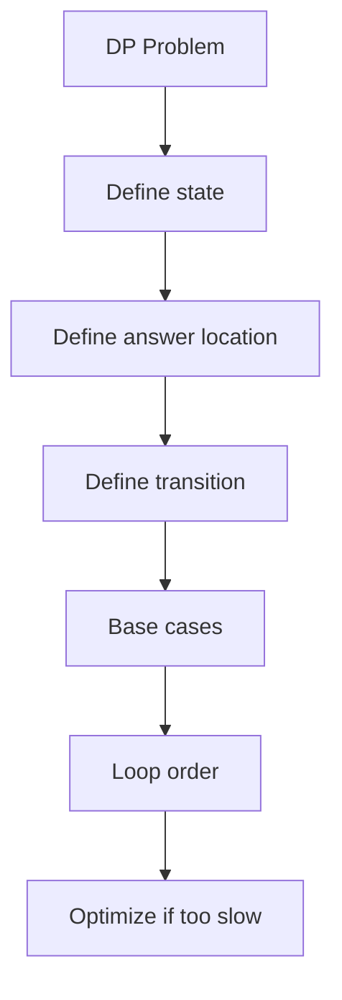

## Main DP Forms

| Form | State clue | Examples |
|---|---|---|
| Take / not take | choose subset/items | knapsack, subset sum |
| Ending at index | best ending here | LIS, max subarray variants |
| Matching DP | two strings/sequences | LCS, edit distance |
| Interval DP | segment `[l,r]` | matrix chain, burst balloons |
| Game DP | current player advantage | stone games |
| Grid DP | cell coordinates | paths/min cost |
| Digit DP | position, tight, started | count numbers with property |
| Tree DP | node + state | independent set, diameter variants |
| Bitmask DP | selected subset | assignment, TSP |
| Partition DP | prefix split into k parts | split array, palindrome cuts |

## C++ Template: Memoized DP

```cpp
int n;
vector<int> a;
vector<vector<int>> dp;

int rec(int i, int state) {
    if (i == n) return 0;
    int &ans = dp[i][state];
    if (ans != -1) return ans;

    ans = rec(i + 1, state);      // skip
    // ans = max(ans, value + rec(next_i, new_state));
    return ans;
}
```

## Practice

| Difficulty | Problem | Link | Pattern | Intuition |
|---|---|---|---|---|
| Easy | Climbing Stairs | https://leetcode.com/problems/climbing-stairs/ | Fibonacci DP | last move was 1 or 2 |
| Easy | House Robber | https://leetcode.com/problems/house-robber/ | take/not take | rob current means skip previous |
| Medium | Coin Change | https://leetcode.com/problems/coin-change/ | unbounded knapsack | try last coin |
| Medium | Longest Increasing Subsequence | https://leetcode.com/problems/longest-increasing-subsequence/ | ending/tails | best increasing tail per length |
| Medium | Longest Common Subsequence | https://leetcode.com/problems/longest-common-subsequence/ | matching DP | match chars or skip one side |
| Medium | Partition Equal Subset Sum | https://leetcode.com/problems/partition-equal-subset-sum/ | subset sum | target total/2 |
| Hard | Edit Distance | https://leetcode.com/problems/edit-distance/ | matching DP | insert/delete/replace |
| Hard | Burst Balloons | https://leetcode.com/problems/burst-balloons/ | interval DP | choose last balloon in interval |
| Hard | Frog Jump | https://leetcode.com/problems/frog-jump/ | state DP set | stone + last jump |
| CP | AtCoder Educational DP Contest | https://atcoder.jp/contests/dp | DP ladder | 26 foundational DP tasks |
| CP | CSES Dice Combinations | https://cses.fi/problemset/task/1633 | counting DP | last dice value |
| CP | CSES Book Shop | https://cses.fi/problemset/task/1158 | 0/1 knapsack | choose books under budget |

---

# Topic 11: Greedy + Sorting + Intervals

## Concepts

| Concept | Meaning | Pattern clue |
|---|---|---|
| Greedy choice | locally optimal step | pick earliest end, smallest cost, largest gain |
| Exchange argument | prove greedy safe | swap optimal solution into greedy form |
| Sorting | reveal order | intervals, events, deadlines |
| Sweep line | process events | overlaps, active intervals |
| Priority queue greedy | keep best candidates | scheduling, meeting rooms, refuel |

## Framework

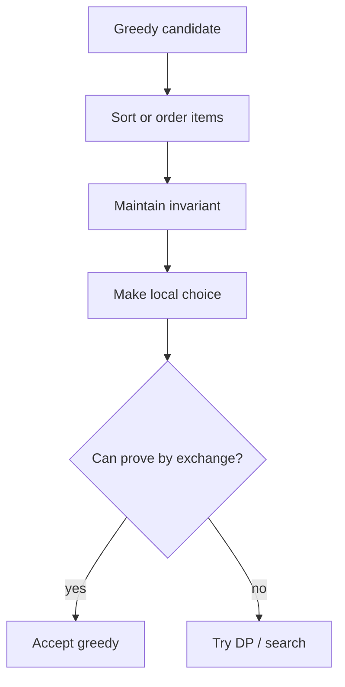

## Practice

| Difficulty | Problem | Link | Pattern | Intuition |
|---|---|---|---|---|
| Easy | Assign Cookies | https://leetcode.com/problems/assign-cookies/ | sort greedy | smallest cookie for smallest child |
| Medium | Merge Intervals | https://leetcode.com/problems/merge-intervals/ | sort intervals | extend current overlap |
| Medium | Non-overlapping Intervals | https://leetcode.com/problems/non-overlapping-intervals/ | earliest end greedy | keep interval that frees earliest |
| Medium | Task Scheduler | https://leetcode.com/problems/task-scheduler/ | frequency greedy | most frequent tasks create idle slots |
| Hard | Minimum Number of Refueling Stops | https://leetcode.com/problems/minimum-number-of-refueling-stops/ | heap greedy | use largest past fuel when stuck |
| Hard | Course Schedule III | https://leetcode.com/problems/course-schedule-iii/ | deadline + max heap | drop longest course when time exceeds |
| CP | CSES Movie Festival | https://cses.fi/problemset/task/1629 | interval scheduling | earliest finishing movie |
| CP | CSES Restaurant Customers | https://cses.fi/problemset/task/1619 | sweep line | arrivals +1 departures -1 |

---

# Topic 12: Range Queries: Fenwick + Segment Tree + Sparse Table

## Concepts

| Structure | Supports | Pattern clue |
|---|---|---|
| Fenwick Tree | point update + prefix/range sum | dynamic sums, invert count |
| Segment Tree | range query + updates | min/max/sum/gcd with updates |
| Lazy Segment Tree | range update + range query | add/set over intervals |
| Sparse Table | static idempotent range query | RMQ/GCD no updates |

## Framework

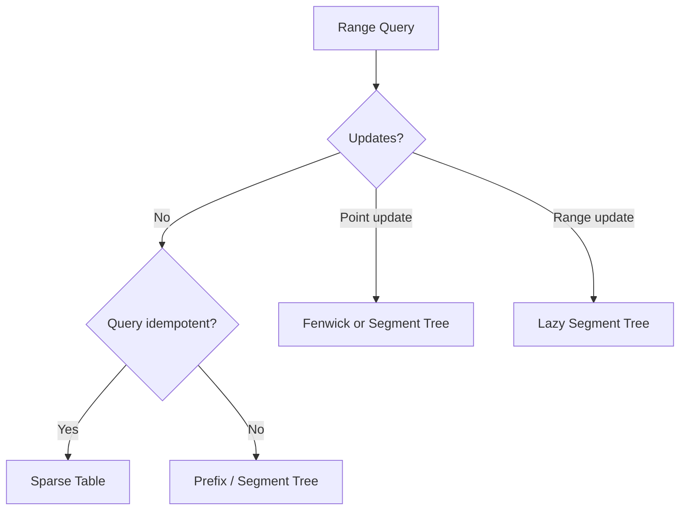

## C++ Template: Fenwick

```cpp
struct Fenwick {
    int n;
    vector<long long> bit;
    Fenwick(int n=0): n(n), bit(n+1,0) {}
    void add(int idx, long long val) {
        for (; idx <= n; idx += idx & -idx) bit[idx] += val;
    }
    long long sumPrefix(int idx) {
        long long res = 0;
        for (; idx > 0; idx -= idx & -idx) res += bit[idx];
        return res;
    }
    long long rangeSum(int l, int r) {
        return sumPrefix(r) - sumPrefix(l-1);
    }
};
```

## Practice

| Difficulty | Problem | Link | Pattern | Intuition |
|---|---|---|---|---|
| Medium | Range Sum Query Mutable | https://leetcode.com/problems/range-sum-query-mutable/ | Fenwick/segment tree | update delta, query range |
| Medium | Count of Smaller Numbers After Self | https://leetcode.com/problems/count-of-smaller-numbers-after-self/ | Fenwick + compression | count previous smaller ranks from right |
| Hard | Range Module | https://leetcode.com/problems/range-module/ | interval set / segment tree | maintain covered intervals |
| Hard | Falling Squares | https://leetcode.com/problems/falling-squares/ | lazy seg/compression | range max + update |
| CP | CSES Dynamic Range Sum Queries | https://cses.fi/problemset/task/1648 | Fenwick | point update range sum |
| CP | CSES Range Minimum Queries II | https://cses.fi/problemset/task/1649 | segment tree | point update range min |
| CP | CSES Range Update Queries | https://cses.fi/problemset/task/1651 | Fenwick diff | range add point query |

---

# Topic 13: Math, Modular Arithmetic, Number Theory, Combinatorics

## Concepts

| Concept | Meaning | Pattern clue |
|---|---|---|
| Modular arithmetic | keep values bounded | answer modulo 1e9+7/998244353 |
| Fast power | compute `a^b mod M` | huge exponent |
| Modular inverse | divide under modulo | combinations, fractions mod prime |
| GCD/LCM | divisibility structure | reduce ratios, coprime, Euclid |
| Sieve | primes up to n | many prime queries |
| Factorization | prime powers of n | divisors, gcd constraints |
| Combinations | choose k items | count ways, binomial coefficients |
| Inclusion-exclusion | count union / avoid overcount | at least/none/divisible by any |
| Stars and bars | distribute identical items | nonnegative solutions |

## Framework

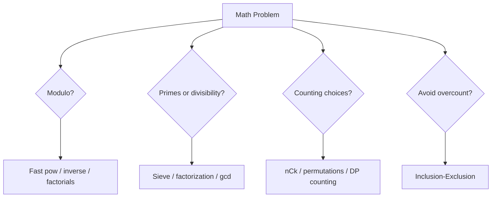

## C++ Template: Modular Arithmetic

```cpp
long long modpow(long long a, long long e, long long mod) {
    long long r = 1 % mod;
    while (e) {
        if (e & 1) r = r * a % mod;
        a = a * a % mod;
        e >>= 1;
    }
    return r;
}

long long modinv(long long a, long long mod) {
    return modpow(a, mod - 2, mod); // mod prime
}
```

## C++ Template: nCk Precompute

```cpp
const int MODN = 1e9 + 7;
vector<long long> fact, invfact;

void buildComb(int N) {
    fact.assign(N+1, 1);
    invfact.assign(N+1, 1);
    for (int i = 1; i <= N; i++) fact[i] = fact[i-1] * i % MODN;
    invfact[N] = modinv(fact[N], MODN);
    for (int i = N; i >= 1; i--) invfact[i-1] = invfact[i] * i % MODN;
}

long long C(int n, int k) {
    if (k < 0 || k > n) return 0;
    return fact[n] * invfact[k] % MODN * invfact[n-k] % MODN;
}
```

## Practice

| Difficulty | Problem | Link | Pattern | Intuition |
|---|---|---|---|---|
| Easy | Count Primes | https://leetcode.com/problems/count-primes/ | sieve | mark multiples |
| Easy | Power of Three | https://leetcode.com/problems/power-of-three/ | divisibility | divide repeatedly / log |
| Medium | Pow(x, n) | https://leetcode.com/problems/powx-n/ | fast exponentiation | square base, halve exponent |
| Medium | Unique Paths | https://leetcode.com/problems/unique-paths/ | combinatorics / grid DP | choose down moves among total |
| Medium | Permutation Sequence | https://leetcode.com/problems/permutation-sequence/ | factorial number system | choose block by k/fact |
| Hard | Count Good Numbers | https://leetcode.com/problems/count-good-numbers/ | modular exponentiation | multiply independent choices |
| Hard | Number of Ways to Reorder Array to Get Same BST | https://leetcode.com/problems/number-of-ways-to-reorder-array-to-get-same-bst/ | combinatorics + recursion | interleave left/right subtree orders |
| CP | CSES Exponentiation | https://cses.fi/problemset/task/1095 | modular power | binary exponentiation |
| CP | CSES Exponentiation II | https://cses.fi/problemset/task/1712 | Fermat + mod power | reduce exponent modulo phi |
| CP | CSES Counting Divisors | https://cses.fi/problemset/task/1713 | sieve factors | product of exponent+1 |
| CP | CSES Binomial Coefficients | https://cses.fi/problemset/task/1079 | factorial + inverse | precompute nCk mod prime |
| CP | CSES Distributing Apples | https://cses.fi/problemset/task/1716 | stars and bars | C(n+m-1,m) |
| CP | CSES Christmas Party | https://cses.fi/problemset/task/1717 | derangements | inclusion/exclusion DP |

---

## 18. Master Practice Matrix by Topic and Difficulty

> This is a **curated coverage list**, not literally every online problem. It is designed to cover the major reusable patterns needed for FAANG interviews and Candidate Master preparation.

| Topic | Easy / Foundation | Medium / Core | Hard / Advanced |
|---|---|---|---|
| STL + implementation | Valid Parentheses, Two Sum, Contains Duplicate | Group Anagrams, Top K Frequent, Merge Intervals | LFU Cache, All O(1) Data Structure |
| Prefix | Running Sum, Range Sum Query Immutable | Subarray Sum Equals K, Product Except Self, Continuous Subarray Sum | Count of Range Sum, Split Array With Same Average |
| Binary Search | Binary Search, Search Insert | Koko, Ship Capacity, Rotated Array | Median Two Sorted Arrays, Split Array Largest Sum |
| Two pointers | Valid Palindrome, Move Zeroes | 3Sum, Longest Unique Substring, Container Water | Minimum Window, Sliding Window Median |
| Stack/Deque/Heap | Valid Parentheses, Min Stack | Daily Temperatures, K Closest Points, Stock Span | Largest Rectangle, Sliding Window Max, IPO |
| Bitwise | Single Number, Hamming Weight | Subsets, Single Number III, Range AND | Maximum XOR Pair, Minimum XOR Sum |
| Backtracking | Generate Parentheses | Permutations, Combination Sum, Palindrome Partition | N-Queens, Sudoku Solver |
| Graph | Path Exists | Number of Islands, Course Schedule, Rotting Oranges | Word Ladder, Swim in Rising Water, Critical Connections |
| Tree/DSU | Max Depth, Same Tree | LCA, Redundant Connection, Components | Binary Tree Max Path, Tree of Coprimes |
| DP | Climbing Stairs, House Robber | Coin Change, LIS, LCS, Partition Equal Subset | Edit Distance, Burst Balloons, Frog Jump |
| Greedy | Assign Cookies | Non-overlap Intervals, Task Scheduler | Course Schedule III, Refuel Stops |
| Range Queries | Prefix range sum | Range Sum Mutable, Count Smaller | Falling Squares, Range Module |
| Math/NT/Comb | Count Primes, GCD | Pow, Unique Paths, nCk mod | Reorder BST, Exponentiation II, derangements |

---

## 19. FAANG Pattern Practice List

| Pattern | Must-solve problems | Recognition trigger |
|---|---|---|
| Hash map frequency | Two Sum, Group Anagrams, Longest Consecutive Sequence | duplicates, counts, fast lookup |
| Prefix + map | Subarray Sum Equals K, Continuous Subarray Sum | subarray sum/count |
| Sliding window | Longest Substring Without Repeating, Minimum Window | contiguous substring/subarray with condition |
| Binary search answer | Koko, Ship Capacity, Split Array Largest Sum | minimize max / max min |
| Monotonic stack | Daily Temperatures, Histogram, Trapping Rain Water | nearest greater/smaller |
| Heap | Top K Frequent, K Closest, Merge K Lists | repeated min/max |
| BFS | Rotting Oranges, Word Ladder, Shortest Path Binary Matrix | minimum moves |
| DFS/backtracking | N-Queens, Word Search, Combination Sum | generate/search choices |
| Tree DFS | Diameter, Max Path Sum, LCA | subtree/path recursion |
| DP | Coin Change, LIS, LCS, Edit Distance | optimal/count with repeated states |
| Union Find | Redundant Connection, Number of Provinces | dynamic connectivity |

---

## 20. Candidate Master CP Practice List

| Stage | Rating / level | Focus | Recommended sources |
|---|---|---|---|
| Stage 1 | CF 800-1100 | implementation, prefix, sorting, maps | Codeforces A/B, CSES Intro/Sorting |
| Stage 2 | CF 1100-1400 | binary search, greedy, BFS/DFS, two pointers | CF B/C, CSES Graph/Searching |
| Stage 3 | CF 1400-1600 | DP basics, DSU, Dijkstra, segment tree | CSES DP/Range/Graph |
| Stage 4 | CF 1600-1900 | tree, bitmask, combinatorics, constructive | CF C/D, AtCoder ABC E/F |
| Stage 5 | CF 1900-2200 | hard DP, graph states, number theory, proofs | CF D/E, AtCoder ARC |

### CP Topic Checklist

| Topic | Foundation | Candidate Master add-on |
|---|---|---|
| Arrays | prefix, two pointers | contribution, offline queries |
| Binary search | lower_bound, answer search | parallel binary search, floating binary search |
| Graph | BFS/DFS/Dijkstra | SCC, bridges, flows basics |
| Tree | DFS, LCA | rerooting, centroid, HLD basics |
| DP | 1D/2D | digit DP, bitmask DP, interval DP, optimization |
| Math | gcd, sieve, nCk | CRT, Mobius basics, combinatorics proofs |
| Data structures | Fenwick/segment | lazy segtree, ordered set, sparse table |

---

## 21. Final Recognition Cheat Sheet

| Problem phrase | Think instantly |
|---|---|
| “range sum” | prefix / Fenwick / segment tree |
| “many range updates, final values” | difference array |
| “subarray sum equals K” | prefix + hashmap |
| “sorted array” | binary search / two pointers |
| “minimum possible maximum” | binary search on answer |
| “longest substring/subarray satisfying condition” | sliding window |
| “nearest greater/smaller” | monotonic stack |
| “maximum/minimum in every window” | monotonic deque |
| “minimum moves” | BFS |
| “weighted shortest path” | Dijkstra / 0-1 BFS |
| “dependencies/prerequisites” | topological sort |
| “connectivity with edge additions” | DSU |
| “path in tree” | LCA / binary lifting |
| “subtree query” | Euler tour + Fenwick/segment |
| “n ≤ 20 and subsets” | bitmask DP |
| “count ways modulo” | DP / combinatorics with mod |
| “divide under modulo” | modular inverse |
| “choose k” | nCk factorial precompute |
| “primes/divisors” | sieve/factorization |
| “all arrangements/choices” | backtracking or combinatorics |

---


---

## 22. Technique + Tactic Deep Dive: How to Do It in Contest/OA

> Use this section as the “recognize → decide → code” manual. For every technique, ask: **What is the invariant? What state do I maintain? What movement/update is safe?**

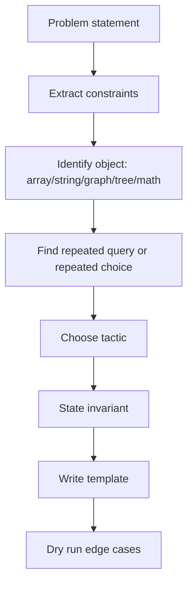

### 22.1 STL + Implementation Tactics

| Technique | When to use | How it works | C++ move | Common trap |
|---|---|---|---|---|
| `vector` | dynamic array, prefix, adjacency | contiguous storage, O(1) access | `vector<int> a(n);` | out-of-bounds |
| `sort + scan` | grouping, intervals, greedy | order creates local decisions | `sort(a.begin(), a.end());` | forgetting tie-break |
| `unordered_map` | frequency, first occurrence, prefix counts | O(1) average lookup | `mp[x]++` | hash collision / missing reserve |
| `map/set` | ordered queries | balanced BST gives sorted keys | `lower_bound` | O(log n), not O(1) |
| `priority_queue` | repeated best min/max | heap keeps current extreme | max heap by default | stale elements in lazy deletion |

```cpp
#include <bits/stdc++.h>
using namespace std;
using ll = long long;

int main() {
    ios::sync_with_stdio(false);
    cin.tie(nullptr);

    int n; cin >> n;
    vector<int> a(n);
    for (int &x : a) cin >> x;

    unordered_map<int,int> freq;
    freq.reserve(n * 2);
    for (int x : a) freq[x]++;

    sort(a.begin(), a.end());
    return 0;
}
```

**Recognition intuition:** If the problem asks for “counts,” think map. If it asks for “smallest/largest repeatedly,” think heap/set. If sorting makes neighbors meaningful, sort first.

---

### 22.2 Prefix Sum + Difference Array Tactics

| Form | Trigger words | Invariant | How to do it | C++ pattern |
|---|---|---|---|---|
| 1D prefix | range sum, static queries | `pref[i] = sum of first i` | subtract before left | `pref[r+1]-pref[l]` |
| Prefix + map | subarray sum/count equals K | current prefix minus old prefix | count earlier `pref-K` | `ans += cnt[pref-k]` |
| Difference array | many range adds, final array | boundary marks update effect | `diff[l]+=x`, `diff[r+1]-=x` | prefix reconstruct |
| 2D prefix | rectangle sum | inclusion-exclusion | add big rectangle, subtract overlaps | `A-B-C+D` |

```cpp
vector<long long> buildPrefix(const vector<int>& a) {
    int n = a.size();
    vector<long long> pref(n + 1, 0);
    for (int i = 0; i < n; i++) pref[i + 1] = pref[i] + a[i];
    return pref;
}

long long sumRange(const vector<long long>& pref, int l, int r) {
    return pref[r + 1] - pref[l];
}

long long countSubarraySumK(const vector<int>& a, long long k) {
    unordered_map<long long,long long> cnt;
    cnt.reserve(a.size() * 2 + 10);
    cnt[0] = 1;
    long long pref = 0, ans = 0;
    for (int x : a) {
        pref += x;
        if (cnt.count(pref - k)) ans += cnt[pref - k];
        cnt[pref]++;
    }
    return ans;
}

vector<long long> rangeAddFinal(int n, vector<array<int,3>> updates) {
    vector<long long> diff(n + 1, 0), a(n);
    for (auto [l, r, x] : updates) {
        diff[l] += x;
        if (r + 1 < n) diff[r + 1] -= x;
    }
    long long cur = 0;
    for (int i = 0; i < n; i++) {
        cur += diff[i];
        a[i] = cur;
    }
    return a;
}
```

**Solve-similar intuition:** Prefix sums replace repeated summation. Difference arrays replace repeated range modification. Prefix+hash converts “subarray ending here” into “have I seen the needed past prefix?”

---

### 22.3 Binary Search Tactics

| Technique | Trigger | Predicate shape | Goal | Template |
|---|---|---|---|---|
| Classic search | sorted array | direct comparison | find target | `lower_bound` |
| First true | minimum valid answer | `false false true true` | smallest valid | move `hi=mid-1` |
| Last true | maximum valid answer | `true true false false` | largest valid | move `lo=mid+1` |
| Answer search | minimize max / maximize min | check feasibility | answer not in array | custom `check` |
| Real binary | precision answer | continuous monotonic | approximate | fixed iterations |

```cpp
long long firstTrue(long long lo, long long hi, function<bool(long long)> check) {
    long long ans = hi + 1;
    while (lo <= hi) {
        long long mid = lo + (hi - lo) / 2;
        if (check(mid)) ans = mid, hi = mid - 1;
        else lo = mid + 1;
    }
    return ans;
}

long long lastTrue(long long lo, long long hi, function<bool(long long)> check) {
    long long ans = lo - 1;
    while (lo <= hi) {
        long long mid = lo + (hi - lo) / 2;
        if (check(mid)) ans = mid, lo = mid + 1;
        else hi = mid - 1;
    }
    return ans;
}

// Example: minimum capacity to ship within D days.
long long minCapacity(vector<int>& w, int D) {
    long long lo = *max_element(w.begin(), w.end());
    long long hi = accumulate(w.begin(), w.end(), 0LL);
    auto ok = [&](long long cap) {
        int days = 1; long long cur = 0;
        for (int x : w) {
            if (cur + x > cap) days++, cur = 0;
            cur += x;
        }
        return days <= D;
    };
    return firstTrue(lo, hi, ok);
}
```

**Recognition intuition:** If you can ask, “Is answer `x` possible?” and possible answers form one clean zone, binary search works.

---

### 22.4 Two Pointers + Sliding Window Tactics

| Form | Trigger | Invariant | Movement rule | Answer update |
|---|---|---|---|---|
| Opposite ends | sorted pair / palindrome | all outside discarded safely | move side that cannot help | check pair/window |
| Fixed window | length exactly K | window size K | add right, remove left | every size K |
| Variable window | longest/min valid subarray | window validity | expand right, shrink left | before/after shrink |
| At most K | count subarrays | window has <=K bad items | shrink until valid | `ans += r-l+1` |
| Exact K | exactly K distinct/sum | reduce to two at-most counts | `atMost(K)-atMost(K-1)` | count |

```cpp
int longestAtMostKDistinct(const string& s, int K) {
    unordered_map<char,int> freq;
    int l = 0, best = 0;
    for (int r = 0; r < (int)s.size(); r++) {
        freq[s[r]]++;
        while ((int)freq.size() > K) {
            if (--freq[s[l]] == 0) freq.erase(s[l]);
            l++;
        }
        best = max(best, r - l + 1);
    }
    return best;
}

long long countAtMostKDistinct(const vector<int>& a, int K) {
    if (K < 0) return 0;
    unordered_map<int,int> freq;
    long long ans = 0;
    int l = 0;
    for (int r = 0; r < (int)a.size(); r++) {
        freq[a[r]]++;
        while ((int)freq.size() > K) {
            if (--freq[a[l]] == 0) freq.erase(a[l]);
            l++;
        }
        ans += r - l + 1;
    }
    return ans;
}
```

**Recognition intuition:** Sliding window needs a monotonic validity condition: once invalid, moving `l` can restore validity.

---

### 22.5 Stack, Monotonic Stack, Deque, Heap Tactics

| Technique | Trigger | Invariant | Use case |
|---|---|---|---|
| Stack | nested / last open first close | top is latest unresolved item | parentheses, DFS simulation |
| Monotonic stack increasing | nearest smaller | stack values increasing | histogram, previous smaller |
| Monotonic stack decreasing | nearest greater | stack values decreasing | daily temperatures |
| Monotonic deque | sliding max/min | front is best valid index | max in every window |
| Heap | top K / repeated best | heap top is next best | k closest, merge k lists |

```cpp
vector<int> nextGreaterRight(const vector<int>& a) {
    int n = a.size();
    vector<int> ans(n, -1);
    stack<int> st; // indices, decreasing values
    for (int i = 0; i < n; i++) {
        while (!st.empty() && a[i] > a[st.top()]) {
            ans[st.top()] = a[i];
            st.pop();
        }
        st.push(i);
    }
    return ans;
}

vector<int> slidingWindowMax(const vector<int>& a, int k) {
    deque<int> dq;
    vector<int> ans;
    for (int i = 0; i < (int)a.size(); i++) {
        while (!dq.empty() && dq.front() <= i - k) dq.pop_front();
        while (!dq.empty() && a[dq.back()] <= a[i]) dq.pop_back();
        dq.push_back(i);
        if (i >= k - 1) ans.push_back(a[dq.front()]);
    }
    return ans;
}
```

**Recognition intuition:** If the problem asks nearest greater/smaller, use monotonic stack. If it asks best value inside every window, use monotonic deque.

---

### 22.6 Bit Manipulation Tactics

| Technique | Trigger | How it works | C++ |
|---|---|---|---|
| Check/set/clear bit | flags, masks | each bit is yes/no state | `(x>>i)&1` |
| XOR cancellation | pairs except one | `x^x=0`, `x^0=x` | `ans ^= x` |
| Bit contribution | sum of pair XOR/AND/OR | count zeros/ones per bit | contribution formula |
| Submask enumeration | iterate subsets of mask | `(sub-1)&mask` | `for(sub=mask;sub;sub=...)` |
| High-bit greedy | maximize XOR/AND | decide bits from MSB | test candidate |
| XOR trie | max XOR pair/query | branch opposite bit | binary trie |

```cpp
bool isSet(long long x, int b) { return (x >> b) & 1LL; }
long long setBit(long long x, int b) { return x | (1LL << b); }
long long clearBit(long long x, int b) { return x & ~(1LL << b); }

long long pairXorSum(const vector<int>& a) {
    long long ans = 0;
    int n = a.size();
    for (int b = 0; b < 31; b++) {
        long long ones = 0;
        for (int x : a) ones += (x >> b) & 1;
        long long zeros = n - ones;
        ans += ones * zeros * (1LL << b);
    }
    return ans;
}

void enumerateSubmasks(int mask) {
    for (int sub = mask; sub; sub = (sub - 1) & mask) {
        // process non-empty submask
    }
    // include sub=0 separately if needed
}
```

**Recognition intuition:** If constraints say `n <= 20`, think bitmask. If values are up to `1e9`, think bit columns. If pairs cancel, think XOR.

---

### 22.7 Recursion + Backtracking Tactics

| Technique | Trigger | State | Choice | Undo? |
|---|---|---|---|---|
| Include/exclude | subsets | index + path | take or skip | yes |
| Permutations | reorder elements | path + used | pick unused | yes |
| Combination sum | choose numbers | start + remaining | pick next candidate | yes |
| Board placement | chess/grid | row/col + occupied sets | place or skip | yes |
| Word search | path in grid | cell + index | 4 directions | yes |

```cpp
vector<vector<int>> subsets(vector<int>& a) {
    vector<vector<int>> ans;
    vector<int> path;
    function<void(int)> dfs = [&](int i) {
        if (i == (int)a.size()) {
            ans.push_back(path);
            return;
        }
        dfs(i + 1);              // skip
        path.push_back(a[i]);    // take
        dfs(i + 1);
        path.pop_back();         // undo
    };
    dfs(0);
    return ans;
}

vector<vector<int>> permute(vector<int>& a) {
    vector<vector<int>> ans;
    vector<int> path, used(a.size(), 0);
    function<void()> dfs = [&]() {
        if (path.size() == a.size()) { ans.push_back(path); return; }
        for (int i = 0; i < (int)a.size(); i++) if (!used[i]) {
            used[i] = 1; path.push_back(a[i]);
            dfs();
            path.pop_back(); used[i] = 0;
        }
    };
    dfs();
    return ans;
}
```

**Recognition intuition:** Backtracking is for “generate all” or “try choices under constraints.” The contest skill is defining `level`, `choice`, `check`, `move` quickly.

---

### 22.8 Graph Tactics

| Technique | Trigger | Node meaning | Edge meaning | Algorithm |
|---|---|---|---|---|
| DFS | reachability/components | object/state | connection | recursive/stack |
| BFS | minimum edges/moves | state | one move | queue |
| Multi-source BFS | nearest source/spread | cell/node | one time step | queue all sources |
| 0-1 BFS | edge cost 0 or 1 | state | transition cost | deque |
| Dijkstra | positive weights | node | weighted edge | min heap |
| Toposort | prerequisites/DAG | task | dependency | indegree queue |
| DSU | connectivity additions | component | union edge | parent array |
| Bridges/SCC | critical connectivity | directed/undirected graph | edge | Tarjan/Kosaraju |

```cpp
vector<int> bfsShortestPath(int n, vector<vector<int>>& g, int src) {
    vector<int> dist(n + 1, -1);
    queue<int> q;
    dist[src] = 0; q.push(src);
    while (!q.empty()) {
        int u = q.front(); q.pop();
        for (int v : g[u]) if (dist[v] == -1) {
            dist[v] = dist[u] + 1;
            q.push(v);
        }
    }
    return dist;
}

vector<long long> dijkstra(int n, vector<vector<pair<int,int>>>& g, int src) {
    const long long INF = 4e18;
    vector<long long> dist(n + 1, INF);
    priority_queue<pair<long long,int>, vector<pair<long long,int>>, greater<pair<long long,int>>> pq;
    dist[src] = 0; pq.push({0, src});
    while (!pq.empty()) {
        auto [d, u] = pq.top(); pq.pop();
        if (d != dist[u]) continue;
        for (auto [v, w] : g[u]) if (dist[v] > d + w) {
            dist[v] = d + w;
            pq.push({dist[v], v});
        }
    }
    return dist;
}
```

**Recognition intuition:** First define nodes and edges. If every edge has same cost, BFS. If weights are positive, Dijkstra. If dependencies, topo. If connectivity under added edges, DSU.

---

### 22.9 Tree + LCA + DSU Tactics

| Technique | Trigger | Key invariant | How it works |
|---|---|---|---|
| Rooted DFS | subtree/depth/parent | parent avoids going backward | choose root and DFS |
| Euler tour | subtree range query | subtree is contiguous in tin order | flatten tree |
| LCA | path between two nodes | lift deeper node first | binary lifting |
| Tree distance | distance(u,v) | path through LCA | `dep[u]+dep[v]-2dep[lca]` |
| Tree difference | many path updates | mark endpoints and lca | postorder accumulation |
| DSU | components | representative parent | union by size + compression |

```cpp
struct LCA {
    int n, LOG;
    vector<int> depth;
    vector<vector<int>> up, g;

    LCA(int n): n(n), LOG(1), depth(n+1), g(n+1) {
        while ((1 << LOG) <= n) LOG++;
        up.assign(LOG, vector<int>(n+1));
    }
    void addEdge(int u, int v) { g[u].push_back(v); g[v].push_back(u); }
    void dfs(int u, int p) {
        up[0][u] = p;
        for (int j = 1; j < LOG; j++) up[j][u] = up[j-1][up[j-1][u]];
        for (int v : g[u]) if (v != p) {
            depth[v] = depth[u] + 1;
            dfs(v, u);
        }
    }
    int lift(int u, int k) {
        for (int j = 0; j < LOG; j++) if (k & (1 << j)) u = up[j][u];
        return u;
    }
    int lca(int a, int b) {
        if (depth[a] < depth[b]) swap(a, b);
        a = lift(a, depth[a] - depth[b]);
        if (a == b) return a;
        for (int j = LOG - 1; j >= 0; j--) if (up[j][a] != up[j][b]) {
            a = up[j][a]; b = up[j][b];
        }
        return up[0][a];
    }
    int dist(int a, int b) {
        int c = lca(a, b);
        return depth[a] + depth[b] - 2 * depth[c];
    }
};

struct DSU {
    vector<int> p, sz;
    DSU(int n): p(n+1), sz(n+1,1) { iota(p.begin(), p.end(), 0); }
    int find(int x) { return p[x] == x ? x : p[x] = find(p[x]); }
    bool unite(int a, int b) {
        a = find(a); b = find(b);
        if (a == b) return false;
        if (sz[a] < sz[b]) swap(a, b);
        p[b] = a; sz[a] += sz[b];
        return true;
    }
};
```

**Recognition intuition:** For tree path questions, think LCA. For subtree queries, think Euler tour. For component merge questions, think DSU.

---

### 22.10 Dynamic Programming Tactics

| DP form | Trigger | State idea | Transition intuition |
|---|---|---|---|
| Take/not take | subset/knapsack | `dp[i][sum]` or `dp[i][cap]` | skip or take item |
| Ending at index | LIS/best subarray-like | `dp[i] = best ending at i` | choose previous compatible |
| Matching DP | two strings | `dp[i][j]` | match/skip/replace |
| Interval DP | merge/remove range | `dp[l][r]` | split interval |
| Game DP | two players | state of remaining game | current move vs opponent |
| Digit DP | count numbers with property | pos, tight, started, state | choose digit |
| Bitmask DP | assignment/subsets | `dp[mask]` | add one element |
| Tree DP | choose in subtree | node states | combine children |

```cpp
int coinChangeMin(vector<int>& coins, int amount) {
    const int INF = 1e9;
    vector<int> dp(amount + 1, INF);
    dp[0] = 0;
    for (int x = 1; x <= amount; x++) {
        for (int c : coins) if (x >= c) dp[x] = min(dp[x], dp[x - c] + 1);
    }
    return dp[amount] >= INF ? -1 : dp[amount];
}

int lisLength(vector<int>& a) {
    vector<int> tail;
    for (int x : a) {
        auto it = lower_bound(tail.begin(), tail.end(), x);
        if (it == tail.end()) tail.push_back(x);
        else *it = x;
    }
    return tail.size();
}

int lcs(string a, string b) {
    int n = a.size(), m = b.size();
    vector<vector<int>> dp(n+1, vector<int>(m+1));
    for (int i = 1; i <= n; i++) for (int j = 1; j <= m; j++) {
        if (a[i-1] == b[j-1]) dp[i][j] = 1 + dp[i-1][j-1];
        else dp[i][j] = max(dp[i-1][j], dp[i][j-1]);
    }
    return dp[n][m];
}
```

**Recognition intuition:** DP appears when brute force recursion repeats states. First define what one state means in English, then write choices and transitions.

---

### 22.11 Greedy + Intervals Tactics

| Technique | Trigger | Greedy key | Proof idea |
|---|---|---|---|
| Sort by end | maximum non-overlap | finish earliest | leaves most future room |
| Sort by start | merge intervals | current active interval | only adjacent sorted intervals can overlap |
| Priority queue | schedule rooms/tasks | expire earliest | keep active set |
| Exchange argument | choose local best | swap worse choice with better | answer not harmed |
| Greedy + heap | maximize capital/profit | choose best currently available | unlock tasks by order |

```cpp
int eraseOverlapIntervals(vector<vector<int>>& intervals) {
    sort(intervals.begin(), intervals.end(), [](auto& a, auto& b){
        return a[1] < b[1];
    });
    int kept = 0, lastEnd = INT_MIN;
    for (auto& in : intervals) {
        if (in[0] >= lastEnd) {
            kept++;
            lastEnd = in[1];
        }
    }
    return (int)intervals.size() - kept;
}

vector<vector<int>> mergeIntervals(vector<vector<int>>& a) {
    sort(a.begin(), a.end());
    vector<vector<int>> res;
    for (auto in : a) {
        if (res.empty() || res.back()[1] < in[0]) res.push_back(in);
        else res.back()[1] = max(res.back()[1], in[1]);
    }
    return res;
}
```

**Recognition intuition:** Greedy needs an ordering plus a reason why local choice cannot hurt future choices.

---

### 22.12 Fenwick Tree, Segment Tree, Sparse Table Tactics

| Structure | Updates | Queries | Use when |
|---|---:|---:|---|
| Prefix sum | no | O(1) | static sum |
| Fenwick | point add | prefix/range sum O(log n) | dynamic sums, inversions |
| Segment tree | point/range update | range min/max/sum O(log n) | flexible operations |
| Lazy segtree | range update | range query O(log n) | many range changes |
| Sparse table | no | idempotent O(1) | static RMQ/GCD |

```cpp
struct Fenwick {
    int n;
    vector<long long> bit;
    Fenwick(int n): n(n), bit(n+1,0) {}
    void add(int idx, long long val) {
        for (++idx; idx <= n; idx += idx & -idx) bit[idx] += val;
    }
    long long sumPrefix(int idx) {
        long long res = 0;
        for (++idx; idx > 0; idx -= idx & -idx) res += bit[idx];
        return res;
    }
    long long rangeSum(int l, int r) {
        return sumPrefix(r) - (l ? sumPrefix(l-1) : 0);
    }
};

struct SegTree {
    int n;
    vector<long long> st;
    SegTree(vector<int>& a) {
        n = a.size(); st.assign(4*n, 0); build(1,0,n-1,a);
    }
    void build(int p,int l,int r,vector<int>& a){
        if(l==r){ st[p]=a[l]; return; }
        int m=(l+r)/2; build(p*2,l,m,a); build(p*2+1,m+1,r,a);
        st[p]=st[p*2]+st[p*2+1];
    }
    void update(int p,int l,int r,int idx,int val){
        if(l==r){ st[p]=val; return; }
        int m=(l+r)/2;
        if(idx<=m) update(p*2,l,m,idx,val); else update(p*2+1,m+1,r,idx,val);
        st[p]=st[p*2]+st[p*2+1];
    }
    long long query(int p,int l,int r,int ql,int qr){
        if(qr<l || r<ql) return 0;
        if(ql<=l && r<=qr) return st[p];
        int m=(l+r)/2;
        return query(p*2,l,m,ql,qr)+query(p*2+1,m+1,r,ql,qr);
    }
};
```

**Recognition intuition:** If values change and queries remain, prefix is not enough. Fenwick for sums/counts; segment tree for min/max/sum/custom combine.

---

### 22.13 Math, Modular Arithmetic, Number Theory, Combinatorics Tactics

| Technique | Trigger | Core idea | C++ tool |
|---|---|---|---|
| GCD/LCM | divisibility, reduce fraction | Euclid | `std::gcd` |
| Fast power | huge exponent / modulo | square and halve | binary exponentiation |
| Modular inverse | division mod prime | `a^(MOD-2)` | Fermat |
| Sieve | many prime queries | mark multiples | Eratosthenes |
| Factorization | divisors/exponents | trial primes up to sqrt | divide repeatedly |
| nCk mod | combinations | factorial + inverse factorial | precompute |
| Stars and bars | distribute identical items | choose separator positions | `C(n+k-1,k-1)` |
| Inclusion-exclusion | avoid overcounting | add/subtract intersections | subset signs |

```cpp
const long long MOD = 1'000'000'007;

long long modpow(long long a, long long e, long long mod=MOD) {
    long long r = 1 % mod;
    while (e) {
        if (e & 1) r = r * a % mod;
        a = a * a % mod;
        e >>= 1;
    }
    return r;
}
long long inv(long long a) { return modpow(a, MOD - 2); }

vector<int> sieve(int n) {
    vector<int> prime(n+1, 1);
    if (n >= 0) prime[0] = 0;
    if (n >= 1) prime[1] = 0;
    for (long long p = 2; p * p <= n; p++) if (prime[p])
        for (long long q = p * p; q <= n; q += p) prime[q] = 0;
    vector<int> res;
    for (int i = 2; i <= n; i++) if (prime[i]) res.push_back(i);
    return res;
}

struct Comb {
    vector<long long> fact, invfact;
    Comb(int n) : fact(n+1), invfact(n+1) {
        fact[0] = 1;
        for (int i = 1; i <= n; i++) fact[i] = fact[i-1] * i % MOD;
        invfact[n] = inv(fact[n]);
        for (int i = n; i > 0; i--) invfact[i-1] = invfact[i] * i % MOD;
    }
    long long C(int n, int k) {
        if (k < 0 || k > n) return 0;
        return fact[n] * invfact[k] % MOD * invfact[n-k] % MOD;
    }
};
```

**Recognition intuition:** Counting arrangements often reduces to combinations. Division under modulo is multiplication by inverse. Repeated prime/divisor queries require sieve/precompute.

---

## 23. Ultimate Problem Bank by Topic, Difficulty, Pattern, and Intuition

> This section is a training checklist. Solve left to right: Easy → Medium → Hard/CP. After each problem, write the pattern clue and invariant in your own words.

| Topic | Difficulty | Problem | Link | Pattern | Intuition |
|---|---|---|---|---|---|
| STL/Hashing | Easy | Two Sum | https://leetcode.com/problems/two-sum/ | hash lookup | For each x, ask whether target-x was seen. |
| STL/Hashing | Easy | Contains Duplicate | https://leetcode.com/problems/contains-duplicate/ | set frequency | Duplicate exists if insertion repeats. |
| STL/Hashing | Medium | Group Anagrams | https://leetcode.com/problems/group-anagrams/ | canonical key | Sorted string or char-count vector groups equivalent words. |
| STL/Hashing | Medium | Top K Frequent Elements | https://leetcode.com/problems/top-k-frequent-elements/ | frequency + heap/bucket | Count first, then extract most frequent. |
| STL/Hashing | Hard | All O`one Data Structure | https://leetcode.com/problems/all-oone-data-structure/ | hash + linked buckets | Maintain keys by frequency buckets for O(1) min/max. |
| Prefix | Easy | Running Sum of 1d Array | https://leetcode.com/problems/running-sum-of-1d-array/ | prefix build | Current answer equals previous sum plus current value. |
| Prefix | Easy | Range Sum Query Immutable | https://leetcode.com/problems/range-sum-query-immutable/ | static prefix | Range sum is total to r minus total before l. |
| Prefix | Medium | Subarray Sum Equals K | https://leetcode.com/problems/subarray-sum-equals-k/ | prefix + hashmap | Need earlier prefix equal current-k. |
| Prefix | Medium | Product of Array Except Self | https://leetcode.com/problems/product-of-array-except-self/ | prefix/suffix products | Left product times right product excludes self. |
| Prefix | Hard | Count of Range Sum | https://leetcode.com/problems/count-of-range-sum/ | prefix + merge/Fenwick | Count earlier prefixes in value range. |
| Difference | Medium | Corporate Flight Bookings | https://leetcode.com/problems/corporate-flight-bookings/ | difference array | Range add becomes two boundary updates. |
| Difference | Medium | Car Pooling | https://leetcode.com/problems/car-pooling/ | difference sweep | Passenger count changes at pickup/dropoff. |
| Binary Search | Easy | Binary Search | https://leetcode.com/problems/binary-search/ | classic search | Compare mid and discard half. |
| Binary Search | Easy | Search Insert Position | https://leetcode.com/problems/search-insert-position/ | lower_bound | Find first index with value >= target. |
| Binary Search | Medium | Koko Eating Bananas | https://leetcode.com/problems/koko-eating-bananas/ | first true answer | Higher speed only helps; binary search speed. |
| Binary Search | Medium | Capacity To Ship Packages Within D Days | https://leetcode.com/problems/capacity-to-ship-packages-within-d-days/ | minimize maximum | Check if capacity can finish in D days. |
| Binary Search | Hard | Median of Two Sorted Arrays | https://leetcode.com/problems/median-of-two-sorted-arrays/ | partition binary search | Split both arrays so left half <= right half. |
| Binary Search | Hard | Split Array Largest Sum | https://leetcode.com/problems/split-array-largest-sum/ | binary search answer + greedy | Given max sum, greedily count required parts. |
| Two Pointers | Easy | Valid Palindrome | https://leetcode.com/problems/valid-palindrome/ | opposite ends | Compare clean characters from both ends. |
| Two Pointers | Easy | Move Zeroes | https://leetcode.com/problems/move-zeroes/ | slow/fast pointer | Slow marks next non-zero position. |
| Two Pointers | Medium | 3Sum | https://leetcode.com/problems/3sum/ | sort + fix + two pointers | Fix one number, find pair sum in sorted suffix. |
| Two Pointers | Medium | Container With Most Water | https://leetcode.com/problems/container-with-most-water/ | opposite ends greedy | Move shorter wall because taller side cannot improve with same shorter wall. |
| Sliding Window | Medium | Longest Substring Without Repeating Characters | https://leetcode.com/problems/longest-substring-without-repeating-characters/ | variable window | Shrink until every character is unique. |
| Sliding Window | Hard | Minimum Window Substring | https://leetcode.com/problems/minimum-window-substring/ | need/count window | Expand until valid, shrink to minimal valid. |
| Sliding Window | Hard | Sliding Window Maximum | https://leetcode.com/problems/sliding-window-maximum/ | monotonic deque | Deque front is max index still inside window. |
| Stack | Easy | Valid Parentheses | https://leetcode.com/problems/valid-parentheses/ | stack matching | Latest open bracket must close first. |
| Monotonic Stack | Medium | Daily Temperatures | https://leetcode.com/problems/daily-temperatures/ | next greater | Pop colder unresolved days when warmer day appears. |
| Monotonic Stack | Medium | Online Stock Span | https://leetcode.com/problems/online-stock-span/ | compressed monotonic stack | Merge previous smaller/equal spans. |
| Monotonic Stack | Hard | Largest Rectangle in Histogram | https://leetcode.com/problems/largest-rectangle-in-histogram/ | previous/next smaller | Each bar is limiting height across its maximal span. |
| Heap | Medium | K Closest Points to Origin | https://leetcode.com/problems/k-closest-points-to-origin/ | heap/top-k | Keep k best or sort by distance. |
| Heap | Hard | Merge k Sorted Lists | https://leetcode.com/problems/merge-k-sorted-lists/ | min-heap | Always take smallest current list head. |
| Bitwise | Easy | Single Number | https://leetcode.com/problems/single-number/ | XOR cancellation | Equal pairs vanish under XOR. |
| Bitwise | Easy | Number of 1 Bits | https://leetcode.com/problems/number-of-1-bits/ | lowbit removal | `n &= n-1` removes one set bit. |
| Bitwise | Medium | Subsets | https://leetcode.com/problems/subsets/ | bitmask set | Each bit chooses whether element is included. |
| Bitwise | Medium | Single Number III | https://leetcode.com/problems/single-number-iii/ | XOR partition | Use differing bit to split two unique numbers. |
| Bitwise | Hard | Maximum XOR of Two Numbers in an Array | https://leetcode.com/problems/maximum-xor-of-two-numbers-in-an-array/ | binary trie/high-bit greedy | Prefer opposite bit at each level. |
| Backtracking | Medium | Permutations | https://leetcode.com/problems/permutations/ | used array | Build path by choosing unused elements. |
| Backtracking | Medium | Combination Sum | https://leetcode.com/problems/combination-sum/ | choose/recurse | Reuse allowed, so recurse with same start. |
| Backtracking | Medium | Palindrome Partitioning | https://leetcode.com/problems/palindrome-partitioning/ | cut positions | Try every palindromic prefix and recurse on suffix. |
| Backtracking | Hard | N-Queens | https://leetcode.com/problems/n-queens/ | board constraints | Track columns and diagonals for O(1) validity. |
| Backtracking | Hard | Sudoku Solver | https://leetcode.com/problems/sudoku-solver/ | constraint search | Fill most constrained empty cells with valid digits. |
| Graph BFS/DFS | Easy | Find if Path Exists in Graph | https://leetcode.com/problems/find-if-path-exists-in-graph/ | reachability | BFS/DFS from source and check target. |
| Graph BFS/DFS | Medium | Number of Islands | https://leetcode.com/problems/number-of-islands/ | grid DFS/BFS | Each new land cell starts one component. |
| Graph BFS/DFS | Medium | Rotting Oranges | https://leetcode.com/problems/rotting-oranges/ | multi-source BFS | All rotten oranges spread simultaneously by layers. |
| Graph Topo | Medium | Course Schedule | https://leetcode.com/problems/course-schedule/ | topological sort | If all nodes can be removed by indegree zero, no cycle. |
| Graph Shortest Path | Medium | Network Delay Time | https://leetcode.com/problems/network-delay-time/ | Dijkstra | Shortest signal time with positive weights. |
| Graph Shortest Path | Hard | Word Ladder | https://leetcode.com/problems/word-ladder/ | BFS state graph | Words are nodes; one-letter change is edge. |
| Graph Advanced | Hard | Critical Connections in a Network | https://leetcode.com/problems/critical-connections-in-a-network/ | bridges/Tarjan | Edge is bridge if child lowlink > discovery of parent. |
| Tree | Easy | Maximum Depth of Binary Tree | https://leetcode.com/problems/maximum-depth-of-binary-tree/ | DFS height | Height is one plus max child height. |
| Tree | Easy | Same Tree | https://leetcode.com/problems/same-tree/ | recursive compare | Both structure and values must match. |
| Tree | Medium | Lowest Common Ancestor of a Binary Tree | https://leetcode.com/problems/lowest-common-ancestor-of-a-binary-tree/ | tree recursion | Node is LCA if targets appear in different child sides. |
| Tree | Medium | Binary Tree Level Order Traversal | https://leetcode.com/problems/binary-tree-level-order-traversal/ | BFS levels | Process queue layer by layer. |
| Tree | Hard | Binary Tree Maximum Path Sum | https://leetcode.com/problems/binary-tree-maximum-path-sum/ | tree DP | Return best downward path, update split path globally. |
| DSU | Medium | Number of Provinces | https://leetcode.com/problems/number-of-provinces/ | DSU/components | Union connected cities, count roots. |
| DSU | Medium | Redundant Connection | https://leetcode.com/problems/redundant-connection/ | cycle by DSU | Edge whose endpoints already connected creates cycle. |
| DSU | Hard | Accounts Merge | https://leetcode.com/problems/accounts-merge/ | DSU on emails | Emails in same account belong to one component. |
| DP Basic | Easy | Climbing Stairs | https://leetcode.com/problems/climbing-stairs/ | Fibonacci DP | Ways to step i come from i-1 and i-2. |
| DP Basic | Easy | House Robber | https://leetcode.com/problems/house-robber/ | take/skip | Rob current plus i-2 or skip current. |
| DP Medium | Medium | Coin Change | https://leetcode.com/problems/coin-change/ | unbounded knapsack | Last coin choice reduces amount. |
| DP Medium | Medium | Longest Increasing Subsequence | https://leetcode.com/problems/longest-increasing-subsequence/ | ending/tails | Maintain smallest tail for each length. |
| DP Medium | Medium | Partition Equal Subset Sum | https://leetcode.com/problems/partition-equal-subset-sum/ | subset sum | Need subset with sum total/2. |
| DP Strings | Medium | Longest Common Subsequence | https://leetcode.com/problems/longest-common-subsequence/ | matching DP | Equal chars extend diagonal; else skip one side. |
| DP Hard | Hard | Edit Distance | https://leetcode.com/problems/edit-distance/ | matching DP | Insert/delete/replace from neighboring states. |
| DP Hard | Hard | Burst Balloons | https://leetcode.com/problems/burst-balloons/ | interval DP | Pick last balloon inside interval. |
| DP Hard | Hard | Frog Jump | https://leetcode.com/problems/frog-jump/ | state DP/hash | State is stone index and last jump. |
| Greedy | Easy | Assign Cookies | https://leetcode.com/problems/assign-cookies/ | sort + two pointers | Smallest cookie satisfies smallest possible child. |
| Greedy | Medium | Non-overlapping Intervals | https://leetcode.com/problems/non-overlapping-intervals/ | sort by end | Keep intervals that finish earliest. |
| Greedy | Medium | Task Scheduler | https://leetcode.com/problems/task-scheduler/ | frequency formula/heap | Most frequent task defines idle slots. |
| Greedy | Hard | Course Schedule III | https://leetcode.com/problems/course-schedule-iii/ | deadline + max heap | If over time, remove longest course taken. |
| Range Query | Medium | Range Sum Query Mutable | https://leetcode.com/problems/range-sum-query-mutable/ | Fenwick/segment tree | Point update and range sum query. |
| Range Query | Hard | Count of Smaller Numbers After Self | https://leetcode.com/problems/count-of-smaller-numbers-after-self/ | Fenwick + compression | Count prior inserted values smaller than current from right. |
| Range Query | Hard | Range Module | https://leetcode.com/problems/range-module/ | ordered intervals/segment tree | Maintain disjoint covered intervals. |
| Math | Easy | Count Primes | https://leetcode.com/problems/count-primes/ | sieve | Mark composite multiples from p². |
| Math | Medium | Pow(x, n) | https://leetcode.com/problems/powx-n/ | binary exponentiation | Halve exponent, square base. |
| Math | Medium | Unique Paths | https://leetcode.com/problems/unique-paths/ | combinatorics/DP | Choose positions of down/right moves. |
| Math | Hard | Number of Ways to Reorder Array to Get Same BST | https://leetcode.com/problems/number-of-ways-to-reorder-array-to-get-same-bst/ | combinations + recursion | Interleave valid left/right subtree orders. |
| CSES Intro | Easy/CP | Weird Algorithm | https://cses.fi/problemset/task/1068 | implementation | Simulate Collatz carefully with long long. |
| CSES Intro | Easy/CP | Missing Number | https://cses.fi/problemset/task/1083 | sum/XOR | Expected total minus actual total. |
| CSES Sorting | Medium/CP | Apartments | https://cses.fi/problemset/task/1084 | sort + two pointers | Match smallest acceptable applicant/apartment. |
| CSES Sorting | Medium/CP | Ferris Wheel | https://cses.fi/problemset/task/1090 | two pointers greedy | Pair lightest with heaviest if possible. |
| CSES Searching | Medium/CP | Factory Machines | https://cses.fi/problemset/task/1620 | binary search answer | Check products made by time T. |
| CSES Searching | Medium/CP | Subarray Sums I | https://cses.fi/problemset/task/1660 | two pointers positive sums | Sum increases by right and decreases by left. |
| CSES Searching | Medium/CP | Subarray Sums II | https://cses.fi/problemset/task/1661 | prefix + map | Count earlier prefix current-x. |
| CSES Graph | Medium/CP | Counting Rooms | https://cses.fi/problemset/task/1192 | grid BFS/DFS | Each unvisited dot is a component. |
| CSES Graph | Medium/CP | Labyrinth | https://cses.fi/problemset/task/1193 | BFS + parent | BFS finds shortest path and parent reconstructs. |
| CSES Graph | Medium/CP | Building Roads | https://cses.fi/problemset/task/1666 | components | Connect one representative from each component. |
| CSES Graph | Hard/CP | Monsters | https://cses.fi/problemset/task/1194 | multi-source BFS | Compare monster arrival times with player path. |
| CSES Graph | Hard/CP | Shortest Routes I | https://cses.fi/problemset/task/1671 | Dijkstra | Positive weighted shortest paths from source. |
| CSES Tree | Medium/CP | Subordinates | https://cses.fi/problemset/task/1674 | subtree size | Postorder count descendants. |
| CSES Tree | Medium/CP | Tree Diameter | https://cses.fi/problemset/task/1131 | two DFS/tree DP | Farthest from arbitrary node is diameter endpoint. |
| CSES Tree | Hard/CP | Company Queries I | https://cses.fi/problemset/task/1687 | binary lifting | Jump upward by powers of two. |
| CSES Tree | Hard/CP | Distance Queries | https://cses.fi/problemset/task/1135 | LCA | Distance through lowest common ancestor. |
| CSES DP | Medium/CP | Dice Combinations | https://cses.fi/problemset/task/1633 | counting DP | Last dice roll determines previous sum. |
| CSES DP | Medium/CP | Minimizing Coins | https://cses.fi/problemset/task/1634 | unbounded coin DP | Choose last coin. |
| CSES DP | Medium/CP | Coin Combinations II | https://cses.fi/problemset/task/1636 | orderless coin DP | Iterate coins outside to avoid permutations. |
| CSES DP | Hard/CP | Removal Game | https://cses.fi/problemset/task/1097 | interval game DP | Current player maximizes score difference. |
| CSES Range | Medium/CP | Static Range Sum Queries | https://cses.fi/problemset/task/1646 | prefix | Static range sum. |
| CSES Range | Medium/CP | Dynamic Range Sum Queries | https://cses.fi/problemset/task/1648 | Fenwick/segment | Point update + range query. |
| CSES Range | Hard/CP | Range Update Queries | https://cses.fi/problemset/task/1651 | Fenwick diff | Range add + point query. |
| CSES Math | Medium/CP | Exponentiation | https://cses.fi/problemset/task/1095 | modpow | Binary exponentiation modulo. |
| CSES Math | Medium/CP | Counting Divisors | https://cses.fi/problemset/task/1713 | factor sieve | Number of divisors from prime exponents. |
| CSES Math | Hard/CP | Binomial Coefficients | https://cses.fi/problemset/task/1079 | factorial inverse | Precompute factorial and inverse factorial. |
| CSES Math | Hard/CP | Distributing Apples | https://cses.fi/problemset/task/1716 | stars and bars | Nonnegative distributions equal combinations. |
| AtCoder | Beginner | ABC 081 B Shift Only | https://atcoder.jp/contests/abc081/tasks/abc081_b | divisibility/bits | Count how many times all numbers are even. |
| AtCoder | Beginner | ABC 087 B Coins | https://atcoder.jp/contests/abc087/tasks/abc087_b | brute force counting | Constraints allow nested loops. |
| AtCoder | Medium | DP A Frog 1 | https://atcoder.jp/contests/dp/tasks/dp_a | 1D DP | Last jump from i-1 or i-2. |
| AtCoder | Medium | DP C Vacation | https://atcoder.jp/contests/dp/tasks/dp_c | DP with last choice | Today’s activity differs from yesterday. |
| AtCoder | Medium | DP D Knapsack 1 | https://atcoder.jp/contests/dp/tasks/dp_d | 0/1 knapsack | Iterate capacity backward per item. |
| AtCoder | Hard | DP G Longest Path | https://atcoder.jp/contests/dp/tasks/dp_g | DAG DP/toposort | Longest path from node after descendants solved. |
| AtCoder | Hard | DP O Matching | https://atcoder.jp/contests/dp/tasks/dp_o | bitmask DP | Assign next man to an unused compatible woman. |
| Codeforces | Foundation | Problemset 800-1000 A/B | https://codeforces.com/problemset?tags=800-1000 | implementation | Build speed and edge-case discipline. |
| Codeforces | Core | Problemset 1200-1500 | https://codeforces.com/problemset?tags=1200-1500 | patterns mix | Practice recognizing standard tricks quickly. |
| Codeforces | Advanced | Problemset 1600-1900 | https://codeforces.com/problemset?tags=1600-1900 | proof + data structures | Train greedy proofs, DP states, and graph modeling. |
| Codeforces | CM Push | Problemset 1900-2200 | https://codeforces.com/problemset?tags=1900-2200 | advanced CP | Upsolve editorials and build proof depth. |

---

## 24. Contest/OA Pattern Recognition Drill Sheet

| Question to ask in first 60 seconds | If yes, use | Why |
|---|---|---|
| Are there many static range queries? | Prefix / sparse table | Precompute once, answer fast. |
| Are there updates and queries? | Fenwick / segment tree | Maintain changing aggregate. |
| Is the array sorted or can sorting preserve answer? | Binary search / two pointers / greedy | Order creates monotonic decisions. |
| Does the answer ask minimum possible maximum or maximum possible minimum? | Binary search on answer | Feasibility is usually monotonic. |
| Is it a contiguous subarray/substring with condition? | Sliding window or prefix map | Maintain a window or prefix relation. |
| Is it nearest greater/smaller? | Monotonic stack | Keep unresolved candidates. |
| Is it every window max/min? | Monotonic deque | Remove useless and expired indices. |
| Is it minimum moves in unweighted state space? | BFS | BFS layers equal distance. |
| Are edges weighted positive? | Dijkstra | Greedy shortest known node is final. |
| Are there prerequisites? | Topological sort | DAG order handles dependencies. |
| Are components merging? | DSU | Fast representative tracking. |
| Is it a tree path? | LCA / binary lifting | Tree path decomposes at LCA. |
| Are there repeated choices with optimal/count answer? | DP | Cache repeated states. |
| Is `n <= 20` with subsets? | Bitmask/backtracking/bitmask DP | State space around `2^n` is possible. |
| Is there modulo division or combinations? | Modular inverse / nCk | Replace division with inverse. |


## Source Notes Used

This master guide was synthesized from the uploaded STL, prefix sum, binary search, two pointers, bitwise, recursion/backtracking, graph, tree/DSU, and DP playbooks, plus a curated external practice list from LeetCode, CSES, AtCoder, and Codeforces problem catalogs.


## 25. Pattern Forms + Tactics + C++ Code + Difficulty-wise Related Problems

This section is the **interview/contest drill layer**: for every topic, each tactic has four things: when to recognize it, how it works, C++ code, and Easy/Medium/Hard practice. Use it after reading the earlier concepts/frameworks.

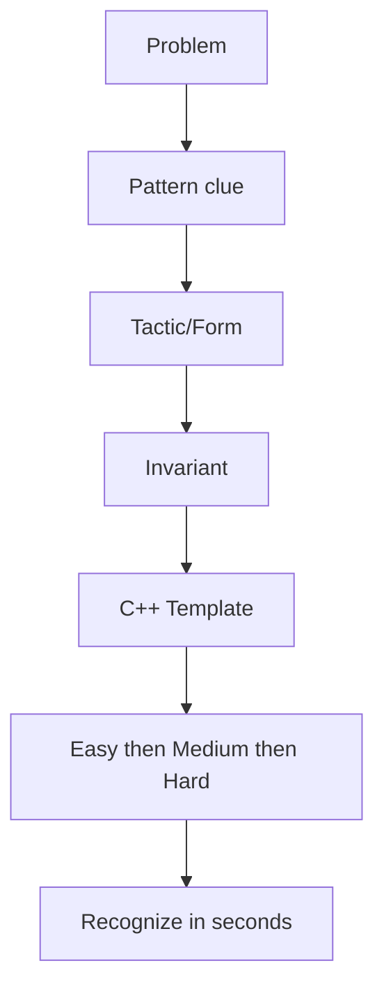

### 25.1. STL + Implementation

**Core use:** Use STL when the real challenge is choosing the correct container and operation complexity.

| Tactic / Pattern form | Recognize when | How it works / invariant |
|---|---|---|
| Frequency map / counting | Need counts, duplicates, first/last occurrence, grouping by value. | Store value -> count. unordered_map for average O(1), map when sorted order is needed. |
| Sort + custom comparator | Order decides greedy, grouping, interval merge, two pointers, or binary-search feasibility. | Sort by the field that makes future choices safe: end time for intervals, start time for merging, value for pairs. |
| Heap / priority queue | Need repeatedly best/worst current item, top K, merging K streams, scheduling. | Push candidates; pop best. For deletions not at top, use lazy deletion or alternative structure. |

#### 25.1.1. Frequency map / counting

**Recognize:** Need counts, duplicates, first/last occurrence, grouping by value.

**How to do it:** Store value -> count. unordered_map for average O(1), map when sorted order is needed.

```cpp
unordered_map<int,int> freq;
for (int x: a) freq[x]++;
for (auto [x,c]: freq) { /* use count */ }
```

**Related problems by difficulty**

| Difficulty | Problem | Link | Pattern/Form | Fast intuition |
|---|---|---|---|---|
| Easy | Contains Duplicate | https://leetcode.com/problems/contains-duplicate/ | set/hash | Duplicate exists if insertion sees old value. |
| Medium | Top K Frequent Elements | https://leetcode.com/problems/top-k-frequent-elements/ | hash + heap/bucket | Count first, then extract highest frequencies. |
| Hard | Minimum Window Substring | https://leetcode.com/problems/minimum-window-substring/ | frequency window | Keep required counts and shrink when all satisfied. |

#### 25.1.2. Sort + custom comparator

**Recognize:** Order decides greedy, grouping, interval merge, two pointers, or binary-search feasibility.

**How to do it:** Sort by the field that makes future choices safe: end time for intervals, start time for merging, value for pairs.

```cpp
sort(v.begin(), v.end(), [](auto &a, auto &b){
    if (a.first != b.first) return a.first < b.first;
    return a.second < b.second;
});
```

**Related problems by difficulty**

| Difficulty | Problem | Link | Pattern/Form | Fast intuition |
|---|---|---|---|---|
| Easy | Merge Sorted Array | https://leetcode.com/problems/merge-sorted-array/ | sorted merge | Use order to avoid extra searching. |
| Medium | Merge Intervals | https://leetcode.com/problems/merge-intervals/ | sort by start | Overlaps become adjacent after sorting. |
| Hard | Russian Doll Envelopes | https://leetcode.com/problems/russian-doll-envelopes/ | sort + LIS | Sort width asc, height desc, then LIS heights. |

#### 25.1.3. Heap / priority queue

**Recognize:** Need repeatedly best/worst current item, top K, merging K streams, scheduling.

**How to do it:** Push candidates; pop best. For deletions not at top, use lazy deletion or alternative structure.

```cpp
priority_queue<int> maxpq;
priority_queue<int, vector<int>, greater<int>> minpq;
for (int x: a) minpq.push(x);
while (!minpq.empty()) { auto x=minpq.top(); minpq.pop(); }
```

**Related problems by difficulty**

| Difficulty | Problem | Link | Pattern/Form | Fast intuition |
|---|---|---|---|---|
| Easy | Last Stone Weight | https://leetcode.com/problems/last-stone-weight/ | max heap | Always combine two largest stones. |
| Medium | Kth Largest Element in an Array | https://leetcode.com/problems/kth-largest-element-in-an-array/ | heap/quickselect | Maintain top k or partition around kth. |
| Hard | Find Median from Data Stream | https://leetcode.com/problems/find-median-from-data-stream/ | two heaps | Left max heap and right min heap balance medians. |

### 25.2. Prefix Sum + Difference Array

**Core use:** Use prefix when repeated range/subarray queries can be transformed into cumulative state.

| Tactic / Pattern form | Recognize when | How it works / invariant |
|---|---|---|
| Static range sum | Many queries ask sum/min count over fixed array. | Build pref once. Range [l,r] is total up to r minus total before l. |
| Difference array range updates | Many range add operations, final array or point values needed. | Mark only boundaries: diff[l]+=x, diff[r+1]-=x, then prefix reconstructs. |
| 2D prefix / rectangle queries | Grid asks many rectangle sums/counts. | Use inclusion-exclusion: big rectangle minus top/left plus overlap. |

#### 25.2.1. Static range sum

**Recognize:** Many queries ask sum/min count over fixed array.

**How to do it:** Build pref once. Range [l,r] is total up to r minus total before l.

```cpp
vector<long long> pref(n+1);
for(int i=0;i<n;i++) pref[i+1]=pref[i]+a[i];
auto sum=[&](int l,int r){ return pref[r+1]-pref[l]; };
```

**Related problems by difficulty**

| Difficulty | Problem | Link | Pattern/Form | Fast intuition |
|---|---|---|---|---|
| Easy | Range Sum Query - Immutable | https://leetcode.com/problems/range-sum-query-immutable/ | 1D prefix | Precompute once, answer each query O(1). |
| Medium | Subarray Sum Equals K | https://leetcode.com/problems/subarray-sum-equals-k/ | prefix + hash | Need earlier prefix = current-k. |
| Hard | Maximum Sum of 3 Non-Overlapping Subarrays | https://leetcode.com/problems/maximum-sum-of-3-non-overlapping-subarrays/ | window prefix + best left/right | Use prefix window sums and precomputed best positions. |

#### 25.2.2. Difference array range updates

**Recognize:** Many range add operations, final array or point values needed.

**How to do it:** Mark only boundaries: diff[l]+=x, diff[r+1]-=x, then prefix reconstructs.

```cpp
vector<long long> diff(n+1);
auto add=[&](int l,int r,long long x){ diff[l]+=x; if(r+1<n) diff[r+1]-=x; };
for(int i=1;i<n;i++) diff[i]+=diff[i-1];
```

**Related problems by difficulty**

| Difficulty | Problem | Link | Pattern/Form | Fast intuition |
|---|---|---|---|---|
| Easy | Shifting Letters | https://leetcode.com/problems/shifting-letters/ | suffix/diff | Accumulated shifts affect prefixes/suffixes. |
| Medium | Car Pooling | https://leetcode.com/problems/car-pooling/ | difference timeline | Passenger changes happen at pickup/dropoff positions. |
| Hard | Corporate Flight Bookings | https://leetcode.com/problems/corporate-flight-bookings/ | range add diff | Each booking adds seats over an interval. |

#### 25.2.3. 2D prefix / rectangle queries

**Recognize:** Grid asks many rectangle sums/counts.

**How to do it:** Use inclusion-exclusion: big rectangle minus top/left plus overlap.

```cpp
vector<vector<long long>> ps(n+1, vector<long long>(m+1));
for(int i=1;i<=n;i++) for(int j=1;j<=m;j++)
 ps[i][j]=a[i-1][j-1]+ps[i-1][j]+ps[i][j-1]-ps[i-1][j-1];
auto rect=[&](int r1,int c1,int r2,int c2){
 return ps[r2+1][c2+1]-ps[r1][c2+1]-ps[r2+1][c1]+ps[r1][c1];
};
```

**Related problems by difficulty**

| Difficulty | Problem | Link | Pattern/Form | Fast intuition |
|---|---|---|---|---|
| Easy | Matrix Block Sum | https://leetcode.com/problems/matrix-block-sum/ | 2D prefix | Each answer is a clipped rectangle sum. |
| Medium | Range Sum Query 2D - Immutable | https://leetcode.com/problems/range-sum-query-2d-immutable/ | 2D prefix | Rectangle query by inclusion-exclusion. |
| Hard | Max Sum of Rectangle No Larger Than K | https://leetcode.com/problems/max-sum-of-rectangle-no-larger-than-k/ | compressed rows + prefix set | Reduce 2D to 1D max subarray no larger than k. |

### 25.3. Binary Search

**Core use:** Use when sorted order or monotonic feasibility divides answers into true/false zones.

| Tactic / Pattern form | Recognize when | How it works / invariant |
|---|---|---|
| Classic lower_bound/upper_bound | Input sorted; need first >= x, first > x, count in range. | Use standard library unless custom condition exists. |
| Binary search on answer | Question asks minimum possible maximum, maximum possible minimum, earliest time, capacity. | Guess answer x; check if feasible. Feasibility must be monotonic. |
| Real-valued / precision search | Answer is decimal and feasibility is monotonic, or need optimize continuous value. | Loop fixed iterations, not while equality. Keep doubles. |

#### 25.3.1. Classic lower_bound/upper_bound

**Recognize:** Input sorted; need first >= x, first > x, count in range.

**How to do it:** Use standard library unless custom condition exists.

```cpp
auto it = lower_bound(a.begin(), a.end(), x);
int idx = it - a.begin();
int cnt = upper_bound(a.begin(), a.end(), R) - lower_bound(a.begin(), a.end(), L);
```

**Related problems by difficulty**

| Difficulty | Problem | Link | Pattern/Form | Fast intuition |
|---|---|---|---|---|
| Easy | Binary Search | https://leetcode.com/problems/binary-search/ | classic sorted search | Discard half depending on comparison. |
| Medium | Find First and Last Position | https://leetcode.com/problems/find-first-and-last-position-of-element-in-sorted-array/ | lower/upper bound | First >= target and first > target give range. |
| Hard | Median of Two Sorted Arrays | https://leetcode.com/problems/median-of-two-sorted-arrays/ | binary partition | Partition both arrays so left side <= right side. |

#### 25.3.2. Binary search on answer

**Recognize:** Question asks minimum possible maximum, maximum possible minimum, earliest time, capacity.

**How to do it:** Guess answer x; check if feasible. Feasibility must be monotonic.

```cpp
long long lo=0, hi=1e18, ans=hi;
while(lo<=hi){
 long long mid=lo+(hi-lo)/2;
 if(check(mid)){ ans=mid; hi=mid-1; }
 else lo=mid+1;
}
```

**Related problems by difficulty**

| Difficulty | Problem | Link | Pattern/Form | Fast intuition |
|---|---|---|---|---|
| Easy | Sqrt(x) | https://leetcode.com/problems/sqrtx/ | last true | Find largest m with m*m <= x. |
| Medium | Koko Eating Bananas | https://leetcode.com/problems/koko-eating-bananas/ | min feasible speed | Higher speed only helps, so binary search speed. |
| Hard | Split Array Largest Sum | https://leetcode.com/problems/split-array-largest-sum/ | minimize max | Check if array can split with each part <= mid. |

#### 25.3.3. Real-valued / precision search

**Recognize:** Answer is decimal and feasibility is monotonic, or need optimize continuous value.

**How to do it:** Loop fixed iterations, not while equality. Keep doubles.

```cpp
double lo=0, hi=1e9;
for(int it=0; it<100; it++){
 double mid=(lo+hi)/2;
 if(check(mid)) hi=mid; else lo=mid;
}
cout<<fixed<<setprecision(10)<<hi;
```

**Related problems by difficulty**

| Difficulty | Problem | Link | Pattern/Form | Fast intuition |
|---|---|---|---|---|
| Easy | Valid Perfect Square | https://leetcode.com/problems/valid-perfect-square/ | integer BS | Same idea without floating precision. |
| Medium | Minimize Max Distance to Gas Station | https://leetcode.com/problems/minimize-max-distance-to-gas-station/ | real BS | Check stations needed for max gap mid. |
| Hard | Maximum Average Subarray II | https://leetcode.com/problems/maximum-average-subarray-ii/ | real answer + prefix | Check if some length-k subarray has average >= mid. |

### 25.4. Two Pointers + Sliding Window

**Core use:** Use for contiguous segments, sorted pair decisions, or maintaining a moving valid state.

| Tactic / Pattern form | Recognize when | How it works / invariant |
|---|---|---|
| Opposite ends | Sorted array/palindrome/pair problems; need discard one side safely. | Compare current pair. Move the side that cannot be part of a better answer. |
| Variable sliding window | Subarray/substring with at most/at least condition and monotonic validity. | Expand right; while invalid shrink left; update answer when valid. |
| Exact K via atMost(K) | Need count subarrays/substrings with exactly K distinct/odd/etc. | exactly(K)=atMost(K)-atMost(K-1). At most is easier with window. |

#### 25.4.1. Opposite ends

**Recognize:** Sorted array/palindrome/pair problems; need discard one side safely.

**How to do it:** Compare current pair. Move the side that cannot be part of a better answer.

```cpp
int l=0,r=n-1;
while(l<r){
 long long s=a[l]+a[r];
 if(s==target) break;
 else if(s<target) l++;
 else r--;
}
```

**Related problems by difficulty**

| Difficulty | Problem | Link | Pattern/Form | Fast intuition |
|---|---|---|---|---|
| Easy | Valid Palindrome | https://leetcode.com/problems/valid-palindrome/ | opposite ends | Compare symmetric useful characters. |
| Medium | Two Sum II | https://leetcode.com/problems/two-sum-ii-input-array-is-sorted/ | sorted pair | Too small move left, too large move right. |
| Hard | Trapping Rain Water | https://leetcode.com/problems/trapping-rain-water/ | two ends max boundary | Water depends on smaller side boundary. |

#### 25.4.2. Variable sliding window

**Recognize:** Subarray/substring with at most/at least condition and monotonic validity.

**How to do it:** Expand right; while invalid shrink left; update answer when valid.

```cpp
int l=0; long long sum=0, ans=0;
for(int r=0;r<n;r++){
 sum += a[r];
 while(l<=r && !valid(sum,l,r)){ sum -= a[l++]; }
 ans = max(ans, (long long)r-l+1);
}
```

**Related problems by difficulty**

| Difficulty | Problem | Link | Pattern/Form | Fast intuition |
|---|---|---|---|---|
| Easy | Best Time to Buy and Sell Stock | https://leetcode.com/problems/best-time-to-buy-and-sell-stock/ | running min/window | Best profit uses smallest previous price. |
| Medium | Longest Substring Without Repeating Characters | https://leetcode.com/problems/longest-substring-without-repeating-characters/ | unique window | Move left past repeated character. |
| Hard | Minimum Window Substring | https://leetcode.com/problems/minimum-window-substring/ | covering window | Shrink while all required chars are covered. |

#### 25.4.3. Exact K via atMost(K)

**Recognize:** Need count subarrays/substrings with exactly K distinct/odd/etc.

**How to do it:** exactly(K)=atMost(K)-atMost(K-1). At most is easier with window.

```cpp
long long atMost(vector<int>& a,int K){
 unordered_map<int,int> mp; long long ans=0; int l=0;
 for(int r=0;r<a.size();r++){
  if(mp[a[r]]++==0) K--;
  while(K<0){ if(--mp[a[l]]==0) K++; l++; }
  ans += r-l+1;
 } return ans;
}
```

**Related problems by difficulty**

| Difficulty | Problem | Link | Pattern/Form | Fast intuition |
|---|---|---|---|---|
| Easy | Max Consecutive Ones III | https://leetcode.com/problems/max-consecutive-ones-iii/ | at most K zeros | Maintain window with at most k flips. |
| Medium | Subarrays with K Different Integers | https://leetcode.com/problems/subarrays-with-k-different-integers/ | exact K = atMost diff | Count at most k distinct then subtract. |
| Hard | Count Subarrays With Fixed Bounds | https://leetcode.com/problems/count-subarrays-with-fixed-bounds/ | last bad/min/max positions | Each right contributes valid starts based on boundaries. |

### 25.5. Stack / Monotonic Stack / Deque / Heap

**Core use:** Use when nearest greater/smaller, unresolved elements, or window extrema appear.

| Tactic / Pattern form | Recognize when | How it works / invariant |
|---|---|---|
| Monotonic stack | Need next/previous greater/smaller, histogram, temperature waits. | Maintain stack in monotonic order. Pop elements solved by current index. |
| Monotonic deque | Need max/min in every sliding window. | Remove expired front; remove useless back; front is current best. |
| Stack for parsing/nesting | Brackets, paths, decoding strings, calculators. | Push context when entering nested structure; pop and combine when closing. |

#### 25.5.1. Monotonic stack

**Recognize:** Need next/previous greater/smaller, histogram, temperature waits.

**How to do it:** Maintain stack in monotonic order. Pop elements solved by current index.

```cpp
vector<int> nxt(n,-1), st;
for(int i=0;i<n;i++){
 while(!st.empty() && a[st.back()] < a[i]){ nxt[st.back()]=i; st.pop_back(); }
 st.push_back(i);
}
```

**Related problems by difficulty**

| Difficulty | Problem | Link | Pattern/Form | Fast intuition |
|---|---|---|---|---|
| Easy | Next Greater Element I | https://leetcode.com/problems/next-greater-element-i/ | next greater stack | Current greater resolves previous smaller values. |
| Medium | Daily Temperatures | https://leetcode.com/problems/daily-temperatures/ | monotonic decreasing stack | Pop colder days when warmer day appears. |
| Hard | Largest Rectangle in Histogram | https://leetcode.com/problems/largest-rectangle-in-histogram/ | prev/next smaller | Popped bar uses current index as right boundary. |

#### 25.5.2. Monotonic deque

**Recognize:** Need max/min in every sliding window.

**How to do it:** Remove expired front; remove useless back; front is current best.

```cpp
deque<int> dq;
for(int i=0;i<n;i++){
 while(!dq.empty() && dq.front()<=i-k) dq.pop_front();
 while(!dq.empty() && a[dq.back()]<=a[i]) dq.pop_back();
 dq.push_back(i);
 if(i>=k-1) ans.push_back(a[dq.front()]);
}
```

**Related problems by difficulty**

| Difficulty | Problem | Link | Pattern/Form | Fast intuition |
|---|---|---|---|---|
| Easy | Moving Average from Data Stream | https://leetcode.com/problems/moving-average-from-data-stream/ | fixed window | Maintain queue and sum. |
| Medium | Sliding Window Maximum | https://leetcode.com/problems/sliding-window-maximum/ | monotonic deque | Front stores best non-expired candidate. |
| Hard | Shortest Subarray with Sum at Least K | https://leetcode.com/problems/shortest-subarray-with-sum-at-least-k/ | prefix + monotonic deque | Keep increasing prefixes to maximize gain. |

#### 25.5.3. Stack for parsing/nesting

**Recognize:** Brackets, paths, decoding strings, calculators.

**How to do it:** Push context when entering nested structure; pop and combine when closing.

```cpp
stack<char> st;
for(char c:s){
 if(c=='(') st.push(c);
 else if(c==')'){ if(st.empty()) return false; st.pop(); }
}
return st.empty();
```

**Related problems by difficulty**

| Difficulty | Problem | Link | Pattern/Form | Fast intuition |
|---|---|---|---|---|
| Easy | Valid Parentheses | https://leetcode.com/problems/valid-parentheses/ | stack matching | Top must match closing bracket. |
| Medium | Decode String | https://leetcode.com/problems/decode-string/ | nested stack | Store repeat count and previous string per bracket. |
| Hard | Basic Calculator | https://leetcode.com/problems/basic-calculator/ | sign stack/parsing | Parentheses change active sign context. |

### 25.6. Bit Manipulation + XOR + Bitmask

**Core use:** Use when constraints mention bits, subsets, parity, XOR, masks, or n <= 20.

| Tactic / Pattern form | Recognize when | How it works / invariant |
|---|---|---|
| Basic bit operations | Need check/set/clear/toggle bits or power of two. | Use masks 1LL<<i and bitwise operators. |
| Prefix XOR | Subarray XOR equals K or range XOR queries. | xor(l,r)=pref[r+1]^pref[l]. Count earlier prefix=current^K. |
| Bitmask DP / subset enumeration | n <= 20 and state is chosen/unselected set. | Mask encodes chosen elements; transition adds/removes one bit. |

#### 25.6.1. Basic bit operations

**Recognize:** Need check/set/clear/toggle bits or power of two.

**How to do it:** Use masks 1LL<<i and bitwise operators.

```cpp
bool on(long long x,int i){ return (x>>i)&1LL; }
long long setb(long long x,int i){ return x | (1LL<<i); }
long long clearb(long long x,int i){ return x & ~(1LL<<i); }
bool power2(long long x){ return x>0 && (x&(x-1))==0; }
```

**Related problems by difficulty**

| Difficulty | Problem | Link | Pattern/Form | Fast intuition |
|---|---|---|---|---|
| Easy | Number of 1 Bits | https://leetcode.com/problems/number-of-1-bits/ | bit count | Repeatedly remove lowbit or use builtin. |
| Medium | Single Number III | https://leetcode.com/problems/single-number-iii/ | xor partition | Use differing bit to split two uniques. |
| Hard | Minimum One Bit Operations to Make Integers Zero | https://leetcode.com/problems/minimum-one-bit-operations-to-make-integers-zero/ | gray code/bit recurrence | Highest bit defines recursive transformation. |

#### 25.6.2. Prefix XOR

**Recognize:** Subarray XOR equals K or range XOR queries.

**How to do it:** xor(l,r)=pref[r+1]^pref[l]. Count earlier prefix=current^K.

```cpp
unordered_map<int,long long> cnt; cnt[0]=1;
int pref=0; long long ans=0;
for(int x:a){ pref ^= x; ans += cnt[pref ^ K]; cnt[pref]++; }
```

**Related problems by difficulty**

| Difficulty | Problem | Link | Pattern/Form | Fast intuition |
|---|---|---|---|---|
| Easy | XOR Operation in an Array | https://leetcode.com/problems/xor-operation-in-an-array/ | xor basics | Accumulate xor directly. |
| Medium | Count Triplets That Can Form Two Arrays of Equal XOR | https://leetcode.com/problems/count-triplets-that-can-form-two-arrays-of-equal-xor/ | prefix xor | Equal XOR means prefix values repeat. |
| Hard | Maximum XOR With an Element From Array | https://leetcode.com/problems/maximum-xor-with-an-element-from-array/ | offline sort + trie | Insert eligible nums, query max xor. |

#### 25.6.3. Bitmask DP / subset enumeration

**Recognize:** n <= 20 and state is chosen/unselected set.

**How to do it:** Mask encodes chosen elements; transition adds/removes one bit.

```cpp
int N=1<<n; vector<long long> dp(N, INF); dp[0]=0;
for(int mask=0; mask<N; mask++)
 for(int i=0;i<n;i++) if(!(mask>>i&1))
  dp[mask|1<<i]=min(dp[mask|1<<i], dp[mask]+cost(mask,i));
```

**Related problems by difficulty**

| Difficulty | Problem | Link | Pattern/Form | Fast intuition |
|---|---|---|---|---|
| Easy | Subsets | https://leetcode.com/problems/subsets/ | mask enumeration | Each bit decides include/exclude. |
| Medium | Partition to K Equal Sum Subsets | https://leetcode.com/problems/partition-to-k-equal-sum-subsets/ | mask/backtracking | Mask tracks used numbers and current bucket. |
| Hard | Shortest Path Visiting All Nodes | https://leetcode.com/problems/shortest-path-visiting-all-nodes/ | BFS over node,mask | State includes current node and visited set. |

### 25.7. Recursion + Backtracking

**Core use:** Use when all configurations must be generated, constraints prune search, or n is small.

| Tactic / Pattern form | Recognize when | How it works / invariant |
|---|---|---|
| Include/exclude recursion | Subsets, subsequences, choose/not choose. | At each index either take or skip; base saves/counts result. |
| Permutation / used array | Need all orderings or assignment matching. | Pick an unused item for current position; recurse; undo. |
| Constraint pruning | Board/search problems where brute force too large. | Check validity before recurse. Order choices to fail early. |

#### 25.7.1. Include/exclude recursion

**Recognize:** Subsets, subsequences, choose/not choose.

**How to do it:** At each index either take or skip; base saves/counts result.

```cpp
void dfs(int i, vector<int>& cur){
 if(i==n){ ans.push_back(cur); return; }
 dfs(i+1,cur);
 cur.push_back(a[i]); dfs(i+1,cur); cur.pop_back();
}
```

**Related problems by difficulty**

| Difficulty | Problem | Link | Pattern/Form | Fast intuition |
|---|---|---|---|---|
| Easy | Subsets | https://leetcode.com/problems/subsets/ | include/exclude | Every element has two choices. |
| Medium | Combination Sum | https://leetcode.com/problems/combination-sum/ | choose with reuse | Stay at same index when reuse allowed. |
| Hard | Palindrome Partitioning II | https://leetcode.com/problems/palindrome-partitioning-ii/ | cuts + memo/DP | Backtracking form becomes optimized DP. |

#### 25.7.2. Permutation / used array

**Recognize:** Need all orderings or assignment matching.

**How to do it:** Pick an unused item for current position; recurse; undo.

```cpp
void perm(vector<int>& cur){
 if(cur.size()==n){ ans.push_back(cur); return; }
 for(int i=0;i<n;i++) if(!used[i]){
  used[i]=1; cur.push_back(a[i]);
  perm(cur);
  cur.pop_back(); used[i]=0;
 }
}
```

**Related problems by difficulty**

| Difficulty | Problem | Link | Pattern/Form | Fast intuition |
|---|---|---|---|---|
| Easy | Permutations | https://leetcode.com/problems/permutations/ | used array | Each level chooses next unused item. |
| Medium | Permutations II | https://leetcode.com/problems/permutations-ii/ | dedup sorted choices | Skip duplicate if previous identical unused. |
| Hard | N-Queens | https://leetcode.com/problems/n-queens/ | constraint placement | One queen per row; block columns and diagonals. |

#### 25.7.3. Constraint pruning

**Recognize:** Board/search problems where brute force too large.

**How to do it:** Check validity before recurse. Order choices to fail early.

```cpp
bool col[20], d1[40], d2[40];
void queens(int r){
 if(r==n){ ans++; return; }
 for(int c=0;c<n;c++){
  if(col[c]||d1[r+c]||d2[r-c+n]) continue;
  col[c]=d1[r+c]=d2[r-c+n]=1;
  queens(r+1);
  col[c]=d1[r+c]=d2[r-c+n]=0;
 }
}
```

**Related problems by difficulty**

| Difficulty | Problem | Link | Pattern/Form | Fast intuition |
|---|---|---|---|---|
| Easy | Letter Combinations of a Phone Number | https://leetcode.com/problems/letter-combinations-of-a-phone-number/ | choice per digit | Each level chooses one mapped character. |
| Medium | Word Search | https://leetcode.com/problems/word-search/ | grid backtracking | Mark visited on path, undo after branch. |
| Hard | Sudoku Solver | https://leetcode.com/problems/sudoku-solver/ | constraint propagation | Try only values valid for row/col/box. |

### 25.8. Graphs

**Core use:** Use when problem can be modeled as nodes and edges; first define node, edge, cost.

| Tactic / Pattern form | Recognize when | How it works / invariant |
|---|---|---|
| BFS shortest path unweighted | Minimum steps/moves in unweighted graph/grid/state space. | Push source(s); BFS layers represent distance. |
| DFS components/cycle | Need reachability, connected components, cycle detection, topological DFS. | Mark visited; recursively explore; maintain parent/color for cycles. |
| Dijkstra / 0-1 BFS | Weighted shortest path: positive weights or weights 0/1. | Dijkstra uses min-heap; 0-1 BFS uses deque for 0/1 edge costs. |
| Topological sort | Prerequisites, DAG ordering, dependency DP. | Indegree zero nodes can be processed; removing them unlocks next nodes. |

#### 25.8.1. BFS shortest path unweighted

**Recognize:** Minimum steps/moves in unweighted graph/grid/state space.

**How to do it:** Push source(s); BFS layers represent distance.

```cpp
queue<int> q; vector<int> dist(n,-1);
dist[src]=0; q.push(src);
while(!q.empty()){ int u=q.front(); q.pop();
 for(int v:g[u]) if(dist[v]==-1){ dist[v]=dist[u]+1; q.push(v); }
}
```

**Related problems by difficulty**

| Difficulty | Problem | Link | Pattern/Form | Fast intuition |
|---|---|---|---|---|
| Easy | Flood Fill | https://leetcode.com/problems/flood-fill/ | BFS/DFS grid | Visit connected same-color cells. |
| Medium | Rotting Oranges | https://leetcode.com/problems/rotting-oranges/ | multi-source BFS | All rotten oranges spread simultaneously. |
| Hard | Word Ladder | https://leetcode.com/problems/word-ladder/ | BFS implicit graph | Each word differs by one char; BFS gives min transformations. |

#### 25.8.2. DFS components/cycle

**Recognize:** Need reachability, connected components, cycle detection, topological DFS.

**How to do it:** Mark visited; recursively explore; maintain parent/color for cycles.

```cpp
vector<int> vis(n);
void dfs(int u){
 vis[u]=1;
 for(int v:g[u]) if(!vis[v]) dfs(v);
}
```

**Related problems by difficulty**

| Difficulty | Problem | Link | Pattern/Form | Fast intuition |
|---|---|---|---|---|
| Easy | Find if Path Exists in Graph | https://leetcode.com/problems/find-if-path-exists-in-graph/ | DFS/DSU connectivity | Endpoints must be in same component. |
| Medium | Number of Islands | https://leetcode.com/problems/number-of-islands/ | grid components | Each unvisited land starts a component. |
| Hard | Critical Connections in a Network | https://leetcode.com/problems/critical-connections-in-a-network/ | Tarjan bridges | Low-link reveals edges whose removal disconnects. |

#### 25.8.3. Dijkstra / 0-1 BFS

**Recognize:** Weighted shortest path: positive weights or weights 0/1.

**How to do it:** Dijkstra uses min-heap; 0-1 BFS uses deque for 0/1 edge costs.

```cpp
const long long INF=4e18; vector<long long> d(n,INF);
priority_queue<pair<long long,int>, vector<pair<long long,int>>, greater<pair<long long,int>>> pq;
d[s]=0; pq.push({0,s});
while(!pq.empty()){ auto [du,u]=pq.top(); pq.pop(); if(du!=d[u]) continue;
 for(auto [v,w]:g[u]) if(d[v]>du+w){ d[v]=du+w; pq.push({d[v],v}); }
}
```

**Related problems by difficulty**

| Difficulty | Problem | Link | Pattern/Form | Fast intuition |
|---|---|---|---|---|
| Easy | Network Delay Time | https://leetcode.com/problems/network-delay-time/ | Dijkstra | Signal arrival is shortest path from source. |
| Medium | Path With Minimum Effort | https://leetcode.com/problems/path-with-minimum-effort/ | Dijkstra minimax | Distance is minimal maximum edge effort. |
| Hard | Minimum Cost to Make at Least One Valid Path in a Grid | https://leetcode.com/problems/minimum-cost-to-make-at-least-one-valid-path-in-a-grid/ | 0-1 BFS | Following arrow costs 0, changing direction costs 1. |

#### 25.8.4. Topological sort

**Recognize:** Prerequisites, DAG ordering, dependency DP.

**How to do it:** Indegree zero nodes can be processed; removing them unlocks next nodes.

```cpp
queue<int> q; for(int i=0;i<n;i++) if(indeg[i]==0) q.push(i);
vector<int> topo;
while(!q.empty()){ int u=q.front(); q.pop(); topo.push_back(u);
 for(int v:g[u]) if(--indeg[v]==0) q.push(v);
}
// if topo.size()<n then cycle
```

**Related problems by difficulty**

| Difficulty | Problem | Link | Pattern/Form | Fast intuition |
|---|---|---|---|---|
| Easy | Find the Town Judge | https://leetcode.com/problems/find-the-town-judge/ | indegree/outdegree | Judge has n-1 indegree and 0 outdegree. |
| Medium | Course Schedule | https://leetcode.com/problems/course-schedule/ | toposort cycle check | All courses possible iff no dependency cycle. |
| Hard | Alien Dictionary | https://leetcode.com/problems/alien-dictionary/ | build DAG + toposort | First differing char gives ordering edge. |

### 25.9. Trees + LCA + DSU

**Core use:** Trees give unique paths; DSU manages dynamic components.

| Tactic / Pattern form | Recognize when | How it works / invariant |
|---|---|---|
| Tree DFS values | Need parent, depth, subtree size, leaves, reroot basics. | Root tree, avoid parent, aggregate children postorder. |
| LCA / binary lifting | Many tree path, ancestor, distance, kth ancestor queries. | Precompute up[v][j], lift deeper node, then lift both until parents match. |
| DSU union find | Connectivity after merges, Kruskal MST, groups/components. | Find representative with path compression; union by size/rank. |

#### 25.9.1. Tree DFS values

**Recognize:** Need parent, depth, subtree size, leaves, reroot basics.

**How to do it:** Root tree, avoid parent, aggregate children postorder.

```cpp
vector<int> parent(n+1), depth(n+1), sub(n+1);
void dfs(int u,int p){
 parent[u]=p; sub[u]=1;
 for(int v:g[u]) if(v!=p){ depth[v]=depth[u]+1; dfs(v,u); sub[u]+=sub[v]; }
}
```

**Related problems by difficulty**

| Difficulty | Problem | Link | Pattern/Form | Fast intuition |
|---|---|---|---|---|
| Easy | Maximum Depth of Binary Tree | https://leetcode.com/problems/maximum-depth-of-binary-tree/ | tree DFS | Depth is 1 + max child depth. |
| Medium | Subordinates | https://cses.fi/problemset/task/1674 | subtree size | Postorder counts descendants. |
| Hard | Sum of Distances in Tree | https://leetcode.com/problems/sum-of-distances-in-tree/ | reroot DP | Move root across edge and update contribution. |

#### 25.9.2. LCA / binary lifting

**Recognize:** Many tree path, ancestor, distance, kth ancestor queries.

**How to do it:** Precompute up[v][j], lift deeper node, then lift both until parents match.

```cpp
const int LOG=20; vector<array<int,20>> up;
void build(int u,int p){ up[u][0]=p; for(int j=1;j<LOG;j++) up[u][j]=up[up[u][j-1]][j-1]; for(int v:g[u]) if(v!=p){ depth[v]=depth[u]+1; build(v,u); } }
int lift(int u,int k){ for(int j=0;j<LOG;j++) if(k>>j&1) u=up[u][j]; return u; }
```

**Related problems by difficulty**

| Difficulty | Problem | Link | Pattern/Form | Fast intuition |
|---|---|---|---|---|
| Easy | Lowest Common Ancestor of a BST | https://leetcode.com/problems/lowest-common-ancestor-of-a-binary-search-tree/ | BST LCA | Split point between p and q is LCA. |
| Medium | Lowest Common Ancestor of a Binary Tree | https://leetcode.com/problems/lowest-common-ancestor-of-a-binary-tree/ | tree LCA recursion | If both sides contain target, current is LCA. |
| Hard | Distance Queries | https://cses.fi/problemset/task/1135 | binary lifting LCA | Distance = depth[u]+depth[v]-2*depth[lca]. |

#### 25.9.3. DSU union find

**Recognize:** Connectivity after merges, Kruskal MST, groups/components.

**How to do it:** Find representative with path compression; union by size/rank.

```cpp
struct DSU{ vector<int> p,sz; DSU(int n):p(n),sz(n,1){iota(p.begin(),p.end(),0);}
 int find(int x){ return p[x]==x?x:p[x]=find(p[x]); }
 bool unite(int a,int b){ a=find(a); b=find(b); if(a==b) return false; if(sz[a]<sz[b]) swap(a,b); p[b]=a; sz[a]+=sz[b]; return true; }
};
```

**Related problems by difficulty**

| Difficulty | Problem | Link | Pattern/Form | Fast intuition |
|---|---|---|---|---|
| Easy | Find if Path Exists in Graph | https://leetcode.com/problems/find-if-path-exists-in-graph/ | DSU connectivity | Union all edges, compare representatives. |
| Medium | Number of Provinces | https://leetcode.com/problems/number-of-provinces/ | DSU components | Union connected cities; count roots. |
| Hard | Accounts Merge | https://leetcode.com/problems/accounts-merge/ | DSU by email | Emails belonging to same account merge components. |

### 25.10. Dynamic Programming

**Core use:** Use when recursive states repeat and answer is count/min/max/possible.

| Tactic / Pattern form | Recognize when | How it works / invariant |
|---|---|---|
| Take / not take | Subset, knapsack, choose items, partition. | State is index and capacity/sum; choice is skip or take item. |
| Ending at index | LIS, max subarray, best answer ending here. | Define dp[i] as best valid structure ending at i. |
| Matching / grid DP | Two strings or grid movement; state uses prefixes/positions. | dp[i][j] answers first i and first j, or grid cell i,j. |
| Interval / game DP | Operations on subarray, remove/merge, optimal play on ends. | Solve by increasing length; choose split or endpoint. |

#### 25.10.1. Take / not take

**Recognize:** Subset, knapsack, choose items, partition.

**How to do it:** State is index and capacity/sum; choice is skip or take item.

```cpp
vector<long long> dp(W+1,0);
for(auto [w,val]: items)
 for(int cap=W; cap>=w; cap--)
  dp[cap]=max(dp[cap], dp[cap-w]+val);
```

**Related problems by difficulty**

| Difficulty | Problem | Link | Pattern/Form | Fast intuition |
|---|---|---|---|---|
| Easy | Climbing Stairs | https://leetcode.com/problems/climbing-stairs/ | 1D DP | Ways to reach i from i-1 or i-2. |
| Medium | Partition Equal Subset Sum | https://leetcode.com/problems/partition-equal-subset-sum/ | subset sum | Can we make total/2 using take/not take? |
| Hard | Profitable Schemes | https://leetcode.com/problems/profitable-schemes/ | knapsack count DP | Track members used and profit capped at target. |

#### 25.10.2. Ending at index

**Recognize:** LIS, max subarray, best answer ending here.

**How to do it:** Define dp[i] as best valid structure ending at i.

```cpp
vector<int> tail;
for(int x:a){
 auto it=lower_bound(tail.begin(), tail.end(), x);
 if(it==tail.end()) tail.push_back(x); else *it=x;
}
int lis=tail.size();
```

**Related problems by difficulty**

| Difficulty | Problem | Link | Pattern/Form | Fast intuition |
|---|---|---|---|---|
| Easy | Maximum Subarray | https://leetcode.com/problems/maximum-subarray/ | Kadane ending here | Either extend previous or start new at current. |
| Medium | Longest Increasing Subsequence | https://leetcode.com/problems/longest-increasing-subsequence/ | ending/tails | Tail array stores smallest ending value per length. |
| Hard | Russian Doll Envelopes | https://leetcode.com/problems/russian-doll-envelopes/ | sort + LIS | Transform 2D nesting to 1D LIS. |

#### 25.10.3. Matching / grid DP

**Recognize:** Two strings or grid movement; state uses prefixes/positions.

**How to do it:** dp[i][j] answers first i and first j, or grid cell i,j.

```cpp
vector<vector<int>> dp(n+1, vector<int>(m+1));
for(int i=1;i<=n;i++) for(int j=1;j<=m;j++)
 dp[i][j]=(s[i-1]==t[j-1])?1+dp[i-1][j-1]:max(dp[i-1][j],dp[i][j-1]);
```

**Related problems by difficulty**

| Difficulty | Problem | Link | Pattern/Form | Fast intuition |
|---|---|---|---|---|
| Easy | Min Cost Climbing Stairs | https://leetcode.com/problems/min-cost-climbing-stairs/ | 1D DP | Cost to stand on step from previous two. |
| Medium | Longest Common Subsequence | https://leetcode.com/problems/longest-common-subsequence/ | matching DP | Match chars or skip one side. |
| Hard | Edit Distance | https://leetcode.com/problems/edit-distance/ | matching DP operations | Insert/delete/replace from neighboring states. |

#### 25.10.4. Interval / game DP

**Recognize:** Operations on subarray, remove/merge, optimal play on ends.

**How to do it:** Solve by increasing length; choose split or endpoint.

```cpp
for(int len=1; len<=n; len++)
 for(int l=0; l+len-1<n; l++){
  int r=l+len-1;
  // dp[l][r] from smaller intervals
 }
```

**Related problems by difficulty**

| Difficulty | Problem | Link | Pattern/Form | Fast intuition |
|---|---|---|---|---|
| Easy | Predict the Winner | https://leetcode.com/problems/predict-the-winner/ | game DP | Score difference when choosing left/right. |
| Medium | Longest Palindromic Subsequence | https://leetcode.com/problems/longest-palindromic-subsequence/ | interval DP | Ends match or skip one end. |
| Hard | Burst Balloons | https://leetcode.com/problems/burst-balloons/ | interval last choice | Choose last balloon popped inside interval. |

### 25.11. Greedy + Sorting + Intervals

**Core use:** Use when a locally optimal choice can be proven by exchange argument.

| Tactic / Pattern form | Recognize when | How it works / invariant |
|---|---|---|
| Interval sort by end | Max non-overlap, minimum removals, activity selection. | Taking earliest finishing interval leaves maximum room for future. |
| Heap greedy scheduling | Deadlines, durations, rooms, top candidates. | Sort by time/deadline; heap keeps active or chosen tasks. |
| Sweep line | Events over time/coordinate: overlaps, maximum active, bookings. | Convert intervals to +1 start and -1 end events, sort events. |

#### 25.11.1. Interval sort by end

**Recognize:** Max non-overlap, minimum removals, activity selection.

**How to do it:** Taking earliest finishing interval leaves maximum room for future.

```cpp
sort(iv.begin(), iv.end(), [](auto&a,auto&b){return a[1]<b[1];});
int ans=0, last=INT_MIN;
for(auto &in:iv) if(in[0]>=last){ ans++; last=in[1]; }
```

**Related problems by difficulty**

| Difficulty | Problem | Link | Pattern/Form | Fast intuition |
|---|---|---|---|---|
| Easy | Meeting Rooms | https://leetcode.com/problems/meeting-rooms/ | interval overlap | After sorting starts, adjacent overlap decides. |
| Medium | Non-overlapping Intervals | https://leetcode.com/problems/non-overlapping-intervals/ | sort by end | Keep earliest ending interval. |
| Hard | Minimum Number of Arrows to Burst Balloons | https://leetcode.com/problems/minimum-number-of-arrows-to-burst-balloons/ | interval stabbing | One arrow at current end covers all overlapping balloons. |

#### 25.11.2. Heap greedy scheduling

**Recognize:** Deadlines, durations, rooms, top candidates.

**How to do it:** Sort by time/deadline; heap keeps active or chosen tasks.

```cpp
sort(courses.begin(), courses.end(), [](auto&a,auto&b){return a[1]<b[1];});
priority_queue<int> pq; int time=0;
for(auto &c:courses){ time+=c[0]; pq.push(c[0]); if(time>c[1]){ time-=pq.top(); pq.pop(); } }
```

**Related problems by difficulty**

| Difficulty | Problem | Link | Pattern/Form | Fast intuition |
|---|---|---|---|---|
| Easy | Assign Cookies | https://leetcode.com/problems/assign-cookies/ | sort greedy | Smallest cookie for smallest satisfied child. |
| Medium | Meeting Rooms II | https://leetcode.com/problems/meeting-rooms-ii/ | min heap end times | Room frees when earliest end <= current start. |
| Hard | Course Schedule III | https://leetcode.com/problems/course-schedule-iii/ | deadline + max heap | If time exceeds deadline, drop longest course. |

#### 25.11.3. Sweep line

**Recognize:** Events over time/coordinate: overlaps, maximum active, bookings.

**How to do it:** Convert intervals to +1 start and -1 end events, sort events.

```cpp
map<int,int> ev;
for(auto [l,r]: intervals){ ev[l]++; ev[r]--; }
int cur=0,best=0;
for(auto [x,d]:ev){ cur+=d; best=max(best,cur); }
```

**Related problems by difficulty**

| Difficulty | Problem | Link | Pattern/Form | Fast intuition |
|---|---|---|---|---|
| Easy | Employee Free Time | https://leetcode.com/problems/employee-free-time/ | merge intervals | Free gaps are between merged busy intervals. |
| Medium | My Calendar I | https://leetcode.com/problems/my-calendar-i/ | ordered intervals | New interval cannot overlap neighbors. |
| Hard | My Calendar III | https://leetcode.com/problems/my-calendar-iii/ | sweep line | Max prefix of event deltas is max overlap. |

### 25.12. Range Queries: Fenwick + Segment Tree + Sparse Table

**Core use:** Use when array queries/updates need faster than O(n).

| Tactic / Pattern form | Recognize when | How it works / invariant |
|---|---|---|
| Fenwick tree | Point update + prefix/range sum, frequency counts, inversion count. | BIT stores partial sums over lowbit ranges. |
| Segment tree | Range query + point/range update; min/max/sum/gcd/custom combine. | Build binary tree; query visits O(log n) nodes per segment. |
| Sparse table | Static idempotent queries: min/max/gcd over range, no updates. | Precompute answers for powers of two; combine two overlapping blocks. |

#### 25.12.1. Fenwick tree

**Recognize:** Point update + prefix/range sum, frequency counts, inversion count.

**How to do it:** BIT stores partial sums over lowbit ranges.

```cpp
struct BIT{ int n; vector<long long> bit; BIT(int n):n(n),bit(n+1){}
 void add(int i,long long v){ for(++i;i<=n;i+=i&-i) bit[i]+=v; }
 long long sumPrefix(int i){ long long s=0; for(++i;i>0;i-=i&-i) s+=bit[i]; return s; }
 long long sum(int l,int r){ return sumPrefix(r)-(l?sumPrefix(l-1):0); }
};
```

**Related problems by difficulty**

| Difficulty | Problem | Link | Pattern/Form | Fast intuition |
|---|---|---|---|---|
| Easy | Range Sum Query - Mutable | https://leetcode.com/problems/range-sum-query-mutable/ | Fenwick/segment | Point updates and range sum queries. |
| Medium | Count Number of Teams | https://leetcode.com/problems/count-number-of-teams/ | Fenwick counts | Count smaller/larger on both sides. |
| Hard | Count of Smaller Numbers After Self | https://leetcode.com/problems/count-of-smaller-numbers-after-self/ | Fenwick + compression | Insert from right and count smaller values. |

#### 25.12.2. Segment tree

**Recognize:** Range query + point/range update; min/max/sum/gcd/custom combine.

**How to do it:** Build binary tree; query visits O(log n) nodes per segment.

```cpp
struct Seg{ int n; vector<long long> st; Seg(vector<int>&a){ n=a.size(); st.assign(4*n,0); build(1,0,n-1,a);}
 void build(int p,int l,int r,vector<int>&a){ if(l==r){st[p]=a[l];return;} int m=(l+r)/2; build(p*2,l,m,a); build(p*2+1,m+1,r,a); st[p]=st[p*2]+st[p*2+1];}
 long long query(int p,int l,int r,int ql,int qr){ if(qr<l||r<ql) return 0; if(ql<=l&&r<=qr) return st[p]; int m=(l+r)/2; return query(p*2,l,m,ql,qr)+query(p*2+1,m+1,r,ql,qr);}
};
```

**Related problems by difficulty**

| Difficulty | Problem | Link | Pattern/Form | Fast intuition |
|---|---|---|---|---|
| Easy | Range Sum Query - Mutable | https://leetcode.com/problems/range-sum-query-mutable/ | segment tree | Same operations as BIT with flexible combine. |
| Medium | My Calendar I | https://leetcode.com/problems/my-calendar-i/ | ordered/segment possible | Detect interval overlap. |
| Hard | Range Module | https://leetcode.com/problems/range-module/ | lazy segment / intervals | Maintain covered ranges with add/remove/query. |

#### 25.12.3. Sparse table

**Recognize:** Static idempotent queries: min/max/gcd over range, no updates.

**How to do it:** Precompute answers for powers of two; combine two overlapping blocks.

```cpp
int K=__lg(n)+1; vector<vector<int>> st(K, vector<int>(n)); st[0]=a;
for(int k=1;k<K;k++) for(int i=0;i+(1<<k)<=n;i++) st[k][i]=min(st[k-1][i], st[k-1][i+(1<<(k-1))]);
auto rmq=[&](int l,int r){ int k=__lg(r-l+1); return min(st[k][l], st[k][r-(1<<k)+1]); };
```

**Related problems by difficulty**

| Difficulty | Problem | Link | Pattern/Form | Fast intuition |
|---|---|---|---|---|
| Easy | Static Range Minimum Query | https://cses.fi/problemset/task/1647 | sparse table | No updates, idempotent min query. |
| Medium | Range GCD Queries | https://www.spoj.com/problems/GCDEX/ | gcd sparse idea | GCD is idempotent and static-friendly. |
| Hard | LCA via Euler Tour RMQ | https://cses.fi/problemset/task/1135 | Euler + sparse | LCA becomes minimum depth over Euler interval. |

### 25.13. Math + Modular + Number Theory + Combinatorics

**Core use:** Use for divisibility, prime factors, modulo answers, counting arrangements.

| Tactic / Pattern form | Recognize when | How it works / invariant |
|---|---|---|
| Modular arithmetic / binexp | Large powers, modulo division, inverse under prime mod. | Fast exponent halves exponent; inverse is a^(MOD-2) for prime MOD. |
| Sieve / prime factorization | Need primes, factor counts, divisors, gcd/lcm. | Sieve primes or smallest prime factor; factor by repeated division. |
| Combinatorics nCk | Counting choices, paths, distributions, arrangements modulo prime. | Precompute factorial and inverse factorial; nCk = fact[n] invfact[k] invfact[n-k]. |

#### 25.13.1. Modular arithmetic / binexp

**Recognize:** Large powers, modulo division, inverse under prime mod.

**How to do it:** Fast exponent halves exponent; inverse is a^(MOD-2) for prime MOD.

```cpp
const long long MOD=1e9+7;
long long modpow(long long a,long long e){ long long r=1%MOD;
 while(e){ if(e&1) r=r*a%MOD; a=a*a%MOD; e>>=1; } return r;
}
long long inv(long long a){ return modpow(a, MOD-2); }
```

**Related problems by difficulty**

| Difficulty | Problem | Link | Pattern/Form | Fast intuition |
|---|---|---|---|---|
| Easy | Power of Two | https://leetcode.com/problems/power-of-two/ | bit/math | Power of two has one set bit. |
| Medium | Pow(x, n) | https://leetcode.com/problems/powx-n/ | binary exponentiation | Square base while halving exponent. |
| Hard | Super Pow | https://leetcode.com/problems/super-pow/ | mod exponent digits | Use exponent digit recurrence. |

#### 25.13.2. Sieve / prime factorization

**Recognize:** Need primes, factor counts, divisors, gcd/lcm.

**How to do it:** Sieve primes or smallest prime factor; factor by repeated division.

```cpp
vector<int> spf(N+1);
for(int i=0;i<=N;i++) spf[i]=i;
for(long long i=2;i*i<=N;i++) if(spf[i]==i) for(long long j=i*i;j<=N;j+=i) if(spf[j]==j) spf[j]=i;
vector<pair<int,int>> factor(int x){ vector<pair<int,int>> f; while(x>1){int p=spf[x],c=0; while(x%p==0)x/=p,c++; f.push_back({p,c});} return f; }
```

**Related problems by difficulty**

| Difficulty | Problem | Link | Pattern/Form | Fast intuition |
|---|---|---|---|---|
| Easy | Count Primes | https://leetcode.com/problems/count-primes/ | sieve | Mark multiples as composite. |
| Medium | Four Divisors | https://leetcode.com/problems/four-divisors/ | factor/divisors | Exactly four divisors from factor form. |
| Hard | Coprime Subsequences | https://www.codechef.com/problems/COPRIME3 | mobius/inclusion | Use gcd/counting over divisors. |

#### 25.13.3. Combinatorics nCk

**Recognize:** Counting choices, paths, distributions, arrangements modulo prime.

**How to do it:** Precompute factorial and inverse factorial; nCk = fact[n] invfact[k] invfact[n-k].

```cpp
vector<long long> fact(N+1), ifact(N+1);
fact[0]=1; for(int i=1;i<=N;i++) fact[i]=fact[i-1]*i%MOD;
ifact[N]=modpow(fact[N],MOD-2); for(int i=N;i;i--) ifact[i-1]=ifact[i]*i%MOD;
long long C(int n,int k){ if(k<0||k>n) return 0; return fact[n]*ifact[k]%MOD*ifact[n-k]%MOD; }
```

**Related problems by difficulty**

| Difficulty | Problem | Link | Pattern/Form | Fast intuition |
|---|---|---|---|---|
| Easy | Pascal Triangle | https://leetcode.com/problems/pascals-triangle/ | nCk DP | Each value is sum of two above. |
| Medium | Unique Paths | https://leetcode.com/problems/unique-paths/ | combinations | Choose positions of down/right moves. |
| Hard | Binomial Coefficients | https://cses.fi/problemset/task/1079 | factorial inverse | Answer many nCk queries fast. |

## 26. Full Problem Bank: Topic × Pattern × Difficulty × Intuition

Use this as the final practice checklist. For each row, solve the Easy first, then the Medium, then the Hard. After solving, write the invariant and why the listed pattern fits.

| Topic | Tactic / Pattern | Difficulty | Problem | Link | Fast intuition |
|---|---|---|---|---|---|
| STL + Implementation | Frequency map / counting / set/hash | Easy | Contains Duplicate | https://leetcode.com/problems/contains-duplicate/ | Duplicate exists if insertion sees old value. |
| STL + Implementation | Frequency map / counting / hash + heap/bucket | Medium | Top K Frequent Elements | https://leetcode.com/problems/top-k-frequent-elements/ | Count first, then extract highest frequencies. |
| STL + Implementation | Frequency map / counting / frequency window | Hard | Minimum Window Substring | https://leetcode.com/problems/minimum-window-substring/ | Keep required counts and shrink when all satisfied. |
| STL + Implementation | Sort + custom comparator / sorted merge | Easy | Merge Sorted Array | https://leetcode.com/problems/merge-sorted-array/ | Use order to avoid extra searching. |
| STL + Implementation | Sort + custom comparator / sort by start | Medium | Merge Intervals | https://leetcode.com/problems/merge-intervals/ | Overlaps become adjacent after sorting. |
| STL + Implementation | Sort + custom comparator / sort + LIS | Hard | Russian Doll Envelopes | https://leetcode.com/problems/russian-doll-envelopes/ | Sort width asc, height desc, then LIS heights. |
| STL + Implementation | Heap / priority queue / max heap | Easy | Last Stone Weight | https://leetcode.com/problems/last-stone-weight/ | Always combine two largest stones. |
| STL + Implementation | Heap / priority queue / heap/quickselect | Medium | Kth Largest Element in an Array | https://leetcode.com/problems/kth-largest-element-in-an-array/ | Maintain top k or partition around kth. |
| STL + Implementation | Heap / priority queue / two heaps | Hard | Find Median from Data Stream | https://leetcode.com/problems/find-median-from-data-stream/ | Left max heap and right min heap balance medians. |
| Prefix Sum + Difference Array | Static range sum / 1D prefix | Easy | Range Sum Query - Immutable | https://leetcode.com/problems/range-sum-query-immutable/ | Precompute once, answer each query O(1). |
| Prefix Sum + Difference Array | Static range sum / prefix + hash | Medium | Subarray Sum Equals K | https://leetcode.com/problems/subarray-sum-equals-k/ | Need earlier prefix = current-k. |
| Prefix Sum + Difference Array | Static range sum / window prefix + best left/right | Hard | Maximum Sum of 3 Non-Overlapping Subarrays | https://leetcode.com/problems/maximum-sum-of-3-non-overlapping-subarrays/ | Use prefix window sums and precomputed best positions. |
| Prefix Sum + Difference Array | Difference array range updates / suffix/diff | Easy | Shifting Letters | https://leetcode.com/problems/shifting-letters/ | Accumulated shifts affect prefixes/suffixes. |
| Prefix Sum + Difference Array | Difference array range updates / difference timeline | Medium | Car Pooling | https://leetcode.com/problems/car-pooling/ | Passenger changes happen at pickup/dropoff positions. |
| Prefix Sum + Difference Array | Difference array range updates / range add diff | Hard | Corporate Flight Bookings | https://leetcode.com/problems/corporate-flight-bookings/ | Each booking adds seats over an interval. |
| Prefix Sum + Difference Array | 2D prefix / rectangle queries / 2D prefix | Easy | Matrix Block Sum | https://leetcode.com/problems/matrix-block-sum/ | Each answer is a clipped rectangle sum. |
| Prefix Sum + Difference Array | 2D prefix / rectangle queries / 2D prefix | Medium | Range Sum Query 2D - Immutable | https://leetcode.com/problems/range-sum-query-2d-immutable/ | Rectangle query by inclusion-exclusion. |
| Prefix Sum + Difference Array | 2D prefix / rectangle queries / compressed rows + prefix set | Hard | Max Sum of Rectangle No Larger Than K | https://leetcode.com/problems/max-sum-of-rectangle-no-larger-than-k/ | Reduce 2D to 1D max subarray no larger than k. |
| Binary Search | Classic lower_bound/upper_bound / classic sorted search | Easy | Binary Search | https://leetcode.com/problems/binary-search/ | Discard half depending on comparison. |
| Binary Search | Classic lower_bound/upper_bound / lower/upper bound | Medium | Find First and Last Position | https://leetcode.com/problems/find-first-and-last-position-of-element-in-sorted-array/ | First >= target and first > target give range. |
| Binary Search | Classic lower_bound/upper_bound / binary partition | Hard | Median of Two Sorted Arrays | https://leetcode.com/problems/median-of-two-sorted-arrays/ | Partition both arrays so left side <= right side. |
| Binary Search | Binary search on answer / last true | Easy | Sqrt(x) | https://leetcode.com/problems/sqrtx/ | Find largest m with m*m <= x. |
| Binary Search | Binary search on answer / min feasible speed | Medium | Koko Eating Bananas | https://leetcode.com/problems/koko-eating-bananas/ | Higher speed only helps, so binary search speed. |
| Binary Search | Binary search on answer / minimize max | Hard | Split Array Largest Sum | https://leetcode.com/problems/split-array-largest-sum/ | Check if array can split with each part <= mid. |
| Binary Search | Real-valued / precision search / integer BS | Easy | Valid Perfect Square | https://leetcode.com/problems/valid-perfect-square/ | Same idea without floating precision. |
| Binary Search | Real-valued / precision search / real BS | Medium | Minimize Max Distance to Gas Station | https://leetcode.com/problems/minimize-max-distance-to-gas-station/ | Check stations needed for max gap mid. |
| Binary Search | Real-valued / precision search / real answer + prefix | Hard | Maximum Average Subarray II | https://leetcode.com/problems/maximum-average-subarray-ii/ | Check if some length-k subarray has average >= mid. |
| Two Pointers + Sliding Window | Opposite ends / opposite ends | Easy | Valid Palindrome | https://leetcode.com/problems/valid-palindrome/ | Compare symmetric useful characters. |
| Two Pointers + Sliding Window | Opposite ends / sorted pair | Medium | Two Sum II | https://leetcode.com/problems/two-sum-ii-input-array-is-sorted/ | Too small move left, too large move right. |
| Two Pointers + Sliding Window | Opposite ends / two ends max boundary | Hard | Trapping Rain Water | https://leetcode.com/problems/trapping-rain-water/ | Water depends on smaller side boundary. |
| Two Pointers + Sliding Window | Variable sliding window / running min/window | Easy | Best Time to Buy and Sell Stock | https://leetcode.com/problems/best-time-to-buy-and-sell-stock/ | Best profit uses smallest previous price. |
| Two Pointers + Sliding Window | Variable sliding window / unique window | Medium | Longest Substring Without Repeating Characters | https://leetcode.com/problems/longest-substring-without-repeating-characters/ | Move left past repeated character. |
| Two Pointers + Sliding Window | Variable sliding window / covering window | Hard | Minimum Window Substring | https://leetcode.com/problems/minimum-window-substring/ | Shrink while all required chars are covered. |
| Two Pointers + Sliding Window | Exact K via atMost(K) / at most K zeros | Easy | Max Consecutive Ones III | https://leetcode.com/problems/max-consecutive-ones-iii/ | Maintain window with at most k flips. |
| Two Pointers + Sliding Window | Exact K via atMost(K) / exact K = atMost diff | Medium | Subarrays with K Different Integers | https://leetcode.com/problems/subarrays-with-k-different-integers/ | Count at most k distinct then subtract. |
| Two Pointers + Sliding Window | Exact K via atMost(K) / last bad/min/max positions | Hard | Count Subarrays With Fixed Bounds | https://leetcode.com/problems/count-subarrays-with-fixed-bounds/ | Each right contributes valid starts based on boundaries. |
| Stack / Monotonic Stack / Deque / Heap | Monotonic stack / next greater stack | Easy | Next Greater Element I | https://leetcode.com/problems/next-greater-element-i/ | Current greater resolves previous smaller values. |
| Stack / Monotonic Stack / Deque / Heap | Monotonic stack / monotonic decreasing stack | Medium | Daily Temperatures | https://leetcode.com/problems/daily-temperatures/ | Pop colder days when warmer day appears. |
| Stack / Monotonic Stack / Deque / Heap | Monotonic stack / prev/next smaller | Hard | Largest Rectangle in Histogram | https://leetcode.com/problems/largest-rectangle-in-histogram/ | Popped bar uses current index as right boundary. |
| Stack / Monotonic Stack / Deque / Heap | Monotonic deque / fixed window | Easy | Moving Average from Data Stream | https://leetcode.com/problems/moving-average-from-data-stream/ | Maintain queue and sum. |
| Stack / Monotonic Stack / Deque / Heap | Monotonic deque / monotonic deque | Medium | Sliding Window Maximum | https://leetcode.com/problems/sliding-window-maximum/ | Front stores best non-expired candidate. |
| Stack / Monotonic Stack / Deque / Heap | Monotonic deque / prefix + monotonic deque | Hard | Shortest Subarray with Sum at Least K | https://leetcode.com/problems/shortest-subarray-with-sum-at-least-k/ | Keep increasing prefixes to maximize gain. |
| Stack / Monotonic Stack / Deque / Heap | Stack for parsing/nesting / stack matching | Easy | Valid Parentheses | https://leetcode.com/problems/valid-parentheses/ | Top must match closing bracket. |
| Stack / Monotonic Stack / Deque / Heap | Stack for parsing/nesting / nested stack | Medium | Decode String | https://leetcode.com/problems/decode-string/ | Store repeat count and previous string per bracket. |
| Stack / Monotonic Stack / Deque / Heap | Stack for parsing/nesting / sign stack/parsing | Hard | Basic Calculator | https://leetcode.com/problems/basic-calculator/ | Parentheses change active sign context. |
| Bit Manipulation + XOR + Bitmask | Basic bit operations / bit count | Easy | Number of 1 Bits | https://leetcode.com/problems/number-of-1-bits/ | Repeatedly remove lowbit or use builtin. |
| Bit Manipulation + XOR + Bitmask | Basic bit operations / xor partition | Medium | Single Number III | https://leetcode.com/problems/single-number-iii/ | Use differing bit to split two uniques. |
| Bit Manipulation + XOR + Bitmask | Basic bit operations / gray code/bit recurrence | Hard | Minimum One Bit Operations to Make Integers Zero | https://leetcode.com/problems/minimum-one-bit-operations-to-make-integers-zero/ | Highest bit defines recursive transformation. |
| Bit Manipulation + XOR + Bitmask | Prefix XOR / xor basics | Easy | XOR Operation in an Array | https://leetcode.com/problems/xor-operation-in-an-array/ | Accumulate xor directly. |
| Bit Manipulation + XOR + Bitmask | Prefix XOR / prefix xor | Medium | Count Triplets That Can Form Two Arrays of Equal XOR | https://leetcode.com/problems/count-triplets-that-can-form-two-arrays-of-equal-xor/ | Equal XOR means prefix values repeat. |
| Bit Manipulation + XOR + Bitmask | Prefix XOR / offline sort + trie | Hard | Maximum XOR With an Element From Array | https://leetcode.com/problems/maximum-xor-with-an-element-from-array/ | Insert eligible nums, query max xor. |
| Bit Manipulation + XOR + Bitmask | Bitmask DP / subset enumeration / mask enumeration | Easy | Subsets | https://leetcode.com/problems/subsets/ | Each bit decides include/exclude. |
| Bit Manipulation + XOR + Bitmask | Bitmask DP / subset enumeration / mask/backtracking | Medium | Partition to K Equal Sum Subsets | https://leetcode.com/problems/partition-to-k-equal-sum-subsets/ | Mask tracks used numbers and current bucket. |
| Bit Manipulation + XOR + Bitmask | Bitmask DP / subset enumeration / BFS over node,mask | Hard | Shortest Path Visiting All Nodes | https://leetcode.com/problems/shortest-path-visiting-all-nodes/ | State includes current node and visited set. |
| Recursion + Backtracking | Include/exclude recursion / include/exclude | Easy | Subsets | https://leetcode.com/problems/subsets/ | Every element has two choices. |
| Recursion + Backtracking | Include/exclude recursion / choose with reuse | Medium | Combination Sum | https://leetcode.com/problems/combination-sum/ | Stay at same index when reuse allowed. |
| Recursion + Backtracking | Include/exclude recursion / cuts + memo/DP | Hard | Palindrome Partitioning II | https://leetcode.com/problems/palindrome-partitioning-ii/ | Backtracking form becomes optimized DP. |
| Recursion + Backtracking | Permutation / used array / used array | Easy | Permutations | https://leetcode.com/problems/permutations/ | Each level chooses next unused item. |
| Recursion + Backtracking | Permutation / used array / dedup sorted choices | Medium | Permutations II | https://leetcode.com/problems/permutations-ii/ | Skip duplicate if previous identical unused. |
| Recursion + Backtracking | Permutation / used array / constraint placement | Hard | N-Queens | https://leetcode.com/problems/n-queens/ | One queen per row; block columns and diagonals. |
| Recursion + Backtracking | Constraint pruning / choice per digit | Easy | Letter Combinations of a Phone Number | https://leetcode.com/problems/letter-combinations-of-a-phone-number/ | Each level chooses one mapped character. |
| Recursion + Backtracking | Constraint pruning / grid backtracking | Medium | Word Search | https://leetcode.com/problems/word-search/ | Mark visited on path, undo after branch. |
| Recursion + Backtracking | Constraint pruning / constraint propagation | Hard | Sudoku Solver | https://leetcode.com/problems/sudoku-solver/ | Try only values valid for row/col/box. |
| Graphs | BFS shortest path unweighted / BFS/DFS grid | Easy | Flood Fill | https://leetcode.com/problems/flood-fill/ | Visit connected same-color cells. |
| Graphs | BFS shortest path unweighted / multi-source BFS | Medium | Rotting Oranges | https://leetcode.com/problems/rotting-oranges/ | All rotten oranges spread simultaneously. |
| Graphs | BFS shortest path unweighted / BFS implicit graph | Hard | Word Ladder | https://leetcode.com/problems/word-ladder/ | Each word differs by one char; BFS gives min transformations. |
| Graphs | DFS components/cycle / DFS/DSU connectivity | Easy | Find if Path Exists in Graph | https://leetcode.com/problems/find-if-path-exists-in-graph/ | Endpoints must be in same component. |
| Graphs | DFS components/cycle / grid components | Medium | Number of Islands | https://leetcode.com/problems/number-of-islands/ | Each unvisited land starts a component. |
| Graphs | DFS components/cycle / Tarjan bridges | Hard | Critical Connections in a Network | https://leetcode.com/problems/critical-connections-in-a-network/ | Low-link reveals edges whose removal disconnects. |
| Graphs | Dijkstra / 0-1 BFS / Dijkstra | Easy | Network Delay Time | https://leetcode.com/problems/network-delay-time/ | Signal arrival is shortest path from source. |
| Graphs | Dijkstra / 0-1 BFS / Dijkstra minimax | Medium | Path With Minimum Effort | https://leetcode.com/problems/path-with-minimum-effort/ | Distance is minimal maximum edge effort. |
| Graphs | Dijkstra / 0-1 BFS / 0-1 BFS | Hard | Minimum Cost to Make at Least One Valid Path in a Grid | https://leetcode.com/problems/minimum-cost-to-make-at-least-one-valid-path-in-a-grid/ | Following arrow costs 0, changing direction costs 1. |
| Graphs | Topological sort / indegree/outdegree | Easy | Find the Town Judge | https://leetcode.com/problems/find-the-town-judge/ | Judge has n-1 indegree and 0 outdegree. |
| Graphs | Topological sort / toposort cycle check | Medium | Course Schedule | https://leetcode.com/problems/course-schedule/ | All courses possible iff no dependency cycle. |
| Graphs | Topological sort / build DAG + toposort | Hard | Alien Dictionary | https://leetcode.com/problems/alien-dictionary/ | First differing char gives ordering edge. |
| Trees + LCA + DSU | Tree DFS values / tree DFS | Easy | Maximum Depth of Binary Tree | https://leetcode.com/problems/maximum-depth-of-binary-tree/ | Depth is 1 + max child depth. |
| Trees + LCA + DSU | Tree DFS values / subtree size | Medium | Subordinates | https://cses.fi/problemset/task/1674 | Postorder counts descendants. |
| Trees + LCA + DSU | Tree DFS values / reroot DP | Hard | Sum of Distances in Tree | https://leetcode.com/problems/sum-of-distances-in-tree/ | Move root across edge and update contribution. |
| Trees + LCA + DSU | LCA / binary lifting / BST LCA | Easy | Lowest Common Ancestor of a BST | https://leetcode.com/problems/lowest-common-ancestor-of-a-binary-search-tree/ | Split point between p and q is LCA. |
| Trees + LCA + DSU | LCA / binary lifting / tree LCA recursion | Medium | Lowest Common Ancestor of a Binary Tree | https://leetcode.com/problems/lowest-common-ancestor-of-a-binary-tree/ | If both sides contain target, current is LCA. |
| Trees + LCA + DSU | LCA / binary lifting / binary lifting LCA | Hard | Distance Queries | https://cses.fi/problemset/task/1135 | Distance = depth[u]+depth[v]-2*depth[lca]. |
| Trees + LCA + DSU | DSU union find / DSU connectivity | Easy | Find if Path Exists in Graph | https://leetcode.com/problems/find-if-path-exists-in-graph/ | Union all edges, compare representatives. |
| Trees + LCA + DSU | DSU union find / DSU components | Medium | Number of Provinces | https://leetcode.com/problems/number-of-provinces/ | Union connected cities; count roots. |
| Trees + LCA + DSU | DSU union find / DSU by email | Hard | Accounts Merge | https://leetcode.com/problems/accounts-merge/ | Emails belonging to same account merge components. |
| Dynamic Programming | Take / not take / 1D DP | Easy | Climbing Stairs | https://leetcode.com/problems/climbing-stairs/ | Ways to reach i from i-1 or i-2. |
| Dynamic Programming | Take / not take / subset sum | Medium | Partition Equal Subset Sum | https://leetcode.com/problems/partition-equal-subset-sum/ | Can we make total/2 using take/not take? |
| Dynamic Programming | Take / not take / knapsack count DP | Hard | Profitable Schemes | https://leetcode.com/problems/profitable-schemes/ | Track members used and profit capped at target. |
| Dynamic Programming | Ending at index / Kadane ending here | Easy | Maximum Subarray | https://leetcode.com/problems/maximum-subarray/ | Either extend previous or start new at current. |
| Dynamic Programming | Ending at index / ending/tails | Medium | Longest Increasing Subsequence | https://leetcode.com/problems/longest-increasing-subsequence/ | Tail array stores smallest ending value per length. |
| Dynamic Programming | Ending at index / sort + LIS | Hard | Russian Doll Envelopes | https://leetcode.com/problems/russian-doll-envelopes/ | Transform 2D nesting to 1D LIS. |
| Dynamic Programming | Matching / grid DP / 1D DP | Easy | Min Cost Climbing Stairs | https://leetcode.com/problems/min-cost-climbing-stairs/ | Cost to stand on step from previous two. |
| Dynamic Programming | Matching / grid DP / matching DP | Medium | Longest Common Subsequence | https://leetcode.com/problems/longest-common-subsequence/ | Match chars or skip one side. |
| Dynamic Programming | Matching / grid DP / matching DP operations | Hard | Edit Distance | https://leetcode.com/problems/edit-distance/ | Insert/delete/replace from neighboring states. |
| Dynamic Programming | Interval / game DP / game DP | Easy | Predict the Winner | https://leetcode.com/problems/predict-the-winner/ | Score difference when choosing left/right. |
| Dynamic Programming | Interval / game DP / interval DP | Medium | Longest Palindromic Subsequence | https://leetcode.com/problems/longest-palindromic-subsequence/ | Ends match or skip one end. |
| Dynamic Programming | Interval / game DP / interval last choice | Hard | Burst Balloons | https://leetcode.com/problems/burst-balloons/ | Choose last balloon popped inside interval. |
| Greedy + Sorting + Intervals | Interval sort by end / interval overlap | Easy | Meeting Rooms | https://leetcode.com/problems/meeting-rooms/ | After sorting starts, adjacent overlap decides. |
| Greedy + Sorting + Intervals | Interval sort by end / sort by end | Medium | Non-overlapping Intervals | https://leetcode.com/problems/non-overlapping-intervals/ | Keep earliest ending interval. |
| Greedy + Sorting + Intervals | Interval sort by end / interval stabbing | Hard | Minimum Number of Arrows to Burst Balloons | https://leetcode.com/problems/minimum-number-of-arrows-to-burst-balloons/ | One arrow at current end covers all overlapping balloons. |
| Greedy + Sorting + Intervals | Heap greedy scheduling / sort greedy | Easy | Assign Cookies | https://leetcode.com/problems/assign-cookies/ | Smallest cookie for smallest satisfied child. |
| Greedy + Sorting + Intervals | Heap greedy scheduling / min heap end times | Medium | Meeting Rooms II | https://leetcode.com/problems/meeting-rooms-ii/ | Room frees when earliest end <= current start. |
| Greedy + Sorting + Intervals | Heap greedy scheduling / deadline + max heap | Hard | Course Schedule III | https://leetcode.com/problems/course-schedule-iii/ | If time exceeds deadline, drop longest course. |
| Greedy + Sorting + Intervals | Sweep line / merge intervals | Easy | Employee Free Time | https://leetcode.com/problems/employee-free-time/ | Free gaps are between merged busy intervals. |
| Greedy + Sorting + Intervals | Sweep line / ordered intervals | Medium | My Calendar I | https://leetcode.com/problems/my-calendar-i/ | New interval cannot overlap neighbors. |
| Greedy + Sorting + Intervals | Sweep line / sweep line | Hard | My Calendar III | https://leetcode.com/problems/my-calendar-iii/ | Max prefix of event deltas is max overlap. |
| Range Queries: Fenwick + Segment Tree + Sparse Table | Fenwick tree / Fenwick/segment | Easy | Range Sum Query - Mutable | https://leetcode.com/problems/range-sum-query-mutable/ | Point updates and range sum queries. |
| Range Queries: Fenwick + Segment Tree + Sparse Table | Fenwick tree / Fenwick counts | Medium | Count Number of Teams | https://leetcode.com/problems/count-number-of-teams/ | Count smaller/larger on both sides. |
| Range Queries: Fenwick + Segment Tree + Sparse Table | Fenwick tree / Fenwick + compression | Hard | Count of Smaller Numbers After Self | https://leetcode.com/problems/count-of-smaller-numbers-after-self/ | Insert from right and count smaller values. |
| Range Queries: Fenwick + Segment Tree + Sparse Table | Segment tree / segment tree | Easy | Range Sum Query - Mutable | https://leetcode.com/problems/range-sum-query-mutable/ | Same operations as BIT with flexible combine. |
| Range Queries: Fenwick + Segment Tree + Sparse Table | Segment tree / ordered/segment possible | Medium | My Calendar I | https://leetcode.com/problems/my-calendar-i/ | Detect interval overlap. |
| Range Queries: Fenwick + Segment Tree + Sparse Table | Segment tree / lazy segment / intervals | Hard | Range Module | https://leetcode.com/problems/range-module/ | Maintain covered ranges with add/remove/query. |
| Range Queries: Fenwick + Segment Tree + Sparse Table | Sparse table / sparse table | Easy | Static Range Minimum Query | https://cses.fi/problemset/task/1647 | No updates, idempotent min query. |
| Range Queries: Fenwick + Segment Tree + Sparse Table | Sparse table / gcd sparse idea | Medium | Range GCD Queries | https://www.spoj.com/problems/GCDEX/ | GCD is idempotent and static-friendly. |
| Range Queries: Fenwick + Segment Tree + Sparse Table | Sparse table / Euler + sparse | Hard | LCA via Euler Tour RMQ | https://cses.fi/problemset/task/1135 | LCA becomes minimum depth over Euler interval. |
| Math + Modular + Number Theory + Combinatorics | Modular arithmetic / binexp / bit/math | Easy | Power of Two | https://leetcode.com/problems/power-of-two/ | Power of two has one set bit. |
| Math + Modular + Number Theory + Combinatorics | Modular arithmetic / binexp / binary exponentiation | Medium | Pow(x, n) | https://leetcode.com/problems/powx-n/ | Square base while halving exponent. |
| Math + Modular + Number Theory + Combinatorics | Modular arithmetic / binexp / mod exponent digits | Hard | Super Pow | https://leetcode.com/problems/super-pow/ | Use exponent digit recurrence. |
| Math + Modular + Number Theory + Combinatorics | Sieve / prime factorization / sieve | Easy | Count Primes | https://leetcode.com/problems/count-primes/ | Mark multiples as composite. |
| Math + Modular + Number Theory + Combinatorics | Sieve / prime factorization / factor/divisors | Medium | Four Divisors | https://leetcode.com/problems/four-divisors/ | Exactly four divisors from factor form. |
| Math + Modular + Number Theory + Combinatorics | Sieve / prime factorization / mobius/inclusion | Hard | Coprime Subsequences | https://www.codechef.com/problems/COPRIME3 | Use gcd/counting over divisors. |
| Math + Modular + Number Theory + Combinatorics | Combinatorics nCk / nCk DP | Easy | Pascal Triangle | https://leetcode.com/problems/pascals-triangle/ | Each value is sum of two above. |
| Math + Modular + Number Theory + Combinatorics | Combinatorics nCk / combinations | Medium | Unique Paths | https://leetcode.com/problems/unique-paths/ | Choose positions of down/right moves. |
| Math + Modular + Number Theory + Combinatorics | Combinatorics nCk / factorial inverse | Hard | Binomial Coefficients | https://cses.fi/problemset/task/1079 | Answer many nCk queries fast. |

## 27. How to Train With This Ultimate Guide

1. Pick one topic. Read only its tactic table first.
2. Type the C++ template from memory.
3. Solve the Easy without looking.
4. For Medium/Hard, spend 25 minutes trying, then read hints/editorial only for the missing invariant.
5. Make a flashcard: **clue → pattern → invariant → template → edge cases**.
6. Repeat problems after 3 days and 14 days until recognition is automatic.
