# Visual System Design Patterns Reference

> Visual-first notes with Mermaid diagrams, tables, explanations, and small Java snippets.

This file is designed for quick revision and interview preparation. It focuses on **patterns**, **when to use them**, **tradeoffs**, and **implementation intuition**.

## Clickable Index


### Communication & Delivery Patterns
- [Real-Time Updates](#real-time-updates)
- [Fanout System](#fanout-system)

### Traffic Scaling Patterns
- [High Read Traffic](#high-read-traffic)
- [High Write Traffic](#high-write-traffic)
- [Hot Keys](#hot-keys)
- [Traffic Spikes](#traffic-spikes)

### Storage & Media Patterns
- [Large File Handling](#large-file-handling)
- [Media Streaming](#media-streaming)

### Location & Identity Patterns
- [Geo-Spatial Search](#geo-spatial-search)
- [Unique ID Generation](#unique-id-generation)

### Counting & Coordination Patterns
- [Distributed Counting](#distributed-counting)
- [Leader Election](#leader-election)
- [Failure Detection and Heartbeats](#failure-detection-and-heartbeats)

### Reliability Patterns
- [Resilient Systems Failure Handling](#resilient-systems-failure-handling)
- [Distributed Transactions](#distributed-transactions)
- [Single Point of Failure](#single-point-of-failure)

---

## Pattern Selection Cheat Sheet

| Situation | Pattern to Think About |
|---|---|
| Client needs instant updates | [Real-Time Updates](#real-time-updates) |
| One event must reach many users | [Fanout System](#fanout-system) |
| Read latency or DB read load is high | [High Read Traffic](#high-read-traffic) |
| Write ingestion is too high | [High Write Traffic](#high-write-traffic) |
| One key overloads a shard | [Hot Keys](#hot-keys) |
| Traffic jumps suddenly | [Traffic Spikes](#traffic-spikes) |
| Files are huge or upload can fail midway | [Large File Handling](#large-file-handling) |
| Video/audio must play smoothly | [Media Streaming](#media-streaming) |
| Need nearby search | [Geo-Spatial Search](#geo-spatial-search) |
| IDs generated across many nodes | [Unique ID Generation](#unique-id-generation) |
| Counters get hot or huge | [Distributed Counting](#distributed-counting) |
| Exactly one coordinator is needed | [Leader Election](#leader-election) |
| Need to detect dead/unhealthy nodes | [Failure Detection and Heartbeats](#failure-detection-and-heartbeats) |
| Remote calls fail often | [Resilient Systems Failure Handling](#resilient-systems-failure-handling) |
| Workflow spans services | [Distributed Transactions](#distributed-transactions) |
| A single failure can take system down | [Single Point of Failure](#single-point-of-failure) |

---

## Real-Time Updates

**Category:** Communication & Delivery Patterns

**Core idea:** Keep clients updated when server-side data changes after the original HTTP response is closed.

### Visual Diagram

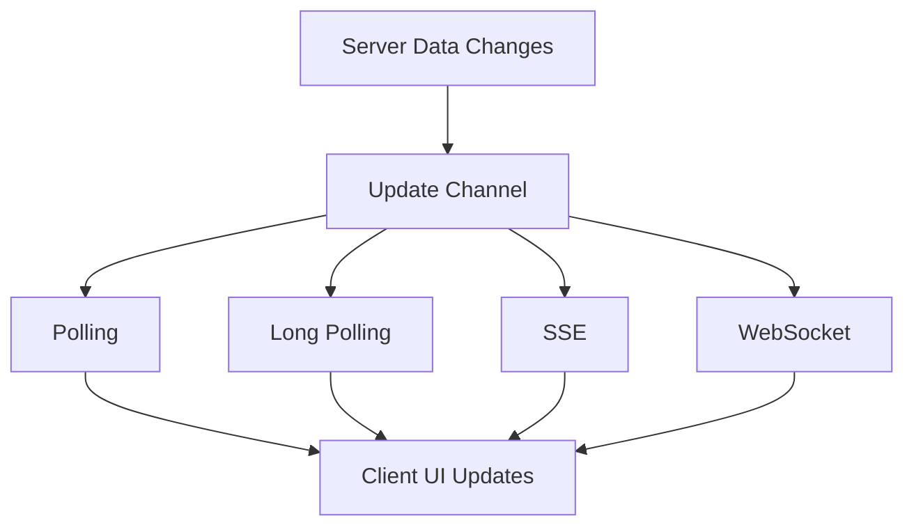

### When to Use

- Chat, notifications, live scores, collaboration, tracking
- Client needs fresh updates without manual refresh

### Avoid / Be Careful When

- Data can be minutes stale
- Simple periodic refresh is enough

### Quick Comparison Table

| Approach | Direction | Best For | Tradeoff |
|---|---|---|---|
| Short Polling | Client pulls | Simple dashboards | Many empty requests |
| Long Polling | Client waits | Moderate real-time | Held connections |
| SSE | Server to client | Notifications, feeds | One-way only |
| WebSocket | Two-way | Chat, games, tracking | More operational complexity |

### Explanation

Start with polling if simplicity matters. Use SSE for one-way server push. Use WebSockets when both client and server need to send events continuously.

### Small Java Reference

```java
import java.util.*;
import java.util.concurrent.*;

interface ClientConnection {
    void send(String event);
}

class RealtimeUpdateHub {
    private final Map<String, List<ClientConnection>> topicSubscribers = new ConcurrentHashMap<>();

    public void subscribe(String topic, ClientConnection client) {
        topicSubscribers.computeIfAbsent(topic, k -> new CopyOnWriteArrayList<>()).add(client);
    }

    public void publish(String topic, String event) {
        for (ClientConnection client : topicSubscribers.getOrDefault(topic, List.of())) {
            client.send(event);
        }
    }
}
```

### Interview One-Liner

> Start with polling if simplicity matters.

---

## Fanout System

**Category:** Communication & Delivery Patterns

**Core idea:** Deliver one event to many recipients, commonly used for feeds and notifications.

### Visual Diagram

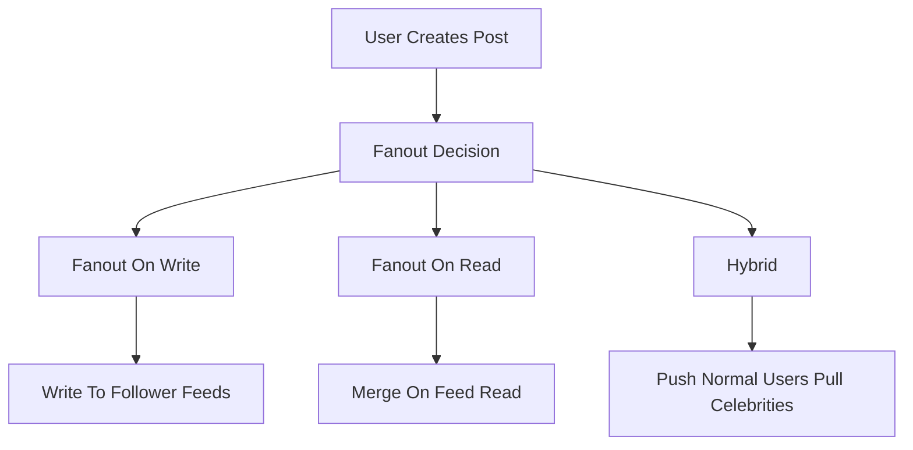

### When to Use

- One producer has many consumers
- Feeds, notifications, subscriptions

### Avoid / Be Careful When

- Recipient list is tiny
- Read-time aggregation is simpler and acceptable

### Quick Comparison Table

| Model | Write Cost | Read Cost | Best For |
|---|---|---|---|
| Fanout on Write | High | Low | Read-heavy feeds |
| Fanout on Read | Low | High | Celebrities, sparse reads |
| Hybrid | Balanced | Balanced | Production social feeds |

### Explanation

Push posts into follower feeds when reads dominate. Pull celebrity posts at read time to avoid huge write amplification. Most real systems use hybrid fanout.

### Small Java Reference

```java
import java.util.*;

class FanoutService {
    private final Map<String, List<String>> followers = new HashMap<>();
    private final Map<String, Deque<String>> feedCache = new HashMap<>();

    public void addFollower(String authorId, String followerId) {
        followers.computeIfAbsent(authorId, k -> new ArrayList<>()).add(followerId);
    }

    public void publishPost(String authorId, String postId) {
        for (String follower : followers.getOrDefault(authorId, List.of())) {
            feedCache.computeIfAbsent(follower, k -> new ArrayDeque<>()).addFirst(postId);
        }
    }

    public List<String> readFeed(String userId) {
        return new ArrayList<>(feedCache.getOrDefault(userId, new ArrayDeque<>()));
    }
}
```

### Interview One-Liner

> Push posts into follower feeds when reads dominate.

---

## High Read Traffic

**Category:** Traffic Scaling Patterns

**Core idea:** Optimize systems where reads dominate writes using cache, CDN, replicas, indexes, and precomputation.

### Visual Diagram

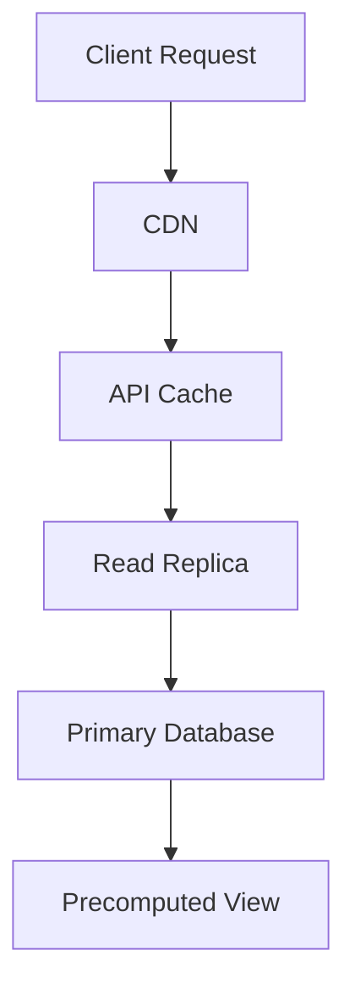

### When to Use

- Read-to-write ratio is very high
- Latency and DB load are problems

### Avoid / Be Careful When

- Strictly fresh reads are required everywhere
- Write-heavy workload

### Quick Comparison Table

| Technique | Benefit | Risk |
|---|---|---|
| CDN | Low edge latency | Stale content |
| Redis Cache | DB offload | Invalidation complexity |
| Read Replicas | Read scale | Replica lag |
| Indexes | Fast lookup | Write overhead |
| Materialized Views | Fast aggregates | Refresh complexity |

### Explanation

The usual order is cache first, CDN for public/static data, read replicas for DB scaling, then indexes and precomputed views for expensive queries.

### Small Java Reference

```java
import java.util.*;
import java.util.concurrent.*;

class ReadThroughCache<K, V> {
    private final Map<K, V> cache = new ConcurrentHashMap<>();

    public V get(K key, java.util.function.Function<K, V> databaseLoader) {
        return cache.computeIfAbsent(key, databaseLoader);
    }

    public void invalidate(K key) {
        cache.remove(key);
    }
}
```

### Interview One-Liner

> The usual order is cache first, CDN for public/static data, read replicas for DB scaling, then indexes and precomputed views for expensive queries.

---

## High Write Traffic

**Category:** Traffic Scaling Patterns

**Core idea:** Scale durable writes using batching, queues, sharding, write-optimized storage, CQRS, and backpressure.

### Visual Diagram

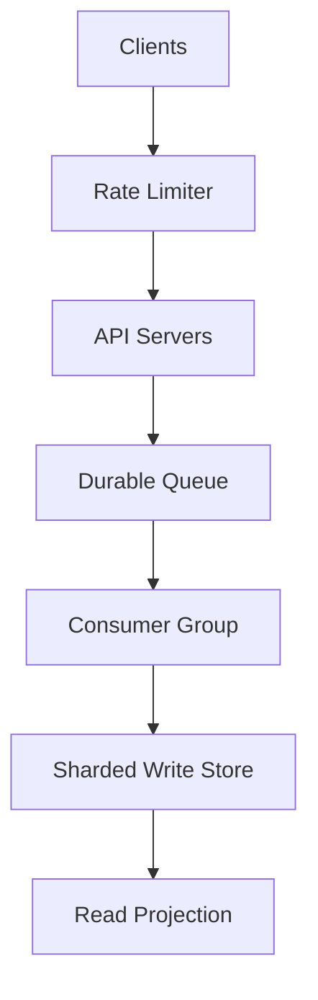

### When to Use

- Many events, logs, metrics, location updates, clicks
- Writes exceed single DB capacity

### Avoid / Be Careful When

- Simple CRUD system
- Strict synchronous consistency for every write

### Quick Comparison Table

| Technique | Purpose | Tradeoff |
|---|---|---|
| Batching | Reduce per-write overhead | Small delay |
| Queue | Absorb spikes | Eventual consistency |
| Sharding | Horizontal scale | Shard-key complexity |
| CQRS | Separate read/write models | More moving parts |
| Backpressure | Protect system | Reject/delay work |

### Explanation

Do not let every request directly hit one database. Buffer with a durable queue, process in batches, shard the storage layer, and protect the system with backpressure.

### Small Java Reference

```java
import java.util.*;

class WriteBuffer<T> {
    private final int maxSize;
    private final List<T> buffer = new ArrayList<>();

    public WriteBuffer(int maxSize) {
        this.maxSize = maxSize;
    }

    public synchronized void add(T event) {
        buffer.add(event);
        if (buffer.size() >= maxSize) flush();
    }

    public synchronized void flush() {
        if (buffer.isEmpty()) return;
        List<T> batch = new ArrayList<>(buffer);
        buffer.clear();
        persistBatch(batch);
    }

    private void persistBatch(List<T> batch) {
        System.out.println("Persisting batch size: " + batch.size());
    }
}
```

### Interview One-Liner

> Do not let every request directly hit one database.

---

## Hot Keys

**Category:** Traffic Scaling Patterns

**Core idea:** Handle one key receiving disproportionate traffic and overloading one cache/database shard.

### Visual Diagram

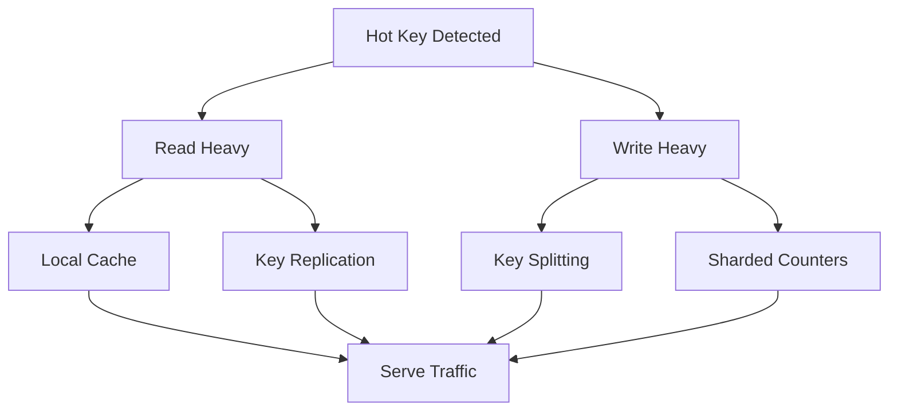

### When to Use

- Viral posts, flash-sale products, celebrity profiles
- One node is much hotter than cluster average

### Avoid / Be Careful When

- Traffic is evenly distributed
- The key is not actually a bottleneck

### Quick Comparison Table

| Problem | Fix | Tradeoff |
|---|---|---|
| Read hot key | Local cache | Staleness |
| Read hot key | Replicate key | Write amplification |
| Write hot key | Split key | Aggregate on read |
| Cache stampede | Request coalescing | Coordination |

### Explanation

For read-heavy hot keys, replicate or cache locally. For write-heavy counters, split the logical key into shards and aggregate on read.

### Small Java Reference

```java
import java.util.*;
import java.util.concurrent.*;

class ShardedCounter {
    private final int shards;
    private final ConcurrentHashMap<Integer, Long> counts = new ConcurrentHashMap<>();
    private final Random random = new Random();

    public ShardedCounter(int shards) {
        this.shards = shards;
    }

    public void increment() {
        int shard = random.nextInt(shards);
        counts.merge(shard, 1L, Long::sum);
    }

    public long total() {
        return counts.values().stream().mapToLong(Long::longValue).sum();
    }
}
```

### Interview One-Liner

> For read-heavy hot keys, replicate or cache locally.

---

## Traffic Spikes

**Category:** Traffic Scaling Patterns

**Core idea:** Survive sudden load increases using autoscaling, load shedding, rate limiting, queues, and graceful degradation.

### Visual Diagram

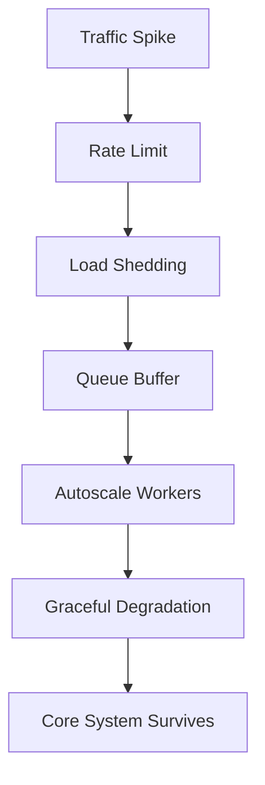

### When to Use

- Flash sales, launches, breaking news, viral traffic
- Load can jump faster than autoscaling

### Avoid / Be Careful When

- Stable predictable traffic with enough headroom

### Quick Comparison Table

| Defense | Speed | Purpose |
|---|---|---|
| Rate limiting | Immediate | Reject abusive/excess traffic |
| Load shedding | Immediate | Protect critical paths |
| Queueing | Fast | Buffer bursts |
| Autoscaling | Slow | Add capacity |
| Degradation | Immediate | Disable non-core features |

### Explanation

Autoscaling is not enough because it lags. Protect first with rate limits and shedding, then buffer with queues and scale workers.

### Small Java Reference

```java
class PriorityLoadShedder {
    public boolean accept(double load, int priority) {
        if (load < 0.70) return true;
        if (load < 0.85) return priority <= 2;
        if (load < 0.95) return priority <= 1;
        return priority == 0;
    }
}
```

### Interview One-Liner

> Autoscaling is not enough because it lags.

---

## Large File Handling

**Category:** Storage & Media Patterns

**Core idea:** Upload and serve large files by splitting them into chunks and using direct object-storage upload paths.

### Visual Diagram

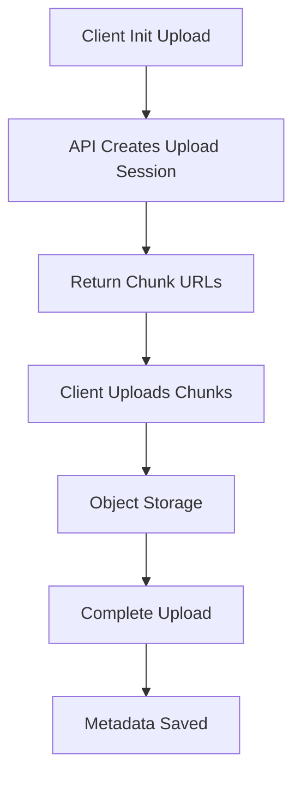

### When to Use

- Videos, backups, documents, huge media
- Uploads may fail or last long

### Avoid / Be Careful When

- Tiny files only
- App server must inspect every byte synchronously

### Quick Comparison Table

| Pattern | Benefit | Tradeoff |
|---|---|---|
| Chunked upload | Retry failed chunk only | More metadata |
| Pre-signed URL | Bypass app server bandwidth | URL expiry/security |
| Checksum | Detect corruption | Extra compute |
| Lifecycle cleanup | Remove abandoned uploads | Operational policy |

### Explanation

Never buffer a huge file inside the app server. Create an upload session, upload parts directly to blob storage, then complete and save metadata.

### Small Java Reference

```java
import java.util.*;

record UploadSession(String uploadId, int chunkSize, int totalChunks) {}

class UploadService {
    private static final int CHUNK_SIZE = 16 * 1024 * 1024;

    public UploadSession init(long fileSizeBytes) {
        int chunks = (int) Math.ceil((double) fileSizeBytes / CHUNK_SIZE);
        return new UploadSession(UUID.randomUUID().toString(), CHUNK_SIZE, chunks);
    }

    public boolean isComplete(Set<Integer> receivedChunks, int totalChunks) {
        return receivedChunks.size() == totalChunks;
    }
}
```

### Interview One-Liner

> Never buffer a huge file inside the app server.

---

## Media Streaming

**Category:** Storage & Media Patterns

**Core idea:** Deliver video/audio with encoding, segmenting, manifests, CDN, and adaptive bitrate playback.

### Visual Diagram

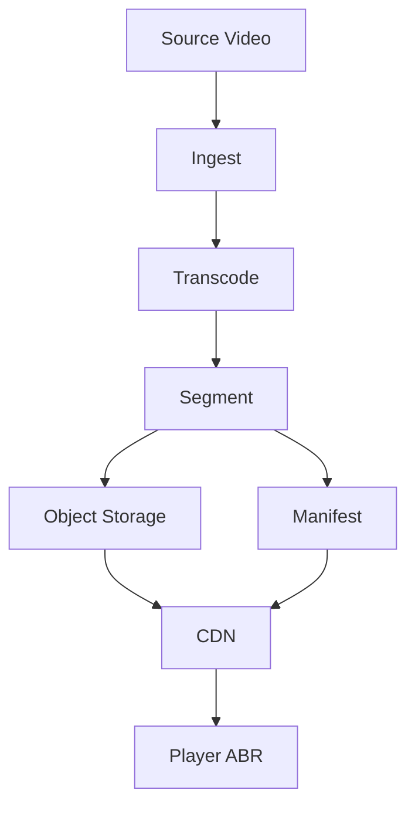

### When to Use

- YouTube, Netflix, Twitch, live/VOD video
- Bandwidth and latency vary by client

### Avoid / Be Careful When

- Simple file download
- Small media with no playback constraints

### Quick Comparison Table

| Component | Role | Notes |
|---|---|---|
| Codec | Compress video | H264 safest default |
| Segments | Small playback chunks | 2 to 10 sec common |
| Manifest | Playlist of qualities | HLS/DASH |
| CDN | Scale delivery | Mandatory at large scale |
| ABR | Adapt quality | Prevents buffering |

### Explanation

Streaming is not one big file download. The system encodes multiple qualities, cuts segments, serves through CDN, and lets the player switch bitrate.

### Small Java Reference

```java
import java.util.*;

record Rendition(String resolution, int bitrateKbps, String playlistUrl) {}

class AdaptiveBitrateSelector {
    public Rendition choose(List<Rendition> renditions, int availableKbps) {
        return renditions.stream()
                .filter(r -> r.bitrateKbps() <= availableKbps * 0.8)
                .max(Comparator.comparingInt(Rendition::bitrateKbps))
                .orElse(renditions.get(0));
    }
}
```

### Interview One-Liner

> Streaming is not one big file download.

---

## Geo-Spatial Search

**Category:** Location & Identity Patterns

**Core idea:** Find nearby entities efficiently using geohash, H3/S2, PostGIS, Redis Geo, or spatial indexes.

### Visual Diagram

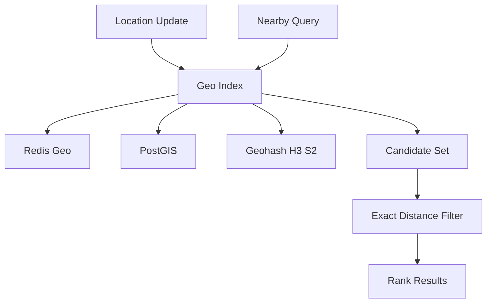

### When to Use

- Nearby drivers, restaurants, matches, stores
- Need low-latency proximity queries

### Avoid / Be Careful When

- Static low-scale location list where simple DB query is enough

### Quick Comparison Table

| Approach | Best For | Tradeoff |
|---|---|---|
| PostGIS | Accurate DB queries | DB load |
| Redis Geo | Real-time active entities | Memory + expiry |
| Geohash | Simple indexing | Neighbor-cell edge cases |
| H3/S2 | Large-scale spatial cells | More complexity |

### Explanation

Use a coarse geo index to get candidates quickly, then run exact distance calculation and ranking on a small set.

### Small Java Reference

```java
record Location(double lat, double lon) {}

class GeoUtils {
    private static final double EARTH_RADIUS_KM = 6371.0;

    public static double haversineKm(Location a, Location b) {
        double dLat = Math.toRadians(b.lat() - a.lat());
        double dLon = Math.toRadians(b.lon() - a.lon());
        double x = Math.sin(dLat / 2) * Math.sin(dLat / 2)
                + Math.cos(Math.toRadians(a.lat())) * Math.cos(Math.toRadians(b.lat()))
                * Math.sin(dLon / 2) * Math.sin(dLon / 2);
        return 2 * EARTH_RADIUS_KM * Math.asin(Math.sqrt(x));
    }
}
```

### Interview One-Liner

> Use a coarse geo index to get candidates quickly, then run exact distance calculation and ranking on a small set.

---

## Unique ID Generation

**Category:** Location & Identity Patterns

**Core idea:** Generate unique IDs across distributed nodes without collisions or per-request central coordination.

### Visual Diagram

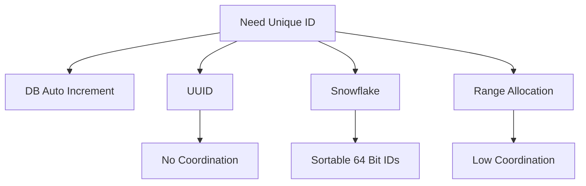

### When to Use

- Distributed writes
- IDs needed before DB insert
- High-throughput systems

### Avoid / Be Careful When

- Single DB auto-increment is enough
- Strict sequential public IDs are required

### Quick Comparison Table

| Method | Sortable | Coordination | Best For |
|---|---|---|---|
| Auto increment | Yes | DB | Small systems |
| UUID v4 | No | None | Distributed uniqueness |
| UUID v7 | Yes | None | Sortable distributed IDs |
| Snowflake | Yes | Machine ID setup | High scale |

### Explanation

Use UUID when coordination-free uniqueness matters. Use Snowflake/UUIDv7 when time ordering and index locality matter.

### Small Java Reference

```java
class SnowflakeIdGenerator {
    private final long machineId;
    private long lastMs = -1L;
    private long sequence = 0L;
    private static final long EPOCH = 1704067200000L;

    public SnowflakeIdGenerator(long machineId) {
        this.machineId = machineId;
    }

    public synchronized long nextId() {
        long now = System.currentTimeMillis();
        if (now == lastMs) sequence = (sequence + 1) & 4095;
        else sequence = 0;
        if (sequence == 0 && now == lastMs) while ((now = System.currentTimeMillis()) == lastMs) {}
        lastMs = now;
        return ((now - EPOCH) << 22) | (machineId << 12) | sequence;
    }
}
```

### Interview One-Liner

> Use UUID when coordination-free uniqueness matters.

---

## Distributed Counting

**Category:** Counting & Coordination Patterns

**Core idea:** Count likes, views, visits, and events at scale while balancing accuracy, freshness, throughput, and complexity.

### Visual Diagram

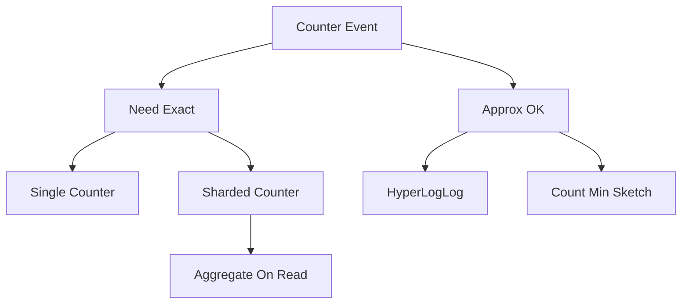

### When to Use

- High-volume counters
- Viral likes/views
- Unique users or heavy hitters

### Avoid / Be Careful When

- Small exact counter works fine

### Quick Comparison Table

| Approach | Accuracy | Best For |
|---|---|---|
| Single counter | Exact | Moderate scale |
| Sharded counter | Exact | Hot keys |
| Async aggregation | Exact delayed | Huge scale |
| HyperLogLog | Approx unique | Unique visitors |
| Count-Min Sketch | Approx | Heavy hitters |

### Explanation

Start with atomic counters. Move to sharded counters for hot keys. Use async aggregation for massive throughput and probabilistic structures for approximate counts.

### Small Java Reference

```java
import java.util.*;
import java.util.concurrent.*;

class DistributedCounter {
    private final int shards;
    private final ConcurrentHashMap<Integer, Long> counters = new ConcurrentHashMap<>();

    public DistributedCounter(int shards) {
        this.shards = shards;
    }

    public void increment(String eventId) {
        int shard = Math.abs(eventId.hashCode()) % shards;
        counters.merge(shard, 1L, Long::sum);
    }

    public long read() {
        return counters.values().stream().mapToLong(Long::longValue).sum();
    }
}
```

### Interview One-Liner

> Start with atomic counters.

---

## Leader Election

**Category:** Counting & Coordination Patterns

**Core idea:** Choose exactly one coordinator node to serialize writes or decisions while avoiding split-brain.

### Visual Diagram

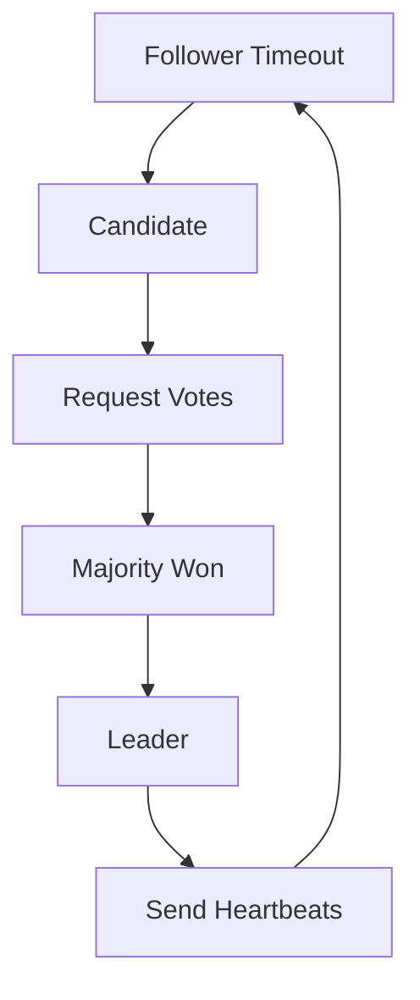

### When to Use

- One writer needed
- Cluster coordination
- Failover coordination

### Avoid / Be Careful When

- Fully leaderless design works
- No ordering or coordination needed

### Quick Comparison Table

| Approach | Safety | Best For |
|---|---|---|
| Bully | Weak under partitions | Teaching/simple systems |
| Ring | Moderate | Controlled clusters |
| Raft | Strong with quorum | Production coordination |
| ZooKeeper/etcd | Strong | Practical leader election |

### Explanation

The hard part is split-brain prevention. Consensus-based election uses quorum so two leaders cannot both get majority in the same term.

### Small Java Reference

```java
enum Role { FOLLOWER, CANDIDATE, LEADER }

class RaftNode {
    private Role role = Role.FOLLOWER;
    private int currentTerm = 0;
    private int votes = 0;
    private final int clusterSize;

    public RaftNode(int clusterSize) {
        this.clusterSize = clusterSize;
    }

    public void startElection() {
        role = Role.CANDIDATE;
        currentTerm++;
        votes = 1;
    }

    public void receiveVote() {
        votes++;
        if (votes > clusterSize / 2) role = Role.LEADER;
    }

    public Role role() { return role; }
}
```

### Interview One-Liner

> The hard part is split-brain prevention.

---

## Failure Detection and Heartbeats

**Category:** Counting & Coordination Patterns

**Core idea:** Detect failed or unhealthy nodes using heartbeats, timeouts, probes, and suspicion levels.

### Visual Diagram

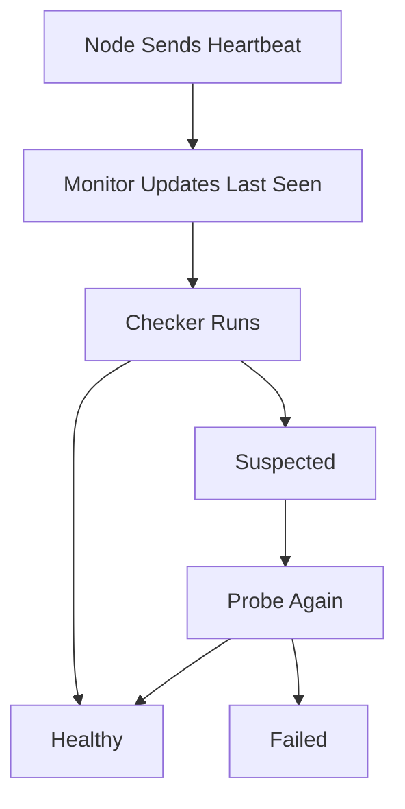

### When to Use

- Cluster membership
- Failover
- Load balancer health
- Leader election

### Avoid / Be Careful When

- Single-node app
- Failures are externally managed

### Quick Comparison Table

| Strategy | Best For | Risk |
|---|---|---|
| Fixed timeout | Simple services | False positives |
| Adaptive timeout | Variable latency | More logic |
| Phi accrual | Advanced clusters | Tuning |
| Gossip/SWIM | Large clusters | Eventual convergence |

### Explanation

No response means unknown, not definitely dead. Good systems separate liveness from readiness and use suspicion before hard failure.

### Small Java Reference

```java
import java.util.*;
import java.util.concurrent.*;

class HeartbeatMonitor {
    private final Map<String, Long> lastSeen = new ConcurrentHashMap<>();
    private final long timeoutMs;

    public HeartbeatMonitor(long timeoutMs) {
        this.timeoutMs = timeoutMs;
    }

    public void heartbeat(String nodeId) {
        lastSeen.put(nodeId, System.currentTimeMillis());
    }

    public boolean isHealthy(String nodeId) {
        Long seen = lastSeen.get(nodeId);
        return seen != null && System.currentTimeMillis() - seen <= timeoutMs;
    }
}
```

### Interview One-Liner

> No response means unknown, not definitely dead.

---

## Resilient Systems Failure Handling

**Category:** Reliability Patterns

**Core idea:** Handle failures with timeouts, retries, circuit breakers, bulkheads, fallbacks, and idempotency.

### Visual Diagram

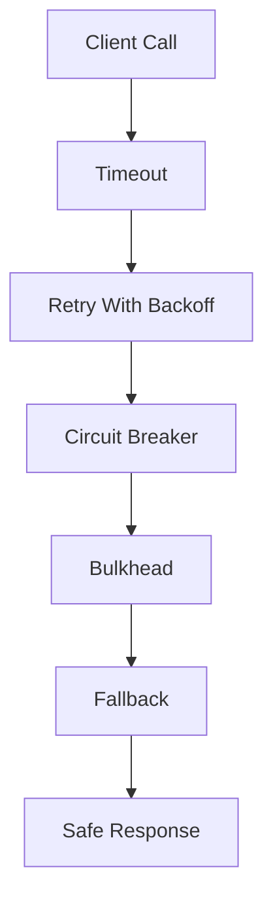

### When to Use

- Remote service calls
- Microservices
- Black Friday style traffic
- External providers

### Avoid / Be Careful When

- Local in-memory call path only

### Quick Comparison Table

| Pattern | Purpose | Common Mistake |
|---|---|---|
| Timeout | Bound waiting | No timeout |
| Retry | Recover transient failure | Retry storm |
| Circuit breaker | Fail fast | Bad thresholds |
| Bulkhead | Isolate resources | One shared pool |
| Fallback | Degrade gracefully | Incorrect stale data |
| Idempotency | Safe retry | Duplicate side effects |

### Explanation

Resilience is layered. Add timeouts first, retry only safe transient failures, isolate resources, open circuit breakers, and return fallbacks when needed.

### Small Java Reference

```java
class SimpleCircuitBreaker {
    private int failures = 0;
    private final int threshold;
    private boolean open = false;

    public SimpleCircuitBreaker(int threshold) {
        this.threshold = threshold;
    }

    public <T> T call(java.util.function.Supplier<T> supplier, T fallback) {
        if (open) return fallback;
        try {
            T result = supplier.get();
            failures = 0;
            return result;
        } catch (RuntimeException ex) {
            failures++;
            if (failures >= threshold) open = true;
            return fallback;
        }
    }
}
```

### Interview One-Liner

> Resilience is layered.

---

## Distributed Transactions

**Category:** Reliability Patterns

**Core idea:** Coordinate workflows across services/databases using local transactions, Saga, TCC, 2PC, and Outbox.

### Visual Diagram

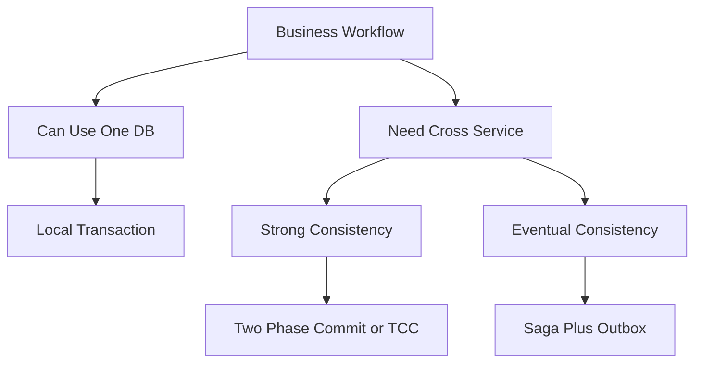

### When to Use

- Order-payment-inventory workflows
- Cross-service consistency matters

### Avoid / Be Careful When

- A local transaction can solve it
- Workflow can be redesigned to avoid cross-service atomicity

### Quick Comparison Table

| Pattern | Consistency | Best For |
|---|---|---|
| 2PC | Strong | Small controlled participants |
| TCC | Strong-ish reservation | Booking/payment reservation |
| Saga | Eventual | Business workflows |
| Outbox | Reliable event publish | DB + broker consistency |

### Explanation

Prefer avoiding distributed transactions. If strong consistency is unavoidable, consider 2PC/TCC. For microservices workflows, Saga plus Outbox is usually the practical default.

### Small Java Reference

```java
import java.util.*;

enum OrderState { CREATED, INVENTORY_RESERVED, PAID, COMPLETED, CANCELLED }

class OrderSaga {
    private OrderState state = OrderState.CREATED;

    public void reserveInventory() {
        state = OrderState.INVENTORY_RESERVED;
    }

    public void chargePayment(boolean success) {
        if (!success) {
            compensateInventory();
            state = OrderState.CANCELLED;
            return;
        }
        state = OrderState.PAID;
    }

    public void completeOrder() {
        if (state != OrderState.PAID) throw new IllegalStateException("Cannot complete");
        state = OrderState.COMPLETED;
    }

    private void compensateInventory() {
        System.out.println("Release reserved inventory");
    }
}
```

### Interview One-Liner

> Prefer avoiding distributed transactions.

---

## Single Point of Failure

**Category:** Reliability Patterns

**Core idea:** Identify and remove components whose failure would break the whole system or a critical path.

### Visual Diagram

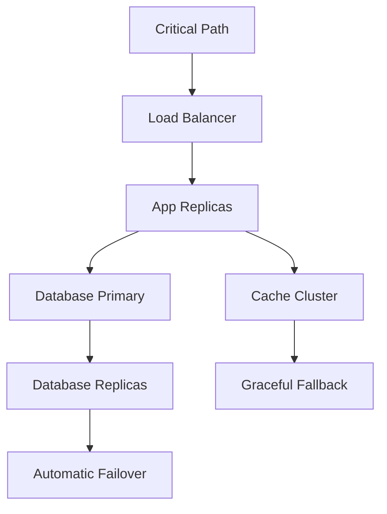

### When to Use

- Production readiness
- HA design
- Disaster recovery
- Critical systems

### Avoid / Be Careful When

- Throwaway prototype where downtime is acceptable

### Quick Comparison Table

| Layer | SPOF Example | Fix |
|---|---|---|
| DNS | One DNS provider | Secondary DNS |
| Load balancer | One LB | Managed HA LB |
| App | One instance | Replicas + autoscaling |
| Cache | One Redis | Cluster/Sentinel |
| DB | One primary only | Replicas + failover |
| People | One expert | Runbooks + cross-training |

### Explanation

Walk every critical path and ask: what happens if this fails right now? If nothing takes over automatically, it is a SPOF.

### Small Java Reference

```java
import java.util.*;

class HealthBasedRouter {
    private final Map<String, Boolean> instances = new LinkedHashMap<>();

    public void register(String instanceId) {
        instances.put(instanceId, true);
    }

    public void markUnhealthy(String instanceId) {
        instances.put(instanceId, false);
    }

    public Optional<String> chooseHealthyInstance() {
        return instances.entrySet().stream()
                .filter(Map.Entry::getValue)
                .map(Map.Entry::getKey)
                .findFirst();
    }
}
```

### Interview One-Liner

> Walk every critical path and ask: what happens if this fails right now? If nothing takes over automatically, it is a SPOF.

---
