# Real-Time Updates in System Design – Quick Notes

> Short, practical notes for interviews: when to use polling, SSE, or WebSockets.

---

## Why This Matters
Modern apps must show changes **immediately**:
- Chat messages
- Stock price updates
- Notifications
- Live sports scores
- Collaboration changes

Traditional HTTP is **request → response → close**.  
If data changes right after the response, the client will not know unless it asks again.

So the core problem is:

```text
How does the server push new data to the client instantly?
```

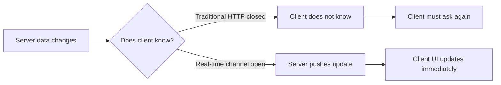
```mermaid
flowchart LR
    A[Server data changes] --> B{Does client know?}
    B -->|Traditional HTTP closed| C[Client does not know]
    C --> D[Client must ask again]
    B -->|Real-time channel open| E[Server pushes update]
    E --> F[Client UI updates immediately]
```

---

## Where This Pattern Shows Up

- **Chat** → messages, typing indicators
- **Uber / Lyft** → driver location updates
- **Trading platforms** → millisecond price updates
- **Collaborative editors** → live edits
- **Notifications** → instant alerts
- **Live sports** → score and play-by-play updates

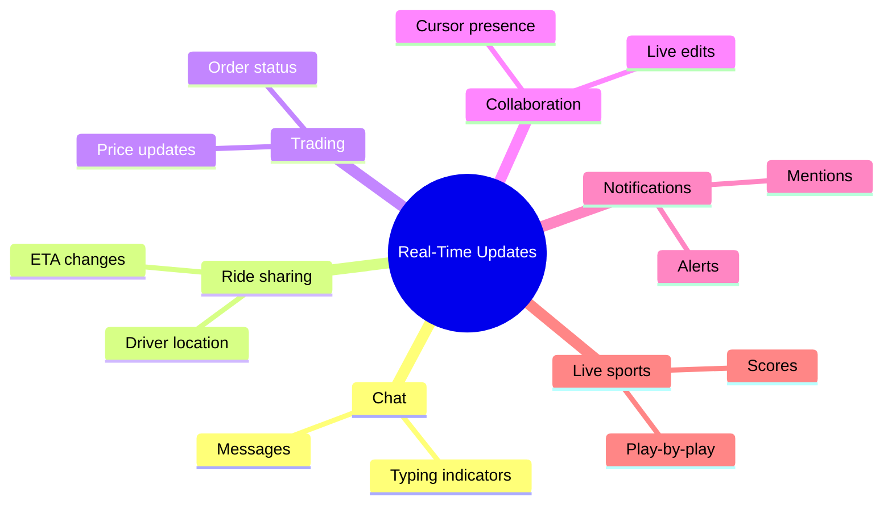
```mermaid
mindmap
  root((Real-Time Updates))
    Chat
      Messages
      Typing indicators
    Ride sharing
      Driver location
      ETA changes
    Trading
      Price updates
      Order status
    Collaboration
      Live edits
      Cursor presence
    Notifications
      Alerts
      Mentions
    Live sports
      Scores
      Play-by-play
```

---

# 4 Approaches

1. **Short Polling**
2. **Long Polling**
3. **Server-Sent Events (SSE)**
4. **WebSockets**

Think of them as a spectrum:

```text
Simple ------------------------------------------ Complex
Short Polling -> Long Polling -> SSE -> WebSockets
```

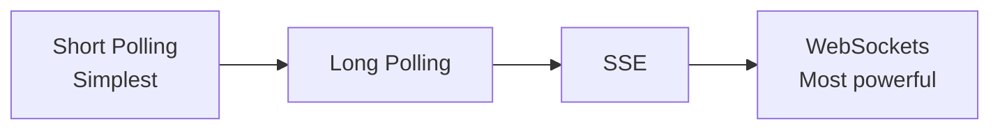
```mermaid
flowchart LR
    A[Short Polling<br/>Simplest] --> B[Long Polling]
    B --> C[SSE]
    C --> D[WebSockets<br/>Most powerful]
```

---

# 1) Short Polling

## Idea
Client keeps asking:

```text
"Any updates?"
```

every few seconds.

## Flow
```text
Client -> HTTP request
Server -> response (data or empty)
Wait
Repeat
```

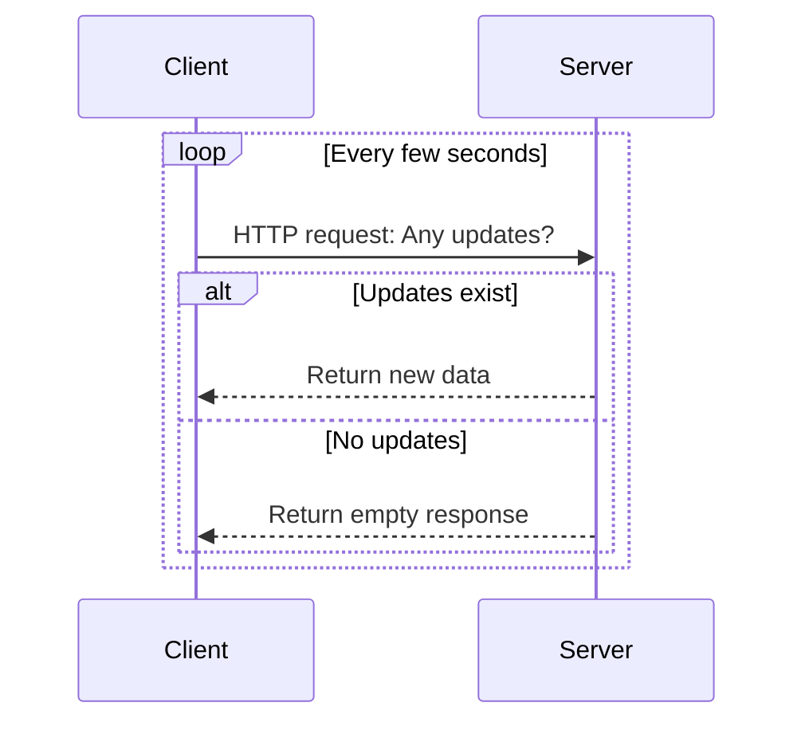
```mermaid
sequenceDiagram
    participant C as Client
    participant S as Server
    loop Every few seconds
        C->>S: HTTP request: Any updates?
        alt Updates exist
            S-->>C: Return new data
        else No updates
            S-->>C: Return empty response
        end
    end
```

## Example
Poll every **5 sec**

```text
1M users / 5 sec = 200K requests/sec
```

Most requests return **nothing**.

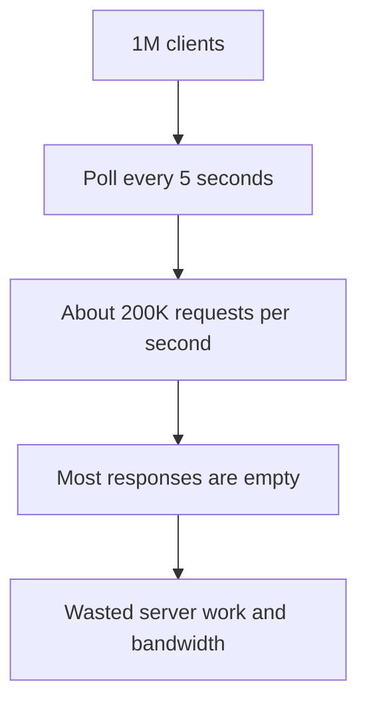
```mermaid
flowchart TD
    A[1M clients] --> B[Poll every 5 seconds]
    B --> C[About 200K requests per second]
    C --> D[Most responses are empty]
    D --> E[Wasted server work and bandwidth]
```

## Pros
- Very simple
- Works everywhere
- Easy to debug
- Stateless server

## Cons
- Wasteful: many empty requests
- Higher latency (depends on poll interval)
- Heavy server load at scale
- Battery drain on mobile

## Best For
- Email inbox refresh
- Dashboard refresh
- Background sync
- Status checks

## Avoid For
- Chat
- Live tracking
- Trading
- Multiplayer games

---

# 2) Long Polling

## Idea
Client sends request once.  
If no data exists, **server waits** until data arrives or timeout happens.

## Flow
```text
Client -> request
Server -> hold connection
New data arrives
Server -> respond immediately
Client -> opens new request
```

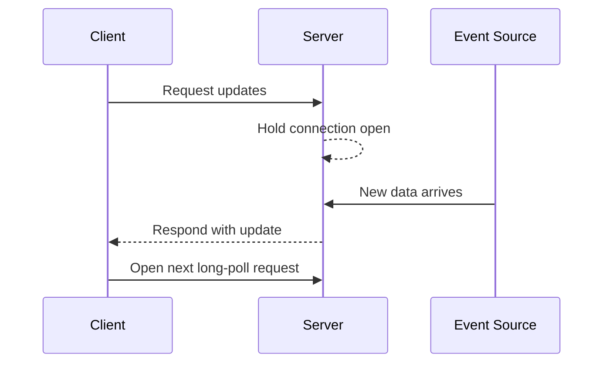
```mermaid
sequenceDiagram
    participant C as Client
    participant S as Server
    participant E as Event Source
    C->>S: Request updates
    S-->>S: Hold connection open
    E->>S: New data arrives
    S-->>C: Respond with update
    C->>S: Open next long-poll request
```

## Why Better than Short Polling
Instead of repeated empty requests, server answers **only when useful**.

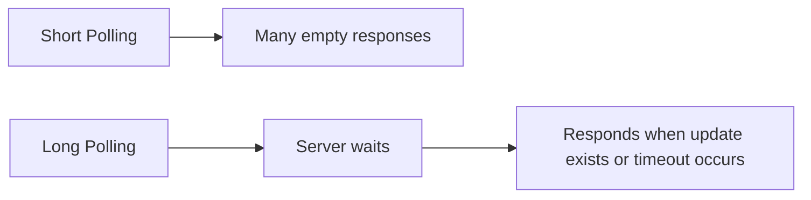
```mermaid
flowchart LR
    A[Short Polling] --> A1[Many empty responses]
    B[Long Polling] --> B1[Server waits]
    B1 --> B2[Responds when update exists or timeout occurs]
```

## Pros
- Near real-time
- Fewer wasted requests
- Still standard HTTP
- Works through proxies/firewalls

## Cons
- Many open connections on server
- Needs async/event-driven backend
- New request needed after every response
- Timeout/retry logic required
- Ordering can get tricky

## Best For
- Notification systems
- Activity feeds
- Moderate chat
- Progress updates

## Example
Short polling in 30 sec:
```text
6 requests, mostly empty
```

Long polling in 30 sec:
```text
2 requests, both useful
```

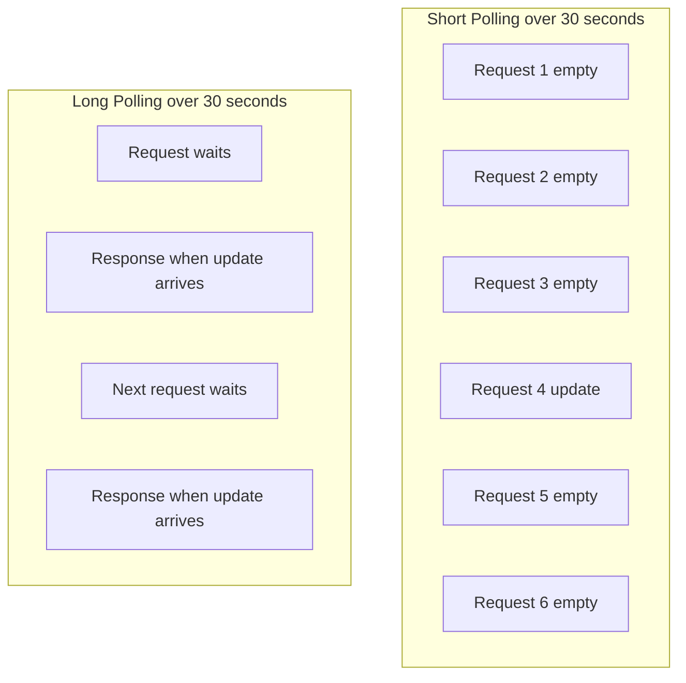
```mermaid
flowchart TB
    subgraph SP[Short Polling over 30 seconds]
        SP1[Request 1 empty]
        SP2[Request 2 empty]
        SP3[Request 3 empty]
        SP4[Request 4 update]
        SP5[Request 5 empty]
        SP6[Request 6 empty]
    end

    subgraph LP[Long Polling over 30 seconds]
        LP1[Request waits]
        LP2[Response when update arrives]
        LP3[Next request waits]
        LP4[Response when update arrives]
    end
```

---

# 3) Server-Sent Events (SSE)

## Idea
Client opens **one long-lived HTTP connection**.  
Server pushes updates whenever data changes.

## Flow
```text
Client -> open EventSource connection
Server -> keep connection open
Server -> send events continuously
```

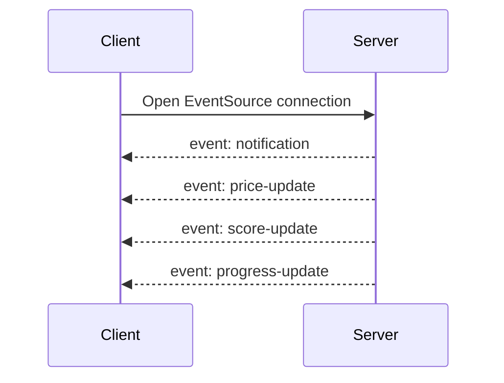
```mermaid
sequenceDiagram
    participant C as Client
    participant S as Server
    C->>S: Open EventSource connection
    S-->>C: event: notification
    S-->>C: event: price-update
    S-->>C: event: score-update
    S-->>C: event: progress-update
```

## Event Format
```text
event: price-update
id: 12345
data: {"symbol":"AAPL","price":150.25}
```

## Best Part
Browser automatically handles:
- reconnect
- retry
- Last-Event-ID resume

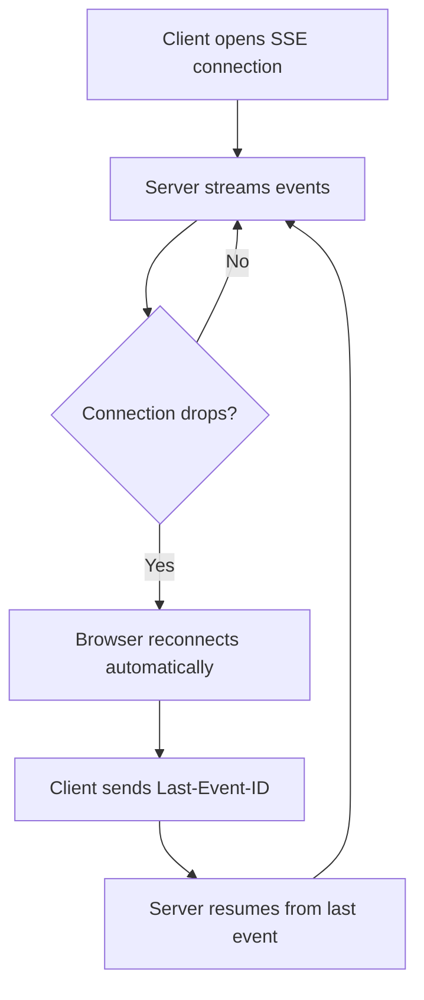
```mermaid
flowchart TD
    A[Client opens SSE connection] --> B[Server streams events]
    B --> C{Connection drops?}
    C -->|No| B
    C -->|Yes| D[Browser reconnects automatically]
    D --> E[Client sends Last-Event-ID]
    E --> F[Server resumes from last event]
    F --> B
```

## Pros
- Very simple client API
- Built-in reconnection
- Great for server-to-client streaming
- Works with HTTP infra
- Easier than WebSockets

## Cons
- One-way only (server -> client)
- Text only
- Browser connection limits may matter
- Not ideal for true bidirectional apps

## Best For
- Stock tickers
- Live sports scores
- Notification streams
- Build / job progress
- Social/activity feeds

## Not Best For
- Real-time chat
- Multiplayer games
- Collaborative editing

## Key Difference vs Long Polling
Long polling:
```text
1 response per request
```

SSE:
```text
Many events over one connection
```

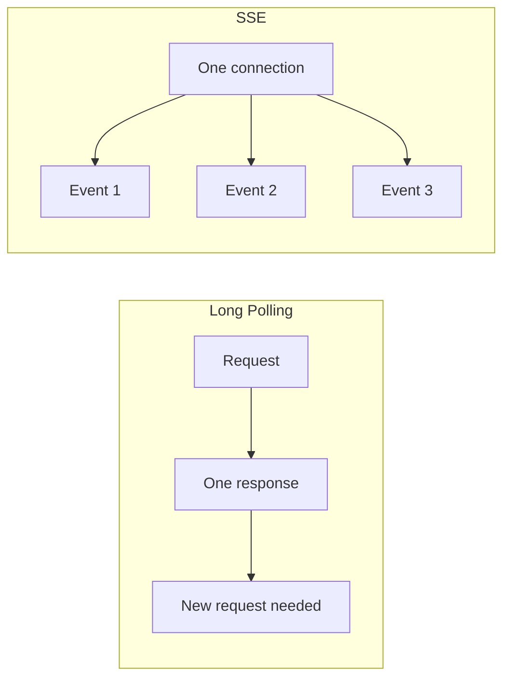
```mermaid
flowchart LR
    subgraph LongPolling[Long Polling]
        LP1[Request] --> LP2[One response]
        LP2 --> LP3[New request needed]
    end

    subgraph SSEFlow[SSE]
        S1[One connection] --> S2[Event 1]
        S1 --> S3[Event 2]
        S1 --> S4[Event 3]
    end
```

---

# 4) WebSockets

## Idea
Persistent **bidirectional** connection.  
Client and server can both send messages anytime.

## Flow
```text
HTTP Upgrade -> 101 Switching Protocols
Then full-duplex WebSocket connection
```

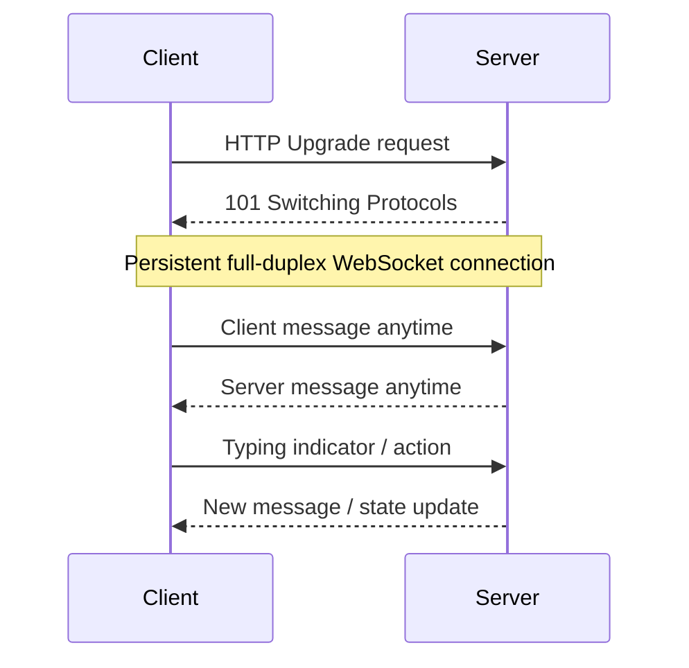
```mermaid
sequenceDiagram
    participant C as Client
    participant S as Server
    C->>S: HTTP Upgrade request
    S-->>C: 101 Switching Protocols
    Note over C,S: Persistent full-duplex WebSocket connection
    C->>S: Client message anytime
    S-->>C: Server message anytime
    C->>S: Typing indicator / action
    S-->>C: New message / state update
```

## Why Powerful
- No request/response model
- Either side can send anytime
- Very low overhead per message
- Great for interactive systems

## Pros
- True bidirectional communication
- Lowest latency
- Efficient for high-frequency updates
- Supports binary messages

## Cons
- Harder to implement and operate
- Stateful connections
- Needs connection tracking
- Usually needs pub/sub layer for scale
- Reconnection must be built manually
- Some proxies/firewalls may block it

## Best For
- Real-time chat
- Multiplayer games
- Collaborative editors
- Live trading

## Example Scaling Challenge
If Alice is connected to **Server 1** and Bob to **Server 2**:

```text
Alice -> Server 1 -> Redis/Kafka -> Server 2 -> Bob
```

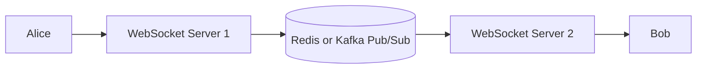
```mermaid
flowchart LR
    A[Alice] --> S1[WebSocket Server 1]
    S1 --> B[(Redis or Kafka Pub/Sub)]
    B --> S2[WebSocket Server 2]
    S2 --> BO[Bob]
```

So you usually need:
- message bus
- connection registry
- pub/sub routing

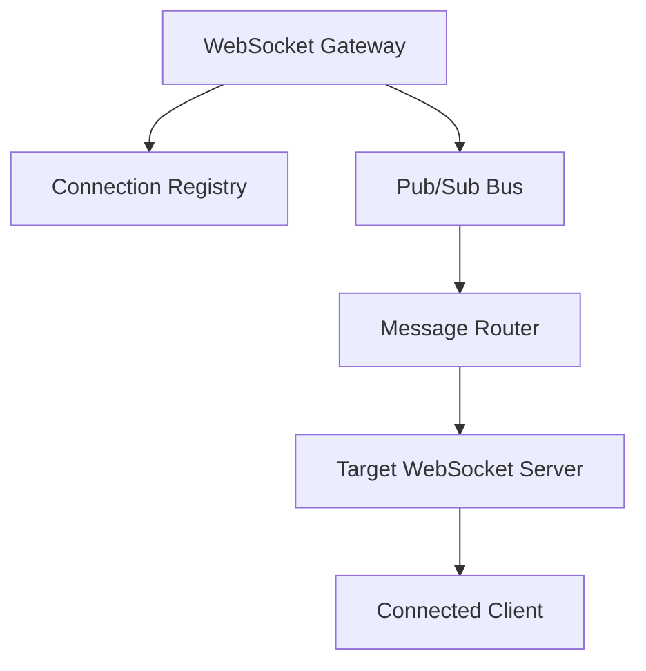
```mermaid
flowchart TD
    A[WebSocket Gateway] --> B[Connection Registry]
    A --> C[Pub/Sub Bus]
    C --> D[Message Router]
    D --> E[Target WebSocket Server]
    E --> F[Connected Client]
```

---

# Quick Comparison Table

| Aspect | Short Polling | Long Polling | SSE | WebSockets |
|---|---|---|---|---|
| Direction | Client -> Server | Client -> Server | Server -> Client | Bidirectional |
| Latency | High | Low | Low | Lowest |
| Connection | New request every poll | New request after each response | One persistent HTTP connection | One persistent socket |
| Complexity | Lowest | Low-Medium | Medium | Highest |
| Scaling | Easy | Medium | Medium | Hard |
| Reconnection | Not needed | Manual | Automatic | Manual |
| Binary Support | No | No | No | Yes |
| Firewall Friendly | Yes | Yes | Yes | Sometimes blocked |

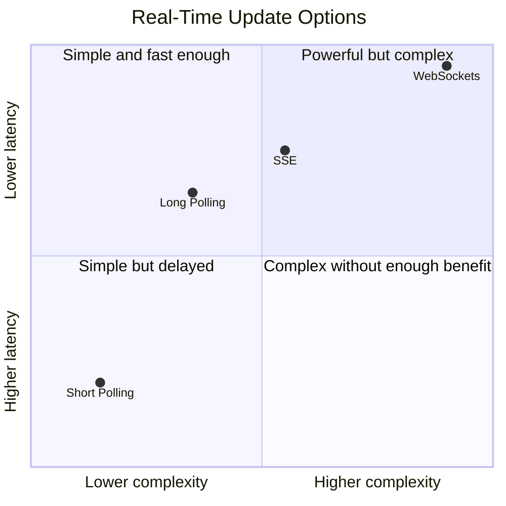
```mermaid
quadrantChart
    title Real-Time Update Options
    x-axis Lower complexity --> Higher complexity
    y-axis Higher latency --> Lower latency
    quadrant-1 Powerful but complex
    quadrant-2 Simple and fast enough
    quadrant-3 Simple but delayed
    quadrant-4 Complex without enough benefit
    Short Polling: [0.15, 0.20]
    Long Polling: [0.35, 0.65]
    SSE: [0.55, 0.75]
    WebSockets: [0.90, 0.95]
```

---

# Decision Guide

## Use Short Polling when:
- slight delay is okay
- updates are infrequent
- you want the simplest solution

## Use Long Polling when:
- you need near real-time
- you want to stay in HTTP
- message frequency is moderate

## Use SSE when:
- updates mostly flow **server -> client**
- you want simpler real-time push
- automatic reconnection is useful

## Use WebSockets when:
- both client and server send often
- low latency is critical
- interaction is high-frequency

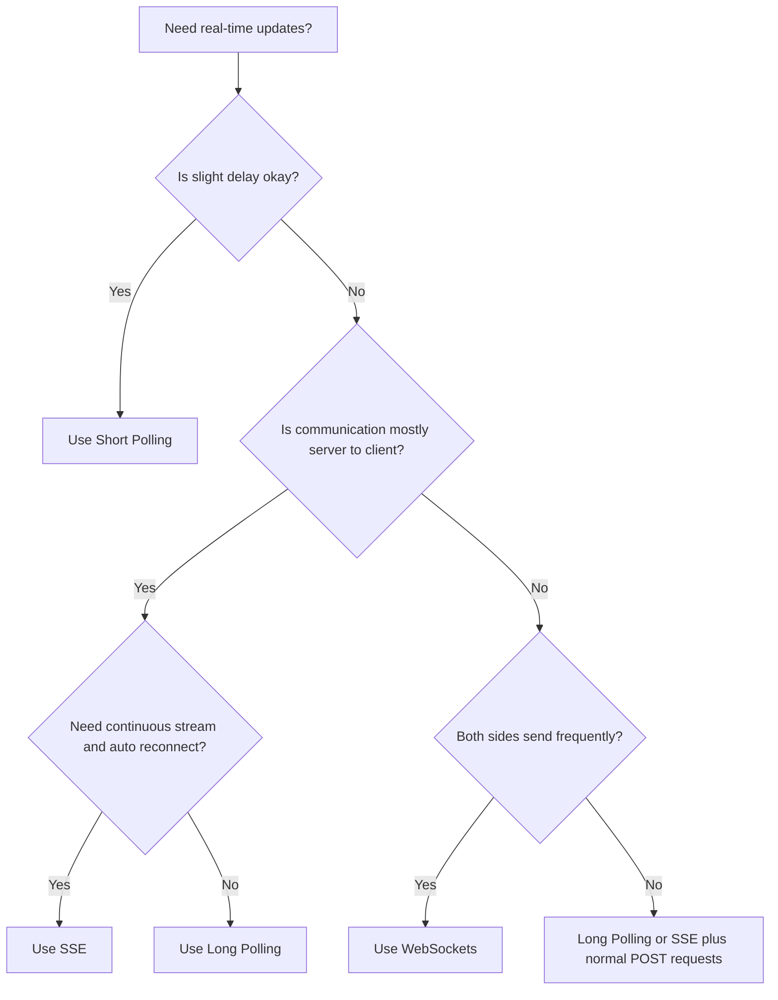
```mermaid
flowchart TD
    A[Need real-time updates?] --> B{Is slight delay okay?}
    B -->|Yes| C[Use Short Polling]
    B -->|No| D{Is communication mostly server to client?}
    D -->|Yes| E{Need continuous stream and auto reconnect?}
    E -->|Yes| F[Use SSE]
    E -->|No| G[Use Long Polling]
    D -->|No| H{Both sides send frequently?}
    H -->|Yes| I[Use WebSockets]
    H -->|No| J[Long Polling or SSE plus normal POST requests]
```

---

# Recommendations by Use Case

| Use Case | Recommended |
|---|---|
| Email inbox | Short Polling |
| Dashboard metrics | Short Polling / SSE |
| Notification system | SSE |
| Activity feed | SSE |
| Stock ticker | SSE |
| Live sports | SSE |
| Build progress | SSE |
| Basic chat | Long Polling or SSE + POST |
| Real-time chat | WebSockets |
| Multiplayer game | WebSockets |
| Collaborative editor | WebSockets |
| Live trading | WebSockets |

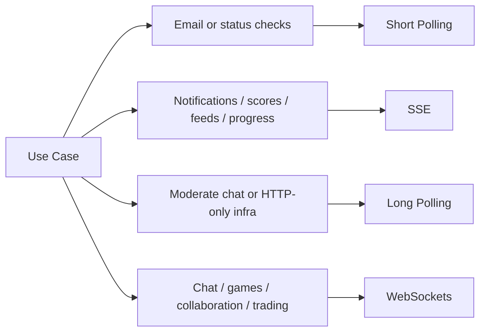
```mermaid
flowchart LR
    A[Use Case] --> B[Email or status checks]
    B --> C[Short Polling]

    A --> D[Notifications / scores / feeds / progress]
    D --> E[SSE]

    A --> F[Moderate chat or HTTP-only infra]
    F --> G[Long Polling]

    A --> H[Chat / games / collaboration / trading]
    H --> I[WebSockets]
```

---

# Common Production Concerns

## 1. Reconnection
Connections drop. Use:

```text
Exponential backoff + jitter
1s -> 2s -> 4s -> 8s -> ... cap at 30s
```

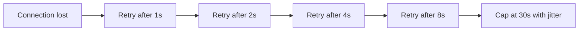
```mermaid
flowchart LR
    A[Connection lost] --> B[Retry after 1s]
    B --> C[Retry after 2s]
    C --> D[Retry after 4s]
    D --> E[Retry after 8s]
    E --> F[Cap at 30s with jitter]
```

## 2. Heartbeats
A silent connection may be dead.

Use:
```text
PING / PONG every ~30 sec
```

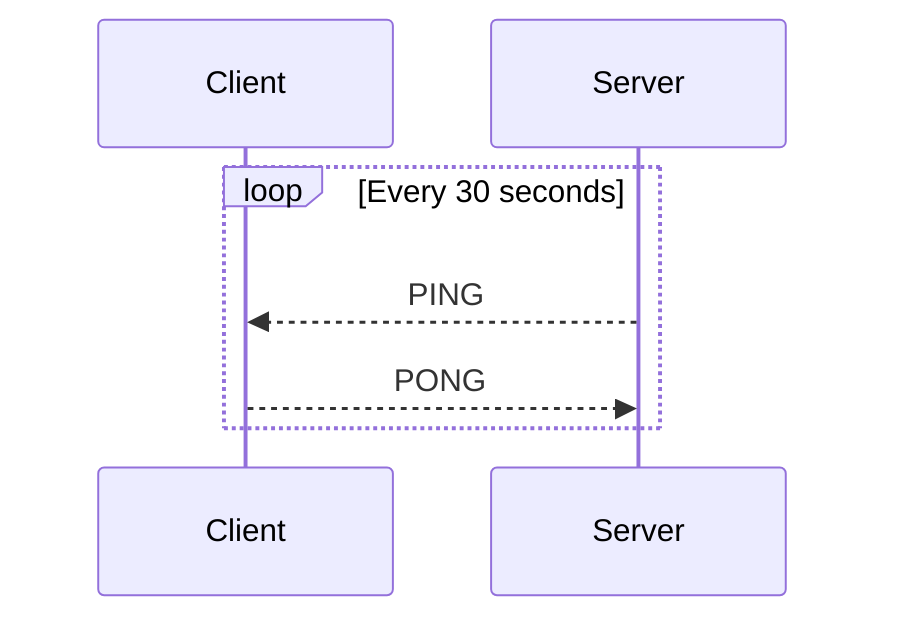
```mermaid
sequenceDiagram
    participant C as Client
    participant S as Server
    loop Every 30 seconds
        S-->>C: PING
        C-->>S: PONG
    end
```

## 3. Message Ordering
Messages can arrive out of order.

Use:
- sequence numbers
- event IDs
- deduplication
- buffering gaps

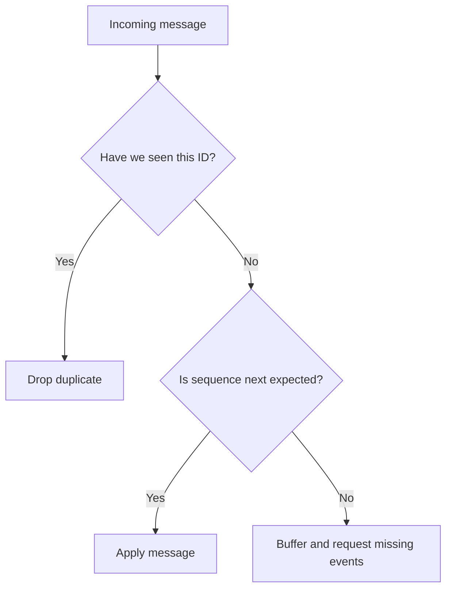
```mermaid
flowchart TD
    A[Incoming message] --> B{Have we seen this ID?}
    B -->|Yes| C[Drop duplicate]
    B -->|No| D{Is sequence next expected?}
    D -->|Yes| E[Apply message]
    D -->|No| F[Buffer and request missing events]
```

## 4. Backpressure
Slow clients cannot keep up.

Options:
- drop low-priority updates
- batch updates
- disconnect slow clients

```mermaid
flowchart TD
    A[Server sends updates] --> B{Client keeping up?}
    B -->|Yes| C[Continue streaming]
    B -->|No| D{Can batch?}
    D -->|Yes| E[Batch updates]
    D -->|No| F{Low priority?}
    F -->|Yes| G[Drop low-priority updates]
    F -->|No| H[Disconnect or slow down producer]
```

## 5. Compression
Useful for large JSON/text traffic.

- WebSocket: `permessage-deflate`
- Good for text
- Not useful for already-compressed media

```mermaid
flowchart LR
    A[Large text or JSON] --> B[Compression helps]
    C[Images / video / already compressed data] --> D[Compression usually not useful]
```

---

# Short Examples

## Example 1: Notification System
Need:
- instant alerts
- mostly server -> client
- reconnect support

**Choice:** SSE

Why:
- easy push model
- built-in reconnect
- simpler than WebSockets

```mermaid
flowchart LR
    A[Notification Service] --> B[SSE Stream]
    B --> C[Browser / Mobile Client]
    C --> D[Show instant alert]
```

---

## Example 2: Chat App
Need:
- instant messages
- typing indicators
- read receipts
- both sides send often

**Choice:** WebSockets

Why:
- true bidirectional communication
- low-latency interactive messaging

```mermaid
flowchart LR
    A[Alice Client] <--> B[WebSocket Server]
    B <--> C[Bob Client]
    B --> D[(Message Store)]
    B --> E[(Pub/Sub)]
```

---

## Example 3: Stock Ticker
Need:
- constant server -> client updates
- high frequency
- little client sending

**Choice:** SSE

Why:
- perfect for streaming updates one way

```mermaid
flowchart LR
    A[Market Data Feed] --> B[Price Update Service]
    B --> C[SSE Stream]
    C --> D[Trader Dashboard]
```

---

## Example 4: Driver Tracking
Need:
- server pushes driver position
- updates every few seconds
- moderate real-time needs

**Choice:** SSE or Long Polling

Why:
- if one-way updates dominate, SSE is simpler
- long polling is okay if infra is HTTP-only

```mermaid
flowchart LR
    A[Driver Location Updates] --> B[Location Service]
    B --> C{Infra supports persistent streams?}
    C -->|Yes| D[SSE to rider app]
    C -->|No| E[Long polling to rider app]
```

---

## Example 5: Multiplayer Game
Need:
- bidirectional updates
- very low latency
- frequent messages

**Choice:** WebSockets

Why:
- full-duplex low-latency communication

```mermaid
flowchart LR
    A[Player 1] <--> B[Game WebSocket Gateway]
    C[Player 2] <--> B
    D[Player 3] <--> B
    B <--> E[Game State Service]
```

---

# Interview Answer Template

If asked “How would you support real-time updates?”:

```text
I’d first clarify whether the communication is one-way or bidirectional, 
how often updates happen, and how strict the latency requirement is.

If slight delay is acceptable, short polling is simplest.
If we want near real-time while staying in HTTP, long polling works.
If updates are mostly server-to-client, I’d use SSE because it is simpler and has built-in reconnection.
If both client and server need frequent low-latency communication, I’d use WebSockets.
```

```mermaid
flowchart TD
    A[Interview Question: Real-time updates] --> B[Clarify direction]
    B --> C[One-way server to client]
    B --> D[Bidirectional]
    C --> E[Clarify frequency and latency]
    D --> F[Clarify low-latency interaction]
    E --> G[SSE or Long Polling]
    F --> H[WebSockets]
    A --> I[If delay is acceptable]
    I --> J[Short Polling]
```

---

# Key Takeaways

- Start with the **simplest solution**
- **SSE is often enough** and easier than WebSockets
- Use **WebSockets only when bidirectional low-latency is truly needed**
- Always plan for:
    - reconnects
    - heartbeats
    - ordering
    - backpressure

```mermaid
mindmap
  root((Key Takeaways))
    Start simple
      Short polling when delay is fine
    SSE is often enough
      One-way push
      Built-in reconnect
    Use WebSockets carefully
      Bidirectional
      Low latency
      Stateful scaling
    Production concerns
      Reconnects
      Heartbeats
      Ordering
      Backpressure
```

---

## Final Shortcut

```text
Short Polling = simple but wasteful
Long Polling = better HTTP real-time
SSE = best for one-way push
WebSockets = best for full duplex
```

```mermaid
flowchart LR
    A[Short Polling<br/>simple but wasteful] --> B[Long Polling<br/>better HTTP real-time]
    B --> C[SSE<br/>best for one-way push]
    C --> D[WebSockets<br/>best for full duplex]
```
