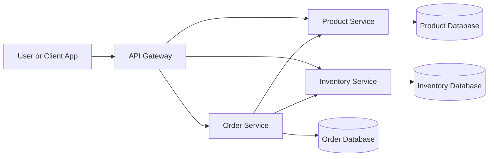
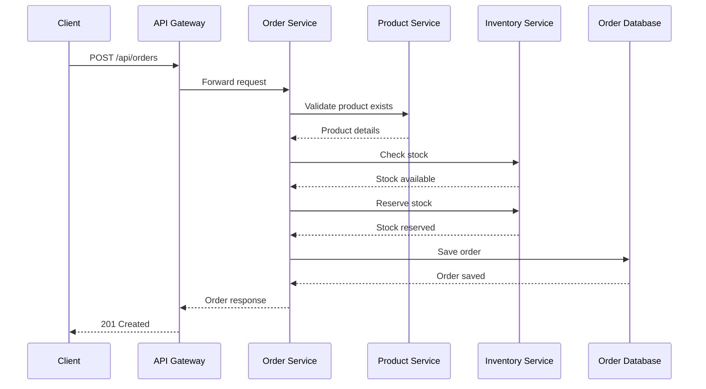
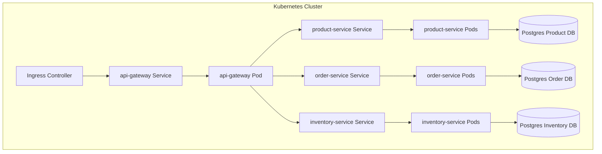
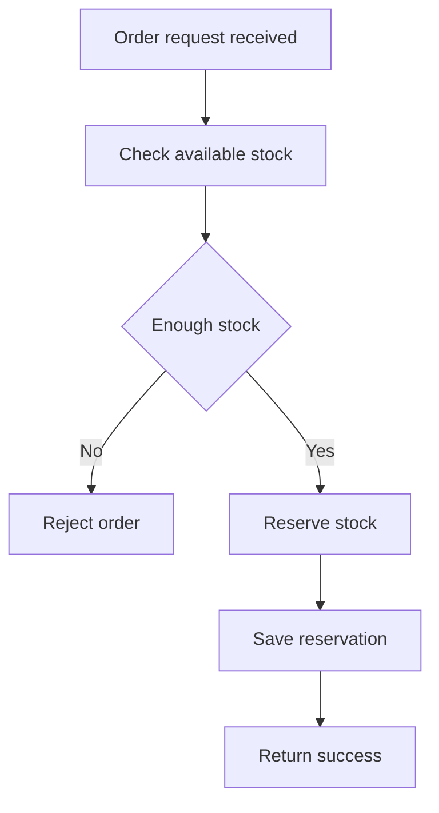
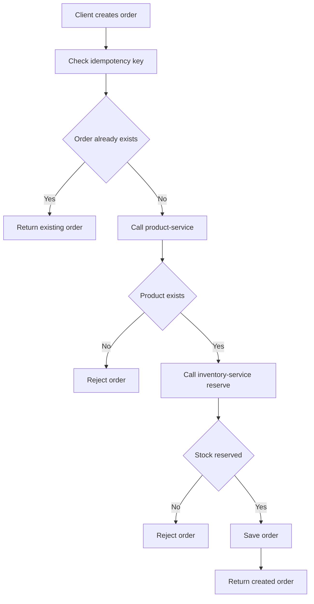
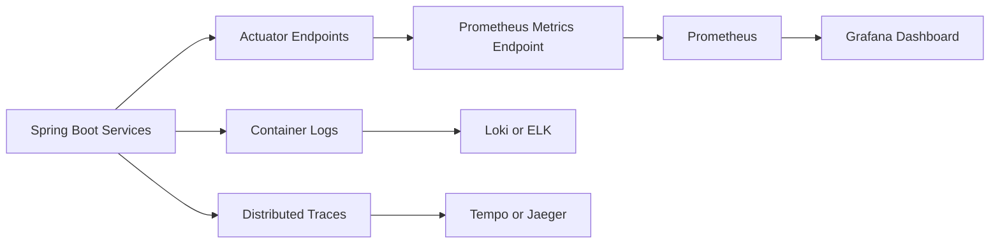
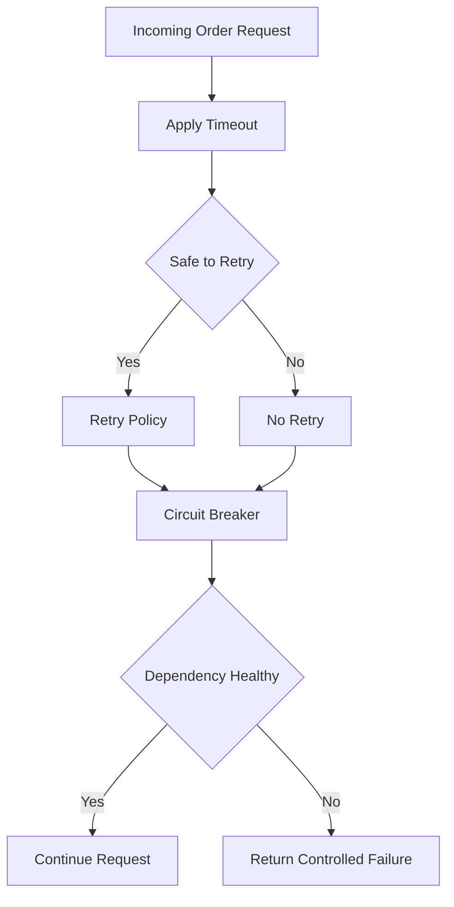
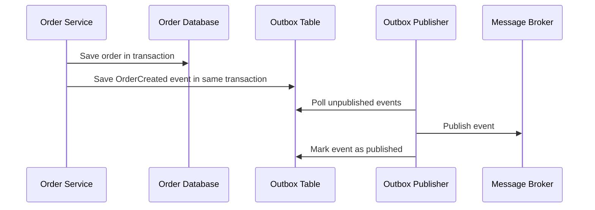
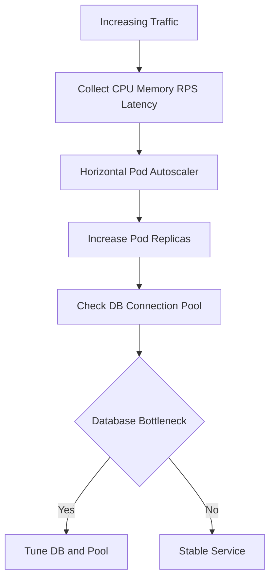
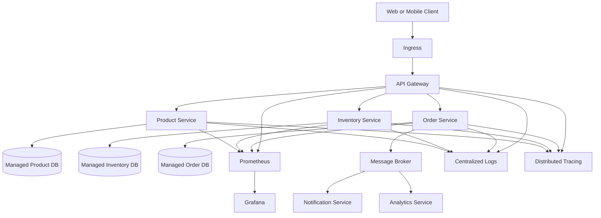

# Capstone Project: Large-Scale Order Platform with Spring Boot and Kubernetes

This capstone builds a production-style **Order Platform** using Spring Boot microservices and Kubernetes.

You will build:

- `product-service`
- `inventory-service`
- `order-service`
- `api-gateway`
- PostgreSQL databases for each service
- Docker images
- Docker Compose local environment
- Kubernetes manifests
- Helm chart structure
- Actuator, Prometheus, Grafana-ready monitoring
- Resilience patterns
- Scaling and production hardening examples

---

## Table of Contents

1. Architecture Overview
2. Repository Structure
3. Prerequisites
4. Phase 1: Basic APIs
5. Product Service
6. Inventory Service
7. Order Service
8. API Gateway
9. Phase 2: Containerization
10. Docker Compose
11. Phase 3: Kubernetes Deployment
12. Phase 4: ConfigMaps, Secrets, and Helm
13. Phase 5: Observability
14. Phase 6: Resilience
15. Phase 7: Scaling
16. Phase 8: Production Hardening
17. Build Order Checklist
18. Testing the Platform
19. Suggested Improvements

---

# 1. Architecture Overview

## 1.1 System Context



## 1.2 Request Flow for Creating an Order



## 1.3 Kubernetes Deployment View



---

# 2. Repository Structure

Create a root folder:

```bash
mkdir order-platform
cd order-platform
```

Recommended structure:

```text
order-platform/
  product-service/
  inventory-service/
  order-service/
  api-gateway/
  docker-compose.yml
  k8s/
    namespace.yaml
    configmaps/
    secrets/
    postgres/
    product-service/
    inventory-service/
    order-service/
    api-gateway/
    ingress/
    autoscaling/
    security/
  helm/
    order-platform/
  docs/
```

---

# 3. Prerequisites

Install:

- Java 21
- Maven 3.9+
- Docker
- Docker Compose
- kubectl
- Minikube or Kind
- Helm
- Optional: Postman or Bruno

Check versions:

```bash
java -version
mvn -version
docker --version
docker compose version
kubectl version --client
helm version
```

---

# 4. Phase 1: Basic APIs

## Goal

Create three core services:

- `product-service`: manages products
- `inventory-service`: manages stock
- `order-service`: creates orders and talks to other services

## Shared Design Rules

Each service should:

- Own its own database
- Expose REST APIs
- Include Spring Boot Actuator
- Include OpenAPI documentation
- Use DTOs for API boundaries
- Avoid sharing entity classes between services
- Use environment variables for runtime configuration

---

# 5. Product Service

## 5.1 Create the Service

```bash
mkdir product-service
cd product-service
```

Create `pom.xml`:

```xml
<project xmlns="http://maven.apache.org/POM/4.0.0"
         xmlns:xsi="http://www.w3.org/2001/XMLSchema-instance"
         xsi:schemaLocation="http://maven.apache.org/POM/4.0.0 https://maven.apache.org/xsd/maven-4.0.0.xsd">
    <modelVersion>4.0.0</modelVersion>

    <parent>
        <groupId>org.springframework.boot</groupId>
        <artifactId>spring-boot-starter-parent</artifactId>
        <version>3.3.5</version>
        <relativePath/>
    </parent>

    <groupId>com.example</groupId>
    <artifactId>product-service</artifactId>
    <version>0.0.1-SNAPSHOT</version>
    <name>product-service</name>

    <properties>
        <java.version>21</java.version>
    </properties>

    <dependencies>
        <dependency>
            <groupId>org.springframework.boot</groupId>
            <artifactId>spring-boot-starter-web</artifactId>
        </dependency>
        <dependency>
            <groupId>org.springframework.boot</groupId>
            <artifactId>spring-boot-starter-data-jpa</artifactId>
        </dependency>
        <dependency>
            <groupId>org.springframework.boot</groupId>
            <artifactId>spring-boot-starter-validation</artifactId>
        </dependency>
        <dependency>
            <groupId>org.springframework.boot</groupId>
            <artifactId>spring-boot-starter-actuator</artifactId>
        </dependency>
        <dependency>
            <groupId>io.micrometer</groupId>
            <artifactId>micrometer-registry-prometheus</artifactId>
        </dependency>
        <dependency>
            <groupId>org.springdoc</groupId>
            <artifactId>springdoc-openapi-starter-webmvc-ui</artifactId>
            <version>2.6.0</version>
        </dependency>
        <dependency>
            <groupId>org.postgresql</groupId>
            <artifactId>postgresql</artifactId>
            <scope>runtime</scope>
        </dependency>
        <dependency>
            <groupId>org.projectlombok</groupId>
            <artifactId>lombok</artifactId>
            <optional>true</optional>
        </dependency>
    </dependencies>

    <build>
        <plugins>
            <plugin>
                <groupId>org.springframework.boot</groupId>
                <artifactId>spring-boot-maven-plugin</artifactId>
            </plugin>
        </plugins>
    </build>
</project>
```

## 5.2 Application Class

Create `src/main/java/com/example/product/ProductServiceApplication.java`:

```java
package com.example.product;

import org.springframework.boot.SpringApplication;
import org.springframework.boot.autoconfigure.SpringBootApplication;

@SpringBootApplication
public class ProductServiceApplication {
    public static void main(String[] args) {
        SpringApplication.run(ProductServiceApplication.class, args);
    }
}
```

## 5.3 Product Entity

Create `src/main/java/com/example/product/domain/Product.java`:

```java
package com.example.product.domain;

import jakarta.persistence.*;
import lombok.*;

import java.math.BigDecimal;
import java.time.Instant;
import java.util.UUID;

@Entity
@Table(name = "products")
@Getter
@Setter
@NoArgsConstructor
@AllArgsConstructor
@Builder
public class Product {

    @Id
    @GeneratedValue(strategy = GenerationType.UUID)
    private UUID id;

    @Column(nullable = false, unique = true)
    private String sku;

    @Column(nullable = false)
    private String name;

    @Column(nullable = false, precision = 12, scale = 2)
    private BigDecimal price;

    @Column(nullable = false)
    private boolean active;

    @Column(nullable = false)
    private Instant createdAt;

    @PrePersist
    void onCreate() {
        createdAt = Instant.now();
        active = true;
    }
}
```

## 5.4 Repository

Create `src/main/java/com/example/product/repository/ProductRepository.java`:

```java
package com.example.product.repository;

import com.example.product.domain.Product;
import org.springframework.data.jpa.repository.JpaRepository;

import java.util.Optional;
import java.util.UUID;

public interface ProductRepository extends JpaRepository<Product, UUID> {
    Optional<Product> findBySku(String sku);
    boolean existsBySku(String sku);
}
```

## 5.5 DTOs

Create `src/main/java/com/example/product/api/dto/CreateProductRequest.java`:

```java
package com.example.product.api.dto;

import jakarta.validation.constraints.DecimalMin;
import jakarta.validation.constraints.NotBlank;
import jakarta.validation.constraints.NotNull;

import java.math.BigDecimal;

public record CreateProductRequest(
        @NotBlank String sku,
        @NotBlank String name,
        @NotNull @DecimalMin("0.01") BigDecimal price
) {}
```

Create `src/main/java/com/example/product/api/dto/ProductResponse.java`:

```java
package com.example.product.api.dto;

import java.math.BigDecimal;
import java.util.UUID;

public record ProductResponse(
        UUID id,
        String sku,
        String name,
        BigDecimal price,
        boolean active
) {}
```

## 5.6 Service Layer

Create `src/main/java/com/example/product/service/ProductService.java`:

```java
package com.example.product.service;

import com.example.product.api.dto.CreateProductRequest;
import com.example.product.api.dto.ProductResponse;
import com.example.product.domain.Product;
import com.example.product.repository.ProductRepository;
import lombok.RequiredArgsConstructor;
import org.springframework.stereotype.Service;
import org.springframework.transaction.annotation.Transactional;

import java.util.List;
import java.util.UUID;

@Service
@RequiredArgsConstructor
public class ProductService {

    private final ProductRepository repository;

    @Transactional
    public ProductResponse create(CreateProductRequest request) {
        if (repository.existsBySku(request.sku())) {
            throw new IllegalArgumentException("Product SKU already exists: " + request.sku());
        }

        Product product = Product.builder()
                .sku(request.sku())
                .name(request.name())
                .price(request.price())
                .active(true)
                .build();

        return toResponse(repository.save(product));
    }

    @Transactional(readOnly = true)
    public ProductResponse getById(UUID id) {
        return repository.findById(id)
                .map(this::toResponse)
                .orElseThrow(() -> new IllegalArgumentException("Product not found: " + id));
    }

    @Transactional(readOnly = true)
    public ProductResponse getBySku(String sku) {
        return repository.findBySku(sku)
                .map(this::toResponse)
                .orElseThrow(() -> new IllegalArgumentException("Product not found: " + sku));
    }

    @Transactional(readOnly = true)
    public List<ProductResponse> list() {
        return repository.findAll().stream().map(this::toResponse).toList();
    }

    private ProductResponse toResponse(Product p) {
        return new ProductResponse(p.getId(), p.getSku(), p.getName(), p.getPrice(), p.isActive());
    }
}
```

## 5.7 Controller

Create `src/main/java/com/example/product/api/ProductController.java`:

```java
package com.example.product.api;

import com.example.product.api.dto.CreateProductRequest;
import com.example.product.api.dto.ProductResponse;
import com.example.product.service.ProductService;
import jakarta.validation.Valid;
import lombok.RequiredArgsConstructor;
import org.springframework.http.HttpStatus;
import org.springframework.web.bind.annotation.*;

import java.util.List;
import java.util.UUID;

@RestController
@RequestMapping("/api/products")
@RequiredArgsConstructor
public class ProductController {

    private final ProductService service;

    @PostMapping
    @ResponseStatus(HttpStatus.CREATED)
    public ProductResponse create(@Valid @RequestBody CreateProductRequest request) {
        return service.create(request);
    }

    @GetMapping
    public List<ProductResponse> list() {
        return service.list();
    }

    @GetMapping("/{id}")
    public ProductResponse getById(@PathVariable UUID id) {
        return service.getById(id);
    }

    @GetMapping("/sku/{sku}")
    public ProductResponse getBySku(@PathVariable String sku) {
        return service.getBySku(sku);
    }
}
```

## 5.8 Exception Handler

Create `src/main/java/com/example/product/api/ApiExceptionHandler.java`:

```java
package com.example.product.api;

import org.springframework.http.HttpStatus;
import org.springframework.web.bind.MethodArgumentNotValidException;
import org.springframework.web.bind.annotation.*;

import java.time.Instant;
import java.util.Map;

@RestControllerAdvice
public class ApiExceptionHandler {

    @ExceptionHandler(IllegalArgumentException.class)
    @ResponseStatus(HttpStatus.BAD_REQUEST)
    public Map<String, Object> handleIllegalArgument(IllegalArgumentException ex) {
        return Map.of(
                "timestamp", Instant.now().toString(),
                "error", ex.getMessage()
        );
    }

    @ExceptionHandler(MethodArgumentNotValidException.class)
    @ResponseStatus(HttpStatus.BAD_REQUEST)
    public Map<String, Object> handleValidation(MethodArgumentNotValidException ex) {
        return Map.of(
                "timestamp", Instant.now().toString(),
                "error", "Validation failed"
        );
    }
}
```

## 5.9 Configuration

Create `src/main/resources/application.yml`:

```yaml
server:
  port: ${SERVER_PORT:8081}

spring:
  application:
    name: product-service
  datasource:
    url: ${SPRING_DATASOURCE_URL:jdbc:postgresql://localhost:5432/productdb}
    username: ${SPRING_DATASOURCE_USERNAME:product}
    password: ${SPRING_DATASOURCE_PASSWORD:productpass}
  jpa:
    hibernate:
      ddl-auto: update
    properties:
      hibernate:
        format_sql: true

management:
  endpoints:
    web:
      exposure:
        include: health,info,prometheus,metrics
  endpoint:
    health:
      probes:
        enabled: true
  metrics:
    tags:
      application: product-service

springdoc:
  swagger-ui:
    path: /swagger-ui.html
```

## 5.10 Test Product API

Run locally after Postgres is available:

```bash
mvn spring-boot:run
```

Create a product:

```bash
curl -X POST http://localhost:8081/api/products \
  -H "Content-Type: application/json" \
  -d '{"sku":"BOOK-001","name":"Kubernetes for Java Developers","price":49.99}'
```

List products:

```bash
curl http://localhost:8081/api/products
```

---

# 6. Inventory Service

## 6.1 Service Responsibility

The inventory service owns stock data.

It should support:

- Creating inventory records
- Checking stock
- Reserving stock
- Releasing stock if an order fails

## 6.2 Inventory Flow



## 6.3 `pom.xml`

Use the same dependencies as `product-service`.

Change:

```xml
<artifactId>inventory-service</artifactId>
<name>inventory-service</name>
```

## 6.4 Application Class

Create `src/main/java/com/example/inventory/InventoryServiceApplication.java`:

```java
package com.example.inventory;

import org.springframework.boot.SpringApplication;
import org.springframework.boot.autoconfigure.SpringBootApplication;

@SpringBootApplication
public class InventoryServiceApplication {
    public static void main(String[] args) {
        SpringApplication.run(InventoryServiceApplication.class, args);
    }
}
```

## 6.5 Entity

Create `src/main/java/com/example/inventory/domain/InventoryItem.java`:

```java
package com.example.inventory.domain;

import jakarta.persistence.*;
import lombok.*;

import java.time.Instant;
import java.util.UUID;

@Entity
@Table(name = "inventory_items")
@Getter
@Setter
@NoArgsConstructor
@AllArgsConstructor
@Builder
public class InventoryItem {

    @Id
    @GeneratedValue(strategy = GenerationType.UUID)
    private UUID id;

    @Column(nullable = false, unique = true)
    private String sku;

    @Column(nullable = false)
    private int availableQuantity;

    @Column(nullable = false)
    private int reservedQuantity;

    @Column(nullable = false)
    private Instant updatedAt;

    @Version
    private long version;

    @PrePersist
    @PreUpdate
    void updateTimestamp() {
        updatedAt = Instant.now();
    }

    public boolean canReserve(int quantity) {
        return availableQuantity >= quantity;
    }

    public void reserve(int quantity) {
        if (!canReserve(quantity)) {
            throw new IllegalArgumentException("Insufficient stock for SKU: " + sku);
        }
        availableQuantity -= quantity;
        reservedQuantity += quantity;
    }

    public void release(int quantity) {
        reservedQuantity -= quantity;
        availableQuantity += quantity;
    }
}
```

## 6.6 Repository

Create `src/main/java/com/example/inventory/repository/InventoryRepository.java`:

```java
package com.example.inventory.repository;

import com.example.inventory.domain.InventoryItem;
import org.springframework.data.jpa.repository.JpaRepository;
import org.springframework.data.jpa.repository.Lock;
import org.springframework.data.jpa.repository.Query;
import org.springframework.data.repository.query.Param;

import jakarta.persistence.LockModeType;
import java.util.Optional;
import java.util.UUID;

public interface InventoryRepository extends JpaRepository<InventoryItem, UUID> {

    Optional<InventoryItem> findBySku(String sku);

    @Lock(LockModeType.PESSIMISTIC_WRITE)
    @Query("select i from InventoryItem i where i.sku = :sku")
    Optional<InventoryItem> findBySkuForUpdate(@Param("sku") String sku);
}
```

## 6.7 DTOs

Create `CreateInventoryRequest.java`:

```java
package com.example.inventory.api.dto;

import jakarta.validation.constraints.Min;
import jakarta.validation.constraints.NotBlank;

public record CreateInventoryRequest(
        @NotBlank String sku,
        @Min(0) int quantity
) {}
```

Create `ReserveInventoryRequest.java`:

```java
package com.example.inventory.api.dto;

import jakarta.validation.constraints.Min;
import jakarta.validation.constraints.NotBlank;

public record ReserveInventoryRequest(
        @NotBlank String sku,
        @Min(1) int quantity
) {}
```

Create `InventoryResponse.java`:

```java
package com.example.inventory.api.dto;

public record InventoryResponse(
        String sku,
        int availableQuantity,
        int reservedQuantity
) {}
```

## 6.8 Service Layer

Create `InventoryService.java`:

```java
package com.example.inventory.service;

import com.example.inventory.api.dto.*;
import com.example.inventory.domain.InventoryItem;
import com.example.inventory.repository.InventoryRepository;
import lombok.RequiredArgsConstructor;
import org.springframework.stereotype.Service;
import org.springframework.transaction.annotation.Transactional;

@Service
@RequiredArgsConstructor
public class InventoryService {

    private final InventoryRepository repository;

    @Transactional
    public InventoryResponse create(CreateInventoryRequest request) {
        InventoryItem item = InventoryItem.builder()
                .sku(request.sku())
                .availableQuantity(request.quantity())
                .reservedQuantity(0)
                .build();

        return toResponse(repository.save(item));
    }

    @Transactional(readOnly = true)
    public InventoryResponse getBySku(String sku) {
        return repository.findBySku(sku)
                .map(this::toResponse)
                .orElseThrow(() -> new IllegalArgumentException("Inventory not found: " + sku));
    }

    @Transactional
    public InventoryResponse reserve(ReserveInventoryRequest request) {
        InventoryItem item = repository.findBySkuForUpdate(request.sku())
                .orElseThrow(() -> new IllegalArgumentException("Inventory not found: " + request.sku()));
        item.reserve(request.quantity());
        return toResponse(item);
    }

    @Transactional
    public InventoryResponse release(ReserveInventoryRequest request) {
        InventoryItem item = repository.findBySkuForUpdate(request.sku())
                .orElseThrow(() -> new IllegalArgumentException("Inventory not found: " + request.sku()));
        item.release(request.quantity());
        return toResponse(item);
    }

    private InventoryResponse toResponse(InventoryItem item) {
        return new InventoryResponse(item.getSku(), item.getAvailableQuantity(), item.getReservedQuantity());
    }
}
```

## 6.9 Controller

Create `InventoryController.java`:

```java
package com.example.inventory.api;

import com.example.inventory.api.dto.*;
import com.example.inventory.service.InventoryService;
import jakarta.validation.Valid;
import lombok.RequiredArgsConstructor;
import org.springframework.http.HttpStatus;
import org.springframework.web.bind.annotation.*;

@RestController
@RequestMapping("/api/inventory")
@RequiredArgsConstructor
public class InventoryController {

    private final InventoryService service;

    @PostMapping
    @ResponseStatus(HttpStatus.CREATED)
    public InventoryResponse create(@Valid @RequestBody CreateInventoryRequest request) {
        return service.create(request);
    }

    @GetMapping("/{sku}")
    public InventoryResponse get(@PathVariable String sku) {
        return service.getBySku(sku);
    }

    @PostMapping("/reserve")
    public InventoryResponse reserve(@Valid @RequestBody ReserveInventoryRequest request) {
        return service.reserve(request);
    }

    @PostMapping("/release")
    public InventoryResponse release(@Valid @RequestBody ReserveInventoryRequest request) {
        return service.release(request);
    }
}
```

## 6.10 Configuration

Create `application.yml`:

```yaml
server:
  port: ${SERVER_PORT:8082}

spring:
  application:
    name: inventory-service
  datasource:
    url: ${SPRING_DATASOURCE_URL:jdbc:postgresql://localhost:5433/inventorydb}
    username: ${SPRING_DATASOURCE_USERNAME:inventory}
    password: ${SPRING_DATASOURCE_PASSWORD:inventorypass}
  jpa:
    hibernate:
      ddl-auto: update

management:
  endpoints:
    web:
      exposure:
        include: health,info,prometheus,metrics
  endpoint:
    health:
      probes:
        enabled: true
  metrics:
    tags:
      application: inventory-service
```

---

# 7. Order Service

## 7.1 Service Responsibility

The order service coordinates order creation.

It should:

- Accept order requests
- Validate product exists
- Reserve inventory
- Save the order
- Use idempotency keys to avoid duplicate orders
- Use timeouts and circuit breakers when calling other services

## 7.2 Order Creation Flow



## 7.3 `pom.xml`

Use similar dependencies plus Resilience4j:

```xml
<dependency>
    <groupId>org.springframework.boot</groupId>
    <artifactId>spring-boot-starter-webflux</artifactId>
</dependency>
<dependency>
    <groupId>io.github.resilience4j</groupId>
    <artifactId>resilience4j-spring-boot3</artifactId>
    <version>2.2.0</version>
</dependency>
<dependency>
    <groupId>io.github.resilience4j</groupId>
    <artifactId>resilience4j-reactor</artifactId>
    <version>2.2.0</version>
</dependency>
```

The full `pom.xml` should include:

- `spring-boot-starter-web`
- `spring-boot-starter-webflux`
- `spring-boot-starter-data-jpa`
- `spring-boot-starter-validation`
- `spring-boot-starter-actuator`
- `micrometer-registry-prometheus`
- `springdoc-openapi-starter-webmvc-ui`
- `postgresql`
- `lombok`
- `resilience4j-spring-boot3`
- `resilience4j-reactor`

## 7.4 Application Class

Create `OrderServiceApplication.java`:

```java
package com.example.order;

import org.springframework.boot.SpringApplication;
import org.springframework.boot.autoconfigure.SpringBootApplication;

@SpringBootApplication
public class OrderServiceApplication {
    public static void main(String[] args) {
        SpringApplication.run(OrderServiceApplication.class, args);
    }
}
```

## 7.5 Entity

Create `Order.java`:

```java
package com.example.order.domain;

import jakarta.persistence.*;
import lombok.*;

import java.time.Instant;
import java.util.UUID;

@Entity
@Table(name = "orders", indexes = {
        @Index(name = "idx_orders_idempotency_key", columnList = "idempotencyKey", unique = true)
})
@Getter
@Setter
@NoArgsConstructor
@AllArgsConstructor
@Builder
public class Order {

    @Id
    @GeneratedValue(strategy = GenerationType.UUID)
    private UUID id;

    @Column(nullable = false)
    private String sku;

    @Column(nullable = false)
    private int quantity;

    @Column(nullable = false)
    private String status;

    @Column(nullable = false, unique = true)
    private String idempotencyKey;

    @Column(nullable = false)
    private Instant createdAt;

    @PrePersist
    void onCreate() {
        createdAt = Instant.now();
    }
}
```

## 7.6 Repository

Create `OrderRepository.java`:

```java
package com.example.order.repository;

import com.example.order.domain.Order;
import org.springframework.data.jpa.repository.JpaRepository;

import java.util.Optional;
import java.util.UUID;

public interface OrderRepository extends JpaRepository<Order, UUID> {
    Optional<Order> findByIdempotencyKey(String idempotencyKey);
}
```

## 7.7 DTOs

Create `CreateOrderRequest.java`:

```java
package com.example.order.api.dto;

import jakarta.validation.constraints.Min;
import jakarta.validation.constraints.NotBlank;

public record CreateOrderRequest(
        @NotBlank String sku,
        @Min(1) int quantity
) {}
```

Create `OrderResponse.java`:

```java
package com.example.order.api.dto;

import java.util.UUID;

public record OrderResponse(
        UUID id,
        String sku,
        int quantity,
        String status
) {}
```

Create client DTOs:

```java
package com.example.order.client.dto;

import java.math.BigDecimal;
import java.util.UUID;

public record ProductResponse(
        UUID id,
        String sku,
        String name,
        BigDecimal price,
        boolean active
) {}
```

```java
package com.example.order.client.dto;

public record ReserveInventoryRequest(
        String sku,
        int quantity
) {}
```

```java
package com.example.order.client.dto;

public record InventoryResponse(
        String sku,
        int availableQuantity,
        int reservedQuantity
) {}
```

## 7.8 WebClient Configuration

Create `WebClientConfig.java`:

```java
package com.example.order.config;

import org.springframework.beans.factory.annotation.Value;
import org.springframework.context.annotation.Bean;
import org.springframework.context.annotation.Configuration;
import org.springframework.web.reactive.function.client.WebClient;

@Configuration
public class WebClientConfig {

    @Bean
    WebClient productWebClient(@Value("${services.product.base-url}") String baseUrl) {
        return WebClient.builder()
                .baseUrl(baseUrl)
                .build();
    }

    @Bean
    WebClient inventoryWebClient(@Value("${services.inventory.base-url}") String baseUrl) {
        return WebClient.builder()
                .baseUrl(baseUrl)
                .build();
    }
}
```

## 7.9 Product Client

Create `ProductClient.java`:

```java
package com.example.order.client;

import com.example.order.client.dto.ProductResponse;
import io.github.resilience4j.circuitbreaker.annotation.CircuitBreaker;
import io.github.resilience4j.retry.annotation.Retry;
import lombok.RequiredArgsConstructor;
import org.springframework.beans.factory.annotation.Qualifier;
import org.springframework.stereotype.Component;
import org.springframework.web.reactive.function.client.WebClient;

import java.time.Duration;

@Component
@RequiredArgsConstructor
public class ProductClient {

    @Qualifier("productWebClient")
    private final WebClient webClient;

    @Retry(name = "product-service")
    @CircuitBreaker(name = "product-service")
    public ProductResponse getBySku(String sku) {
        return webClient.get()
                .uri("/api/products/sku/{sku}", sku)
                .retrieve()
                .bodyToMono(ProductResponse.class)
                .timeout(Duration.ofSeconds(2))
                .block();
    }
}
```

## 7.10 Inventory Client

Create `InventoryClient.java`:

```java
package com.example.order.client;

import com.example.order.client.dto.InventoryResponse;
import com.example.order.client.dto.ReserveInventoryRequest;
import io.github.resilience4j.circuitbreaker.annotation.CircuitBreaker;
import lombok.RequiredArgsConstructor;
import org.springframework.beans.factory.annotation.Qualifier;
import org.springframework.stereotype.Component;
import org.springframework.web.reactive.function.client.WebClient;

import java.time.Duration;

@Component
@RequiredArgsConstructor
public class InventoryClient {

    @Qualifier("inventoryWebClient")
    private final WebClient webClient;

    @CircuitBreaker(name = "inventory-service")
    public InventoryResponse reserve(String sku, int quantity) {
        return webClient.post()
                .uri("/api/inventory/reserve")
                .bodyValue(new ReserveInventoryRequest(sku, quantity))
                .retrieve()
                .bodyToMono(InventoryResponse.class)
                .timeout(Duration.ofSeconds(2))
                .block();
    }

    public InventoryResponse release(String sku, int quantity) {
        return webClient.post()
                .uri("/api/inventory/release")
                .bodyValue(new ReserveInventoryRequest(sku, quantity))
                .retrieve()
                .bodyToMono(InventoryResponse.class)
                .timeout(Duration.ofSeconds(2))
                .block();
    }
}
```

## 7.11 Order Service Logic

Create `OrderService.java`:

```java
package com.example.order.service;

import com.example.order.api.dto.CreateOrderRequest;
import com.example.order.api.dto.OrderResponse;
import com.example.order.client.InventoryClient;
import com.example.order.client.ProductClient;
import com.example.order.client.dto.ProductResponse;
import com.example.order.domain.Order;
import com.example.order.repository.OrderRepository;
import lombok.RequiredArgsConstructor;
import org.springframework.stereotype.Service;
import org.springframework.transaction.annotation.Transactional;

@Service
@RequiredArgsConstructor
public class OrderService {

    private final OrderRepository repository;
    private final ProductClient productClient;
    private final InventoryClient inventoryClient;

    @Transactional
    public OrderResponse create(CreateOrderRequest request, String idempotencyKey) {
        return repository.findByIdempotencyKey(idempotencyKey)
                .map(this::toResponse)
                .orElseGet(() -> createNewOrder(request, idempotencyKey));
    }

    private OrderResponse createNewOrder(CreateOrderRequest request, String idempotencyKey) {
        ProductResponse product = productClient.getBySku(request.sku());

        if (product == null || !product.active()) {
            throw new IllegalArgumentException("Product is not available: " + request.sku());
        }

        inventoryClient.reserve(request.sku(), request.quantity());

        Order order = Order.builder()
                .sku(request.sku())
                .quantity(request.quantity())
                .status("CREATED")
                .idempotencyKey(idempotencyKey)
                .build();

        return toResponse(repository.save(order));
    }

    private OrderResponse toResponse(Order order) {
        return new OrderResponse(order.getId(), order.getSku(), order.getQuantity(), order.getStatus());
    }
}
```

## 7.12 Controller

Create `OrderController.java`:

```java
package com.example.order.api;

import com.example.order.api.dto.CreateOrderRequest;
import com.example.order.api.dto.OrderResponse;
import com.example.order.service.OrderService;
import jakarta.validation.Valid;
import lombok.RequiredArgsConstructor;
import org.springframework.http.HttpStatus;
import org.springframework.web.bind.annotation.*;

@RestController
@RequestMapping("/api/orders")
@RequiredArgsConstructor
public class OrderController {

    private final OrderService service;

    @PostMapping
    @ResponseStatus(HttpStatus.CREATED)
    public OrderResponse create(
            @RequestHeader("Idempotency-Key") String idempotencyKey,
            @Valid @RequestBody CreateOrderRequest request
    ) {
        return service.create(request, idempotencyKey);
    }
}
```

## 7.13 Configuration

Create `application.yml`:

```yaml
server:
  port: ${SERVER_PORT:8083}

spring:
  application:
    name: order-service
  datasource:
    url: ${SPRING_DATASOURCE_URL:jdbc:postgresql://localhost:5434/orderdb}
    username: ${SPRING_DATASOURCE_USERNAME:orders}
    password: ${SPRING_DATASOURCE_PASSWORD:orderspass}
  jpa:
    hibernate:
      ddl-auto: update

services:
  product:
    base-url: ${PRODUCT_SERVICE_URL:http://localhost:8081}
  inventory:
    base-url: ${INVENTORY_SERVICE_URL:http://localhost:8082}

management:
  endpoints:
    web:
      exposure:
        include: health,info,prometheus,metrics,circuitbreakers,retries
  endpoint:
    health:
      probes:
        enabled: true
  metrics:
    tags:
      application: order-service

resilience4j:
  circuitbreaker:
    instances:
      product-service:
        slidingWindowSize: 10
        failureRateThreshold: 50
        waitDurationInOpenState: 10s
      inventory-service:
        slidingWindowSize: 10
        failureRateThreshold: 50
        waitDurationInOpenState: 10s
  retry:
    instances:
      product-service:
        maxAttempts: 3
        waitDuration: 200ms
```

---

# 8. API Gateway

## 8.1 Why Use an API Gateway?

The gateway provides one entry point for clients.

It can handle:

- Routing
- Authentication
- Rate limiting
- Request logging
- Cross-cutting policies

## 8.2 Gateway Routing Diagram

```mermaid
flowchart LR
    Client[Client] --> Gateway[API Gateway]
    Gateway --> Products[/api/products]
    Gateway --> Orders[/api/orders]
    Gateway --> Inventory[/api/inventory]
    Products --> ProductService[product-service]
    Orders --> OrderService[order-service]
    Inventory --> InventoryService[inventory-service]
```

## 8.3 Gateway `pom.xml`

Create `api-gateway/pom.xml`:

```xml
<project xmlns="http://maven.apache.org/POM/4.0.0"
         xmlns:xsi="http://www.w3.org/2001/XMLSchema-instance"
         xsi:schemaLocation="http://maven.apache.org/POM/4.0.0 https://maven.apache.org/xsd/maven-4.0.0.xsd">
    <modelVersion>4.0.0</modelVersion>

    <parent>
        <groupId>org.springframework.boot</groupId>
        <artifactId>spring-boot-starter-parent</artifactId>
        <version>3.3.5</version>
        <relativePath/>
    </parent>

    <groupId>com.example</groupId>
    <artifactId>api-gateway</artifactId>
    <version>0.0.1-SNAPSHOT</version>

    <properties>
        <java.version>21</java.version>
        <spring-cloud.version>2023.0.3</spring-cloud.version>
    </properties>

    <dependencies>
        <dependency>
            <groupId>org.springframework.cloud</groupId>
            <artifactId>spring-cloud-starter-gateway</artifactId>
        </dependency>
        <dependency>
            <groupId>org.springframework.boot</groupId>
            <artifactId>spring-boot-starter-actuator</artifactId>
        </dependency>
        <dependency>
            <groupId>io.micrometer</groupId>
            <artifactId>micrometer-registry-prometheus</artifactId>
        </dependency>
    </dependencies>

    <dependencyManagement>
        <dependencies>
            <dependency>
                <groupId>org.springframework.cloud</groupId>
                <artifactId>spring-cloud-dependencies</artifactId>
                <version>${spring-cloud.version}</version>
                <type>pom</type>
                <scope>import</scope>
            </dependency>
        </dependencies>
    </dependencyManagement>
</project>
```

## 8.4 Gateway Application

Create `ApiGatewayApplication.java`:

```java
package com.example.gateway;

import org.springframework.boot.SpringApplication;
import org.springframework.boot.autoconfigure.SpringBootApplication;

@SpringBootApplication
public class ApiGatewayApplication {
    public static void main(String[] args) {
        SpringApplication.run(ApiGatewayApplication.class, args);
    }
}
```

## 8.5 Gateway Configuration

Create `application.yml`:

```yaml
server:
  port: ${SERVER_PORT:8080}

spring:
  application:
    name: api-gateway
  cloud:
    gateway:
      routes:
        - id: product-service
          uri: ${PRODUCT_SERVICE_URL:http://localhost:8081}
          predicates:
            - Path=/api/products/**
        - id: inventory-service
          uri: ${INVENTORY_SERVICE_URL:http://localhost:8082}
          predicates:
            - Path=/api/inventory/**
        - id: order-service
          uri: ${ORDER_SERVICE_URL:http://localhost:8083}
          predicates:
            - Path=/api/orders/**

management:
  endpoints:
    web:
      exposure:
        include: health,info,prometheus,metrics,gateway
  endpoint:
    health:
      probes:
        enabled: true
```

---

# 9. Phase 2: Containerization

## 9.1 Dockerfile for Each Service

Create this `Dockerfile` inside each service folder:

```dockerfile
FROM eclipse-temurin:21-jdk AS build
WORKDIR /app
COPY mvnw .
COPY .mvn .mvn
COPY pom.xml .
RUN ./mvnw dependency:go-offline -B
COPY src src
RUN ./mvnw clean package -DskipTests

FROM eclipse-temurin:21-jre
WORKDIR /app
RUN addgroup --system spring && adduser --system spring --ingroup spring
USER spring:spring
COPY --from=build /app/target/*.jar app.jar
EXPOSE 8080
ENTRYPOINT ["java", "-XX:MaxRAMPercentage=75", "-jar", "app.jar"]
```

If you do not use Maven Wrapper, replace `./mvnw` with `mvn` and install Maven in the build image.

## 9.2 Build Images

From the root folder:

```bash
docker build -t product-service:1.0.0 ./product-service
docker build -t inventory-service:1.0.0 ./inventory-service
docker build -t order-service:1.0.0 ./order-service
docker build -t api-gateway:1.0.0 ./api-gateway
```

---

# 10. Docker Compose

Create `docker-compose.yml` in the root folder:

```yaml
services:
  product-db:
    image: postgres:16
    environment:
      POSTGRES_DB: productdb
      POSTGRES_USER: product
      POSTGRES_PASSWORD: productpass
    ports:
      - "5432:5432"
    volumes:
      - product-db-data:/var/lib/postgresql/data

  inventory-db:
    image: postgres:16
    environment:
      POSTGRES_DB: inventorydb
      POSTGRES_USER: inventory
      POSTGRES_PASSWORD: inventorypass
    ports:
      - "5433:5432"
    volumes:
      - inventory-db-data:/var/lib/postgresql/data

  order-db:
    image: postgres:16
    environment:
      POSTGRES_DB: orderdb
      POSTGRES_USER: orders
      POSTGRES_PASSWORD: orderspass
    ports:
      - "5434:5432"
    volumes:
      - order-db-data:/var/lib/postgresql/data

  product-service:
    image: product-service:1.0.0
    depends_on:
      - product-db
    environment:
      SERVER_PORT: 8081
      SPRING_DATASOURCE_URL: jdbc:postgresql://product-db:5432/productdb
      SPRING_DATASOURCE_USERNAME: product
      SPRING_DATASOURCE_PASSWORD: productpass
    ports:
      - "8081:8081"

  inventory-service:
    image: inventory-service:1.0.0
    depends_on:
      - inventory-db
    environment:
      SERVER_PORT: 8082
      SPRING_DATASOURCE_URL: jdbc:postgresql://inventory-db:5432/inventorydb
      SPRING_DATASOURCE_USERNAME: inventory
      SPRING_DATASOURCE_PASSWORD: inventorypass
    ports:
      - "8082:8082"

  order-service:
    image: order-service:1.0.0
    depends_on:
      - order-db
      - product-service
      - inventory-service
    environment:
      SERVER_PORT: 8083
      SPRING_DATASOURCE_URL: jdbc:postgresql://order-db:5432/orderdb
      SPRING_DATASOURCE_USERNAME: orders
      SPRING_DATASOURCE_PASSWORD: orderspass
      PRODUCT_SERVICE_URL: http://product-service:8081
      INVENTORY_SERVICE_URL: http://inventory-service:8082
    ports:
      - "8083:8083"

  api-gateway:
    image: api-gateway:1.0.0
    depends_on:
      - product-service
      - inventory-service
      - order-service
    environment:
      SERVER_PORT: 8080
      PRODUCT_SERVICE_URL: http://product-service:8081
      INVENTORY_SERVICE_URL: http://inventory-service:8082
      ORDER_SERVICE_URL: http://order-service:8083
    ports:
      - "8080:8080"

volumes:
  product-db-data:
  inventory-db-data:
  order-db-data:
```

Start everything:

```bash
docker compose up -d
```

Check logs:

```bash
docker compose logs -f api-gateway
```

---

# 11. Phase 3: Kubernetes Deployment

## 11.1 Create Namespace

Create `k8s/namespace.yaml`:

```yaml
apiVersion: v1
kind: Namespace
metadata:
  name: order-platform
```

Apply:

```bash
kubectl apply -f k8s/namespace.yaml
```

## 11.2 ConfigMap

Create `k8s/configmaps/app-config.yaml`:

```yaml
apiVersion: v1
kind: ConfigMap
metadata:
  name: app-config
  namespace: order-platform
data:
  PRODUCT_SERVICE_URL: http://product-service:8081
  INVENTORY_SERVICE_URL: http://inventory-service:8082
  ORDER_SERVICE_URL: http://order-service:8083
```

## 11.3 Secrets

Create `k8s/secrets/db-secrets.yaml`:

```yaml
apiVersion: v1
kind: Secret
metadata:
  name: db-secrets
  namespace: order-platform
type: Opaque
stringData:
  PRODUCT_DB_USER: product
  PRODUCT_DB_PASSWORD: productpass
  INVENTORY_DB_USER: inventory
  INVENTORY_DB_PASSWORD: inventorypass
  ORDER_DB_USER: orders
  ORDER_DB_PASSWORD: orderspass
```

## 11.4 PostgreSQL Deployment Example

Create `k8s/postgres/product-db.yaml`:

```yaml
apiVersion: apps/v1
kind: Deployment
metadata:
  name: product-db
  namespace: order-platform
spec:
  replicas: 1
  selector:
    matchLabels:
      app: product-db
  template:
    metadata:
      labels:
        app: product-db
    spec:
      containers:
        - name: postgres
          image: postgres:16
          ports:
            - containerPort: 5432
          env:
            - name: POSTGRES_DB
              value: productdb
            - name: POSTGRES_USER
              valueFrom:
                secretKeyRef:
                  name: db-secrets
                  key: PRODUCT_DB_USER
            - name: POSTGRES_PASSWORD
              valueFrom:
                secretKeyRef:
                  name: db-secrets
                  key: PRODUCT_DB_PASSWORD
---
apiVersion: v1
kind: Service
metadata:
  name: product-db
  namespace: order-platform
spec:
  selector:
    app: product-db
  ports:
    - port: 5432
      targetPort: 5432
```

Repeat for `inventory-db` and `order-db` with different names, DB names, and secret keys.

## 11.5 Product Service Deployment

Create `k8s/product-service/deployment.yaml`:

```yaml
apiVersion: apps/v1
kind: Deployment
metadata:
  name: product-service
  namespace: order-platform
spec:
  replicas: 2
  selector:
    matchLabels:
      app: product-service
  template:
    metadata:
      labels:
        app: product-service
    spec:
      containers:
        - name: product-service
          image: product-service:1.0.0
          imagePullPolicy: IfNotPresent
          ports:
            - containerPort: 8081
          env:
            - name: SERVER_PORT
              value: "8081"
            - name: SPRING_DATASOURCE_URL
              value: jdbc:postgresql://product-db:5432/productdb
            - name: SPRING_DATASOURCE_USERNAME
              valueFrom:
                secretKeyRef:
                  name: db-secrets
                  key: PRODUCT_DB_USER
            - name: SPRING_DATASOURCE_PASSWORD
              valueFrom:
                secretKeyRef:
                  name: db-secrets
                  key: PRODUCT_DB_PASSWORD
          readinessProbe:
            httpGet:
              path: /actuator/health/readiness
              port: 8081
            initialDelaySeconds: 20
            periodSeconds: 10
          livenessProbe:
            httpGet:
              path: /actuator/health/liveness
              port: 8081
            initialDelaySeconds: 30
            periodSeconds: 20
          resources:
            requests:
              cpu: 250m
              memory: 512Mi
            limits:
              cpu: 500m
              memory: 768Mi
```

Create `k8s/product-service/service.yaml`:

```yaml
apiVersion: v1
kind: Service
metadata:
  name: product-service
  namespace: order-platform
spec:
  selector:
    app: product-service
  ports:
    - port: 8081
      targetPort: 8081
```

## 11.6 Inventory Service Deployment

Use the same structure as `product-service`.

Important values:

```yaml
name: inventory-service
containerPort: 8082
SPRING_DATASOURCE_URL: jdbc:postgresql://inventory-db:5432/inventorydb
```

## 11.7 Order Service Deployment

Create `k8s/order-service/deployment.yaml`:

```yaml
apiVersion: apps/v1
kind: Deployment
metadata:
  name: order-service
  namespace: order-platform
spec:
  replicas: 2
  selector:
    matchLabels:
      app: order-service
  template:
    metadata:
      labels:
        app: order-service
    spec:
      containers:
        - name: order-service
          image: order-service:1.0.0
          imagePullPolicy: IfNotPresent
          ports:
            - containerPort: 8083
          env:
            - name: SERVER_PORT
              value: "8083"
            - name: SPRING_DATASOURCE_URL
              value: jdbc:postgresql://order-db:5432/orderdb
            - name: SPRING_DATASOURCE_USERNAME
              valueFrom:
                secretKeyRef:
                  name: db-secrets
                  key: ORDER_DB_USER
            - name: SPRING_DATASOURCE_PASSWORD
              valueFrom:
                secretKeyRef:
                  name: db-secrets
                  key: ORDER_DB_PASSWORD
            - name: PRODUCT_SERVICE_URL
              valueFrom:
                configMapKeyRef:
                  name: app-config
                  key: PRODUCT_SERVICE_URL
            - name: INVENTORY_SERVICE_URL
              valueFrom:
                configMapKeyRef:
                  name: app-config
                  key: INVENTORY_SERVICE_URL
          readinessProbe:
            httpGet:
              path: /actuator/health/readiness
              port: 8083
          livenessProbe:
            httpGet:
              path: /actuator/health/liveness
              port: 8083
          resources:
            requests:
              cpu: 300m
              memory: 512Mi
            limits:
              cpu: 800m
              memory: 1Gi
```

Create `service.yaml`:

```yaml
apiVersion: v1
kind: Service
metadata:
  name: order-service
  namespace: order-platform
spec:
  selector:
    app: order-service
  ports:
    - port: 8083
      targetPort: 8083
```

## 11.8 API Gateway Deployment

Create `k8s/api-gateway/deployment.yaml`:

```yaml
apiVersion: apps/v1
kind: Deployment
metadata:
  name: api-gateway
  namespace: order-platform
spec:
  replicas: 2
  selector:
    matchLabels:
      app: api-gateway
  template:
    metadata:
      labels:
        app: api-gateway
    spec:
      containers:
        - name: api-gateway
          image: api-gateway:1.0.0
          imagePullPolicy: IfNotPresent
          ports:
            - containerPort: 8080
          env:
            - name: SERVER_PORT
              value: "8080"
            - name: PRODUCT_SERVICE_URL
              valueFrom:
                configMapKeyRef:
                  name: app-config
                  key: PRODUCT_SERVICE_URL
            - name: INVENTORY_SERVICE_URL
              valueFrom:
                configMapKeyRef:
                  name: app-config
                  key: INVENTORY_SERVICE_URL
            - name: ORDER_SERVICE_URL
              valueFrom:
                configMapKeyRef:
                  name: app-config
                  key: ORDER_SERVICE_URL
          readinessProbe:
            httpGet:
              path: /actuator/health/readiness
              port: 8080
          livenessProbe:
            httpGet:
              path: /actuator/health/liveness
              port: 8080
          resources:
            requests:
              cpu: 250m
              memory: 512Mi
            limits:
              cpu: 500m
              memory: 768Mi
```

Create `service.yaml`:

```yaml
apiVersion: v1
kind: Service
metadata:
  name: api-gateway
  namespace: order-platform
spec:
  type: ClusterIP
  selector:
    app: api-gateway
  ports:
    - port: 8080
      targetPort: 8080
```

## 11.9 Ingress

Create `k8s/ingress/ingress.yaml`:

```yaml
apiVersion: networking.k8s.io/v1
kind: Ingress
metadata:
  name: order-platform-ingress
  namespace: order-platform
spec:
  rules:
    - host: order-platform.local
      http:
        paths:
          - path: /
            pathType: Prefix
            backend:
              service:
                name: api-gateway
                port:
                  number: 8080
```

Apply manifests:

```bash
kubectl apply -f k8s/configmaps/
kubectl apply -f k8s/secrets/
kubectl apply -f k8s/postgres/
kubectl apply -f k8s/product-service/
kubectl apply -f k8s/inventory-service/
kubectl apply -f k8s/order-service/
kubectl apply -f k8s/api-gateway/
kubectl apply -f k8s/ingress/
```

---

# 12. Phase 4: ConfigMaps, Secrets, and Helm

## 12.1 Why Helm?

Without Helm, environments become difficult to manage.

Helm helps with:

- Template reuse
- Environment-specific values
- Release management
- Rollbacks

## 12.2 Helm Structure

```text
helm/order-platform/
  Chart.yaml
  values.yaml
  values-dev.yaml
  values-prod.yaml
  templates/
    namespace.yaml
    configmap.yaml
    secret.yaml
    deployment.yaml
    service.yaml
    ingress.yaml
    hpa.yaml
```

## 12.3 `Chart.yaml`

```yaml
apiVersion: v2
name: order-platform
description: Spring Boot Kubernetes order platform
version: 0.1.0
appVersion: "1.0.0"
```

## 12.4 Example `values.yaml`

```yaml
namespace: order-platform

global:
  imagePullPolicy: IfNotPresent

services:
  product:
    image: product-service:1.0.0
    port: 8081
    replicas: 2
  inventory:
    image: inventory-service:1.0.0
    port: 8082
    replicas: 2
  order:
    image: order-service:1.0.0
    port: 8083
    replicas: 2
  gateway:
    image: api-gateway:1.0.0
    port: 8080
    replicas: 2

ingress:
  enabled: true
  host: order-platform.local
```

## 12.5 Helm Install

```bash
helm install order-platform ./helm/order-platform -n order-platform --create-namespace
```

Upgrade:

```bash
helm upgrade order-platform ./helm/order-platform -n order-platform
```

Rollback:

```bash
helm rollback order-platform 1 -n order-platform
```

---

# 13. Phase 5: Observability

## 13.1 Observability Architecture



## 13.2 Actuator Endpoints

Each service should expose:

```yaml
management:
  endpoints:
    web:
      exposure:
        include: health,info,prometheus,metrics
```

Health endpoints:

```text
/actuator/health
/actuator/health/readiness
/actuator/health/liveness
/actuator/prometheus
```

## 13.3 Prometheus Scrape Annotations

Add to each Deployment pod template metadata:

```yaml
metadata:
  annotations:
    prometheus.io/scrape: "true"
    prometheus.io/path: /actuator/prometheus
    prometheus.io/port: "8081"
```

Use the matching port per service.

## 13.4 Important Metrics

Track:

- HTTP request latency
- HTTP error rate
- JVM memory usage
- CPU usage
- Database connection pool usage
- Circuit breaker state
- Retry count
- Order creation success rate
- Inventory reservation failures

## 13.5 Logging Pattern

Use JSON logs in production.

Recommended fields:

```json
{
  "timestamp": "2026-01-01T10:00:00Z",
  "level": "INFO",
  "service": "order-service",
  "traceId": "abc123",
  "spanId": "def456",
  "message": "Order created"
}
```

## 13.6 Tracing

Add Micrometer tracing dependencies:

```xml
<dependency>
    <groupId>io.micrometer</groupId>
    <artifactId>micrometer-tracing-bridge-brave</artifactId>
</dependency>
<dependency>
    <groupId>io.zipkin.reporter2</groupId>
    <artifactId>zipkin-reporter-brave</artifactId>
</dependency>
```

Configuration:

```yaml
management:
  tracing:
    sampling:
      probability: 1.0
  zipkin:
    tracing:
      endpoint: ${ZIPKIN_URL:http://zipkin:9411/api/v2/spans}
```

---

# 14. Phase 6: Resilience

## 14.1 Resilience Strategy



## 14.2 Timeout Rules

Use timeouts for every remote call:

```java
.timeout(Duration.ofSeconds(2))
```

Do not allow one slow service to consume all threads.

## 14.3 Retry Rules

Retry only safe operations.

Good candidates:

- GET product by SKU
- GET inventory by SKU

Avoid retrying unsafe operations without idempotency:

- POST reserve inventory
- POST create order
- POST payment charge

## 14.4 Circuit Breaker Rules

Use circuit breakers for remote calls:

```yaml
resilience4j:
  circuitbreaker:
    instances:
      inventory-service:
        slidingWindowSize: 20
        failureRateThreshold: 50
        waitDurationInOpenState: 15s
```

## 14.5 Idempotency Key Pattern

Clients must send:

```text
Idempotency-Key: unique-client-generated-key
```

The order service stores the key with the created order.

If the same key is received again, return the original order.

## 14.6 Outbox Pattern

Use the outbox pattern when publishing events.



## 14.7 Outbox Table Example

```sql
CREATE TABLE outbox_events (
    id UUID PRIMARY KEY,
    aggregate_type VARCHAR(100) NOT NULL,
    aggregate_id VARCHAR(100) NOT NULL,
    event_type VARCHAR(100) NOT NULL,
    payload TEXT NOT NULL,
    published BOOLEAN NOT NULL DEFAULT FALSE,
    created_at TIMESTAMP NOT NULL
);
```

---

# 15. Phase 7: Scaling

## 15.1 Scaling Strategy



## 15.2 Resource Requests and Limits

Example:

```yaml
resources:
  requests:
    cpu: 300m
    memory: 512Mi
  limits:
    cpu: 800m
    memory: 1Gi
```

## 15.3 HPA Example

Create `k8s/autoscaling/order-service-hpa.yaml`:

```yaml
apiVersion: autoscaling/v2
kind: HorizontalPodAutoscaler
metadata:
  name: order-service-hpa
  namespace: order-platform
spec:
  scaleTargetRef:
    apiVersion: apps/v1
    kind: Deployment
    name: order-service
  minReplicas: 2
  maxReplicas: 10
  metrics:
    - type: Resource
      resource:
        name: cpu
        target:
          type: Utilization
          averageUtilization: 70
```

## 15.4 JVM Memory Tuning

Use container-aware JVM settings:

```dockerfile
ENTRYPOINT ["java", "-XX:MaxRAMPercentage=75", "-jar", "app.jar"]
```

For high-throughput services:

```bash
-XX:InitialRAMPercentage=50
-XX:MaxRAMPercentage=75
-XX:+UseG1GC
```

## 15.5 Database Pool Tuning

Example:

```yaml
spring:
  datasource:
    hikari:
      maximum-pool-size: ${DB_POOL_SIZE:10}
      minimum-idle: 2
      connection-timeout: 2000
```

Rule of thumb:

```text
total database connections = pods * maximum-pool-size
```

If you run 10 pods with pool size 20, the service may open 200 DB connections.

---

# 16. Phase 8: Production Hardening

## 16.1 NetworkPolicies

Default deny all ingress:

```yaml
apiVersion: networking.k8s.io/v1
kind: NetworkPolicy
metadata:
  name: default-deny-ingress
  namespace: order-platform
spec:
  podSelector: {}
  policyTypes:
    - Ingress
```

Allow gateway to call services:

```yaml
apiVersion: networking.k8s.io/v1
kind: NetworkPolicy
metadata:
  name: allow-gateway-to-services
  namespace: order-platform
spec:
  podSelector:
    matchExpressions:
      - key: app
        operator: In
        values:
          - product-service
          - inventory-service
          - order-service
  policyTypes:
    - Ingress
  ingress:
    - from:
        - podSelector:
            matchLabels:
              app: api-gateway
```

## 16.2 RBAC

Create a service account:

```yaml
apiVersion: v1
kind: ServiceAccount
metadata:
  name: order-platform-sa
  namespace: order-platform
```

Use it in deployments:

```yaml
spec:
  serviceAccountName: order-platform-sa
```

## 16.3 Run Containers as Non-Root

Add to Deployment:

```yaml
securityContext:
  runAsNonRoot: true
  runAsUser: 1000
  allowPrivilegeEscalation: false
  capabilities:
    drop:
      - ALL
```

## 16.4 Pod Security Context

```yaml
spec:
  securityContext:
    seccompProfile:
      type: RuntimeDefault
```

## 16.5 Image Scanning

Example command with Trivy:

```bash
trivy image product-service:1.0.0
trivy image inventory-service:1.0.0
trivy image order-service:1.0.0
trivy image api-gateway:1.0.0
```

## 16.6 Backup and Restore

For real production:

- Do not run databases as simple Deployments
- Use managed databases where possible
- Automate backups
- Test restores regularly
- Define RPO and RTO

## 16.7 Alerts

Create alerts for:

- High 5xx rate
- High latency
- Pod crash loop
- High memory usage
- HPA at max replicas
- Database connection pool exhaustion
- Inventory reservation failures
- Order creation failures

## 16.8 Runbook Template

```markdown
# Runbook: High Error Rate in Order Service

## Symptoms
- HTTP 5xx error rate above threshold
- Order creation failures increasing

## First Checks
- Check order-service logs
- Check product-service health
- Check inventory-service health
- Check database connectivity

## Commands
kubectl get pods -n order-platform
kubectl logs deploy/order-service -n order-platform
kubectl describe pod -l app=order-service -n order-platform

## Rollback
helm rollback order-platform <revision> -n order-platform
```

---

# 17. Build Order Checklist

## Phase 1: Basic APIs

- Create `product-service`
- Create `order-service`
- Create `inventory-service`
- Add basic REST APIs
- Add Swagger/OpenAPI if desired

## Phase 2: Containerization

- Add Dockerfile to each service
- Build images
- Run locally with Docker Compose
- Verify service communication

## Phase 3: Kubernetes Deployment

- Create namespace
- Deploy databases for dev
- Deploy `product-service`
- Deploy `order-service`
- Deploy `inventory-service`
- Create Services
- Add API Gateway
- Add Ingress

## Phase 4: Configuration and Secrets

- Move configs to ConfigMaps
- Move passwords to Secrets
- Use environment-specific values
- Add Helm charts

## Phase 5: Observability

- Add Actuator to all services
- Add Prometheus metrics
- Add Grafana dashboard
- Add centralized logs
- Add traces

## Phase 6: Resilience

- Add timeouts
- Add retries where safe
- Add circuit breakers
- Add idempotency keys for order creation
- Add outbox pattern for events

## Phase 7: Scaling

- Add resource requests and limits
- Add HPA to stateless services
- Load test APIs
- Tune JVM memory
- Tune database connection pools

## Phase 8: Production Hardening

- Add NetworkPolicies
- Add RBAC
- Run containers as non-root
- Add image scanning
- Add backup and restore tests
- Add alerts and runbooks

---

# 18. Testing the Platform

## 18.1 Create Product

```bash
curl -X POST http://localhost:8080/api/products \
  -H "Content-Type: application/json" \
  -d '{"sku":"BOOK-001","name":"Kubernetes Book","price":49.99}'
```

## 18.2 Create Inventory

```bash
curl -X POST http://localhost:8080/api/inventory \
  -H "Content-Type: application/json" \
  -d '{"sku":"BOOK-001","quantity":100}'
```

## 18.3 Create Order

```bash
curl -X POST http://localhost:8080/api/orders \
  -H "Content-Type: application/json" \
  -H "Idempotency-Key: order-001" \
  -d '{"sku":"BOOK-001","quantity":2}'
```

## 18.4 Test Idempotency

Run the same order request again:

```bash
curl -X POST http://localhost:8080/api/orders \
  -H "Content-Type: application/json" \
  -H "Idempotency-Key: order-001" \
  -d '{"sku":"BOOK-001","quantity":2}'
```

Expected result:

- It should return the same existing order instead of creating a duplicate.

## 18.5 Kubernetes Port Forward

```bash
kubectl port-forward svc/api-gateway 8080:8080 -n order-platform
```

Then use the same curl commands with:

```text
http://localhost:8080
```

## 18.6 Troubleshooting Commands

```bash
kubectl get pods -n order-platform
kubectl get svc -n order-platform
kubectl describe pod <pod-name> -n order-platform
kubectl logs <pod-name> -n order-platform
kubectl rollout status deployment/order-service -n order-platform
kubectl rollout undo deployment/order-service -n order-platform
```

---

# 19. Suggested Improvements

After completing the base project, improve it with:

- Authentication using Keycloak or Spring Authorization Server
- Kafka for order events
- Saga pattern for distributed transactions
- Separate read models for queries
- Redis caching for product lookups
- Flyway or Liquibase migrations
- Testcontainers integration tests
- Contract testing with Pact
- GitHub Actions CI/CD
- Argo CD GitOps deployment
- External Secrets Operator
- cert-manager for TLS certificates
- OpenTelemetry Collector
- Canary deployments with Argo Rollouts or Flagger

---

# 20. Final Target Architecture



---

# 21. Learning Path After This Capstone

To become confident building large-scale applications, study these next:

1. Domain-driven design for microservices
2. Event-driven architecture
3. Kafka and schema registry
4. Distributed transactions and sagas
5. Kubernetes operators
6. GitOps with Argo CD
7. Service mesh with Istio or Linkerd
8. Advanced observability with OpenTelemetry
9. Multi-region deployment patterns
10. Disaster recovery planning

