# Java Collections Visual Reference

> Visual-first notes for mastering Java Collections from scratch.  
> Best for quick revision, interviews, backend development, and daily coding.

---

## Clickable Index

- [1. What Are Collections?](#1-what-are-collections)
- [2. Collection Family Tree](#2-collection-family-tree)
- [3. Project Setup](#3-project-setup)
- [4. Array vs Collection](#4-array-vs-collection)
- [5. List](#5-list)
  - [ArrayList](#arraylist)
  - [LinkedList](#linkedlist)
- [6. Set](#6-set)
  - [HashSet](#hashset)
  - [LinkedHashSet](#linkedhashset)
  - [TreeSet](#treeset)
- [7. Map](#7-map)
  - [HashMap](#hashmap)
  - [LinkedHashMap](#linkedhashmap)
  - [TreeMap](#treemap)
- [8. Queue](#8-queue)
- [9. Deque](#9-deque)
- [10. PriorityQueue](#10-priorityqueue)
- [11. Stack Style Using Deque](#11-stack-style-using-deque)
- [12. Iterator](#12-iterator)
- [13. Sorting Collections](#13-sorting-collections)
- [14. Comparable vs Comparator](#14-comparable-vs-comparator)
- [15. Streams With Collections](#15-streams-with-collections)
- [16. Immutable Collections](#16-immutable-collections)
- [17. Concurrent Collections](#17-concurrent-collections)
- [18. Real Use Cases](#18-real-use-cases)
- [19. Which Collection Should I Choose?](#19-which-collection-should-i-choose)
- [20. Interview Patterns](#20-interview-patterns)
- [21. Mini Practice Project](#21-mini-practice-project)
- [22. Cheat Sheet](#22-cheat-sheet)

---

# 1. What Are Collections?

Collections are ready-made data structures in Java.

Instead of manually building arrays, lists, maps, queues, and sets, Java gives you reusable classes.

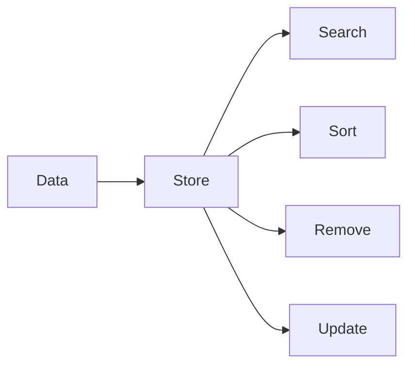

Example:

```java
import java.util.*;

public class Main {
    public static void main(String[] args) {
        List<String> names = new ArrayList<>();
        names.add("Asha");
        names.add("Ravi");

        System.out.println(names);
    }
}
```

Output:

```text
[Asha, Ravi]
```

---

# 2. Collection Family Tree

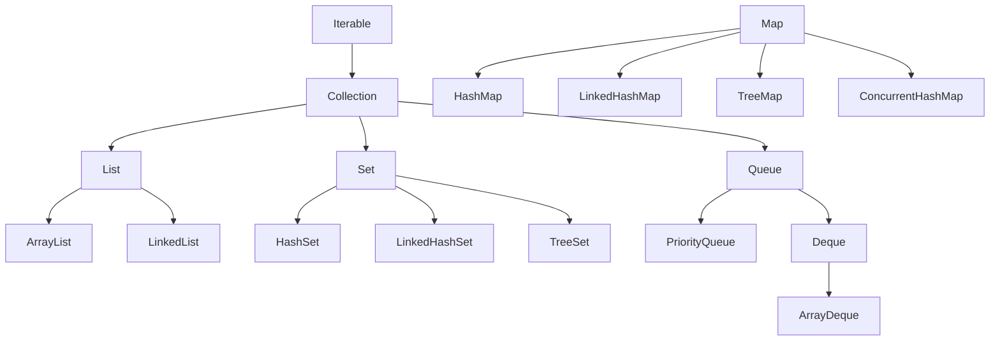

Important:

`Map` is part of Java Collections Framework, but it does **not** extend `Collection`.

---

# 3. Project Setup

## Folder

```text
java-collections-demo/
 └── src/
     └── Main.java
```

## Main.java

```java
import java.util.*;

public class Main {
    public static void main(String[] args) {
        System.out.println("Java Collections Demo");
    }
}
```

Run:

```bash
javac src/Main.java
java -cp src Main
```

---

# 4. Array vs Collection

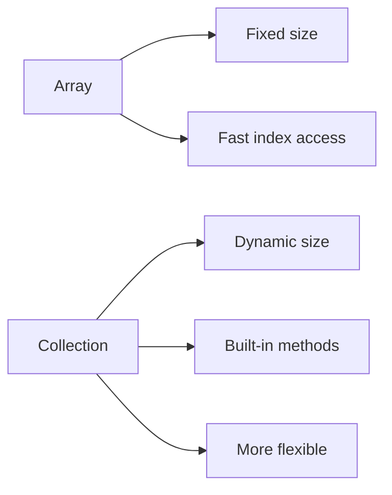

Array:

```java
String[] names = new String[2];
names[0] = "Asha";
names[1] = "Ravi";
```

Collection:

```java
List<String> names = new ArrayList<>();
names.add("Asha");
names.add("Ravi");
names.add("Meera");
```

Use collection when size can change.

---

# 5. List

A `List` keeps insertion order and allows duplicates.

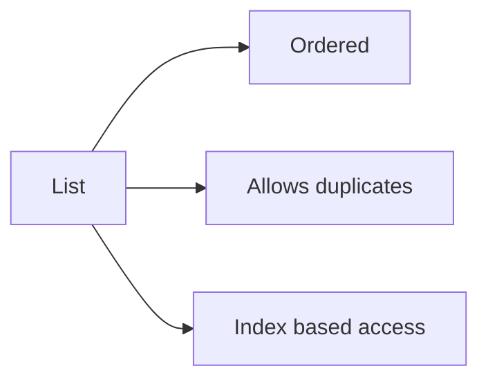

## ArrayList

Best for fast reading by index.

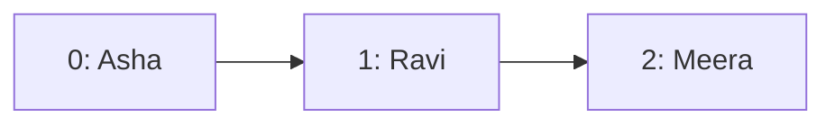

```java
import java.util.*;

public class ArrayListDemo {
    public static void main(String[] args) {
        List<String> users = new ArrayList<>();

        users.add("Asha");
        users.add("Ravi");
        users.add("Meera");

        System.out.println(users.get(1)); // Ravi
        System.out.println(users.size()); // 3

        users.remove("Ravi");
        System.out.println(users); // [Asha, Meera]
    }
}
```

Use cases:

```text
Product list
Search results
Student names
API response list
```

## LinkedList

Best when frequent insert/delete happens at beginning or middle.

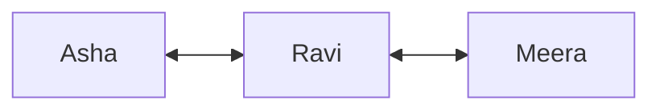

```java
import java.util.*;

public class LinkedListDemo {
    public static void main(String[] args) {
        LinkedList<String> tasks = new LinkedList<>();

        tasks.add("Task 1");
        tasks.addFirst("Urgent Task");
        tasks.addLast("Task 2");

        System.out.println(tasks);
        System.out.println(tasks.removeFirst());
    }
}
```

Use cases:

```text
Undo history
Recent actions
Task chain
Queue-like work
```

---

# 6. Set

A `Set` stores unique values.

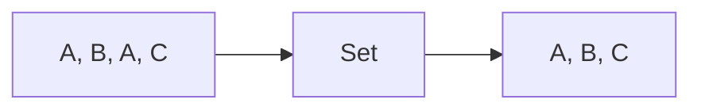

## HashSet

Fast unique storage. No guaranteed order.

```java
import java.util.*;

public class HashSetDemo {
    public static void main(String[] args) {
        Set<String> emails = new HashSet<>();

        emails.add("a@test.com");
        emails.add("b@test.com");
        emails.add("a@test.com");

        System.out.println(emails);
    }
}
```

Use cases:

```text
Remove duplicate emails
Unique user IDs
Visited pages
```

## LinkedHashSet

Unique values + insertion order.

```java
Set<String> cities = new LinkedHashSet<>();
cities.add("Delhi");
cities.add("Mumbai");
cities.add("Delhi");

System.out.println(cities); // [Delhi, Mumbai]
```

Use when you need uniqueness and order.

## TreeSet

Unique values + sorted order.

```java
Set<Integer> scores = new TreeSet<>();
scores.add(50);
scores.add(10);
scores.add(30);

System.out.println(scores); // [10, 30, 50]
```

Use cases:

```text
Sorted rankings
Sorted unique names
Leaderboard scores
```

---

# 7. Map

A `Map` stores key-value pairs.

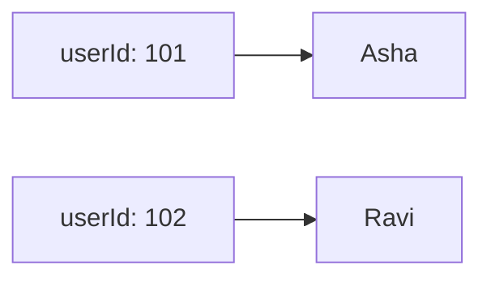

## HashMap

Fast key-value lookup. No guaranteed order.

```java
import java.util.*;

public class HashMapDemo {
    public static void main(String[] args) {
        Map<Integer, String> users = new HashMap<>();

        users.put(101, "Asha");
        users.put(102, "Ravi");
        users.put(103, "Meera");

        System.out.println(users.get(102)); // Ravi
        System.out.println(users.containsKey(101)); // true
    }
}
```

Use cases:

```text
User ID -> User name
Product ID -> Product object
Token -> Session data
Word -> Count
```

## LinkedHashMap

Keeps insertion order.

```java
Map<String, Integer> cart = new LinkedHashMap<>();
cart.put("Book", 2);
cart.put("Pen", 5);
cart.put("Bag", 1);

System.out.println(cart);
```

Use cases:

```text
Shopping cart
Ordered API response
Recent item history
```

## TreeMap

Sorted by key.

```java
Map<Integer, String> ranks = new TreeMap<>();
ranks.put(3, "Bronze");
ranks.put(1, "Gold");
ranks.put(2, "Silver");

System.out.println(ranks); // {1=Gold, 2=Silver, 3=Bronze}
```

Use cases:

```text
Ranking
Date sorted records
Range search
```

---

# 8. Queue

Queue follows FIFO: First In, First Out.

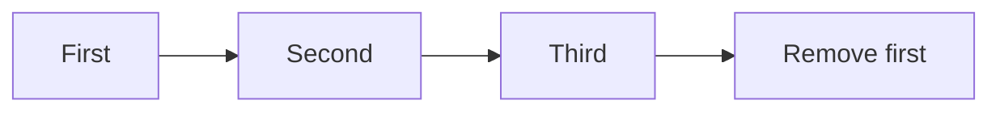

```java
import java.util.*;

public class QueueDemo {
    public static void main(String[] args) {
        Queue<String> queue = new LinkedList<>();

        queue.offer("Job 1");
        queue.offer("Job 2");
        queue.offer("Job 3");

        System.out.println(queue.poll()); // Job 1
        System.out.println(queue.peek()); // Job 2
    }
}
```

Use cases:

```text
Print jobs
Background tasks
Message processing
Order processing
```

---

# 9. Deque

Deque means double-ended queue.

Add/remove from both sides.

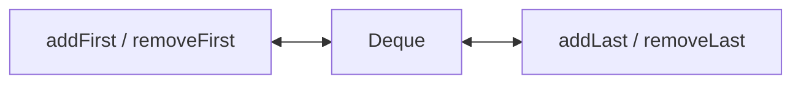

```java
import java.util.*;

public class DequeDemo {
    public static void main(String[] args) {
        Deque<String> deque = new ArrayDeque<>();

        deque.addFirst("Front");
        deque.addLast("Back");

        System.out.println(deque.removeFirst());
        System.out.println(deque.removeLast());
    }
}
```

Use cases:

```text
Browser history
Undo/redo
Sliding window problems
Stack replacement
```

---

# 10. PriorityQueue

PriorityQueue removes items by priority, not insertion order.

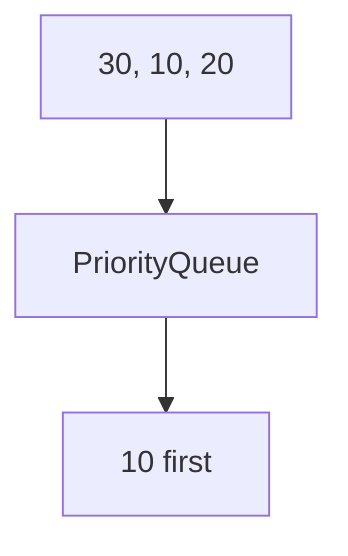

```java
import java.util.*;

public class PriorityQueueDemo {
    public static void main(String[] args) {
        PriorityQueue<Integer> pq = new PriorityQueue<>();

        pq.offer(30);
        pq.offer(10);
        pq.offer(20);

        System.out.println(pq.poll()); // 10
        System.out.println(pq.poll()); // 20
    }
}
```

Max priority queue:

```java
PriorityQueue<Integer> maxHeap = new PriorityQueue<>(Comparator.reverseOrder());
maxHeap.offer(30);
maxHeap.offer(10);
maxHeap.offer(20);

System.out.println(maxHeap.poll()); // 30
```

Use cases:

```text
Top K elements
Task priority
Shortest job first
Leaderboard
```

---

# 11. Stack Style Using Deque

Avoid old `Stack`. Prefer `Deque`.

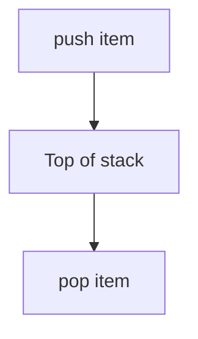

```java
import java.util.*;

public class StackUsingDequeDemo {
    public static void main(String[] args) {
        Deque<String> stack = new ArrayDeque<>();

        stack.push("Page 1");
        stack.push("Page 2");
        stack.push("Page 3");

        System.out.println(stack.pop()); // Page 3
        System.out.println(stack.peek()); // Page 2
    }
}
```

Use cases:

```text
Undo feature
Back button
Expression evaluation
DFS traversal
```

---

# 12. Iterator

Iterator safely loops and removes items.

```java
import java.util.*;

public class IteratorDemo {
    public static void main(String[] args) {
        List<String> names = new ArrayList<>(List.of("Asha", "Ravi", "Meera"));

        Iterator<String> iterator = names.iterator();

        while (iterator.hasNext()) {
            String name = iterator.next();

            if (name.equals("Ravi")) {
                iterator.remove();
            }
        }

        System.out.println(names); // [Asha, Meera]
    }
}
```

Do not remove like this inside enhanced for-loop:

```java
for (String name : names) {
    names.remove(name); // can throw ConcurrentModificationException
}
```

---

# 13. Sorting Collections

## Sort numbers

```java
List<Integer> numbers = new ArrayList<>(List.of(5, 1, 3));
Collections.sort(numbers);
System.out.println(numbers); // [1, 3, 5]
```

## Sort reverse

```java
numbers.sort(Comparator.reverseOrder());
System.out.println(numbers); // [5, 3, 1]
```

## Sort strings

```java
List<String> names = new ArrayList<>(List.of("Ravi", "Asha", "Meera"));
names.sort(Comparator.naturalOrder());
System.out.println(names); // [Asha, Meera, Ravi]
```

---

# 14. Comparable vs Comparator

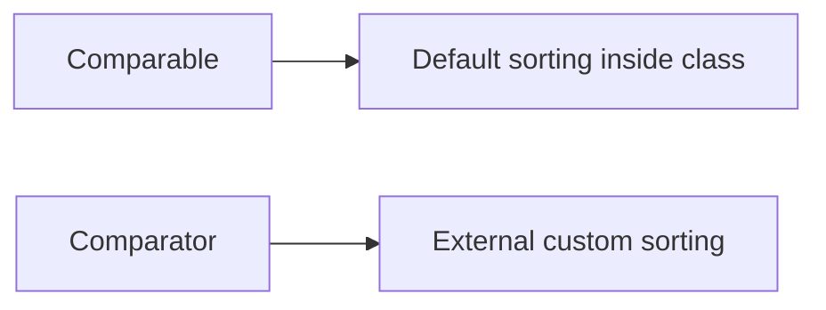

## Comparable

```java
import java.util.*;

class Student implements Comparable<Student> {
    int id;
    String name;

    Student(int id, String name) {
        this.id = id;
        this.name = name;
    }

    @Override
    public int compareTo(Student other) {
        return this.id - other.id;
    }

    @Override
    public String toString() {
        return id + " - " + name;
    }
}

public class ComparableDemo {
    public static void main(String[] args) {
        List<Student> students = new ArrayList<>();
        students.add(new Student(3, "Ravi"));
        students.add(new Student(1, "Asha"));
        students.add(new Student(2, "Meera"));

        Collections.sort(students);
        System.out.println(students);
    }
}
```

## Comparator

```java
students.sort(Comparator.comparing(student -> student.name));
```

Better with method reference:

```java
students.sort(Comparator.comparing(Student::toString));
```

Real object sorting:

```java
class Product {
    String name;
    int price;

    Product(String name, int price) {
        this.name = name;
        this.price = price;
    }
}

List<Product> products = new ArrayList<>();
products.add(new Product("Phone", 50000));
products.add(new Product("Book", 500));
products.add(new Product("Laptop", 80000));

products.sort(Comparator.comparingInt(product -> product.price));
```

---

# 15. Streams With Collections

Streams help filter, map, sort, and collect data.

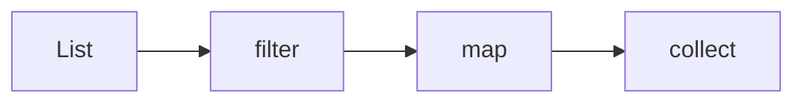

```java
import java.util.*;
import java.util.stream.*;

public class StreamDemo {
    public static void main(String[] args) {
        List<String> names = List.of("Asha", "Ravi", "Amit", "Meera");

        List<String> result = names.stream()
                .filter(name -> name.startsWith("A"))
                .map(String::toUpperCase)
                .toList();

        System.out.println(result); // [ASHA, AMIT]
    }
}
```

Count words:

```java
List<String> words = List.of("java", "spring", "java", "sql");

Map<String, Long> count = words.stream()
        .collect(Collectors.groupingBy(word -> word, Collectors.counting()));

System.out.println(count); // {spring=1, java=2, sql=1}
```

---

# 16. Immutable Collections

Immutable means cannot change after creation.

```java
List<String> roles = List.of("USER", "ADMIN");
Set<String> permissions = Set.of("READ", "WRITE");
Map<String, Integer> limits = Map.of("FREE", 10, "PRO", 100);
```

This fails:

```java
roles.add("MANAGER"); // UnsupportedOperationException
```

Use cases:

```text
Constants
Default roles
Configuration values
Safe API response data
```

---

# 17. Concurrent Collections

Use concurrent collections when multiple threads update data.

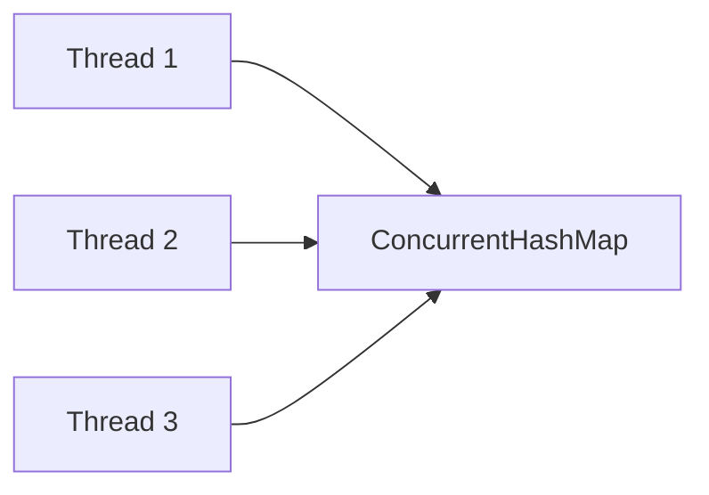

## ConcurrentHashMap

```java
import java.util.concurrent.*;

public class ConcurrentMapDemo {
    public static void main(String[] args) {
        ConcurrentHashMap<String, Integer> scores = new ConcurrentHashMap<>();

        scores.put("Asha", 10);
        scores.merge("Asha", 5, Integer::sum);

        System.out.println(scores); // {Asha=15}
    }
}
```

## CopyOnWriteArrayList

Good when reads are frequent and writes are rare.

```java
import java.util.concurrent.*;

CopyOnWriteArrayList<String> users = new CopyOnWriteArrayList<>();
users.add("Asha");
users.add("Ravi");
```

Use cases:

```text
Cache map
Online user sessions
Read-heavy listener list
Shared counters
```

---

# 18. Real Use Cases

## Use Case 1: Remove duplicate users

```java
List<String> users = List.of("Asha", "Ravi", "Asha", "Meera");
Set<String> uniqueUsers = new HashSet<>(users);

System.out.println(uniqueUsers);
```

Visual:

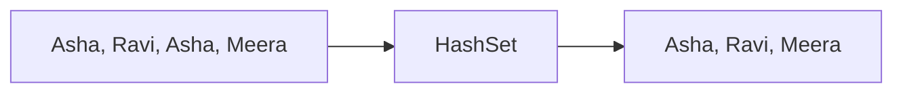

## Use Case 2: Count word frequency

```java
String text = "java spring java sql java";
String[] words = text.split(" ");

Map<String, Integer> frequency = new HashMap<>();

for (String word : words) {
    frequency.put(word, frequency.getOrDefault(word, 0) + 1);
}

System.out.println(frequency);
```

Visual:

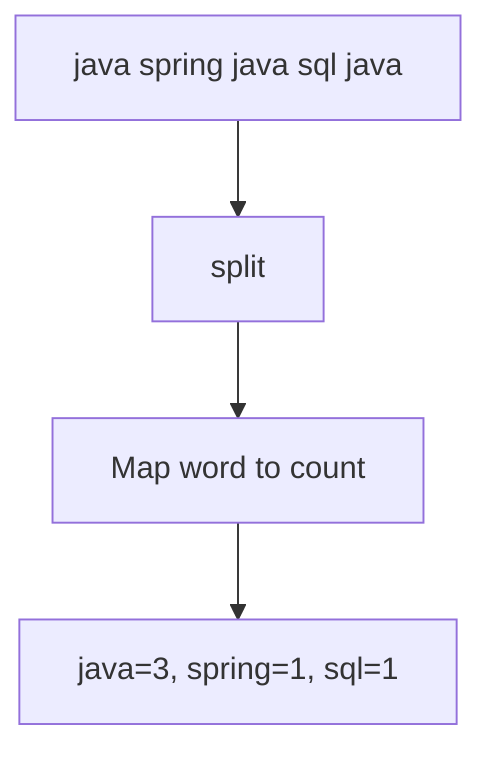

## Use Case 3: Shopping cart

```java
Map<String, Integer> cart = new LinkedHashMap<>();

cart.put("Book", 2);
cart.put("Pen", 5);
cart.put("Bag", 1);

for (Map.Entry<String, Integer> item : cart.entrySet()) {
    System.out.println(item.getKey() + " quantity: " + item.getValue());
}
```

## Use Case 4: Top 3 scores

```java
PriorityQueue<Integer> minHeap = new PriorityQueue<>();
int[] scores = {90, 30, 100, 70, 80};

for (int score : scores) {
    minHeap.offer(score);

    if (minHeap.size() > 3) {
        minHeap.poll();
    }
}

System.out.println(minHeap); // top 3 values remain
```

## Use Case 5: Recent search history

```java
Deque<String> history = new ArrayDeque<>();

history.addFirst("java collections");
history.addFirst("spring boot");
history.addFirst("sql joins");

System.out.println(history.peekFirst()); // latest search
```

---

# 19. Which Collection Should I Choose?

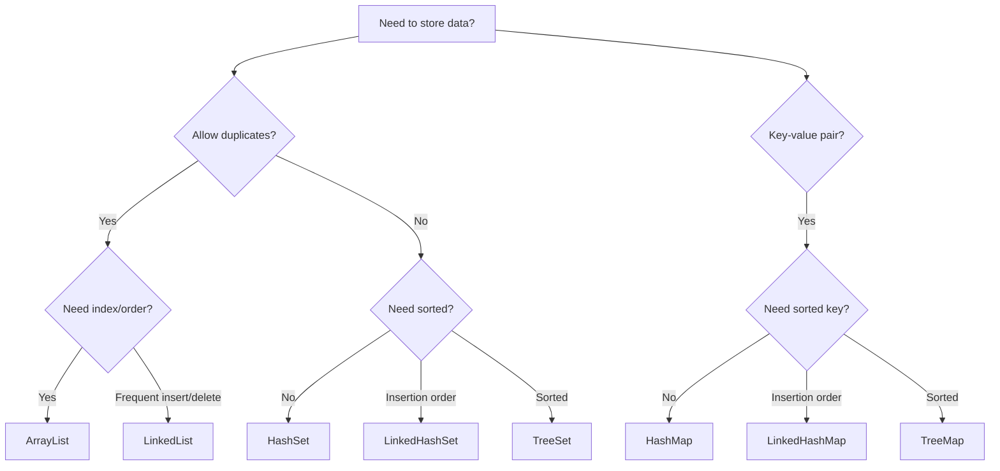

Quick table:

| Need | Use |
|---|---|
| Fast list read | `ArrayList` |
| Frequent first/last operations | `LinkedList` or `ArrayDeque` |
| Unique values | `HashSet` |
| Unique + insertion order | `LinkedHashSet` |
| Unique + sorted | `TreeSet` |
| Key-value lookup | `HashMap` |
| Key-value + insertion order | `LinkedHashMap` |
| Key-value + sorted keys | `TreeMap` |
| FIFO queue | `Queue` |
| Stack | `ArrayDeque` |
| Priority tasks | `PriorityQueue` |
| Thread-safe map | `ConcurrentHashMap` |

---

# 20. Interview Patterns

## Pattern 1: Frequency Map

```java
Map<Character, Integer> freq = new HashMap<>();
String s = "banana";

for (char ch : s.toCharArray()) {
    freq.put(ch, freq.getOrDefault(ch, 0) + 1);
}

System.out.println(freq);
```

## Pattern 2: Two Sum

```java
import java.util.*;

public class TwoSum {
    public static int[] twoSum(int[] nums, int target) {
        Map<Integer, Integer> map = new HashMap<>();

        for (int i = 0; i < nums.length; i++) {
            int need = target - nums[i];

            if (map.containsKey(need)) {
                return new int[] { map.get(need), i };
            }

            map.put(nums[i], i);
        }

        return new int[] {};
    }
}
```

Visual:

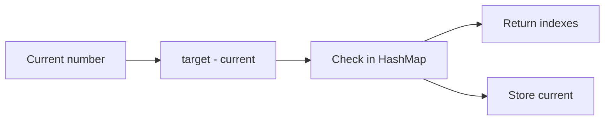

## Pattern 3: First Non-Repeating Character

```java
String s = "aabbcde";
Map<Character, Integer> freq = new LinkedHashMap<>();

for (char ch : s.toCharArray()) {
    freq.put(ch, freq.getOrDefault(ch, 0) + 1);
}

for (Map.Entry<Character, Integer> entry : freq.entrySet()) {
    if (entry.getValue() == 1) {
        System.out.println(entry.getKey());
        break;
    }
}
```

## Pattern 4: Valid Parentheses

```java
import java.util.*;

public class ValidParentheses {
    public static boolean isValid(String s) {
        Deque<Character> stack = new ArrayDeque<>();

        for (char ch : s.toCharArray()) {
            if (ch == '(' || ch == '[' || ch == '{') {
                stack.push(ch);
            } else {
                if (stack.isEmpty()) return false;

                char top = stack.pop();

                if (ch == ')' && top != '(') return false;
                if (ch == ']' && top != '[') return false;
                if (ch == '}' && top != '{') return false;
            }
        }

        return stack.isEmpty();
    }
}
```

---

# 21. Mini Practice Project

Build an in-memory student manager using collections.

## Features

```text
1. Add student
2. Find student by ID
3. List all students
4. Sort students by marks
5. Remove duplicate emails
```

## Visual design

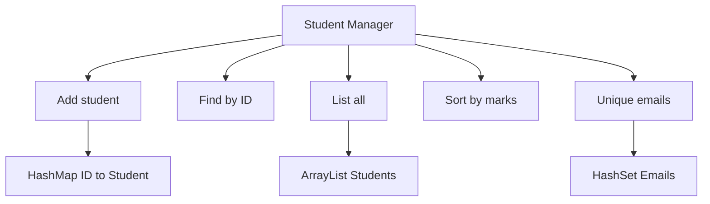

## Student class

```java
class Student {
    int id;
    String name;
    String email;
    int marks;

    Student(int id, String name, String email, int marks) {
        this.id = id;
        this.name = name;
        this.email = email;
        this.marks = marks;
    }

    @Override
    public String toString() {
        return id + " " + name + " " + marks;
    }
}
```

## Manager class

```java
import java.util.*;

class StudentManager {
    private final Map<Integer, Student> studentById = new HashMap<>();

    public void addStudent(Student student) {
        studentById.put(student.id, student);
    }

    public Student findById(int id) {
        return studentById.get(id);
    }

    public List<Student> findAll() {
        return new ArrayList<>(studentById.values());
    }

    public List<Student> sortByMarksDesc() {
        List<Student> students = findAll();
        students.sort(Comparator.comparingInt((Student s) -> s.marks).reversed());
        return students;
    }

    public Set<String> uniqueEmails() {
        Set<String> emails = new HashSet<>();

        for (Student student : studentById.values()) {
            emails.add(student.email);
        }

        return emails;
    }
}
```

## Main class

```java
public class Main {
    public static void main(String[] args) {
        StudentManager manager = new StudentManager();

        manager.addStudent(new Student(1, "Asha", "a@test.com", 90));
        manager.addStudent(new Student(2, "Ravi", "r@test.com", 75));
        manager.addStudent(new Student(3, "Meera", "m@test.com", 95));

        System.out.println(manager.findById(2));
        System.out.println(manager.findAll());
        System.out.println(manager.sortByMarksDesc());
        System.out.println(manager.uniqueEmails());
    }
}
```

---

# 22. Cheat Sheet

## Basic methods

```java
list.add(item);
list.get(index);
list.remove(item);
list.size();
list.contains(item);
```

```java
set.add(item);
set.contains(item);
set.remove(item);
```

```java
map.put(key, value);
map.get(key);
map.remove(key);
map.containsKey(key);
map.getOrDefault(key, defaultValue);
```

```java
queue.offer(item);
queue.poll();
queue.peek();
```

```java
deque.push(item);
deque.pop();
deque.peek();
deque.addFirst(item);
deque.addLast(item);
```

## Big picture

```mermaid
flowchart TD
    Collections["Java Collections"] --> List["List: ordered duplicates"]
    Collections --> Set["Set: unique values"]
    Collections --> Queue["Queue: processing order"]
    Collections --> Map["Map: key-value lookup"]

    List --> ArrayList["ArrayList: fast read"]
    List --> LinkedList["LinkedList: fast links"]

    Set --> HashSet["HashSet: unique fast"]
    Set --> TreeSet["TreeSet: unique sorted"]

    Queue --> PriorityQueue["PriorityQueue: priority"]
    Queue --> ArrayDeque["ArrayDeque: stack/deque"]

    Map --> HashMap["HashMap: fast lookup"]
    Map --> TreeMap["TreeMap: sorted keys"]
```

---

## Final Learning Path

```mermaid
flowchart LR
    A["ArrayList"] --> B["HashSet"] --> C["HashMap"] --> D["Queue"] --> E["Deque"] --> F["Sorting"] --> G["Streams"] --> H["Concurrent Collections"]
```

Recommended order:

1. Learn `ArrayList`
2. Learn `HashSet`
3. Learn `HashMap`
4. Practice frequency problems
5. Learn `Queue` and `Deque`
6. Learn sorting with `Comparator`
7. Learn streams
8. Learn concurrent collections

