# Java Concurrency Problems — Visual Reference

This file is designed for visual learning: each topic has a short goal, a Mermaid diagram, key synchronization idea, Java code, and common pitfalls.

## Clickable Index

### Synchronization Problems
1. [Print Foo Bar Alternately](#1-print-foo-bar-alternately)
2. [Print Zero Even Odd](#2-print-zero-even-odd)
3. [Fizz Buzz Multithreaded](#3-fizz-buzz-multithreaded)
4. [Building H2O Molecule](#4-building-h2o-molecule)
5. [Readers-Writers Problem](#5-readers-writers-problem)
6. [Unisex Bathroom](#6-unisex-bathroom)
7. [Bounded Buffer](#7-bounded-buffer)
8. [Sleeping Barber](#8-sleeping-barber)
9. [Dining Philosophers](#9-dining-philosophers)
10. [Cigarette Smokers Problem](#10-cigarette-smokers-problem)
11. [Santa Claus Problem](#11-santa-claus-problem)

### Concurrency Design Problems
12. [Design Thread-Safe Cache with TTL](#12-design-thread-safe-cache-with-ttl)
13. [Design Thread-Safe Rate Limiter](#13-design-thread-safe-rate-limiter)
14. [Design Deferred Callback Executor](#14-design-deferred-callback-executor)
15. [Design Ticket Booking System](#15-design-ticket-booking-system)
16. [Design Multithreaded Web Crawler](#16-design-multithreaded-web-crawler)
17. [Design Multithreaded Pub-Sub System](#17-design-multithreaded-pub-sub-system)
18. [Design Task Scheduler with Dependencies](#18-design-task-scheduler-with-dependencies)

### Concurrent Data Structures
19. [Design Concurrent HashMap](#19-design-concurrent-hashmap)
20. [Design Thread-Safe Blocking Queue](#20-design-thread-safe-blocking-queue)
21. [Design Concurrent Bloom Filter](#21-design-concurrent-bloom-filter)
22. [Design Lock-Free Queue](#22-design-lock-free-queue)
23. [Design Concurrent Priority Queue](#23-design-concurrent-priority-queue)
24. [Design Thread-Safe Trie](#24-design-thread-safe-trie)

### Multi-threaded Algorithms
25. [Multi-threaded Merge Sort](#25-multi-threaded-merge-sort)
26. [Multi-threaded Word Frequency Counter](#26-multi-threaded-word-frequency-counter)
27. [Concurrent BFS/DFS Graph Traversal](#27-concurrent-bfsdfs-graph-traversal)

---

## Quick Java Concurrency Cheat Sheet

| Tool | Use When | Mental Model |
|---|---|---|
| `synchronized` | Simple mutual exclusion | One key to one room |
| `ReentrantLock` | Need `Condition`, timeout, fairness | Explicit lock/unlock |
| `Condition` | Multiple wait queues | Separate waiting lines |
| `Semaphore` | Limit permits or ordering | Tokens |
| `CountDownLatch` | Wait until N events complete | Countdown gate |
| `CyclicBarrier` | Reusable group checkpoint | Everyone arrives together |
| `BlockingQueue` | Producer-consumer | Thread-safe pipe |
| `AtomicInteger` / CAS | Lock-free counters/state | Compare-and-swap |
| `ConcurrentHashMap` | Shared map | Partitioned internal locking/CAS |
| `ExecutorService` | Manage worker threads | Thread pool |

### Standard Pattern: Lock + Condition

```java
lock.lock();
try {
    while (!conditionIsTrue) {
        condition.await(); // always wait in while, not if
    }
    // critical section
    condition.signalAll();
} finally {
    lock.unlock();
}
```

---


## 1. Print Foo Bar Alternately

**Goal:** Two threads print `foo` and `bar` alternately for `n` rounds.

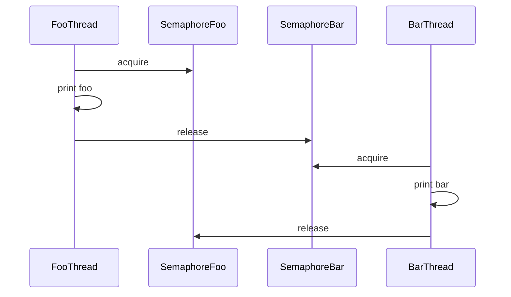

| Step | Thread | Permit Needed | Prints | Releases |
|---|---|---:|---|---|
| 1 | Foo | `fooSem` | `foo` | `barSem` |
| 2 | Bar | `barSem` | `bar` | `fooSem` |

```java
import java.util.concurrent.Semaphore;

class FooBar {
    private final int n;
    private final Semaphore fooSem = new Semaphore(1);
    private final Semaphore barSem = new Semaphore(0);

    FooBar(int n) {
        this.n = n;
    }

    public void foo(Runnable printFoo) throws InterruptedException {
        for (int i = 0; i < n; i++) {
            fooSem.acquire();
            printFoo.run();
            barSem.release();
        }
    }

    public void bar(Runnable printBar) throws InterruptedException {
        for (int i = 0; i < n; i++) {
            barSem.acquire();
            printBar.run();
            fooSem.release();
        }
    }
}
```

**Pitfall:** Starting both semaphores at `1` can print `foobar` out of order.


## 2. Print Zero Even Odd

**Goal:** Print sequence `010203...n` using three threads: zero, even, odd.

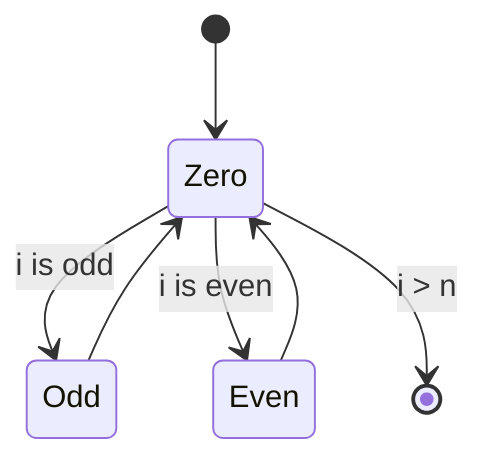

| Semaphore | Initial | Meaning |
|---|---:|---|
| `zeroSem` | 1 | zero can print |
| `oddSem` | 0 | odd number can print |
| `evenSem` | 0 | even number can print |

```java
import java.util.concurrent.Semaphore;
import java.util.function.IntConsumer;

class ZeroEvenOdd {
    private final int n;
    private final Semaphore zeroSem = new Semaphore(1);
    private final Semaphore oddSem = new Semaphore(0);
    private final Semaphore evenSem = new Semaphore(0);

    ZeroEvenOdd(int n) {
        this.n = n;
    }

    public void zero(IntConsumer printNumber) throws InterruptedException {
        for (int i = 1; i <= n; i++) {
            zeroSem.acquire();
            printNumber.accept(0);
            if ((i & 1) == 1) oddSem.release();
            else evenSem.release();
        }
    }

    public void odd(IntConsumer printNumber) throws InterruptedException {
        for (int i = 1; i <= n; i += 2) {
            oddSem.acquire();
            printNumber.accept(i);
            zeroSem.release();
        }
    }

    public void even(IntConsumer printNumber) throws InterruptedException {
        for (int i = 2; i <= n; i += 2) {
            evenSem.acquire();
            printNumber.accept(i);
            zeroSem.release();
        }
    }
}
```

**Rule:** Zero decides who goes next.


## 3. Fizz Buzz Multithreaded

**Goal:** Four threads print numbers, fizz, buzz, and fizzbuzz in correct order.

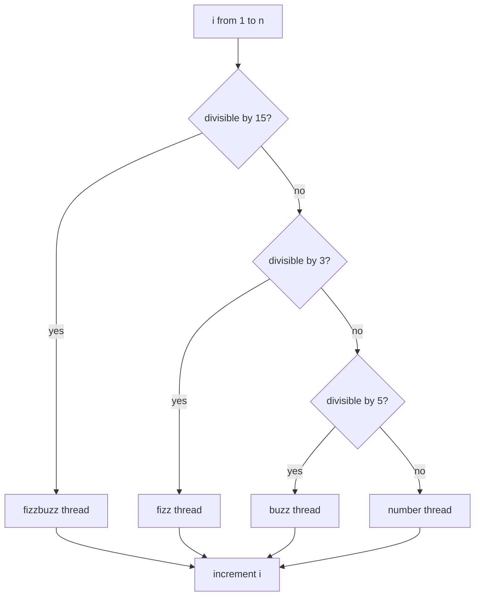

```java
import java.util.concurrent.locks.*;
import java.util.function.IntConsumer;

class FizzBuzz {
    private final int n;
    private int current = 1;
    private final Lock lock = new ReentrantLock();
    private final Condition changed = lock.newCondition();

    FizzBuzz(int n) {
        this.n = n;
    }

    private boolean done() {
        return current > n;
    }

    private void runWhen(java.util.function.IntPredicate rule, Runnable action)
            throws InterruptedException {
        while (true) {
            lock.lock();
            try {
                while (!done() && !rule.test(current)) {
                    changed.await();
                }
                if (done()) {
                    changed.signalAll();
                    return;
                }
                action.run();
                current++;
                changed.signalAll();
            } finally {
                lock.unlock();
            }
        }
    }

    public void fizz(Runnable printFizz) throws InterruptedException {
        runWhen(x -> x % 3 == 0 && x % 5 != 0, printFizz);
    }

    public void buzz(Runnable printBuzz) throws InterruptedException {
        runWhen(x -> x % 5 == 0 && x % 3 != 0, printBuzz);
    }

    public void fizzbuzz(Runnable printFizzBuzz) throws InterruptedException {
        runWhen(x -> x % 15 == 0, printFizzBuzz);
    }

    public void number(IntConsumer printNumber) throws InterruptedException {
        runWhen(x -> x % 3 != 0 && x % 5 != 0, () -> printNumber.accept(current));
    }
}
```

**Pitfall:** Always wake all waiting threads after incrementing `current`.


## 4. Building H2O Molecule

**Goal:** For every water molecule, exactly two hydrogen threads and one oxygen thread proceed.

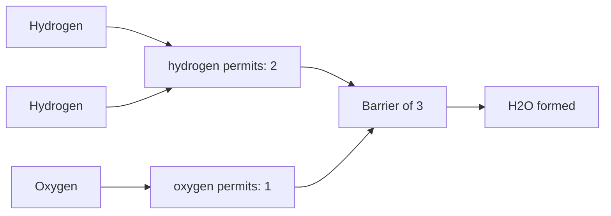

```java
import java.util.concurrent.*;

class H2O {
    private final Semaphore h = new Semaphore(2);
    private final Semaphore o = new Semaphore(1);
    private final CyclicBarrier barrier = new CyclicBarrier(3, () -> {
        h.release(2);
        o.release(1);
    });

    public void hydrogen(Runnable releaseHydrogen) throws InterruptedException {
        h.acquire();
        releaseHydrogen.run();
        awaitBarrier();
    }

    public void oxygen(Runnable releaseOxygen) throws InterruptedException {
        o.acquire();
        releaseOxygen.run();
        awaitBarrier();
    }

    private void awaitBarrier() throws InterruptedException {
        try {
            barrier.await();
        } catch (BrokenBarrierException e) {
            throw new RuntimeException(e);
        }
    }
}
```

**Why barrier?** It prevents the next molecule from stealing permits before the current group of three completes.


## 5. Readers-Writers Problem

**Goal:** Many readers can read together, but writers need exclusive access.

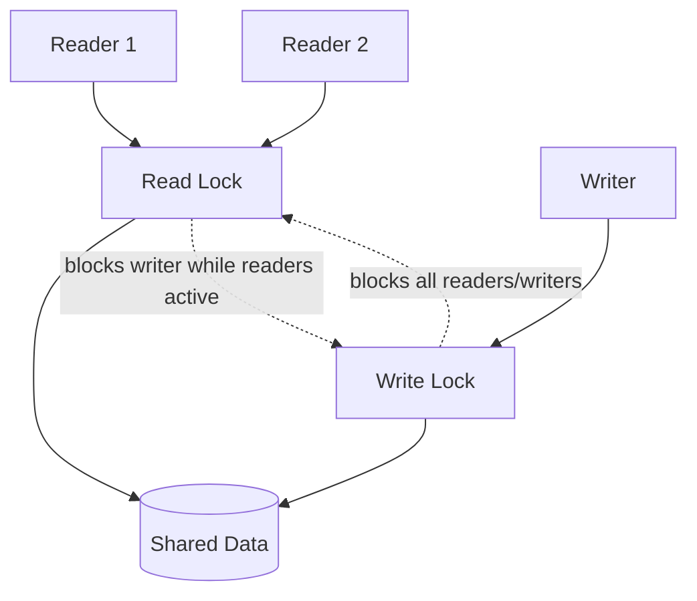

| Operation | Lock |
|---|---|
| Read | shared `readLock` |
| Write | exclusive `writeLock` |

```java
import java.util.concurrent.locks.*;

class ReadersWritersResource<T> {
    private T value;
    private final ReentrantReadWriteLock rw = new ReentrantReadWriteLock(true);
    private final Lock read = rw.readLock();
    private final Lock write = rw.writeLock();

    ReadersWritersResource(T initialValue) {
        this.value = initialValue;
    }

    public T read() {
        read.lock();
        try {
            return value;
        } finally {
            read.unlock();
        }
    }

    public void write(T newValue) {
        write.lock();
        try {
            value = newValue;
        } finally {
            write.unlock();
        }
    }
}
```

**Fair lock:** `true` reduces writer starvation.


## 6. Unisex Bathroom

**Goal:** People of only one gender can be inside at once, with limited capacity.

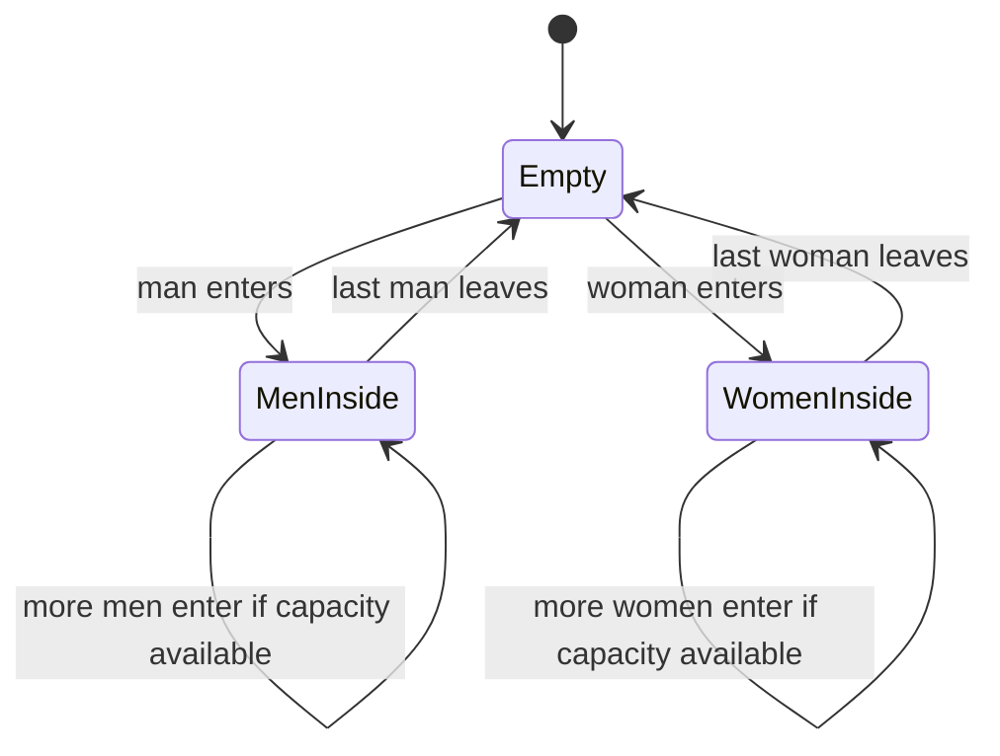

```java
import java.util.concurrent.locks.*;

class UnisexBathroom {
    enum Gender { NONE, MALE, FEMALE }

    private final int capacity;
    private int inside = 0;
    private Gender current = Gender.NONE;

    private final Lock lock = new ReentrantLock(true);
    private final Condition canEnter = lock.newCondition();

    UnisexBathroom(int capacity) {
        this.capacity = capacity;
    }

    public void enter(Gender gender) throws InterruptedException {
        lock.lock();
        try {
            while (inside == capacity || (current != Gender.NONE && current != gender)) {
                canEnter.await();
            }
            current = gender;
            inside++;
        } finally {
            lock.unlock();
        }
    }

    public void leave() {
        lock.lock();
        try {
            inside--;
            if (inside == 0) current = Gender.NONE;
            canEnter.signalAll();
        } finally {
            lock.unlock();
        }
    }
}
```

**Pitfall:** Without fairness, one gender can starve the other.


## 7. Bounded Buffer

**Goal:** Producers block when buffer is full; consumers block when buffer is empty.

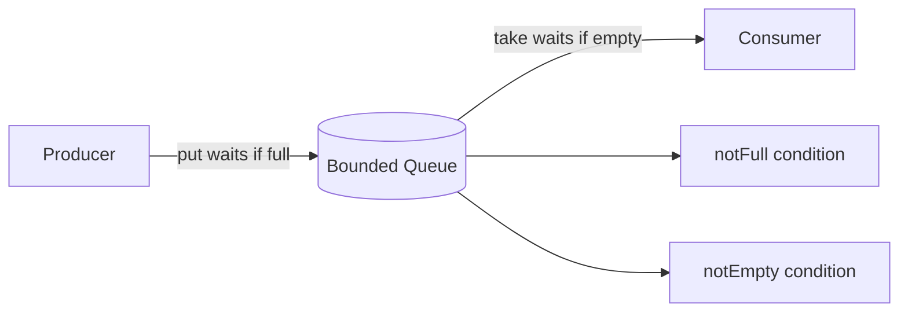

```java
import java.util.*;

class BoundedBuffer<T> {
    private final Queue<T> queue = new ArrayDeque<>();
    private final int capacity;

    BoundedBuffer(int capacity) {
        this.capacity = capacity;
    }

    public synchronized void put(T item) throws InterruptedException {
        while (queue.size() == capacity) {
            wait();
        }
        queue.add(item);
        notifyAll();
    }

    public synchronized T take() throws InterruptedException {
        while (queue.isEmpty()) {
            wait();
        }
        T item = queue.remove();
        notifyAll();
        return item;
    }
}
```

**Production choice:** Java already provides `ArrayBlockingQueue`.


## 8. Sleeping Barber

**Goal:** Barber sleeps when no customers; customers leave if all waiting chairs are full.

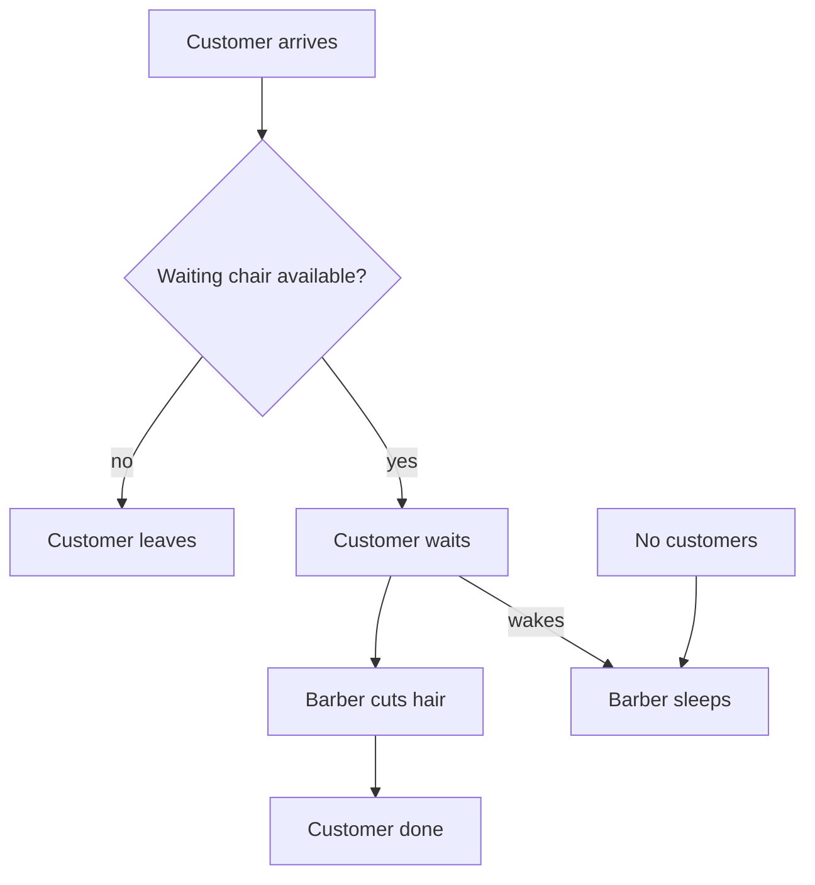

```java
import java.util.concurrent.Semaphore;

class SleepingBarber {
    private final Semaphore waitingChairs;
    private final Semaphore customers = new Semaphore(0);
    private final Semaphore barberReady = new Semaphore(0);

    SleepingBarber(int chairs) {
        this.waitingChairs = new Semaphore(chairs);
    }

    public boolean customer() throws InterruptedException {
        if (!waitingChairs.tryAcquire()) {
            return false; // no chair, customer leaves
        }
        customers.release();       // wake barber / join queue
        barberReady.acquire();     // wait until barber is ready
        waitingChairs.release();   // leave waiting chair
        return true;
    }

    public void barberLoop(Runnable cutHair) throws InterruptedException {
        while (true) {
            customers.acquire();   // sleep here if no customers
            barberReady.release();
            cutHair.run();
        }
    }
}
```

**Mental model:** `customers` wakes barber; `barberReady` calls next customer.


## 9. Dining Philosophers

**Goal:** Five philosophers need two forks each without deadlock.

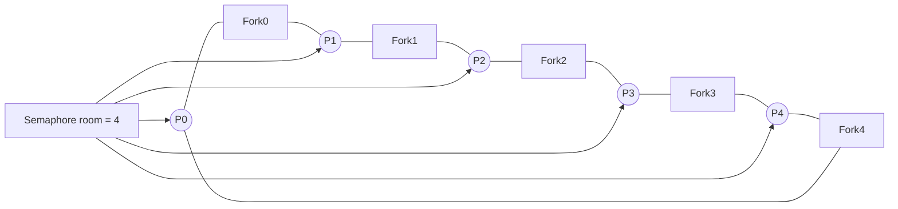

```java
import java.util.concurrent.Semaphore;

class DiningPhilosophers {
    private final Semaphore[] forks = new Semaphore[5];
    private final Semaphore room = new Semaphore(4); // prevents circular wait

    DiningPhilosophers() {
        for (int i = 0; i < 5; i++) forks[i] = new Semaphore(1);
    }

    public void wantsToEat(int id, Runnable pickLeftFork, Runnable pickRightFork,
                           Runnable eat, Runnable putLeftFork, Runnable putRightFork)
            throws InterruptedException {
        int left = id;
        int right = (id + 1) % 5;

        room.acquire();
        forks[left].acquire();
        pickLeftFork.run();
        forks[right].acquire();
        pickRightFork.run();

        eat.run();

        putRightFork.run();
        forks[right].release();
        putLeftFork.run();
        forks[left].release();
        room.release();
    }
}
```

**Why `room = 4`?** At least one philosopher can always obtain both forks.


## 10. Cigarette Smokers Problem

**Goal:** Agent places two ingredients. Smoker with the missing third ingredient smokes.

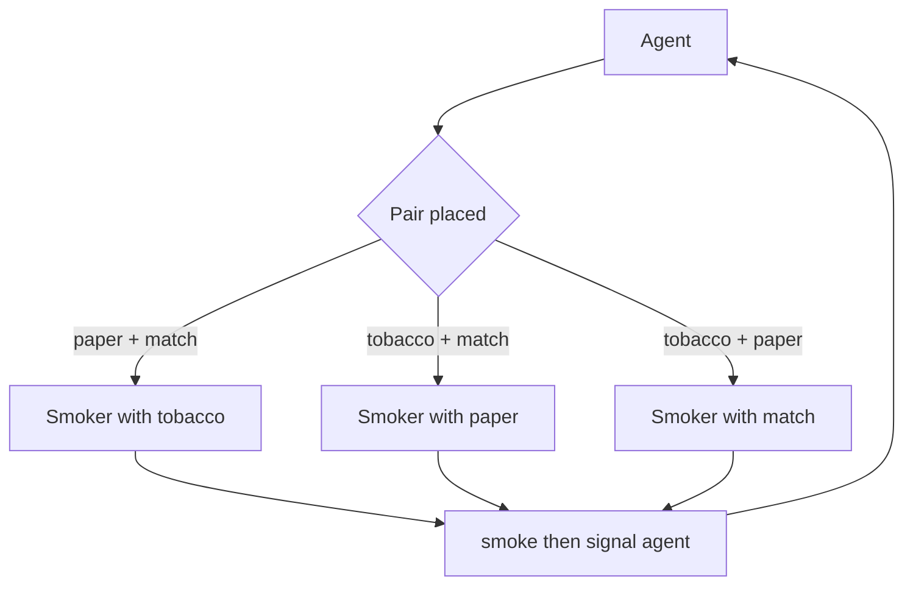

```java
import java.util.concurrent.Semaphore;

class CigaretteSmokers {
    private final Semaphore agent = new Semaphore(1);
    private final Semaphore tobaccoSmoker = new Semaphore(0);
    private final Semaphore paperSmoker = new Semaphore(0);
    private final Semaphore matchSmoker = new Semaphore(0);

    public void agentPutsPaperAndMatch() throws InterruptedException {
        agent.acquire();
        tobaccoSmoker.release();
    }

    public void agentPutsTobaccoAndMatch() throws InterruptedException {
        agent.acquire();
        paperSmoker.release();
    }

    public void agentPutsTobaccoAndPaper() throws InterruptedException {
        agent.acquire();
        matchSmoker.release();
    }

    public void smokerWithTobacco(Runnable smoke) throws InterruptedException {
        tobaccoSmoker.acquire();
        smoke.run();
        agent.release();
    }

    public void smokerWithPaper(Runnable smoke) throws InterruptedException {
        paperSmoker.acquire();
        smoke.run();
        agent.release();
    }

    public void smokerWithMatch(Runnable smoke) throws InterruptedException {
        matchSmoker.acquire();
        smoke.run();
        agent.release();
    }
}
```

**Invariant:** Only one table pair exists at a time.


## 11. Santa Claus Problem

**Goal:** Santa sleeps until either 9 reindeer return or 3 elves need help. Reindeer have priority.

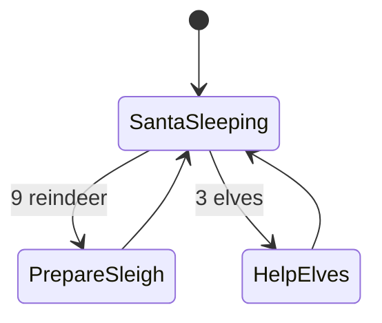

```java
import java.util.concurrent.locks.*;

class SantaClaus {
    private int reindeer = 0;
    private int elves = 0;

    private final Lock lock = new ReentrantLock(true);
    private final Condition santa = lock.newCondition();
    private final Condition elfHelpDone = lock.newCondition();

    public void reindeerArrives() {
        lock.lock();
        try {
            reindeer++;
            if (reindeer == 9) santa.signal();
        } finally {
            lock.unlock();
        }
    }

    public void elfNeedsHelp() throws InterruptedException {
        lock.lock();
        try {
            while (elves == 3) elfHelpDone.await();
            elves++;
            if (elves == 3) santa.signal();
        } finally {
            lock.unlock();
        }
    }

    public void santaLoop(Runnable prepareSleigh, Runnable helpElves) throws InterruptedException {
        while (true) {
            lock.lock();
            try {
                while (reindeer < 9 && elves < 3) santa.await();

                if (reindeer == 9) {
                    prepareSleigh.run();
                    reindeer = 0;
                } else {
                    helpElves.run();
                    elves = 0;
                    elfHelpDone.signalAll();
                }
            } finally {
                lock.unlock();
            }
        }
    }
}
```

**Priority rule:** Check reindeer before elves.


## 12. Design Thread-Safe Cache with TTL

**Goal:** Cache entries expire after TTL; concurrent readers/writers are safe.

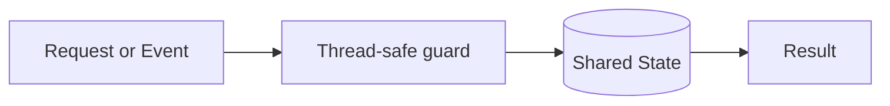

| Part | Choice |
|---|---|
| Core idea | ConcurrentHashMap + timestamp + scheduled cleanup |
| Main risk | race condition, stale state, or missed wakeup |
| Testing tip | run with many threads and repeated operations |

```java
import java.util.concurrent.*;

class TtlCache<K, V> {
    private static class Entry<V> {
        final V value;
        final long expiresAtMillis;
        Entry(V value, long expiresAtMillis) {
            this.value = value;
            this.expiresAtMillis = expiresAtMillis;
        }
    }

    private final ConcurrentHashMap<K, Entry<V>> map = new ConcurrentHashMap<>();

    public void put(K key, V value, long ttlMillis) {
        map.put(key, new Entry<>(value, System.currentTimeMillis() + ttlMillis));
    }

    public V get(K key) {
        Entry<V> e = map.get(key);
        if (e == null) return null;
        if (System.currentTimeMillis() > e.expiresAtMillis) {
            map.remove(key, e);
            return null;
        }
        return e.value;
    }

    public void cleanup() {
        long now = System.currentTimeMillis();
        map.entrySet().removeIf(x -> x.getValue().expiresAtMillis < now);
    }
}
```

**Checklist:** define ownership of state, protect every mutation, avoid holding locks during slow I/O.


## 13. Design Thread-Safe Rate Limiter

**Goal:** Allow at most N requests per time window per key.


| Part | Choice |
|---|---|
| Core idea | ConcurrentHashMap + synchronized bucket |
| Main risk | race condition, stale state, or missed wakeup |
| Testing tip | run with many threads and repeated operations |

```java
import java.util.concurrent.*;

class FixedWindowRateLimiter {
    private static class Bucket {
        long windowStart;
        int count;
    }

    private final int limit;
    private final long windowMillis;
    private final ConcurrentHashMap<String, Bucket> buckets = new ConcurrentHashMap<>();

    FixedWindowRateLimiter(int limit, long windowMillis) {
        this.limit = limit;
        this.windowMillis = windowMillis;
    }

    public boolean allow(String key) {
        Bucket b = buckets.computeIfAbsent(key, k -> new Bucket());
        synchronized (b) {
            long now = System.currentTimeMillis();
            if (now - b.windowStart >= windowMillis) {
                b.windowStart = now;
                b.count = 0;
            }
            if (b.count >= limit) return false;
            b.count++;
            return true;
        }
    }
}
```

**Checklist:** define ownership of state, protect every mutation, avoid holding locks during slow I/O.


## 14. Design Deferred Callback Executor

**Goal:** Execute callbacks after their scheduled time.


| Part | Choice |
|---|---|
| Core idea | PriorityBlockingQueue + worker thread |
| Main risk | race condition, stale state, or missed wakeup |
| Testing tip | run with many threads and repeated operations |

```java
import java.util.concurrent.*;

class DeferredCallbackExecutor {
    private static class Task implements Delayed {
        final long runAtNanos;
        final Runnable callback;

        Task(Runnable callback, long delayMillis) {
            this.callback = callback;
            this.runAtNanos = System.nanoTime() + TimeUnit.MILLISECONDS.toNanos(delayMillis);
        }

        public long getDelay(TimeUnit unit) {
            return unit.convert(runAtNanos - System.nanoTime(), TimeUnit.NANOSECONDS);
        }

        public int compareTo(Delayed other) {
            return Long.compare(this.getDelay(TimeUnit.NANOSECONDS),
                                other.getDelay(TimeUnit.NANOSECONDS));
        }
    }

    private final DelayQueue<Task> queue = new DelayQueue<>();

    public void schedule(Runnable callback, long delayMillis) {
        queue.put(new Task(callback, delayMillis));
    }

    public void start() {
        Thread worker = new Thread(() -> {
            while (!Thread.currentThread().isInterrupted()) {
                try {
                    queue.take().callback.run();
                } catch (InterruptedException e) {
                    Thread.currentThread().interrupt();
                }
            }
        });
        worker.start();
    }
}
```

**Checklist:** define ownership of state, protect every mutation, avoid holding locks during slow I/O.


## 15. Design Ticket Booking System

**Goal:** Prevent overselling seats.


| Part | Choice |
|---|---|
| Core idea | Per-seat lock or synchronized seat object |
| Main risk | race condition, stale state, or missed wakeup |
| Testing tip | run with many threads and repeated operations |

```java
import java.util.concurrent.*;
import java.util.concurrent.atomic.AtomicBoolean;

class TicketBookingSystem {
    private final ConcurrentHashMap<String, AtomicBoolean> seats = new ConcurrentHashMap<>();

    public TicketBookingSystem(java.util.Collection<String> seatIds) {
        for (String id : seatIds) seats.put(id, new AtomicBoolean(false));
    }

    public boolean book(String seatId) {
        AtomicBoolean booked = seats.get(seatId);
        return booked != null && booked.compareAndSet(false, true);
    }

    public boolean cancel(String seatId) {
        AtomicBoolean booked = seats.get(seatId);
        return booked != null && booked.compareAndSet(true, false);
    }
}
```

**Checklist:** define ownership of state, protect every mutation, avoid holding locks during slow I/O.


## 16. Design Multithreaded Web Crawler

**Goal:** Visit URLs once using multiple workers.


| Part | Choice |
|---|---|
| Core idea | BlockingQueue + visited set + worker pool |
| Main risk | race condition, stale state, or missed wakeup |
| Testing tip | run with many threads and repeated operations |

```java
import java.util.*;
import java.util.concurrent.*;

class WebCrawler {
    private final Set<String> visited = ConcurrentHashMap.newKeySet();
    private final BlockingQueue<String> queue = new LinkedBlockingQueue<>();
    private final ExecutorService pool;

    WebCrawler(int workers) {
        this.pool = Executors.newFixedThreadPool(workers);
    }

    public void crawl(String startUrl) {
        visited.add(startUrl);
        queue.add(startUrl);

        for (int i = 0; i < 4; i++) {
            pool.submit(() -> {
                while (!Thread.currentThread().isInterrupted()) {
                    try {
                        String url = queue.take();
                        for (String next : fetchLinks(url)) {
                            if (visited.add(next)) queue.add(next);
                        }
                    } catch (InterruptedException e) {
                        Thread.currentThread().interrupt();
                    }
                }
            });
        }
    }

    private List<String> fetchLinks(String url) {
        return List.of(); // plug in parser/client
    }
}
```

**Checklist:** define ownership of state, protect every mutation, avoid holding locks during slow I/O.


## 17. Design Multithreaded Pub-Sub System

**Goal:** Publish messages to subscribers concurrently.


| Part | Choice |
|---|---|
| Core idea | Topic map + CopyOnWriteArrayList + executor |
| Main risk | race condition, stale state, or missed wakeup |
| Testing tip | run with many threads and repeated operations |

```java
import java.util.*;
import java.util.concurrent.*;
import java.util.function.Consumer;

class PubSub {
    private final ConcurrentHashMap<String, CopyOnWriteArrayList<Consumer<String>>> subs =
            new ConcurrentHashMap<>();
    private final ExecutorService pool = Executors.newCachedThreadPool();

    public void subscribe(String topic, Consumer<String> subscriber) {
        subs.computeIfAbsent(topic, k -> new CopyOnWriteArrayList<>()).add(subscriber);
    }

    public void publish(String topic, String message) {
        for (Consumer<String> sub : subs.getOrDefault(topic, new CopyOnWriteArrayList<>())) {
            pool.submit(() -> sub.accept(message));
        }
    }
}
```

**Checklist:** define ownership of state, protect every mutation, avoid holding locks during slow I/O.


## 18. Design Task Scheduler with Dependencies

**Goal:** Run a task only after all dependencies finish.


| Part | Choice |
|---|---|
| Core idea | DAG + indegree + queue |
| Main risk | race condition, stale state, or missed wakeup |
| Testing tip | run with many threads and repeated operations |

```java
import java.util.*;
import java.util.concurrent.*;
import java.util.concurrent.atomic.AtomicInteger;

class DependencyScheduler {
    private final ExecutorService pool = Executors.newFixedThreadPool(4);

    public void run(Map<String, Runnable> tasks, Map<String, List<String>> graph) {
        Map<String, AtomicInteger> indegree = new ConcurrentHashMap<>();
        Map<String, List<String>> children = new ConcurrentHashMap<>();

        for (String t : tasks.keySet()) indegree.put(t, new AtomicInteger(0));
        for (var e : graph.entrySet()) {
            String dependency = e.getKey();
            for (String child : e.getValue()) {
                children.computeIfAbsent(dependency, k -> new ArrayList<>()).add(child);
                indegree.get(child).incrementAndGet();
            }
        }

        BlockingQueue<String> ready = new LinkedBlockingQueue<>();
        indegree.forEach((k, v) -> { if (v.get() == 0) ready.add(k); });

        while (!ready.isEmpty()) {
            String task = ready.poll();
            pool.submit(() -> {
                tasks.get(task).run();
                for (String child : children.getOrDefault(task, List.of())) {
                    if (indegree.get(child).decrementAndGet() == 0) ready.add(child);
                }
            });
        }
    }
}
```

**Checklist:** define ownership of state, protect every mutation, avoid holding locks during slow I/O.


## 19. Design Concurrent HashMap

**Visual model:**

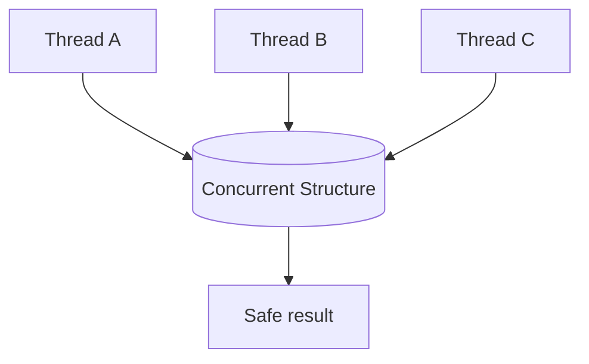

| Design Point | Guidance |
|---|---|
| Core idea | Split map into lock-protected segments. |
| Read path | should be safe under concurrent writes |
| Write path | must protect structural changes |
| Prefer built-in? | yes, unless interview asks implementation |

```java
import java.util.*;
import java.util.concurrent.locks.*;

class SimpleConcurrentHashMap<K, V> {
    private static class Segment<K, V> {
        final Lock lock = new ReentrantLock();
        final Map<K, V> map = new HashMap<>();
    }

    private final Segment<K, V>[] segments;

    @SuppressWarnings("unchecked")
    SimpleConcurrentHashMap(int segmentCount) {
        segments = new Segment[segmentCount];
        for (int i = 0; i < segmentCount; i++) segments[i] = new Segment<>();
    }

    private Segment<K, V> segment(Object key) {
        return segments[Math.abs(key.hashCode()) % segments.length];
    }

    public V get(K key) {
        Segment<K, V> s = segment(key);
        s.lock.lock();
        try { return s.map.get(key); }
        finally { s.lock.unlock(); }
    }

    public void put(K key, V value) {
        Segment<K, V> s = segment(key);
        s.lock.lock();
        try { s.map.put(key, value); }
        finally { s.lock.unlock(); }
    }
}
```


## 20. Design Thread-Safe Blocking Queue

**Visual model:**


| Design Point | Guidance |
|---|---|
| Core idea | Use two conditions: not empty and not full. |
| Read path | should be safe under concurrent writes |
| Write path | must protect structural changes |
| Prefer built-in? | yes, unless interview asks implementation |

```java
import java.util.*;
import java.util.concurrent.locks.*;

class BlockingQueueCustom<T> {
    private final Queue<T> q = new ArrayDeque<>();
    private final int capacity;
    private final Lock lock = new ReentrantLock();
    private final Condition notEmpty = lock.newCondition();
    private final Condition notFull = lock.newCondition();

    BlockingQueueCustom(int capacity) { this.capacity = capacity; }

    public void put(T item) throws InterruptedException {
        lock.lock();
        try {
            while (q.size() == capacity) notFull.await();
            q.add(item);
            notEmpty.signal();
        } finally { lock.unlock(); }
    }

    public T take() throws InterruptedException {
        lock.lock();
        try {
            while (q.isEmpty()) notEmpty.await();
            T item = q.remove();
            notFull.signal();
            return item;
        } finally { lock.unlock(); }
    }
}
```


## 21. Design Concurrent Bloom Filter

**Visual model:**

```mermaid
flowchart TD
    ThreadA[Thread A] --> Structure[(Concurrent Structure)]
    ThreadB[Thread B] --> Structure
    ThreadC[Thread C] --> Structure
    Structure --> Safe[Safe result]
```

| Design Point | Guidance |
|---|---|
| Core idea | Use atomic bit array for lock-free approximate membership. |
| Read path | should be safe under concurrent writes |
| Write path | must protect structural changes |
| Prefer built-in? | yes, unless interview asks implementation |

```java
import java.util.concurrent.atomic.AtomicLongArray;

class ConcurrentBloomFilter {
    private final AtomicLongArray bits;
    private final int bitSize;

    ConcurrentBloomFilter(int bitSize) {
        this.bitSize = bitSize;
        this.bits = new AtomicLongArray((bitSize + 63) / 64);
    }

    public void add(String value) {
        for (int h : hashes(value)) setBit(Math.floorMod(h, bitSize));
    }

    public boolean mightContain(String value) {
        for (int h : hashes(value)) {
            if (!getBit(Math.floorMod(h, bitSize))) return false;
        }
        return true;
    }

    private void setBit(int index) {
        int word = index / 64;
        long mask = 1L << index;
        long oldValue, newValue;
        do {
            oldValue = bits.get(word);
            newValue = oldValue | mask;
        } while (!bits.compareAndSet(word, oldValue, newValue));
    }

    private boolean getBit(int index) {
        return (bits.get(index / 64) & (1L << index)) != 0;
    }

    private int[] hashes(String s) {
        return new int[] { s.hashCode(), s.hashCode() * 31 + 17 };
    }
}
```


## 22. Design Lock-Free Queue

**Visual model:**

```mermaid
flowchart TD
    ThreadA[Thread A] --> Structure[(Concurrent Structure)]
    ThreadB[Thread B] --> Structure
    ThreadC[Thread C] --> Structure
    Structure --> Safe[Safe result]
```

| Design Point | Guidance |
|---|---|
| Core idea | Michael-Scott queue with CAS head/tail pointers. |
| Read path | should be safe under concurrent writes |
| Write path | must protect structural changes |
| Prefer built-in? | yes, unless interview asks implementation |

```java
import java.util.concurrent.atomic.AtomicReference;

class LockFreeQueue<T> {
    private static class Node<T> {
        final T value;
        final AtomicReference<Node<T>> next = new AtomicReference<>();
        Node(T value) { this.value = value; }
    }

    private final AtomicReference<Node<T>> head;
    private final AtomicReference<Node<T>> tail;

    LockFreeQueue() {
        Node<T> dummy = new Node<>(null);
        head = new AtomicReference<>(dummy);
        tail = new AtomicReference<>(dummy);
    }

    public void offer(T value) {
        Node<T> node = new Node<>(value);
        while (true) {
            Node<T> t = tail.get();
            Node<T> next = t.next.get();
            if (next == null) {
                if (t.next.compareAndSet(null, node)) {
                    tail.compareAndSet(t, node);
                    return;
                }
            } else {
                tail.compareAndSet(t, next);
            }
        }
    }

    public T poll() {
        while (true) {
            Node<T> h = head.get();
            Node<T> t = tail.get();
            Node<T> next = h.next.get();

            if (next == null) return null;
            if (h == t) {
                tail.compareAndSet(t, next);
            } else if (head.compareAndSet(h, next)) {
                return next.value;
            }
        }
    }
}
```


## 23. Design Concurrent Priority Queue

**Visual model:**

```mermaid
flowchart TD
    ThreadA[Thread A] --> Structure[(Concurrent Structure)]
    ThreadB[Thread B] --> Structure
    ThreadC[Thread C] --> Structure
    Structure --> Safe[Safe result]
```

| Design Point | Guidance |
|---|---|
| Core idea | Use `PriorityBlockingQueue` unless strict capacity is required. |
| Read path | should be safe under concurrent writes |
| Write path | must protect structural changes |
| Prefer built-in? | yes, unless interview asks implementation |

```java
import java.util.concurrent.*;

class ConcurrentPriorityTaskQueue {
    private static class Task implements Comparable<Task> {
        final int priority;
        final Runnable job;

        Task(int priority, Runnable job) {
            this.priority = priority;
            this.job = job;
        }

        public int compareTo(Task other) {
            return Integer.compare(other.priority, this.priority);
        }
    }

    private final PriorityBlockingQueue<Task> queue = new PriorityBlockingQueue<>();

    public void submit(int priority, Runnable job) {
        queue.add(new Task(priority, job));
    }

    public void workerLoop() throws InterruptedException {
        while (true) {
            queue.take().job.run();
        }
    }
}
```


## 24. Design Thread-Safe Trie

**Visual model:**

```mermaid
flowchart TD
    ThreadA[Thread A] --> Structure[(Concurrent Structure)]
    ThreadB[Thread B] --> Structure
    ThreadC[Thread C] --> Structure
    Structure --> Safe[Safe result]
```

| Design Point | Guidance |
|---|---|
| Core idea | Use per-node concurrent child maps and atomic terminal flag. |
| Read path | should be safe under concurrent writes |
| Write path | must protect structural changes |
| Prefer built-in? | yes, unless interview asks implementation |

```java
import java.util.concurrent.*;
import java.util.concurrent.atomic.AtomicBoolean;

class ConcurrentTrie {
    private static class Node {
        final ConcurrentHashMap<Character, Node> children = new ConcurrentHashMap<>();
        final AtomicBoolean word = new AtomicBoolean(false);
    }

    private final Node root = new Node();

    public void insert(String s) {
        Node cur = root;
        for (char c : s.toCharArray()) {
            cur = cur.children.computeIfAbsent(c, k -> new Node());
        }
        cur.word.set(true);
    }

    public boolean search(String s) {
        Node cur = root;
        for (char c : s.toCharArray()) {
            cur = cur.children.get(c);
            if (cur == null) return false;
        }
        return cur.word.get();
    }
}
```


## 25. Multi-threaded Merge Sort

```mermaid
flowchart TD
    Split[Split work] --> Workers[Parallel workers]
    Workers --> Shared[(Thread-safe shared state)]
    Shared --> Merge[Merge or final result]
```

| Step | Action |
|---|---|
| 1 | Split work into independent chunks |
| 2 | Process chunks in worker threads |
| 3 | Use thread-safe state or local state |
| 4 | Merge results carefully |
| Core idea | Split array recursively; sort halves in parallel; merge sequentially. |

```java
import java.util.concurrent.*;

class ParallelMergeSort {
    private static final int THRESHOLD = 1_000;

    public static void sort(int[] a) {
        ForkJoinPool.commonPool().invoke(new SortTask(a, 0, a.length));
    }

    private static class SortTask extends RecursiveAction {
        final int[] a;
        final int lo, hi;

        SortTask(int[] a, int lo, int hi) {
            this.a = a; this.lo = lo; this.hi = hi;
        }

        protected void compute() {
            if (hi - lo <= THRESHOLD) {
                java.util.Arrays.sort(a, lo, hi);
                return;
            }
            int mid = (lo + hi) >>> 1;
            invokeAll(new SortTask(a, lo, mid), new SortTask(a, mid, hi));
            merge(a, lo, mid, hi);
        }
    }

    private static void merge(int[] a, int lo, int mid, int hi) {
        int[] temp = new int[hi - lo];
        int i = lo, j = mid, k = 0;
        while (i < mid && j < hi) temp[k++] = a[i] <= a[j] ? a[i++] : a[j++];
        while (i < mid) temp[k++] = a[i++];
        while (j < hi) temp[k++] = a[j++];
        System.arraycopy(temp, 0, a, lo, temp.length);
    }
}
```


## 26. Multi-threaded Word Frequency Counter

```mermaid
flowchart TD
    Split[Split work] --> Workers[Parallel workers]
    Workers --> Shared[(Thread-safe shared state)]
    Shared --> Merge[Merge or final result]
```

| Step | Action |
|---|---|
| 1 | Split work into independent chunks |
| 2 | Process chunks in worker threads |
| 3 | Use thread-safe state or local state |
| 4 | Merge results carefully |
| Core idea | Partition text; count locally; merge with `ConcurrentHashMap`. |

```java
import java.util.*;
import java.util.concurrent.*;
import java.util.concurrent.atomic.LongAdder;

class ParallelWordCounter {
    public Map<String, Long> count(List<String> lines) throws InterruptedException {
        ConcurrentHashMap<String, LongAdder> counts = new ConcurrentHashMap<>();
        ExecutorService pool = Executors.newFixedThreadPool(Runtime.getRuntime().availableProcessors());

        for (String line : lines) {
            pool.submit(() -> {
                for (String word : line.toLowerCase().split("\\W+")) {
                    if (!word.isBlank()) {
                        counts.computeIfAbsent(word, k -> new LongAdder()).increment();
                    }
                }
            });
        }

        pool.shutdown();
        pool.awaitTermination(1, TimeUnit.MINUTES);

        Map<String, Long> result = new HashMap<>();
        counts.forEach((k, v) -> result.put(k, v.sum()));
        return result;
    }
}
```


## 27. Concurrent BFS/DFS Graph Traversal

```mermaid
flowchart TD
    Split[Split work] --> Workers[Parallel workers]
    Workers --> Shared[(Thread-safe shared state)]
    Shared --> Merge[Merge or final result]
```

| Step | Action |
|---|---|
| 1 | Split work into independent chunks |
| 2 | Process chunks in worker threads |
| 3 | Use thread-safe state or local state |
| 4 | Merge results carefully |
| Core idea | Use concurrent visited set and shared work queue/stack. |

```java
import java.util.*;
import java.util.concurrent.*;
import java.util.function.Consumer;

class ConcurrentBFS {
    public void bfs(String start,
                    java.util.function.Function<String, List<String>> neighbors,
                    Consumer<String> visit) throws InterruptedException {
        Set<String> visited = ConcurrentHashMap.newKeySet();
        BlockingQueue<String> queue = new LinkedBlockingQueue<>();
        ExecutorService pool = Executors.newFixedThreadPool(4);
        CountDownLatch done = new CountDownLatch(1);

        visited.add(start);
        queue.add(start);

        for (int i = 0; i < 4; i++) {
            pool.submit(() -> {
                try {
                    while (!Thread.currentThread().isInterrupted()) {
                        String node = queue.poll(100, TimeUnit.MILLISECONDS);
                        if (node == null) {
                            done.countDown();
                            return;
                        }
                        visit.accept(node);
                        for (String next : neighbors.apply(node)) {
                            if (visited.add(next)) queue.add(next);
                        }
                    }
                } catch (InterruptedException e) {
                    Thread.currentThread().interrupt();
                }
            });
        }

        done.await();
        pool.shutdownNow();
    }
}
```

---

## Interview Debugging Checklist

| Symptom | Likely Cause | Fix |
|---|---|---|
| Deadlock | cyclic lock acquisition | impose lock order or use semaphore gate |
| Starvation | unfair scheduling | use fair locks or queues |
| Missed signal | signal before wait or wrong condition | use `while`, signal after state change |
| Race condition | shared state not protected | lock, atomic, or concurrent collection |
| Poor performance | lock held too long | reduce critical section |
| Memory visibility bug | unsynchronized reads/writes | use lock, `volatile`, or atomic classes |

## Mini Rulebook

1. Shared mutable state must have a clear owner.
2. Every wait condition must be checked in a `while` loop.
3. Change state before signaling.
4. Release locks in `finally`.
5. Do not do slow I/O while holding a lock.
6. Prefer built-in Java concurrent collections in production.
