# AWS + Spring Boot + Spring Cloud Production Handbook

Beginner-to-advanced roadmap and step-by-step project guide for building, containerizing, deploying, securing, observing, and scaling a Spring Boot / Spring Cloud application on AWS.

> Target reader: Java/Spring Boot developer who wants to move from local development to production-level AWS microservices.
>
> Final project: a high-scale but simple e-commerce/order platform using Spring Boot, Spring Cloud AWS, PostgreSQL/RDS, Redis, SQS, S3, Docker, ECS Fargate, EKS, CI/CD, observability, security, and infrastructure as code.

---

## Clickable Index

- [0. How To Use This Guide](#0-how-to-use-this-guide)
- [1. Target Architecture](#1-target-architecture)
- [2. Learning Roadmap](#2-learning-roadmap)
- [3. AWS Foundations](#3-aws-foundations)
- [4. Linux And Networking Basics](#4-linux-and-networking-basics)
- [5. Spring Boot Production Basics](#5-spring-boot-production-basics)
- [6. Docker For Spring Boot](#6-docker-for-spring-boot)
- [7. AWS IAM](#7-aws-iam)
- [8. AWS VPC Networking](#8-aws-vpc-networking)
- [9. EC2 Deployment](#9-ec2-deployment)
- [10. RDS PostgreSQL](#10-rds-postgresql)
- [11. S3 Object Storage](#11-s3-object-storage)
- [12. Parameter Store And Secrets Manager](#12-parameter-store-and-secrets-manager)
- [13. Redis With ElastiCache](#13-redis-with-elasticache)
- [14. Messaging With SQS And SNS](#14-messaging-with-sqs-and-sns)
- [15. EventBridge For Event-Driven Systems](#15-eventbridge-for-event-driven-systems)
- [16. CloudWatch Observability](#16-cloudwatch-observability)
- [17. ECS Fargate Deployment](#17-ecs-fargate-deployment)
- [18. EKS Kubernetes Deployment](#18-eks-kubernetes-deployment)
- [19. CI/CD With GitHub Actions](#19-cicd-with-github-actions)
- [20. Terraform Infrastructure As Code](#20-terraform-infrastructure-as-code)
- [21. Production Security](#21-production-security)
- [22. Reliability Patterns](#22-reliability-patterns)
- [23. High-Scale Architecture Patterns](#23-high-scale-architecture-patterns)
- [24. Final Project Overview](#24-final-project-overview)
- [25. Build The Application Step By Step](#25-build-the-application-step-by-step)
- [26. Local Docker Compose Environment](#26-local-docker-compose-environment)
- [27. Deploy Final App To ECS Fargate](#27-deploy-final-app-to-ecs-fargate)
- [28. Deploy Final App To EKS](#28-deploy-final-app-to-eks)
- [29. Monitoring Dashboards](#29-monitoring-dashboards)
- [30. Production Readiness Checklist](#30-production-readiness-checklist)
- [31. Interview Talking Points](#31-interview-talking-points)

---

# 0. How To Use This Guide

Use this guide in 4 passes:

| Pass | Goal | Output |
|---|---|---|
| Pass 1 | Understand AWS and production basics | You can explain request flow |
| Pass 2 | Run app locally with Docker Compose | Local microservice environment |
| Pass 3 | Deploy on ECS Fargate | Production-like container deployment |
| Pass 4 | Deploy on EKS | Kubernetes production model |

Recommended order:

```text
AWS Basics
  -> Linux + Networking
  -> Spring Boot Production
  -> Docker
  -> IAM + VPC
  -> EC2
  -> RDS + S3 + Redis + SQS
  -> ECS Fargate
  -> CloudWatch
  -> CI/CD
  -> Terraform
  -> EKS
  -> Advanced Reliability
```

---

# 1. Target Architecture

Final system:

- API Gateway / ALB
- Spring Cloud Gateway
- Order Service
- Product Service
- Notification Worker
- PostgreSQL/RDS
- Redis/ElastiCache
- SQS
- S3
- CloudWatch
- ECS Fargate or EKS
- GitHub Actions
- Terraform

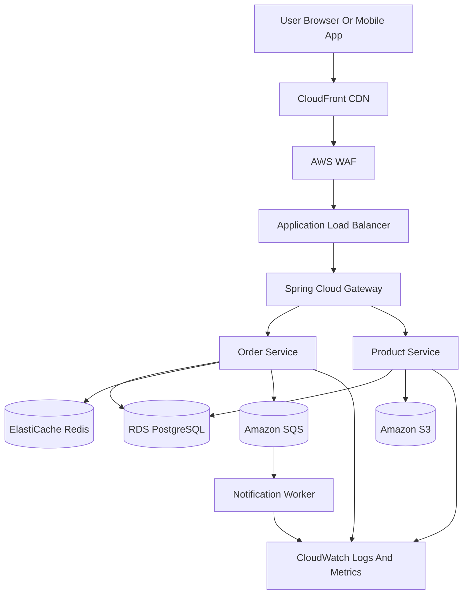

## Request Flow

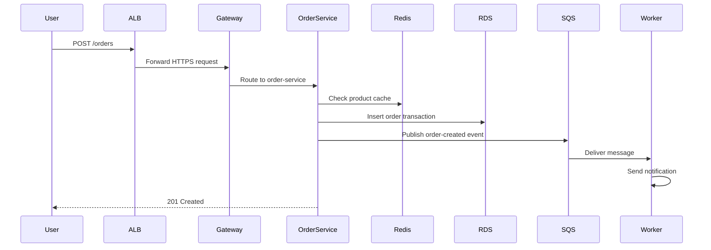

---

# 2. Learning Roadmap

## Beginner Level

| Topic | What You Should Be Able To Do |
|---|---|
| AWS account setup | Create account, IAM user, budget alarm |
| IAM basics | Users, groups, roles, policies |
| EC2 | SSH, install Java, run Spring Boot |
| S3 | Upload, download, presigned URLs |
| RDS | Create PostgreSQL and connect from app |
| CloudWatch | Read logs and metrics |

## Intermediate Level

| Topic | What You Should Be Able To Do |
|---|---|
| Docker | Build optimized Spring Boot image |
| ECR | Push image to AWS |
| ECS Fargate | Run containers without managing EC2 |
| ALB | Route traffic to containers |
| SQS | Async communication |
| Redis | Cache hot data |
| Secrets Manager | Store DB credentials |

## Advanced Production Level

| Topic | What You Should Be Able To Do |
|---|---|
| VPC design | Public/private subnets, NAT, security groups |
| EKS | Kubernetes deployment on AWS |
| Terraform | Reproducible infrastructure |
| CI/CD | Automated build, test, deploy |
| Observability | Metrics, logs, traces, alerts |
| Resilience | Retry, timeout, circuit breaker |
| Security | Least privilege, KMS, WAF, TLS |
| Scaling | Horizontal scaling, autoscaling, caching |

---

# 3. AWS Foundations

## 3.1 AWS Global Infrastructure

AWS is organized as:

```text
Region
  -> Availability Zone
       -> Data Center
```

Production rule:

- Use at least 2 Availability Zones.
- Put public entry points in public subnets.
- Put application and database resources in private subnets.

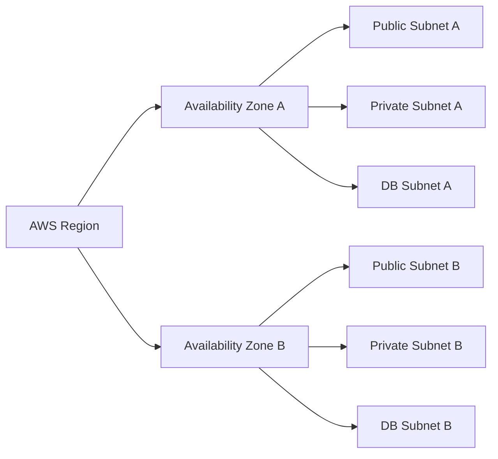

## 3.2 Must-Know AWS Services

| Category | Service | Purpose |
|---|---|---|
| Compute | EC2 | Virtual machine |
| Compute | ECS Fargate | Serverless containers |
| Compute | EKS | Managed Kubernetes |
| Network | VPC | Private network |
| Network | ALB | HTTP load balancer |
| Network | Route53 | DNS |
| Storage | S3 | Object storage |
| Database | RDS | Managed relational DB |
| Cache | ElastiCache Redis | Distributed cache |
| Messaging | SQS | Queue |
| Messaging | SNS | Pub/sub notification |
| Observability | CloudWatch | Logs, metrics, alarms |
| Security | IAM | Access control |
| Security | KMS | Encryption keys |
| Security | Secrets Manager | Secret storage |

---

# 4. Linux And Networking Basics

## 4.1 Linux Commands For Spring Boot Production

```bash
java -version
ps aux | grep java
top
htop
df -h
free -m
curl -i http://localhost:8080/actuator/health
tail -f /var/log/app/app.log
journalctl -u order-service -f
```

## 4.2 Ports

| Port | Usage |
|---|---|
| 22 | SSH |
| 80 | HTTP |
| 443 | HTTPS |
| 8080 | Common Spring Boot |
| 5432 | PostgreSQL |
| 6379 | Redis |

## 4.3 DNS To App Request Flow

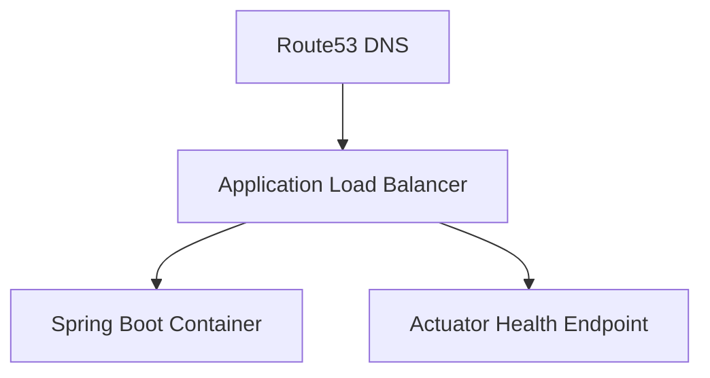

## 4.4 Nginx Reverse Proxy Example

<details>
<summary>nginx.conf</summary>

```nginx
server {
    listen 80;

    location / {
        proxy_pass http://localhost:8080;
        proxy_set_header Host $host;
        proxy_set_header X-Real-IP $remote_addr;
        proxy_set_header X-Forwarded-For $proxy_add_x_forwarded_for;
    }
}
```

</details>

---

# 5. Spring Boot Production Basics

## 5.1 Add Actuator

<details>
<summary>pom.xml</summary>

```xml
<dependency>
    <groupId>org.springframework.boot</groupId>
    <artifactId>spring-boot-starter-actuator</artifactId>
</dependency>
```

</details>

## 5.2 Production application.yml

<details>
<summary>application.yml</summary>

```yaml
server:
  port: 8080
  shutdown: graceful

spring:
  application:
    name: order-service
  lifecycle:
    timeout-per-shutdown-phase: 30s

management:
  endpoints:
    web:
      exposure:
        include: health,info,metrics,prometheus
  endpoint:
    health:
      probes:
        enabled: true
      show-details: when_authorized
  metrics:
    tags:
      application: ${spring.application.name}
```

</details>

## 5.3 Health Check Endpoints

| Endpoint | Purpose |
|---|---|
| `/actuator/health` | Overall health |
| `/actuator/health/liveness` | Is app alive? |
| `/actuator/health/readiness` | Is app ready for traffic? |
| `/actuator/metrics` | JVM/application metrics |
| `/actuator/prometheus` | Prometheus metrics |

## 5.4 Production JVM Options

```bash
java \
  -XX:MaxRAMPercentage=75 \
  -XX:+UseG1GC \
  -XX:+ExitOnOutOfMemoryError \
  -jar app.jar
```

---

# 6. Docker For Spring Boot

## 6.1 Dockerfile

<details>
<summary>Dockerfile</summary>

```dockerfile
FROM eclipse-temurin:21-jre-alpine

RUN addgroup -S app && adduser -S app -G app

WORKDIR /app

COPY target/*.jar app.jar

USER app

EXPOSE 8080

ENTRYPOINT ["java", "-XX:MaxRAMPercentage=75", "-XX:+UseG1GC", "-XX:+ExitOnOutOfMemoryError", "-jar", "app.jar"]
```

</details>

## 6.2 Build And Run

```bash
mvn clean package -DskipTests
docker build -t order-service:1.0 .
docker run -p 8080:8080 order-service:1.0
```

## 6.3 Docker Flow

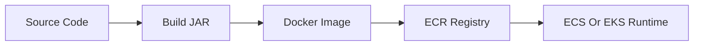

---

# 7. AWS IAM

IAM controls who can do what.

## 7.1 IAM Building Blocks

| Concept | Meaning |
|---|---|
| User | Human or app identity |
| Group | Collection of users |
| Role | Temporary permission identity |
| Policy | JSON permission document |
| Principle of Least Privilege | Give only required permissions |

## 7.2 Example IAM Policy For S3 Upload

<details>
<summary>s3-upload-policy.json</summary>

```json
{
  "Version": "2012-10-17",
  "Statement": [
    {
      "Sid": "UploadOnlyToAppBucket",
      "Effect": "Allow",
      "Action": [
        "s3:PutObject",
        "s3:GetObject"
      ],
      "Resource": "arn:aws:s3:::my-app-bucket/*"
    }
  ]
}
```

</details>

## 7.3 Production Rule

Do not put AWS access keys inside application properties.

Use:

- ECS task role
- EC2 instance profile
- EKS IRSA
- GitHub OIDC role

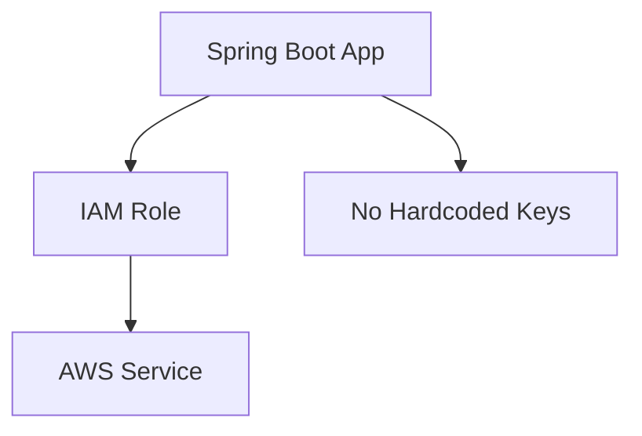

---

# 8. AWS VPC Networking

## 8.1 Production VPC Layout

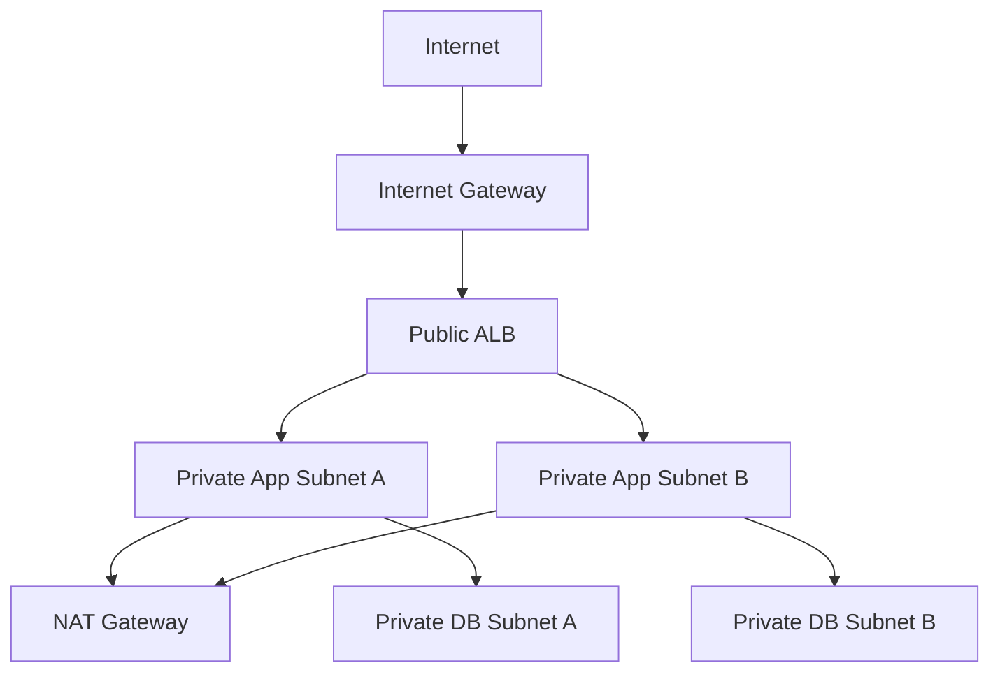

## 8.2 Public vs Private Subnet

| Subnet | Has Direct Internet? | Typical Resources |
|---|---:|---|
| Public subnet | Yes | ALB, NAT Gateway, bastion |
| Private app subnet | No inbound internet | ECS tasks, EKS pods |
| Private DB subnet | No inbound internet | RDS, Redis |

## 8.3 Security Group Rules

| Resource | Inbound |
|---|---|
| ALB | 80/443 from internet |
| App | 8080 from ALB SG only |
| RDS | 5432 from App SG only |
| Redis | 6379 from App SG only |

---

# 9. EC2 Deployment

EC2 is useful for learning deployment basics.

## 9.1 EC2 Deployment Flow

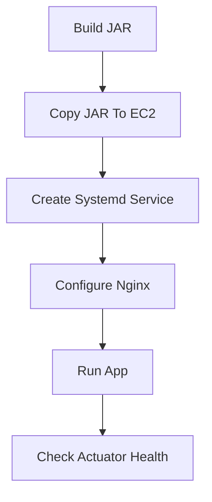

## 9.2 systemd Service

<details>
<summary>order-service.service</summary>

```ini
[Unit]
Description=Order Service
After=network.target

[Service]
User=app
WorkingDirectory=/opt/order-service
ExecStart=/usr/bin/java -XX:MaxRAMPercentage=75 -jar order-service.jar
Restart=always
RestartSec=10
Environment=SPRING_PROFILES_ACTIVE=prod

[Install]
WantedBy=multi-user.target
```

</details>

## 9.3 Commands

```bash
sudo systemctl daemon-reload
sudo systemctl enable order-service
sudo systemctl start order-service
sudo systemctl status order-service
journalctl -u order-service -f
```

---

# 10. RDS PostgreSQL

## 10.1 Why RDS?

RDS gives you:

- Automated backups
- Multi-AZ option
- Monitoring
- Patching
- Read replicas
- Encryption

## 10.2 Spring Boot PostgreSQL Config

<details>
<summary>application-prod.yml</summary>

```yaml
spring:
  datasource:
    url: jdbc:postgresql://${DB_HOST}:5432/appdb
    username: ${DB_USERNAME}
    password: ${DB_PASSWORD}
    hikari:
      maximum-pool-size: 20
      minimum-idle: 5
      connection-timeout: 3000
      idle-timeout: 30000
      max-lifetime: 1800000

  jpa:
    hibernate:
      ddl-auto: validate
    open-in-view: false
```

</details>

## 10.3 Flyway Migration

<details>
<summary>V1__create_orders.sql</summary>

```sql
CREATE TABLE orders (
    id UUID PRIMARY KEY,
    customer_id VARCHAR(100) NOT NULL,
    status VARCHAR(50) NOT NULL,
    total_amount NUMERIC(12, 2) NOT NULL,
    created_at TIMESTAMP NOT NULL
);

CREATE INDEX idx_orders_customer_id ON orders(customer_id);
CREATE INDEX idx_orders_created_at ON orders(created_at);
```

</details>

---

# 11. S3 Object Storage

Use S3 for files, invoices, exports, images, backups.

## 11.1 S3 Upload Flow

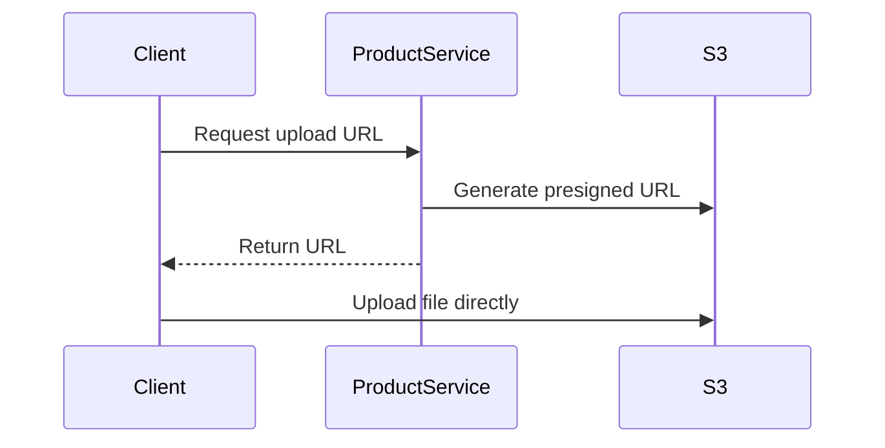

## 11.2 Spring Cloud AWS S3 Client

<details>
<summary>S3Config.java</summary>

```java
package com.example.product.config;

import org.springframework.context.annotation.Bean;
import org.springframework.context.annotation.Configuration;
import software.amazon.awssdk.services.s3.S3Client;

@Configuration
public class S3Config {

    @Bean
    public S3Client s3Client() {
        return S3Client.create();
    }
}
```

</details>

<details>
<summary>FileStorageService.java</summary>

```java
package com.example.product.storage;

import org.springframework.stereotype.Service;
import software.amazon.awssdk.services.s3.S3Client;
import software.amazon.awssdk.services.s3.model.PutObjectRequest;

import java.nio.file.Path;

@Service
public class FileStorageService {
    private final S3Client s3Client;

    public FileStorageService(S3Client s3Client) {
        this.s3Client = s3Client;
    }

    public void upload(String bucket, String key, Path file) {
        PutObjectRequest request = PutObjectRequest.builder()
                .bucket(bucket)
                .key(key)
                .build();

        s3Client.putObject(request, file);
    }
}
```

</details>

---

# 12. Parameter Store And Secrets Manager

## 12.1 What Goes Where?

| Data Type | Recommended Service |
|---|---|
| Non-secret config | Parameter Store |
| DB password | Secrets Manager |
| API keys | Secrets Manager |
| Feature flags | Parameter Store |
| TLS/private keys | Secrets Manager |

## 12.2 Spring Boot Config Import

<details>
<summary>application-prod.yml</summary>

```yaml
spring:
  config:
    import:
      - optional:aws-parameterstore:/config/order-service/
      - optional:aws-secretsmanager:/secret/order-service
```

</details>

## 12.3 Example Parameters

```bash
aws ssm put-parameter \
  --name "/config/order-service/order.timeout" \
  --type "String" \
  --value "3000"

aws secretsmanager create-secret \
  --name "/secret/order-service" \
  --secret-string '{"DB_USERNAME":"app","DB_PASSWORD":"change-me"}'
```

---

# 13. Redis With ElastiCache

Use Redis for:

- Product cache
- Session cache
- Rate limiting
- Idempotency keys
- Distributed locks with care

## 13.1 Redis Flow

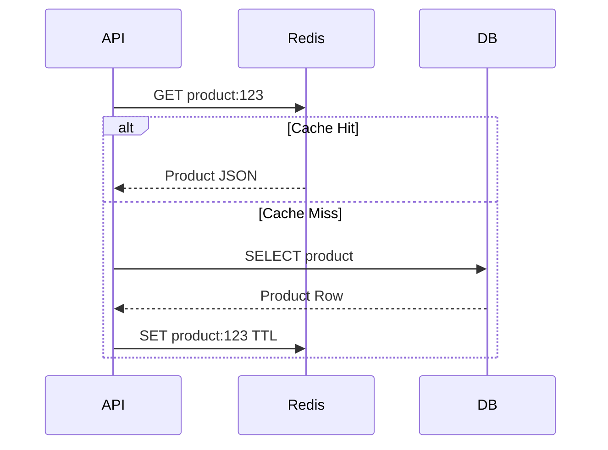

## 13.2 Spring Cache Config

<details>
<summary>RedisCacheConfig.java</summary>

```java
package com.example.product.config;

import org.springframework.cache.annotation.EnableCaching;
import org.springframework.context.annotation.Configuration;

@Configuration
@EnableCaching
public class RedisCacheConfig {
}
```

</details>

<details>
<summary>ProductService.java</summary>

```java
package com.example.product.service;

import org.springframework.cache.annotation.Cacheable;
import org.springframework.stereotype.Service;

@Service
public class ProductService {

    @Cacheable(value = "products", key = "#id")
    public ProductDto getProduct(String id) {
        return loadFromDatabase(id);
    }

    private ProductDto loadFromDatabase(String id) {
        return new ProductDto(id, "Demo Product", 99.99);
    }
}
```

</details>

---

# 14. Messaging With SQS And SNS

## 14.1 When To Use SQS

Use SQS when:

- You need async processing.
- You want retry and dead-letter queue.
- Producer should not wait for consumer.
- Traffic spikes must be buffered.

## 14.2 Order Event Flow

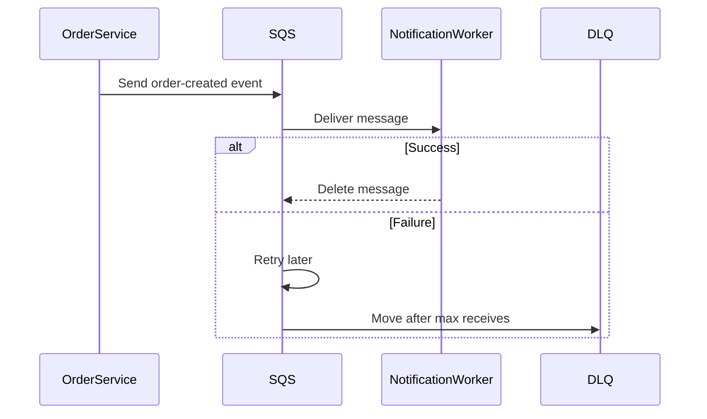

## 14.3 SQS Producer

<details>
<summary>OrderEventPublisher.java</summary>

```java
package com.example.order.messaging;

import io.awspring.cloud.sqs.operations.SqsTemplate;
import org.springframework.stereotype.Component;

@Component
public class OrderEventPublisher {
    private final SqsTemplate sqsTemplate;

    public OrderEventPublisher(SqsTemplate sqsTemplate) {
        this.sqsTemplate = sqsTemplate;
    }

    public void publish(OrderCreatedEvent event) {
        sqsTemplate.send(to -> to
                .queue("order-created-queue")
                .payload(event));
    }
}
```

</details>

## 14.4 SQS Consumer

<details>
<summary>NotificationListener.java</summary>

```java
package com.example.notification.messaging;

import io.awspring.cloud.sqs.annotation.SqsListener;
import org.springframework.stereotype.Component;

@Component
public class NotificationListener {

    @SqsListener("order-created-queue")
    public void onMessage(OrderCreatedEvent event) {
        System.out.println("Send notification for order: " + event.orderId());
    }
}
```

</details>

---

# 15. EventBridge For Event-Driven Systems

EventBridge is better when many services need to react to business events.

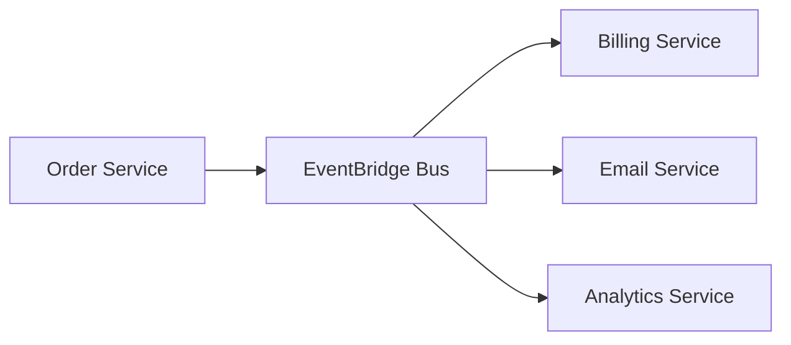

Use SQS for worker queues.
Use EventBridge for cross-service event routing.

---

# 16. CloudWatch Observability

## 16.1 Observability Pillars

| Pillar | Question Answered |
|---|---|
| Logs | What happened? |
| Metrics | How much/how often/how slow? |
| Traces | Where is latency/failure? |
| Alarms | When should humans act? |

## 16.2 Structured Logging

<details>
<summary>logback-spring.xml</summary>

```xml
<configuration>
    <springProperty scope="context" name="appName" source="spring.application.name"/>

    <appender name="STDOUT" class="ch.qos.logback.core.ConsoleAppender">
        <encoder>
            <pattern>
                {"time":"%d{yyyy-MM-dd'T'HH:mm:ss.SSS}","level":"%level","app":"${appName}","traceId":"%X{traceId}","message":"%msg"}%n
            </pattern>
        </encoder>
    </appender>

    <root level="INFO">
        <appender-ref ref="STDOUT"/>
    </root>
</configuration>
```

</details>

## 16.3 Useful Alarms

| Alarm | Example Threshold |
|---|---|
| High 5xx rate | 5xx > 1% for 5 minutes |
| High latency | p95 > 500ms |
| CPU high | CPU > 75% |
| Memory high | Memory > 80% |
| SQS backlog | Approximate age > 5 minutes |
| RDS connections | Connections > 80% max |

---

# 17. ECS Fargate Deployment

ECS Fargate is the best first production container platform on AWS.

## 17.1 ECS Components

| Component | Meaning |
|---|---|
| Cluster | Logical ECS environment |
| Task Definition | Container blueprint |
| Task | Running container instance |
| Service | Keeps desired number of tasks running |
| ALB | Routes HTTP traffic to tasks |
| Target Group | Health-checks tasks |
| Task Role | AWS permissions for app |
| Execution Role | ECS permissions to pull image/logs |

## 17.2 ECS Request Flow

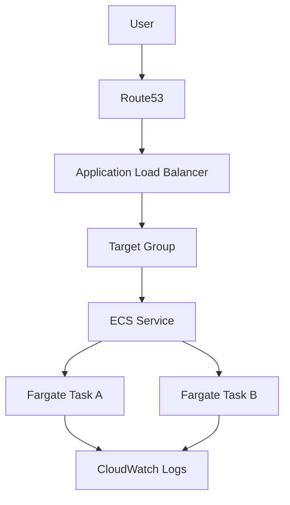

## 17.3 Task Definition Example

<details>
<summary>ecs-task-definition.json</summary>

```json
{
  "family": "order-service",
  "networkMode": "awsvpc",
  "requiresCompatibilities": ["FARGATE"],
  "cpu": "512",
  "memory": "1024",
  "executionRoleArn": "arn:aws:iam::ACCOUNT_ID:role/ecsTaskExecutionRole",
  "taskRoleArn": "arn:aws:iam::ACCOUNT_ID:role/orderServiceTaskRole",
  "containerDefinitions": [
    {
      "name": "order-service",
      "image": "ACCOUNT_ID.dkr.ecr.eu-central-1.amazonaws.com/order-service:latest",
      "portMappings": [
        {
          "containerPort": 8080,
          "protocol": "tcp"
        }
      ],
      "essential": true,
      "environment": [
        {
          "name": "SPRING_PROFILES_ACTIVE",
          "value": "prod"
        }
      ],
      "logConfiguration": {
        "logDriver": "awslogs",
        "options": {
          "awslogs-region": "eu-central-1",
          "awslogs-group": "/ecs/order-service",
          "awslogs-stream-prefix": "ecs"
        }
      },
      "healthCheck": {
        "command": [
          "CMD-SHELL",
          "wget -qO- http://localhost:8080/actuator/health/readiness || exit 1"
        ],
        "interval": 30,
        "timeout": 5,
        "retries": 3,
        "startPeriod": 60
      }
    }
  ]
}
```

</details>

---

# 18. EKS Kubernetes Deployment

EKS is useful when:

- You already use Kubernetes.
- You need portability.
- You have many microservices.
- You want Helm, service mesh, advanced deployment patterns.

## 18.1 Kubernetes Core Objects

| Object | Purpose |
|---|---|
| Pod | Smallest runtime unit |
| Deployment | Desired state for replicas |
| Service | Stable internal endpoint |
| Ingress | External HTTP routing |
| ConfigMap | Non-secret config |
| Secret | Secret data |
| HPA | Autoscaling |
| Namespace | Logical separation |

## 18.2 EKS Request Flow

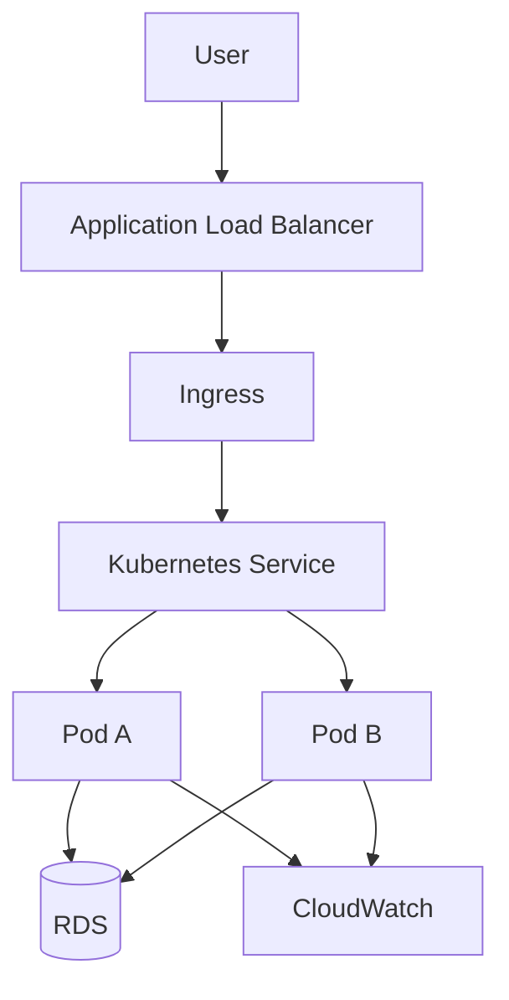

## 18.3 Deployment YAML

<details>
<summary>k8s/order-service-deployment.yml</summary>

```yaml
apiVersion: apps/v1
kind: Deployment
metadata:
  name: order-service
  labels:
    app: order-service
spec:
  replicas: 3
  selector:
    matchLabels:
      app: order-service
  template:
    metadata:
      labels:
        app: order-service
    spec:
      containers:
        - name: order-service
          image: ACCOUNT_ID.dkr.ecr.eu-central-1.amazonaws.com/order-service:latest
          ports:
            - containerPort: 8080
          env:
            - name: SPRING_PROFILES_ACTIVE
              value: prod
          readinessProbe:
            httpGet:
              path: /actuator/health/readiness
              port: 8080
            initialDelaySeconds: 40
            periodSeconds: 10
          livenessProbe:
            httpGet:
              path: /actuator/health/liveness
              port: 8080
            initialDelaySeconds: 60
            periodSeconds: 20
          resources:
            requests:
              cpu: "250m"
              memory: "512Mi"
            limits:
              cpu: "1"
              memory: "1024Mi"
```

</details>

## 18.4 Service YAML

<details>
<summary>k8s/order-service.yml</summary>

```yaml
apiVersion: v1
kind: Service
metadata:
  name: order-service
spec:
  type: ClusterIP
  selector:
    app: order-service
  ports:
    - port: 80
      targetPort: 8080
```

</details>

## 18.5 Ingress YAML

<details>
<summary>k8s/ingress.yml</summary>

```yaml
apiVersion: networking.k8s.io/v1
kind: Ingress
metadata:
  name: app-ingress
  annotations:
    alb.ingress.kubernetes.io/scheme: internet-facing
    alb.ingress.kubernetes.io/target-type: ip
spec:
  ingressClassName: alb
  rules:
    - http:
        paths:
          - path: /orders
            pathType: Prefix
            backend:
              service:
                name: order-service
                port:
                  number: 80
```

</details>

---

# 19. CI/CD With GitHub Actions

## 19.1 Pipeline Flow

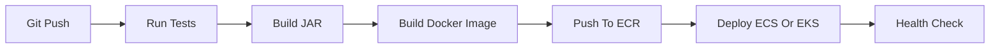

## 19.2 GitHub Actions For ECS

<details>
<summary>.github/workflows/deploy-ecs.yml</summary>

```yaml
name: Deploy Order Service To ECS

on:
  push:
    branches:
      - main

permissions:
  id-token: write
  contents: read

env:
  AWS_REGION: eu-central-1
  ECR_REPOSITORY: order-service
  ECS_CLUSTER: spring-cloud-prod
  ECS_SERVICE: order-service

jobs:
  deploy:
    runs-on: ubuntu-latest

    steps:
      - name: Checkout
        uses: actions/checkout@v4

      - name: Set up Java
        uses: actions/setup-java@v4
        with:
          distribution: temurin
          java-version: 21

      - name: Test
        run: mvn test

      - name: Package
        run: mvn clean package -DskipTests

      - name: Configure AWS credentials
        uses: aws-actions/configure-aws-credentials@v4
        with:
          role-to-assume: arn:aws:iam::ACCOUNT_ID:role/github-actions-deploy-role
          aws-region: ${{ env.AWS_REGION }}

      - name: Login to ECR
        uses: aws-actions/amazon-ecr-login@v2

      - name: Build and push image
        run: |
          IMAGE_URI=ACCOUNT_ID.dkr.ecr.${AWS_REGION}.amazonaws.com/${ECR_REPOSITORY}:${GITHUB_SHA}
          docker build -t $IMAGE_URI .
          docker push $IMAGE_URI
          echo "IMAGE_URI=$IMAGE_URI" >> $GITHUB_ENV

      - name: Force ECS deployment
        run: |
          aws ecs update-service \
            --cluster $ECS_CLUSTER \
            --service $ECS_SERVICE \
            --force-new-deployment
```

</details>

---

# 20. Terraform Infrastructure As Code

Use Terraform to make infrastructure repeatable.

## 20.1 Terraform Flow

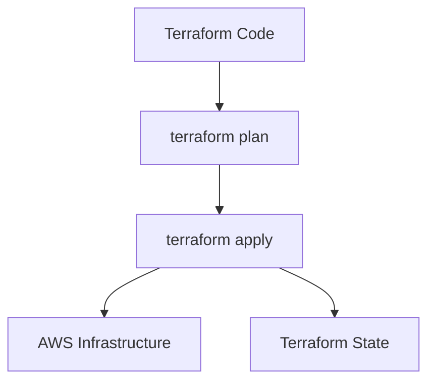

## 20.2 Example Provider

<details>
<summary>providers.tf</summary>

```hcl
terraform {
  required_version = ">= 1.6.0"

  required_providers {
    aws = {
      source  = "hashicorp/aws"
      version = "~> 5.0"
    }
  }
}

provider "aws" {
  region = "eu-central-1"
}
```

</details>

## 20.3 Example S3 Bucket

<details>
<summary>s3.tf</summary>

```hcl
resource "aws_s3_bucket" "app_files" {
  bucket = "spring-cloud-app-files-demo"
}

resource "aws_s3_bucket_versioning" "app_files" {
  bucket = aws_s3_bucket.app_files.id

  versioning_configuration {
    status = "Enabled"
  }
}
```

</details>

---

# 21. Production Security

## 21.1 Security Layers

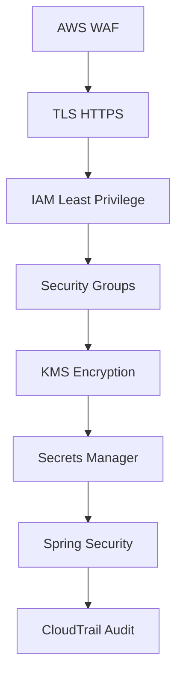

## 21.2 Minimum Security Checklist

- Use HTTPS only.
- Keep app containers in private subnets.
- Restrict RDS to app security group only.
- Use IAM roles, not hardcoded keys.
- Store secrets in Secrets Manager.
- Encrypt S3, RDS, SQS using KMS.
- Enable CloudTrail.
- Enable WAF for public APIs.
- Validate JWT tokens.
- Use rate limiting.

## 21.3 Spring Security Resource Server

<details>
<summary>SecurityConfig.java</summary>

```java
package com.example.gateway.config;

import org.springframework.context.annotation.Bean;
import org.springframework.context.annotation.Configuration;
import org.springframework.security.config.Customizer;
import org.springframework.security.config.annotation.web.reactive.EnableWebFluxSecurity;
import org.springframework.security.config.web.server.ServerHttpSecurity;
import org.springframework.security.web.server.SecurityWebFilterChain;

@Configuration
@EnableWebFluxSecurity
public class SecurityConfig {

    @Bean
    SecurityWebFilterChain springSecurityFilterChain(ServerHttpSecurity http) {
        return http
                .csrf(ServerHttpSecurity.CsrfSpec::disable)
                .authorizeExchange(exchange -> exchange
                        .pathMatchers("/actuator/**").permitAll()
                        .anyExchange().authenticated()
                )
                .oauth2ResourceServer(oauth2 -> oauth2.jwt(Customizer.withDefaults()))
                .build();
    }
}
```

</details>

---

# 22. Reliability Patterns

## 22.1 Timeout, Retry, Circuit Breaker

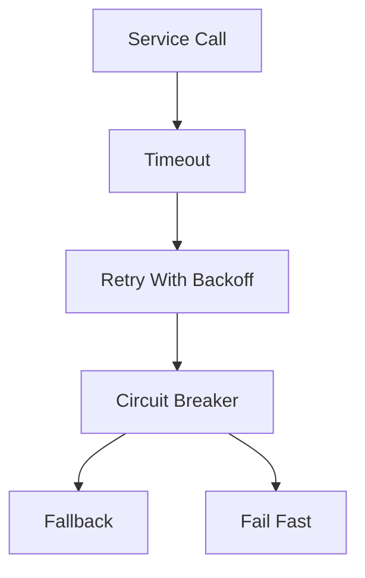

## 22.2 Resilience4j Config

<details>
<summary>application.yml</summary>

```yaml
resilience4j:
  circuitbreaker:
    instances:
      productService:
        sliding-window-size: 20
        failure-rate-threshold: 50
        wait-duration-in-open-state: 10s

  retry:
    instances:
      productService:
        max-attempts: 3
        wait-duration: 200ms

  timelimiter:
    instances:
      productService:
        timeout-duration: 2s
```

</details>

## 22.3 Idempotency

Important for payment/order APIs.

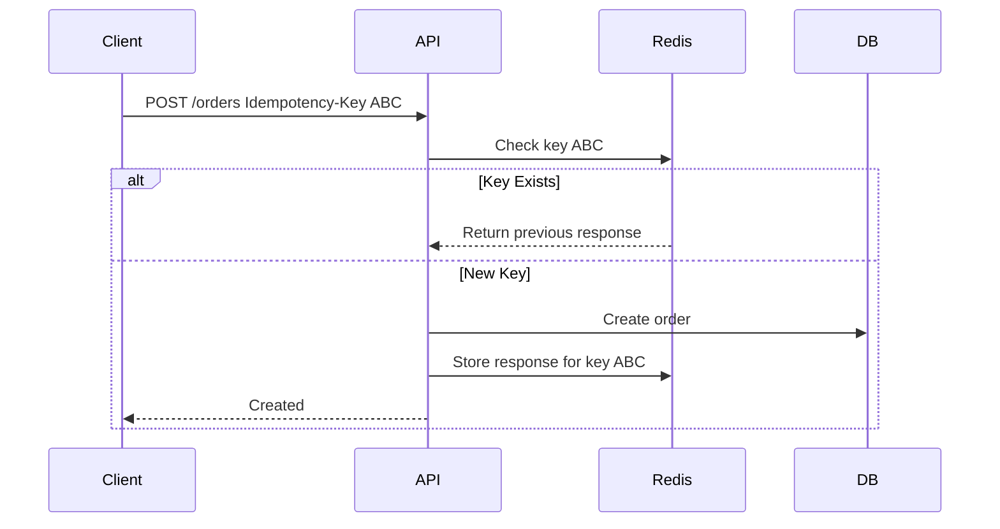

---

# 23. High-Scale Architecture Patterns

## 23.1 Cache-Aside Pattern

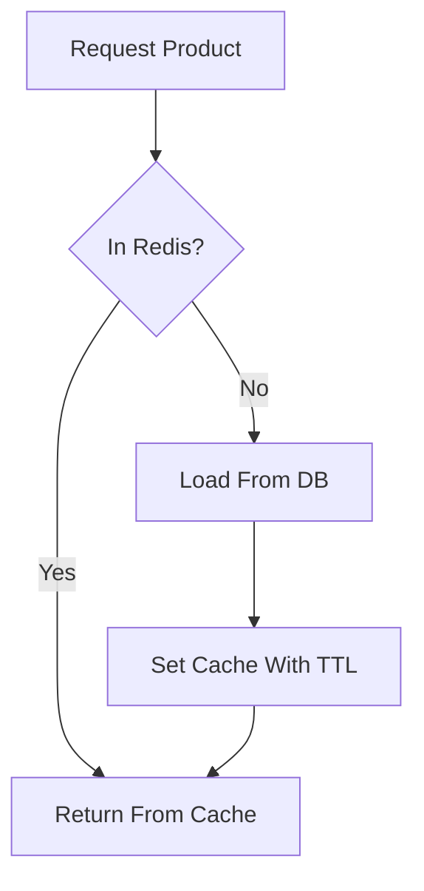

## 23.2 CQRS

```mermaid
flowchart LR
    CMD[Command API]
    WRITE[(Write DB)]
    EVENT[Events]
    READ[(Read Model)]
    QUERY[Query API]

    CMD --> WRITE
    WRITE --> EVENT
    EVENT --> READ
    QUERY --> READ
```

## 23.3 Saga Pattern

```mermaid
sequenceDiagram
    participant Order
    participant Payment
    participant Inventory
    participant Shipping

    Order->>Payment: Reserve payment
    Payment->>Inventory: Reserve inventory
    Inventory->>Shipping: Create shipment
    alt Shipment Fails
        Shipping-->>Inventory: Failed
        Inventory-->>Payment: Release inventory
        Payment-->>Order: Refund payment
    end
```

## 23.4 Scaling Strategy

| Bottleneck | Solution |
|---|---|
| CPU high | Horizontal scale ECS/EKS tasks |
| DB reads high | Redis + read replicas |
| DB writes high | Optimize schema, partition, queue writes |
| Slow external API | Timeout, retry, circuit breaker |
| Traffic spike | SQS buffering |
| Large static files | S3 + CloudFront |
| Global users | CloudFront + multi-region |

---

# 24. Final Project Overview

We will build:

```text
spring-cloud-aws-high-scale-demo/
  gateway-service/
  order-service/
  product-service/
  notification-worker/
  docker-compose.yml
  infra/
    terraform/
  k8s/
  .github/workflows/
```

## Services

| Service | Responsibility |
|---|---|
| gateway-service | Entry point, routing, security |
| order-service | Create and read orders |
| product-service | Product read API and file storage |
| notification-worker | Async notification from SQS |

## APIs

| Method | Path | Service |
|---|---|---|
| GET | `/products/{id}` | product-service |
| POST | `/orders` | order-service |
| GET | `/orders/{id}` | order-service |

---

# 25. Build The Application Step By Step

## 25.1 Parent pom.xml

<details>
<summary>pom.xml</summary>

```xml
<project xmlns="http://maven.apache.org/POM/4.0.0">
    <modelVersion>4.0.0</modelVersion>

    <groupId>com.example</groupId>
    <artifactId>spring-cloud-aws-high-scale-demo</artifactId>
    <version>1.0.0</version>
    <packaging>pom</packaging>

    <modules>
        <module>gateway-service</module>
        <module>order-service</module>
        <module>product-service</module>
        <module>notification-worker</module>
    </modules>

    <properties>
        <java.version>21</java.version>
        <spring.boot.version>3.3.4</spring.boot.version>
        <spring.cloud.version>2023.0.3</spring.cloud.version>
        <spring.cloud.aws.version>3.2.0</spring.cloud.aws.version>
    </properties>
</project>
```

</details>

---

## 25.2 Order Entity

<details>
<summary>OrderEntity.java</summary>

```java
package com.example.order.domain;

import jakarta.persistence.Entity;
import jakarta.persistence.Id;
import jakarta.persistence.Table;
import java.math.BigDecimal;
import java.time.Instant;
import java.util.UUID;

@Entity
@Table(name = "orders")
public class OrderEntity {

    @Id
    private UUID id;

    private String customerId;
    private String status;
    private BigDecimal totalAmount;
    private Instant createdAt;

    protected OrderEntity() {
    }

    public OrderEntity(UUID id, String customerId, String status, BigDecimal totalAmount, Instant createdAt) {
        this.id = id;
        this.customerId = customerId;
        this.status = status;
        this.totalAmount = totalAmount;
        this.createdAt = createdAt;
    }

    public UUID getId() {
        return id;
    }

    public String getCustomerId() {
        return customerId;
    }

    public String getStatus() {
        return status;
    }

    public BigDecimal getTotalAmount() {
        return totalAmount;
    }

    public Instant getCreatedAt() {
        return createdAt;
    }
}
```

</details>

## 25.3 Repository

<details>
<summary>OrderRepository.java</summary>

```java
package com.example.order.domain;

import org.springframework.data.jpa.repository.JpaRepository;
import java.util.UUID;

public interface OrderRepository extends JpaRepository<OrderEntity, UUID> {
}
```

</details>

## 25.4 DTOs

<details>
<summary>CreateOrderRequest.java</summary>

```java
package com.example.order.api;

import jakarta.validation.constraints.NotBlank;
import jakarta.validation.constraints.NotNull;
import java.math.BigDecimal;

public record CreateOrderRequest(
        @NotBlank String customerId,
        @NotNull BigDecimal totalAmount
) {
}
```

</details>

<details>
<summary>OrderResponse.java</summary>

```java
package com.example.order.api;

import java.math.BigDecimal;
import java.time.Instant;
import java.util.UUID;

public record OrderResponse(
        UUID id,
        String customerId,
        String status,
        BigDecimal totalAmount,
        Instant createdAt
) {
}
```

</details>

## 25.5 Event

<details>
<summary>OrderCreatedEvent.java</summary>

```java
package com.example.order.messaging;

import java.math.BigDecimal;
import java.util.UUID;

public record OrderCreatedEvent(
        UUID orderId,
        String customerId,
        BigDecimal totalAmount
) {
}
```

</details>

## 25.6 Service

<details>
<summary>OrderService.java</summary>

```java
package com.example.order.service;

import com.example.order.api.CreateOrderRequest;
import com.example.order.api.OrderResponse;
import com.example.order.domain.OrderEntity;
import com.example.order.domain.OrderRepository;
import com.example.order.messaging.OrderCreatedEvent;
import com.example.order.messaging.OrderEventPublisher;
import org.springframework.stereotype.Service;
import org.springframework.transaction.annotation.Transactional;

import java.time.Instant;
import java.util.UUID;

@Service
public class OrderService {

    private final OrderRepository repository;
    private final OrderEventPublisher publisher;

    public OrderService(OrderRepository repository, OrderEventPublisher publisher) {
        this.repository = repository;
        this.publisher = publisher;
    }

    @Transactional
    public OrderResponse createOrder(CreateOrderRequest request) {
        OrderEntity order = new OrderEntity(
                UUID.randomUUID(),
                request.customerId(),
                "CREATED",
                request.totalAmount(),
                Instant.now()
        );

        repository.save(order);

        publisher.publish(new OrderCreatedEvent(
                order.getId(),
                order.getCustomerId(),
                order.getTotalAmount()
        ));

        return map(order);
    }

    @Transactional(readOnly = true)
    public OrderResponse getOrder(UUID id) {
        return repository.findById(id)
                .map(this::map)
                .orElseThrow(() -> new IllegalArgumentException("Order not found"));
    }

    private OrderResponse map(OrderEntity order) {
        return new OrderResponse(
                order.getId(),
                order.getCustomerId(),
                order.getStatus(),
                order.getTotalAmount(),
                order.getCreatedAt()
        );
    }
}
```

</details>

## 25.7 Controller

<details>
<summary>OrderController.java</summary>

```java
package com.example.order.api;

import com.example.order.service.OrderService;
import jakarta.validation.Valid;
import org.springframework.http.HttpStatus;
import org.springframework.web.bind.annotation.*;

import java.util.UUID;

@RestController
@RequestMapping("/orders")
public class OrderController {

    private final OrderService service;

    public OrderController(OrderService service) {
        this.service = service;
    }

    @PostMapping
    @ResponseStatus(HttpStatus.CREATED)
    public OrderResponse create(@Valid @RequestBody CreateOrderRequest request) {
        return service.createOrder(request);
    }

    @GetMapping("/{id}")
    public OrderResponse get(@PathVariable UUID id) {
        return service.getOrder(id);
    }
}
```

</details>

---

# 26. Local Docker Compose Environment

## 26.1 docker-compose.yml

<details>
<summary>docker-compose.yml</summary>

```yaml
services:
  postgres:
    image: postgres:16
    environment:
      POSTGRES_DB: appdb
      POSTGRES_USER: app
      POSTGRES_PASSWORD: app
    ports:
      - "5432:5432"

  redis:
    image: redis:7
    ports:
      - "6379:6379"

  localstack:
    image: localstack/localstack:latest
    environment:
      SERVICES: sqs,s3,ssm,secretsmanager
      AWS_DEFAULT_REGION: eu-central-1
    ports:
      - "4566:4566"

  order-service:
    build: ./order-service
    environment:
      SPRING_PROFILES_ACTIVE: local
      DB_HOST: postgres
      DB_USERNAME: app
      DB_PASSWORD: app
      REDIS_HOST: redis
      AWS_ENDPOINT_URL: http://localstack:4566
    ports:
      - "8081:8080"
    depends_on:
      - postgres
      - redis
      - localstack
```

</details>

## 26.2 Local Run

```bash
docker compose up --build
curl http://localhost:8081/actuator/health
```

## 26.3 Create SQS Queue In LocalStack

```bash
aws --endpoint-url=http://localhost:4566 sqs create-queue \
  --queue-name order-created-queue
```

---

# 27. Deploy Final App To ECS Fargate

## Step 1: Create ECR Repository

```bash
aws ecr create-repository --repository-name order-service
```

## Step 2: Build And Push Image

```bash
ACCOUNT_ID=$(aws sts get-caller-identity --query Account --output text)
REGION=eu-central-1

aws ecr get-login-password --region $REGION \
  | docker login --username AWS --password-stdin \
  $ACCOUNT_ID.dkr.ecr.$REGION.amazonaws.com

docker build -t order-service ./order-service

docker tag order-service:latest \
  $ACCOUNT_ID.dkr.ecr.$REGION.amazonaws.com/order-service:latest

docker push $ACCOUNT_ID.dkr.ecr.$REGION.amazonaws.com/order-service:latest
```

## Step 3: Create ECS Cluster

```bash
aws ecs create-cluster --cluster-name spring-cloud-prod
```

## Step 4: Register Task Definition

```bash
aws ecs register-task-definition \
  --cli-input-json file://ecs-task-definition.json
```

## Step 5: Create Service Behind ALB

In production, create:

- VPC
- Public subnets
- Private subnets
- ALB
- Target group
- ECS service
- CloudWatch log group

## Screenshot Checklist

Capture these AWS Console screenshots for your notes or GitHub README:

| Screenshot | What To Capture |
|---|---|
| ECS cluster | Cluster services and tasks |
| ECS service | Desired/running task count |
| Task logs | CloudWatch log stream |
| ALB target group | Healthy registered targets |
| RDS | Connectivity and Multi-AZ |
| CloudWatch dashboard | CPU, memory, latency, 5xx |

---

# 28. Deploy Final App To EKS

## 28.1 Create EKS Cluster With eksctl

```bash
eksctl create cluster \
  --name spring-cloud-prod \
  --region eu-central-1 \
  --nodes 3 \
  --node-type t3.medium
```

## 28.2 Deploy App

```bash
kubectl apply -f k8s/order-service-deployment.yml
kubectl apply -f k8s/order-service.yml
kubectl apply -f k8s/ingress.yml
```

## 28.3 Verify

```bash
kubectl get pods
kubectl get svc
kubectl get ingress
kubectl logs deploy/order-service
kubectl describe pod <pod-name>
```

## 28.4 HPA

<details>
<summary>k8s/hpa.yml</summary>

```yaml
apiVersion: autoscaling/v2
kind: HorizontalPodAutoscaler
metadata:
  name: order-service-hpa
spec:
  scaleTargetRef:
    apiVersion: apps/v1
    kind: Deployment
    name: order-service
  minReplicas: 3
  maxReplicas: 20
  metrics:
    - type: Resource
      resource:
        name: cpu
        target:
          type: Utilization
          averageUtilization: 70
```

</details>

---

# 29. Monitoring Dashboards

## 29.1 Dashboard Panels

| Panel | Why |
|---|---|
| Request count | Traffic volume |
| p50/p95/p99 latency | User experience |
| 4xx rate | Client/API errors |
| 5xx rate | Server errors |
| CPU/memory | Capacity |
| DB connections | Database pressure |
| SQS queue depth | Worker lag |
| Redis hit ratio | Cache efficiency |

## 29.2 CloudWatch Metric Alarm Example

<details>
<summary>high-5xx-alarm.json</summary>

```json
{
  "AlarmName": "order-service-high-5xx",
  "ComparisonOperator": "GreaterThanThreshold",
  "EvaluationPeriods": 2,
  "MetricName": "HTTPCode_Target_5XX_Count",
  "Namespace": "AWS/ApplicationELB",
  "Period": 60,
  "Statistic": "Sum",
  "Threshold": 10,
  "ActionsEnabled": true,
  "AlarmDescription": "High 5xx errors from order service target group"
}
```

</details>

---

# 30. Production Readiness Checklist

## Application

- [ ] Uses Spring Boot Actuator
- [ ] Has liveness and readiness probes
- [ ] Uses graceful shutdown
- [ ] Uses structured JSON logs
- [ ] Has request correlation ID
- [ ] Has timeout on external calls
- [ ] Has retry only for safe operations
- [ ] Has circuit breaker for remote dependency
- [ ] Has idempotency for critical POST APIs
- [ ] Uses Flyway/Liquibase migrations
- [ ] Does not use `ddl-auto:update` in production

## AWS

- [ ] App runs in private subnets
- [ ] ALB runs in public subnets
- [ ] RDS is private
- [ ] Redis is private
- [ ] Security groups are least privilege
- [ ] IAM roles are least privilege
- [ ] Secrets are not hardcoded
- [ ] CloudWatch logs enabled
- [ ] Alarms configured
- [ ] Backups enabled
- [ ] Encryption enabled
- [ ] WAF enabled for public endpoints

## Deployment

- [ ] Docker image is non-root
- [ ] Image is small and versioned
- [ ] CI runs tests
- [ ] CD deploys automatically
- [ ] Rollback is possible
- [ ] Blue-green or rolling deployment configured
- [ ] Health check protects bad releases

## Scalability

- [ ] Horizontal scaling configured
- [ ] Database indexes verified
- [ ] Redis used for hot reads
- [ ] SQS used for async load
- [ ] Static files served by S3/CloudFront
- [ ] Load tested with realistic traffic

---

# 31. Interview Talking Points

## If Asked: How Do You Deploy Spring Boot On AWS?

Answer structure:

```text
I usually start with containerizing Spring Boot using Docker.
For production, I prefer ECS Fargate first because it is simpler than EKS.
The service runs in private subnets behind an ALB.
RDS and Redis are also private.
Secrets are stored in Secrets Manager.
Configuration comes from Parameter Store.
Logs and metrics go to CloudWatch.
CI/CD builds image, pushes to ECR, and updates ECS service.
For larger platform teams, I would use EKS with Helm and ALB ingress.
```

## If Asked: ECS vs EKS?

| ECS Fargate | EKS |
|---|---|
| Easier to operate | More flexible |
| AWS-native | Kubernetes ecosystem |
| Good for most Spring apps | Good for many microservices |
| Less DevOps overhead | More control |

## If Asked: How To Make It High Scale?

Mention:

- Stateless services
- Horizontal scaling
- ALB
- Redis cache
- RDS read replicas
- SQS for async workloads
- Idempotency
- Circuit breaker
- CloudWatch alarms
- Load testing
- Database indexing
- CDN for static content

---

# Appendix A: Suggested Folder Structure

```text
spring-cloud-aws-high-scale-demo/
  pom.xml
  gateway-service/
    pom.xml
    Dockerfile
    src/main/java/com/example/gateway/
    src/main/resources/application.yml
  order-service/
    pom.xml
    Dockerfile
    src/main/java/com/example/order/
    src/main/resources/application.yml
    src/main/resources/db/migration/V1__create_orders.sql
  product-service/
    pom.xml
    Dockerfile
    src/main/java/com/example/product/
  notification-worker/
    pom.xml
    Dockerfile
    src/main/java/com/example/notification/
  k8s/
    order-service-deployment.yml
    order-service.yml
    ingress.yml
    hpa.yml
  infra/
    terraform/
      providers.tf
      vpc.tf
      ecs.tf
      rds.tf
      redis.tf
      sqs.tf
      s3.tf
  .github/
    workflows/
      deploy-ecs.yml
  docker-compose.yml
  README.md
```

---

# Appendix B: Beginner To Advanced Practice Plan

## Week 1

- EC2
- Linux
- Spring Boot jar deployment
- Nginx reverse proxy
- CloudWatch basics

## Week 2

- Docker
- Docker Compose
- PostgreSQL
- Redis
- SQS with LocalStack

## Week 3

- IAM
- VPC
- RDS
- S3
- Parameter Store
- Secrets Manager

## Week 4

- ECR
- ECS Fargate
- ALB
- CloudWatch logs and alarms
- GitHub Actions

## Week 5

- Terraform
- EKS
- Kubernetes deployments
- Ingress
- HPA

## Week 6

- Resilience4j
- Observability
- Load testing
- Cost optimization
- Production readiness review

---

# Appendix C: Load Testing With k6

<details>
<summary>load-test.js</summary>

```javascript
import http from 'k6/http';
import { check, sleep } from 'k6';

export const options = {
  vus: 50,
  duration: '2m',
};

export default function () {
  const payload = JSON.stringify({
    customerId: 'customer-1',
    totalAmount: 99.99,
  });

  const params = {
    headers: {
      'Content-Type': 'application/json',
      'Idempotency-Key': `${__VU}-${__ITER}`,
    },
  };

  const res = http.post('https://api.example.com/orders', payload, params);

  check(res, {
    'status is 201': (r) => r.status === 201,
    'latency under 500ms': (r) => r.timings.duration < 500,
  });

  sleep(1);
}
```

</details>

Run:

```bash
k6 run load-test.js
```

---

# Appendix D: Common Production Mistakes

| Mistake | Fix |
|---|---|
| Hardcoded DB password | Secrets Manager |
| Public RDS | Private subnet only |
| No health checks | Actuator readiness/liveness |
| No timeout | Configure HTTP client timeouts |
| Retry everything | Retry only safe/idempotent operations |
| No logs correlation | Add trace/request ID |
| One giant service | Split only around business boundaries |
| EKS too early | Start with ECS Fargate |
| No IaC | Use Terraform |
| No cost alarms | Add AWS Budget alarm |

---

# Appendix E: Mermaid Diagram Safety Rules

To avoid GitHub Mermaid render errors:

- Keep node labels simple.
- Avoid special characters inside node text.
- Avoid very long labels.
- Use `flowchart TD` or `flowchart LR`.
- Avoid quotes unless required.
- Avoid raw URLs inside Mermaid nodes.
- Avoid brackets inside labels.
- Prefer simple node IDs like `APP`, `DB`, `ALB`.

Good:

```mermaid
flowchart TD
    USER[User]
    ALB[Load Balancer]
    APP[Spring Boot App]
    DB[(Database)]

    USER --> ALB
    ALB --> APP
    APP --> DB
```

Bad:

```text
APP["Spring Boot App: /actuator/prometheus [metrics]"]
```

---

# Final Mental Model

Production Spring Boot on AWS is not only coding.

It is:

```text
Application Code
  + Runtime Packaging
  + Cloud Networking
  + IAM Security
  + Managed Data Services
  + Observability
  + CI/CD
  + Reliability Patterns
  + Cost Awareness
```

When you can explain each request from browser to database and back, including logs, metrics, failures, retries, scaling, and security, you are production-ready.
