# Kubernetes with Spring Boot: A Practical Markdown Book for Building Large-Scale Applications

**Audience:** Java/Spring Boot developers who want to learn Kubernetes from basics to production-grade architecture.

**Goal:** By the end of this book, you should be able to design, build, containerize, deploy, scale, secure, observe, and operate large-scale Spring Boot applications on Kubernetes.

> This book uses Markdown and Mermaid diagrams so you can read it in GitHub, GitLab, VS Code, Obsidian, or any Markdown viewer that supports Mermaid.

---

## Table of Contents

1. [How to Use This Book](#chapter-1-how-to-use-this-book)
2. [Cloud-Native Foundations](#chapter-2-cloud-native-foundations)
3. [Spring Boot Foundations for Kubernetes](#chapter-3-spring-boot-foundations-for-kubernetes)
4. [Docker and Containerizing Spring Boot](#chapter-4-docker-and-containerizing-spring-boot)
5. [Kubernetes Core Concepts](#chapter-5-kubernetes-core-concepts)
6. [Your First Spring Boot Deployment](#chapter-6-your-first-spring-boot-deployment)
7. [Kubernetes Networking](#chapter-7-kubernetes-networking)
8. [Configuration, Profiles, and Secrets](#chapter-8-configuration-profiles-and-secrets)
9. [Databases, Storage, and Stateful Workloads](#chapter-9-databases-storage-and-stateful-workloads)
10. [Health Checks, Resilience, and Graceful Shutdown](#chapter-10-health-checks-resilience-and-graceful-shutdown)
11. [Observability: Logs, Metrics, Traces, and Dashboards](#chapter-11-observability-logs-metrics-traces-and-dashboards)
12. [Kubernetes Security for Spring Boot](#chapter-12-kubernetes-security-for-spring-boot)
13. [Resource Management and Autoscaling](#chapter-13-resource-management-and-autoscaling)
14. [CI/CD for Spring Boot on Kubernetes](#chapter-14-cicd-for-spring-boot-on-kubernetes)
15. [Helm and Environment Promotion](#chapter-15-helm-and-environment-promotion)
16. [Microservices Architecture with Spring Boot](#chapter-16-microservices-architecture-with-spring-boot)
17. [API Gateway, Ingress, and External Traffic](#chapter-17-api-gateway-ingress-and-external-traffic)
18. [Event-Driven Architecture and Messaging](#chapter-18-event-driven-architecture-and-messaging)
19. [Large-Scale Application Architecture](#chapter-19-large-scale-application-architecture)
20. [Production Readiness Checklist](#chapter-20-production-readiness-checklist)
21. [Capstone Project: Large-Scale E-Commerce Platform](#chapter-21-capstone-project-large-scale-e-commerce-platform)
22. [Appendix: Command Cheat Sheet](#appendix-command-cheat-sheet)

---

# Chapter 1. How to Use This Book

## 1.1 Recommended Learning Method

Follow this order:

1. Read the chapter goal.
2. Study the diagram.
3. Implement the step-by-step lab.
4. Break the setup intentionally.
5. Fix the issue using Kubernetes commands.
6. Write notes about what failed and why.

Kubernetes is best learned by practice. You should not only run successful deployments; you should also learn what happens when pods crash, configs are missing, CPU is limited, database connections fail, or traffic spikes.

## 1.2 Required Tools

Install these locally:

- Java 17 or Java 21
- Maven or Gradle
- Docker Desktop or another container runtime
- kubectl
- Minikube or Kind
- Git
- VS Code or IntelliJ IDEA
- Optional: Helm, k9s, Lens, Skaffold

## 1.3 Suggested Folder Structure

```text
spring-k8s-book/
  apps/
    product-service/
    order-service/
    payment-service/
    api-gateway/
  infra/
    k8s/
      base/
      dev/
      staging/
      prod/
    helm/
    monitoring/
  docs/
  scripts/
```

## 1.4 Big Picture Roadmap

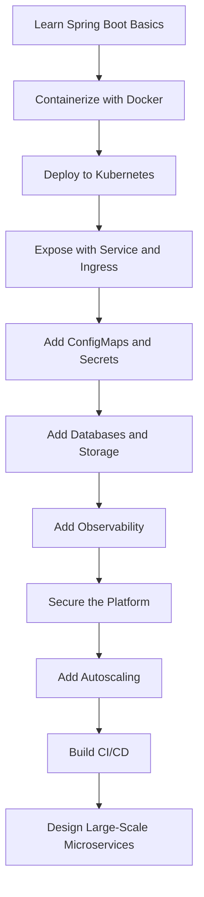

## 1.5 Reference Application Used in This Book

We will gradually build a simplified large-scale commerce system:

- API Gateway
- Product Service
- Inventory Service
- Order Service
- Payment Service
- Notification Service
- PostgreSQL
- Redis
- Kafka or RabbitMQ
- Prometheus, Grafana, Loki, Tempo or Jaeger

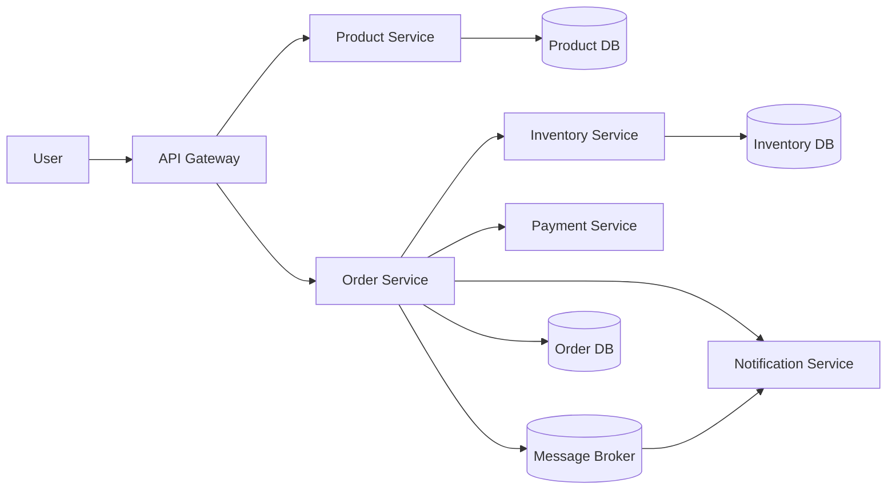

---

# Chapter 2. Cloud-Native Foundations

## Goal

Understand why containers and Kubernetes exist before writing YAML.

## 2.1 Traditional Deployment Problems

Large applications often fail in production because of:

- Environment mismatch between developer laptops and servers
- Manual installation steps
- Hard rollbacks
- No automatic recovery
- Poor scaling
- Poor resource utilization
- Difficult monitoring

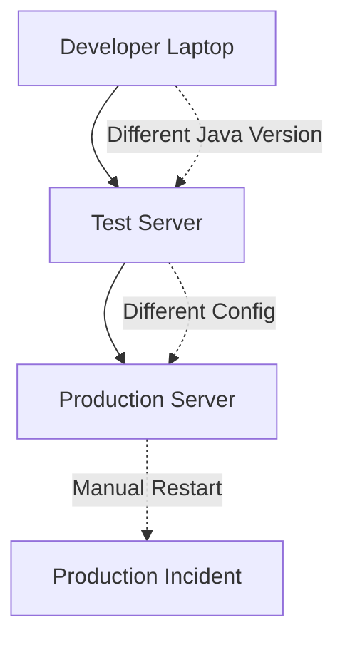

## 2.2 What Containers Solve

A container packages:

- Application code
- Runtime dependencies
- Startup command
- File system layout
- Environment expectations

A container does not package a full operating system kernel. It shares the host kernel, making it lighter than a VM.

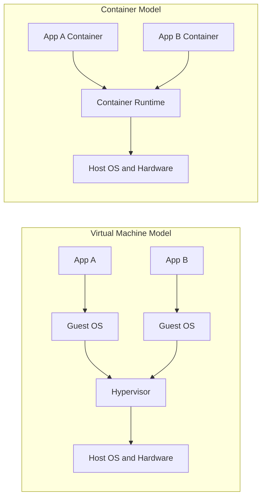

## 2.3 What Kubernetes Solves

Kubernetes manages containers at scale. It helps with:

- Scheduling containers across nodes
- Restarting failed workloads
- Rolling updates
- Service discovery
- Load balancing
- Secrets and configuration
- Autoscaling
- Resource isolation

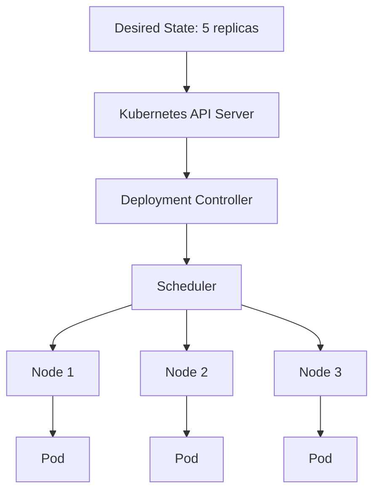

## 2.4 Step-by-Step Exercise

1. Write down how you currently deploy a Spring Boot app.
2. Identify manual steps.
3. Identify environment-specific values.
4. Identify what happens when the app crashes.
5. Identify how you would roll back.
6. Map each problem to a Kubernetes capability.

Example mapping:

| Problem | Kubernetes Feature |
|---|---|
| App crashes | Pod restart policy |
| Need 5 copies | Deployment replicas |
| New version failed | Rollback |
| External traffic | Service and Ingress |
| Environment config | ConfigMap and Secret |

---

# Chapter 3. Spring Boot Foundations for Kubernetes

## Goal

Prepare Spring Boot applications so they behave well inside containers and Kubernetes.

## 3.1 Create a Basic Spring Boot API

Create a service named `product-service`.

Recommended dependencies:

- Spring Web
- Spring Boot Actuator
- Spring Data JPA
- PostgreSQL Driver
- Validation
- Micrometer Prometheus Registry

Example controller:

```java
@RestController
@RequestMapping("/api/products")
public class ProductController {

    @GetMapping("/{id}")
    public ProductResponse getProduct(@PathVariable Long id) {
        return new ProductResponse(id, "Keyboard", 49.99);
    }
}
```

## 3.2 Add Actuator

Add this dependency:

```xml
<dependency>
    <groupId>org.springframework.boot</groupId>
    <artifactId>spring-boot-starter-actuator</artifactId>
</dependency>
```

Add configuration:

```yaml
management:
  endpoints:
    web:
      exposure:
        include: health,info,metrics,prometheus
  endpoint:
    health:
      probes:
        enabled: true
      show-details: always
```

Spring Boot Actuator provides endpoints useful for Kubernetes:

- `/actuator/health`
- `/actuator/health/liveness`
- `/actuator/health/readiness`
- `/actuator/prometheus`

## 3.3 Externalize Configuration

Do not hardcode environment-specific values.

Bad:

```java
private String dbUrl = "jdbc:postgresql://localhost:5432/products";
```

Good:

```yaml
spring:
  datasource:
    url: ${DB_URL}
    username: ${DB_USERNAME}
    password: ${DB_PASSWORD}
```

## 3.4 Use Profiles Properly

Example:

```yaml
spring:
  profiles:
    active: ${SPRING_PROFILES_ACTIVE:local}
```

Profiles:

- `local`: running on developer machine
- `docker`: running with Docker Compose
- `dev`: Kubernetes development cluster
- `staging`: pre-production
- `prod`: production

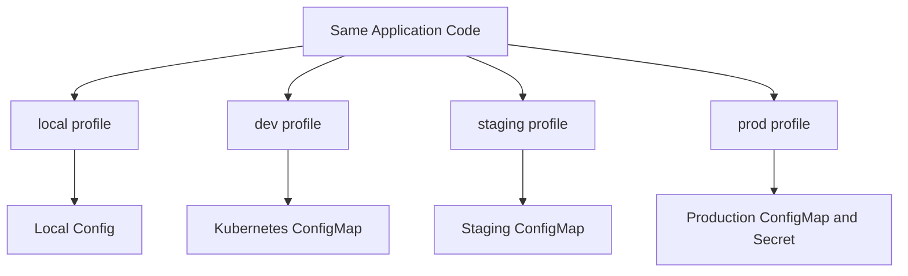

## 3.5 Graceful Shutdown

Kubernetes sends `SIGTERM` before killing a pod. Spring Boot should gracefully stop accepting requests and finish current work.

```yaml
server:
  shutdown: graceful

spring:
  lifecycle:
    timeout-per-shutdown-phase: 30s
```

## 3.6 Step-by-Step Lab

1. Create `product-service`.
2. Add a simple REST endpoint.
3. Add Actuator.
4. Add health endpoint exposure.
5. Add environment-variable-based database config.
6. Add graceful shutdown config.
7. Run locally:

```bash
mvn spring-boot:run
```

8. Test:

```bash
curl http://localhost:8080/actuator/health
curl http://localhost:8080/actuator/health/liveness
curl http://localhost:8080/actuator/health/readiness
```

---

# Chapter 4. Docker and Containerizing Spring Boot

## Goal

Package Spring Boot apps as production-ready container images.

## 4.1 Basic Dockerfile

```dockerfile
FROM eclipse-temurin:21-jre
WORKDIR /app
COPY target/product-service.jar app.jar
EXPOSE 8080
ENTRYPOINT ["java", "-jar", "app.jar"]
```

This works, but it is not optimal.

## 4.2 Multi-Stage Dockerfile

```dockerfile
FROM maven:3.9-eclipse-temurin-21 AS build
WORKDIR /workspace
COPY pom.xml .
COPY src ./src
RUN mvn clean package -DskipTests

FROM eclipse-temurin:21-jre
WORKDIR /app
COPY --from=build /workspace/target/*.jar app.jar
EXPOSE 8080
ENTRYPOINT ["java", "-XX:MaxRAMPercentage=75.0", "-jar", "app.jar"]
```

## 4.3 Build and Run

```bash
docker build -t product-service:1.0.0 .
docker run --rm -p 8080:8080 product-service:1.0.0
```

## 4.4 Container Image Flow

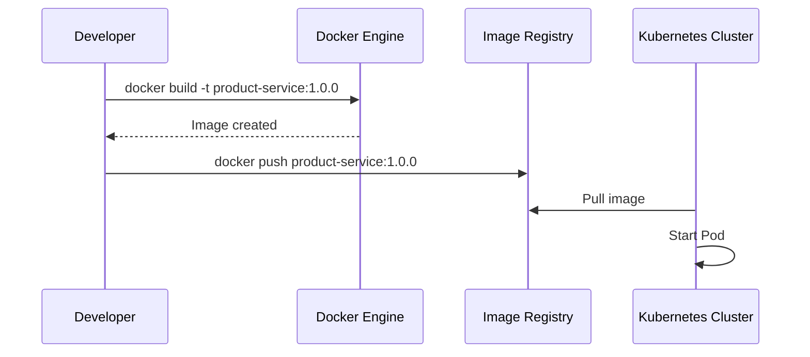

## 4.5 Production Image Best Practices

- Use a small base image.
- Do not run as root.
- Pin image versions.
- Do not store secrets in images.
- Use JVM container-aware settings.
- Keep images immutable.
- Tag images with version and Git commit SHA.

## 4.6 Non-Root Dockerfile Example

```dockerfile
FROM eclipse-temurin:21-jre
RUN groupadd -r spring && useradd -r -g spring spring
WORKDIR /app
COPY target/product-service.jar app.jar
RUN chown -R spring:spring /app
USER spring
EXPOSE 8080
ENTRYPOINT ["java", "-XX:MaxRAMPercentage=75.0", "-jar", "app.jar"]
```

## 4.7 Step-by-Step Lab

1. Package the app:

```bash
mvn clean package -DskipTests
```

2. Build the image:

```bash
docker build -t product-service:1.0.0 .
```

3. Run the image:

```bash
docker run --rm -p 8080:8080 \
  -e SPRING_PROFILES_ACTIVE=docker \
  product-service:1.0.0
```

4. Check logs:

```bash
docker logs <container-id>
```

5. Stop container:

```bash
docker stop <container-id>
```

---

# Chapter 5. Kubernetes Core Concepts

## Goal

Understand the main Kubernetes objects before deploying Spring Boot.

## 5.1 Kubernetes Architecture

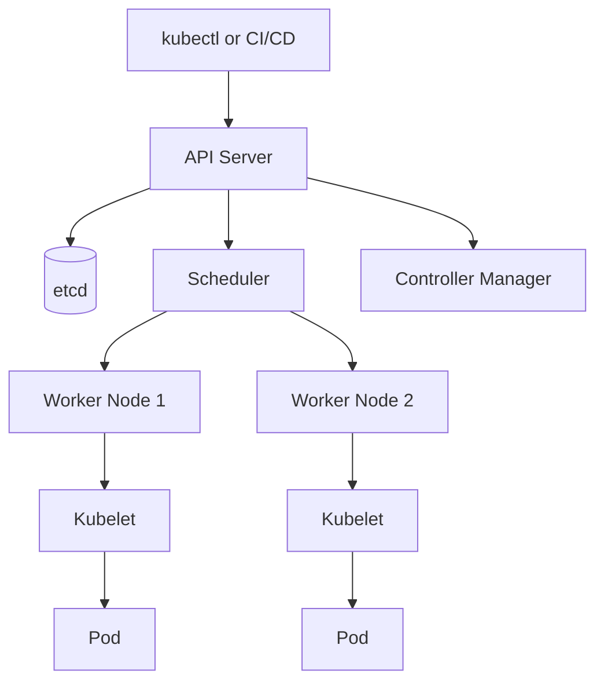

## 5.2 Important Objects

| Object | Purpose |
|---|---|
| Pod | Smallest deployable unit |
| Deployment | Manages stateless replicas |
| ReplicaSet | Maintains pod count |
| Service | Stable network endpoint |
| ConfigMap | Non-sensitive configuration |
| Secret | Sensitive configuration |
| Ingress | HTTP routing into cluster |
| Namespace | Logical isolation |
| PersistentVolumeClaim | Storage request |
| StatefulSet | Stateful replicated workload |
| Job | Run-to-completion task |
| CronJob | Scheduled task |

## 5.3 Desired State Model

You declare what you want. Kubernetes continuously tries to make reality match your desired state.

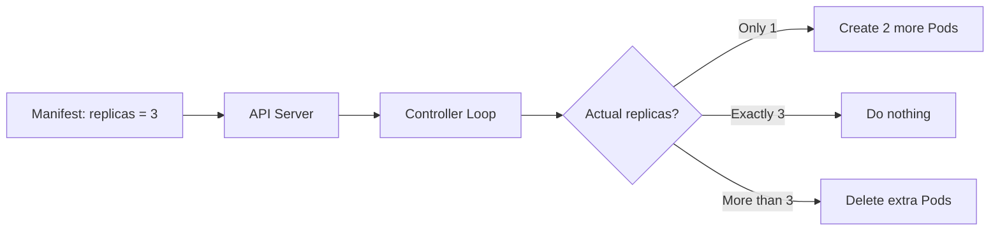

## 5.4 Namespaces

Namespaces separate resources logically.

Common pattern:

```text
dev
staging
prod
monitoring
ingress-nginx
cert-manager
```

Create namespace:

```bash
kubectl create namespace dev
```

## 5.5 Step-by-Step Lab

1. Start local cluster:

```bash
minikube start
```

2. Check nodes:

```bash
kubectl get nodes
```

3. Create namespace:

```bash
kubectl create namespace dev
```

4. Set default namespace:

```bash
kubectl config set-context --current --namespace=dev
```

5. View resources:

```bash
kubectl get all
```

---

# Chapter 6. Your First Spring Boot Deployment

## Goal

Deploy a containerized Spring Boot app to Kubernetes using Deployment and Service.

## 6.1 Deployment Manifest

```yaml
apiVersion: apps/v1
kind: Deployment
metadata:
  name: product-service
  labels:
    app: product-service
spec:
  replicas: 2
  selector:
    matchLabels:
      app: product-service
  template:
    metadata:
      labels:
        app: product-service
    spec:
      containers:
        - name: product-service
          image: product-service:1.0.0
          imagePullPolicy: IfNotPresent
          ports:
            - containerPort: 8080
```

## 6.2 Service Manifest

```yaml
apiVersion: v1
kind: Service
metadata:
  name: product-service
spec:
  type: ClusterIP
  selector:
    app: product-service
  ports:
    - port: 80
      targetPort: 8080
```

## 6.3 Deployment Relationship

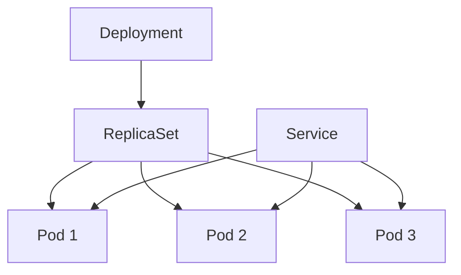

## 6.4 Apply Manifests

```bash
kubectl apply -f deployment.yaml
kubectl apply -f service.yaml
```

Check:

```bash
kubectl get deployments
kubectl get pods
kubectl get svc
```

## 6.5 Port Forward for Local Testing

```bash
kubectl port-forward svc/product-service 8080:80
```

Then test:

```bash
curl http://localhost:8080/actuator/health
```

## 6.6 Rolling Update

Update image:

```bash
kubectl set image deployment/product-service product-service=product-service:1.0.1
```

Check rollout:

```bash
kubectl rollout status deployment/product-service
kubectl rollout history deployment/product-service
```

Rollback:

```bash
kubectl rollout undo deployment/product-service
```

## 6.7 Step-by-Step Lab

1. Build Docker image.
2. Load image into Minikube:

```bash
minikube image load product-service:1.0.0
```

3. Apply Deployment.
4. Apply Service.
5. Test with port-forward.
6. Scale to 5 replicas:

```bash
kubectl scale deployment product-service --replicas=5
```

7. Delete a pod manually:

```bash
kubectl delete pod <pod-name>
```

8. Observe Kubernetes creating a replacement pod.

---

# Chapter 7. Kubernetes Networking

## Goal

Understand how traffic reaches Spring Boot services inside and outside the cluster.

## 7.1 Pod Networking

Every pod gets its own IP, but pod IPs are temporary. Do not call pods directly in large systems. Use Services.

## 7.2 Service Types

| Type | Use Case |
|---|---|
| ClusterIP | Internal service communication |
| NodePort | Basic external access for development |
| LoadBalancer | Cloud load balancer integration |
| ExternalName | DNS alias for external service |

## 7.3 Internal Service Discovery

A service can call another service by DNS name:

```text
http://product-service.dev.svc.cluster.local
```

Inside the same namespace:

```text
http://product-service
```

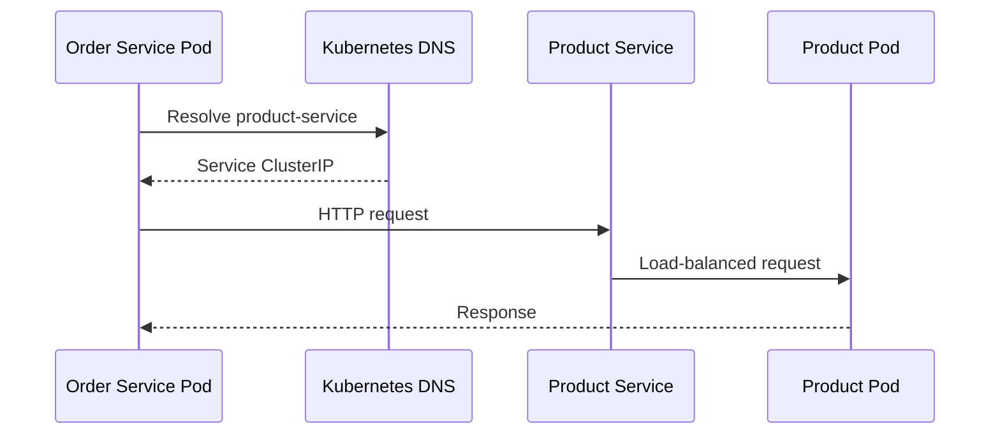

## 7.4 Ingress

Ingress routes external HTTP traffic to internal services.

```yaml
apiVersion: networking.k8s.io/v1
kind: Ingress
metadata:
  name: app-ingress
spec:
  rules:
    - host: app.local
      http:
        paths:
          - path: /api/products
            pathType: Prefix
            backend:
              service:
                name: product-service
                port:
                  number: 80
```

## 7.5 Ingress Architecture

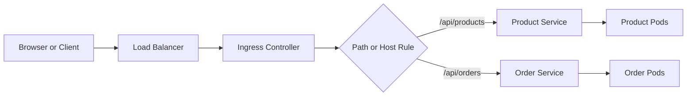

## 7.6 Step-by-Step Lab

1. Install ingress controller:

```bash
minikube addons enable ingress
```

2. Create Ingress manifest.
3. Add local host entry:

```text
127.0.0.1 app.local
```

4. Test:

```bash
curl http://app.local/api/products/1
```

---

# Chapter 8. Configuration, Profiles, and Secrets

## Goal

Manage environment-specific configuration safely and cleanly.

## 8.1 ConfigMap

Use ConfigMaps for non-sensitive values.

```yaml
apiVersion: v1
kind: ConfigMap
metadata:
  name: product-service-config
data:
  SPRING_PROFILES_ACTIVE: dev
  SERVER_PORT: "8080"
  LOG_LEVEL: INFO
```

## 8.2 Secret

Use Secrets for sensitive values.

```yaml
apiVersion: v1
kind: Secret
metadata:
  name: product-service-secret
type: Opaque
stringData:
  DB_USERNAME: product_user
  DB_PASSWORD: change-me
```

## 8.3 Inject Config into Deployment

```yaml
apiVersion: apps/v1
kind: Deployment
metadata:
  name: product-service
spec:
  replicas: 2
  selector:
    matchLabels:
      app: product-service
  template:
    metadata:
      labels:
        app: product-service
    spec:
      containers:
        - name: product-service
          image: product-service:1.0.0
          envFrom:
            - configMapRef:
                name: product-service-config
            - secretRef:
                name: product-service-secret
```

## 8.4 Configuration Flow

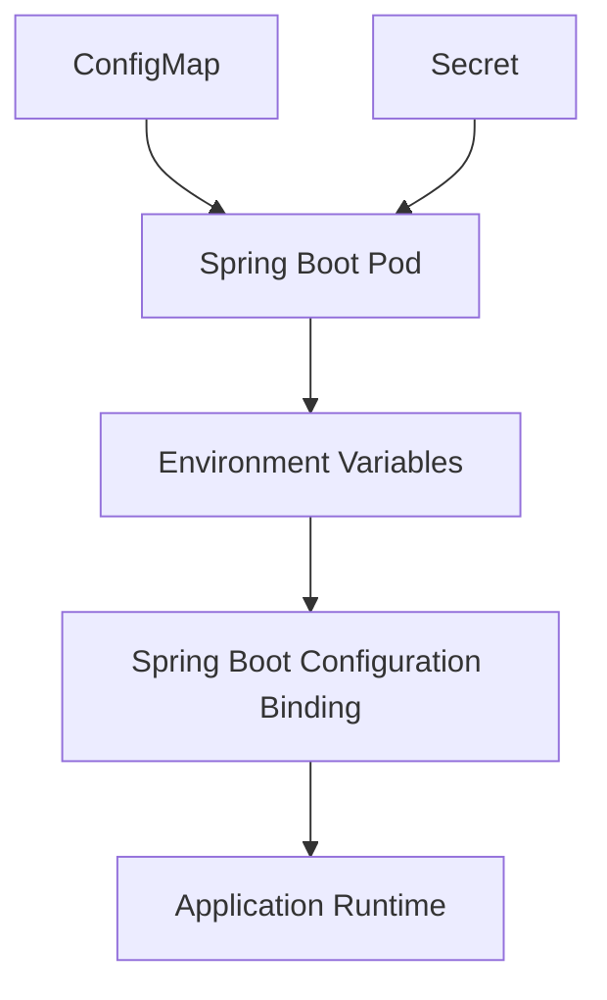

## 8.5 Recommended Large-Scale Configuration Strategy

For large systems:

- Keep default config in `application.yml`.
- Keep environment overrides in Kubernetes ConfigMaps.
- Keep secrets out of Git.
- Use External Secrets Operator, Vault, or cloud secret managers in production.
- Use one ConfigMap per service.
- Use one Secret per service or shared secret domain.

## 8.6 Step-by-Step Lab

1. Create ConfigMap.
2. Create Secret.
3. Reference them in Deployment.
4. Restart deployment:

```bash
kubectl rollout restart deployment/product-service
```

5. Inspect environment variables:

```bash
kubectl exec -it <pod-name> -- printenv
```

---

# Chapter 9. Databases, Storage, and Stateful Workloads

## Goal

Understand when to run databases inside Kubernetes and when to use managed services.

## 9.1 Stateless vs Stateful

Spring Boot services should usually be stateless. Databases are stateful.

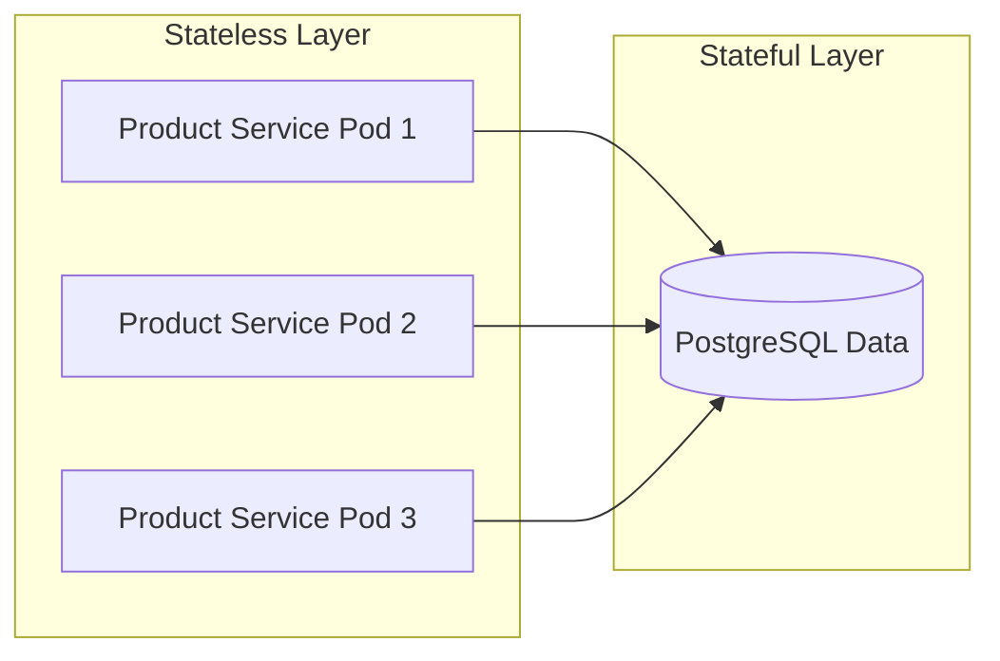

## 9.2 PersistentVolumeClaim

```yaml
apiVersion: v1
kind: PersistentVolumeClaim
metadata:
  name: postgres-pvc
spec:
  accessModes:
    - ReadWriteOnce
  resources:
    requests:
      storage: 5Gi
```

## 9.3 PostgreSQL Deployment for Development

```yaml
apiVersion: apps/v1
kind: Deployment
metadata:
  name: postgres
spec:
  replicas: 1
  selector:
    matchLabels:
      app: postgres
  template:
    metadata:
      labels:
        app: postgres
    spec:
      containers:
        - name: postgres
          image: postgres:16
          env:
            - name: POSTGRES_DB
              value: products
            - name: POSTGRES_USER
              value: product_user
            - name: POSTGRES_PASSWORD
              valueFrom:
                secretKeyRef:
                  name: postgres-secret
                  key: POSTGRES_PASSWORD
          ports:
            - containerPort: 5432
          volumeMounts:
            - name: data
              mountPath: /var/lib/postgresql/data
      volumes:
        - name: data
          persistentVolumeClaim:
            claimName: postgres-pvc
```

## 9.4 Database Service

```yaml
apiVersion: v1
kind: Service
metadata:
  name: postgres
spec:
  selector:
    app: postgres
  ports:
    - port: 5432
      targetPort: 5432
```

## 9.5 Production Recommendation

For production, prefer managed databases unless your team has strong database operations experience.

Recommended production approach:

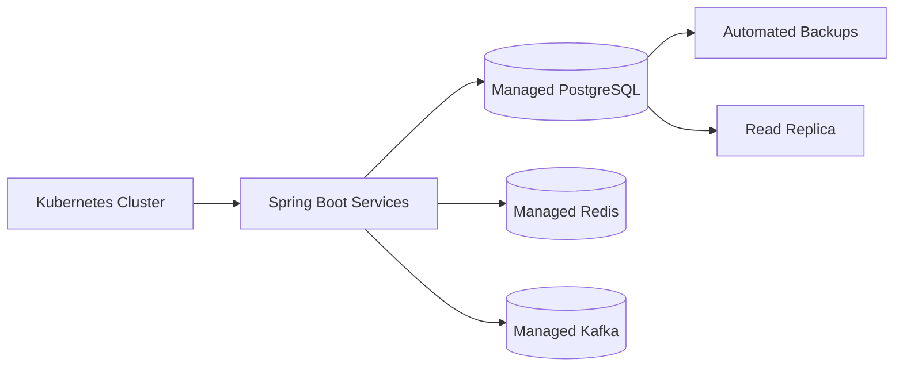

## 9.6 Migration Strategy

Use Flyway or Liquibase.

Recommended pattern:

- App starts only if schema is compatible.
- Migrations run as a separate Kubernetes Job for controlled releases.
- Backward-compatible migrations are preferred.

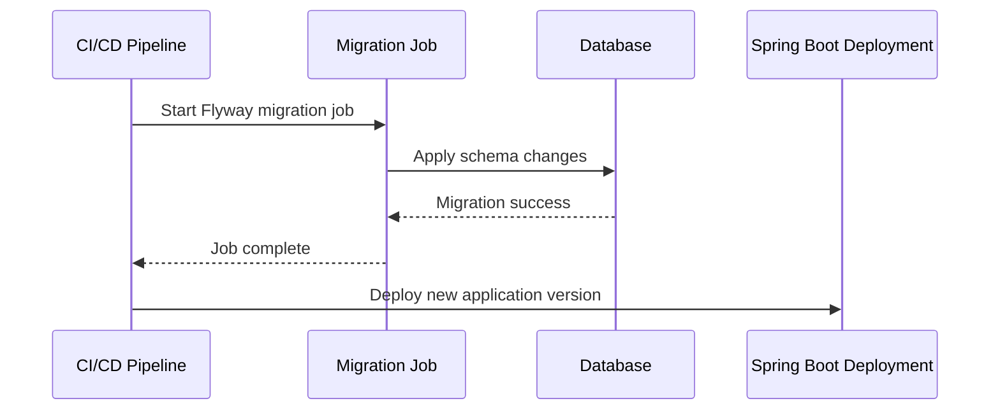

## 9.7 Step-by-Step Lab

1. Create PostgreSQL Secret.
2. Create PVC.
3. Deploy PostgreSQL.
4. Create PostgreSQL Service.
5. Configure Spring Boot DB URL:

```yaml
spring:
  datasource:
    url: jdbc:postgresql://postgres:5432/products
```

6. Restart product service.
7. Check logs.
8. Create a product through API.
9. Delete product pod.
10. Verify data still exists.

---

# Chapter 10. Health Checks, Resilience, and Graceful Shutdown

## Goal

Make Spring Boot services reliable under real production conditions.

## 10.1 Liveness vs Readiness

| Probe | Meaning | Failure Result |
|---|---|---|
| Liveness | Is the app alive? | Kubernetes restarts pod |
| Readiness | Can the app receive traffic? | Pod removed from Service endpoints |
| Startup | Has slow app started? | Gives app more time before liveness checks |

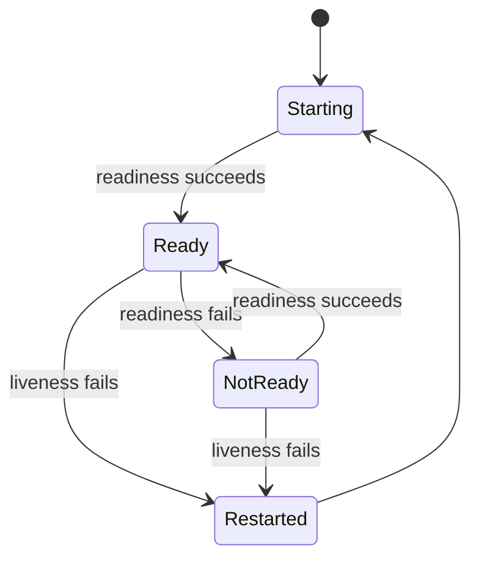

## 10.2 Kubernetes Probe Example

```yaml
livenessProbe:
  httpGet:
    path: /actuator/health/liveness
    port: 8080
  initialDelaySeconds: 30
  periodSeconds: 10
  failureThreshold: 3

readinessProbe:
  httpGet:
    path: /actuator/health/readiness
    port: 8080
  initialDelaySeconds: 10
  periodSeconds: 5
  failureThreshold: 3
```

## 10.3 Resilience Patterns

For large-scale applications, expect failure.

Use:

- Timeouts
- Retries with backoff
- Circuit breakers
- Bulkheads
- Rate limiting
- Idempotency keys
- Dead-letter queues

## 10.4 Request Failure Flow

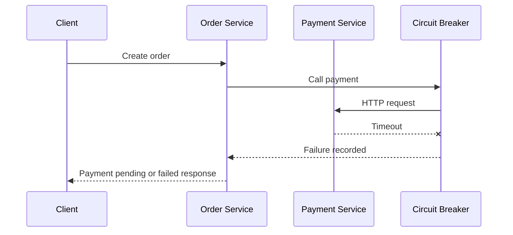

## 10.5 Graceful Shutdown Flow

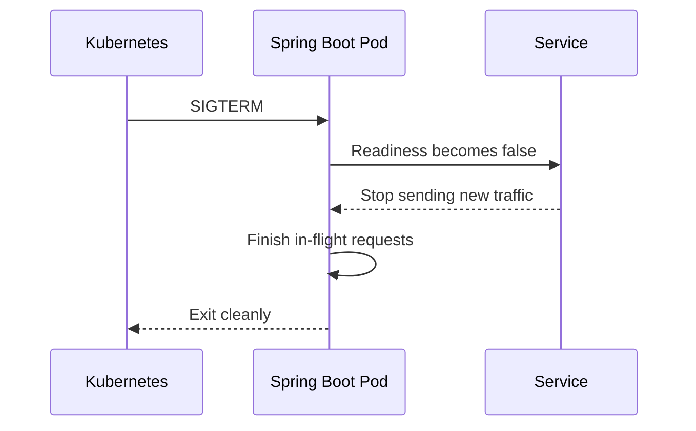

## 10.6 Step-by-Step Lab

1. Add Actuator probes config.
2. Add liveness and readiness probes to Deployment.
3. Deploy app.
4. Watch endpoints:

```bash
kubectl get endpoints product-service -w
```

5. Simulate failure by making readiness fail.
6. Observe Kubernetes removing pod from traffic.

---

# Chapter 11. Observability: Logs, Metrics, Traces, and Dashboards

## Goal

Understand what your application is doing in production.

## 11.1 The Three Pillars

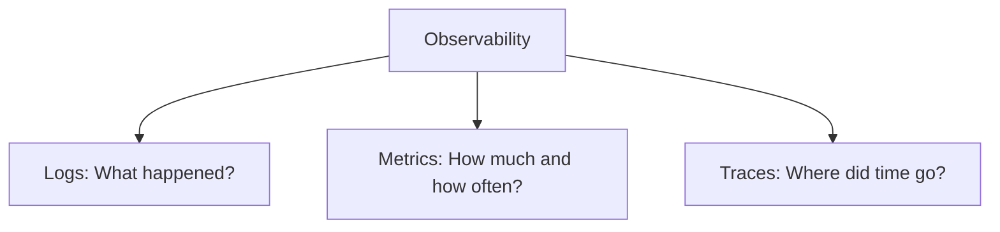

## 11.2 Logging Strategy

Best practices:

- Log to stdout/stderr.
- Use JSON logs in production.
- Include correlation IDs.
- Do not log secrets.
- Use consistent log levels.

Spring Boot logging example:

```yaml
logging:
  level:
    root: INFO
    com.example: DEBUG
```

View pod logs:

```bash
kubectl logs deployment/product-service
kubectl logs -f deployment/product-service
```

## 11.3 Metrics with Prometheus

Add dependency:

```xml
<dependency>
    <groupId>io.micrometer</groupId>
    <artifactId>micrometer-registry-prometheus</artifactId>
</dependency>
```

Expose endpoint:

```yaml
management:
  endpoints:
    web:
      exposure:
        include: health,info,metrics,prometheus
```

## 11.4 Monitoring Architecture

```mermaid
flowchart LR
    App["Spring Boot Pod"] --> Endpoint["/actuator/prometheus"]
    Prom["Prometheus"] -->|scrapes| Endpoint
    Grafana["Grafana"] -->|queries| Prom
    Engineer["Engineer"] -->|views dashboards| Grafana
```

## 11.5 Distributed Tracing

Tracing helps understand requests across services.

```mermaid
sequenceDiagram
    participant Client
    participant Gateway
    participant Order
    participant Inventory
    participant Payment

    Client->>Gateway: POST /orders traceId=abc
    Gateway->>Order: Forward traceId=abc
    Order->>Inventory: Reserve stock traceId=abc
    Order->>Payment: Charge payment traceId=abc
    Payment-->>Order: OK
    Inventory-->>Order: OK
    Order-->>Gateway: Order created
    Gateway-->>Client: 201 Created
```

## 11.6 Alerts

Useful alerts:

- Pod crash loop detected
- High error rate
- High latency
- CPU throttling
- Memory usage near limit
- Disk pressure
- Database connection pool exhausted
- Kafka consumer lag

## 11.7 Step-by-Step Lab

1. Add Prometheus registry dependency.
2. Deploy app.
3. Open metrics:

```bash
kubectl port-forward svc/product-service 8080:80
curl http://localhost:8080/actuator/prometheus
```

4. Install Prometheus and Grafana with Helm.
5. Create dashboard for request count, latency, errors, CPU, and memory.

---

# Chapter 12. Kubernetes Security for Spring Boot

## Goal

Secure applications, containers, and Kubernetes resources.

## 12.1 Security Layers

```mermaid
flowchart TD
    Security[Security] --> App[Application Security]
    Security --> Image[Container Image Security]
    Security --> Pod[Pod Security]
    Security --> Network[Network Security]
    Security --> Cluster[Cluster RBAC]
    Security --> Secrets[Secret Management]
```

## 12.2 Application Security

For Spring Boot:

- Use Spring Security.
- Validate inputs.
- Use OAuth2/OIDC for authentication.
- Use authorization at endpoint and domain levels.
- Avoid exposing internal actuator endpoints publicly.

## 12.3 Container Security Context

```yaml
securityContext:
  runAsNonRoot: true
  runAsUser: 10001
  allowPrivilegeEscalation: false
  readOnlyRootFilesystem: true
  capabilities:
    drop:
      - ALL
```

## 12.4 RBAC Example

```yaml
apiVersion: v1
kind: ServiceAccount
metadata:
  name: product-service-sa
---
apiVersion: rbac.authorization.k8s.io/v1
kind: Role
metadata:
  name: product-service-role
rules:
  - apiGroups: [""]
    resources: ["configmaps"]
    verbs: ["get", "list"]
---
apiVersion: rbac.authorization.k8s.io/v1
kind: RoleBinding
metadata:
  name: product-service-rolebinding
subjects:
  - kind: ServiceAccount
    name: product-service-sa
roleRef:
  kind: Role
  name: product-service-role
  apiGroup: rbac.authorization.k8s.io
```

## 12.5 NetworkPolicy

Limit which pods can talk to which services.

```yaml
apiVersion: networking.k8s.io/v1
kind: NetworkPolicy
metadata:
  name: allow-api-gateway-to-product
spec:
  podSelector:
    matchLabels:
      app: product-service
  ingress:
    - from:
        - podSelector:
            matchLabels:
              app: api-gateway
      ports:
        - protocol: TCP
          port: 8080
```

## 12.6 Network Security Diagram

```mermaid
flowchart LR
    Gateway[API Gateway] -->|Allowed| Product[Product Service]
    Order[Order Service] -->|Allowed| Product
    Unknown[Unknown Pod] -. Blocked .-> Product
```

## 12.7 Step-by-Step Lab

1. Run container as non-root.
2. Add securityContext to Deployment.
3. Create ServiceAccount.
4. Attach ServiceAccount to pod.
5. Apply NetworkPolicy.
6. Test allowed and blocked traffic.

---

# Chapter 13. Resource Management and Autoscaling

## Goal

Run efficiently and scale under load.

## 13.1 Requests and Limits

```yaml
resources:
  requests:
    cpu: "250m"
    memory: "512Mi"
  limits:
    cpu: "1000m"
    memory: "1Gi"
```

Requests help Kubernetes schedule pods. Limits prevent a pod from consuming unlimited resources.

## 13.2 JVM Memory in Containers

Use JVM settings that respect container memory:

```bash
-XX:MaxRAMPercentage=75.0
```

If memory limit is `1Gi`, JVM heap can use about 75%, leaving room for metaspace, threads, native memory, and buffers.

## 13.3 Horizontal Pod Autoscaler

```yaml
apiVersion: autoscaling/v2
kind: HorizontalPodAutoscaler
metadata:
  name: product-service-hpa
spec:
  scaleTargetRef:
    apiVersion: apps/v1
    kind: Deployment
    name: product-service
  minReplicas: 2
  maxReplicas: 10
  metrics:
    - type: Resource
      resource:
        name: cpu
        target:
          type: Utilization
          averageUtilization: 70
```

## 13.4 Autoscaling Flow

```mermaid
flowchart TD
    Metrics[Metrics Server] --> HPA[Horizontal Pod Autoscaler]
    HPA --> Decision{CPU above target?}
    Decision -->|Yes| ScaleUp[Increase replicas]
    Decision -->|No| Stable[Keep current replicas]
    ScaleUp --> Deployment[Deployment]
    Deployment --> Pods[More Pods]
```

## 13.5 Scaling Strategy for Large Systems

Scale based on:

- CPU for CPU-heavy APIs
- Memory for memory-heavy services
- Request rate for HTTP workloads
- Queue depth for async workers
- Kafka consumer lag for event processors
- Custom business metrics for special workloads

## 13.6 Step-by-Step Lab

1. Install metrics server.
2. Add requests and limits.
3. Create HPA.
4. Generate load:

```bash
kubectl run load-generator --image=busybox --restart=Never -- \
  /bin/sh -c "while true; do wget -q -O- http://product-service/api/products/1; done"
```

5. Watch HPA:

```bash
kubectl get hpa -w
```

---

# Chapter 14. CI/CD for Spring Boot on Kubernetes

## Goal

Automate build, test, image creation, scanning, and deployment.

## 14.1 Pipeline Stages

```mermaid
flowchart LR
    Commit[Git Commit] --> Test[Unit and Integration Tests]
    Test --> Build[Build JAR]
    Build --> Image[Build Docker Image]
    Image --> Scan[Security Scan]
    Scan --> Push[Push to Registry]
    Push --> DeployDev[Deploy to Dev]
    DeployDev --> Approve[Approval]
    Approve --> DeployProd[Deploy to Prod]
```

## 14.2 GitHub Actions Example

```yaml
name: product-service-ci

on:
  push:
    branches: [main]

jobs:
  build:
    runs-on: ubuntu-latest
    steps:
      - uses: actions/checkout@v4
      - uses: actions/setup-java@v4
        with:
          distribution: temurin
          java-version: '21'
      - name: Test
        run: mvn test
      - name: Build
        run: mvn clean package -DskipTests
      - name: Build Image
        run: docker build -t registry.example.com/product-service:${{ github.sha }} .
      - name: Push Image
        run: docker push registry.example.com/product-service:${{ github.sha }}
```

## 14.3 Deployment Strategies

| Strategy | Description | Use Case |
|---|---|---|
| Rolling update | Gradually replace old pods | Default choice |
| Blue-green | Switch all traffic to new version | Fast rollback |
| Canary | Send small traffic to new version | Risk reduction |

## 14.4 Canary Deployment Diagram

```mermaid
flowchart LR
    User[Users] --> Router[Ingress or Service Mesh]
    Router -->|90% traffic| Stable[v1 Pods]
    Router -->|10% traffic| Canary[v2 Pods]
    Stable --> App1[Product v1]
    Canary --> App2[Product v2]
```

## 14.5 Step-by-Step Lab

1. Create Git repository.
2. Add Dockerfile.
3. Add Kubernetes manifests.
4. Add CI pipeline.
5. Build image with Git SHA tag.
6. Push image to registry.
7. Deploy to dev namespace.
8. Promote to staging.
9. Add manual approval for production.

---

# Chapter 15. Helm and Environment Promotion

## Goal

Package Kubernetes manifests and deploy consistently across environments.

## 15.1 Why Helm?

Without Helm, you may duplicate YAML for each environment. Helm allows templates and values files.

```mermaid
flowchart TD
    Chart[Helm Chart Templates] --> Dev[values-dev.yaml]
    Chart --> Stage[values-staging.yaml]
    Chart --> Prod[values-prod.yaml]
    Dev --> DevDeploy[Dev Deployment]
    Stage --> StageDeploy[Staging Deployment]
    Prod --> ProdDeploy[Production Deployment]
```

## 15.2 Helm Structure

```text
product-service-chart/
  Chart.yaml
  values.yaml
  values-dev.yaml
  values-prod.yaml
  templates/
    deployment.yaml
    service.yaml
    ingress.yaml
    configmap.yaml
    secret.yaml
    hpa.yaml
```

## 15.3 Example values.yaml

```yaml
replicaCount: 2

image:
  repository: registry.example.com/product-service
  tag: latest

service:
  port: 80
  targetPort: 8080

resources:
  requests:
    cpu: 250m
    memory: 512Mi
  limits:
    cpu: 1000m
    memory: 1Gi
```

## 15.4 Install or Upgrade

```bash
helm upgrade --install product-service ./product-service-chart \
  -n dev \
  -f values-dev.yaml
```

## 15.5 Step-by-Step Lab

1. Create Helm chart.
2. Move Deployment YAML into template.
3. Parameterize image tag.
4. Parameterize replica count.
5. Create dev and prod values files.
6. Deploy dev.
7. Deploy prod with different values.

---

# Chapter 16. Microservices Architecture with Spring Boot

## Goal

Design Spring Boot services for independent scaling and deployment.

## 16.1 When to Use Microservices

Use microservices when you need:

- Independent team ownership
- Independent deployments
- Different scaling needs
- Strong domain boundaries
- Fault isolation

Do not use microservices just because they are popular. They add operational complexity.

## 16.2 Domain-Oriented Services

For a commerce system:

```mermaid
flowchart TD
    Commerce[Commerce Platform] --> Catalog[Catalog Domain]
    Commerce --> Ordering[Ordering Domain]
    Commerce --> Payment[Payment Domain]
    Commerce --> Fulfillment[Fulfillment Domain]
    Commerce --> Customer[Customer Domain]

    Catalog --> ProductService[Product Service]
    Ordering --> OrderService[Order Service]
    Payment --> PaymentService[Payment Service]
    Fulfillment --> InventoryService[Inventory Service]
    Customer --> CustomerService[Customer Service]
```

## 16.3 Database Per Service

Each microservice should own its data.

```mermaid
flowchart LR
    Product[Product Service] --> ProductDB[(Product DB)]
    Order[Order Service] --> OrderDB[(Order DB)]
    Payment[Payment Service] --> PaymentDB[(Payment DB)]
    Inventory[Inventory Service] --> InventoryDB[(Inventory DB)]
```

Avoid this anti-pattern:

```mermaid
flowchart LR
    A[Product Service] --> Shared[(Shared Database)]
    B[Order Service] --> Shared
    C[Payment Service] --> Shared
    D[Inventory Service] --> Shared
```

## 16.4 Synchronous Communication

Use HTTP when immediate response is required.

Example:

- API Gateway calls Product Service to show product details.
- Order Service calls Inventory Service to check availability.

## 16.5 Asynchronous Communication

Use messaging for workflows that can be eventually consistent.

Example:

- Order created event
- Payment completed event
- Inventory reserved event
- Notification requested event

## 16.6 Microservice Request Flow

```mermaid
sequenceDiagram
    participant User
    participant Gateway
    participant Order
    participant Inventory
    participant Payment
    participant Broker
    participant Notification

    User->>Gateway: POST /orders
    Gateway->>Order: Create order
    Order->>Inventory: Reserve inventory
    Inventory-->>Order: Reserved
    Order->>Payment: Start payment
    Payment-->>Order: Payment accepted
    Order->>Broker: Publish OrderCreated
    Broker->>Notification: Consume OrderCreated
    Notification-->>User: Send confirmation
```

## 16.7 Step-by-Step Lab

1. Create product-service.
2. Create order-service.
3. Give each service its own database.
4. Expose both through API Gateway.
5. Implement REST call from order-service to product-service.
6. Add timeout and retry.
7. Add event publication after order creation.

---

# Chapter 17. API Gateway, Ingress, and External Traffic

## Goal

Control external access to your system.

## 17.1 Responsibilities of API Gateway

An API Gateway can provide:

- Routing
- Authentication
- Authorization
- Rate limiting
- Request/response transformation
- API versioning
- Central logging
- TLS termination, depending on architecture

## 17.2 Gateway vs Ingress

| Component | Main Purpose |
|---|---|
| Ingress Controller | Bring HTTP traffic into cluster |
| API Gateway | Application-level API management |
| Service Mesh | Service-to-service traffic management |

## 17.3 External Traffic Architecture

```mermaid
flowchart LR
    User[Mobile/Web Client] --> DNS[DNS]
    DNS --> LB[Cloud Load Balancer]
    LB --> Ingress[Ingress Controller]
    Ingress --> Gateway[API Gateway]
    Gateway --> Product[Product Service]
    Gateway --> Order[Order Service]
    Gateway --> Payment[Payment Service]
```

## 17.4 Spring Cloud Gateway Route Example

```yaml
spring:
  cloud:
    gateway:
      routes:
        - id: product-service
          uri: http://product-service
          predicates:
            - Path=/api/products/**
        - id: order-service
          uri: http://order-service
          predicates:
            - Path=/api/orders/**
```

## 17.5 Rate Limiting

Rate limiting protects services from abuse and traffic spikes.

```mermaid
flowchart TD
    Request[Incoming Request] --> Gateway[API Gateway]
    Gateway --> Limit{Within rate limit?}
    Limit -->|Yes| Service[Backend Service]
    Limit -->|No| Reject[HTTP 429 Too Many Requests]
```

## 17.6 Step-by-Step Lab

1. Create API Gateway Spring Boot app.
2. Add Spring Cloud Gateway.
3. Add routes for product and order services.
4. Deploy gateway to Kubernetes.
5. Route Ingress traffic to gateway.
6. Test external API calls.

---

# Chapter 18. Event-Driven Architecture and Messaging

## Goal

Build scalable asynchronous workflows.

## 18.1 Why Messaging?

Messaging helps with:

- Decoupling services
- Handling traffic spikes
- Retrying failed work
- Eventual consistency
- Asynchronous processing

## 18.2 Event-Driven Order Flow

```mermaid
sequenceDiagram
    participant Client
    participant Order
    participant Broker
    participant Inventory
    participant Payment
    participant Notification

    Client->>Order: Create order
    Order->>Broker: Publish OrderCreated
    Broker->>Inventory: OrderCreated
    Inventory->>Broker: Publish InventoryReserved
    Broker->>Payment: InventoryReserved
    Payment->>Broker: Publish PaymentCompleted
    Broker->>Notification: PaymentCompleted
```

## 18.3 Kafka Topic Design

Example topics:

```text
orders.created
inventory.reserved
inventory.failed
payments.completed
payments.failed
notifications.requested
```

## 18.4 Outbox Pattern

The outbox pattern prevents losing events when database write succeeds but message publishing fails.

```mermaid
sequenceDiagram
    participant App as Order Service
    participant DB as Order Database
    participant Relay as Outbox Relay
    participant Broker as Message Broker

    App->>DB: Save order and outbox event in same transaction
    DB-->>App: Commit success
    Relay->>DB: Poll unpublished outbox events
    Relay->>Broker: Publish event
    Broker-->>Relay: Ack
    Relay->>DB: Mark event as published
```

## 18.5 Consumer Idempotency

Consumers should handle duplicate messages safely.

Common techniques:

- Store processed event IDs.
- Use idempotency keys.
- Use natural unique constraints.
- Make operations repeat-safe.

## 18.6 Step-by-Step Lab

1. Add Kafka or RabbitMQ locally.
2. Create `OrderCreated` event.
3. Publish event from order-service.
4. Consume event in notification-service.
5. Add retry handling.
6. Add dead-letter queue/topic.
7. Implement outbox table.

---

# Chapter 19. Large-Scale Application Architecture

## Goal

Design a production-ready, large-scale Spring Boot platform on Kubernetes.

## 19.1 Reference Architecture

```mermaid
flowchart TD
    User[Users] --> CDN[CDN]
    CDN --> WAF[WAF]
    WAF --> LB[Cloud Load Balancer]
    LB --> Ingress[Ingress Controller]
    Ingress --> Gateway[API Gateway]

    Gateway --> Product[Product Service]
    Gateway --> Order[Order Service]
    Gateway --> Customer[Customer Service]

    Order --> Inventory[Inventory Service]
    Order --> Payment[Payment Service]

    Product --> ProductDB[(Product DB)]
    Order --> OrderDB[(Order DB)]
    Customer --> CustomerDB[(Customer DB)]
    Inventory --> InventoryDB[(Inventory DB)]
    Payment --> PaymentDB[(Payment DB)]

    Order --> Broker[(Kafka or RabbitMQ)]
    Payment --> Broker
    Broker --> Notification[Notification Service]

    Product --> Cache[(Redis Cache)]

    Product --> Metrics[Prometheus]
    Order --> Metrics
    Gateway --> Metrics
    Metrics --> Grafana[Grafana]
```

## 19.2 Large-Scale Design Principles

Use these principles:

1. Services are stateless unless explicitly stateful.
2. Each service owns its database.
3. External traffic enters through controlled gateways.
4. Internal services communicate through Services, not pod IPs.
5. Configuration is externalized.
6. Secrets are managed outside Git.
7. Every service has health checks.
8. Every service has metrics, logs, and traces.
9. Every service has resource requests and limits.
10. Every service can be deployed independently.
11. Database migrations are backward-compatible.
12. Events are used for cross-domain workflows.
13. Systems are designed for failure.

## 19.3 Environment Architecture

```mermaid
flowchart LR
    Dev[Dev Namespace] --> Stage[Staging Namespace]
    Stage --> Prod[Production Namespace]
    Dev --> DevDB[(Dev DB)]
    Stage --> StageDB[(Staging DB)]
    Prod --> ProdDB[(Production DB)]
```

Production may use separate clusters instead of namespaces for stronger isolation.

## 19.4 Multi-Cluster Strategy

```mermaid
flowchart TD
    Git[Git Repository] --> CICD[CI/CD]
    CICD --> DevCluster[Dev Cluster]
    CICD --> StageCluster[Staging Cluster]
    CICD --> ProdClusterA[Production Cluster Region A]
    CICD --> ProdClusterB[Production Cluster Region B]
    GlobalDNS[Global DNS] --> ProdClusterA
    GlobalDNS --> ProdClusterB
```

## 19.5 Database Scaling

Common techniques:

- Connection pooling
- Read replicas
- Caching
- Partitioning
- Sharding
- CQRS for read-heavy systems
- Async workflows for write-heavy systems

## 19.6 Cache Strategy

```mermaid
sequenceDiagram
    participant Client
    participant Product as Product Service
    participant Cache as Redis
    participant DB as Product DB

    Client->>Product: GET /products/1
    Product->>Cache: Get product:1
    alt Cache hit
        Cache-->>Product: Product data
    else Cache miss
        Product->>DB: Query product
        DB-->>Product: Product data
        Product->>Cache: Store product with TTL
    end
    Product-->>Client: Response
```

## 19.7 Failure Isolation

Design so one failing service does not bring down the whole platform.

```mermaid
flowchart TD
    Gateway[API Gateway] --> Product[Product Service]
    Gateway --> Order[Order Service]
    Order --> Payment[Payment Service]
    Payment --> Failure[Payment Provider Down]
    Payment --> Fallback[Return payment pending]
    Order --> Continue[Order remains pending]
```

## 19.8 Production Deployment Pattern

```mermaid
sequenceDiagram
    participant Dev as Developer
    participant Git as Git
    participant CI as CI/CD
    participant Registry as Image Registry
    participant K8s as Kubernetes
    participant Monitor as Monitoring

    Dev->>Git: Push code
    Git->>CI: Trigger pipeline
    CI->>CI: Test and build
    CI->>Registry: Push image with SHA tag
    CI->>K8s: Deploy canary
    K8s->>Monitor: Report metrics
    Monitor-->>CI: Metrics healthy
    CI->>K8s: Promote rollout
```

## 19.9 Recommended Kubernetes Object Layout Per Service

Each Spring Boot service should typically have:

```text
Deployment
Service
ConfigMap
Secret reference
ServiceAccount
HorizontalPodAutoscaler
PodDisruptionBudget
Ingress route or Gateway route
NetworkPolicy
ServiceMonitor or PodMonitor
```

## 19.10 Example Production Deployment Manifest

```yaml
apiVersion: apps/v1
kind: Deployment
metadata:
  name: product-service
  labels:
    app: product-service
spec:
  replicas: 3
  strategy:
    type: RollingUpdate
    rollingUpdate:
      maxSurge: 1
      maxUnavailable: 0
  selector:
    matchLabels:
      app: product-service
  template:
    metadata:
      labels:
        app: product-service
    spec:
      serviceAccountName: product-service-sa
      terminationGracePeriodSeconds: 45
      containers:
        - name: product-service
          image: registry.example.com/product-service:1.0.0
          imagePullPolicy: IfNotPresent
          ports:
            - containerPort: 8080
          envFrom:
            - configMapRef:
                name: product-service-config
            - secretRef:
                name: product-service-secret
          resources:
            requests:
              cpu: "500m"
              memory: "768Mi"
            limits:
              cpu: "1500m"
              memory: "1536Mi"
          livenessProbe:
            httpGet:
              path: /actuator/health/liveness
              port: 8080
            initialDelaySeconds: 30
            periodSeconds: 10
          readinessProbe:
            httpGet:
              path: /actuator/health/readiness
              port: 8080
            initialDelaySeconds: 10
            periodSeconds: 5
          securityContext:
            runAsNonRoot: true
            runAsUser: 10001
            allowPrivilegeEscalation: false
            capabilities:
              drop:
                - ALL
```

---

# Chapter 20. Production Readiness Checklist

## Goal

Use this checklist before deploying large-scale applications to production.

## 20.1 Application Checklist

- [ ] Uses environment variables for config.
- [ ] Has Actuator health endpoints.
- [ ] Has graceful shutdown enabled.
- [ ] Does not store user sessions in memory.
- [ ] Uses timeouts for external calls.
- [ ] Uses retries only where safe.
- [ ] Has circuit breakers for fragile dependencies.
- [ ] Validates all input.
- [ ] Does not log secrets.
- [ ] Has structured logs.

## 20.2 Container Checklist

- [ ] Image is small.
- [ ] Image uses fixed base version.
- [ ] Container runs as non-root.
- [ ] Secrets are not baked into image.
- [ ] Image is scanned.
- [ ] Image is tagged with immutable version.

## 20.3 Kubernetes Checklist

- [ ] Deployment uses multiple replicas.
- [ ] Readiness and liveness probes exist.
- [ ] Resource requests and limits are configured.
- [ ] HPA exists where needed.
- [ ] PodDisruptionBudget exists.
- [ ] NetworkPolicy exists.
- [ ] ServiceAccount has minimal permissions.
- [ ] Secrets are managed securely.
- [ ] Rolling update strategy prevents downtime.

## 20.4 Observability Checklist

- [ ] Logs are centralized.
- [ ] Metrics are scraped.
- [ ] Dashboards exist.
- [ ] Alerts exist.
- [ ] Traces are enabled for distributed flows.
- [ ] Runbooks exist for common incidents.

## 20.5 Data Checklist

- [ ] Database backups exist.
- [ ] Restore process is tested.
- [ ] Migrations are backward-compatible.
- [ ] Connection pool is configured.
- [ ] Sensitive data is encrypted.
- [ ] Data retention policy is defined.

---

# Chapter 21. Capstone Project: Large-Scale E-Commerce Platform

## Goal

Build a realistic large-scale platform using everything learned.

## 21.1 Services to Build

| Service | Responsibility |
|---|---|
| api-gateway | External routing and auth entry point |
| product-service | Product catalog |
| inventory-service | Stock management |
| order-service | Order lifecycle |
| payment-service | Payment workflow |
| notification-service | Email/SMS notifications |

## 21.2 Architecture

```mermaid
flowchart TD
    Client[Client App] --> Gateway[API Gateway]
    Gateway --> Product[Product Service]
    Gateway --> Order[Order Service]

    Order --> Inventory[Inventory Service]
    Order --> Payment[Payment Service]

    Product --> ProductDB[(Product PostgreSQL)]
    Inventory --> InventoryDB[(Inventory PostgreSQL)]
    Order --> OrderDB[(Order PostgreSQL)]
    Payment --> PaymentDB[(Payment PostgreSQL)]

    Order --> Broker[(Kafka)]
    Payment --> Broker
    Inventory --> Broker
    Broker --> Notification[Notification Service]

    Product --> Redis[(Redis Cache)]
```

## 21.3 Build Order

### Phase 1: Basic APIs

1. Create product-service.
2. Create order-service.
3. Create inventory-service.
4. Add basic REST APIs.
5. Add Swagger/OpenAPI if desired.

### Phase 2: Containerization

1. Add Dockerfile to each service.
2. Build images.
3. Run locally with Docker Compose.
4. Verify service communication.

### Phase 3: Kubernetes Deployment

1. Create namespace.
2. Deploy databases for dev.
3. Deploy product-service.
4. Deploy order-service.
5. Deploy inventory-service.
6. Create Services.
7. Add API Gateway.
8. Add Ingress.

### Phase 4: Configuration and Secrets

1. Move configs to ConfigMaps.
2. Move passwords to Secrets.
3. Use environment-specific values.
4. Add Helm charts.

### Phase 5: Observability

1. Add Actuator to all services.
2. Add Prometheus metrics.
3. Add Grafana dashboard.
4. Add centralized logs.
5. Add traces.

### Phase 6: Resilience

1. Add timeouts.
2. Add retries where safe.
3. Add circuit breakers.
4. Add idempotency keys for order creation.
5. Add outbox pattern for events.

### Phase 7: Scaling

1. Add resource requests and limits.
2. Add HPA to stateless services.
3. Load test APIs.
4. Tune JVM memory.
5. Tune database connection pools.

### Phase 8: Production Hardening

1. Add NetworkPolicies.
2. Add RBAC.
3. Run containers as non-root.
4. Add image scanning.
5. Add backup and restore tests.
6. Add alerts and runbooks.

## 21.4 Order Creation Saga

```mermaid
sequenceDiagram
    participant Client
    participant Gateway
    participant Order
    participant Inventory
    participant Payment
    participant Broker
    participant Notification

    Client->>Gateway: POST /orders
    Gateway->>Order: Create order request
    Order->>Order: Validate request
    Order->>Inventory: Reserve items
    alt Inventory available
        Inventory-->>Order: Reserved
        Order->>Payment: Authorize payment
        alt Payment approved
            Payment-->>Order: Approved
            Order->>Order: Mark order confirmed
            Order->>Broker: Publish OrderConfirmed
            Broker->>Notification: Send confirmation
            Order-->>Gateway: 201 Created
            Gateway-->>Client: Order confirmed
        else Payment failed
            Payment-->>Order: Failed
            Order->>Inventory: Release reservation
            Order->>Order: Mark order failed
            Order-->>Gateway: 402 Payment Required
            Gateway-->>Client: Payment failed
        end
    else Inventory unavailable
        Inventory-->>Order: Not available
        Order-->>Gateway: 409 Conflict
        Gateway-->>Client: Out of stock
    end
```

## 21.5 Minimum Production Kubernetes Objects

For each service create:

```text
service-name/
  deployment.yaml
  service.yaml
  configmap.yaml
  secret-ref.yaml
  hpa.yaml
  pdb.yaml
  networkpolicy.yaml
  servicemonitor.yaml
```

## 21.6 Final Challenge

Deploy the full platform and prove:

1. A user can create an order.
2. Services communicate internally through Kubernetes Services.
3. External traffic enters through Ingress and API Gateway.
4. Metrics appear in Prometheus.
5. Logs are centralized.
6. Traces show full request path.
7. HPA scales a service under load.
8. Deleting a pod does not break the system.
9. A failed payment does not corrupt inventory.
10. A rollback can restore a previous version.

---

# Appendix: Command Cheat Sheet

## Docker

```bash
docker build -t product-service:1.0.0 .
docker run --rm -p 8080:8080 product-service:1.0.0
docker images
docker ps
docker logs <container-id>
docker stop <container-id>
```

## Kubernetes Basics

```bash
kubectl get nodes
kubectl get pods
kubectl get deployments
kubectl get svc
kubectl get ingress
kubectl describe pod <pod-name>
kubectl logs <pod-name>
kubectl logs -f deployment/product-service
kubectl exec -it <pod-name> -- sh
```

## Apply and Delete

```bash
kubectl apply -f file.yaml
kubectl apply -f ./k8s/
kubectl delete -f file.yaml
```

## Rollouts

```bash
kubectl rollout status deployment/product-service
kubectl rollout history deployment/product-service
kubectl rollout undo deployment/product-service
kubectl rollout restart deployment/product-service
```

## Scaling

```bash
kubectl scale deployment product-service --replicas=5
kubectl autoscale deployment product-service --cpu-percent=70 --min=2 --max=10
kubectl get hpa
```

## Debugging

```bash
kubectl describe deployment product-service
kubectl describe pod <pod-name>
kubectl get events --sort-by=.metadata.creationTimestamp
kubectl port-forward svc/product-service 8080:80
kubectl top pods
kubectl top nodes
```

## Helm

```bash
helm create product-service
helm lint product-service
helm template product-service ./product-service
helm upgrade --install product-service ./product-service -n dev
helm list -n dev
helm rollback product-service 1 -n dev
```

---

# Final Learning Path Summary

```mermaid
flowchart TD
    A[Build Spring Boot API] --> B[Add Actuator and Config]
    B --> C[Create Docker Image]
    C --> D[Deploy to Kubernetes]
    D --> E[Expose with Service and Ingress]
    E --> F[Add Database and Persistence]
    F --> G[Add Security and RBAC]
    G --> H[Add Observability]
    H --> I[Add Autoscaling]
    I --> J[Automate CI/CD]
    J --> K[Build Microservices]
    K --> L[Add Messaging and Resilience]
    L --> M[Operate Large-Scale Production Platform]
```

