# React Production-Level Step-by-Step Tutorial

A complete Git-friendly guide to learn React from installation to building high-scale production applications.

---

## Table of Contents

- [1. What You Will Build](#1-what-you-will-build)
- [2. Required Tools](#2-required-tools)
- [3. React Architecture Overview](#3-react-architecture-overview)
- [4. Create React App With Vite](#4-create-react-app-with-vite)
- [5. Recommended Production Stack](#5-recommended-production-stack)
- [6. Project Folder Structure](#6-project-folder-structure)
- [7. Clean Initial Setup](#7-clean-initial-setup)
- [8. TypeScript Basics for React](#8-typescript-basics-for-react)
- [9. Components](#9-components)
- [10. Props](#10-props)
- [11. State](#11-state)
- [12. Events](#12-events)
- [13. Conditional Rendering](#13-conditional-rendering)
- [14. Lists and Keys](#14-lists-and-keys)
- [15. Hooks Overview](#15-hooks-overview)
- [16. useEffect](#16-useeffect)
- [17. useMemo and useCallback](#17-usememo-and-usecallback)
- [18. useRef](#18-useref)
- [19. Custom Hooks](#19-custom-hooks)
- [20. Routing With React Router](#20-routing-with-react-router)
- [21. Layouts](#21-layouts)
- [22. Protected Routes](#22-protected-routes)
- [23. API Integration With Axios](#23-api-integration-with-axios)
- [24. Environment Variables](#24-environment-variables)
- [25. Server State With TanStack Query](#25-server-state-with-tanstack-query)
- [26. Mutations](#26-mutations)
- [27. Forms With React Hook Form](#27-forms-with-react-hook-form)
- [28. Validation With Zod](#28-validation-with-zod)
- [29. Authentication](#29-authentication)
- [30. Refresh Token Flow](#30-refresh-token-flow)
- [31. Role-Based UI](#31-role-based-ui)
- [32. Global State Management](#32-global-state-management)
- [33. UI Styling](#33-ui-styling)
- [34. Error Handling](#34-error-handling)
- [35. Loading and Empty States](#35-loading-and-empty-states)
- [36. Pagination Search and Filters](#36-pagination-search-and-filters)
- [37. File Upload](#37-file-upload)
- [38. Performance Optimization](#38-performance-optimization)
- [39. Code Splitting](#39-code-splitting)
- [40. Virtualization](#40-virtualization)
- [41. Accessibility](#41-accessibility)
- [42. Testing](#42-testing)
- [43. End-to-End Testing](#43-end-to-end-testing)
- [44. Linting and Formatting](#44-linting-and-formatting)
- [45. Build for Production](#45-build-for-production)
- [46. Dockerize React App](#46-dockerize-react-app)
- [47. Nginx Configuration](#47-nginx-configuration)
- [48. CI CD Pipeline](#48-ci-cd-pipeline)
- [49. Monitoring and Analytics](#49-monitoring-and-analytics)
- [50. Security Checklist](#50-security-checklist)
- [51. High-Scale Architecture](#51-high-scale-architecture)
- [52. Production Checklist](#52-production-checklist)
- [53. Final Roadmap](#53-final-roadmap)

---

## 1. What You Will Build

You will learn how to build a production-ready React application with:

- TypeScript
- Routing
- Authentication
- Protected routes
- Role-based UI
- API integration
- React Query
- Forms and validation
- Testing
- Docker
- CI/CD
- Performance optimization
- Production deployment

Example project:

```text
Project Management Dashboard
```

Features:

- Login
- Dashboard
- Projects
- Tasks
- Users
- Search
- Filters
- Pagination
- File upload
- Admin-only pages

---

## 2. Required Tools

Install these tools:

```text
Node.js 20 or newer
npm or pnpm
Git
VS Code
Google Chrome
Docker
```

Check versions:

```bash
node -v
npm -v
git --version
docker --version
```

Recommended VS Code extensions:

```text
ESLint
Prettier
Tailwind CSS IntelliSense
TypeScript Importer
GitLens
Error Lens
```

---

## 3. React Architecture Overview

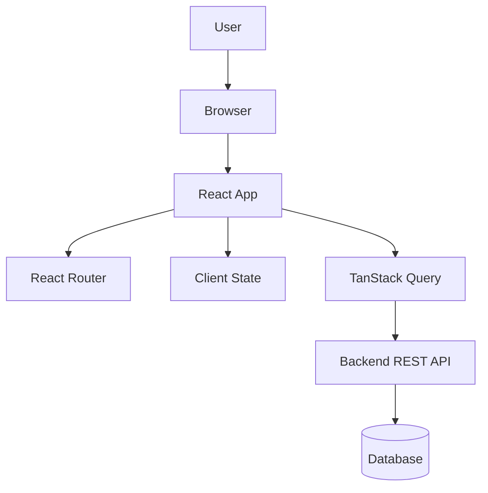

Production React apps usually separate:

```text
UI state
Server state
Routing
Forms
Authentication
Error handling
Testing
Deployment
```

---

## 4. Create React App With Vite

Create the project:

```bash
npm create vite@latest react-production-app -- --template react-ts
cd react-production-app
npm install
npm run dev
```

Open:

```text
http://localhost:5173
```

---

## 5. Recommended Production Stack

Use this stack:

```text
React
TypeScript
Vite
React Router
TanStack Query
Axios
React Hook Form
Zod
Zustand
Tailwind CSS
Vitest
React Testing Library
Playwright
Docker
Nginx
GitHub Actions
```

Install core libraries:

```bash
npm install react-router-dom axios @tanstack/react-query react-hook-form zod @hookform/resolvers zustand
```

Install development tools:

```bash
npm install -D vitest jsdom @testing-library/react @testing-library/jest-dom @testing-library/user-event
npm install -D eslint prettier
npm install -D playwright
```

---

## 6. Project Folder Structure

Use feature-based architecture.

```text
src/
├── app/
│   ├── App.tsx
│   ├── router.tsx
│   ├── queryClient.ts
│   └── providers.tsx
├── assets/
├── components/
│   ├── layout/
│   └── ui/
├── config/
│   └── env.ts
├── features/
│   ├── auth/
│   ├── dashboard/
│   ├── projects/
│   ├── tasks/
│   └── users/
├── hooks/
├── lib/
│   ├── axiosClient.ts
│   └── storage.ts
├── types/
├── utils/
├── main.tsx
└── index.css
```

Why feature-based structure?

```text
Easy to scale
Easy to maintain
Easy for teams
Easy to test
Easy to delete features
```

---

## 7. Clean Initial Setup

Replace `src/main.tsx`:

```tsx
import React from "react";
import ReactDOM from "react-dom/client";
import { App } from "./app/App";
import "./index.css";

ReactDOM.createRoot(document.getElementById("root")!).render(
  <React.StrictMode>
    <App />
  </React.StrictMode>
);
```

Create `src/app/App.tsx`:

```tsx
export function App() {
  return <h1>React Production App</h1>;
}
```

---

## 8. TypeScript Basics for React

Basic types:

```tsx
type User = {
  id: string;
  name: string;
  email: string;
};

type Status = "ACTIVE" | "INACTIVE";
```

Component props:

```tsx
type UserCardProps = {
  user: User;
  onSelect: (id: string) => void;
};

export function UserCard({ user, onSelect }: UserCardProps) {
  return (
    <button onClick={() => onSelect(user.id)}>
      {user.name}
    </button>
  );
}
```

Use `type` for most app models. Use `interface` when you expect extension.

---

## 9. Components

A component is a reusable UI block.

```tsx
type ButtonProps = {
  label: string;
};

export function Button({ label }: ButtonProps) {
  return <button>{label}</button>;
}
```

Production rule:

```text
Keep components small.
Keep business logic out of UI components.
Move reusable logic to hooks.
```

---

## 10. Props

Props pass data from parent to child.

```tsx
type ProjectCardProps = {
  title: string;
  description: string;
};

export function ProjectCard({ title, description }: ProjectCardProps) {
  return (
    <article>
      <h2>{title}</h2>
      <p>{description}</p>
    </article>
  );
}
```

Usage:

```tsx
<ProjectCard
  title="Search Platform"
  description="Distributed search project"
/>
```

---

## 11. State

Use state when UI changes over time.

```tsx
import { useState } from "react";

export function Counter() {
  const [count, setCount] = useState(0);

  return (
    <button onClick={() => setCount(count + 1)}>
      Count: {count}
    </button>
  );
}
```

Production rule:

```text
Keep state as local as possible.
Do not put everything in global state.
```

---

## 12. Events

```tsx
export function SearchBox() {
  function handleChange(event: React.ChangeEvent<HTMLInputElement>) {
    console.log(event.target.value);
  }

  return <input onChange={handleChange} />;
}
```

Form submit:

```tsx
function handleSubmit(event: React.FormEvent<HTMLFormElement>) {
  event.preventDefault();
}
```

---

## 13. Conditional Rendering

```tsx
type Props = {
  isLoading: boolean;
  error?: string;
};

export function StatusMessage({ isLoading, error }: Props) {
  if (isLoading) {
    return <p>Loading...</p>;
  }

  if (error) {
    return <p>{error}</p>;
  }

  return <p>Ready</p>;
}
```

---

## 14. Lists and Keys

```tsx
type Project = {
  id: string;
  name: string;
};

type Props = {
  projects: Project[];
};

export function ProjectList({ projects }: Props) {
  return (
    <ul>
      {projects.map((project) => (
        <li key={project.id}>{project.name}</li>
      ))}
    </ul>
  );
}
```

Production rule:

```text
Never use array index as key for dynamic lists.
Use stable IDs.
```

---

## 15. Hooks Overview

Important hooks:

```text
useState
useEffect
useMemo
useCallback
useRef
useReducer
useContext
```

Production rule:

```text
Do not overuse hooks.
Prefer simple code first.
```

---

## 16. useEffect

Use `useEffect` for side effects.

```tsx
import { useEffect, useState } from "react";

export function WindowSize() {
  const [width, setWidth] = useState(window.innerWidth);

  useEffect(() => {
    function handleResize() {
      setWidth(window.innerWidth);
    }

    window.addEventListener("resize", handleResize);

    return () => {
      window.removeEventListener("resize", handleResize);
    };
  }, []);

  return <p>Width: {width}</p>;
}
```

Avoid using `useEffect` for server data fetching in production. Prefer TanStack Query.

---

## 17. useMemo and useCallback

Use `useMemo` for expensive derived values.

```tsx
import { useMemo } from "react";

type Props = {
  items: number[];
};

export function ExpensiveTotal({ items }: Props) {
  const total = useMemo(() => {
    return items.reduce((sum, item) => sum + item, 0);
  }, [items]);

  return <p>Total: {total}</p>;
}
```

Use `useCallback` for stable function references when needed.

```tsx
import { useCallback } from "react";

export function Parent() {
  const handleSave = useCallback(() => {
    console.log("saved");
  }, []);

  return <button onClick={handleSave}>Save</button>;
}
```

Do not use these everywhere. They are performance tools, not default requirements.

---

## 18. useRef

Use `useRef` for DOM access or mutable values that should not re-render.

```tsx
import { useRef } from "react";

export function FocusInput() {
  const inputRef = useRef<HTMLInputElement>(null);

  function focusInput() {
    inputRef.current?.focus();
  }

  return (
    <>
      <input ref={inputRef} />
      <button onClick={focusInput}>Focus</button>
    </>
  );
}
```

---

## 19. Custom Hooks

Custom hooks reuse logic.

```tsx
import { useEffect, useState } from "react";

export function useDebounce<T>(value: T, delayMs: number) {
  const [debouncedValue, setDebouncedValue] = useState(value);

  useEffect(() => {
    const timerId = window.setTimeout(() => {
      setDebouncedValue(value);
    }, delayMs);

    return () => {
      window.clearTimeout(timerId);
    };
  }, [value, delayMs]);

  return debouncedValue;
}
```

Usage:

```tsx
const debouncedSearch = useDebounce(search, 400);
```

---

## 20. Routing With React Router

Create `src/app/router.tsx`:

```tsx
import { createBrowserRouter } from "react-router-dom";
import { LoginPage } from "../features/auth/LoginPage";
import { DashboardPage } from "../features/dashboard/DashboardPage";
import { ProjectsPage } from "../features/projects/ProjectsPage";

export const router = createBrowserRouter([
  {
    path: "/login",
    element: <LoginPage />,
  },
  {
    path: "/",
    element: <DashboardPage />,
  },
  {
    path: "/projects",
    element: <ProjectsPage />,
  },
]);
```

Update `src/app/App.tsx`:

```tsx
import { RouterProvider } from "react-router-dom";
import { router } from "./router";

export function App() {
  return <RouterProvider router={router} />;
}
```

---

## 21. Layouts

Create `src/components/layout/AppLayout.tsx`:

```tsx
import { Link, Outlet } from "react-router-dom";

export function AppLayout() {
  return (
    <div>
      <header>
        <nav>
          <Link to="/">Dashboard</Link>
          <Link to="/projects">Projects</Link>
        </nav>
      </header>

      <main>
        <Outlet />
      </main>
    </div>
  );
}
```

Router with layout:

```tsx
import { createBrowserRouter } from "react-router-dom";
import { AppLayout } from "../components/layout/AppLayout";
import { DashboardPage } from "../features/dashboard/DashboardPage";
import { ProjectsPage } from "../features/projects/ProjectsPage";
import { LoginPage } from "../features/auth/LoginPage";

export const router = createBrowserRouter([
  {
    path: "/login",
    element: <LoginPage />,
  },
  {
    path: "/",
    element: <AppLayout />,
    children: [
      {
        index: true,
        element: <DashboardPage />,
      },
      {
        path: "projects",
        element: <ProjectsPage />,
      },
    ],
  },
]);
```

---

## 22. Protected Routes

```tsx
import { Navigate, Outlet } from "react-router-dom";
import { authStorage } from "../../lib/storage";

export function ProtectedRoute() {
  const token = authStorage.getAccessToken();

  if (!token) {
    return <Navigate to="/login" replace />;
  }

  return <Outlet />;
}
```

Router:

```tsx
{
  path: "/",
  element: <ProtectedRoute />,
  children: [
    {
      element: <AppLayout />,
      children: [
        {
          index: true,
          element: <DashboardPage />,
        },
        {
          path: "projects",
          element: <ProjectsPage />,
        },
      ],
    },
  ],
}
```

---

## 23. API Integration With Axios

Create `src/lib/axiosClient.ts`:

```tsx
import axios from "axios";
import { env } from "../config/env";
import { authStorage } from "./storage";

export const axiosClient = axios.create({
  baseURL: env.apiBaseUrl,
  timeout: 10000,
});

axiosClient.interceptors.request.use((config) => {
  const token = authStorage.getAccessToken();

  if (token) {
    config.headers.Authorization = `Bearer ${token}`;
  }

  return config;
});
```

Create `src/lib/storage.ts`:

```tsx
const ACCESS_TOKEN_KEY = "accessToken";

export const authStorage = {
  getAccessToken() {
    return localStorage.getItem(ACCESS_TOKEN_KEY);
  },

  setAccessToken(token: string) {
    localStorage.setItem(ACCESS_TOKEN_KEY, token);
  },

  clear() {
    localStorage.removeItem(ACCESS_TOKEN_KEY);
  },
};
```

---

## 24. Environment Variables

Create `.env.development`:

```bash
VITE_API_BASE_URL=http://localhost:8080/api/v1
```

Create `.env.production`:

```bash
VITE_API_BASE_URL=https://api.example.com/api/v1
```

Create `src/config/env.ts`:

```tsx
export const env = {
  apiBaseUrl: import.meta.env.VITE_API_BASE_URL as string,
};
```

Production rule:

```text
Only variables prefixed with VITE_ are exposed to the client.
Never put secrets in frontend environment variables.
```

---

## 25. Server State With TanStack Query

Create `src/app/queryClient.ts`:

```tsx
import { QueryClient } from "@tanstack/react-query";

export const queryClient = new QueryClient({
  defaultOptions: {
    queries: {
      retry: 1,
      staleTime: 30000,
      refetchOnWindowFocus: false,
    },
  },
});
```

Create `src/app/providers.tsx`:

```tsx
import { QueryClientProvider } from "@tanstack/react-query";
import { queryClient } from "./queryClient";

type Props = {
  children: React.ReactNode;
};

export function AppProviders({ children }: Props) {
  return <QueryClientProvider client={queryClient}>{children}</QueryClientProvider>;
}
```

Update `main.tsx`:

```tsx
import React from "react";
import ReactDOM from "react-dom/client";
import { App } from "./app/App";
import { AppProviders } from "./app/providers";
import "./index.css";

ReactDOM.createRoot(document.getElementById("root")!).render(
  <React.StrictMode>
    <AppProviders>
      <App />
    </AppProviders>
  </React.StrictMode>
);
```

Project API:

```tsx
import { axiosClient } from "../../lib/axiosClient";

export type Project = {
  id: string;
  name: string;
  description: string;
};

export async function getProjects(): Promise<Project[]> {
  const response = await axiosClient.get<Project[]>("/projects");
  return response.data;
}
```

Query hook:

```tsx
import { useQuery } from "@tanstack/react-query";
import { getProjects } from "./projectsApi";

export function useProjects() {
  return useQuery({
    queryKey: ["projects"],
    queryFn: getProjects,
  });
}
```

Page:

```tsx
import { useProjects } from "./useProjects";

export function ProjectsPage() {
  const { data, isLoading, isError } = useProjects();

  if (isLoading) {
    return <p>Loading projects...</p>;
  }

  if (isError) {
    return <p>Failed to load projects.</p>;
  }

  return (
    <ul>
      {data?.map((project) => (
        <li key={project.id}>{project.name}</li>
      ))}
    </ul>
  );
}
```

---

## 26. Mutations

Create project API:

```tsx
import { axiosClient } from "../../lib/axiosClient";
import type { Project } from "./projectsApi";

export type CreateProjectInput = {
  name: string;
  description: string;
};

export async function createProject(input: CreateProjectInput): Promise<Project> {
  const response = await axiosClient.post<Project>("/projects", input);
  return response.data;
}
```

Mutation hook:

```tsx
import { useMutation, useQueryClient } from "@tanstack/react-query";
import { createProject } from "./createProjectApi";

export function useCreateProject() {
  const queryClient = useQueryClient();

  return useMutation({
    mutationFn: createProject,
    onSuccess: () => {
      queryClient.invalidateQueries({ queryKey: ["projects"] });
    },
  });
}
```

---

## 27. Forms With React Hook Form

```tsx
import { useForm } from "react-hook-form";

type ProjectFormValues = {
  name: string;
  description: string;
};

export function ProjectForm() {
  const { register, handleSubmit } = useForm<ProjectFormValues>();

  function onSubmit(values: ProjectFormValues) {
    console.log(values);
  }

  return (
    <form onSubmit={handleSubmit(onSubmit)}>
      <input {...register("name")} placeholder="Project name" />
      <textarea {...register("description")} placeholder="Description" />
      <button type="submit">Create</button>
    </form>
  );
}
```

---

## 28. Validation With Zod

```tsx
import { z } from "zod";

export const projectSchema = z.object({
  name: z.string().min(3).max(100),
  description: z.string().max(1000),
});

export type ProjectFormValues = z.infer<typeof projectSchema>;
```

Use with React Hook Form:

```tsx
import { zodResolver } from "@hookform/resolvers/zod";
import { useForm } from "react-hook-form";
import { projectSchema, type ProjectFormValues } from "./projectSchema";

export function ProjectForm() {
  const form = useForm<ProjectFormValues>({
    resolver: zodResolver(projectSchema),
  });

  function onSubmit(values: ProjectFormValues) {
    console.log(values);
  }

  return (
    <form onSubmit={form.handleSubmit(onSubmit)}>
      <input {...form.register("name")} />
      {form.formState.errors.name && <p>{form.formState.errors.name.message}</p>}

      <textarea {...form.register("description")} />
      {form.formState.errors.description && (
        <p>{form.formState.errors.description.message}</p>
      )}

      <button type="submit">Create</button>
    </form>
  );
}
```

---

## 29. Authentication

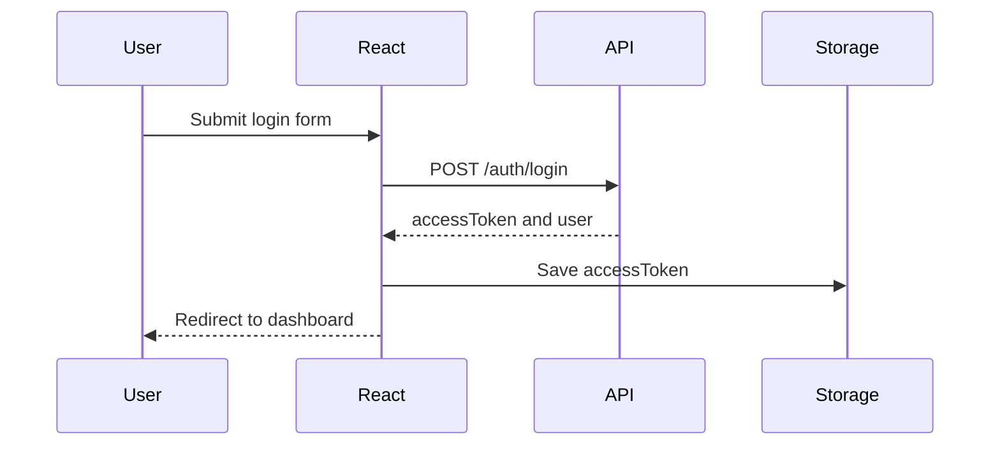

Auth API:

```tsx
import { axiosClient } from "../../lib/axiosClient";

export type LoginInput = {
  email: string;
  password: string;
};

export type LoginResponse = {
  accessToken: string;
  user: {
    id: string;
    name: string;
    role: "ADMIN" | "MANAGER" | "MEMBER";
  };
};

export async function login(input: LoginInput): Promise<LoginResponse> {
  const response = await axiosClient.post<LoginResponse>("/auth/login", input);
  return response.data;
}
```

Login hook:

```tsx
import { useMutation } from "@tanstack/react-query";
import { useNavigate } from "react-router-dom";
import { authStorage } from "../../lib/storage";
import { login } from "./authApi";

export function useLogin() {
  const navigate = useNavigate();

  return useMutation({
    mutationFn: login,
    onSuccess: (data) => {
      authStorage.setAccessToken(data.accessToken);
      navigate("/");
    },
  });
}
```

Login page:

```tsx
export function LoginPage() {
  const loginMutation = useLogin();

  function handleLogin() {
    loginMutation.mutate({
      email: "admin@example.com",
      password: "password123",
    });
  }

  return (
    <button onClick={handleLogin} disabled={loginMutation.isPending}>
      Login
    </button>
  );
}
```

---

## 30. Refresh Token Flow

Recommended secure approach:

```text
Access token: short-lived
Refresh token: stored in HttpOnly Secure cookie
Frontend: does not read refresh token
Backend: refresh endpoint issues new access token
```

Flow:

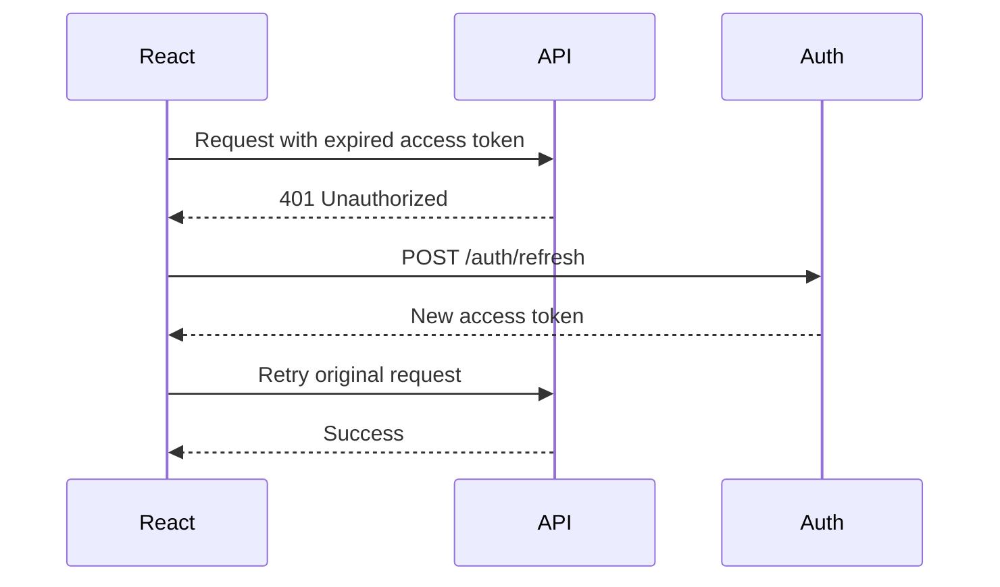

Axios refresh example:

```tsx
axiosClient.interceptors.response.use(
  (response) => response,
  async (error) => {
    const originalRequest = error.config;

    if (error.response?.status === 401 && !originalRequest._retry) {
      originalRequest._retry = true;

      const refreshResponse = await axiosClient.post("/auth/refresh");
      const newAccessToken = refreshResponse.data.accessToken;

      authStorage.setAccessToken(newAccessToken);
      originalRequest.headers.Authorization = `Bearer ${newAccessToken}`;

      return axiosClient(originalRequest);
    }

    return Promise.reject(error);
  }
);
```

---

## 31. Role-Based UI

```tsx
type Role = "ADMIN" | "MANAGER" | "MEMBER";

type CanAccessProps = {
  userRole: Role;
  allowedRoles: Role[];
  children: React.ReactNode;
};

export function CanAccess({ userRole, allowedRoles, children }: CanAccessProps) {
  if (!allowedRoles.includes(userRole)) {
    return null;
  }

  return <>{children}</>;
}
```

Usage:

```tsx
<CanAccess userRole="ADMIN" allowedRoles={["ADMIN"]}>
  <button>Delete User</button>
</CanAccess>
```

Important:

```text
Role-based UI is only for user experience.
Real authorization must happen on the backend.
```

---

## 32. Global State Management

Use local state for component-level state.

Use TanStack Query for server state.

Use Zustand for small global UI/app state.

Install:

```bash
npm install zustand
```

Example store:

```tsx
import { create } from "zustand";

type SidebarState = {
  isOpen: boolean;
  toggle: () => void;
};

export const useSidebarStore = create<SidebarState>((set) => ({
  isOpen: true,
  toggle: () => set((state) => ({ isOpen: !state.isOpen })),
}));
```

---

## 33. UI Styling

Recommended options:

```text
Tailwind CSS
Material UI
Ant Design
shadcn/ui
CSS Modules
```

Install Tailwind:

```bash
npm install -D tailwindcss @tailwindcss/vite
```

Example component:

```tsx
type ButtonProps = {
  children: React.ReactNode;
};

export function Button({ children }: ButtonProps) {
  return (
    <button className="rounded-lg bg-blue-600 px-4 py-2 text-white">
      {children}
    </button>
  );
}
```

Production UI rules:

```text
Use design tokens.
Build reusable UI components.
Keep spacing consistent.
Support mobile layouts.
Support keyboard navigation.
```

---

## 34. Error Handling

Create reusable error component:

```tsx
type ErrorMessageProps = {
  message: string;
};

export function ErrorMessage({ message }: ErrorMessageProps) {
  return <p role="alert">{message}</p>;
}
```

API error parser:

```tsx
import axios from "axios";

export function getErrorMessage(error: unknown) {
  if (axios.isAxiosError(error)) {
    return error.response?.data?.message ?? "Something went wrong";
  }

  return "Something went wrong";
}
```

Use error boundaries for render crashes.

```tsx
import { Component, type ReactNode } from "react";

type Props = {
  children: ReactNode;
};

type State = {
  hasError: boolean;
};

export class ErrorBoundary extends Component<Props, State> {
  state: State = {
    hasError: false,
  };

  static getDerivedStateFromError() {
    return {
      hasError: true,
    };
  }

  render() {
    if (this.state.hasError) {
      return <p>Something went wrong.</p>;
    }

    return this.props.children;
  }
}
```

---

## 35. Loading and Empty States

```tsx
type DataStateProps<T> = {
  isLoading: boolean;
  isError: boolean;
  data?: T[];
  children: (data: T[]) => React.ReactNode;
};

export function DataState<T>({
  isLoading,
  isError,
  data,
  children,
}: DataStateProps<T>) {
  if (isLoading) {
    return <p>Loading...</p>;
  }

  if (isError) {
    return <p>Failed to load data.</p>;
  }

  if (!data || data.length === 0) {
    return <p>No data found.</p>;
  }

  return <>{children(data)}</>;
}
```

---

## 36. Pagination Search and Filters

Query params state:

```tsx
import { useSearchParams } from "react-router-dom";

export function useProjectFilters() {
  const [searchParams, setSearchParams] = useSearchParams();

  const page = Number(searchParams.get("page") ?? 0);
  const search = searchParams.get("search") ?? "";

  function setSearch(searchValue: string) {
    setSearchParams({
      search: searchValue,
      page: "0",
    });
  }

  function setPage(pageValue: number) {
    setSearchParams({
      search,
      page: String(pageValue),
    });
  }

  return {
    page,
    search,
    setSearch,
    setPage,
  };
}
```

Query hook:

```tsx
export function useProjects(search: string, page: number) {
  return useQuery({
    queryKey: ["projects", search, page],
    queryFn: async () => {
      const response = await axiosClient.get("/projects", {
        params: {
          search,
          page,
          size: 10,
        },
      });

      return response.data;
    },
  });
}
```

---

## 37. File Upload

```tsx
export async function uploadFile(file: File) {
  const formData = new FormData();
  formData.append("file", file);

  const response = await axiosClient.post("/files", formData, {
    headers: {
      "Content-Type": "multipart/form-data",
    },
  });

  return response.data;
}
```

Component:

```tsx
export function FileUpload() {
  async function handleChange(event: React.ChangeEvent<HTMLInputElement>) {
    const file = event.target.files?.[0];

    if (!file) {
      return;
    }

    await uploadFile(file);
  }

  return <input type="file" onChange={handleChange} />;
}
```

Production file rules:

```text
Validate file type.
Validate file size.
Show upload progress.
Scan files on backend when required.
Store files outside the frontend app.
```

---

## 38. Performance Optimization

Common bottlenecks:

```text
Large bundles
Too many renders
Large lists
Unoptimized images
Repeated API calls
Heavy computations during render
```

Use React DevTools Profiler.

Optimization techniques:

```text
Lazy loading
Code splitting
Memoization
Virtualization
Debouncing
Caching
Prefetching
Image compression
CDN
```

---

## 39. Code Splitting

```tsx
import { lazy, Suspense } from "react";

const ProjectsPage = lazy(() =>
  import("../features/projects/ProjectsPage").then((module) => ({
    default: module.ProjectsPage,
  }))
);

export function LazyProjectsRoute() {
  return (
    <Suspense fallback={<p>Loading page...</p>}>
      <ProjectsPage />
    </Suspense>
  );
}
```

Route-level code splitting is one of the easiest production wins.

---

## 40. Virtualization

Install:

```bash
npm install @tanstack/react-virtual
```

Use virtualization for very large lists.

```tsx
import { useVirtualizer } from "@tanstack/react-virtual";
import { useRef } from "react";

type Props = {
  items: string[];
};

export function VirtualList({ items }: Props) {
  const parentRef = useRef<HTMLDivElement>(null);

  const rowVirtualizer = useVirtualizer({
    count: items.length,
    getScrollElement: () => parentRef.current,
    estimateSize: () => 40,
  });

  return (
    <div ref={parentRef} style={{ height: 400, overflow: "auto" }}>
      <div
        style={{
          height: rowVirtualizer.getTotalSize(),
          position: "relative",
        }}
      >
        {rowVirtualizer.getVirtualItems().map((virtualRow) => (
          <div
            key={virtualRow.key}
            style={{
              position: "absolute",
              top: 0,
              transform: `translateY(${virtualRow.start}px)`,
            }}
          >
            {items[virtualRow.index]}
          </div>
        ))}
      </div>
    </div>
  );
}
```

---

## 41. Accessibility

Checklist:

```text
Use semantic HTML.
Use button for actions.
Use anchor for navigation.
Add alt text for images.
Support keyboard navigation.
Use labels for inputs.
Keep color contrast readable.
Use aria attributes only when needed.
```

Accessible input:

```tsx
export function EmailInput() {
  return (
    <label>
      Email
      <input type="email" name="email" autoComplete="email" />
    </label>
  );
}
```

Accessible error:

```tsx
<p role="alert">Email is required</p>
```

---

## 42. Testing

Vitest config:

```tsx
import { defineConfig } from "vitest/config";
import react from "@vitejs/plugin-react";

export default defineConfig({
  plugins: [react()],
  test: {
    environment: "jsdom",
    setupFiles: "./src/test/setup.ts",
  },
});
```

Setup file:

```tsx
import "@testing-library/jest-dom";
```

Component test:

```tsx
import { render, screen } from "@testing-library/react";
import { Button } from "./Button";

test("renders button text", () => {
  render(<Button>Save</Button>);
  expect(screen.getByRole("button", { name: "Save" })).toBeInTheDocument();
});
```

Hook test:

```tsx
import { renderHook } from "@testing-library/react";
import { useDebounce } from "./useDebounce";

test("returns initial value", () => {
  const { result } = renderHook(() => useDebounce("hello", 300));
  expect(result.current).toBe("hello");
});
```

---

## 43. End-to-End Testing

Install Playwright:

```bash
npx playwright install
```

Example test:

```tsx
import { test, expect } from "@playwright/test";

test("login page loads", async ({ page }) => {
  await page.goto("/login");
  await expect(page.getByRole("button", { name: "Login" })).toBeVisible();
});
```

Run:

```bash
npx playwright test
```

---

## 44. Linting and Formatting

Install:

```bash
npm install -D eslint prettier eslint-config-prettier
```

Package scripts:

```json
{
  "scripts": {
    "dev": "vite",
    "build": "tsc -b && vite build",
    "preview": "vite preview",
    "test": "vitest",
    "lint": "eslint src",
    "format": "prettier --write ."
  }
}
```

Prettier config:

```json
{
  "semi": true,
  "singleQuote": false,
  "printWidth": 90
}
```

---

## 45. Build for Production

Run:

```bash
npm run build
```

Preview production build:

```bash
npm run preview
```

Output:

```text
dist/
```

Production build should be:

```text
Small
Cached
Minified
Served over HTTPS
Served through CDN when possible
```

---

## 46. Dockerize React App

Create `Dockerfile`:

```dockerfile
FROM node:20-alpine AS build

WORKDIR /app

COPY package*.json ./
RUN npm ci

COPY . .
RUN npm run build

FROM nginx:alpine

COPY --from=build /app/dist /usr/share/nginx/html

EXPOSE 80

CMD ["nginx", "-g", "daemon off;"]
```

Build:

```bash
docker build -t react-production-app .
```

Run:

```bash
docker run -p 3000:80 react-production-app
```

---

## 47. Nginx Configuration

For React Router, configure fallback to `index.html`.

Create `nginx.conf`:

```nginx
server {
    listen 80;

    server_name _;

    root /usr/share/nginx/html;
    index index.html;

    location / {
        try_files $uri $uri/ /index.html;
    }

    location /assets/ {
        expires 1y;
        add_header Cache-Control "public, immutable";
    }
}
```

Update Dockerfile:

```dockerfile
FROM node:20-alpine AS build

WORKDIR /app

COPY package*.json ./
RUN npm ci

COPY . .
RUN npm run build

FROM nginx:alpine

COPY nginx.conf /etc/nginx/conf.d/default.conf
COPY --from=build /app/dist /usr/share/nginx/html

EXPOSE 80

CMD ["nginx", "-g", "daemon off;"]
```

---

## 48. CI CD Pipeline

Create `.github/workflows/react-ci.yml`:

```yaml
name: React CI

on:
  push:
    branches:
      - main
  pull_request:

jobs:
  react:
    runs-on: ubuntu-latest

    steps:
      - name: Checkout source
        uses: actions/checkout@v4

      - name: Setup Node.js
        uses: actions/setup-node@v4
        with:
          node-version: 20

      - name: Install dependencies
        run: npm ci

      - name: Run lint
        run: npm run lint

      - name: Run tests
        run: npm test

      - name: Build app
        run: npm run build
```

---

## 49. Monitoring and Analytics

Production monitoring options:

```text
Sentry for frontend errors
Google Analytics or Plausible for analytics
LogRocket or OpenReplay for session replay
Web Vitals for performance
Browser console logging only in development
```

Web Vitals install:

```bash
npm install web-vitals
```

Example:

```tsx
import { onCLS, onINP, onLCP } from "web-vitals";

onCLS(console.log);
onINP(console.log);
onLCP(console.log);
```

Track:

```text
LCP
CLS
INP
Bundle size
API latency
JavaScript errors
Route load time
```

---

## 50. Security Checklist

Frontend security:

```text
Do not store secrets in frontend.
Prefer HttpOnly Secure cookies for refresh tokens.
Validate all user input.
Escape untrusted HTML.
Avoid dangerouslySetInnerHTML.
Use HTTPS.
Configure CSP headers.
Do not log tokens.
Use short-lived access tokens.
Sanitize file names.
Keep dependencies updated.
```

Check dependencies:

```bash
npm audit
```

---

## 51. High-Scale Architecture

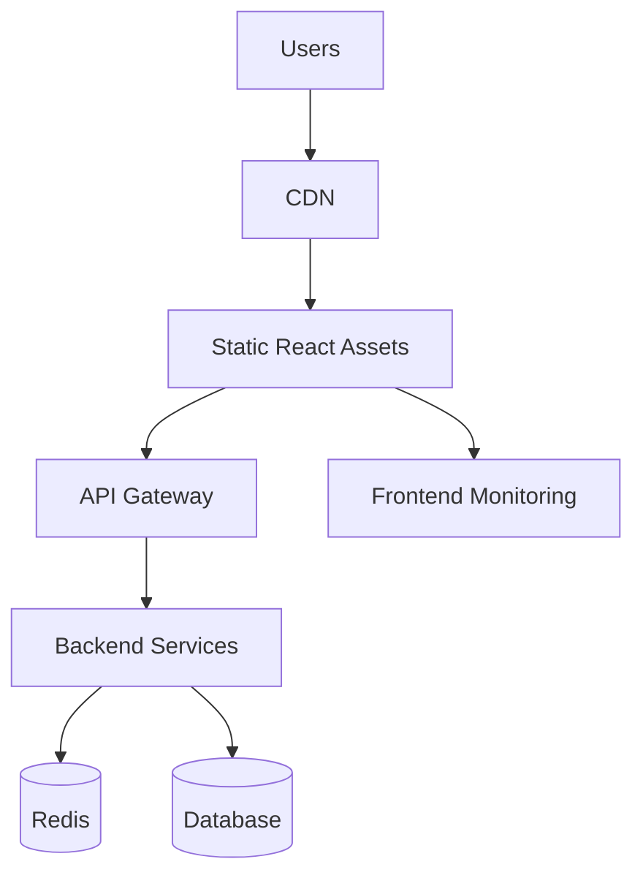

High-scale frontend techniques:

```text
CDN caching
Asset fingerprinting
Lazy loading
Route splitting
React Query caching
Pagination
Virtualization
Debounced search
Image optimization
Error boundaries
Monitoring
Feature flags
A/B testing
```

---

## 52. Production Checklist

Before production:

```text
Build passes
Tests pass
Lint passes
Environment variables configured
API base URL configured
HTTPS enabled
CSP configured
Sentry configured
Bundle size checked
Routes work after refresh
Error boundary added
Loading states added
Empty states added
Accessibility checked
Docker image builds
CI/CD pipeline works
```

---

## 53. Final Roadmap

Beginner:

```text
HTML
CSS
JavaScript
TypeScript basics
React components
Props
State
Events
Lists
Forms
```

Intermediate:

```text
React Router
Hooks
Custom hooks
Axios
React Query
React Hook Form
Zod
Authentication
Protected routes
```

Advanced:

```text
Performance optimization
Testing
Code splitting
Virtualization
Docker
CI/CD
Accessibility
Monitoring
Security
High-scale architecture
```

Production mindset:

```text
Small components
Typed APIs
Clear folder structure
Good error handling
Good loading states
Testing
Security
Performance
Observability
Maintainability
```


---

# Deep Explanation Addendum

This section explains WHY each major React production concept exists, HOW it works internally, and WHEN to use it.

---

# A. How React Actually Works

## React Rendering Flow

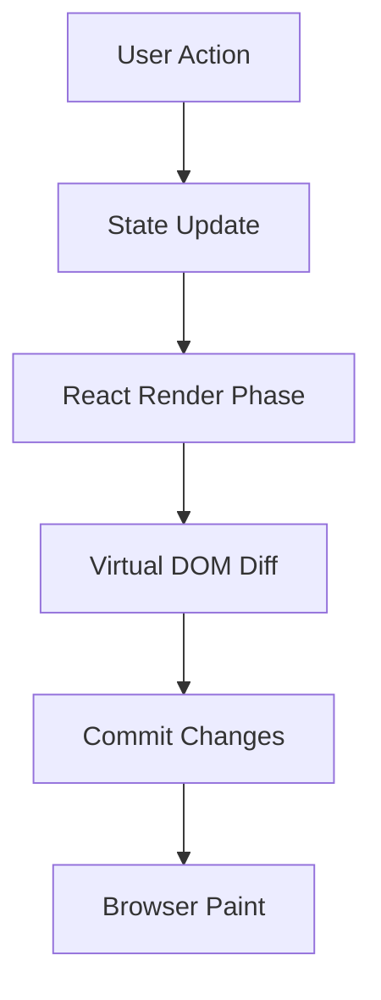

## Explanation

React does not directly update the DOM every time.

Instead:

1. State changes
2. React creates a new Virtual DOM
3. React compares old vs new Virtual DOM
4. React updates only changed elements
5. Browser repaints only necessary parts

This makes React fast.

---

# B. Component Lifecycle

## Lifecycle Diagram

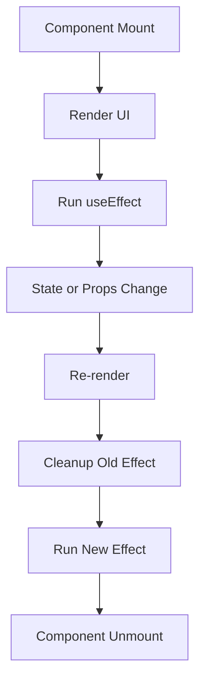

## Why useEffect Exists

React components should stay pure.

But applications need side effects:

- API calls
- Timers
- WebSocket connections
- Browser events
- Local storage

`useEffect` handles these side effects safely.

---

# C. Why State Exists

Without state:

```text
UI cannot react to changes.
```

State allows dynamic UI.

Example:

```text
Counter value
Form input
Modal open state
Loading state
Search text
```

## State Flow

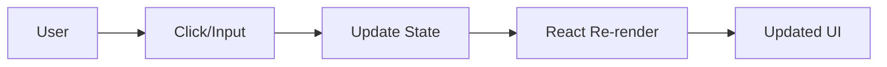

---

# D. Local State vs Global State

## Local State

Use for:

- Input field
- Modal visibility
- Dropdown state

```tsx
const [open, setOpen] = useState(false);
```

## Global State

Use for:

- Authentication
- Theme
- Sidebar state
- Shared app state

## Architecture

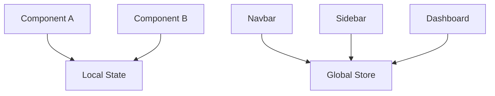

---

# E. Why React Query Exists

Traditional React data fetching has problems:

```text
Duplicate requests
Manual loading state
Manual caching
Race conditions
Refetch issues
Complex synchronization
```

React Query solves these.

## React Query Flow

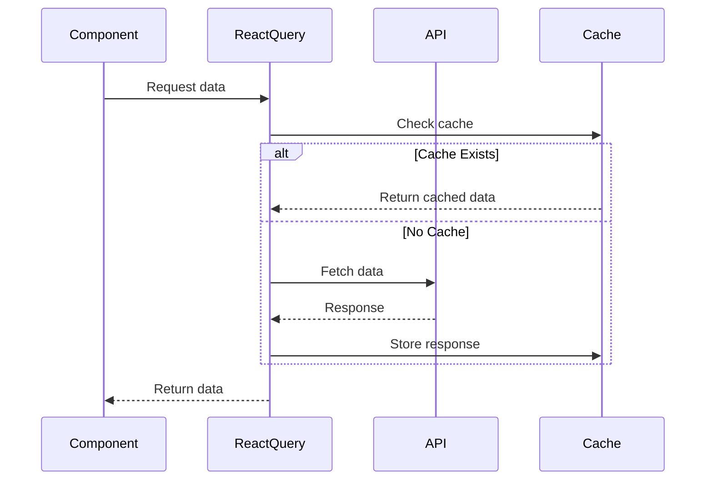

---

# F. Why Routing Exists

Single Page Applications do not reload full pages.

Instead:

```text
React changes components based on URL.
```

## Routing Flow

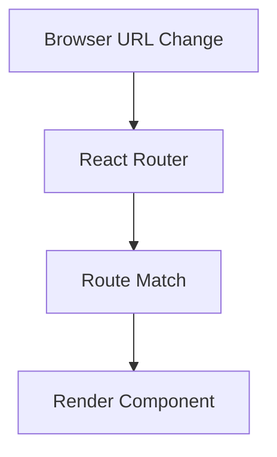

Example:

```text
/projects
/users
/tasks
/settings
```

Each route maps to a React component.

---

# G. Why Protected Routes Exist

Frontend apps must prevent unauthorized page access.

## Authentication Flow

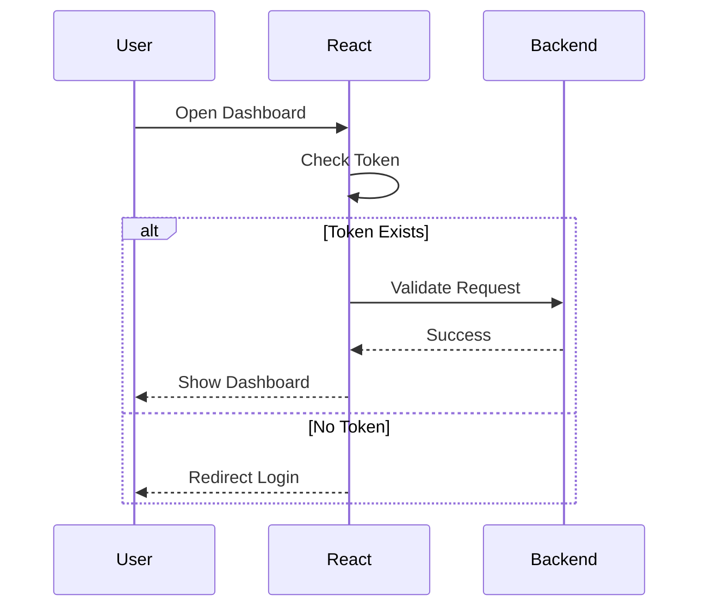

Protected routes improve security and user experience.

---

# H. Why Axios Interceptors Exist

Without interceptors:

```text
Every API call must manually attach tokens.
```

Interceptors automate this.

## Request Interceptor Flow

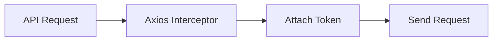

---

# I. Why Refresh Tokens Exist

Access tokens expire quickly.

Refresh tokens allow silent re-login.

## Token System

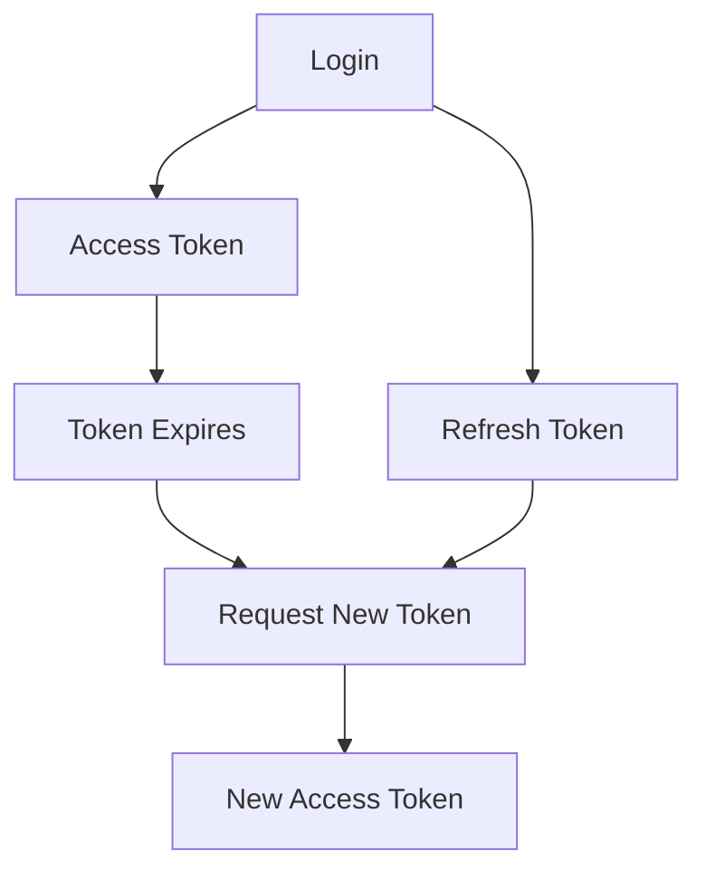

Benefits:

```text
Better security
Short-lived access tokens
Automatic session renewal
```

---

# J. Why Feature-Based Folder Structure Exists

Bad structure:

```text
components/
hooks/
pages/
utils/
```

Problem:

```text
Huge projects become difficult to navigate.
```

Feature-based architecture groups related code together.

## Feature Architecture

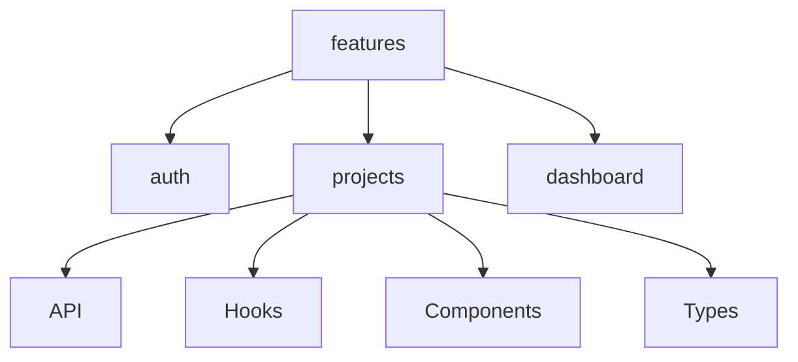

Benefits:

```text
Scalable
Maintainable
Easy team collaboration
Easy code ownership
```

---

# K. Why Memoization Exists

React re-renders frequently.

Expensive calculations can slow applications.

## useMemo Flow

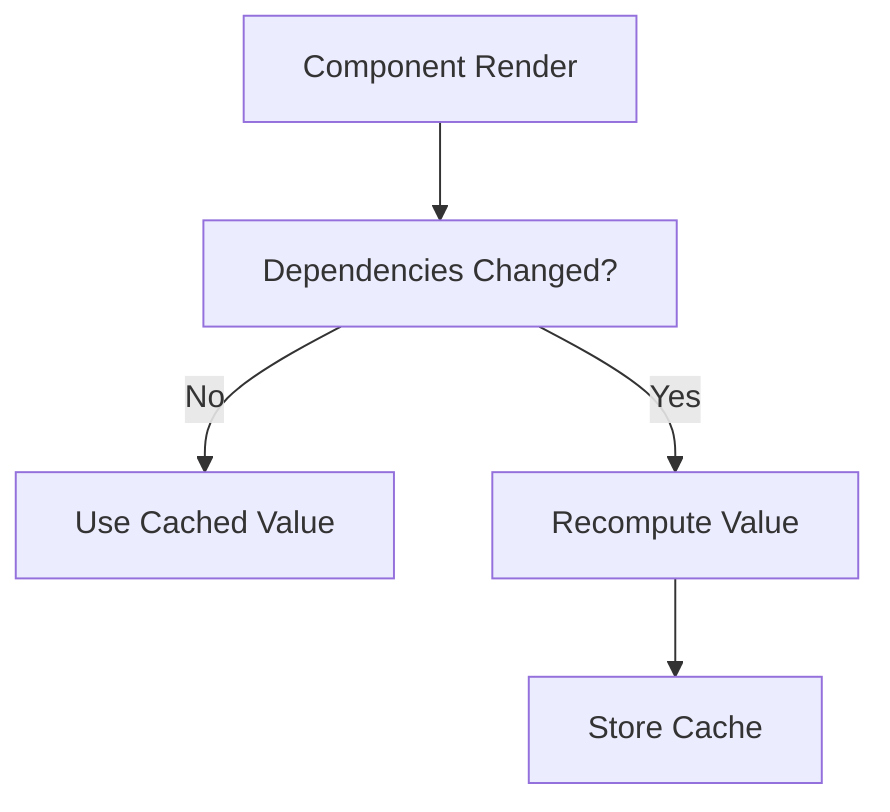

---

# L. Why useCallback Exists

Functions recreate on every render.

This can cause child re-renders.

## useCallback Flow

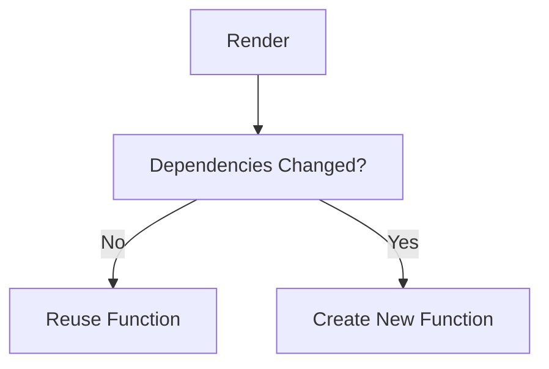

---

# M. Why Virtualization Exists

Large lists are expensive.

Example:

```text
100,000 rows
```

Rendering all rows freezes UI.

## Virtualization Flow

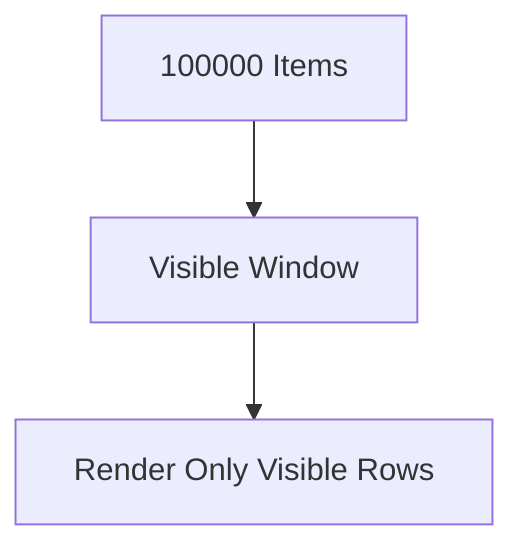

Only visible rows render.

Benefits:

```text
Lower memory
Faster rendering
Smooth scrolling
```

---

# N. Why Code Splitting Exists

Large bundles slow initial loading.

## Without Code Splitting

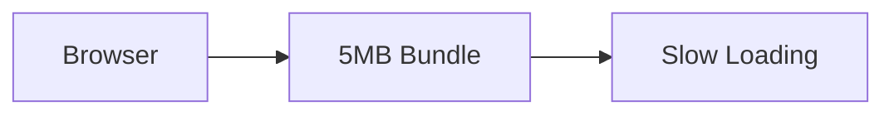

## With Code Splitting

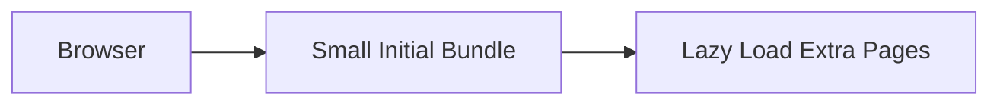

Benefits:

```text
Faster startup
Lower bandwidth
Better performance
```

---

# O. Why Docker Exists

Docker guarantees consistent environments.

## Docker Architecture

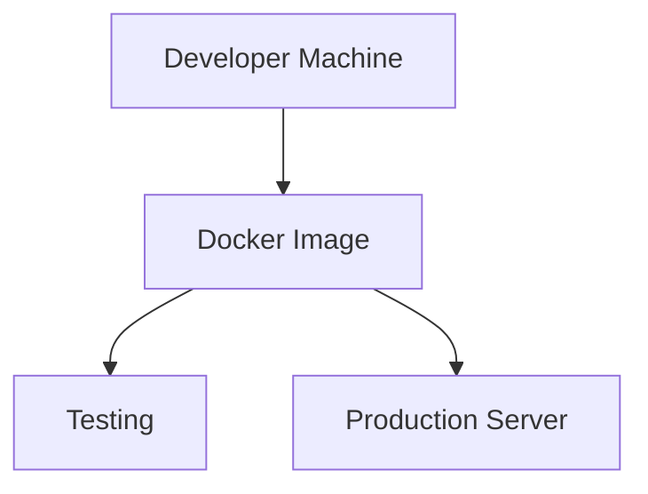

Benefits:

```text
Same environment everywhere
Easy deployment
Reproducible builds
Isolation
```

---

# P. Why CI/CD Exists

Manual deployment is risky.

CI/CD automates:

```text
Testing
Building
Linting
Deployment
```

## CI/CD Flow

```mermaid
flowchart TD
    Commit["Git Commit"] --> GitHub["GitHub"]
    GitHub --> Pipeline["CI Pipeline"]
    Pipeline --> Test["Run Tests"]
    Test --> Build["Build App"]
    Build --> Deploy["Deploy"]
```

---

# Q. Why CDN Exists

Static assets should be served close to users.

## CDN Flow

```mermaid
flowchart TD
    User["User"] --> NearbyCDN["Nearby CDN Server"]
    NearbyCDN --> Assets["Static Assets"]
```

Benefits:

```text
Faster loading
Lower server load
Global scaling
```

---

# R. Why Nginx Exists

Nginx serves static files efficiently.

## Request Flow

```mermaid
flowchart LR
    Browser["Browser"] --> Nginx["Nginx"]
    Nginx --> ReactFiles["React Build Files"]
```

Nginx handles:

```text
Compression
Caching
HTTPS
Static serving
Load balancing
```

---

# S. Why Error Boundaries Exist

React crashes can break the whole application.

Error boundaries isolate failures.

## Error Boundary Flow

```mermaid
flowchart TD
    Component["Component"] --> Error["Runtime Error"]

    Error --> Boundary["Error Boundary"]

    Boundary --> Fallback["Fallback UI"]
```

Benefits:

```text
Prevent white screen
Graceful recovery
Better user experience
```

---

# T. React Rendering Optimization Strategy

## Rendering Optimization Pipeline

```mermaid
flowchart TD
    State["State Update"] --> Check["Need Re-render?"]

    Check --> Memo["Memoization"]
    Memo --> Split["Code Splitting"]
    Split --> Virtual["Virtualization"]
    Virtual --> Lazy["Lazy Loading"]

    Lazy --> Fast["Fast UI"]
```

---

# U. Production Frontend Architecture

## Enterprise Frontend Architecture

```mermaid
flowchart TD
    User["Users"] --> CDN["CDN"]

    CDN --> Nginx["Nginx"]

    Nginx --> React["React App"]

    React --> Router["React Router"]
    React --> Query["React Query"]
    React --> Store["Global Store"]

    Query --> Backend["Backend API"]

    Backend --> Redis["Redis Cache"]
    Backend --> Database["Database"]
```

---

# V. Complete Authentication Architecture

```mermaid
sequenceDiagram
    participant User
    participant React
    participant Backend
    participant Database

    User->>React: Login

    React->>Backend: POST /login

    Backend->>Database: Verify User

    Database-->>Backend: User Valid

    Backend-->>React: Access Token

    React-->>User: Dashboard

    User->>React: Open Protected Page

    React->>Backend: API Request with Token

    Backend-->>React: Authorized Data
```

---

# W. Frontend Performance Checklist

## Rendering

```text
Avoid unnecessary state
Avoid deep prop drilling
Use memoization carefully
Split large components
Virtualize huge lists
```

## Network

```text
Cache API responses
Use pagination
Use debouncing
Compress assets
Use CDN
```

## Bundle

```text
Tree shaking
Lazy loading
Code splitting
Minification
Compression
```

---

# X. React Learning Order

## Beginner

```text
HTML
CSS
JavaScript
TypeScript
React Basics
Components
Props
State
Events
Lists
```

## Intermediate

```text
Hooks
Routing
Forms
Validation
API Calls
Authentication
Protected Routes
```

## Advanced

```text
React Query
Performance Optimization
Virtualization
Testing
Docker
CI/CD
Security
Architecture
Scaling
```

## Expert

```text
Micro Frontends
SSR
Streaming
Edge Rendering
Advanced Caching
Design Systems
Frontend Observability
```


---

# React Core Features Explained Diagrammatically

This section explains React features one by one with:

```text
What it is
Why it exists
How it works
Diagram
Code example
Common mistake
```

---

## 54. React Component

### What

A component is a reusable UI function.

### Why

Instead of writing one huge page, React lets you split UI into small reusable parts.

### How it works

A component receives input, called props, and returns UI.

```mermaid
flowchart TD
    Props["Props Input"] --> Component["React Component"]
    Component --> JSX["Returns JSX"]
    JSX --> UI["Rendered UI"]
```

### Example

```tsx
type WelcomeProps = {
  name: string;
};

export function Welcome({ name }: WelcomeProps) {
  return <h1>Hello {name}</h1>;
}
```

### Common mistake

Do not put too much business logic inside UI components.

---

## 55. Props

### What

Props are data passed from parent component to child component.

### Why

Props make components reusable and configurable.

### How it works

```mermaid
flowchart TD
    Parent["Parent Component"] -->|passes props| Child["Child Component"]
    Child --> UI["Render using props"]
```

### Example

```tsx
type UserCardProps = {
  name: string;
  email: string;
};

function UserCard({ name, email }: UserCardProps) {
  return (
    <div>
      <h2>{name}</h2>
      <p>{email}</p>
    </div>
  );
}

export function UsersPage() {
  return <UserCard name="Amit" email="amit@example.com" />;
}
```

### Common mistake

Do not mutate props.

Wrong:

```tsx
props.name = "New Name";
```

Correct:

```tsx
const displayName = props.name.toUpperCase();
```

---

## 56. State and useState

### What

`useState` stores data that can change over time inside a component.

### Why

Without state, UI cannot update dynamically.

Examples:

```text
Counter value
Input value
Modal open or closed
Selected tab
Search text
```

### How it works

```mermaid
flowchart TD
    InitialState["Initial State"] --> Render["Component Renders"]
    Render --> UserAction["User Action"]
    UserAction --> SetState["setState Called"]
    SetState --> NewState["React Stores New State"]
    NewState --> ReRender["Component Re-renders"]
    ReRender --> UpdatedUI["Updated UI"]
```

### Example

```tsx
import { useState } from "react";

export function Counter() {
  const [count, setCount] = useState(0);

  function increment() {
    setCount(count + 1);
  }

  return (
    <button onClick={increment}>
      Count: {count}
    </button>
  );
}
```

### Mental model

```text
state change -> re-render -> updated UI
```

### Common mistake

State updates are not immediately visible in the same line.

```tsx
setCount(count + 1);
console.log(count); // old value
```

Use functional update when new state depends on old state:

```tsx
setCount((previousCount) => previousCount + 1);
```

---

## 57. Multiple State Updates

### What

React can batch multiple state updates.

### Why

Batching improves performance by reducing unnecessary renders.

### How it works

```mermaid
flowchart TD
    Click["Button Click"] --> UpdateOne["setState 1"]
    Click --> UpdateTwo["setState 2"]
    Click --> UpdateThree["setState 3"]

    UpdateOne --> Batch["React Batches Updates"]
    UpdateTwo --> Batch
    UpdateThree --> Batch

    Batch --> SingleRender["One Re-render"]
```

### Example

```tsx
function handleClick() {
  setFirstName("John");
  setLastName("Doe");
  setAge(30);
}
```

React may combine these updates into one render.

---

## 58. Derived State

### What

Derived state is data calculated from existing state or props.

### Why

You should avoid storing duplicate state.

### Diagram

```mermaid
flowchart TD
    State["Original State"] --> Calculation["Calculate Derived Value"]
    Calculation --> UI["Render UI"]
```

### Bad example

```tsx
const [items, setItems] = useState(["A", "B"]);
const [count, setCount] = useState(2);
```

### Good example

```tsx
const [items, setItems] = useState(["A", "B"]);
const count = items.length;
```

### Rule

If something can be calculated during render, do not store it in state.

---

## 59. Events

### What

Events handle user actions.

### Why

Apps need to respond to clicks, typing, submitting forms, hovering, and keyboard actions.

### How it works

```mermaid
flowchart LR
    User["User"] --> Action["Click or Type"]
    Action --> EventHandler["Event Handler"]
    EventHandler --> StateUpdate["Update State"]
    StateUpdate --> UI["UI Changes"]
```

### Example

```tsx
export function SearchInput() {
  const [search, setSearch] = useState("");

  function handleChange(event: React.ChangeEvent<HTMLInputElement>) {
    setSearch(event.target.value);
  }

  return <input value={search} onChange={handleChange} />;
}
```

---

## 60. Conditional Rendering

### What

Conditional rendering shows different UI based on conditions.

### Why

Applications need different UI for loading, error, empty, and success states.

### Diagram

```mermaid
flowchart TD
    Start["Component Render"] --> LoadingCheck{"Is Loading?"}
    LoadingCheck -->|Yes| LoadingUI["Show Loading UI"]
    LoadingCheck -->|No| ErrorCheck{"Has Error?"}
    ErrorCheck -->|Yes| ErrorUI["Show Error UI"]
    ErrorCheck -->|No| DataCheck{"Has Data?"}
    DataCheck -->|No| EmptyUI["Show Empty UI"]
    DataCheck -->|Yes| SuccessUI["Show Data UI"]
```

### Example

```tsx
function ProjectsPage() {
  if (isLoading) {
    return <p>Loading...</p>;
  }

  if (isError) {
    return <p>Something went wrong.</p>;
  }

  if (projects.length === 0) {
    return <p>No projects found.</p>;
  }

  return <ProjectList projects={projects} />;
}
```

---

## 61. Lists and Keys

### What

Lists render multiple items using `map`.

Keys help React identify each item.

### Why

React needs stable keys to update lists efficiently.

### Diagram

```mermaid
flowchart TD
    Array["Array of Data"] --> Map["map function"]
    Map --> Elements["React Elements"]
    Elements --> Keys["Stable Keys"]
    Keys --> EfficientUpdate["Efficient UI Update"]
```

### Example

```tsx
type Project = {
  id: string;
  name: string;
};

function ProjectList({ projects }: { projects: Project[] }) {
  return (
    <ul>
      {projects.map((project) => (
        <li key={project.id}>{project.name}</li>
      ))}
    </ul>
  );
}
```

### Common mistake

Avoid this for dynamic lists:

```tsx
<li key={index}>{project.name}</li>
```

Use IDs instead.

---

## 62. useEffect

### What

`useEffect` runs side effects after render.

### Why

Rendering should be pure, but apps need side effects.

Examples:

```text
API calls
Subscriptions
Timers
Local storage
Event listeners
WebSocket connections
```

### How it works

```mermaid
flowchart TD
    Render["Component Render"] --> Paint["Browser Paint"]
    Paint --> Effect["useEffect Runs"]
    Effect --> SideEffect["Run Side Effect"]
    SideEffect --> CleanupCheck{"Need Cleanup?"}
    CleanupCheck -->|Yes| Cleanup["Cleanup on unmount or dependency change"]
    CleanupCheck -->|No| Done["Done"]
```

### Example

```tsx
import { useEffect, useState } from "react";

export function PageTitle() {
  const [title, setTitle] = useState("Dashboard");

  useEffect(() => {
    document.title = title;
  }, [title]);

  return (
    <input
      value={title}
      onChange={(event) => setTitle(event.target.value)}
    />
  );
}
```

### Dependency array

```tsx
useEffect(() => {
  console.log("Runs after every render");
});

useEffect(() => {
  console.log("Runs only once after mount");
}, []);

useEffect(() => {
  console.log("Runs when userId changes");
}, [userId]);
```

### Common mistake

Do not put everything in `useEffect`.

If you can calculate it during render, calculate it during render.

---

## 63. useEffect Cleanup

### What

Cleanup removes side effects when component unmounts or dependencies change.

### Why

Prevents memory leaks and duplicate subscriptions.

### Diagram

```mermaid
sequenceDiagram
    participant Component
    participant Effect
    participant Browser

    Component->>Effect: Mount
    Effect->>Browser: Add event listener
    Component->>Effect: Unmount
    Effect->>Browser: Remove event listener
```

### Example

```tsx
useEffect(() => {
  function handleResize() {
    console.log(window.innerWidth);
  }

  window.addEventListener("resize", handleResize);

  return () => {
    window.removeEventListener("resize", handleResize);
  };
}, []);
```

---

## 64. useRef

### What

`useRef` stores a mutable value that does not cause re-render.

### Why

Use it for:

```text
DOM access
Previous value
Timer ID
Mutable value that should not trigger UI updates
```

### Diagram

```mermaid
flowchart TD
    Component["Component"] --> Ref["useRef Object"]
    Ref --> Current["ref.current"]
    Current --> NoRender["Changing ref does not re-render"]
```

### DOM Example

```tsx
import { useRef } from "react";

export function FocusInput() {
  const inputRef = useRef<HTMLInputElement>(null);

  function focusInput() {
    inputRef.current?.focus();
  }

  return (
    <>
      <input ref={inputRef} />
      <button onClick={focusInput}>Focus</button>
    </>
  );
}
```

### Common mistake

Do not use `useRef` for values that should update the UI.

Use `useState` for UI updates.

---

## 65. useMemo

### What

`useMemo` caches expensive calculated values.

### Why

Avoid recalculating expensive values on every render.

### Diagram

```mermaid
flowchart TD
    Render["Render"] --> DependencyCheck{"Dependencies Changed?"}
    DependencyCheck -->|Yes| Calculate["Calculate New Value"]
    DependencyCheck -->|No| Cached["Return Cached Value"]
    Calculate --> Store["Store in Cache"]
    Store --> Return["Return Value"]
    Cached --> Return
```

### Example

```tsx
import { useMemo } from "react";

function ProductList({ products, search }: Props) {
  const filteredProducts = useMemo(() => {
    return products.filter((product) =>
      product.name.toLowerCase().includes(search.toLowerCase())
    );
  }, [products, search]);

  return <List products={filteredProducts} />;
}
```

### Common mistake

Do not use `useMemo` everywhere.

Use it when:

```text
Calculation is expensive
Large list filtering
Preventing unnecessary child renders
```

---

## 66. useCallback

### What

`useCallback` caches a function reference.

### Why

Useful when passing functions to memoized child components.

### Diagram

```mermaid
flowchart TD
    Render["Parent Render"] --> DependencyCheck{"Dependencies Changed?"}
    DependencyCheck -->|Yes| NewFunction["Create New Function"]
    DependencyCheck -->|No| OldFunction["Reuse Old Function"]
    NewFunction --> Child["Pass to Child"]
    OldFunction --> Child
```

### Example

```tsx
import { useCallback } from "react";

function Parent() {
  const handleSave = useCallback(() => {
    console.log("Saved");
  }, []);

  return <SaveButton onSave={handleSave} />;
}
```

### Common mistake

Do not use `useCallback` unless function identity matters.

---

## 67. React.memo

### What

`React.memo` prevents child re-render when props have not changed.

### Why

Useful for expensive child components.

### Diagram

```mermaid
flowchart TD
    ParentRender["Parent Re-renders"] --> PropsCheck{"Child Props Changed?"}
    PropsCheck -->|Yes| ChildRender["Child Re-renders"]
    PropsCheck -->|No| Skip["Skip Child Render"]
```

### Example

```tsx
import { memo } from "react";

type UserCardProps = {
  name: string;
};

export const UserCard = memo(function UserCard({ name }: UserCardProps) {
  return <p>{name}</p>;
});
```

### Common mistake

`React.memo` does not help if props are always new objects or functions.

---

## 68. useContext

### What

`useContext` reads shared data from a Context Provider.

### Why

Avoid prop drilling when many components need the same data.

Examples:

```text
Theme
Logged-in user
Language
Feature flags
```

### Diagram

```mermaid
flowchart TD
    Provider["Context Provider"] --> ComponentA["Navbar"]
    Provider --> ComponentB["Sidebar"]
    Provider --> ComponentC["Dashboard"]
    ComponentA --> SharedData["Read Shared Data"]
    ComponentB --> SharedData
    ComponentC --> SharedData
```

### Example

```tsx
import { createContext, useContext } from "react";

type AuthContextValue = {
  userName: string;
};

const AuthContext = createContext<AuthContextValue | null>(null);

export function useAuth() {
  const value = useContext(AuthContext);

  if (!value) {
    throw new Error("useAuth must be used inside AuthProvider");
  }

  return value;
}
```

### Common mistake

Do not put frequently changing large state in Context because it can cause many re-renders.

---

## 69. useReducer

### What

`useReducer` manages complex state transitions.

### Why

Use it when state logic becomes too complex for multiple `useState` calls.

### Diagram

```mermaid
flowchart LR
    UI["UI Event"] --> Dispatch["dispatch action"]
    Dispatch --> Reducer["Reducer Function"]
    Reducer --> NewState["New State"]
    NewState --> Render["Re-render UI"]
```

### Example

```tsx
import { useReducer } from "react";

type State = {
  count: number;
};

type Action =
  | { type: "increment" }
  | { type: "decrement" };

function reducer(state: State, action: Action): State {
  switch (action.type) {
    case "increment":
      return { count: state.count + 1 };
    case "decrement":
      return { count: state.count - 1 };
    default:
      return state;
  }
}

export function CounterReducer() {
  const [state, dispatch] = useReducer(reducer, { count: 0 });

  return (
    <>
      <button onClick={() => dispatch({ type: "decrement" })}>-</button>
      <span>{state.count}</span>
      <button onClick={() => dispatch({ type: "increment" })}>+</button>
    </>
  );
}
```

---

## 70. Controlled Components

### What

A controlled component is an input controlled by React state.

### Why

Useful for validation, dynamic forms, and predictable form behavior.

### Diagram

```mermaid
flowchart LR
    Input["Input Field"] --> OnChange["onChange"]
    OnChange --> State["React State"]
    State --> ValueProp["value prop"]
    ValueProp --> Input
```

### Example

```tsx
import { useState } from "react";

export function ControlledInput() {
  const [email, setEmail] = useState("");

  return (
    <input
      value={email}
      onChange={(event) => setEmail(event.target.value)}
    />
  );
}
```

---

## 71. Uncontrolled Components

### What

An uncontrolled component stores its own value in the DOM.

### Why

Useful for simple forms or file inputs.

### Diagram

```mermaid
flowchart LR
    DOM["DOM Input"] --> Ref["useRef"]
    Ref --> ReadValue["Read value when needed"]
```

### Example

```tsx
import { useRef } from "react";

export function UncontrolledInput() {
  const inputRef = useRef<HTMLInputElement>(null);

  function handleSubmit() {
    console.log(inputRef.current?.value);
  }

  return (
    <>
      <input ref={inputRef} />
      <button onClick={handleSubmit}>Submit</button>
    </>
  );
}
```

---

## 72. Custom Hooks

### What

A custom hook is a function that reuses hook logic.

### Why

Avoid duplicate logic across components.

### Diagram

```mermaid
flowchart TD
    ComponentA["Component A"] --> CustomHook["Custom Hook"]
    ComponentB["Component B"] --> CustomHook
    CustomHook --> SharedLogic["Reusable Logic"]
```

### Example

```tsx
import { useEffect, useState } from "react";

export function useOnlineStatus() {
  const [isOnline, setIsOnline] = useState(navigator.onLine);

  useEffect(() => {
    function handleOnline() {
      setIsOnline(true);
    }

    function handleOffline() {
      setIsOnline(false);
    }

    window.addEventListener("online", handleOnline);
    window.addEventListener("offline", handleOffline);

    return () => {
      window.removeEventListener("online", handleOnline);
      window.removeEventListener("offline", handleOffline);
    };
  }, []);

  return isOnline;
}
```

Usage:

```tsx
const isOnline = useOnlineStatus();
```

---

## 73. React Router

### What

React Router shows different components for different URLs.

### Why

Single Page Applications need navigation without full page reloads.

### Diagram

```mermaid
flowchart TD
    URL["Browser URL"] --> Router["React Router"]
    Router --> MatchRoute["Match Route"]
    MatchRoute --> PageComponent["Render Page Component"]
```

### Example

```tsx
const router = createBrowserRouter([
  {
    path: "/",
    element: <DashboardPage />,
  },
  {
    path: "/projects",
    element: <ProjectsPage />,
  },
]);
```

---

## 74. Outlet

### What

`Outlet` is where child routes render inside a layout.

### Why

Useful for shared layout like navbar, sidebar, and footer.

### Diagram

```mermaid
flowchart TD
    Layout["App Layout"] --> Header["Header"]
    Layout --> Sidebar["Sidebar"]
    Layout --> Outlet["Outlet"]
    Outlet --> ChildPage["Child Page"]
```

### Example

```tsx
import { Outlet } from "react-router-dom";

export function AppLayout() {
  return (
    <div>
      <header>Header</header>
      <aside>Sidebar</aside>
      <main>
        <Outlet />
      </main>
    </div>
  );
}
```

---

## 75. TanStack Query useQuery

### What

`useQuery` fetches and caches server data.

### Why

It manages:

```text
Loading
Error
Success
Caching
Refetching
Retries
Synchronization
```

### Diagram

```mermaid
flowchart TD
    Component["Component"] --> UseQuery["useQuery"]
    UseQuery --> CacheCheck{"Cache exists?"}
    CacheCheck -->|Yes| CachedData["Return cached data"]
    CacheCheck -->|No| FetchAPI["Fetch from API"]
    FetchAPI --> StoreCache["Store in cache"]
    StoreCache --> ReturnData["Return data"]
```

### Example

```tsx
function useProjects() {
  return useQuery({
    queryKey: ["projects"],
    queryFn: getProjects,
  });
}
```

---

## 76. TanStack Query useMutation

### What

`useMutation` changes server data.

### Why

Used for create, update, delete operations.

### Diagram

```mermaid
sequenceDiagram
    participant Component
    participant Mutation
    participant API
    participant Cache

    Component->>Mutation: mutate input
    Mutation->>API: POST or PUT or DELETE
    API-->>Mutation: Success
    Mutation->>Cache: Invalidate related queries
    Cache-->>Component: Refetch updated data
```

### Example

```tsx
function useCreateProject() {
  const queryClient = useQueryClient();

  return useMutation({
    mutationFn: createProject,
    onSuccess: () => {
      queryClient.invalidateQueries({ queryKey: ["projects"] });
    },
  });
}
```

---

## 77. Error Boundary

### What

Error Boundary catches render-time errors in child components.

### Why

Prevents full app white screen.

### Diagram

```mermaid
flowchart TD
    Child["Child Component"] --> Error["Throws Error"]
    Error --> Boundary["Error Boundary"]
    Boundary --> Fallback["Show Fallback UI"]
```

### Example

```tsx
class ErrorBoundary extends Component<Props, State> {
  state = { hasError: false };

  static getDerivedStateFromError() {
    return { hasError: true };
  }

  render() {
    if (this.state.hasError) {
      return <p>Something went wrong.</p>;
    }

    return this.props.children;
  }
}
```

---

## 78. Suspense and Lazy Loading

### What

`lazy` loads components only when needed.

`Suspense` shows fallback UI while loading.

### Why

Reduces initial bundle size.

### Diagram

```mermaid
flowchart TD
    RouteOpen["User Opens Route"] --> LazyImport["Lazy Import Component"]
    LazyImport --> Loading["Suspense Fallback"]
    Loading --> Loaded["Component Loaded"]
    Loaded --> Render["Render Page"]
```

### Example

```tsx
const ProjectsPage = lazy(() => import("./ProjectsPage"));

function App() {
  return (
    <Suspense fallback={<p>Loading...</p>}>
      <ProjectsPage />
    </Suspense>
  );
}
```

---

## 79. Prop Drilling

### What

Prop drilling means passing props through many layers.

### Why it becomes a problem

Intermediate components receive props they do not use.

### Diagram

```mermaid
flowchart TD
    App["App"] --> Layout["Layout"]
    Layout --> Sidebar["Sidebar"]
    Sidebar --> Menu["Menu"]
    Menu --> UserName["UserName"]
```

### Solution options

```text
Context
Zustand
Redux Toolkit
Component composition
```

---

## 80. Zustand Store

### What

Zustand is a small global state library.

### Why

Useful for shared UI state without complex Redux boilerplate.

### Diagram

```mermaid
flowchart TD
    Store["Zustand Store"] --> Navbar["Navbar"]
    Store --> Sidebar["Sidebar"]
    Store --> Dashboard["Dashboard"]
```

### Example

```tsx
import { create } from "zustand";

type ThemeStore = {
  theme: "light" | "dark";
  toggleTheme: () => void;
};

export const useThemeStore = create<ThemeStore>((set) => ({
  theme: "light",
  toggleTheme: () =>
    set((state) => ({
      theme: state.theme === "light" ? "dark" : "light",
    })),
}));
```

---

## 81. React Feature Selection Guide

```mermaid
flowchart TD
    Need["What do you need?"] --> UIChange["UI changes?"]
    UIChange -->|Yes| UseState["useState"]

    Need --> SideEffect["Side effect?"]
    SideEffect -->|Yes| UseEffect["useEffect"]

    Need --> DOMAccess["DOM access?"]
    DOMAccess -->|Yes| UseRef["useRef"]

    Need --> ExpensiveCalc["Expensive calculation?"]
    ExpensiveCalc -->|Yes| UseMemo["useMemo"]

    Need --> StableFunction["Stable function reference?"]
    StableFunction -->|Yes| UseCallback["useCallback"]

    Need --> SharedData["Shared data across tree?"]
    SharedData -->|Yes| UseContext["useContext or Zustand"]

    Need --> ServerData["Server data?"]
    ServerData -->|Yes| ReactQuery["TanStack Query"]
```

---

## 82. React Hooks Quick Table

| Feature | What It Does | Use When |
|---|---|---|
| `useState` | Stores changing UI data | Counter, input, modal |
| `useEffect` | Runs side effects | API side effects, event listeners |
| `useRef` | Stores mutable value without re-render | DOM access, timer ID |
| `useMemo` | Caches calculated value | Expensive filtering or sorting |
| `useCallback` | Caches function reference | Memoized child components |
| `useContext` | Reads shared context | Theme, auth user, language |
| `useReducer` | Handles complex state transitions | Multi-step forms, complex state |
| Custom Hook | Reuses hook logic | Debounce, online status, auth |

---

## 83. Most Important Interview Explanation

Say this:

```text
React state changes trigger re-rendering. During rendering, React creates a new virtual UI representation, compares it with the previous one, and commits the minimum DOM updates. Hooks like useState manage local UI state, useEffect handles side effects after render, useRef stores mutable values without re-rendering, and useMemo/useCallback optimize expensive values and stable references. For production apps, server data should usually be handled by TanStack Query because it manages caching, loading, errors, retries, and refetching.
```
