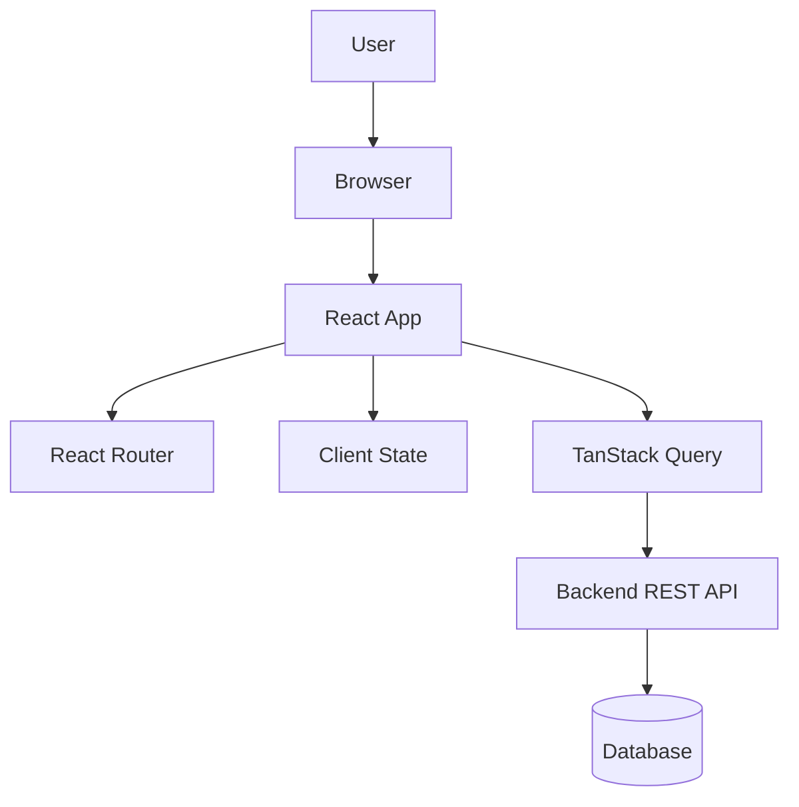
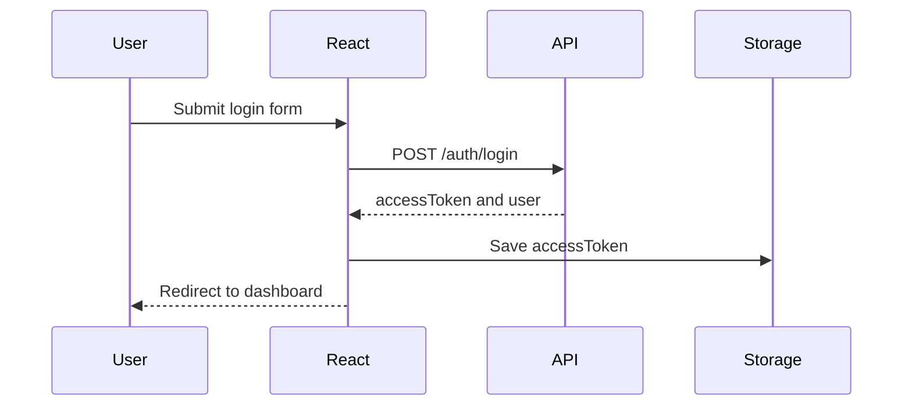
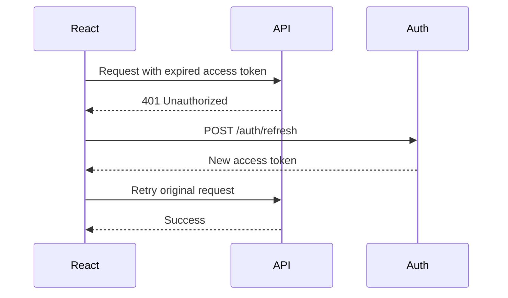

# React Production-Level Step-by-Step Tutorial

A complete Git-friendly guide to learn React from installation to building high-scale production applications.

---

## Table of Contents

- [1. What You Will Build](#1-what-you-will-build)
- [2. Required Tools](#2-required-tools)
- [3. React Architecture Overview](#3-react-architecture-overview)
- [4. Create React App With Vite](#4-create-react-app-with-vite)
- [5. Recommended Production Stack](#5-recommended-production-stack)
- [6. Project Folder Structure](#6-project-folder-structure)
- [7. Clean Initial Setup](#7-clean-initial-setup)
- [8. TypeScript Basics for React](#8-typescript-basics-for-react)
- [9. Components](#9-components)
- [10. Props](#10-props)
- [11. State](#11-state)
- [12. Events](#12-events)
- [13. Conditional Rendering](#13-conditional-rendering)
- [14. Lists and Keys](#14-lists-and-keys)
- [15. Hooks Overview](#15-hooks-overview)
- [16. useEffect](#16-useeffect)
- [17. useMemo and useCallback](#17-usememo-and-usecallback)
- [18. useRef](#18-useref)
- [19. Custom Hooks](#19-custom-hooks)
- [20. Routing With React Router](#20-routing-with-react-router)
- [21. Layouts](#21-layouts)
- [22. Protected Routes](#22-protected-routes)
- [23. API Integration With Axios](#23-api-integration-with-axios)
- [24. Environment Variables](#24-environment-variables)
- [25. Server State With TanStack Query](#25-server-state-with-tanstack-query)
- [26. Mutations](#26-mutations)
- [27. Forms With React Hook Form](#27-forms-with-react-hook-form)
- [28. Validation With Zod](#28-validation-with-zod)
- [29. Authentication](#29-authentication)
- [30. Refresh Token Flow](#30-refresh-token-flow)
- [31. Role-Based UI](#31-role-based-ui)
- [32. Global State Management](#32-global-state-management)
- [33. UI Styling](#33-ui-styling)
- [34. Error Handling](#34-error-handling)
- [35. Loading and Empty States](#35-loading-and-empty-states)
- [36. Pagination Search and Filters](#36-pagination-search-and-filters)
- [37. File Upload](#37-file-upload)
- [38. Performance Optimization](#38-performance-optimization)
- [39. Code Splitting](#39-code-splitting)
- [40. Virtualization](#40-virtualization)
- [41. Accessibility](#41-accessibility)
- [42. Testing](#42-testing)
- [43. End-to-End Testing](#43-end-to-end-testing)
- [44. Linting and Formatting](#44-linting-and-formatting)
- [45. Build for Production](#45-build-for-production)
- [46. Dockerize React App](#46-dockerize-react-app)
- [47. Nginx Configuration](#47-nginx-configuration)
- [48. CI CD Pipeline](#48-ci-cd-pipeline)
- [49. Monitoring and Analytics](#49-monitoring-and-analytics)
- [50. Security Checklist](#50-security-checklist)
- [51. High-Scale Architecture](#51-high-scale-architecture)
- [52. Production Checklist](#52-production-checklist)
- [53. Final Roadmap](#53-final-roadmap)

---

## 1. What You Will Build

You will learn how to build a production-ready React application with:

- TypeScript
- Routing
- Authentication
- Protected routes
- Role-based UI
- API integration
- React Query
- Forms and validation
- Testing
- Docker
- CI/CD
- Performance optimization
- Production deployment

Example project:

```text
Project Management Dashboard
```

Features:

- Login
- Dashboard
- Projects
- Tasks
- Users
- Search
- Filters
- Pagination
- File upload
- Admin-only pages

---

## 2. Required Tools

Install these tools:

```text
Node.js 20 or newer
npm or pnpm
Git
VS Code
Google Chrome
Docker
```

Check versions:

```bash
node -v
npm -v
git --version
docker --version
```

Recommended VS Code extensions:

```text
ESLint
Prettier
Tailwind CSS IntelliSense
TypeScript Importer
GitLens
Error Lens
```

---

## 3. React Architecture Overview



Production React apps usually separate:

```text
UI state
Server state
Routing
Forms
Authentication
Error handling
Testing
Deployment
```

---

## 4. Create React App With Vite

Create the project:

```bash
npm create vite@latest react-production-app -- --template react-ts
cd react-production-app
npm install
npm run dev
```

Open:

```text
http://localhost:5173
```

---

## 5. Recommended Production Stack

Use this stack:

```text
React
TypeScript
Vite
React Router
TanStack Query
Axios
React Hook Form
Zod
Zustand
Tailwind CSS
Vitest
React Testing Library
Playwright
Docker
Nginx
GitHub Actions
```

Install core libraries:

```bash
npm install react-router-dom axios @tanstack/react-query react-hook-form zod @hookform/resolvers zustand
```

Install development tools:

```bash
npm install -D vitest jsdom @testing-library/react @testing-library/jest-dom @testing-library/user-event
npm install -D eslint prettier
npm install -D playwright
```

---

## 6. Project Folder Structure

Use feature-based architecture.

```text
src/
├── app/
│   ├── App.tsx
│   ├── router.tsx
│   ├── queryClient.ts
│   └── providers.tsx
├── assets/
├── components/
│   ├── layout/
│   └── ui/
├── config/
│   └── env.ts
├── features/
│   ├── auth/
│   ├── dashboard/
│   ├── projects/
│   ├── tasks/
│   └── users/
├── hooks/
├── lib/
│   ├── axiosClient.ts
│   └── storage.ts
├── types/
├── utils/
├── main.tsx
└── index.css
```

Why feature-based structure?

```text
Easy to scale
Easy to maintain
Easy for teams
Easy to test
Easy to delete features
```

---

## 7. Clean Initial Setup

Replace `src/main.tsx`:

```tsx
import React from "react";
import ReactDOM from "react-dom/client";
import { App } from "./app/App";
import "./index.css";

ReactDOM.createRoot(document.getElementById("root")!).render(
  <React.StrictMode>
    <App />
  </React.StrictMode>
);
```

Create `src/app/App.tsx`:

```tsx
export function App() {
  return <h1>React Production App</h1>;
}
```

---

## 8. TypeScript Basics for React

Basic types:

```tsx
type User = {
  id: string;
  name: string;
  email: string;
};

type Status = "ACTIVE" | "INACTIVE";
```

Component props:

```tsx
type UserCardProps = {
  user: User;
  onSelect: (id: string) => void;
};

export function UserCard({ user, onSelect }: UserCardProps) {
  return (
    <button onClick={() => onSelect(user.id)}>
      {user.name}
    </button>
  );
}
```

Use `type` for most app models. Use `interface` when you expect extension.

---

## 9. Components

A component is a reusable UI block.

```tsx
type ButtonProps = {
  label: string;
};

export function Button({ label }: ButtonProps) {
  return <button>{label}</button>;
}
```

Production rule:

```text
Keep components small.
Keep business logic out of UI components.
Move reusable logic to hooks.
```

---

## 10. Props

Props pass data from parent to child.

```tsx
type ProjectCardProps = {
  title: string;
  description: string;
};

export function ProjectCard({ title, description }: ProjectCardProps) {
  return (
    <article>
      <h2>{title}</h2>
      <p>{description}</p>
    </article>
  );
}
```

Usage:

```tsx
<ProjectCard
  title="Search Platform"
  description="Distributed search project"
/>
```

---

## 11. State

Use state when UI changes over time.

```tsx
import { useState } from "react";

export function Counter() {
  const [count, setCount] = useState(0);

  return (
    <button onClick={() => setCount(count + 1)}>
      Count: {count}
    </button>
  );
}
```

Production rule:

```text
Keep state as local as possible.
Do not put everything in global state.
```

---

## 12. Events

```tsx
export function SearchBox() {
  function handleChange(event: React.ChangeEvent<HTMLInputElement>) {
    console.log(event.target.value);
  }

  return <input onChange={handleChange} />;
}
```

Form submit:

```tsx
function handleSubmit(event: React.FormEvent<HTMLFormElement>) {
  event.preventDefault();
}
```

---

## 13. Conditional Rendering

```tsx
type Props = {
  isLoading: boolean;
  error?: string;
};

export function StatusMessage({ isLoading, error }: Props) {
  if (isLoading) {
    return <p>Loading...</p>;
  }

  if (error) {
    return <p>{error}</p>;
  }

  return <p>Ready</p>;
}
```

---

## 14. Lists and Keys

```tsx
type Project = {
  id: string;
  name: string;
};

type Props = {
  projects: Project[];
};

export function ProjectList({ projects }: Props) {
  return (
    <ul>
      {projects.map((project) => (
        <li key={project.id}>{project.name}</li>
      ))}
    </ul>
  );
}
```

Production rule:

```text
Never use array index as key for dynamic lists.
Use stable IDs.
```

---

## 15. Hooks Overview

Important hooks:

```text
useState
useEffect
useMemo
useCallback
useRef
useReducer
useContext
```

Production rule:

```text
Do not overuse hooks.
Prefer simple code first.
```

---

## 16. useEffect

Use `useEffect` for side effects.

```tsx
import { useEffect, useState } from "react";

export function WindowSize() {
  const [width, setWidth] = useState(window.innerWidth);

  useEffect(() => {
    function handleResize() {
      setWidth(window.innerWidth);
    }

    window.addEventListener("resize", handleResize);

    return () => {
      window.removeEventListener("resize", handleResize);
    };
  }, []);

  return <p>Width: {width}</p>;
}
```

Avoid using `useEffect` for server data fetching in production. Prefer TanStack Query.

---

## 17. useMemo and useCallback

Use `useMemo` for expensive derived values.

```tsx
import { useMemo } from "react";

type Props = {
  items: number[];
};

export function ExpensiveTotal({ items }: Props) {
  const total = useMemo(() => {
    return items.reduce((sum, item) => sum + item, 0);
  }, [items]);

  return <p>Total: {total}</p>;
}
```

Use `useCallback` for stable function references when needed.

```tsx
import { useCallback } from "react";

export function Parent() {
  const handleSave = useCallback(() => {
    console.log("saved");
  }, []);

  return <button onClick={handleSave}>Save</button>;
}
```

Do not use these everywhere. They are performance tools, not default requirements.

---

## 18. useRef

Use `useRef` for DOM access or mutable values that should not re-render.

```tsx
import { useRef } from "react";

export function FocusInput() {
  const inputRef = useRef<HTMLInputElement>(null);

  function focusInput() {
    inputRef.current?.focus();
  }

  return (
    <>
      <input ref={inputRef} />
      <button onClick={focusInput}>Focus</button>
    </>
  );
}
```

---

## 19. Custom Hooks

Custom hooks reuse logic.

```tsx
import { useEffect, useState } from "react";

export function useDebounce<T>(value: T, delayMs: number) {
  const [debouncedValue, setDebouncedValue] = useState(value);

  useEffect(() => {
    const timerId = window.setTimeout(() => {
      setDebouncedValue(value);
    }, delayMs);

    return () => {
      window.clearTimeout(timerId);
    };
  }, [value, delayMs]);

  return debouncedValue;
}
```

Usage:

```tsx
const debouncedSearch = useDebounce(search, 400);
```

---

## 20. Routing With React Router

Create `src/app/router.tsx`:

```tsx
import { createBrowserRouter } from "react-router-dom";
import { LoginPage } from "../features/auth/LoginPage";
import { DashboardPage } from "../features/dashboard/DashboardPage";
import { ProjectsPage } from "../features/projects/ProjectsPage";

export const router = createBrowserRouter([
  {
    path: "/login",
    element: <LoginPage />,
  },
  {
    path: "/",
    element: <DashboardPage />,
  },
  {
    path: "/projects",
    element: <ProjectsPage />,
  },
]);
```

Update `src/app/App.tsx`:

```tsx
import { RouterProvider } from "react-router-dom";
import { router } from "./router";

export function App() {
  return <RouterProvider router={router} />;
}
```

---

## 21. Layouts

Create `src/components/layout/AppLayout.tsx`:

```tsx
import { Link, Outlet } from "react-router-dom";

export function AppLayout() {
  return (
    <div>
      <header>
        <nav>
          <Link to="/">Dashboard</Link>
          <Link to="/projects">Projects</Link>
        </nav>
      </header>

      <main>
        <Outlet />
      </main>
    </div>
  );
}
```

Router with layout:

```tsx
import { createBrowserRouter } from "react-router-dom";
import { AppLayout } from "../components/layout/AppLayout";
import { DashboardPage } from "../features/dashboard/DashboardPage";
import { ProjectsPage } from "../features/projects/ProjectsPage";
import { LoginPage } from "../features/auth/LoginPage";

export const router = createBrowserRouter([
  {
    path: "/login",
    element: <LoginPage />,
  },
  {
    path: "/",
    element: <AppLayout />,
    children: [
      {
        index: true,
        element: <DashboardPage />,
      },
      {
        path: "projects",
        element: <ProjectsPage />,
      },
    ],
  },
]);
```

---

## 22. Protected Routes

```tsx
import { Navigate, Outlet } from "react-router-dom";
import { authStorage } from "../../lib/storage";

export function ProtectedRoute() {
  const token = authStorage.getAccessToken();

  if (!token) {
    return <Navigate to="/login" replace />;
  }

  return <Outlet />;
}
```

Router:

```tsx
{
  path: "/",
  element: <ProtectedRoute />,
  children: [
    {
      element: <AppLayout />,
      children: [
        {
          index: true,
          element: <DashboardPage />,
        },
        {
          path: "projects",
          element: <ProjectsPage />,
        },
      ],
    },
  ],
}
```

---

## 23. API Integration With Axios

Create `src/lib/axiosClient.ts`:

```tsx
import axios from "axios";
import { env } from "../config/env";
import { authStorage } from "./storage";

export const axiosClient = axios.create({
  baseURL: env.apiBaseUrl,
  timeout: 10000,
});

axiosClient.interceptors.request.use((config) => {
  const token = authStorage.getAccessToken();

  if (token) {
    config.headers.Authorization = `Bearer ${token}`;
  }

  return config;
});
```

Create `src/lib/storage.ts`:

```tsx
const ACCESS_TOKEN_KEY = "accessToken";

export const authStorage = {
  getAccessToken() {
    return localStorage.getItem(ACCESS_TOKEN_KEY);
  },

  setAccessToken(token: string) {
    localStorage.setItem(ACCESS_TOKEN_KEY, token);
  },

  clear() {
    localStorage.removeItem(ACCESS_TOKEN_KEY);
  },
};
```

---

## 24. Environment Variables

Create `.env.development`:

```bash
VITE_API_BASE_URL=http://localhost:8080/api/v1
```

Create `.env.production`:

```bash
VITE_API_BASE_URL=https://api.example.com/api/v1
```

Create `src/config/env.ts`:

```tsx
export const env = {
  apiBaseUrl: import.meta.env.VITE_API_BASE_URL as string,
};
```

Production rule:

```text
Only variables prefixed with VITE_ are exposed to the client.
Never put secrets in frontend environment variables.
```

---

## 25. Server State With TanStack Query

Create `src/app/queryClient.ts`:

```tsx
import { QueryClient } from "@tanstack/react-query";

export const queryClient = new QueryClient({
  defaultOptions: {
    queries: {
      retry: 1,
      staleTime: 30000,
      refetchOnWindowFocus: false,
    },
  },
});
```

Create `src/app/providers.tsx`:

```tsx
import { QueryClientProvider } from "@tanstack/react-query";
import { queryClient } from "./queryClient";

type Props = {
  children: React.ReactNode;
};

export function AppProviders({ children }: Props) {
  return <QueryClientProvider client={queryClient}>{children}</QueryClientProvider>;
}
```

Update `main.tsx`:

```tsx
import React from "react";
import ReactDOM from "react-dom/client";
import { App } from "./app/App";
import { AppProviders } from "./app/providers";
import "./index.css";

ReactDOM.createRoot(document.getElementById("root")!).render(
  <React.StrictMode>
    <AppProviders>
      <App />
    </AppProviders>
  </React.StrictMode>
);
```

Project API:

```tsx
import { axiosClient } from "../../lib/axiosClient";

export type Project = {
  id: string;
  name: string;
  description: string;
};

export async function getProjects(): Promise<Project[]> {
  const response = await axiosClient.get<Project[]>("/projects");
  return response.data;
}
```

Query hook:

```tsx
import { useQuery } from "@tanstack/react-query";
import { getProjects } from "./projectsApi";

export function useProjects() {
  return useQuery({
    queryKey: ["projects"],
    queryFn: getProjects,
  });
}
```

Page:

```tsx
import { useProjects } from "./useProjects";

export function ProjectsPage() {
  const { data, isLoading, isError } = useProjects();

  if (isLoading) {
    return <p>Loading projects...</p>;
  }

  if (isError) {
    return <p>Failed to load projects.</p>;
  }

  return (
    <ul>
      {data?.map((project) => (
        <li key={project.id}>{project.name}</li>
      ))}
    </ul>
  );
}
```

---

## 26. Mutations

Create project API:

```tsx
import { axiosClient } from "../../lib/axiosClient";
import type { Project } from "./projectsApi";

export type CreateProjectInput = {
  name: string;
  description: string;
};

export async function createProject(input: CreateProjectInput): Promise<Project> {
  const response = await axiosClient.post<Project>("/projects", input);
  return response.data;
}
```

Mutation hook:

```tsx
import { useMutation, useQueryClient } from "@tanstack/react-query";
import { createProject } from "./createProjectApi";

export function useCreateProject() {
  const queryClient = useQueryClient();

  return useMutation({
    mutationFn: createProject,
    onSuccess: () => {
      queryClient.invalidateQueries({ queryKey: ["projects"] });
    },
  });
}
```

---

## 27. Forms With React Hook Form

```tsx
import { useForm } from "react-hook-form";

type ProjectFormValues = {
  name: string;
  description: string;
};

export function ProjectForm() {
  const { register, handleSubmit } = useForm<ProjectFormValues>();

  function onSubmit(values: ProjectFormValues) {
    console.log(values);
  }

  return (
    <form onSubmit={handleSubmit(onSubmit)}>
      <input {...register("name")} placeholder="Project name" />
      <textarea {...register("description")} placeholder="Description" />
      <button type="submit">Create</button>
    </form>
  );
}
```

---

## 28. Validation With Zod

```tsx
import { z } from "zod";

export const projectSchema = z.object({
  name: z.string().min(3).max(100),
  description: z.string().max(1000),
});

export type ProjectFormValues = z.infer<typeof projectSchema>;
```

Use with React Hook Form:

```tsx
import { zodResolver } from "@hookform/resolvers/zod";
import { useForm } from "react-hook-form";
import { projectSchema, type ProjectFormValues } from "./projectSchema";

export function ProjectForm() {
  const form = useForm<ProjectFormValues>({
    resolver: zodResolver(projectSchema),
  });

  function onSubmit(values: ProjectFormValues) {
    console.log(values);
  }

  return (
    <form onSubmit={form.handleSubmit(onSubmit)}>
      <input {...form.register("name")} />
      {form.formState.errors.name && <p>{form.formState.errors.name.message}</p>}

      <textarea {...form.register("description")} />
      {form.formState.errors.description && (
        <p>{form.formState.errors.description.message}</p>
      )}

      <button type="submit">Create</button>
    </form>
  );
}
```

---

## 29. Authentication



Auth API:

```tsx
import { axiosClient } from "../../lib/axiosClient";

export type LoginInput = {
  email: string;
  password: string;
};

export type LoginResponse = {
  accessToken: string;
  user: {
    id: string;
    name: string;
    role: "ADMIN" | "MANAGER" | "MEMBER";
  };
};

export async function login(input: LoginInput): Promise<LoginResponse> {
  const response = await axiosClient.post<LoginResponse>("/auth/login", input);
  return response.data;
}
```

Login hook:

```tsx
import { useMutation } from "@tanstack/react-query";
import { useNavigate } from "react-router-dom";
import { authStorage } from "../../lib/storage";
import { login } from "./authApi";

export function useLogin() {
  const navigate = useNavigate();

  return useMutation({
    mutationFn: login,
    onSuccess: (data) => {
      authStorage.setAccessToken(data.accessToken);
      navigate("/");
    },
  });
}
```

Login page:

```tsx
export function LoginPage() {
  const loginMutation = useLogin();

  function handleLogin() {
    loginMutation.mutate({
      email: "admin@example.com",
      password: "password123",
    });
  }

  return (
    <button onClick={handleLogin} disabled={loginMutation.isPending}>
      Login
    </button>
  );
}
```

---

## 30. Refresh Token Flow

Recommended secure approach:

```text
Access token: short-lived
Refresh token: stored in HttpOnly Secure cookie
Frontend: does not read refresh token
Backend: refresh endpoint issues new access token
```

Flow:



Axios refresh example:

```tsx
axiosClient.interceptors.response.use(
  (response) => response,
  async (error) => {
    const originalRequest = error.config;

    if (error.response?.status === 401 && !originalRequest._retry) {
      originalRequest._retry = true;

      const refreshResponse = await axiosClient.post("/auth/refresh");
      const newAccessToken = refreshResponse.data.accessToken;

      authStorage.setAccessToken(newAccessToken);
      originalRequest.headers.Authorization = `Bearer ${newAccessToken}`;

      return axiosClient(originalRequest);
    }

    return Promise.reject(error);
  }
);
```

---

## 31. Role-Based UI

```tsx
type Role = "ADMIN" | "MANAGER" | "MEMBER";

type CanAccessProps = {
  userRole: Role;
  allowedRoles: Role[];
  children: React.ReactNode;
};

export function CanAccess({ userRole, allowedRoles, children }: CanAccessProps) {
  if (!allowedRoles.includes(userRole)) {
    return null;
  }

  return <>{children}</>;
}
```

Usage:

```tsx
<CanAccess userRole="ADMIN" allowedRoles={["ADMIN"]}>
  <button>Delete User</button>
</CanAccess>
```

Important:

```text
Role-based UI is only for user experience.
Real authorization must happen on the backend.
```

---

## 32. Global State Management

Use local state for component-level state.

Use TanStack Query for server state.

Use Zustand for small global UI/app state.

Install:

```bash
npm install zustand
```

Example store:

```tsx
import { create } from "zustand";

type SidebarState = {
  isOpen: boolean;
  toggle: () => void;
};

export const useSidebarStore = create<SidebarState>((set) => ({
  isOpen: true,
  toggle: () => set((state) => ({ isOpen: !state.isOpen })),
}));
```

---

## 33. UI Styling

Recommended options:

```text
Tailwind CSS
Material UI
Ant Design
shadcn/ui
CSS Modules
```

Install Tailwind:

```bash
npm install -D tailwindcss @tailwindcss/vite
```

Example component:

```tsx
type ButtonProps = {
  children: React.ReactNode;
};

export function Button({ children }: ButtonProps) {
  return (
    <button className="rounded-lg bg-blue-600 px-4 py-2 text-white">
      {children}
    </button>
  );
}
```

Production UI rules:

```text
Use design tokens.
Build reusable UI components.
Keep spacing consistent.
Support mobile layouts.
Support keyboard navigation.
```

---

## 34. Error Handling

Create reusable error component:

```tsx
type ErrorMessageProps = {
  message: string;
};

export function ErrorMessage({ message }: ErrorMessageProps) {
  return <p role="alert">{message}</p>;
}
```

API error parser:

```tsx
import axios from "axios";

export function getErrorMessage(error: unknown) {
  if (axios.isAxiosError(error)) {
    return error.response?.data?.message ?? "Something went wrong";
  }

  return "Something went wrong";
}
```

Use error boundaries for render crashes.

```tsx
import { Component, type ReactNode } from "react";

type Props = {
  children: ReactNode;
};

type State = {
  hasError: boolean;
};

export class ErrorBoundary extends Component<Props, State> {
  state: State = {
    hasError: false,
  };

  static getDerivedStateFromError() {
    return {
      hasError: true,
    };
  }

  render() {
    if (this.state.hasError) {
      return <p>Something went wrong.</p>;
    }

    return this.props.children;
  }
}
```

---

## 35. Loading and Empty States

```tsx
type DataStateProps<T> = {
  isLoading: boolean;
  isError: boolean;
  data?: T[];
  children: (data: T[]) => React.ReactNode;
};

export function DataState<T>({
  isLoading,
  isError,
  data,
  children,
}: DataStateProps<T>) {
  if (isLoading) {
    return <p>Loading...</p>;
  }

  if (isError) {
    return <p>Failed to load data.</p>;
  }

  if (!data || data.length === 0) {
    return <p>No data found.</p>;
  }

  return <>{children(data)}</>;
}
```

---

## 36. Pagination Search and Filters

Query params state:

```tsx
import { useSearchParams } from "react-router-dom";

export function useProjectFilters() {
  const [searchParams, setSearchParams] = useSearchParams();

  const page = Number(searchParams.get("page") ?? 0);
  const search = searchParams.get("search") ?? "";

  function setSearch(searchValue: string) {
    setSearchParams({
      search: searchValue,
      page: "0",
    });
  }

  function setPage(pageValue: number) {
    setSearchParams({
      search,
      page: String(pageValue),
    });
  }

  return {
    page,
    search,
    setSearch,
    setPage,
  };
}
```

Query hook:

```tsx
export function useProjects(search: string, page: number) {
  return useQuery({
    queryKey: ["projects", search, page],
    queryFn: async () => {
      const response = await axiosClient.get("/projects", {
        params: {
          search,
          page,
          size: 10,
        },
      });

      return response.data;
    },
  });
}
```

---

## 37. File Upload

```tsx
export async function uploadFile(file: File) {
  const formData = new FormData();
  formData.append("file", file);

  const response = await axiosClient.post("/files", formData, {
    headers: {
      "Content-Type": "multipart/form-data",
    },
  });

  return response.data;
}
```

Component:

```tsx
export function FileUpload() {
  async function handleChange(event: React.ChangeEvent<HTMLInputElement>) {
    const file = event.target.files?.[0];

    if (!file) {
      return;
    }

    await uploadFile(file);
  }

  return <input type="file" onChange={handleChange} />;
}
```

Production file rules:

```text
Validate file type.
Validate file size.
Show upload progress.
Scan files on backend when required.
Store files outside the frontend app.
```

---

## 38. Performance Optimization

Common bottlenecks:

```text
Large bundles
Too many renders
Large lists
Unoptimized images
Repeated API calls
Heavy computations during render
```

Use React DevTools Profiler.

Optimization techniques:

```text
Lazy loading
Code splitting
Memoization
Virtualization
Debouncing
Caching
Prefetching
Image compression
CDN
```

---

## 39. Code Splitting

```tsx
import { lazy, Suspense } from "react";

const ProjectsPage = lazy(() =>
  import("../features/projects/ProjectsPage").then((module) => ({
    default: module.ProjectsPage,
  }))
);

export function LazyProjectsRoute() {
  return (
    <Suspense fallback={<p>Loading page...</p>}>
      <ProjectsPage />
    </Suspense>
  );
}
```

Route-level code splitting is one of the easiest production wins.

---

## 40. Virtualization

Install:

```bash
npm install @tanstack/react-virtual
```

Use virtualization for very large lists.

```tsx
import { useVirtualizer } from "@tanstack/react-virtual";
import { useRef } from "react";

type Props = {
  items: string[];
};

export function VirtualList({ items }: Props) {
  const parentRef = useRef<HTMLDivElement>(null);

  const rowVirtualizer = useVirtualizer({
    count: items.length,
    getScrollElement: () => parentRef.current,
    estimateSize: () => 40,
  });

  return (
    <div ref={parentRef} style={{ height: 400, overflow: "auto" }}>
      <div
        style={{
          height: rowVirtualizer.getTotalSize(),
          position: "relative",
        }}
      >
        {rowVirtualizer.getVirtualItems().map((virtualRow) => (
          <div
            key={virtualRow.key}
            style={{
              position: "absolute",
              top: 0,
              transform: `translateY(${virtualRow.start}px)`,
            }}
          >
            {items[virtualRow.index]}
          </div>
        ))}
      </div>
    </div>
  );
}
```

---

## 41. Accessibility

Checklist:

```text
Use semantic HTML.
Use button for actions.
Use anchor for navigation.
Add alt text for images.
Support keyboard navigation.
Use labels for inputs.
Keep color contrast readable.
Use aria attributes only when needed.
```

Accessible input:

```tsx
export function EmailInput() {
  return (
    <label>
      Email
      <input type="email" name="email" autoComplete="email" />
    </label>
  );
}
```

Accessible error:

```tsx
<p role="alert">Email is required</p>
```

---

## 42. Testing

Vitest config:

```tsx
import { defineConfig } from "vitest/config";
import react from "@vitejs/plugin-react";

export default defineConfig({
  plugins: [react()],
  test: {
    environment: "jsdom",
    setupFiles: "./src/test/setup.ts",
  },
});
```

Setup file:

```tsx
import "@testing-library/jest-dom";
```

Component test:

```tsx
import { render, screen } from "@testing-library/react";
import { Button } from "./Button";

test("renders button text", () => {
  render(<Button>Save</Button>);
  expect(screen.getByRole("button", { name: "Save" })).toBeInTheDocument();
});
```

Hook test:

```tsx
import { renderHook } from "@testing-library/react";
import { useDebounce } from "./useDebounce";

test("returns initial value", () => {
  const { result } = renderHook(() => useDebounce("hello", 300));
  expect(result.current).toBe("hello");
});
```

---

## 43. End-to-End Testing

Install Playwright:

```bash
npx playwright install
```

Example test:

```tsx
import { test, expect } from "@playwright/test";

test("login page loads", async ({ page }) => {
  await page.goto("/login");
  await expect(page.getByRole("button", { name: "Login" })).toBeVisible();
});
```

Run:

```bash
npx playwright test
```

---

## 44. Linting and Formatting

Install:

```bash
npm install -D eslint prettier eslint-config-prettier
```

Package scripts:

```json
{
  "scripts": {
    "dev": "vite",
    "build": "tsc -b && vite build",
    "preview": "vite preview",
    "test": "vitest",
    "lint": "eslint src",
    "format": "prettier --write ."
  }
}
```

Prettier config:

```json
{
  "semi": true,
  "singleQuote": false,
  "printWidth": 90
}
```

---

## 45. Build for Production

Run:

```bash
npm run build
```

Preview production build:

```bash
npm run preview
```

Output:

```text
dist/
```

Production build should be:

```text
Small
Cached
Minified
Served over HTTPS
Served through CDN when possible
```

---

## 46. Dockerize React App

Create `Dockerfile`:

```dockerfile
FROM node:20-alpine AS build

WORKDIR /app

COPY package*.json ./
RUN npm ci

COPY . .
RUN npm run build

FROM nginx:alpine

COPY --from=build /app/dist /usr/share/nginx/html

EXPOSE 80

CMD ["nginx", "-g", "daemon off;"]
```

Build:

```bash
docker build -t react-production-app .
```

Run:

```bash
docker run -p 3000:80 react-production-app
```

---

## 47. Nginx Configuration

For React Router, configure fallback to `index.html`.

Create `nginx.conf`:

```nginx
server {
    listen 80;

    server_name _;

    root /usr/share/nginx/html;
    index index.html;

    location / {
        try_files $uri $uri/ /index.html;
    }

    location /assets/ {
        expires 1y;
        add_header Cache-Control "public, immutable";
    }
}
```

Update Dockerfile:

```dockerfile
FROM node:20-alpine AS build

WORKDIR /app

COPY package*.json ./
RUN npm ci

COPY . .
RUN npm run build

FROM nginx:alpine

COPY nginx.conf /etc/nginx/conf.d/default.conf
COPY --from=build /app/dist /usr/share/nginx/html

EXPOSE 80

CMD ["nginx", "-g", "daemon off;"]
```

---

## 48. CI CD Pipeline

Create `.github/workflows/react-ci.yml`:

```yaml
name: React CI

on:
  push:
    branches:
      - main
  pull_request:

jobs:
  react:
    runs-on: ubuntu-latest

    steps:
      - name: Checkout source
        uses: actions/checkout@v4

      - name: Setup Node.js
        uses: actions/setup-node@v4
        with:
          node-version: 20

      - name: Install dependencies
        run: npm ci

      - name: Run lint
        run: npm run lint

      - name: Run tests
        run: npm test

      - name: Build app
        run: npm run build
```

---

## 49. Monitoring and Analytics

Production monitoring options:

```text
Sentry for frontend errors
Google Analytics or Plausible for analytics
LogRocket or OpenReplay for session replay
Web Vitals for performance
Browser console logging only in development
```

Web Vitals install:

```bash
npm install web-vitals
```

Example:

```tsx
import { onCLS, onINP, onLCP } from "web-vitals";

onCLS(console.log);
onINP(console.log);
onLCP(console.log);
```

Track:

```text
LCP
CLS
INP
Bundle size
API latency
JavaScript errors
Route load time
```

---

## 50. Security Checklist

Frontend security:

```text
Do not store secrets in frontend.
Prefer HttpOnly Secure cookies for refresh tokens.
Validate all user input.
Escape untrusted HTML.
Avoid dangerouslySetInnerHTML.
Use HTTPS.
Configure CSP headers.
Do not log tokens.
Use short-lived access tokens.
Sanitize file names.
Keep dependencies updated.
```

Check dependencies:

```bash
npm audit
```

---

## 51. High-Scale Architecture

```mermaid
flowchart TD
    User["Users"] --> CDN["CDN"]
    CDN --> StaticApp["Static React Assets"]
    StaticApp --> API Gateway["API Gateway"]
    API Gateway --> Backend["Backend Services"]
    Backend --> Cache[("Redis")]
    Backend --> DB[("Database")]
    StaticApp --> Monitoring["Frontend Monitoring"]
```

High-scale frontend techniques:

```text
CDN caching
Asset fingerprinting
Lazy loading
Route splitting
React Query caching
Pagination
Virtualization
Debounced search
Image optimization
Error boundaries
Monitoring
Feature flags
A/B testing
```

---

## 52. Production Checklist

Before production:

```text
Build passes
Tests pass
Lint passes
Environment variables configured
API base URL configured
HTTPS enabled
CSP configured
Sentry configured
Bundle size checked
Routes work after refresh
Error boundary added
Loading states added
Empty states added
Accessibility checked
Docker image builds
CI/CD pipeline works
```

---

## 53. Final Roadmap

Beginner:

```text
HTML
CSS
JavaScript
TypeScript basics
React components
Props
State
Events
Lists
Forms
```

Intermediate:

```text
React Router
Hooks
Custom hooks
Axios
React Query
React Hook Form
Zod
Authentication
Protected routes
```

Advanced:

```text
Performance optimization
Testing
Code splitting
Virtualization
Docker
CI/CD
Accessibility
Monitoring
Security
High-scale architecture
```

Production mindset:

```text
Small components
Typed APIs
Clear folder structure
Good error handling
Good loading states
Testing
Security
Performance
Observability
Maintainability
```
