# Java 8 Features — Learn by Doing

A step-by-step, beginner-friendly guide to Java 8 features with runnable examples, exercises, and Mermaid diagrams.

> Requirements: JDK 8+, any IDE, or terminal with `javac` and `java`.

---

## Table of Contents

1. [Setup](#1-setup)
2. [Lambda Expressions](#2-lambda-expressions)
3. [Functional Interfaces](#3-functional-interfaces)
4. [Method References](#4-method-references)
5. [Streams](#5-streams)
6. [Stream Operations by Type](#6-stream-operations-by-type)
7. [Collectors](#7-collectors)
8. [Optional](#8-optional)
9. [Default and Static Interface Methods](#9-default-and-static-interface-methods)
10. [New Date and Time API](#10-new-date-and-time-api)
11. [CompletableFuture Basics](#11-completablefuture-basics)
12. [Mini Project](#12-mini-project)
13. [Practice Tasks](#13-practice-tasks)

---

## 1. Setup

Create a folder:

```bash
mkdir java8-practice
cd java8-practice
```

Create a file:

```bash
touch Main.java
```

Run Java code:

```bash
javac Main.java
java Main
```

Basic starter:

```java
public class Main {
    public static void main(String[] args) {
        System.out.println("Java 8 practice started!");
    }
}
```

---

## 2. Lambda Expressions

### What is a lambda?

A lambda is a shorter way to write an anonymous function.

Before Java 8:

```java
Runnable task = new Runnable() {
    @Override
    public void run() {
        System.out.println("Running old style");
    }
};
```

Java 8 lambda:

```java
Runnable task = () -> System.out.println("Running with lambda");
```

### Lambda syntax

```java
(parameters) -> expression
```

or

```java
(parameters) -> {
    statements;
}
```

### Mermaid diagram

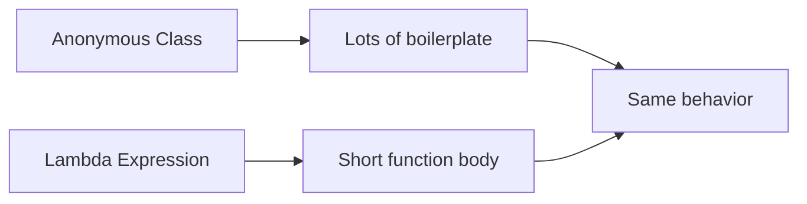

### Example 1: No parameter

```java
public class Main {
    public static void main(String[] args) {
        Runnable r = () -> System.out.println("Hello Lambda");
        r.run();
    }
}
```

### Example 2: One parameter

```java
import java.util.function.Consumer;

public class Main {
    public static void main(String[] args) {
        Consumer<String> printer = name -> System.out.println("Hello " + name);
        printer.accept("Amit");
    }
}
```

### Example 3: Multiple parameters

```java
import java.util.function.BiFunction;

public class Main {
    public static void main(String[] args) {
        BiFunction<Integer, Integer, Integer> add = (a, b) -> a + b;
        System.out.println(add.apply(10, 20));
    }
}
```

### Learn by doing

Change the code to multiply two numbers instead of adding them.

```java
BiFunction<Integer, Integer, Integer> multiply = (a, b) -> a * b;
System.out.println(multiply.apply(5, 4));
```

---

## 3. Functional Interfaces

A functional interface has exactly one abstract method.

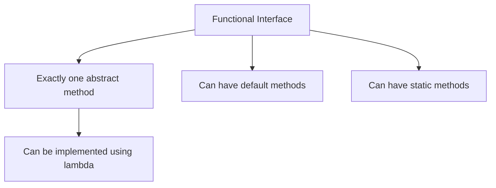

### Custom functional interface

```java
@FunctionalInterface
interface Calculator {
    int calculate(int a, int b);
}

public class Main {
    public static void main(String[] args) {
        Calculator add = (a, b) -> a + b;
        Calculator subtract = (a, b) -> a - b;

        System.out.println(add.calculate(10, 5));
        System.out.println(subtract.calculate(10, 5));
    }
}
```

### Common built-in functional interfaces

| Interface | Input | Output | Method | Example |
|---|---:|---:|---|---|
| `Predicate<T>` | T | boolean | `test()` | check condition |
| `Function<T, R>` | T | R | `apply()` | transform value |
| `Consumer<T>` | T | void | `accept()` | print/save value |
| `Supplier<T>` | none | T | `get()` | generate value |
| `BiFunction<T, U, R>` | T, U | R | `apply()` | combine values |

### Predicate example

```java
import java.util.function.Predicate;

public class Main {
    public static void main(String[] args) {
        Predicate<Integer> isEven = n -> n % 2 == 0;

        System.out.println(isEven.test(10));
        System.out.println(isEven.test(7));
    }
}
```

### Function example

```java
import java.util.function.Function;

public class Main {
    public static void main(String[] args) {
        Function<String, Integer> lengthFinder = text -> text.length();

        System.out.println(lengthFinder.apply("Java 8"));
    }
}
```

### Consumer example

```java
import java.util.function.Consumer;

public class Main {
    public static void main(String[] args) {
        Consumer<String> printUpperCase = text -> System.out.println(text.toUpperCase());

        printUpperCase.accept("lambda");
    }
}
```

### Supplier example

```java
import java.time.LocalDateTime;
import java.util.function.Supplier;

public class Main {
    public static void main(String[] args) {
        Supplier<LocalDateTime> now = () -> LocalDateTime.now();

        System.out.println(now.get());
    }
}
```

---

## 4. Method References

Method references are shorter lambdas for calling existing methods.

```mermaid
flowchart LR
    A[Lambda] --> B[s -> System.out.println(s)]
    C[Method Reference] --> D[System.out::println]
    B --> E[Same result]
    D --> E
```

### Types of method references

| Type | Syntax | Example |
|---|---|---|
| Static method | `ClassName::staticMethod` | `Integer::parseInt` |
| Instance method of object | `object::method` | `System.out::println` |
| Instance method of class | `ClassName::method` | `String::toUpperCase` |
| Constructor | `ClassName::new` | `ArrayList::new` |

### Example 1: Static method reference

```java
import java.util.function.Function;

public class Main {
    public static void main(String[] args) {
        Function<String, Integer> converter = Integer::parseInt;

        System.out.println(converter.apply("100") + 50);
    }
}
```

### Example 2: Instance method reference

```java
import java.util.Arrays;
import java.util.List;

public class Main {
    public static void main(String[] args) {
        List<String> names = Arrays.asList("Ravi", "Neha", "John");

        names.forEach(System.out::println);
    }
}
```

### Example 3: Constructor reference

```java
import java.util.function.Supplier;

class Student {
    Student() {
        System.out.println("Student created");
    }
}

public class Main {
    public static void main(String[] args) {
        Supplier<Student> studentSupplier = Student::new;
        Student student = studentSupplier.get();
    }
}
```

---

## 5. Streams

A stream processes data from a collection in a clean pipeline style.

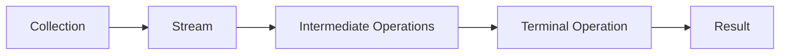

### Important rule

Intermediate operations are lazy. They run only when a terminal operation is called.

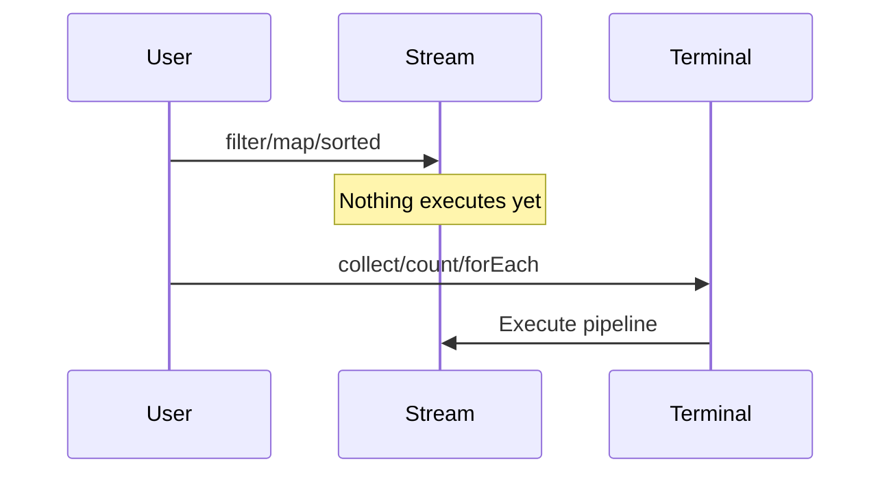

### Example: First stream

```java
import java.util.Arrays;
import java.util.List;

public class Main {
    public static void main(String[] args) {
        List<String> names = Arrays.asList("Amit", "Neha", "Ravi", "Anu");

        names.stream()
             .filter(name -> name.startsWith("A"))
             .forEach(System.out::println);
    }
}
```

Expected output:

```text
Amit
Anu
```

---

## 6. Stream Operations by Type

### 6.1 `filter()` — keep matching items

```java
import java.util.Arrays;
import java.util.List;

public class Main {
    public static void main(String[] args) {
        List<Integer> numbers = Arrays.asList(1, 2, 3, 4, 5, 6);

        numbers.stream()
               .filter(n -> n % 2 == 0)
               .forEach(System.out::println);
    }
}
```

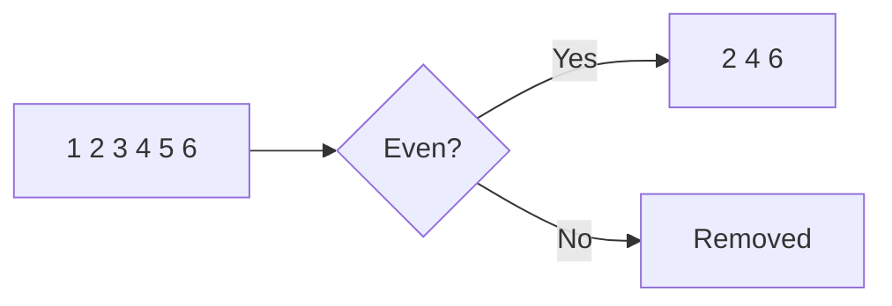

### 6.2 `map()` — transform each item

```java
import java.util.Arrays;
import java.util.List;

public class Main {
    public static void main(String[] args) {
        List<String> names = Arrays.asList("amit", "neha", "ravi");

        names.stream()
             .map(name -> name.toUpperCase())
             .forEach(System.out::println);
    }
}
```

### 6.3 `flatMap()` — flatten nested data

```java
import java.util.Arrays;
import java.util.List;

public class Main {
    public static void main(String[] args) {
        List<List<String>> groups = Arrays.asList(
            Arrays.asList("A", "B"),
            Arrays.asList("C", "D")
        );

        groups.stream()
              .flatMap(group -> group.stream())
              .forEach(System.out::println);
    }
}
```

```mermaid
flowchart LR
    A[[A,B] [C,D]] --> B[flatMap]
    B --> C[A B C D]
```

### 6.4 `sorted()` — sort values

```java
import java.util.Arrays;
import java.util.List;

public class Main {
    public static void main(String[] args) {
        List<Integer> numbers = Arrays.asList(5, 2, 8, 1, 3);

        numbers.stream()
               .sorted()
               .forEach(System.out::println);
    }
}
```

### 6.5 Custom sorting

```java
import java.util.Arrays;
import java.util.Comparator;
import java.util.List;

class Employee {
    String name;
    int salary;

    Employee(String name, int salary) {
        this.name = name;
        this.salary = salary;
    }
}

public class Main {
    public static void main(String[] args) {
        List<Employee> employees = Arrays.asList(
            new Employee("Amit", 50000),
            new Employee("Neha", 70000),
            new Employee("Ravi", 40000)
        );

        employees.stream()
                 .sorted(Comparator.comparing(emp -> emp.salary))
                 .forEach(emp -> System.out.println(emp.name + " - " + emp.salary));
    }
}
```

### 6.6 `distinct()` — remove duplicates

```java
import java.util.Arrays;
import java.util.List;

public class Main {
    public static void main(String[] args) {
        List<Integer> numbers = Arrays.asList(1, 2, 2, 3, 3, 4);

        numbers.stream()
               .distinct()
               .forEach(System.out::println);
    }
}
```

### 6.7 `limit()` and `skip()`

```java
import java.util.Arrays;
import java.util.List;

public class Main {
    public static void main(String[] args) {
        List<String> names = Arrays.asList("A", "B", "C", "D", "E");

        names.stream()
             .skip(2)
             .limit(2)
             .forEach(System.out::println);
    }
}
```

Expected output:

```text
C
D
```

### 6.8 `reduce()` — combine values into one result

```java
import java.util.Arrays;
import java.util.List;

public class Main {
    public static void main(String[] args) {
        List<Integer> numbers = Arrays.asList(1, 2, 3, 4, 5);

        int sum = numbers.stream()
                         .reduce(0, (a, b) -> a + b);

        System.out.println(sum);
    }
}
```

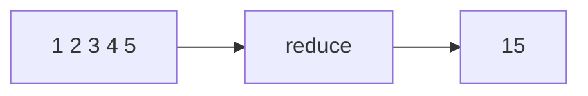

### 6.9 Matching operations

```java
import java.util.Arrays;
import java.util.List;

public class Main {
    public static void main(String[] args) {
        List<Integer> numbers = Arrays.asList(2, 4, 6, 8);

        boolean allEven = numbers.stream().allMatch(n -> n % 2 == 0);
        boolean anyGreaterThanFive = numbers.stream().anyMatch(n -> n > 5);
        boolean noneNegative = numbers.stream().noneMatch(n -> n < 0);

        System.out.println(allEven);
        System.out.println(anyGreaterThanFive);
        System.out.println(noneNegative);
    }
}
```

### 6.10 Finding operations

```java
import java.util.Arrays;
import java.util.List;
import java.util.Optional;

public class Main {
    public static void main(String[] args) {
        List<String> names = Arrays.asList("Amit", "Neha", "Ravi");

        Optional<String> first = names.stream().findFirst();
        Optional<String> any = names.stream().findAny();

        System.out.println(first.orElse("No name found"));
        System.out.println(any.orElse("No name found"));
    }
}
```

---

## 7. Collectors

Collectors convert stream results into lists, sets, maps, strings, or grouped data.

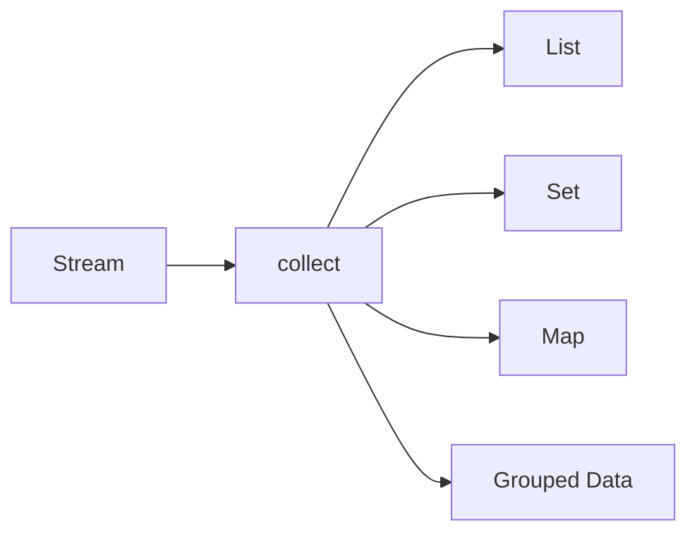

### 7.1 Collect to List

```java
import java.util.Arrays;
import java.util.List;
import java.util.stream.Collectors;

public class Main {
    public static void main(String[] args) {
        List<String> names = Arrays.asList("Amit", "Neha", "Ravi", "Anu");

        List<String> result = names.stream()
                                   .filter(name -> name.startsWith("A"))
                                   .collect(Collectors.toList());

        System.out.println(result);
    }
}
```

### 7.2 Collect to Set

```java
import java.util.Arrays;
import java.util.List;
import java.util.Set;
import java.util.stream.Collectors;

public class Main {
    public static void main(String[] args) {
        List<Integer> numbers = Arrays.asList(1, 2, 2, 3, 3, 4);

        Set<Integer> unique = numbers.stream()
                                     .collect(Collectors.toSet());

        System.out.println(unique);
    }
}
```

### 7.3 Collect to Map

```java
import java.util.Arrays;
import java.util.List;
import java.util.Map;
import java.util.stream.Collectors;

class Employee {
    int id;
    String name;

    Employee(int id, String name) {
        this.id = id;
        this.name = name;
    }
}

public class Main {
    public static void main(String[] args) {
        List<Employee> employees = Arrays.asList(
            new Employee(1, "Amit"),
            new Employee(2, "Neha")
        );

        Map<Integer, String> employeeMap = employees.stream()
            .collect(Collectors.toMap(emp -> emp.id, emp -> emp.name));

        System.out.println(employeeMap);
    }
}
```

### 7.4 Grouping by field

```java
import java.util.Arrays;
import java.util.List;
import java.util.Map;
import java.util.stream.Collectors;

class Employee {
    String name;
    String department;

    Employee(String name, String department) {
        this.name = name;
        this.department = department;
    }
}

public class Main {
    public static void main(String[] args) {
        List<Employee> employees = Arrays.asList(
            new Employee("Amit", "IT"),
            new Employee("Neha", "HR"),
            new Employee("Ravi", "IT")
        );

        Map<String, List<Employee>> grouped = employees.stream()
            .collect(Collectors.groupingBy(emp -> emp.department));

        grouped.forEach((dept, list) -> {
            System.out.println(dept);
            list.forEach(emp -> System.out.println("  " + emp.name));
        });
    }
}
```

### 7.5 Joining strings

```java
import java.util.Arrays;
import java.util.List;
import java.util.stream.Collectors;

public class Main {
    public static void main(String[] args) {
        List<String> names = Arrays.asList("Amit", "Neha", "Ravi");

        String result = names.stream()
                             .collect(Collectors.joining(", "));

        System.out.println(result);
    }
}
```

---

## 8. Optional

`Optional` helps avoid `NullPointerException` by representing a value that may or may not exist.

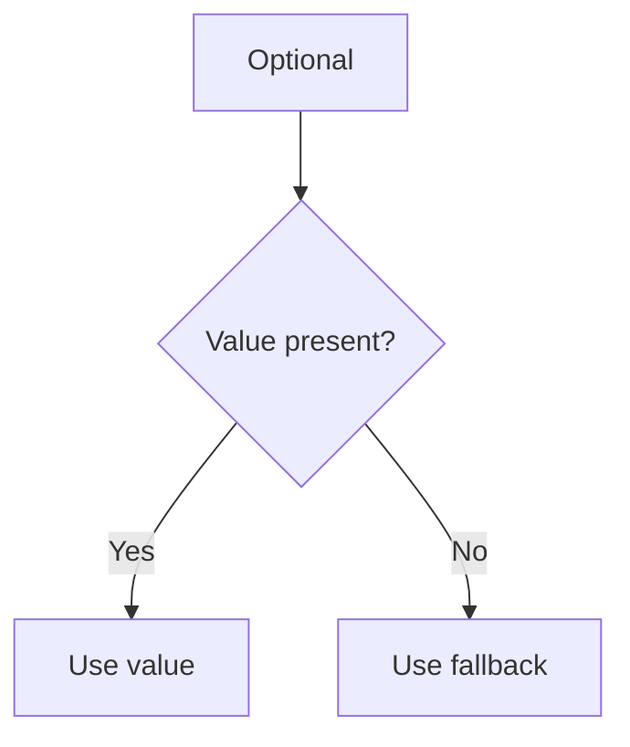

### Bad style before Optional

```java
String name = null;

if (name != null) {
    System.out.println(name.toUpperCase());
} else {
    System.out.println("Unknown");
}
```

### Better style with Optional

```java
import java.util.Optional;

public class Main {
    public static void main(String[] args) {
        Optional<String> name = Optional.ofNullable(null);

        System.out.println(name.orElse("Unknown"));
    }
}
```

### Optional with `map()`

```java
import java.util.Optional;

public class Main {
    public static void main(String[] args) {
        Optional<String> name = Optional.of("amit");

        String result = name.map(String::toUpperCase)
                            .orElse("Unknown");

        System.out.println(result);
    }
}
```

### Optional with `filter()`

```java
import java.util.Optional;

public class Main {
    public static void main(String[] args) {
        Optional<String> name = Optional.of("Amit");

        name.filter(n -> n.startsWith("A"))
            .ifPresent(System.out::println);
    }
}
```

---

## 9. Default and Static Interface Methods

Java 8 allows interfaces to have default and static methods.

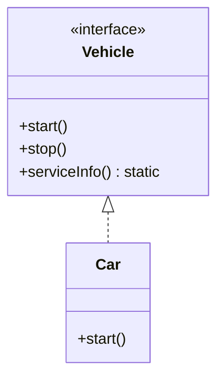

### Default method example

```java
interface Vehicle {
    void start();

    default void stop() {
        System.out.println("Vehicle stopped");
    }
}

class Car implements Vehicle {
    public void start() {
        System.out.println("Car started");
    }
}

public class Main {
    public static void main(String[] args) {
        Car car = new Car();
        car.start();
        car.stop();
    }
}
```

### Static method example

```java
interface Vehicle {
    static void serviceInfo() {
        System.out.println("Service every 6 months");
    }
}

public class Main {
    public static void main(String[] args) {
        Vehicle.serviceInfo();
    }
}
```

---

## 10. New Date and Time API

Java 8 introduced the `java.time` package.

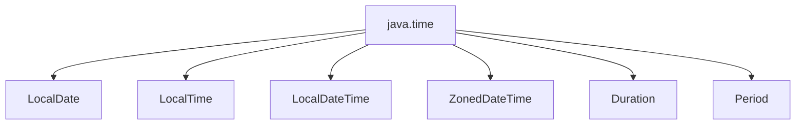

### LocalDate

```java
import java.time.LocalDate;

public class Main {
    public static void main(String[] args) {
        LocalDate today = LocalDate.now();
        LocalDate birthday = LocalDate.of(2000, 5, 20);

        System.out.println(today);
        System.out.println(birthday);
    }
}
```

### LocalTime

```java
import java.time.LocalTime;

public class Main {
    public static void main(String[] args) {
        LocalTime now = LocalTime.now();
        System.out.println(now);
    }
}
```

### LocalDateTime

```java
import java.time.LocalDateTime;

public class Main {
    public static void main(String[] args) {
        LocalDateTime dateTime = LocalDateTime.now();
        System.out.println(dateTime);
    }
}
```

### Period between dates

```java
import java.time.LocalDate;
import java.time.Period;

public class Main {
    public static void main(String[] args) {
        LocalDate start = LocalDate.of(2020, 1, 1);
        LocalDate end = LocalDate.of(2025, 1, 1);

        Period period = Period.between(start, end);

        System.out.println(period.getYears() + " years");
    }
}
```

### Date formatting

```java
import java.time.LocalDate;
import java.time.format.DateTimeFormatter;

public class Main {
    public static void main(String[] args) {
        LocalDate today = LocalDate.now();
        DateTimeFormatter formatter = DateTimeFormatter.ofPattern("dd-MM-yyyy");

        System.out.println(today.format(formatter));
    }
}
```

---

## 11. CompletableFuture Basics

`CompletableFuture` helps run tasks asynchronously.

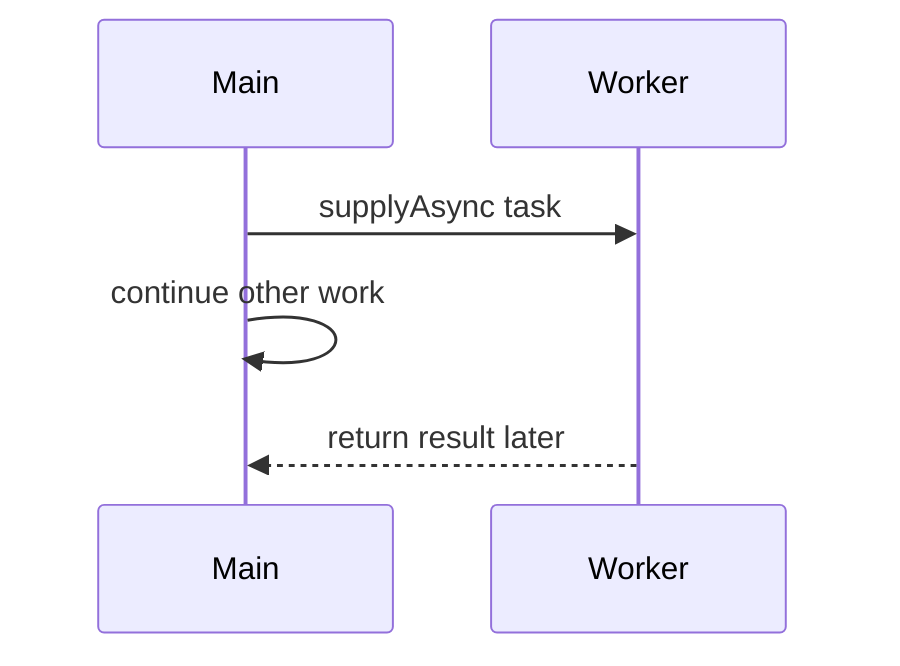

### Simple async example

```java
import java.util.concurrent.CompletableFuture;

public class Main {
    public static void main(String[] args) throws Exception {
        CompletableFuture<String> future = CompletableFuture.supplyAsync(() -> {
            return "Data loaded";
        });

        System.out.println(future.get());
    }
}
```

### Chaining with `thenApply()`

```java
import java.util.concurrent.CompletableFuture;

public class Main {
    public static void main(String[] args) throws Exception {
        CompletableFuture<String> future = CompletableFuture
            .supplyAsync(() -> "java")
            .thenApply(text -> text.toUpperCase())
            .thenApply(text -> "Result: " + text);

        System.out.println(future.get());
    }
}
```

### Consuming with `thenAccept()`

```java
import java.util.concurrent.CompletableFuture;

public class Main {
    public static void main(String[] args) throws Exception {
        CompletableFuture<Void> future = CompletableFuture
            .supplyAsync(() -> "Report")
            .thenAccept(report -> System.out.println("Generated: " + report));

        future.get();
    }
}
```

---

## 12. Mini Project

Build a small employee report using Java 8 features.

### Goal

Given employees, find:

- Employees from IT department
- Names in uppercase
- Average salary
- Employees grouped by department

### Full code

```java
import java.util.Arrays;
import java.util.List;
import java.util.Map;
import java.util.stream.Collectors;

class Employee {
    int id;
    String name;
    String department;
    double salary;

    Employee(int id, String name, String department, double salary) {
        this.id = id;
        this.name = name;
        this.department = department;
        this.salary = salary;
    }

    public String toString() {
        return id + " - " + name + " - " + department + " - " + salary;
    }
}

public class Main {
    public static void main(String[] args) {
        List<Employee> employees = Arrays.asList(
            new Employee(1, "Amit", "IT", 60000),
            new Employee(2, "Neha", "HR", 50000),
            new Employee(3, "Ravi", "IT", 70000),
            new Employee(4, "Sara", "Finance", 65000),
            new Employee(5, "John", "HR", 45000)
        );

        System.out.println("IT Employees:");
        employees.stream()
                 .filter(emp -> emp.department.equals("IT"))
                 .forEach(System.out::println);

        System.out.println("\nUppercase Names:");
        List<String> upperNames = employees.stream()
            .map(emp -> emp.name.toUpperCase())
            .collect(Collectors.toList());
        System.out.println(upperNames);

        System.out.println("\nAverage Salary:");
        double averageSalary = employees.stream()
            .mapToDouble(emp -> emp.salary)
            .average()
            .orElse(0.0);
        System.out.println(averageSalary);

        System.out.println("\nGrouped By Department:");
        Map<String, List<Employee>> grouped = employees.stream()
            .collect(Collectors.groupingBy(emp -> emp.department));

        grouped.forEach((department, employeeList) -> {
            System.out.println(department);
            employeeList.forEach(emp -> System.out.println("  " + emp.name));
        });
    }
}
```

### Mini project pipeline diagram

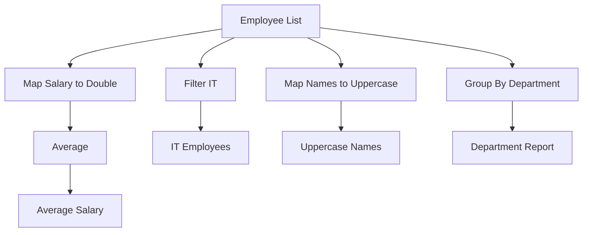

---

## 13. Practice Tasks

### Task 1: Filter numbers

Given:

```java
List<Integer> numbers = Arrays.asList(10, 15, 20, 25, 30);
```

Print only numbers greater than 20.

Expected output:

```text
25
30
```

### Task 2: Convert names

Given:

```java
List<String> names = Arrays.asList("amit", "neha", "ravi");
```

Convert all names to uppercase and collect them into a list.

### Task 3: Count names starting with A

Given:

```java
List<String> names = Arrays.asList("Amit", "Anu", "Ravi", "Neha");
```

Count names starting with `A`.

### Task 4: Find highest salary

Given employees, find the employee with the highest salary.

Hint:

```java
employees.stream()
         .max(Comparator.comparing(emp -> emp.salary));
```

### Task 5: Group products by category

Create a `Product` class with:

- `id`
- `name`
- `category`
- `price`

Group products by category using `Collectors.groupingBy()`.

---

## Quick Revision Cheat Sheet

| Feature | Main Use |
|---|---|
| Lambda | Write short function logic |
| Functional Interface | Target type for lambda |
| Method Reference | Shorter lambda for existing methods |
| Stream | Process collections declaratively |
| filter | Keep matching values |
| map | Transform values |
| flatMap | Flatten nested values |
| reduce | Combine into one value |
| collect | Convert stream to collection/result |
| Optional | Handle missing values safely |
| Default Method | Add method body in interface |
| java.time | Modern date/time handling |
| CompletableFuture | Async programming |

---

## Recommended Learning Order

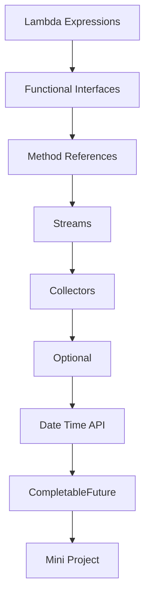

---

## Final Advice

Do not only read the examples. Type each one, run it, change it, and break it. Java 8 features become easy when you practice small transformations repeatedly.
