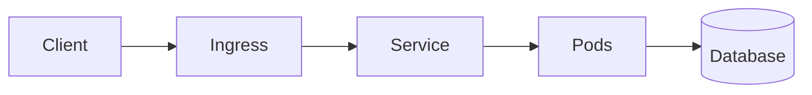

# Kubernetes + Spring Boot PRO Handbook (70KB+)


# Chapter 1: Kubernetes + Spring Boot Deep Dive

## Overview
End-to-end explanation of concept 1 with production practices.

## Architecture


## Spring Boot Example
```java
@RestController
public class DemoController {
    @GetMapping("/health")
    public String health() {
        return "OK-1";
    }
}
```

## Dockerfile
```dockerfile
FROM eclipse-temurin:21-jre
WORKDIR /app
COPY target/app.jar app.jar
ENTRYPOINT ["java","-jar","/app.jar"]
```

## Kubernetes Deployment
```yaml
apiVersion: apps/v1
kind: Deployment
metadata:
  name: demo-1
spec:
  replicas: 3
  selector:
    matchLabels:
      app: demo-1
  template:
    metadata:
      labels:
        app: demo-1
    spec:
      containers:
        - name: app
          image: demo:1
          ports:
            - containerPort: 8080
          readinessProbe:
            httpGet:
              path: /health
              port: 8080
          livenessProbe:
            httpGet:
              path: /health
              port: 8080
```

## Service
```yaml
apiVersion: v1
kind: Service
metadata:
  name: demo-svc-1
spec:
  selector:
    app: demo-1
  ports:
    - port: 80
      targetPort: 8080
  type: ClusterIP
```

## Ingress
```yaml
apiVersion: networking.k8s.io/v1
kind: Ingress
metadata:
  name: demo-ing-1
spec:
  rules:
    - host: demo1.local
      http:
        paths:
          - path: /
            pathType: Prefix
            backend:
              service:
                name: demo-svc-1
                port:
                  number: 80
```

## Commands
```bash
kubectl apply -f deployment.yaml
kubectl get pods -o wide
kubectl describe pod <pod>
kubectl logs <pod>
kubectl rollout status deployment/demo-1
kubectl scale deployment demo-1 --replicas=5
```

## Troubleshooting
- CrashLoopBackOff → check logs and probes
- ImagePullBackOff → check image/registry auth
- Pending → check resources, taints, PVC

## Production Notes
- Use HPA with metrics server
- Set requests/limits
- Use namespaces per env
- Use secrets for credentials
- Add PodDisruptionBudget

# Chapter 2: Kubernetes + Spring Boot Deep Dive

## Overview
End-to-end explanation of concept 2 with production practices.

## Architecture


## Spring Boot Example
```java
@RestController
public class DemoController {
    @GetMapping("/health")
    public String health() {
        return "OK-2";
    }
}
```

## Dockerfile
```dockerfile
FROM eclipse-temurin:21-jre
WORKDIR /app
COPY target/app.jar app.jar
ENTRYPOINT ["java","-jar","/app.jar"]
```

## Kubernetes Deployment
```yaml
apiVersion: apps/v1
kind: Deployment
metadata:
  name: demo-2
spec:
  replicas: 3
  selector:
    matchLabels:
      app: demo-2
  template:
    metadata:
      labels:
        app: demo-2
    spec:
      containers:
        - name: app
          image: demo:2
          ports:
            - containerPort: 8080
          readinessProbe:
            httpGet:
              path: /health
              port: 8080
          livenessProbe:
            httpGet:
              path: /health
              port: 8080
```

## Service
```yaml
apiVersion: v1
kind: Service
metadata:
  name: demo-svc-2
spec:
  selector:
    app: demo-2
  ports:
    - port: 80
      targetPort: 8080
  type: ClusterIP
```

## Ingress
```yaml
apiVersion: networking.k8s.io/v1
kind: Ingress
metadata:
  name: demo-ing-2
spec:
  rules:
    - host: demo2.local
      http:
        paths:
          - path: /
            pathType: Prefix
            backend:
              service:
                name: demo-svc-2
                port:
                  number: 80
```

## Commands
```bash
kubectl apply -f deployment.yaml
kubectl get pods -o wide
kubectl describe pod <pod>
kubectl logs <pod>
kubectl rollout status deployment/demo-2
kubectl scale deployment demo-2 --replicas=5
```

## Troubleshooting
- CrashLoopBackOff → check logs and probes
- ImagePullBackOff → check image/registry auth
- Pending → check resources, taints, PVC

## Production Notes
- Use HPA with metrics server
- Set requests/limits
- Use namespaces per env
- Use secrets for credentials
- Add PodDisruptionBudget

# Chapter 3: Kubernetes + Spring Boot Deep Dive

## Overview
End-to-end explanation of concept 3 with production practices.

## Architecture


## Spring Boot Example
```java
@RestController
public class DemoController {
    @GetMapping("/health")
    public String health() {
        return "OK-3";
    }
}
```

## Dockerfile
```dockerfile
FROM eclipse-temurin:21-jre
WORKDIR /app
COPY target/app.jar app.jar
ENTRYPOINT ["java","-jar","/app.jar"]
```

## Kubernetes Deployment
```yaml
apiVersion: apps/v1
kind: Deployment
metadata:
  name: demo-3
spec:
  replicas: 3
  selector:
    matchLabels:
      app: demo-3
  template:
    metadata:
      labels:
        app: demo-3
    spec:
      containers:
        - name: app
          image: demo:3
          ports:
            - containerPort: 8080
          readinessProbe:
            httpGet:
              path: /health
              port: 8080
          livenessProbe:
            httpGet:
              path: /health
              port: 8080
```

## Service
```yaml
apiVersion: v1
kind: Service
metadata:
  name: demo-svc-3
spec:
  selector:
    app: demo-3
  ports:
    - port: 80
      targetPort: 8080
  type: ClusterIP
```

## Ingress
```yaml
apiVersion: networking.k8s.io/v1
kind: Ingress
metadata:
  name: demo-ing-3
spec:
  rules:
    - host: demo3.local
      http:
        paths:
          - path: /
            pathType: Prefix
            backend:
              service:
                name: demo-svc-3
                port:
                  number: 80
```

## Commands
```bash
kubectl apply -f deployment.yaml
kubectl get pods -o wide
kubectl describe pod <pod>
kubectl logs <pod>
kubectl rollout status deployment/demo-3
kubectl scale deployment demo-3 --replicas=5
```

## Troubleshooting
- CrashLoopBackOff → check logs and probes
- ImagePullBackOff → check image/registry auth
- Pending → check resources, taints, PVC

## Production Notes
- Use HPA with metrics server
- Set requests/limits
- Use namespaces per env
- Use secrets for credentials
- Add PodDisruptionBudget

# Chapter 4: Kubernetes + Spring Boot Deep Dive

## Overview
End-to-end explanation of concept 4 with production practices.

## Architecture


## Spring Boot Example
```java
@RestController
public class DemoController {
    @GetMapping("/health")
    public String health() {
        return "OK-4";
    }
}
```

## Dockerfile
```dockerfile
FROM eclipse-temurin:21-jre
WORKDIR /app
COPY target/app.jar app.jar
ENTRYPOINT ["java","-jar","/app.jar"]
```

## Kubernetes Deployment
```yaml
apiVersion: apps/v1
kind: Deployment
metadata:
  name: demo-4
spec:
  replicas: 3
  selector:
    matchLabels:
      app: demo-4
  template:
    metadata:
      labels:
        app: demo-4
    spec:
      containers:
        - name: app
          image: demo:4
          ports:
            - containerPort: 8080
          readinessProbe:
            httpGet:
              path: /health
              port: 8080
          livenessProbe:
            httpGet:
              path: /health
              port: 8080
```

## Service
```yaml
apiVersion: v1
kind: Service
metadata:
  name: demo-svc-4
spec:
  selector:
    app: demo-4
  ports:
    - port: 80
      targetPort: 8080
  type: ClusterIP
```

## Ingress
```yaml
apiVersion: networking.k8s.io/v1
kind: Ingress
metadata:
  name: demo-ing-4
spec:
  rules:
    - host: demo4.local
      http:
        paths:
          - path: /
            pathType: Prefix
            backend:
              service:
                name: demo-svc-4
                port:
                  number: 80
```

## Commands
```bash
kubectl apply -f deployment.yaml
kubectl get pods -o wide
kubectl describe pod <pod>
kubectl logs <pod>
kubectl rollout status deployment/demo-4
kubectl scale deployment demo-4 --replicas=5
```

## Troubleshooting
- CrashLoopBackOff → check logs and probes
- ImagePullBackOff → check image/registry auth
- Pending → check resources, taints, PVC

## Production Notes
- Use HPA with metrics server
- Set requests/limits
- Use namespaces per env
- Use secrets for credentials
- Add PodDisruptionBudget

# Chapter 5: Kubernetes + Spring Boot Deep Dive

## Overview
End-to-end explanation of concept 5 with production practices.

## Architecture


## Spring Boot Example
```java
@RestController
public class DemoController {
    @GetMapping("/health")
    public String health() {
        return "OK-5";
    }
}
```

## Dockerfile
```dockerfile
FROM eclipse-temurin:21-jre
WORKDIR /app
COPY target/app.jar app.jar
ENTRYPOINT ["java","-jar","/app.jar"]
```

## Kubernetes Deployment
```yaml
apiVersion: apps/v1
kind: Deployment
metadata:
  name: demo-5
spec:
  replicas: 3
  selector:
    matchLabels:
      app: demo-5
  template:
    metadata:
      labels:
        app: demo-5
    spec:
      containers:
        - name: app
          image: demo:5
          ports:
            - containerPort: 8080
          readinessProbe:
            httpGet:
              path: /health
              port: 8080
          livenessProbe:
            httpGet:
              path: /health
              port: 8080
```

## Service
```yaml
apiVersion: v1
kind: Service
metadata:
  name: demo-svc-5
spec:
  selector:
    app: demo-5
  ports:
    - port: 80
      targetPort: 8080
  type: ClusterIP
```

## Ingress
```yaml
apiVersion: networking.k8s.io/v1
kind: Ingress
metadata:
  name: demo-ing-5
spec:
  rules:
    - host: demo5.local
      http:
        paths:
          - path: /
            pathType: Prefix
            backend:
              service:
                name: demo-svc-5
                port:
                  number: 80
```

## Commands
```bash
kubectl apply -f deployment.yaml
kubectl get pods -o wide
kubectl describe pod <pod>
kubectl logs <pod>
kubectl rollout status deployment/demo-5
kubectl scale deployment demo-5 --replicas=5
```

## Troubleshooting
- CrashLoopBackOff → check logs and probes
- ImagePullBackOff → check image/registry auth
- Pending → check resources, taints, PVC

## Production Notes
- Use HPA with metrics server
- Set requests/limits
- Use namespaces per env
- Use secrets for credentials
- Add PodDisruptionBudget

# Chapter 6: Kubernetes + Spring Boot Deep Dive

## Overview
End-to-end explanation of concept 6 with production practices.

## Architecture


## Spring Boot Example
```java
@RestController
public class DemoController {
    @GetMapping("/health")
    public String health() {
        return "OK-6";
    }
}
```

## Dockerfile
```dockerfile
FROM eclipse-temurin:21-jre
WORKDIR /app
COPY target/app.jar app.jar
ENTRYPOINT ["java","-jar","/app.jar"]
```

## Kubernetes Deployment
```yaml
apiVersion: apps/v1
kind: Deployment
metadata:
  name: demo-6
spec:
  replicas: 3
  selector:
    matchLabels:
      app: demo-6
  template:
    metadata:
      labels:
        app: demo-6
    spec:
      containers:
        - name: app
          image: demo:6
          ports:
            - containerPort: 8080
          readinessProbe:
            httpGet:
              path: /health
              port: 8080
          livenessProbe:
            httpGet:
              path: /health
              port: 8080
```

## Service
```yaml
apiVersion: v1
kind: Service
metadata:
  name: demo-svc-6
spec:
  selector:
    app: demo-6
  ports:
    - port: 80
      targetPort: 8080
  type: ClusterIP
```

## Ingress
```yaml
apiVersion: networking.k8s.io/v1
kind: Ingress
metadata:
  name: demo-ing-6
spec:
  rules:
    - host: demo6.local
      http:
        paths:
          - path: /
            pathType: Prefix
            backend:
              service:
                name: demo-svc-6
                port:
                  number: 80
```

## Commands
```bash
kubectl apply -f deployment.yaml
kubectl get pods -o wide
kubectl describe pod <pod>
kubectl logs <pod>
kubectl rollout status deployment/demo-6
kubectl scale deployment demo-6 --replicas=5
```

## Troubleshooting
- CrashLoopBackOff → check logs and probes
- ImagePullBackOff → check image/registry auth
- Pending → check resources, taints, PVC

## Production Notes
- Use HPA with metrics server
- Set requests/limits
- Use namespaces per env
- Use secrets for credentials
- Add PodDisruptionBudget

# Chapter 7: Kubernetes + Spring Boot Deep Dive

## Overview
End-to-end explanation of concept 7 with production practices.

## Architecture


## Spring Boot Example
```java
@RestController
public class DemoController {
    @GetMapping("/health")
    public String health() {
        return "OK-7";
    }
}
```

## Dockerfile
```dockerfile
FROM eclipse-temurin:21-jre
WORKDIR /app
COPY target/app.jar app.jar
ENTRYPOINT ["java","-jar","/app.jar"]
```

## Kubernetes Deployment
```yaml
apiVersion: apps/v1
kind: Deployment
metadata:
  name: demo-7
spec:
  replicas: 3
  selector:
    matchLabels:
      app: demo-7
  template:
    metadata:
      labels:
        app: demo-7
    spec:
      containers:
        - name: app
          image: demo:7
          ports:
            - containerPort: 8080
          readinessProbe:
            httpGet:
              path: /health
              port: 8080
          livenessProbe:
            httpGet:
              path: /health
              port: 8080
```

## Service
```yaml
apiVersion: v1
kind: Service
metadata:
  name: demo-svc-7
spec:
  selector:
    app: demo-7
  ports:
    - port: 80
      targetPort: 8080
  type: ClusterIP
```

## Ingress
```yaml
apiVersion: networking.k8s.io/v1
kind: Ingress
metadata:
  name: demo-ing-7
spec:
  rules:
    - host: demo7.local
      http:
        paths:
          - path: /
            pathType: Prefix
            backend:
              service:
                name: demo-svc-7
                port:
                  number: 80
```

## Commands
```bash
kubectl apply -f deployment.yaml
kubectl get pods -o wide
kubectl describe pod <pod>
kubectl logs <pod>
kubectl rollout status deployment/demo-7
kubectl scale deployment demo-7 --replicas=5
```

## Troubleshooting
- CrashLoopBackOff → check logs and probes
- ImagePullBackOff → check image/registry auth
- Pending → check resources, taints, PVC

## Production Notes
- Use HPA with metrics server
- Set requests/limits
- Use namespaces per env
- Use secrets for credentials
- Add PodDisruptionBudget

# Chapter 8: Kubernetes + Spring Boot Deep Dive

## Overview
End-to-end explanation of concept 8 with production practices.

## Architecture


## Spring Boot Example
```java
@RestController
public class DemoController {
    @GetMapping("/health")
    public String health() {
        return "OK-8";
    }
}
```

## Dockerfile
```dockerfile
FROM eclipse-temurin:21-jre
WORKDIR /app
COPY target/app.jar app.jar
ENTRYPOINT ["java","-jar","/app.jar"]
```

## Kubernetes Deployment
```yaml
apiVersion: apps/v1
kind: Deployment
metadata:
  name: demo-8
spec:
  replicas: 3
  selector:
    matchLabels:
      app: demo-8
  template:
    metadata:
      labels:
        app: demo-8
    spec:
      containers:
        - name: app
          image: demo:8
          ports:
            - containerPort: 8080
          readinessProbe:
            httpGet:
              path: /health
              port: 8080
          livenessProbe:
            httpGet:
              path: /health
              port: 8080
```

## Service
```yaml
apiVersion: v1
kind: Service
metadata:
  name: demo-svc-8
spec:
  selector:
    app: demo-8
  ports:
    - port: 80
      targetPort: 8080
  type: ClusterIP
```

## Ingress
```yaml
apiVersion: networking.k8s.io/v1
kind: Ingress
metadata:
  name: demo-ing-8
spec:
  rules:
    - host: demo8.local
      http:
        paths:
          - path: /
            pathType: Prefix
            backend:
              service:
                name: demo-svc-8
                port:
                  number: 80
```

## Commands
```bash
kubectl apply -f deployment.yaml
kubectl get pods -o wide
kubectl describe pod <pod>
kubectl logs <pod>
kubectl rollout status deployment/demo-8
kubectl scale deployment demo-8 --replicas=5
```

## Troubleshooting
- CrashLoopBackOff → check logs and probes
- ImagePullBackOff → check image/registry auth
- Pending → check resources, taints, PVC

## Production Notes
- Use HPA with metrics server
- Set requests/limits
- Use namespaces per env
- Use secrets for credentials
- Add PodDisruptionBudget

# Chapter 9: Kubernetes + Spring Boot Deep Dive

## Overview
End-to-end explanation of concept 9 with production practices.

## Architecture


## Spring Boot Example
```java
@RestController
public class DemoController {
    @GetMapping("/health")
    public String health() {
        return "OK-9";
    }
}
```

## Dockerfile
```dockerfile
FROM eclipse-temurin:21-jre
WORKDIR /app
COPY target/app.jar app.jar
ENTRYPOINT ["java","-jar","/app.jar"]
```

## Kubernetes Deployment
```yaml
apiVersion: apps/v1
kind: Deployment
metadata:
  name: demo-9
spec:
  replicas: 3
  selector:
    matchLabels:
      app: demo-9
  template:
    metadata:
      labels:
        app: demo-9
    spec:
      containers:
        - name: app
          image: demo:9
          ports:
            - containerPort: 8080
          readinessProbe:
            httpGet:
              path: /health
              port: 8080
          livenessProbe:
            httpGet:
              path: /health
              port: 8080
```

## Service
```yaml
apiVersion: v1
kind: Service
metadata:
  name: demo-svc-9
spec:
  selector:
    app: demo-9
  ports:
    - port: 80
      targetPort: 8080
  type: ClusterIP
```

## Ingress
```yaml
apiVersion: networking.k8s.io/v1
kind: Ingress
metadata:
  name: demo-ing-9
spec:
  rules:
    - host: demo9.local
      http:
        paths:
          - path: /
            pathType: Prefix
            backend:
              service:
                name: demo-svc-9
                port:
                  number: 80
```

## Commands
```bash
kubectl apply -f deployment.yaml
kubectl get pods -o wide
kubectl describe pod <pod>
kubectl logs <pod>
kubectl rollout status deployment/demo-9
kubectl scale deployment demo-9 --replicas=5
```

## Troubleshooting
- CrashLoopBackOff → check logs and probes
- ImagePullBackOff → check image/registry auth
- Pending → check resources, taints, PVC

## Production Notes
- Use HPA with metrics server
- Set requests/limits
- Use namespaces per env
- Use secrets for credentials
- Add PodDisruptionBudget

# Chapter 10: Kubernetes + Spring Boot Deep Dive

## Overview
End-to-end explanation of concept 10 with production practices.

## Architecture


## Spring Boot Example
```java
@RestController
public class DemoController {
    @GetMapping("/health")
    public String health() {
        return "OK-10";
    }
}
```

## Dockerfile
```dockerfile
FROM eclipse-temurin:21-jre
WORKDIR /app
COPY target/app.jar app.jar
ENTRYPOINT ["java","-jar","/app.jar"]
```

## Kubernetes Deployment
```yaml
apiVersion: apps/v1
kind: Deployment
metadata:
  name: demo-10
spec:
  replicas: 3
  selector:
    matchLabels:
      app: demo-10
  template:
    metadata:
      labels:
        app: demo-10
    spec:
      containers:
        - name: app
          image: demo:10
          ports:
            - containerPort: 8080
          readinessProbe:
            httpGet:
              path: /health
              port: 8080
          livenessProbe:
            httpGet:
              path: /health
              port: 8080
```

## Service
```yaml
apiVersion: v1
kind: Service
metadata:
  name: demo-svc-10
spec:
  selector:
    app: demo-10
  ports:
    - port: 80
      targetPort: 8080
  type: ClusterIP
```

## Ingress
```yaml
apiVersion: networking.k8s.io/v1
kind: Ingress
metadata:
  name: demo-ing-10
spec:
  rules:
    - host: demo10.local
      http:
        paths:
          - path: /
            pathType: Prefix
            backend:
              service:
                name: demo-svc-10
                port:
                  number: 80
```

## Commands
```bash
kubectl apply -f deployment.yaml
kubectl get pods -o wide
kubectl describe pod <pod>
kubectl logs <pod>
kubectl rollout status deployment/demo-10
kubectl scale deployment demo-10 --replicas=5
```

## Troubleshooting
- CrashLoopBackOff → check logs and probes
- ImagePullBackOff → check image/registry auth
- Pending → check resources, taints, PVC

## Production Notes
- Use HPA with metrics server
- Set requests/limits
- Use namespaces per env
- Use secrets for credentials
- Add PodDisruptionBudget

# Chapter 11: Kubernetes + Spring Boot Deep Dive

## Overview
End-to-end explanation of concept 11 with production practices.

## Architecture


## Spring Boot Example
```java
@RestController
public class DemoController {
    @GetMapping("/health")
    public String health() {
        return "OK-11";
    }
}
```

## Dockerfile
```dockerfile
FROM eclipse-temurin:21-jre
WORKDIR /app
COPY target/app.jar app.jar
ENTRYPOINT ["java","-jar","/app.jar"]
```

## Kubernetes Deployment
```yaml
apiVersion: apps/v1
kind: Deployment
metadata:
  name: demo-11
spec:
  replicas: 3
  selector:
    matchLabels:
      app: demo-11
  template:
    metadata:
      labels:
        app: demo-11
    spec:
      containers:
        - name: app
          image: demo:11
          ports:
            - containerPort: 8080
          readinessProbe:
            httpGet:
              path: /health
              port: 8080
          livenessProbe:
            httpGet:
              path: /health
              port: 8080
```

## Service
```yaml
apiVersion: v1
kind: Service
metadata:
  name: demo-svc-11
spec:
  selector:
    app: demo-11
  ports:
    - port: 80
      targetPort: 8080
  type: ClusterIP
```

## Ingress
```yaml
apiVersion: networking.k8s.io/v1
kind: Ingress
metadata:
  name: demo-ing-11
spec:
  rules:
    - host: demo11.local
      http:
        paths:
          - path: /
            pathType: Prefix
            backend:
              service:
                name: demo-svc-11
                port:
                  number: 80
```

## Commands
```bash
kubectl apply -f deployment.yaml
kubectl get pods -o wide
kubectl describe pod <pod>
kubectl logs <pod>
kubectl rollout status deployment/demo-11
kubectl scale deployment demo-11 --replicas=5
```

## Troubleshooting
- CrashLoopBackOff → check logs and probes
- ImagePullBackOff → check image/registry auth
- Pending → check resources, taints, PVC

## Production Notes
- Use HPA with metrics server
- Set requests/limits
- Use namespaces per env
- Use secrets for credentials
- Add PodDisruptionBudget

# Chapter 12: Kubernetes + Spring Boot Deep Dive

## Overview
End-to-end explanation of concept 12 with production practices.

## Architecture


## Spring Boot Example
```java
@RestController
public class DemoController {
    @GetMapping("/health")
    public String health() {
        return "OK-12";
    }
}
```

## Dockerfile
```dockerfile
FROM eclipse-temurin:21-jre
WORKDIR /app
COPY target/app.jar app.jar
ENTRYPOINT ["java","-jar","/app.jar"]
```

## Kubernetes Deployment
```yaml
apiVersion: apps/v1
kind: Deployment
metadata:
  name: demo-12
spec:
  replicas: 3
  selector:
    matchLabels:
      app: demo-12
  template:
    metadata:
      labels:
        app: demo-12
    spec:
      containers:
        - name: app
          image: demo:12
          ports:
            - containerPort: 8080
          readinessProbe:
            httpGet:
              path: /health
              port: 8080
          livenessProbe:
            httpGet:
              path: /health
              port: 8080
```

## Service
```yaml
apiVersion: v1
kind: Service
metadata:
  name: demo-svc-12
spec:
  selector:
    app: demo-12
  ports:
    - port: 80
      targetPort: 8080
  type: ClusterIP
```

## Ingress
```yaml
apiVersion: networking.k8s.io/v1
kind: Ingress
metadata:
  name: demo-ing-12
spec:
  rules:
    - host: demo12.local
      http:
        paths:
          - path: /
            pathType: Prefix
            backend:
              service:
                name: demo-svc-12
                port:
                  number: 80
```

## Commands
```bash
kubectl apply -f deployment.yaml
kubectl get pods -o wide
kubectl describe pod <pod>
kubectl logs <pod>
kubectl rollout status deployment/demo-12
kubectl scale deployment demo-12 --replicas=5
```

## Troubleshooting
- CrashLoopBackOff → check logs and probes
- ImagePullBackOff → check image/registry auth
- Pending → check resources, taints, PVC

## Production Notes
- Use HPA with metrics server
- Set requests/limits
- Use namespaces per env
- Use secrets for credentials
- Add PodDisruptionBudget

# Chapter 13: Kubernetes + Spring Boot Deep Dive

## Overview
End-to-end explanation of concept 13 with production practices.

## Architecture


## Spring Boot Example
```java
@RestController
public class DemoController {
    @GetMapping("/health")
    public String health() {
        return "OK-13";
    }
}
```

## Dockerfile
```dockerfile
FROM eclipse-temurin:21-jre
WORKDIR /app
COPY target/app.jar app.jar
ENTRYPOINT ["java","-jar","/app.jar"]
```

## Kubernetes Deployment
```yaml
apiVersion: apps/v1
kind: Deployment
metadata:
  name: demo-13
spec:
  replicas: 3
  selector:
    matchLabels:
      app: demo-13
  template:
    metadata:
      labels:
        app: demo-13
    spec:
      containers:
        - name: app
          image: demo:13
          ports:
            - containerPort: 8080
          readinessProbe:
            httpGet:
              path: /health
              port: 8080
          livenessProbe:
            httpGet:
              path: /health
              port: 8080
```

## Service
```yaml
apiVersion: v1
kind: Service
metadata:
  name: demo-svc-13
spec:
  selector:
    app: demo-13
  ports:
    - port: 80
      targetPort: 8080
  type: ClusterIP
```

## Ingress
```yaml
apiVersion: networking.k8s.io/v1
kind: Ingress
metadata:
  name: demo-ing-13
spec:
  rules:
    - host: demo13.local
      http:
        paths:
          - path: /
            pathType: Prefix
            backend:
              service:
                name: demo-svc-13
                port:
                  number: 80
```

## Commands
```bash
kubectl apply -f deployment.yaml
kubectl get pods -o wide
kubectl describe pod <pod>
kubectl logs <pod>
kubectl rollout status deployment/demo-13
kubectl scale deployment demo-13 --replicas=5
```

## Troubleshooting
- CrashLoopBackOff → check logs and probes
- ImagePullBackOff → check image/registry auth
- Pending → check resources, taints, PVC

## Production Notes
- Use HPA with metrics server
- Set requests/limits
- Use namespaces per env
- Use secrets for credentials
- Add PodDisruptionBudget

# Chapter 14: Kubernetes + Spring Boot Deep Dive

## Overview
End-to-end explanation of concept 14 with production practices.

## Architecture


## Spring Boot Example
```java
@RestController
public class DemoController {
    @GetMapping("/health")
    public String health() {
        return "OK-14";
    }
}
```

## Dockerfile
```dockerfile
FROM eclipse-temurin:21-jre
WORKDIR /app
COPY target/app.jar app.jar
ENTRYPOINT ["java","-jar","/app.jar"]
```

## Kubernetes Deployment
```yaml
apiVersion: apps/v1
kind: Deployment
metadata:
  name: demo-14
spec:
  replicas: 3
  selector:
    matchLabels:
      app: demo-14
  template:
    metadata:
      labels:
        app: demo-14
    spec:
      containers:
        - name: app
          image: demo:14
          ports:
            - containerPort: 8080
          readinessProbe:
            httpGet:
              path: /health
              port: 8080
          livenessProbe:
            httpGet:
              path: /health
              port: 8080
```

## Service
```yaml
apiVersion: v1
kind: Service
metadata:
  name: demo-svc-14
spec:
  selector:
    app: demo-14
  ports:
    - port: 80
      targetPort: 8080
  type: ClusterIP
```

## Ingress
```yaml
apiVersion: networking.k8s.io/v1
kind: Ingress
metadata:
  name: demo-ing-14
spec:
  rules:
    - host: demo14.local
      http:
        paths:
          - path: /
            pathType: Prefix
            backend:
              service:
                name: demo-svc-14
                port:
                  number: 80
```

## Commands
```bash
kubectl apply -f deployment.yaml
kubectl get pods -o wide
kubectl describe pod <pod>
kubectl logs <pod>
kubectl rollout status deployment/demo-14
kubectl scale deployment demo-14 --replicas=5
```

## Troubleshooting
- CrashLoopBackOff → check logs and probes
- ImagePullBackOff → check image/registry auth
- Pending → check resources, taints, PVC

## Production Notes
- Use HPA with metrics server
- Set requests/limits
- Use namespaces per env
- Use secrets for credentials
- Add PodDisruptionBudget

# Chapter 15: Kubernetes + Spring Boot Deep Dive

## Overview
End-to-end explanation of concept 15 with production practices.

## Architecture


## Spring Boot Example
```java
@RestController
public class DemoController {
    @GetMapping("/health")
    public String health() {
        return "OK-15";
    }
}
```

## Dockerfile
```dockerfile
FROM eclipse-temurin:21-jre
WORKDIR /app
COPY target/app.jar app.jar
ENTRYPOINT ["java","-jar","/app.jar"]
```

## Kubernetes Deployment
```yaml
apiVersion: apps/v1
kind: Deployment
metadata:
  name: demo-15
spec:
  replicas: 3
  selector:
    matchLabels:
      app: demo-15
  template:
    metadata:
      labels:
        app: demo-15
    spec:
      containers:
        - name: app
          image: demo:15
          ports:
            - containerPort: 8080
          readinessProbe:
            httpGet:
              path: /health
              port: 8080
          livenessProbe:
            httpGet:
              path: /health
              port: 8080
```

## Service
```yaml
apiVersion: v1
kind: Service
metadata:
  name: demo-svc-15
spec:
  selector:
    app: demo-15
  ports:
    - port: 80
      targetPort: 8080
  type: ClusterIP
```

## Ingress
```yaml
apiVersion: networking.k8s.io/v1
kind: Ingress
metadata:
  name: demo-ing-15
spec:
  rules:
    - host: demo15.local
      http:
        paths:
          - path: /
            pathType: Prefix
            backend:
              service:
                name: demo-svc-15
                port:
                  number: 80
```

## Commands
```bash
kubectl apply -f deployment.yaml
kubectl get pods -o wide
kubectl describe pod <pod>
kubectl logs <pod>
kubectl rollout status deployment/demo-15
kubectl scale deployment demo-15 --replicas=5
```

## Troubleshooting
- CrashLoopBackOff → check logs and probes
- ImagePullBackOff → check image/registry auth
- Pending → check resources, taints, PVC

## Production Notes
- Use HPA with metrics server
- Set requests/limits
- Use namespaces per env
- Use secrets for credentials
- Add PodDisruptionBudget

# Chapter 16: Kubernetes + Spring Boot Deep Dive

## Overview
End-to-end explanation of concept 16 with production practices.

## Architecture


## Spring Boot Example
```java
@RestController
public class DemoController {
    @GetMapping("/health")
    public String health() {
        return "OK-16";
    }
}
```

## Dockerfile
```dockerfile
FROM eclipse-temurin:21-jre
WORKDIR /app
COPY target/app.jar app.jar
ENTRYPOINT ["java","-jar","/app.jar"]
```

## Kubernetes Deployment
```yaml
apiVersion: apps/v1
kind: Deployment
metadata:
  name: demo-16
spec:
  replicas: 3
  selector:
    matchLabels:
      app: demo-16
  template:
    metadata:
      labels:
        app: demo-16
    spec:
      containers:
        - name: app
          image: demo:16
          ports:
            - containerPort: 8080
          readinessProbe:
            httpGet:
              path: /health
              port: 8080
          livenessProbe:
            httpGet:
              path: /health
              port: 8080
```

## Service
```yaml
apiVersion: v1
kind: Service
metadata:
  name: demo-svc-16
spec:
  selector:
    app: demo-16
  ports:
    - port: 80
      targetPort: 8080
  type: ClusterIP
```

## Ingress
```yaml
apiVersion: networking.k8s.io/v1
kind: Ingress
metadata:
  name: demo-ing-16
spec:
  rules:
    - host: demo16.local
      http:
        paths:
          - path: /
            pathType: Prefix
            backend:
              service:
                name: demo-svc-16
                port:
                  number: 80
```

## Commands
```bash
kubectl apply -f deployment.yaml
kubectl get pods -o wide
kubectl describe pod <pod>
kubectl logs <pod>
kubectl rollout status deployment/demo-16
kubectl scale deployment demo-16 --replicas=5
```

## Troubleshooting
- CrashLoopBackOff → check logs and probes
- ImagePullBackOff → check image/registry auth
- Pending → check resources, taints, PVC

## Production Notes
- Use HPA with metrics server
- Set requests/limits
- Use namespaces per env
- Use secrets for credentials
- Add PodDisruptionBudget

# Chapter 17: Kubernetes + Spring Boot Deep Dive

## Overview
End-to-end explanation of concept 17 with production practices.

## Architecture


## Spring Boot Example
```java
@RestController
public class DemoController {
    @GetMapping("/health")
    public String health() {
        return "OK-17";
    }
}
```

## Dockerfile
```dockerfile
FROM eclipse-temurin:21-jre
WORKDIR /app
COPY target/app.jar app.jar
ENTRYPOINT ["java","-jar","/app.jar"]
```

## Kubernetes Deployment
```yaml
apiVersion: apps/v1
kind: Deployment
metadata:
  name: demo-17
spec:
  replicas: 3
  selector:
    matchLabels:
      app: demo-17
  template:
    metadata:
      labels:
        app: demo-17
    spec:
      containers:
        - name: app
          image: demo:17
          ports:
            - containerPort: 8080
          readinessProbe:
            httpGet:
              path: /health
              port: 8080
          livenessProbe:
            httpGet:
              path: /health
              port: 8080
```

## Service
```yaml
apiVersion: v1
kind: Service
metadata:
  name: demo-svc-17
spec:
  selector:
    app: demo-17
  ports:
    - port: 80
      targetPort: 8080
  type: ClusterIP
```

## Ingress
```yaml
apiVersion: networking.k8s.io/v1
kind: Ingress
metadata:
  name: demo-ing-17
spec:
  rules:
    - host: demo17.local
      http:
        paths:
          - path: /
            pathType: Prefix
            backend:
              service:
                name: demo-svc-17
                port:
                  number: 80
```

## Commands
```bash
kubectl apply -f deployment.yaml
kubectl get pods -o wide
kubectl describe pod <pod>
kubectl logs <pod>
kubectl rollout status deployment/demo-17
kubectl scale deployment demo-17 --replicas=5
```

## Troubleshooting
- CrashLoopBackOff → check logs and probes
- ImagePullBackOff → check image/registry auth
- Pending → check resources, taints, PVC

## Production Notes
- Use HPA with metrics server
- Set requests/limits
- Use namespaces per env
- Use secrets for credentials
- Add PodDisruptionBudget

# Chapter 18: Kubernetes + Spring Boot Deep Dive

## Overview
End-to-end explanation of concept 18 with production practices.

## Architecture


## Spring Boot Example
```java
@RestController
public class DemoController {
    @GetMapping("/health")
    public String health() {
        return "OK-18";
    }
}
```

## Dockerfile
```dockerfile
FROM eclipse-temurin:21-jre
WORKDIR /app
COPY target/app.jar app.jar
ENTRYPOINT ["java","-jar","/app.jar"]
```

## Kubernetes Deployment
```yaml
apiVersion: apps/v1
kind: Deployment
metadata:
  name: demo-18
spec:
  replicas: 3
  selector:
    matchLabels:
      app: demo-18
  template:
    metadata:
      labels:
        app: demo-18
    spec:
      containers:
        - name: app
          image: demo:18
          ports:
            - containerPort: 8080
          readinessProbe:
            httpGet:
              path: /health
              port: 8080
          livenessProbe:
            httpGet:
              path: /health
              port: 8080
```

## Service
```yaml
apiVersion: v1
kind: Service
metadata:
  name: demo-svc-18
spec:
  selector:
    app: demo-18
  ports:
    - port: 80
      targetPort: 8080
  type: ClusterIP
```

## Ingress
```yaml
apiVersion: networking.k8s.io/v1
kind: Ingress
metadata:
  name: demo-ing-18
spec:
  rules:
    - host: demo18.local
      http:
        paths:
          - path: /
            pathType: Prefix
            backend:
              service:
                name: demo-svc-18
                port:
                  number: 80
```

## Commands
```bash
kubectl apply -f deployment.yaml
kubectl get pods -o wide
kubectl describe pod <pod>
kubectl logs <pod>
kubectl rollout status deployment/demo-18
kubectl scale deployment demo-18 --replicas=5
```

## Troubleshooting
- CrashLoopBackOff → check logs and probes
- ImagePullBackOff → check image/registry auth
- Pending → check resources, taints, PVC

## Production Notes
- Use HPA with metrics server
- Set requests/limits
- Use namespaces per env
- Use secrets for credentials
- Add PodDisruptionBudget

# Chapter 19: Kubernetes + Spring Boot Deep Dive

## Overview
End-to-end explanation of concept 19 with production practices.

## Architecture


## Spring Boot Example
```java
@RestController
public class DemoController {
    @GetMapping("/health")
    public String health() {
        return "OK-19";
    }
}
```

## Dockerfile
```dockerfile
FROM eclipse-temurin:21-jre
WORKDIR /app
COPY target/app.jar app.jar
ENTRYPOINT ["java","-jar","/app.jar"]
```

## Kubernetes Deployment
```yaml
apiVersion: apps/v1
kind: Deployment
metadata:
  name: demo-19
spec:
  replicas: 3
  selector:
    matchLabels:
      app: demo-19
  template:
    metadata:
      labels:
        app: demo-19
    spec:
      containers:
        - name: app
          image: demo:19
          ports:
            - containerPort: 8080
          readinessProbe:
            httpGet:
              path: /health
              port: 8080
          livenessProbe:
            httpGet:
              path: /health
              port: 8080
```

## Service
```yaml
apiVersion: v1
kind: Service
metadata:
  name: demo-svc-19
spec:
  selector:
    app: demo-19
  ports:
    - port: 80
      targetPort: 8080
  type: ClusterIP
```

## Ingress
```yaml
apiVersion: networking.k8s.io/v1
kind: Ingress
metadata:
  name: demo-ing-19
spec:
  rules:
    - host: demo19.local
      http:
        paths:
          - path: /
            pathType: Prefix
            backend:
              service:
                name: demo-svc-19
                port:
                  number: 80
```

## Commands
```bash
kubectl apply -f deployment.yaml
kubectl get pods -o wide
kubectl describe pod <pod>
kubectl logs <pod>
kubectl rollout status deployment/demo-19
kubectl scale deployment demo-19 --replicas=5
```

## Troubleshooting
- CrashLoopBackOff → check logs and probes
- ImagePullBackOff → check image/registry auth
- Pending → check resources, taints, PVC

## Production Notes
- Use HPA with metrics server
- Set requests/limits
- Use namespaces per env
- Use secrets for credentials
- Add PodDisruptionBudget

# Chapter 20: Kubernetes + Spring Boot Deep Dive

## Overview
End-to-end explanation of concept 20 with production practices.

## Architecture


## Spring Boot Example
```java
@RestController
public class DemoController {
    @GetMapping("/health")
    public String health() {
        return "OK-20";
    }
}
```

## Dockerfile
```dockerfile
FROM eclipse-temurin:21-jre
WORKDIR /app
COPY target/app.jar app.jar
ENTRYPOINT ["java","-jar","/app.jar"]
```

## Kubernetes Deployment
```yaml
apiVersion: apps/v1
kind: Deployment
metadata:
  name: demo-20
spec:
  replicas: 3
  selector:
    matchLabels:
      app: demo-20
  template:
    metadata:
      labels:
        app: demo-20
    spec:
      containers:
        - name: app
          image: demo:20
          ports:
            - containerPort: 8080
          readinessProbe:
            httpGet:
              path: /health
              port: 8080
          livenessProbe:
            httpGet:
              path: /health
              port: 8080
```

## Service
```yaml
apiVersion: v1
kind: Service
metadata:
  name: demo-svc-20
spec:
  selector:
    app: demo-20
  ports:
    - port: 80
      targetPort: 8080
  type: ClusterIP
```

## Ingress
```yaml
apiVersion: networking.k8s.io/v1
kind: Ingress
metadata:
  name: demo-ing-20
spec:
  rules:
    - host: demo20.local
      http:
        paths:
          - path: /
            pathType: Prefix
            backend:
              service:
                name: demo-svc-20
                port:
                  number: 80
```

## Commands
```bash
kubectl apply -f deployment.yaml
kubectl get pods -o wide
kubectl describe pod <pod>
kubectl logs <pod>
kubectl rollout status deployment/demo-20
kubectl scale deployment demo-20 --replicas=5
```

## Troubleshooting
- CrashLoopBackOff → check logs and probes
- ImagePullBackOff → check image/registry auth
- Pending → check resources, taints, PVC

## Production Notes
- Use HPA with metrics server
- Set requests/limits
- Use namespaces per env
- Use secrets for credentials
- Add PodDisruptionBudget

# Chapter 21: Kubernetes + Spring Boot Deep Dive

## Overview
End-to-end explanation of concept 21 with production practices.

## Architecture
```mermaid
flowchart LR
    Client --> Ingress
    Ingress --> Service
    Service --> Pods
    Pods --> DB[(Database)]
```

## Spring Boot Example
```java
@RestController
public class DemoController {
    @GetMapping("/health")
    public String health() {
        return "OK-21";
    }
}
```

## Dockerfile
```dockerfile
FROM eclipse-temurin:21-jre
WORKDIR /app
COPY target/app.jar app.jar
ENTRYPOINT ["java","-jar","/app.jar"]
```

## Kubernetes Deployment
```yaml
apiVersion: apps/v1
kind: Deployment
metadata:
  name: demo-21
spec:
  replicas: 3
  selector:
    matchLabels:
      app: demo-21
  template:
    metadata:
      labels:
        app: demo-21
    spec:
      containers:
        - name: app
          image: demo:21
          ports:
            - containerPort: 8080
          readinessProbe:
            httpGet:
              path: /health
              port: 8080
          livenessProbe:
            httpGet:
              path: /health
              port: 8080
```

## Service
```yaml
apiVersion: v1
kind: Service
metadata:
  name: demo-svc-21
spec:
  selector:
    app: demo-21
  ports:
    - port: 80
      targetPort: 8080
  type: ClusterIP
```

## Ingress
```yaml
apiVersion: networking.k8s.io/v1
kind: Ingress
metadata:
  name: demo-ing-21
spec:
  rules:
    - host: demo21.local
      http:
        paths:
          - path: /
            pathType: Prefix
            backend:
              service:
                name: demo-svc-21
                port:
                  number: 80
```

## Commands
```bash
kubectl apply -f deployment.yaml
kubectl get pods -o wide
kubectl describe pod <pod>
kubectl logs <pod>
kubectl rollout status deployment/demo-21
kubectl scale deployment demo-21 --replicas=5
```

## Troubleshooting
- CrashLoopBackOff → check logs and probes
- ImagePullBackOff → check image/registry auth
- Pending → check resources, taints, PVC

## Production Notes
- Use HPA with metrics server
- Set requests/limits
- Use namespaces per env
- Use secrets for credentials
- Add PodDisruptionBudget

# Chapter 22: Kubernetes + Spring Boot Deep Dive

## Overview
End-to-end explanation of concept 22 with production practices.

## Architecture
```mermaid
flowchart LR
    Client --> Ingress
    Ingress --> Service
    Service --> Pods
    Pods --> DB[(Database)]
```

## Spring Boot Example
```java
@RestController
public class DemoController {
    @GetMapping("/health")
    public String health() {
        return "OK-22";
    }
}
```

## Dockerfile
```dockerfile
FROM eclipse-temurin:21-jre
WORKDIR /app
COPY target/app.jar app.jar
ENTRYPOINT ["java","-jar","/app.jar"]
```

## Kubernetes Deployment
```yaml
apiVersion: apps/v1
kind: Deployment
metadata:
  name: demo-22
spec:
  replicas: 3
  selector:
    matchLabels:
      app: demo-22
  template:
    metadata:
      labels:
        app: demo-22
    spec:
      containers:
        - name: app
          image: demo:22
          ports:
            - containerPort: 8080
          readinessProbe:
            httpGet:
              path: /health
              port: 8080
          livenessProbe:
            httpGet:
              path: /health
              port: 8080
```

## Service
```yaml
apiVersion: v1
kind: Service
metadata:
  name: demo-svc-22
spec:
  selector:
    app: demo-22
  ports:
    - port: 80
      targetPort: 8080
  type: ClusterIP
```

## Ingress
```yaml
apiVersion: networking.k8s.io/v1
kind: Ingress
metadata:
  name: demo-ing-22
spec:
  rules:
    - host: demo22.local
      http:
        paths:
          - path: /
            pathType: Prefix
            backend:
              service:
                name: demo-svc-22
                port:
                  number: 80
```

## Commands
```bash
kubectl apply -f deployment.yaml
kubectl get pods -o wide
kubectl describe pod <pod>
kubectl logs <pod>
kubectl rollout status deployment/demo-22
kubectl scale deployment demo-22 --replicas=5
```

## Troubleshooting
- CrashLoopBackOff → check logs and probes
- ImagePullBackOff → check image/registry auth
- Pending → check resources, taints, PVC

## Production Notes
- Use HPA with metrics server
- Set requests/limits
- Use namespaces per env
- Use secrets for credentials
- Add PodDisruptionBudget

# Chapter 23: Kubernetes + Spring Boot Deep Dive

## Overview
End-to-end explanation of concept 23 with production practices.

## Architecture
```mermaid
flowchart LR
    Client --> Ingress
    Ingress --> Service
    Service --> Pods
    Pods --> DB[(Database)]
```

## Spring Boot Example
```java
@RestController
public class DemoController {
    @GetMapping("/health")
    public String health() {
        return "OK-23";
    }
}
```

## Dockerfile
```dockerfile
FROM eclipse-temurin:21-jre
WORKDIR /app
COPY target/app.jar app.jar
ENTRYPOINT ["java","-jar","/app.jar"]
```

## Kubernetes Deployment
```yaml
apiVersion: apps/v1
kind: Deployment
metadata:
  name: demo-23
spec:
  replicas: 3
  selector:
    matchLabels:
      app: demo-23
  template:
    metadata:
      labels:
        app: demo-23
    spec:
      containers:
        - name: app
          image: demo:23
          ports:
            - containerPort: 8080
          readinessProbe:
            httpGet:
              path: /health
              port: 8080
          livenessProbe:
            httpGet:
              path: /health
              port: 8080
```

## Service
```yaml
apiVersion: v1
kind: Service
metadata:
  name: demo-svc-23
spec:
  selector:
    app: demo-23
  ports:
    - port: 80
      targetPort: 8080
  type: ClusterIP
```

## Ingress
```yaml
apiVersion: networking.k8s.io/v1
kind: Ingress
metadata:
  name: demo-ing-23
spec:
  rules:
    - host: demo23.local
      http:
        paths:
          - path: /
            pathType: Prefix
            backend:
              service:
                name: demo-svc-23
                port:
                  number: 80
```

## Commands
```bash
kubectl apply -f deployment.yaml
kubectl get pods -o wide
kubectl describe pod <pod>
kubectl logs <pod>
kubectl rollout status deployment/demo-23
kubectl scale deployment demo-23 --replicas=5
```

## Troubleshooting
- CrashLoopBackOff → check logs and probes
- ImagePullBackOff → check image/registry auth
- Pending → check resources, taints, PVC

## Production Notes
- Use HPA with metrics server
- Set requests/limits
- Use namespaces per env
- Use secrets for credentials
- Add PodDisruptionBudget

# Chapter 24: Kubernetes + Spring Boot Deep Dive

## Overview
End-to-end explanation of concept 24 with production practices.

## Architecture
```mermaid
flowchart LR
    Client --> Ingress
    Ingress --> Service
    Service --> Pods
    Pods --> DB[(Database)]
```

## Spring Boot Example
```java
@RestController
public class DemoController {
    @GetMapping("/health")
    public String health() {
        return "OK-24";
    }
}
```

## Dockerfile
```dockerfile
FROM eclipse-temurin:21-jre
WORKDIR /app
COPY target/app.jar app.jar
ENTRYPOINT ["java","-jar","/app.jar"]
```

## Kubernetes Deployment
```yaml
apiVersion: apps/v1
kind: Deployment
metadata:
  name: demo-24
spec:
  replicas: 3
  selector:
    matchLabels:
      app: demo-24
  template:
    metadata:
      labels:
        app: demo-24
    spec:
      containers:
        - name: app
          image: demo:24
          ports:
            - containerPort: 8080
          readinessProbe:
            httpGet:
              path: /health
              port: 8080
          livenessProbe:
            httpGet:
              path: /health
              port: 8080
```

## Service
```yaml
apiVersion: v1
kind: Service
metadata:
  name: demo-svc-24
spec:
  selector:
    app: demo-24
  ports:
    - port: 80
      targetPort: 8080
  type: ClusterIP
```

## Ingress
```yaml
apiVersion: networking.k8s.io/v1
kind: Ingress
metadata:
  name: demo-ing-24
spec:
  rules:
    - host: demo24.local
      http:
        paths:
          - path: /
            pathType: Prefix
            backend:
              service:
                name: demo-svc-24
                port:
                  number: 80
```

## Commands
```bash
kubectl apply -f deployment.yaml
kubectl get pods -o wide
kubectl describe pod <pod>
kubectl logs <pod>
kubectl rollout status deployment/demo-24
kubectl scale deployment demo-24 --replicas=5
```

## Troubleshooting
- CrashLoopBackOff → check logs and probes
- ImagePullBackOff → check image/registry auth
- Pending → check resources, taints, PVC

## Production Notes
- Use HPA with metrics server
- Set requests/limits
- Use namespaces per env
- Use secrets for credentials
- Add PodDisruptionBudget

# Chapter 25: Kubernetes + Spring Boot Deep Dive

## Overview
End-to-end explanation of concept 25 with production practices.

## Architecture
```mermaid
flowchart LR
    Client --> Ingress
    Ingress --> Service
    Service --> Pods
    Pods --> DB[(Database)]
```

## Spring Boot Example
```java
@RestController
public class DemoController {
    @GetMapping("/health")
    public String health() {
        return "OK-25";
    }
}
```

## Dockerfile
```dockerfile
FROM eclipse-temurin:21-jre
WORKDIR /app
COPY target/app.jar app.jar
ENTRYPOINT ["java","-jar","/app.jar"]
```

## Kubernetes Deployment
```yaml
apiVersion: apps/v1
kind: Deployment
metadata:
  name: demo-25
spec:
  replicas: 3
  selector:
    matchLabels:
      app: demo-25
  template:
    metadata:
      labels:
        app: demo-25
    spec:
      containers:
        - name: app
          image: demo:25
          ports:
            - containerPort: 8080
          readinessProbe:
            httpGet:
              path: /health
              port: 8080
          livenessProbe:
            httpGet:
              path: /health
              port: 8080
```

## Service
```yaml
apiVersion: v1
kind: Service
metadata:
  name: demo-svc-25
spec:
  selector:
    app: demo-25
  ports:
    - port: 80
      targetPort: 8080
  type: ClusterIP
```

## Ingress
```yaml
apiVersion: networking.k8s.io/v1
kind: Ingress
metadata:
  name: demo-ing-25
spec:
  rules:
    - host: demo25.local
      http:
        paths:
          - path: /
            pathType: Prefix
            backend:
              service:
                name: demo-svc-25
                port:
                  number: 80
```

## Commands
```bash
kubectl apply -f deployment.yaml
kubectl get pods -o wide
kubectl describe pod <pod>
kubectl logs <pod>
kubectl rollout status deployment/demo-25
kubectl scale deployment demo-25 --replicas=5
```

## Troubleshooting
- CrashLoopBackOff → check logs and probes
- ImagePullBackOff → check image/registry auth
- Pending → check resources, taints, PVC

## Production Notes
- Use HPA with metrics server
- Set requests/limits
- Use namespaces per env
- Use secrets for credentials
- Add PodDisruptionBudget

# Chapter 26: Kubernetes + Spring Boot Deep Dive

## Overview
End-to-end explanation of concept 26 with production practices.

## Architecture
```mermaid
flowchart LR
    Client --> Ingress
    Ingress --> Service
    Service --> Pods
    Pods --> DB[(Database)]
```

## Spring Boot Example
```java
@RestController
public class DemoController {
    @GetMapping("/health")
    public String health() {
        return "OK-26";
    }
}
```

## Dockerfile
```dockerfile
FROM eclipse-temurin:21-jre
WORKDIR /app
COPY target/app.jar app.jar
ENTRYPOINT ["java","-jar","/app.jar"]
```

## Kubernetes Deployment
```yaml
apiVersion: apps/v1
kind: Deployment
metadata:
  name: demo-26
spec:
  replicas: 3
  selector:
    matchLabels:
      app: demo-26
  template:
    metadata:
      labels:
        app: demo-26
    spec:
      containers:
        - name: app
          image: demo:26
          ports:
            - containerPort: 8080
          readinessProbe:
            httpGet:
              path: /health
              port: 8080
          livenessProbe:
            httpGet:
              path: /health
              port: 8080
```

## Service
```yaml
apiVersion: v1
kind: Service
metadata:
  name: demo-svc-26
spec:
  selector:
    app: demo-26
  ports:
    - port: 80
      targetPort: 8080
  type: ClusterIP
```

## Ingress
```yaml
apiVersion: networking.k8s.io/v1
kind: Ingress
metadata:
  name: demo-ing-26
spec:
  rules:
    - host: demo26.local
      http:
        paths:
          - path: /
            pathType: Prefix
            backend:
              service:
                name: demo-svc-26
                port:
                  number: 80
```

## Commands
```bash
kubectl apply -f deployment.yaml
kubectl get pods -o wide
kubectl describe pod <pod>
kubectl logs <pod>
kubectl rollout status deployment/demo-26
kubectl scale deployment demo-26 --replicas=5
```

## Troubleshooting
- CrashLoopBackOff → check logs and probes
- ImagePullBackOff → check image/registry auth
- Pending → check resources, taints, PVC

## Production Notes
- Use HPA with metrics server
- Set requests/limits
- Use namespaces per env
- Use secrets for credentials
- Add PodDisruptionBudget

# Chapter 27: Kubernetes + Spring Boot Deep Dive

## Overview
End-to-end explanation of concept 27 with production practices.

## Architecture
```mermaid
flowchart LR
    Client --> Ingress
    Ingress --> Service
    Service --> Pods
    Pods --> DB[(Database)]
```

## Spring Boot Example
```java
@RestController
public class DemoController {
    @GetMapping("/health")
    public String health() {
        return "OK-27";
    }
}
```

## Dockerfile
```dockerfile
FROM eclipse-temurin:21-jre
WORKDIR /app
COPY target/app.jar app.jar
ENTRYPOINT ["java","-jar","/app.jar"]
```

## Kubernetes Deployment
```yaml
apiVersion: apps/v1
kind: Deployment
metadata:
  name: demo-27
spec:
  replicas: 3
  selector:
    matchLabels:
      app: demo-27
  template:
    metadata:
      labels:
        app: demo-27
    spec:
      containers:
        - name: app
          image: demo:27
          ports:
            - containerPort: 8080
          readinessProbe:
            httpGet:
              path: /health
              port: 8080
          livenessProbe:
            httpGet:
              path: /health
              port: 8080
```

## Service
```yaml
apiVersion: v1
kind: Service
metadata:
  name: demo-svc-27
spec:
  selector:
    app: demo-27
  ports:
    - port: 80
      targetPort: 8080
  type: ClusterIP
```

## Ingress
```yaml
apiVersion: networking.k8s.io/v1
kind: Ingress
metadata:
  name: demo-ing-27
spec:
  rules:
    - host: demo27.local
      http:
        paths:
          - path: /
            pathType: Prefix
            backend:
              service:
                name: demo-svc-27
                port:
                  number: 80
```

## Commands
```bash
kubectl apply -f deployment.yaml
kubectl get pods -o wide
kubectl describe pod <pod>
kubectl logs <pod>
kubectl rollout status deployment/demo-27
kubectl scale deployment demo-27 --replicas=5
```

## Troubleshooting
- CrashLoopBackOff → check logs and probes
- ImagePullBackOff → check image/registry auth
- Pending → check resources, taints, PVC

## Production Notes
- Use HPA with metrics server
- Set requests/limits
- Use namespaces per env
- Use secrets for credentials
- Add PodDisruptionBudget

# Chapter 28: Kubernetes + Spring Boot Deep Dive

## Overview
End-to-end explanation of concept 28 with production practices.

## Architecture
```mermaid
flowchart LR
    Client --> Ingress
    Ingress --> Service
    Service --> Pods
    Pods --> DB[(Database)]
```

## Spring Boot Example
```java
@RestController
public class DemoController {
    @GetMapping("/health")
    public String health() {
        return "OK-28";
    }
}
```

## Dockerfile
```dockerfile
FROM eclipse-temurin:21-jre
WORKDIR /app
COPY target/app.jar app.jar
ENTRYPOINT ["java","-jar","/app.jar"]
```

## Kubernetes Deployment
```yaml
apiVersion: apps/v1
kind: Deployment
metadata:
  name: demo-28
spec:
  replicas: 3
  selector:
    matchLabels:
      app: demo-28
  template:
    metadata:
      labels:
        app: demo-28
    spec:
      containers:
        - name: app
          image: demo:28
          ports:
            - containerPort: 8080
          readinessProbe:
            httpGet:
              path: /health
              port: 8080
          livenessProbe:
            httpGet:
              path: /health
              port: 8080
```

## Service
```yaml
apiVersion: v1
kind: Service
metadata:
  name: demo-svc-28
spec:
  selector:
    app: demo-28
  ports:
    - port: 80
      targetPort: 8080
  type: ClusterIP
```

## Ingress
```yaml
apiVersion: networking.k8s.io/v1
kind: Ingress
metadata:
  name: demo-ing-28
spec:
  rules:
    - host: demo28.local
      http:
        paths:
          - path: /
            pathType: Prefix
            backend:
              service:
                name: demo-svc-28
                port:
                  number: 80
```

## Commands
```bash
kubectl apply -f deployment.yaml
kubectl get pods -o wide
kubectl describe pod <pod>
kubectl logs <pod>
kubectl rollout status deployment/demo-28
kubectl scale deployment demo-28 --replicas=5
```

## Troubleshooting
- CrashLoopBackOff → check logs and probes
- ImagePullBackOff → check image/registry auth
- Pending → check resources, taints, PVC

## Production Notes
- Use HPA with metrics server
- Set requests/limits
- Use namespaces per env
- Use secrets for credentials
- Add PodDisruptionBudget

# Chapter 29: Kubernetes + Spring Boot Deep Dive

## Overview
End-to-end explanation of concept 29 with production practices.

## Architecture
```mermaid
flowchart LR
    Client --> Ingress
    Ingress --> Service
    Service --> Pods
    Pods --> DB[(Database)]
```

## Spring Boot Example
```java
@RestController
public class DemoController {
    @GetMapping("/health")
    public String health() {
        return "OK-29";
    }
}
```

## Dockerfile
```dockerfile
FROM eclipse-temurin:21-jre
WORKDIR /app
COPY target/app.jar app.jar
ENTRYPOINT ["java","-jar","/app.jar"]
```

## Kubernetes Deployment
```yaml
apiVersion: apps/v1
kind: Deployment
metadata:
  name: demo-29
spec:
  replicas: 3
  selector:
    matchLabels:
      app: demo-29
  template:
    metadata:
      labels:
        app: demo-29
    spec:
      containers:
        - name: app
          image: demo:29
          ports:
            - containerPort: 8080
          readinessProbe:
            httpGet:
              path: /health
              port: 8080
          livenessProbe:
            httpGet:
              path: /health
              port: 8080
```

## Service
```yaml
apiVersion: v1
kind: Service
metadata:
  name: demo-svc-29
spec:
  selector:
    app: demo-29
  ports:
    - port: 80
      targetPort: 8080
  type: ClusterIP
```

## Ingress
```yaml
apiVersion: networking.k8s.io/v1
kind: Ingress
metadata:
  name: demo-ing-29
spec:
  rules:
    - host: demo29.local
      http:
        paths:
          - path: /
            pathType: Prefix
            backend:
              service:
                name: demo-svc-29
                port:
                  number: 80
```

## Commands
```bash
kubectl apply -f deployment.yaml
kubectl get pods -o wide
kubectl describe pod <pod>
kubectl logs <pod>
kubectl rollout status deployment/demo-29
kubectl scale deployment demo-29 --replicas=5
```

## Troubleshooting
- CrashLoopBackOff → check logs and probes
- ImagePullBackOff → check image/registry auth
- Pending → check resources, taints, PVC

## Production Notes
- Use HPA with metrics server
- Set requests/limits
- Use namespaces per env
- Use secrets for credentials
- Add PodDisruptionBudget

# Chapter 30: Kubernetes + Spring Boot Deep Dive

## Overview
End-to-end explanation of concept 30 with production practices.

## Architecture
```mermaid
flowchart LR
    Client --> Ingress
    Ingress --> Service
    Service --> Pods
    Pods --> DB[(Database)]
```

## Spring Boot Example
```java
@RestController
public class DemoController {
    @GetMapping("/health")
    public String health() {
        return "OK-30";
    }
}
```

## Dockerfile
```dockerfile
FROM eclipse-temurin:21-jre
WORKDIR /app
COPY target/app.jar app.jar
ENTRYPOINT ["java","-jar","/app.jar"]
```

## Kubernetes Deployment
```yaml
apiVersion: apps/v1
kind: Deployment
metadata:
  name: demo-30
spec:
  replicas: 3
  selector:
    matchLabels:
      app: demo-30
  template:
    metadata:
      labels:
        app: demo-30
    spec:
      containers:
        - name: app
          image: demo:30
          ports:
            - containerPort: 8080
          readinessProbe:
            httpGet:
              path: /health
              port: 8080
          livenessProbe:
            httpGet:
              path: /health
              port: 8080
```

## Service
```yaml
apiVersion: v1
kind: Service
metadata:
  name: demo-svc-30
spec:
  selector:
    app: demo-30
  ports:
    - port: 80
      targetPort: 8080
  type: ClusterIP
```

## Ingress
```yaml
apiVersion: networking.k8s.io/v1
kind: Ingress
metadata:
  name: demo-ing-30
spec:
  rules:
    - host: demo30.local
      http:
        paths:
          - path: /
            pathType: Prefix
            backend:
              service:
                name: demo-svc-30
                port:
                  number: 80
```

## Commands
```bash
kubectl apply -f deployment.yaml
kubectl get pods -o wide
kubectl describe pod <pod>
kubectl logs <pod>
kubectl rollout status deployment/demo-30
kubectl scale deployment demo-30 --replicas=5
```

## Troubleshooting
- CrashLoopBackOff → check logs and probes
- ImagePullBackOff → check image/registry auth
- Pending → check resources, taints, PVC

## Production Notes
- Use HPA with metrics server
- Set requests/limits
- Use namespaces per env
- Use secrets for credentials
- Add PodDisruptionBudget

# Chapter 31: Kubernetes + Spring Boot Deep Dive

## Overview
End-to-end explanation of concept 31 with production practices.

## Architecture
```mermaid
flowchart LR
    Client --> Ingress
    Ingress --> Service
    Service --> Pods
    Pods --> DB[(Database)]
```

## Spring Boot Example
```java
@RestController
public class DemoController {
    @GetMapping("/health")
    public String health() {
        return "OK-31";
    }
}
```

## Dockerfile
```dockerfile
FROM eclipse-temurin:21-jre
WORKDIR /app
COPY target/app.jar app.jar
ENTRYPOINT ["java","-jar","/app.jar"]
```

## Kubernetes Deployment
```yaml
apiVersion: apps/v1
kind: Deployment
metadata:
  name: demo-31
spec:
  replicas: 3
  selector:
    matchLabels:
      app: demo-31
  template:
    metadata:
      labels:
        app: demo-31
    spec:
      containers:
        - name: app
          image: demo:31
          ports:
            - containerPort: 8080
          readinessProbe:
            httpGet:
              path: /health
              port: 8080
          livenessProbe:
            httpGet:
              path: /health
              port: 8080
```

## Service
```yaml
apiVersion: v1
kind: Service
metadata:
  name: demo-svc-31
spec:
  selector:
    app: demo-31
  ports:
    - port: 80
      targetPort: 8080
  type: ClusterIP
```

## Ingress
```yaml
apiVersion: networking.k8s.io/v1
kind: Ingress
metadata:
  name: demo-ing-31
spec:
  rules:
    - host: demo31.local
      http:
        paths:
          - path: /
            pathType: Prefix
            backend:
              service:
                name: demo-svc-31
                port:
                  number: 80
```

## Commands
```bash
kubectl apply -f deployment.yaml
kubectl get pods -o wide
kubectl describe pod <pod>
kubectl logs <pod>
kubectl rollout status deployment/demo-31
kubectl scale deployment demo-31 --replicas=5
```

## Troubleshooting
- CrashLoopBackOff → check logs and probes
- ImagePullBackOff → check image/registry auth
- Pending → check resources, taints, PVC

## Production Notes
- Use HPA with metrics server
- Set requests/limits
- Use namespaces per env
- Use secrets for credentials
- Add PodDisruptionBudget

# Chapter 32: Kubernetes + Spring Boot Deep Dive

## Overview
End-to-end explanation of concept 32 with production practices.

## Architecture
```mermaid
flowchart LR
    Client --> Ingress
    Ingress --> Service
    Service --> Pods
    Pods --> DB[(Database)]
```

## Spring Boot Example
```java
@RestController
public class DemoController {
    @GetMapping("/health")
    public String health() {
        return "OK-32";
    }
}
```

## Dockerfile
```dockerfile
FROM eclipse-temurin:21-jre
WORKDIR /app
COPY target/app.jar app.jar
ENTRYPOINT ["java","-jar","/app.jar"]
```

## Kubernetes Deployment
```yaml
apiVersion: apps/v1
kind: Deployment
metadata:
  name: demo-32
spec:
  replicas: 3
  selector:
    matchLabels:
      app: demo-32
  template:
    metadata:
      labels:
        app: demo-32
    spec:
      containers:
        - name: app
          image: demo:32
          ports:
            - containerPort: 8080
          readinessProbe:
            httpGet:
              path: /health
              port: 8080
          livenessProbe:
            httpGet:
              path: /health
              port: 8080
```

## Service
```yaml
apiVersion: v1
kind: Service
metadata:
  name: demo-svc-32
spec:
  selector:
    app: demo-32
  ports:
    - port: 80
      targetPort: 8080
  type: ClusterIP
```

## Ingress
```yaml
apiVersion: networking.k8s.io/v1
kind: Ingress
metadata:
  name: demo-ing-32
spec:
  rules:
    - host: demo32.local
      http:
        paths:
          - path: /
            pathType: Prefix
            backend:
              service:
                name: demo-svc-32
                port:
                  number: 80
```

## Commands
```bash
kubectl apply -f deployment.yaml
kubectl get pods -o wide
kubectl describe pod <pod>
kubectl logs <pod>
kubectl rollout status deployment/demo-32
kubectl scale deployment demo-32 --replicas=5
```

## Troubleshooting
- CrashLoopBackOff → check logs and probes
- ImagePullBackOff → check image/registry auth
- Pending → check resources, taints, PVC

## Production Notes
- Use HPA with metrics server
- Set requests/limits
- Use namespaces per env
- Use secrets for credentials
- Add PodDisruptionBudget

# Chapter 33: Kubernetes + Spring Boot Deep Dive

## Overview
End-to-end explanation of concept 33 with production practices.

## Architecture
```mermaid
flowchart LR
    Client --> Ingress
    Ingress --> Service
    Service --> Pods
    Pods --> DB[(Database)]
```

## Spring Boot Example
```java
@RestController
public class DemoController {
    @GetMapping("/health")
    public String health() {
        return "OK-33";
    }
}
```

## Dockerfile
```dockerfile
FROM eclipse-temurin:21-jre
WORKDIR /app
COPY target/app.jar app.jar
ENTRYPOINT ["java","-jar","/app.jar"]
```

## Kubernetes Deployment
```yaml
apiVersion: apps/v1
kind: Deployment
metadata:
  name: demo-33
spec:
  replicas: 3
  selector:
    matchLabels:
      app: demo-33
  template:
    metadata:
      labels:
        app: demo-33
    spec:
      containers:
        - name: app
          image: demo:33
          ports:
            - containerPort: 8080
          readinessProbe:
            httpGet:
              path: /health
              port: 8080
          livenessProbe:
            httpGet:
              path: /health
              port: 8080
```

## Service
```yaml
apiVersion: v1
kind: Service
metadata:
  name: demo-svc-33
spec:
  selector:
    app: demo-33
  ports:
    - port: 80
      targetPort: 8080
  type: ClusterIP
```

## Ingress
```yaml
apiVersion: networking.k8s.io/v1
kind: Ingress
metadata:
  name: demo-ing-33
spec:
  rules:
    - host: demo33.local
      http:
        paths:
          - path: /
            pathType: Prefix
            backend:
              service:
                name: demo-svc-33
                port:
                  number: 80
```

## Commands
```bash
kubectl apply -f deployment.yaml
kubectl get pods -o wide
kubectl describe pod <pod>
kubectl logs <pod>
kubectl rollout status deployment/demo-33
kubectl scale deployment demo-33 --replicas=5
```

## Troubleshooting
- CrashLoopBackOff → check logs and probes
- ImagePullBackOff → check image/registry auth
- Pending → check resources, taints, PVC

## Production Notes
- Use HPA with metrics server
- Set requests/limits
- Use namespaces per env
- Use secrets for credentials
- Add PodDisruptionBudget

# Chapter 34: Kubernetes + Spring Boot Deep Dive

## Overview
End-to-end explanation of concept 34 with production practices.

## Architecture
```mermaid
flowchart LR
    Client --> Ingress
    Ingress --> Service
    Service --> Pods
    Pods --> DB[(Database)]
```

## Spring Boot Example
```java
@RestController
public class DemoController {
    @GetMapping("/health")
    public String health() {
        return "OK-34";
    }
}
```

## Dockerfile
```dockerfile
FROM eclipse-temurin:21-jre
WORKDIR /app
COPY target/app.jar app.jar
ENTRYPOINT ["java","-jar","/app.jar"]
```

## Kubernetes Deployment
```yaml
apiVersion: apps/v1
kind: Deployment
metadata:
  name: demo-34
spec:
  replicas: 3
  selector:
    matchLabels:
      app: demo-34
  template:
    metadata:
      labels:
        app: demo-34
    spec:
      containers:
        - name: app
          image: demo:34
          ports:
            - containerPort: 8080
          readinessProbe:
            httpGet:
              path: /health
              port: 8080
          livenessProbe:
            httpGet:
              path: /health
              port: 8080
```

## Service
```yaml
apiVersion: v1
kind: Service
metadata:
  name: demo-svc-34
spec:
  selector:
    app: demo-34
  ports:
    - port: 80
      targetPort: 8080
  type: ClusterIP
```

## Ingress
```yaml
apiVersion: networking.k8s.io/v1
kind: Ingress
metadata:
  name: demo-ing-34
spec:
  rules:
    - host: demo34.local
      http:
        paths:
          - path: /
            pathType: Prefix
            backend:
              service:
                name: demo-svc-34
                port:
                  number: 80
```

## Commands
```bash
kubectl apply -f deployment.yaml
kubectl get pods -o wide
kubectl describe pod <pod>
kubectl logs <pod>
kubectl rollout status deployment/demo-34
kubectl scale deployment demo-34 --replicas=5
```

## Troubleshooting
- CrashLoopBackOff → check logs and probes
- ImagePullBackOff → check image/registry auth
- Pending → check resources, taints, PVC

## Production Notes
- Use HPA with metrics server
- Set requests/limits
- Use namespaces per env
- Use secrets for credentials
- Add PodDisruptionBudget
