# Kubernetes with Spring Boot: Basics to Advanced Curriculum

A detailed, step-by-step learning path for mastering Kubernetes with Spring Boot, starting from container basics and progressing toward production-grade cloud-native systems.

---

## Table of Contents

1. Foundations Before Kubernetes
2. Spring Boot Essentials
3. Containerizing Spring Boot Applications
4. Kubernetes Fundamentals
5. First Spring Boot Deployment on Kubernetes
6. Kubernetes Networking
7. Configuration Management with ConfigMaps and Secrets
8. Storage and Databases
9. Security Basics
10. Observability and Monitoring
11. CI/CD Integration
12. Advanced Kubernetes Concepts
13. Managed Kubernetes in the Cloud
14. Microservices with Spring Boot and Kubernetes
15. Production Best Practices
16. Capstone Project

---

# 1. Foundations Before Kubernetes

## Goal
Understand why containers exist, how Docker works, and why Kubernetes is useful.

## 1.1 Understand the Problem Kubernetes Solves

### Learn
- Traditional deployment problems
- Environment mismatch between local, test, and production
- Manual server setup
- Scaling issues
- Difficult rollbacks
- Downtime during deployments

### Steps
1. Create a simple Java/Spring Boot app locally.
2. Run it directly on your machine.
3. Imagine deploying it manually to 3 servers.
4. Identify problems:
   - Java version mismatch
   - Different configuration values
   - Manual restarts
   - No automatic recovery

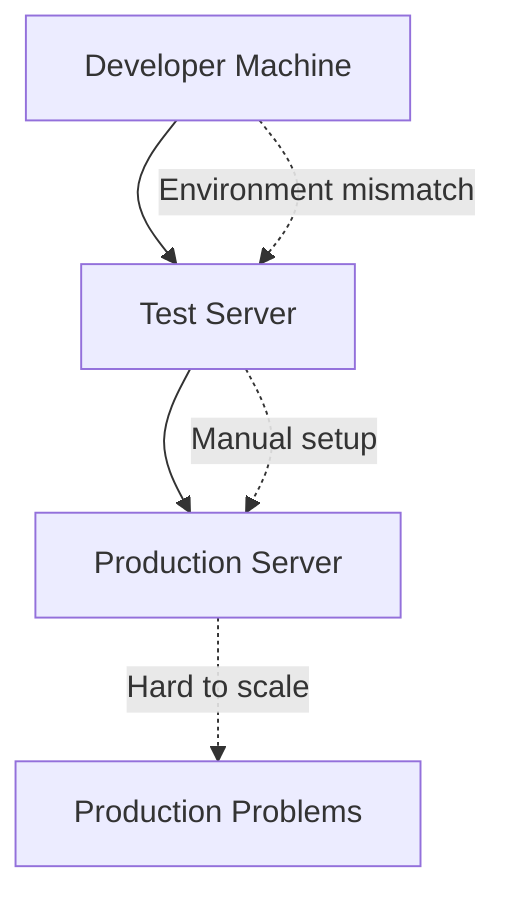

## 1.2 Virtual Machines vs Containers

### Learn
- VM contains full operating system
- Container shares host OS kernel
- Containers are faster and lighter

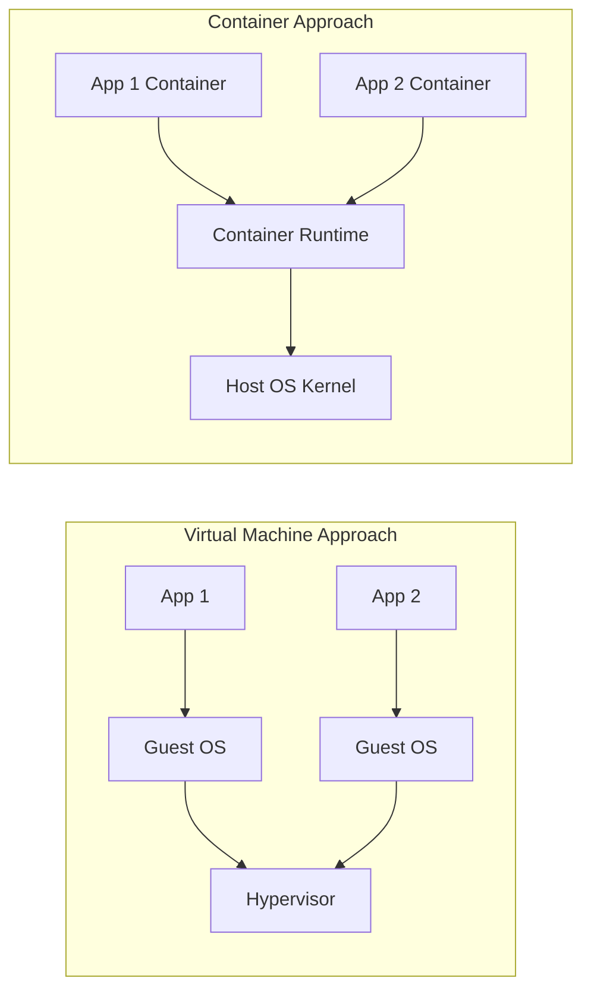

## 1.3 Install Required Tools

### Tools
- Java 17 or later
- Maven or Gradle
- Docker Desktop
- Git
- VS Code or IntelliJ IDEA
- curl or Postman

### Steps
1. Install Java.
2. Verify:

```bash
java -version
```

3. Install Maven.
4. Verify:

```bash
mvn -version
```

5. Install Docker.
6. Verify:

```bash
docker version
```

## 1.4 Docker Basics

### Learn
- Image
- Container
- Dockerfile
- Registry
- Port mapping
- Environment variables

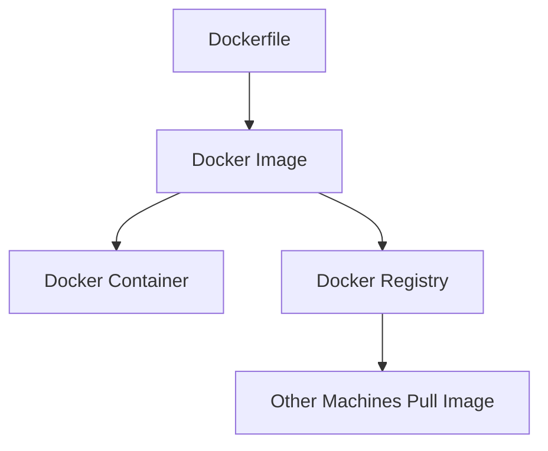

### Practice
1. Run an nginx container:

```bash
docker run -d -p 8080:80 nginx
```

2. Open:

```text
http://localhost:8080
```

3. List containers:

```bash
docker ps
```

4. Stop container:

```bash
docker stop <container-id>
```

## Chapter Outcome
By the end of this chapter, you should understand what containers are, why they matter, and how Docker helps package applications.

---

# 2. Spring Boot Essentials

## Goal
Build a strong Spring Boot foundation before deploying applications to Kubernetes.

## 2.1 Create a Spring Boot Project

### Recommended dependencies
- Spring Web
- Spring Boot Actuator
- Spring Data JPA
- PostgreSQL Driver or MySQL Driver
- Validation
- Lombok, optional

### Steps
1. Go to Spring Initializr.
2. Create a Maven project.
3. Choose Java 17 or later.
4. Add dependencies.
5. Generate and open the project.

## 2.2 Understand Spring Boot Project Structure

```text
src/main/java
src/main/resources
application.yml
pom.xml
```

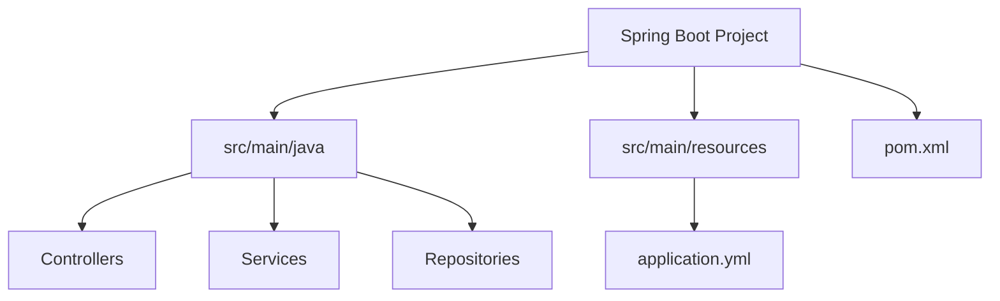

## 2.3 Build a REST API

### Steps
1. Create a controller.
2. Add a GET endpoint.
3. Run the app.
4. Test using curl or Postman.

Example:

```java
@RestController
@RequestMapping("/api/hello")
public class HelloController {

    @GetMapping
    public String hello() {
        return "Hello from Spring Boot";
    }
}
```

Test:

```bash
curl http://localhost:8080/api/hello
```

## 2.4 Understand Configuration

### Learn
- `application.yml`
- Profiles
- Environment variables
- Externalized configuration

Example:

```yaml
server:
  port: 8080

spring:
  application:
    name: demo-service
```

## 2.5 Add Spring Boot Actuator

### Why it matters for Kubernetes
Kubernetes uses health endpoints to know whether your application is alive and ready to receive traffic.

Add actuator endpoints:

```yaml
management:
  endpoints:
    web:
      exposure:
        include: health,info,metrics
  endpoint:
    health:
      probes:
        enabled: true
```

Health URLs:

```text
/actuator/health
/actuator/health/liveness
/actuator/health/readiness
```

```mermaid
flowchart LR
    K[Kubernetes] --> L[/actuator/health/liveness]
    K --> R[/actuator/health/readiness]
    L --> A[Restart app if dead]
    R --> B[Send traffic only if ready]
```

## Chapter Outcome
You should be able to create, configure, run, and expose a Spring Boot REST API with health endpoints.

---

# 3. Containerizing Spring Boot Applications

## Goal
Package a Spring Boot app into a Docker image and run it as a container.

## 3.1 Build the Spring Boot JAR

```bash
mvn clean package
```

Expected output:

```text
target/demo-0.0.1-SNAPSHOT.jar
```

## 3.2 Create a Basic Dockerfile

```dockerfile
FROM eclipse-temurin:17-jre
WORKDIR /app
COPY target/*.jar app.jar
EXPOSE 8080
ENTRYPOINT ["java", "-jar", "app.jar"]
```

## 3.3 Build the Docker Image

```bash
docker build -t springboot-demo:1.0 .
```

## 3.4 Run the Container

```bash
docker run -p 8080:8080 springboot-demo:1.0
```

Test:

```bash
curl http://localhost:8080/api/hello
```

## 3.5 Use Environment Variables

Run with an environment variable:

```bash
docker run -p 8080:8080 \
  -e SPRING_PROFILES_ACTIVE=dev \
  springboot-demo:1.0
```

## 3.6 Multi-stage Dockerfile

```dockerfile
FROM maven:3.9-eclipse-temurin-17 AS build
WORKDIR /app
COPY pom.xml .
COPY src ./src
RUN mvn clean package -DskipTests

FROM eclipse-temurin:17-jre
WORKDIR /app
COPY --from=build /app/target/*.jar app.jar
EXPOSE 8080
ENTRYPOINT ["java", "-jar", "app.jar"]
```

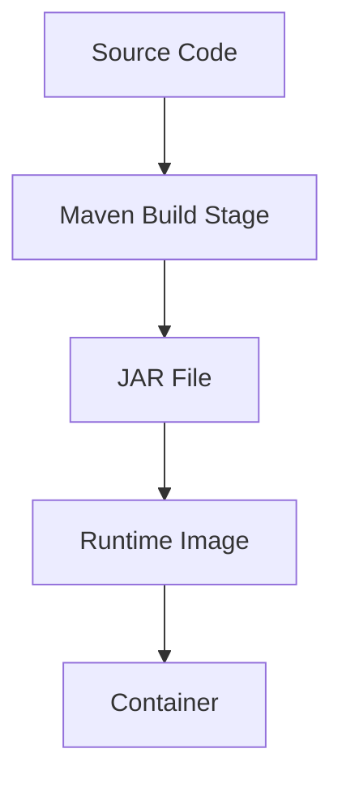

## 3.7 Push Image to Registry

### Docker Hub example

```bash
docker tag springboot-demo:1.0 username/springboot-demo:1.0
docker push username/springboot-demo:1.0
```

## Chapter Outcome
You should be able to build, run, optimize, and publish Docker images for Spring Boot applications.

---

# 4. Kubernetes Fundamentals

## Goal
Understand Kubernetes architecture and core objects.

## 4.1 What is Kubernetes?

Kubernetes is a container orchestration platform that automates:

- Deployment
- Scaling
- Networking
- Self-healing
- Rollouts and rollbacks
- Service discovery

## 4.2 Kubernetes Architecture

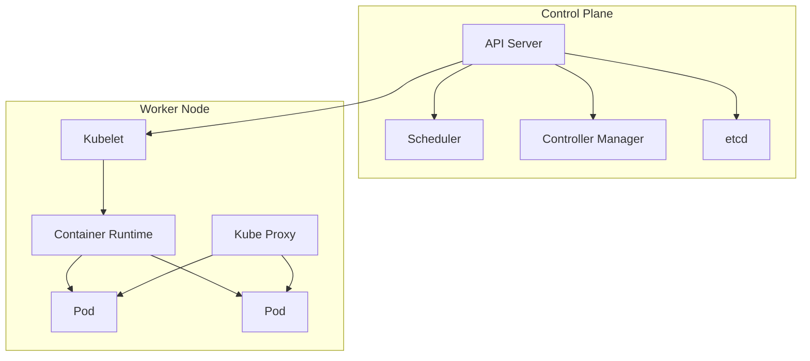

## 4.3 Install a Local Kubernetes Cluster

Recommended local options:

- Minikube
- Kind
- Docker Desktop Kubernetes

### Minikube setup

```bash
minikube start
kubectl get nodes
```

## 4.4 Learn kubectl Basics

```bash
kubectl version
kubectl cluster-info
kubectl get nodes
kubectl get pods
kubectl get services
```

## 4.5 Understand Pods

A Pod is the smallest deployable unit in Kubernetes.

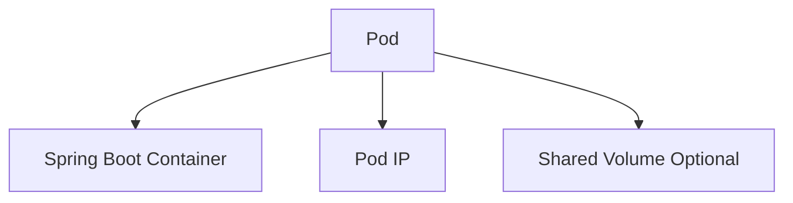

Create a pod:

```yaml
apiVersion: v1
kind: Pod
metadata:
  name: springboot-pod
spec:
  containers:
    - name: springboot-demo
      image: springboot-demo:1.0
      ports:
        - containerPort: 8080
```

Apply:

```bash
kubectl apply -f pod.yml
kubectl get pods
```

## 4.6 Labels and Selectors

Labels identify Kubernetes objects.

```yaml
metadata:
  labels:
    app: springboot-demo
    environment: dev
```

Selectors find objects by label.

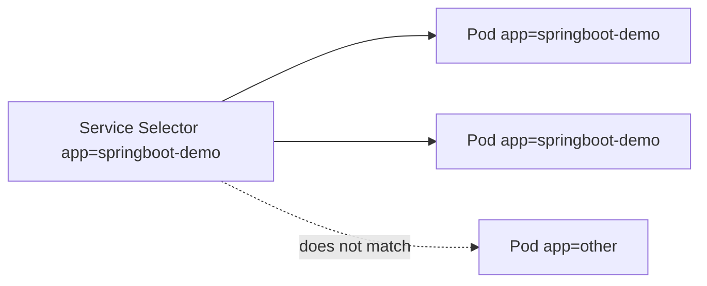

## Chapter Outcome
You should understand the Kubernetes control plane, worker nodes, pods, labels, and basic kubectl usage.

---

# 5. First Spring Boot Deployment on Kubernetes

## Goal
Deploy a containerized Spring Boot app using Kubernetes Deployment and Service objects.

## 5.1 Why Not Use Pod Directly?

Pods are disposable. Deployments manage replicas, updates, and self-healing.

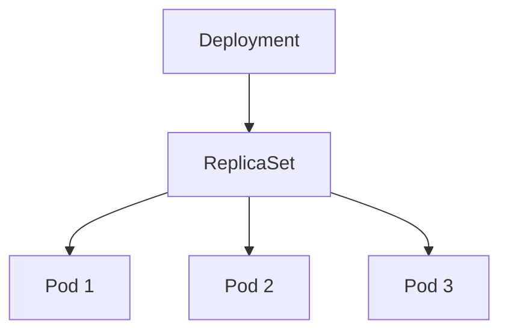

## 5.2 Create Deployment YAML

```yaml
apiVersion: apps/v1
kind: Deployment
metadata:
  name: springboot-demo
spec:
  replicas: 2
  selector:
    matchLabels:
      app: springboot-demo
  template:
    metadata:
      labels:
        app: springboot-demo
    spec:
      containers:
        - name: springboot-demo
          image: username/springboot-demo:1.0
          ports:
            - containerPort: 8080
```

Apply:

```bash
kubectl apply -f deployment.yml
kubectl get deployments
kubectl get pods
```

## 5.3 Create Service YAML

```yaml
apiVersion: v1
kind: Service
metadata:
  name: springboot-demo-service
spec:
  selector:
    app: springboot-demo
  ports:
    - port: 80
      targetPort: 8080
  type: NodePort
```

Apply:

```bash
kubectl apply -f service.yml
kubectl get services
```

## 5.4 Access the Application

For Minikube:

```bash
minikube service springboot-demo-service
```

## 5.5 Scaling

```bash
kubectl scale deployment springboot-demo --replicas=5
kubectl get pods
```

## 5.6 Rolling Updates

Update image:

```bash
kubectl set image deployment/springboot-demo \
  springboot-demo=username/springboot-demo:2.0
```

Check rollout:

```bash
kubectl rollout status deployment/springboot-demo
```

Rollback:

```bash
kubectl rollout undo deployment/springboot-demo
```

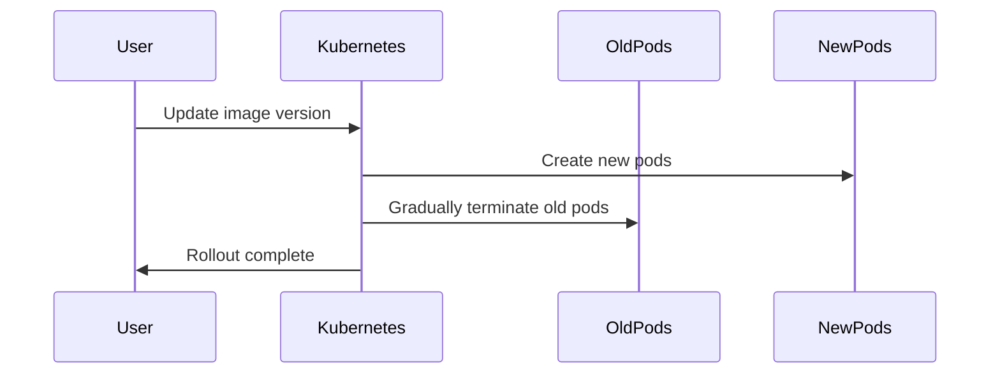

## Chapter Outcome
You should be able to deploy, expose, scale, update, and rollback a Spring Boot application in Kubernetes.

---

# 6. Kubernetes Networking

## Goal
Understand how applications communicate inside and outside Kubernetes.

## 6.1 Pod Networking

Each pod gets its own IP address, but pod IPs are temporary.

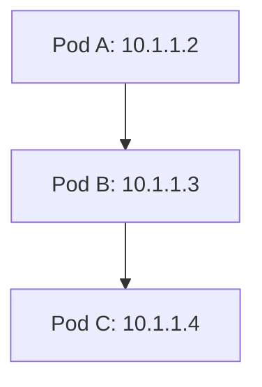

## 6.2 Service Types

### ClusterIP
Internal-only service.

### NodePort
Exposes service on each node IP using a high port.

### LoadBalancer
Creates an external load balancer in cloud environments.

### Ingress
HTTP/HTTPS routing layer.

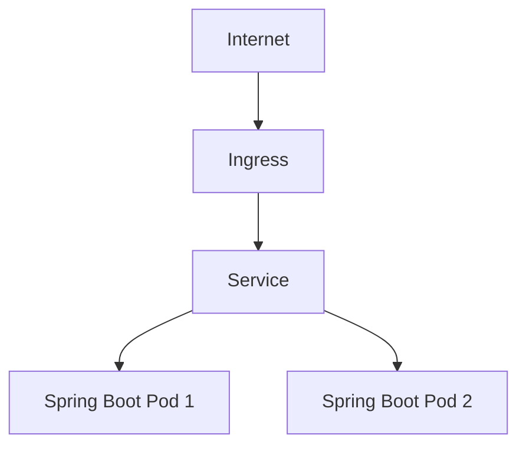

## 6.3 ClusterIP Example

```yaml
apiVersion: v1
kind: Service
metadata:
  name: springboot-demo
spec:
  type: ClusterIP
  selector:
    app: springboot-demo
  ports:
    - port: 80
      targetPort: 8080
```

## 6.4 Ingress Example

```yaml
apiVersion: networking.k8s.io/v1
kind: Ingress
metadata:
  name: springboot-demo-ingress
spec:
  rules:
    - host: demo.local
      http:
        paths:
          - path: /
            pathType: Prefix
            backend:
              service:
                name: springboot-demo
                port:
                  number: 80
```

## 6.5 Internal Service Discovery

Spring Boot app can call another service by Kubernetes DNS name:

```text
http://orders-service:80
```

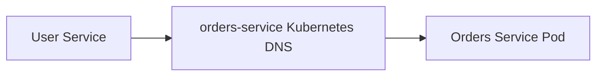

## Chapter Outcome
You should understand Kubernetes networking, services, DNS, and ingress routing.

---

# 7. Configuration Management with ConfigMaps and Secrets

## Goal
Externalize Spring Boot configuration from container images.

## 7.1 Why External Config Matters

Do not rebuild the Docker image for every environment. Keep the same image and inject environment-specific configuration.

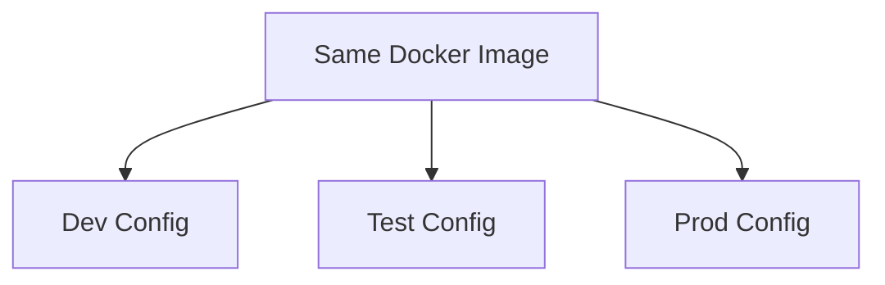

## 7.2 ConfigMap Example

```yaml
apiVersion: v1
kind: ConfigMap
metadata:
  name: springboot-config
data:
  SPRING_PROFILES_ACTIVE: prod
  APP_MESSAGE: Hello from Kubernetes ConfigMap
```

## 7.3 Use ConfigMap in Deployment

```yaml
apiVersion: apps/v1
kind: Deployment
metadata:
  name: springboot-demo
spec:
  replicas: 2
  selector:
    matchLabels:
      app: springboot-demo
  template:
    metadata:
      labels:
        app: springboot-demo
    spec:
      containers:
        - name: springboot-demo
          image: username/springboot-demo:1.0
          envFrom:
            - configMapRef:
                name: springboot-config
```

## 7.4 Secret Example

```bash
kubectl create secret generic db-secret \
  --from-literal=DB_USERNAME=admin \
  --from-literal=DB_PASSWORD=password123
```

## 7.5 Use Secret in Deployment

```yaml
containers:
  - name: springboot-demo
    image: username/springboot-demo:1.0
    envFrom:
      - secretRef:
          name: db-secret
```

## 7.6 Spring Boot Environment Variables

Spring Boot can map environment variables to properties:

```text
SPRING_DATASOURCE_URL
SPRING_DATASOURCE_USERNAME
SPRING_DATASOURCE_PASSWORD
```

## Chapter Outcome
You should be able to use ConfigMaps and Secrets to configure Spring Boot applications in Kubernetes.

---

# 8. Storage and Databases

## Goal
Understand persistent storage and database connectivity in Kubernetes.

## 8.1 Stateless vs Stateful Apps

Spring Boot APIs should usually be stateless. Databases are stateful.

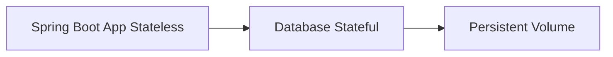

## 8.2 Volumes

Volumes allow data to survive container restarts inside a pod lifecycle.

## 8.3 Persistent Volume and Persistent Volume Claim

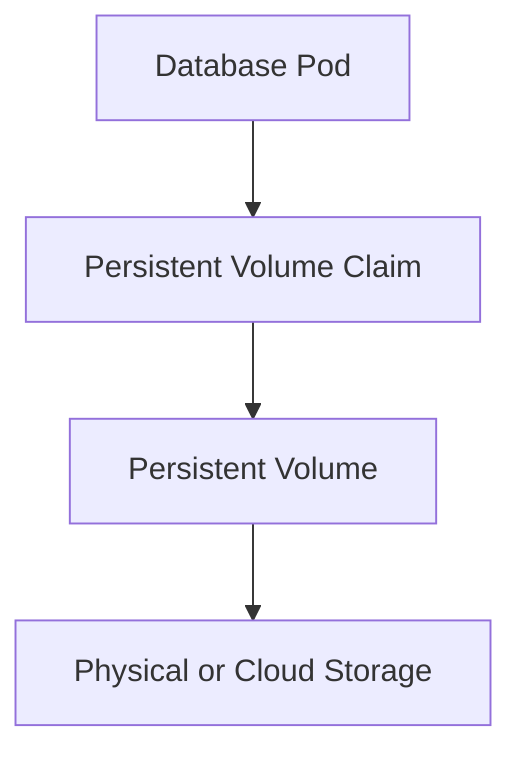

## 8.4 PostgreSQL Deployment Example

```yaml
apiVersion: apps/v1
kind: Deployment
metadata:
  name: postgres
spec:
  selector:
    matchLabels:
      app: postgres
  template:
    metadata:
      labels:
        app: postgres
    spec:
      containers:
        - name: postgres
          image: postgres:16
          env:
            - name: POSTGRES_DB
              value: appdb
            - name: POSTGRES_USER
              valueFrom:
                secretKeyRef:
                  name: db-secret
                  key: DB_USERNAME
            - name: POSTGRES_PASSWORD
              valueFrom:
                secretKeyRef:
                  name: db-secret
                  key: DB_PASSWORD
          ports:
            - containerPort: 5432
```

## 8.5 PostgreSQL Service

```yaml
apiVersion: v1
kind: Service
metadata:
  name: postgres
spec:
  selector:
    app: postgres
  ports:
    - port: 5432
      targetPort: 5432
```

## 8.6 Spring Boot Database Configuration

```yaml
spring:
  datasource:
    url: jdbc:postgresql://postgres:5432/appdb
    username: ${DB_USERNAME}
    password: ${DB_PASSWORD}
```

## Chapter Outcome
You should understand how Spring Boot connects to databases inside Kubernetes and why persistent storage matters.

---

# 9. Security Basics

## Goal
Learn basic Kubernetes and Spring Boot security concepts.

## 9.1 Kubernetes Security Layers

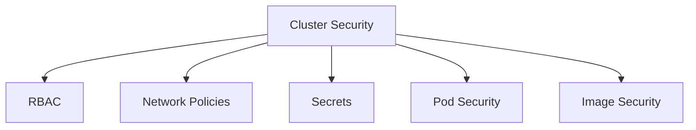

## 9.2 RBAC

RBAC controls who can do what in Kubernetes.

Objects:
- Role
- ClusterRole
- RoleBinding
- ClusterRoleBinding
- ServiceAccount

## 9.3 Service Account Example

```yaml
apiVersion: v1
kind: ServiceAccount
metadata:
  name: springboot-service-account
```

Use in Deployment:

```yaml
spec:
  serviceAccountName: springboot-service-account
```

## 9.4 Avoid Running as Root

```yaml
securityContext:
  runAsNonRoot: true
  runAsUser: 1000
```

## 9.5 Spring Boot API Security

Learn:
- Spring Security basics
- JWT authentication
- OAuth2 Resource Server
- HTTPS behind ingress

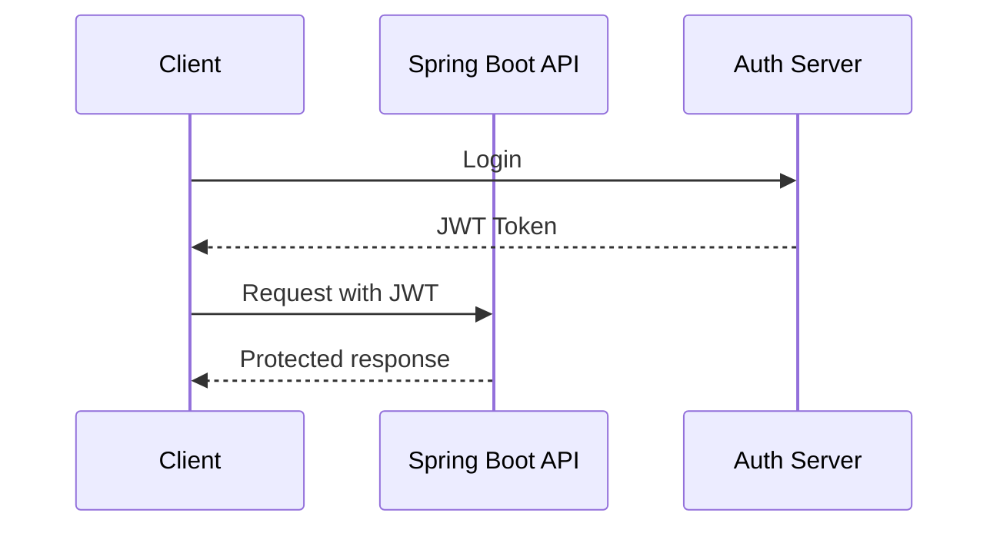

## Chapter Outcome
You should understand core security concerns for Spring Boot workloads on Kubernetes.

---

# 10. Observability and Monitoring

## Goal
Monitor Spring Boot applications running in Kubernetes.

## 10.1 Logs

```bash
kubectl logs deployment/springboot-demo
kubectl logs -f pod/<pod-name>
```

## 10.2 Describe and Debug

```bash
kubectl describe pod <pod-name>
kubectl get events
```

## 10.3 Spring Boot Actuator Metrics

Expose metrics:

```yaml
management:
  endpoints:
    web:
      exposure:
        include: health,info,metrics,prometheus
```

Add dependency:

```xml
<dependency>
  <groupId>io.micrometer</groupId>
  <artifactId>micrometer-registry-prometheus</artifactId>
</dependency>
```

## 10.4 Prometheus and Grafana Flow

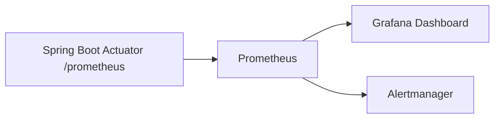

## 10.5 Kubernetes Probes

```yaml
livenessProbe:
  httpGet:
    path: /actuator/health/liveness
    port: 8080
  initialDelaySeconds: 30
  periodSeconds: 10

readinessProbe:
  httpGet:
    path: /actuator/health/readiness
    port: 8080
  initialDelaySeconds: 10
  periodSeconds: 5
```

```mermaid
flowchart TD
    K[Kubernetes] --> L[Liveness Probe]
    K --> R[Readiness Probe]
    L --> Restart[Restart container if failed]
    R --> Traffic[Remove from service if not ready]
```

## Chapter Outcome
You should be able to collect logs, inspect failures, expose metrics, and configure health probes.

---

# 11. CI/CD Integration

## Goal
Automate build, test, Docker image creation, and Kubernetes deployment.

## 11.1 CI/CD Pipeline Stages

```mermaid
flowchart LR
    A[Code Push] --> B[Run Tests]
    B --> C[Build JAR]
    C --> D[Build Docker Image]
    D --> E[Push Image]
    E --> F[Deploy to Kubernetes]
```

## 11.2 GitHub Actions Example

```yaml
name: Build and Deploy

on:
  push:
    branches: [ main ]

jobs:
  build:
    runs-on: ubuntu-latest

    steps:
      - uses: actions/checkout@v4

      - name: Set up Java
        uses: actions/setup-java@v4
        with:
          distribution: temurin
          java-version: 17

      - name: Build
        run: mvn clean package -DskipTests

      - name: Build Docker image
        run: docker build -t username/springboot-demo:${{ github.sha }} .
```

## 11.3 Deployment Strategies

### Rolling Deployment
Default Kubernetes deployment strategy.

### Blue-Green Deployment
Two environments exist: blue and green.

```mermaid
flowchart TD
    User[Users] --> Service[Service]
    Service --> Blue[Blue Version Active]
    Green[Green Version Standby]
    Service -. Switch traffic .-> Green
```

### Canary Deployment
Send a small percentage of traffic to the new version.

```mermaid
flowchart TD
    Users[Users] --> Router[Ingress or Service Mesh]
    Router -->|90 percent| V1[Version 1]
    Router -->|10 percent| V2[Version 2 Canary]
```

## Chapter Outcome
You should understand how to automate Spring Boot Kubernetes deployments.

---

# 12. Advanced Kubernetes Concepts

## Goal
Move from basic deployments to production-grade Kubernetes patterns.

## 12.1 Helm

Helm is a package manager for Kubernetes.

```mermaid
flowchart TD
    Chart[Helm Chart] --> Templates[Kubernetes Templates]
    Values[values.yaml] --> Templates
    Templates --> Manifests[Rendered YAML]
    Manifests --> Cluster[Kubernetes Cluster]
```

### Learn
- Chart structure
- values.yaml
- Templates
- Helm install/upgrade/rollback

Commands:

```bash
helm create springboot-demo
helm install springboot-demo ./springboot-demo
helm upgrade springboot-demo ./springboot-demo
helm rollback springboot-demo 1
```

## 12.2 Resource Requests and Limits

```yaml
resources:
  requests:
    memory: "256Mi"
    cpu: "250m"
  limits:
    memory: "512Mi"
    cpu: "500m"
```

## 12.3 Horizontal Pod Autoscaler

```bash
kubectl autoscale deployment springboot-demo \
  --cpu-percent=70 \
  --min=2 \
  --max=10
```

```mermaid
flowchart LR
    Metrics[CPU or Memory Metrics] --> HPA[Horizontal Pod Autoscaler]
    HPA --> Deployment[Deployment]
    Deployment --> MorePods[Increase or decrease pods]
```

## 12.4 StatefulSets

Use StatefulSets for workloads that need stable identity and storage.

Examples:
- Databases
- Kafka
- Elasticsearch

## 12.5 Operators

Operators automate complex application management.

```mermaid
flowchart TD
    CR[Custom Resource] --> Operator[Operator Controller]
    Operator --> Kubernetes[Kubernetes API]
    Kubernetes --> ManagedApp[Managed Application]
```

## Chapter Outcome
You should understand Helm, autoscaling, resources, StatefulSets, and operators.

---

# 13. Managed Kubernetes in the Cloud

## Goal
Deploy Spring Boot apps to managed Kubernetes platforms.

## 13.1 Managed Kubernetes Options

- AWS EKS
- Google GKE
- Azure AKS

## 13.2 Cloud Deployment Flow

```mermaid
flowchart TD
    A[Developer Pushes Code] --> B[CI/CD Pipeline]
    B --> C[Container Registry]
    C --> D[Managed Kubernetes Cluster]
    D --> E[Load Balancer]
    E --> F[Users]
```

## 13.3 Cloud Concepts to Learn

- IAM permissions
- Cloud load balancers
- Container registries
- Managed databases
- Secret managers
- Autoscaling node pools
- Logging and monitoring integrations

## 13.4 Recommended Production Pattern

```mermaid
flowchart TD
    User[User] --> LB[Cloud Load Balancer]
    LB --> Ingress[Ingress Controller]
    Ingress --> Service[Spring Boot Service]
    Service --> Pods[Spring Boot Pods]
    Pods --> DB[Managed Database]
    Pods --> Secrets[Cloud Secret Manager]
```

## Chapter Outcome
You should understand how Kubernetes concepts map to real cloud environments.

---

# 14. Microservices with Spring Boot and Kubernetes

## Goal
Build multiple Spring Boot services and run them together in Kubernetes.

## 14.1 Example Microservices Architecture

```mermaid
flowchart TD
    Client[Client] --> Gateway[API Gateway]
    Gateway --> UserService[User Service]
    Gateway --> OrderService[Order Service]
    Gateway --> PaymentService[Payment Service]
    OrderService --> Postgres[(PostgreSQL)]
    PaymentService --> Queue[Message Broker]
```

## 14.2 Service Communication

### Synchronous
- REST
- OpenFeign
- WebClient

### Asynchronous
- Kafka
- RabbitMQ
- Pub/Sub

```mermaid
sequenceDiagram
    participant Client
    participant Gateway
    participant OrderService
    participant PaymentService

    Client->>Gateway: Create order
    Gateway->>OrderService: POST /orders
    OrderService->>PaymentService: Request payment
    PaymentService-->>OrderService: Payment response
    OrderService-->>Gateway: Order created
    Gateway-->>Client: Response
```

## 14.3 API Gateway

Responsibilities:
- Routing
- Authentication
- Rate limiting
- Request logging

## 14.4 Resilience Patterns

Learn:
- Retry
- Timeout
- Circuit breaker
- Bulkhead
- Fallback

```mermaid
flowchart TD
    A[Service A] --> B{Service B healthy?}
    B -->|Yes| C[Call Service B]
    B -->|No| D[Fallback Response]
```

## 14.5 Service Mesh Optional Advanced Topic

Examples:
- Istio
- Linkerd

Features:
- mTLS
- Traffic splitting
- Observability
- Retries
- Circuit breaking

## Chapter Outcome
You should be able to design and deploy Spring Boot microservices on Kubernetes.

---

# 15. Production Best Practices

## Goal
Prepare Spring Boot Kubernetes applications for production.

## 15.1 Production Checklist

- Use non-root containers
- Use resource requests and limits
- Use liveness and readiness probes
- Use ConfigMaps and Secrets
- Use rolling updates
- Use structured logging
- Use centralized monitoring
- Use image scanning
- Use network policies
- Use separate namespaces
- Use managed databases where possible

## 15.2 Namespace Strategy

```mermaid
flowchart TD
    Cluster[Kubernetes Cluster] --> Dev[dev namespace]
    Cluster --> Staging[staging namespace]
    Cluster --> Prod[prod namespace]
```

## 15.3 Deployment Safety

```yaml
strategy:
  type: RollingUpdate
  rollingUpdate:
    maxUnavailable: 0
    maxSurge: 1
```

## 15.4 Graceful Shutdown in Spring Boot

```yaml
server:
  shutdown: graceful

spring:
  lifecycle:
    timeout-per-shutdown-phase: 30s
```

Kubernetes:

```yaml
terminationGracePeriodSeconds: 30
```

```mermaid
sequenceDiagram
    participant K as Kubernetes
    participant App as Spring Boot App
    participant User

    K->>App: SIGTERM
    App->>App: Stop accepting new requests
    User->>App: Existing request completes
    App-->>K: Shutdown complete
```

## 15.5 Cost Optimization

- Right-size CPU and memory
- Use autoscaling
- Avoid over-provisioned nodes
- Use managed services carefully
- Monitor unused resources

## Chapter Outcome
You should understand the practical concerns of operating Spring Boot applications on Kubernetes in production.

---

# 16. Capstone Project

## Goal
Build a complete production-style Spring Boot microservices system on Kubernetes.

## 16.1 Project Idea
Online Order Management System.

### Services
- API Gateway
- User Service
- Product Service
- Order Service
- Payment Service
- Notification Service

### Infrastructure
- PostgreSQL
- Redis
- Kafka or RabbitMQ
- Prometheus
- Grafana
- Ingress Controller

```mermaid
flowchart TD
    Client[Client] --> Gateway[API Gateway]
    Gateway --> User[User Service]
    Gateway --> Product[Product Service]
    Gateway --> Order[Order Service]
    Order --> Payment[Payment Service]
    Order --> Notification[Notification Service]
    User --> DB1[(User DB)]
    Product --> DB2[(Product DB)]
    Order --> DB3[(Order DB)]
    Payment --> Queue[Message Broker]
    Notification --> Queue
    Monitoring[Prometheus and Grafana] --> Gateway
    Monitoring --> User
    Monitoring --> Product
    Monitoring --> Order
```

## 16.2 Step-by-Step Capstone Plan

### Step 1: Create services
- Generate Spring Boot projects.
- Add REST endpoints.
- Add validation.
- Add actuator.

### Step 2: Add persistence
- Add PostgreSQL for each service.
- Configure JPA.
- Add migrations using Flyway or Liquibase.

### Step 3: Containerize services
- Create Dockerfiles.
- Build images.
- Push images to registry.

### Step 4: Create Kubernetes manifests
- Deployment for each service.
- Service for each service.
- ConfigMaps.
- Secrets.
- Ingress.

### Step 5: Add health checks
- Liveness probes.
- Readiness probes.
- Startup probes if needed.

### Step 6: Add monitoring
- Expose Prometheus metrics.
- Install Prometheus.
- Install Grafana.
- Create dashboards.

### Step 7: Add CI/CD
- Build on push.
- Run tests.
- Build Docker image.
- Push image.
- Deploy to Kubernetes.

### Step 8: Add advanced deployment
- Rolling update.
- Canary deployment.
- Rollback testing.

### Step 9: Secure the system
- Add Spring Security.
- Use JWT.
- Use Kubernetes Secrets.
- Add RBAC.
- Use non-root containers.

### Step 10: Document everything
- Architecture diagram.
- API documentation.
- Deployment instructions.
- Troubleshooting guide.

## 16.3 Final Architecture

```mermaid
flowchart TD
    Dev[Developer] --> Git[Git Repository]
    Git --> CI[CI/CD Pipeline]
    CI --> Registry[Container Registry]
    Registry --> K8s[Kubernetes Cluster]
    K8s --> Ingress[Ingress Controller]
    Ingress --> Gateway[API Gateway]
    Gateway --> Services[Spring Boot Microservices]
    Services --> Databases[(Databases)]
    Services --> Broker[Message Broker]
    Prometheus[Prometheus] --> Services
    Grafana[Grafana] --> Prometheus
```

## Chapter Outcome
You will have built a complete Kubernetes-based Spring Boot system with real production concepts.

---

# Suggested Study Schedule

## Month 1: Basics
- Week 1: Docker fundamentals
- Week 2: Spring Boot REST and Actuator
- Week 3: Dockerize Spring Boot apps
- Week 4: Kubernetes pods, deployments, and services

## Month 2: Intermediate
- Week 5: Networking and ingress
- Week 6: ConfigMaps, Secrets, and databases
- Week 7: Monitoring and probes
- Week 8: CI/CD basics

## Month 3: Advanced
- Week 9: Helm and autoscaling
- Week 10: Security and RBAC
- Week 11: Microservices architecture
- Week 12: Capstone project and cloud deployment

---

# Recommended Hands-On Practice Order

1. Run a Spring Boot app locally.
2. Dockerize the app.
3. Run it with Docker.
4. Push image to registry.
5. Deploy it to Kubernetes.
6. Expose it using a Service.
7. Add ConfigMaps and Secrets.
8. Add database connectivity.
9. Add health probes.
10. Add monitoring.
11. Add CI/CD.
12. Convert manifests to Helm.
13. Deploy to cloud Kubernetes.
14. Build the capstone project.

---

# Common kubectl Commands Cheat Sheet

```bash
kubectl get nodes
kubectl get pods
kubectl get deployments
kubectl get services
kubectl get ingress
kubectl describe pod <pod-name>
kubectl logs <pod-name>
kubectl logs -f deployment/<deployment-name>
kubectl apply -f file.yml
kubectl delete -f file.yml
kubectl rollout status deployment/<deployment-name>
kubectl rollout undo deployment/<deployment-name>
kubectl scale deployment <deployment-name> --replicas=3
kubectl exec -it <pod-name> -- sh
```

---

# Final Advice

Learn Kubernetes by building, breaking, debugging, and rebuilding. Do not only read YAML files. Run the examples, inspect the cluster state, delete pods, change images, break configs, and observe how Kubernetes reacts.

