# Database Design for System Design Interviews — Ultimate Reference

> A practical, end-to-end guide to database design from **first principles** to **high-scale production architecture**.  
> Includes **Mermaid diagrams**, comparison tables, and working examples using **PostgreSQL** for **partitioning**, **manual sharding**, and **replication-style read/write routing**.

---

## Table of Contents

1. [How to think about database design](#1-how-to-think-about-database-design)
2. [SQL vs NoSQL](#2-sql-vs-nosql)
3. [Schema design principles](#3-schema-design-principles)
4. [Normalization vs denormalization](#4-normalization-vs-denormalization)
5. [Indexing strategies](#5-indexing-strategies)
6. [Partitioning in PostgreSQL](#6-partitioning-in-postgresql)
7. [Sharding with PostgreSQL](#7-sharding-with-postgresql)
8. [Replication patterns](#8-replication-patterns)
9. [Consistency models](#9-consistency-models)
10. [Transactions and distributed transactions](#10-transactions-and-distributed-transactions)
11. [Query optimization](#11-query-optimization)
12. [Real design examples](#12-real-design-examples)
13. [Spring Boot + PostgreSQL step by step](#13-spring-boot--postgresql-step-by-step)
14. [Spring Boot + MongoDB step by step](#14-spring-boot--mongodb-step-by-step)
15. [Spring Boot patterns for partitioning, sharding, and replication](#15-spring-boot-patterns-for-partitioning-sharding-and-replication)
16. [Interview answer templates](#16-interview-answer-templates)
17. [Final cheat sheets](#17-final-cheat-sheets)

---

# 1. How to think about database design

Database design is not about picking a trendy database. It is about matching your **data model**, **access patterns**, and **scale requirements**.

When an interviewer asks:

> “How would you store this data?”

They are really asking:

- What does the data look like?
- What queries matter most?
- What consistency guarantees are required?
- What is the expected scale?
- What can be eventually consistent?
- What must be strongly consistent?

---

## 1.1 Database design workflow

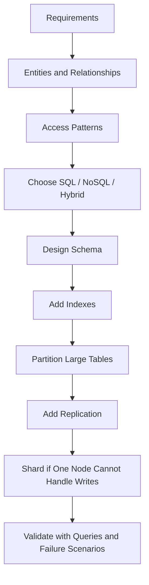

---

## 1.2 Questions to ask first

| Area | Questions |
|---|---|
| Workload | Read-heavy or write-heavy? OLTP or analytics? Random lookup or range scan? |
| Data shape | Relational, document, time-series, graph, or key-value? |
| Consistency | Strong consistency needed? Eventual consistency acceptable? |
| Scale | QPS, TPS, data size, growth rate, number of tenants/users? |
| Operations | Backup, restore, failover, monitoring, team experience? |

---

## 1.3 Simple interview framing

```text
I would start with access patterns and correctness requirements.
Then I would choose the simplest database that supports them.
After the basic design works, I would discuss indexes, partitioning, replication, sharding, and consistency trade-offs.
```

---

# 2. SQL vs NoSQL

## 2.1 SQL databases

Examples:

- PostgreSQL
- MySQL
- MariaDB
- SQL Server
- Oracle

SQL databases store data in tables and model relationships explicitly.

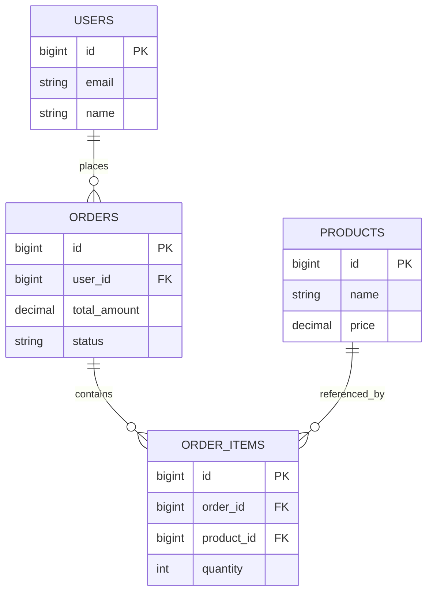

### SQL example

```sql
CREATE TABLE users (
    id BIGSERIAL PRIMARY KEY,
    name VARCHAR(100) NOT NULL,
    email VARCHAR(255) UNIQUE NOT NULL
);

CREATE TABLE orders (
    id BIGSERIAL PRIMARY KEY,
    user_id BIGINT NOT NULL REFERENCES users(id),
    total_amount DECIMAL(10,2) NOT NULL,
    created_at TIMESTAMPTZ DEFAULT NOW()
);
```

### SQL strengths and weaknesses

| Strengths | Weaknesses |
|---|---|
| ACID transactions | Horizontal write scaling is harder |
| Joins | Schema migrations need care |
| Referential integrity | Cross-region multi-primary is complex |
| Mature indexing | Join-heavy workloads may become expensive |
| Excellent ad-hoc querying | Large single tables need partitioning |

---

## 2.2 NoSQL databases

NoSQL is a family of models, not one database type.

| Type | Examples | Best for |
|---|---|---|
| Document | MongoDB, Couchbase | Flexible JSON-like records |
| Key-value | Redis, DynamoDB | Sessions, cache, counters |
| Wide-column | Cassandra, HBase | Massive writes, time-series |
| Graph | Neo4j, Neptune | Relationship traversal |

---

## 2.3 SQL vs NoSQL decision table

| Requirement | Prefer SQL | Prefer NoSQL |
|---|---:|---:|
| Strong transactions | ✅ | Sometimes |
| Joins | ✅ | ❌ |
| Flexible schema | Limited | ✅ |
| Massive write throughput | Harder | Often easier |
| Known access patterns | ✅ | ✅ |
| Ad-hoc analytics | ✅ | Weaker |
| Entity-centric reads | Maybe | ✅ |
| Cache/session data | ❌ | ✅ |

---

## 2.4 Hybrid architecture

Real systems often use more than one store.

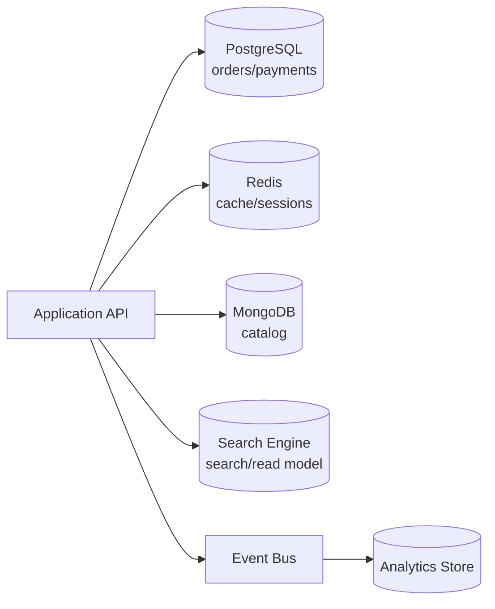

| Use case | Recommended store |
|---|---|
| Orders/payments | PostgreSQL |
| Cache/sessions | Redis |
| Product catalog | MongoDB |
| Search | Elasticsearch/OpenSearch |
| Analytics/events | ClickHouse, BigQuery, Cassandra, warehouse |

---

# 3. Schema design principles

## 3.1 Start with entities

For an e-commerce system:

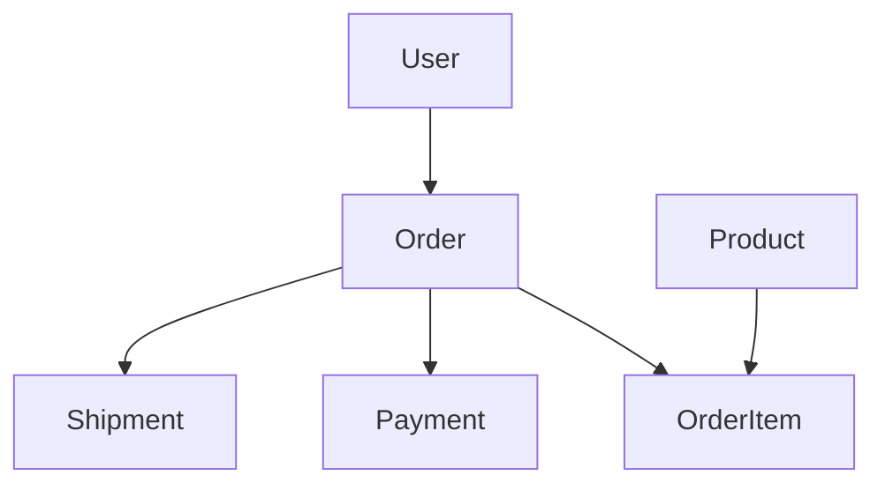

Typical tables:

- `users`
- `products`
- `orders`
- `order_items`
- `payments`
- `shipments`

---

## 3.2 Choose primary keys carefully

| Key type | Pros | Cons | Best for |
|---|---|---|---|
| `BIGSERIAL` | Compact, fast, index-friendly | Harder across distributed writers | Single database systems |
| UUID | Globally unique | Larger index, random writes | Distributed systems |
| UUIDv7 / ULID | Globally unique and time-sortable | Slightly more complexity | High-scale distributed systems |
| Snowflake ID | Compact and sortable | Requires ID generator | Large distributed systems |

### Practical recommendation

| System size | Recommendation |
|---|---|
| Small/simple app | `BIGSERIAL` |
| Distributed app | UUIDv7 / ULID |
| Very high scale | Snowflake-style ID service |

---

## 3.3 Use constraints

```sql
CREATE TABLE users (
    id BIGSERIAL PRIMARY KEY,
    email VARCHAR(255) UNIQUE NOT NULL,
    age INT CHECK (age >= 0 AND age < 150),
    status VARCHAR(20) NOT NULL CHECK (status IN ('active', 'inactive', 'banned'))
);
```

Constraints prevent invalid data before it spreads through the system.

| Constraint | Purpose |
|---|---|
| `NOT NULL` | Required value |
| `UNIQUE` | No duplicate value |
| `CHECK` | Valid business rule |
| `FOREIGN KEY` | Valid relationship |

---

# 4. Normalization vs denormalization

## 4.1 Normalization

Normalization means storing each fact once.

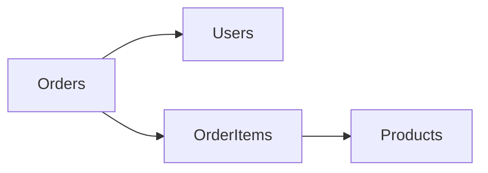

### Normalized schema

```sql
CREATE TABLE users (
    id BIGSERIAL PRIMARY KEY,
    name VARCHAR(100),
    email VARCHAR(255) UNIQUE
);

CREATE TABLE products (
    id BIGSERIAL PRIMARY KEY,
    name VARCHAR(255),
    current_price DECIMAL(10,2)
);

CREATE TABLE orders (
    id BIGSERIAL PRIMARY KEY,
    user_id BIGINT REFERENCES users(id),
    created_at TIMESTAMPTZ DEFAULT NOW()
);

CREATE TABLE order_items (
    id BIGSERIAL PRIMARY KEY,
    order_id BIGINT REFERENCES orders(id),
    product_id BIGINT REFERENCES products(id),
    quantity INT NOT NULL
);
```

| Pros | Cons |
|---|---|
| Less duplication | More joins |
| Easier updates | Reads may be slower |
| Better consistency | More complex query shape |

---

## 4.2 Denormalization

Denormalization duplicates data for faster reads or historical correctness.

```sql
CREATE TABLE order_items (
    id BIGSERIAL PRIMARY KEY,
    order_id BIGINT REFERENCES orders(id),
    product_id BIGINT NOT NULL,
    product_name VARCHAR(255) NOT NULL,
    product_price DECIMAL(10,2) NOT NULL,
    quantity INT NOT NULL
);
```

This is useful because order history should show the product name and price at the time of purchase.

| Use case | Normalize or denormalize? |
|---|---|
| Core transactional data | Normalize first |
| Read-heavy hot path | Denormalize selectively |
| Historical snapshot | Denormalize intentionally |
| Analytics/reporting | Denormalize aggressively |

---

# 5. Indexing strategies

Indexes are one of the most important database performance tools.

## 5.1 Basic index types

| Index type | Example | Use case |
|---|---|---|
| Single-column | `ON users(email)` | Lookup by one column |
| Composite | `ON orders(user_id, status, created_at)` | Multi-column filters |
| Unique | `UNIQUE(email)` | Prevent duplicates |
| Partial | `WHERE status = 'pending'` | Small hot subset |
| GIN | `USING GIN(jsonb_col)` | JSONB / arrays / full text |

---

## 5.2 Composite index order

For this index:

```sql
CREATE INDEX idx_orders_user_status_created
ON orders(user_id, status, created_at DESC);
```

It helps:

```sql
SELECT * FROM orders
WHERE user_id = 42
  AND status = 'pending'
ORDER BY created_at DESC
LIMIT 20;
```

But it does not help much for:

```sql
SELECT * FROM orders
WHERE status = 'pending';
```

because `user_id` is the leftmost column.

### Index column order rule

```text
Equality filters first
→ range filters second
→ sort columns last
```

---

## 5.3 Indexing flow

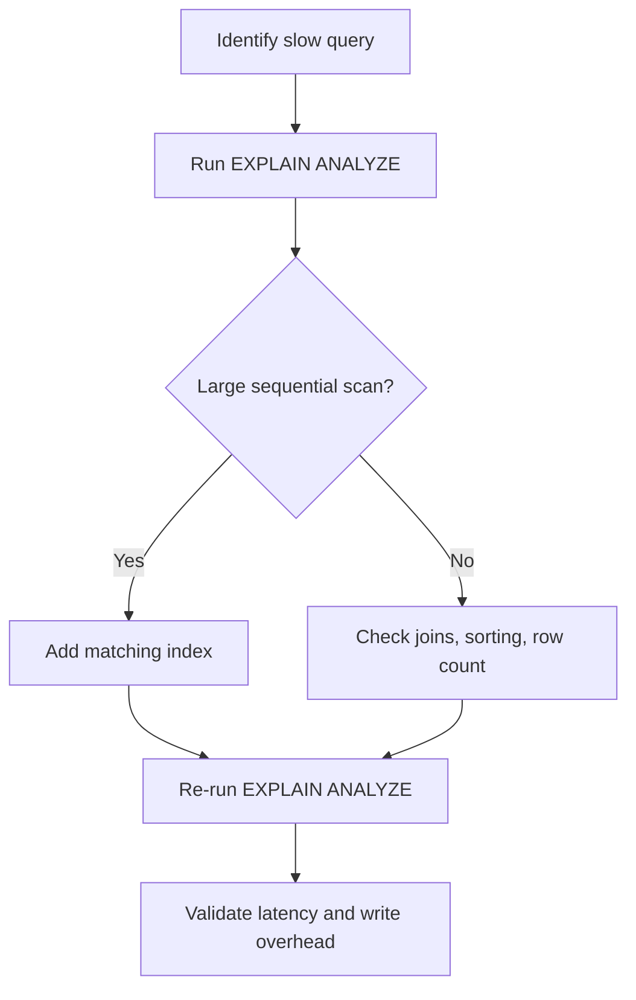

---

# 6. Partitioning in PostgreSQL

Partitioning splits one large logical table into smaller physical pieces **inside one database**.

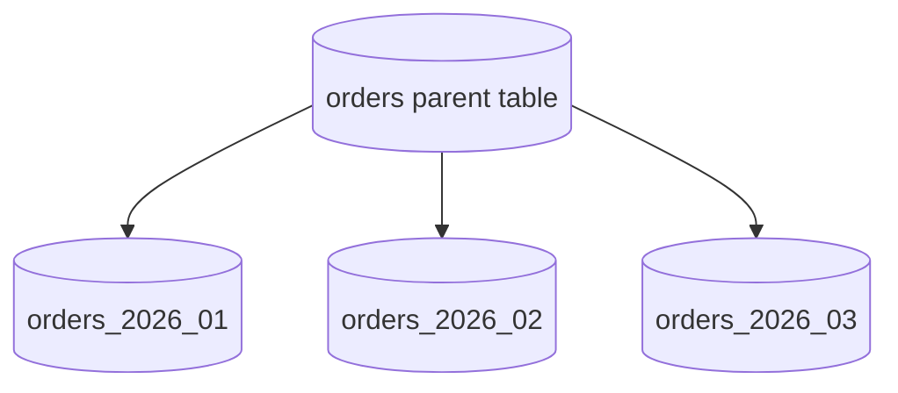

---

## 6.1 Partitioning vs sharding

| Concept | Meaning | Where data lives | Main purpose |
|---|---|---|---|
| Partitioning | Split one table into pieces | Same database cluster | Manage huge tables |
| Sharding | Split data across DB servers | Multiple database servers | Scale writes/storage horizontally |

---

## 6.2 When to use partitioning

Use partitioning when:

- A table is very large.
- Queries often filter by date, tenant, region, or category.
- You need fast deletion or archival of old data.
- Maintenance on one chunk should not block the whole table.

Good partition keys:

| Key | Good for |
|---|---|
| `created_at` | Events, orders, logs |
| `tenant_id` | Multi-tenant SaaS |
| `region` | Regional data separation |
| `user_id hash` | Even distribution |

---

## 6.3 Working PostgreSQL partitioning example

This example uses **range partitioning by month**.

### Step 1: create database

```bash
createdb system_design_demo
psql system_design_demo
```

### Step 2: create parent table

```sql
DROP TABLE IF EXISTS orders CASCADE;

CREATE TABLE orders (
    id BIGSERIAL,
    user_id BIGINT NOT NULL,
    status VARCHAR(20) NOT NULL,
    total_amount DECIMAL(10,2) NOT NULL,
    created_at TIMESTAMPTZ NOT NULL,
    PRIMARY KEY (id, created_at)
) PARTITION BY RANGE (created_at);
```

Why primary key includes `created_at`:

```text
In PostgreSQL partitioned tables, a unique or primary key constraint must include the partition key.
```

---

### Step 3: create child partitions

```sql
CREATE TABLE orders_2026_01 PARTITION OF orders
FOR VALUES FROM ('2026-01-01') TO ('2026-02-01');

CREATE TABLE orders_2026_02 PARTITION OF orders
FOR VALUES FROM ('2026-02-01') TO ('2026-03-01');

CREATE TABLE orders_2026_03 PARTITION OF orders
FOR VALUES FROM ('2026-03-01') TO ('2026-04-01');
```

---

### Step 4: create indexes on partitioned table

```sql
CREATE INDEX idx_orders_user_created
ON orders(user_id, created_at DESC);

CREATE INDEX idx_orders_status_created
ON orders(status, created_at DESC);
```

PostgreSQL creates matching indexes for partitions.

---

### Step 5: insert sample data

```sql
INSERT INTO orders (user_id, status, total_amount, created_at)
VALUES
(1, 'CONFIRMED', 99.99, '2026-01-15 10:00:00+00'),
(2, 'PENDING',   49.99, '2026-02-10 10:00:00+00'),
(1, 'CONFIRMED', 25.50, '2026-02-12 11:00:00+00'),
(3, 'CANCELLED', 12.00, '2026-03-05 08:00:00+00');
```

Rows automatically go into the correct child partition.

---

### Step 6: verify row placement

```sql
SELECT tableoid::regclass AS partition_name, *
FROM orders
ORDER BY created_at;
```

Expected result:

```text
orders_2026_01 | row from January
orders_2026_02 | rows from February
orders_2026_03 | row from March
```

---

### Step 7: verify partition pruning

```sql
EXPLAIN ANALYZE
SELECT *
FROM orders
WHERE created_at >= '2026-02-01'
  AND created_at <  '2026-03-01';
```

The query should scan only `orders_2026_02`.

---

### Step 8: add next month partition

```sql
CREATE TABLE orders_2026_04 PARTITION OF orders
FOR VALUES FROM ('2026-04-01') TO ('2026-05-01');
```

---

### Step 9: archive old data quickly

```sql
ALTER TABLE orders DETACH PARTITION orders_2026_01;

-- Optional: keep as archive table, export it, or drop it.
DROP TABLE orders_2026_01;
```

Dropping a partition is much faster than deleting millions or billions of rows.

---

## 6.4 Partitioning pitfalls

| Pitfall | Explanation | Fix |
|---|---|---|
| Query misses partition key | DB scans many partitions | Always filter by partition key |
| Too many partitions | Planning overhead increases | Use reasonable partition size |
| Bad key choice | Uneven partitions | Use high-cardinality or time-based key |
| Global uniqueness is harder | Unique constraint must include partition key | Design IDs carefully |

---

# 7. Sharding with PostgreSQL

Sharding splits data across multiple database servers.

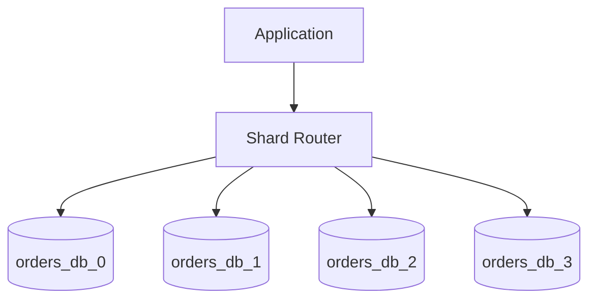

---

## 7.1 Why shard?

Use sharding when:

- One database cannot handle write throughput.
- One database cannot store all data.
- You need tenant isolation.
- You need regional placement.
- Partitioning and read replicas are not enough.

---

## 7.2 Sharding strategies

| Strategy | Routing rule | Pros | Cons |
|---|---|---|---|
| Range | `user_id 1-1M → shard 1` | Easy range queries | Hot shards, hard rebalancing |
| Hash | `hash(user_id) % N` | Even distribution | Resharding is hard |
| Directory | Lookup table maps key to shard | Flexible | Mapping service is extra dependency |
| Geo | Region decides shard | Low regional latency | Cross-region queries harder |

---

## 7.3 Working PostgreSQL sharding example

This is **manual application-level sharding** using four PostgreSQL databases.

### Step 1: create shard databases

```bash
createdb orders_db_0
createdb orders_db_1
createdb orders_db_2
createdb orders_db_3
```

---

### Step 2: create the same schema in every shard

Run this in each database:

```bash
for db in orders_db_0 orders_db_1 orders_db_2 orders_db_3
do
  psql "$db" -c "
    CREATE TABLE IF NOT EXISTS orders (
        id BIGSERIAL PRIMARY KEY,
        user_id BIGINT NOT NULL,
        status VARCHAR(20) NOT NULL,
        total_amount DECIMAL(10,2) NOT NULL,
        created_at TIMESTAMPTZ DEFAULT NOW()
    );

    CREATE INDEX IF NOT EXISTS idx_orders_user_created
    ON orders(user_id, created_at DESC);
  "
done
```

---

### Step 3: choose shard key

For orders, a common shard key is:

```text
user_id
```

Why?

- Most order queries are by user.
- User order history stays on one shard.
- Writes distribute well if users are evenly distributed.

---

### Step 4: implement shard router in Python

Create `shard_demo.py`:

```python
import psycopg2
from dataclasses import dataclass
from decimal import Decimal
from typing import Dict


@dataclass(frozen=True)
class ShardConfig:
    dbname: str
    user: str = "postgres"
    password: str = "postgres"
    host: str = "localhost"
    port: int = 5432


SHARDS: Dict[int, ShardConfig] = {
    0: ShardConfig(dbname="orders_db_0"),
    1: ShardConfig(dbname="orders_db_1"),
    2: ShardConfig(dbname="orders_db_2"),
    3: ShardConfig(dbname="orders_db_3"),
}


def shard_for_user(user_id: int) -> int:
    return abs(hash(user_id)) % len(SHARDS)


def connect_to_shard(shard_id: int):
    cfg = SHARDS[shard_id]
    return psycopg2.connect(
        dbname=cfg.dbname,
        user=cfg.user,
        password=cfg.password,
        host=cfg.host,
        port=cfg.port,
    )


def create_order(user_id: int, status: str, total_amount: Decimal) -> int:
    shard_id = shard_for_user(user_id)

    with connect_to_shard(shard_id) as conn:
        with conn.cursor() as cur:
            cur.execute(
                """
                INSERT INTO orders (user_id, status, total_amount)
                VALUES (%s, %s, %s)
                RETURNING id
                """,
                (user_id, status, total_amount),
            )
            order_id = cur.fetchone()[0]

    print(f"Inserted order {order_id} for user {user_id} into shard {shard_id}")
    return order_id


def get_orders_for_user(user_id: int):
    shard_id = shard_for_user(user_id)

    with connect_to_shard(shard_id) as conn:
        with conn.cursor() as cur:
            cur.execute(
                """
                SELECT id, user_id, status, total_amount, created_at
                FROM orders
                WHERE user_id = %s
                ORDER BY created_at DESC
                """,
                (user_id,),
            )
            return cur.fetchall()


def count_all_orders_scatter_gather() -> int:
    total = 0

    for shard_id in SHARDS:
        with connect_to_shard(shard_id) as conn:
            with conn.cursor() as cur:
                cur.execute("SELECT COUNT(*) FROM orders")
                count = cur.fetchone()[0]
                print(f"Shard {shard_id}: {count} orders")
                total += count

    return total


if __name__ == "__main__":
    create_order(101, "CONFIRMED", Decimal("19.99"))
    create_order(102, "PENDING", Decimal("49.99"))
    create_order(101, "CONFIRMED", Decimal("9.99"))

    print(get_orders_for_user(101))
    print("Total orders:", count_all_orders_scatter_gather())
```

---

### Step 5: install dependency and run

```bash
python -m venv .venv
source .venv/bin/activate

pip install psycopg2-binary
python shard_demo.py
```

---

## 7.4 What this demonstrates

| Operation | Query pattern | Shard behavior |
|---|---|---|
| Create order | Has `user_id` | Goes to one shard |
| Get user orders | Has `user_id` | Reads one shard |
| Count all orders | No shard key | Scatter-gather across all shards |

---

## 7.5 Cross-shard query problem

This query is easy on one database:

```sql
SELECT * FROM orders WHERE status = 'PENDING';
```

But in a sharded system, `status` is not the shard key.

So the application must:

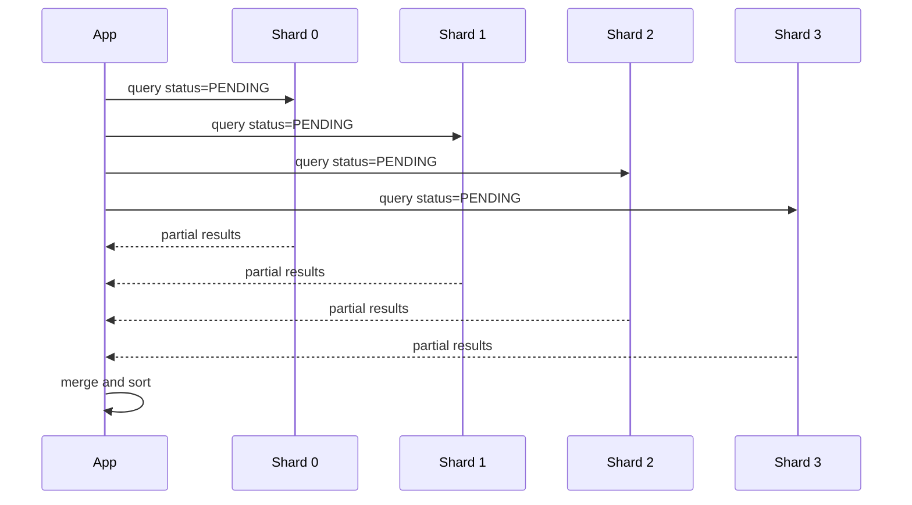

This is called **scatter-gather** and becomes expensive.

---

## 7.6 Sharding best practices

| Best practice | Why |
|---|---|
| Pick a high-cardinality shard key | Avoid hot shards |
| Keep related data together | Avoid cross-shard joins |
| Avoid cross-shard transactions | They are slow and complex |
| Add shard key to APIs | Enables direct routing |
| Monitor shard size and QPS | Detect imbalance |
| Plan resharding early | Resharding is painful later |

---

# 8. Replication patterns

Replication copies data to other nodes for read scaling and fault tolerance.

---

## 8.1 Single-leader replication

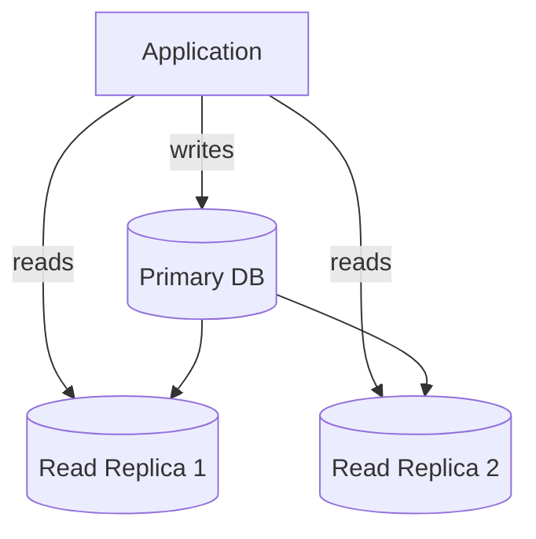

| Pros | Cons |
|---|---|
| Simple mental model | Primary is write bottleneck |
| Good read scaling | Replica lag is possible |
| Easy failover concept | Read-after-write may be stale |

---

## 8.2 Synchronous vs asynchronous replication

| Type | Write acknowledged when | Pros | Cons |
|---|---|---|---|
| Synchronous | Replica confirms write | Strong durability | Higher latency |
| Asynchronous | Primary commits first | Fast writes | Replica lag/data loss risk |

---

## 8.3 Multi-leader replication

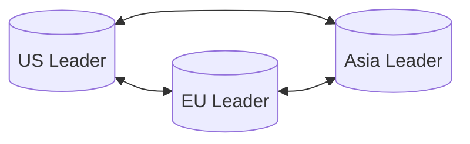

Good for:

- Multi-region low-latency writes.
- Regional availability.

Hard because:

- Conflicts can happen.
- Write ordering is complex.
- Reconciliation logic is required.

---

## 8.4 Leaderless replication

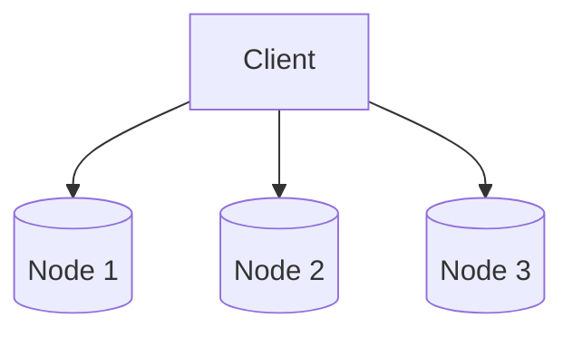

Used by Dynamo-style systems.

With:

```text
N = total replicas
W = write quorum
R = read quorum
```

If:

```text
W + R > N
```

then reads and writes overlap.

Example:

```text
N = 3
W = 2
R = 2
```

---

## 8.5 Working read/write routing example

This example assumes:

- Writes go to the primary database.
- Reads can go to a replica.
- Critical read-after-write queries should read from primary.

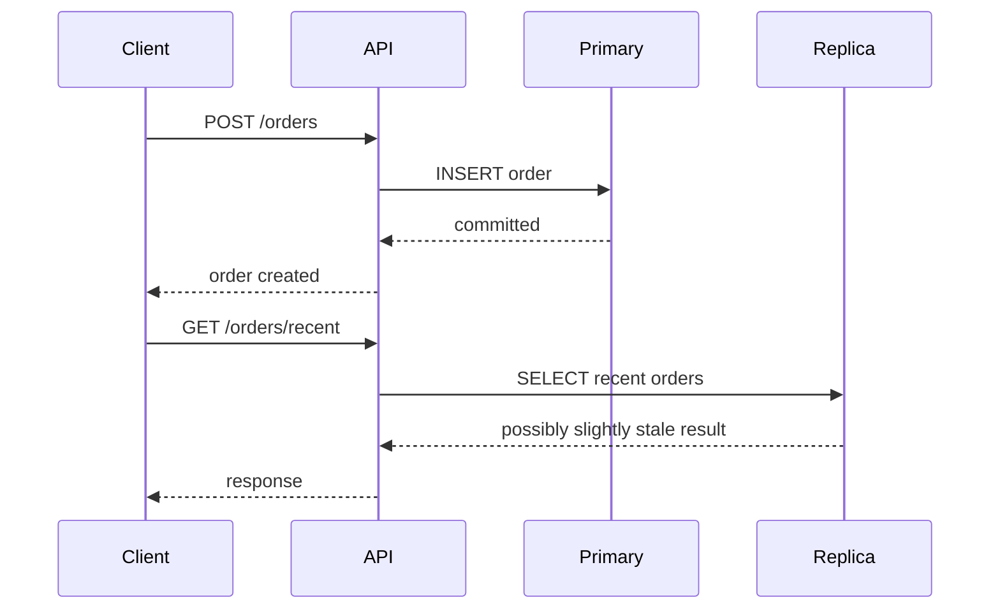

---

## 8.6 Spring Boot routing idea

Use two data sources:

| Data source | Used for |
|---|---|
| Primary | Writes and read-after-write |
| Replica | Normal read-only queries |

A common implementation uses:

- `@Transactional(readOnly = true)` for replica reads.
- Normal `@Transactional` for primary writes.
- A routing datasource that checks transaction read-only status.

---

# 9. Consistency models

## 9.1 Main consistency models

| Model | Meaning | Best for |
|---|---|---|
| Strong consistency | Every read sees latest committed write | Money, inventory |
| Eventual consistency | Replicas converge later | Feeds, analytics |
| Read-your-writes | User sees their own writes immediately | Profile updates, carts |
| Causal consistency | Dependent events appear in order | Comments/replies |

---

## 9.2 Consistency trade-off diagram

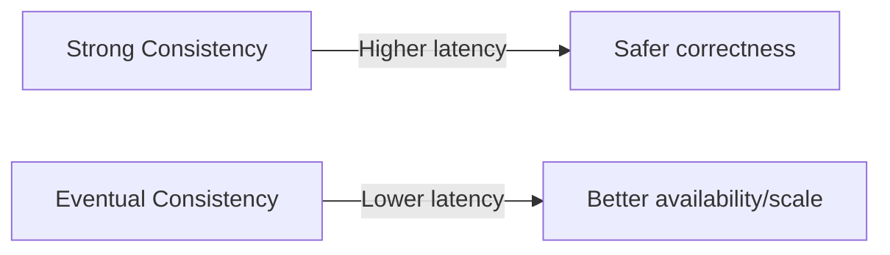

---

# 10. Transactions and distributed transactions

## 10.1 Local transaction

```sql
BEGIN;

UPDATE accounts SET balance = balance - 100 WHERE id = 1;
UPDATE accounts SET balance = balance + 100 WHERE id = 2;

COMMIT;
```

Use local transactions when all required data is inside one database.

---

## 10.2 Isolation levels

| Isolation level | Dirty reads | Non-repeatable reads | Phantom reads |
|---|---:|---:|---:|
| Read Uncommitted | Possible | Possible | Possible |
| Read Committed | No | Possible | Possible |
| Repeatable Read | No | No | Possible/DB-dependent |
| Serializable | No | No | No |

---

## 10.3 Distributed transaction options

| Pattern | How it works | Use when |
|---|---|---|
| 2PC | Coordinator commits all or none | Strong atomicity required |
| Saga | Sequence of local transactions with compensation | Microservices workflows |
| Outbox | Store event in same DB transaction | Reliable event publishing |
| TCC | Try, confirm, cancel | Reservation-style systems |

---

## 10.4 Outbox pattern

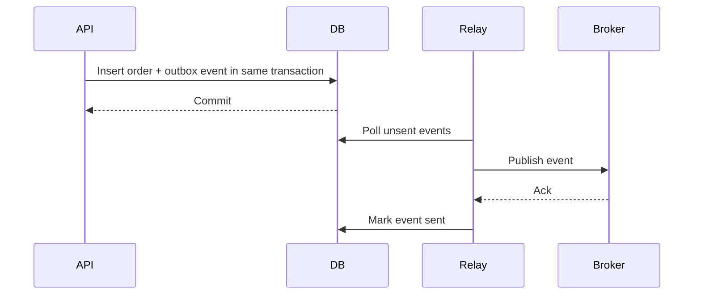

---

# 11. Query optimization

## 11.1 Use EXPLAIN ANALYZE

```sql
EXPLAIN ANALYZE
SELECT *
FROM orders
WHERE user_id = 42
  AND status = 'PENDING'
ORDER BY created_at DESC
LIMIT 20;
```

Look for:

| Signal | Meaning |
|---|---|
| Sequential scan on large table | Missing or unused index |
| Rows removed by filter is huge | Poor filtering/index |
| Sort on many rows | Index may not match order |
| Nested loop over large result | Join strategy problem |

---

## 11.2 Common fixes

```sql
CREATE INDEX idx_orders_user_status_created
ON orders(user_id, status, created_at DESC);
```

```sql
SELECT id, total_amount, status
FROM orders
WHERE user_id = 42
LIMIT 20;
```

```sql
SELECT *
FROM orders
WHERE created_at >= NOW() - INTERVAL '30 days';
```

---

# 12. Real design examples

## 12.1 Twitter/X-style feed

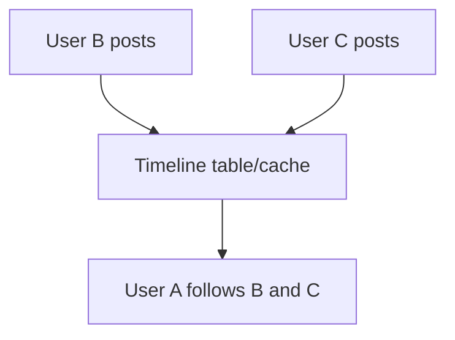

### Pull model

```sql
SELECT t.*
FROM tweets t
JOIN follows f ON t.user_id = f.followee_id
WHERE f.follower_id = 123
ORDER BY t.created_at DESC
LIMIT 100;
```

### Push model

```sql
CREATE TABLE timelines (
    user_id BIGINT NOT NULL,
    tweet_id BIGINT NOT NULL,
    created_at TIMESTAMPTZ DEFAULT NOW(),
    PRIMARY KEY (user_id, created_at, tweet_id)
);
```

Use hybrid:

| User type | Strategy |
|---|---|
| Normal user | Push fanout |
| Celebrity user | Pull on read |
| Very hot timeline | Cache |

---

## 12.2 E-commerce order system

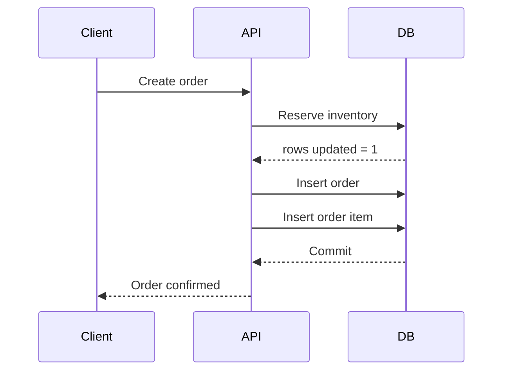

### Inventory-safe update

```sql
UPDATE products
SET inventory_count = inventory_count - 1
WHERE id = 123
  AND inventory_count > 0;
```

If affected rows = `1`, inventory was reserved.  
If affected rows = `0`, product is out of stock.

---

# 13. Spring Boot + PostgreSQL step by step

## 13.1 Dependencies

```xml
<dependencies>
    <dependency>
        <groupId>org.springframework.boot</groupId>
        <artifactId>spring-boot-starter-web</artifactId>
    </dependency>

    <dependency>
        <groupId>org.springframework.boot</groupId>
        <artifactId>spring-boot-starter-data-jpa</artifactId>
    </dependency>

    <dependency>
        <groupId>org.postgresql</groupId>
        <artifactId>postgresql</artifactId>
        <scope>runtime</scope>
    </dependency>

    <dependency>
        <groupId>org.springframework.boot</groupId>
        <artifactId>spring-boot-starter-validation</artifactId>
    </dependency>
</dependencies>
```

---

## 13.2 application.yml

```yaml
spring:
  datasource:
    url: jdbc:postgresql://localhost:5432/shopdb
    username: postgres
    password: postgres
    hikari:
      maximum-pool-size: 20
      minimum-idle: 5
      connection-timeout: 30000

  jpa:
    hibernate:
      ddl-auto: validate
    show-sql: true
    properties:
      hibernate:
        format_sql: true

server:
  port: 8080
```

---

## 13.3 SQL schema

```sql
CREATE TABLE users (
    id BIGSERIAL PRIMARY KEY,
    email VARCHAR(255) UNIQUE NOT NULL,
    name VARCHAR(100) NOT NULL,
    created_at TIMESTAMPTZ DEFAULT NOW()
);

CREATE TABLE products (
    id BIGSERIAL PRIMARY KEY,
    name VARCHAR(255) NOT NULL,
    price DECIMAL(10,2) NOT NULL CHECK (price >= 0),
    inventory_count INT NOT NULL CHECK (inventory_count >= 0),
    created_at TIMESTAMPTZ DEFAULT NOW()
);

CREATE TABLE orders (
    id BIGSERIAL PRIMARY KEY,
    user_id BIGINT NOT NULL REFERENCES users(id),
    status VARCHAR(20) NOT NULL DEFAULT 'PENDING',
    total_amount DECIMAL(10,2) NOT NULL,
    created_at TIMESTAMPTZ DEFAULT NOW()
);

CREATE TABLE order_items (
    id BIGSERIAL PRIMARY KEY,
    order_id BIGINT NOT NULL REFERENCES orders(id),
    product_id BIGINT NOT NULL,
    product_name VARCHAR(255) NOT NULL,
    product_price DECIMAL(10,2) NOT NULL,
    quantity INT NOT NULL CHECK (quantity > 0)
);

CREATE INDEX idx_orders_user_created
ON orders(user_id, created_at DESC);
```

---

## 13.4 Repository example

```java
package com.example.demo.product;

import org.springframework.data.jpa.repository.*;
import org.springframework.data.repository.query.Param;
import org.springframework.stereotype.Repository;

@Repository
public interface ProductRepository extends JpaRepository<ProductEntity, Long> {

    @Modifying
    @Query("""
        update ProductEntity p
        set p.inventoryCount = p.inventoryCount - :quantity
        where p.id = :productId and p.inventoryCount >= :quantity
    """)
    int reserveInventory(@Param("productId") Long productId,
                         @Param("quantity") int quantity);
}
```

---

## 13.5 Transactional service

```java
package com.example.demo.order;

import com.example.demo.product.ProductEntity;
import com.example.demo.product.ProductRepository;
import jakarta.transaction.Transactional;
import org.springframework.stereotype.Service;

import java.math.BigDecimal;

@Service
public class OrderService {

    private final ProductRepository productRepository;
    private final OrderRepository orderRepository;

    public OrderService(ProductRepository productRepository,
                        OrderRepository orderRepository) {
        this.productRepository = productRepository;
        this.orderRepository = orderRepository;
    }

    @Transactional
    public OrderEntity createSimpleOrder(Long userId, Long productId, int quantity) {
        int updated = productRepository.reserveInventory(productId, quantity);

        if (updated == 0) {
            throw new IllegalStateException("Out of stock");
        }

        ProductEntity product = productRepository.findById(productId)
                .orElseThrow(() -> new IllegalArgumentException("Product not found"));

        OrderEntity order = new OrderEntity();
        order.setUserId(userId);
        order.setStatus("CONFIRMED");
        order.setTotalAmount(product.getPrice().multiply(BigDecimal.valueOf(quantity)));

        return orderRepository.save(order);
    }
}
```

---

# 14. Spring Boot + MongoDB step by step

Use MongoDB when document-oriented storage fits better.

## 14.1 Document model

```java
package com.example.demo.catalog;

import org.springframework.data.annotation.Id;
import org.springframework.data.mongodb.core.mapping.Document;

import java.math.BigDecimal;
import java.util.Map;

@Document(collection = "products")
public class ProductDocument {

    @Id
    private String id;

    private String name;
    private BigDecimal price;
    private String category;
    private Map<String, Object> attributes;

    public String getId() { return id; }
    public String getName() { return name; }
    public BigDecimal getPrice() { return price; }
    public String getCategory() { return category; }
    public Map<String, Object> getAttributes() { return attributes; }

    public void setName(String name) { this.name = name; }
    public void setPrice(BigDecimal price) { this.price = price; }
    public void setCategory(String category) { this.category = category; }
    public void setAttributes(Map<String, Object> attributes) { this.attributes = attributes; }
}
```

---

# 15. Spring Boot patterns for partitioning, sharding, and replication

## 15.1 Partitioning pattern

PostgreSQL partitioning is transparent to the application.

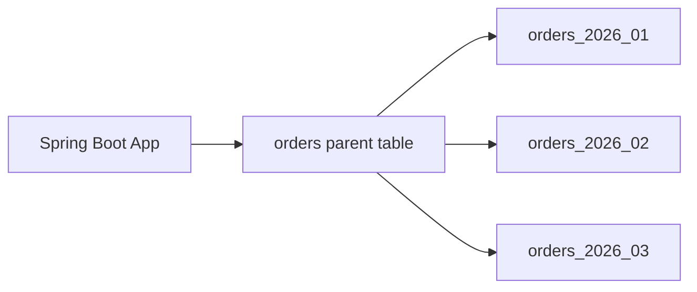

The app writes to:

```sql
INSERT INTO orders (...)
```

PostgreSQL routes the row to the correct partition.

### Repository rule

Bad:

```java
List<OrderEntity> findAll();
```

Better:

```java
List<OrderEntity> findByCreatedAtBetween(OffsetDateTime start, OffsetDateTime end);
```

---

## 15.2 Manual sharding pattern in Spring Boot

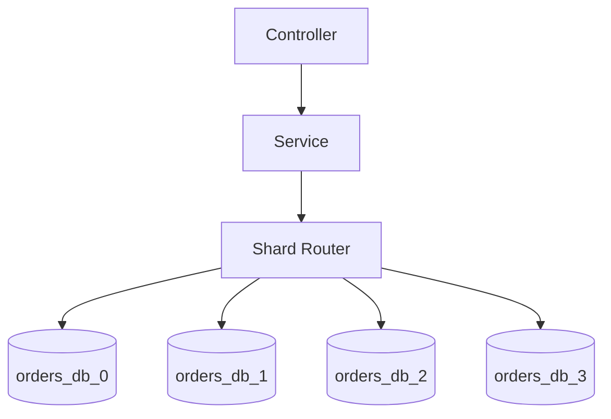

### Shard utility

```java
package com.example.demo.sharding;

public final class ShardUtil {
    private ShardUtil() {}

    public static int shardForUserId(Long userId, int numberOfShards) {
        return Math.abs(Long.hashCode(userId)) % numberOfShards;
    }
}
```

### Route query to one shard

```java
package com.example.demo.sharding;

import org.springframework.jdbc.core.JdbcTemplate;
import org.springframework.stereotype.Service;

import javax.sql.DataSource;
import java.util.Map;

@Service
public class ShardedOrderReader {

    private final Map<Integer, DataSource> shardDataSources;

    public ShardedOrderReader(Map<Integer, DataSource> shardDataSources) {
        this.shardDataSources = shardDataSources;
    }

    public int countOrdersByUser(Long userId) {
        int shard = ShardUtil.shardForUserId(userId, 4);
        JdbcTemplate jdbcTemplate = new JdbcTemplate(shardDataSources.get(shard));

        Integer count = jdbcTemplate.queryForObject(
            "select count(*) from orders where user_id = ?",
            Integer.class,
            userId
        );

        return count == null ? 0 : count;
    }
}
```

---

## 15.3 Read replica routing pattern

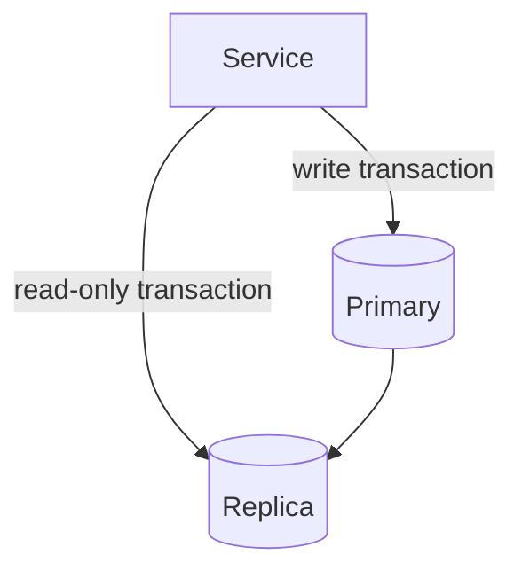

### Rule

| Operation | Route to |
|---|---|
| Create/update/delete | Primary |
| Strong read-after-write | Primary |
| Normal read-only query | Replica |
| Analytics/dashboard read | Replica or analytics DB |

---

# 16. Interview answer templates

## 16.1 “SQL or NoSQL?”

```text
I would choose based on access patterns and correctness.
If I need ACID transactions, joins, and relational integrity, I would start with PostgreSQL.
If the data is document-shaped and mostly read as a whole object, MongoDB may fit.
In a real system, I might use PostgreSQL for transactions, Redis for caching, and another store for search or analytics.
```

---

## 16.2 “How would you scale the database?”

```text
First, I would optimize schema, queries, and indexes.
Then I would add caching and read replicas for read-heavy traffic.
If a table becomes huge, I would partition it by a natural key like created_at or tenant_id.
If one node still cannot handle writes or storage, I would shard by a high-cardinality key like user_id.
I would avoid cross-shard joins and keep the most important queries shard-local.
```

---

## 16.3 “Partitioning vs sharding?”

```text
Partitioning splits a large table into smaller pieces inside the same database.
Sharding splits data across multiple database servers.
I would use partitioning first for large tables and operational maintenance.
I would use sharding only when a single database cannot handle write throughput, storage, or tenant isolation requirements.
```

---

## 16.4 “How do you handle replica lag?”

```text
For normal reads, I can use read replicas.
For read-after-write flows, I would read from the primary or use sticky routing for that user/session.
I would also monitor replica lag and stop routing reads to unhealthy replicas.
```

---

# 17. Final cheat sheets

## 17.1 SQL vs NoSQL

| Need | Use |
|---|---|
| ACID transactions | SQL |
| Joins and ad-hoc queries | SQL |
| Flexible schema | Document DB |
| Massive write scale | Wide-column/distributed DB |
| Cache/session/counters | Key-value DB |

---

## 17.2 Partitioning vs sharding vs replication

| Technique | Solves | Does not solve |
|---|---|---|
| Partitioning | Huge tables, archival, pruning | Single-node write limit |
| Replication | Read scaling, failover | Primary write bottleneck |
| Sharding | Write/storage horizontal scale | Query complexity |

---

## 17.3 Read scaling path

```text
Indexes
→ query optimization
→ connection pooling
→ cache
→ read replicas
→ denormalized read models
```

---

## 17.4 Write scaling path

```text
batching
→ async processing
→ partitioning
→ sharding
→ specialized distributed stores
```

---

## 17.5 Interview checklist

| Topic | What to mention |
|---|---|
| Access patterns | Main reads/writes |
| Schema | Entities, relationships, constraints |
| Indexes | Query-specific indexes |
| Partitioning | Large-table management |
| Replication | Read scaling and failover |
| Sharding | Horizontal write/storage scaling |
| Consistency | Strong vs eventual |
| Transactions | Local transaction, saga, outbox |
| Operations | Backup, monitoring, migrations |

---

# Closing note

The goal is not to memorize every database.

The goal is to understand:

- what the workload needs
- what each database is good at
- what trade-offs you are making
- how the design evolves from simple to large scale

That is what system design interviewers are really testing.
