# Database Design for System Design Interviews — Ultimate Reference

> A practical, end-to-end guide to database design from **first principles** to **high-scale production architecture**.  
> Covers **SQL vs NoSQL**, **schema design**, **normalization**, **indexing**, **partitioning**, **sharding**, **replication**, **consistency**, **transactions**, **query optimization**, and **Spring Boot examples** for both RDBMS and NoSQL.

---

## How to use this guide

Use this document as an interview playbook:

1. Start with requirements and access patterns.
2. Pick the simplest storage model that satisfies correctness.
3. Add indexes for real queries, not hypothetical ones.
4. Scale reads before scaling writes.
5. Partition before sharding when one database can still handle the workload.
6. Use replication for availability and read scaling.
7. Use sharding only when one node cannot handle data size or write throughput.
8. Be explicit about consistency and transaction trade-offs.

---

## Table of Contents

1. [How to think about database design](#1-how-to-think-about-database-design)
2. [SQL vs NoSQL](#2-sql-vs-nosql)
3. [Schema design principles](#3-schema-design-principles)
4. [Normalization vs denormalization](#4-normalization-vs-denormalization)
5. [Indexing strategies](#5-indexing-strategies)
6. [Partitioning in RDBMS](#6-partitioning-in-rdbms)
7. [Sharding in RDBMS and NoSQL](#7-sharding-in-rdbms-and-nosql)
8. [Replication patterns](#8-replication-patterns)
9. [Consistency models](#9-consistency-models)
10. [Transactions and distributed transactions](#10-transactions-and-distributed-transactions)
11. [Query optimization](#11-query-optimization)
12. [Real design examples](#12-real-design-examples)
13. [Spring Boot + PostgreSQL step by step](#13-spring-boot--postgresql-step-by-step)
14. [Spring Boot + MongoDB step by step](#14-spring-boot--mongodb-step-by-step)
15. [Spring Boot patterns for partitioning and sharding](#15-spring-boot-patterns-for-partitioning-and-sharding)
16. [Interview answer templates](#16-interview-answer-templates)
17. [Final cheat sheets](#17-final-cheat-sheets)

---

# 1. How to think about database design

Database design is not about picking a trendy database. It is about matching your **data model**, **access patterns**, and **scale requirements**.

When an interviewer asks, _“How would you store this data?”_, they are really asking:

- What does the data look like?
- What queries matter most?
- What consistency guarantees are required?
- What is the expected scale?
- What can be eventually consistent, and what cannot?

## 1.1 Database design workflow

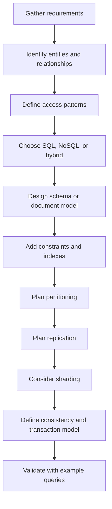
```mermaid
flowchart TD
    A[Gather requirements] --> B[Identify entities and relationships]
    B --> C[Define access patterns]
    C --> D[Choose SQL, NoSQL, or hybrid]
    D --> E[Design schema or document model]
    E --> F[Add constraints and indexes]
    F --> G[Plan partitioning]
    G --> H[Plan replication]
    H --> I[Consider sharding]
    I --> J[Define consistency and transaction model]
    J --> K[Validate with example queries]
```

### Explanation

This workflow prevents premature technology choices. In interviews, always show that the database choice follows from requirements, not preference.

| Step | Main question | Output |
|---|---|---|
| Requirements | What must the system do? | read/write volume, latency, durability |
| Entities | What are the core objects? | users, orders, products, events |
| Access patterns | How is data queried? | lookup by id, range scan, feed query |
| Storage choice | Which DB model fits? | SQL, document, key-value, graph, wide-column |
| Schema | How is data organized? | tables, collections, keys, relationships |
| Indexing | Which queries must be fast? | single, composite, partial, covering indexes |
| Scaling | What breaks first? | read replicas, partitioning, sharding |
| Consistency | How fresh must reads be? | strong, eventual, read-your-writes |

---

## 1.2 Start with these questions

### Workload

| Question | Why it matters |
|---|---|
| Read-heavy or write-heavy? | determines replicas, caching, write scaling |
| Random lookups or range scans? | determines key and index design |
| OLTP or analytics? | OLTP favors normalized transactions; analytics favors columnar/aggregated models |
| Hot key risk? | affects partition/shard key selection |

### Data shape

| Shape | Usually fits |
|---|---|
| Strong relationships | SQL |
| Nested JSON documents | Document DB |
| Simple id-to-value lookup | Key-value store |
| Huge append-only events | Wide-column or time-series DB |
| Deep relationships/traversals | Graph DB |

### Consistency

| Requirement | Typical choice |
|---|---|
| money, inventory, balances | strong consistency + transactions |
| feeds, likes, recommendations | eventual consistency acceptable |
| profile update shown to same user | read-your-writes consistency |
| comments with replies | causal ordering may matter |

---

# 2. SQL vs NoSQL

This is usually the first major decision.

## 2.1 Storage model decision tree

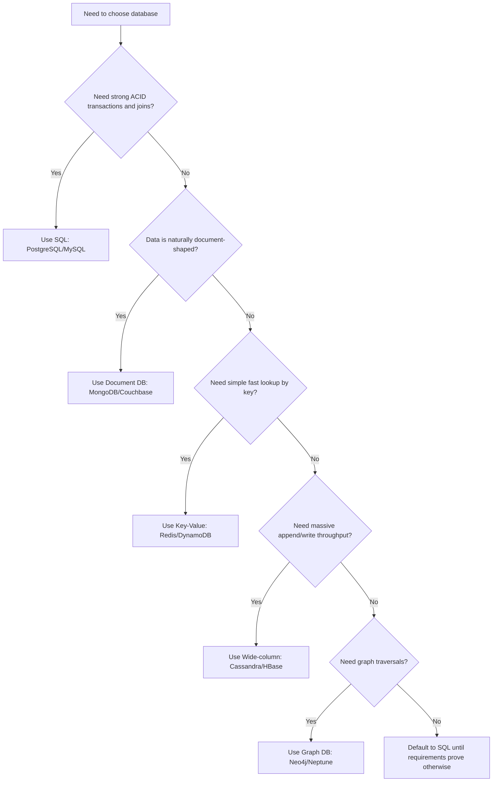
```mermaid
flowchart TD
    A[Need to choose database] --> B{Need strong ACID transactions and joins?}
    B -->|Yes| C[Use SQL: PostgreSQL/MySQL]
    B -->|No| D{Data is naturally document-shaped?}
    D -->|Yes| E[Use Document DB: MongoDB/Couchbase]
    D -->|No| F{Need simple fast lookup by key?}
    F -->|Yes| G[Use Key-Value: Redis/DynamoDB]
    F -->|No| H{Need massive append/write throughput?}
    H -->|Yes| I[Use Wide-column: Cassandra/HBase]
    H -->|No| J{Need graph traversals?}
    J -->|Yes| K[Use Graph DB: Neo4j/Neptune]
    J -->|No| L[Default to SQL until requirements prove otherwise]
```

### Explanation

SQL is often the safest default for system design interviews because it gives transactions, constraints, joins, and query flexibility. NoSQL becomes attractive when the access pattern is well known and the data shape or scale makes relational modeling less ideal.

---

## 2.2 SQL relational databases

Examples:

- PostgreSQL
- MySQL
- MariaDB
- Oracle
- SQL Server

Relational databases store data in tables and model relationships explicitly.

```sql
CREATE TABLE users (
    id BIGSERIAL PRIMARY KEY,
    name VARCHAR(100) NOT NULL,
    email VARCHAR(255) UNIQUE NOT NULL
);

CREATE TABLE orders (
    id BIGSERIAL PRIMARY KEY,
    user_id BIGINT NOT NULL REFERENCES users(id),
    total_amount DECIMAL(10,2) NOT NULL,
    created_at TIMESTAMPTZ DEFAULT NOW()
);
```

| Strength | Why it matters |
|---|---|
| ACID transactions | protects money, orders, inventory |
| joins | easy relationship queries |
| constraints | prevents invalid data |
| mature indexing | improves query latency |
| SQL | strong ad-hoc querying |

| Weakness | Practical impact |
|---|---|
| horizontal write scaling is harder | sharding is more complex |
| migrations require care | schema changes affect production |
| joins can be expensive at scale | may require denormalized read models |
| multi-region writes are complex | conflict handling is difficult |

---

## 2.3 NoSQL categories

| Type | Examples | Best for | Avoid when |
|---|---|---|---|
| Document | MongoDB, Couchbase | flexible JSON-like records | many joins are required |
| Key-value | Redis, DynamoDB | sessions, cache, counters | rich querying is needed |
| Wide-column | Cassandra, HBase | huge write throughput, time-series | ad-hoc queries are needed |
| Graph | Neo4j, Neptune | relationship traversal | generic OLTP is needed |

---

## 2.4 SQL vs NoSQL comparison

| Requirement | Prefer SQL | Prefer NoSQL |
|---|---:|---:|
| Strong transactions | ✅ | sometimes |
| Rich joins | ✅ | ❌ |
| Flexible schema | limited | ✅ |
| Massive write scale | harder | often easier |
| Known access patterns only | maybe | ✅ |
| Ad-hoc analytics | ✅ | weaker |
| Time-series/event ingestion | possible | wide-column often better |
| Referential integrity | ✅ | usually app-managed |

---

## 2.5 Hybrid architecture is normal

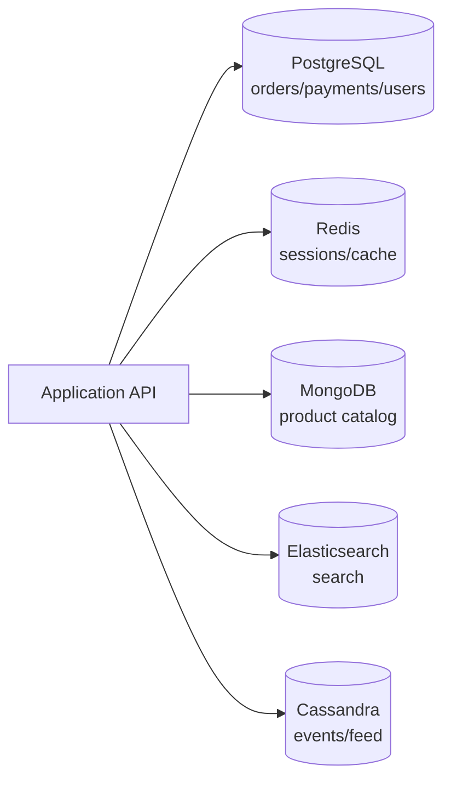
```mermaid
flowchart LR
    API[Application API] --> PG[(PostgreSQL\norders/payments/users)]
    API --> REDIS[(Redis\nsessions/cache)]
    API --> MONGO[(MongoDB\nproduct catalog)]
    API --> ES[(Elasticsearch\nsearch)]
    API --> CASS[(Cassandra\nevents/feed)]
```

| Use case | Database |
|---|---|
| orders, payments | PostgreSQL |
| session cache | Redis |
| product catalog | MongoDB |
| feed events | Cassandra |
| search | Elasticsearch/OpenSearch |
| graph recommendations | Neo4j |

### Interview rule

Do not force one database to solve every problem. Explain the primary source of truth and the supporting stores.

---

# 3. Schema design principles

Good schema design makes queries efficient, updates safe, and scaling easier later.

## 3.1 Entity relationship model

Example e-commerce system:

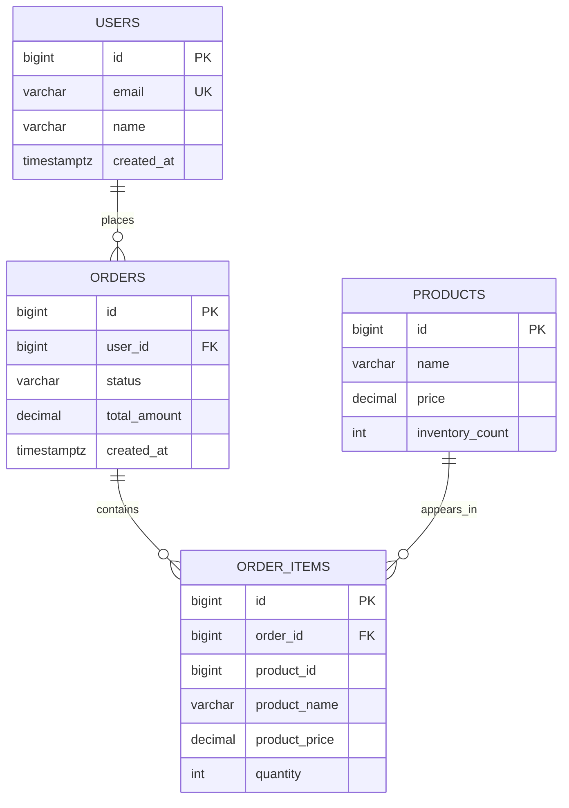
```mermaid
erDiagram
    USERS ||--o{ ORDERS : places
    ORDERS ||--o{ ORDER_ITEMS : contains
    PRODUCTS ||--o{ ORDER_ITEMS : appears_in

    USERS {
        bigint id PK
        varchar email UK
        varchar name
        timestamptz created_at
    }

    PRODUCTS {
        bigint id PK
        varchar name
        decimal price
        int inventory_count
    }

    ORDERS {
        bigint id PK
        bigint user_id FK
        varchar status
        decimal total_amount
        timestamptz created_at
    }

    ORDER_ITEMS {
        bigint id PK
        bigint order_id FK
        bigint product_id
        varchar product_name
        decimal product_price
        int quantity
    }
```

### Explanation

The relationship model shows ownership and cardinality:

| Relationship | Meaning |
|---|---|
| User → Orders | one user can place many orders |
| Order → OrderItems | one order contains many items |
| Product → OrderItems | one product can appear in many orders |

---

## 3.2 Primary key choices

| Key type | Pros | Cons | Best for |
|---|---|---|---|
| BIGSERIAL | compact, fast, index-friendly | hard to generate across shards | simple/single DB systems |
| UUID v4 | globally unique | random inserts, larger index | distributed writes where order does not matter |
| UUIDv7 / ULID | globally unique and time-sortable | slightly more complexity | high-scale distributed systems |
| Snowflake ID | compact, sortable, distributed | requires ID generator | very high-scale services |

### Recommendation

For single-node/simple systems: `BIGSERIAL` is fine.  
For distributed/high-scale systems: prefer **UUIDv7**, **ULID**, or **Snowflake-style IDs**.

---

## 3.3 Constraints matter

```sql
CREATE TABLE users (
    id BIGSERIAL PRIMARY KEY,
    email VARCHAR(255) UNIQUE NOT NULL,
    age INT CHECK (age >= 0 AND age < 150),
    status VARCHAR(20) NOT NULL CHECK (status IN ('active', 'inactive', 'banned'))
);
```

| Constraint | Purpose |
|---|---|
| `PRIMARY KEY` | uniquely identifies rows |
| `FOREIGN KEY` | prevents invalid references |
| `UNIQUE` | prevents duplicates |
| `NOT NULL` | prevents missing required data |
| `CHECK` | enforces domain rules |

Use constraints in relational systems unless there is a clear scaling reason not to.

---

## 3.4 Correct data types

| Data | Recommended type | Why |
|---|---|---|
| money | `DECIMAL(10,2)` | exact precision |
| timestamps | `TIMESTAMPTZ` | timezone-safe |
| IDs | `BIGINT`, `UUID`, `ULID` | scalable identity |
| JSON payload | `JSONB` | flexible and indexable in PostgreSQL |
| flags | `BOOLEAN` | clear semantics |
| status | enum/check-constrained text | avoids invalid states |

---

# 4. Normalization vs denormalization

## 4.1 Normalization

Normalization means storing each fact once.

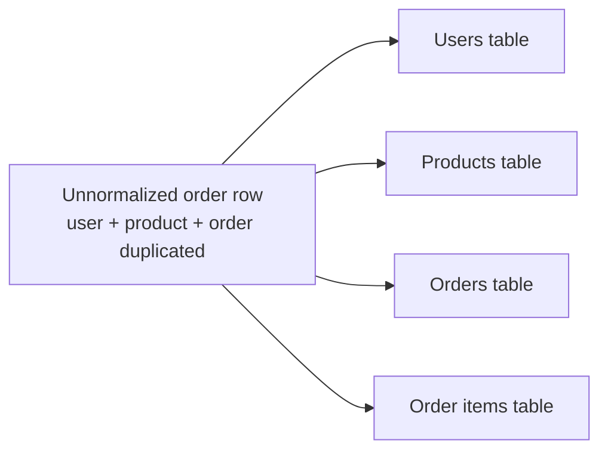
```mermaid
flowchart LR
    A[Unnormalized order row\nuser + product + order duplicated] --> B[Users table]
    A --> C[Products table]
    A --> D[Orders table]
    A --> E[Order items table]
```

### Bad unnormalized table

| order_id | user_name | user_email | product_name | product_price |
|---|---|---|---|---:|
| 1 | Alice | alice@example.com | Laptop | 999 |
| 2 | Alice | alice@example.com | Mouse | 49 |

Problems:

- duplicated data
- hard updates
- inconsistency risk

### Normalized version

```sql
CREATE TABLE users (
    id BIGSERIAL PRIMARY KEY,
    name VARCHAR(100),
    email VARCHAR(255) UNIQUE
);

CREATE TABLE products (
    id BIGSERIAL PRIMARY KEY,
    name VARCHAR(255),
    current_price DECIMAL(10,2)
);

CREATE TABLE orders (
    id BIGSERIAL PRIMARY KEY,
    user_id BIGINT REFERENCES users(id),
    created_at TIMESTAMPTZ DEFAULT NOW()
);

CREATE TABLE order_items (
    id BIGSERIAL PRIMARY KEY,
    order_id BIGINT REFERENCES orders(id),
    product_id BIGINT REFERENCES products(id),
    quantity INT NOT NULL
);
```

| Benefit | Trade-off |
|---|---|
| less duplication | more joins |
| easier updates | slower read paths sometimes |
| stronger consistency | query complexity increases |

---

## 4.2 Denormalization

Denormalization duplicates some data to make reads cheaper or preserve history.

```sql
CREATE TABLE order_items (
    id BIGSERIAL PRIMARY KEY,
    order_id BIGINT REFERENCES orders(id),
    product_id BIGINT NOT NULL,
    product_name VARCHAR(255) NOT NULL,
    product_price DECIMAL(10,2) NOT NULL,
    quantity INT NOT NULL
);
```

### Why this is useful

Product name and price at purchase time should not change when the product catalog changes later.

| Situation | Recommendation |
|---|---|
| core transactional data | normalize first |
| read-heavy hot path | selectively denormalize |
| historical snapshots | denormalize intentionally |
| analytics views | denormalize aggressively |

---

# 5. Indexing strategies

Indexes are the #1 performance lever.

## 5.1 How an index changes lookup cost

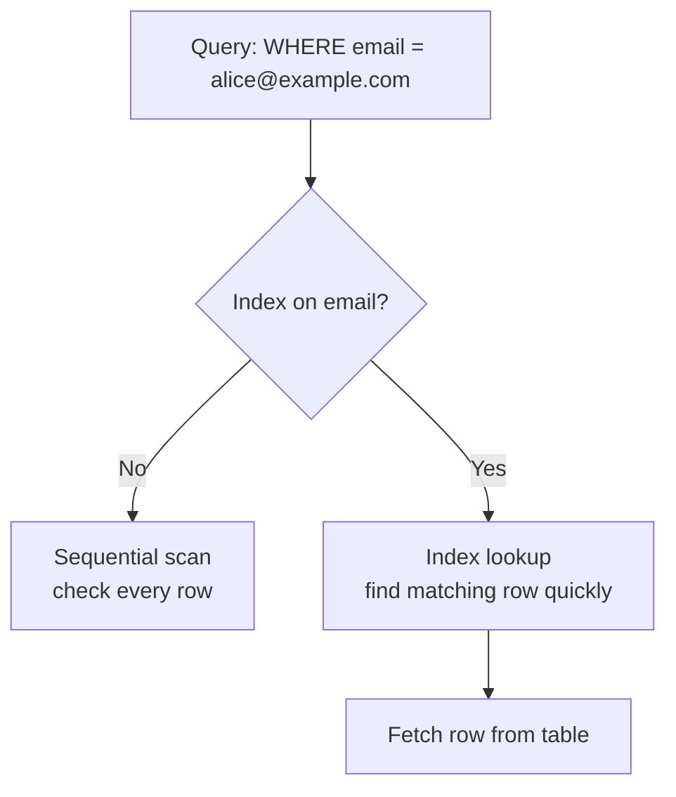
```mermaid
flowchart TD
    A[Query: WHERE email = alice@example.com] --> B{Index on email?}
    B -->|No| C[Sequential scan\ncheck every row]
    B -->|Yes| D[Index lookup\nfind matching row quickly]
    D --> E[Fetch row from table]
```

---

## 5.2 Common index types

| Index type | Example | Best for |
|---|---|---|
| Single-column | `ON orders(user_id)` | lookup by one field |
| Unique | `UNIQUE ON users(email)` | uniqueness + lookup |
| Composite | `ON orders(user_id, status, created_at)` | multi-filter queries |
| Partial | `ON orders(created_at) WHERE status='pending'` | hot subset |
| Covering | include all selected columns | avoid table lookup |
| GIN | `USING GIN(payload)` | JSONB / array search |

---

## 5.3 Composite index order matters

Index:

```sql
CREATE INDEX idx_orders_user_status_created
ON orders(user_id, status, created_at DESC);
```

Helps:

```sql
SELECT * FROM orders
WHERE user_id = 123 AND status = 'pending'
ORDER BY created_at DESC;
```

Does not help much:

```sql
SELECT * FROM orders WHERE status = 'pending';
```

because `user_id` is the leftmost column.

### Rule

| Index position | Put this there |
|---|---|
| first | equality filters |
| middle | range filters |
| last | sort columns |

---

## 5.4 Indexing trade-offs

| Benefit | Cost |
|---|---|
| faster reads | slower writes |
| faster sorting/filtering | more disk usage |
| supports uniqueness | index maintenance overhead |
| can avoid table access | too many indexes confuse maintenance |

### Interview line

“I would add indexes only for critical access patterns and verify them with `EXPLAIN ANALYZE`.”

---

# 6. Partitioning in RDBMS

Partitioning splits a large table into smaller physical pieces inside one database.

## 6.1 Partitioning overview

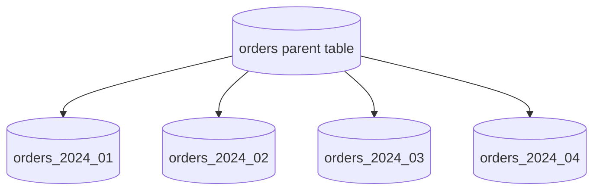
```mermaid
flowchart TD
    A[(orders parent table)] --> B[(orders_2024_01)]
    A --> C[(orders_2024_02)]
    A --> D[(orders_2024_03)]
    A --> E[(orders_2024_04)]
```

### Explanation

The application queries the parent table. The database routes inserts and prunes irrelevant partitions during queries when the filter includes the partition key.

---

## 6.2 When to partition

| Signal | Partitioning helps because |
|---|---|
| huge table | each partition is smaller |
| frequent time-range queries | old partitions can be skipped |
| need fast archival | drop partition instead of deleting rows |
| maintenance is slow | vacuum/reindex can target partitions |

Good partition keys:

- time
- region
- tenant
- high-cardinality hash key

Bad partition keys:

- low-cardinality values not used in filters
- columns that change often
- columns unrelated to major queries

---

## 6.3 Range partitioning example

```sql
CREATE TABLE orders (
    id BIGSERIAL,
    user_id BIGINT NOT NULL,
    total_amount DECIMAL(10,2) NOT NULL,
    created_at TIMESTAMPTZ NOT NULL
) PARTITION BY RANGE (created_at);

CREATE TABLE orders_2024_01 PARTITION OF orders
FOR VALUES FROM ('2024-01-01') TO ('2024-02-01');

CREATE TABLE orders_2024_02 PARTITION OF orders
FOR VALUES FROM ('2024-02-01') TO ('2024-03-01');
```

Query with partition pruning:

```sql
EXPLAIN ANALYZE
SELECT * FROM orders
WHERE created_at >= '2024-02-01'
  AND created_at < '2024-03-01';
```

Only the February partition should be scanned.

---

## 6.4 Partitioning types

| Type | Example key | Best for | Weakness |
|---|---|---|---|
| Range | `created_at` | time-series, logs, orders | uneven partitions if traffic spikes |
| List | `region` | geo/tenant separation | bad if values grow unpredictably |
| Hash | `user_id` | even distribution | range queries are harder |

---

# 7. Sharding in RDBMS and NoSQL

Partitioning is inside one DB server. Sharding spreads data across multiple database servers.

## 7.1 Partitioning vs sharding

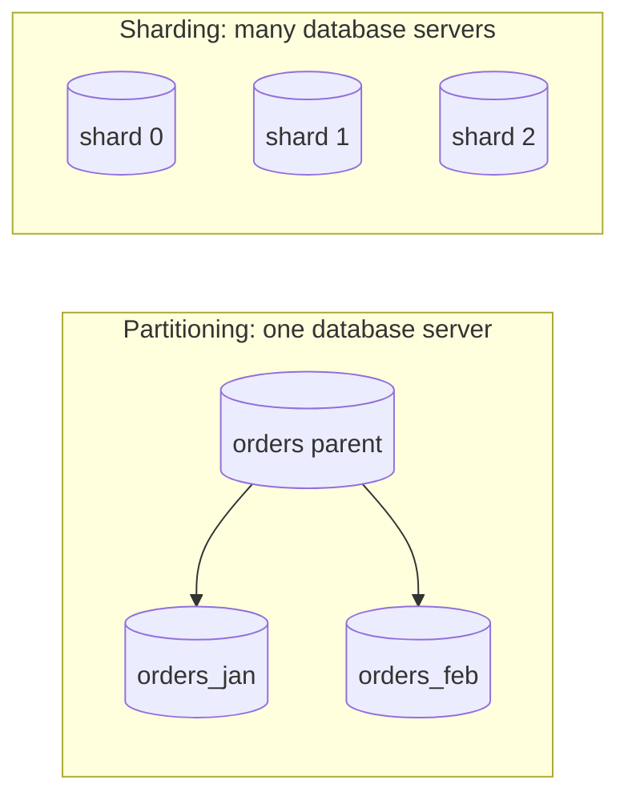
```mermaid
flowchart LR
    subgraph OneDB[Partitioning: one database server]
        P[(orders parent)] --> P1[(orders_jan)]
        P --> P2[(orders_feb)]
    end

    subgraph ManyDB[Sharding: many database servers]
        S0[(shard 0)]
        S1[(shard 1)]
        S2[(shard 2)]
    end
```

| Concept | Meaning | App complexity |
|---|---|---:|
| Partitioning | split large table inside one DB | low |
| Sharding | split data across DB servers | high |

---

## 7.2 Sharding strategies

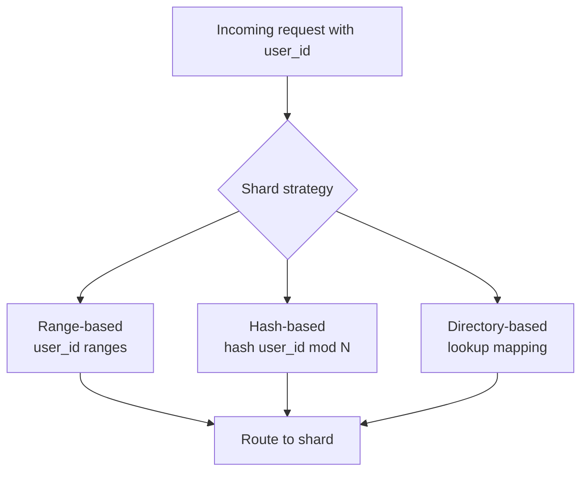
```mermaid
flowchart TD
    A[Incoming request with user_id] --> B{Shard strategy}
    B --> C[Range-based\nuser_id ranges]
    B --> D[Hash-based\nhash user_id mod N]
    B --> E[Directory-based\nlookup mapping]
    C --> F[Route to shard]
    D --> F
    E --> F
```

| Strategy | Pros | Cons |
|---|---|---|
| Range-based | range queries are easy | hot shards and rebalancing issues |
| Hash-based | even distribution | range queries hard; resharding painful |
| Directory-based | flexible placement | mapping service becomes critical |
| Consistent hashing | easier node changes | more complex routing |

---

## 7.3 Sharding request flow

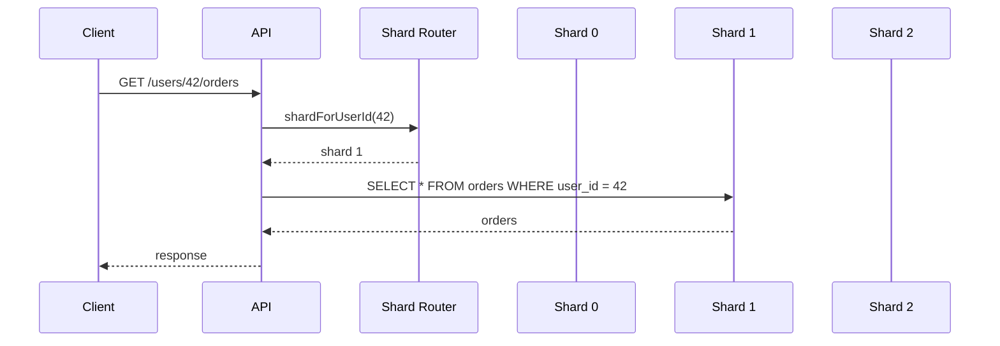
```mermaid
sequenceDiagram
    participant Client
    participant API
    participant Router as Shard Router
    participant S0 as Shard 0
    participant S1 as Shard 1
    participant S2 as Shard 2

    Client->>API: GET /users/42/orders
    API->>Router: shardForUserId(42)
    Router-->>API: shard 1
    API->>S1: SELECT * FROM orders WHERE user_id = 42
    S1-->>API: orders
    API-->>Client: response
```

### Key interview point

A good shard key keeps the most important queries shard-local. Cross-shard queries are expensive.

---

## 7.4 Cross-shard query problem

Query not using shard key:

```sql
SELECT * FROM orders WHERE status = 'pending';
```

This requires:

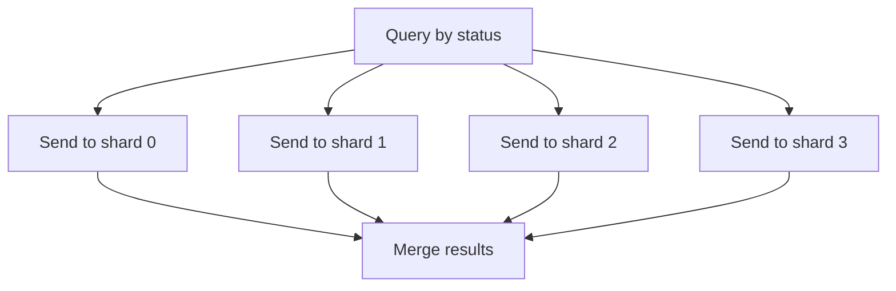
```mermaid
flowchart TD
    A[Query by status] --> B[Send to shard 0]
    A --> C[Send to shard 1]
    A --> D[Send to shard 2]
    A --> E[Send to shard 3]
    B --> F[Merge results]
    C --> F
    D --> F
    E --> F
```

Solutions:

| Problem | Solution |
|---|---|
| global query across shards | maintain secondary read model |
| search by many fields | use Elasticsearch/OpenSearch |
| analytics across all data | use warehouse/lake/OLAP store |
| cross-shard transaction | avoid, redesign aggregate boundaries, or use saga |

---

# 8. Replication patterns

Replication copies data for scalability and fault tolerance.

## 8.1 Single-leader replication

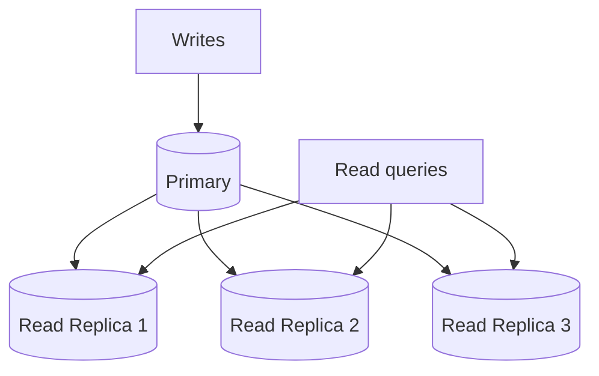
```mermaid
flowchart TD
    W[Writes] --> P[(Primary)]
    P --> R1[(Read Replica 1)]
    P --> R2[(Read Replica 2)]
    P --> R3[(Read Replica 3)]
    Q[Read queries] --> R1
    Q --> R2
    Q --> R3
```

| Pros | Cons |
|---|---|
| simple mental model | primary is write bottleneck |
| strong consistency on primary | replica lag possible |
| read scaling with replicas | failover needs coordination |

---

## 8.2 Sync vs async replication

| Mode | Write acknowledged after | Pros | Cons |
|---|---|---|---|
| synchronous | replica confirms | stronger durability | higher latency, lower availability |
| asynchronous | primary commits | fast writes | replica lag, possible data loss on crash |

---

## 8.3 Multi-leader replication

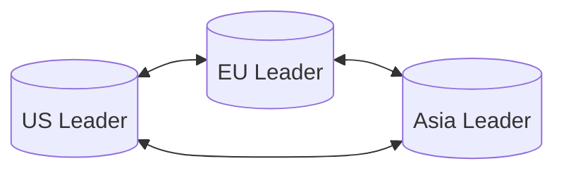
```mermaid
flowchart LR
    US[(US Leader)] <--> EU[(EU Leader)]
    EU <--> ASIA[(Asia Leader)]
    ASIA <--> US
```

Useful for low-latency multi-region writes, but introduces conflict resolution and write-ordering complexity.

---

## 8.4 Leaderless quorum replication

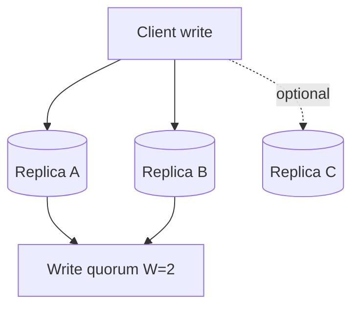
```mermaid
flowchart TD
    C[Client write] --> A[(Replica A)]
    C --> B[(Replica B)]
    C -. optional .-> D[(Replica C)]
    A --> Q[Write quorum W=2]
    B --> Q
```

If `N = 3`, `W = 2`, and `R = 2`, then `W + R > N`, so reads overlap with writes.

| Term | Meaning |
|---|---|
| N | number of replicas |
| W | replicas that must acknowledge a write |
| R | replicas queried for a read |
| W + R > N | quorum overlap condition |

---

# 9. Consistency models

## 9.1 Consistency spectrum

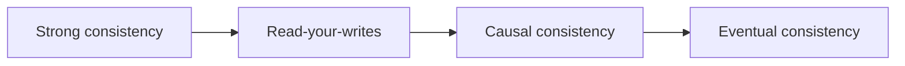
```mermaid
flowchart LR
    A[Strong consistency] --> B[Read-your-writes]
    B --> C[Causal consistency]
    C --> D[Eventual consistency]
```

| Model | Meaning | Best for |
|---|---|---|
| Strong | every read sees latest committed write | money, inventory, permissions |
| Read-your-writes | user sees their own update immediately | profiles, carts, drafts |
| Causal | dependent events are seen in order | comments, replies, collaboration |
| Eventual | replicas converge over time | feeds, likes, analytics |

---

## 9.2 Choosing consistency

| Feature | Consistency target | Reason |
|---|---|---|
| account balance | strong | correctness is critical |
| checkout inventory | strong or carefully serialized | avoid overselling |
| user profile edit | read-your-writes | UX expectation |
| news feed | eventual | stale feed is acceptable |
| like count | eventual | exact count is rarely critical |
| comment thread | causal | replies should not appear before parent comments |

---

# 10. Transactions and distributed transactions

## 10.1 Local transaction

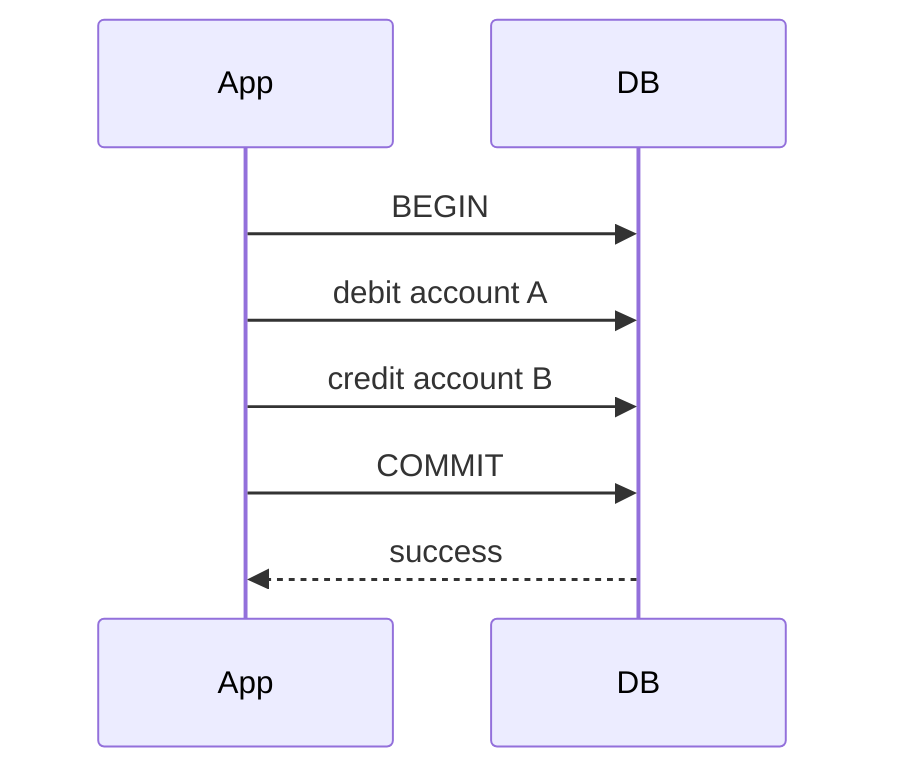
```mermaid
sequenceDiagram
    participant App
    participant DB

    App->>DB: BEGIN
    App->>DB: debit account A
    App->>DB: credit account B
    App->>DB: COMMIT
    DB-->>App: success
```

```sql
BEGIN;

UPDATE accounts SET balance = balance - 100 WHERE id = 1;
UPDATE accounts SET balance = balance + 100 WHERE id = 2;

COMMIT;
```

Good when all data is in one database.

---

## 10.2 Isolation levels

| Level | Dirty read | Non-repeatable read | Phantom read | Notes |
|---|---:|---:|---:|---|
| Read Uncommitted | yes | yes | yes | rarely used |
| Read Committed | no | yes | yes | common default |
| Repeatable Read | no | no | possible depending on DB | good for consistent transaction reads |
| Serializable | no | no | no | strongest, may reduce concurrency |

---

## 10.3 Distributed transaction options

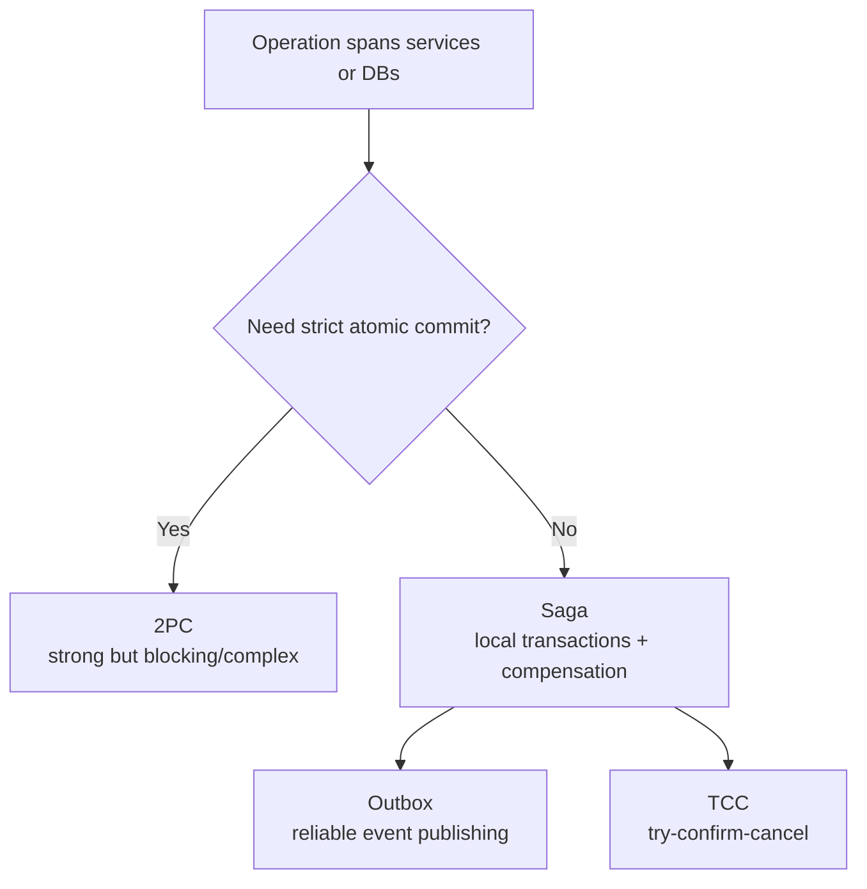
```mermaid
flowchart TD
    A[Operation spans services or DBs] --> B{Need strict atomic commit?}
    B -->|Yes| C[2PC\nstrong but blocking/complex]
    B -->|No| D[Saga\nlocal transactions + compensation]
    D --> E[Outbox\nreliable event publishing]
    D --> F[TCC\ntry-confirm-cancel]
```

| Pattern | Use when | Trade-off |
|---|---|---|
| 2PC | strict atomicity across resources | blocking, complex, operationally hard |
| Saga | business process can be compensated | eventual consistency |
| Outbox | DB write must publish event reliably | requires relay/consumer |
| TCC | resources can be reserved then confirmed | more application logic |

### Practical guidance

For microservices, prefer:

- local transaction per service
- outbox for reliable event publishing
- saga for distributed workflows

---

# 11. Query optimization

## 11.1 Query optimization loop

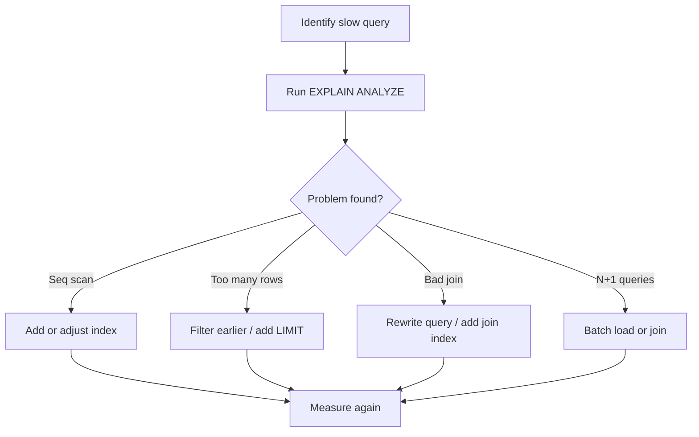
```mermaid
flowchart TD
    A[Identify slow query] --> B[Run EXPLAIN ANALYZE]
    B --> C{Problem found?}
    C -->|Seq scan| D[Add or adjust index]
    C -->|Too many rows| E[Filter earlier / add LIMIT]
    C -->|Bad join| F[Rewrite query / add join index]
    C -->|N+1 queries| G[Batch load or join]
    D --> H[Measure again]
    E --> H
    F --> H
    G --> H
```

---

## 11.2 Common fixes

| Problem | Fix |
|---|---|
| sequential scan on large table | add matching index |
| reading too many columns | select only needed columns |
| unbounded result set | add pagination / `LIMIT` |
| N+1 queries | join, fetch join, or batch load |
| slow sort | add index matching `ORDER BY` |
| repeated hot reads | cache with TTL |
| too many DB connections | tune connection pool |

---

## 11.3 Caching pattern

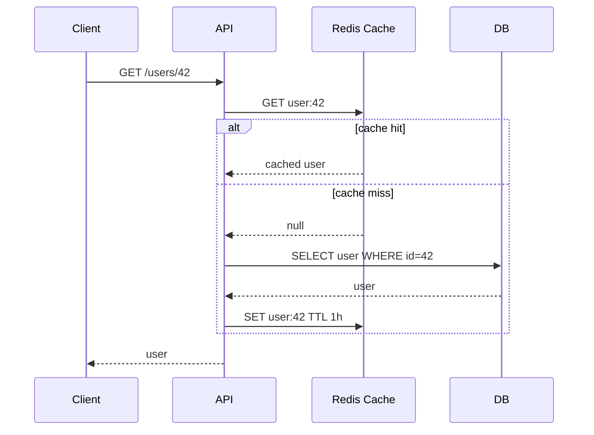
```mermaid
sequenceDiagram
    participant Client
    participant API
    participant Cache as Redis Cache
    participant DB

    Client->>API: GET /users/42
    API->>Cache: GET user:42
    alt cache hit
        Cache-->>API: cached user
    else cache miss
        Cache-->>API: null
        API->>DB: SELECT user WHERE id=42
        DB-->>API: user
        API->>Cache: SET user:42 TTL 1h
    end
    API-->>Client: user
```

Use caching for hot, frequently read, moderately stale-tolerant data.

---

# 12. Real design examples

## 12.1 Twitter/X style feed

### Core entities

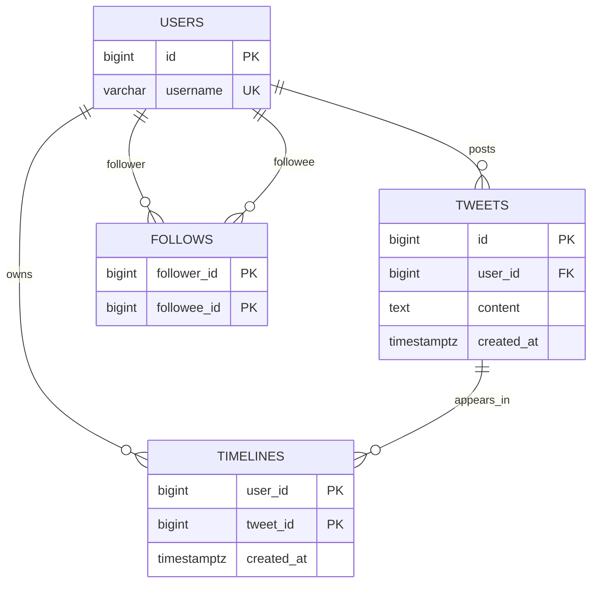
```mermaid
erDiagram
    USERS ||--o{ TWEETS : posts
    USERS ||--o{ FOLLOWS : follower
    USERS ||--o{ FOLLOWS : followee
    USERS ||--o{ TIMELINES : owns
    TWEETS ||--o{ TIMELINES : appears_in

    USERS {
        bigint id PK
        varchar username UK
    }
    TWEETS {
        bigint id PK
        bigint user_id FK
        text content
        timestamptz created_at
    }
    FOLLOWS {
        bigint follower_id PK
        bigint followee_id PK
    }
    TIMELINES {
        bigint user_id PK
        bigint tweet_id PK
        timestamptz created_at
    }
```

### Pull vs push model

| Model | How it works | Pros | Cons |
|---|---|---|---|
| Pull | build feed at read time from followed users | cheap writes | expensive reads for users following many accounts |
| Push | fan out tweet into followers' timelines | fast reads | expensive writes for celebrity users |
| Hybrid | push for normal users, pull for celebrities | balanced | more complex |

### Hybrid feed flow

```mermaid
flowchart TD
    A[User posts tweet] --> B{Author has many followers?}
    B -->|No| C[Push tweet to follower timelines]
    B -->|Yes| D[Store tweet only]
    E[Reader opens feed] --> F[Read precomputed timeline]
    F --> G[Pull celebrity tweets on demand]
    G --> H[Merge and rank feed]
```

---

## 12.2 E-commerce order system

### Order creation flow

```mermaid
sequenceDiagram
    participant Client
    participant API
    participant DB
    participant Payment

    Client->>API: Create order
    API->>DB: BEGIN
    API->>DB: reserve inventory with conditional update
    DB-->>API: affected rows = 1
    API->>DB: insert order + order_items
    API->>DB: COMMIT
    API->>Payment: charge payment
    Payment-->>API: success
    API-->>Client: order confirmed
```

### Inventory-safe update

```sql
UPDATE products
SET inventory_count = inventory_count - 1
WHERE id = 123 AND inventory_count > 0;
```

Check affected rows = 1.

| Concern | Design choice |
|---|---|
| avoid overselling | conditional inventory update inside transaction |
| preserve order history | copy product name/price into order items |
| query user orders | index `(user_id, created_at DESC)` |
| payment reliability | use idempotency key and outbox events |

---

## 12.3 Analytics/time-series system

```mermaid
flowchart LR
    A[Events API] --> B[(Raw events table\npartitioned by created_at)]
    B --> C[Stream/Batch Aggregator]
    C --> D[(Hourly aggregates)]
    D --> E[Dashboard API]
```

| Layer | Purpose |
|---|---|
| raw events | durable source of truth |
| partitions | fast retention and time filtering |
| aggregates | fast dashboard queries |
| dashboard API | serves precomputed metrics |

---

# 13. Spring Boot + PostgreSQL step by step

This is a simple but production-friendly starter.

## 13.1 Dependencies

```xml
<dependencies>
    <dependency>
        <groupId>org.springframework.boot</groupId>
        <artifactId>spring-boot-starter-web</artifactId>
    </dependency>

    <dependency>
        <groupId>org.springframework.boot</groupId>
        <artifactId>spring-boot-starter-data-jpa</artifactId>
    </dependency>

    <dependency>
        <groupId>org.postgresql</groupId>
        <artifactId>postgresql</artifactId>
        <scope>runtime</scope>
    </dependency>

    <dependency>
        <groupId>org.springframework.boot</groupId>
        <artifactId>spring-boot-starter-validation</artifactId>
    </dependency>
</dependencies>
```

---

## 13.2 application.yml

```yaml
spring:
  datasource:
    url: jdbc:postgresql://localhost:5432/shopdb
    username: postgres
    password: postgres
    hikari:
      maximum-pool-size: 20
      minimum-idle: 5
      connection-timeout: 30000

  jpa:
    hibernate:
      ddl-auto: validate
    show-sql: true
    properties:
      hibernate:
        format_sql: true

server:
  port: 8080
```

---

## 13.3 SQL schema

```sql
CREATE TABLE users (
    id BIGSERIAL PRIMARY KEY,
    email VARCHAR(255) UNIQUE NOT NULL,
    name VARCHAR(100) NOT NULL,
    created_at TIMESTAMPTZ DEFAULT NOW()
);

CREATE TABLE products (
    id BIGSERIAL PRIMARY KEY,
    name VARCHAR(255) NOT NULL,
    price DECIMAL(10,2) NOT NULL CHECK (price >= 0),
    inventory_count INT NOT NULL CHECK (inventory_count >= 0),
    created_at TIMESTAMPTZ DEFAULT NOW()
);

CREATE TABLE orders (
    id BIGSERIAL PRIMARY KEY,
    user_id BIGINT NOT NULL REFERENCES users(id),
    status VARCHAR(20) NOT NULL DEFAULT 'PENDING',
    total_amount DECIMAL(10,2) NOT NULL,
    created_at TIMESTAMPTZ DEFAULT NOW()
);

CREATE TABLE order_items (
    id BIGSERIAL PRIMARY KEY,
    order_id BIGINT NOT NULL REFERENCES orders(id),
    product_id BIGINT NOT NULL,
    product_name VARCHAR(255) NOT NULL,
    product_price DECIMAL(10,2) NOT NULL,
    quantity INT NOT NULL CHECK (quantity > 0)
);

CREATE INDEX idx_orders_user_created
ON orders(user_id, created_at DESC);
```

---

## 13.4 Transactional service pattern

```java
@Service
public class OrderService {

    private final ProductRepository productRepository;
    private final OrderRepository orderRepository;

    public OrderService(ProductRepository productRepository, OrderRepository orderRepository) {
        this.productRepository = productRepository;
        this.orderRepository = orderRepository;
    }

    @Transactional
    public OrderEntity createSimpleOrder(Long userId, Long productId, int quantity) {
        int updated = productRepository.reserveInventory(productId, quantity);
        if (updated == 0) {
            throw new IllegalStateException("Out of stock");
        }

        ProductEntity product = productRepository.findById(productId)
                .orElseThrow(() -> new IllegalArgumentException("Product not found"));

        OrderEntity order = new OrderEntity();
        order.setUserId(userId);
        order.setStatus("CONFIRMED");
        order.setTotalAmount(product.getPrice().multiply(BigDecimal.valueOf(quantity)));

        return orderRepository.save(order);
    }
}
```

### Explanation

| Code part | Purpose |
|---|---|
| `@Transactional` | inventory update and order insert succeed/fail together |
| conditional update | prevents overselling |
| affected row check | detects out-of-stock state |
| saved order | records confirmed purchase |

---

# 14. Spring Boot + MongoDB step by step

Use MongoDB when document-oriented storage fits better.

## 14.1 Product document model

```mermaid
flowchart TD
    P[Product Document] --> A[id]
    P --> B[name]
    P --> C[price]
    P --> D[category]
    P --> E[attributes map]
    E --> F[color]
    E --> G[size]
    E --> H[brand]
```

```java
@Document(collection = "products")
public class ProductDocument {

    @Id
    private String id;

    private String name;
    private BigDecimal price;
    private String category;
    private Map<String, Object> attributes;
}
```

### When this is better than SQL

| Situation | Why MongoDB fits |
|---|---|
| products have different attributes | flexible document schema |
| reads fetch entire product | one document read is efficient |
| schema evolves frequently | fewer migrations |

### When SQL is better

| Situation | Why SQL fits |
|---|---|
| many joins across catalog/order/supplier | relational queries are easier |
| strict constraints required | SQL constraints help |
| complex reporting needed | SQL is more flexible |

---

# 15. Spring Boot patterns for partitioning and sharding

## 15.1 Partitioning with PostgreSQL

Partitioning is transparent to the app if done in DB.

```mermaid
flowchart LR
    App[Spring Boot app] --> Parent[(orders parent table)]
    Parent --> Jan[(orders_2024_01)]
    Parent --> Feb[(orders_2024_02)]
    Parent --> Mar[(orders_2024_03)]
```

Your entity maps to the parent table. PostgreSQL routes rows to child partitions.

### Practical app rule

If you partition by `created_at`, make sure app queries include a date range.

Bad:

```java
orderRepository.findAll();
```

Good:

```java
orderRepository.findByCreatedAtBetween(start, end);
```

---

## 15.2 Manual sharding in Spring Boot

```mermaid
flowchart TD
    A[Request userId=42] --> B[ShardUtil.shardForUserId]
    B --> C{hash userId % 4}
    C --> D[DataSource shard 0]
    C --> E[DataSource shard 1]
    C --> F[DataSource shard 2]
    C --> G[DataSource shard 3]
```

```java
public final class ShardUtil {
    private ShardUtil() {}

    public static int shardForUserId(Long userId, int numberOfShards) {
        return Math.abs(Long.hashCode(userId)) % numberOfShards;
    }
}
```

### Explanation

| Step | What happens |
|---|---|
| receive request | request contains shard key, usually `userId` or `tenantId` |
| compute shard | app determines target shard |
| choose datasource | route to the correct database connection |
| execute query | query only one shard when possible |

---

# 16. Interview answer templates

## 16.1 “SQL or NoSQL?”

```text
I’d choose based on the data model and access patterns.
If I need strong ACID transactions, joins, and relational integrity, I’d start with PostgreSQL.
If the schema is flexible and reads are mostly by whole document, MongoDB is a good fit.
In many real systems I’d use both: relational DB for transactions, Redis for caching, and possibly a document or search store for specific read patterns.
```

---

## 16.2 “How would you scale the database?”

```text
I’d first optimize schema and indexing.
Then I’d add read replicas for read-heavy traffic.
If the table becomes huge, I’d partition by time or tenant.
If one node still can’t handle writes, I’d shard by a high-cardinality key like user_id.
I’d be careful to choose a shard key that avoids hot shards and keeps the main queries shard-local.
```

---

## 16.3 “How do you design schema?”

```text
I’d start from entities and relationships, define primary keys, foreign keys, and constraints, then add indexes to support the main queries.
I’d normalize core transactional data first, and selectively denormalize read-heavy paths where joins become expensive.
```

---

## 16.4 “How do you handle consistency?”

```text
I would classify each feature by correctness requirements.
For money, inventory, and permissions, I would use strong consistency and transactions.
For feeds, likes, analytics, and recommendations, eventual consistency is acceptable.
For user-facing updates like profile edits, I would provide read-your-writes by reading from primary or using session-aware routing.
```

---

# 17. Final cheat sheets

## 17.1 SQL vs NoSQL

| Need | Use |
|---|---|
| ACID transactions | SQL |
| joins and ad-hoc queries | SQL |
| flexible schema | document DB |
| massive write scale | wide-column / distributed DB |
| cache / sessions / counters | key-value |
| relationship traversal | graph DB |

---

## 17.2 Partitioning vs sharding

| Concept | Meaning | Example |
|---|---|---|
| Partitioning | split a large table inside one DB server | monthly `orders` partitions |
| Sharding | split data across multiple DB servers | `orders_db_0`, `orders_db_1` |

---

## 17.3 Read scaling path

```mermaid
flowchart LR
    A[Indexes] --> B[Query optimization]
    B --> C[Connection pooling]
    C --> D[Cache]
    D --> E[Read replicas]
    E --> F[Denormalized read models]
```

---

## 17.4 Write scaling path

```mermaid
flowchart LR
    A[Batching] --> B[Async processing]
    B --> C[Partitioning]
    C --> D[Shard by high-cardinality key]
    D --> E[Specialized ingestion store]
```

---

## 17.5 What to say in interviews

```text
I’d start with the access patterns, not the technology.
Then I’d design the schema, add indexes for the critical queries, and choose the simplest database that meets current requirements.
After that I’d discuss how the design evolves under scale: partitioning, replication, sharding, consistency trade-offs, and operational concerns like failover and migrations.
```

---

# Closing note

The goal is not to memorize every database.  
The goal is to understand:

- what the workload needs
- what each database is good at
- which trade-offs you are making
- how the design evolves from simple to large scale

That is what interviewers are really testing.
