# Spring Boot Authentication & Authorization — Visual Reference

> Visual-first, step-by-step guide for securing REST APIs in Spring Boot.
>
> Example domain: **Social media / Friends network**.

---

## Clickable Index

### Basics
1. [Authentication vs Authorization](#1-authentication-vs-authorization)
2. [Core Spring Security Flow](#2-core-spring-security-flow)
3. [Demo Use Case: Friends Network API](#3-demo-use-case-friends-network-api)
4. [Project Dependencies](#4-project-dependencies)

### Securing REST APIs
5. [Way 1: Public + Protected Endpoints](#5-way-1-public--protected-endpoints)
6. [Way 2: HTTP Basic Auth](#6-way-2-http-basic-auth)
7. [Way 3: Form Login / Session Security](#7-way-3-form-login--session-security)
8. [Way 4: JWT Token Authentication](#8-way-4-jwt-token-authentication)
9. [Way 5: OAuth2 Resource Server](#9-way-5-oauth2-resource-server)
10. [Way 6: API Key Security](#10-way-6-api-key-security)

### Authorization
11. [Roles vs Permissions](#11-roles-vs-permissions)
12. [URL-Based Authorization](#12-url-based-authorization)
13. [Method-Level Authorization](#13-method-level-authorization)
14. [Ownership Rules: Only Friends Can View](#14-ownership-rules-only-friends-can-view)

### Advanced
15. [Refresh Tokens](#15-refresh-tokens)
16. [Password Hashing](#16-password-hashing)
17. [CORS and CSRF](#17-cors-and-csrf)
18. [Exception Handling](#18-exception-handling)
19. [Security Testing](#19-security-testing)
20. [Production Checklist](#20-production-checklist)

---

# 1. Authentication vs Authorization

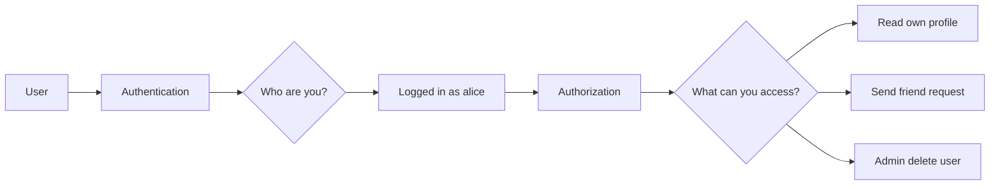

| Concept | Meaning | Example |
|---|---|---|
| Authentication | Verifies identity | Login with username/password |
| Authorization | Checks permission | Can Alice delete Bob? |

---

# 2. Core Spring Security Flow

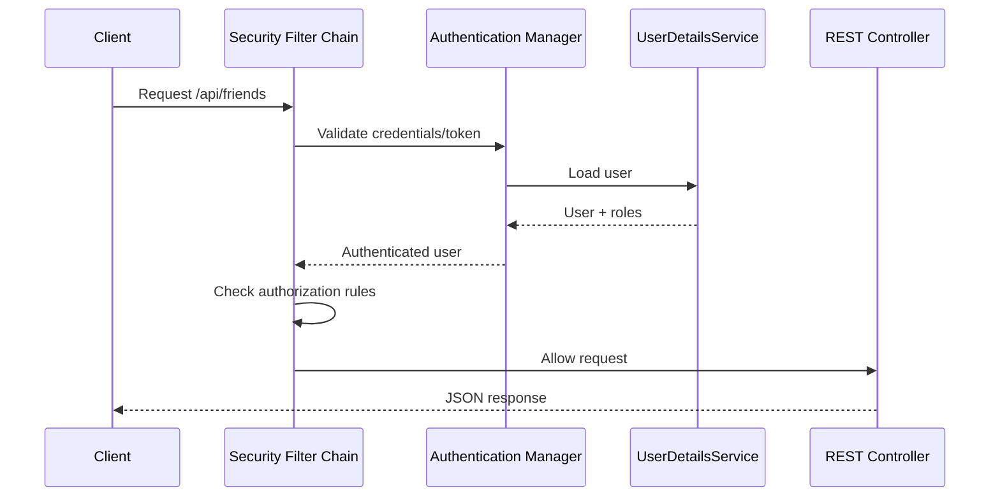

Key idea:

```text
Request -> Security Filters -> Authentication -> Authorization -> Controller
```

---

# 3. Demo Use Case: Friends Network API

We will secure these endpoints:

| Endpoint | Access Rule |
|---|---|
| `POST /api/auth/register` | Public |
| `POST /api/auth/login` | Public |
| `GET /api/users/me` | Logged-in user |
| `GET /api/users/{id}` | Logged-in user |
| `POST /api/friends/request/{id}` | Logged-in user |
| `POST /api/friends/accept/{id}` | Logged-in user |
| `GET /api/friends` | Logged-in user |
| `DELETE /api/admin/users/{id}` | Admin only |

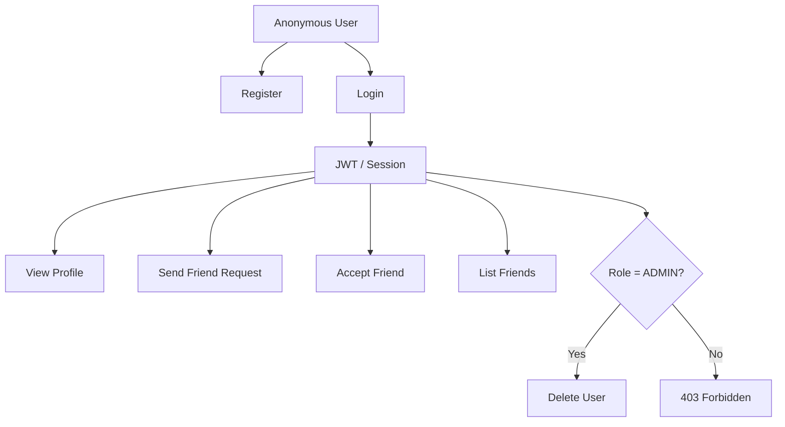

---

# 4. Project Dependencies

## Maven

```xml
<dependencies>
    <dependency>
        <groupId>org.springframework.boot</groupId>
        <artifactId>spring-boot-starter-web</artifactId>
    </dependency>

    <dependency>
        <groupId>org.springframework.boot</groupId>
        <artifactId>spring-boot-starter-security</artifactId>
    </dependency>

    <dependency>
        <groupId>org.springframework.boot</groupId>
        <artifactId>spring-boot-starter-data-jpa</artifactId>
    </dependency>

    <dependency>
        <groupId>com.h2database</groupId>
        <artifactId>h2</artifactId>
        <scope>runtime</scope>
    </dependency>

    <!-- JWT example -->
    <dependency>
        <groupId>io.jsonwebtoken</groupId>
        <artifactId>jjwt-api</artifactId>
        <version>0.12.6</version>
    </dependency>
</dependencies>
```

---

# 5. Way 1: Public + Protected Endpoints

Start simple: allow login/register, protect everything else.

```java
@Configuration
@EnableWebSecurity
public class SecurityConfig {

    @Bean
    SecurityFilterChain securityFilterChain(HttpSecurity http) throws Exception {
        return http
            .csrf(csrf -> csrf.disable())
            .authorizeHttpRequests(auth -> auth
                .requestMatchers("/api/auth/**").permitAll()
                .anyRequest().authenticated()
            )
            .httpBasic(Customizer.withDefaults())
            .build();
    }
}
```

```mermaid
flowchart LR
    A[/api/auth/login] --> B[Permit All]
    C[/api/users/me] --> D[Must Login]
    E[/api/friends] --> D
    F[/api/admin/users] --> D
```

---

# 6. Way 2: HTTP Basic Auth

Basic Auth is useful for internal tools, testing, or simple service-to-service APIs.

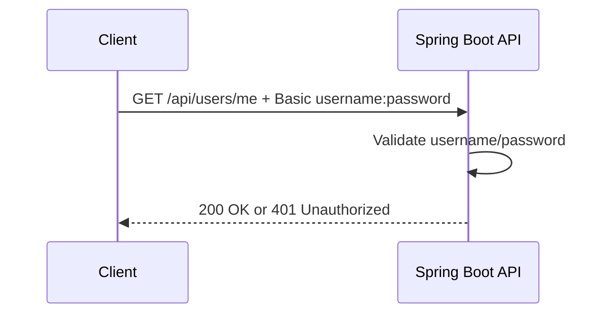

## In-memory users

```java
@Bean
UserDetailsService users(PasswordEncoder encoder) {
    UserDetails user = User.builder()
        .username("alice")
        .password(encoder.encode("pass123"))
        .roles("USER")
        .build();

    UserDetails admin = User.builder()
        .username("admin")
        .password(encoder.encode("admin123"))
        .roles("ADMIN")
        .build();

    return new InMemoryUserDetailsManager(user, admin);
}

@Bean
PasswordEncoder passwordEncoder() {
    return new BCryptPasswordEncoder();
}
```

## Test with curl

```bash
curl -u alice:pass123 http://localhost:8080/api/users/me
```

Best for:

```text
Internal admin API
Developer testing
Simple non-browser clients
```

Avoid for:

```text
Public mobile apps
Public SPAs
Large production auth systems
```

---

# 7. Way 3: Form Login / Session Security

Session login is common for server-rendered web apps.

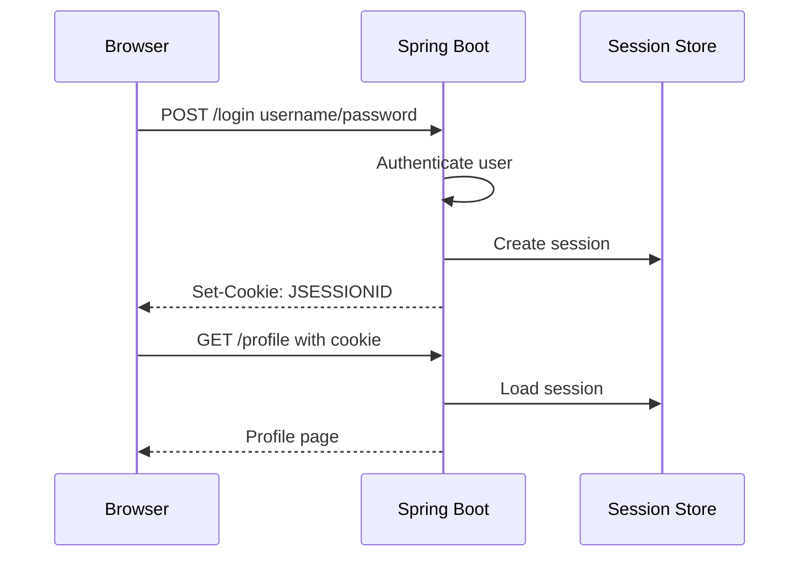

```java
@Bean
SecurityFilterChain sessionSecurity(HttpSecurity http) throws Exception {
    return http
        .authorizeHttpRequests(auth -> auth
            .requestMatchers("/login", "/register").permitAll()
            .anyRequest().authenticated()
        )
        .formLogin(Customizer.withDefaults())
        .logout(Customizer.withDefaults())
        .build();
}
```

Best for:

```text
Traditional web app
Server-side rendered UI
Admin panels
```

---

# 8. Way 4: JWT Token Authentication

JWT is common for REST APIs used by mobile apps, SPAs, and microservices.

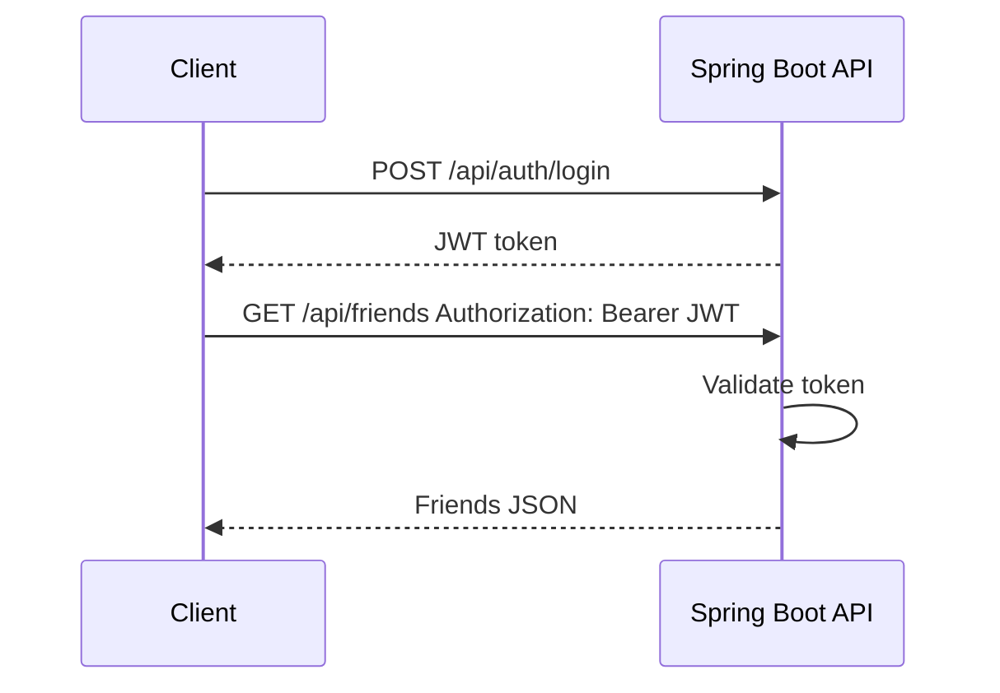

## JWT request flow

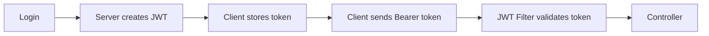

## Login request DTO

```java
public record LoginRequest(
    String username,
    String password
) {}
```

## Login response DTO

```java
public record LoginResponse(
    String accessToken
) {}
```

## Auth Controller

```java
@RestController
@RequestMapping("/api/auth")
public class AuthController {

    private final AuthenticationManager authenticationManager;
    private final JwtService jwtService;

    public AuthController(AuthenticationManager authenticationManager,
                          JwtService jwtService) {
        this.authenticationManager = authenticationManager;
        this.jwtService = jwtService;
    }

    @PostMapping("/login")
    public LoginResponse login(@RequestBody LoginRequest request) {
        Authentication auth = authenticationManager.authenticate(
            new UsernamePasswordAuthenticationToken(
                request.username(),
                request.password()
            )
        );

        String token = jwtService.generateToken(auth.getName());
        return new LoginResponse(token);
    }
}
```

## JWT Service - simplified

```java
@Service
public class JwtService {

    private final String secret = "change-this-secret-change-this-secret";

    public String generateToken(String username) {
        Instant now = Instant.now();

        return Jwts.builder()
            .subject(username)
            .issuedAt(Date.from(now))
            .expiration(Date.from(now.plus(Duration.ofHours(1))))
            .signWith(getKey())
            .compact();
    }

    public String extractUsername(String token) {
        return Jwts.parser()
            .verifyWith(getKey())
            .build()
            .parseSignedClaims(token)
            .getPayload()
            .getSubject();
    }

    private SecretKey getKey() {
        return Keys.hmacShaKeyFor(secret.getBytes(StandardCharsets.UTF_8));
    }
}
```

## JWT Filter - simplified

```java
@Component
public class JwtAuthFilter extends OncePerRequestFilter {

    private final JwtService jwtService;
    private final UserDetailsService userDetailsService;

    public JwtAuthFilter(JwtService jwtService,
                         UserDetailsService userDetailsService) {
        this.jwtService = jwtService;
        this.userDetailsService = userDetailsService;
    }

    @Override
    protected void doFilterInternal(HttpServletRequest request,
                                    HttpServletResponse response,
                                    FilterChain chain)
            throws ServletException, IOException {

        String header = request.getHeader("Authorization");

        if (header == null || !header.startsWith("Bearer ")) {
            chain.doFilter(request, response);
            return;
        }

        String token = header.substring(7);
        String username = jwtService.extractUsername(token);

        UserDetails user = userDetailsService.loadUserByUsername(username);

        UsernamePasswordAuthenticationToken auth =
            new UsernamePasswordAuthenticationToken(
                user,
                null,
                user.getAuthorities()
            );

        SecurityContextHolder.getContext().setAuthentication(auth);
        chain.doFilter(request, response);
    }
}
```

## JWT Security Config

```java
@Configuration
@EnableWebSecurity
public class JwtSecurityConfig {

    private final JwtAuthFilter jwtAuthFilter;

    public JwtSecurityConfig(JwtAuthFilter jwtAuthFilter) {
        this.jwtAuthFilter = jwtAuthFilter;
    }

    @Bean
    SecurityFilterChain security(HttpSecurity http) throws Exception {
        return http
            .csrf(csrf -> csrf.disable())
            .sessionManagement(session -> session
                .sessionCreationPolicy(SessionCreationPolicy.STATELESS)
            )
            .authorizeHttpRequests(auth -> auth
                .requestMatchers("/api/auth/**").permitAll()
                .requestMatchers("/api/admin/**").hasRole("ADMIN")
                .anyRequest().authenticated()
            )
            .addFilterBefore(jwtAuthFilter, UsernamePasswordAuthenticationFilter.class)
            .build();
    }
}
```

---

# 9. Way 5: OAuth2 Resource Server

Use this when login is handled by an external provider:

```text
Keycloak
Auth0
Okta
Google Identity
Azure AD
```

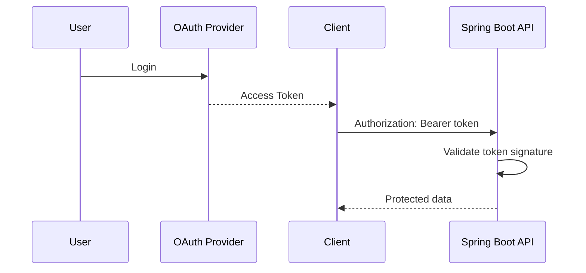

## Dependency

```xml
<dependency>
    <groupId>org.springframework.boot</groupId>
    <artifactId>spring-boot-starter-oauth2-resource-server</artifactId>
</dependency>
```

## Config

```java
@Bean
SecurityFilterChain oauth2Security(HttpSecurity http) throws Exception {
    return http
        .authorizeHttpRequests(auth -> auth
            .requestMatchers("/api/public/**").permitAll()
            .requestMatchers("/api/admin/**").hasAuthority("SCOPE_admin")
            .anyRequest().authenticated()
        )
        .oauth2ResourceServer(oauth2 -> oauth2.jwt(Customizer.withDefaults()))
        .build();
}
```

## application.yml

```yaml
spring:
  security:
    oauth2:
      resourceserver:
        jwt:
          issuer-uri: http://localhost:8081/realms/social-app
```

Best for:

```text
Enterprise apps
SSO
Microservices
Central auth provider
```

---

# 10. Way 6: API Key Security

API keys are useful for service-to-service calls or simple partner APIs.

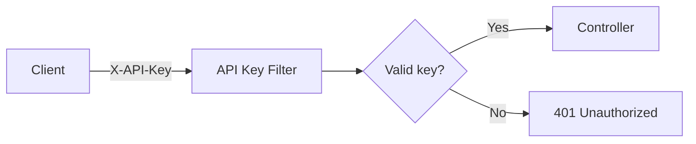

## API Key Filter

```java
@Component
public class ApiKeyFilter extends OncePerRequestFilter {

    private static final String API_KEY = "dev-secret-key";

    @Override
    protected void doFilterInternal(HttpServletRequest request,
                                    HttpServletResponse response,
                                    FilterChain chain)
            throws ServletException, IOException {

        String apiKey = request.getHeader("X-API-Key");

        if (!API_KEY.equals(apiKey)) {
            response.setStatus(HttpServletResponse.SC_UNAUTHORIZED);
            response.getWriter().write("Invalid API key");
            return;
        }

        chain.doFilter(request, response);
    }
}
```

Use for:

```text
Internal services
Webhook senders
Simple partner integrations
```

Do not use alone for:

```text
User login
Mobile apps where key can be extracted
High-security systems
```

---

# 11. Roles vs Permissions

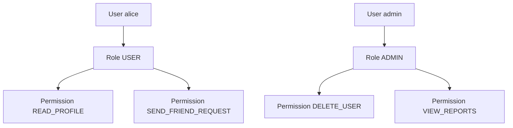

| Type | Example | Meaning |
|---|---|---|
| Role | `ROLE_USER` | Big group |
| Role | `ROLE_ADMIN` | Admin group |
| Permission | `friend:send` | Fine-grained action |
| Permission | `user:delete` | Specific action |

---

# 12. URL-Based Authorization

```java
@Bean
SecurityFilterChain security(HttpSecurity http) throws Exception {
    return http
        .csrf(csrf -> csrf.disable())
        .authorizeHttpRequests(auth -> auth
            .requestMatchers(HttpMethod.POST, "/api/auth/**").permitAll()
            .requestMatchers(HttpMethod.GET, "/api/users/me").authenticated()
            .requestMatchers("/api/friends/**").hasRole("USER")
            .requestMatchers("/api/admin/**").hasRole("ADMIN")
            .anyRequest().denyAll()
        )
        .httpBasic(Customizer.withDefaults())
        .build();
}
```

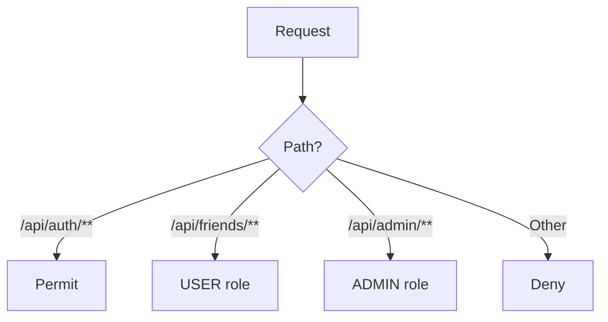

---

# 13. Method-Level Authorization

Use this when rules belong near business logic.

## Enable method security

```java
@Configuration
@EnableMethodSecurity
public class MethodSecurityConfig {
}
```

## Controller

```java
@RestController
@RequestMapping("/api/admin")
public class AdminController {

    @DeleteMapping("/users/{id}")
    @PreAuthorize("hasRole('ADMIN')")
    public void deleteUser(@PathVariable Long id) {
        // delete user
    }
}
```

## Service

```java
@Service
public class FriendService {

    @PreAuthorize("hasRole('USER')")
    public void sendFriendRequest(Long targetUserId) {
        // send request
    }
}
```

---

# 14. Ownership Rules: Only Friends Can View

Sometimes role is not enough.

Example rule:

```text
Alice can view Bob's private profile only if Alice and Bob are friends.
```

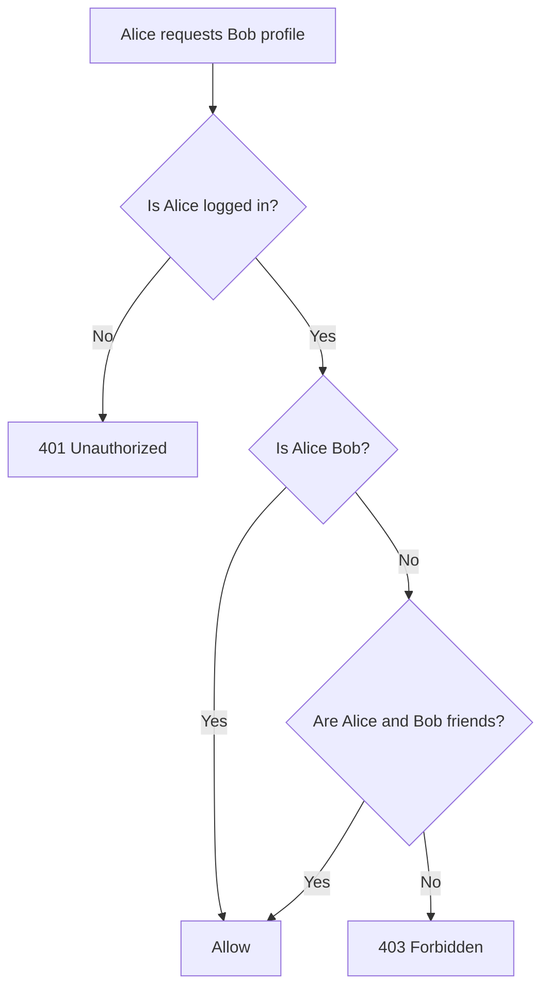

## Friend security service

```java
@Service
public class FriendSecurity {

    private final FriendshipRepository friendshipRepository;

    public FriendSecurity(FriendshipRepository friendshipRepository) {
        this.friendshipRepository = friendshipRepository;
    }

    public boolean canViewProfile(Authentication auth, Long profileOwnerId) {
        String username = auth.getName();

        Long currentUserId = findUserIdByUsername(username);

        if (currentUserId.equals(profileOwnerId)) {
            return true;
        }

        return friendshipRepository.existsAcceptedFriendship(
            currentUserId,
            profileOwnerId
        );
    }

    private Long findUserIdByUsername(String username) {
        // Load from UserRepository in real app
        return 1L;
    }
}
```

## Use custom authorization in controller

```java
@GetMapping("/api/users/{id}")
@PreAuthorize("@friendSecurity.canViewProfile(authentication, #id)")
public UserProfileResponse getProfile(@PathVariable Long id) {
    return userService.getProfile(id);
}
```

---

# 15. Refresh Tokens

Access tokens should be short-lived. Refresh tokens help create new access tokens.

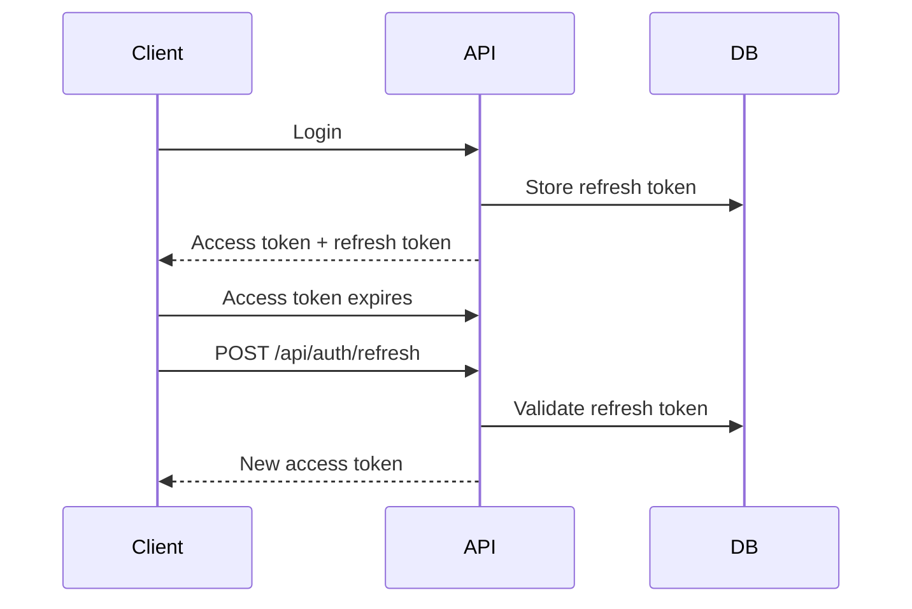

## Token lifetime example

| Token | Lifetime | Stored Where |
|---|---:|---|
| Access token | 15 minutes | Client memory |
| Refresh token | 7 days | DB + secure cookie |

## Refresh endpoint sketch

```java
@PostMapping("/refresh")
public LoginResponse refresh(@RequestBody RefreshRequest request) {
    String username = refreshTokenService.validate(request.refreshToken());
    String newAccessToken = jwtService.generateToken(username);
    return new LoginResponse(newAccessToken);
}
```

---

# 16. Password Hashing

Never store plain passwords.

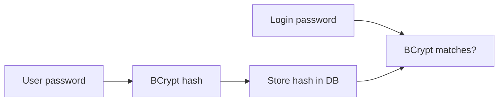

```java
@Bean
PasswordEncoder passwordEncoder() {
    return new BCryptPasswordEncoder();
}
```

## Register user

```java
@Service
public class RegistrationService {

    private final PasswordEncoder passwordEncoder;
    private final UserRepository userRepository;

    public RegistrationService(PasswordEncoder passwordEncoder,
                               UserRepository userRepository) {
        this.passwordEncoder = passwordEncoder;
        this.userRepository = userRepository;
    }

    public void register(String username, String rawPassword) {
        AppUser user = new AppUser();
        user.setUsername(username);
        user.setPassword(passwordEncoder.encode(rawPassword));
        user.setRole("ROLE_USER");

        userRepository.save(user);
    }
}
```

---

# 17. CORS and CSRF

## CORS

CORS controls which frontends can call your API.

```java
@Bean
CorsConfigurationSource corsConfigurationSource() {
    CorsConfiguration config = new CorsConfiguration();
    config.setAllowedOrigins(List.of("http://localhost:3000"));
    config.setAllowedMethods(List.of("GET", "POST", "PUT", "DELETE"));
    config.setAllowedHeaders(List.of("Authorization", "Content-Type"));

    UrlBasedCorsConfigurationSource source = new UrlBasedCorsConfigurationSource();
    source.registerCorsConfiguration("/**", config);
    return source;
}
```

```java
@Bean
SecurityFilterChain security(HttpSecurity http) throws Exception {
    return http
        .cors(Customizer.withDefaults())
        .csrf(csrf -> csrf.disable())
        .authorizeHttpRequests(auth -> auth
            .anyRequest().authenticated()
        )
        .build();
}
```

## CSRF decision map

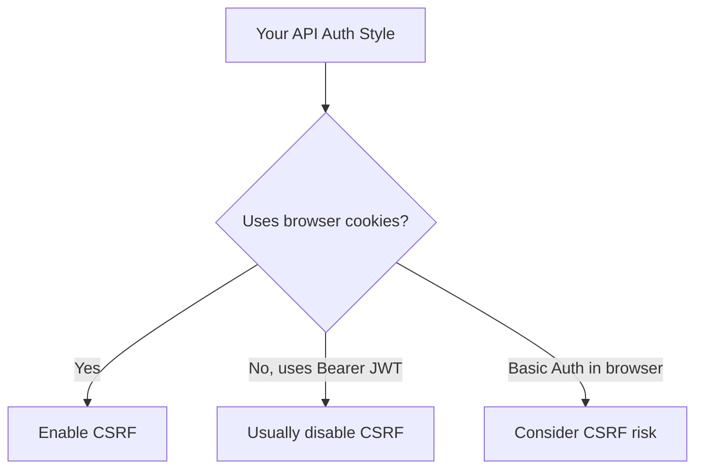

---

# 18. Exception Handling

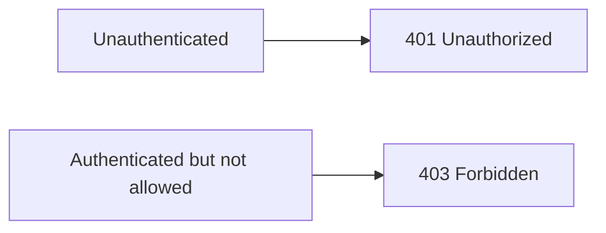

## Custom responses

```java
@Bean
SecurityFilterChain security(HttpSecurity http) throws Exception {
    return http
        .exceptionHandling(ex -> ex
            .authenticationEntryPoint((request, response, authException) -> {
                response.setStatus(HttpServletResponse.SC_UNAUTHORIZED);
                response.getWriter().write("Login required");
            })
            .accessDeniedHandler((request, response, accessDeniedException) -> {
                response.setStatus(HttpServletResponse.SC_FORBIDDEN);
                response.getWriter().write("Access denied");
            })
        )
        .authorizeHttpRequests(auth -> auth
            .anyRequest().authenticated()
        )
        .build();
}
```

---

# 19. Security Testing

## Test secured controller

```java
@WebMvcTest(UserController.class)
@Import(SecurityConfig.class)
class UserControllerTest {

    @Autowired
    MockMvc mockMvc;

    @Test
    void shouldRejectAnonymousUser() throws Exception {
        mockMvc.perform(get("/api/users/me"))
            .andExpect(status().isUnauthorized());
    }

    @Test
    @WithMockUser(username = "alice", roles = "USER")
    void shouldAllowLoggedInUser() throws Exception {
        mockMvc.perform(get("/api/users/me"))
            .andExpect(status().isOk());
    }
}
```

## Test admin rule

```java
@Test
@WithMockUser(username = "alice", roles = "USER")
void userCannotDeleteAnotherUser() throws Exception {
    mockMvc.perform(delete("/api/admin/users/10"))
        .andExpect(status().isForbidden());
}

@Test
@WithMockUser(username = "admin", roles = "ADMIN")
void adminCanDeleteUser() throws Exception {
    mockMvc.perform(delete("/api/admin/users/10"))
        .andExpect(status().isOk());
}
```

---

# 20. Production Checklist

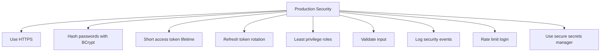

## Checklist

- [ ] Use HTTPS only
- [ ] Store passwords with BCrypt or Argon2
- [ ] Never log passwords or tokens
- [ ] Keep JWT expiration short
- [ ] Store secrets outside source code
- [ ] Use refresh token rotation
- [ ] Add rate limiting for login
- [ ] Use CORS allowlist, not `*`
- [ ] Return `401` for unauthenticated users
- [ ] Return `403` for authenticated but forbidden users
- [ ] Add tests for every sensitive endpoint
- [ ] Prefer method security for business rules

---

# Mini Decision Guide

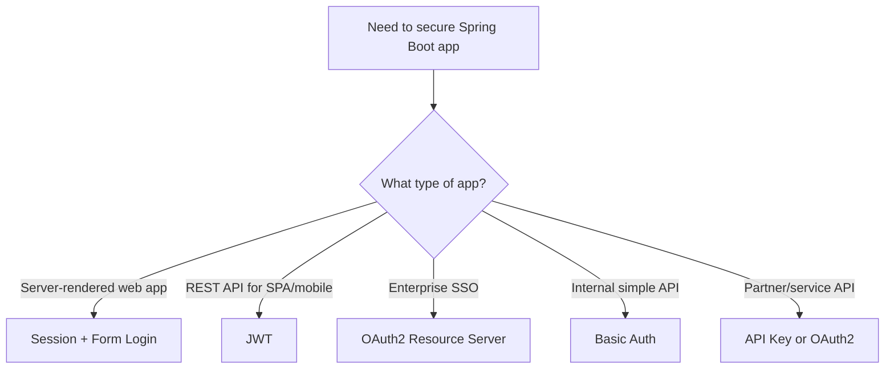

---

# Final Mental Model

```text
Authentication = Who are you?
Authorization  = What can you do?

Spring Security protects requests before they reach controllers.

For REST APIs:
- Public endpoints: login/register
- Protected endpoints: require token/session
- Admin endpoints: require ADMIN role
- Business rules: use method security
```

