# Spring Boot System Design Use Cases — Visual Reference

> Visual-first notes for learning how REST systems evolve from a monolith to higher scale.  
> Focus use cases: **URL Shortener**, **Find K Friends**, **Read-Heavy Systems**, **Write-Heavy Systems**, and common test cases.

---

## Clickable Index

- [0. Big Picture](#0-big-picture)
- [1. Base Spring Boot Project](#1-base-spring-boot-project)
- [2. Scaling Roadmap: Monolith → 1k → 20k → 50k+](#2-scaling-roadmap-monolith--1k--20k--50k)
- [3. Use Case 1: URL Shortener](#3-use-case-1-url-shortener)
- [4. Use Case 2: Find K Friends / People Network](#4-use-case-2-find-k-friends--people-network)
- [5. Use Case 3: Read-Heavy System](#5-use-case-3-read-heavy-system)
- [6. Use Case 4: Write-Heavy System](#6-use-case-4-write-heavy-system)
- [7. Common REST Patterns Used](#7-common-rest-patterns-used)
- [8. Security Options Quick Map](#8-security-options-quick-map)
- [9. Logging, Metrics, Tracing](#9-logging-metrics-tracing)
- [10. Test Cases for All Use Cases](#10-test-cases-for-all-use-cases)
- [11. Interview Cheat Sheet](#11-interview-cheat-sheet)

---

## 0. Big Picture

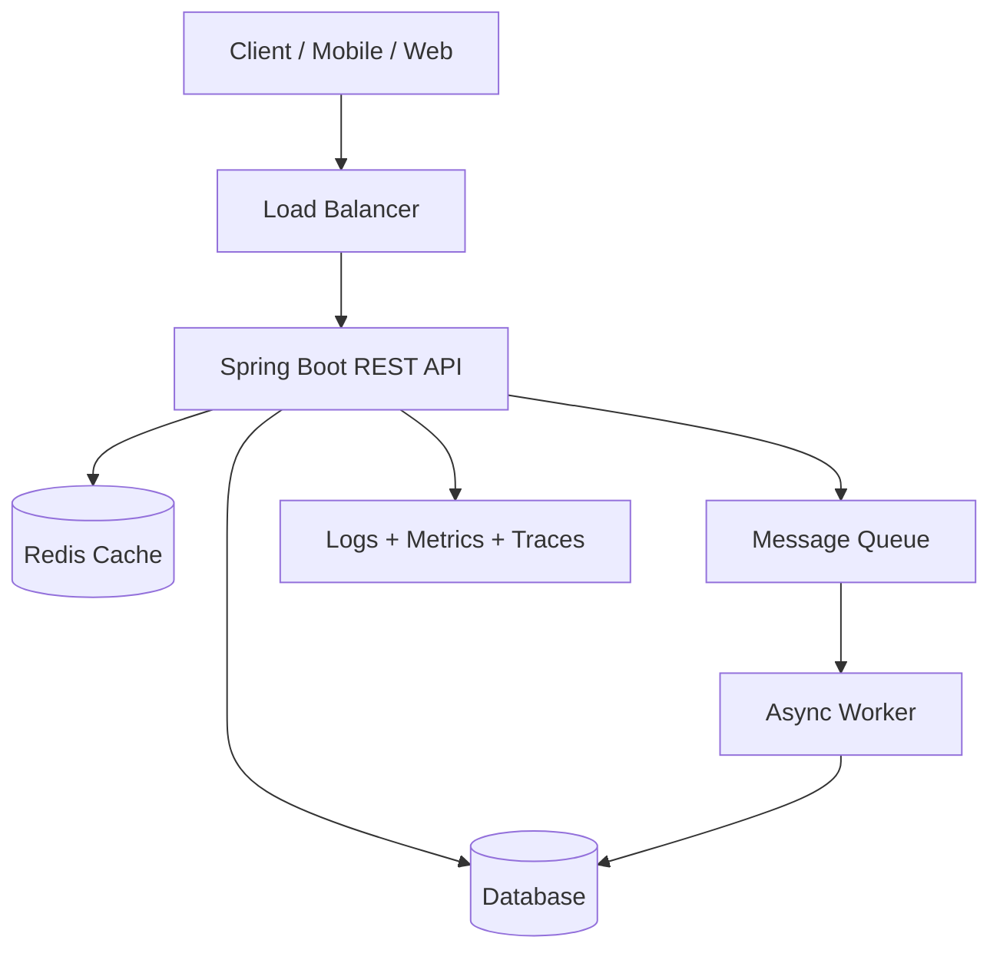

### Main design question

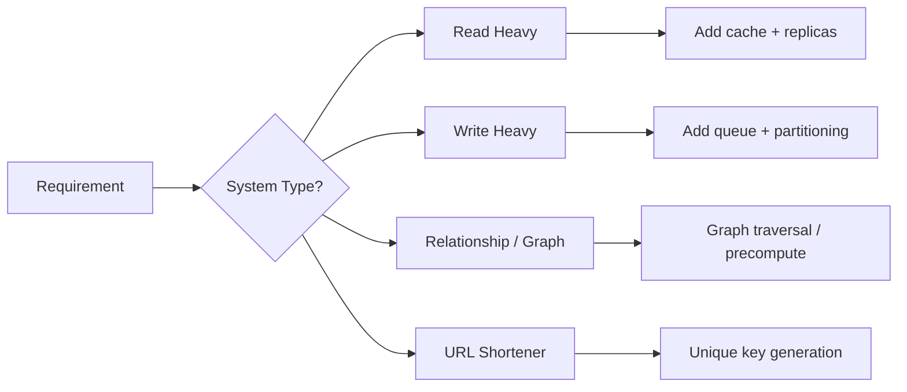

---

## 1. Base Spring Boot Project

### Recommended dependencies

```xml
<dependencies>
    <dependency>
        <groupId>org.springframework.boot</groupId>
        <artifactId>spring-boot-starter-web</artifactId>
    </dependency>
    <dependency>
        <groupId>org.springframework.boot</groupId>
        <artifactId>spring-boot-starter-data-jpa</artifactId>
    </dependency>
    <dependency>
        <groupId>org.springframework.boot</groupId>
        <artifactId>spring-boot-starter-validation</artifactId>
    </dependency>
    <dependency>
        <groupId>org.postgresql</groupId>
        <artifactId>postgresql</artifactId>
        <scope>runtime</scope>
    </dependency>
    <dependency>
        <groupId>org.springframework.boot</groupId>
        <artifactId>spring-boot-starter-test</artifactId>
        <scope>test</scope>
    </dependency>
</dependencies>
```

### Common package layout

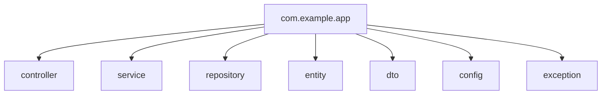

### Simple controller pattern

```java
@RestController
@RequestMapping("/api/items")
public class ItemController {

    private final ItemService service;

    public ItemController(ItemService service) {
        this.service = service;
    }

    @GetMapping("/{id}")
    public ItemResponse get(@PathVariable Long id) {
        return service.get(id);
    }
}
```

---

## 2. Scaling Roadmap: Monolith → 1k → 20k → 50k+

### Visual evolution

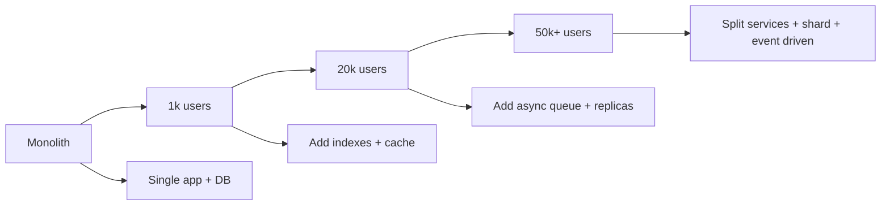

### What changes at each stage?

| Stage | Architecture | Additions | Why |
|---|---|---|---|
| Monolith | 1 Spring Boot app + 1 DB | Basic REST, JPA, tests | Fast development |
| 1k users | Same app | Indexes, pagination, validation, logging | Avoid slow queries |
| 20k users | App replicas | Redis cache, read replicas, RabbitMQ/Kafka | Handle read/write load |
| 50k+ users | Modular services | CQRS, outbox, sharding, async workers | Scale hot areas separately |

### Decision map

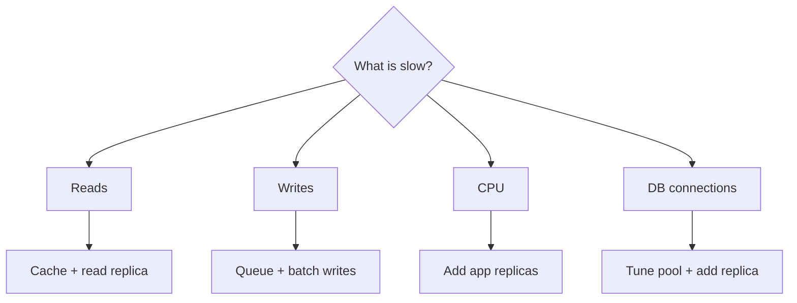

---

## 3. Use Case 1: URL Shortener

### Problem

Convert a long URL into a short URL.

```text
https://very-long-url.com/products/12345?campaign=spring

becomes

https://sho.rt/aB91xZ
```

### Core flow

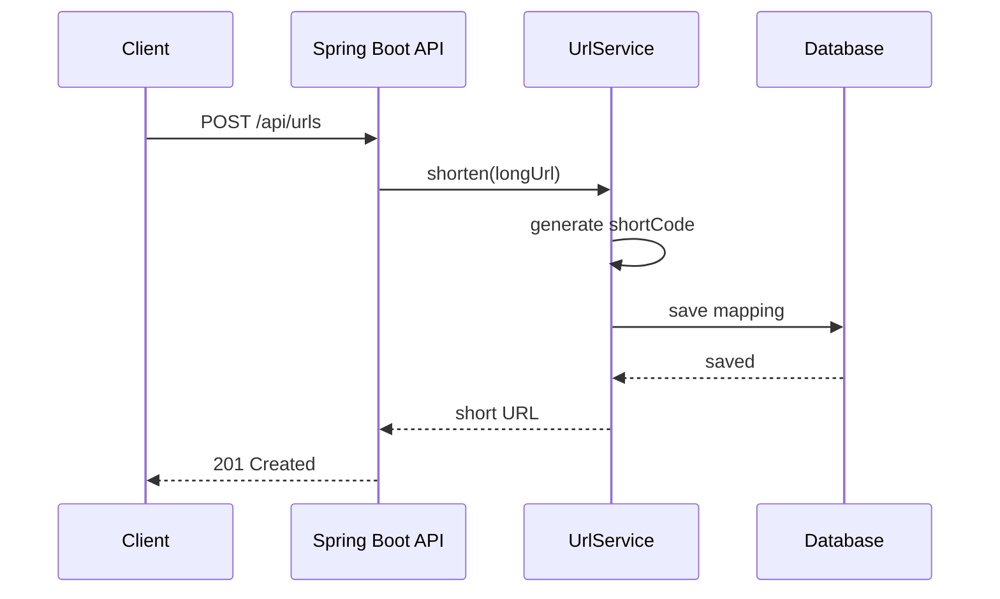

### Redirect flow

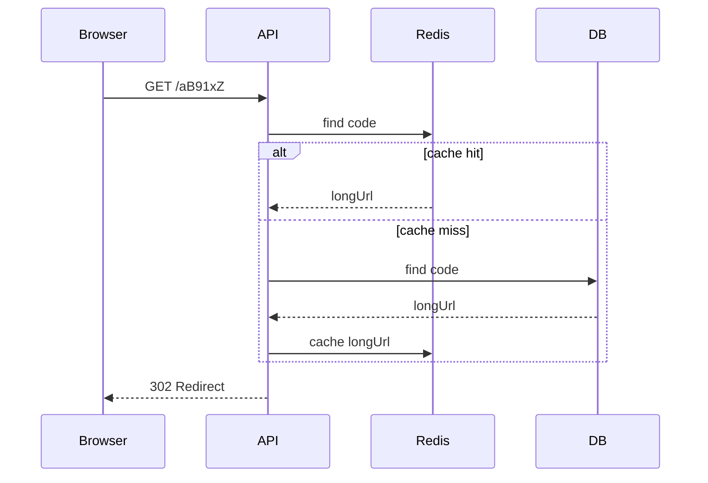

### Entity

```java
@Entity
@Table(name = "short_urls", indexes = {
    @Index(name = "idx_short_code", columnList = "shortCode", unique = true)
})
public class ShortUrl {

    @Id
    @GeneratedValue(strategy = GenerationType.IDENTITY)
    private Long id;

    @Column(nullable = false, unique = true)
    private String shortCode;

    @Column(nullable = false, length = 2048)
    private String longUrl;

    private LocalDateTime createdAt = LocalDateTime.now();

    // getters and setters
}
```

### Repository

```java
public interface ShortUrlRepository extends JpaRepository<ShortUrl, Long> {
    Optional<ShortUrl> findByShortCode(String shortCode);
    boolean existsByShortCode(String shortCode);
}
```

### Service

```java
@Service
public class UrlShortenerService {

    private final ShortUrlRepository repository;
    private final SecureRandom random = new SecureRandom();
    private static final String ALPHABET = "abcdefghijklmnopqrstuvwxyzABCDEFGHIJKLMNOPQRSTUVWXYZ0123456789";

    public UrlShortenerService(ShortUrlRepository repository) {
        this.repository = repository;
    }

    public String shorten(String longUrl) {
        String code = generateUniqueCode(6);

        ShortUrl url = new ShortUrl();
        url.setLongUrl(longUrl);
        url.setShortCode(code);

        repository.save(url);
        return code;
    }

    public String resolve(String code) {
        return repository.findByShortCode(code)
                .map(ShortUrl::getLongUrl)
                .orElseThrow(() -> new ResponseStatusException(HttpStatus.NOT_FOUND, "URL not found"));
    }

    private String generateUniqueCode(int length) {
        String code;
        do {
            StringBuilder sb = new StringBuilder();
            for (int i = 0; i < length; i++) {
                sb.append(ALPHABET.charAt(random.nextInt(ALPHABET.length())));
            }
            code = sb.toString();
        } while (repository.existsByShortCode(code));
        return code;
    }
}
```

### Controller

```java
@RestController
public class UrlShortenerController {

    private final UrlShortenerService service;

    public UrlShortenerController(UrlShortenerService service) {
        this.service = service;
    }

    @PostMapping("/api/urls")
    public Map<String, String> create(@RequestBody Map<String, String> body) {
        String code = service.shorten(body.get("longUrl"));
        return Map.of("shortCode", code, "shortUrl", "https://sho.rt/" + code);
    }

    @GetMapping("/{code}")
    public ResponseEntity<Void> redirect(@PathVariable String code) {
        String longUrl = service.resolve(code);
        return ResponseEntity.status(HttpStatus.FOUND)
                .location(URI.create(longUrl))
                .build();
    }
}
```

### Scaling changes

| Scale | Change |
|---|---|
| Monolith | DB lookup by `shortCode` |
| 1k | Add index on `shortCode` |
| 20k | Add Redis cache for redirects |
| 50k+ | Use distributed ID generator, CDN/edge redirect, analytics async queue |

### Advanced URL shortener architecture

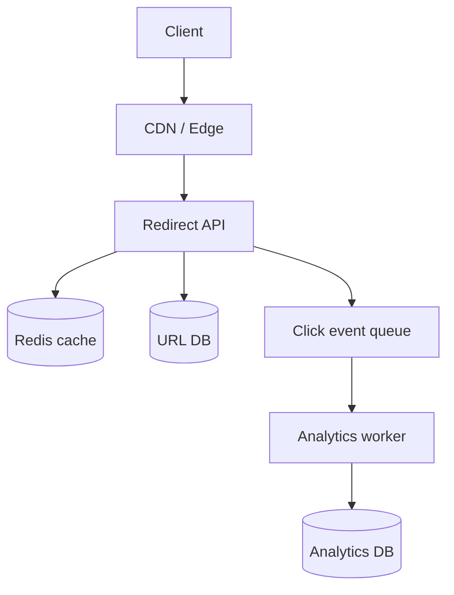

---

## 4. Use Case 2: Find K Friends / People Network

### Problem

Given a user, find friends up to distance `K`.

```text
K = 1 → direct friends
K = 2 → friends of friends
K = 3 → friends of friends of friends
```

### Graph model

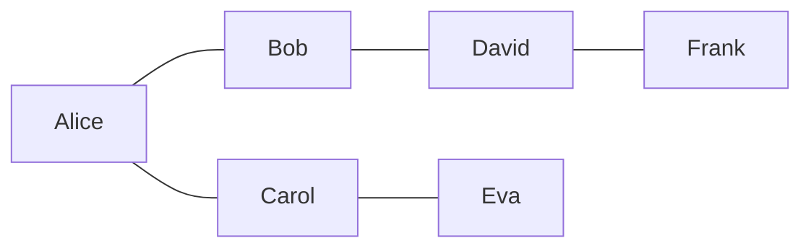

### Table design for relational DB

```sql
CREATE TABLE users (
    id BIGSERIAL PRIMARY KEY,
    name VARCHAR(100) NOT NULL
);

CREATE TABLE friendships (
    user_id BIGINT NOT NULL,
    friend_id BIGINT NOT NULL,
    created_at TIMESTAMP NOT NULL DEFAULT now(),
    PRIMARY KEY (user_id, friend_id)
);

CREATE INDEX idx_friendships_user ON friendships(user_id);
CREATE INDEX idx_friendships_friend ON friendships(friend_id);
```

### Entity

```java
@Entity
@Table(name = "friendships")
@IdClass(FriendshipId.class)
public class Friendship {

    @Id
    private Long userId;

    @Id
    private Long friendId;

    private LocalDateTime createdAt = LocalDateTime.now();

    // getters and setters
}
```

### Repository

```java
public interface FriendshipRepository extends JpaRepository<Friendship, FriendshipId> {

    @Query("select f.friendId from Friendship f where f.userId = :userId")
    List<Long> findFriendIds(Long userId);
}
```

### BFS visual

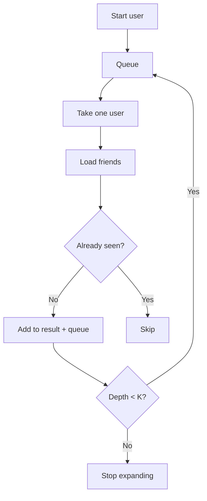

### Service: find friends up to K

```java
@Service
public class FriendService {

    private final FriendshipRepository repository;

    public FriendService(FriendshipRepository repository) {
        this.repository = repository;
    }

    public Set<Long> findFriendsWithinK(Long startUserId, int k) {
        Set<Long> visited = new HashSet<>();
        Queue<UserDepth> queue = new ArrayDeque<>();

        visited.add(startUserId);
        queue.add(new UserDepth(startUserId, 0));

        while (!queue.isEmpty()) {
            UserDepth current = queue.poll();

            if (current.depth() == k) {
                continue;
            }

            List<Long> friends = repository.findFriendIds(current.userId());

            for (Long friendId : friends) {
                if (visited.add(friendId)) {
                    queue.add(new UserDepth(friendId, current.depth() + 1));
                }
            }
        }

        visited.remove(startUserId);
        return visited;
    }

    private record UserDepth(Long userId, int depth) {}
}
```

### Controller

```java
@RestController
@RequestMapping("/api/users")
public class FriendController {

    private final FriendService service;

    public FriendController(FriendService service) {
        this.service = service;
    }

    @GetMapping("/{userId}/friends/k/{k}")
    public Set<Long> findKFriends(@PathVariable Long userId, @PathVariable int k) {
        return service.findFriendsWithinK(userId, k);
    }
}
```

### Scaling changes

| Scale | Change |
|---|---|
| Monolith | SQL friendship table |
| 1k | Index `user_id`, use pagination |
| 20k | Cache adjacency list in Redis |
| 50k+ | Graph DB, precomputed friend suggestions, async fanout |

### Advanced graph architecture

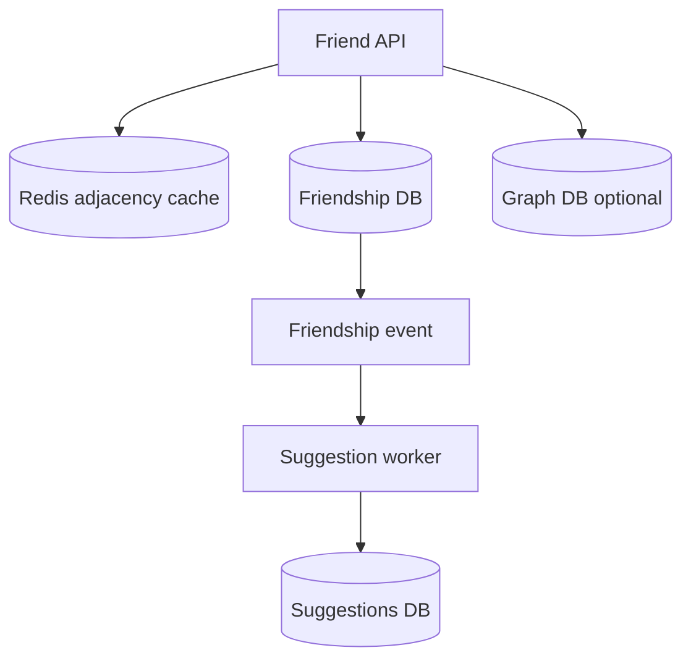

---

## 5. Use Case 3: Read-Heavy System

### Examples

- Product catalog
- News feed read
- Profile page
- URL redirect
- Dashboard

### Read-heavy flow

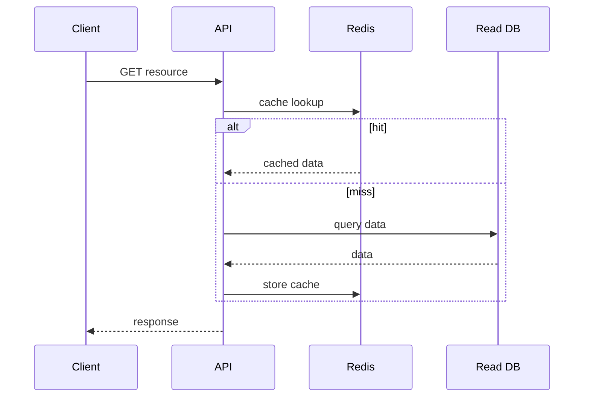

### Cache-aside service

```java
@Service
public class ProductReadService {

    private final ProductRepository repository;
    private final RedisTemplate<String, ProductDto> redisTemplate;

    public ProductReadService(ProductRepository repository,
                              RedisTemplate<String, ProductDto> redisTemplate) {
        this.repository = repository;
        this.redisTemplate = redisTemplate;
    }

    public ProductDto getProduct(Long id) {
        String key = "product:" + id;

        ProductDto cached = redisTemplate.opsForValue().get(key);
        if (cached != null) {
            return cached;
        }

        ProductDto product = repository.findById(id)
                .map(ProductDto::from)
                .orElseThrow(() -> new ResponseStatusException(HttpStatus.NOT_FOUND));

        redisTemplate.opsForValue().set(key, product, Duration.ofMinutes(10));
        return product;
    }
}
```

### Read-heavy scaling checklist

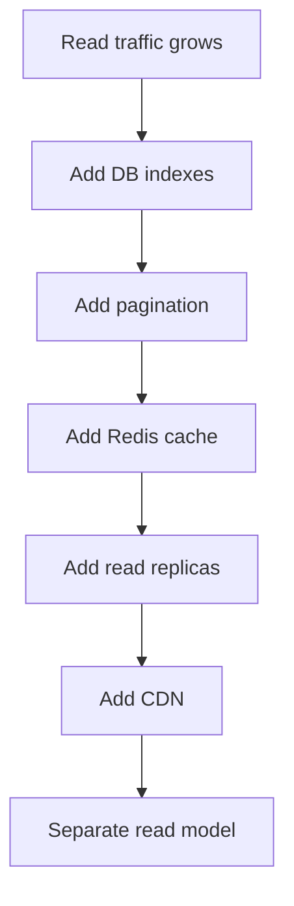

### Common read optimizations

| Problem | Fix |
|---|---|
| Same data requested often | Redis cache |
| Large result list | Pagination / cursor pagination |
| Slow joins | Denormalized read model |
| DB overloaded | Read replicas |
| Static content | CDN |

---

## 6. Use Case 4: Write-Heavy System

### Examples

- Click tracking
- Payments events
- IoT data
- Chat messages
- Audit logs
- Like/comment events

### Write-heavy flow

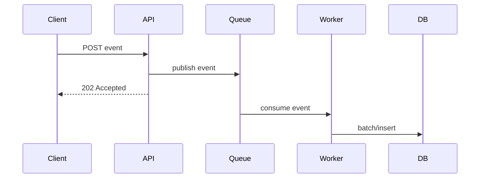

### Event DTO

```java
public record ClickEvent(
        String shortCode,
        String userAgent,
        String ipAddress,
        Instant createdAt
) {}
```

### Controller accepts fast writes

```java
@RestController
@RequestMapping("/api/clicks")
public class ClickController {

    private final RabbitTemplate rabbitTemplate;

    public ClickController(RabbitTemplate rabbitTemplate) {
        this.rabbitTemplate = rabbitTemplate;
    }

    @PostMapping
    public ResponseEntity<Void> track(@RequestBody ClickEvent event) {
        rabbitTemplate.convertAndSend("click.exchange", "click.created", event);
        return ResponseEntity.accepted().build();
    }
}
```

### Worker writes async

```java
@Component
public class ClickEventConsumer {

    private final ClickRepository repository;

    public ClickEventConsumer(ClickRepository repository) {
        this.repository = repository;
    }

    @RabbitListener(queues = "click.queue")
    public void consume(ClickEvent event) {
        ClickEntity entity = new ClickEntity();
        entity.setShortCode(event.shortCode());
        entity.setUserAgent(event.userAgent());
        entity.setIpAddress(event.ipAddress());
        entity.setCreatedAt(event.createdAt());
        repository.save(entity);
    }
}
```

### Write-heavy scaling checklist

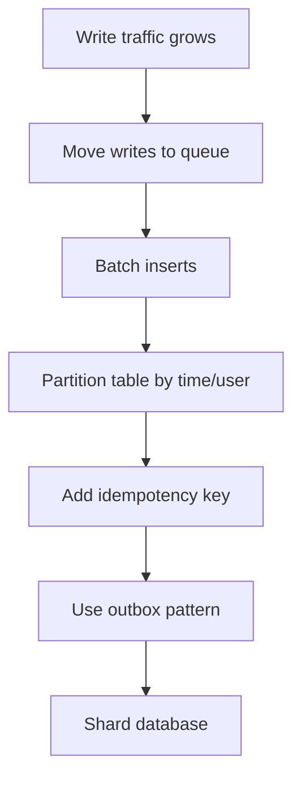

### Idempotency example

```java
@Entity
@Table(name = "orders", indexes = {
    @Index(name = "idx_idempotency_key", columnList = "idempotencyKey", unique = true)
})
public class OrderEntity {
    @Id
    @GeneratedValue(strategy = GenerationType.IDENTITY)
    private Long id;

    private String idempotencyKey;
    private BigDecimal amount;
    private String status;
}
```

```java
@Service
public class OrderService {

    private final OrderRepository repository;

    public OrderService(OrderRepository repository) {
        this.repository = repository;
    }

    @Transactional
    public OrderEntity create(String idempotencyKey, BigDecimal amount) {
        return repository.findByIdempotencyKey(idempotencyKey)
                .orElseGet(() -> repository.save(new OrderEntity(idempotencyKey, amount, "CREATED")));
    }
}
```

---

## 7. Common REST Patterns Used

### Pattern map

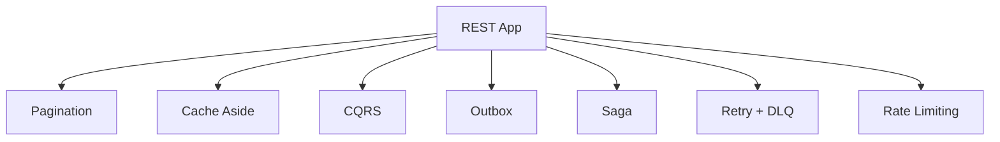

### Pagination

```java
@GetMapping
public Page<ProductDto> list(Pageable pageable) {
    return productRepository.findAll(pageable).map(ProductDto::from);
}
```

Request:

```http
GET /api/products?page=0&size=20&sort=createdAt,desc
```

### CQRS simple split

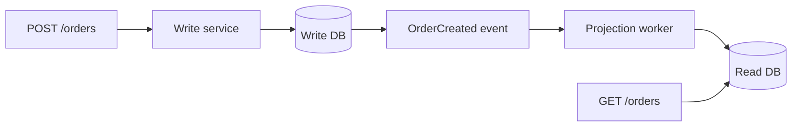

### Saga example

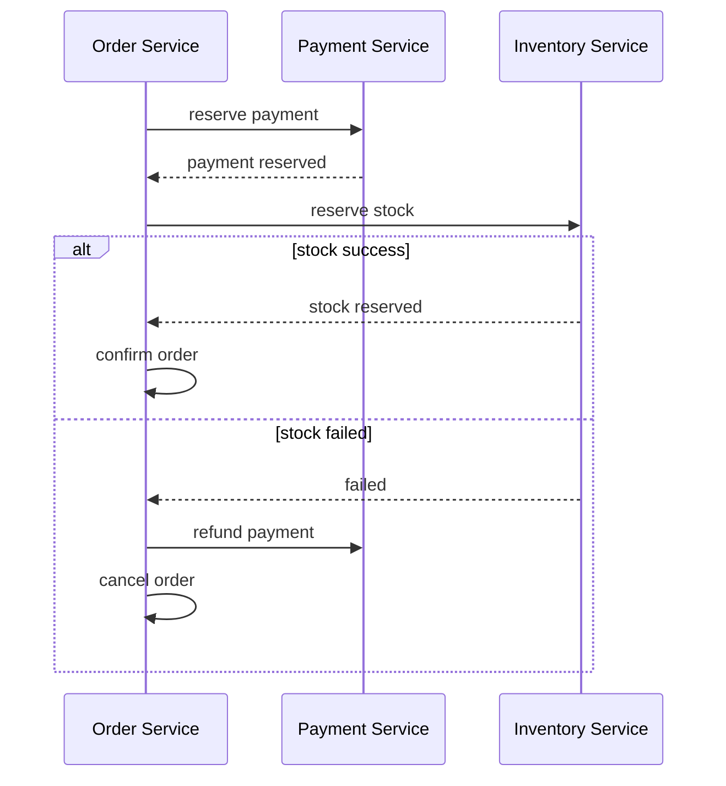

### Outbox pattern

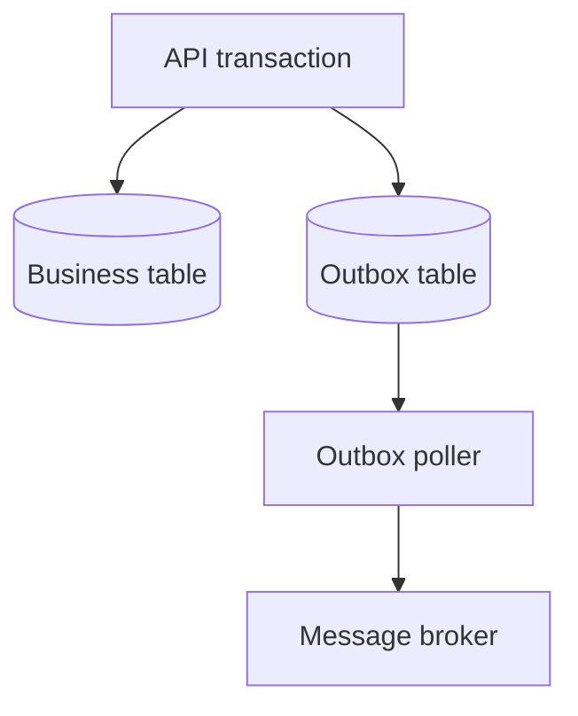

---

## 8. Security Options Quick Map

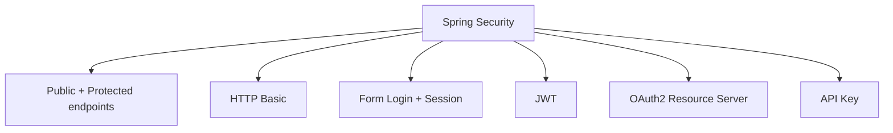

### JWT-style endpoint protection

```java
@Configuration
@EnableWebSecurity
public class SecurityConfig {

    @Bean
    SecurityFilterChain security(HttpSecurity http) throws Exception {
        return http
                .csrf(csrf -> csrf.disable())
                .authorizeHttpRequests(auth -> auth
                        .requestMatchers("/api/public/**").permitAll()
                        .requestMatchers("/api/admin/**").hasRole("ADMIN")
                        .anyRequest().authenticated()
                )
                .oauth2ResourceServer(oauth -> oauth.jwt(Customizer.withDefaults()))
                .build();
    }
}
```

---

## 9. Logging, Metrics, Tracing

### Observability flow

```mermaid
flowchart LR
    App["Spring Boot App"] --> Logs["Logs"]
    App --> Metrics["Metrics"]
    App --> Traces["Traces"]
    Logs --> Loki["Loki / ELK"]
    Metrics --> Prom["Prometheus"]
    Prom --> Grafana["Grafana"]
    Traces --> Tempo["Tempo / Jaeger"]
```

### Add Actuator

```xml
<dependency>
    <groupId>org.springframework.boot</groupId>
    <artifactId>spring-boot-starter-actuator</artifactId>
</dependency>
<dependency>
    <groupId>io.micrometer</groupId>
    <artifactId>micrometer-registry-prometheus</artifactId>
</dependency>
```

```yaml
management:
  endpoints:
    web:
      exposure:
        include: health,info,metrics,prometheus
```

### Structured logging example

```java
private static final Logger log = LoggerFactory.getLogger(UrlShortenerService.class);

public String resolve(String code) {
    log.info("Resolving shortCode={}", code);
    return repository.findByShortCode(code)
            .map(ShortUrl::getLongUrl)
            .orElseThrow(() -> new ResponseStatusException(HttpStatus.NOT_FOUND));
}
```

---

## 10. Test Cases for All Use Cases

### Test pyramid

```mermaid
flowchart TD
    E2E["Few E2E tests"] --> Integration["Some integration tests"]
    Integration --> Unit["Many unit tests"]
```

### URL shortener tests

| Test | Type | Expected |
|---|---|---|
| Create short URL | Unit/API | returns generated code |
| Resolve existing code | Unit/API | returns 302 redirect |
| Resolve missing code | API | returns 404 |
| Duplicate code handling | Unit | regenerate code |
| Cache hit | Unit | no DB call |

```java
@WebMvcTest(UrlShortenerController.class)
class UrlShortenerControllerTest {

    @Autowired
    MockMvc mockMvc;

    @MockBean
    UrlShortenerService service;

    @Test
    void shouldCreateShortUrl() throws Exception {
        when(service.shorten("https://example.com")).thenReturn("abc123");

        mockMvc.perform(post("/api/urls")
                        .contentType(MediaType.APPLICATION_JSON)
                        .content("{\"longUrl\":\"https://example.com\"}"))
                .andExpect(status().isOk())
                .andExpect(jsonPath("$.shortCode").value("abc123"));
    }
}
```

### K friends tests

| Test | Type | Expected |
|---|---|---|
| K=1 | Unit | direct friends only |
| K=2 | Unit | friends of friends included |
| Cycle in graph | Unit | no infinite loop |
| User has no friends | Unit | empty set |
| Large graph | Performance | completes under target time |

```java
@ExtendWith(MockitoExtension.class)
class FriendServiceTest {

    @Mock
    FriendshipRepository repository;

    @InjectMocks
    FriendService service;

    @Test
    void shouldFindFriendsWithinTwoLevels() {
        when(repository.findFriendIds(1L)).thenReturn(List.of(2L, 3L));
        when(repository.findFriendIds(2L)).thenReturn(List.of(4L));
        when(repository.findFriendIds(3L)).thenReturn(List.of(5L));

        Set<Long> result = service.findFriendsWithinK(1L, 2);

        assertThat(result).containsExactlyInAnyOrder(2L, 3L, 4L, 5L);
    }
}
```

### Read-heavy tests

| Test | Type | Expected |
|---|---|---|
| Cache hit | Unit | returns cached data |
| Cache miss | Unit | loads DB then writes cache |
| Pagination | API | returns fixed page size |
| Sort | API | returns ordered data |
| DB unavailable | Integration | graceful error |

```java
@Test
void shouldReturnCachedProductWithoutDbCall() {
    when(redisTemplate.opsForValue().get("product:1")).thenReturn(cachedProduct);

    ProductDto result = service.getProduct(1L);

    assertThat(result.id()).isEqualTo(1L);
    verify(repository, never()).findById(anyLong());
}
```

### Write-heavy tests

| Test | Type | Expected |
|---|---|---|
| API accepts event | API | returns 202 |
| Event published | Unit | RabbitTemplate called |
| Worker consumes event | Unit | DB save called |
| Duplicate event | Unit | idempotent result |
| Queue failure | Integration | retry or DLQ |

```java
@WebMvcTest(ClickController.class)
class ClickControllerTest {

    @Autowired
    MockMvc mockMvc;

    @MockBean
    RabbitTemplate rabbitTemplate;

    @Test
    void shouldAcceptClickEvent() throws Exception {
        mockMvc.perform(post("/api/clicks")
                        .contentType(MediaType.APPLICATION_JSON)
                        .content("""
                            {
                              "shortCode": "abc123",
                              "userAgent": "Chrome",
                              "ipAddress": "127.0.0.1",
                              "createdAt": "2026-01-01T10:00:00Z"
                            }
                            """))
                .andExpect(status().isAccepted());
    }
}
```

### Integration testing with Testcontainers

```xml
<dependency>
    <groupId>org.testcontainers</groupId>
    <artifactId>postgresql</artifactId>
    <scope>test</scope>
</dependency>
<dependency>
    <groupId>org.testcontainers</groupId>
    <artifactId>junit-jupiter</artifactId>
    <scope>test</scope>
</dependency>
```

```java
@SpringBootTest
@Testcontainers
class UrlRepositoryIntegrationTest {

    @Container
    static PostgreSQLContainer<?> postgres = new PostgreSQLContainer<>("postgres:16");

    @DynamicPropertySource
    static void props(DynamicPropertyRegistry registry) {
        registry.add("spring.datasource.url", postgres::getJdbcUrl);
        registry.add("spring.datasource.username", postgres::getUsername);
        registry.add("spring.datasource.password", postgres::getPassword);
    }

    @Autowired
    ShortUrlRepository repository;

    @Test
    void shouldSaveAndFindShortCode() {
        ShortUrl url = new ShortUrl();
        url.setShortCode("abc123");
        url.setLongUrl("https://example.com");
        repository.save(url);

        assertThat(repository.findByShortCode("abc123")).isPresent();
    }
}
```

### GitHub Actions CI

```yaml
name: Java CI

on:
  push:
    branches: [ main ]
  pull_request:
    branches: [ main ]

jobs:
  test:
    runs-on: ubuntu-latest
    steps:
      - uses: actions/checkout@v4
      - uses: actions/setup-java@v4
        with:
          distribution: temurin
          java-version: 21
      - name: Run tests
        run: mvn clean test
```

---

## 11. Interview Cheat Sheet

### URL Shortener

```mermaid
flowchart LR
    Shorten["Shorten URL"] --> Store["Store code → long URL"]
    Redirect["Redirect"] --> Cache["Check cache"]
    Cache --> DB["Fallback DB"]
    Redirect --> Analytics["Async analytics"]
```

Say:

- Use unique short code.
- Index `shortCode`.
- Cache redirect lookups.
- Track analytics asynchronously.
- Use rate limiting to prevent abuse.

### Find K Friends

```mermaid
flowchart LR
    User["User"] --> BFS["BFS up to K"]
    BFS --> Visited["Visited set"]
    BFS --> Result["Result users"]
```

Say:

- Model friendships as graph edges.
- Use BFS for K distance.
- Use visited set to avoid cycles.
- Cache adjacency list.
- Precompute recommendations at scale.

### Read Heavy

Say:

- Add indexes first.
- Add pagination.
- Add Redis cache.
- Add read replicas.
- Use CQRS read model for complex views.

### Write Heavy

Say:

- Keep request path fast.
- Publish to queue.
- Use async workers.
- Add idempotency key.
- Use outbox pattern for reliable events.
- Partition/shard when data grows.

---

## Final Mental Model

```mermaid
flowchart TD
    Basic["Start simple"] --> Measure["Measure bottleneck"]
    Measure --> ReadSlow{"Read slow?"}
    Measure --> WriteSlow{"Write slow?"}
    ReadSlow --> Cache["Cache + replica + pagination"]
    WriteSlow --> Queue["Queue + batch + partition"]
    Cache --> Advanced["CQRS / split services"]
    Queue --> Advanced
```

> Master rule: **Do not add complexity first. Start with monolith, measure, then add the next scaling tool only when needed.**
