# Proximity Service — Visual System Design Notes

> Goal: design a service that returns nearby businesses, such as restaurants, hotels, gas stations, theaters, or museums, based on a user location and radius.

---

## 1. Problem Scope

### Functional Requirements

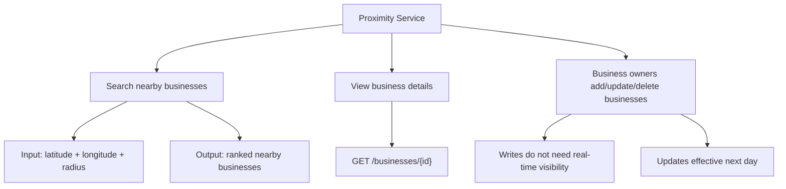

### Non-Functional Requirements

| Requirement | Why It Matters |
|---|---|
| Low latency | Users expect map/search results quickly |
| High availability | Search should work during traffic spikes |
| Scalability | 100M DAU, around 5,000 search QPS |
| Privacy | User location is sensitive data |
| Read-heavy design | Searches and detail views dominate writes |

---

## 2. Back-of-the-Envelope Numbers

```text
DAU = 100 million
Searches per user per day = 5
Seconds per day ≈ 100,000

Search QPS = 100M * 5 / 100,000
           ≈ 5,000 QPS
```

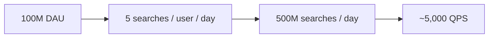

---

## 3. API Design

### Search Nearby

```http
GET /v1/search/nearby?latitude=37.776720&longitude=-122.416730&radius=500
```

### Request Parameters

| Field | Type | Notes |
|---|---|---|
| latitude | decimal | User latitude |
| longitude | decimal | User longitude |
| radius | int | Optional, default 5000 meters |

### Response

```json
{
  "total": 10,
  "businesses": [
    {
      "id": 101,
      "name": "Taco Palace",
      "distanceMeters": 240,
      "rating": 4.5
    }
  ]
}
```

### Business APIs

```http
GET    /v1/businesses/{id}
POST   /v1/businesses
PUT    /v1/businesses/{id}
DELETE /v1/businesses/{id}
```

---

## 4. High-Level Architecture

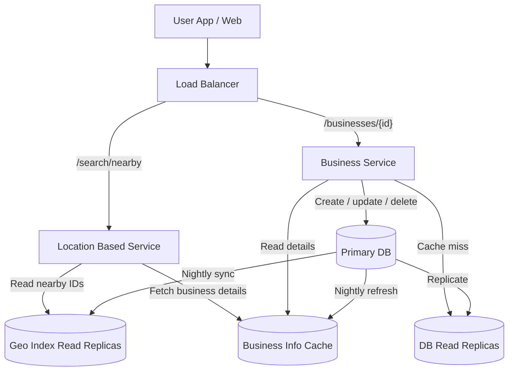

### Key Components

| Component | Responsibility |
|---|---|
| Load Balancer | Routes traffic to correct service |
| LBS | Finds nearby businesses using geo index |
| Business Service | Handles business detail reads and owner writes |
| Primary DB | Handles writes |
| Read Replicas | Serve read traffic |
| Geo Index | Maps location grid to business IDs |
| Business Cache | Stores hydrated business objects |

---

## 5. Data Model

### Business Table

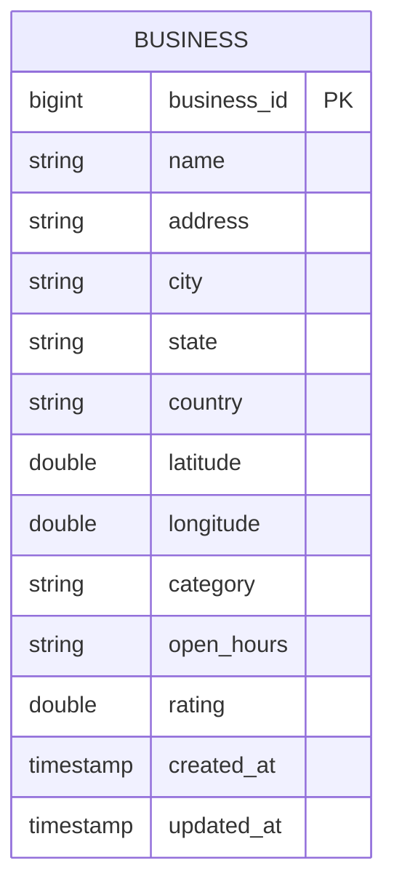

### Geospatial Index Table

Recommended design: one row per `(geohash, business_id)` pair.

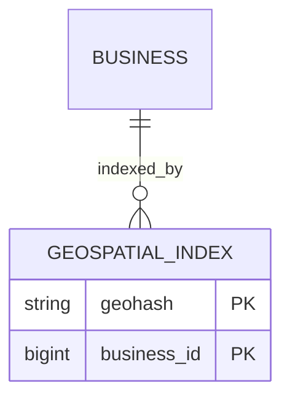

### Why Not Store Business IDs as a JSON Array?

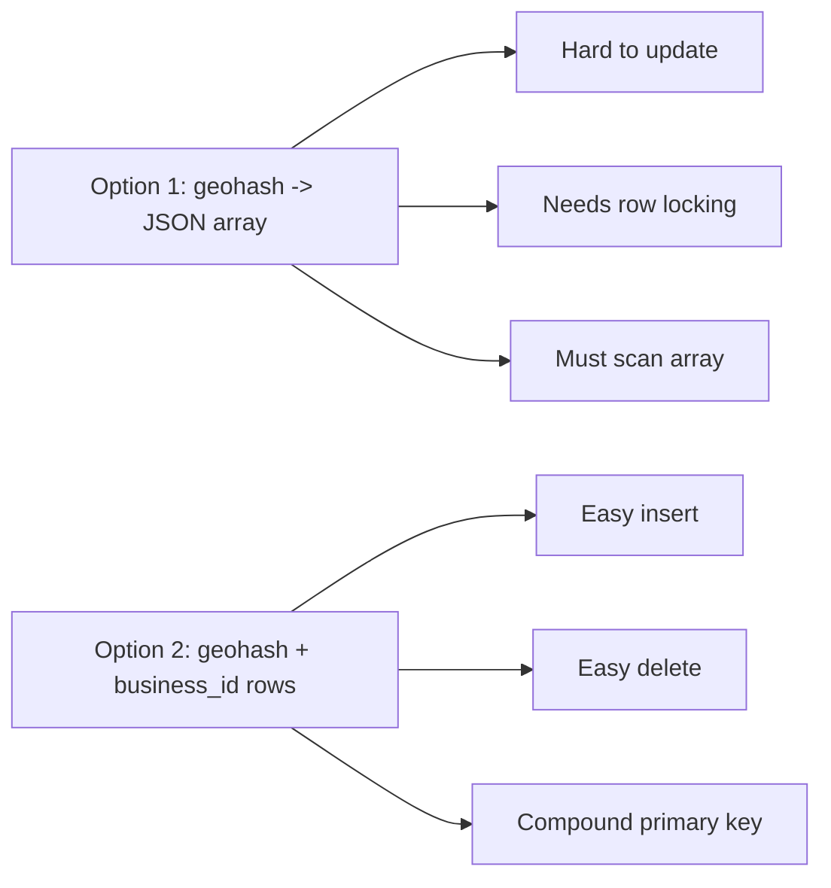

---

## 6. Nearby Search Algorithms

## Option A — Naive 2D Search

```sql
SELECT business_id, latitude, longitude
FROM business
WHERE latitude BETWEEN :lat_min AND :lat_max
  AND longitude BETWEEN :lon_min AND :lon_max;
```

### Problem

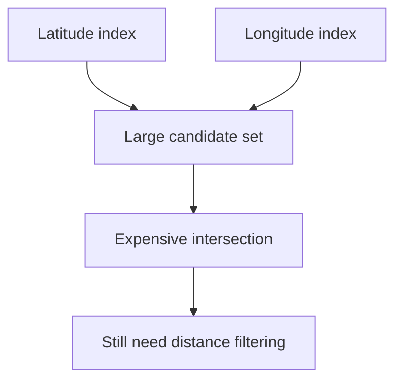

This is inefficient for large datasets because latitude and longitude are two-dimensional data.

---

## Option B — Even Grid

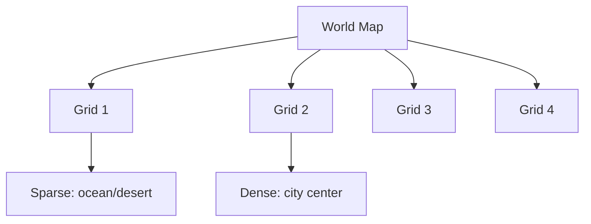

### Issue

Even grids do not adapt to business density. Downtown areas may contain thousands of businesses while rural grids may contain none.

---

## Option C — Geohash

Geohash converts 2D coordinates into a 1D string.

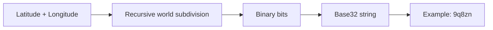

### Geohash Precision

| Radius | Geohash Length |
|---|---:|
| 0.5 km | 6 |
| 1 km | 5 |
| 2 km | 5 |
| 5 km | 4 |
| 20 km | 4 |

### Query Strategy

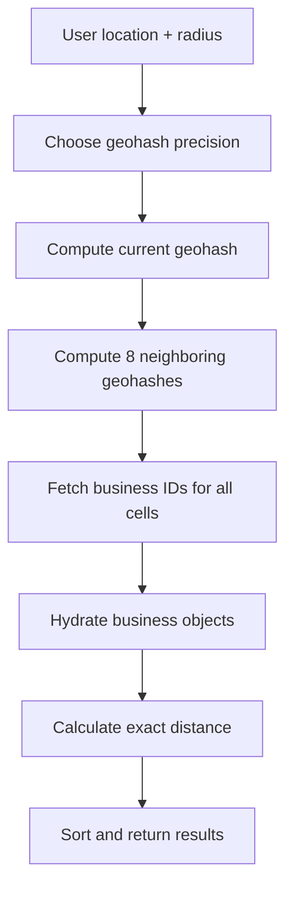

### Boundary Problem

Nearby locations may fall into different geohash cells.

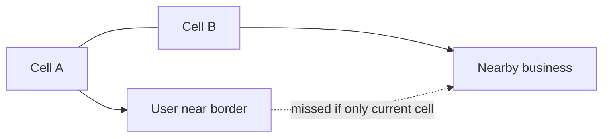

### Fix

Always search the current geohash plus neighbors.

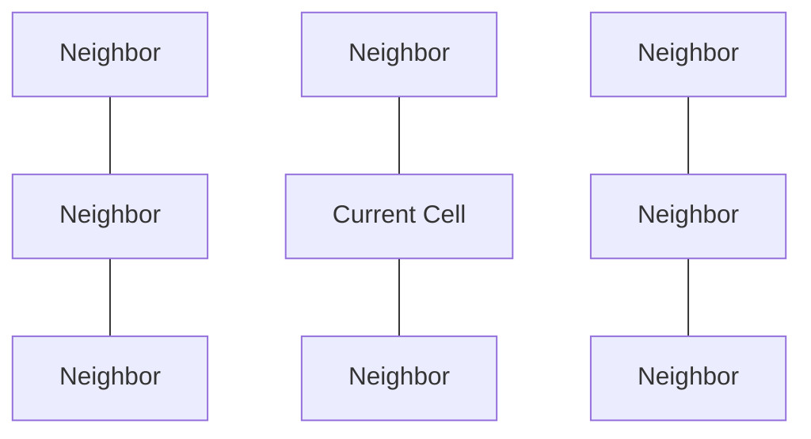

---

## Option D — Quadtree

A quadtree recursively divides space into 4 quadrants until each leaf contains a manageable number of businesses.

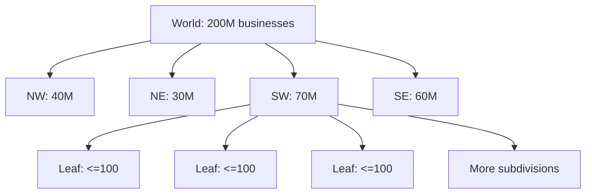

### Quadtree Pros and Cons

| Pros | Cons |
|---|---|
| Adapts to dense/sparse areas | More complex to implement |
| Good for k-nearest search | Needs in-memory tree build |
| Smaller cells in dense cities | Updates require tree traversal/locking |

---

## 7. Geohash vs Quadtree

| Topic | Geohash | Quadtree |
|---|---|---|
| Implementation | Simpler | More complex |
| Data structure | String prefix | Tree |
| Updates | Easy | Harder |
| Radius search | Good | Good |
| k-nearest search | Less natural | Better |
| Density-aware | Not by default | Yes |
| Interview choice | Great default | Great for deeper discussion |

---

## 8. Java Reference Code

## 8.1 Radius to Geohash Precision

```java
public class GeoPrecision {

    public static int geohashLengthForRadiusKm(double radiusKm) {
        if (radiusKm <= 0.5) return 6;
        if (radiusKm <= 2.0) return 5;
        return 4;
    }

    public static void main(String[] args) {
        System.out.println(geohashLengthForRadiusKm(0.5)); // 6
        System.out.println(geohashLengthForRadiusKm(1.0)); // 5
        System.out.println(geohashLengthForRadiusKm(5.0)); // 4
    }
}
```

---

## 8.2 Haversine Distance

Used to calculate the exact distance after fetching candidates from nearby geohash cells.

```java
public class DistanceUtil {
    private static final double EARTH_RADIUS_METERS = 6_371_000;

    public static double distanceMeters(
            double lat1, double lon1,
            double lat2, double lon2
    ) {
        double latRad1 = Math.toRadians(lat1);
        double latRad2 = Math.toRadians(lat2);
        double deltaLat = Math.toRadians(lat2 - lat1);
        double deltaLon = Math.toRadians(lon2 - lon1);

        double a = Math.sin(deltaLat / 2) * Math.sin(deltaLat / 2)
                + Math.cos(latRad1) * Math.cos(latRad2)
                * Math.sin(deltaLon / 2) * Math.sin(deltaLon / 2);

        double c = 2 * Math.atan2(Math.sqrt(a), Math.sqrt(1 - a));
        return EARTH_RADIUS_METERS * c;
    }
}
```

---

## 8.3 Nearby Search Service Skeleton

```java
import java.util.*;
import java.util.stream.Collectors;

class Business {
    long id;
    String name;
    double latitude;
    double longitude;
    double distanceMeters;

    Business(long id, String name, double latitude, double longitude) {
        this.id = id;
        this.name = name;
        this.latitude = latitude;
        this.longitude = longitude;
    }
}

interface GeoIndexRepository {
    List<Long> findBusinessIdsByGeohashPrefix(String geohashPrefix);
}

interface BusinessRepository {
    List<Business> findBusinessesByIds(List<Long> ids);
}

class NearbySearchService {
    private final GeoIndexRepository geoIndexRepository;
    private final BusinessRepository businessRepository;

    NearbySearchService(
            GeoIndexRepository geoIndexRepository,
            BusinessRepository businessRepository
    ) {
        this.geoIndexRepository = geoIndexRepository;
        this.businessRepository = businessRepository;
    }

    public List<Business> searchNearby(
            double userLat,
            double userLon,
            double radiusMeters
    ) {
        int precision = GeoPrecision.geohashLengthForRadiusKm(radiusMeters / 1000.0);

        String currentGeohash = encodeGeohash(userLat, userLon, precision);
        List<String> geohashes = getCurrentAndNeighborGeohashes(currentGeohash);

        List<Long> candidateIds = new ArrayList<>();
        for (String geohash : geohashes) {
            candidateIds.addAll(geoIndexRepository.findBusinessIdsByGeohashPrefix(geohash));
        }

        List<Business> candidates = businessRepository.findBusinessesByIds(candidateIds);

        return candidates.stream()
                .peek(b -> b.distanceMeters = DistanceUtil.distanceMeters(
                        userLat, userLon, b.latitude, b.longitude))
                .filter(b -> b.distanceMeters <= radiusMeters)
                .sorted(Comparator.comparingDouble(b -> b.distanceMeters))
                .collect(Collectors.toList());
    }

    // In real systems, use a proven geohash library.
    private String encodeGeohash(double lat, double lon, int precision) {
        return "mocked".substring(0, Math.min(precision, 6));
    }

    // Real implementation calculates 8 adjacent cells.
    private List<String> getCurrentAndNeighborGeohashes(String geohash) {
        return List.of(
                geohash,
                geohash + "_N",
                geohash + "_S",
                geohash + "_E",
                geohash + "_W",
                geohash + "_NE",
                geohash + "_NW",
                geohash + "_SE",
                geohash + "_SW"
        );
    }
}
```

---

## 8.4 Simple Cache-Aside Pattern

```java
import java.time.Duration;
import java.util.List;

interface CacheClient {
    List<Long> getList(String key);
    void setList(String key, List<Long> value, Duration ttl);
}

class CachedGeoIndexService {
    private final CacheClient cache;
    private final GeoIndexRepository geoIndexRepository;

    CachedGeoIndexService(CacheClient cache, GeoIndexRepository geoIndexRepository) {
        this.cache = cache;
        this.geoIndexRepository = geoIndexRepository;
    }

    public List<Long> getBusinessIds(String geohash) {
        String cacheKey = "geo:" + geohash;

        List<Long> cached = cache.getList(cacheKey);
        if (cached != null) {
            return cached;
        }

        List<Long> ids = geoIndexRepository.findBusinessIdsByGeohashPrefix(geohash);
        cache.setList(cacheKey, ids, Duration.ofDays(1));
        return ids;
    }
}
```

---

## 8.5 Quadtree Build Pseudocode in Java

```java
class QuadTreeNode {
    BoundingBox box;
    List<Long> businessIds;
    QuadTreeNode[] children;

    boolean isLeaf() {
        return children == null;
    }

    void subdivide() {
        children = new QuadTreeNode[4];
        // NW, NE, SW, SE child boxes are created here.
    }
}

class BoundingBox {
    double minLat;
    double maxLat;
    double minLon;
    double maxLon;
}

class QuadTreeBuilder {
    private static final int MAX_BUSINESSES_PER_LEAF = 100;

    public void build(QuadTreeNode node) {
        if (node.businessIds.size() <= MAX_BUSINESSES_PER_LEAF) {
            return;
        }

        node.subdivide();

        for (QuadTreeNode child : node.children) {
            // Move matching businesses from parent to child.
            build(child);
        }
    }
}
```

---

## 9. Final Search Flow

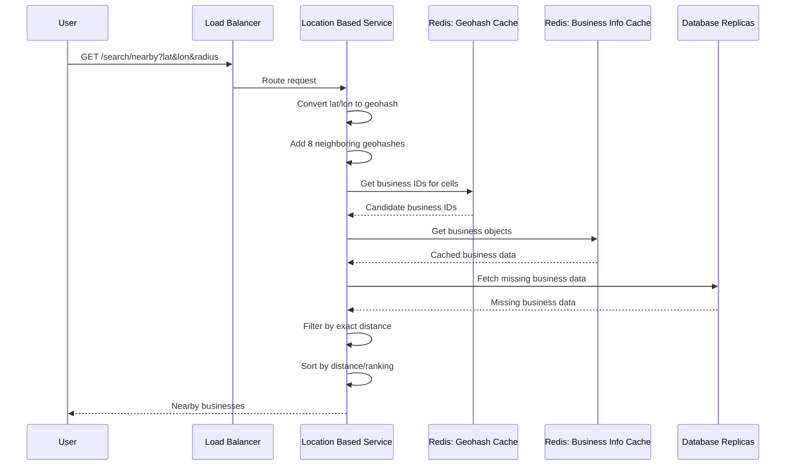

---

## 10. Business Update Flow

Because updates do not need to be visible immediately, we can refresh geo index and cache with a nightly job.

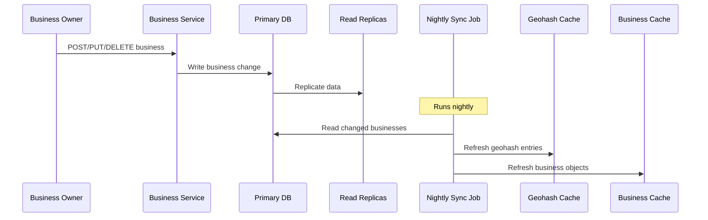

---

## 11. Caching Strategy

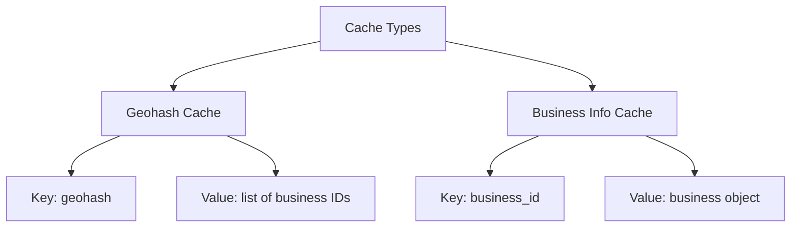

### Cache Keys

| Cache | Key | Value |
|---|---|---|
| Geohash cache | `geo:{geohash}` | List of business IDs |
| Business info cache | `business:{id}` | Business object |

### Why Not Cache Raw Coordinates?

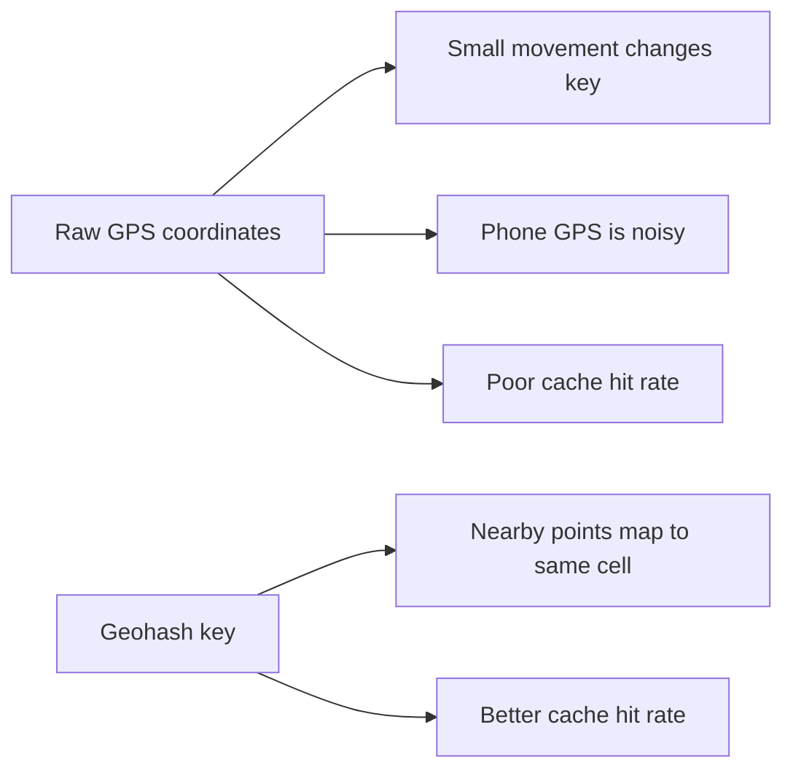

---

## 12. Multi-Region Deployment

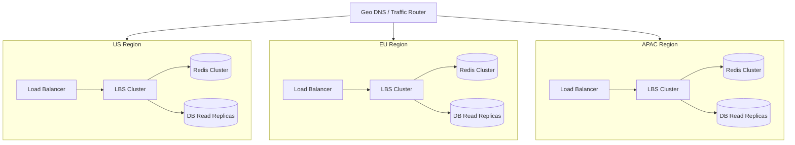

### Benefits

| Benefit | Explanation |
|---|---|
| Lower latency | Route users to nearby region |
| Availability | Region failure does not take down all traffic |
| Traffic distribution | Handle dense areas separately |
| Compliance | Store/process sensitive location data locally if required |

---

## 13. Filtering Results

Examples:

- Open now
- Restaurant only
- Rating above 4.0
- Price level
- Cuisine type


Since each geohash cell returns a limited candidate set, filtering after fetching candidates is usually acceptable.

---

## 14. Failure Handling

| Failure | Handling |
|---|---|
| LBS server fails | Stateless; load balancer routes to healthy server |
| Business service fails | Stateless; restart or route around it |
| Redis fails | Use Redis replication / fallback to DB |
| Primary DB fails | Promote replica to primary |
| Replica lag | Acceptable because business updates need not be real-time |
| Region outage | Route traffic to another region |
| Nightly job fails | Retry job; use previous day index temporarily |

---

## 15. Interview Talking Points

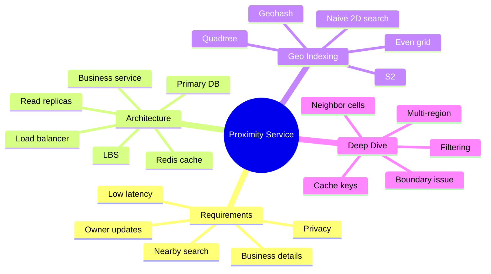

---

## 16. Final Architecture Summary

```mermaid
flowchart TB
    Client[Client App] --> LB[Load Balancer]

    LB -->|Nearby search| LBS[LBS Cluster]
    LB -->|Business APIs| BS[Business Service Cluster]

    LBS --> GeoRedis[(Redis: Geohash -> Business IDs)]
    LBS --> BizRedis[(Redis: Business ID -> Business Object)]
    LBS --> DBReplica[(DB Read Replicas)]

    BS --> BizRedis
    BS --> DBReplica
    BS --> Primary[(Primary DB)]

    Primary --> DBReplica
    Primary --> Nightly[ रात Nightly Sync Job]
    Nightly --> GeoRedis
    Nightly --> BizRedis
```

> Note: In the final diagram, the nightly sync job refreshes geohash and business caches because business updates do not need to be reflected in real time.

---

## 17. Quick Memory Hook

```text
User location
   ↓
Geohash + neighbors
   ↓
Candidate business IDs
   ↓
Business details
   ↓
Exact distance filter
   ↓
Ranked nearby results
```

