# Proximity Service — Visual System Design Notes with PostgreSQL PostGIS + Spring Boot

> Goal: design a service that returns nearby businesses, such as restaurants, hotels, gas stations, theaters, or museums, based on a user location and radius.
>
> Updated implementation choice: use **PostgreSQL + PostGIS** for geospatial search, with **Spring Boot** as the application layer.

---

## 1. Problem Scope

### Functional Requirements

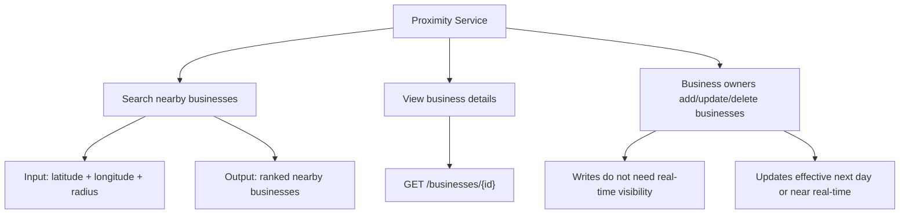

### Non-Functional Requirements

| Requirement | Why It Matters |
|---|---|
| Low latency | Users expect map/search results quickly |
| High availability | Search should work during traffic spikes |
| Scalability | 100M DAU, around 5,000 search QPS |
| Privacy | User location is sensitive data |
| Read-heavy design | Searches and detail views dominate writes |
| Geospatial accuracy | Need exact distance filtering, not only grid approximation |

---

## 2. Back-of-the-Envelope Numbers

```text
DAU = 100 million
Searches per user per day = 5
Seconds per day ≈ 100,000

Search QPS = 100M * 5 / 100,000
           ≈ 5,000 QPS
```

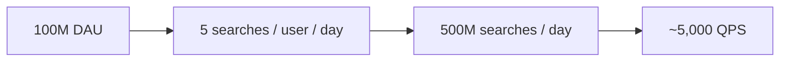

---

## 3. API Design

### Search Nearby

```http
GET /v1/search/nearby?latitude=37.776720&longitude=-122.416730&radius=500
```

### Request Parameters

| Field | Type | Notes |
|---|---|---|
| latitude | decimal | User latitude |
| longitude | decimal | User longitude |
| radius | int | Optional, default 5000 meters |
| category | string | Optional filter, for example restaurant/gas/hotel |
| openNow | boolean | Optional filter |
| page | int | Pagination |
| size | int | Page size |

### Response

```json
{
  "total": 10,
  "businesses": [
    {
      "id": 101,
      "name": "Taco Palace",
      "distanceMeters": 240,
      "rating": 4.5
    }
  ]
}
```

### Business APIs

```http
GET    /v1/businesses/{id}
POST   /v1/businesses
PUT    /v1/businesses/{id}
DELETE /v1/businesses/{id}
```

---

## 4. Why PostgreSQL + PostGIS?

Instead of manually managing geohash tables or quadtrees, we can use **PostGIS**, a geospatial extension for PostgreSQL.

PostGIS gives us:

```text
1. Native geometry/geography data types
2. Geospatial indexes using GiST/SP-GiST
3. Fast radius search using ST_DWithin
4. Exact distance calculation using ST_Distance
5. Sorting by nearest distance
6. Easier integration with Spring Boot + SQL
```

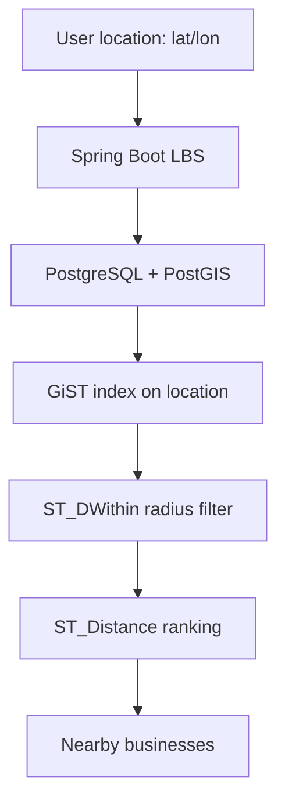

### Interview Line

> I would use PostGIS because it gives production-ready geospatial indexing and distance functions, so we avoid building and maintaining a custom quadtree or geohash index in the application.

---

## 5. High-Level Architecture

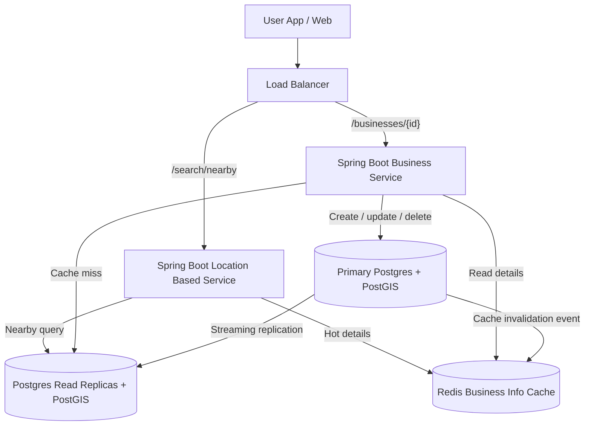

### Key Components

| Component | Responsibility |
|---|---|
| Load Balancer | Routes traffic to correct service |
| Spring Boot LBS | Runs nearby search queries using PostGIS |
| Spring Boot Business Service | Handles business detail reads and owner writes |
| Primary Postgres + PostGIS | Handles writes and stores geospatial business data |
| Postgres Read Replicas | Serve read-heavy nearby search traffic |
| Redis Business Cache | Stores hot business objects |

---

## 6. Data Model with PostGIS

### Enable PostGIS

```sql
CREATE EXTENSION IF NOT EXISTS postgis;
```

### Business Table

Use `geography(Point, 4326)` when distances are measured in meters on Earth.

```sql
CREATE TABLE businesses (
    business_id BIGSERIAL PRIMARY KEY,
    name VARCHAR(255) NOT NULL,
    address TEXT,
    city VARCHAR(128),
    state VARCHAR(128),
    country VARCHAR(128),
    category VARCHAR(64),
    open_hours JSONB,
    rating DOUBLE PRECISION,
    latitude DOUBLE PRECISION NOT NULL,
    longitude DOUBLE PRECISION NOT NULL,
    location GEOGRAPHY(Point, 4326) NOT NULL,
    created_at TIMESTAMP DEFAULT now(),
    updated_at TIMESTAMP DEFAULT now()
);
```

### Geospatial Index

```sql
CREATE INDEX idx_businesses_location
ON businesses
USING GIST (location);
```

### Optional Filter Indexes

```sql
CREATE INDEX idx_businesses_category ON businesses(category);
CREATE INDEX idx_businesses_rating ON businesses(rating);
CREATE INDEX idx_businesses_city ON businesses(city);
```

### ER Diagram

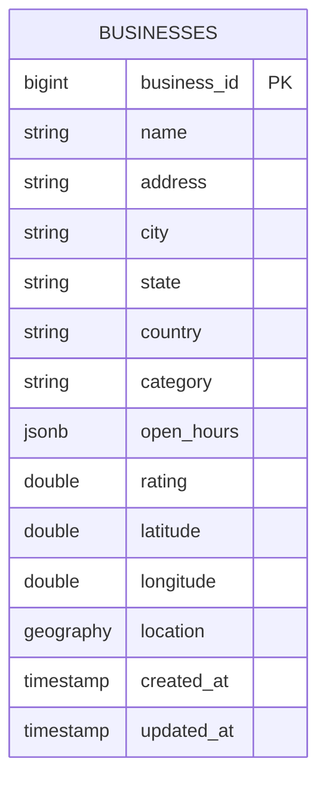

---

## 7. PostGIS Nearby Search Query

### Radius Search

```sql
SELECT
    business_id,
    name,
    category,
    rating,
    latitude,
    longitude,
    ST_Distance(
        location,
        ST_SetSRID(ST_MakePoint(:longitude, :latitude), 4326)::geography
    ) AS distance_meters
FROM businesses
WHERE ST_DWithin(
    location,
    ST_SetSRID(ST_MakePoint(:longitude, :latitude), 4326)::geography,
    :radiusMeters
)
ORDER BY distance_meters ASC
LIMIT :limit OFFSET :offset;
```

### Important Detail

PostGIS uses longitude first, then latitude:

```text
ST_MakePoint(longitude, latitude)
```

Not:

```text
ST_MakePoint(latitude, longitude)
```

---

## 8. Search Flow with PostGIS

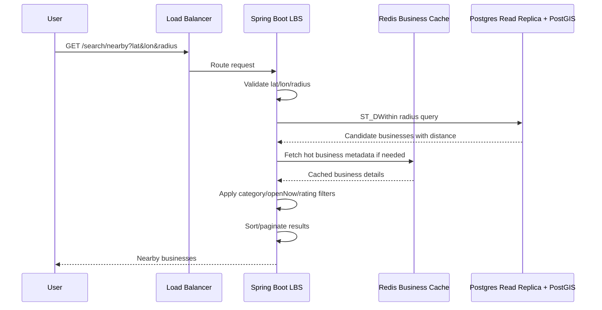

---

## 9. Why PostGIS Instead of Quadtree?

### Quadtree Approach

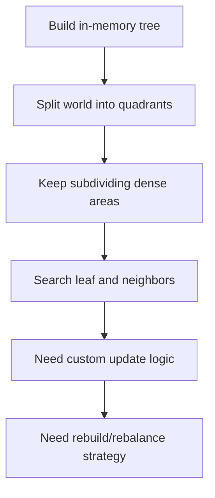

### PostGIS Approach

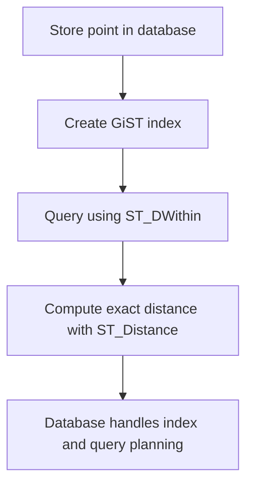

### Comparison

| Topic | Quadtree | PostgreSQL + PostGIS |
|---|---|---|
| Implementation | Custom tree logic | SQL + database extension |
| Updates | Harder; tree traversal/rebalance | Normal DB insert/update/delete |
| Persistence | Need separate storage or rebuild | Built into database |
| Querying | App-level logic | SQL functions |
| Accuracy | Needs final distance filtering | Built-in distance functions |
| Operations | More custom maintenance | Standard Postgres operations |
| Interview practicality | Good concept | Better production-oriented choice |

---

## 10. Spring Boot Implementation

## 10.1 Maven Dependencies

```xml
<dependencies>
    <dependency>
        <groupId>org.springframework.boot</groupId>
        <artifactId>spring-boot-starter-web</artifactId>
    </dependency>

    <dependency>
        <groupId>org.springframework.boot</groupId>
        <artifactId>spring-boot-starter-data-jpa</artifactId>
    </dependency>

    <dependency>
        <groupId>org.postgresql</groupId>
        <artifactId>postgresql</artifactId>
        <scope>runtime</scope>
    </dependency>
</dependencies>
```

---

## 10.2 Spring Boot Config

```yaml
spring:
  datasource:
    url: jdbc:postgresql://localhost:5432/proximity
    username: proximity_user
    password: proximity_password
  jpa:
    hibernate:
      ddl-auto: validate
    properties:
      hibernate:
        dialect: org.hibernate.dialect.PostgreSQLDialect
```

---

## 10.3 Business DTO

```java
public record NearbyBusinessDto(
        Long businessId,
        String name,
        String category,
        Double rating,
        Double latitude,
        Double longitude,
        Double distanceMeters
) {}
```

---

## 10.4 Request Validation Model

```java
public record NearbySearchRequest(
        double latitude,
        double longitude,
        int radiusMeters,
        String category,
        int page,
        int size
) {
    public NearbySearchRequest {
        if (latitude < -90 || latitude > 90) {
            throw new IllegalArgumentException("Invalid latitude");
        }
        if (longitude < -180 || longitude > 180) {
            throw new IllegalArgumentException("Invalid longitude");
        }
        if (radiusMeters <= 0 || radiusMeters > 20_000) {
            throw new IllegalArgumentException("Radius must be between 1 and 20,000 meters");
        }
        if (size <= 0 || size > 100) {
            size = 20;
        }
        if (page < 0) {
            page = 0;
        }
    }
}
```

---

## 10.5 Repository with Native PostGIS Query

```java
import org.springframework.jdbc.core.JdbcTemplate;
import org.springframework.stereotype.Repository;

import java.util.List;

@Repository
public class BusinessSearchRepository {
    private final JdbcTemplate jdbcTemplate;

    public BusinessSearchRepository(JdbcTemplate jdbcTemplate) {
        this.jdbcTemplate = jdbcTemplate;
    }

    public List<NearbyBusinessDto> searchNearby(
            double latitude,
            double longitude,
            int radiusMeters,
            String category,
            int limit,
            int offset
    ) {
        String sql = """
            SELECT
                business_id,
                name,
                category,
                rating,
                latitude,
                longitude,
                ST_Distance(
                    location,
                    ST_SetSRID(ST_MakePoint(?, ?), 4326)::geography
                ) AS distance_meters
            FROM businesses
            WHERE ST_DWithin(
                location,
                ST_SetSRID(ST_MakePoint(?, ?), 4326)::geography,
                ?
            )
            AND (? IS NULL OR category = ?)
            ORDER BY distance_meters ASC
            LIMIT ? OFFSET ?
            """;

        return jdbcTemplate.query(
                sql,
                (rs, rowNum) -> new NearbyBusinessDto(
                        rs.getLong("business_id"),
                        rs.getString("name"),
                        rs.getString("category"),
                        rs.getDouble("rating"),
                        rs.getDouble("latitude"),
                        rs.getDouble("longitude"),
                        rs.getDouble("distance_meters")
                ),
                longitude,
                latitude,
                longitude,
                latitude,
                radiusMeters,
                category,
                category,
                limit,
                offset
        );
    }
}
```

---

## 10.6 Service Layer

```java
import org.springframework.stereotype.Service;

import java.util.List;

@Service
public class NearbySearchService {
    private final BusinessSearchRepository repository;

    public NearbySearchService(BusinessSearchRepository repository) {
        this.repository = repository;
    }

    public List<NearbyBusinessDto> search(NearbySearchRequest request) {
        int limit = request.size();
        int offset = request.page() * request.size();

        return repository.searchNearby(
                request.latitude(),
                request.longitude(),
                request.radiusMeters(),
                request.category(),
                limit,
                offset
        );
    }
}
```

---

## 10.7 REST Controller

```java
import org.springframework.web.bind.annotation.GetMapping;
import org.springframework.web.bind.annotation.RequestMapping;
import org.springframework.web.bind.annotation.RequestParam;
import org.springframework.web.bind.annotation.RestController;

import java.util.List;

@RestController
@RequestMapping("/v1/search")
public class NearbySearchController {
    private final NearbySearchService nearbySearchService;

    public NearbySearchController(NearbySearchService nearbySearchService) {
        this.nearbySearchService = nearbySearchService;
    }

    @GetMapping("/nearby")
    public List<NearbyBusinessDto> searchNearby(
            @RequestParam double latitude,
            @RequestParam double longitude,
            @RequestParam(defaultValue = "5000") int radius,
            @RequestParam(required = false) String category,
            @RequestParam(defaultValue = "0") int page,
            @RequestParam(defaultValue = "20") int size
    ) {
        NearbySearchRequest request = new NearbySearchRequest(
                latitude,
                longitude,
                radius,
                category,
                page,
                size
        );

        return nearbySearchService.search(request);
    }
}
```

---

## 11. Insert / Update Business Location

When inserting or updating a business, always update both raw latitude/longitude and the PostGIS `location` column.

```sql
INSERT INTO businesses (
    name,
    address,
    city,
    state,
    country,
    category,
    rating,
    latitude,
    longitude,
    location
)
VALUES (
    :name,
    :address,
    :city,
    :state,
    :country,
    :category,
    :rating,
    :latitude,
    :longitude,
    ST_SetSRID(ST_MakePoint(:longitude, :latitude), 4326)::geography
);
```

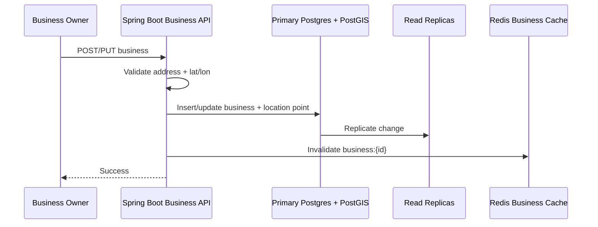

---

## 12. Caching Strategy

With PostGIS, we may not need a separate geohash cache at first. Start simple:

```text
1. PostGIS index handles nearby search.
2. Redis caches hot business details.
3. Add query/result cache only after benchmarking.
```

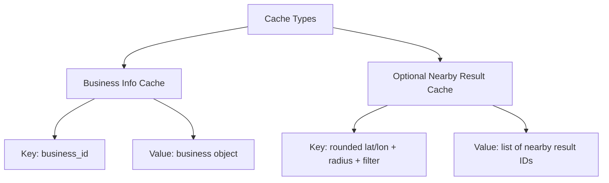

### Cache Keys

| Cache | Key | Value |
|---|---|---|
| Business info cache | `business:{id}` | Business object |
| Optional result cache | `nearby:{geocell}:{radius}:{category}` | List of business IDs |

### Why Be Careful with Result Caching?

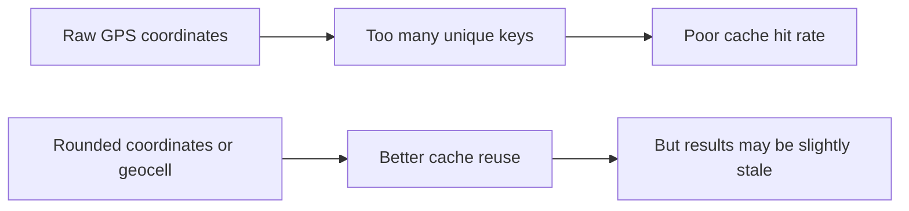

---

## 13. Scaling PostgreSQL + PostGIS

### Read Scaling

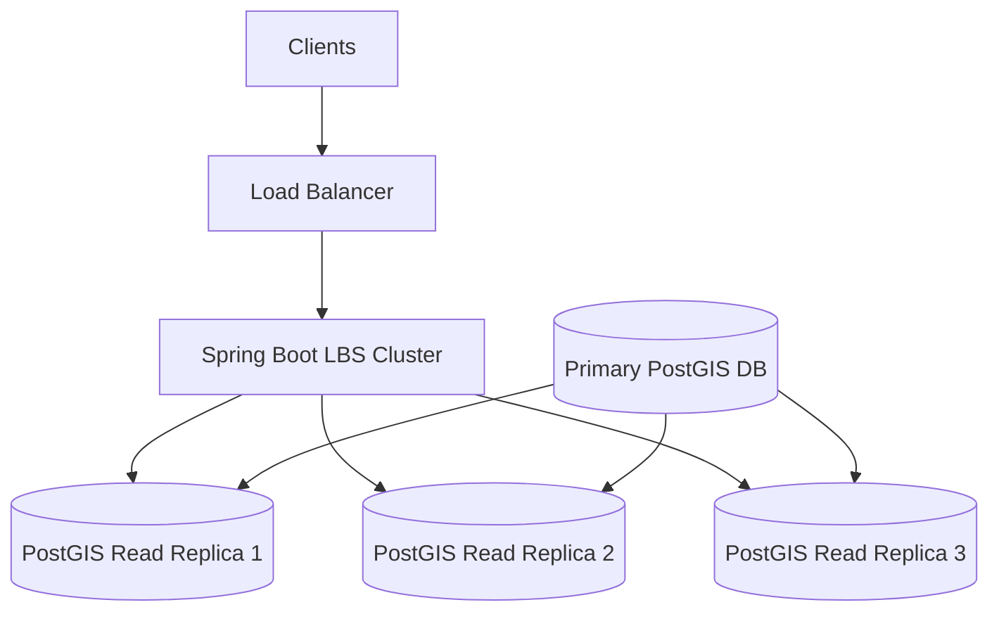

### Scaling Options

| Problem | Solution |
|---|---|
| Read QPS too high | Add Postgres read replicas |
| One region too slow | Deploy regional read replicas |
| Write volume grows | Partition/shard by geography or business_id |
| Huge global dataset | Split by country/region |
| Hot city traffic | Regional replicas + cache hot results |

### Sharding by Region

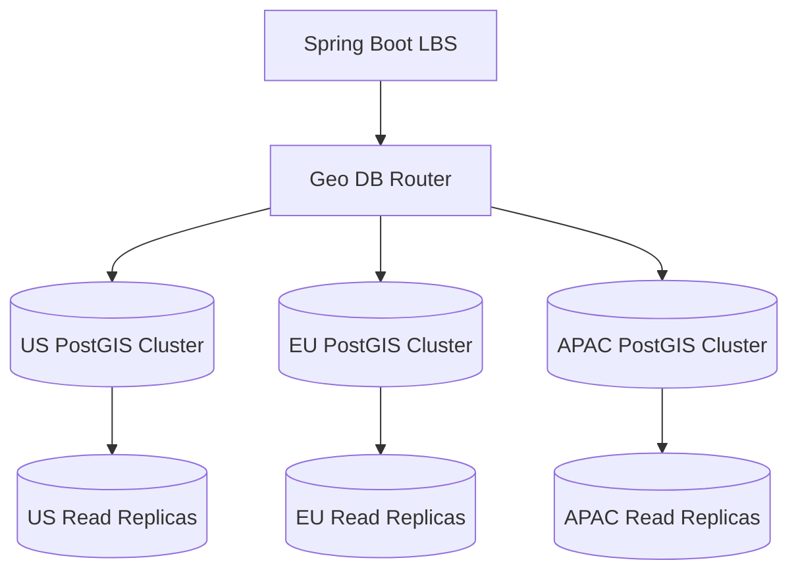

---

## 14. Filtering Results

Examples:

- Open now
- Restaurant only
- Rating above 4.0
- Price level
- Cuisine type

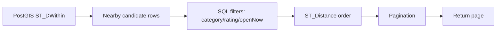

### SQL Example with Category and Rating

```sql
SELECT
    business_id,
    name,
    rating,
    ST_Distance(location, :userPoint) AS distance_meters
FROM businesses
WHERE ST_DWithin(location, :userPoint, :radiusMeters)
  AND category = :category
  AND rating >= :minRating
ORDER BY distance_meters ASC
LIMIT :limit OFFSET :offset;
```

---

## 15. Multi-Region Deployment

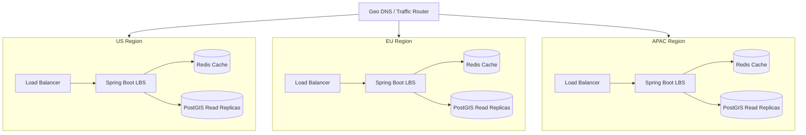

### Benefits

| Benefit | Explanation |
|---|---|
| Lower latency | Route users to nearby region |
| Availability | Region failure does not take down all traffic |
| Traffic distribution | Handle dense areas separately |
| Compliance | Store/process sensitive location data locally if required |

---

## 16. Failure Handling

| Failure | Handling |
|---|---|
| LBS server fails | Stateless; load balancer routes to healthy server |
| Business service fails | Stateless; restart or route around it |
| Redis fails | Fall back to DB; rebuild cache lazily |
| Postgres read replica fails | Route reads to another replica |
| Primary DB fails | Promote replica to primary |
| Replica lag | Usually acceptable for business data |
| PostGIS index bloat | Reindex during maintenance window |
| Region outage | Route traffic to another region |

---

## 17. Interview Talking Points

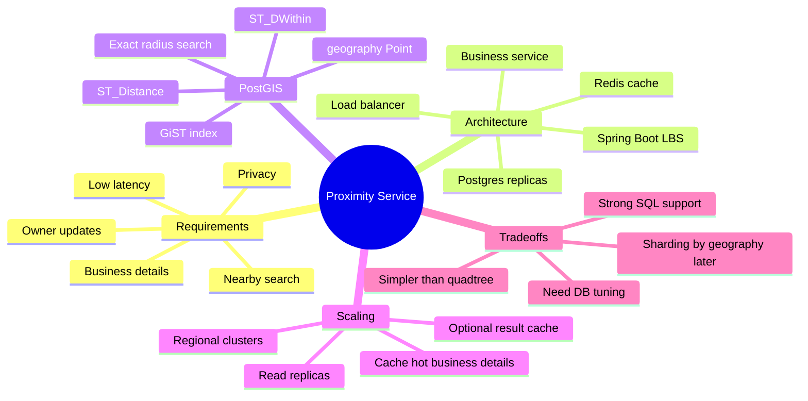

---

## 18. Final Architecture Summary

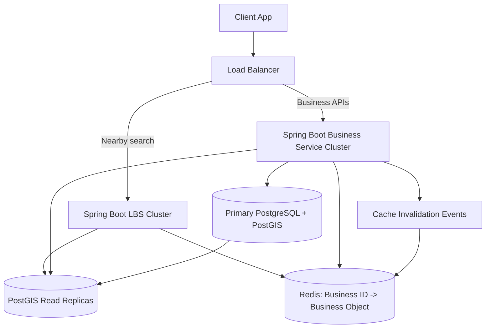

> In this version, **PostGIS replaces the custom quadtree/geohash index** for the main nearby search path. Redis is used mainly for hot business details, not as the primary geospatial engine.

---

## 19. Quick Memory Hook

```text
User location
   ↓
Spring Boot LBS
   ↓
PostGIS ST_DWithin radius query
   ↓
ST_Distance exact ranking
   ↓
Business details cache
   ↓
Ranked nearby results
```

Best interview phrase:

> I would start with PostgreSQL PostGIS because it gives reliable geospatial search with indexes. I would scale reads using replicas and regional deployment before introducing custom geohash or quadtree infrastructure.

