# Distributed Message Queue - Visual Notes (Java + Mermaid)

## 1. High-Level Architecture

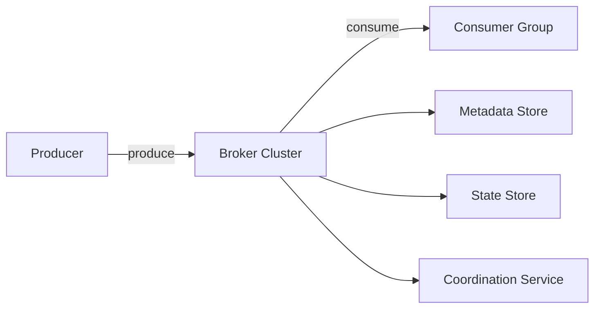

---

## 2. Topic, Partition, Broker

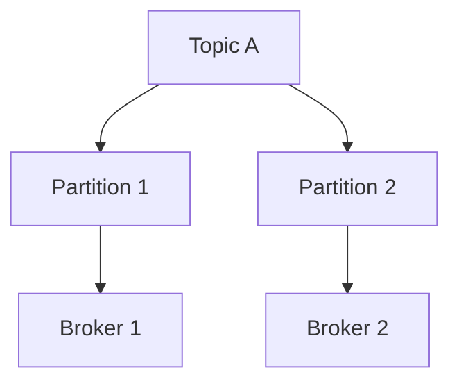

### Java Model

```java
class Message {
    String topic;
    int partition;
    long offset;
    byte[] key;
    byte[] value;
    long timestamp;
}
```

---

## 3. Producer Flow (Batching + Routing)

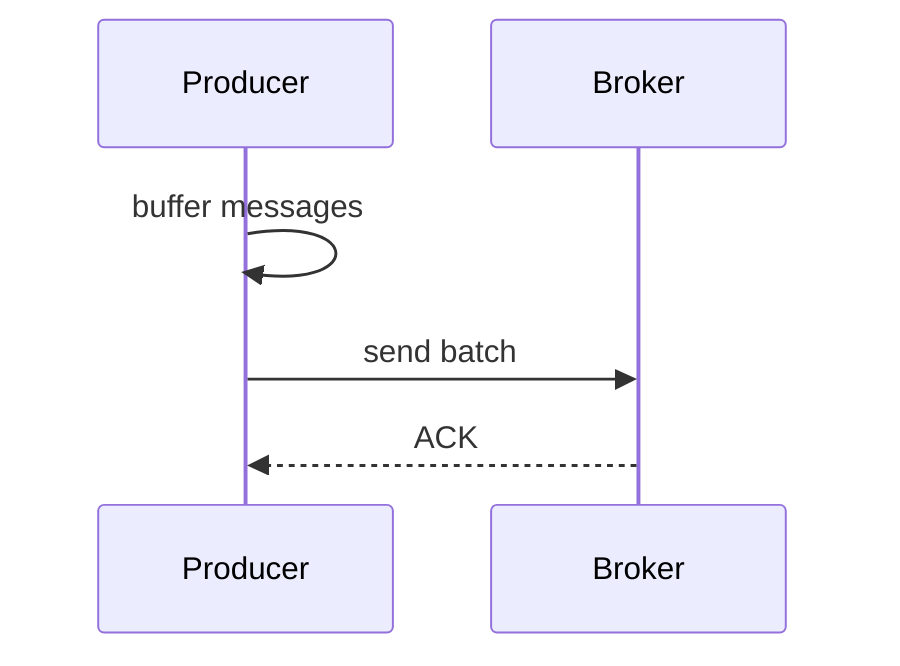

### Java Producer Example

```java
class Producer {
    List<Message> buffer = new ArrayList<>();

    void send(Message msg) {
        buffer.add(msg);
        if (buffer.size() >= 10) {
            flush();
        }
    }

    void flush() {
        // simulate sending batch
        System.out.println("Sending batch of size: " + buffer.size());
        buffer.clear();
    }
}
```

---

## 4. Consumer Flow (Pull Model)

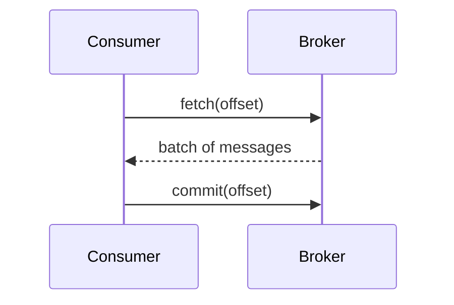

### Java Consumer Example

```java
class Consumer {
    long offset = 0;

    void poll(List<Message> partition) {
        for (Message m : partition) {
            if (m.offset >= offset) {
                process(m);
                offset = m.offset + 1;
            }
        }
    }

    void process(Message m) {
        System.out.println("Processing: " + m.offset);
    }
}
```

---

## 5. Consumer Groups

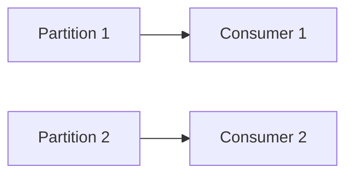

Rule:
- One partition → one consumer per group

---

## 6. Storage (WAL + Segments)

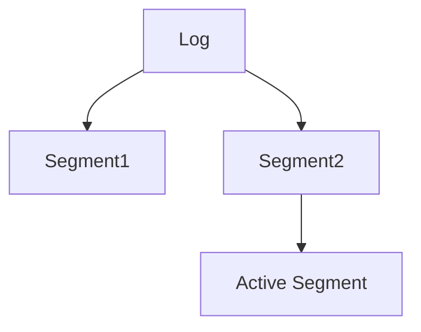

### Java Append Log

```java
class LogSegment {
    List<Message> messages = new ArrayList<>();

    void append(Message msg) {
        messages.add(msg);
    }
}
```

---

## 7. Replication

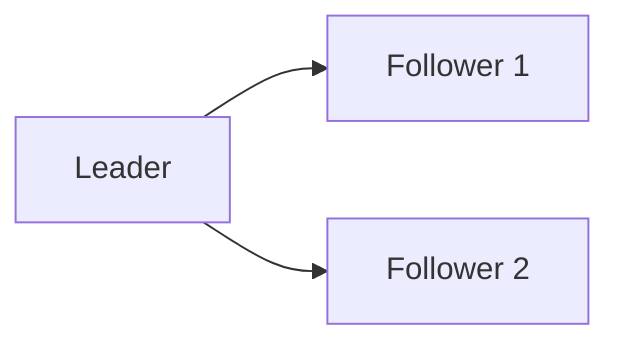

### Concept
- Leader handles writes
- Followers replicate

---

## 8. Delivery Semantics

### At-least-once (most common)

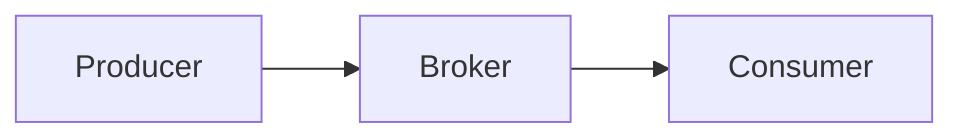

- Possible duplicates
- No data loss

---

## 9. ACK Modes

| Mode | Behavior |
|------|--------|
| ack=0 | no guarantee |
| ack=1 | leader only |
| ack=all | strongest guarantee |

---

## 10. Scaling

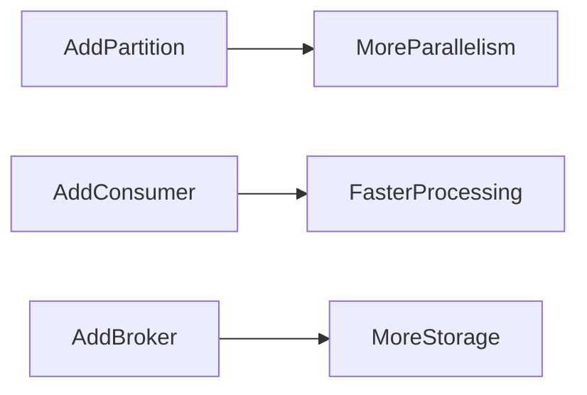

---

## 11. Delayed Messages

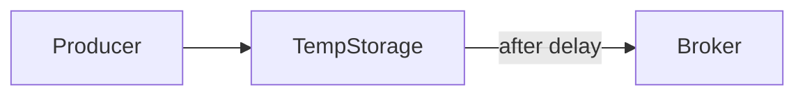

### Java Idea

```java
class DelayedMessage {
    Message message;
    long deliverAt;
}
```

---

## 12. Key Takeaways

- Use partitions for scalability
- Use WAL for performance
- Use batching for throughput
- Use consumer groups for parallelism
- Trade latency vs durability

---

## 13. Mental Model

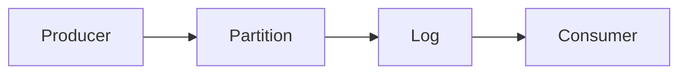

---

End of Notes
