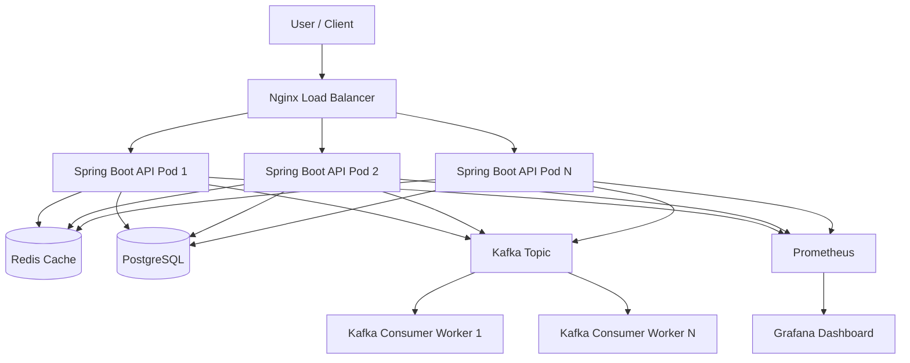
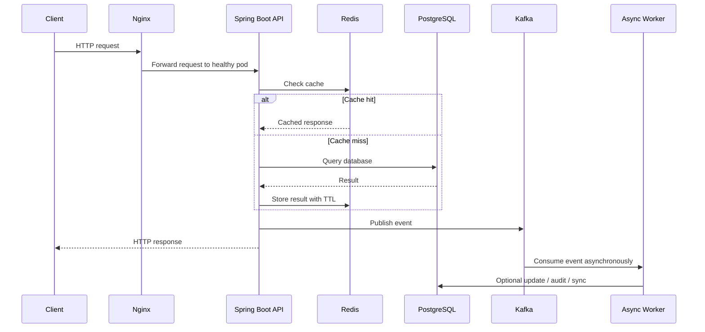
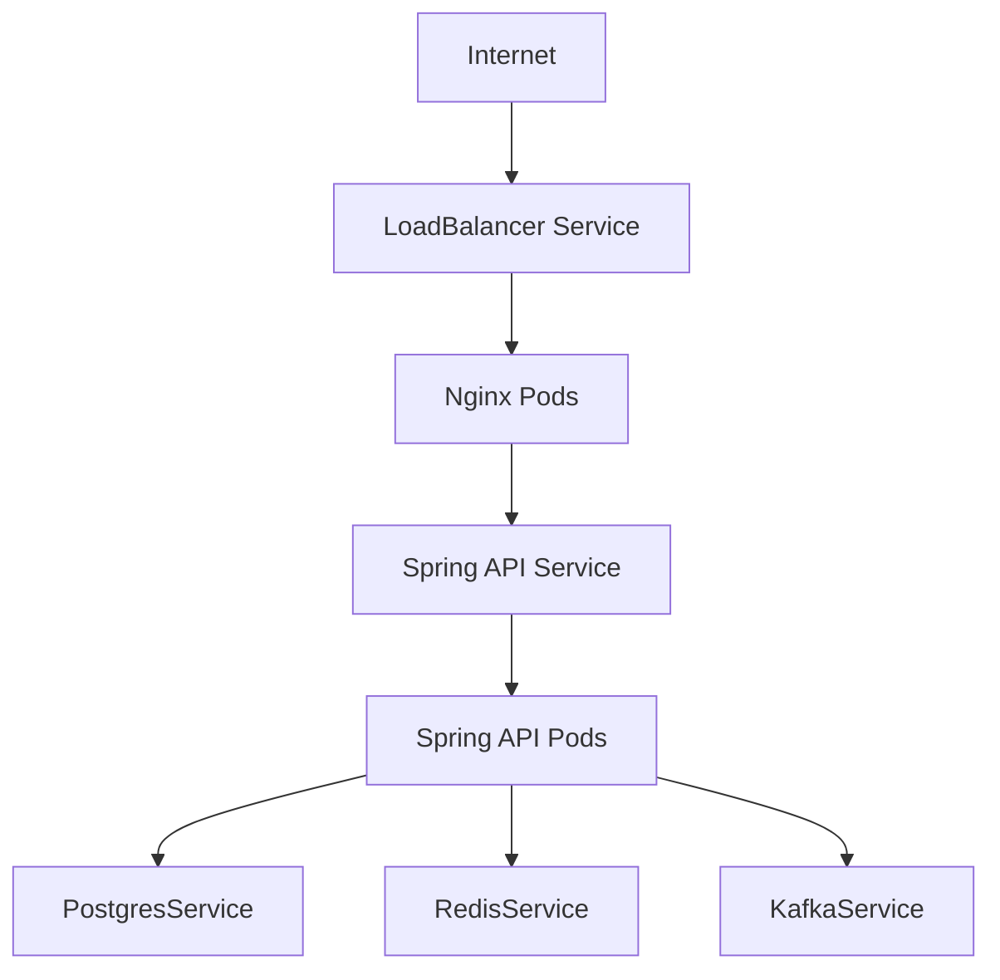
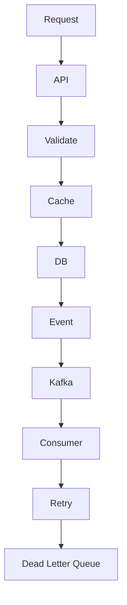
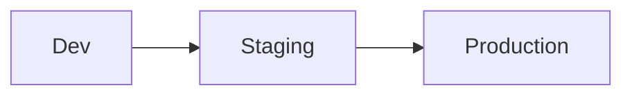
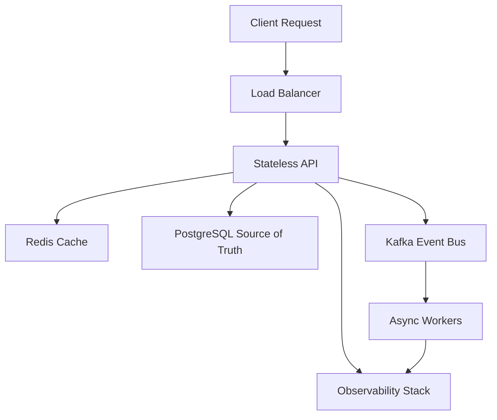

# 🚀 Production-Grade Spring Boot Application Template

> A complete reusable framework for creating new high-load Spring Boot applications with PostgreSQL, Redis, Kafka, Nginx, Docker, Kubernetes, observability, external configuration, async processing, resilience, and deployment automation.

---

## 0. What This Template Gives You

This template is designed to help you create a new application fast while still following production-grade patterns.

### Included

| Area | Included |
|---|---|
| API | Spring Boot REST API |
| Database | PostgreSQL |
| Cache | Redis |
| Async | Kafka producer and consumer |
| Load Balancer | Nginx |
| Local Runtime | Docker Compose |
| Cloud Runtime | Kubernetes manifests |
| Config | Environment variables, ConfigMap, Secret |
| Observability | Actuator, Prometheus metrics, Grafana-ready |
| Reliability | Health checks, readiness, liveness |
| Scalability | Horizontal Pod Autoscaler |
| CI/CD | GitHub Actions example |
| Testing | Unit, integration, Testcontainers-ready layout |
| Security baseline | CORS, validation, no hardcoded secrets |
| Expert patterns | Retry, DLQ concept, rate limiting, circuit breaker extension points |

---

# 1. Final Architecture



---

# 2. Request Flow



---

# 3. Repository Structure

```text
production-spring-template/
├── .github/
│   └── workflows/
│       └── ci.yml
├── docker/
│   ├── nginx/
│   │   └── nginx.conf
│   └── prometheus/
│       └── prometheus.yml
├── k8s/
│   ├── namespace.yaml
│   ├── configmap.yaml
│   ├── secret.example.yaml
│   ├── postgres.yaml
│   ├── redis.yaml
│   ├── kafka.yaml
│   ├── app-deployment.yaml
│   ├── app-service.yaml
│   ├── nginx-configmap.yaml
│   ├── nginx-deployment.yaml
│   ├── nginx-service.yaml
│   ├── hpa.yaml
│   └── prometheus-service-monitor.example.yaml
├── scripts/
│   ├── build.sh
│   ├── run-local.sh
│   ├── deploy-k8s.sh
│   └── load-test-k6.js
├── src/
│   ├── main/
│   │   ├── java/com/company/app/
│   │   │   ├── Application.java
│   │   │   ├── common/
│   │   │   │   ├── ApiResponse.java
│   │   │   │   ├── GlobalExceptionHandler.java
│   │   │   │   └── NotFoundException.java
│   │   │   ├── config/
│   │   │   │   ├── AsyncConfig.java
│   │   │   │   ├── CacheConfig.java
│   │   │   │   ├── CorsConfig.java
│   │   │   │   ├── KafkaConfig.java
│   │   │   │   └── WebConfig.java
│   │   │   ├── product/
│   │   │   │   ├── Product.java
│   │   │   │   ├── ProductController.java
│   │   │   │   ├── ProductCreateRequest.java
│   │   │   │   ├── ProductResponse.java
│   │   │   │   ├── ProductRepository.java
│   │   │   │   ├── ProductService.java
│   │   │   │   └── ProductMapper.java
│   │   │   ├── events/
│   │   │   │   ├── ProductCreatedEvent.java
│   │   │   │   ├── EventProducer.java
│   │   │   │   └── ProductEventConsumer.java
│   │   │   └── health/
│   │   │       └── ReadinessController.java
│   │   └── resources/
│   │       ├── application.yml
│   │       ├── application-dev.yml
│   │       ├── application-prod.yml
│   │       └── db/migration/
│   │           └── V1__init.sql
│   └── test/
│       └── java/com/company/app/
│           ├── ProductServiceTest.java
│           └── ProductIntegrationTest.java
├── .dockerignore
├── .env.example
├── Dockerfile
├── docker-compose.yml
├── pom.xml
└── README.md
```

---

# 4. Tech Decisions

| Need | Choice | Why |
|---|---|---|
| Main framework | Spring Boot | Mature, production-ready |
| Java version | Java 21 | LTS, modern performance |
| Database | PostgreSQL | Reliable relational DB |
| Cache | Redis | Fast lookup cache |
| Async | Kafka | Durable event streaming |
| Load balancing | Nginx | Simple and battle-tested |
| Deployment | Kubernetes | Scaling and orchestration |
| Metrics | Actuator + Prometheus | Standard observability stack |
| DB migration | Flyway | Repeatable schema changes |
| Validation | Jakarta Validation | Safer API input |
| Testing | JUnit + Testcontainers | Production-like integration tests |

---

# 5. Maven Configuration

## `pom.xml`

```xml
<project xmlns="http://maven.apache.org/POM/4.0.0"
         xmlns:xsi="http://www.w3.org/2001/XMLSchema-instance"
         xsi:schemaLocation="http://maven.apache.org/POM/4.0.0 https://maven.apache.org/xsd/maven-4.0.0.xsd">

    <modelVersion>4.0.0</modelVersion>

    <groupId>com.company</groupId>
    <artifactId>production-spring-template</artifactId>
    <version>1.0.0</version>
    <name>production-spring-template</name>

    <properties>
        <java.version>21</java.version>
        <spring.boot.version>3.5.14</spring.boot.version>
    </properties>

    <parent>
        <groupId>org.springframework.boot</groupId>
        <artifactId>spring-boot-starter-parent</artifactId>
        <version>3.5.14</version>
        <relativePath/>
    </parent>

    <dependencies>
        <!-- Web API -->
        <dependency>
            <groupId>org.springframework.boot</groupId>
            <artifactId>spring-boot-starter-web</artifactId>
        </dependency>

        <!-- Validation -->
        <dependency>
            <groupId>org.springframework.boot</groupId>
            <artifactId>spring-boot-starter-validation</artifactId>
        </dependency>

        <!-- Database -->
        <dependency>
            <groupId>org.springframework.boot</groupId>
            <artifactId>spring-boot-starter-data-jpa</artifactId>
        </dependency>
        <dependency>
            <groupId>org.postgresql</groupId>
            <artifactId>postgresql</artifactId>
            <scope>runtime</scope>
        </dependency>

        <!-- Flyway migrations -->
        <dependency>
            <groupId>org.flywaydb</groupId>
            <artifactId>flyway-core</artifactId>
        </dependency>
        <dependency>
            <groupId>org.flywaydb</groupId>
            <artifactId>flyway-database-postgresql</artifactId>
        </dependency>

        <!-- Redis -->
        <dependency>
            <groupId>org.springframework.boot</groupId>
            <artifactId>spring-boot-starter-data-redis</artifactId>
        </dependency>

        <!-- Kafka -->
        <dependency>
            <groupId>org.springframework.kafka</groupId>
            <artifactId>spring-kafka</artifactId>
        </dependency>

        <!-- Observability -->
        <dependency>
            <groupId>org.springframework.boot</groupId>
            <artifactId>spring-boot-starter-actuator</artifactId>
        </dependency>
        <dependency>
            <groupId>io.micrometer</groupId>
            <artifactId>micrometer-registry-prometheus</artifactId>
        </dependency>

        <!-- Optional resilience extension -->
        <dependency>
            <groupId>io.github.resilience4j</groupId>
            <artifactId>resilience4j-spring-boot3</artifactId>
            <version>2.3.0</version>
        </dependency>

        <!-- Test -->
        <dependency>
            <groupId>org.springframework.boot</groupId>
            <artifactId>spring-boot-starter-test</artifactId>
            <scope>test</scope>
        </dependency>
        <dependency>
            <groupId>org.springframework.kafka</groupId>
            <artifactId>spring-kafka-test</artifactId>
            <scope>test</scope>
        </dependency>
        <dependency>
            <groupId>org.testcontainers</groupId>
            <artifactId>postgresql</artifactId>
            <scope>test</scope>
        </dependency>
        <dependency>
            <groupId>org.testcontainers</groupId>
            <artifactId>kafka</artifactId>
            <scope>test</scope>
        </dependency>
    </dependencies>

    <build>
        <plugins>
            <!-- Build container image if needed -->
            <plugin>
                <groupId>org.springframework.boot</groupId>
                <artifactId>spring-boot-maven-plugin</artifactId>
            </plugin>

            <!-- Fail build on old Java -->
            <plugin>
                <groupId>org.apache.maven.plugins</groupId>
                <artifactId>maven-enforcer-plugin</artifactId>
                <version>3.5.0</version>
                <executions>
                    <execution>
                        <id>enforce-java</id>
                        <goals>
                            <goal>enforce</goal>
                        </goals>
                        <configuration>
                            <rules>
                                <requireJavaVersion>
                                    <version>[21,)</version>
                                </requireJavaVersion>
                            </rules>
                        </configuration>
                    </execution>
                </executions>
            </plugin>
        </plugins>
    </build>

</project>
```

---

# 6. Application Configuration

## `src/main/resources/application.yml`

```yaml
server:
  port: ${SERVER_PORT:8080}
  shutdown: graceful
  tomcat:
    threads:
      max: ${TOMCAT_MAX_THREADS:300}
      min-spare: ${TOMCAT_MIN_THREADS:50}
    accept-count: ${TOMCAT_ACCEPT_COUNT:1000}
    max-connections: ${TOMCAT_MAX_CONNECTIONS:10000}

spring:
  application:
    name: ${APP_NAME:production-spring-template}

  lifecycle:
    timeout-per-shutdown-phase: 30s

  datasource:
    url: jdbc:postgresql://${POSTGRES_HOST:localhost}:${POSTGRES_PORT:5432}/${POSTGRES_DB:appdb}
    username: ${POSTGRES_USER:appuser}
    password: ${POSTGRES_PASSWORD:apppassword}
    hikari:
      maximum-pool-size: ${DB_POOL_MAX:30}
      minimum-idle: ${DB_POOL_MIN:5}
      connection-timeout: 3000
      idle-timeout: 600000
      max-lifetime: 1800000

  jpa:
    open-in-view: false
    hibernate:
      ddl-auto: validate
    properties:
      hibernate:
        jdbc:
          batch_size: 50
        order_inserts: true
        order_updates: true

  flyway:
    enabled: true
    locations: classpath:db/migration

  data:
    redis:
      host: ${REDIS_HOST:localhost}
      port: ${REDIS_PORT:6379}
      timeout: 2s
      lettuce:
        pool:
          max-active: ${REDIS_POOL_MAX:50}
          max-idle: 20
          min-idle: 5

  kafka:
    bootstrap-servers: ${KAFKA_BOOTSTRAP_SERVERS:localhost:9092}
    producer:
      acks: all
      retries: 5
      properties:
        enable.idempotence: true
        max.in.flight.requests.per.connection: 5
    consumer:
      group-id: ${KAFKA_CONSUMER_GROUP:product-workers}
      auto-offset-reset: earliest
      enable-auto-commit: false
    listener:
      ack-mode: manual_immediate
      concurrency: ${KAFKA_CONCURRENCY:3}

management:
  endpoints:
    web:
      exposure:
        include: health,info,metrics,prometheus,loggers
  endpoint:
    health:
      probes:
        enabled: true
      show-details: when_authorized
  metrics:
    tags:
      application: ${spring.application.name}

logging:
  level:
    root: INFO
    com.company.app: INFO
```

## `application-dev.yml`

```yaml
spring:
  jpa:
    show-sql: true

logging:
  level:
    com.company.app: DEBUG
    org.hibernate.SQL: DEBUG
```

## `application-prod.yml`

```yaml
spring:
  jpa:
    show-sql: false

logging:
  level:
    root: INFO
```

---

# 7. Database Migration

## `src/main/resources/db/migration/V1__init.sql`

```sql
CREATE TABLE products (
    id BIGSERIAL PRIMARY KEY,
    name VARCHAR(255) NOT NULL,
    price NUMERIC(12, 2) NOT NULL,
    status VARCHAR(50) NOT NULL DEFAULT 'ACTIVE',
    created_at TIMESTAMP NOT NULL DEFAULT NOW(),
    updated_at TIMESTAMP NOT NULL DEFAULT NOW()
);

CREATE INDEX idx_products_name ON products(name);
CREATE INDEX idx_products_status ON products(status);
CREATE INDEX idx_products_created_at ON products(created_at);
```

---

# 8. Core Java Code

## `Application.java`

```java
package com.company.app;

import org.springframework.boot.SpringApplication;
import org.springframework.boot.autoconfigure.SpringBootApplication;

@SpringBootApplication
public class Application {
    public static void main(String[] args) {
        SpringApplication.run(Application.class, args);
    }
}
```

---

## `common/ApiResponse.java`

```java
package com.company.app.common;

import java.time.Instant;

public record ApiResponse<T>(
        boolean success,
        T data,
        String error,
        Instant timestamp
) {
    public static <T> ApiResponse<T> ok(T data) {
        return new ApiResponse<>(true, data, null, Instant.now());
    }

    public static <T> ApiResponse<T> fail(String error) {
        return new ApiResponse<>(false, null, error, Instant.now());
    }
}
```

---

## `common/NotFoundException.java`

```java
package com.company.app.common;

public class NotFoundException extends RuntimeException {
    public NotFoundException(String message) {
        super(message);
    }
}
```

---

## `common/GlobalExceptionHandler.java`

```java
package com.company.app.common;

import jakarta.validation.ConstraintViolationException;
import org.springframework.http.HttpStatus;
import org.springframework.web.bind.MethodArgumentNotValidException;
import org.springframework.web.bind.annotation.*;

@RestControllerAdvice
public class GlobalExceptionHandler {

    @ExceptionHandler(NotFoundException.class)
    @ResponseStatus(HttpStatus.NOT_FOUND)
    public ApiResponse<Void> handleNotFound(NotFoundException ex) {
        return ApiResponse.fail(ex.getMessage());
    }

    @ExceptionHandler(MethodArgumentNotValidException.class)
    @ResponseStatus(HttpStatus.BAD_REQUEST)
    public ApiResponse<Void> handleValidation(MethodArgumentNotValidException ex) {
        String message = ex.getBindingResult()
                .getFieldErrors()
                .stream()
                .findFirst()
                .map(error -> error.getField() + ": " + error.getDefaultMessage())
                .orElse("Validation failed");

        return ApiResponse.fail(message);
    }

    @ExceptionHandler(ConstraintViolationException.class)
    @ResponseStatus(HttpStatus.BAD_REQUEST)
    public ApiResponse<Void> handleConstraint(ConstraintViolationException ex) {
        return ApiResponse.fail(ex.getMessage());
    }

    @ExceptionHandler(Exception.class)
    @ResponseStatus(HttpStatus.INTERNAL_SERVER_ERROR)
    public ApiResponse<Void> handleGeneric(Exception ex) {
        return ApiResponse.fail("Internal server error");
    }
}
```

---

# 9. Product Module

## `product/Product.java`

```java
package com.company.app.product;

import jakarta.persistence.*;
import java.math.BigDecimal;
import java.time.Instant;

@Entity
@Table(name = "products")
public class Product {

    public enum Status {
        ACTIVE,
        INACTIVE
    }

    @Id
    @GeneratedValue(strategy = GenerationType.IDENTITY)
    private Long id;

    @Column(nullable=false)
    private String name;

    @Column(nullable=false, precision = 12, scale = 2)
    private BigDecimal price;

    @Enumerated(EnumType.STRING)
    @Column(nullable=false)
    private Status status = Status.ACTIVE;

    @Column(nullable=false, updatable=false)
    private Instant createdAt = Instant.now();

    @Column(nullable=false)
    private Instant updatedAt = Instant.now();

    @PreUpdate
    void onUpdate() {
        this.updatedAt = Instant.now();
    }

    public Long getId() { return id; }
    public String getName() { return name; }
    public BigDecimal getPrice() { return price; }
    public Status getStatus() { return status; }
    public Instant getCreatedAt() { return createdAt; }
    public Instant getUpdatedAt() { return updatedAt; }

    public void setName(String name) { this.name = name; }
    public void setPrice(BigDecimal price) { this.price = price; }
    public void setStatus(Status status) { this.status = status; }
}
```

---

## `product/ProductCreateRequest.java`

```java
package com.company.app.product;

import jakarta.validation.constraints.DecimalMin;
import jakarta.validation.constraints.NotBlank;
import jakarta.validation.constraints.NotNull;

import java.math.BigDecimal;

public record ProductCreateRequest(
        @NotBlank(message = "name is required")
        String name,

        @NotNull(message = "price is required")
        @DecimalMin(value = "0.01", message = "price must be greater than zero")
        BigDecimal price
) {}
```

---

## `product/ProductResponse.java`

```java
package com.company.app.product;

import java.math.BigDecimal;
import java.time.Instant;

public record ProductResponse(
        Long id,
        String name,
        BigDecimal price,
        String status,
        Instant createdAt
) {}
```

---

## `product/ProductMapper.java`

```java
package com.company.app.product;

public class ProductMapper {
    private ProductMapper() {}

    public static ProductResponse toResponse(Product product) {
        return new ProductResponse(
                product.getId(),
                product.getName(),
                product.getPrice(),
                product.getStatus().name(),
                product.getCreatedAt()
        );
    }
}
```

---

## `product/ProductRepository.java`

```java
package com.company.app.product;

import org.springframework.data.domain.Page;
import org.springframework.data.domain.Pageable;
import org.springframework.data.jpa.repository.JpaRepository;

public interface ProductRepository extends JpaRepository<Product, Long> {
    Page<Product> findByStatus(Product.Status status, Pageable pageable);
}
```

---

## `events/ProductCreatedEvent.java`

```java
package com.company.app.events;

import java.math.BigDecimal;
import java.time.Instant;

public record ProductCreatedEvent(
        Long productId,
        String name,
        BigDecimal price,
        Instant occurredAt
) {}
```

---

## `events/EventProducer.java`

```java
package com.company.app.events;

import org.springframework.kafka.core.KafkaTemplate;
import org.springframework.stereotype.Component;

@Component
public class EventProducer {

    public static final String PRODUCT_CREATED_TOPIC = "product-created";

    private final KafkaTemplate<String, ProductCreatedEvent> kafkaTemplate;

    public EventProducer(KafkaTemplate<String, ProductCreatedEvent> kafkaTemplate) {
        this.kafkaTemplate = kafkaTemplate;
    }

    public void productCreated(ProductCreatedEvent event) {
        kafkaTemplate.send(PRODUCT_CREATED_TOPIC, event.productId().toString(), event);
    }
}
```

---

## `events/ProductEventConsumer.java`

```java
package com.company.app.events;

import org.apache.kafka.clients.consumer.ConsumerRecord;
import org.springframework.kafka.annotation.KafkaListener;
import org.springframework.kafka.support.Acknowledgment;
import org.springframework.stereotype.Component;

@Component
public class ProductEventConsumer {

    @KafkaListener(topics = EventProducer.PRODUCT_CREATED_TOPIC)
    public void handleProductCreated(
            ConsumerRecord<String, ProductCreatedEvent> record,
            Acknowledgment ack
    ) {
        try {
            ProductCreatedEvent event = record.value();

            // Async work belongs here:
            // - send email
            // - update search index
            // - call external service
            // - audit event
            // - generate report

            System.out.println("Processed product-created event: " + event.productId());

            ack.acknowledge();
        } catch (Exception ex) {
            // In production:
            // - retry
            // - publish to dead-letter topic
            // - alert if repeated failure
            throw ex;
        }
    }
}
```

---

## `product/ProductService.java`

```java
package com.company.app.product;

import com.company.app.common.NotFoundException;
import com.company.app.events.EventProducer;
import com.company.app.events.ProductCreatedEvent;
import org.springframework.cache.annotation.CacheEvict;
import org.springframework.cache.annotation.Cacheable;
import org.springframework.data.domain.*;
import org.springframework.stereotype.Service;
import org.springframework.transaction.annotation.Transactional;

import java.time.Instant;

@Service
public class ProductService {

    private final ProductRepository repository;
    private final EventProducer eventProducer;

    public ProductService(ProductRepository repository, EventProducer eventProducer) {
        this.repository = repository;
        this.eventProducer = eventProducer;
    }

    @Transactional
    public ProductResponse create(ProductCreateRequest request) {
        Product product = new Product();
        product.setName(request.name());
        product.setPrice(request.price());

        Product saved = repository.save(product);

        eventProducer.productCreated(new ProductCreatedEvent(
                saved.getId(),
                saved.getName(),
                saved.getPrice(),
                Instant.now()
        ));

        return ProductMapper.toResponse(saved);
    }

    @Transactional(readOnly = true)
    @Cacheable(value = "products", key = "#id")
    public ProductResponse getById(Long id) {
        Product product = repository.findById(id)
                .orElseThrow(() -> new NotFoundException("Product not found: " + id));

        return ProductMapper.toResponse(product);
    }

    @Transactional(readOnly = true)
    public Page<ProductResponse> list(int page, int size) {
        Pageable pageable = PageRequest.of(
                Math.max(page, 0),
                Math.min(size, 100),
                Sort.by(Sort.Direction.DESC, "createdAt")
        );

        return repository.findByStatus(Product.Status.ACTIVE, pageable)
                .map(ProductMapper::toResponse);
    }

    @Transactional
    @CacheEvict(value = "products", key = "#id")
    public void deactivate(Long id) {
        Product product = repository.findById(id)
                .orElseThrow(() -> new NotFoundException("Product not found: " + id));

        product.setStatus(Product.Status.INACTIVE);
    }
}
```

---

## `product/ProductController.java`

```java
package com.company.app.product;

import com.company.app.common.ApiResponse;
import jakarta.validation.Valid;
import jakarta.validation.constraints.Max;
import jakarta.validation.constraints.Min;
import org.springframework.data.domain.Page;
import org.springframework.validation.annotation.Validated;
import org.springframework.web.bind.annotation.*;

@RestController
@RequestMapping("/api/v1/products")
@Validated
public class ProductController {

    private final ProductService service;

    public ProductController(ProductService service) {
        this.service = service;
    }

    @PostMapping
    public ApiResponse<ProductResponse> create(@Valid @RequestBody ProductCreateRequest request) {
        return ApiResponse.ok(service.create(request));
    }

    @GetMapping("/{id}")
    public ApiResponse<ProductResponse> get(@PathVariable Long id) {
        return ApiResponse.ok(service.getById(id));
    }

    @GetMapping
    public ApiResponse<Page<ProductResponse>> list(
            @RequestParam(defaultValue = "0") @Min(0) int page,
            @RequestParam(defaultValue = "20") @Min(1) @Max(100) int size
    ) {
        return ApiResponse.ok(service.list(page, size));
    }

    @DeleteMapping("/{id}")
    public ApiResponse<Void> deactivate(@PathVariable Long id) {
        service.deactivate(id);
        return ApiResponse.ok(null);
    }
}
```

---

# 10. Configuration Classes

## `config/CacheConfig.java`

```java
package com.company.app.config;

import org.springframework.cache.CacheManager;
import org.springframework.cache.annotation.EnableCaching;
import org.springframework.context.annotation.*;
import org.springframework.data.redis.cache.*;
import org.springframework.data.redis.connection.RedisConnectionFactory;

import java.time.Duration;

@Configuration
@EnableCaching
public class CacheConfig {

    @Bean
    CacheManager cacheManager(RedisConnectionFactory connectionFactory) {
        RedisCacheConfiguration config = RedisCacheConfiguration
                .defaultCacheConfig()
                .entryTtl(Duration.ofMinutes(10))
                .disableCachingNullValues();

        return RedisCacheManager
                .builder(connectionFactory)
                .cacheDefaults(config)
                .build();
    }
}
```

---

## `config/KafkaConfig.java`

```java
package com.company.app.config;

import com.company.app.events.ProductCreatedEvent;
import org.apache.kafka.clients.admin.NewTopic;
import org.apache.kafka.clients.producer.ProducerConfig;
import org.apache.kafka.common.serialization.StringSerializer;
import org.springframework.context.annotation.*;
import org.springframework.kafka.config.TopicBuilder;
import org.springframework.kafka.core.*;
import org.springframework.kafka.support.serializer.JsonSerializer;

import java.util.HashMap;
import java.util.Map;

@Configuration
public class KafkaConfig {

    @Bean
    NewTopic productCreatedTopic() {
        return TopicBuilder.name("product-created")
                .partitions(6)
                .replicas(1)
                .build();
    }
}
```

---

## `config/CorsConfig.java`

```java
package com.company.app.config;

import org.springframework.context.annotation.*;
import org.springframework.web.cors.*;
import org.springframework.web.cors.UrlBasedCorsConfigurationSource;
import org.springframework.web.filter.CorsFilter;

import java.util.List;

@Configuration
public class CorsConfig {

    @Bean
    CorsFilter corsFilter() {
        CorsConfiguration config = new CorsConfiguration();
        config.setAllowedOrigins(List.of("*"));
        config.setAllowedMethods(List.of("GET", "POST", "PUT", "PATCH", "DELETE", "OPTIONS"));
        config.setAllowedHeaders(List.of("*"));
        config.setMaxAge(3600L);

        UrlBasedCorsConfigurationSource source = new UrlBasedCorsConfigurationSource();
        source.registerCorsConfiguration("/api/**", config);

        return new CorsFilter(source);
    }
}
```

> Production note: replace `*` with your real frontend domains.

---

# 11. Docker Setup

## `.dockerignore`

```text
target
.git
.idea
.vscode
*.iml
.DS_Store
```

## `Dockerfile`

```dockerfile
FROM eclipse-temurin:21-jdk AS build
WORKDIR /workspace

COPY pom.xml .
COPY src ./src

RUN ./mvnw clean package -DskipTests || mvn clean package -DskipTests

FROM eclipse-temurin:21-jre
WORKDIR /app

COPY --from=build /workspace/target/*.jar app.jar

EXPOSE 8080

ENTRYPOINT ["java", \
    "-XX:+UseG1GC", \
    "-XX:MaxRAMPercentage=75", \
    "-XX:+ExitOnOutOfMemoryError", \
    "-jar", "app.jar"]
```

---

# 12. Docker Compose

## `.env.example`

```env
POSTGRES_DB=appdb
POSTGRES_USER=appuser
POSTGRES_PASSWORD=apppassword

REDIS_HOST=redis
POSTGRES_HOST=postgres
KAFKA_BOOTSTRAP_SERVERS=kafka:9092

SPRING_PROFILES_ACTIVE=dev
```

## `docker-compose.yml`

```yaml
services:
  app1:
    build: .
    container_name: spring-app-1
    environment:
      SPRING_PROFILES_ACTIVE: dev
      POSTGRES_HOST: postgres
      POSTGRES_DB: appdb
      POSTGRES_USER: appuser
      POSTGRES_PASSWORD: apppassword
      REDIS_HOST: redis
      KAFKA_BOOTSTRAP_SERVERS: kafka:9092
      SERVER_PORT: 8080
    depends_on:
      - postgres
      - redis
      - kafka

  app2:
    build: .
    container_name: spring-app-2
    environment:
      SPRING_PROFILES_ACTIVE: dev
      POSTGRES_HOST: postgres
      POSTGRES_DB: appdb
      POSTGRES_USER: appuser
      POSTGRES_PASSWORD: apppassword
      REDIS_HOST: redis
      KAFKA_BOOTSTRAP_SERVERS: kafka:9092
      SERVER_PORT: 8080
    depends_on:
      - postgres
      - redis
      - kafka

  app3:
    build: .
    container_name: spring-app-3
    environment:
      SPRING_PROFILES_ACTIVE: dev
      POSTGRES_HOST: postgres
      POSTGRES_DB: appdb
      POSTGRES_USER: appuser
      POSTGRES_PASSWORD: apppassword
      REDIS_HOST: redis
      KAFKA_BOOTSTRAP_SERVERS: kafka:9092
      SERVER_PORT: 8080
    depends_on:
      - postgres
      - redis
      - kafka

  nginx:
    image: nginx:1.27
    container_name: nginx-lb
    ports:
      - "80:80"
    volumes:
      - ./docker/nginx/nginx.conf:/etc/nginx/nginx.conf:ro
    depends_on:
      - app1
      - app2
      - app3

  postgres:
    image: postgres:16
    container_name: postgres
    environment:
      POSTGRES_DB: appdb
      POSTGRES_USER: appuser
      POSTGRES_PASSWORD: apppassword
    ports:
      - "5432:5432"
    volumes:
      - postgres-data:/var/lib/postgresql/data

  redis:
    image: redis:7
    container_name: redis
    ports:
      - "6379:6379"

  kafka:
    image: apache/kafka:3.8.0
    container_name: kafka
    ports:
      - "9092:9092"
    environment:
      KAFKA_NODE_ID: 1
      KAFKA_PROCESS_ROLES: broker,controller
      KAFKA_LISTENERS: PLAINTEXT://:9092,CONTROLLER://:9093
      KAFKA_ADVERTISED_LISTENERS: PLAINTEXT://kafka:9092
      KAFKA_CONTROLLER_QUORUM_VOTERS: 1@kafka:9093
      KAFKA_CONTROLLER_LISTENER_NAMES: CONTROLLER

  prometheus:
    image: prom/prometheus:v2.54.1
    container_name: prometheus
    ports:
      - "9090:9090"
    volumes:
      - ./docker/prometheus/prometheus.yml:/etc/prometheus/prometheus.yml:ro

volumes:
  postgres-data:
```

---

# 13. Nginx Load Balancer

## `docker/nginx/nginx.conf`

```nginx
events {
    worker_connections 8192;
}

http {
    upstream spring_api {
        least_conn;
        server app1:8080 max_fails=3 fail_timeout=10s;
        server app2:8080 max_fails=3 fail_timeout=10s;
        server app3:8080 max_fails=3 fail_timeout=10s;
    }

    server {
        listen 80;

        client_max_body_size 10m;

        location / {
            proxy_pass http://spring_api;
            proxy_http_version 1.1;

            proxy_set_header Host $host;
            proxy_set_header X-Real-IP $remote_addr;
            proxy_set_header X-Forwarded-For $proxy_add_x_forwarded_for;
            proxy_set_header X-Forwarded-Proto $scheme;

            proxy_connect_timeout 3s;
            proxy_send_timeout 30s;
            proxy_read_timeout 30s;
        }

        location /health {
            proxy_pass http://spring_api/actuator/health;
        }
    }
}
```

---

# 14. Prometheus Local Config

## `docker/prometheus/prometheus.yml`

```yaml
global:
  scrape_interval: 15s

scrape_configs:
  - job_name: spring-api
    metrics_path: /actuator/prometheus
    static_configs:
      - targets:
          - app1:8080
          - app2:8080
          - app3:8080
```

---

# 15. Run Locally

```bash
docker compose up --build
```

Create product:

```bash
curl -X POST http://localhost/api/v1/products \
  -H "Content-Type: application/json" \
  -d '{"name":"Laptop","price":1200.50}'
```

Get product:

```bash
curl http://localhost/api/v1/products/1
```

List products:

```bash
curl "http://localhost/api/v1/products?page=0&size=20"
```

Health:

```bash
curl http://localhost/actuator/health
```

Prometheus metrics:

```bash
curl http://localhost/actuator/prometheus
```

---

# 16. Kubernetes Deployment

## Kubernetes Runtime Flow



---

## `k8s/namespace.yaml`

```yaml
apiVersion: v1
kind: Namespace
metadata:
  name: production-template
```

---

## `k8s/configmap.yaml`

```yaml
apiVersion: v1
kind: ConfigMap
metadata:
  name: app-config
  namespace: production-template
data:
  APP_NAME: production-spring-template
  SPRING_PROFILES_ACTIVE: prod
  SERVER_PORT: "8080"

  POSTGRES_HOST: postgres
  POSTGRES_PORT: "5432"
  POSTGRES_DB: appdb

  REDIS_HOST: redis
  REDIS_PORT: "6379"

  KAFKA_BOOTSTRAP_SERVERS: kafka:9092
  KAFKA_CONSUMER_GROUP: product-workers
  KAFKA_CONCURRENCY: "3"

  TOMCAT_MAX_THREADS: "300"
  TOMCAT_MIN_THREADS: "50"
  TOMCAT_ACCEPT_COUNT: "1000"
  TOMCAT_MAX_CONNECTIONS: "10000"

  DB_POOL_MAX: "30"
  DB_POOL_MIN: "5"
```

---

## `k8s/secret.example.yaml`

```yaml
apiVersion: v1
kind: Secret
metadata:
  name: app-secret
  namespace: production-template
type: Opaque
stringData:
  POSTGRES_USER: appuser
  POSTGRES_PASSWORD: change-me
```

> Never commit real production secrets. Use Sealed Secrets, External Secrets Operator, Vault, AWS Secrets Manager, GCP Secret Manager, or Azure Key Vault.

---

## `k8s/app-deployment.yaml`

```yaml
apiVersion: apps/v1
kind: Deployment
metadata:
  name: spring-api
  namespace: production-template
spec:
  replicas: 3
  revisionHistoryLimit: 5
  strategy:
    type: RollingUpdate
    rollingUpdate:
      maxUnavailable: 0
      maxSurge: 1
  selector:
    matchLabels:
      app: spring-api
  template:
    metadata:
      labels:
        app: spring-api
      annotations:
        prometheus.io/scrape: "true"
        prometheus.io/path: "/actuator/prometheus"
        prometheus.io/port: "8080"
    spec:
      terminationGracePeriodSeconds: 45
      containers:
        - name: spring-api
          image: your-docker-registry/production-spring-template:1.0.0
          imagePullPolicy: IfNotPresent
          ports:
            - containerPort: 8080
          envFrom:
            - configMapRef:
                name: app-config
            - secretRef:
                name: app-secret
          readinessProbe:
            httpGet:
              path: /actuator/health/readiness
              port: 8080
            initialDelaySeconds: 20
            periodSeconds: 10
            timeoutSeconds: 3
            failureThreshold: 3
          livenessProbe:
            httpGet:
              path: /actuator/health/liveness
              port: 8080
            initialDelaySeconds: 40
            periodSeconds: 20
            timeoutSeconds: 3
            failureThreshold: 3
          startupProbe:
            httpGet:
              path: /actuator/health
              port: 8080
            failureThreshold: 30
            periodSeconds: 5
          resources:
            requests:
              cpu: "500m"
              memory: "512Mi"
            limits:
              cpu: "2"
              memory: "1Gi"
```

---

## `k8s/app-service.yaml`

```yaml
apiVersion: v1
kind: Service
metadata:
  name: spring-api
  namespace: production-template
spec:
  type: ClusterIP
  selector:
    app: spring-api
  ports:
    - name: http
      port: 8080
      targetPort: 8080
```

---

## `k8s/hpa.yaml`

```yaml
apiVersion: autoscaling/v2
kind: HorizontalPodAutoscaler
metadata:
  name: spring-api-hpa
  namespace: production-template
spec:
  scaleTargetRef:
    apiVersion: apps/v1
    kind: Deployment
    name: spring-api
  minReplicas: 3
  maxReplicas: 20
  metrics:
    - type: Resource
      resource:
        name: cpu
        target:
          type: Utilization
          averageUtilization: 70
```

---

# 17. Kubernetes Nginx

## `k8s/nginx-configmap.yaml`

```yaml
apiVersion: v1
kind: ConfigMap
metadata:
  name: nginx-config
  namespace: production-template
data:
  nginx.conf: |
    events {
        worker_connections 8192;
    }

    http {
        upstream spring_api {
            least_conn;
            server spring-api:8080;
        }

        server {
            listen 80;

            location / {
                proxy_pass http://spring_api;
                proxy_set_header Host $host;
                proxy_set_header X-Real-IP $remote_addr;
                proxy_set_header X-Forwarded-For $proxy_add_x_forwarded_for;
                proxy_set_header X-Forwarded-Proto $scheme;

                proxy_connect_timeout 3s;
                proxy_send_timeout 30s;
                proxy_read_timeout 30s;
            }
        }
    }
```

---

## `k8s/nginx-deployment.yaml`

```yaml
apiVersion: apps/v1
kind: Deployment
metadata:
  name: nginx-lb
  namespace: production-template
spec:
  replicas: 2
  selector:
    matchLabels:
      app: nginx-lb
  template:
    metadata:
      labels:
        app: nginx-lb
    spec:
      containers:
        - name: nginx
          image: nginx:1.27
          ports:
            - containerPort: 80
          volumeMounts:
            - name: nginx-config-volume
              mountPath: /etc/nginx/nginx.conf
              subPath: nginx.conf
          resources:
            requests:
              cpu: "100m"
              memory: "128Mi"
            limits:
              cpu: "500m"
              memory: "256Mi"
      volumes:
        - name: nginx-config-volume
          configMap:
            name: nginx-config
```

---

## `k8s/nginx-service.yaml`

```yaml
apiVersion: v1
kind: Service
metadata:
  name: nginx-lb
  namespace: production-template
spec:
  type: LoadBalancer
  selector:
    app: nginx-lb
  ports:
    - name: http
      port: 80
      targetPort: 80
```

---

# 18. Local Kubernetes Dependencies

> These are development/demo manifests. In production, use managed services or operators.

## `k8s/postgres.yaml`

```yaml
apiVersion: apps/v1
kind: StatefulSet
metadata:
  name: postgres
  namespace: production-template
spec:
  serviceName: postgres
  replicas: 1
  selector:
    matchLabels:
      app: postgres
  template:
    metadata:
      labels:
        app: postgres
    spec:
      containers:
        - name: postgres
          image: postgres:16
          ports:
            - containerPort: 5432
          env:
            - name: POSTGRES_DB
              valueFrom:
                configMapKeyRef:
                  name: app-config
                  key: POSTGRES_DB
            - name: POSTGRES_USER
              valueFrom:
                secretKeyRef:
                  name: app-secret
                  key: POSTGRES_USER
            - name: POSTGRES_PASSWORD
              valueFrom:
                secretKeyRef:
                  name: app-secret
                  key: POSTGRES_PASSWORD
          volumeMounts:
            - name: postgres-storage
              mountPath: /var/lib/postgresql/data
  volumeClaimTemplates:
    - metadata:
        name: postgres-storage
      spec:
        accessModes: ["ReadWriteOnce"]
        resources:
          requests:
            storage: 10Gi
---
apiVersion: v1
kind: Service
metadata:
  name: postgres
  namespace: production-template
spec:
  selector:
    app: postgres
  ports:
    - port: 5432
      targetPort: 5432
```

---

## `k8s/redis.yaml`

```yaml
apiVersion: apps/v1
kind: Deployment
metadata:
  name: redis
  namespace: production-template
spec:
  replicas: 1
  selector:
    matchLabels:
      app: redis
  template:
    metadata:
      labels:
        app: redis
    spec:
      containers:
        - name: redis
          image: redis:7
          ports:
            - containerPort: 6379
          command: ["redis-server"]
          args: ["--appendonly", "yes"]
---
apiVersion: v1
kind: Service
metadata:
  name: redis
  namespace: production-template
spec:
  selector:
    app: redis
  ports:
    - port: 6379
      targetPort: 6379
```

---

## `k8s/kafka.yaml`

```yaml
apiVersion: apps/v1
kind: Deployment
metadata:
  name: kafka
  namespace: production-template
spec:
  replicas: 1
  selector:
    matchLabels:
      app: kafka
  template:
    metadata:
      labels:
        app: kafka
    spec:
      containers:
        - name: kafka
          image: apache/kafka:3.8.0
          ports:
            - containerPort: 9092
            - containerPort: 9093
          env:
            - name: KAFKA_NODE_ID
              value: "1"
            - name: KAFKA_PROCESS_ROLES
              value: broker,controller
            - name: KAFKA_LISTENERS
              value: PLAINTEXT://:9092,CONTROLLER://:9093
            - name: KAFKA_ADVERTISED_LISTENERS
              value: PLAINTEXT://kafka:9092
            - name: KAFKA_CONTROLLER_QUORUM_VOTERS
              value: 1@kafka:9093
            - name: KAFKA_CONTROLLER_LISTENER_NAMES
              value: CONTROLLER
---
apiVersion: v1
kind: Service
metadata:
  name: kafka
  namespace: production-template
spec:
  selector:
    app: kafka
  ports:
    - name: broker
      port: 9092
      targetPort: 9092
```

---

# 19. Deploy to Kubernetes

```bash
kubectl apply -f k8s/namespace.yaml
kubectl apply -f k8s/configmap.yaml
kubectl apply -f k8s/secret.example.yaml

kubectl apply -f k8s/postgres.yaml
kubectl apply -f k8s/redis.yaml
kubectl apply -f k8s/kafka.yaml

kubectl apply -f k8s/app-deployment.yaml
kubectl apply -f k8s/app-service.yaml
kubectl apply -f k8s/hpa.yaml

kubectl apply -f k8s/nginx-configmap.yaml
kubectl apply -f k8s/nginx-deployment.yaml
kubectl apply -f k8s/nginx-service.yaml
```

Check:

```bash
kubectl get pods -n production-template
kubectl get svc -n production-template
kubectl logs -f deployment/spring-api -n production-template
```

---

# 20. CI/CD Pipeline

## `.github/workflows/ci.yml`

```yaml
name: CI

on:
  push:
    branches: [ main, develop ]
  pull_request:
    branches: [ main ]

jobs:
  build-test:
    runs-on: ubuntu-latest

    steps:
      - name: Checkout
        uses: actions/checkout@v4

      - name: Setup Java
        uses: actions/setup-java@v4
        with:
          distribution: temurin
          java-version: 21
          cache: maven

      - name: Run tests
        run: mvn clean test

      - name: Build package
        run: mvn clean package -DskipTests

  docker-build:
    runs-on: ubuntu-latest
    needs: build-test

    steps:
      - name: Checkout
        uses: actions/checkout@v4

      - name: Docker build
        run: docker build -t production-spring-template:${{ github.sha }} .
```

---

# 21. Load Testing

## `scripts/load-test-k6.js`

```javascript
import http from 'k6/http';
import { check, sleep } from 'k6';

export const options = {
  vus: 100,
  duration: '60s',
};

export default function () {
  const payload = JSON.stringify({
    name: `Product-${Math.random()}`,
    price: 99.99
  });

  const params = {
    headers: {
      'Content-Type': 'application/json',
    },
  };

  const res = http.post('http://localhost/api/v1/products', payload, params);

  check(res, {
    'status is 200': (r) => r.status === 200,
    'latency < 500ms': (r) => r.timings.duration < 500,
  });

  sleep(1);
}
```

Run:

```bash
k6 run scripts/load-test-k6.js
```

---

# 22. High Load Tuning Guide

## API Layer

| Setting | Recommendation |
|---|---|
| Stateless app | Required |
| Tomcat max threads | 200–500 depending on CPU |
| DB pool max | Usually 20–50 per pod |
| Pagination | Required |
| Request timeout | Required |
| Large payloads | Avoid |

## PostgreSQL

| Topic | Recommendation |
|---|---|
| Indexes | Add for every common filter/sort |
| Migrations | Flyway only |
| Pooling | HikariCP |
| Backups | Automated |
| Read scaling | Read replicas |
| Long transactions | Avoid |

## Redis

| Topic | Recommendation |
|---|---|
| TTL | Always set |
| Hot keys | Watch carefully |
| Large values | Avoid |
| Eviction policy | Configure intentionally |
| Production | Use Redis Cluster or managed Redis |

## Kafka

| Topic | Recommendation |
|---|---|
| Partitions | Match desired parallelism |
| Consumer group | One per worker type |
| Retries | Configure |
| DLQ | Required for production |
| Ordering | Only guaranteed inside partition |

---

# 23. Reliability Patterns



## Add Later

| Pattern | Tool |
|---|---|
| Circuit breaker | Resilience4j |
| Rate limiting | Bucket4j / Gateway / Nginx |
| Distributed tracing | OpenTelemetry |
| Log aggregation | Loki / ELK |
| Secret management | Vault / External Secrets |
| Blue-green deployment | Argo CD / Spinnaker |
| Canary deployment | Argo Rollouts |

---

# 24. Production Checklist

## Before First Production Deploy

- [ ] No hardcoded passwords
- [ ] Flyway migrations enabled
- [ ] `ddl-auto=validate`
- [ ] Health probes enabled
- [ ] Metrics endpoint enabled
- [ ] Logs are centralized
- [ ] Alerts configured
- [ ] HPA configured
- [ ] Resource requests/limits configured
- [ ] DB backups configured
- [ ] Kafka DLQ strategy configured
- [ ] Redis TTL configured
- [ ] API pagination enforced
- [ ] Load test completed
- [ ] Security scan completed
- [ ] Rollback strategy prepared

---

# 25. Environment Strategy



| Environment | Purpose |
|---|---|
| dev | Local and feature testing |
| staging | Production-like validation |
| production | Real users |

Use different:

- databases
- secrets
- Kafka topics
- Redis instances
- log levels
- resource limits

---

# 26. How to Create a New App From This Template

## Step 1: Copy repo

```bash
cp -r production-spring-template my-new-service
cd my-new-service
```

## Step 2: Rename package

```text
com.company.app
```

to:

```text
com.yourcompany.yourservice
```

## Step 3: Rename artifact

In `pom.xml`:

```xml
<artifactId>your-service-name</artifactId>
```

## Step 4: Replace domain module

Replace `product/` with your real business module:

```text
order/
payment/
user/
inventory/
notification/
```

## Step 5: Update DB migration

Create:

```text
V2__your_feature.sql
```

## Step 6: Run locally

```bash
docker compose up --build
```

## Step 7: Deploy

```bash
kubectl apply -f k8s/
```

---

# 27. Beginner to Expert Learning Map

| Level | Learn |
|---|---|
| Beginner | Controller, Service, Repository |
| Beginner+ | DTOs, validation, exception handling |
| Intermediate | PostgreSQL, Flyway, Redis |
| Intermediate+ | Kafka async processing |
| Advanced | Docker, Nginx, Kubernetes |
| Advanced+ | HPA, probes, rolling deploys |
| Expert | Observability, tracing, chaos testing |
| Expert+ | Multi-region, zero-downtime, SRE practices |

---

# 28. Final Mental Model



The API should stay fast. Expensive work should move to Kafka. Frequently-read data should use Redis. Persistent truth belongs in PostgreSQL. Scaling should happen horizontally through Kubernetes.

---

# 29. Commands Cheat Sheet

```bash
# Build
mvn clean package

# Test
mvn test

# Run app only
mvn spring-boot:run

# Run full local stack
docker compose up --build

# Stop local stack
docker compose down

# Stop and remove DB volume
docker compose down -v

# Build image
docker build -t production-spring-template:1.0.0 .

# Deploy K8s
kubectl apply -f k8s/

# Check pods
kubectl get pods -n production-template

# Tail logs
kubectl logs -f deployment/spring-api -n production-template

# Scale manually
kubectl scale deployment spring-api --replicas=5 -n production-template
```

---

# 30. README Template

```md
# My Service

## Run locally

\```bash
docker compose up --build
\```

## API

### Create product

\```bash
curl -X POST http://localhost/api/v1/products \
  -H "Content-Type: application/json" \
  -d '{"name":"Laptop","price":1200.50}'
\```

### Health

\```bash
curl http://localhost/actuator/health
\```

## Deployment

\```bash
kubectl apply -f k8s/
\```
```

---

# 31. Final Production Advice

For a real enterprise production deployment, prefer:

| Component | Production Recommendation |
|---|---|
| PostgreSQL | Managed DB, backups, PITR |
| Redis | Managed Redis / Redis Cluster |
| Kafka | Managed Kafka / Strimzi |
| Secrets | Vault / cloud secret manager |
| Ingress | Nginx Ingress Controller / cloud LB |
| Deployments | Argo CD or Flux |
| Logs | Loki, ELK, or cloud logging |
| Metrics | Prometheus + Grafana |
| Traces | OpenTelemetry + Tempo / Jaeger |
| Security | OAuth2/JWT, WAF, network policies |

---

# ✅ You Now Have a Production-Grade Template

This guide can be used as your reusable foundation for creating new Spring Boot applications.

Use it as:

- a framework
- a starter repo
- a team standard
- a production checklist
- a learning guide from beginner to expert

