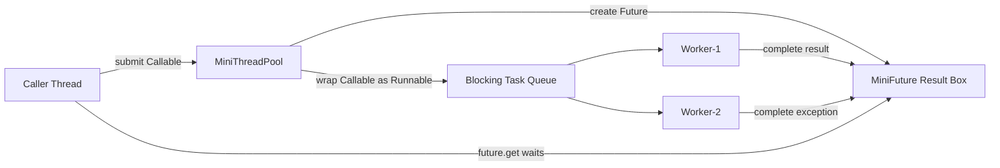
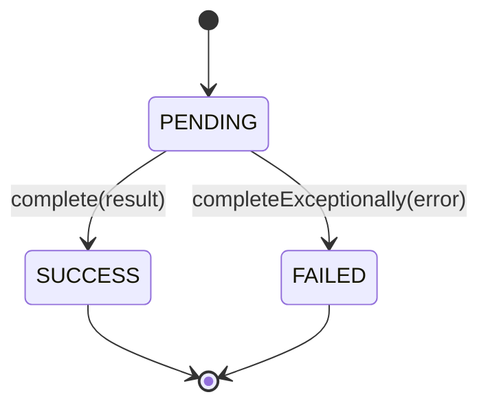

# 006_Future_Callable_Result.md

# MiniThreadPool Phase 006 — Future, Callable, and Result Handling

## 1. Goal

In the previous phases, the thread pool could execute `Runnable` tasks, but the caller could not get a return value.

In this phase, we upgrade the pool to support:

- `Callable<T>` style tasks
- `MiniFuture<T>` result object
- `future.get()` blocking until result is ready
- exception propagation from worker thread to caller thread
- multiple workers executing result-producing tasks

This is the foundation of Java's real `ExecutorService.submit(Callable<T>)` and `Future<T>`.

---

## 2. What changes from previous phase

Previous phase:

```java
pool.execute(() -> {
    System.out.println("task running");
});
```

The task runs, but returns nothing.

New phase:

```java
MiniFuture<Integer> future = pool.submit(() -> {
    return 10 + 20;
});

Integer result = future.get();
System.out.println(result);
```

Now the caller submits work and collects the result later.

---

## 3. Why Future is needed

Without Future:

```text
Caller submits task
Caller does not know result
Caller does not know failure
Caller cannot wait for completion safely
```

With Future:

```text
Caller submits task
Worker executes task
Worker stores result or exception inside Future
Caller calls get()
Caller receives result or exception
```

---

## 4. Steps before code

### Step 1 — Replace only Runnable thinking with Callable thinking

`Runnable` means:

```java
void run();
```

It can execute logic but cannot return a value.

`Callable<T>` means:

```java
T call() throws Exception;
```

It can return a value and throw exception.

---

### Step 2 — Create MiniCallable<T>

We create our own functional interface:

```java
@FunctionalInterface
public interface MiniCallable<T> {
    T call() throws Exception;
}
```

Now users can submit lambda tasks that return values.

---

### Step 3 — Create MiniFuture<T>

`MiniFuture<T>` is a box shared between:

- caller thread
- worker thread

The worker writes result into the box.

The caller waits until the box is completed.

```text
Caller Thread                 Worker Thread
-------------                 -------------
future.get()      waits       task.call()
                              future.complete(result)
returns result   <----------  notify waiting caller
```

---

### Step 4 — Wrap Callable inside Runnable

The worker already knows how to run `Runnable` tasks from the queue.

So we wrap the `Callable<T>` inside a `Runnable`:

```java
Runnable wrapper = () -> {
    try {
        T result = callable.call();
        future.complete(result);
    } catch (Exception e) {
        future.completeExceptionally(e);
    }
};
```

The queue still stores `Runnable`, but the result goes into `MiniFuture<T>`.

---

### Step 5 — Worker executes wrapper

Worker does not care whether task is normal `Runnable` or wrapped `Callable`.

```java
Runnable task = queue.take();
task.run();
```

Inside the wrapper, result is saved into the future.

---

### Step 6 — Caller calls future.get()

If task is not completed, caller waits.

If result is ready, caller gets it.

If task failed, caller receives exception.

```java
T result = future.get();
```

---

## 5. Architecture diagram



---

## 6. Future state transition



---

## 7. File structure

```text
minithreadpool/
└── phase006/
    ├── MiniCallable.java
    ├── MiniFuture.java
    ├── MiniBlockingQueue.java
    ├── MiniThreadPool.java
    └── Phase006FutureCallableResultDriver.java
```

---

# 8. Complete Java Code

## 8.1 MiniCallable.java

```java
package minithreadpool.phase006;

@FunctionalInterface
public interface MiniCallable<T> {
    T call() throws Exception;
}
```

---

## 8.2 MiniFuture.java

```java
package minithreadpool.phase006;

public class MiniFuture<T> {

    private T result;
    private Exception exception;
    private boolean completed;

    public synchronized T get() throws Exception {
        while (!completed) {
            wait();
        }

        if (exception != null) {
            throw exception;
        }

        return result;
    }

    public synchronized boolean isDone() {
        return completed;
    }

    public synchronized void complete(T result) {
        if (completed) {
            return;
        }

        this.result = result;
        this.completed = true;
        notifyAll();
    }

    public synchronized void completeExceptionally(Exception exception) {
        if (completed) {
            return;
        }

        this.exception = exception;
        this.completed = true;
        notifyAll();
    }
}
```

---

## 8.3 MiniBlockingQueue.java

```java
package minithreadpool.phase006;

import java.util.LinkedList;
import java.util.Queue;

public class MiniBlockingQueue {

    private final Queue<Runnable> queue = new LinkedList<>();
    private final int capacity;

    public MiniBlockingQueue(int capacity) {
        if (capacity <= 0) {
            throw new IllegalArgumentException("capacity must be greater than zero");
        }
        this.capacity = capacity;
    }

    public synchronized void put(Runnable task) throws InterruptedException {
        while (queue.size() == capacity) {
            wait();
        }

        queue.offer(task);
        notifyAll();
    }

    public synchronized Runnable take() throws InterruptedException {
        while (queue.isEmpty()) {
            wait();
        }

        Runnable task = queue.poll();
        notifyAll();
        return task;
    }

    public synchronized int size() {
        return queue.size();
    }
}
```

---

## 8.4 MiniThreadPool.java

```java
package minithreadpool.phase006;

import java.util.ArrayList;
import java.util.List;

public class MiniThreadPool {

    private final MiniBlockingQueue taskQueue;
    private final List<Thread> workers = new ArrayList<>();
    private volatile boolean shutdown;

    public MiniThreadPool(int numberOfWorkers, int queueCapacity) {
        if (numberOfWorkers <= 0) {
            throw new IllegalArgumentException("numberOfWorkers must be greater than zero");
        }

        this.taskQueue = new MiniBlockingQueue(queueCapacity);

        for (int i = 1; i <= numberOfWorkers; i++) {
            Thread worker = new Thread(new Worker(), "mini-worker-" + i);
            workers.add(worker);
            worker.start();
        }
    }

    public void execute(Runnable task) throws InterruptedException {
        if (task == null) {
            throw new IllegalArgumentException("task cannot be null");
        }

        if (shutdown) {
            throw new IllegalStateException("ThreadPool is already shutdown");
        }

        taskQueue.put(task);
    }

    public <T> MiniFuture<T> submit(MiniCallable<T> callable) throws InterruptedException {
        if (callable == null) {
            throw new IllegalArgumentException("callable cannot be null");
        }

        MiniFuture<T> future = new MiniFuture<>();

        Runnable wrappedTask = () -> {
            try {
                T result = callable.call();
                future.complete(result);
            } catch (Exception e) {
                future.completeExceptionally(e);
            }
        };

        execute(wrappedTask);
        return future;
    }

    public void shutdown() {
        shutdown = true;

        for (Thread worker : workers) {
            worker.interrupt();
        }
    }

    private class Worker implements Runnable {

        @Override
        public void run() {
            while (!shutdown) {
                try {
                    Runnable task = taskQueue.take();
                    task.run();
                } catch (InterruptedException e) {
                    if (shutdown) {
                        Thread.currentThread().interrupt();
                        break;
                    }
                } catch (Exception e) {
                    System.out.println(Thread.currentThread().getName()
                            + " task failed: " + e.getMessage());
                }
            }

            System.out.println(Thread.currentThread().getName() + " stopped");
        }
    }
}
```

---

## 8.5 Phase006FutureCallableResultDriver.java

```java
package minithreadpool.phase006;

public class Phase006FutureCallableResultDriver {

    public static void main(String[] args) throws Exception {
        MiniThreadPool pool = new MiniThreadPool(3, 5);

        MiniFuture<Integer> sumFuture = pool.submit(() -> {
            System.out.println(Thread.currentThread().getName() + " calculating sum");
            Thread.sleep(1000);
            return 10 + 20;
        });

        MiniFuture<String> messageFuture = pool.submit(() -> {
            System.out.println(Thread.currentThread().getName() + " creating message");
            Thread.sleep(500);
            return "Hello from MiniFuture";
        });

        MiniFuture<Integer> failedFuture = pool.submit(() -> {
            System.out.println(Thread.currentThread().getName() + " running failed task");
            throw new RuntimeException("Something went wrong inside task");
        });

        System.out.println("Main thread can do other work...");

        Integer sum = sumFuture.get();
        String message = messageFuture.get();

        System.out.println("sum result = " + sum);
        System.out.println("message result = " + message);

        try {
            failedFuture.get();
        } catch (Exception e) {
            System.out.println("failedFuture error = " + e.getMessage());
        }

        pool.shutdown();
    }
}
```

---

# 9. Expected output

Output order can change because multiple worker threads run concurrently.

```text
Main thread can do other work...
mini-worker-1 calculating sum
mini-worker-2 creating message
mini-worker-3 running failed task
message result = Hello from MiniFuture
sum result = 30
failedFuture error = Something went wrong inside task
mini-worker-1 stopped
mini-worker-2 stopped
mini-worker-3 stopped
```

---

# 10. Step-by-step dry run

## Input tasks

```text
Task A: return 10 + 20
Task B: return "Hello from MiniFuture"
Task C: throw RuntimeException
```

---

## Timeline

```text
T1: main thread creates MiniThreadPool(3, 5)
T2: 3 workers start and wait on queue.take()
T3: main submits Task A
T4: pool creates Future A
T5: pool wraps Callable A inside Runnable A
T6: Runnable A enters queue
T7: worker-1 takes Runnable A
T8: main submits Task B
T9: worker-2 takes Runnable B
T10: main submits Task C
T11: worker-3 takes Runnable C
T12: main calls sumFuture.get()
T13: if Task A is not done, main waits
T14: worker-1 completes Future A with result 30
T15: main wakes up and receives 30
T16: main calls messageFuture.get()
T17: if already complete, result returns immediately
T18: main calls failedFuture.get()
T19: Future C contains exception
T20: exception is thrown back to main thread
```

---

## Dry run table

| Step | Thread | Action | Future State |
|---:|---|---|---|
| 1 | main | submit sum task | Future A = PENDING |
| 2 | worker-1 | executes sum task | Future A = PENDING |
| 3 | main | submit message task | Future B = PENDING |
| 4 | worker-2 | executes message task | Future B = PENDING |
| 5 | main | submit failed task | Future C = PENDING |
| 6 | worker-3 | throws exception | Future C = FAILED |
| 7 | worker-2 | returns string | Future B = SUCCESS |
| 8 | worker-1 | returns 30 | Future A = SUCCESS |
| 9 | main | calls get() | receives result or exception |

---

# 11. Important mental model

Future is not the task.

Future is the receipt for the task.

```text
Task        = work to execute
Worker      = thread that executes work
Queue       = stores pending work
Future      = stores final result
get()       = wait until result is available
```

---

# 12. Why wait() uses while, not if

Correct:

```java
while (!completed) {
    wait();
}
```

Not recommended:

```java
if (!completed) {
    wait();
}
```

Reason:

- threads can wake up without the condition being true
- multiple waiting threads may be notified
- condition must always be rechecked

This is a standard concurrency rule.

---

# 13. Real-world use cases

## 13.1 Payment system

```text
Submit payment validation task
Continue other processing
Later get validation result
```

## 13.2 Video processing

```text
Submit thumbnail generation
Submit transcoding task
Submit metadata extraction
Wait for all results
```

## 13.3 Search system

```text
Search product index
Search user index
Search recommendation index
Merge results after futures complete
```

## 13.4 Backend API aggregation

```text
Call inventory service
Call price service
Call review service
Combine responses
```

---

# 14. DSA / CP connection

This phase maps strongly to graph/search style parallelism.

| ThreadPool Concept | DSA/CP Analogy |
|---|---|
| Task queue | BFS queue |
| Worker picks task | BFS pops node |
| Future result | DP state answer |
| Blocking get | Wait until dependency solved |
| Exception in task | Invalid state / failed transition |
| Multiple workers | Parallel BFS expansion |

Mental model:

```text
Future is like asking:
"I submitted this subproblem. Tell me the answer when it is computed."
```

---

# 15. Interview notes

## What is Future?

A Future represents a result that may not be available yet.

---

## Why submit() returns Future?

Because the task runs asynchronously on another thread.
The caller needs a handle to wait for result later.

---

## Difference between Runnable and Callable

| Feature | Runnable | Callable |
|---|---|---|
| Return value | No | Yes |
| Method | `run()` | `call()` |
| Throws checked exception | No | Yes |
| Used with Future | Not directly | Yes |

---

## What happens if Callable throws exception?

The worker catches the exception and stores it in Future.
When caller calls `get()`, the exception is rethrown.

---

## Why notifyAll() after complete?

Because one or more threads may be waiting inside `future.get()`.
After result is ready, they must wake up.

---

# 16. Common bugs

## Bug 1 — Forgetting notifyAll()

```java
completed = true;
// missing notifyAll();
```

Caller may wait forever.

---

## Bug 2 — Using if instead of while

```java
if (!completed) {
    wait();
}
```

This can break under spurious wakeups.

---

## Bug 3 — Not catching exception inside worker wrapper

```java
T result = callable.call();
future.complete(result);
```

If task throws exception, future may never complete.

Correct:

```java
try {
    T result = callable.call();
    future.complete(result);
} catch (Exception e) {
    future.completeExceptionally(e);
}
```

---

# 17. Current limitation

This phase supports basic Future behavior, but not yet:

- timeout in `get()`
- cancellation
- graceful shutdown draining existing tasks
- rejected execution after queue full with policies
- metrics for completed future tasks

These will be improved in later phases.

---

# 18. Phase summary

In this phase, we added:

- `MiniCallable<T>`
- `MiniFuture<T>`
- `submit()` method
- blocking `future.get()`
- result completion
- exception completion
- callable wrapping into runnable

This is a major step from simple task execution to real asynchronous programming.

