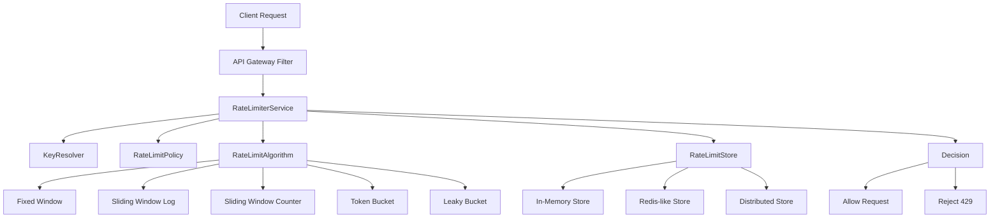
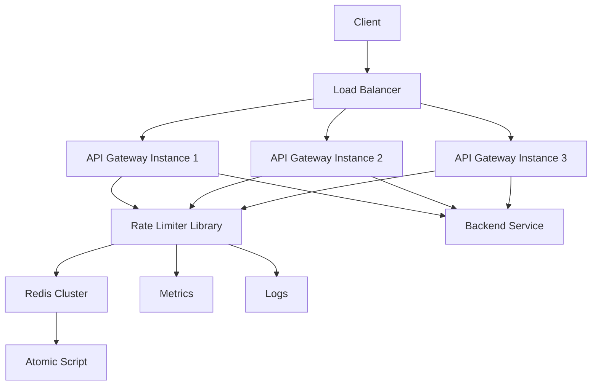

# 000_MINIRATELIMITER_INDEX

# MiniRateLimiter — Complete 20 Phase Journey

## Goal

Build a production-style rate limiter step by step in Java.

We will start from the simplest in-memory fixed window counter and gradually evolve it into a distributed, gateway-ready, observable rate limiter.

---

# Final Mental Model

```text
Client Request
      |
      v
API Gateway / Filter
      |
      v
Rate Limiter
      |
      +--> Key Resolver
      |       userId / apiKey / IP / route
      |
      +--> Algorithm
      |       fixed window / sliding window / token bucket
      |
      +--> Store
      |       in-memory / Redis-like / distributed
      |
      +--> Decision
              allowed / rejected / retry-after
```

---

# Final Architecture



---

# Phase 1 — Core Local Algorithms

## 001_Fixed_Window_Counter

Build the simplest rate limiter.

```text
key + current window -> count
```

Example:

```text
5 requests / 60 seconds
```

Concepts:

```text
HashMap
integer counter
time bucket
floor division
```

---

## 002_Sliding_Window_Log

Store timestamps of every request.

```text
userId -> queue of timestamps
```

Concepts:

```text
Queue
Deque
sliding window
remove old timestamps
```

---

## 003_Sliding_Window_Counter

Approximate sliding window using current and previous window.

```text
weightedCount = currentCount + previousCount * overlapRatio
```

Concepts:

```text
math approximation
time window
weighted average
```

---

## 004_Token_Bucket

Allow burst traffic using tokens.

```text
bucket capacity = 10
refill rate = 5 tokens / second
```

Concepts:

```text
greedy refill
min capacity
time delta
floating point rate
```

---

## 005_Leaky_Bucket

Smooth traffic at constant drain rate.

```text
incoming requests -> queue
queue drains at fixed rate
```

Concepts:

```text
queue
backpressure
constant rate processing
```

---

# Phase 2 — Key Design and Policies

## 006_Per_User_Rate_Limit

Apply rate limit per user.

```text
user:123 -> limit
```

Concepts:

```text
key generation
HashMap lookup
identity-based throttling
```

---

## 007_Per_API_Route_Rate_Limit

Apply different limits per API route.

```text
GET /orders -> 100/min
POST /payments -> 10/min
```

Concepts:

```text
compound key
route-based policy
map of policies
```

---

## 008_Per_Client_IP_Rate_Limit

Limit unauthenticated users by IP.

```text
ip:192.168.1.10 -> limit
```

Concepts:

```text
IP key
fallback identity
abuse protection
```

---

## 009_Rate_Limit_Policy_Model

Create reusable policy objects.

```java
limit
window
algorithm
scope
```

Concepts:

```text
object modeling
strategy pattern
configuration-driven design
```

---

# Phase 3 — Store Abstractions

## 010_In_Memory_Store

Extract storage behind interface.

```java
RateLimitStore
```

Concepts:

```text
interface design
HashMap
state encapsulation
```

---

## 011_Expiry_TTL

Automatically expire old keys.

```text
key expires after window ends
```

Concepts:

```text
TTL
lazy cleanup
time-based eviction
```

---

## 012_Atomic_Increment

Make counter update atomic.

```text
increment + check limit
```

Concepts:

```text
race condition
synchronized
ConcurrentHashMap
AtomicLong
```

---

# Phase 4 — Distributed Rate Limiting

## 013_Multi_Instance_Problem

Understand why local memory fails with multiple app instances.

```text
instance-1 count = 5
instance-2 count = 5
real total = 10
```

Concepts:

```text
distributed state
consistency
horizontal scaling
```

---

## 014_Redis_Like_Store

Simulate Redis-backed rate limiter.

```text
INCR key
EXPIRE key
```

Concepts:

```text
centralized counter
network store abstraction
shared state
```

---

## 015_Lua_Style_Atomic_Script

Make distributed increment + TTL atomic.

```text
INCR
if first request then EXPIRE
return allowed/rejected
```

Concepts:

```text
atomic script
compare-and-update
critical section
```

---

# Phase 5 — API Gateway Integration

## 016_Rate_Limit_Response_Model

Return structured decision.

```java
allowed
limit
remaining
retryAfterSeconds
resetTime
```

Concepts:

```text
response modeling
metadata calculation
```

---

## 017_HTTP_Headers

Add standard rate limit headers.

```text
X-RateLimit-Limit
X-RateLimit-Remaining
X-RateLimit-Reset
Retry-After
```

Concepts:

```text
protocol design
HTTP 429
client backoff
```

---

## 018_Spring_Boot_Filter

Integrate with Spring Boot API gateway/filter.

```text
request -> filter -> rate limiter -> controller
```

Concepts:

```text
filter chain
middleware
request interception
```

---

# Phase 6 — Production Readiness

## 019_Metrics_And_Logs

Add observability.

```text
allowed count
rejected count
latency
hot keys
```

Concepts:

```text
metrics
counters
logging
debuggability
```

---

## 020_Load_Test_And_Production_Design

Test with simulated load and finalize production architecture.

```text
k6 / JMeter style load test
multi-instance architecture
Redis cluster
fail-open / fail-closed
```

Concepts:

```text
load testing
capacity planning
high availability
failure mode design
```

---

# Complete Phase List

```text
001 Fixed Window Counter
002 Sliding Window Log
003 Sliding Window Counter
004 Token Bucket
005 Leaky Bucket

006 Per-User Rate Limit
007 Per-API Route Rate Limit
008 Per-Client IP Rate Limit
009 Rate Limit Policy Model

010 In-Memory Store
011 Expiry / TTL
012 Atomic Increment

013 Multi-Instance Problem
014 Redis-like Store
015 Lua-style Atomic Script

016 Rate Limit Response Model
017 HTTP Headers
018 Spring Boot Filter

019 Metrics and Logs
020 Load Test and Production Design
```

---

# CP/DSA Concepts Covered

```text
HashMap
ConcurrentHashMap
AtomicLong
Queue
Deque
Sliding Window
Greedy
Modulo / time bucket
Lazy deletion
TTL eviction
Composite key
Strategy pattern
Race condition
Critical section
Distributed counter
```

---

# System Design Concepts Covered

```text
API throttling
abuse prevention
fair usage
burst control
backpressure
distributed consistency
Redis atomic operations
gateway filter
HTTP 429
Retry-After
observability
load testing
failure mode design
```

---

# Final Production Architecture



---

# Learning Style For Each Phase

Each phase should include:

```text
1. Goal
2. What changed from previous phase
3. Theory
4. CP/DSA concepts
5. Mermaid diagrams
6. Complete Java code from top to bottom
7. Driver class
8. Dry run
9. Expected output
10. Completion checklist
11. Next phase bridge
```

---

# Recommended Build Order

Start with:

```text
001_Fixed_Window_Counter.md
```

Then continue one phase at a time.

Do not jump directly to distributed Redis version.

The best learning path is:

```text
local algorithm
       |
       v
clean abstraction
       |
       v
concurrency correctness
       |
       v
distributed correctness
       |
       v
gateway integration
       |
       v
production readiness
```

---

# Final Outcome

After completing this MiniRateLimiter, you should be able to explain and implement:

```text
fixed window
sliding window
token bucket
leaky bucket
distributed counters
Redis atomic scripts
API gateway throttling
rate limit headers
retry-after behavior
metrics and production tradeoffs
```

This is enough to discuss rate limiter system design confidently in senior backend and FAANG-style interviews.
