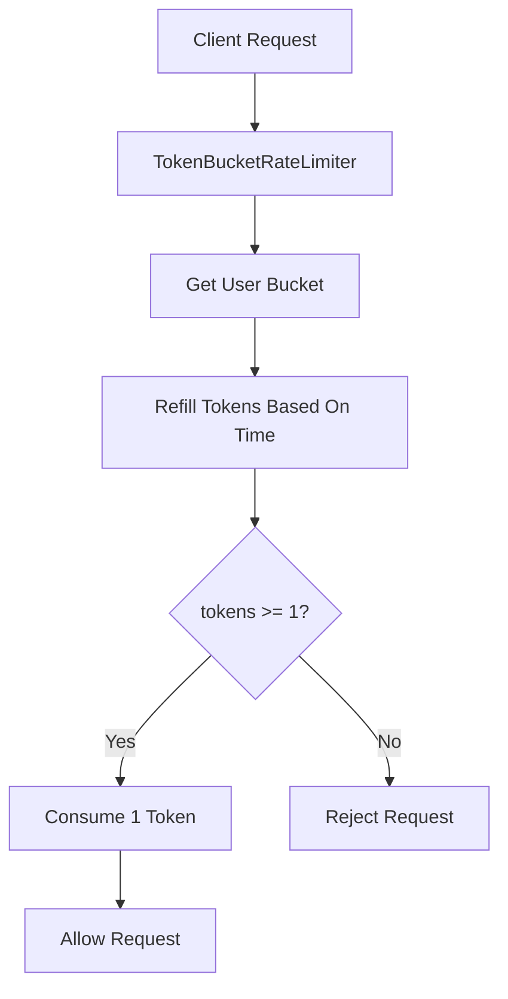
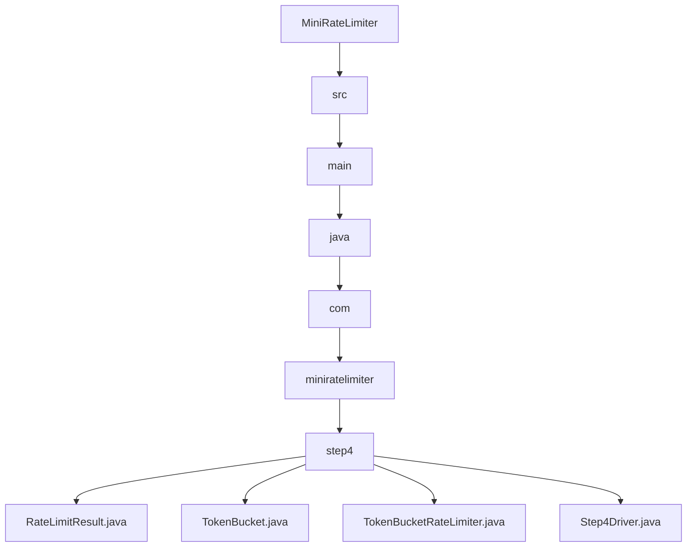

# 004_Token_Bucket

# MiniRateLimiter Step 4 — Token Bucket

## Goal

In Step 3, we built:

```text
Sliding Window Counter
```

Now we move to one of the most common real-world rate limiter algorithms:

```text
Token Bucket
```

Token Bucket supports:

```text
controlled burst traffic
```

Example:

```text
bucket capacity = 5 tokens
refill rate = 1 token per second
```

Meaning:

```text
user can send burst of 5 requests immediately
then user gets 1 new request allowance per second
```

---

# Delta From Step 3

```text
Step 3:
userId -> WindowCounter

Step 4:
userId -> TokenBucket
```

Step 3 estimates request count using current and previous windows.

Step 4 tracks available permission tokens.

---

# Why Token Bucket?

Token Bucket is popular because traffic is not always smooth.

Example:

```text
capacity = 10
refill rate = 2 tokens/sec
```

User can send:

```text
10 requests instantly
```

Then after that:

```text
2 requests per second
```

This is useful for real APIs because short bursts are normal.

---

# Core Idea

Each user has a bucket.

The bucket contains tokens.

```text
1 request costs 1 token
```

If bucket has token:

```text
consume token
allow request
```

If bucket is empty:

```text
reject request
```

Tokens refill over time.

---

# Architecture Mermaid Diagram



---

# Token Bucket Visualization

```text
capacity = 5
refill rate = 1 token/sec
```

```text
start:
[● ● ● ● ●] 5 tokens

request:
[● ● ● ● ○] 4 tokens

after 2 seconds:
[● ● ● ● ●] refilled to max capacity
```

Bucket never exceeds capacity.

```text
tokens = min(capacity, tokens + generatedTokens)
```

---

# Detailed Steps Before Code

## Step 1 — Create TokenBucket

For each user, store:

```text
capacity
availableTokens
lastRefillTimeMillis
```

## Step 2 — Refill before every request

Before checking request:

```text
elapsedTime = now - lastRefillTime
tokensToAdd = elapsedTime * refillRatePerMillis
availableTokens = min(capacity, availableTokens + tokensToAdd)
lastRefillTime = now
```

## Step 3 — Allow if token exists

If:

```text
availableTokens >= 1
```

then:

```text
availableTokens--
allow
```

else:

```text
reject
```

## Step 4 — Return result

Return:

```text
allowed
capacity
availableTokens
retryAfterMillis
```

---

# CP/DSA Concepts Used

## 1. Greedy Refill

At each request, refill as much as possible based on elapsed time.

```java
tokensToAdd = elapsedMillis * refillRatePerMillis;
```

This is greedy because we always bring the bucket to its latest valid state.

## 2. State Simulation

Each user has state:

```text
tokens
lastRefillTime
```

Every request updates state.

This is like simulation problems in CP.

## 3. Clamp / Min Capacity

Bucket cannot exceed capacity.

```java
availableTokens = Math.min(capacity, availableTokens + tokensToAdd);
```

## 4. HashMap State Store

```java
Map<String, TokenBucket> buckets;
```

Maps:

```text
userId -> token bucket state
```

## 5. O(1) Per Request

Only constant-time math.

No queue.

No scanning.

---

# Time Complexity

```text
O(1) per request
```

# Space Complexity

```text
O(number of active users)
```

---

# Sliding Window Counter vs Token Bucket

| Feature | Sliding Window Counter | Token Bucket |
|---|---:|---:|
| Smoothness | Good | Good |
| Burst support | Limited | Strong |
| Memory | Low | Low |
| Common API usage | Yes | Very common |
| Easy retry-after | Medium | Easy |

---

# Folder Structure

```text
MiniRateLimiter/
└── src/main/java/com/miniratelimiter/step4/
    ├── RateLimitResult.java
    ├── TokenBucket.java
    ├── TokenBucketRateLimiter.java
    └── Step4Driver.java
```

---

# Folder Mermaid Diagram



---

# Complete Java Code

---

# RateLimitResult.java

```java
package com.miniratelimiter.step4;

public class RateLimitResult {

    // True if request is allowed.
    private final boolean allowed;

    // Maximum bucket capacity.
    private final int limit;

    // Current available tokens after decision.
    private final double availableTokens;

    // Milliseconds client should wait before retry.
    private final long retryAfterMillis;

    public RateLimitResult(boolean allowed, int limit, double availableTokens, long retryAfterMillis) {
        this.allowed = allowed;
        this.limit = limit;
        this.availableTokens = availableTokens;
        this.retryAfterMillis = retryAfterMillis;
    }

    public boolean isAllowed() {
        return allowed;
    }

    public int getLimit() {
        return limit;
    }

    public double getAvailableTokens() {
        return availableTokens;
    }

    public long getRetryAfterMillis() {
        return retryAfterMillis;
    }

    @Override
    public String toString() {
        return "RateLimitResult{" +
                "allowed=" + allowed +
                ", limit=" + limit +
                ", availableTokens=" + availableTokens +
                ", retryAfterMillis=" + retryAfterMillis +
                '}';
    }
}
```

---

# TokenBucket.java

```java
package com.miniratelimiter.step4;

public class TokenBucket {

    // Maximum tokens bucket can hold.
    private final int capacity;

    // Current available tokens.
    private double availableTokens;

    // Last time tokens were refilled.
    private long lastRefillTimeMillis;

    public TokenBucket(int capacity, long createdAtMillis) {
        this.capacity = capacity;
        this.availableTokens = capacity;
        this.lastRefillTimeMillis = createdAtMillis;
    }

    public int getCapacity() {
        return capacity;
    }

    public double getAvailableTokens() {
        return availableTokens;
    }

    public long getLastRefillTimeMillis() {
        return lastRefillTimeMillis;
    }

    public void refill(double tokensToAdd, long currentTimeMillis) {
        availableTokens = Math.min(capacity, availableTokens + tokensToAdd);
        lastRefillTimeMillis = currentTimeMillis;
    }

    public void consumeOneToken() {
        availableTokens = availableTokens - 1.0;
    }

    public boolean hasToken() {
        return availableTokens >= 1.0;
    }

    @Override
    public String toString() {
        return "TokenBucket{" +
                "capacity=" + capacity +
                ", availableTokens=" + availableTokens +
                ", lastRefillTimeMillis=" + lastRefillTimeMillis +
                '}';
    }
}
```

---

# TokenBucketRateLimiter.java

```java
package com.miniratelimiter.step4;

import java.util.HashMap;
import java.util.Map;

public class TokenBucketRateLimiter {

    // Maximum burst size.
    private final int capacity;

    // Tokens added per millisecond.
    private final double refillRatePerMillis;

    // userId -> token bucket state
    private final Map<String, TokenBucket> buckets;

    public TokenBucketRateLimiter(int capacity, double refillTokensPerSecond) {
        if (capacity <= 0) {
            throw new IllegalArgumentException("Capacity should be positive");
        }

        if (refillTokensPerSecond <= 0) {
            throw new IllegalArgumentException("Refill rate should be positive");
        }

        this.capacity = capacity;
        this.refillRatePerMillis = refillTokensPerSecond / 1000.0;
        this.buckets = new HashMap<>();
    }

    public RateLimitResult allowRequest(String userId, long currentTimeMillis) {
        TokenBucket bucket = buckets.computeIfAbsent(userId, key -> new TokenBucket(capacity, currentTimeMillis));

        refillBucket(bucket, currentTimeMillis);

        if (!bucket.hasToken()) {
            long retryAfterMillis = calculateRetryAfterMillis(bucket);
            return new RateLimitResult(false, capacity, bucket.getAvailableTokens(), retryAfterMillis);
        }

        bucket.consumeOneToken();

        return new RateLimitResult(true, capacity, bucket.getAvailableTokens(), 0);
    }

    private void refillBucket(TokenBucket bucket, long currentTimeMillis) {
        long elapsedMillis = currentTimeMillis - bucket.getLastRefillTimeMillis();

        if (elapsedMillis <= 0) {
            return;
        }

        double tokensToAdd = elapsedMillis * refillRatePerMillis;

        bucket.refill(tokensToAdd, currentTimeMillis);
    }

    private long calculateRetryAfterMillis(TokenBucket bucket) {
        double missingTokens = 1.0 - bucket.getAvailableTokens();

        return (long) Math.ceil(missingTokens / refillRatePerMillis);
    }

    public Map<String, TokenBucket> getBucketsSnapshot() {
        return new HashMap<>(buckets);
    }
}
```

---

# Step4Driver.java

```java
package com.miniratelimiter.step4;

public class Step4Driver {

    public static void main(String[] args) {
        int capacity = 5;
        double refillTokensPerSecond = 1.0;

        TokenBucketRateLimiter rateLimiter =
                new TokenBucketRateLimiter(capacity, refillTokensPerSecond);

        String userId = "user-1";

        System.out.println("---- BURST REQUESTS ----");

        long startTime = 0;

        for (int i = 1; i <= 7; i++) {
            RateLimitResult result = rateLimiter.allowRequest(userId, startTime);

            System.out.println("request=" + i + ", time=" + startTime + ", result=" + result);
        }

        System.out.println();
        System.out.println("---- AFTER 2 SECONDS ----");

        long afterTwoSeconds = 2_000;

        for (int i = 1; i <= 3; i++) {
            RateLimitResult result = rateLimiter.allowRequest(userId, afterTwoSeconds);

            System.out.println("requestAfterRefill=" + i + ", time=" + afterTwoSeconds + ", result=" + result);
        }

        System.out.println();
        System.out.println("---- BUCKET SNAPSHOT ----");
        System.out.println(rateLimiter.getBucketsSnapshot());
    }
}
```

---

# CP/DSA Pattern Code

## Problem

Simulate a bucket:

```text
capacity = 5
refill = 1 token/sec
```

Requests arrive at fixed times.

---

## DSA/CP Java Code

```java
public class TokenBucketCP {

    public static void main(String[] args) {
        int capacity = 5;
        double tokens = 5.0;
        double refillPerSecond = 1.0;

        long lastTime = 0;

        long[] requestTimes = {
                0,
                0,
                0,
                0,
                0,
                0,
                2,
                2,
                2
        };

        for (long currentTime : requestTimes) {
            long elapsed = currentTime - lastTime;

            tokens = Math.min(capacity, tokens + elapsed * refillPerSecond);
            lastTime = currentTime;

            boolean allowed = tokens >= 1.0;

            if (allowed) {
                tokens = tokens - 1.0;
            }

            System.out.println("time=" + currentTime + ", tokens=" + tokens + ", allowed=" + allowed);
        }
    }
}
```

---

# Dry Run

Configuration:

```text
capacity = 5
refill = 1 token/sec
```

At time 0:

```text
tokens = 5
```

Seven requests arrive instantly:

```text
request 1 -> allowed, tokens 4
request 2 -> allowed, tokens 3
request 3 -> allowed, tokens 2
request 4 -> allowed, tokens 1
request 5 -> allowed, tokens 0
request 6 -> rejected
request 7 -> rejected
```

After 2 seconds:

```text
tokens refill by 2
```

Now:

```text
tokens = 2
```

Next two requests allowed.

Third rejected.

---

# Run Command

```bash
javac -d out src/main/java/com/miniratelimiter/step4/*.java

java -cp out com.miniratelimiter.step4.Step4Driver
```

---

# Expected Output Pattern

```text
---- BURST REQUESTS ----
request=1, time=0, result=RateLimitResult{allowed=true, limit=5, availableTokens=4.0, retryAfterMillis=0}
...
request=6, time=0, result=RateLimitResult{allowed=false, limit=5, availableTokens=0.0, retryAfterMillis=1000}

---- AFTER 2 SECONDS ----
requestAfterRefill=1, time=2000, result=RateLimitResult{allowed=true, limit=5, availableTokens=1.0, retryAfterMillis=0}
```

---

# Important Observation

Token Bucket allows burst traffic.

That is why it is commonly used in:

```text
API gateways
load balancers
Nginx
Envoy
Redis-based distributed limiters
```

---

# Current MiniRateLimiter State

```text
Supported:
[yes] fixed window counter
[yes] sliding window log
[yes] sliding window counter
[yes] token bucket
[yes] burst control
[yes] retry-after calculation

Not yet:
[no] leaky bucket
[no] concurrency safety
[no] distributed Redis store
[no] Spring Boot integration
```

---

# Step 4 Completion Checklist

```text
[ ] You understand token bucket
[ ] You understand capacity
[ ] You understand refill rate
[ ] You understand burst allowance
[ ] You understand greedy refill
[ ] You understand retryAfterMillis
```

---

# Final Mental Model

```text
Token Bucket =
available permission tokens + time-based refill
```

```text
request allowed if token exists
```

---

# Next Step

Next we build:

```text
005_Leaky_Bucket
```

Leaky Bucket smooths traffic at a constant drain rate.
