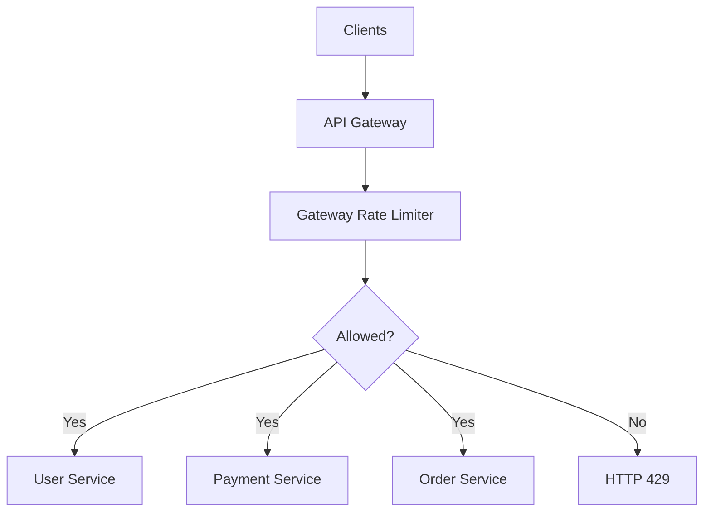
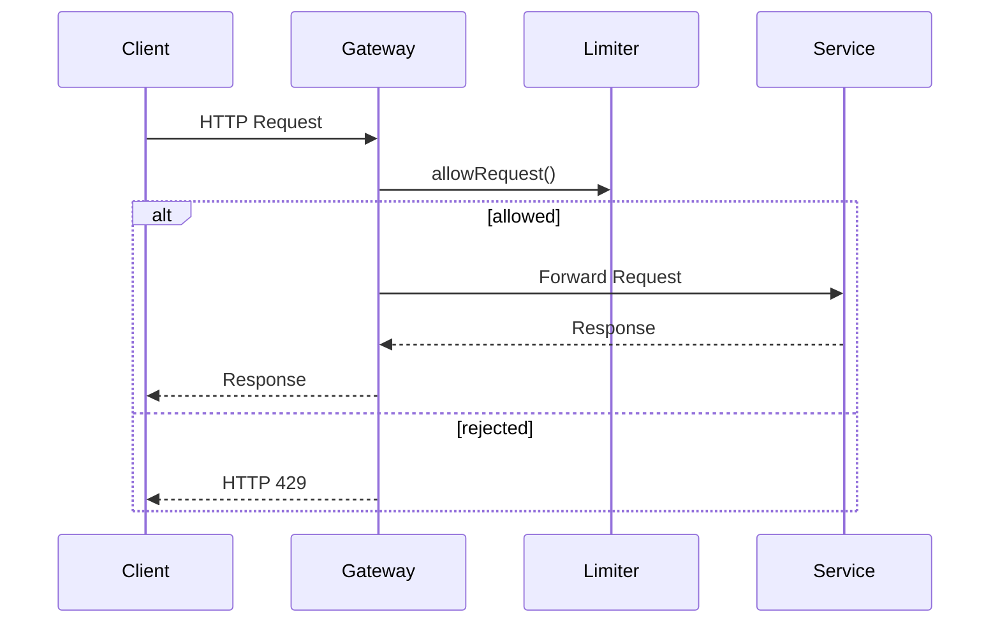

# 012_API_Gateway_Rate_Limiter

# MiniRateLimiter Step 12 — API Gateway Rate Limiter

---

# Clickable Index

1. [Goal](#goal)  
2. [Why Gateway-Level Rate Limiting?](#why-gateway-level-rate-limiting)  
3. [Problem Without Gateway Limiting](#problem-without-gateway-limiting)  
4. [Real World Example](#real-world-example)  
5. [Core Idea](#core-idea)  
6. [Gateway Architecture Mermaid Diagram](#gateway-architecture-mermaid-diagram)  
7. [Gateway Request Flow Mermaid Diagram](#gateway-request-flow-mermaid-diagram)  
8. [Detailed Steps Before Code](#detailed-steps-before-code)  
9. [CP/DSA Concepts Used](#cpdsa-concepts-used)  
10. [Time Complexity](#time-complexity)  
11. [Space Complexity](#space-complexity)  
12. [Service-Level vs Gateway-Level Limiting](#service-level-vs-gateway-level-limiting)  
13. [Folder Structure](#folder-structure)  
14. [Folder Mermaid Diagram](#folder-mermaid-diagram)  
15. [Complete Java Code](#complete-java-code)  
16. [CP/DSA Pattern Code](#cpdsa-pattern-code)  
17. [Dry Run](#dry-run)  
18. [Run Command](#run-command)  
19. [Expected Output Pattern](#expected-output-pattern)  
20. [Important Observation](#important-observation)  
21. [Current MiniRateLimiter State](#current-miniratelimiter-state)  
22. [Step 12 Completion Checklist](#step-12-completion-checklist)  
23. [Final Mental Model](#final-mental-model)  
24. [Next Step](#next-step)  

---

# Goal

Until now, rate limiting happened:

```text
inside one service
```

Now we move limiter to:

```text
API Gateway
```

This is how modern architectures work.

Instead of every microservice having its own limiter:

```text
central gateway handles all requests
```

---

# Why Gateway-Level Rate Limiting?

Without gateway limiting:

```text
every service implements limiter separately
```

Problems:

```text
duplicate logic
inconsistent policies
hard maintenance
wasted resources
```

With API Gateway:

```text
single centralized protection layer
```

---

# Problem Without Gateway Limiting

Architecture:

```text
Client
   |
Service A
Service B
Service C
```

Every service independently handles:

```text
authentication
rate limiting
logging
security
```

This duplicates logic everywhere.

---

# Real World Example

Real systems:

```text
Kong
Envoy
NGINX
Spring Cloud Gateway
AWS API Gateway
Cloudflare
```

apply rate limiting at gateway layer.

Gateway protects:

```text
all downstream services
```

---

# Core Idea

Flow:

```text
Client
   ->
Gateway
   ->
Rate Limiter
   ->
Route Request
   ->
Microservice
```

If request exceeds limit:

```text
blocked at gateway
```

Downstream service never sees request.

---

# Gateway Architecture Mermaid Diagram



---

# Gateway Request Flow Mermaid Diagram



---

# Detailed Steps Before Code

## Step 1 — Create gateway request object

Represents incoming API request.

---

## Step 2 — Create gateway rate limiter

Limiter executes before routing.

---

## Step 3 — Match route

Gateway determines:

```text
which service should receive request
```

---

## Step 4 — Apply rate limiting

Reject excessive traffic early.

---

## Step 5 — Forward allowed request

Gateway routes request to service.

---

## Step 6 — Return response

Gateway returns service response to client.

---

# CP/DSA Concepts Used

## 1. Pipeline Processing

Request passes through ordered stages.

---

## 2. Router Pattern

Gateway maps route to target service.

---

## 3. Centralized Protection

Single gateway protects multiple services.

---

## 4. Early Rejection Optimization

Reject bad requests before expensive work.

---

## 5. HashMap Route Registry

```java
Map<String, ServiceHandler>
```

Maps:

```text
route -> service
```

---

# Time Complexity

Gateway route lookup:

```text
O(1)
```

Limiter lookup:

```text
O(1)
```

---

# Space Complexity

```text
O(active users + routes)
```

---

# Service-Level vs Gateway-Level Limiting

| Feature | Service-Level | Gateway-Level |
|---|---:|---:|
| Centralized | No | Yes |
| Duplicate Logic | High | Low |
| Easier Management | No | Yes |
| Downstream Protection | Weak | Strong |
| Real Production Usage | Limited | Very common |

---

# Folder Structure

```text
MiniRateLimiter/
└── src/main/java/com/miniratelimiter/step12/
    ├── GatewayRequest.java
    ├── GatewayResponse.java
    ├── GatewayRateLimiter.java
    ├── ServiceHandler.java
    ├── ApiGateway.java
    └── Step12Driver.java
```

---

# Folder Mermaid Diagram

```mermaid
flowchart TD
    A[MiniRateLimiter] --> B[src]
    B --> C[main]
    C --> D[java]
    D --> E[com]
    E --> F[miniratelimiter]
    F --> G[step12]

    G --> H[GatewayRequest.java]
    G --> I[GatewayResponse.java]
    G --> J[GatewayRateLimiter.java]
    G --> K[ServiceHandler.java]
    G --> L[ApiGateway.java]
    G --> M[Step12Driver.java]
```



---

# Complete Java Code

---

# GatewayRequest.java

```java
package com.miniratelimiter.step12;

/*
 * Logic:
 *
 * 1. Represent incoming API request.
 * 2. Store route path.
 * 3. Store client identity.
 *
 * Time Complexity:
 * O(1)
 */
public class GatewayRequest {

    private final String route;

    private final String clientId;

    public GatewayRequest(
            String route,
            String clientId
    ) {

        this.route = route;
        this.clientId = clientId;
    }

    public String getRoute() {
        return route;
    }

    public String getClientId() {
        return clientId;
    }
}
```

---

# GatewayResponse.java

```java
package com.miniratelimiter.step12;

/*
 * Logic:
 *
 * 1. Represent gateway response.
 * 2. Store status code.
 * 3. Store response body.
 *
 * Time Complexity:
 * O(1)
 */
public class GatewayResponse {

    private final int statusCode;

    private final String body;

    public GatewayResponse(
            int statusCode,
            String body
    ) {

        this.statusCode = statusCode;
        this.body = body;
    }

    public int getStatusCode() {
        return statusCode;
    }

    public String getBody() {
        return body;
    }

    @Override
    public String toString() {
        return "GatewayResponse{" +
                "statusCode=" + statusCode +
                ", body='" + body + '\'' +
                '}';
    }
}
```

---

# GatewayRateLimiter.java

```java
package com.miniratelimiter.step12;

import java.util.HashMap;
import java.util.Map;

/*
 * Logic:
 *
 * 1. Track request counts per client.
 * 2. Apply centralized gateway limit.
 * 3. Reject excessive requests before routing.
 *
 * Time Complexity:
 * O(1)
 */
public class GatewayRateLimiter {

    // clientId -> request count
    private final Map<String, Integer> counters;

    // Global request limit
    private final int limit;

    public GatewayRateLimiter(int limit) {

        if (limit <= 0) {
            throw new IllegalArgumentException("Limit should be positive");
        }

        this.limit = limit;

        this.counters = new HashMap<>();
    }

    public synchronized boolean allowRequest(
            String clientId
    ) {

        int count =
                counters.getOrDefault(clientId, 0);

        count++;

        counters.put(clientId, count);

        return count <= limit;
    }
}
```

---

# ServiceHandler.java

```java
package com.miniratelimiter.step12;

/*
 * Logic:
 *
 * 1. Simulate downstream microservice.
 * 2. Process forwarded request.
 *
 * Real systems:
 *
 * UserService
 * PaymentService
 * OrderService
 */
public class ServiceHandler {

    private final String serviceName;

    public ServiceHandler(String serviceName) {
        this.serviceName = serviceName;
    }

    public GatewayResponse handle(
            GatewayRequest request
    ) {

        return new GatewayResponse(
                200,
                serviceName +
                " handled route=" +
                request.getRoute()
        );
    }
}
```

---

# ApiGateway.java

```java
package com.miniratelimiter.step12;

import java.util.HashMap;
import java.util.Map;

/*
 * Logic:
 *
 * 1. Accept incoming requests.
 * 2. Execute centralized rate limiting.
 * 3. Resolve route -> service mapping.
 * 4. Forward request to target service.
 * 5. Return service response.
 *
 * Core Idea:
 *
 * Gateway protects downstream services.
 *
 * Time Complexity:
 * O(1)
 */
public class ApiGateway {

    // Central gateway limiter.
    private final GatewayRateLimiter rateLimiter;

    // route -> service handler
    private final Map<String, ServiceHandler> routes;

    public ApiGateway(
            GatewayRateLimiter rateLimiter
    ) {

        this.rateLimiter = rateLimiter;

        this.routes = new HashMap<>();
    }

    public void registerRoute(
            String route,
            ServiceHandler serviceHandler
    ) {

        routes.put(route, serviceHandler);
    }

    public GatewayResponse handleRequest(
            GatewayRequest request
    ) {

        boolean allowed =
                rateLimiter.allowRequest(
                        request.getClientId()
                );

        if (!allowed) {

            return new GatewayResponse(
                    429,
                    "Too Many Requests"
            );
        }

        ServiceHandler serviceHandler =
                routes.get(request.getRoute());

        if (serviceHandler == null) {

            return new GatewayResponse(
                    404,
                    "Route Not Found"
            );
        }

        return serviceHandler.handle(request);
    }
}
```

---

# Step12Driver.java

```java
package com.miniratelimiter.step12;

/*
 * Logic:
 *
 * 1. Create API gateway.
 * 2. Register routes/services.
 * 3. Send requests through gateway.
 * 4. Observe centralized rate limiting.
 */
public class Step12Driver {

    public static void main(String[] args) {

        GatewayRateLimiter limiter =
                new GatewayRateLimiter(5);

        ApiGateway gateway =
                new ApiGateway(limiter);

        gateway.registerRoute(
                "/users",
                new ServiceHandler("UserService")
        );

        gateway.registerRoute(
                "/payments",
                new ServiceHandler("PaymentService")
        );

        String clientId = "client-1";

        System.out.println(
                "---- API GATEWAY REQUESTS ----"
        );

        for (int i = 1; i <= 7; i++) {

            String route =
                    (i % 2 == 0)
                    ? "/users"
                    : "/payments";

            GatewayRequest request =
                    new GatewayRequest(
                            route,
                            clientId
                    );

            GatewayResponse response =
                    gateway.handleRequest(request);

            System.out.println(
                    "request=" + i +
                    ", route=" + route +
                    ", response=" + response
            );
        }
    }
}
```

---

# CP/DSA Pattern Code

## Problem

Route request using HashMap registry.

---

## DSA/CP Java Code

```java
import java.util.HashMap;
import java.util.Map;

public class RouterCP {

    public static void main(String[] args) {

        Map<String, String> routes =
                new HashMap<>();

        routes.put("/users", "UserService");

        routes.put("/payments", "PaymentService");

        String route = "/users";

        String service =
                routes.get(route);

        System.out.println(
                "Route forwarded to " +
                service
        );
    }
}
```

---

# Dry Run

Client sends:

```text
/users
/payments
/users
```

Flow:

```text
Client
    ->
Gateway
    ->
Limiter
    ->
Route Lookup
    ->
Service
```

First 5 requests:

```text
allowed
```

Requests 6 and 7:

```http
429 Too Many Requests
```

blocked at gateway.

---

# Run Command

```bash
javac -d out src/main/java/com/miniratelimiter/step12/*.java

java -cp out com.miniratelimiter.step12.Step12Driver
```

---

# Expected Output Pattern

```text
request=1, route=/payments, response=200
request=2, route=/users, response=200
...
request=6, response=429
request=7, response=429
```

---

# Important Observation

Gateway-level rate limiting protects:

```text
all downstream services
```

This reduces:

```text
duplicate logic
backend overload
security risk
```

This is how modern API infrastructures work.

---

# Current MiniRateLimiter State

```text
Supported:
[yes] fixed window counter
[yes] sliding window log
[yes] sliding window counter
[yes] token bucket
[yes] leaky bucket
[yes] thread-safe limiter
[yes] Redis distributed limiter
[yes] Redis Lua atomic limiter
[yes] policy model
[yes] HTTP headers
[yes] Spring Boot filter
[yes] API gateway rate limiting

Not yet:
[no] per-user override policies
[no] metrics dashboards
[no] distributed tracing
[no] production deployment
```

---

# Step 12 Completion Checklist

```text
[ ] You understand API gateways
[ ] You understand centralized rate limiting
[ ] You understand route forwarding
[ ] You understand service routing
[ ] You understand gateway protection
[ ] You understand early request rejection
```

---

# Final Mental Model

```text
API Gateway =
central traffic control layer
```

```text
gateway protects all downstream services
```

---

# Next Step

Next we build:

```text
013_Per_User_And_Per_IP_Limits
```

We will support:

```text
multiple scopes and identities
```
