# 009_Query_Execution_Pipeline.md

# MiniDatabase — 009 Query Execution Pipeline

## 0. Why This File Exists

Most developers write:

```sql
SELECT * FROM users WHERE id = 10;
```

and think:

```text
database finds row and returns it
```

But internally a database runs a complete pipeline:

```text
SQL text
    ↓
parser
    ↓
semantic analyzer
    ↓
logical plan
    ↓
optimizer
    ↓
physical plan
    ↓
execution engine
    ↓
storage engine
    ↓
pages / records
    ↓
result
```

This file connects previous files:

```text
table
row
record
page
hash index
BTree
LSM tree
```

into the real question:

```text
How does SELECT actually run?
```

---

# 1. One-Line Definition

```text
Query execution pipeline is the internal path a database follows
to convert SQL text into an optimized execution plan and return rows.
```

Simple meaning:

```text
SQL is compiled into a plan,
then the plan is executed.
```

---

# 2. Biggest Mental Model

A database query engine is like:

```text
compiler + optimizer + runtime engine + storage engine
```

SQL is not directly executed.

It is processed.

---

# 3. Full Query Pipeline

```text
SQL Query
   ↓
Tokenizer
   ↓
Parser
   ↓
Semantic Analyzer
   ↓
Logical Plan
   ↓
Optimizer
   ↓
Physical Plan
   ↓
Execution Engine
   ↓
Storage Engine
   ↓
Buffer Pool
   ↓
Pages / Records
   ↓
Result Set
```

---

# 4. Mermaid — Full Query Pipeline

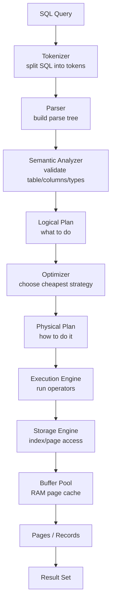

---

# 5. Example Query

```sql
SELECT name, age
FROM users
WHERE id = 10;
```

Human sees:

```text
get name and age for user id 10
```

Database sees:

```text
parse
validate
choose index
load page
decode record
project columns
return result
```

---

# 6. Stage 1 — Tokenizer

Tokenizer breaks SQL string into tokens.

Input:

```sql
SELECT name FROM users WHERE id = 10;
```

Tokens:

```text
SELECT
name
FROM
users
WHERE
id
=
10
;
```

---

# 7. Tokenizer Mental Model

```text
Raw SQL string
      ↓
small meaningful words/symbols
```

Like compiler lexical analysis.

---

# 8. Stage 2 — Parser

Parser checks SQL grammar.

Example:

```sql
SELECT name FROM users WHERE id = 10;
```

Parser builds structure:

```text
SELECT
  projection: name
  from: users
  filter: id = 10
```

---

# 9. Parser Error Example

Bad SQL:

```sql
SELEC name FROM users;
```

Parser fails because:

```text
SELEC is not SELECT
```

This is syntax error.

---

# 10. Parse Tree Mental Model

```text
SELECT
├── Projection: name, age
├── From: users
└── Where:
    └── id = 10
```

This is tree form of SQL.

---

# 11. Mermaid — Parse Tree

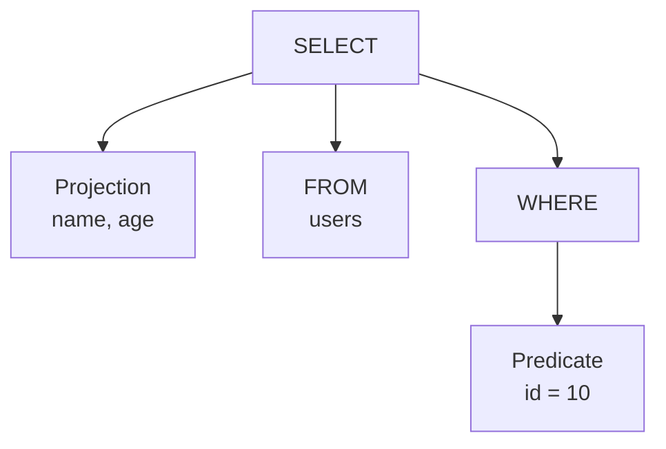

---

# 12. Stage 3 — Semantic Analyzer

Syntax can be correct but meaning can be wrong.

Semantic analyzer checks:

```text
does table exist?
does column exist?
is type valid?
does user have permission?
are functions valid?
```

---

# 13. Semantic Error Example

```sql
SELECT salary FROM users;
```

If `salary` column does not exist:

```text
syntax is valid
semantic validation fails
```

Error:

```text
column salary does not exist
```

---

# 14. Stage 4 — Logical Plan

Logical plan describes:

```text
what operations are needed
```

without choosing exact physical algorithm.

For query:

```sql
SELECT name, age
FROM users
WHERE id = 10;
```

Logical plan:

```text
Projection(name, age)
    ↓
Filter(id = 10)
    ↓
Scan(users)
```

---

# 15. Mermaid — Logical Plan

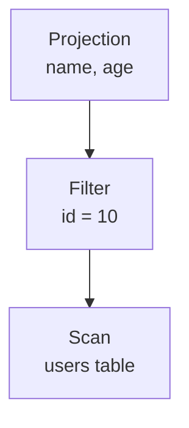

---

# 16. Logical Plan Mental Model

Logical plan answers:

```text
WHAT should happen?
```

Example:

```text
scan users
filter id=10
return name and age
```

But it does not yet decide:

```text
table scan or index scan?
```

That is optimizer's job.

---

# 17. Stage 5 — Optimizer

Optimizer chooses the best execution strategy.

It decides:

```text
table scan?
index scan?
hash join?
nested loop join?
merge join?
sort or use index order?
```

Goal:

```text
lowest estimated cost
```

---

# 18. Optimizer Mental Model

Same query can run many ways.

Example query:

```sql
SELECT * FROM users WHERE id = 10;
```

Possible plans:

```text
Plan A: scan full table
Plan B: use hash index
Plan C: use BTree index
```

Optimizer chooses cheapest.

---

# 19. Cost-Based Optimization

Optimizer estimates:

```text
rows read
disk pages read
CPU cost
memory cost
join cost
sort cost
```

Then chooses lowest cost plan.

---

# 20. Statistics

Optimizer depends on statistics:

```text
table row count
number of distinct values
histograms
index selectivity
null count
data distribution
```

Bad statistics can cause bad plans.

---

# 21. Selectivity

Selectivity means:

```text
how much data predicate filters out
```

High selectivity:

```sql
WHERE id = 10
```

returns few rows.

Low selectivity:

```sql
WHERE country = 'India'
```

may return many rows.

---

# 22. Index Scan vs Table Scan Decision

## Index Scan

Good when:

```text
few rows needed
predicate highly selective
index exists
```

## Table Scan

Good when:

```text
large percentage of table needed
small table
index not useful
```

---

# 23. Mermaid — Optimizer Decision

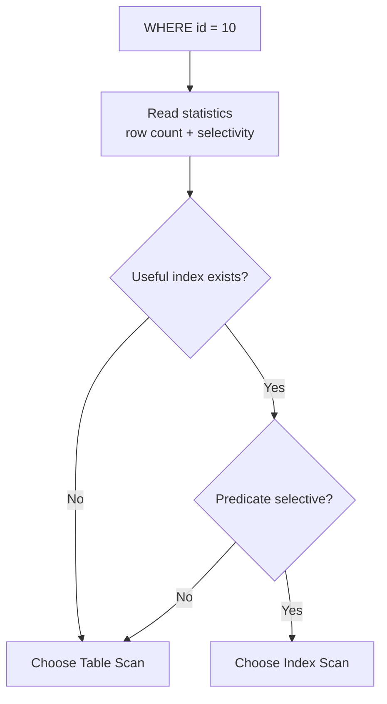

---

# 24. Stage 6 — Physical Plan

Physical plan says:

```text
HOW exactly to execute
```

Example:

```text
IndexScan(users_pkey on id=10)
    ↓
Projection(name, age)
```

This is executable.

---

# 25. Physical Plan Example

```text
Projection(name, age)
    ↓
Index Scan using users_pkey
    ↓
RID(page=100, slot=3)
```

---

# 26. Stage 7 — Execution Engine

Execution engine runs the physical plan.

It uses operators:

```text
TableScan
IndexScan
Filter
Projection
Sort
HashJoin
NestedLoopJoin
Aggregate
Limit
```

Operators produce rows.

---

# 27. Volcano Iterator Model

Many databases use iterator model.

Each operator has:

```text
next()
```

Parent asks child for next row.

---

# 28. Mermaid — Iterator Model

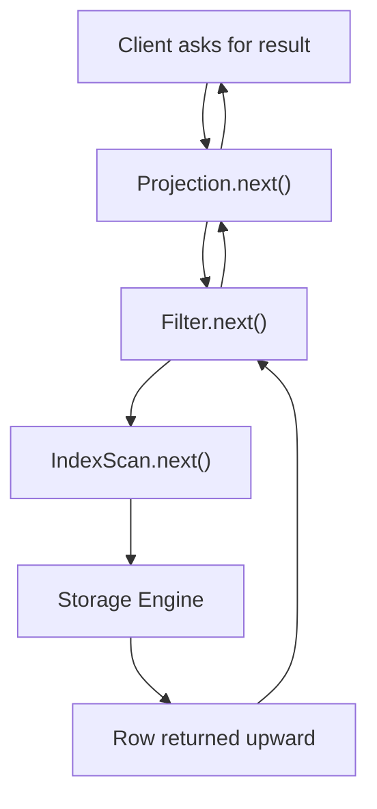

Mental model:

```text
rows flow upward
requests flow downward
```

---

# 29. Table Scan Operator

Table scan reads all table pages.

Flow:

```text
open table file
    ↓
read page 1
    ↓
decode records
    ↓
apply filter
    ↓
read page 2
    ↓
repeat
```

---

# 30. Mermaid — Table Scan

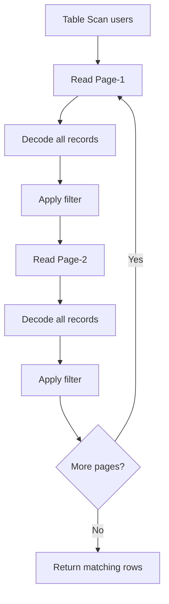

Cost:

```text
O(N)
```

---

# 31. Index Scan Operator

Index scan uses index to find row location.

Flow:

```text
search index
    ↓
get RID
    ↓
load page
    ↓
read slot
    ↓
decode record
```

---

# 32. Mermaid — Index Scan

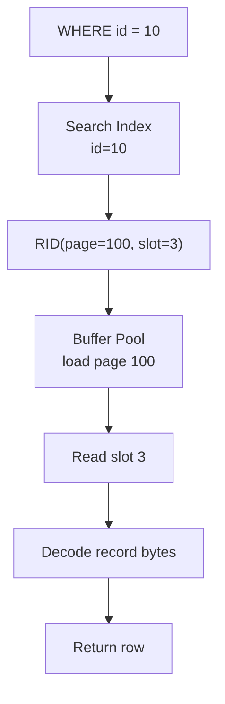

Cost:

```text
O(log N) for BTree
O(1) average for hash index
```

---

# 33. Buffer Pool Role

Execution engine does not usually read disk directly.

It asks buffer pool:

```text
give me page 100
```

Buffer pool checks:

```text
page in RAM?
```

---

# 34. Mermaid — Buffer Pool Access

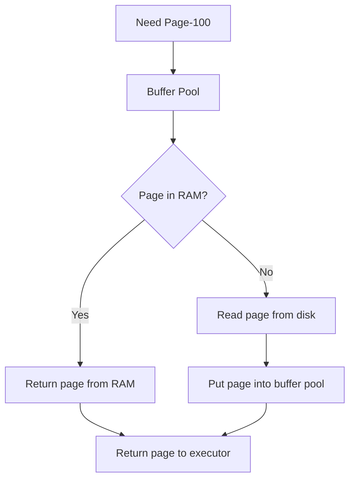

Cache hit:

```text
fast
```

Cache miss:

```text
slow disk read
```

---

# 35. Record Decode

After page loaded:

```text
slot directory gives offset
```

Then database reads:

```text
record bytes
```

and decodes using schema.

Flow:

```text
page
 ↓
slot
 ↓
record bytes
 ↓
schema decode
 ↓
row
```

---

# 36. Mermaid — Page To Row Decode

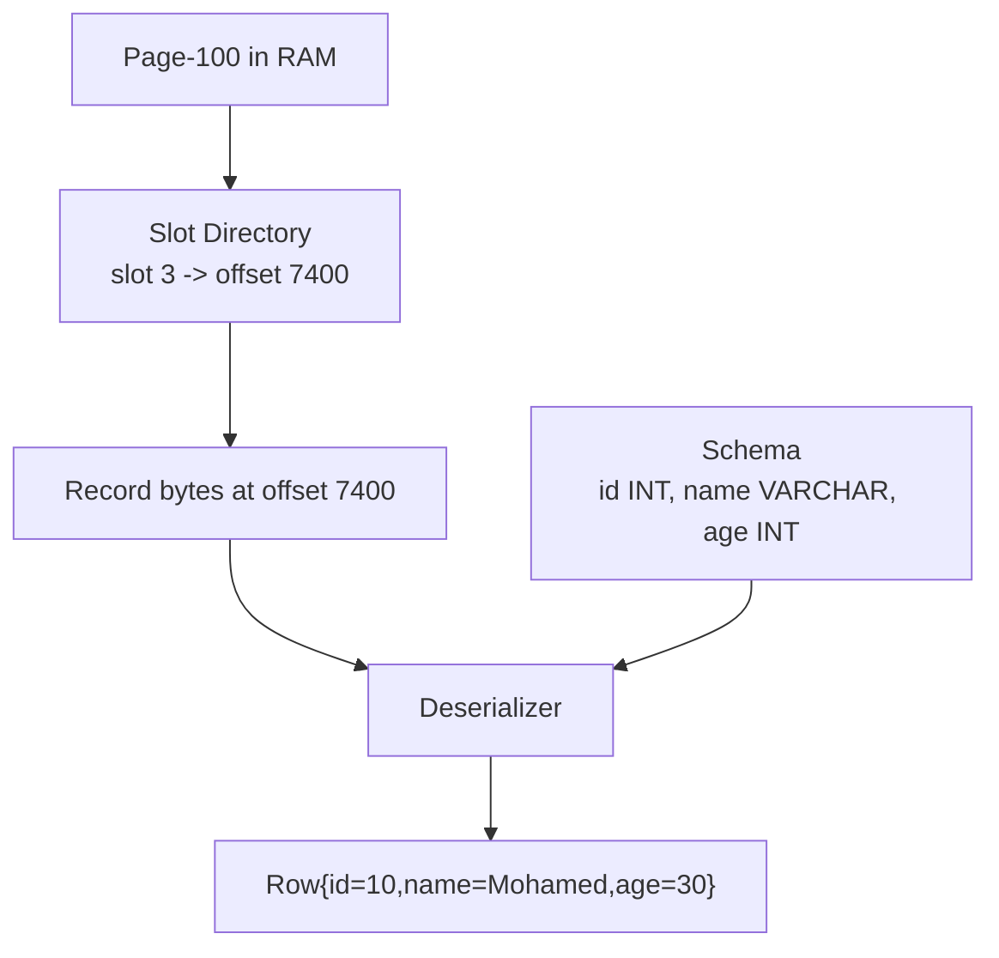

---

# 37. Projection Operator

Projection returns only requested columns.

Query:

```sql
SELECT name, age FROM users;
```

If record contains:

```text
id, name, city, age
```

projection returns:

```text
name, age
```

---

# 38. Filter Operator

Filter applies predicate.

Example:

```sql
WHERE age > 25
```

Flow:

```text
row comes from child
    ↓
evaluate age > 25
    ↓
pass or discard
```

---

# 39. Mermaid — Filter + Projection

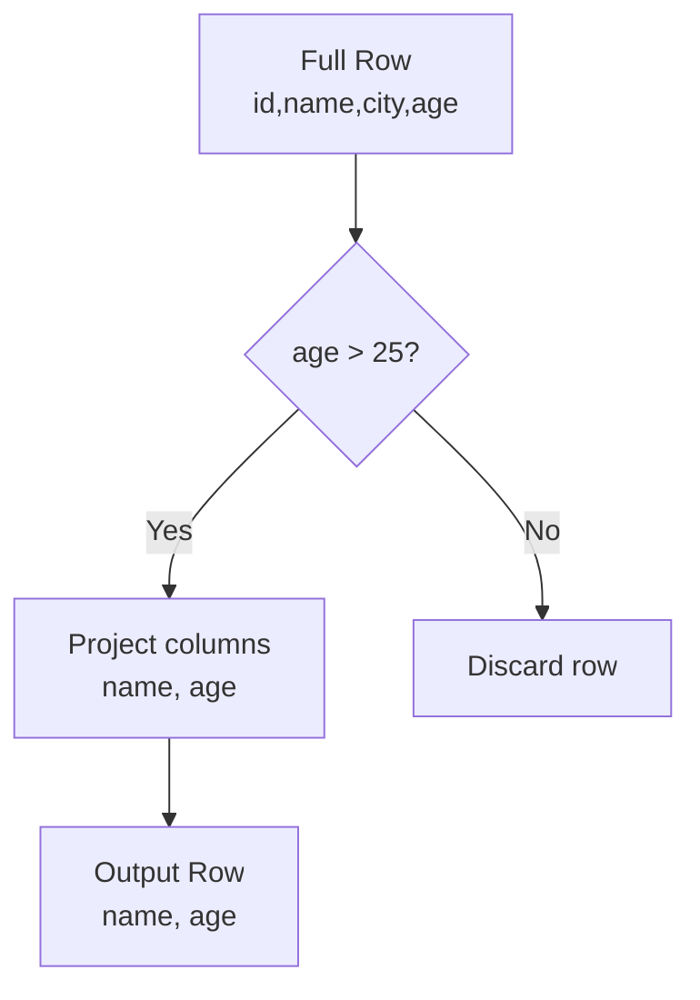

---

# 40. LIMIT Operator

Query:

```sql
SELECT * FROM users LIMIT 10;
```

Database may stop after:

```text
10 rows
```

No need to scan everything in some plans.

---

# 41. SORT Operator

Query:

```sql
ORDER BY created_at
```

Database may:

```text
use index order
or
sort manually
```

Sort can be expensive.

---

# 42. External Sort

If data does not fit memory:

```text
sort chunks in memory
write temp files
merge sorted files
```

This is external sort.

---

# 43. Mermaid — External Sort

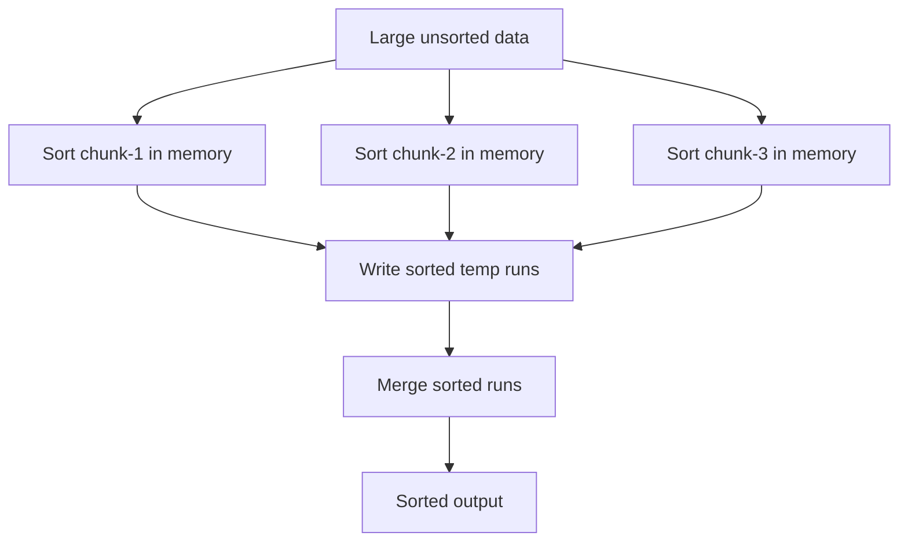

---

# 44. Aggregation Operator

Query:

```sql
SELECT city, COUNT(*)
FROM users
GROUP BY city;
```

Database may use:

```text
hash aggregate
sort aggregate
```

---

# 45. Hash Aggregate Mental Model

```text
HashMap<groupKey, aggregateValue>
```

Example:

```text
Bucharest → 10
London    → 20
Paris     → 5
```

---

# 46. Join Query Preview

Query:

```sql
SELECT *
FROM orders o
JOIN users u
ON o.user_id = u.id;
```

Database must choose join algorithm.

---

# 47. Join Algorithms

Common joins:

```text
Nested Loop Join
Hash Join
Merge Join
```

---

# 48. Nested Loop Join

Mental model:

```text
for each row in orders:
    find matching row in users
```

Can be good if:

```text
outer table small
inner table indexed
```

---

# 49. Hash Join

Mental model:

```text
build hash table on smaller input
probe with larger input
```

Good for equality joins.

---

# 50. Merge Join

Mental model:

```text
both inputs sorted
walk together
```

Good when inputs are already sorted.

---

# 51. Mermaid — Join Plan Tree

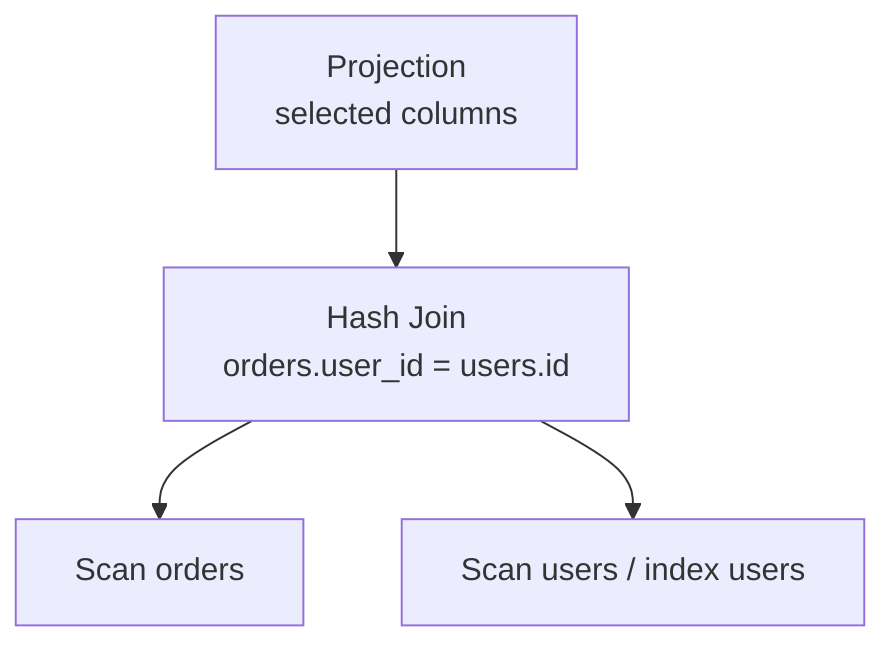

---

# 52. Covering Index

A covering index contains all columns needed by query.

Example index:

```text
(id, name, age)
```

Query:

```sql
SELECT name, age FROM users WHERE id = 10;
```

Database may answer from index only.

---

# 53. Mermaid — Covering Index

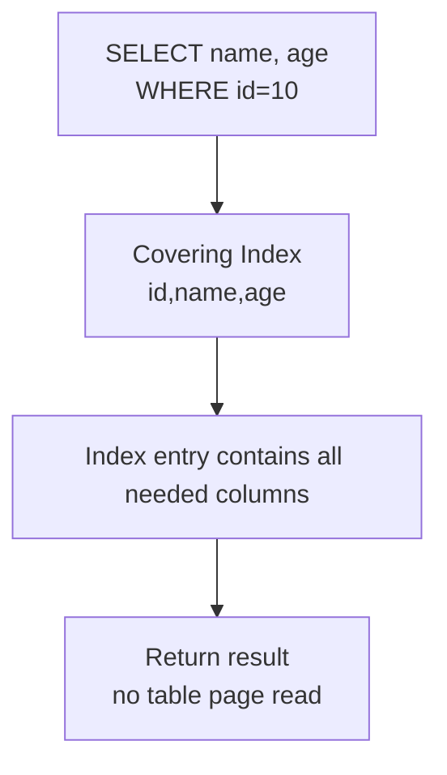

Very fast.

---

# 54. EXPLAIN Plan

Databases expose chosen plan.

Example:

```sql
EXPLAIN SELECT * FROM users WHERE id = 10;
```

May show:

```text
Index Scan using users_pkey
```

Use this to debug performance.

---

# 55. EXPLAIN ANALYZE

```sql
EXPLAIN ANALYZE
SELECT * FROM users WHERE id = 10;
```

Shows:

```text
actual execution time
actual rows
actual loops
chosen plan
```

Very important production skill.

---

# 56. Slow Query Causes

Common reasons:

```text
missing index
bad statistics
wrong join order
large sort
full table scan
low selectivity predicate
too many rows returned
cold buffer pool
```

---

# 57. OLTP vs OLAP Execution

## OLTP

```text
small queries
index lookups
low latency
transactions
```

## OLAP

```text
large scans
aggregations
parallel execution
columnar processing
```

Execution engines differ heavily.

---

# 58. Backend API Flow

Spring Boot endpoint:

```text
GET /users/10
```

Internal path:

```text
Controller
    ↓
Repository
    ↓
SQL query
    ↓
Database query pipeline
    ↓
Index scan
    ↓
Buffer pool
    ↓
Record decode
    ↓
DTO response
```

---

# 59. Mermaid — Backend To DB Query Flow

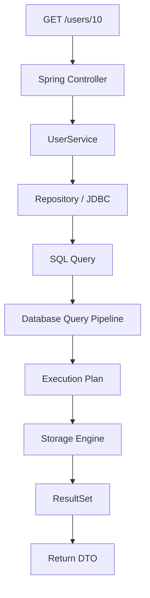

---

# 60. Mini Query Engine Java Idea

A very simple mini query engine can model:

```text
TableScan
Filter
Projection
```

---

# 61. Java Operator Interface

```java
public interface Operator {

    Row next();
}
```

Each operator returns one row at a time.

---

# 62. Java TableScan Operator

```java
import java.util.Iterator;
import java.util.List;

public class TableScanOperator implements Operator {

    private final Iterator<Row> iterator;

    public TableScanOperator(List<Row> rows) {
        this.iterator = rows.iterator();
    }

    @Override
    public Row next() {

        if (!iterator.hasNext()) {
            return null;
        }

        return iterator.next();
    }
}
```

---

# 63. Java Filter Operator

```java
import java.util.function.Predicate;

public class FilterOperator implements Operator {

    private final Operator child;
    private final Predicate<Row> predicate;

    public FilterOperator(Operator child,
                          Predicate<Row> predicate) {
        this.child = child;
        this.predicate = predicate;
    }

    @Override
    public Row next() {

        while (true) {

            Row row = child.next();

            if (row == null) {
                return null;
            }

            if (predicate.test(row)) {
                return row;
            }
        }
    }
}
```

---

# 64. Java Projection Operator

```java
import java.util.List;

public class ProjectionOperator implements Operator {

    private final Operator child;
    private final List<String> columns;

    public ProjectionOperator(Operator child,
                              List<String> columns) {
        this.child = child;
        this.columns = columns;
    }

    @Override
    public Row next() {

        Row input = child.next();

        if (input == null) {
            return null;
        }

        Row output = new Row();

        for (String column : columns) {
            output.put(column, input.get(column));
        }

        return output;
    }
}
```

---

# 65. Mini Query Dry Run

Query:

```sql
SELECT name FROM users WHERE age > 25;
```

Plan:

```text
Projection(name)
    ↓
Filter(age > 25)
    ↓
TableScan(users)
```

Rows:

```text
{id=1, name=Mohamed, age=30}
{id=2, name=John, age=20}
```

Dry run:

```text
TableScan returns Mohamed row
Filter age > 25? yes
Projection keeps name
Output Mohamed

TableScan returns John row
Filter age > 25? no
discard
```

---

# 66. Full Final Mental Model

```text
SQL text
   ↓
Parse
   ↓
Validate
   ↓
Build logical plan
   ↓
Optimize using statistics
   ↓
Create physical plan
   ↓
Run operators
   ↓
Access indexes/pages
   ↓
Decode records
   ↓
Return result
```

---

# 67. Interview Explanation

If interviewer asks:

```text
How does a database execute a query?
```

Strong answer:

```text
A database parses SQL into a parse tree, validates tables and columns,
builds a logical plan, optimizes it using statistics and cost estimation,
generates a physical execution plan, and then runs execution operators
such as scans, filters, joins, sorts, and aggregates against the storage engine.
```

Senior addition:

```text
The execution engine accesses indexes and pages through the buffer pool,
decodes record bytes using schema metadata, and returns rows to the client.
```

---

# 68. Common Mistakes

## Mistake 1

```text
Thinking SQL directly reads rows
```

Wrong.

SQL goes through parser, planner, optimizer, and executor.

---

## Mistake 2

```text
Thinking index always used
```

Optimizer may choose table scan if index is not useful.

---

## Mistake 3

```text
Ignoring statistics
```

Bad stats can produce bad query plans.

---

## Mistake 4

```text
Ignoring buffer pool
```

Page cache heavily affects performance.

---

## Mistake 5

```text
Thinking slow query always means missing index
```

Could be joins, sorts, bad stats, cold cache, lock waits, or too many rows.

---

# 69. What To Remember

```text
Database query execution is a pipeline.

SQL is parsed, validated, planned, optimized, and executed.

Optimizer chooses table scan or index scan.

Execution engine runs operators.

Storage engine returns pages and records.

Buffer pool decides RAM hit or disk read.

EXPLAIN ANALYZE shows the real plan and timing.
```

---

# 70. Next File

```text
010_Filter_Projection_Scan.md
```

Next you learn:

```text
table scan
index scan
filter operator
projection operator
predicate evaluation
why WHERE and SELECT work internally
```
