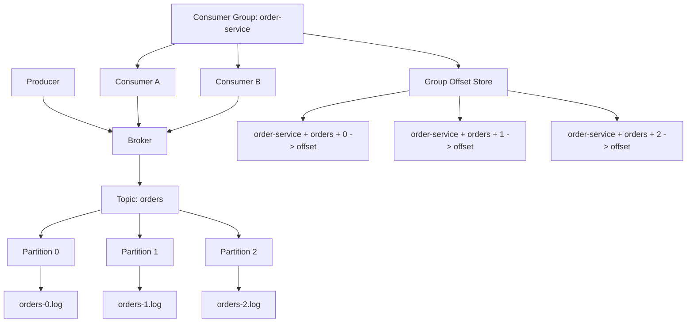
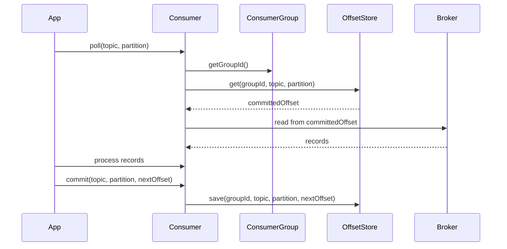

# 014_Consumer_Groups

# MiniKafka Step 14 — Consumer Groups

## Goal

In Step 13, offset commit was tracked by:

```text
topic + partition -> committed offset
```

But real Kafka offsets are tracked per consumer group:

```text
consumerGroupId + topic + partition -> committed offset
```

In this step, we add:

```java
ConsumerGroup
```

Now multiple consumers can belong to the same group and share the same committed offsets.

---

# Big Picture

```text
Producer
   |
   v
Broker
   |
   v
Topic: orders
   |
   +--> Partition 0
   +--> Partition 1
   +--> Partition 2
   |
   v
Consumer Group: order-service
   |
   +--> Consumer A
   +--> Consumer B
```

---

# Important Kafka Rule

Inside one consumer group:

```text
one partition is consumed by only one consumer at a time
```

Different consumer groups can read the same topic independently because each group has its own offsets.

---

# Architecture Mermaid Diagram



---

# Consumer Group Offset Flow



---

# Folder Structure

```text
MiniKafka/
└── src/main/java/com/minikafka/step14/
    ├── MessageRecord.java
    ├── RecordSerializer.java
    ├── LogSegment.java
    ├── Partition.java
    ├── Topic.java
    ├── Broker.java
    ├── Producer.java
    ├── GroupOffsetKey.java
    ├── GroupOffsetStore.java
    ├── ConsumerGroup.java
    ├── Consumer.java
    └── Step14Driver.java
```

---

# CP/DSA Concepts Used

## 1. Composite Key in HashMap

Now offset identity is:

```text
groupId + topic + partition
```

Code:

```java
Map<GroupOffsetKey, Long> committedOffsets;
```

Average operations:

```text
get offset: O(1)
commit offset: O(1)
```

This is like CP state representation:

```text
dp[index][mask]
visited[node][state]
distance[row][col]
```

## 2. equals/hashCode

Custom objects used as HashMap keys need:

```java
equals()
hashCode()
```

For us, two offset keys are equal if:

```text
same groupId
same topic
same partition
```

## 3. Map as State Store

```text
(group, topic, partition) -> next offset
```

This is like memoization:

```text
state -> answer
```

## 4. Partition-Level Parallelism

Partitions are independent units of work, similar to splitting an array into chunks.

---

# MessageRecord.java

```java
package com.minikafka.step14;

public class MessageRecord {

    private final long offset;
    private final String key;
    private final String value;

    public MessageRecord(long offset, String key, String value) {
        this.offset = offset;
        this.key = key;
        this.value = value;
    }

    public long getOffset() {
        return offset;
    }

    public String getKey() {
        return key;
    }

    public String getValue() {
        return value;
    }

    @Override
    public String toString() {
        return "MessageRecord{" +
                "offset=" + offset +
                ", key='" + key + '\'' +
                ", value='" + value + '\'' +
                '}';
    }
}
```

---

# RecordSerializer.java

```java
package com.minikafka.step14;

public class RecordSerializer {

    public static String serialize(MessageRecord record) {
        return record.getOffset() + "|" + record.getKey() + "|" + record.getValue();
    }

    public static MessageRecord deserialize(String line) {
        String[] parts = line.split("\\|", 3);

        long offset = Long.parseLong(parts[0]);
        String key = parts[1];
        String value = parts[2];

        return new MessageRecord(offset, key, value);
    }
}
```

---

# LogSegment.java

```java
package com.minikafka.step14;

import java.io.IOException;
import java.nio.file.Files;
import java.nio.file.Path;
import java.nio.file.StandardOpenOption;
import java.util.ArrayList;
import java.util.List;
import java.util.stream.Stream;

public class LogSegment {

    private final Path logPath;

    public LogSegment(String filePath) throws IOException {
        this.logPath = Path.of(filePath);
        Files.createDirectories(logPath.getParent());

        if (!Files.exists(logPath)) {
            Files.createFile(logPath);
        }
    }

    public long append(String key, String value) throws IOException {
        long offset = countLines();

        MessageRecord record = new MessageRecord(offset, key, value);
        String line = RecordSerializer.serialize(record);

        Files.writeString(logPath, line + System.lineSeparator(), StandardOpenOption.APPEND);

        return offset;
    }

    public List<MessageRecord> readFromOffset(long startOffset) throws IOException {
        List<MessageRecord> result = new ArrayList<>();
        List<String> lines = Files.readAllLines(logPath);

        for (String line : lines) {
            if (line.isBlank()) {
                continue;
            }

            MessageRecord record = RecordSerializer.deserialize(line);

            if (record.getOffset() >= startOffset) {
                result.add(record);
            }
        }

        return result;
    }

    private long countLines() throws IOException {
        try (Stream<String> lines = Files.lines(logPath)) {
            return lines.filter(line -> !line.isBlank()).count();
        }
    }
}
```

---

# Partition.java

```java
package com.minikafka.step14;

import java.io.IOException;
import java.util.List;

public class Partition {

    private final int partitionId;
    private final LogSegment segment;

    public Partition(String topicName, int partitionId) throws IOException {
        this.partitionId = partitionId;

        String filePath = "data/phase1/" + topicName + "-" + partitionId + ".log";
        this.segment = new LogSegment(filePath);
    }

    public long append(String key, String value) throws IOException {
        return segment.append(key, value);
    }

    public List<MessageRecord> readFromOffset(long offset) throws IOException {
        return segment.readFromOffset(offset);
    }

    public int getPartitionId() {
        return partitionId;
    }
}
```

---

# Topic.java

```java
package com.minikafka.step14;

import java.io.IOException;
import java.util.ArrayList;
import java.util.List;

public class Topic {

    private final String name;
    private final List<Partition> partitions;

    public Topic(String name, int partitionCount) throws IOException {
        if (partitionCount <= 0) {
            throw new IllegalArgumentException("partitionCount must be > 0");
        }

        this.name = name;
        this.partitions = new ArrayList<>();

        for (int partitionId = 0; partitionId < partitionCount; partitionId++) {
            partitions.add(new Partition(name, partitionId));
        }
    }

    public long append(String key, String value) throws IOException {
        int partitionId = calculatePartitionId(key);

        System.out.println(
                "Topic '" + name + "' routed key='" + key + "' to partition " + partitionId
        );

        return getPartition(partitionId).append(key, value);
    }

    public List<MessageRecord> readFromPartitionOffset(int partitionId, long offset)
            throws IOException {

        return getPartition(partitionId).readFromOffset(offset);
    }

    private int calculatePartitionId(String key) {
        int hash = Math.abs(key.hashCode());
        return hash % partitions.size();
    }

    public Partition getPartition(int partitionId) {
        if (partitionId < 0 || partitionId >= partitions.size()) {
            throw new IllegalArgumentException("Invalid partition id: " + partitionId);
        }

        return partitions.get(partitionId);
    }

    public int getPartitionCount() {
        return partitions.size();
    }
}
```

---

# Broker.java

```java
package com.minikafka.step14;

import java.io.IOException;
import java.util.HashMap;
import java.util.List;
import java.util.Map;

public class Broker {

    private final Map<String, Topic> topics;

    public Broker() {
        this.topics = new HashMap<>();
    }

    public void createTopic(String topicName, int partitionCount) throws IOException {
        if (topics.containsKey(topicName)) {
            throw new IllegalArgumentException("Topic already exists: " + topicName);
        }

        Topic topic = new Topic(topicName, partitionCount);
        topics.put(topicName, topic);

        System.out.println(
                "Broker created topic: " + topicName + " with partitions: " + partitionCount
        );
    }

    public long send(String topicName, String key, String value) throws IOException {
        return getTopic(topicName).append(key, value);
    }

    public List<MessageRecord> readPartitionFromOffset(
            String topicName,
            int partitionId,
            long offset
    ) throws IOException {

        return getTopic(topicName).readFromPartitionOffset(partitionId, offset);
    }

    public int getPartitionCount(String topicName) {
        return getTopic(topicName).getPartitionCount();
    }

    private Topic getTopic(String topicName) {
        Topic topic = topics.get(topicName);

        if (topic == null) {
            throw new IllegalArgumentException("Topic not found: " + topicName);
        }

        return topic;
    }
}
```

---

# Producer.java

```java
package com.minikafka.step14;

import java.io.IOException;

public class Producer {

    private final Broker broker;

    public Producer(Broker broker) {
        this.broker = broker;
    }

    public long send(String topicName, String key, String value) throws IOException {
        System.out.println(
                "Producer sending: topic=" + topicName +
                        ", key=" + key +
                        ", value=" + value
        );

        return broker.send(topicName, key, value);
    }
}
```

---

# GroupOffsetKey.java

```java
package com.minikafka.step14;

import java.util.Objects;

public class GroupOffsetKey {

    private final String groupId;
    private final String topicName;
    private final int partitionId;

    public GroupOffsetKey(String groupId, String topicName, int partitionId) {
        this.groupId = groupId;
        this.topicName = topicName;
        this.partitionId = partitionId;
    }

    @Override
    public boolean equals(Object other) {
        if (this == other) {
            return true;
        }

        if (!(other instanceof GroupOffsetKey)) {
            return false;
        }

        GroupOffsetKey that = (GroupOffsetKey) other;

        return partitionId == that.partitionId
                && Objects.equals(groupId, that.groupId)
                && Objects.equals(topicName, that.topicName);
    }

    @Override
    public int hashCode() {
        return Objects.hash(groupId, topicName, partitionId);
    }

    @Override
    public String toString() {
        return groupId + "-" + topicName + "-" + partitionId;
    }
}
```

---

# GroupOffsetStore.java

```java
package com.minikafka.step14;

import java.util.HashMap;
import java.util.Map;

public class GroupOffsetStore {

    private final Map<GroupOffsetKey, Long> committedOffsets;

    public GroupOffsetStore() {
        this.committedOffsets = new HashMap<>();
    }

    public long getCommittedOffset(String groupId, String topicName, int partitionId) {
        GroupOffsetKey key = new GroupOffsetKey(groupId, topicName, partitionId);

        return committedOffsets.getOrDefault(key, 0L);
    }

    public void commit(String groupId, String topicName, int partitionId, long nextOffset) {
        GroupOffsetKey key = new GroupOffsetKey(groupId, topicName, partitionId);

        committedOffsets.put(key, nextOffset);

        System.out.println("Committed offset: " + key + " -> " + nextOffset);
    }
}
```

---

# ConsumerGroup.java

```java
package com.minikafka.step14;

public class ConsumerGroup {

    private final String groupId;
    private final GroupOffsetStore offsetStore;

    public ConsumerGroup(String groupId, GroupOffsetStore offsetStore) {
        this.groupId = groupId;
        this.offsetStore = offsetStore;
    }

    public String getGroupId() {
        return groupId;
    }

    public GroupOffsetStore getOffsetStore() {
        return offsetStore;
    }
}
```

---

# Consumer.java

```java
package com.minikafka.step14;

import java.io.IOException;
import java.util.List;

public class Consumer {

    private final String consumerId;
    private final Broker broker;
    private final ConsumerGroup consumerGroup;

    public Consumer(String consumerId, Broker broker, ConsumerGroup consumerGroup) {
        this.consumerId = consumerId;
        this.broker = broker;
        this.consumerGroup = consumerGroup;
    }

    public List<MessageRecord> poll(String topicName, int partitionId) throws IOException {
        String groupId = consumerGroup.getGroupId();

        long committedOffset =
                consumerGroup.getOffsetStore()
                        .getCommittedOffset(groupId, topicName, partitionId);

        System.out.println(
                consumerId + " polling: group=" + groupId +
                        ", topic=" + topicName +
                        ", partition=" + partitionId +
                        ", committedOffset=" + committedOffset
        );

        return broker.readPartitionFromOffset(topicName, partitionId, committedOffset);
    }

    public void commit(String topicName, int partitionId, long nextOffset) {
        String groupId = consumerGroup.getGroupId();

        consumerGroup.getOffsetStore()
                .commit(groupId, topicName, partitionId, nextOffset);
    }

    public String getConsumerId() {
        return consumerId;
    }
}
```

---

# Step14Driver.java

```java
package com.minikafka.step14;

import java.util.List;

public class Step14Driver {

    public static void main(String[] args) throws Exception {
        Broker broker = new Broker();
        broker.createTopic("orders", 3);

        Producer producer = new Producer(broker);

        GroupOffsetStore offsetStore = new GroupOffsetStore();
        ConsumerGroup orderServiceGroup = new ConsumerGroup("order-service", offsetStore);

        Consumer consumerA = new Consumer("consumer-A", broker, orderServiceGroup);
        Consumer consumerB = new Consumer("consumer-B", broker, orderServiceGroup);

        System.out.println();

        producer.send("orders", "customer-1", "order-1-created");
        producer.send("orders", "customer-2", "order-2-created");
        producer.send("orders", "customer-3", "order-3-created");
        producer.send("orders", "customer-1", "order-1-paid");
        producer.send("orders", "customer-2", "order-2-shipped");

        System.out.println();
        System.out.println("---- CONSUMER GROUP POLL ----");

        pollProcessCommit(consumerA, "orders", 0);
        pollProcessCommit(consumerB, "orders", 1);
        pollProcessCommit(consumerA, "orders", 2);

        System.out.println();
        System.out.println("---- SECOND POLL AFTER COMMIT ----");

        pollProcessCommit(consumerA, "orders", 0);
        pollProcessCommit(consumerB, "orders", 1);
        pollProcessCommit(consumerA, "orders", 2);
    }

    private static void pollProcessCommit(
            Consumer consumer,
            String topicName,
            int partitionId
    ) throws Exception {

        List<MessageRecord> records = consumer.poll(topicName, partitionId);
        long nextOffset = processRecords(consumer, records);

        consumer.commit(topicName, partitionId, nextOffset);
    }

    private static long processRecords(Consumer consumer, List<MessageRecord> records) {
        long nextOffset = 0;

        for (MessageRecord record : records) {
            System.out.println(consumer.getConsumerId() + " processing: " + record);
            nextOffset = record.getOffset() + 1;
        }

        return nextOffset;
    }
}
```

---

# Important Driver Note

Partition routing depends on Java hash values.

If a partition has no records, poll returns an empty list. That is normal.

Check producer output:

```text
Topic 'orders' routed key='customer-1' to partition X
```

---

# Run Command

```bash
javac -d out src/main/java/com/minikafka/step14/*.java

java -cp out com.minikafka.step14.Step14Driver
```

---

# Expected Output Pattern

```text
consumer-A polling: group=order-service, topic=orders, partition=0, committedOffset=0
consumer-A processing: MessageRecord{offset=0, ...}
Committed offset: order-service-orders-0 -> 1
```

Second poll should use the committed offset:

```text
committedOffset=1
```

---

# Current MiniKafka State

```text
Supported:
[yes] append-only storage
[yes] offsets
[yes] LogSegment abstraction
[yes] Partition abstraction
[yes] Topic abstraction
[yes] Broker API
[yes] Producer API
[yes] Consumer API
[yes] offset commit
[yes] consumer group offset identity

Not yet:
[no] partition assignment
[no] automatic consumer membership
[no] rebalancing
[no] persistent offset storage
[no] replication
```

---

# Step 14 Completion Checklist

```text
[ ] You created GroupOffsetKey
[ ] You created GroupOffsetStore
[ ] You created ConsumerGroup
[ ] You understand group + topic + partition offset identity
[ ] You understand why groups consume independently
[ ] You understand group-level offset tracking
```

---

# Final Mental Model

```text
Consumer group owns offsets.

Offset key:
groupId + topic + partition

Committed offset:
next record to read
```

---

# Next Step

Next we build:

```text
015_Partition_Assignment
```
