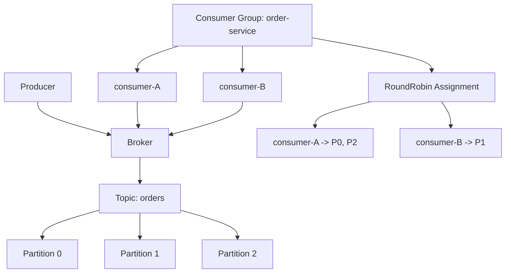
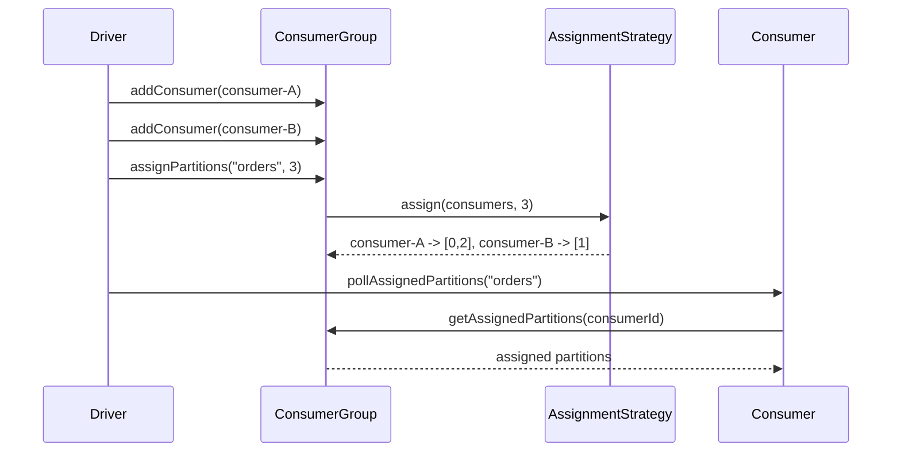

# 015_Partition_Assignment

# MiniKafka Step 15 — Partition Assignment

## Goal

In Step 14, consumers manually polled partitions:

```java
pollProcessCommit(consumerA, "orders", 0);
pollProcessCommit(consumerB, "orders", 1);
pollProcessCommit(consumerA, "orders", 2);
```

In real Kafka, a consumer group assigns partitions to consumers.

In this step, we build:

```java
PartitionAssignment
PartitionAssignmentStrategy
RoundRobinPartitionAssignmentStrategy
```

---

# Delta From Step 14

```text
Step 14:
Consumer group exists.
Offsets are group-specific.
Partition polling is manual.

Step 15:
Consumer group tracks consumers.
Consumer group assigns partitions automatically.
Each consumer polls only assigned partitions.
```

New classes:

```text
PartitionAssignment
PartitionAssignmentStrategy
RoundRobinPartitionAssignmentStrategy
```

Modified classes:

```text
ConsumerGroup
Consumer
Step15Driver
```

---

# Detailed Steps Before Code

## Step 1 — Keep existing Kafka stack

We still use:

```text
MessageRecord
RecordSerializer
LogSegment
Partition
Topic
Broker
Producer
GroupOffsetKey
GroupOffsetStore
```

## Step 2 — Add consumer membership

ConsumerGroup now stores:

```java
List<Consumer> consumers;
```

So the group knows which consumers belong to it.

## Step 3 — Add partition assignment result

Create:

```java
PartitionAssignment
```

It stores:

```text
consumerId -> list of partition ids
```

Example:

```text
consumer-A -> [0, 2]
consumer-B -> [1]
```

## Step 4 — Add assignment strategy interface

Create:

```java
PartitionAssignmentStrategy
```

This allows multiple algorithms later:

```text
Round Robin
Range Assignment
Sticky Assignment
```

## Step 5 — Implement round-robin assignment

Formula:

```text
consumerIndex = partitionId % consumerCount
```

Example:

```text
partitions = 0, 1, 2
consumers = A, B

P0 -> A
P1 -> B
P2 -> A
```

## Step 6 — Consumer polls assigned partitions

Instead of:

```java
consumer.poll("orders", 0);
```

we call:

```java
consumer.pollAssignedPartitions("orders");
```

---

# Architecture Mermaid Diagram



---

# Assignment Flow Mermaid Diagram



---

# CP/DSA Concepts Used

## 1. Round Robin With Modulo

```java
int consumerIndex = partitionId % consumers.size();
```

This is classic bucket distribution:

```text
item i -> bucket i % k
```

## 2. HashMap of Lists

```java
Map<String, List<Integer>> assignments;
```

This is like graph adjacency list:

```text
node -> neighbors
consumer -> partitions
```

## 3. ArrayList Dynamic Buckets

Each consumer has:

```java
List<Integer>
```

Append is amortized:

```text
O(1)
```

## 4. Complexity

For `P` partitions and `C` consumers:

```text
Assignment time: O(P)
Assignment memory: O(P + C)
```

---

# Folder Structure

```text
MiniKafka/
└── src/main/java/com/minikafka/step15/
    ├── MessageRecord.java
    ├── RecordSerializer.java
    ├── LogSegment.java
    ├── Partition.java
    ├── Topic.java
    ├── Broker.java
    ├── Producer.java
    ├── GroupOffsetKey.java
    ├── GroupOffsetStore.java
    ├── PartitionAssignment.java
    ├── PartitionAssignmentStrategy.java
    ├── RoundRobinPartitionAssignmentStrategy.java
    ├── ConsumerGroup.java
    ├── Consumer.java
    └── Step15Driver.java
```

---

# Core Unchanged Classes

Use these from Step 14 with package changed to:

```java
package com.minikafka.step15;
```

```text
MessageRecord.java
RecordSerializer.java
LogSegment.java
Partition.java
Topic.java
Broker.java
Producer.java
GroupOffsetKey.java
GroupOffsetStore.java
```

Only the new/changed classes are shown below.

---

# PartitionAssignment.java

```java
package com.minikafka.step15;

import java.util.ArrayList;
import java.util.HashMap;
import java.util.List;
import java.util.Map;

// DELTA from Step 14:
// New class.
// Stores partition ownership after assignment.
public class PartitionAssignment {

    // CP/DSA concept:
    // HashMap of Lists, similar to adjacency list.
    //
    // consumerId -> assigned partitions
    private final Map<String, List<Integer>> assignments;

    public PartitionAssignment() {
        this.assignments = new HashMap<>();
    }

    public void addAssignment(String consumerId, int partitionId) {
        // DELTA from Step 14:
        // Instead of manually choosing partition per poll,
        // we store ownership here.
        assignments
                .computeIfAbsent(consumerId, key -> new ArrayList<>())
                .add(partitionId);
    }

    public List<Integer> getPartitions(String consumerId) {
        return assignments.getOrDefault(consumerId, new ArrayList<>());
    }

    public void printAssignments() {
        System.out.println("---- PARTITION ASSIGNMENT ----");

        for (Map.Entry<String, List<Integer>> entry : assignments.entrySet()) {
            System.out.println(entry.getKey() + " -> " + entry.getValue());
        }
    }
}
```

---

# PartitionAssignmentStrategy.java

```java
package com.minikafka.step15;

import java.util.List;

// DELTA from Step 14:
// New interface.
// This lets us plug in different assignment algorithms later.
public interface PartitionAssignmentStrategy {

    PartitionAssignment assign(List<Consumer> consumers, int partitionCount);
}
```

---

# RoundRobinPartitionAssignmentStrategy.java

```java
package com.minikafka.step15;

import java.util.List;

// DELTA from Step 14:
// New assignment algorithm.
// It distributes partitions using round-robin.
public class RoundRobinPartitionAssignmentStrategy implements PartitionAssignmentStrategy {

    @Override
    public PartitionAssignment assign(List<Consumer> consumers, int partitionCount) {
        if (consumers.isEmpty()) {
            throw new IllegalArgumentException("No consumers in group");
        }

        PartitionAssignment assignment = new PartitionAssignment();

        for (int partitionId = 0; partitionId < partitionCount; partitionId++) {
            // CP/DSA concept:
            // modulo maps partitionId into consumer index.
            int consumerIndex = partitionId % consumers.size();

            Consumer consumer = consumers.get(consumerIndex);

            assignment.addAssignment(consumer.getConsumerId(), partitionId);
        }

        return assignment;
    }
}
```

---

# ConsumerGroup.java

```java
package com.minikafka.step15;

import java.util.ArrayList;
import java.util.List;

// DELTA from Step 14:
// ConsumerGroup now tracks consumers and assignments.
public class ConsumerGroup {

    private final String groupId;
    private final GroupOffsetStore offsetStore;

    // DELTA:
    // Step 14 did not store consumers inside the group.
    private final List<Consumer> consumers;

    // DELTA:
    // New strategy object.
    private final PartitionAssignmentStrategy assignmentStrategy;

    // DELTA:
    // Latest computed assignment.
    private PartitionAssignment currentAssignment;

    public ConsumerGroup(String groupId, GroupOffsetStore offsetStore) {
        this.groupId = groupId;
        this.offsetStore = offsetStore;
        this.consumers = new ArrayList<>();
        this.assignmentStrategy = new RoundRobinPartitionAssignmentStrategy();
    }

    public void addConsumer(Consumer consumer) {
        consumers.add(consumer);
    }

    public void assignPartitions(String topicName, int partitionCount) {
        System.out.println(
                "Assigning partitions for topic=" + topicName +
                        ", group=" + groupId
        );

        this.currentAssignment = assignmentStrategy.assign(consumers, partitionCount);

        currentAssignment.printAssignments();
    }

    public List<Integer> getAssignedPartitions(String consumerId) {
        if (currentAssignment == null) {
            throw new IllegalStateException("Partitions are not assigned yet");
        }

        return currentAssignment.getPartitions(consumerId);
    }

    public String getGroupId() {
        return groupId;
    }

    public GroupOffsetStore getOffsetStore() {
        return offsetStore;
    }
}
```

---

# Consumer.java

```java
package com.minikafka.step15;

import java.io.IOException;
import java.util.List;

public class Consumer {

    private final String consumerId;
    private final Broker broker;
    private final ConsumerGroup consumerGroup;

    public Consumer(String consumerId, Broker broker, ConsumerGroup consumerGroup) {
        this.consumerId = consumerId;
        this.broker = broker;
        this.consumerGroup = consumerGroup;
    }

    public List<MessageRecord> poll(String topicName, int partitionId) throws IOException {
        String groupId = consumerGroup.getGroupId();

        long committedOffset =
                consumerGroup.getOffsetStore()
                        .getCommittedOffset(groupId, topicName, partitionId);

        System.out.println(
                consumerId + " polling: group=" + groupId +
                        ", topic=" + topicName +
                        ", partition=" + partitionId +
                        ", committedOffset=" + committedOffset
        );

        return broker.readPartitionFromOffset(topicName, partitionId, committedOffset);
    }

    // DELTA from Step 14:
    // Consumer now asks group which partitions belong to it.
    public void pollAssignedPartitions(String topicName) throws IOException {
        List<Integer> partitions = consumerGroup.getAssignedPartitions(consumerId);

        for (int partitionId : partitions) {
            List<MessageRecord> records = poll(topicName, partitionId);

            long nextOffset = processRecords(records);

            commit(topicName, partitionId, nextOffset);
        }
    }

    private long processRecords(List<MessageRecord> records) {
        long nextOffset = 0;

        for (MessageRecord record : records) {
            System.out.println(consumerId + " processing: " + record);

            // Kafka convention:
            // committed offset = next offset to read.
            nextOffset = record.getOffset() + 1;
        }

        return nextOffset;
    }

    public void commit(String topicName, int partitionId, long nextOffset) {
        String groupId = consumerGroup.getGroupId();

        consumerGroup.getOffsetStore()
                .commit(groupId, topicName, partitionId, nextOffset);
    }

    public String getConsumerId() {
        return consumerId;
    }
}
```

---

# Step15Driver.java

```java
package com.minikafka.step15;

public class Step15Driver {

    public static void main(String[] args) throws Exception {
        Broker broker = new Broker();
        broker.createTopic("orders", 3);

        Producer producer = new Producer(broker);

        GroupOffsetStore offsetStore = new GroupOffsetStore();
        ConsumerGroup group = new ConsumerGroup("order-service", offsetStore);

        Consumer consumerA = new Consumer("consumer-A", broker, group);
        Consumer consumerB = new Consumer("consumer-B", broker, group);

        // DELTA from Step 14:
        // Register consumers in the group.
        group.addConsumer(consumerA);
        group.addConsumer(consumerB);

        // DELTA from Step 14:
        // Assign partitions automatically using strategy.
        int partitionCount = broker.getPartitionCount("orders");
        group.assignPartitions("orders", partitionCount);

        System.out.println();

        producer.send("orders", "customer-1", "order-1-created");
        producer.send("orders", "customer-2", "order-2-created");
        producer.send("orders", "customer-3", "order-3-created");
        producer.send("orders", "customer-1", "order-1-paid");
        producer.send("orders", "customer-2", "order-2-shipped");

        System.out.println();
        System.out.println("---- FIRST GROUP POLL ----");

        // DELTA:
        // No manual partition id here.
        // Each consumer polls its assigned partitions.
        consumerA.pollAssignedPartitions("orders");
        consumerB.pollAssignedPartitions("orders");

        System.out.println();
        System.out.println("---- PRODUCE MORE ----");

        producer.send("orders", "customer-1", "order-1-delivered");
        producer.send("orders", "customer-2", "order-2-delivered");

        System.out.println();
        System.out.println("---- SECOND GROUP POLL ----");

        consumerA.pollAssignedPartitions("orders");
        consumerB.pollAssignedPartitions("orders");
    }
}
```

---

# Dry Run

For:

```text
partitions = 3
consumers = 2
```

Round-robin assignment:

```text
partition 0 -> 0 % 2 = 0 -> consumer-A
partition 1 -> 1 % 2 = 1 -> consumer-B
partition 2 -> 2 % 2 = 0 -> consumer-A
```

Result:

```text
consumer-A -> [0, 2]
consumer-B -> [1]
```

---

# Run Command

```bash
javac -d out src/main/java/com/minikafka/step15/*.java

java -cp out com.minikafka.step15.Step15Driver
```

---

# Expected Output Pattern

```text
Assigning partitions for topic=orders, group=order-service
---- PARTITION ASSIGNMENT ----
consumer-A -> [0, 2]
consumer-B -> [1]
```

Then:

```text
consumer-A polling partition 0
consumer-A polling partition 2
consumer-B polling partition 1
```

---

# Current MiniKafka State

```text
Supported:
[yes] append-only storage
[yes] offsets
[yes] LogSegment abstraction
[yes] Partition abstraction
[yes] Topic abstraction
[yes] Broker API
[yes] Producer API
[yes] Consumer API
[yes] consumer groups
[yes] group offset tracking
[yes] partition assignment

Not yet:
[no] rebalancing when consumer joins/leaves
[no] persistent offset storage
[no] segment rolling
[no] index file
[no] replication
```

---

# Step 15 Completion Checklist

```text
[ ] You created PartitionAssignment
[ ] You created PartitionAssignmentStrategy
[ ] You implemented round-robin assignment
[ ] You registered consumers in ConsumerGroup
[ ] You assigned partitions automatically
[ ] You understand partitionId % consumerCount
[ ] You understand consumer -> assigned partitions mapping
```

---

# Final Mental Model

```text
Consumer group has consumers.
Topic has partitions.

Assignment strategy maps:
consumer -> partitions

Consumer only polls its assigned partitions.
```

---

# Next Step

Next we build:

```text
016_Rebalancing_Basics
```
