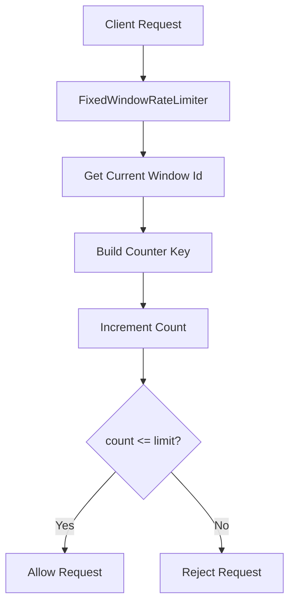
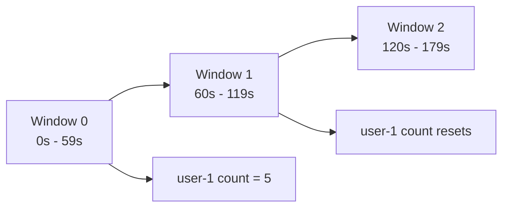
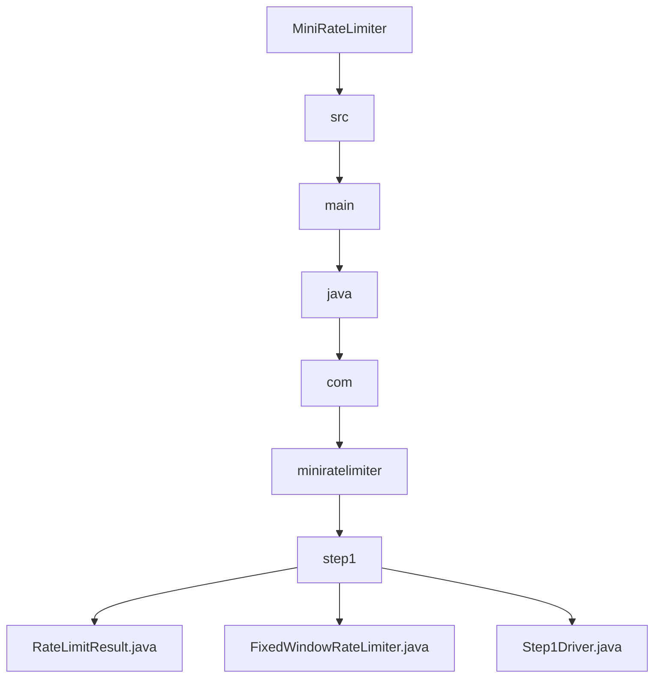

# 001_Fixed_Window_Counter

# MiniRateLimiter Step 1 — Fixed Window Counter

## Goal

Build the simplest possible rate limiter:

```text
Fixed Window Counter
```

Example policy:

```text
Allow 5 requests per 60 seconds per user
```

If user sends:

```text
request 1 -> allowed
request 2 -> allowed
request 3 -> allowed
request 4 -> allowed
request 5 -> allowed
request 6 -> rejected
```

After the window changes, counter resets.

---

# What Is A Fixed Window?

Time is divided into fixed buckets.

Example window size:

```text
60 seconds
```

Timeline:

```text
00:00 - 00:59 -> window 0
01:00 - 01:59 -> window 1
02:00 - 02:59 -> window 2
```

For each user and each window, we store request count.

```text
userId + windowId -> count
```

---

# Big Picture

```text
Request
   |
   v
Build key: userId + currentWindow
   |
   v
Increment counter
   |
   v
Compare with limit
   |
   +--> count <= limit -> allow
   |
   +--> count > limit  -> reject
```

---

# Architecture Mermaid Diagram



---

# Fixed Window Timeline



---

# Detailed Steps Before Code

## Step 1 — Define a rate limit policy

We need:

```text
limit = max requests
windowSizeMillis = window length
```

Example:

```text
5 requests per 60 seconds
```

## Step 2 — Calculate current window id

Use current time:

```java
currentWindow = currentTimeMillis / windowSizeMillis;
```

Example:

```text
currentTimeMillis = 125000
windowSizeMillis = 60000

windowId = 125000 / 60000 = 2
```

## Step 3 — Build counter key

For each user and window:

```text
userId + ":" + windowId
```

Example:

```text
user-1:2
```

## Step 4 — Increment request count

Use HashMap:

```java
Map<String, Integer> counters;
```

## Step 5 — Decide allow/reject

If count is within limit:

```text
allow
```

else:

```text
reject
```

## Step 6 — Return result object

Return:

```text
allowed
limit
remaining
currentCount
```

---

# CP/DSA Concepts Used

## 1. HashMap

We use:

```java
Map<String, Integer> counters;
```

Purpose:

```text
key -> request count
```

Average complexity:

```text
get: O(1)
put: O(1)
```

This is the same as frequency counting in CP.

---

## 2. Frequency Counter Pattern

This is exactly like:

```text
count frequency of elements
```

CP example:

```java
freq.put(x, freq.getOrDefault(x, 0) + 1);
```

Rate limiter version:

```java
counters.put(key, counters.getOrDefault(key, 0) + 1);
```

---

## 3. Time Bucket / Floor Division

We use integer division:

```java
long windowId = currentTimeMillis / windowSizeMillis;
```

This groups timestamps into buckets.

Example:

```text
0..59999      -> bucket 0
60000..119999 -> bucket 1
120000..179999 -> bucket 2
```

This is similar to coordinate compression / bucketization.

---

## 4. Composite Key

We combine:

```text
userId + windowId
```

Into one key:

```text
user-1:12345
```

This is like CP state key:

```text
row + col
node + state
index + mask
```

---

# Time Complexity

For each request:

```text
O(1)
```

Because:

```text
calculate window -> O(1)
HashMap lookup -> O(1)
HashMap update -> O(1)
```

---

# Space Complexity

```text
O(number of active users * number of active windows stored)
```

In this first step, old windows are not cleaned yet.

TTL cleanup comes later.

---

# Limitation Of Fixed Window

Fixed window has boundary burst problem.

Example:

```text
limit = 5 per minute
```

User sends:

```text
5 requests at 00:59
5 requests at 01:00
```

That means:

```text
10 requests in 2 seconds
```

But limiter allows it because windows are different.

This is why later we build:

```text
Sliding Window Log
Sliding Window Counter
Token Bucket
```

---

# Folder Structure

```text
MiniRateLimiter/
└── src/main/java/com/miniratelimiter/step1/
    ├── RateLimitResult.java
    ├── FixedWindowRateLimiter.java
    └── Step1Driver.java
```

---

# Folder Mermaid Diagram



---

# Complete Java Code

---

# RateLimitResult.java

```java
package com.miniratelimiter.step1;

public class RateLimitResult {

    private final boolean allowed;
    private final int limit;
    private final int currentCount;
    private final int remaining;

    public RateLimitResult(
            boolean allowed,
            int limit,
            int currentCount,
            int remaining
    ) {
        this.allowed = allowed;
        this.limit = limit;
        this.currentCount = currentCount;
        this.remaining = remaining;
    }

    public boolean isAllowed() {
        return allowed;
    }

    public int getLimit() {
        return limit;
    }

    public int getCurrentCount() {
        return currentCount;
    }

    public int getRemaining() {
        return remaining;
    }

    @Override
    public String toString() {
        return "RateLimitResult{" +
                "allowed=" + allowed +
                ", limit=" + limit +
                ", currentCount=" + currentCount +
                ", remaining=" + remaining +
                '}';
    }
}
```

---

# FixedWindowRateLimiter.java

```java
package com.miniratelimiter.step1;

import java.util.HashMap;
import java.util.Map;

public class FixedWindowRateLimiter {

    // Maximum allowed requests per window.
    private final int limit;

    // Fixed window duration in milliseconds.
    private final long windowSizeMillis;

    // CP/DSA concept:
    // HashMap frequency counter.
    //
    // key format:
    // userId:windowId
    //
    // value:
    // request count inside that fixed window.
    private final Map<String, Integer> counters;

    public FixedWindowRateLimiter(int limit, long windowSizeMillis) {
        if (limit <= 0) {
            throw new IllegalArgumentException("limit must be > 0");
        }

        if (windowSizeMillis <= 0) {
            throw new IllegalArgumentException("windowSizeMillis must be > 0");
        }

        this.limit = limit;
        this.windowSizeMillis = windowSizeMillis;
        this.counters = new HashMap<>();
    }

    public RateLimitResult allowRequest(String userId) {
        long currentTimeMillis = System.currentTimeMillis();

        return allowRequest(userId, currentTimeMillis);
    }

    public RateLimitResult allowRequest(String userId, long currentTimeMillis) {
        long windowId = getWindowId(currentTimeMillis);

        String counterKey = buildCounterKey(userId, windowId);

        int currentCount = counters.getOrDefault(counterKey, 0);

        int newCount = currentCount + 1;

        counters.put(counterKey, newCount);

        boolean allowed = newCount <= limit;

        int remaining = Math.max(0, limit - newCount);

        return new RateLimitResult(
                allowed,
                limit,
                newCount,
                remaining
        );
    }

    private long getWindowId(long currentTimeMillis) {
        // CP/DSA concept:
        // Bucketization using integer division.
        //
        // Example:
        // windowSizeMillis = 60000
        // currentTimeMillis = 125000
        // windowId = 125000 / 60000 = 2
        return currentTimeMillis / windowSizeMillis;
    }

    private String buildCounterKey(String userId, long windowId) {
        // CP/DSA concept:
        // Composite key.
        //
        // userId + windowId uniquely identifies one counter.
        return userId + ":" + windowId;
    }

    public Map<String, Integer> getCountersSnapshot() {
        return new HashMap<>(counters);
    }
}
```

---

# Step1Driver.java

```java
package com.miniratelimiter.step1;

public class Step1Driver {

    public static void main(String[] args) {

        // Maximum allowed requests per window.
        int limit = 5;

        // Fixed window size = 60 seconds.
        long windowSizeMillis = 60_000;

        // Create fixed window rate limiter.
        FixedWindowRateLimiter rateLimiter =
                new FixedWindowRateLimiter(limit, windowSizeMillis);

        // Test user id.
        String userId = "user-1";

        // Fixed timestamp so all requests stay in same window.
        long fixedTime = 0;

        System.out.println("---- SAME WINDOW REQUESTS ----");

        // Send 7 requests in same window.
        for (int i = 1; i <= 7; i++) {

            // Process request through rate limiter.
            RateLimitResult result =
                    rateLimiter.allowRequest(userId, fixedTime);

            System.out.println(
                    "request=" + i +
                    ", result=" + result
            );
        }

        System.out.println();
        System.out.println("---- NEXT WINDOW REQUEST ----");

        // Move to next fixed window.
        long nextWindowTime = 60_000;

        // Request should now be allowed again.
        RateLimitResult nextWindowResult =
                rateLimiter.allowRequest(userId, nextWindowTime);

        System.out.println(
                "request in next window, result=" +
                nextWindowResult
        );

        System.out.println();
        System.out.println("---- COUNTERS SNAPSHOT ----");

        // Print internal HashMap state.
        System.out.println(rateLimiter.getCountersSnapshot());
    }
}
```

---

# Dry Run

Policy:

```text
limit = 5
window = 60 seconds
```

All first 7 requests use:

```text
fixedTime = 0
```

So:

```text
windowId = 0 / 60000 = 0
```

Counter key:

```text
user-1:0
```

Requests:

```text
1 -> count 1 -> allowed
2 -> count 2 -> allowed
3 -> count 3 -> allowed
4 -> count 4 -> allowed
5 -> count 5 -> allowed
6 -> count 6 -> rejected
7 -> count 7 -> rejected
```

Next window:

```text
time = 60000
windowId = 60000 / 60000 = 1
```

Counter key:

```text
user-1:1
```

Count starts again:

```text
1 -> allowed
```

---

# Run Command

From project root:

```bash
javac -d out src/main/java/com/miniratelimiter/step1/*.java

java -cp out com.miniratelimiter.step1.Step1Driver
```

---

# Expected Output

```text
---- SAME WINDOW REQUESTS ----
request=1, result=RateLimitResult{allowed=true, limit=5, currentCount=1, remaining=4}
request=2, result=RateLimitResult{allowed=true, limit=5, currentCount=2, remaining=3}
request=3, result=RateLimitResult{allowed=true, limit=5, currentCount=3, remaining=2}
request=4, result=RateLimitResult{allowed=true, limit=5, currentCount=4, remaining=1}
request=5, result=RateLimitResult{allowed=true, limit=5, currentCount=5, remaining=0}
request=6, result=RateLimitResult{allowed=false, limit=5, currentCount=6, remaining=0}
request=7, result=RateLimitResult{allowed=false, limit=5, currentCount=7, remaining=0}

---- NEXT WINDOW REQUEST ----
request in next window, result=RateLimitResult{allowed=true, limit=5, currentCount=1, remaining=4}
```

---

# What Happens In Memory?

After same-window requests:

```text
counters = {
  "user-1:0" -> 7
}
```

After next-window request:

```text
counters = {
  "user-1:0" -> 7,
  "user-1:1" -> 1
}
```

Old windows are not deleted yet.

We will solve that later with:

```text
TTL / expiry cleanup
```

---

# Important Observation

Current implementation counts rejected requests too.

Example:

```text
6th request rejected, but count becomes 6
7th request rejected, but count becomes 7
```

This is acceptable for first learning.

Alternative design:

```text
only increment if allowed
```

But many real implementations increment first and compare.

We will discuss tradeoffs later.

---

# Boundary Burst Problem

Fixed window allows burst near boundary.

Example:

```text
limit = 5 / minute
```

User sends:

```text
5 requests at 00:59
5 requests at 01:00
```

Limiter allows all 10.

Because:

```text
00:59 belongs to old window
01:00 belongs to new window
```

This is why fixed window is simple but not smooth.

---

# CP/DSA Pattern Code — Frequency Map + Bucketization

The fixed window rate limiter is the same pattern as:

```text
Count events per key per bucket
```

In CP/DSA terms:

```text
event = request
key = userId
bucket = time window
frequency = request count
```

## CP-Style Problem

Given a list of requests:

```text
(userId, timestamp)
```

and limit:

```text
max 3 requests per 10 seconds
```

Print whether each request is allowed.

## DSA/CP Java Code

```java
import java.util.HashMap;
import java.util.Map;

public class FixedWindowCounterCP {

    static class Request {
        String userId;
        long timestampMillis;

        Request(String userId, long timestampMillis) {
            this.userId = userId;
            this.timestampMillis = timestampMillis;
        }
    }

    public static void main(String[] args) {
        int limit = 3;
        long windowSizeMillis = 10_000;

        Request[] requests = {
                new Request("user-1", 0),
                new Request("user-1", 1_000),
                new Request("user-1", 2_000),
                new Request("user-1", 3_000),
                new Request("user-1", 10_000),
                new Request("user-2", 10_000),
                new Request("user-2", 11_000),
                new Request("user-2", 12_000),
                new Request("user-2", 13_000)
        };

        Map<String, Integer> freq = new HashMap<>();

        for (Request request : requests) {
            long bucket = request.timestampMillis / windowSizeMillis;

            String key = request.userId + ":" + bucket;

            int count = freq.getOrDefault(key, 0) + 1;

            freq.put(key, count);

            boolean allowed = count <= limit;

            System.out.println(
                    "user=" + request.userId +
                            ", time=" + request.timestampMillis +
                            ", bucket=" + bucket +
                            ", count=" + count +
                            ", allowed=" + allowed
            );
        }
    }
}
```

## Explanation

This line creates the time bucket:

```java
long bucket = request.timestampMillis / windowSizeMillis;
```

Example:

```text
timestamp = 13,000 ms
window = 10,000 ms

bucket = 13000 / 10000 = 1
```

So:

```text
0 ms  to 9999 ms  -> bucket 0
10000 to 19999 ms -> bucket 1
```

This line creates a composite key:

```java
String key = request.userId + ":" + bucket;
```

Example:

```text
user-1:0
user-1:1
user-2:1
```

This line updates frequency:

```java
int count = freq.getOrDefault(key, 0) + 1;
```

This is the classic CP frequency counter pattern.

## Expected Output Pattern

```text
user=user-1, time=0, bucket=0, count=1, allowed=true
user=user-1, time=1000, bucket=0, count=2, allowed=true
user=user-1, time=2000, bucket=0, count=3, allowed=true
user=user-1, time=3000, bucket=0, count=4, allowed=false
user=user-1, time=10000, bucket=1, count=1, allowed=true
```

## CP/DSA Mental Model

```text
Rate limiter fixed window =
frequency map grouped by bucket
```

This pattern appears in many CP problems:

```text
count events per day
count logs per minute
count messages per user per interval
count hits per timestamp bucket
count visits per IP per hour
```

## Complexity

For each request:

```text
O(1)
```

For `n` requests:

```text
O(n)
```

Space:

```text
O(number of unique user-window pairs)
```

---

# Current MiniRateLimiter State

```text
Supported:
[yes] per-user fixed window limit
[yes] HashMap counter
[yes] time bucket calculation
[yes] allow/reject result
[yes] testable fixed time driver

Not yet:
[no] cleanup old windows
[no] sliding window
[no] token bucket
[no] concurrency safety
[no] distributed store
[no] Spring Boot integration
```

---

# Step 1 Completion Checklist

```text
[ ] You understand fixed window
[ ] You understand userId + windowId key
[ ] You understand HashMap counter
[ ] You understand currentTime / windowSize
[ ] You understand allow/reject decision
[ ] You understand boundary burst problem
```

---

# Final Mental Model

```text
Fixed Window Counter =
frequency map over time buckets
```

```text
(user, window) -> count
```

---

# Next Step

Next we build:

```text
002_Sliding_Window_Log
```

Instead of counting by fixed bucket, we will store exact request timestamps:

```text
userId -> queue of timestamps
```

This removes the fixed-window boundary burst problem.
