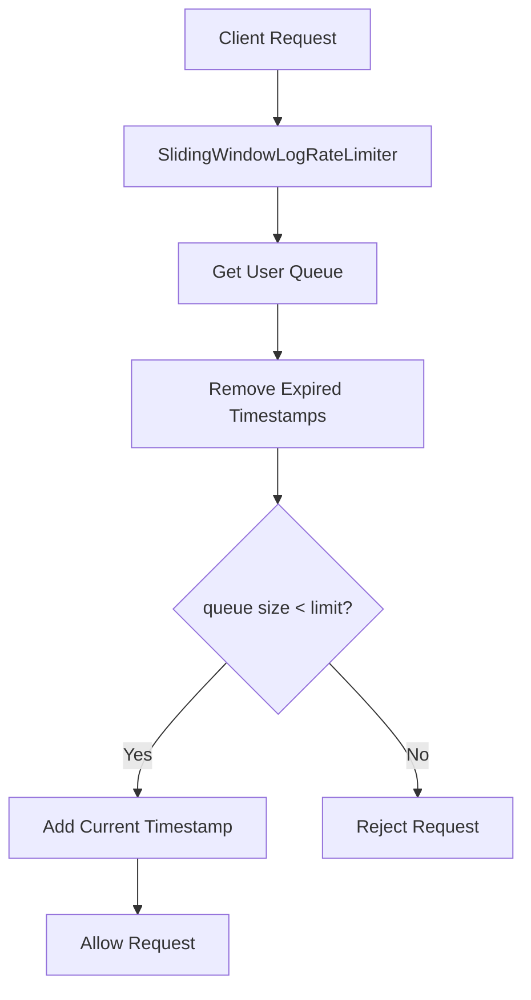
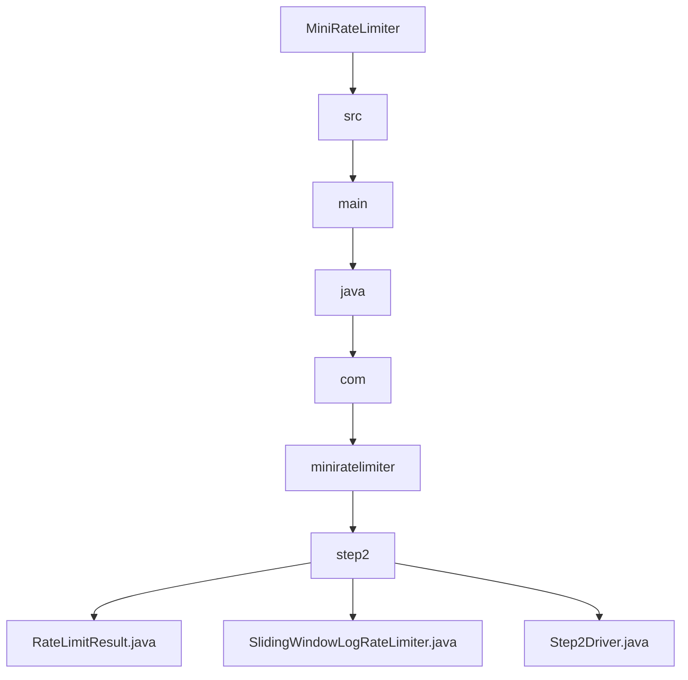

# 002_Sliding_Window_Log

# MiniRateLimiter Step 2 — Sliding Window Log

## Goal

In Step 1, we built:

```text
Fixed Window Counter
```

Problem:

```text
Boundary burst issue
```

Example:

```text
5 requests at 00:59
5 requests at 01:00
```

Limiter allows:

```text
10 requests in 2 seconds
```

Now we solve this using:

```text
Sliding Window Log
```

Instead of storing counters by fixed bucket:

```text
userId:windowId -> count
```

we store exact request timestamps:

```text
userId -> queue of timestamps
```

---

# Delta From Step 1

```text
Step 1:
Stored request count per fixed bucket.

Step 2:
Store exact request timestamps.
Remove old timestamps dynamically.
```

Main change:

```text
HashMap<String, Integer>
        ->
HashMap<String, Deque<Long>>
```

---

# Big Picture

```text
Request arrives
      |
      v
Get queue for user
      |
      v
Remove old timestamps
      |
      v
Check queue size
      |
      +--> size < limit  -> allow
      |
      +--> size >= limit -> reject
```

---

# Sliding Window Idea

Suppose:

```text
Limit = 5 requests
Window = 60 seconds
```

At time:

```text
70 seconds
```

We only keep timestamps newer than:

```text
70 - 60 = 10 seconds
```

Everything older than 10 seconds is removed.

---

# Architecture Mermaid Diagram



---

# Sliding Window Visualization

```text
Current Time = 70s
Window Size = 60s

Keep timestamps newer than:
70 - 60 = 10s
```

Queue before cleanup:

```text
[5, 8, 12, 20, 40, 65]
```

Remove old timestamps:

```text
remove 5
remove 8
```

Queue after cleanup:

```text
[12, 20, 40, 65]
```

Now queue size:

```text
4
```

New request allowed.

---

# Why Queue / Deque?

We always:

```text
remove oldest timestamp
add newest timestamp
```

This is perfect for:

```text
Deque
```

Operations:

```text
addLast()
removeFirst()
peekFirst()
```

All are:

```text
O(1)
```

---

# Detailed Steps Before Code

## Step 1 — Store queue per user

Instead of:

```java
Map<String, Integer>
```

Now:

```java
Map<String, Deque<Long>>
```

Each user has request timestamp queue.

---

## Step 2 — Remove expired timestamps

Before checking limit:

```java
while (
    !queue.isEmpty() &&
    queue.peekFirst() <= currentTime - window
)
```

remove expired timestamps.

---

## Step 3 — Check active request count

Queue size means:

```text
number of requests in active sliding window
```

---

## Step 4 — Allow or reject

If:

```text
queue.size() < limit
```

allow request.

Else:

```text
reject request.
```

---

## Step 5 — Add current timestamp

If request allowed:

```java
queue.addLast(currentTime)
```

---

# CP/DSA Concepts Used

## 1. Sliding Window Technique

This is literally the sliding window pattern.

We continuously:

```text
expand window
remove expired elements
maintain valid range
```

Same as CP problems:

```text
longest subarray
window maximum
distinct elements in window
```

---

## 2. Queue / Deque

We need:

```text
FIFO behavior
```

Oldest timestamp removed first.

Perfect for:

```java
Deque<Long>
```

---

## 3. Lazy Deletion

We remove expired timestamps only when new request arrives.

This is called:

```text
lazy cleanup
```

---

## 4. Amortized Complexity

Each timestamp:

```text
added once
removed once
```

So total complexity:

```text
O(n)
```

for n requests.

Average per request:

```text
O(1)
```

---

# Time Complexity

For each request:

```text
Amortized O(1)
```

Because:

```text
each timestamp removed only once
```

---

# Space Complexity

Worst case:

```text
O(limit * active users)
```

Because queue stores request timestamps.

---

# Fixed Window vs Sliding Window

| Feature | Fixed Window | Sliding Window Log |
|---|---|---|
| Accuracy | Low | High |
| Boundary burst | Yes | No |
| Memory | Small | Larger |
| Complexity | Easy | Medium |
| Real-world usage | Sometimes | Common |

---

# Folder Structure

```text
MiniRateLimiter/
└── src/main/java/com/miniratelimiter/step2/
    ├── RateLimitResult.java
    ├── SlidingWindowLogRateLimiter.java
    └── Step2Driver.java
```

---

# Folder Mermaid Diagram



---

# Complete Java Code

---

# RateLimitResult.java

```java
package com.miniratelimiter.step2;

public class RateLimitResult {

    // True if request is allowed.
    private final boolean allowed;

    // Maximum allowed requests.
    private final int limit;

    // Active requests inside sliding window.
    private final int currentCount;

    // Remaining allowed requests.
    private final int remaining;

    public RateLimitResult(
            boolean allowed,
            int limit,
            int currentCount,
            int remaining
    ) {

        this.allowed = allowed;
        this.limit = limit;
        this.currentCount = currentCount;
        this.remaining = remaining;
    }

    public boolean isAllowed() {
        return allowed;
    }

    public int getLimit() {
        return limit;
    }

    public int getCurrentCount() {
        return currentCount;
    }

    public int getRemaining() {
        return remaining;
    }

    @Override
    public String toString() {
        return "RateLimitResult{" +
                "allowed=" + allowed +
                ", limit=" + limit +
                ", currentCount=" + currentCount +
                ", remaining=" + remaining +
                '}';
    }
}
```

---

# SlidingWindowLogRateLimiter.java

```java
package com.miniratelimiter.step2;

import java.util.ArrayDeque;
import java.util.Deque;
import java.util.HashMap;
import java.util.Map;

public class SlidingWindowLogRateLimiter {

    // Maximum allowed requests in sliding window.
    private final int limit;

    // Sliding window size in milliseconds.
    private final long windowSizeMillis;

    // userId -> queue of request timestamps
    //
    // Example:
    // user-1 -> [1000, 2000, 4000]
    private final Map<String, Deque<Long>> requestLogs;

    public SlidingWindowLogRateLimiter(
            int limit,
            long windowSizeMillis
    ) {

        // Validate limit.
        if (limit <= 0) {
            throw new IllegalArgumentException(
                    "limit must be > 0"
            );
        }

        // Validate window size.
        if (windowSizeMillis <= 0) {
            throw new IllegalArgumentException(
                    "windowSizeMillis must be > 0"
            );
        }

        this.limit = limit;
        this.windowSizeMillis = windowSizeMillis;

        // Initialize request log store.
        this.requestLogs = new HashMap<>();
    }

    public RateLimitResult allowRequest(
            String userId,
            long currentTimeMillis
    ) {

        // Get request queue for user.
        //
        // computeIfAbsent:
        // create queue only if missing.
        Deque<Long> requestQueue =
                requestLogs.computeIfAbsent(
                        userId,
                        key -> new ArrayDeque<>()
                );

        // Remove expired timestamps.
        cleanupExpiredRequests(requestQueue, currentTimeMillis);

        // Current active requests.
        int currentCount = requestQueue.size();

        // Reject if limit exceeded.
        if (currentCount >= limit) {

            return new RateLimitResult(
                    false,
                    limit,
                    currentCount,
                    0
            );
        }

        // Add current request timestamp.
        requestQueue.addLast(currentTimeMillis);

        int newCount = requestQueue.size();

        int remaining =
                Math.max(0, limit - newCount);

        // Request allowed.
        return new RateLimitResult(
                true,
                limit,
                newCount,
                remaining
        );
    }

    private void cleanupExpiredRequests(
            Deque<Long> requestQueue,
            long currentTimeMillis
    ) {

        // Remove timestamps older than:
        // currentTime - windowSize
        long windowStartTime =
                currentTimeMillis - windowSizeMillis;

        // Sliding window cleanup.
        while (
                !requestQueue.isEmpty() &&
                requestQueue.peekFirst() <= windowStartTime
        ) {

            // Remove oldest timestamp.
            requestQueue.removeFirst();
        }
    }

    public Map<String, Deque<Long>> getRequestLogsSnapshot() {

        // Return defensive copy.
        return new HashMap<>(requestLogs);
    }
}
```

---

# Step2Driver.java

```java
package com.miniratelimiter.step2;

public class Step2Driver {

    public static void main(String[] args) {

        // Allow max 5 requests.
        int limit = 5;

        // Sliding window = 60 seconds.
        long windowSizeMillis = 60_000;

        // Create sliding window limiter.
        SlidingWindowLogRateLimiter rateLimiter =
                new SlidingWindowLogRateLimiter(limit, windowSizeMillis);

        String userId = "user-1";

        System.out.println(
                "---- REQUESTS INSIDE WINDOW ----"
        );

        // Simulated timestamps.
        long[] timestamps = {
                1_000,
                5_000,
                10_000,
                20_000,
                30_000,
                40_000,
                50_000
        };

        // Process requests.
        for (int i = 0; i < timestamps.length; i++) {

            long timestamp = timestamps[i];

            RateLimitResult result =
                    rateLimiter.allowRequest(userId, timestamp);

            System.out.println(
                    "request=" + (i + 1) +
                    ", time=" + timestamp +
                    ", result=" + result
            );
        }

        System.out.println();

        System.out.println(
                "---- AFTER WINDOW MOVES ----"
        );

        // Old timestamps should expire now.
        long nextTimestamp = 70_000;

        RateLimitResult result =
                rateLimiter.allowRequest(userId, nextTimestamp);

        System.out.println(
                "time=" + nextTimestamp +
                ", result=" + result
        );

        System.out.println();

        System.out.println(
                "---- REQUEST LOG SNAPSHOT ----"
        );

        System.out.println(
                rateLimiter.getRequestLogsSnapshot()
        );
    }
}
```

---

# CP/DSA Pattern Code

## Problem

Given request timestamps:

```text
[1, 5, 10, 20, 65, 70]
```

Allow maximum:

```text
3 requests per 60 seconds
```

Use sliding window.

---

## DSA/CP Java Code

```java
import java.util.ArrayDeque;
import java.util.Deque;

public class SlidingWindowCP {

    public static void main(String[] args) {

        int limit = 3;

        long windowSize = 60;

        long[] requests = {
                1,
                5,
                10,
                20,
                65,
                70
        };

        // Sliding window queue.
        Deque<Long> window = new ArrayDeque<>();

        for (long currentTime : requests) {

            // Remove expired timestamps.
            while (
                    !window.isEmpty() &&
                    window.peekFirst() <= currentTime - windowSize
            ) {

                window.removeFirst();
            }

            // Check limit.
            boolean allowed = window.size() < limit;

            if (allowed) {

                // Add request into active window.
                window.addLast(currentTime);
            }

            System.out.println(
                    "time=" + currentTime +
                    ", window=" + window +
                    ", allowed=" + allowed
            );
        }
    }
}
```

---

# Dry Run

Policy:

```text
limit = 5
window = 60 seconds
```

Requests:

```text
1s
5s
10s
20s
30s
40s
```

Queue becomes:

```text
[1, 5, 10, 20, 30]
```

At request:

```text
40s
```

Queue size:

```text
5
```

Limit reached.

Request rejected.

At request:

```text
70s
```

Cleanup:

```text
remove 1
remove 5
```

Queue becomes:

```text
[10, 20, 30]
```

New request allowed.

---

# Run Command

```bash
javac -d out src/main/java/com/miniratelimiter/step2/*.java

java -cp out com.miniratelimiter.step2.Step2Driver
```

---

# Expected Output Pattern

```text
request=1, time=1000, result=allowed=true
request=2, time=5000, result=allowed=true
request=3, time=10000, result=allowed=true
request=4, time=20000, result=allowed=true
request=5, time=30000, result=allowed=true
request=6, time=40000, result=allowed=false
```

---

# Important Observation

Sliding window is more accurate than fixed window.

But memory usage is higher because we store:

```text
every request timestamp
```

For very high traffic systems:

```text
millions of timestamps
```

This becomes expensive.

That is why later we build:

```text
Sliding Window Counter
Token Bucket
```

which use less memory.

---

# Current MiniRateLimiter State

```text
Supported:
[yes] exact sliding window
[yes] queue/deque cleanup
[yes] lazy expiration
[yes] accurate request counting
[yes] per-user request log

Not yet:
[no] optimized memory usage
[no] token bucket
[no] concurrency safety
[no] distributed Redis store
[no] Spring Boot integration
```

---

# Step 2 Completion Checklist

```text
[ ] You understand sliding window
[ ] You understand deque cleanup
[ ] You understand expired timestamp removal
[ ] You understand amortized O(1)
[ ] You understand lazy cleanup
[ ] You understand why sliding window is more accurate
```

---

# Final Mental Model

```text
Sliding Window Log =
queue of active timestamps
```

```text
userId -> deque of timestamps
```

---

# Next Step

Next we build:

```text
003_Sliding_Window_Counter
```

Instead of storing every timestamp, we will approximate sliding window using:

```text
current bucket + previous bucket weight
```

This reduces memory usage significantly.
