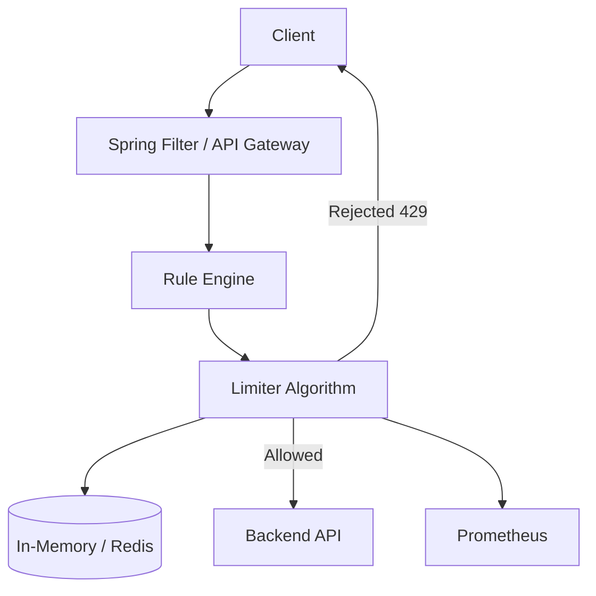

# MiniRateLimiter — Production Kafka-Style + DSA/CP Roadmap

This roadmap is written like your MiniKafka notes:

- Deep phase-by-phase learning
- Production features
- Java complete code
- Driver class in every phase
- Diagrams
- Dry runs
- Delta from previous step
- DSA/CP mapping in every phase

---

# Production Feature Roadmap

| Phase | File | Production Feature | DSA/CP Concept |
|---|---|---|---|
| 001 | `001_Fixed_Window_Counter.md` | Basic fixed window counter | HashMap frequency counting |
| 002 | `002_Thread_Safe_Fixed_Window.md` | Thread-safe in-memory limiter | Atomic counter / concurrency |
| 003 | `003_RateLimitDecision_Metadata.md` | Response metadata for 429 | State object / simulation |
| 004 | `004_Per_User_Per_API_Key.md` | Composite key per user + API | State encoding |
| 005 | `005_Cleanup_Expired_Windows.md` | Cleanup old windows | Eviction / sweep |
| 006 | `006_Sliding_Window_Log.md` | Accurate rolling window | Deque sliding window |
| 007 | `007_Token_Bucket.md` | Burst-friendly limiter | Greedy refill simulation |
| 008 | `008_Rule_Engine.md` | Configurable rules | Map lookup / matching |
| 009 | `009_Spring_Boot_Filter.md` | HTTP integration | Pipeline / middleware |
| 010 | `010_Redis_Distributed_Fixed_Window.md` | Distributed fixed window | Shared counter / atomicity |
| 011 | `011_Redis_Token_Bucket_Lua.md` | Atomic Redis token bucket | Critical section |
| 012 | `012_Multi_Level_Rate_Limiter.md` | Global + IP + User + API | AND composition |
| 013 | `013_Observability_Load_Testing.md` | Metrics + k6 | Counting + aggregation |
| 014 | `014_Production_Hardening_Checklist.md` | Final production checklist | System design synthesis |

---

# Final Architecture



---

# Why DSA/CP Is Included

Rate limiter is not only backend.

It uses real DSA ideas:

```text
HashMap counting
sliding window
deque
greedy refill
simulation
state compression
atomic counters
eviction sweep
multi-condition composition
```

So each phase has:

```text
DSA pattern
CP analogy
complexity
practice problem idea
```
