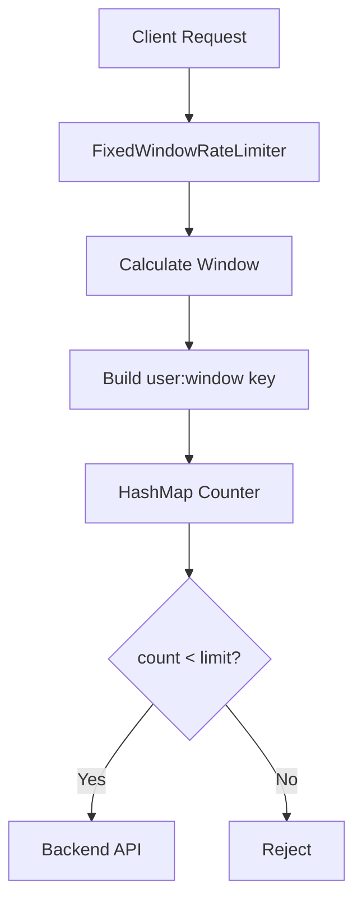

# 001 — Fixed Window Counter

---

# 1. Goal

Build the simplest rate limiter.

```text
Allow only N requests per user in a fixed time window.
```

Example:

```text
limit = 5 requests
window = 10 seconds
```

Then:

```text
request 1 -> allowed
request 2 -> allowed
request 3 -> allowed
request 4 -> allowed
request 5 -> allowed
request 6 -> rejected
```

---

# 2. Production Feature Added

This is the baseline production idea:

```text
count requests per time bucket
```

Real systems use this idea in:

```text
API Gateway
login protection
OTP protection
payment API protection
tenant quota protection
```

---

# 3. Delta From Previous Phase

```text
No previous phase.
```

This phase introduces:

```text
HashMap counter
time bucket
user-based key
allow/reject logic
complete Java driver
```

---

# 4. Mental Model

Imagine a table:

```text
Window 100
----------
alice -> 3
bob   -> 1

Window 101
----------
alice -> 5
bob   -> 2
```

When Alice sends a request:

```text
1. Find current window
2. Find Alice's count in that window
3. If count < limit, increment and allow
4. Else reject
```

---

# 5. Window Formula

```text
windowId = currentTimeMillis / windowSizeMillis
```

Example:

```text
currentTimeMillis = 1716200012345
windowSizeMillis  = 10000

windowId = 171620001
```

All requests inside same 10-second block get same `windowId`.

---

# 6. Key Design

```text
key = userId + ":" + windowId
```

Example:

```text
alice:171620001 -> 4
bob:171620001   -> 2
```

---

# 7. Architecture Diagram



---

# 8. Request Flow

```text
Request comes
↓
currentTimeMillis
↓
windowId = currentTimeMillis / windowSizeMillis
↓
key = userId + ":" + windowId
↓
count = map.getOrDefault(key, 0)
↓
if count >= limit reject
else increment and allow
```

---

# 9. Folder Structure

```text
src/
└── com/miniratelimiter/
    ├── limiter/
    │   └── FixedWindowRateLimiter.java
    └── driver/
        └── Driver.java
```

---

# 10. Complete Java Code

## `src/com/miniratelimiter/limiter/FixedWindowRateLimiter.java`

```java
package com.miniratelimiter.limiter;

import java.util.HashMap;
import java.util.Map;

public class FixedWindowRateLimiter {

    /*
     * Phase 001:
     * Basic fixed window counter.
     *
     * Production warning:
     * This version is NOT thread safe.
     * Phase 002 fixes that.
     */

    private final int limit;
    private final long windowSizeMillis;

    private final Map<String, Integer> counters = new HashMap<>();

    public FixedWindowRateLimiter(int limit, long windowSizeMillis) {
        if (limit <= 0) {
            throw new IllegalArgumentException("limit must be positive");
        }

        if (windowSizeMillis <= 0) {
            throw new IllegalArgumentException("windowSizeMillis must be positive");
        }

        this.limit = limit;
        this.windowSizeMillis = windowSizeMillis;
    }

    public boolean allowRequest(String userId) {
        long nowMillis = System.currentTimeMillis();

        long windowId = nowMillis / windowSizeMillis;

        String key = userId + ":" + windowId;

        int currentCount = counters.getOrDefault(key, 0);

        if (currentCount >= limit) {
            System.out.println("REJECTED user=" + userId + " count=" + currentCount);
            return false;
        }

        counters.put(key, currentCount + 1);

        System.out.println("ALLOWED user=" + userId + " count=" + (currentCount + 1));
        return true;
    }

    public void printInternalState() {
        System.out.println();
        System.out.println("===== INTERNAL STATE =====");

        for (Map.Entry<String, Integer> entry : counters.entrySet()) {
            System.out.println(entry.getKey() + " -> " + entry.getValue());
        }
    }
}
```

## `src/com/miniratelimiter/driver/Driver.java`

```java
package com.miniratelimiter.driver;

import com.miniratelimiter.limiter.FixedWindowRateLimiter;

public class Driver {

    public static void main(String[] args) throws Exception {
        FixedWindowRateLimiter limiter =
                new FixedWindowRateLimiter(5, 10_000);

        String userId = "alice";

        for (int i = 1; i <= 7; i++) {
            System.out.println();
            System.out.println("Request " + i);
            limiter.allowRequest(userId);
            Thread.sleep(500);
        }

        limiter.printInternalState();
    }
}
```

---

# 11. Dry Run

Configuration:

```text
limit = 5
window = 10 seconds
```

Timeline:

```text
request 1 -> count 0 -> increment to 1 -> allow
request 2 -> count 1 -> increment to 2 -> allow
request 3 -> count 2 -> increment to 3 -> allow
request 4 -> count 3 -> increment to 4 -> allow
request 5 -> count 4 -> increment to 5 -> allow
request 6 -> count 5 -> reject
request 7 -> count 5 -> reject
```

Internal map:

```text
alice:171620001 -> 5
```

---

# 12. Production Problems In This Phase

```text
1. HashMap is not thread safe
2. No response metadata
3. No Retry-After
4. No cleanup of old windows
5. No per-API limit
6. Not distributed
7. Boundary burst problem
```

Boundary burst example:

```text
5 requests at 12:00:09
5 requests at 12:00:10
```

In real time, this is 10 requests in almost 1 second.

Fixed window allows it because window changed.

---

# 13. DSA/CP Mapping

## Pattern

```text
Frequency counting with HashMap
```

## Data Structure

```text
HashMap<String, Integer>
```

## CP Analogy

This is like counting frequency of elements:

```text
arr = [a, b, a, c, a]
freq[a] = 3
```

But here the key is not only user.

It is:

```text
(user, timeWindow)
```

So this is state compression.

## CP Form

```text
state = user + window
count[state]++
```

## Complexity

```text
Time per request: O(1)
Memory: O(number of users × number of active windows)
```

## Practice Problem Idea

Given logs:

```text
timestamp userId
```

Return users who made more than K requests in any 60-second fixed bucket.

This is exactly the same pattern.

---

# 14. Interview Notes

Say:

```text
Fixed window is very fast and simple, but it has boundary burst problem.
It is good for simple quotas but not smooth traffic control.
```

---

# 15. Next Phase

Phase 002 adds:

```text
ConcurrentHashMap
AtomicInteger
thread-safe increments
```

---

# How To Run

```bash
javac -d out $(find src -name "*.java")
java -cp out com.miniratelimiter.driver.Driver
```

Windows PowerShell:

```powershell
Get-ChildItem -Recurse -Filter *.java src | ForEach-Object FullName | javac -d out
java -cp out com.miniratelimiter.driver.Driver
```
