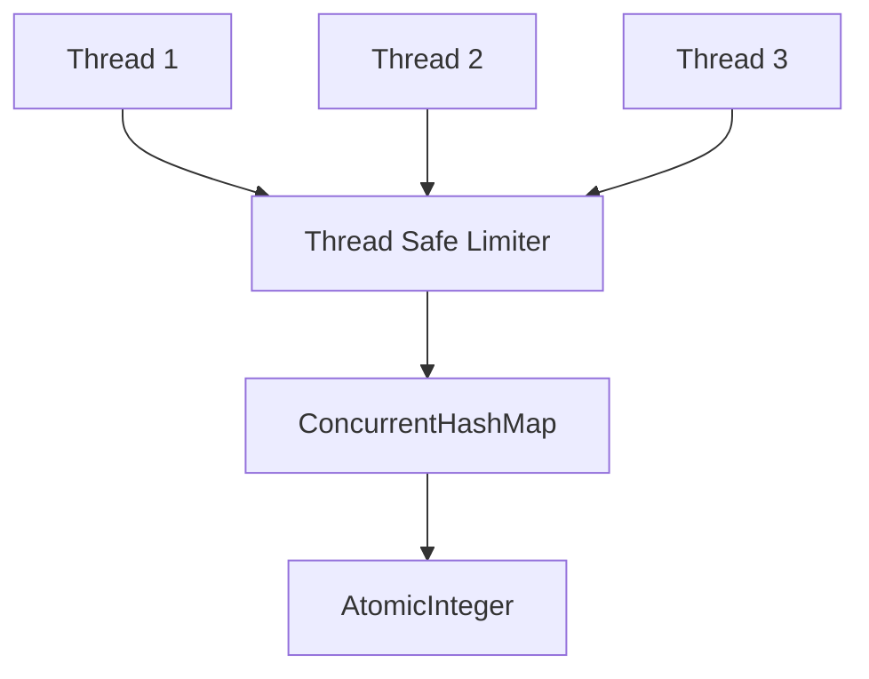

# 002 — Thread Safe Fixed Window

---

# 1. Goal

Make Phase 001 safe when many requests arrive in parallel.

In production, requests are handled by multiple threads.

So this is unsafe:

```java
int count = map.getOrDefault(key, 0);
map.put(key, count + 1);
```

Two threads can read same count and overwrite each other.

---

# 2. Production Feature Added

```text
Thread safety inside one JVM
```

We add:

```text
ConcurrentHashMap
AtomicInteger
atomic increment
```

---

# 3. Delta From Previous Phase

Previous:

```java
HashMap<String, Integer>
```

Now:

```java
ConcurrentHashMap<String, AtomicInteger>
```

Previous increment:

```java
count + 1
```

Now:

```java
counter.incrementAndGet()
```

---

# 4. Race Condition Example

Suppose count is 4 and two requests arrive.

```text
Thread A reads 4
Thread B reads 4
Thread A writes 5
Thread B writes 5
```

Actual requests = 2

Stored increment = 1

Wrong.

With AtomicInteger:

```text
Thread A incrementAndGet -> 5
Thread B incrementAndGet -> 6
```

Correct.

---

# 5. Architecture Diagram



---

# 6. Folder Structure

```text
src/
└── com/miniratelimiter/
    ├── limiter/
    │   └── FixedWindowRateLimiter.java
    └── driver/
        └── Driver.java
```

---

# 7. Complete Java Code

## `FixedWindowRateLimiter.java`

```java
package com.miniratelimiter.limiter;

import java.util.Map;
import java.util.concurrent.ConcurrentHashMap;
import java.util.concurrent.atomic.AtomicInteger;

public class FixedWindowRateLimiter {

    /*
     * Phase 002:
     * Thread safe fixed window counter.
     *
     * Delta from Phase 001:
     * HashMap<Integer> -> ConcurrentHashMap<AtomicInteger>
     */

    private final int limit;
    private final long windowSizeMillis;

    private final ConcurrentHashMap<String, AtomicInteger> counters =
            new ConcurrentHashMap<>();

    public FixedWindowRateLimiter(int limit, long windowSizeMillis) {
        if (limit <= 0) {
            throw new IllegalArgumentException("limit must be positive");
        }

        if (windowSizeMillis <= 0) {
            throw new IllegalArgumentException("windowSizeMillis must be positive");
        }

        this.limit = limit;
        this.windowSizeMillis = windowSizeMillis;
    }

    public boolean allowRequest(String userId) {
        long nowMillis = System.currentTimeMillis();
        long windowId = nowMillis / windowSizeMillis;
        String key = userId + ":" + windowId;

        AtomicInteger counter = counters.computeIfAbsent(
                key,
                ignored -> new AtomicInteger(0)
        );

        int newCount = counter.incrementAndGet();

        if (newCount <= limit) {
            System.out.println("ALLOWED user=" + userId + " count=" + newCount);
            return true;
        }

        System.out.println("REJECTED user=" + userId + " count=" + newCount);
        return false;
    }

    public void printInternalState() {
        System.out.println();
        System.out.println("===== INTERNAL STATE =====");

        for (Map.Entry<String, AtomicInteger> entry : counters.entrySet()) {
            System.out.println(entry.getKey() + " -> " + entry.getValue().get());
        }
    }
}
```

## `Driver.java`

```java
package com.miniratelimiter.driver;

import com.miniratelimiter.limiter.FixedWindowRateLimiter;

import java.util.ArrayList;
import java.util.List;

public class Driver {

    public static void main(String[] args) throws Exception {
        FixedWindowRateLimiter limiter =
                new FixedWindowRateLimiter(5, 10_000);

        String userId = "alice";

        List<Thread> threads = new ArrayList<>();

        for (int i = 1; i <= 20; i++) {
            Thread thread = new Thread(() -> limiter.allowRequest(userId));
            threads.add(thread);
            thread.start();
        }

        for (Thread thread : threads) {
            thread.join();
        }

        limiter.printInternalState();
    }
}
```

---

# 8. Dry Run With Threads

```text
limit = 5
threads = 20
```

Possible result:

```text
5 allowed
15 rejected
```

Internal counter may show:

```text
alice:window -> 20
```

Why 20?

Because this version increments even rejected requests.

That is okay if you want to track abuse pressure.

Later we can use CAS to increment only accepted requests.

---

# 9. Production Notes

## Good

```text
safe inside one JVM
fast
simple
```

## Still Missing

```text
not distributed
no metadata
no retry-after
old keys remain
boundary burst still exists
```

---

# 10. DSA/CP Mapping

## Pattern

```text
Frequency counting under concurrent updates
```

## Data Structure

```text
ConcurrentHashMap + AtomicInteger
```

## CP Analogy

In CP, you usually assume single-thread execution:

```cpp
freq[x]++;
```

In production Java, multiple threads do the same operation.

So the equivalent production problem is:

```text
How to make freq[x]++ safe when many threads update it?
```

## Concept Link

```text
Atomic operation = indivisible operation
```

This is like treating increment as one operation instead of:

```text
read
add
write
```

## Complexity

```text
Average time: O(1)
Memory: O(active keys)
```

## Practice Problem Idea

Simulate 1000 parallel updates to a counter and compare:

```text
HashMap + Integer
vs
ConcurrentHashMap + AtomicInteger
```

---

# 11. Interview Notes

Say:

```text
In one JVM, I can use ConcurrentHashMap and AtomicInteger.
But in multi-instance deployment, this is not enough because each instance has its own memory.
```

---

# 12. Next Phase

Phase 003 adds:

```text
RateLimitDecision object
remaining count
retry after
reset time
HTTP 429 metadata
```

---

# How To Run

```bash
javac -d out $(find src -name "*.java")
java -cp out com.miniratelimiter.driver.Driver
```

Windows PowerShell:

```powershell
Get-ChildItem -Recurse -Filter *.java src | ForEach-Object FullName | javac -d out
java -cp out com.miniratelimiter.driver.Driver
```
