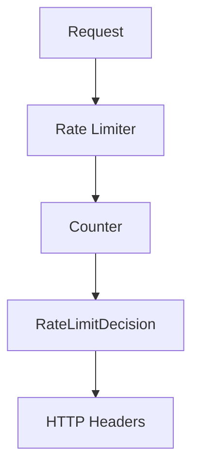

# 003 — RateLimitDecision Metadata

---

# 1. Goal

Change the limiter from returning only:

```java
boolean
```

to returning a production response object:

```java
RateLimitDecision
```

This object tells:

```text
allowed?
limit
remaining
retryAfterMillis
resetAtMillis
reason
```

---

# 2. Production Feature Added

```text
HTTP 429 response metadata
```

Real APIs should return headers:

```http
X-RateLimit-Limit: 5
X-RateLimit-Remaining: 0
X-RateLimit-Reset: 1716200010000
Retry-After: 7
```

---

# 3. Delta From Previous Phase

Previous method:

```java
boolean allowRequest(String userId)
```

Now:

```java
RateLimitDecision allowRequest(String userId)
```

Previous output:

```text
true / false
```

Now output:

```text
allowed=true, remaining=3, resetAtMillis=...
```

---

# 4. Architecture



---

# 5. Folder Structure

```text
src/
└── com/miniratelimiter/
    ├── core/
    │   └── RateLimitDecision.java
    ├── limiter/
    │   └── FixedWindowRateLimiter.java
    └── driver/
        └── Driver.java
```

---

# 6. Complete Java Code

## `RateLimitDecision.java`

```java
package com.miniratelimiter.core;

public class RateLimitDecision {

    private final boolean allowed;
    private final int limit;
    private final int remaining;
    private final long retryAfterMillis;
    private final long resetAtMillis;
    private final String reason;

    public RateLimitDecision(
            boolean allowed,
            int limit,
            int remaining,
            long retryAfterMillis,
            long resetAtMillis,
            String reason
    ) {
        this.allowed = allowed;
        this.limit = limit;
        this.remaining = remaining;
        this.retryAfterMillis = retryAfterMillis;
        this.resetAtMillis = resetAtMillis;
        this.reason = reason;
    }

    public boolean isAllowed() {
        return allowed;
    }

    public int getLimit() {
        return limit;
    }

    public int getRemaining() {
        return remaining;
    }

    public long getRetryAfterMillis() {
        return retryAfterMillis;
    }

    public long getResetAtMillis() {
        return resetAtMillis;
    }

    public String getReason() {
        return reason;
    }

    @Override
    public String toString() {
        return "RateLimitDecision{" +
                "allowed=" + allowed +
                ", limit=" + limit +
                ", remaining=" + remaining +
                ", retryAfterMillis=" + retryAfterMillis +
                ", resetAtMillis=" + resetAtMillis +
                ", reason='" + reason + '\'' +
                '}';
    }
}
```

## `FixedWindowRateLimiter.java`

```java
package com.miniratelimiter.limiter;

import com.miniratelimiter.core.RateLimitDecision;

import java.util.concurrent.ConcurrentHashMap;
import java.util.concurrent.atomic.AtomicInteger;

public class FixedWindowRateLimiter {

    private final int limit;
    private final long windowSizeMillis;

    private final ConcurrentHashMap<String, AtomicInteger> counters =
            new ConcurrentHashMap<>();

    public FixedWindowRateLimiter(int limit, long windowSizeMillis) {
        this.limit = limit;
        this.windowSizeMillis = windowSizeMillis;
    }

    public RateLimitDecision allowRequest(String userId) {
        long nowMillis = System.currentTimeMillis();

        long windowId = nowMillis / windowSizeMillis;
        long windowStartMillis = windowId * windowSizeMillis;
        long resetAtMillis = windowStartMillis + windowSizeMillis;

        String key = userId + ":" + windowId;

        AtomicInteger counter = counters.computeIfAbsent(
                key,
                ignored -> new AtomicInteger(0)
        );

        int newCount = counter.incrementAndGet();

        if (newCount <= limit) {
            int remaining = limit - newCount;

            return new RateLimitDecision(
                    true,
                    limit,
                    remaining,
                    0,
                    resetAtMillis,
                    "allowed"
            );
        }

        long retryAfterMillis = Math.max(0, resetAtMillis - nowMillis);

        return new RateLimitDecision(
                false,
                limit,
                0,
                retryAfterMillis,
                resetAtMillis,
                "fixed window limit reached"
        );
    }
}
```

## `Driver.java`

```java
package com.miniratelimiter.driver;

import com.miniratelimiter.core.RateLimitDecision;
import com.miniratelimiter.limiter.FixedWindowRateLimiter;

public class Driver {

    public static void main(String[] args) throws Exception {
        FixedWindowRateLimiter limiter =
                new FixedWindowRateLimiter(5, 10_000);

        for (int i = 1; i <= 7; i++) {
            RateLimitDecision decision = limiter.allowRequest("alice");
            System.out.println("request=" + i + " " + decision);
            Thread.sleep(500);
        }
    }
}
```

---

# 7. Dry Run

```text
limit = 5
window = 10 seconds
```

```text
request 1 -> allowed=true  remaining=4
request 2 -> allowed=true  remaining=3
request 3 -> allowed=true  remaining=2
request 4 -> allowed=true  remaining=1
request 5 -> allowed=true  remaining=0
request 6 -> allowed=false retryAfterMillis ~= time until window reset
```

---

# 8. Header Mapping

```text
decision.limit            -> X-RateLimit-Limit
decision.remaining        -> X-RateLimit-Remaining
decision.resetAtMillis    -> X-RateLimit-Reset
decision.retryAfterMillis -> Retry-After
```

---

# 9. DSA/CP Mapping

## Pattern

```text
Simulation with state object
```

## CP Analogy

Many CP problems ask you to simulate a process and return more than yes/no.

Example:

```text
Can serve request?
If not, when can serve next?
How many slots remain?
```

That is exactly:

```text
allowed
remaining
retryAfter
```

## State Variables

```text
count
limit
windowStart
resetAt
remaining
```

## Complexity

```text
O(1) per request
```

## Practice Problem Idea

Given user logs and limit K per bucket, output:

```text
ALLOW/REJECT
remaining quota
next reset time
```

---

# 10. Interview Notes

Say:

```text
A production limiter should not only return true/false.
It should return metadata so the gateway can emit rate limit headers.
```

---

# 11. Next Phase

Phase 004 adds:

```text
per user + per API key
```

---

# How To Run

```bash
javac -d out $(find src -name "*.java")
java -cp out com.miniratelimiter.driver.Driver
```

Windows PowerShell:

```powershell
Get-ChildItem -Recurse -Filter *.java src | ForEach-Object FullName | javac -d out
java -cp out com.miniratelimiter.driver.Driver
```
