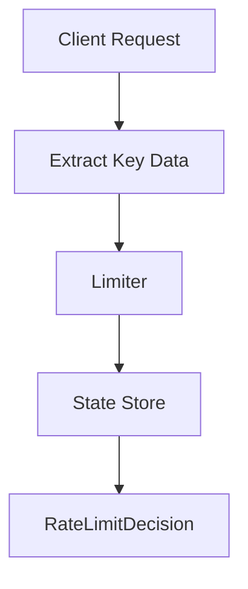

# 004 — Per User Per API Key

---

# 1. Goal

Support different counters per user and per endpoint, for example alice:/payment and alice:/search.

---

# 2. Production Feature Added

```text
Support different counters per user and per endpoint, for example alice:/payment and alice:/search.
```

---

# 3. Delta From Previous Phase

```text
Key changed from userId:windowId to userId:api:windowId. Added RateLimitKey and RateLimitRule.
```

---

# 4. Architecture Diagram



---

# 5. Internal Flow

```text
request arrives
↓
extract identity and endpoint
↓
calculate algorithm state
↓
check limit
↓
return production decision
```

---

# 6. Complete Java Code


## `RateLimitRule.java`

```java
package com.miniratelimiter.config;

import java.time.Duration;

public class RateLimitRule {
    private final int limit;
    private final Duration window;

    public RateLimitRule(int limit, Duration window) {
        if (limit <= 0) throw new IllegalArgumentException("limit must be positive");
        if (window == null || window.isZero() || window.isNegative()) {
            throw new IllegalArgumentException("window must be positive");
        }
        this.limit = limit;
        this.window = window;
    }

    public int getLimit() { return limit; }
    public Duration getWindow() { return window; }
}
```

## `RateLimitKey.java`

```java
package com.miniratelimiter.core;

import java.util.Objects;

public class RateLimitKey {
    private final String userId;
    private final String api;
    private final long windowId;

    public RateLimitKey(String userId, String api, long windowId) {
        this.userId = userId;
        this.api = api;
        this.windowId = windowId;
    }

    public long getWindowId() { return windowId; }

    @Override
    public boolean equals(Object o) {
        if (this == o) return true;
        if (!(o instanceof RateLimitKey)) return false;
        RateLimitKey that = (RateLimitKey) o;
        return windowId == that.windowId &&
                Objects.equals(userId, that.userId) &&
                Objects.equals(api, that.api);
    }

    @Override
    public int hashCode() {
        return Objects.hash(userId, api, windowId);
    }

    @Override
    public String toString() {
        return userId + ":" + api + ":" + windowId;
    }
}
```

## `RateLimitDecision.java`

```java
package com.miniratelimiter.core;

public class RateLimitDecision {
    private final boolean allowed;
    private final int limit;
    private final int remaining;
    private final long retryAfterMillis;
    private final long resetAtMillis;
    private final String reason;

    public RateLimitDecision(boolean allowed, int limit, int remaining,
                             long retryAfterMillis, long resetAtMillis, String reason) {
        this.allowed = allowed;
        this.limit = limit;
        this.remaining = remaining;
        this.retryAfterMillis = retryAfterMillis;
        this.resetAtMillis = resetAtMillis;
        this.reason = reason;
    }

    @Override
    public String toString() {
        return "RateLimitDecision{" +
                "allowed=" + allowed +
                ", limit=" + limit +
                ", remaining=" + remaining +
                ", retryAfterMillis=" + retryAfterMillis +
                ", resetAtMillis=" + resetAtMillis +
                ", reason='" + reason + '\'' +
                '}';
    }
}
```

## `FixedWindowRateLimiter.java`

```java
package com.miniratelimiter.limiter;

import com.miniratelimiter.config.RateLimitRule;
import com.miniratelimiter.core.RateLimitDecision;
import com.miniratelimiter.core.RateLimitKey;

import java.time.Clock;
import java.util.concurrent.ConcurrentHashMap;
import java.util.concurrent.atomic.AtomicInteger;

public class FixedWindowRateLimiter {
    private final RateLimitRule rule;
    private final Clock clock;
    private final ConcurrentHashMap<RateLimitKey, AtomicInteger> counters =
            new ConcurrentHashMap<>();

    public FixedWindowRateLimiter(RateLimitRule rule, Clock clock) {
        this.rule = rule;
        this.clock = clock;
    }

    public RateLimitDecision allowRequest(String userId, String api) {
        long now = clock.millis();
        long windowMillis = rule.getWindow().toMillis();
        long windowId = now / windowMillis;
        long resetAt = (windowId + 1) * windowMillis;

        RateLimitKey key = new RateLimitKey(userId, api, windowId);

        AtomicInteger counter = counters.computeIfAbsent(key, k -> new AtomicInteger(0));
        int newCount = counter.incrementAndGet();

        if (newCount <= rule.getLimit()) {
            return new RateLimitDecision(true, rule.getLimit(),
                    rule.getLimit() - newCount, 0, resetAt, "allowed");
        }

        return new RateLimitDecision(false, rule.getLimit(),
                0, resetAt - now, resetAt, "limit reached for " + key);
    }
}
```

## `Driver.java`

```java
package com.miniratelimiter.driver;

import com.miniratelimiter.config.RateLimitRule;
import com.miniratelimiter.limiter.FixedWindowRateLimiter;

import java.time.Clock;
import java.time.Duration;

public class Driver {
    public static void main(String[] args) {
        FixedWindowRateLimiter limiter = new FixedWindowRateLimiter(
                new RateLimitRule(3, Duration.ofSeconds(10)),
                Clock.systemUTC()
        );

        System.out.println(limiter.allowRequest("alice", "/payment"));
        System.out.println(limiter.allowRequest("alice", "/payment"));
        System.out.println(limiter.allowRequest("alice", "/payment"));
        System.out.println(limiter.allowRequest("alice", "/payment"));

        System.out.println(limiter.allowRequest("alice", "/search"));
    }
}
```


---

# 7. DSA/CP Mapping


## Pattern

```text
State encoding / composite key
```

## CP Analogy

Many CP problems require encoding multiple dimensions into one state:

```text
dp[index][mask]
visited[row][col]
dist[node][fuel]
```

Here:

```text
state = userId + api + windowId
```

## Data Structure

```text
HashMap<RateLimitKey, AtomicInteger>
```

## Complexity

```text
O(1) average per request
Memory = O(users × APIs × active windows)
```

## Practice Idea

Given logs `(time, user, endpoint)`, find users exceeding endpoint-specific limits.


---

# 8. Production Notes


This phase is still single-rule. In production, `/payment` and `/search` usually have different rules.
That is added in the rule-engine phase.


---

# 9. Interview Notes

You should be able to explain:

```text
what state is stored
why this feature is production-relevant
what complexity is
what breaks at scale
how Redis/distributed version changes it
```

---

# How To Run

```bash
javac -d out $(find src -name "*.java")
java -cp out com.miniratelimiter.driver.Driver
```

Windows PowerShell:

```powershell
Get-ChildItem -Recurse -Filter *.java src | ForEach-Object FullName | javac -d out
java -cp out com.miniratelimiter.driver.Driver
```
